# The Ninth Circle: LASSO

<br/>
Jiří Fejlek

2025-11-17
<br/>

- [Introduction to LASSO](#introduction-to-lasso)
- [Diabetes dataset](#diabetes-dataset)
  - [LASSO fit](#lasso-fit)
  - [Variability of LASSO
    coefficients](#variability-of-lasso-coefficients)
  - [Post-Selection Inference](#post-selection-inference)
  - [Debiased LASSO](#debiased-lasso)
  - [Adaptive LASSO](#adaptive-lasso)
- [Growth dataset](#growth-dataset)
  - [Adaptive LASSO](#adaptive-lasso-1)
  - [Double-Selection LASSO](#double-selection-lasso)
  - [Double-Selection LASSO
    (partialing-out)](#double-selection-lasso-partialing-out)
- [Lymphoma dataset](#lymphoma-dataset)
  - [Initial exploration](#initial-exploration)
  - [LASSO and adaptive LASSO fit](#lasso-and-adaptive-lasso-fit)
  - [Bootstrap](#bootstrap)
  - [Inference](#inference)
- [Conclusion](#conclusion)
- [References](#references)

<br/> In the final part of our series on statistical modeling, we will
look at penalized regression for *variable selection*. In previous
circles, we avoided selecting predictors based on the dataset itself. We
always emphasized having a model with the maximum number of predictors
supported by the dataset’s effective sample size.

Oftentimes, we do not have the luxury of a carefully chosen, limited set
of predetermined predictors, and we have to deal with a dataset with way
too many candidate predictors. While reducing the number of predictors
based on expert (prior) knowledge is preferable, algorithmic selection
based on the data is possible and, if done properly, not only allows for
better predictions (compared to the unpenalized model, if it is even
estimable), but also enables so-called post-selection inference.

Similarly to the previous circle, we will not focus on a single dataset.
Instead, we will use three. The first dataset is primarily used to
introduce the LASSO and various inference methods. The second dataset
will demonstrate post-selection inference in more detail. The last
dataset is included to demonstrate the application of LASSO when the
number of predictors far exceeds the number of observations. <br/>

## Introduction to LASSO

Let us start with a brief introduction of the LASSO \[1\]. First, let us
assume a linear regression model $Y = X\beta + \beta_0 + \varepsilon$. Let us
denote the number of observations as $N$ and the number of covariates as
$p$. The LASSO estimator for the linear regression is the ordinary least
squares (OLS) estimator with $l_1$-regularization, namely,
$\hat\beta_\mathrm{LASSO} = \mathrm{argmin}_{\beta,\beta_0} \Vert X\beta + \beta_0 Y \Vert^2 + \lambda \Vert\beta\Vert_1$
for some $\lambda > 0$, where $\Vert\beta\Vert_1 = \sum_i |\beta_i|$. 
This minimization is equivalent to the constrained problem minimize: $\Vert X\beta + \beta_0 - Y\Vert^2$ subject to
$\Vert\beta\Vert_1 \leq t$, where $t$ depends on the value of $\lambda$.
We should note that we leave out the intercept $\beta_0$ from the model 
from now on, which, in linear regression (and LASSO), is equivalent to 
assuming that the observed outcomes $y_i$ are centered. 


The $l_1$-regularization has some nice properties that motivate its use.
The resulting optimization is strictly convex when
$\mathrm{rank}(X) = p$, and thus the optimization problem has a unique
solution that can be found via appropriate algorithms. However, even
when $\mathrm{rank}(X) < p$ (most notably in the cases when $p > N$), 
the LASSO can still have unique solution under some conditions (so-called *general position*
\[2\], e.g., provided that $X$ is drawn from a continuous probability
distribution then it is in *general position* almost surely). In
addition, unlike $l_2$-regularization (the so-called ridge regression),
the LASSO provides *sparse* solutions; many of the coefficients in the
solution are usually zero. This means that the LASSO employs both
*shrinkage* (it biases the coefficients downwards to reduce overfitting)
and *selection*.

We should note that discarding predictors based on the data themselves
is always a “slippery slope,” especially for subsequent inference, as we
will discuss later. However, in cases when the number of predictors $p$
is close to $N$ or even greater (consider, for example, a study about
the effect of genes, which easily reach a count of several thousands
considered in the study), one may “bet on sparsity”: \[1\]

<br/> *Use a procedure that does well in sparse problems, since no
procedure does well in dense problems.* <br/>

If $p \gg N$ but the actual model is sparse such that merely $k < N$
have non-zero effect, then these coefficients can still be reasonably
estimated even when the particular predictors are not known a priori. If
the actual model is not sparse, then the number of samples $N$ is simply
too small to allow for accurate estimation of the effects of predictors
using any method.

We established the LASSO estimator for solving linear regression
problems. However, the LASSO can be straightforwardly generalized to the
class of generalized linear models or Cox proportional hazards models
\[1\]. Before we discuss further intricacies of the LASSO, such as its
asymptotic properties and “post-LASSO” inference, let us move to the
first dataset of this project. <br/>

## Diabetes dataset

The first dataset we will use in this project is the diabetes study from
\[3\], which is also used in \[1\] in the chapter on inference for LASSO
regression. However, the text in \[1\] does not show the implementation;
it only shows the results. Thus, it might be helpful to demonstrate how
the aforementioned methods are actually implemented in R.

The dataset contains the following information about 442 patients.

- **age**
- **sex**
- **BMI** - body mass index
- **BP** - average blood pressure
- **S1**-**S6** - blood serum measurements
- **Y** - quantitative measure of disease progression one year after
  baseline <br/>

``` r
library(readr)
diabetes <- read_delim('C:/Users/elini/Desktop/nine circles/diabetes.txt')
head(diabetes)
```

    ## # A tibble: 6 × 11
    ##     AGE   SEX   BMI    BP    S1    S2    S3    S4    S5    S6     Y
    ##   <dbl> <dbl> <dbl> <dbl> <dbl> <dbl> <dbl> <dbl> <dbl> <dbl> <dbl>
    ## 1    59     2  32.1   101   157  93.2    38     4  4.86    87   151
    ## 2    48     1  21.6    87   183 103.     70     3  3.89    69    75
    ## 3    72     2  30.5    93   156  93.6    41     4  4.67    85   141
    ## 4    24     1  25.3    84   198 131.     40     5  4.89    89   206
    ## 5    50     1  23     101   192 125.     52     4  4.29    80   135
    ## 6    23     1  22.6    89   139  64.8    61     2  4.19    68    97

``` r
dim(diabetes)
```

    ## [1] 442  11

### LASSO fit

When using LASSO, we typically standardize the predictors to ensure that
the LASSO solution (and, consequently, the variable selection) does not
depend on their scale. <br/>

``` r
diabetes_std <- as.data.frame(cbind(scale(diabetes[,1:10], center = TRUE, scale = TRUE),diabetes$Y))
colnames(diabetes_std) <- colnames(diabetes)
model_matrix_diab <- as.matrix(diabetes_std[,1:10])
```

<br/> Let us fit the LASSO model (based on ordinary linear regression,
i.e., the Gaussian model) using the *glmnet* package
(<https://cran.r-project.org/web/packages/glmnet/index.html>). The
parameter $\alpha$ corresponds to the general *elastic net* \[1\]
penalty $\lambda((1-\alpha)\Vert\beta\Vert_2^2 + \alpha \Vert\beta\Vert_1)$, i.e.,
we get LASSO for $\alpha = 1$ and the so-called *ridge regression* for
$\alpha = 0$ <br/>

``` r
library(glmnet)
diabetes_lasso <- glmnet(model_matrix_diab,diabetes_std$Y,alpha=1,family='gaussian')
```

<br/> The function *glmnet* actually does not fit a single model. It
fits multiple ones for various values of the parameter $\lambda$. We can
visualize these fits using the *LASSO path*. <br/>

``` r
plot(diabetes_lasso,xvar = 'lambda', label = TRUE)
```

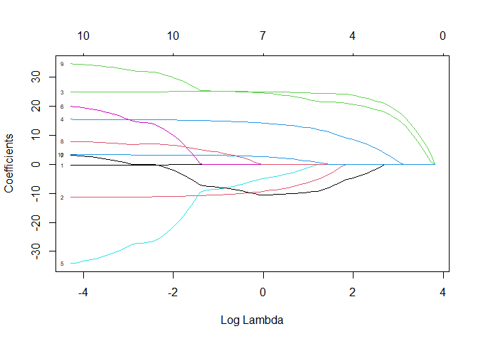<!-- -->

<br/> This plot shows the evolution of the regression coefficients as
the penalization parameter $\lambda$ increases. We observe that, for
sufficiently large penalty, all predictors are dropped from the model.
Since the minimization of the negative log-likelihood with an $l_1$
penalty is equivalent to the minimization of the negative log-likelihood
with a constraint $\Vert\beta\Vert_1 \leq k$, we can use a plot in terms of
varying bound on $\Vert\beta\Vert_1$ instead. <br/>

``` r
plot(diabetes_lasso,xvar = 'norm', label = TRUE)
```

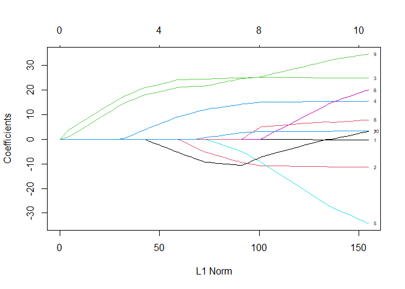<!-- -->

<br/> The question is which value of $\lambda$ should we use. In terms
of fit, *glmnet* evaluates the model using the percentage of explained
deviance (which equals $R^2$ for linear regression). The best model in
this regard is naturally always the one that contains all the variables.
<br/>

``` r
plot(diabetes_lasso,xvar = 'dev', label = TRUE)
```

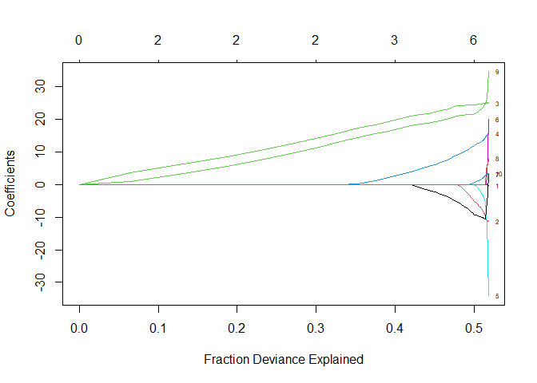<!-- -->

<br/> To have a chance to pick another model, we can choose the
penalization that minimizes the prediction error on the unseen data. As
usual, we estimate the prediction error using the k-fold
cross-validation \[1\]. We do not have to write this cross-validation in
R ourselves. It is implemented in *glmnet* as follows. <br/>

``` r
set.seed(123) 
diabetes_lasso_cv <- cv.glmnet(model_matrix_diab,diabetes_std$Y,alpha=1,family='gaussian',nfolds = 10,type.measure = 'mse')
diabetes_lasso_cv 
```

    ## 
    ## Call:  cv.glmnet(x = model_matrix_diab, y = diabetes_std$Y, type.measure = "mse",      nfolds = 10, alpha = 1, family = "gaussian") 
    ## 
    ## Measure: Mean-Squared Error 
    ## 
    ##     Lambda Index Measure    SE Nonzero
    ## min  0.026    81    3005 224.4      10
    ## 1se  7.710    20    3212 194.1       4

<br/> The *min* row corresponds to the value of $\lambda$ for which the
minimum mean cross-validated error was attained. The second row *1se*
corresponds to the maximum value of $\lambda$ such that its mean
cross-validated error is within one standard error of the minimum. We
can plot the mean cross-validated error as follows. <br/>

``` r
plot(diabetes_lasso_cv)
```

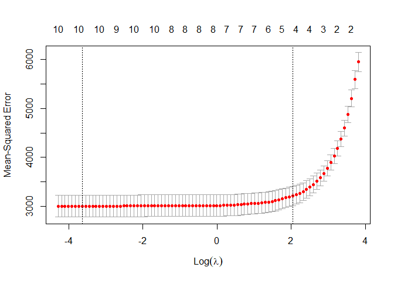<!-- -->

<br/> We observe that the curve is relatively flat, indicating that the
full fit is reasonable (the number of predictors is safely within our
rule-of-thumb guidelines). To illustrate a more pronounced minimum, 
let us consider the model with all interactions. <br/>

``` r
model_matrix_diab_int <- scale(model.matrix(lm(Y~.^2,data = diabetes_std))[,2:56], center = TRUE, scale = TRUE)

set.seed(123)
diabetes_lasso_cv_inter <- cv.glmnet(model_matrix_diab_int,diabetes_std$Y,alpha=1,family='gaussian',nfolds = 10,type.measure = 'mse')
```

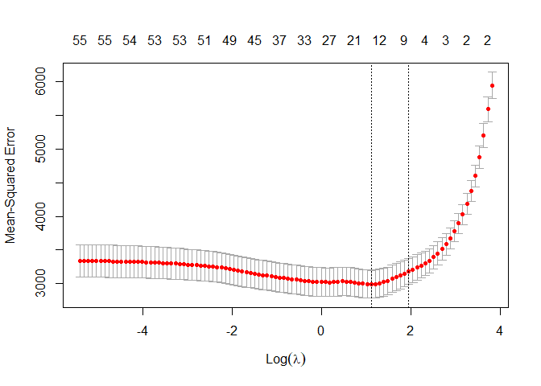<!-- -->

<br/> The model with all main effects and interactions has 56 parameters
(+ the scale parameter), which is much less reasonable for the 442
observations. The cross-validation results confirm that. The penalized
fit attained noticeably lower mean cross-validated error.

Let us return to our original model with no interactions. The
coefficients for the lambda that attained the minimum mean
cross-validation error and “1se” error are as follows. <br/>

``` r
# minimum CV
diabetes_lasso_cv$glmnet.fit$beta[,diabetes_lasso_cv$index[1]]
```

    ##         AGE         SEX         BMI          BP          S1          S2 
    ##  -0.4100544 -11.3576363  24.7957047  15.3826243 -32.0909805  18.3667953 
    ##          S3          S4          S5          S6 
    ##   2.1459142   7.4793593  33.7328045   3.2119561

``` r
# 1se CV
diabetes_lasso_cv$glmnet.fit$beta[,diabetes_lasso_cv$index[2]]
```

    ##       AGE       SEX       BMI        BP        S1        S2        S3        S4 
    ##  0.000000  0.000000 23.496545  8.190540  0.000000  0.000000 -4.499227  0.000000 
    ##        S5        S6 
    ## 20.407201  0.000000

<br/> Let us assess both fits. <br/>

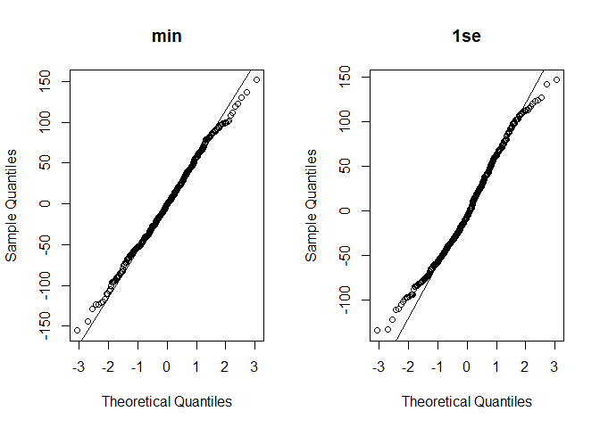<!-- -->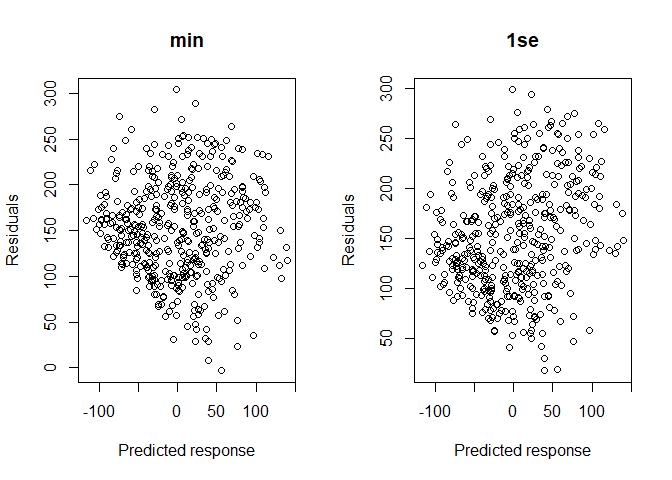<!-- -->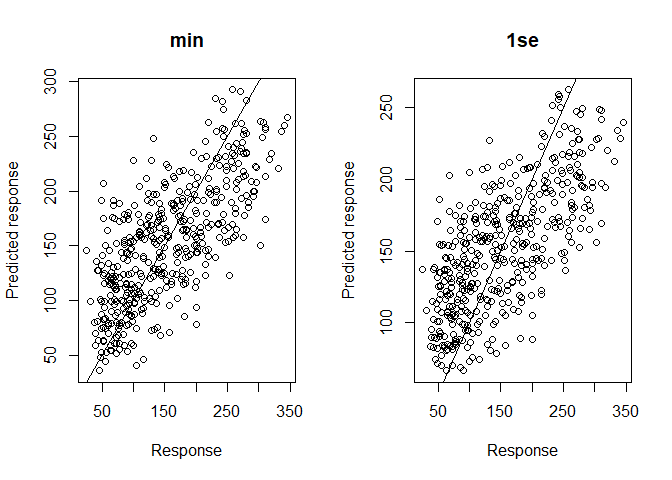<!-- -->

<br/> Both fits seem reasonable. <br/>

### Variability of LASSO coefficients

We have obtained coefficient estimates, but we have no standard errors
or confidence intervals for the estimates. Let us first discuss the
asymptotic properties of LASSO estimates for a bit.

#### Asymptotic properties of LASSO

Provided that $X$ is not singular, the LASSO is consistent when
$\frac{\lambda_N}{N} \rightarrow 0$ and is $\sqrt{N}$-consistent when
$\lambda_N \leq \mathrm{conts}\cdot\sqrt{N}$. Variable selection by the
LASSO is inconsistent for $\lambda_N \leq \mathrm{conts}\cdot\sqrt{N}$
\[4\]. This means that LASSO cannot be both $\sqrt{N}$-consistent and
attain consistent variable selection; however, it can attain consistent
variable selection and be consistent (sub $\sqrt{N}$) provided that the
columns of the model matrix are not too correlated \[5\]. Similar
asymptotic properties can stated be for $p \gg N$ provided that the problem is
sufficiently sparse and the eigenvalues of $X$ are bounded from zero
(consistency) and columns are not too correlated (consistent selection)
\[1\].

There is one important caveat to these consistency theorems. While these
results imply that LASSO can asymptotically provide consistent estimates
and consistent variable selection, these theorems are merely point-wise
for a particular true value $\beta$. The actual convergence will be
extremely dependent on the values of $\beta$ (i.e., how small they are)
and how much the columns of $X$ are correlated. In other words, the
convergence is not uniform (not even locally) \[6\]. In addition,
finite-sample distributions of the parameters are usually far away from
the asymptotic distributions; see \[6\] for some simple examples. This
means that finite-sample estimates are often significantly biased, and the selected
predictors do not correspond to the actual model.

Overall, even though the LASSO has some nice asymptotic properties, in
practice, these properties can mean very little. <br/>

#### Bayesian LASSO

As we noted in our brief introduction to the asymptotic properties of
the LASSO estimates. It is important to assess the actual sampling
variability for the finite number of samples. We first look at
resampling based on the Bayesian LASSO \[7\].

Let $y \sim N(X\beta, \sigma^2I)$ and let assume priors on coefficients
beta
$\beta \mid \lambda,\sigma  \sim \Pi_j \frac{\lambda}{2\sigma} e^{-\lambda|\beta_j|/\sigma}$
(the so-called Laplacian prior). Then the negative log posterior density
for $\beta \mid y,\sigma,\lambda$ is
$\frac{1}{2\sigma^2}\Vert y-X\beta\Vert_2^2 + \frac{\lambda}{\sigma}\Vert\beta\Vert_1$,
i.e., it is the penalized log-likelihood used to obtain LASSO estimates
\[1\]. Using this correspondence, one can fit a Bayesian LASSO model,
which yields a similar coefficient path to LASSO for a given $\lambda$;
see \[8\] for a detailed description of the Bayesian LASSO.

The Bayesian estimates are obtained via the MCMC algorithm, hence we
need to specify the initial values of $\beta, \lambda, \sigma$. We use
default values for the remaining parameters/priors that also need to be
specified; see
<https://www.rdocumentation.org/packages/monomvn/versions/1.9-21/topics/blasso>
for more details. <br/>

``` r
library(monomvn)
diabetes_blasso <- blasso(X = model_matrix_diab,
                          y = diabetes_std$Y,
                          T = 10000, # number of MCMC iterations
                          beta = rep(1,10), # initial estimate of betas
                          lambda2 = 1, # initial estimate of lambda
                          s2 = var(diabetes_std$Y - mean(diabetes_std$Y)), # initial estimate of sigma
                          verb = 0
)
```

<br/> Let us plot the trajectories (for the last 1000 samples) of the
MCMC algorithm for all model parameters. <br/>

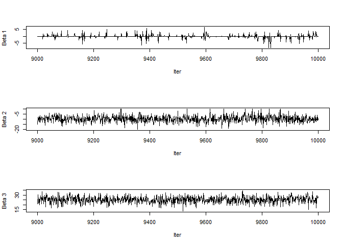<!-- -->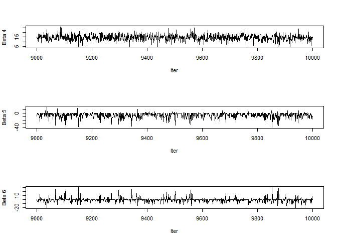<!-- -->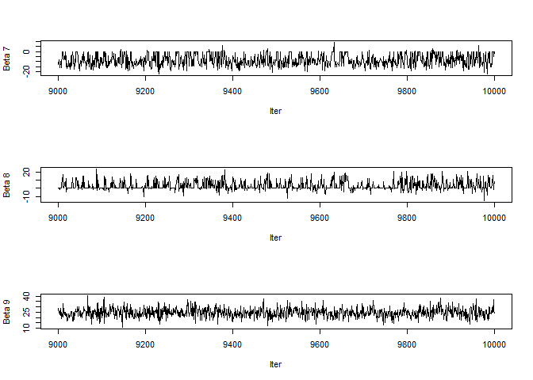<!-- -->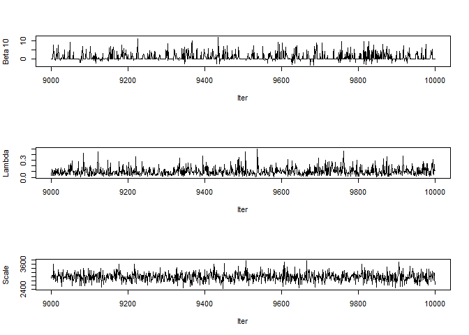<!-- -->

<br/> We observe no obvious patterns. Let us plot the posterior
distributions of $\beta, \lambda,\sigma$. We will discard the first 1000
samples as burn-in samples (since the first few samples are not
generated from the Markov process’s stationary distribution). <br/>

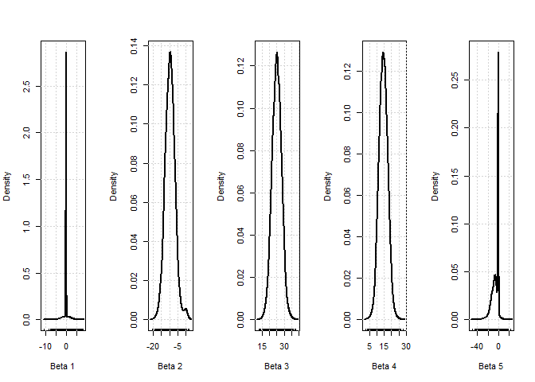<!-- -->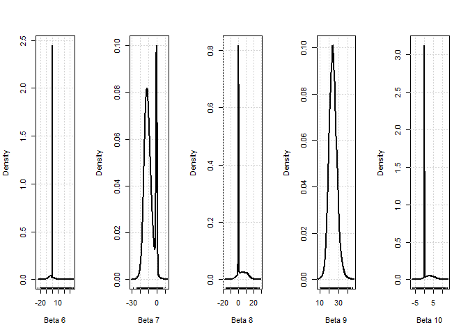<!-- -->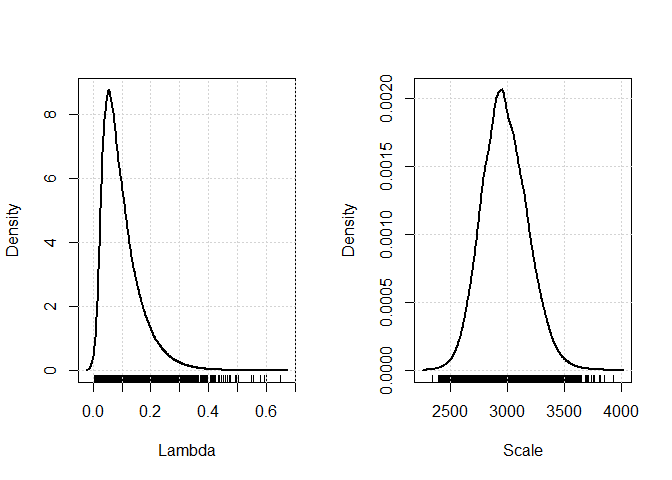<!-- -->

<br/> We observe that the selection is definitely not as clear-cut.
**Sex**, **BMI**, **BP**, and **S5** were consistently present in the
samples. Other serum variables were often omitted (**S2**, **S4**,
**S6** were somewhat consistently dropped from the model). Using the
*monomvn*package, we get a nice summary of the posterior distributions
in the form of boxplots. <br/>

``` r
par(mfrow = c(1, 1))
plot(diabetes_blasso,burnin = 1000)
```

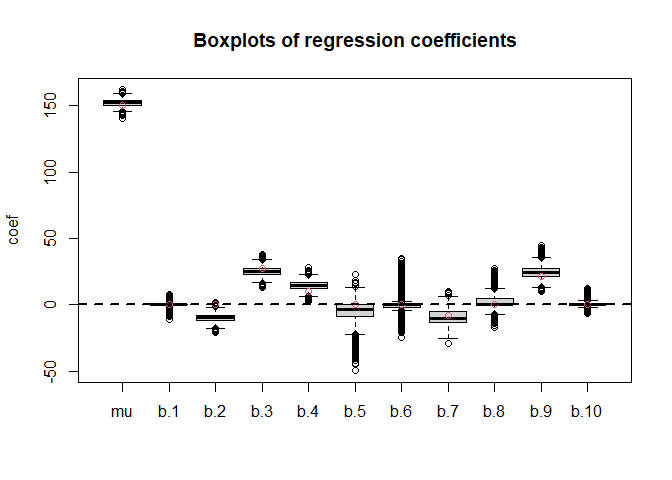<!-- -->

<br/> The quantile-based credible intervals are as follows. <br/>

``` r
apply(diabetes_blasso$beta[1000:10000,],2,function(x) quantile(x,c(0.025,0.975)))
```

    ##             b.1        b.2      b.3       b.4        b.5       b.6       b.7
    ## 2.5%  -3.092021 -15.432527 18.89250  8.733729 -22.571918 -10.03085 -18.24618
    ## 97.5%  2.855189  -3.158228 31.45875 20.556411   1.739203  11.72086   0.00000
    ##             b.8      b.9       b.10
    ## 2.5%  -4.795051 16.58021 -0.9826798
    ## 97.5% 15.721678 33.78319  7.3026189

<br/> We can also compute the selection probabilities. <br/>

``` r
apply(diabetes_blasso$beta[1000:10000,] != 0,2,mean)
```

    ##       b.1       b.2       b.3       b.4       b.5       b.6       b.7       b.8 
    ## 0.2353072 0.9874458 1.0000000 1.0000000 0.6439285 0.4576158 0.8514609 0.4812799 
    ##       b.9      b.10 
    ## 1.0000000 0.3647373

<br/> We should note that *blasso* achieves the variable selection (some
coefficients are exact zeros) via the “reversible jump (RJ) MCMC”, a
Bayesian model selection. Without such selection, the Bayesian LASSO
will not perform variable selection, making the Bayesian LASSO a
“compromise” between the LASSO and the ridge regression \[3\]. <br/>

``` r
diabetes_blasso_noRJ <- blasso(X = model_matrix_diab,
                               y = diabetes_std$Y,
                               T = 10000, # number of MCMC iterations
                               beta = rep(1,10), # initial estimate of betas
                               lambda2 = 1, # initial estimate of lambda
                               s2 = var(diabetes_std$Y - mean(diabetes_std$Y)), # initial estimate of sigma
                               RJ = FALSE, # no variable selection
                               verb = 0
)
```

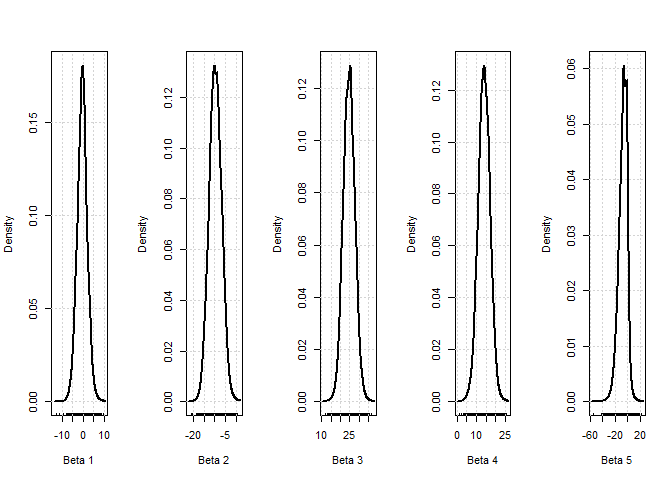<!-- -->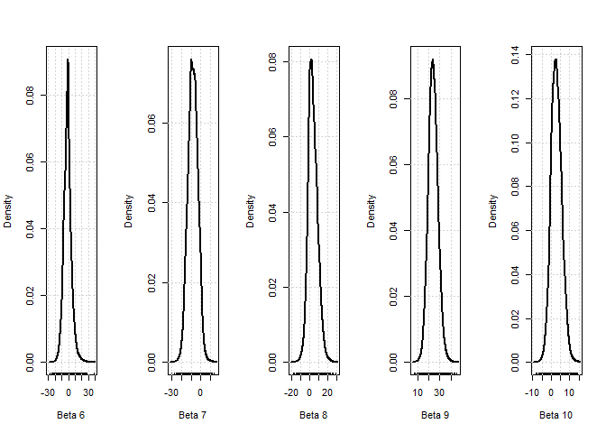<!-- -->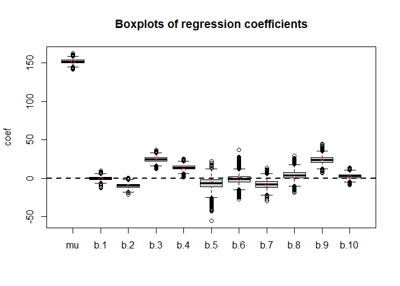<!-- -->

``` r
# quantile-based credible intervals
apply(diabetes_blasso_noRJ$beta[1000:10000,],2,function(x) quantile(x,c(0.025,0.975)))
```

    ##             b.1        b.2      b.3       b.4        b.5       b.6        b.7
    ## 2.5%  -5.067429 -15.348957 18.78018  7.995809 -22.921794 -11.93706 -17.712252
    ## 97.5%  4.773714  -3.713657 31.14403 20.298241   4.860516  12.13923   1.798394
    ##             b.8      b.9      b.10
    ## 2.5%  -5.538607 15.75907 -2.469062
    ## 97.5% 15.556221 33.40434  8.954283

``` r
# selection probability
apply(diabetes_blasso_noRJ$beta[1000:10000,] != 0,2,mean)
```

    ##  b.1  b.2  b.3  b.4  b.5  b.6  b.7  b.8  b.9 b.10 
    ##    1    1    1    1    1    1    1    1    1    1

<br/> Indeed, we observe that the posterior distributions no longer have
a point mass at zero.

A disadvantage of the Bayesian Lasso is that it is computationally
expensive (approximately $O(p^2)$ by numerical experiments \[1\]). If we
again consider the model with all interactions, the fit is already
noticeably slower. <br/>

``` r
diabetes_blasso_int <- blasso(X = model_matrix_diab_int,
                              y = diabetes_std$Y,
                              T = 10000, # number of MCMC iterations
                              beta = rep(1,55), # initial estimate of betas
                              lambda2 = 1, # initial estimate of lambda
                              s2 = var(diabetes_std$Y - mean(diabetes_std$Y)), # initial estimate of sigma
                              verb = 0                       
)
```

``` r
plot(diabetes_blasso_int,burnin = 1000)
```

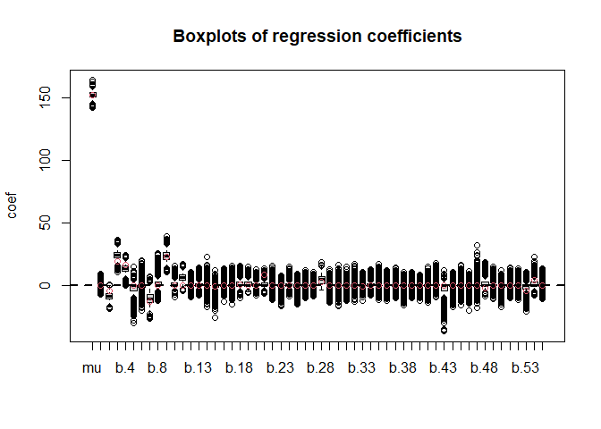<!-- -->

``` r
apply(diabetes_blasso_int$beta[1000:10000,],2,function(x) quantile(x,c(0.025,0.975)))
```

    ##             b.1         b.2     b.3       b.4       b.5       b.6       b.7
    ## 2.5%  -2.466473 -14.4340437 18.2036  7.710107 -12.53216 -8.094938 -18.15402
    ## 97.5%  4.189040  -0.9456673 31.0318 19.934707   2.45201  4.529414   0.00000
    ##             b.8      b.9      b.10     b.11      b.12      b.13      b.14
    ## 2.5%  -3.735095 16.47191 -1.175416  0.00000 -3.439789 -1.373917 -4.902606
    ## 97.5% 14.512552 31.30010  7.765817 12.52345  4.240841  7.041323  4.956386
    ##            b.15      b.16      b.17      b.18      b.19      b.20      b.21
    ## 2.5%  -7.522827 -2.365972 -4.761815 -1.165681 -1.030670 -1.561633 -1.089819
    ## 97.5%  2.198762  6.422409  5.202235  8.359421  7.746106  7.157991  7.491291
    ##            b.22      b.23      b.24      b.25      b.26      b.27     b.28
    ## 2.5%  -4.192096 -6.900967 -1.625846 -6.762571 -3.520136 -2.613639  0.00000
    ## 97.5%  5.296711  2.575140  7.271777  2.569458  4.216792  4.619329 11.71212
    ##            b.29      b.30      b.31      b.32      b.33      b.34      b.35
    ## 2.5%  -5.333974 -4.783624 -4.894320 -3.139507 -2.709944 -1.741636 -2.792429
    ## 97.5%  3.567943  4.142697  3.539341  5.826006  5.590840  7.240283  5.960244
    ##            b.36      b.37      b.38      b.39      b.40      b.41      b.42
    ## 2.5%  -3.432735 -1.901334 -6.119298 -3.111064 -4.694679 -4.586393 -2.619844
    ## 97.5%  5.259800  6.497890  3.206504  4.765053  3.071013  4.652816  7.002484
    ##             b.43      b.44      b.45      b.46      b.47      b.48      b.49
    ## 2.5%  -12.784676 -7.408918 -3.432510 -6.031887 -5.083081 -1.475331 -2.592164
    ## 97.5%   2.061134  3.286864  6.246638  3.438951  7.496561 10.371252  6.953416
    ##            b.50      b.51      b.52      b.53      b.54      b.55
    ## 2.5%  -7.153017 -2.594960 -3.814647 -8.886856 -1.662870 -3.114880
    ## 97.5%  2.447210  6.858602  4.888288  2.246600  9.446333  5.886572

#### Nonparametric bootstrap

An alternative way to assess the variability of the LASSO estimates is a
nonparametric bootstrap. <br/>

``` r
set.seed(123)
nb <- 1000

betas_boot <- matrix(NA,nb,10)
colnames(betas_boot) <- colnames(diabetes_blasso$beta)

for(i in 1:nb){
  
  diabetes_new <-  diabetes_std[sample(nrow(diabetes_std) , rep=TRUE),]
  
  diabetes_lasso_cv_new <- cv.glmnet(as.matrix(diabetes_new[,1:10]),diabetes_new$Y,alpha=1,family='gaussian',nfolds = 10,type.measure = 'mse')
  
  betas_boot[i,] <- diabetes_lasso_cv_new$glmnet.fit$beta[,diabetes_lasso_cv_new$index[1]]
}
```

<br/> Let us compare the selection probabilities of LASSO and Bayesian
LASSO with variable selection. <br/>

``` r
sel_prob <- rbind(apply(betas_boot != 0,2,mean),
                  apply(diabetes_blasso$beta[1000:10000,] != 0,2,mean),
                  apply(diabetes_blasso_noRJ$beta[1000:10000,] != 0,2,mean))

rownames(sel_prob) <- c('LASSO (bootstrap)', 'Bayesian LASSO', 'Bayesian LASSO (no selection)')
sel_prob
```

    ##                                     b.1       b.2 b.3 b.4       b.5       b.6
    ## LASSO (bootstrap)             0.8100000 0.9990000   1   1 0.8730000 0.5530000
    ## Bayesian LASSO                0.2353072 0.9874458   1   1 0.6439285 0.4576158
    ## Bayesian LASSO (no selection) 1.0000000 1.0000000   1   1 1.0000000 1.0000000
    ##                                     b.7       b.8 b.9      b.10
    ## LASSO (bootstrap)             0.8470000 0.6720000   1 0.9070000
    ## Bayesian LASSO                0.8514609 0.4812799   1 0.3647373
    ## Bayesian LASSO (no selection) 1.0000000 1.0000000   1 1.0000000

<br/> The Bayesian LASSO with variable selection is a bit more
aggressive in dropping the variables (**age** and **S6** probabilities
differ the most). Still, the variables that were almost always kept in
the model are the same (**sex**,**BP**, and **S5**). Let us compare the
distributions of the parameter estimates next. <br/>

``` r
betas_box1 <- cbind(as.vector(betas_boot), rep(colnames(diabetes_blasso$beta),each = nb))
betas_box2 <- cbind(as.vector(diabetes_blasso$beta[1000:10000,]), rep(colnames(diabetes_blasso$beta),each = 9001))
betas_box3 <- cbind(as.vector(diabetes_blasso_noRJ$beta[1000:10000,]), rep(colnames(diabetes_blasso$beta),each = 9001))


par(mfrow = c(1, 3))
boxplot(as.numeric(betas_box1[,1])~factor(betas_box1[,2], levels = colnames(diabetes_blasso$beta)),ylim = c(-100,100), xlab = '', ylab = 'coef',main = 'LASSO (bootstrap)')
boxplot(as.numeric(betas_box2[,1])~factor(betas_box2[,2], levels = colnames(diabetes_blasso$beta)),ylim = c(-100,100), xlab = '', ylab = 'coef',main = 'Bayesian LASSO (with variable sel.)')
boxplot(as.numeric(betas_box3[,1])~factor(betas_box3[,2], levels = colnames(diabetes_blasso$beta)),ylim = c(-100,100), xlab = '', ylab = 'coef',main = 'Bayesian LASSO (no variable sel.)')
```

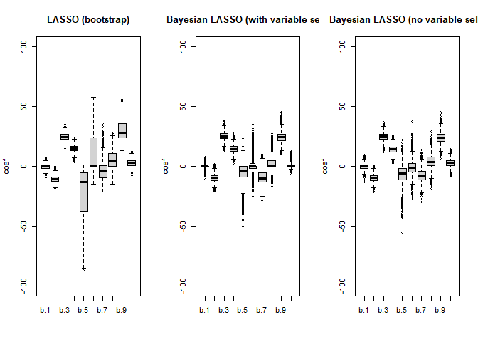<!-- -->

<br/> We observe that the boxplots are very similar for all three
resampling methods. For completeness’s sake, let us also plot the
densities of the bootstrap resamples. <br/>

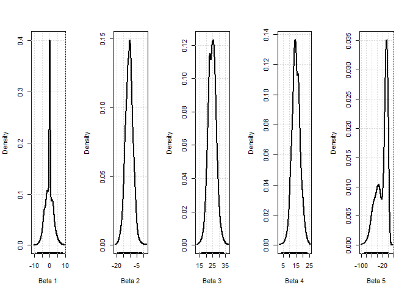<!-- -->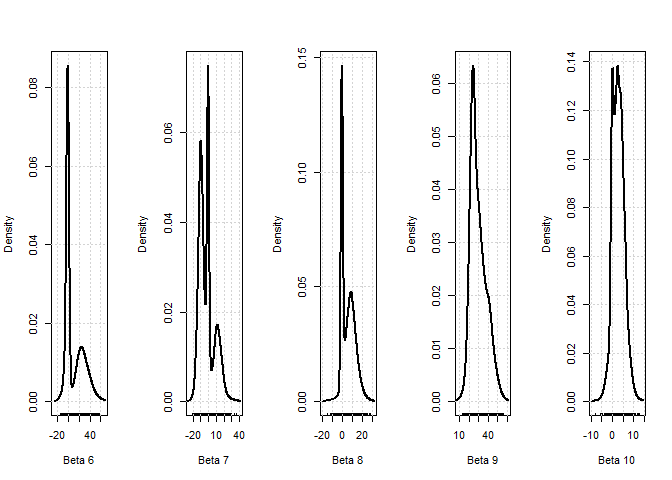<!-- -->

<br/> We again observe that the bootstrap densities show inconsistent
variable selection. To conclude, let us compute the bootstrap resamples
of the LASSO coefficients for the model with interactions. <br/>

``` r
set.seed(123)
nb <- 1000

betas_int_boot <- matrix(NA,nb,55)
colnames(betas_int_boot) <- names(diabetes_lasso_cv_inter$glmnet.fit$beta[,1])
full_matrix <- cbind(model_matrix_diab_int,diabetes_std$Y)

for(i in 1:nb){
  
  diabetes_int_new <-  full_matrix[sample(nrow(full_matrix) , rep=TRUE),]
  
  diabetes_lasso_cv_new <- cv.glmnet(as.matrix(diabetes_int_new)[,1:55],diabetes_int_new[,56],alpha=1,family='gaussian',nfolds = 10,type.measure = 'mse')
  
  betas_int_boot[i,] <- diabetes_lasso_cv_new$glmnet.fit$beta[,diabetes_lasso_cv_new$index[1]]
}

par(mfrow = c(1, 1))
betas_box_int <- cbind(as.vector(betas_int_boot), rep(names(diabetes_lasso_cv_inter$glmnet.fit$beta[,1]),each = nb))
boxplot(as.numeric(betas_box_int[,1])~factor(betas_box_int[,2], levels = names(diabetes_lasso_cv_inter$glmnet.fit$beta[,1])),ylim = c(-100,100), xlab = '', ylab = 'coef',main = 'LASSO (bootstrap)')
abline(0,0)
```

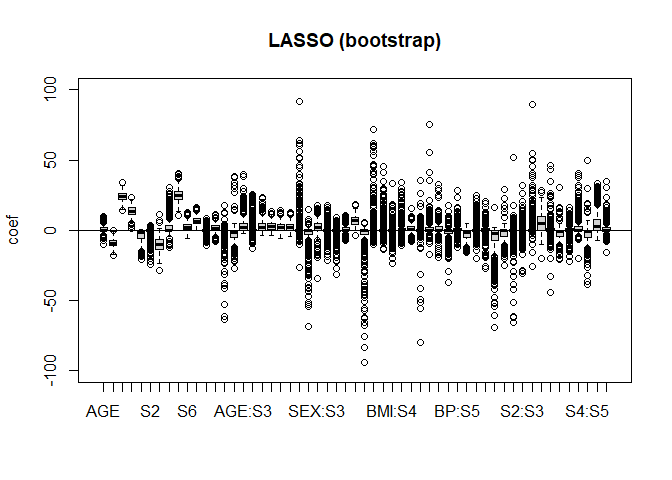<!-- -->

### Post-Selection Inference

Since the LASSO, due to the penalization, often produces substantially
biased estimates (due to shrinkage of coefficients), one could consider
using LASSO merely to select the predictors in the model and then refit
the model using the usual non-penalized regression methods (so-called
*post-LASSO estimator*). However, there are several issues with this
procedure.

The default confidence intervals and P-values from the non-penalized
regression can be overly optimistic because they ignore the prior
selection procedure. The LASSO selection could also miss some important
covariates, leading to omitted-variable bias in the final model \[7\].
Although, using asymptotic properties of the LASSO estimates mentioned
in our brief review, one could obtain a valid inference under “ideal”
circumstances; see \[9\] for a more detailed investigation of the
“naive” post-selection inference.

Let us demonstrate methods that attempt to provide a valid inference
post-selection. <br/>

#### Covariance Test

The covariance test assigns P-values to predictors as they enter the
LASSO path \[10\]. <br/>

<!-- -->

<br/> The test is based on the least angle regression (LAR). The LASSO
for a given penalty is usually estimated by the so-called coordinate
descent algorithm \[1\]. The LAR algorithm is an alternative to LASSO
for finding the LASSO solution \[2\] (and it also provides a nice
insight into what LASSO estimates look like).

The LAR is quite similar to the standard forward stepwise selection. The
predictors gradually enter into the model based on their
correlation with the remaining residuals (starting with the most
correlated). However, rather than performing the full OLS as in forward
stepwise selection, the coefficients are gradually shifted toward the
OLS solution; see \[1\] for the full algorithm.

We can fit the least angle regression in R using the package
*selectiveInference*
(<https://cran.r-project.org/web/packages/selectiveInference/index.html>).
<br/>

``` r
library(selectiveInference)
diabetes_lar <- lar(x = model_matrix_diab, y = diabetes_std$Y, maxsteps=2000, minlam=0)
```

<br/> The resulting LAR coefficient path is identical to the LASSO path
we obtained using the coordinate descent (using *cv.glmnet*). <br/>

``` r
plot(diabetes_lar)
```

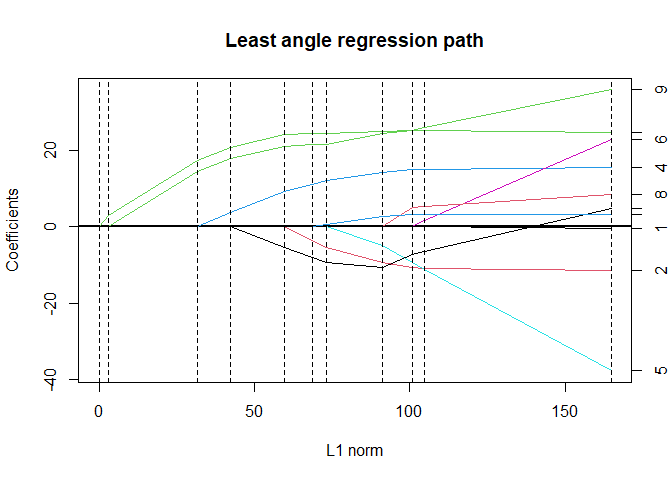<!-- -->

<br/> The covariance test evaluates the significance of predictors as
they enter the LAR. Namely, at each stage of the LAR, we are testing the
conditional hypothesis whether the coefficients of all other predictors
not yet in the model are zero (*complete null hypothesis*), adjusting
for the variables that are in the model \[1\].

Let $\lambda_1 > \lambda_2 > \cdots$ denotes the values of $\lambda\mathrm{s}$
for which new predictors were added. The test statistic for the $k$-th
predictor that was added to the model is
$T_k = \frac{1}{\sigma^2}(y^TX\hat\beta(\lambda_{k+1}) - y^TX\hat\beta_{A_{k-1}}(\lambda_{k+1}))$,
where $\hat\beta(\lambda_{k+1})$ are the values of coefficients after
the predictor was added for the value $\lambda = \lambda_{k+1}$ and
$\hat\beta_{A_{k-1}}(\lambda_{k+1})$ are the values of LASSO
coefficients for $\lambda = \lambda_{k+1}$ when the the $k$-th predictor
would *not* be added. It can be shown that under some conditions on the
model matrix $X$ (the “signal” variables are not too correlated with the
“noise” variables), $T_k$ converges under the null hypothesis (that all
signal variables are in the model) to an exponential distribution
$\mathrm{Exp}(1)$ \[1\].

The covariance test (and other tests) for the LAR can be performed in R
using the *larInf*function. <br/>

``` r
larinf_diabetes <- larInf(diabetes_lar, alpha = 0.05)
cov_test <-  cbind(larinf_diabetes$vars, round(larinf_diabetes$pv.covtest,4))
colnames(cov_test) <- c('Variable', 'Cov.test (P-value)')
rownames(cov_test) <- 1:10
cov_test
```

    ##    Variable Cov.test (P-value)
    ## 1         3             0.0000
    ## 2         9             0.0000
    ## 3         4             0.0038
    ## 4         7             0.0025
    ## 5         2             0.0077
    ## 6        10             0.8554
    ## 7         5             0.0376
    ## 8         8             0.5439
    ## 9         6             0.8699
    ## 10        1             0.9723

<br/> We observe that adding only five variables was deemed significant.
Let us repeat the analysis for the model with all interactions. <br/>

``` r
diabetes_lar_int <- lar(x = model_matrix_diab_int, y = diabetes_std$Y, maxsteps=2000, minlam=0)
larinf_diabetes_int <- larInf(diabetes_lar_int)
cov_test_int <-  cbind(larinf_diabetes_int$vars, round(larinf_diabetes_int$pv.covtest,4))
colnames(cov_test_int) <- c('Variable', 'Cov.test (P-value)')
rownames(cov_test_int) <- 1:55
cov_test_int[1:15,]
```

    ##    Variable Cov.test (P-value)
    ## 1         3             0.0000
    ## 2         9             0.0000
    ## 3         4             0.0031
    ## 4         7             0.0167
    ## 5        28             0.2636
    ## 6        11             0.2189
    ## 7        19             0.8325
    ## 8        13             0.9928
    ## 9        34             0.8777
    ## 10        2             0.0619
    ## 11       10             0.8872
    ## 12       54             0.9388
    ## 13       18             0.9717
    ## 14       21             0.8672
    ## 15       24             0.9457

<br/> Only four predictors were deemed significant (**BMI**, **BP**,
**S5**, and **S3**) at the 0.05 level. <br/>

``` r
sum(cov_test_int[,2] < 0.05)
```

    ## [1] 4

<br/> For comparison, let us perform the forward selection based on the
P-values. We will use the *olsrr* package
(<https://cran.r-project.org/web/packages/olsrr/index.html>) to perform
the forward selection. <br/>

``` r
library(olsrr)
fw <- ols_step_forward_p(lm(Y ~ .^2, data = diabetes_std), p_val = 0.05)
fw$model
```

    ## 
    ## Call:
    ## lm(formula = paste(response, "~", paste(preds, collapse = " + ")), 
    ##     data = l)
    ## 
    ## Coefficients:
    ## (Intercept)          BMI           S5           BP          SEX           S6  
    ##    145.1354      23.7066      45.5093      14.7532     -11.6223       3.1148  
    ##         AGE           S4           S2           S1           S3      AGE:SEX  
    ##      0.3897       7.2198      45.2733     -60.4518      13.5117       9.1300  
    ##      BMI:BP        S5:S6  
    ##      6.9420       5.7736

<br/> The forward selection procedure sequentially selected 13
significant predictors, demonstrating the overly optimistic nature of
this procedure (i.e., a downward bias in the P-values). The forward
selection ignores the fact that the chi-squared test assumes that the
models were prespecified. The reason why the covariance test based on
the LAR/LASSO is more conservative is *shrinkage* - the models in the
LAR are not fitted fully - and this shrinkage compensates for the
inflation due to the selection \[1\]. <br/>

#### Spacing Test

The spacing test is an alternative to the covariance test based on the
*polyhedral lemma* about the distribution of the events $\{Ay \leq b\}$,
where $y \sim N(\mu,\sigma^2I_n)$ (the selection in the forward step
selection and the solution of LASSO for a given $\lambda$ is
characterized by these events) \[1\].

Let us assume the LAR algorithm and the first selected predictor. Then
it can be shown from the polyhedral lemma that
$R_1 = \frac{1-\Phi(\lambda_1/\sigma)}{1-\Phi(\lambda_2/\sigma)} \sim U(0,1)$
under the global null hypothesis. Remarkably, this test is *exact* for
any finite $N$ and $p$ \[1\].

The spacing tests for the subsequent steps can also be made, although
the formula becomes more complicated; see \[1, Section 6.3.3.2\] for
more details. One important aspect we need to mention is that these
additional tests do not test the global null hypothesis (that all
coefficients not in the model are zero). Instead, they test the
so-called *incremental null hypothesis*: whether the partial correlation
of the predictor that entered is zero, adjusting for the variables in
the model.

The spacing test can be computed using the function *larInf* (in two
variants; see \[5\]). The result for the model without interactions is
as follows. <br/>

``` r
space_test <-  cbind(larinf_diabetes$vars, round(larinf_diabetes$pv.spacing,4), round(larinf_diabetes$pv.modspac,4))
colnames(space_test) <- c('Variable', 'Spacing test (P-value)', 'Mod. spacing test (P-value)')
rownames(space_test) <- 1:10
space_test
```

    ##    Variable Spacing test (P-value) Mod. spacing test (P-value)
    ## 1         3                 0.0000                      0.0000
    ## 2         9                 0.0000                      0.0000
    ## 3         4                 0.0065                      0.0065
    ## 4         7                 0.0074                      0.0074
    ## 5         2                 0.0120                      0.0120
    ## 6        10                 0.6179                      0.6179
    ## 7         5                 0.0302                      0.0492
    ## 8         8                 0.4475                      0.4475
    ## 9         6                 0.8349                      0.8349
    ## 10        1                 0.0704                      0.0704

<br/> As for the model with interactions, adding only the first five
predictors was again deemed significant. <br/>

``` r
space_test_int <-  cbind(larinf_diabetes_int$vars, round(larinf_diabetes_int$pv.spacing,4), round(larinf_diabetes_int$pv.modspac,4))
colnames(space_test_int) <- c('Variable', 'Spacing test (P-value)', 'Mod. spacing test (P-value)')
rownames(space_test_int) <- 1:55
t(space_test_int)
```

    ##                             1 2      3      4       5       6       7       8
    ## Variable                    3 9 4.0000 7.0000 28.0000 11.0000 19.0000 13.0000
    ## Spacing test (P-value)      0 0 0.0054 0.0247  0.2561  0.1836  0.7174  0.8814
    ## Mod. spacing test (P-value) 0 0 0.0054 0.0247  0.2561  0.1836  0.7174  0.8814
    ##                                   9    10      11      12      13      14
    ## Variable                    34.0000 2.000 10.0000 54.0000 18.0000 21.0000
    ## Spacing test (P-value)       0.0449 0.056  0.6921  0.3442  0.6572  0.3698
    ## Mod. spacing test (P-value)  0.0449 0.056  0.6921  0.3442  0.6572  0.3698
    ##                                  15      16     17      18     19      20
    ## Variable                    24.0000 37.0000 43.000 20.0000 5.0000 51.0000
    ## Spacing test (P-value)       0.7469  0.9043  0.141  0.3617 0.7831  0.9133
    ## Mod. spacing test (P-value)  0.7469  0.9043  0.141  0.3617 0.7831  0.9133
    ##                                  21     22      23      24      25      26
    ## Variable                    15.0000 49.000 48.0000 53.0000 23.0000 42.0000
    ## Spacing test (P-value)       0.0166  0.819  0.5043  0.4305  0.5909  0.5191
    ## Mod. spacing test (P-value)  0.0166  0.819  0.5043  0.4305  0.5909  0.5191
    ##                                  27      28      29     30     31      32
    ## Variable                    16.0000 50.0000 40.0000 45.000 1.0000 35.0000
    ## Spacing test (P-value)       0.6164  0.0178  0.6359  0.835 0.8826  0.0213
    ## Mod. spacing test (P-value)  0.6164  0.0178  0.6359  0.835 0.8826  0.0213
    ##                                  33      34      35      36      37      38
    ## Variable                    29.0000 52.0000 44.0000 27.0000 55.0000 41.0000
    ## Spacing test (P-value)       0.8338  0.3322  0.9565  0.0838  0.2481  0.6809
    ## Mod. spacing test (P-value)  0.8338  0.3322  0.9565  0.0838  0.2481  0.6809
    ##                                  39     40      41      42      43      44
    ## Variable                    25.0000 8.0000 12.0000 17.0000 32.0000 38.0000
    ## Spacing test (P-value)       0.6267 0.3198  0.8161  0.2437  0.5959  0.2733
    ## Mod. spacing test (P-value)  0.6267 0.3198  0.8161  0.2437  0.5959  0.2733
    ##                                  45      46      47      48      49      50
    ## Variable                    26.0000 33.0000 22.0000 31.0000 36.0000 39.0000
    ## Spacing test (P-value)       0.4009  0.7973  0.7767  0.4001  0.1556  0.4328
    ## Mod. spacing test (P-value)  0.4009  0.7973  0.7767  0.4001  0.2867  0.4328
    ##                                  51      52     53      54      55
    ## Variable                    47.0000 30.0000 6.0000 14.0000 46.0000
    ## Spacing test (P-value)       0.5828  0.4885 0.3136  0.2515  0.7692
    ## Mod. spacing test (P-value)  0.5828  0.4885 0.3136  0.2515  0.7692

#### Fixed-Lambda Inference

The covariance test and the spacing test assess the significance of
adding new predictors to the model; they were corrections for forward
stepwise selection. The fixed-lambda inference focuses on computing
confidence intervals and P-values for the LASSO-selected model \[1,11\].

Let us assume the model selection (for the model without interactions)
based on $\lambda$ that attained the *1se* CV error. <br/>

``` r
# lambda
diabetes_lasso_cv$lambda.1se
```

    ## [1] 7.71041

``` r
# beta
diabetes_lasso_cv$glmnet.fit$beta[,diabetes_lasso_cv$index[2]]
```

    ##       AGE       SEX       BMI        BP        S1        S2        S3        S4 
    ##  0.000000  0.000000 23.496545  8.190540  0.000000  0.000000 -4.499227  0.000000 
    ##        S5        S6 
    ## 20.407201  0.000000

<br/> Naively, we could refit the model via OLS to obtain the confidence
intervals and the P-values for the coefficients in the reduced model.
<br/>

``` r
beta <- diabetes_lasso_cv$glmnet.fit$beta[,diabetes_lasso_cv$index[2]]
lm_diabetes <- lm(diabetes_std$Y ~ .,data = diabetes_std[,beta != 0])

summary(lm_diabetes)
```

    ## 
    ## Call:
    ## lm(formula = diabetes_std$Y ~ ., data = diabetes_std[, beta != 
    ##     0])
    ## 
    ## Residuals:
    ##      Min       1Q   Median       3Q      Max 
    ## -142.104  -40.310   -3.297   39.139  151.831 
    ## 
    ## Coefficients:
    ##             Estimate Std. Error t value Pr(>|t|)    
    ## (Intercept)  152.133      2.627  57.916  < 2e-16 ***
    ## BMI           26.442      3.135   8.435 4.87e-16 ***
    ## BP            12.842      2.971   4.323 1.91e-05 ***
    ## S3            -9.236      2.949  -3.132  0.00185 ** 
    ## S5            23.094      3.175   7.273 1.64e-12 ***
    ## ---
    ## Signif. codes:  0 '***' 0.001 '**' 0.01 '*' 0.05 '.' 0.1 ' ' 1
    ## 
    ## Residual standard error: 55.23 on 437 degrees of freedom
    ## Multiple R-squared:  0.4915, Adjusted R-squared:  0.4868 
    ## F-statistic: 105.6 on 4 and 437 DF,  p-value: < 2.2e-16

``` r
confint(lm_diabetes)
```

    ##                  2.5 %     97.5 %
    ## (Intercept) 146.970733 157.296235
    ## BMI          20.281077  32.603084
    ## BP            7.003082  18.680016
    ## S3          -15.031195  -3.440502
    ## S5           16.853162  29.335215

<br/> However, these would be overly optimistic because we had already
“looked” at the data and performed variable selection. Instead, we can
use the function *fixedLassoInf*, which computes confidence intervals
and significance levels using the polyhedral lemma. We should note that
these are *conditional* on the selection for a given value of $\lambda$
\[1,10\], i.e., they test whether the coefficient of any given predictor
is zero in the reduced model. <br/>

``` r
lambda <- diabetes_lasso_cv$lambda.1se
beta <- diabetes_lasso_cv$glmnet.fit$beta[,diabetes_lasso_cv$index[2]]

# fixedLassoInf uses a different scaling of lambda than glmnet
fixed_infer <- fixedLassoInf(model_matrix_diab,diabetes_std$Y,beta,lambda*dim(diabetes_std[,1:10])[1],family = 'gaussian', alpha = 0.05)

lm_diabetes <- lm(diabetes_std$Y ~ .,data = diabetes_std[,beta != 0])

infer <- cbind(fixed_infer$coef0,
               confint(lm_diabetes)[-1,],
               round(summary(lm_diabetes)$coefficients[-1,4],4),
               fixed_infer$ci,
               round(fixed_infer$pv,4)
               )
colnames(infer) <- c('Coef ','2.5 % (ols)','97.5 % (ols)','P-value (ols)','2.5 % (adj.)','97.5 % (adj.)','P-value (adj.)')
infer
```

    ##         Coef  2.5 % (ols) 97.5 % (ols) P-value (ols) 2.5 % (adj.) 97.5 % (adj.)
    ## BMI 26.442081   20.281077    32.603084        0.0000     20.35476     32.523704
    ## BP  12.841549    7.003082    18.680016        0.0000      6.80619     18.575846
    ## S3  -9.235849  -15.031195    -3.440502        0.0019    -14.89843     -1.209576
    ## S5  23.094188   16.853162    29.335215        0.0000     16.93375     29.260749
    ##     P-value (adj.)
    ## BMI         0.0000
    ## BP          0.0001
    ## S3          0.0139
    ## S5          0.0000

<br/> We observe that the results are pretty similar. Only noticeable
change is that the confidence interval for **S3** is a bit wider. We
should note that the method did not incorporate the fact that the
parameter $\lambda$ itself was selected. However, simulations suggest
that including $\lambda$ selection does not widen the confidence
intervals substantially \[1\].

For the model with interactions, the following predictors were kept in
the model for *1se* $\lambda$. <br/>

``` r
beta_int <- diabetes_lasso_cv_inter$glmnet.fit$beta[,diabetes_lasso_cv_inter$index[2]]
beta_int[abs(beta_int) >0]
```

    ##         BMI          BP          S3          S5     AGE:SEX      AGE:S6 
    ## 23.71191195  8.38370641 -4.86934959 20.90156514  1.21622834  0.07257721 
    ##      BMI:BP 
    ##  2.03044602

<br/> The confidence intervals and the P-values for the partial
coefficients are as follows. <br/>

``` r
lambda_int <- diabetes_lasso_cv_inter$lambda.1se

fixed_infer_int <- fixedLassoInf(as.matrix(model_matrix_diab_int),diabetes_std$Y,beta_int,lambda_int*dim(diabetes_std[,1:10])[1],family = 'gaussian', alpha = 0.05)

lm_diabetes_int <- lm(diabetes_std$Y ~ ., data = as.data.frame(model_matrix_diab_int)[,beta_int != 0])

infer_int <- cbind(fixed_infer_int$coef0,
                   confint(lm_diabetes_int)[-1,],
                   round(summary(lm_diabetes_int)$coefficients[-1,4],4),
                   fixed_infer_int$ci,
                   round(fixed_infer_int$pv,4))
rownames(infer_int) <- names(beta_int[abs(beta_int) >0])
colnames(infer_int) <- c('coef','2.5 % (ols)','97.5 % (ols)','P-value (ols)','2.5 % (adj.)','97.5 % (adj.)','P-value (adj.)')
infer_int
```

    ##              coef 2.5 % (ols) 97.5 % (ols) P-value (ols) 2.5 % (adj.)
    ## BMI     27.274383  21.2114396    33.337325        0.0000  -35.4351113
    ## BP      12.215942   6.4923721    17.939512        0.0000    0.4992781
    ## S3      -7.959375 -13.6642452    -2.254505        0.0064  -56.2340973
    ## S5      24.515013  18.4096701    30.620357        0.0000   18.4523627
    ## AGE:SEX  7.842231   2.6947250    12.989736        0.0029  -10.9087122
    ## AGE:S6   5.833830   0.5996945    11.067966        0.0290         -Inf
    ## BMI:BP   7.575489   2.4385380    12.712441        0.0039   -2.9785885
    ##         97.5 % (adj.) P-value (adj.)
    ## BMI         31.577382         0.1994
    ## BP          17.768427         0.0213
    ## S3          -2.078408         0.0100
    ## S5          30.607739         0.0000
    ## AGE:SEX     68.648288         0.1130
    ## AGE:S6       5.022422         0.9377
    ## BMI:BP      63.499288         0.0487

<br/> We observe that many variables no longer appear significant after
the adjustment for the selection. <br/>

#### PoSI method

The PoSI (Post-Selection Inference) method \[12\] adjusts standard
confidence intervals to account for all possible models that the
selection procedure might have selected; i.e., it does not depend on the
selection procedure.

Namely, it considers the confidence intervals
$\hat\beta_{j,M} \pm K\hat\sigma\sqrt{(X_M^TX_M)^{-1}}$, where $\hat\beta_M$ is
the OLS estimate in the selected model, $X_M$ is the model matrix of the
selected model, and $K$ is a constant estimated by the PoSI method. This
constant is selected such that
$P[\hat\beta_{j,M} \in \mathrm{CI}_{j,M}] \geq 1-2\alpha$ over all
possible model selection procedures.

The constant $K$ for a given model can be computed via the package
*PoSI* (<https://cran.r-project.org/web/packages/PoSI/index.html>).
<br/>

``` r
library(PoSI)
posi_inf <- PoSI(diabetes_std, verbose = FALSE)
summary(posi_inf)
```

    ##     K.PoSI K.Bonferroni K.Scheffe
    ## 95%  3.445        4.590     4.436
    ## 99%  3.932        4.915     4.972

<br/> The confidence interval for $\beta_i$ is given as
$\hat \beta_i \pm K\hat\sigma \sqrt{(X_M^TX_M)_{ii}^{-1}}$, where $X_M$
is the model matrix of the reduced model. Thus, we use the usual
computation of the standard error for $\hat \beta_i$ but replace the
quantile function of normal/t-distribution with the value $K$ computed
via *PoSI*. <br/>

``` r
hat_beta <- summary(lm_diabetes)$coefficients[,1]
std_error <- summary(lm_diabetes)$coefficients[,2]

ci_PoSI <- cbind(hat_beta - std_error*summary(posi_inf)[1,1], hat_beta + std_error*summary(posi_inf)[1,1])
colnames(ci_PoSI) <- c('2.5 % (PoSI)','97.5 % (PoSI)')
cbind(infer[,c(1,2,3,5,6)],ci_PoSI[2:dim(ci_PoSI)[1],])
```

    ##         Coef  2.5 % (ols) 97.5 % (ols) 2.5 % (adj.) 97.5 % (adj.) 2.5 % (PoSI)
    ## BMI 26.442081   20.281077    32.603084     20.35476     32.523704    15.642967
    ## BP  12.841549    7.003082    18.680016      6.80619     18.575846     2.607783
    ## S3  -9.235849  -15.031195    -3.440502    -14.89843     -1.209576   -19.394033
    ## S5  23.094188   16.853162    29.335215     16.93375     29.260749    12.154809
    ##     97.5 % (PoSI)
    ## BMI    37.2411945
    ## BP     23.0753150
    ## S3      0.9223355
    ## S5     34.0335682

<br/> We observe that the PoSI confidence intervals are much more
conservative. The main disadvantage of this approach is computational
complexity. The model without interactions contains 11 variables, i.e.,
there are $2^{11} - 1 = 2047$ possible reduced models. If we consider the
model with interactions, this number increases to
$2^{55}-1 \approx 3,6 \cdot 10^{16}$. Hence, we can consider merely
models with a limited number of dropped variables.

For example, if we consider models with 53-55 parameters, we need to
investigate 1541 models. If we increase this range to 52-55, the number
of models increases to 27776. <br/>

``` r
posi_inf_int <- PoSI(model_matrix_diab_int, modelSZ = 52:55)
```

    ## Number of contrasts/adjusted predictors to process: 1445950 
    ## Number of bundles: 17 
    ##                          Done with bundle 1 / 17    model sz = 52 
    ##                          Done with bundle 2 / 17    model sz = 52 
    ##                          Done with bundle 3 / 17    model sz = 52 
    ##                          Done with bundle 4 / 17    model sz = 52 
    ##                          Done with bundle 5 / 17    model sz = 52 
    ##                          Done with bundle 6 / 17    model sz = 52 
    ##                          Done with bundle 7 / 17    model sz = 52 
    ##                          Done with bundle 8 / 17    model sz = 52 
    ##                          Done with bundle 9 / 17    model sz = 52 
    ##                          Done with bundle 10 / 17    model sz = 52 
    ##                          Done with bundle 11 / 17    model sz = 52 
    ##                          Done with bundle 12 / 17    model sz = 52 
    ##                          Done with bundle 13 / 17    model sz = 52 
    ##                          Done with bundle 14 / 17    model sz = 52 
    ##                          Done with bundle 15 / 17    model sz = 53 
    ##                          Done with bundle 16 / 17    model sz = 54 
    ##                          Done with bundle 17 / 17    model sz = 55 
    ## p = 55 , d = 55   processed 1445950 tests in 27776 models.  Times in seconds:
    ##    user  system elapsed 
    ##   73.43    7.98   81.37

``` r
summary(posi_inf_int)
```

    ##     K.PoSI K.Bonferroni K.Scheffe
    ## 95%  4.055        5.517     8.562
    ## 99%  4.491        5.793     9.072

<br/> We observe that this approach becomes very easily numerically
intractable, limiting its practical application. <br/>

### Debiased LASSO

The fixed-lambda considers the inference about *partial coefficients* in
the reduced models. The debiased LASSO instead infers about the full
model with all regression variables \[1\]. Provided that the number of
predictors does not exceed the number of observations, this is not that
interesting, since we could fit the model without regularization and
obtain unbiased estimates in the first place.

However, consider the case when the number of observations $N$ is
greater than the number of predictors $p$. Then, we cannot fit an
unpenalized OLS model, but we can still fit the LASSO model. However,
the LASSO coefficients are shrinked (i.e., biased to zero). The debiased
LASSO attempts to correct the shrinkage bias and obtain the unbiased
estimates of the full model.

The debiasing is given by the formula
$\hat \beta^d = \hat\beta_\mathrm{LASSO} + \frac{1}{N}\Theta X^T(y-X\hat\beta_\mathrm{LASSO})$
for some matrix $\Theta$, where $N$ is number of observations. If the
number of predictors does not exceed the number of observations, we can
put $\Theta = N(X^TX)^{-1}$ and obtain the usual OLS estimates. If this
is not the case, the matrix inverse can be performed only approximately;
see \[1, Section 6.4\] for more details.

In our dataset, we have more predictors than observations, so using the
debiased LASSO does not make much sense. Still, for completeness’ sake,
let us perform it. We just need to add argument *type = ‘full’* in the
function *fixedLassoInf*. <br/>

``` r
lm_diabetes_int_full <- lm(Y ~ .^2,data = diabetes_std)
index <- c(FALSE,beta_int!=0)


fixed_infer_int <- fixedLassoInf(as.matrix(model_matrix_diab_int),diabetes_std$Y,beta_int,lambda_int*dim(diabetes_std[,1:10])[1],family = 'gaussian', alpha = 0.05, type = 'full')

lm_diabetes_int <- lm(diabetes_std$Y ~ ., data = as.data.frame(model_matrix_diab_int)[,beta_int != 0])

infer_int_full <- cbind(lm_diabetes_int_full$coefficients[index],
                   fixed_infer_int$coef0,
                   confint(lm_diabetes_int_full)[index,],
                   round(summary(lm_diabetes_int_full)$coefficients[index,4],4),
                   fixed_infer_int$ci,
                   round(fixed_infer_int$pv,4))
rownames(infer_int_full) <- names(beta_int[abs(beta_int) >0])
colnames(infer_int_full) <- c('coef (OLS)','coef (debiased)','2.5 % (ols)','97.5 % (ols)','P-value (ols)','2.5 % (adj.)','97.5 % (adj.)','P-value (adj.)')
infer_int_full
```

    ##          coef (OLS) coef (debiased)  2.5 % (ols) 97.5 % (ols) P-value (ols)
    ## BMI       21.884432       21.884432   14.6101623     29.15870        0.0000
    ## BP        15.997609       15.997609    9.3031098     22.69211        0.0000
    ## S3      -186.350579     -186.350579 -431.9096347     59.20848        0.1365
    ## S5      -124.505980     -124.505980 -338.2171942     89.20523        0.2527
    ## AGE:SEX    7.937485        7.793556    1.1557324     14.71924        0.0219
    ## AGE:S6     4.777050        4.487984   -2.5207270     12.07483        0.1989
    ## BMI:BP     7.700868        8.171996    0.8352779     14.56646        0.0280
    ##         2.5 % (adj.) 97.5 % (adj.) P-value (adj.)
    ## BMI       -40.882316     51.376576         0.2597
    ## BP         -1.910726     50.825312         0.0353
    ## S3       -431.989618     59.892366         0.0678
    ## S5       -338.255454     89.831776         0.8740
    ## AGE:SEX   -47.513285     68.384576         0.3585
    ## AGE:S6          -Inf      4.660913         0.9435
    ## BMI:BP    -88.811049     62.269816         0.5322

<br/> We observe that the debiased LASSO coefficients are just the OLS
coefficients, as expected. Thus, the only notable thing we obtained for
our trouble is unnecessarily large confidence intervals. <br/>

### Adaptive LASSO

If we remind ourselves of the asymptotic properties of the LASSO
estimates, we notice that the LASSO cannot be both $\sqrt{N}$-consistent
and attain consistent selection. The adaptive LASSO is a modification of
the LASSO algorithm that is $\sqrt{N}$-consistent, the non-zero
estimates are asymptotically normal, and the adaptive LASSO attains
consistent selection, achieving the so-called *oracle property* \[13\].

The modification concerns penalization. The penalization in the adaptive
LASSO is
$\hat\beta_\mathrm{aLASSO} = \mathrm{argmin}_\beta \Vert X\beta - Y\Vert^2 + \lambda \sum_i w_i|\beta_i|$
for some $\lambda > 0$, where $w_i$ are weights. The weights are chosen
as $w_i = 1/|\tilde\lambda_i|^\gamma$, where $\tilde\lambda$ is some
initial $\sqrt{N}$-consistent estimator and $\gamma >0$ is a free
parameter \[13\].

We already discussed that the asymptotic properties do not tell the
whole story in practice. Still, the adaptive LASSO has the nice property
of reducing shrinkage bias in the estimation of large effects (by
weighing the corresponding columns down) while still selecting by
penalizing minor effects more.

Let us perform the adaptive LASSO on the model without interactions.
First, we estimate the coefficients using the simple OLS. <br/>

``` r
lm_diabetes_full <- lm(Y ~ .,data = diabetes_std)
beta_full <- coefficients(lm_diabetes_full)[-1]
```

<br/> We can fit the adaptive LASSO by fitting the ordinary LASSO for
the rescaled columns. <br/>

``` r
diabetes_resc <- scale(diabetes_std[,1:10], center = FALSE, scale = 1/abs(beta_full))

set.seed(123)
diabetes_alasso_cv <- cv.glmnet(diabetes_resc,diabetes_std$Y,alpha=1,family='gaussian',nfolds = 10,type.measure = 'mse', standardize = FALSE)
```

<br/> Let us compare the results of the LASSO and the adaptive LASSO.
<br/>

``` r
beta_adaptive_1 <- diabetes_alasso_cv$glmnet.fit$beta[,diabetes_alasso_cv$index[1]]
beta_adaptive_2 <- diabetes_alasso_cv$glmnet.fit$beta[,diabetes_alasso_cv$index[2]]

diabetes_coefs <- rbind(
  diabetes_lasso_cv$glmnet.fit$beta[,diabetes_lasso_cv$index[1]],
  beta_adaptive_1*abs(beta_full),
  diabetes_lasso_cv$glmnet.fit$beta[,diabetes_lasso_cv$index[2]],
  beta_adaptive_2*abs(beta_full)
)

rownames(diabetes_coefs) <- c('LASSO lambda_min','aLASSO lambda_min','LASSO lambda_1se','aLASSO lambda_1se')
diabetes_coefs
```

    ##                          AGE       SEX      BMI        BP        S1       S2
    ## LASSO lambda_min  -0.4100544 -11.35764 24.79570 15.382624 -32.09098 18.36680
    ## aLASSO lambda_min  0.0000000 -11.21539 24.88956 15.261562 -28.38361 15.81115
    ## LASSO lambda_1se   0.0000000   0.00000 23.49654  8.190540   0.00000  0.00000
    ## aLASSO lambda_1se  0.0000000   0.00000 26.37564  5.159177  -2.29846  0.00000
    ##                          S3       S4       S5       S6
    ## LASSO lambda_min   2.145914 7.479359 33.73280 3.211956
    ## aLASSO lambda_min  0.000000 6.183105 32.69053 2.693563
    ## LASSO lambda_1se  -4.499227 0.000000 20.40720 0.000000
    ## aLASSO lambda_1se  0.000000 0.000000 27.47415 0.000000

<br/> We can observe two typical differences between the adaptive LASSO
and the ordinary LASSO. The fit for the minimal $\lambda$ has a smaller
number of non-zero predictors. In addition, notice that the fit for 1se
$\lambda$ has slightly higher values of coefficients for larger effects.

Since the adaptive LASSO can be fitted using the usual LASSO algorithm.
We can use the inference methods that we derived for the LASSO. The
P-values of the spacing test and the covariance test are as follows.
<br/>

``` r
larinf_diabetes_alasso <- 
  larInf(lar(x = diabetes_resc, y = diabetes_std$Y, maxsteps=2000, minlam=0, normalize = FALSE))

pvalues_diabetes_alasso <- round(cbind(larinf_diabetes_alasso$pv.spacing,larinf_diabetes_alasso$pv.covtest),4)
rownames(pvalues_diabetes_alasso) <- larinf_diabetes_alasso$vars
colnames(pvalues_diabetes_alasso) <- c('Spacing test','Covariance test')
pvalues_diabetes_alasso
```

    ##    Spacing test Covariance test
    ## 9        0.0000          0.0000
    ## 3        0.0000          0.0000
    ## 4        0.0207          0.0164
    ## 5        0.0049          0.0013
    ## 2        0.1231          0.1177
    ## 8        0.0549          0.0480
    ## 6        0.1153          0.1439
    ## 10       0.3329          0.3890
    ## 7        0.6959          0.8420
    ## 1        0.7600          0.9723

<br/> We can also get the fixed-lambda inference. <br/>

``` r
# lambda_min
fixedLassoInf(diabetes_resc,diabetes_std$Y,beta_adaptive_1,diabetes_alasso_cv$lambda.min*dim(diabetes_std[,1:10])[1],family = 'gaussian', alpha = 0.05)
```

    ## 
    ## Call:
    ## fixedLassoInf(x = diabetes_resc, y = diabetes_std$Y, beta = beta_adaptive_1, 
    ##     lambda = diabetes_alasso_cv$lambda.min * dim(diabetes_std[, 
    ##         1:10])[1], family = "gaussian", alpha = 0.05)
    ## 
    ## Standard deviation of noise (specified or estimated) sigma = 54.154
    ## 
    ## Testing results at lambda = 532.902, with alpha = 0.050
    ## 
    ##  Var   Coef Z-score P-value LowConfPt UpConfPt LowTailArea UpTailArea
    ##    2 -1.009  -3.977   0.000    -1.510   -0.505       0.024      0.024
    ##    3  0.998   7.803   0.000     0.745    1.249       0.024      0.025
    ##    4  0.991   5.007   0.000     0.600    1.383       0.024      0.024
    ##    5 -0.783  -3.025   0.015    -1.467   -0.087       0.025      0.025
    ##    6  0.742   1.600   0.113    -0.554    2.136       0.025      0.025
    ##    8  0.718   1.052   0.294    -1.874    2.306       0.025      0.024
    ##    9  0.921   5.766   0.000     0.543    1.390       0.024      0.025
    ##   10  0.993   1.027   0.349    -3.324    2.851       0.025      0.025
    ## 
    ## Note: coefficients shown are partial regression coefficients

``` r
# lambda_1se
fixedLassoInf(diabetes_resc,diabetes_std$Y,beta_adaptive_2,diabetes_alasso_cv$lambda.1se*dim(diabetes_std[,1:10])[1],family = 'gaussian', alpha = 0.05)
```

    ## 
    ## Call:
    ## fixedLassoInf(x = diabetes_resc, y = diabetes_std$Y, beta = beta_adaptive_2, 
    ##     lambda = diabetes_alasso_cv$lambda.1se * dim(diabetes_std[, 
    ##         1:10])[1], family = "gaussian", alpha = 0.05)
    ## 
    ## Standard deviation of noise (specified or estimated) sigma = 54.154
    ## 
    ## Testing results at lambda = 55827.695, with alpha = 0.050
    ## 
    ##  Var   Coef Z-score P-value LowConfPt UpConfPt LowTailArea UpTailArea
    ##    3  1.165   9.645   0.000     0.928    1.404       0.025      0.024
    ##    4  0.836   4.433   0.001     0.356    1.207       0.025      0.025
    ##    5 -0.261  -3.266   0.088    -0.413    0.141       0.025      0.025
    ##    9  0.859   9.217   0.000     0.617    1.044       0.025      0.024
    ## 
    ## Note: coefficients shown are partial regression coefficients

## Growth dataset

The next dataset we will use to demonstrate the application of LASSO is
the *growth* dataset from the *hdm* package
(<https://cran.r-project.org/web/packages/hdm/index.html>), based on the
dataset \[14\]. The goal is to investigate the Solow-Swan-Ramsey growth
model for countries’ GDP per capita. One of the model’s consequences is
the observation that poorer countries grow faster and catch up to richer
countries over time. Hence, the effect of the initial level of GDP on
the growth should be negative. The dataset contains the following
information about 90 countries. <br/>

- **Outcome** - national growth rates in GDP per capita for the periods
  1965-1975 and 1975-1985
- **gdpsh465** - GDP per capita (1980 international prices) in 1965
- **bmp1l** - black market premium Log (1+BMP)
- **freeop** - free trade openness
- **freetar** - tariff restriction
- **h65** - total gross enrollment ratio for higher education in 1965
- **hm65** - male gross enrollment ratio for higher education in 1965
- **hf65** - female gross enrollment ratio for higher education in 1965
- **p65** - total gross enrollment ratio for primary education in 1965
- **pm65** - male gross enrollment ratio for primary education in 1965
- **pf65** - female gross enrollment ratio for primary education in 1965
- **s65** - total gross enrollment ratio for secondary education in 1965
- **sm65** - male gross enrollment ratio for secondary education in 1965
- **sf65** - female gross enrollment ratio for secondary education in
  1965
- **fert65** - total fertility rate (children per woman) in 1965
- **mort65** - infant Mortality Rate in 1965
- **lifee065** - life expectancy at age 0 in 1965
- **gpop1** - growth rate of population
- **fert1** - total fertility rate (children per woman)
- **mort1** - infant Mortality Rate (ages 0-1)
- **invsh41** - ratio of real domestic investment (private plus public)
  to real GDP
- **geetot1** - ratio of total nominal government expenditure on
  education to nominal GDP
- **geerec1** - ratio of recurring nominal government expenditure on
  education to nominal GDP
- **gde1** - ratio of nominal government expenditure on defense to
  nominal GDP
- **govwb1** - ratio of nominal government “consumption” expenditure to
  nominal GDP (using current local currency)
- **govsh41** - ratio of real government “consumption” expenditure to
  real GDP (period average)
- **gvxdxe41** - ratio of real government “consumption” expenditure net
  of spending on defense and on education to real GDP
- **high65** - percentage of “higher school attained” in the total pop
  in 1965
- **highm65** - percentage of “higher school attained” in the male pop
  in 1965
- **highf65** - percentage of “higher school attained” in the female pop
  in 1965
- **highc65** - percentage of “higher school complete” in the total pop
- **highcm65** - percentage of “higher school complete” in the male pop
- **highcf65** - percentage of “higher school complete” in the female
  pop
- **human65** - average schooling years in the total population over age
  25 in 1965
- **humanm65** - average schooling years in the male population over age
  25 in 1965
- **humanf65** - average schooling years in the female population over
  age 25 in 1965
- **hyr65** - average years of higher schooling in the total population
  over age 25
- **hyrm65** - average years of higher schooling in the male population
  over age 25
- **hyrf65** - average years of higher schooling in the female
  population over age 25
- **no65** - percentage of “no schooling” in the total population
- **nom65** - percentage of “no schooling” in the male population
- **nof65** - percentage of “no schooling” in the female population
- **pinstab1** - measure of political instability
- **pop65** - total Population in 1965
- **worker65** - ratio of total Workers to population
- **pop1565** - population Proportion under 15 in 1965
- **pop6565** - population Proportion over 65 in 1965
- **sec65** - percentage of “secondary school attained” in the total pop
  in 1965
- **secm65** - percentage of “secondary school attained” in male pop in
  1965
- **secf65** - percentage of “secondary school attained” in female pop
  in 1965
- **secc65** - percentage of “secondary school complete” in the total
  pop in 1965
- **seccm65** - percentage of “secondary school complete” in the male
  pop in 1965
- **seccf65** - percentage of “secondary school complete” in female pop
  in 1965
- **syr65** - average years of secondary schooling in the total
  population over age 25 in 1965
- **syrm65** - average years of secondary schooling in the male
  population over age 25 in 1965
- **syrf65** - average years of secondary schooling in the female
  population over age 25 in 1965
- **teapri65** - pupil/Teacher Ratio in primary school
- **teasec65** - pupil/Teacher Ratio in secondary school
- **ex1** - ratio of export to GDP (in current international prices)
- **im1** - ratio of imports to GDP (in current international prices)
- **xr65** - exchange rate (domestic currency per U.S. dollar) in 1965
- **tot1** - terms of trade shock (growth rate of export prices minus
  growth rate of import prices)

<br/> Merely the effect of **gdpsh465** on **Outcome** is of interest;
the remaining variables serve as control. Let us load the dataset. <br/>

``` r
GrowthData <- read_csv('C:/Users/elini/Desktop/nine circles/GrowthData.csv')[,c(-1,-3)]
head(GrowthData)
```

    ## # A tibble: 6 × 62
    ##   Outcome gdpsh465 bmp1l freeop freetar   h65  hm65  hf65   p65  pm65  pf65
    ##     <dbl>    <dbl> <dbl>  <dbl>   <dbl> <dbl> <dbl> <dbl> <dbl> <dbl> <dbl>
    ## 1 -0.0243     6.59 0.284  0.153 0.0439  0.007 0.013 0.001  0.29  0.37  0.21
    ## 2  0.100      6.83 0.614  0.314 0.0618  0.019 0.032 0.007  0.91  1     0.65
    ## 3  0.0671     8.90 0      0.204 0.00919 0.26  0.325 0.201  1     1     1   
    ## 4  0.0641     7.57 0.200  0.249 0.0363  0.061 0.07  0.051  1     1     1   
    ## 5  0.0279     7.16 0.174  0.299 0.0374  0.017 0.027 0.007  0.82  0.85  0.81
    ## 6  0.0464     7.22 0      0.259 0.0209  0.023 0.038 0.006  0.5   0.55  0.5 
    ## # ℹ 51 more variables: s65 <dbl>, sm65 <dbl>, sf65 <dbl>, fert65 <dbl>,
    ## #   mort65 <dbl>, lifee065 <dbl>, gpop1 <dbl>, fert1 <dbl>, mort1 <dbl>,
    ## #   invsh41 <dbl>, geetot1 <dbl>, geerec1 <dbl>, gde1 <dbl>, govwb1 <dbl>,
    ## #   govsh41 <dbl>, gvxdxe41 <dbl>, high65 <dbl>, highm65 <dbl>, highf65 <dbl>,
    ## #   highc65 <dbl>, highcm65 <dbl>, highcf65 <dbl>, human65 <dbl>,
    ## #   humanm65 <dbl>, humanf65 <dbl>, hyr65 <dbl>, hyrm65 <dbl>, hyrf65 <dbl>,
    ## #   no65 <dbl>, nom65 <dbl>, nof65 <dbl>, pinstab1 <dbl>, pop65 <dbl>, …

``` r
dim(GrowthData)
```

    ## [1] 90 62

<br/> We have 90 observations and 61 covariates. Hence, to investigate
the effect of **gdpsh465**, we could simply use OLS. <br/>

``` r
summary(lm(Outcome~ .,data = GrowthData))
```

    ## 
    ## Call:
    ## lm(formula = Outcome ~ ., data = GrowthData)
    ## 
    ## Residuals:
    ##       Min        1Q    Median        3Q       Max 
    ## -0.040338 -0.011298 -0.000863  0.011813  0.043247 
    ## 
    ## Coefficients:
    ##               Estimate Std. Error t value Pr(>|t|)   
    ## (Intercept)  2.472e-01  7.845e-01   0.315  0.75506   
    ## gdpsh465    -9.378e-03  2.989e-02  -0.314  0.75602   
    ## bmp1l       -6.886e-02  3.253e-02  -2.117  0.04329 * 
    ## freeop       8.007e-02  2.079e-01   0.385  0.70300   
    ## freetar     -4.890e-01  4.182e-01  -1.169  0.25214   
    ## h65         -2.362e+00  8.573e-01  -2.755  0.01019 * 
    ## hm65         7.071e-01  5.231e-01   1.352  0.18729   
    ## hf65         1.693e+00  5.032e-01   3.365  0.00223 **
    ## p65          2.655e-01  1.643e-01   1.616  0.11727   
    ## pm65         1.370e-01  1.512e-01   0.906  0.37284   
    ## pf65        -3.313e-01  1.651e-01  -2.006  0.05458 . 
    ## s65          3.908e-02  1.855e-01   0.211  0.83469   
    ## sm65        -3.067e-02  1.168e-01  -0.263  0.79479   
    ## sf65        -1.799e-01  1.181e-01  -1.523  0.13886   
    ## fert65       6.881e-03  2.705e-02   0.254  0.80108   
    ## mort65      -2.335e-01  8.174e-01  -0.286  0.77729   
    ## lifee065    -1.491e-02  1.933e-01  -0.077  0.93906   
    ## gpop1        9.702e-01  1.812e+00   0.535  0.59663   
    ## fert1        8.838e-03  3.504e-02   0.252  0.80271   
    ## mort1        6.656e-02  6.848e-01   0.097  0.92326   
    ## invsh41      7.446e-02  1.084e-01   0.687  0.49797   
    ## geetot1     -7.151e-01  1.680e+00  -0.426  0.67364   
    ## geerec1      6.300e-01  2.447e+00   0.257  0.79874   
    ## gde1        -4.436e-01  1.671e+00  -0.265  0.79263   
    ## govwb1       3.375e-01  4.380e-01   0.770  0.44748   
    ## govsh41      4.632e-01  1.925e+00   0.241  0.81165   
    ## gvxdxe41    -7.934e-01  2.059e+00  -0.385  0.70296   
    ## high65      -7.525e-01  9.057e-01  -0.831  0.41311   
    ## highm65     -3.903e-01  6.812e-01  -0.573  0.57131   
    ## highf65     -4.177e-01  5.615e-01  -0.744  0.46308   
    ## highc65     -2.216e+00  1.481e+00  -1.496  0.14575   
    ## highcm65     2.797e-01  6.582e-01   0.425  0.67412   
    ## highcf65     3.921e-01  7.660e-01   0.512  0.61278   
    ## human65      2.337e+00  3.307e+00   0.707  0.48559   
    ## humanm65    -1.209e+00  1.619e+00  -0.747  0.46121   
    ## humanf65    -1.104e+00  1.685e+00  -0.655  0.51763   
    ## hyr65        5.491e+01  2.389e+01   2.299  0.02918 * 
    ## hyrm65       1.294e+01  2.317e+01   0.558  0.58112   
    ## hyrf65       9.093e+00  1.767e+01   0.515  0.61088   
    ## no65         3.721e-02  1.320e-01   0.282  0.78006   
    ## nom65       -2.120e-02  6.496e-02  -0.326  0.74661   
    ## nof65       -1.686e-02  6.700e-02  -0.252  0.80319   
    ## pinstab1    -4.997e-02  3.092e-02  -1.616  0.11729   
    ## pop65        1.032e-07  1.318e-07   0.783  0.44027   
    ## worker65     3.408e-02  1.562e-01   0.218  0.82887   
    ## pop1565     -4.655e-01  4.713e-01  -0.988  0.33176   
    ## pop6565     -1.357e+00  6.349e-01  -2.138  0.04139 * 
    ## sec65       -1.089e-02  3.077e-01  -0.035  0.97201   
    ## secm65       3.344e-03  1.512e-01   0.022  0.98251   
    ## secf65      -2.304e-03  1.580e-01  -0.015  0.98847   
    ## secc65      -4.915e-01  7.290e-01  -0.674  0.50570   
    ## seccm65      2.596e-01  3.557e-01   0.730  0.47150   
    ## seccf65      2.207e-01  3.733e-01   0.591  0.55924   
    ## syr65       -7.556e-01  7.977e+00  -0.095  0.92521   
    ## syrm65       3.109e-01  3.897e+00   0.080  0.93698   
    ## syrf65       7.593e-01  4.111e+00   0.185  0.85479   
    ## teapri65     3.955e-05  7.700e-04   0.051  0.95941   
    ## teasec65     2.497e-04  1.171e-03   0.213  0.83274   
    ## ex1         -5.804e-01  2.418e-01  -2.400  0.02329 * 
    ## im1          5.914e-01  2.503e-01   2.363  0.02531 * 
    ## xr65        -1.038e-04  5.417e-05  -1.916  0.06565 . 
    ## tot1        -1.279e-01  1.126e-01  -1.136  0.26561   
    ## ---
    ## Signif. codes:  0 '***' 0.001 '**' 0.01 '*' 0.05 '.' 0.1 ' ' 1
    ## 
    ## Residual standard error: 0.03074 on 28 degrees of freedom
    ## Multiple R-squared:  0.8871, Adjusted R-squared:  0.6411 
    ## F-statistic: 3.607 on 61 and 28 DF,  p-value: 0.0002003

<br/> We observe that the effect **gdpsh465** is indeed negative as
expected; however, the effect is largely insignificant. However, it is
reasonable to assume that many adjusting covariates have comparatively
small effects. Hence, by removing these predictors, we could increase
the power of estimating the **gdpsh465** effect.

Before we move on to LASSO regression, let us check whether linear
regression is appropriate for the data. <br/>

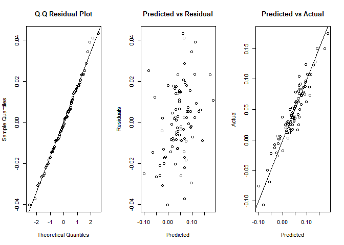<!-- -->

### Adaptive LASSO

<br/> We start with the inference using the adaptive LASSO. First, we
need to compute the weights. Since $p$ is quite close to $N$, we will
use the ridge regression instead of OLS. <br/>

``` r
# standardize the predictors
growth_std <- as.matrix(scale(GrowthData[,-1], center = TRUE, scale = TRUE))

# ridge regression
set.seed(123)
growth_ridge_cv <- cv.glmnet(growth_std,GrowthData$Outcome,alpha=0,family='gaussian', nfolds = 10,type.measure = 'mse')
beta_ridge <- growth_ridge_cv$glmnet.fit$beta[,growth_ridge_cv$index[1]]

# rescaling
growth_rsc <- scale(growth_std,center = FALSE,scale = 1/abs(beta_ridge))
```

<br/> Let us analyze the LASSO path. <br/>

``` r
lar_growth <- lar(x = growth_rsc, y = GrowthData$Outcome, maxsteps=2000, minlam=0, normalize=FALSE)

# We use estimateSigma to estimate the variance since p>N/2
set.seed(123)
larinf_growth_alasso <- larInf(lar_growth,sigma = estimateSigma(growth_rsc, GrowthData$Outcome, intercept=TRUE, standardize=FALSE)$sigmahat)

pvalues_growth_alasso <- round(cbind(larinf_growth_alasso$pv.spacing,larinf_growth_alasso$pv.covtest),4)
rownames(pvalues_growth_alasso) <- larinf_growth_alasso$vars
colnames(pvalues_growth_alasso) <- c('Spacing test','Covariance test')
pvalues_growth_alasso[1:5,]
```

    ##    Spacing test Covariance test
    ## 2        0.0000          0.0000
    ## 23       0.5883          0.6146
    ## 8        0.9156          0.9784
    ## 1        0.0159          0.0928
    ## 22       0.8550          0.9208

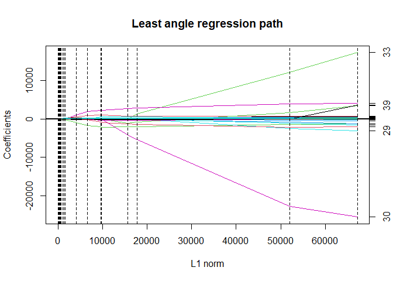<!-- -->

<br/> We observe that the addition of the first variable (**gdpsh465**)
was deemed significant by the spacing test and not by the covariance
test. However, we should remember that the spacing test is exact and
considers an incremental null hypothesis, whereas the covariance test is
merely asymptotic and tests a complete null hypothesis.

Let us move to the fixed-lambda inference. To obtain a more stable
estimate of $\lambda$, we will repeat the cross-validation multiple
times. <br/>

``` r
set.seed(123)
repeats <- 100
lambda_min <- rep(NaN,repeats)

for (i in 1:repeats){
growth_lasso_cv <- cv.glmnet(growth_rsc,GrowthData$Outcome,alpha=1,family='gaussian',nfolds = 10,type.measure = 'mse', standardize = FALSE)
lambda_min[i] <- growth_lasso_cv$lambda.min
}

lambda <- mean(lambda_min)
beta  <- coef(growth_lasso_cv,x = growth_rsc,y = GrowthData$Outcome,s = lambda, exact = TRUE)[-1]

fixedLassoInf(growth_rsc,GrowthData$Outcome,beta,lambda*90,family = 'gaussian', alpha = 0.05,sigma = estimateSigma(growth_rsc, GrowthData$Outcome, intercept=TRUE, standardize=FALSE)$sigmahat)
```

    ## 
    ## Call:
    ## fixedLassoInf(x = growth_rsc, y = GrowthData$Outcome, beta = beta, 
    ##     lambda = lambda * 90, family = "gaussian", sigma = estimateSigma(growth_rsc, 
    ##         GrowthData$Outcome, intercept = TRUE, standardize = FALSE)$sigmahat, 
    ##     alpha = 0.05)
    ## 
    ## Standard deviation of noise (specified or estimated) sigma = 0.044
    ## 
    ## Testing results at lambda = 0.001, with alpha = 0.050
    ## 
    ##  Var   Coef Z-score P-value LowConfPt UpConfPt LowTailArea UpTailArea
    ##    1 -2.966  -3.216   0.052    -8.593    0.819       0.025      0.025
    ##    2 -1.203  -2.225   0.186    -2.367    1.562       0.025      0.025
    ##    3  1.860   1.227   0.146    -4.439   23.957       0.025      0.025
    ##    4 -1.583  -1.108   0.326    -6.486    5.116       0.025      0.025
    ##    7 -0.983  -0.512   0.319   -23.074   11.312       0.025      0.025
    ##    8  5.462   2.406   0.048    -1.459   22.586       0.025      0.025
    ##    9  0.697   0.379   0.686   -20.856    7.302       0.025      0.025
    ##   10 -7.916  -2.371   0.108   -33.622    6.847       0.025      0.025
    ##   11 -7.240  -1.515   0.407   -74.836   61.185       0.025      0.025
    ##   13  1.323   0.323   0.596   -48.122   69.695       0.025      0.025
    ##   19 -2.778  -1.766   0.168   -17.795    5.022       0.025      0.025
    ##   20  1.389   0.833   0.242    -7.672   22.064       0.025      0.025
    ##   22 -1.686  -1.717   0.207    -7.666    3.197       0.025      0.025
    ##   23  1.001   1.582   0.179    -1.878    6.060       0.025      0.025
    ##   26 -2.957  -1.412   0.157   -27.106    6.173       0.025      0.025
    ##   31  1.842   0.375   0.910  -226.532   10.076       0.025      0.025
    ##   32 -3.661  -1.467   0.663   -16.573   48.549       0.025      0.025
    ##   37  7.477   1.627   0.042    -3.611  171.950       0.025      0.025
    ##   42 -1.362  -1.525   0.165    -4.021    1.632       0.025      0.025
    ##   45 -1.185  -0.384   0.866    -6.582   83.862       0.025      0.025
    ##   51  1.561   1.543   0.091    -1.331   10.701       0.025      0.025
    ##   59  0.242   0.178   0.874   -36.238    2.885       0.025      0.025
    ##   60  0.465   0.284   0.583   -23.542   15.633       0.025      0.025
    ## 
    ## Note: coefficients shown are partial regression coefficients

<br/> We observe that the effect of **gdpsh465** is borderline
significant and negative. However, the P-value depends on the particular
selected value of $\lambda$. For example, if we use the (lower) median
value obtained from CVs ($\lambda \approx 2,9\cdot10^{-6}$) instead of the
mean ($\lambda \approx 6,2\cdot10^{-6}$), the effect is not significant.
<br/>

``` r
lambda <- median(lambda_min)
beta  <- coef(growth_lasso_cv,x = growth_rsc,y = GrowthData$Outcome,s = lambda, exact = TRUE)[-1]

fixedLassoInf(growth_rsc,GrowthData$Outcome,beta,lambda*90,family = 'gaussian', alpha = 0.05,sigma = estimateSigma(growth_rsc, GrowthData$Outcome, intercept=TRUE, standardize=FALSE)$sigmahat)
```

    ## 
    ## Call:
    ## fixedLassoInf(x = growth_rsc, y = GrowthData$Outcome, beta = beta, 
    ##     lambda = lambda * 90, family = "gaussian", sigma = estimateSigma(growth_rsc, 
    ##         GrowthData$Outcome, intercept = TRUE, standardize = FALSE)$sigmahat, 
    ##     alpha = 0.05)
    ## 
    ## Standard deviation of noise (specified or estimated) sigma = 0.044
    ## 
    ## Testing results at lambda = 0.000, with alpha = 0.050
    ## 
    ##  Var    Coef Z-score P-value LowConfPt UpConfPt LowTailArea UpTailArea
    ##    1  -1.953  -1.876   0.228    -6.936    3.686       0.025      0.025
    ##    2  -1.057  -1.920   0.073    -2.668    0.455       0.025      0.024
    ##    3   0.851   0.489   0.264    -9.744   27.279       0.025      0.025
    ##    4  -2.035  -1.374   0.313   -20.745   10.259       0.025      0.000
    ##    7  -0.064  -0.031   0.642   -19.619   37.095       0.025      0.025
    ##    8   6.493   2.720   0.057    -2.362   27.396       0.025      0.025
    ##    9   0.286   0.156   0.741   -23.705    6.482       0.025      0.025
    ##   10 -10.510  -2.874   0.197   -49.892   19.889       0.025      0.000
    ##   11  -7.766  -2.880   0.032   -14.224    0.523       0.024      0.025
    ##   17  -0.495  -0.102   0.492  -247.280  240.151       0.025      0.025
    ##   19  -3.528  -2.011   0.150   -33.848    7.321       0.025      0.025
    ##   20   0.718   0.418   0.533   -10.074    7.026       0.025      0.025
    ##   22   0.046   0.035   0.624    -7.473   12.974       0.025      0.025
    ##   23   1.317   1.260   0.262    -5.706   13.344       0.025      0.025
    ##   24  -5.430  -1.008   0.338   -73.954   43.163       0.025      0.025
    ##   26  -2.194  -0.882   0.477   -13.369   16.667       0.025      0.025
    ##   31   3.560   0.709   0.483   -50.991   47.711       0.025      0.025
    ##   32  -4.442  -1.750   0.228   -47.380   16.657       0.025      0.000
    ##   37   5.901   1.280   0.167   -11.427   44.439       0.025      0.025
    ##   40  -3.930  -0.861   0.635   -39.618   84.030       0.025      0.025
    ##   42  -1.335  -1.471   0.197    -3.881    1.973       0.025      0.025
    ##   45  -0.129  -0.025   0.608  -205.517  327.416       0.025      0.025
    ##   51   2.400   1.359   0.347   -18.857   30.636       0.025      0.025
    ##   52  -3.274  -0.767   0.478   -59.740   60.263       0.025      0.025
    ##   58  -9.598  -1.850   0.406   -88.895   74.176       0.025      0.025
    ##   59   7.550   1.801   0.441   -61.978   63.432       0.025      0.025
    ##   60  -0.327  -0.186   0.890   -78.207    6.366       0.025      0.025
    ## 
    ## Note: coefficients shown are partial regression coefficients

<br/> Let us bootstrap the entire estimation process to evaluate
sampling variability (we will use one 10-fold cross-validation to
estimate $\lambda$ to speed up computations). <br/>

``` r
set.seed(123)
nb <- 1000

betas_int_boot2 <- rep(NA,nb)

for(i in 1:nb){
  
  # resample and standardize
  GrowthData_new <-  GrowthData[sample(nrow(GrowthData) , rep=TRUE),]
  growth_std_new <- as.matrix(scale(GrowthData_new[,-1], center = TRUE, scale = TRUE))
  scale_std_new <- attr(growth_std_new,"scaled:scale")
  
  
  # weights via ridge
  growth_ridge_cv_new <- cv.glmnet(growth_std_new,GrowthData_new$Outcome,
                                   alpha=0,family='gaussian', nfolds = 10,type.measure ='mse')
  
  beta_ridge_new <- growth_ridge_cv_new$glmnet.fit$beta[,growth_ridge_cv_new$index[1]]
  growth_rsc_new <- scale(growth_std_new,center = FALSE,scale = 1/abs(beta_ridge_new))
  
  
  # adaptive LASSO
  growth_lasso_cv_new <- cv.glmnet(growth_rsc_new,GrowthData_new$Outcome,
                                   alpha=1,family='gaussian',nfolds = 10,type.measure = 'mse', standardize = FALSE)
  betas_int_boot2[i] <- 
    growth_lasso_cv_new$glmnet.fit$beta[1,growth_lasso_cv_new$index[1]]*abs(beta_ridge_new)[1]*scale_std_new[1]
  
}

quantile(betas_int_boot2, c(0.025,0.975))
```

    ##          2.5%         97.5% 
    ## -0.0449480331  0.0004773465

``` r
sum(abs(betas_int_boot2) > 0)
```

    ## [1] 916

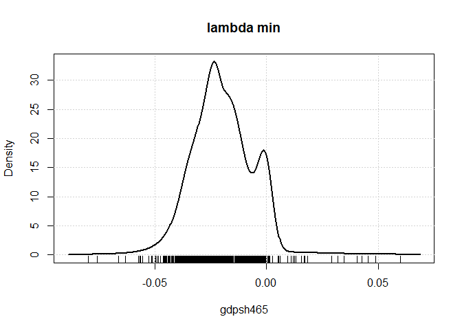<!-- -->

<br/> The estimation of the effect of **gdpsh465** is relatively stable
via the adaptive LASSO. The LASSO selection picked **gdpsh465** as
non-zero in the vast majority of cases. The percentile-based confidence
interval of the parameter estimate also shows that the coefficient was
almost always non-positive.

However, this approach has a notable weakness. As we mentioned when
discussing least angle regression, the LASSO selects predictors based on
their correlation with the “residual” response; see \[1, Section 5.6\].
This means that once **gdpsh465** enters the model, it is less likely
that other covariates correlated with **gdpsh465** enter the model as
well. Consequently, the effect of **gdpsh465** could be overstated due
to the absence of other covariates that could also explain the estimated
effect of **gdpsh465** on the response. <br/>

### Double-Selection LASSO

The double-selection LASSO is a popular inference method proposed
in \[15\]. Let us assume a model $Y = \alpha Z + X\beta$, where $Z$ is
the effect of interest and $X$ are other control variables and goals.
The double-selection LASSO proceeds as follows. <br/>

 1.  Run a LASSO $Z = X\beta$
 2.  Run a LASSO $Y = X\beta$
 3.  Run OLS $Y = \alpha Z + \hat X\hat\beta$, where $\hat X$ includes
      all variables selected by 1. and 2.

<br/> The advantage of double-selection is that it considers both
covariates correlated with the response and those correlated with the
variable of interest.

We should note that the inference in \[15\] is based on the asymptotic
properties of the LASSO selection (by using OLS, the inference ignores
the selection procedure). Thus, finite-sample inference might be
invalid, as we discussed (omitted-variable bias seems to be the biggest
concern \[16\]). Hence, we should probably combine the inference with a
bootstrap to better estimate the variability of the estimates.

Let us first perform the variable selection 1. and 2. using the adaptive
LASSO. We will use a repeated 10-fold cross-validation to estimate the
optimal $\lambda$. <br/>

``` r
growth_std2 <- growth_std[,-1]

set.seed(123)

# ridge regression
growth_ridge_cv_x <- cv.glmnet(growth_std2,GrowthData$gdpsh465,alpha=0,family='gaussian', nfolds = 10,type.measure = 'mse')
growth_ridge_cv_y <- cv.glmnet(growth_std2,GrowthData$Outcome,alpha=0,family='gaussian', nfolds = 10,type.measure = 'mse')

beta_ridge_x <- growth_ridge_cv_x$glmnet.fit$beta[,growth_ridge_cv_x$index[1]]
beta_ridge_y <- growth_ridge_cv_y$glmnet.fit$beta[,growth_ridge_cv_y$index[1]]

# rescaling
growth_rsc_x <- scale(growth_std2,center = FALSE,scale = 1/abs(beta_ridge_x))
growth_rsc_y <- scale(growth_std2,center = FALSE,scale = 1/abs(beta_ridge_y))

repeats <- 100
lambda_min_x <- rep(NaN,repeats)
lambda_min_y <- rep(NaN,repeats)

for (i in 1:repeats){
growth_lasso_cv_x <- cv.glmnet(growth_rsc_x,GrowthData$gdpsh465,alpha=1,family='gaussian',nfolds = 10,type.measure = 'mse', standardize = FALSE)
growth_lasso_cv_y <- cv.glmnet(growth_rsc_y,GrowthData$Outcome,alpha=1,family='gaussian',nfolds = 10,type.measure = 'mse', standardize = FALSE)

lambda_min_x[i] <- growth_lasso_cv_x$lambda.min
lambda_min_y[i] <- growth_lasso_cv_y$lambda.min
}

lambda_x <- mean(lambda_min_x)
lambda_y <- mean(lambda_min_y)

beta_x  <- coef(growth_lasso_cv_x,x = growth_rsc_x,y = GrowthData$gdpsh465,s = lambda_x, exact = TRUE)[-1]
beta_y  <- coef(growth_lasso_cv_y,x = growth_rsc_y,y = GrowthData$Outcome,s = lambda_y, exact = TRUE)[-1]
```

<br/> Next, we fit the OLS model. <br/>

``` r
beta_ind <- c(TRUE, TRUE,abs(beta_x)> 0 | abs(beta_y)> 0)
summary(lm(Outcome~ .,data = GrowthData[,beta_ind]))
```

    ## 
    ## Call:
    ## lm(formula = Outcome ~ ., data = GrowthData[, beta_ind])
    ## 
    ## Residuals:
    ##       Min        1Q    Median        3Q       Max 
    ## -0.076195 -0.018464 -0.002653  0.018032  0.073038 
    ## 
    ## Coefficients:
    ##               Estimate Std. Error t value Pr(>|t|)  
    ## (Intercept)  9.748e-02  3.928e-01   0.248   0.8049  
    ## gdpsh465    -2.722e-02  2.116e-02  -1.286   0.2035  
    ## bmp1l       -5.154e-02  2.638e-02  -1.954   0.0556 .
    ## freeop       1.029e-01  1.326e-01   0.776   0.4410  
    ## freetar     -3.401e-01  3.751e-01  -0.907   0.3684  
    ## hm65         7.420e-02  1.801e-01   0.412   0.6819  
    ## hf65        -2.772e-01  1.894e-01  -1.464   0.1488  
    ## p65          1.015e-01  9.526e-02   1.066   0.2910  
    ## pm65         1.897e-03  1.079e-01   0.018   0.9860  
    ## sf65        -9.712e-02  5.864e-02  -1.656   0.1032  
    ## lifee065     4.621e-02  9.227e-02   0.501   0.6184  
    ## invsh41      1.163e-01  8.626e-02   1.349   0.1828  
    ## geerec1      7.414e-01  1.149e+00   0.645   0.5215  
    ## gde1         1.357e+00  9.195e-01   1.475   0.1456  
    ## govsh41     -1.426e+00  1.050e+00  -1.358   0.1799  
    ## gvxdxe41     1.304e+00  1.108e+00   1.177   0.2443  
    ## highcm65    -1.704e-03  7.087e-03  -0.240   0.8109  
    ## humanf65    -3.390e-03  8.800e-03  -0.385   0.7015  
    ## hyrm65       2.061e-01  1.700e-01   1.212   0.2305  
    ## nof65       -1.630e-04  5.815e-04  -0.280   0.7803  
    ## pinstab1    -3.250e-02  2.489e-02  -1.306   0.1968  
    ## pop65        2.849e-08  7.826e-08   0.364   0.7172  
    ## worker65     3.944e-02  1.180e-01   0.334   0.7395  
    ## pop1565     -2.134e-01  1.961e-01  -1.088   0.2811  
    ## pop6565     -2.445e-01  4.655e-01  -0.525   0.6015  
    ## seccm65      4.306e-03  2.882e-03   1.494   0.1407  
    ## seccf65     -3.323e-03  2.949e-03  -1.127   0.2646  
    ## syrm65       2.910e-03  2.948e-02   0.099   0.9217  
    ## teapri65     2.146e-04  7.531e-04   0.285   0.7767  
    ## teasec65    -1.005e-03  9.483e-04  -1.059   0.2939  
    ## ex1         -2.744e-01  1.823e-01  -1.505   0.1379  
    ## im1          2.665e-01  1.849e-01   1.441   0.1550  
    ## xr65        -8.057e-06  4.656e-05  -0.173   0.8632  
    ## ---
    ## Signif. codes:  0 '***' 0.001 '**' 0.01 '*' 0.05 '.' 0.1 ' ' 1
    ## 
    ## Residual standard error: 0.03905 on 57 degrees of freedom
    ## Multiple R-squared:  0.629,  Adjusted R-squared:  0.4208 
    ## F-statistic:  3.02 on 32 and 57 DF,  p-value: 0.0001336

<br/> We observe that after performing double selection by including
covariates that could explain the effect of **gdpsh465**, the effect of
**gdpsh465** itself is no longer significant. Let us perform the
bootstrap. <br/>

``` r
set.seed(123)
nb <- 1000

betas_int_boot3 <- rep(NA,nb)

for(i in 1:nb){
  
  # resample and standardize
  GrowthData_new <-  GrowthData[sample(nrow(GrowthData) , rep=TRUE),]
  growth_std_new <- as.matrix(scale(GrowthData_new[,c(-1,-2)], center = TRUE, scale = TRUE))
  scale_std_new <- attr(growth_std_new,"scaled:scale")
  
  # weights via ridge
  growth_ridge_cv_x_new <- cv.glmnet(growth_std_new,GrowthData_new$gdpsh465,
                                     alpha=0,family='gaussian', nfolds = 10,type.measure = 'mse')
  
  growth_ridge_cv_y_new <- cv.glmnet(growth_std_new,GrowthData_new$Outcome,
                                     alpha=0,family='gaussian', nfolds = 10,type.measure = 'mse')
  
  beta_ridge_x_new <- growth_ridge_cv_x_new$glmnet.fit$beta[,growth_ridge_cv_x_new$index[1]]
  beta_ridge_y_new <- growth_ridge_cv_y_new$glmnet.fit$beta[,growth_ridge_cv_y_new$index[1]]
  
  growth_rsc_x_new <- scale(growth_std_new,center = FALSE,scale = 1/abs(beta_ridge_x_new))
  growth_rsc_y_new <- scale(growth_std_new,center = FALSE,scale = 1/abs(beta_ridge_y_new))
  
  
  # adaptive LASSO
  
  growth_lasso_cv_x_new <- cv.glmnet(growth_rsc_x_new,GrowthData_new$gdpsh465,
                                     alpha=1,family='gaussian',nfolds = 10,type.measure = 'mse', standardize = FALSE)
  growth_lasso_cv_y_new <- cv.glmnet(growth_rsc_y_new,GrowthData_new$Outcome,
                                     alpha=1,family='gaussian',nfolds = 10,type.measure = 'mse', standardize = FALSE)
  
  beta_x_new  <- growth_lasso_cv_x_new$glmnet.fit$beta[,growth_lasso_cv_x_new$index[1]]
  beta_y_new  <- growth_lasso_cv_y_new$glmnet.fit$beta[,growth_lasso_cv_y_new$index[1]]
  beta_ind_new <- c(TRUE, TRUE,abs(beta_x_new)> 0 | abs(beta_y_new)> 0)
  
  # OLS
  betas_int_boot3[i] <- coefficients(lm(Outcome~ .,data = GrowthData_new[,beta_ind_new]))[2]

}

quantile(betas_int_boot3, c(0.025,0.975))
```

    ##        2.5%       97.5% 
    ## -0.09924678  0.04505795

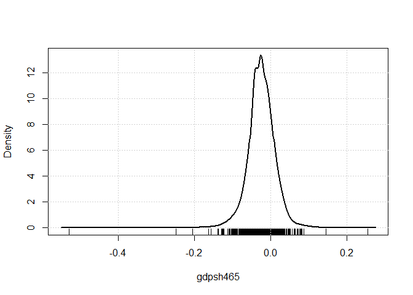<!-- -->

<br/> We confirm that the estimated effect by the double-selection LASSO
is not significant. <br/>

### Double-Selection LASSO (partialing-out)

<br/> The *partialing-out* estimator \[17\] based on the
double-selection LASSO is an alternative approach for estimating the
effect of a variable of interest, adjusted for other covariates; see
<https://www.stata.com/manuals/lasso.pdf>.  
<br/>

 1.  Run a LASSO $Z = X\beta$.
 2.  Run OLS $Z = \hat X \hat \beta$, where $\hat X$ includes all
      variables selected by 1. and obtain residuals $d_Z$
 3.  Run a LASSO $Y = X\beta$ and perform OLS.
 4.  Run OLS $Y = \tilde X \tilde \beta$, where $\tilde X$ includes all
      variables selected by 3. and obtain residuals $d_Y$
 5.  Run OLS $d_Y \sim d_Z$.

<br/> Using the LASSO regression results from the previous section, we
obtain the following OLS. <br/>

``` r
beta_x_ind <- c(FALSE, FALSE,abs(beta_x)> 0)
beta_y_ind <- c(FALSE, FALSE,abs(beta_y)> 0)

resid_x <- residuals(lm(GrowthData$gdpsh465 ~ .,data = GrowthData[,beta_x_ind]))
resid_y <- residuals(lm(GrowthData$Outcome~ .,data = GrowthData[,beta_y_ind]))

summary(lm(resid_y~resid_x))
```

    ## 
    ## Call:
    ## lm(formula = resid_y ~ resid_x)
    ## 
    ## Residuals:
    ##       Min        1Q    Median        3Q       Max 
    ## -0.090667 -0.024850 -0.000701  0.023569  0.076213 
    ## 
    ## Coefficients:
    ##               Estimate Std. Error t value Pr(>|t|)   
    ## (Intercept) -5.003e-19  3.585e-03   0.000  1.00000   
    ## resid_x     -4.600e-02  1.367e-02  -3.365  0.00113 **
    ## ---
    ## Signif. codes:  0 '***' 0.001 '**' 0.01 '*' 0.05 '.' 0.1 ' ' 1
    ## 
    ## Residual standard error: 0.03401 on 88 degrees of freedom
    ## Multiple R-squared:  0.114,  Adjusted R-squared:  0.104 
    ## F-statistic: 11.33 on 1 and 88 DF,  p-value: 0.001134

<br/> We observe that the estimated effect is negative and strongly
significant. Let us resample the whole procedure. <br/>

``` r
set.seed(123)
nb <- 1000

betas_int_boot4 <- rep(NA,nb)

for(i in 1:nb){
  
  # resample and standardize
  GrowthData_new <-  GrowthData[sample(nrow(GrowthData) , rep=TRUE),]
  growth_std_new <- as.matrix(scale(GrowthData_new[,c(-1,-2)], center = TRUE, scale = TRUE))
  scale_std_new <- attr(growth_std_new,"scaled:scale")
  
  # weights via ridge
  growth_ridge_cv_x_new <- cv.glmnet(growth_std_new,GrowthData_new$gdpsh465,
                                     alpha=0,family='gaussian', nfolds = 10,type.measure = 'mse')
  
  growth_ridge_cv_y_new <- cv.glmnet(growth_std_new,GrowthData_new$Outcome,
                                     alpha=0,family='gaussian', nfolds = 10,type.measure = 'mse')
  
  beta_ridge_x_new <- growth_ridge_cv_x_new$glmnet.fit$beta[,growth_ridge_cv_x_new$index[1]]
  beta_ridge_y_new <- growth_ridge_cv_y_new$glmnet.fit$beta[,growth_ridge_cv_y_new$index[1]]
  
  growth_rsc_x_new <- scale(growth_std_new,center = FALSE,scale = 1/abs(beta_ridge_x_new))
  growth_rsc_y_new <- scale(growth_std_new,center = FALSE,scale = 1/abs(beta_ridge_y_new))
  
  
  # adaptive LASSO
  growth_lasso_cv_x_new <- cv.glmnet(growth_rsc_x_new,GrowthData_new$gdpsh465,
                                     alpha=1,family='gaussian',nfolds = 10,type.measure = 'mse', standardize = FALSE)
  growth_lasso_cv_y_new <- cv.glmnet(growth_rsc_y_new,GrowthData_new$Outcome,
                                     alpha=1,family='gaussian',nfolds = 10,type.measure = 'mse', standardize = FALSE)
  
  
  # OLS
  beta_x_new  <- growth_lasso_cv_x_new$glmnet.fit$beta[,growth_lasso_cv_x_new$index[1]]
  beta_y_new  <- growth_lasso_cv_y_new$glmnet.fit$beta[,growth_lasso_cv_y_new$index[1]]
  beta_x_ind_new <- c(FALSE, TRUE,abs(beta_x_new)> 0)
  beta_y_ind_new <- c(TRUE, FALSE,abs(beta_y_new)> 0)

  resid_x_new <- residuals(lm(GrowthData$gdpsh465 ~ .,data = GrowthData_new[,beta_x_ind_new]))
  resid_y_new <- residuals(lm(GrowthData$Outcome~ .,data = GrowthData_new[,beta_y_ind_new]))
  
  betas_int_boot4[i] <- coefficients(lm(resid_y_new~resid_x_new))[2]
  
}

quantile(betas_int_boot4, c(0.025,0.975))
```

    ##         2.5%        97.5% 
    ## -0.006269417  0.009307017

<!-- -->

<br/> Even though the original regression was deemed significant, the
bootstraped result is not.

Overall, we can conclude that after adjusting for other relevant
variables (chosen by the adaptive LASSO), the effect of **gdpsh465**
itself was not deemed significant. Our findings are actually consistent
with the empirical studies. There is evidence that convergence
occurs among economies that are similar  (conditional 
convergence), but global (unconditional) convergence remains "elusive" \[18\].
<br/>

## Lymphoma dataset

The last dataset we will have a look at is the *lymphoma* dataset
\[1,19\]. It contains gene expression data for 7399 genes measured in 240
lymphoma patients, along with censored survival times for these
patients. <br/>

### Initial exploration

First, let us load the dataset.

``` r
lymphstatus <- read_delim('C:/Users/elini/Desktop/nine circles/lymphstatus.txt', delim = ' ', col_names = FALSE)
lymphtim <- read_delim('C:/Users/elini/Desktop/nine circles/lymphtim.txt', delim = ' ', col_names = FALSE)
lymphx <- read_delim('C:/Users/elini/Desktop/nine circles/lymphx.txt', col_names = FALSE)

lymph <- cbind(lymphstatus,lymphtim)
colnames(lymph) <- c('Status','Time')
lymphx_std <- scale(lymphx, center = TRUE, scale = TRUE)
```

<br/> We are dealing with the survival analysis data. Consequently, we
will use the methods from the Fifth Circle. Let us start with the
Kaplan-Meier estimator of the survival function. <br/>

``` r
library(survival)
library(ggsurvfit)

km_status <- survfit(Surv(Time,Status) ~ 1, data = lymph, conf.type ='log-log')

summary(km_status)
```

    ## Call: survfit(formula = Surv(Time, Status) ~ 1, data = lymph, conf.type = "log-log")
    ## 
    ##  time n.risk n.event survival std.err lower 95% CI upper 95% CI
    ##   1.0    240       5    0.979 0.00922        0.951        0.991
    ##   1.1    235       8    0.946 0.01461        0.909        0.968
    ##   1.2    227       4    0.929 0.01656        0.889        0.955
    ##   1.3    223      12    0.879 0.02104        0.831        0.914
    ##   1.4    211      10    0.837 0.02381        0.784        0.879
    ##   1.5    201       3    0.825 0.02453        0.771        0.868
    ##   1.6    198       5    0.804 0.02562        0.748        0.849
    ##   1.7    193       8    0.771 0.02713        0.712        0.819
    ##   1.8    185       3    0.758 0.02763        0.699        0.808
    ##   1.9    181       3    0.746 0.02811        0.686        0.796
    ##   2.0    178       7    0.716 0.02911        0.655        0.769
    ##   2.1    170       6    0.691 0.02986        0.628        0.745
    ##   2.2    164       3    0.679 0.03019        0.615        0.734
    ##   2.3    161       7    0.649 0.03087        0.585        0.706
    ##   2.4    154       2    0.641 0.03104        0.576        0.698
    ##   2.5    152       2    0.632 0.03120        0.568        0.690
    ##   2.6    150       2    0.624 0.03134        0.559        0.682
    ##   2.7    147       1    0.619 0.03142        0.555        0.678
    ##   2.9    144       2    0.611 0.03156        0.546        0.669
    ##   3.0    141       2    0.602 0.03170        0.537        0.661
    ##   3.1    138       2    0.593 0.03184        0.528        0.653
    ##   3.3    136       4    0.576 0.03208        0.511        0.636
    ##   3.4    130       2    0.567 0.03219        0.502        0.627
    ##   3.5    128       2    0.558 0.03229        0.493        0.619
    ##   3.6    125       1    0.554 0.03234        0.488        0.615
    ##   3.7    124       2    0.545 0.03243        0.479        0.606
    ##   3.8    121       2    0.536 0.03251        0.470        0.597
    ##   3.9    117       2    0.527 0.03260        0.461        0.588
    ##   4.0    115       2    0.518 0.03267        0.452        0.579
    ##   4.1    113       1    0.513 0.03270        0.447        0.575
    ##   4.3    112       1    0.508 0.03272        0.443        0.570
    ##   4.6    106       1    0.504 0.03277        0.438        0.566
    ##   4.9    105       1    0.499 0.03280        0.433        0.561
    ##   5.1     99       1    0.494 0.03286        0.428        0.556
    ##   5.3     95       1    0.489 0.03292        0.423        0.551
    ##   5.5     93       1    0.483 0.03298        0.417        0.546
    ##   6.0     89       1    0.478 0.03305        0.412        0.541
    ##   6.4     85       2    0.467 0.03322        0.400        0.530
    ##   6.6     82       2    0.455 0.03337        0.389        0.519
    ##   7.0     75       1    0.449 0.03347        0.383        0.513
    ##   7.1     73       1    0.443 0.03358        0.376        0.507
    ##   7.2     72       1    0.437 0.03367        0.370        0.502
    ##   7.6     68       1    0.430 0.03378        0.364        0.495
    ##   7.8     65       1    0.424 0.03390        0.357        0.489
    ##   7.9     63       2    0.410 0.03414        0.343        0.476
    ##   8.5     53       1    0.403 0.03436        0.335        0.469
    ##  10.1     40       1    0.393 0.03494        0.324        0.460
    ##  11.6     23       1    0.376 0.03736        0.303        0.448
    ##  12.0     21       1    0.358 0.03963        0.281        0.435
    ##  17.9      4       1    0.268 0.08294        0.124        0.436

``` r
survfit2(Surv(Time,Status) ~ 1, data = lymph,conf.type ='log-log') %>% 
  ggsurvfit() +
  labs(
    x = "Time (in years)",
    y = "Overall survival probability"
  ) + add_confidence_interval()
```

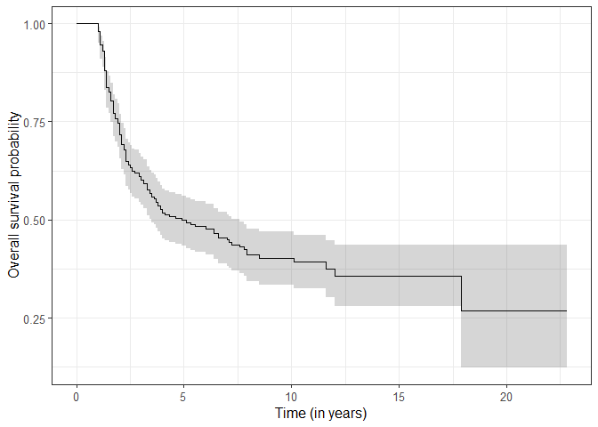<!-- -->

<br/> The median survival time in the study was about five years. The
potential follow-up time of the study was about 9 years. <br/>

``` r
# median survival time
km_status
```

    ## Call: survfit(formula = Surv(Time, Status) ~ 1, data = lymph, conf.type = "log-log")
    ## 
    ##        n events median 0.95LCL 0.95UCL
    ## [1,] 240    138    4.9     3.5     7.6

``` r
# potential median follow-up time (i.e., how long follow-up time would be provided if the subjects did not fail)
survfit(Surv(Time,1-Status) ~ 1, data = lymph)
```

    ## Call: survfit(formula = Surv(Time, 1 - Status) ~ 1, data = lymph)
    ## 
    ##        n events median 0.95LCL 0.95UCL
    ## [1,] 240    102    8.8     8.2    10.2

<br/> We can also attempt to estimate the hazard function
nonparametrically. <br/>

``` r
library(muhaz)
muhaz1 <- muhaz(lymph$Time, lymph$Status, max.time=20, bw.grid=1, bw.method="global", b.cor="none")
muhaz2 <- muhaz(lymph$Time, lymph$Status, max.time=20, bw.grid=2, bw.method="global", b.cor="none")
muhaz3 <- muhaz(lymph$Time, lymph$Status, max.time=20, bw.grid=5, bw.method="global", b.cor="none")
muhaz4 <- muhaz(lymph$Time, lymph$Status, max.time=20, bw.grid=10, bw.method="global", b.cor="none")
```

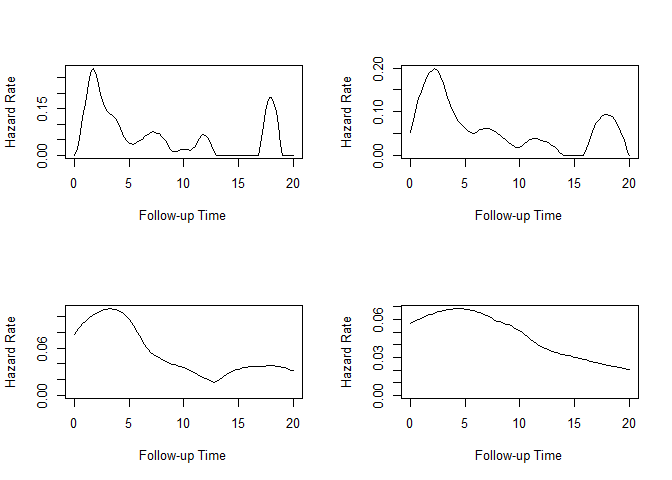<!-- -->

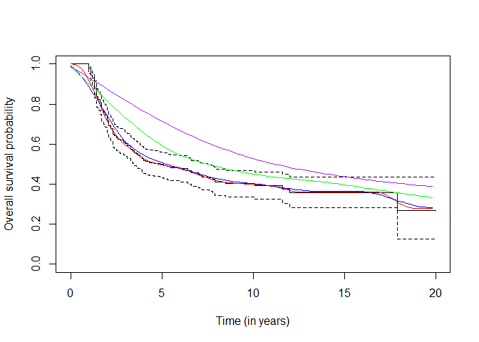<!-- -->

<br/> The overall hazard function appears quite complex. The smoother
estimates do not correspond to the Kaplan-Meier estimator at all. <br/>

### LASSO and adaptive LASSO fit

<br/> Let us consider the Cox proportional hazards model to estimate the
effects of gene expression on the survival probability. Since $p \gg N$,
we cannot even fit a Cox proportional hazards model without
regularization. First, we will consider the ordinary LASSO. The
estimator is given as the minimimum of the log-partial likelihood
$-\sum_{i \mid \delta_i = 1} \mathrm{log} \frac{e^{\beta^Tx_i}}{\sum_{j \in R_i} e^{\beta^Tx_j}} + \lambda \Vert\beta\Vert_1$,
where $i = 1, \ldots, N$, $\delta_i$ is the status indicator (0 denotes
a censored observation) and $R_i$ are all subjects that did not fail at the
time $y_i$.

The *glmement* package allows us to fit the penalized Cox proportional
hazards model (we will use deviance as the cross-validation metric).
<br/>

``` r
lymph_lasso <- glmnet(lymphx,Surv(lymph$Time, lymph$Status),alpha=1,family='cox')

set.seed(123)
lymph_lasso_cv <- cv.glmnet(as.matrix(lymphx_std ),
                            Surv(lymph$Time, lymph$Status),alpha=1,family='cox',type.measure= 'deviance', nfolds = 10)
```

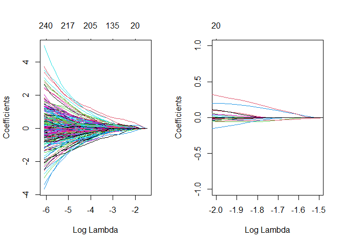<!-- -->

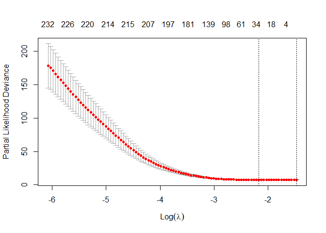<!-- -->

<br/> We observe that the mean CV is quite flat. The LASSO ($\lambda$
min as the penalization parameter) picked the following predictors.
<br/>

``` r
lymph_lasso_cv$glmnet.fit$beta[,lymph_lasso_cv$index[1]][abs(lymph_lasso_cv$glmnet.fit$beta[,lymph_lasso_cv$index[1]]) > 0]
```

    ##          X30          X80         X394         X556        X1188        X1456 
    ##  0.004853925  0.032350821  0.005901470  0.029416314 -0.038009305  0.078910731 
    ##        X1664        X1825        X1871        X2437        X2570        X3813 
    ##  0.010860976  0.150396931  0.054423080  0.002389597  0.008786500 -0.019294437 
    ##        X3821        X4131        X5023        X5027        X5055        X5301 
    ## -0.089918246 -0.113209699 -0.006270582 -0.058697559 -0.003098894 -0.007219009 
    ##        X6156        X6166        X6411        X6607        X6956        X7069 
    ## -0.021266882  0.019788246  0.060746374  0.032473672  0.088386569  0.032997020 
    ##        X7098        X7250        X7343        X7357 
    ##  0.044675571  0.003245962 -0.048280563 -0.160460262

``` r
# non-zero predictors
lymph_lasso_cv
```

    ## 
    ## Call:  cv.glmnet(x = as.matrix(lymphx_std), y = Surv(lymph$Time, lymph$Status),      type.measure = "deviance", nfolds = 10, alpha = 1, family = "cox") 
    ## 
    ## Measure: Partial Likelihood Deviance 
    ## 
    ##     Lambda Index Measure     SE Nonzero
    ## min 0.1143    16   7.613 0.2571      28
    ## 1se 0.2297     1   7.858 0.2323       0

<br/> We can check how well the selected predictors separate the
survival curves. Let us estimate the Kaplan-Meier estimator separately
for patients with $x^T\beta >0$ and $x^T\beta < 0$. <br/>

``` r
beta_lymph <- lymph_lasso_cv$glmnet.fit$beta[,lymph_lasso_cv$index[1]]

survfit2(Surv(Time,Status) ~ as.matrix(lymphx_std) %*% beta_lymph > 0, data = lymph, conf.type ='log-log') %>% 
  ggsurvfit() +
  labs(
    x = "Time",
    y = "Overall survival probability"
  ) + add_confidence_interval()
```

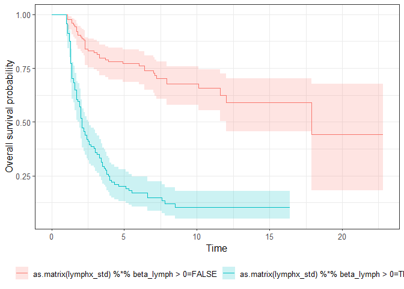<!-- -->

<br/> We observe that the survival functions differ substantially.
Still, we have to keep in mind that we had over 7000 predictors and just
220 observations. Thus, some separation (or all of it) could be due to
pure chance. This is a question that would have to be addresesed by a
new study focused on the candidate genes we have identified.

Let us move to the adaptive LASSO. We first fit the $l_2$-penalized Cox
proportional hazards model (i.e., ridge) to obtain initial parameter
values. <br/>

``` r
set.seed(123)
lymph_ridge_cv <- cv.glmnet(as.matrix(lymphx_std),
                            Surv(lymph$Time, lymph$Status),alpha=0,family='cox',type.measure='deviance')
```

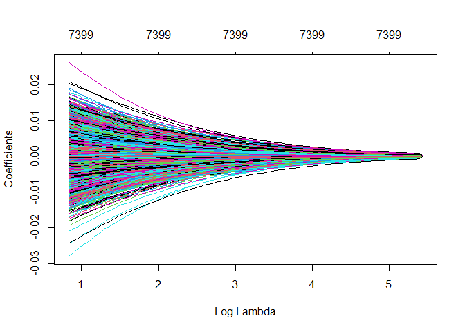<!-- -->

<br/> Again, we then scale the data and fit a LASSO. <br/>

``` r
beta_ridge <-lymph_ridge_cv$glmnet.fit$beta[,lymph_ridge_cv$index[1]]
lymphx_std_resc <- scale(lymphx_std, center = FALSE, scale = 1/abs(beta_ridge))


set.seed(123)
lymph_lasso_cv_adaptive <- cv.glmnet(as.matrix(lymphx_std_resc), standardize = FALSE,
                            Surv(lymph$Time, lymph$Status),alpha=1,family='cox',type.measure='deviance', nfolds = 10)
```

<br/> We observe that the adaptive LASSO selected a few more predictors
than the ordinary LASSO. <br/>

``` r
lymph_lasso_cv_adaptive
```

    ## 
    ## Call:  cv.glmnet(x = as.matrix(lymphx_std_resc), y = Surv(lymph$Time,      lymph$Status), type.measure = "deviance", nfolds = 10, standardize = FALSE,      alpha = 1, family = "cox") 
    ## 
    ## Measure: Partial Likelihood Deviance 
    ## 
    ##        Lambda Index Measure    SE Nonzero
    ## min 0.0001801    25   7.326 0.244      28
    ## 1se 0.0003148    13   7.559 0.232      13

``` r
lymph_lasso_cv_adaptive$glmnet.fit$beta[,lymph_lasso_cv_adaptive$index[1]][abs(lymph_lasso_cv_adaptive$glmnet.fit$beta[,lymph_lasso_cv_adaptive$index[1]]) > 0]
```

    ##          X30          X80         X556        X1456        X1664        X1825 
    ##  10.61454864  23.59617315  19.97198119  39.41875596   0.09032824  93.77128776 
    ##        X1871        X2437        X3239        X3821        X3825        X4131 
    ##  50.69994602   5.68565395  11.53079321 -72.65744519  -2.46780996 -54.24996777 
    ##        X4887        X5023        X5027        X5476        X6156        X6166 
    ##  28.49935194 -27.31141500 -43.06263592  -7.43552397 -33.78635536  17.36213239 
    ##        X6411        X6607        X6956        X7069        X7081        X7098 
    ##  33.65873490  40.76687231  59.61807862  21.49439544   0.55686509  38.20787417 
    ##        X7307        X7343        X7357        X7380 
    ##  -3.78660495 -31.76882378 -99.14871835  17.76375466

<br/> The separation in the data is very similar to the ordinary LASSO.
<br/>

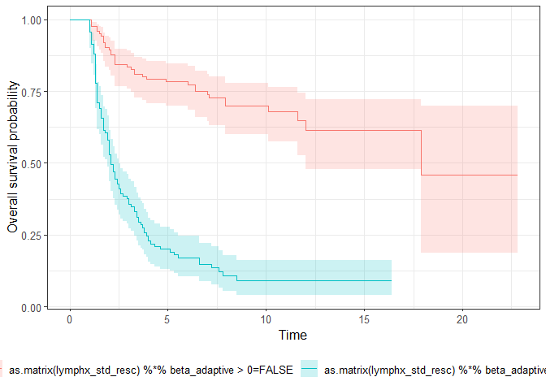<!-- -->

### Bootstrap

Let us assess the variability of both the LASSO and the adaptive LASSO
estimates via a nonparametric bootstrap. <br/>

``` r
library(doParallel)
registerDoParallel(4)

set.seed(123)
nb <- 1000

betas_boot1 <- matrix(NA,nb,7399)
betas_boot2 <- matrix(NA,nb,7399)

colnames(betas_boot1) <- colnames(lymphx_std)
colnames(betas_boot2) <- colnames(lymphx_std)


lymphx_std_all <- cbind(lymph,lymphx_std)

for(i in 1:nb){
  
  lymphx_new <-  lymphx_std_all[sample(nrow(lymphx_std_all) , rep=TRUE),]
  
  lymph_lasso_cv_new <- cv.glmnet(as.matrix(lymphx_new[,c(-1,-2)]),
                            Surv(lymphx_new$Time,
                                 lymphx_new$Status),alpha=1,family='cox',type.measure= 'deviance', nfolds = 10,
                            parallel=TRUE)
  
  lymph_ridge_cv_new <- cv.glmnet(as.matrix(lymphx_new[,c(-1,-2)]),
                            Surv(lymphx_new$Time,
                                 lymphx_new$Status),alpha=0,family='cox',type.measure= 'deviance', nfolds = 10,
                            parallel=TRUE)
  
  
  beta_ridge_new <-lymph_ridge_cv_new$glmnet.fit$beta[,lymph_ridge_cv_new$index[1]]
  lymphx_new_resc <- scale(lymphx_new[,c(-1,-2)], center = FALSE, scale = 1/abs(beta_ridge_new))
  
  lymph_lasso_cv2_new <- cv.glmnet(lymphx_new_resc, standardize = FALSE,
                            Surv(lymphx_new$Time,
                                 lymphx_new$Status),alpha=1,family='cox',type.measure= 'deviance', nfolds = 10,
                            parallel=TRUE)
  
  
  
  lymph_lasso_cv2_new <- cv.glmnet(lymphx_new_resc, standardize = FALSE,
                            Surv(lymphx_new$Time,
                                 lymphx_new$Status),alpha=1,family='cox',type.measure= 'deviance', nfolds = 10,
                            parallel=TRUE)

  betas_boot1[i,] <- lymph_lasso_cv_new$glmnet.fit$beta[,lymph_lasso_cv_new$index[1]]
  betas_boot2[i,] <- lymph_lasso_cv2_new$glmnet.fit$beta[,lymph_lasso_cv2_new$index[1]]*abs(beta_ridge_new)
}
```

<br/> Let us check which genes were picked somewhat often. <br/>
``` r
# at least half of the time
which(apply(betas_boot1,2,function(x)abs(median(x)))>0)
which(apply(betas_boot2,2,function(x)abs(median(x)))>0)
# at least two-thirds of the time
which(apply(betas_boot1,2,function(x)abs(quantile(x,1/3)))>0)
which(apply(betas_boot2,2,function(x)abs(quantile(x,1/3)))>0)
```

    ## X1825 X5027 X6607 X6956 X7357 X7380 
    ##  1825  5027  6607  6956  7357  7380

    ## X1825 X3395 X5027 X6607 X7357 X7380 
    ##  1825  3395  5027  6607  7357  7380

    ## X1825 X3395 X4131 X5027 X6156 X7307 X7357 
    ##  1825  3395  4131  5027  6156  7307  7357

    ## X1825 X3395 X5027 X6156 X6607 X7307 X7357 X7380 
    ##  1825  3395  5027  6156  6607  7307  7357  7380

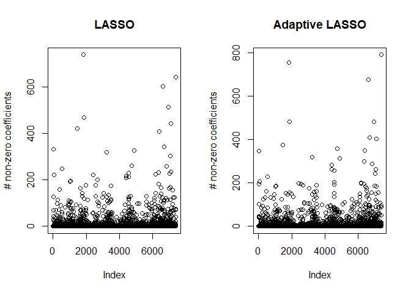<!-- -->

<br/> We observe that the variables picked by the LASSO and the adaptive
LASSO are pretty similar. <br/>

### Inference

We can also perform the fixed-lambda inference for the penalized Cox
model. For the ordinary LASSO, no effect seems significant in the
reduced model. <br/>

``` r
lambda <- lymph_lasso_cv$lambda.min
beta <- lymph_lasso_cv$glmnet.fit$beta[,lymph_lasso_cv$index[1]]


# fixedLassoInf uses a different scaling of lambda than glmnet
 fixedLassoInf(as.matrix(lymphx),y = lymph$Time,status = lymph$Status,
                                   beta,lambda*dim(lymphx)[1],family = 'cox', alpha = 0.05)
```

    ## 
    ## Call:
    ## fixedLassoInf(x = as.matrix(lymphx), y = lymph$Time, beta = beta, 
    ##     lambda = lambda * dim(lymphx)[1], family = "cox", status = lymph$Status, 
    ##     alpha = 0.05)
    ## 
    ## Testing results at lambda = 27.442, with alpha = 0.050
    ## 
    ##   Var   Coef Z-score P-value LowConfPt UpConfPt LowTailArea UpTailArea
    ##    30  0.145   0.805   0.790      -Inf    4.205       0.000      0.025
    ##    80  0.038   0.139   0.342    -7.108   13.505       0.025      0.025
    ##   394  0.270   0.943   0.699      -Inf   15.606       0.000      0.025
    ##   556  0.345   1.293   0.375    -6.514    9.258       0.025      0.025
    ##  1188 -0.034  -0.184   0.342    -5.921    2.970       0.025      0.025
    ##  1456 -0.011  -0.037   0.072    -1.993      Inf       0.000      0.000
    ##  1664  0.107   0.504   0.598   -14.767    9.344       0.025      0.025
    ##  1825  0.891   2.723   0.230    -4.832   13.178       0.025      0.025
    ##  1871  0.404   1.749   0.153    -2.212   14.103       0.025      0.025
    ##  2437  0.409   1.361   0.918      -Inf    5.363       0.000      0.025
    ##  2570  0.399   1.604   0.383   -22.820      Inf       0.025      0.000
    ##  3813  0.072   0.456   0.751    -1.526    4.465       0.025      0.025
    ##  3821 -0.385  -2.156   0.430    -4.692    4.384       0.025      0.025
    ##  4131 -0.065  -1.309   0.347    -2.279    1.150       0.025      0.025
    ##  5023 -0.256  -1.772   0.585    -7.302   11.477       0.025      0.025
    ##  5027 -0.248  -2.128   0.286    -6.773    2.679       0.025      0.025
    ##  5055  0.188   0.902   0.913    -2.482      Inf       0.025      0.000
    ##  5301  0.099   0.640   0.721    -4.452   11.109       0.025      0.025
    ##  6156 -0.789  -2.766   0.476    -7.372    9.177       0.025      0.025
    ##  6166  0.193   1.440   0.524    -4.803    3.669       0.025      0.025
    ##  6411 -0.004  -0.022   0.418    -3.069    3.659       0.025      0.025
    ##  6607  0.588   3.223   0.471    -5.130    3.925       0.025      0.025
    ##  6956  0.345   1.767   0.189    -2.170    9.878       0.025      0.025
    ##  7069  0.169   0.781   0.570   -10.656    7.928       0.025      0.025
    ##  7098  0.334   2.046   0.592    -7.855    4.386       0.025      0.025
    ##  7250  0.166   0.875   0.901      -Inf    1.976       0.000      0.025
    ##  7343 -0.542  -2.018   0.138   -17.152    3.035       0.025      0.025
    ##  7357 -0.609  -4.063   0.230    -4.053    1.895       0.025      0.025

<br/> In the model picked by the adaptive LASSO, some variables are.
<br/>

``` r
lambda <- lymph_lasso_cv_adaptive$lambda.1se
beta <- lymph_lasso_cv_adaptive$glmnet.fit$beta[,lymph_lasso_cv_adaptive$index[1]]


# fixedLassoInf uses a different scaling of lambda than glmnet
 fixedLassoInf(as.matrix(lymphx_std_resc),y = lymph$Time,status = lymph$Status,
                                   beta,lambda*dim(lymphx)[1],family = 'cox', alpha = 0.05)
```

    ## 
    ## Call:
    ## fixedLassoInf(x = as.matrix(lymphx_std_resc), y = lymph$Time, 
    ##     beta = beta, lambda = lambda * dim(lymphx)[1], family = "cox", 
    ##     status = lymph$Status, alpha = 0.05)
    ## 
    ## Testing results at lambda = 0.076, with alpha = 0.050
    ## 
    ##   Var     Coef Z-score P-value LowConfPt UpConfPt LowTailArea UpTailArea
    ##    30  135.901   2.007   0.140  -836.019 5582.214       0.025      0.025
    ##    80    2.899   0.044   0.014   195.891      Inf       0.025      0.000
    ##   556   24.116   0.410   0.821 -2161.887  312.168       0.025      0.025
    ##  1456  -28.600  -0.479   0.145 -1664.766      Inf       0.025      0.000
    ##  1664  161.585   2.253   0.989      -Inf -937.622       0.000      0.025
    ##  1825  129.049   2.496   0.107  -469.012      Inf       0.025      0.000
    ##  1871  117.005   2.106   0.017    33.026 3855.029       0.025      0.025
    ##  2437  216.992   2.546   0.110 -2391.907      Inf       0.025      0.000
    ##  3239  152.357   2.763   0.050  -402.896      Inf       0.025      0.000
    ##  3821 -112.143  -0.995   0.805      -Inf      Inf       0.000      0.000
    ##  3825  -55.773  -0.492   0.312      -Inf      Inf       0.000      0.000
    ##  4131  -20.920  -0.394   0.019      -Inf  -41.681       0.000      0.025
    ##  4887  213.892   3.810   0.921      -Inf  350.738       0.000      0.025
    ##  5023 -120.498  -2.304   0.055      -Inf  275.250       0.000      0.025
    ##  5027  -40.618  -0.780   0.019      -Inf  -46.010       0.000      0.025
    ##  5476  -86.134  -1.376   0.968   -76.678      Inf       0.025      0.000
    ##  6156 -154.283  -2.619   0.038 -3923.032   59.979       0.025      0.025
    ##  6166   83.779   1.695   0.041  -271.105      Inf       0.020      0.000
    ##  6411   10.663   0.256   0.311 -1278.541 2931.962       0.025      0.025
    ##  6607  138.958   3.030   0.932      -Inf  147.797       0.000      0.025
    ##  6956  131.672   2.676   0.787      -Inf 1526.722       0.000      0.025
    ##  7069   56.047   1.079   0.049  -130.933      Inf       0.025      0.000
    ##  7081   51.120   0.900   0.973      -Inf   11.340       0.000      0.025
    ##  7098   67.396   1.427   0.013   138.109      Inf       0.025      0.000
    ##  7307 -252.359  -3.838   0.970   -86.797      Inf       0.025      0.000
    ##  7343  -97.899  -1.767   0.115 -1136.913  182.630       0.025      0.025
    ##  7357 -145.972  -3.566   0.147 -1210.210  190.215       0.025      0.000
    ##  7380  104.985   2.508   0.899      -Inf  379.038       0.000      0.025

<br/> Let us check if the bootstrap also picked some of these
significant effects. <br/>

``` r
ci_lymph <- apply(betas_boot2[1:nb,],2,function(x)(quantile(x,c(0.05,0.975))))


ind <- rep(FALSE,7399)
for (i in 1:7399){
if((ci_lymph[1,i] > 0 & ci_lymph[2,i] >= 0) | (ci_lymph[1,i] < 0 & ci_lymph[2,i] <= 0)){ind[i] = TRUE}
}

ci_lymph[, ind]
```

    ##               X21        X22         X26         X93       X126       X169
    ## 5%    -0.07507569 -0.1775952 -0.05696063 -0.03387021 -0.0899078 -0.0470381
    ## 97.5%  0.00000000  0.0000000  0.00000000  0.00000000  0.0000000  0.0000000
    ##              X185       X195        X197       X213       X281       X291
    ## 5%    -0.05869309 -0.1235231 -0.06714216 -0.0975406 -0.1147944 -0.1050426
    ## 97.5%  0.00000000  0.0000000  0.00000000  0.0000000  0.0000000  0.0000000
    ##             X329        X631       X639       X645       X773       X975
    ## 5%    -0.1179566 -0.03815606 -0.1361424 -0.1135444 -0.1205893 -0.2238815
    ## 97.5%  0.0000000  0.00000000  0.0000000  0.0000000  0.0000000  0.0000000
    ##            X1038       X1050       X1112       X1160      X1188       X1206
    ## 5%    -0.1110048 -0.08711239 -0.05019975 -0.01187357 -0.1220439 -0.01288996
    ## 97.5%  0.0000000  0.00000000  0.00000000  0.00000000  0.0000000  0.00000000
    ##              X1291      X1405      X2902      X3093      X3187        X3287
    ## 5%    -0.002868056 -0.1293113 -0.3277203 -0.1045117 -0.2511927 -0.004269126
    ## 97.5%  0.000000000  0.0000000  0.0000000  0.0000000  0.0000000  0.000000000
    ##             X3300       X3306       X3322         X3332        X3344
    ## 5%    -0.06074431 -0.01673801 -0.04711594 -0.0007434769 -0.001040532
    ## 97.5%  0.00000000  0.00000000  0.00000000  0.0000000000  0.000000000
    ##             X3368      X3395      X3401      X3436       X3480       X3506
    ## 5%    -0.06018705 -0.3941159 -0.0196686 -0.0373317 -0.09202659 -0.01808719
    ## 97.5%  0.00000000  0.0000000  0.0000000  0.0000000  0.00000000  0.00000000
    ##              X3529      X3547         X3575       X3576       X3577       X3578
    ## 5%    -0.006108245 -0.1879668 -2.020038e-06 -0.03365436 -0.06971156 -0.01124152
    ## 97.5%  0.000000000  0.0000000  0.000000e+00  0.00000000  0.00000000  0.00000000
    ##            X3579      X3619       X3641        X3785      X3787      X3821
    ## 5%    -0.1180924 -0.1016819 -0.04990474 -0.006574872 -0.1995309 -0.1220769
    ## 97.5%  0.0000000  0.0000000  0.00000000  0.000000000  0.0000000  0.0000000
    ##            X3825         X4057      X4090      X4099       X4126        X4127
    ## 5%    -0.1091882 -0.0002278954 -0.1542163 -0.2367591 -0.08407044 -0.009514495
    ## 97.5%  0.0000000  0.0000000000  0.0000000  0.0000000  0.00000000  0.000000000
    ##            X4131       X4163    X4193       X4194      X4245      X4248
    ## 5%    -0.2310988 -0.07586495 -0.18534 -0.04604244 -0.1064297 -0.1504295
    ## 97.5%  0.0000000  0.00000000  0.00000  0.00000000  0.0000000  0.0000000
    ##            X4269       X4286      X4324       X4412      X4418       X4447
    ## 5%    -0.1286804 -0.05354799 -0.2213515 -0.04463311 -0.1628562 -0.02026923
    ## 97.5%  0.0000000  0.00000000  0.0000000  0.00000000  0.0000000  0.00000000
    ##            X4448      X4477       X4501       X4529       X4531       X4580
    ## 5%    -0.1679594 -0.2249069 -0.06219183 -0.00175067 -0.08843656 -0.07096488
    ## 97.5%  0.0000000  0.0000000  0.00000000  0.00000000  0.00000000  0.00000000
    ##             X4589       X4590      X4628      X4648       X4719      X4749
    ## 5%    -0.02083278 -0.08437888 -0.1164504 -0.1439488 -0.05265007 -0.2687155
    ## 97.5%  0.00000000  0.00000000  0.0000000  0.0000000  0.00000000  0.0000000
    ##            X4762     X4767       X4791      X4842       X4881       X5021
    ## 5%    -0.1373352 -0.186257 -0.04255077 -0.1843464 -0.09639098 -0.01507309
    ## 97.5%  0.0000000  0.000000  0.00000000  0.0000000  0.00000000  0.00000000
    ##            X5023      X5027         X5054       X5055      X5254       X5352
    ## 5%    -0.2661127 -0.4647062 -0.0004787507 -0.01978255 -0.2430219 -0.08063216
    ## 97.5%  0.0000000  0.0000000  0.0000000000  0.00000000  0.0000000  0.00000000
    ##             X5405       X5408      X5476       X5574       X5601      X5638
    ## 5%    -0.03736847 -0.04918769 -0.2243469 -0.05291871 -0.03063816 -0.2186944
    ## 97.5%  0.00000000  0.00000000  0.0000000  0.00000000  0.00000000  0.0000000
    ##            X5639      X5641       X5649      X5654      X5656      X5657
    ## 5%    -0.2512578 -0.2744515 -0.01836988 -0.1634217 -0.1378867 -0.1219304
    ## 97.5%  0.0000000  0.0000000  0.00000000  0.0000000  0.0000000  0.0000000
    ##             X5668      X5683       X5698      X5723        X6008      X6039
    ## 5%    -0.08457187 -0.1488465 -0.07520446 -0.1819394 -0.006489291 -0.2291591
    ## 97.5%  0.00000000  0.0000000  0.00000000  0.0000000  0.000000000  0.0000000
    ##            X6049         X6050       X6054      X6134       X6137      X6156
    ## 5%    -0.1159733 -0.0009033846 -0.02622474 -0.1991396 -0.01692454 -0.2749789
    ## 97.5%  0.0000000  0.0000000000  0.00000000  0.0000000  0.00000000  0.0000000
    ##            X6193       X6194      X6195      X6198     X6427         X6431
    ## 5%    -0.2216743 -0.06729037 -0.1757565 -0.0123804 -0.055066 -8.190382e-06
    ## 97.5%  0.0000000  0.00000000  0.0000000  0.0000000  0.000000  0.000000e+00
    ##           X6436      X6466     X6490      X6507       X6508       X6519
    ## 5%    -0.171535 -0.1021226 -0.037996 -0.1807525 -0.09477638 -0.08193279
    ## 97.5%  0.000000  0.0000000  0.000000  0.0000000  0.00000000  0.00000000
    ##            X6551       X6597      X6669       X6678      X6701        X6714
    ## 5%    -0.0589353 -0.07264372 -0.1580078 -0.09479263 -0.1269765 -0.006980994
    ## 97.5%  0.0000000  0.00000000  0.0000000  0.00000000  0.0000000  0.000000000
    ##             X6719       X6726       X6733       X6806       X6813        X6830
    ## 5%    -0.04280029 -0.03095625 -0.03362791 -0.02184263 -0.03880541 -0.000679146
    ## 97.5%  0.00000000  0.00000000  0.00000000  0.00000000  0.00000000  0.000000000
    ##            X6860      X6877       X6890       X6892      X6896       X6897
    ## 5%    -0.2517593 -0.0749297 -0.09513941 -0.06150132 -0.1873184 -0.01617294
    ## 97.5%  0.0000000  0.0000000  0.00000000  0.00000000  0.0000000  0.00000000
    ##             X6903       X6905      X6977       X7037      X7118       X7184
    ## 5%    -0.02224207 -0.07467156 -0.1391071 -0.03571238 -0.1025583 -0.04225222
    ## 97.5%  0.00000000  0.00000000  0.0000000  0.00000000  0.0000000  0.00000000
    ##             X7241      X7307       X7324        X7331      X7343      X7357
    ## 5%    -0.05056115 -0.3300167 -0.02471897 -0.006532536 -0.2098739 -0.5378233
    ## 97.5%  0.00000000  0.0000000  0.00000000  0.000000000  0.0000000  0.0000000
    ##            X7377
    ## 5%    -0.1216716
    ## 97.5%  0.0000000

<br/> We observe that the effect of some variables is at least
consistently non-positive. However, no variable was selected
consistently enough such that its confidence intervals are not bound
away from zero. So we cannot really say that the effect of some gene is
clearly statistically significant. <br/>

## Conclusion

Similarly to the generalized additive models explored in the Eighth Circle,
LASSO provides additional flexibility to the traditional framework of generalized 
linear models, making these standard models much more applicable in practice. 
We illustrated that the selection via LASSO is not just a tool for making 
better predictions, but it can also be used for statistical inference via
post-selection inference methods.

We conclude here not just the last cycle but the whole series on statistical
modeling. We went through quite a lot, and it is time to take a break
and see some forests and nets.

## References

\[1\] HASTIE, Trevor; TIBSHIRANI, Robert; WAINWRIGHT, Martin.
Statistical learning with sparsity. Monographs on statistics and applied
probability, 2015, 143.143: 8.

\[2\] Tibshirani, Ryan J. The lasso problem and uniqueness. (2013):
1456-1490.

\[3\] EFRON, Bradley, et al. Least angle regression. 2004.

\[4\] ZOU, Hui. The adaptive lasso and its oracle properties. *Journal
of the American statistical association*, 2006, 101.476: 1418-1429.

\[5\] ZHAO, Peng; YU, Bin. On model selection consistency of Lasso. *The
Journal of Machine Learning Research*, 2006, 7: 2541-2563.

\[6\] LEEB, Hannes; PÖTSCHER, Benedikt M. Model selection and inference:
Facts and fiction. *Econometric Theory*, 2005, 21.1: 21-59.

\[7\] PARK, Trevor; CASELLA, George. The bayesian lasso. *Journal of the
american statistical association*, 2008, 103.482: 681-686.

\[8\] WÜTHRICH, Kaspar; ZHU, Ying. Omitted variable bias of Lasso-based
inference methods: A finite sample analysis. *Review of Economics and
Statistics*, 2023, 105.4: 982-997.

\[9\] ZHAO, Sen; WITTEN, Daniela; SHOJAIE, Ali. In defense of the
indefensible: A very naive approach to high-dimensional inference.
*Statistical science: a review journal of the Institute of Mathematical
Statistics*, 2021, 36.4: 562.

\[10\] LOCKHART, Richard, et al. A significance test for the lasso.
*Annals of statistics*, 2014, 42.2: 413.

\[11\] TIBSHIRANI, Ryan J., et al. Exact post-selection inference for
sequential regression procedures. *Journal of the American Statistical
Association*, 2016, 111.514: 600-620.

\[12\] BERK, Richard, et al. Valid post-selection inference. *The Annals
of Statistics*, 2013, 802-837.

\[13\] ZOU, Hui. The adaptive lasso and its oracle properties. *Journal
of the American statistical association*, 2006, 101.476: 1418-1429.

\[14\] BARRO, Robert Joseph; LEE, Jong-Wha. Data set for a panel of 138
countries. 1994.

\[15\] BELLONI, Alexandre; CHERNOZHUKOV, Victor; HANSEN, Christian.
Inference on treatment effects after selection among high-dimensional
controls. *Review of Economic Studies*, 2014, 81.2: 608-650.

\[16\] WÜTHRICH, Kaspar; ZHU, Ying. Omitted variable bias of Lasso-based
inference methods: A finite sample analysis. *Review of Economics and
Statistics*, 2023, 105.4: 982-997.

\[17\] WOOLDRIDGE, Jeffrey M. Introductory econometrics: a modern
approach. South-Western cengage learning, 2016.

\[18\] FERRARA, Massimiliano. Solow-Swan Model and Growth Dynamics: moving forward. 
*Decisions in Economics and Finance*, 2025, 1-17.

\[19\] ALIZADEH, Ash A., et al. Distinct types of diffuse large B-cell
lymphoma identified by gene expression profiling. *Nature*, 2000,
403.6769: 503-511.
