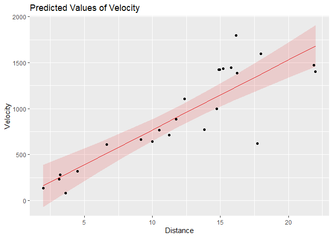
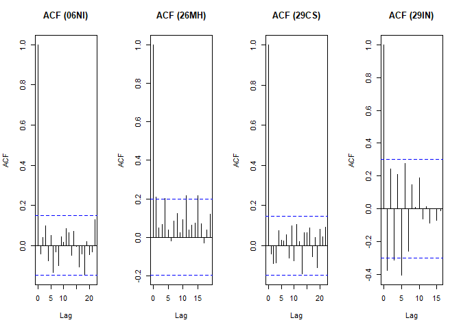
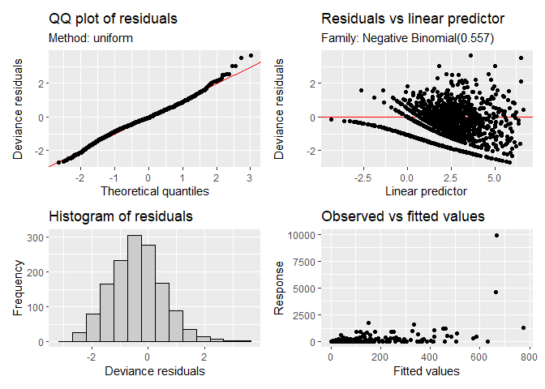
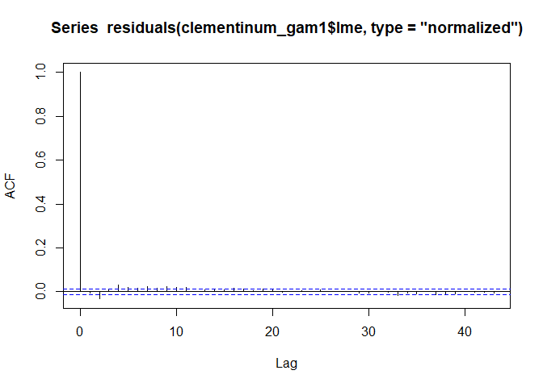

# The Eighth Circle: Generalized Additive Models

<br/>
Jiří Fejlek

2025-10-30
<br/>

- [Introduction to GAM](#introduction-to-gam)
  - [Univariate smooths](#univariate-smooths)
  - [Penalized likelihood](#penalized-likelihood)
  - [Estimation of lambda](#estimation-of-lambda)
  - [Multivariate smooths](#multivariate-smooths)
- [Solutions to excersises from *Generalized Additive Models: An
  Introduction with
  R*](#solutions-to-excersises-from-generalized-additive-models-an-introduction-with-r)
  - [Hubble dataset](#hubble-dataset)
  - [Simulated Motorcycle Accident
    Dataset](#simulated-motorcycle-accident-dataset)
  - [CO2 Dataset](#co2-dataset)
  - [Initial Public Offering Dataset](#initial-public-offering-dataset)
  - [Bordeaux Wines](#bordeaux-wines)
  - [Satellite Calibration](#satellite-calibration)
  - [Mackerel Eggs](#mackerel-eggs)
- [Clementinum Dataset Revisited](#clementinum-dataset-revisited)
- [Arthropod abundance](#arthropod-abundance)
  - [Extracting trends](#extracting-trends)
  - [Model with covariates](#model-with-covariates)
- [Conclusion](#conclusion)
- [References](#references)

<br/> In the penultimate part of our series on statistical modeling, we
will have a look at generalized additive models (GAMs). Unlike the
previous project, there will be no central dataset. Instead, we will
look at several smaller projects that will hopefully demonstrate the
broad applicability of GAMs. <br/>

## Introduction to GAM

Generalized additive model (GAM) is a generalization of
generalized linear model (GLM) in which effects of covariates on the
conditional mean of the response variable are modeled as
$g(\mu) = f_{x_1}(x_1) + f_{x_2}(x_2) + \ldots + f_{x_1,x_2}(x_1,x_2) + f_{x_1,x_3}(x_1,x_3) + \ldots + f_{x_1,x_2,x_3}(x_1, x_2, x_3) + \ldots$,
where functions $f$ are so-called *smooth* functions. GAMs represent a
family of very flexible models which, however, still keep *additive*
structure; effects of covariates are still interpretable in the sense of
their split into ‘main effects’ and effects of interactions. Thus, GAMs
lie on the boundary between traditional regression models and general
nonlinear models (represented by neural networks and random forests)
\[1\].

Before we proceed to use GAMs, let us first review the theory a bit.
<br/>

### Univariate smooths

Let us first describe what the smooth functions actually are. For
simplicity’s sake, we start with univariate smooths which are given as
$f(x) = \sum_{j = 1}^k \beta_jb_j(x)$, where $b_j$ are some appropriate
prespecified basis functions \[1\]. Examples of smooth functions that
can be represented this way include cubic regression splines, B-splines,
P-splines, thin plate regression splines, and Duchon splines \[1\]. One
important thing to notice is that this specification is still linear in
parameters $\beta$. <br/>

<!-- -->

<br/> Consequently, using smooths can still lead to the usual GLM
models. We essentially employed this strategy in some previous circles,
using restricted cubic splines to model more complex nonlinear effects
of continuous variables. However, a major disadvantage of using these
smooths in this straightforward way is the substantial risk of
overfitting, provided the number of basis functions $k$ is sufficiently
large. Remember that we always used restricted cubic splines with a very
limited number of knots. To control the overfitting for large $k$, GAMs
introduce *penalization* into the fitting procedure. <br/>

### Penalized likelihood

The penalization term used in GAMs is the so-called *wigglines*.
The term *wigglines* is literal; the penalization term penalizes the
regression curve for being too wiggly, i.e., for fitting the data too
closely.

Let us assume GAM model
$g(\mu) = X_1\beta_1 + X_2\beta_2 + X_3\beta_3 + \cdots X_p\beta_p$,
where terms $X_i\beta_i$ correspond to univariate smooths
$f(x_i) = \sum_{j = 1}^k \beta_{ij}b_j(x_{i})$ for the values of the ith
predictor. The wiggliness penalty for the aforementioned univariate
smooths of the ith predictor is defined as $\beta^T_iS_i\beta_i$ for
some smoothing penalty matrix $S_i$. Hence, the total wiggliness penalty
for all smooths is $\sum_{i = p}^k \beta_i^T S_i \beta_i$. A typical
example of the wiggliness penalty is $\int f''(x)^2 \mathrm{d}x$.
However, some splines use different penalization, e.g., squared
difference of coefficients $\sum (\beta_{i+1} - \beta_{i})^2$ for
P-splines \[1\].

Let $Y_i \sim \mathrm{EF}(\mu_i,\sigma)$ (EF denotes exponential family
of distributions with mean $\mu$ and the scale parameter $\sigma$) and
$g(\mu_i) = X\beta$ , and let the wiggliness penalty term be
$\sum_{i = 1}^p \beta^T S_i \beta$. To estimate $\beta$ and $\phi$ in a
way that fits the data well, we need to consider a compromise between
maximizing a likelihood $L(\beta,\phi)$ and minimizing the wiggliness
penalty; we consider a *penalized likelihood function*
$L(\beta,\phi) -\frac{1}{2\phi}\sum_i \lambda_i\beta^TS_i\beta$, where
$\lambda_i$ are some weights that balances the precision of the fit and
the wiggliness. We should note that for values
$\lambda_i \rightarrow \infty$ for all $i$, we obtain ordinary linear
regression, since linear functions have zero wiggliness; i.e., a high
wiggliness penalty will not force the estimated effects to be zero,
dropping some covariate from the model in the process. <br/>

### Estimation of lambda

To estimate model parameters $\beta$ and $\phi$ from the penalized
likelihood
$L(\beta,\phi) -\frac{1}{2\phi}\sum_i \lambda_i\beta^TS_i\beta$, we also
need to determine an appropriate value of smoothing parameters
$\lambda$. The first standard method of estimating appropriate $\lambda$
for the data is based on minimization of the prediction error, namely,
via leave-one-out cross-validation (LOOC)
$\nu_0 =\frac{1}{n} \sum_i (\hat f^{-i}_i - y_i)^2$, where
$f^{[-i]}_i$ is the predicted value of the ith observation for a model
in which the ith observation is omitted. It can be shown that for linear
regression
$\nu_0 = \frac{1}{n} \sum_i\frac{(y_i -\hat\mu_i)^2}{(1-H_{ii})^2}$,
where $H$ is the hat matrix of the model with all observations, i.e., we
do need to repeatedly refit the model \[1, Section 6.2.1\]. We should
note that $H_{ii}$ is usually replaced by $\mathrm{trace } H/n$ leading
to so-called *generalized cross-validation* (GCV) \[1\].

The LOOC/GCV formulas can be used even for a GLM, since the MLE
estimator $\hat\beta$ meets $\hat\beta \approx X(X^T WX)^{-1}X^TW z$,
where $W$ is diagonal matrix of ‘working’ weights and $z$ are ‘working’
(also called adjusted) responses \[1,2\] of the iteratively re-weighted
least squares algorithm that is used to numerically maximize the
likelihood, i.e., $\hat\beta$ approximately solves weighted least
squares problem $\sum_i w_i (z_i - X_i\beta)^2$.

A notable issue with LOOCV/GCV for estimating smoothing parameters is
that it tends to overfit (i.e., under-smooth) in practice \[1\]. Hence,
an alternative approach based on REML (restricted maximum likelihood)
was proposed that often performs better than LOOCV/GCV \[1\]. This
approach uses the fact that by taking a Bayesian approach to estimate
the smooth model by assigning improper normal priors on $\beta$ (namely
$\beta \sim N(0, S^-_\lambda \phi)$, where $S^-_\lambda \phi$ is a
pseudo-inverse of $S_\lambda = \sum_j\lambda_jS_j$), the Bayesian log
marginal likelihood
$\nu(\lambda) = \mathrm{log} \int f(y\mid\beta)f(\beta)\mathrm{d}\beta$
has the same form as the REML for generalized mixed effects models
\[1\]. Thus, algorithms for estimating variance components in mixed
effects models can be used to obtain an *empirical Bayes* estimate of
the smooth parameters $\lambda$ \[1\]. <br/>

### Multivariate smooths

We introduced GAM models for univariate smooth. An extension to
multivariate smooths $f_{x_1,x_2, \ldots}(x_1,x_2, \ldots)$ is quite
straightforward. We can use smooths such as thin plate regression
splines, which are naturally defined for any number of covariates.
Alternatively, we can use tensor product smooths to combine multiple
univariate smooths. Let $X_1, X_2, \ldots X_p$ be model matrices of
univariate smooths $f_{x_1},\ldots, f_{x_p}$. Then the model matrix of
the corresponding tensor product smooth is
$X = X_1 \odot X_2 \odot \cdots \odot X_p$, where $\odot$ denotes
row-wise Kronecker product \[1\]. The penalty for the tensor product
smooth is chosen as $\sum_i \beta^T \tilde S_{x_i} \beta$ where
$\tilde S_{x_i} = I_{x_1} \odot I_{x_2}  \odot \cdots  \odot S_{x_i}  \odot I_{x_{i+1}}  \odot \cdots  \odot I_{x_p}$,
where $I_{x_{i}}$ is an identity matrix of rank that equals the number
of basis vectors for smooth $f_{x_i}$. We should note that marginal
smooths $f_{x_i}$ are often reparametrized such that the overall penalty
has the interpretation in terms of (averaged) wiglinnes; see \[1,
Section 5.6.2\].

The last thing we add is an useful observation that the tensor product
smooth can be split into the smooth ‘main effects’ and smooth
‘interaction’ components, e.g., $f_{x_1} + f_{x_2} + f_{x_1x_2}$, since
the tensor product basis constructions is precisely the same as the
construction of interaction terms in a linear model. Provided that the
marginal smooths are first subjected to sum-to-zero identifiability
constraint $1^TX_i = 0$ (i.e., the unit function is removed from the
span of all bases or in other words, the intercept is extracted from the
smooths), then the tensor product smooth will not include the products
of basis with a unit functions, i.e., the tensor product smooth will not
include the main effects \[1\].

We should note here that the sum-to-zero identifiability constraint must
be employed in any model with smooths anyway, since all the smooths are
estimable only up to an additive constant. To enforce the sum-to-zero
identifiability constraint $1^TX = 0$, one can just subtract the column
mean from each column $\tilde X = 11^TX/n$ and delete a single column
from $\tilde{X}$. <br/>

## Solutions to excersises from *Generalized Additive Models: An Introduction with R*

In this project, we will not have a look at a single dataset to
demonstrate the application of GAMs. Instead, we provide multiple
smaller demonstrations to have a look at different types of problems
that GAM can solve. We start with datasets presented as modeling
exercises in \[1, Chapter 7\]. <br/>

### Hubble dataset

Exercise 1 considers the data about the distance (in megaparsecs)
and relative velocity (in kilometers per second) of 24 galaxies. The
distance of a galaxy is estimated from observations (by the Hubble Space
Telescope) of Cepheids, variable stars with a known relationship between
brightness and period. The galaxy’s velocity is estimated from its mean
redshift. The resulting estimates of galaxy distances and velocities
were taken from \[3\].

The goal is to estimate the so-called Hubble constant $\beta$ in the
Hubble’s law $y = \beta x$, which expresses the relative velocity of any
two galaxies $y$ separated by distance $x$ under the standard Big Bang
model.

Let us load the dataset and fit a simple linear regression model. <br/>

``` r
library(gamair) # gamair package includes all datasets from Generalized Additive Models: An Introduction with R
data(hubble)
hubble_lm <- lm(y~x,data = hubble)
summary(hubble_lm)
```

    ## 
    ## Call:
    ## lm(formula = y ~ x, data = hubble)
    ## 
    ## Residuals:
    ##     Min      1Q  Median      3Q     Max 
    ## -735.14 -132.92  -22.57  171.74  558.61 
    ## 
    ## Coefficients:
    ##             Estimate Std. Error t value Pr(>|t|)    
    ## (Intercept)    6.696    126.557   0.053    0.958    
    ## x             76.127      9.493   8.019 5.68e-08 ***
    ## ---
    ## Signif. codes:  0 '***' 0.001 '**' 0.01 '*' 0.05 '.' 0.1 ' ' 1
    ## 
    ## Residual standard error: 264.7 on 22 degrees of freedom
    ## Multiple R-squared:  0.7451, Adjusted R-squared:  0.7335 
    ## F-statistic:  64.3 on 1 and 22 DF,  p-value: 5.677e-08

``` r
library(sjPlot)
library(ggplot2)
plot_model(hubble_lm, type = "pred", terms = c('x')) + geom_point(data = hubble, aes(x = x, y =y)) + labs(x = 'Distance', y = 'Velocity', title = 'Predicted Values of Velocity')
```

<!-- -->

<br/> The linear model appears to fit the dataset well. We can also see
that the intercept is largely insignificant, as Hubble’s law would
suggest. Still, it would be interesting to estimate whether the data
indicate any nonlinear relation between galaxies’ distance and their
relative velocity. Thanks to GAM, we can fit a flexible nonlinear model.
We will use the *mgcv* package to fit the GAM model. The function *s*
denotes the smooth; we need to specify a number of basis vectors and the
type of the smooth (‘ts’ denotes thin-plate regression splines); see
<https://stat.ethz.ch/R-manual/R-devel/library/mgcv/html/smooth.terms.html>
for all possible options. <br/>

``` r
library(mgcv)
hubble_gam <- gam(y~s(x, k = 10,bs = 'tp'), data = hubble, method = 'REML') # REML estimation of smoothing parameter
summary(hubble_gam)
```

    ## 
    ## Family: gaussian 
    ## Link function: identity 
    ## 
    ## Formula:
    ## y ~ s(x, k = 10, bs = "tp")
    ## 
    ## Parametric coefficients:
    ##             Estimate Std. Error t value Pr(>|t|)    
    ## (Intercept)    924.4       52.4   17.64 3.65e-14 ***
    ## ---
    ## Signif. codes:  0 '***' 0.001 '**' 0.01 '*' 0.05 '.' 0.1 ' ' 1
    ## 
    ## Approximate significance of smooth terms:
    ##        edf Ref.df     F  p-value    
    ## s(x) 1.766  2.187 31.62 9.32e-08 ***
    ## ---
    ## Signif. codes:  0 '***' 0.001 '**' 0.01 '*' 0.05 '.' 0.1 ' ' 1
    ## 
    ## R-sq.(adj) =  0.749   Deviance explained = 76.9%
    ## -REML = 156.97  Scale est. = 65897     n = 24

<!-- -->

<br/> We observe that the smooth fit remains fairly linear, with a bit
of curvature at the end. There are a few points we should clarify about
the inference.

Firstly, we should comment on the computation of the confidence
intervals for parameters/predictions. The confidence intervals are
computed using Bayesian credible intervals based on posterior Bayes
covariance matrix for $\hat\beta$ (remember that the estimation of GAMs
via REML is based on empirical Bayes) that equals
$V_\beta= (X^TWX+S_\lambda)^{-1}\phi$, where
$S_\lambda = \sum_j\lambda_jS_j$ and $W$ is a matrix of ‘working’
weights. Now, these are credible intervals, not confidence intervals.
However, it was shown (see Nychka’s coverage probability argument \[1\])
that these intervals have close to nominal coverage. The Bayes
covariance matrix is also used to evaluate the significance of smooth
terms (and unpenalized terms); see \[1, Section 6.12.1\] for more
details.

Secondly, the *edf* stands for estimated degrees of freedom (edf), and
it is an estimate of how many degrees of freedom were actually used in
the fit. If the fit was not penalized, we would use 10 degrees of
freedom in our case (nine predictors correspond to basis vectors +
intercept). However, thanks to the wiggliness penalization, some
predictors are not ‘fully’ utilized and are *shrinked*. Namely,
$\mathrm{E}\hat\beta = F\beta$, where $F = (X^TX + S_\lambda)^{-1}X^TX$
and $S_\lambda = \sum_j \lambda_jS_j$ ($F$ is quite similar to the hat
matrix of GAM $H = X(X^TX + S_\lambda)^{-1}X^T$). The trace of $F$
represents the effective degrees of freedom \[1\]. We should note that
this relation clearly implies that the penalized-likelihood estimates
are biased. However, for finite samples, biased estimates can perform
better than the unpenalized estimate due to overfitting. <br/>

``` r
library(Matrix)

# edf using the formula
mm <- model.matrix(hubble_gam)
S <- bdiag(list(0,hubble_gam$sp[1]*hubble_gam$smooth[[1]]$S[[1]])) # block diagonal matrix

diag(solve(t(mm) %*% mm + S)%*%t(mm)%*%mm ) # trace of F
```

    ## (Intercept)      s(x).1      s(x).2      s(x).3      s(x).4      s(x).5 
    ##  1.00000000  0.15123616 -0.05726506  0.01582896 -0.10299235 -0.02533439 
    ##      s(x).6      s(x).7      s(x).8      s(x).9 
    ## -0.12801323 -0.02403907  0.93620614  1.00000000

``` r
sum(diag(solve(t(mm) %*% mm + S)%*%t(mm)%*%mm )) # total edf
```

    ## [1] 2.765627

``` r
sum(diag(solve(t(mm) %*% mm + S)%*%t(mm)%*%mm )[2:10]) # x edf
```

    ## [1] 1.765627

``` r
# or simply
hubble_gam$edf
```

    ## (Intercept)      s(x).1      s(x).2      s(x).3      s(x).4      s(x).5 
    ##  1.00000000  0.15123616 -0.05726506  0.01582896 -0.10299235 -0.02533439 
    ##      s(x).6      s(x).7      s(x).8      s(x).9 
    ## -0.12801323 -0.02403907  0.93620614  1.00000000

<br/> We observe that merely two coefficients are not significantly
shrinked (apart from the intercept, which is not penalized). For
comparison, let us repeat the fit with $\lambda$ fixed at zero. <br/>

``` r
hubble_gam_nopen <- gam(y~s(x, k = 10, bs = 'tp'), data = hubble, sp = 0) # sp allows us to set the value of the smoothing par
summary(hubble_gam_nopen)
```

    ## 
    ## Family: gaussian 
    ## Link function: identity 
    ## 
    ## Formula:
    ## y ~ s(x, k = 10, bs = "tp")
    ## 
    ## Parametric coefficients:
    ##             Estimate Std. Error t value Pr(>|t|)    
    ## (Intercept)   924.38      50.94   18.15    4e-11 ***
    ## ---
    ## Signif. codes:  0 '***' 0.001 '**' 0.01 '*' 0.05 '.' 0.1 ' ' 1
    ## 
    ## Approximate significance of smooth terms:
    ##      edf Ref.df     F  p-value    
    ## s(x)   9      9 9.238 0.000165 ***
    ## ---
    ## Signif. codes:  0 '***' 0.001 '**' 0.01 '*' 0.05 '.' 0.1 ' ' 1
    ## 
    ## R-sq.(adj) =  0.763   Deviance explained = 85.6%
    ## GCV = 1.0674e+05  Scale est. = 62266     n = 24

<!-- -->

<br/> We observe that the fit is extremely wiggly due to the zero
penalty term. Analogously, if we increase the penalty enough, the
regression reduces smooths to ordinary linear terms. <br/>

``` r
hubble_gam_bigpen <- gam(y~s(x, k = 10,bs = 'tp'), data = hubble, sp = 10000) 
summary(hubble_gam_bigpen)
```

    ## 
    ## Family: gaussian 
    ## Link function: identity 
    ## 
    ## Formula:
    ## y ~ s(x, k = 10, bs = "tp")
    ## 
    ## Parametric coefficients:
    ##             Estimate Std. Error t value Pr(>|t|)    
    ## (Intercept)   924.38      54.04   17.11  3.4e-14 ***
    ## ---
    ## Signif. codes:  0 '***' 0.001 '**' 0.01 '*' 0.05 '.' 0.1 ' ' 1
    ## 
    ## Approximate significance of smooth terms:
    ##      edf Ref.df     F p-value    
    ## s(x)   1  1.001 64.25  <2e-16 ***
    ## ---
    ## Signif. codes:  0 '***' 0.001 '**' 0.01 '*' 0.05 '.' 0.1 ' ' 1
    ## 
    ## R-sq.(adj) =  0.734   Deviance explained = 74.5%
    ## GCV =  76454  Scale est. = 70082     n = 24

<!-- -->

<br/> We fitted the GAM to test for significant nonlinear trends. Let us
compare the AIC for both models. <br/>

``` r
AIC(hubble_gam)
```

    ## [1] 339.8455

``` r
AIC(hubble_lm )
```

    ## [1] 339.7999

<br/> We observe that the AIC is almost identical, indicating that the
linear model is sufficient. We should note that the AIC for the GAM is
based on the penalized log-likelihood (the so-called *conditional AIC*).
However, if we evaluate the log-likelihood of the GAM model, we notice
that edf differs from the one estimated by the fit (we expect 2.765627 +
1 for the scale parameter). <br/>

``` r
logLik.gam(hubble_gam) #logLik
```

    ## 'log Lik.' -165.7355 (df=4.187244)

``` r
165.7355*2 + 2*4.187244 # AIC as provided by the function AIC.
```

    ## [1] 339.8455

``` r
165.7355*2 + 2*(sum(hubble_gam$edf)+1) # AIC that we would expect
```

    ## [1] 339.0023

``` r
hubble_gam$aic # we can actually get the AIC with the original estimate of edf from the GAM model
```

    ## [1] 339.0023

<br/> Here, the EDF is corrected to compute AIC. The problem is that the
original AIC computation ignores the fact that the smoothing parameter
must be estimated. Without this correction, AIC would tend to prefer
more complex models than necessary \[4\]. We see this effect a bit in
our case too; the uncorrected AIC for the GAM model is slightly lower
than that of the linear model. The corrected value, however, is higher
than the AIC of the linear model.

An alternative way to decide whether the smooth is needed is to fit the
model with the linear term and the smooth with a second-order penalty,
with no null space (i.e., the penalty’s null space does not contain the
linear trend). <br/>

``` r
hubble_gam2 <- gam(y~ x + s(x, k = 10,bs = 'tp', m=c(2, 0)),data = hubble, method = 'REML')
summary(hubble_gam2)
```

    ## 
    ## Family: gaussian 
    ## Link function: identity 
    ## 
    ## Formula:
    ## y ~ x + s(x, k = 10, bs = "tp", m = c(2, 0))
    ## 
    ## Parametric coefficients:
    ##             Estimate Std. Error t value Pr(>|t|)   
    ## (Intercept)   117.16     242.96   0.482  0.63458   
    ## x              66.96      19.68   3.403  0.00265 **
    ## ---
    ## Signif. codes:  0 '***' 0.001 '**' 0.01 '*' 0.05 '.' 0.1 ' ' 1
    ## 
    ## Approximate significance of smooth terms:
    ##         edf Ref.df     F p-value
    ## s(x) 0.7656      8 0.175   0.176
    ## 
    ## R-sq.(adj) =  0.749   Deviance explained = 76.9%
    ## -REML = 158.71  Scale est. = 65897     n = 24

<br/> We observe that the remaining smooth term is not significant,
suggesting again that the linear model should be sufficient. Let us
diagnose our linear and GAM models. We use the *gratia* package to
obtain the main diagnostic plots for GAMs. We should remember that the
distributional assumptions for GAMs correspond to those of the GLM, in
this case, linear regression. <br/>

``` r
library(gratia)
appraise(hubble_lm)
```

<!-- -->

``` r
appraise(hubble_gam)
```

<!-- -->

<br/> We observe noticeable heteroskedasticity in residuals. In the
previous circle, we discussed several GLMs for fitting data with
increasing-variance functions. Let us consider the usual quasi-Poisson,
gamma, and inverse-Gaussian models. We will use the identity link to
maintain the model’s interpretability with respect to Hubble’s law.
<br/>

``` r
hubble_gam_quasipoisson <- gam(y ~ s(x, k = 10,bs = 'tp'),method = 'REML',data = hubble, family = quasipoisson(link = 'identity')) 
hubble_gam_Gamma <- gam(y ~ s(x, k = 10,bs = 'tp'),method = 'REML',data = hubble, family = Gamma(link = 'identity')) 
hubble_gam_inverse.gaussian <- gam(y ~ s(x, k = 10,bs = 'tp'),method = 'REML',data = hubble, family = inverse.gaussian(link = 'identity')) 
```

<!-- --><!-- --><!-- -->

``` r
appraise(hubble_gam_quasipoisson)
```

<!-- -->

``` r
appraise(hubble_gam_Gamma)
```

<!-- -->

``` r
appraise(hubble_gam_inverse.gaussian)
```

<!-- -->

<br/> It is hard to estimate the correct variance function with so few
observations. However, the linear relationship between **Velocity** and
**Distance**becomes clearer. We observe that the EDF of the smooth
function is one across all models. Hence, to wrap up this exercise, let
us fit the GLM models that respect Hubble’s law (linear trend with no
intercept) and obtain estimates of the Hubble constant. <br/>

``` r
glm_qp <- glm(y ~ x-1,data = hubble, family = quasipoisson(link = 'identity'))
glm_gamma <- glm(y ~ x-1,data = hubble, family = Gamma(link = 'identity'))
glm_ig <- glm(y ~ x-1,data = hubble, family = inverse.gaussian(link = 'identity')) 

appraise(glm_qp)
```

<!-- -->

``` r
appraise(glm_gamma)
```

<!-- -->

``` r
appraise(glm_ig)
```

<!-- -->

``` r
sum((predict(glm_qp) - hubble$y)^2)/length(hubble$y)
```

    ## [1] 64254.56

``` r
sum((predict(glm_gamma) - hubble$y)^2)/length(hubble$y)
```

    ## [1] 64679.09

``` r
sum((predict(glm_ig) - hubble$y)^2)/length(hubble$y)
```

    ## [1] 69508

<br/> The inverse-Gaussian model is clearly off (although the fit is
probably heavily influenced by one outlier). We will choose the
quasi-Poisson model, as all residuals appear consistent with it. In
addition, this model achieves the lowest value of MSE. Hence, our
estimate of the Hubble constant is as follows. <br/>

``` r
confint(glm_qp)
```

    ##    2.5 %   97.5 % 
    ## 69.19303 84.69444

<br/> Various estimates of the Hubble constant can be found at
<https://en.wikipedia.org/wiki/Hubble%27s_law>. Our estimate mostly
aligns with the other confidence intervals (though the most recent ones
are much narrower). <br/>

### Simulated Motorcycle Accident Dataset

The following dataset for Exercises 2 and 3 contains 133
observations from a simulated motorcycle accident used to test helmets.
Two variables in the dataset are **times** in milliseconds from the time
of impact and **accel** acceleration of the head in g \[5\]. This
dataset is widely used to demonstrate univariate smooths. Let us plot
the data. <br/>

``` r
library(MASS)
data(mcycle)
plot(mcycle)
```

<!-- -->

<br/> We will fit the data using a GAM with thin-plate regression
splines ($k = 40$). <br/>

``` r
mcycle_gam <- gam(accel ~ s(times, k = 40,bs = 'tp'),method = 'REML',data = mcycle)
summary(mcycle_gam)
```

    ## 
    ## Family: gaussian 
    ## Link function: identity 
    ## 
    ## Formula:
    ## accel ~ s(times, k = 40, bs = "tp")
    ## 
    ## Parametric coefficients:
    ##             Estimate Std. Error t value Pr(>|t|)    
    ## (Intercept)  -25.546      1.958  -13.05   <2e-16 ***
    ## ---
    ## Signif. codes:  0 '***' 0.001 '**' 0.01 '*' 0.05 '.' 0.1 ' ' 1
    ## 
    ## Approximate significance of smooth terms:
    ##            edf Ref.df     F p-value    
    ## s(times) 12.87  15.97 29.61  <2e-16 ***
    ## ---
    ## Signif. codes:  0 '***' 0.001 '**' 0.01 '*' 0.05 '.' 0.1 ' ' 1
    ## 
    ## R-sq.(adj) =  0.782   Deviance explained = 80.3%
    ## -REML = 618.09  Scale est. = 509.79    n = 133

<!-- -->

<br/> We can check that the size of our basis was adequate. The test is
based on estimating the residual variance from neighboring residuals
(see \[1, Section 5.9\]). Provided that there is a pattern with respect
to some covariate, that covariate might be undersmoothed (or there could
be other misspecification in the conditional mean or correlation
structure that causes the residual pattern). <br/>

``` r
k.check(mcycle_gam)
```

    ##          k'      edf  k-index p-value
    ## s(times) 39 12.86623 1.176997  0.9675

<br/> The test detected no problems. Let us assess the model. <br/>

<!-- -->

<br/> These plots do not include a residual plot against the **Times**
variable. <br/>

``` r
plot(mcycle$times ,residuals(mcycle_gam), xlab = 'Time',ylab = 'Residuals')
```

<!-- -->

``` r
acf(residuals(mcycle_gam))
```

<!-- -->

<br/> The autocorrelation function seems adequate. However, there is a
clear heteroskedasticity early on. The assignment in \[1\] suggests
penalizing (using weights) the first 20 observations and refitting the
model. <br/>

``` r
mcycle_gam_weighted10 <- gam(accel ~ s(times, k = 40,bs = 'tp'),method = 'REML',data = mcycle, weights = c(rep(10,20),rep(1,113)))
mcycle_gam_weighted20 <- gam(accel ~ s(times, k = 40,bs = 'tp'),method = 'REML',data = mcycle, weights = c(rep(20,20),rep(1,113)))
mcycle_gam_weighted50 <- gam(accel ~ s(times, k = 40,bs = 'tp'),method = 'REML',data = mcycle, weights = c(rep(50,20),rep(1,113)))
mcycle_gam_weighted100 <- gam(accel ~ s(times, k = 40,bs = 'tp'),method = 'REML',data = mcycle, weights = c(rep(100,20),rep(1,113)))
mcycle_gam_weighted200 <- gam(accel ~ s(times, k = 40,bs = 'tp'),method = 'REML',data = mcycle, weights = c(rep(200,20),rep(1,113)))
mcycle_gam_weighted500 <- gam(accel ~ s(times, k = 40,bs = 'tp'),method = 'REML',data = mcycle, weights = c(rep(500,20),rep(1,113)))
mcycle_gam_weighted1000 <- gam(accel ~ s(times, k = 40,bs = 'tp'),method = 'REML',data = mcycle, weights = c(rep(1000,20),rep(1,113)))
mcycle_gam_weighted2000 <- gam(accel ~ s(times, k = 40,bs = 'tp'),method = 'REML',data = mcycle, weights = c(rep(2000,20),rep(1,113)))
```

<!-- --><!-- --><!-- --><!-- -->

<br/> With weights 500, the residuals appear adequate. The fit is also
better. <br/>

<!-- -->

<br/> This approach is, of course, somewhat ad hoc (the observed
heteroskedasticity does not really fit any typical variance structure).
However, it is better than doing nothing, as mentioned in the exercise
solutions in \[1\]. <br/>

### CO2 Dataset

The next dataset (Exercise 5) considers CO2 measurements
(concentration in parts per million ) at the South Pole from January
1957 onwards. <br/>

<!-- -->

<br/> The data show an increasing trend and noticeable seasonality. With
GAM, we can model this seasonality using cyclic cubic regression
splines, with the same value and the first few derivatives at the
boundaries. <br/>

``` r
co2s_gam <- gam(co2 ~ s(c.month, k = 200,bs = 'tp') + s(month, k = 10,bs = 'cc'), knots=list(month=seq(1,13,length=10)),method = 'REML',data = co2s) # knots assures that first month equals thirteenth month 
summary(co2s_gam)
```

    ## 
    ## Family: gaussian 
    ## Link function: identity 
    ## 
    ## Formula:
    ## co2 ~ s(c.month, k = 200, bs = "tp") + s(month, k = 10, bs = "cc")
    ## 
    ## Parametric coefficients:
    ##              Estimate Std. Error t value Pr(>|t|)    
    ## (Intercept) 3.382e+02  5.346e-03   63267   <2e-16 ***
    ## ---
    ## Signif. codes:  0 '***' 0.001 '**' 0.01 '*' 0.05 '.' 0.1 ' ' 1
    ## 
    ## Approximate significance of smooth terms:
    ##                edf Ref.df       F p-value    
    ## s(c.month) 106.238  129.2 57286.8  <2e-16 ***
    ## s(month)     7.276    8.0   161.6  <2e-16 ***
    ## ---
    ## Signif. codes:  0 '***' 0.001 '**' 0.01 '*' 0.05 '.' 0.1 ' ' 1
    ## 
    ## R-sq.(adj) =      1   Deviance explained =  100%
    ## -REML = -100.01  Scale est. = 0.012205  n = 427

<br/> We can easily plot the trend and the seasonal component using the
package *gratia*. <br/>

``` r
draw(co2s_gam, residuals = TRUE)
```

<!-- -->

<br/> We should note that the trend is still quite wiggly (the edf for
**c.month** is over 90!). The package *gratia* allows us to evaluate the
derivatives of smooth terms. <br/>

``` r
deriv <- derivatives(co2s_gam, data = co2s,type = 'central', select = 'c.month',partial_match = TRUE)

ggplot(data = deriv) +
  geom_line(data = deriv, aes(x = c.month, y = .derivative),col = 'red', lwd = 0.75) +
  geom_ribbon(data = deriv, aes(x = c.month,ymin=.lower_ci ,ymax=.upper_ci),alpha=0.3) + 
  labs(x = 'Cummulative Month', y = 'Derivative of s(c.month,bs = "tp")', title = 'Derivative of trend c.month smooth')
```

<!-- -->

``` r
deriv <- derivatives(co2s_gam, data = co2s[1:12,],type = 'central', select = 's(month)',partial_match = TRUE)
ggplot(data = deriv) +
  geom_line(data = deriv, aes(x = month, y = .derivative),col = 'red', lwd = 0.75) +
  geom_ribbon(data = deriv, aes(x = month,ymin=.lower_ci ,ymax=.upper_ci),alpha=0.3) + 
  labs(x = 'Month', y = 'Derivative of s(month, bs = "cc")', title = 'Derivative of sesonal effect')
```

<!-- -->

<br/> The overall model predictions are as follows. <br/>

<!-- -->

<br/> We could fit the model without a seasonal component and get a very
similar fit. Notice, however, that this model uses many more EDFs than
the model with a seasonal component. <br/>

``` r
co2s_gam_noseas <- gam(co2 ~ s(c.month, k = 200,bs = 'tp'),data = co2s) 
summary(co2s_gam_noseas)
```

    ## 
    ## Family: gaussian 
    ## Link function: identity 
    ## 
    ## Formula:
    ## co2 ~ s(c.month, k = 200, bs = "tp")
    ## 
    ## Parametric coefficients:
    ##              Estimate Std. Error t value Pr(>|t|)    
    ## (Intercept) 3.382e+02  4.714e-03   71748   <2e-16 ***
    ## ---
    ## Signif. codes:  0 '***' 0.001 '**' 0.01 '*' 0.05 '.' 0.1 ' ' 1
    ## 
    ## Approximate significance of smooth terms:
    ##              edf Ref.df     F p-value    
    ## s(c.month) 171.5    190 50392  <2e-16 ***
    ## ---
    ## Signif. codes:  0 '***' 0.001 '**' 0.01 '*' 0.05 '.' 0.1 ' ' 1
    ## 
    ## R-sq.(adj) =      1   Deviance explained =  100%
    ## GCV = 0.01592  Scale est. = 0.0094902  n = 427

<!-- -->

<br/> It also cannot really extrapolate the future trend (the trend is a
linear extrapolation of the last trend provided by the thin-plate
regression splines model; this is due to the penalty on second
derivatives, see
<https://fromthebottomoftheheap.net/2020/06/03/extrapolating-with-gams>).
<br/>

<!-- -->

<br/> The model with a seasonal component provides much more reasonable
extrapolation (essentially linear extrapolation of the trend plus some
seasonal wiggliness). <br/>

<!-- -->

<br/> Let us diagnose the model. <br/>

<!-- -->

<!-- --><!-- --><!-- -->

<br/> We observe some autocorrelation in the residuals, suggesting that
the smooth terms did not fully account for all trends in the data.
Hence, we will consider models with AR correlation structures (in
**c.months**). To fit these models, we need to use the *gamm* function,
which translates the GAM into a mixed-effects model fitted by *lme*
(remember that smooths can be treated as random effects for estimation).
<br/>

``` r
co2s_gamm <- gamm(co2 ~ s(c.month, k = 200,bs = 'tp') + s(month,bs = 'cc'), knots=list(month=seq(1,13,length = 10)),data = co2s)
co2s_gamm_AR1 <- gamm(co2 ~ s(c.month, k = 200,bs = 'tp') + s(month,bs = 'cc'), knots=list(month=seq(1,13,length =10)),data = co2s, correlation = corARMA(form = ~ c.month, p = 1))
co2s_gamm_AR2 <- gamm(co2 ~ s(c.month, k = 200,bs = 'tp') + s(month,bs = 'cc'), knots=list(month=seq(1,13,length =10)),data = co2s, correlation = corARMA(form = ~ c.month, p = 2))
co2s_gamm_AR3 <- gamm(co2 ~ s(c.month, k = 200,bs = 'tp') + s(month,bs = 'cc'), knots=list(month=seq(1,13,length =10)),data = co2s, correlation = corARMA(form = ~ c.month, p = 3))
co2s_gamm_AR4 <- gamm(co2 ~ s(c.month, k = 200,bs = 'tp') + s(month,bs = 'cc'), knots=list(month=seq(1,13,length =10)),data = co2s, correlation = corARMA(form = ~ c.month, p = 4))
```

<br/> We should note that *gamm* actually returns two models: a GAM and
an LME. We can compare covariance models using LMEs. <br/>

``` r
anova(co2s_gamm$lme,co2s_gamm_AR1$lme, co2s_gamm_AR2$lme, co2s_gamm_AR3$lme, co2s_gamm_AR4$lme)
```

    ##                   Model df       AIC       BIC   logLik   Test   L.Ratio
    ## co2s_gamm$lme         1  5 -193.6073 -173.3234 101.8037                 
    ## co2s_gamm_AR1$lme     2  6 -299.8438 -275.5031 155.9219 1 vs 2 108.23645
    ## co2s_gamm_AR2$lme     3  7 -298.9605 -270.5630 156.4803 2 vs 3   1.11676
    ## co2s_gamm_AR3$lme     4  8 -299.4409 -266.9866 157.7204 3 vs 4   2.48034
    ## co2s_gamm_AR4$lme     5  9 -297.6276 -261.1166 157.8138 4 vs 5   0.18675
    ##                   p-value
    ## co2s_gamm$lme            
    ## co2s_gamm_AR1$lme  <.0001
    ## co2s_gamm_AR2$lme  0.2906
    ## co2s_gamm_AR3$lme  0.1153
    ## co2s_gamm_AR4$lme  0.6656

<br/> We observe that our original model, which assumes independent
errors, is clearly the worst. The remaining models seem to be quite
close. Hence, we will use the simplest AR(1) covariance structure. The
summary of the GAMM model is as follows. <br/>

``` r
summary(co2s_gamm_AR1$gam)
```

    ## 
    ## Family: gaussian 
    ## Link function: identity 
    ## 
    ## Formula:
    ## co2 ~ s(c.month, k = 200, bs = "tp") + s(month, bs = "cc")
    ## 
    ## Parametric coefficients:
    ##              Estimate Std. Error t value Pr(>|t|)    
    ## (Intercept) 338.24413    0.05652    5985   <2e-16 ***
    ## ---
    ## Signif. codes:  0 '***' 0.001 '**' 0.01 '*' 0.05 '.' 0.1 ' ' 1
    ## 
    ## Approximate significance of smooth terms:
    ##               edf Ref.df       F p-value    
    ## s(c.month) 10.497   10.5 7685.56  <2e-16 ***
    ## s(month)    7.322    8.0   86.08  <2e-16 ***
    ## ---
    ## Signif. codes:  0 '***' 0.001 '**' 0.01 '*' 0.05 '.' 0.1 ' ' 1
    ## 
    ## R-sq.(adj) =      1   
    ##   Scale est. = 0.10043   n = 427

<br/> We immediately notice that the EDF of s(month) is much lower; a
significant part of the wiggliness is now modeled via the AR(1) error
structure. <br/>

``` r
draw(co2s_gamm_AR1$gam)
```

<!-- -->

``` r
deriv <- derivatives(co2s_gamm_AR1$gam, data = co2s,type = 'central', select = 'c.month',partial_match = TRUE)

ggplot(data = deriv) +
  geom_line(data = deriv, aes(x = c.month, y = .derivative),col = 'red', lwd = 0.75) +
  geom_ribbon(data = deriv, aes(x = c.month,ymin=.lower_ci ,ymax=.upper_ci),alpha=0.3) + 
  labs(x = 'Cummulative Month', y = 'Derivative of s(c.month,bs = "tp")', title = 'Derivative of trend c.month smooth')
```

<!-- -->

``` r
deriv <- derivatives(co2s_gamm_AR1, data = co2s[1:12,],type = 'central', select = 's(month)',partial_match = TRUE)
ggplot(data = deriv) +
  geom_line(data = deriv, aes(x = month, y = .derivative),col = 'red', lwd = 0.75) +
  geom_ribbon(data = deriv, aes(x = month,ymin=.lower_ci ,ymax=.upper_ci),alpha=0.3) + 
  labs(x = 'Month', y = 'Derivative of s(month, bs = "cc")', title = 'Derivative of sesonal effect')
```

<!-- -->

<br/> Derivatives of the trend seem much more reasonable. Let us check
the model’s diagnostics. <br/>

``` r
acf(residuals(co2s_gamm_AR1$lme,type = 'normalized'))
```

<!-- -->

``` r
pacf(residuals(co2s_gamm_AR1$lme,type = 'normalized'))
```

<!-- -->

<br/> The normalized residuals are much less autocorrelated.  
<br/>

<!-- -->

### Initial Public Offering Dataset

This dataset from Exercise 6 contains data on the number of
‘Initial Public Offerings’ (IPOs) per month in the US financial markets
between 1960 and 2002 \[6\]. IPOs are the process by which companies go
public.

- **n.ipo** - the number of IPOs for a given month
- **ir** - the average initial return from investing in an IPO, measured
  as a percentage difference between the offer price of shares and the
  share price after the first day of trading in the shares
- **dp** - the average percentage difference between the middle of the
  share price range proposed when the IPO is first filed, and the final
  offer price
- **reg.t** - the average time (in days) it takes from filing to offer

The goal is to find a suitable model for explaining the number of IPOs,
**n.ipo**, in terms of the remaining variables and time. <br/>

``` r
data(ipo)
head(ipo)
```

    ##   n.ipo   ir     dp reg.t t month
    ## 1    30 13.5 -5.277 32.97 1     1
    ## 2    26 19.6 -0.500 29.09 2     2
    ## 3    39 29.3 -0.985 42.06 3     3
    ## 4    40  7.0 -1.397 41.47 4     4
    ## 5    40 23.2  0.447 43.72 5     5
    ## 6    40 14.6 -1.448 37.38 6     6

``` r
dim(ipo)
```

    ## [1] 156   6

<!-- -->

<br/> Let us check the predictors. <br/>

    ##      n.ipo              ir               dp              reg.t       
    ##  Min.   :  4.00   Min.   : 0.400   Min.   :-80.604   Min.   : 10.86  
    ##  1st Qu.: 24.00   1st Qu.: 8.475   1st Qu.: -7.931   1st Qu.: 42.22  
    ##  Median : 41.50   Median :13.350   Median : -1.819   Median : 63.12  
    ##  Mean   : 43.44   Mean   :13.903   Mean   : -3.574   Mean   : 72.13  
    ##  3rd Qu.: 58.25   3rd Qu.:18.425   3rd Qu.:  1.325   3rd Qu.: 80.31  
    ##  Max.   :122.00   Max.   :45.400   Max.   : 17.864   Max.   :623.78  
    ##        t              month      
    ##  Min.   :  1.00   Min.   : 1.00  
    ##  1st Qu.: 39.75   1st Qu.: 3.75  
    ##  Median : 78.50   Median : 6.50  
    ##  Mean   : 78.50   Mean   : 6.50  
    ##  3rd Qu.:117.25   3rd Qu.: 9.25  
    ##  Max.   :156.00   Max.   :12.00

<br/> Variable **reg.t** is significantly skewed. Hence, we might
consider a logarithm transform. <br/>

<!-- --><!-- -->

<br/> The assignment in \[1\] suggests using a lagged version of the
variables **ir** and **dp**, since the registration process **reg.t** of
IPO takes too long for the number of IPOs in a month being driven by the
initial returns in that same month. Hence, let us create the appropriate
lagged variables and fit the model (since we are modelling counts we
will use the poisson model). <br/>

``` r
library(Hmisc)
ir1 <- Lag(ipo$ir,+1)
ir2 <- Lag(ipo$ir,+2)
ir3 <- Lag(ipo$ir,+3)

dp1 <- Lag(ipo$dp,+1)
dp2 <- Lag(ipo$dp,+2)
dp3 <- Lag(ipo$dp,+3)

ipo_ext <- cbind(ipo,ir1,ir2,ir3,dp1,dp2,dp3)
```

<br/> Note that we have merely 150 observations; thus, we cannot
reasonably include any interactions in the model. <br/>

``` r
ipo_gam <- gam(n.ipo ~ s(ir1, k = 20,bs = 'tp') + s(ir2, k = 20,bs = 'tp') + s(ir3, k = 20,bs = 'tp') +
                        + s(dp1, k = 20,bs = 'tp') + s(dp2, k = 20,bs = 'tp') + s(dp3, k = 20,bs = 'tp')  
                        + s(month,bs = 'cc') +  s(t, k = 20,bs = 'tp') + s(log(reg.t), k = 20,bs = 'tp'),
                       knots=list(month=seq(1,13,length = 10)),family=poisson,data = ipo_ext,method = 'REML')
summary(ipo_gam)
```

    ## 
    ## Family: poisson 
    ## Link function: log 
    ## 
    ## Formula:
    ## n.ipo ~ s(ir1, k = 20, bs = "tp") + s(ir2, k = 20, bs = "tp") + 
    ##     s(ir3, k = 20, bs = "tp") + +s(dp1, k = 20, bs = "tp") + 
    ##     s(dp2, k = 20, bs = "tp") + s(dp3, k = 20, bs = "tp") + s(month, 
    ##     bs = "cc") + s(t, k = 20, bs = "tp") + s(log(reg.t), k = 20, 
    ##     bs = "tp")
    ## 
    ## Parametric coefficients:
    ##             Estimate Std. Error z value Pr(>|z|)    
    ## (Intercept)  3.61353    0.01465   246.7   <2e-16 ***
    ## ---
    ## Signif. codes:  0 '***' 0.001 '**' 0.01 '*' 0.05 '.' 0.1 ' ' 1
    ## 
    ## Approximate significance of smooth terms:
    ##                  edf Ref.df  Chi.sq  p-value    
    ## s(ir1)         3.399  4.272  15.417 0.005393 ** 
    ## s(ir2)         2.895  3.647   7.974 0.054619 .  
    ## s(ir3)         4.675  5.736  23.822 0.000466 ***
    ## s(dp1)         2.095  2.658  15.423 0.006437 ** 
    ## s(dp2)         4.886  6.033  13.761 0.032689 *  
    ## s(dp3)         1.003  1.006   3.403 0.065617 .  
    ## s(month)       7.633  8.000 151.376  < 2e-16 ***
    ## s(t)          16.113 17.836 912.979  < 2e-16 ***
    ## s(log(reg.t))  2.739  3.506   2.716 0.437880    
    ## ---
    ## Signif. codes:  0 '***' 0.001 '**' 0.01 '*' 0.05 '.' 0.1 ' ' 1
    ## 
    ## R-sq.(adj) =  0.864   Deviance explained = 90.4%
    ## -REML = 629.29  Scale est. = 1         n = 153

<br/> The fit used quite a lot of EDF in comparison to the number of
observations. <br/>

``` r
sum(ipo_gam$edf)
```

    ## [1] 46.43784

<br/> Let us evaluate the model. <br/>

<!-- --><!-- --><!-- --><!-- -->

<br/> We do not observe any major issues with the fit in terms of
residuals. As for the effects of the predictors, the number of IPOs
appears to increase with **dp**. The effect of **ir** seems to be
non-trivial. Simon N. Wood in \[1\] notes that **ir** tends to be
associated with an increase in IPO volume of around 20%, followed by a
decline. The predictor **s(ir3)** does not exactly follow this trend.
However, we should note that this latter part of the fit is quite
uncertain due to the low number of observations, as shown in a partial
effects plot of the residuals. <br/>

``` r
draw(ipo_gam, residuals = TRUE)
```

<!-- -->

<br/> We still need to keep in mind that this is 50 EDFs fit to 150
observations, after all, so we cannot read too much into the results.
<br/>

### Bordeaux Wines

The dataset (Exercise 7) contains prices and growth
characteristics of 25 Bordeaux wines from 1952 to 1998 (produced between
1952 and 1989).

- **year** - year of production
- **price** - average price of the wines as a percentage of the 1961
  price
- **h.rain** - mm of rain in the harvest month
- **s.temp** - average temperature (°C) over the summer preceding
  harvest
- **w.rain** - mm of rain in the winter preceding harvest
- **h.temp** - average temperature (°C) at harvest <br/>

``` r
data(wine)
wine
```

    ##    year price h.rain s.temp w.rain h.temp parker
    ## 1  1952    37    160   17.1    600   14.3     NA
    ## 2  1953    63     80   16.7    690   17.3     NA
    ## 3  1954    12    180   15.4    430   16.8     NA
    ## 4  1955    45    130   17.1    502   16.8     NA
    ## 5  1956    15    140   15.6    440   17.2     NA
    ## 6  1957    22    110   16.1    420   16.2     NA
    ## 7  1958    18    187   16.4    582   19.1     NA
    ## 8  1959    66    187   17.5    485   18.7     NA
    ## 9  1960    14    290   16.4    763   15.8     NA
    ## 10 1961   100     38   17.3    830   20.4     NA
    ## 11 1962    33     52   16.3    697   17.2     NA
    ## 12 1963    17    155   15.7    608   16.2     NA
    ## 13 1964    31     96   17.3    402   18.8     NA
    ## 14 1965    11    267   15.4    602   14.8     NA
    ## 15 1966    47     86   16.5    819   18.4     NA
    ## 16 1967    19    118   16.2    714   16.5     NA
    ## 17 1968    11    292   16.2    610   16.4     NA
    ## 18 1969    12    244   16.5    575   16.6     NA
    ## 19 1970    40     89   16.7    622   18.0   86.8
    ## 20 1971    27    112   16.8    551   16.9   84.2
    ## 21 1972    10    158   15.0    536   14.6   65.0
    ## 22 1973    16    123   17.1    376   17.9   65.0
    ## 23 1974    11    184   16.3    574   16.2   65.0
    ## 24 1975    30    171   16.9    572   17.2   87.0
    ## 25 1976    25    247   17.6    418   16.1   79.2
    ## 26 1977    11     87   15.6    821   16.8   65.0
    ## 27 1978    27     51   15.8    763   17.4   86.0
    ## 28 1979    21    122   16.2    717   17.3   86.0
    ## 29 1980    14     74   16.0    578   18.4   77.2
    ## 30 1981    17    111   17.0    535   18.0   83.8
    ## 31 1982    37    162   17.4    712   18.5   92.4
    ## 32 1983    17    119   17.4    845   17.9   89.8
    ## 33 1984    11    119   16.5    591   16.0   65.0
    ## 34 1985    18     38   16.8    744   18.9   88.2
    ## 35 1986    21    171   16.3    563   17.5   89.6
    ## 36 1987    15    115   17.0    452   18.9   80.2
    ## 37 1988    17     59   17.1    808   16.8   87.6
    ## 38 1989    23     82   18.6    443   18.4   89.8
    ## 39 1990    NA     80   18.7    468   19.3   94.4
    ## 40 1991    NA    183   17.7    570   20.4   68.0
    ## 41 1992    NA    342   17.9    543   17.3   77.2
    ## 42 1993    NA    279   17.5    574   16.7   82.4
    ## 43 1994    NA    220   18.1    838   17.1   86.6
    ## 44 1995    NA    169   18.3    588   16.3   89.8
    ## 45 1996    NA    256   17.8    684   16.6   88.4
    ## 46 1997    NA    133   19.1    479   20.0   85.0
    ## 47 1998    NA    197   18.3    897   18.9   91.8

<br/> The dataset contains merely 40 observations; hence, we will
consider a simple smooth model with no interactions. <br/>

``` r
wine_gam <-  gam(price ~ s(h.rain, k = 5,bs = 'tp') + s(s.temp, k = 5,bs = 'tp') + s(w.rain, k = 5,bs = 'tp') + s(h.temp, k = 5,bs = 'tp') + s(year, k = 5,bs = 'tp'),family=gaussian,data = wine,method = 'REML')
summary(wine_gam)
```

    ## 
    ## Family: gaussian 
    ## Link function: identity 
    ## 
    ## Formula:
    ## price ~ s(h.rain, k = 5, bs = "tp") + s(s.temp, k = 5, bs = "tp") + 
    ##     s(w.rain, k = 5, bs = "tp") + s(h.temp, k = 5, bs = "tp") + 
    ##     s(year, k = 5, bs = "tp")
    ## 
    ## Parametric coefficients:
    ##             Estimate Std. Error t value Pr(>|t|)    
    ## (Intercept)   25.816      1.648   15.66 7.39e-16 ***
    ## ---
    ## Signif. codes:  0 '***' 0.001 '**' 0.01 '*' 0.05 '.' 0.1 ' ' 1
    ## 
    ## Approximate significance of smooth terms:
    ##             edf Ref.df      F  p-value    
    ## s(h.rain) 1.000  1.000  2.742 0.108186    
    ## s(s.temp) 1.000  1.000 17.234 0.000252 ***
    ## s(w.rain) 1.336  1.591  2.500 0.070570 .  
    ## s(h.temp) 3.095  3.577  3.765 0.021282 *  
    ## s(year)   1.000  1.000 29.463 7.18e-06 ***
    ## ---
    ## Signif. codes:  0 '***' 0.001 '**' 0.01 '*' 0.05 '.' 0.1 ' ' 1
    ## 
    ## R-sq.(adj) =  0.701   Deviance explained = 76.1%
    ## -REML =  132.7  Scale est. = 103.21    n = 38

<br/> Let us evaluate the model. <br/>

    ##           k'      edf  k-index p-value
    ## s(h.rain)  4 1.000026 1.417208  0.9925
    ## s(s.temp)  4 1.000074 1.277700  0.9450
    ## s(w.rain)  4 1.336361 1.092884  0.6950
    ## s(h.temp)  4 3.095136 1.019117  0.4925
    ## s(year)    4 1.000166 1.526964  1.0000

<!-- --><!-- --><!-- --><!-- -->

<br/> We observe noticeable autocorrelation of residuals. Let us fit the
GAM model with correlated errors via the *gamm* function. <br/>

``` r
wine_gamm <-  gamm(price ~ s(h.rain, k = 5,bs = 'tp') + s(s.temp, k = 5,bs = 'tp') + s(w.rain, k = 5,bs = 'tp') + s(h.temp, k = 5,bs = 'tp') + s(year, k = 5,bs = 'tp'),family=gaussian,data = wine)

wine_gamm_cor <-  gamm(price ~ s(h.rain, k = 5,bs = 'tp') + s(s.temp, k = 5,bs = 'tp') + s(w.rain, k = 5,bs = 'tp') + s(h.temp, k = 5,bs = 'tp') + s(year, k = 5,bs = 'tp'),family=gaussian,data = wine, correlation = corARMA(form = ~ year, p = 1))

wine_gamm_cor2 <-  gamm(price ~ s(h.rain, k = 5,bs = 'tp') + s(s.temp, k = 5,bs = 'tp') + s(w.rain, k = 5,bs = 'tp') + s(h.temp, k = 5,bs = 'tp') + s(year, k = 5,bs = 'tp'),family=gaussian,data = wine, correlation = corARMA(form = ~ year, p = 2))

anova(wine_gamm$lme,wine_gamm_cor$lme,wine_gamm_cor2$lme)
```

    ##                    Model df      AIC      BIC    logLik   Test   L.Ratio
    ## wine_gamm$lme          1 12 309.5159 329.1669 -142.7579                 
    ## wine_gamm_cor$lme      2 13 293.0616 314.3502 -133.5308 1 vs 2 18.454273
    ## wine_gamm_cor2$lme     3 14 294.6376 317.5638 -133.3188 2 vs 3  0.424032
    ##                    p-value
    ## wine_gamm$lme             
    ## wine_gamm_cor$lme   <.0001
    ## wine_gamm_cor2$lme  0.5149

<br/> We observe that the fit significantly improved. Let us check the
residuals. <br/>

``` r
plot(predict(wine_gamm_cor$gam),residuals(wine_gamm_cor$lme,type = 'normalized'),xlab = 'Predicte Response', ylab = 'Normalized Residuals')
```

<!-- -->

``` r
qqnorm(residuals(wine_gamm_cor$lme,type = 'normalized'))
qqline(residuals(wine_gamm_cor$lme,type = 'normalized'))
```

<!-- -->

``` r
hist(residuals(wine_gamm_cor$lme,type = 'normalized'), main = 'Normalized Residuals')
```

<!-- -->

``` r
acf(residuals(wine_gamm_cor$lme,type = 'normalized'),main = 'Normalized Residuals ACF')
```

<!-- -->

``` r
pacf(residuals(wine_gamm_cor$lme,type = 'normalized'),main = 'Normalized Residuals pACF')
```

<!-- -->

<br/> The estimated autocorrelation dropped significantly. Let us look
at the effects of the predictors. <br/>

``` r
summary(wine_gamm_cor$gam)
```

    ## 
    ## Family: gaussian 
    ## Link function: identity 
    ## 
    ## Formula:
    ## price ~ s(h.rain, k = 5, bs = "tp") + s(s.temp, k = 5, bs = "tp") + 
    ##     s(w.rain, k = 5, bs = "tp") + s(h.temp, k = 5, bs = "tp") + 
    ##     s(year, k = 5, bs = "tp")
    ## 
    ## Parametric coefficients:
    ##             Estimate Std. Error t value Pr(>|t|)    
    ## (Intercept)  25.9923     0.6587   39.46   <2e-16 ***
    ## ---
    ## Signif. codes:  0 '***' 0.001 '**' 0.01 '*' 0.05 '.' 0.1 ' ' 1
    ## 
    ## Approximate significance of smooth terms:
    ##             edf Ref.df       F  p-value    
    ## s(h.rain) 1.000  1.000   0.059     0.81    
    ## s(s.temp) 1.000  1.000  38.289 1.19e-06 ***
    ## s(w.rain) 1.000  1.000  23.734 3.67e-05 ***
    ## s(h.temp) 3.866  3.866  12.608 6.61e-06 ***
    ## s(year)   1.000  1.000 111.753  < 2e-16 ***
    ## ---
    ## Signif. codes:  0 '***' 0.001 '**' 0.01 '*' 0.05 '.' 0.1 ' ' 1
    ## 
    ## R-sq.(adj) =  0.687   
    ##   Scale est. = 86.031    n = 38

``` r
draw(wine_gamm_cor$gam, residuals = TRUE)
```

<!-- -->

<br/> The biggest difference from the original model is that rainfall
during the harvest month **h.rain** seems to have little effect.
Otherwise, it seems that wine quality increases with rain in winter and
with average temperatures in summer and during harvest. In addition,
older wines tend to be more expensive, as expected.

We should note that the solution provided in \[1\] takes a somewhat
different approach and uses the gamma model (perhaps motivated by the
fact that the residuals from the original Gaussian model appear slightly
heteroskedastic). <br/>

``` r
wine_gam_gamma <-  gam(price ~ s(h.rain, k = 5,bs = 'tp') + s(s.temp, k = 5,bs = 'tp') + s(w.rain, k = 5,bs = 'tp') + s(h.temp, k = 5,bs = 'tp') + s(year, k = 5,bs = 'tp'),family=Gamma(link=identity),data = wine,method = 'REML')
summary(wine_gam_gamma)
```

    ## 
    ## Family: Gamma 
    ## Link function: identity 
    ## 
    ## Formula:
    ## price ~ s(h.rain, k = 5, bs = "tp") + s(s.temp, k = 5, bs = "tp") + 
    ##     s(w.rain, k = 5, bs = "tp") + s(h.temp, k = 5, bs = "tp") + 
    ##     s(year, k = 5, bs = "tp")
    ## 
    ## Parametric coefficients:
    ##             Estimate Std. Error t value Pr(>|t|)    
    ## (Intercept)   24.767      1.542   16.06 4.21e-16 ***
    ## ---
    ## Signif. codes:  0 '***' 0.001 '**' 0.01 '*' 0.05 '.' 0.1 ' ' 1
    ## 
    ## Approximate significance of smooth terms:
    ##             edf Ref.df      F  p-value    
    ## s(h.rain) 1.000  1.000  4.930 0.034369 *  
    ## s(s.temp) 1.000  1.000 20.920 8.33e-05 ***
    ## s(w.rain) 1.376  1.644  1.119 0.227288    
    ## s(h.temp) 3.203  3.641  2.400 0.061657 .  
    ## s(year)   1.000  1.000 17.763 0.000223 ***
    ## ---
    ## Signif. codes:  0 '***' 0.001 '**' 0.01 '*' 0.05 '.' 0.1 ' ' 1
    ## 
    ## R-sq.(adj) =  0.578   Deviance explained = 72.9%
    ## -REML = 124.92  Scale est. = 0.12857   n = 38

``` r
draw(wine_gam_gamma, residuals = TRUE)
```

<!-- -->

<br/> The gamma model seems to be more appropriate than the Gaussian
model based on the AIC. We should note that the big difference is that
the effect of **w.rain** now seem largely insignificant (at least in
term of p-values). <br/>

``` r
AIC(wine_gam)
```

    ## [1] 294.8415

``` r
AIC(wine_gam_gamma)
```

    ## [1] 274.9234

<br/> However, moving to the gamma model does not resolve the issue of
correlated residuals. <br/>

``` r
acf(residuals(wine_gam_gamma))
```

<!-- -->

``` r
pacf(residuals(wine_gam_gamma))
```

<!-- -->

<br/> Unfortunately, the full gamma model with autocorrelated errors
yields a singular fit (the resulting random-effects model used for
estimation fails to converge). To achieve a successful fit, we
simplified the model by removing the smooths except **h.temp**, which
had the largest EDF in all previous models. This, of course, introduces
a bias in the inference, but we at least obtain a successful fit. <br/>

``` r
wine_gamm_gamma <-  gamm(price ~ h.rain + s.temp + w.rain + s(h.temp, k = 5,bs = 'tp') + year,family=Gamma(link=identity),data = wine)
```

    ## 
    ##  Maximum number of PQL iterations:  20

``` r
wine_gamm_gamma_cor <-  gamm(price ~ h.rain + s.temp + w.rain + s(h.temp, k = 5,bs = 'tp') + year,family=Gamma(link=identity),data = wine, correlation = corARMA(form = ~ year, p = 1))
```

    ## 
    ##  Maximum number of PQL iterations:  20

``` r
anova(wine_gamm_gamma$lme,wine_gamm_gamma_cor$lme)
```

    ##                         Model df      AIC      BIC    logLik   Test  L.Ratio
    ## wine_gamm_gamma$lme         1  8 292.3142 305.4149 -138.1571                
    ## wine_gamm_gamma_cor$lme     2  9 289.0435 303.7818 -135.5218 1 vs 2 5.270658
    ##                         p-value
    ## wine_gamm_gamma$lme            
    ## wine_gamm_gamma_cor$lme  0.0217

<br/> Again, the model with correlated errors fit the data a bit better.
However, the gamma model seems to be slightly worse than the Gaussian
model with the same predictors. <br/>

``` r
wine_gamm_cor_alt <-  gamm(price ~ h.rain + s.temp + w.rain + s(h.temp, k = 5,bs = 'tp') + year,family=gaussian(link=identity),data = wine, correlation = corARMA(form = ~ year, p = 1))

AIC(wine_gamm_gamma_cor$lme)
```

    ## [1] 289.0435

``` r
AIC(wine_gamm_cor_alt$lme)
```

    ## [1] 285.0616

<br/> In terms of the prediction, the difference is again that
**h.rain** appears to have the effect in the gamma model with correlated
errors. Adding autocorrelation structure also increased the effect
**w.rain**, making the gamma model consistent with the Gaussian model
with correlated errors in terms of the effects of other predictors.
<br/>

<!-- -->

### Satellite Calibration

The following dataset is from Exercise 9. It consists of direct
ship measurements of chlorophyll concentrations in the top 5 meters of
ocean water and estimates of chlorophyll concentration from the SeaWiFS
satellite. The goal is to calibrate the estimates so they better
correlate with the actual values.

- **lon** - longitude
- **lat** - latitude
- **jul.day** - day of the year
- **bath** - ocean depth in meters
- **chl** - direct chlorophyll concentration measured at a given
  location from a bottle sample
- **chl.sw** - chlorophyll concentration as measured by Seawifs
  Satellite

The hint for this exercise is to start with a multiplicative model. Let
us check the dataset. <br/>

``` r
data(chl)
head(chl)
```

    ##       lon     lat jul.day bath  chl    chl.sw
    ## 1 -0.0018 60.0100     148  120 1.50 1.0131016
    ## 2 -0.0020 60.4230     267  110 0.90 1.2269706
    ## 3 -0.0058 72.7410     204 2739 0.40 0.3912244
    ## 4 -0.0173 50.5817     110   44 0.48 1.7556403
    ## 5 -0.0227 53.8537     212    4 0.40 2.0605892
    ## 6 -0.0277 53.8565     212    4 0.60 2.0605892

``` r
dim(chl)
```

    ## [1] 13840     6

<br/> We should keep in mind that the distribution of the variables is
skewed. We should also note that there are zero responses in the data.
<br/>

<!-- -->

    ## [1] 235

<br/> Now, the question we should consider is whether the zero responses
are just due to randomness, and the expected value of chlorophyll
concentration in our case is always positive. If this is the case, we
can proceed as usual and use, e.g., a Gaussian model with a log link,
with a caveat that we cannot fit the gamma and the inverse Gaussian
models directly. However, we can use the quasi-likelihood approach and
fit a model with the log link and the variance function corresponding to
the gamma/inverse Gaussian model.

Alternatively, there could be instances (in our case, locations) where
the chlorophyll concentration is always zero (or is always measured as
zero to be more precise). Then it would be more appropriate to model
these zeros using zero-inflated/hurdle models or Tweedie models.

In our case, we have merely 235 zeros in over 10000 observations, and
hence, the first approach should be satisfactory. We start with the
Gaussian model with a log link. We will use $bam$ used to fit large
datasets. We also use cubic regression splines rather than thin-plate
regression splines to reduce computational cost. <br/>

``` r
chl_gam <- bam(chl ~ s(chl.sw, k = 20,bs = 'cr') +  s(sqrt(bath), k = 20,bs = 'cr')+s(jul.day, k = 20,bs = 'cr'),
data=chl,family=gaussian(link=log),method = 'fREML')
k.check(chl_gam)
```

    ##               k'       edf   k-index p-value
    ## s(chl.sw)     19 13.794832 0.9406826       0
    ## s(sqrt(bath)) 19  6.409966 0.9236824       0
    ## s(jul.day)    19 18.302715 0.8792125       0

<br/> We observe that the number of knots $k$ for **jul.day** may not be
sufficient (the EDF is close to the allocated $k$); hence, we will refit
the model with a larger $k$. <br/>

``` r
chl_gam <- bam(chl ~ s(chl.sw, k = 20,bs = 'cr') +  s(sqrt(bath), k = 20,bs = 'cr')+s(jul.day, k = 60,bs = 'cr'),
data=chl,family=gaussian(link=log),method = 'fREML')
k.check(chl_gam)
```

    ##               k'       edf   k-index p-value
    ## s(chl.sw)     19  8.875927 0.9685890  0.0075
    ## s(sqrt(bath)) 19  9.354535 0.9418230  0.0000
    ## s(jul.day)    59 51.671527 0.9489029  0.0000

<br/> Let us check the model. <br/>

<!-- -->

<br/> The residuals are clearly heteroskedastic. Hence, we should
consider non-Gaussian models. As we already mentioned, our data contain
exact zeros, so we cannot use our usual remedy —the gamma model
—directly.  
<br/>

``` r
chl_gam_gamma <- bam(chl ~ s(chl.sw, k = 20,bs = 'cr') +  s(sqrt(bath), k = 20,bs = 'cr')+s(jul.day, k = 60,bs = 'cr'),
data=chl,family=Gamma(link=log),method = 'fREML')
```

    ## Error in eval(family$initialize): non-positive values not allowed for the 'Gamma' family

<br/> Instead, we can consider the quasi-likelihood approach. Let us fit
the quasi-likelihood models corresponding to the Poisson and gamma
variance functions. <br/>

``` r
quasi_fam1 <- quasi(link=log,var=mu)
quasi_fam2 <- quasi(link=log,var=mu^2)

chl_gam_quasi1 <- bam(chl ~ s(chl.sw, k = 20,bs = 'cr') +  s(sqrt(bath), k = 20,bs = 'cr')+s(jul.day, k = 60,bs = 'cr'), data=chl,family=quasi_fam1,method = 'fREML')

chl_gam_quasi2 <- bam(chl ~ s(chl.sw, k = 20,bs = 'cr') +  s(sqrt(bath), k = 20,bs = 'cr')+s(jul.day, k = 60,bs = 'cr'), data=chl,family=quasi_fam2,method = 'fREML')
```

<!-- --><!-- -->

<br/> The model with the linear variance function still indicates
heteroskedasticity. The quadratic variance function seems mostly
appropriate. The deviance residuals have a slightly heavier right tail.
However, we should note that deviance residuals are not always normal
\[7, Section 7.5\].

We are constructing the model mostly to make predictions. The root mean
square error (RMSE) and the mean absolute error (MAE) for the original
satellite estimates are as follows. <br/>

``` r
mean((chl$chl.sw - chl$chl)^2)
```

    ## [1] 6.008574

``` r
mean(abs(chl$chl.sw - chl$chl))
```

    ## [1] 1.347702

<br/> Let’s compare these with our models. <br/>

``` r
# RMSE
rmse <- rbind(
  sqrt(mean((chl$chl.sw - chl$chl)^2)),
  sqrt(mean((predict(chl_gam,type='response') - chl$chl)^2)),
  sqrt(mean((predict(chl_gam_quasi1,type='response') - chl$chl)^2)),
  sqrt(mean((predict(chl_gam_quasi2,type='response') - chl$chl)^2))
  )

colnames(rmse) <- 'RMSE'
rownames(rmse) <- c('original','gaussian','linear variancef','quadratic variancef')
rmse
```

    ##                         RMSE
    ## original            2.451239
    ## gaussian            1.859578
    ## linear variancef    1.880349
    ## quadratic variancef 1.979194

``` r
#AE
ae <- rbind(
  summary(abs(chl$chl.sw - chl$chl)),
  summary(abs(predict(chl_gam,type='response') - chl$chl)),
  summary(abs(predict(chl_gam_quasi1,type='response') - chl$chl)),
  summary(abs(predict(chl_gam_quasi2,type='response') - chl$chl))
  )
rownames(ae) <- c('original','gaussian','linear variancef','quadratic variancef')
ae
```

    ##                             Min.   1st Qu.    Median     Mean  3rd Qu.     Max.
    ## original            0.000000e+00 0.2176412 0.6572847 1.347702 1.688347 32.48620
    ## gaussian            2.620608e-05 0.2624921 0.5677117 1.037048 1.199802 23.32010
    ## linear variancef    8.382186e-05 0.2405483 0.5610053 1.028482 1.205458 23.78564
    ## quadratic variancef 7.275486e-06 0.2261424 0.5529916 1.068323 1.251093 28.04688

<br/> We observe that our calibration substantially improved the
estimates. Let us validate our models via 10-fold cross-validation.
<br/>

``` r
library(caret)

set.seed(123)

## Number of repetitions and folds
rep <- 50
folds <- 10

RMSE_cv_original <- matrix(NA,rep*folds,1)
AE_cv_original <- matrix(NA,rep*folds,6)

RMSE_cv_gauss <- matrix(NA,rep*folds,1)
AE_cv_gauss <- matrix(NA,rep*folds,6)
RMSE_cv_quasi1 <- matrix(NA,rep*folds,1)
AE_cv_quasi1 <- matrix(NA,rep*folds,6)
RMSE_cv_quasi2 <- matrix(NA,rep*folds,1)
AE_cv_quasi2 <- matrix(NA,rep*folds,6)

k <- 1

for(j in 1:rep){
  
  d <- createFolds(seq(1,dim(chl)[1],1), k = folds)

  for(i in 1:folds){
    train_set <- chl[-unlist(d[i]),]
    test_set <- chl[unlist(d[i]),]
    
    chl_gam_cv <- bam(chl ~ s(chl.sw, k = 20,bs = 'cr') +  s(sqrt(bath), k = 20,bs = 'cr') + s(jul.day, k = 60,bs = 'cr'), data=train_set,family=gaussian(link=log),method = 'fREML')
    
    chl_gam_quasi1_cv <- bam(chl ~ s(chl.sw, k = 20,bs = 'cr') +  s(sqrt(bath), k = 20,bs = 'cr')+s(jul.day, k = 60,bs = 'cr'), data=train_set,family=quasi_fam1,method = 'fREML')

chl_gam_quasi2_cv <- bam(chl ~ s(chl.sw, k = 20,bs = 'cr') +  s(sqrt(bath), k = 20,bs = 'cr')+s(jul.day, k = 60,bs = 'cr'), data=train_set,family=quasi_fam2,method = 'fREML')
    
    
    RMSE_cv_original[k] <- sqrt(mean((test_set$chl.sw - test_set$chl)^2))
    AE_cv_original[k,] <- summary(abs(test_set$chl.sw - test_set$chl))
    
    pred <- predict(chl_gam_cv,newdata = test_set,type = 'response')
    RMSE_cv_gauss[k] <- sqrt(mean((pred - test_set$chl)^2))
    AE_cv_gauss[k,] <- summary(abs(pred - test_set$chl))
    
    pred <- predict(chl_gam_quasi1_cv,newdata = test_set,type = 'response')
    RMSE_cv_quasi1[k] <- sqrt(mean((pred - test_set$chl)^2))
    AE_cv_quasi1[k,] <- summary(abs(pred - test_set$chl))
    
    pred <- predict(chl_gam_quasi2_cv,newdata = test_set,type = 'response')
    RMSE_cv_quasi2[k] <- sqrt(mean((pred - test_set$chl)^2))
    AE_cv_quasi2[k,] <- summary(abs(pred - test_set$chl))
  
    k <- k + 1
  }
}


rmse_cv_res <- rbind(
  apply(RMSE_cv_original,2,mean),
  apply(RMSE_cv_gauss,2,mean),
  apply(RMSE_cv_quasi1,2,mean),
  apply(RMSE_cv_quasi2,2,mean)
)

colnames(rmse_cv_res) <- 'RMSE'
rownames(rmse_cv_res) <- c('original','gaussian','linear variancef','quadratic variancef')
rmse_cv_res
```

    ##                         RMSE
    ## original            2.446574
    ## gaussian            1.887001
    ## linear variancef    1.900303
    ## quadratic variancef 1.992483

``` r
ae_cv_res <- rbind(
  apply(AE_cv_original,2,mean),
  apply(AE_cv_gauss,2,mean),
  apply(AE_cv_quasi1,2,mean),
  apply(AE_cv_quasi2,2,mean)
)

colnames(ae_cv_res) <- c('Min','1st Qu,','Median','Mean','3rd Qu.','Max.')
rownames(ae_cv_res) <- c('original','gaussian','linear variancef','quadratic variancef')
ae_cv_res
```

    ##                              Min   1st Qu,    Median     Mean  3rd Qu.     Max.
    ## original            5.274920e-06 0.2179474 0.6588041 1.347702 1.686487 23.66068
    ## gaussian            8.010995e-04 0.2636450 0.5714474 1.048732 1.210549 19.13449
    ## linear variancef    6.202390e-04 0.2423158 0.5639938 1.038725 1.211944 19.71778
    ## quadratic variancef 5.792633e-04 0.2279634 0.5581090 1.076155 1.255183 20.55489

<br/> The calibration models indeed improved the predictions. We observe
that no model is clearly the best one. If we wanted to pursue this
exercise further and look for a better model, we could also consider
more complex tensor-product smooths, such as the following. <br/>

``` r
chl_gam_te <- bam(chl ~ s(chl.sw, k = 20,bs = 'cr') +  te(sqrt(bath),jul.day, k = 15,bs = 'cr'),
data=chl,family=gaussian(link=log),method = 'fREML')

draw(chl_gam_te)
```

<!-- -->

``` r
sqrt(mean((predict(chl_gam_te,type='response') - chl$chl)^2))
```

    ## [1] 1.931973

``` r
summary(abs(predict(chl_gam_te,type='response') - chl$chl))
```

    ##      Min.   1st Qu.    Median      Mean   3rd Qu.      Max. 
    ##  0.000045  0.250852  0.579571  1.046284  1.192705 29.475595

### Mackerel Eggs

The last dataset (Exercise 11) in this section contains data on
mackerel (Scomber scombrus) eggs collected from the 2010 mackerel survey
(ICES Eggs and Larvae Dataset 2012, ICES, Copenhagen). The variables we
will use in our model are as follows.

- **count** - number of stage I eggs in the sample.
- **la** - sample station latitude
- **lo** - sample station longitude
- **vol** - volume of water sampled
- **ship** - vessel ID
- **T.surf** - surface temperature in centigrade
- **T.20** - temperature at 20 metres depth
- **gear** - type of sampling gear used
- **Sal20** - the salinity at 20m depth
- **b.depth** - the seabed depth in meters
- **DT** - sample data and time <br/>

``` r
data(med)
med <- med[,c('count','DT','la','lo','vol','ship','T.surf','T.20','gear','Sal20','b.depth')]
head(med)
```

    ##        count                      DT    la     lo   vol ship T.surf  T.20
    ## 108853     2 2010-03-30 09:31:00.000 53.23 -10.25 151.1 06NI   8.36  8.37
    ## 108868   912 2010-03-30 17:32:00.000 53.75 -11.20 195.3 06NI  10.10 10.10
    ## 108899   743 2010-03-30 22:31:00.000 53.72 -12.20 383.3 06NI  10.24 10.25
    ## 108974   976 2010-04-01 04:45:00.000 54.25 -11.32 310.2 06NI  10.22 10.22
    ## 109020   288 2010-04-02 01:17:00.000 55.25  -9.79 198.4 06NI   9.95  9.91
    ## 109179     2 2010-04-03 14:28:00.000 57.25  -9.68 281.8 06NI   9.96  9.96
    ##            gear Sal20 b.depth
    ## 108853 NACKTHAI 34.87     102
    ## 108868 NACKTHAI 35.54     189
    ## 108899 NACKTHAI 35.54     323
    ## 108974 NACKTHAI 35.53     383
    ## 109020 NACKTHAI 35.52     146
    ## 109179 NACKTHAI 35.51    1870

``` r
summary(med)
```

    ##      count                               DT             la       
    ##  Min.   :   0.00   2010-05-08 10:02:00.000:  10   Min.   :36.02  
    ##  1st Qu.:   1.00   2010-04-28 10:02:00.000:   7   1st Qu.:48.23  
    ##  Median :   3.00   2010-04-19 10:02:00.000:   5   Median :52.75  
    ##  Mean   :  40.16   2010-04-23 10:02:00.000:   5   Mean   :52.49  
    ##  3rd Qu.:  12.25   2010-04-25 10:02:00.000:   5   3rd Qu.:57.27  
    ##  Max.   :9906.00   2010-05-03 10:02:00.000:   5   Max.   :62.75  
    ##                    (Other)                :1439                  
    ##        lo               vol              ship         T.surf      
    ##  Min.   :-19.750   Min.   :  2.70   29CS   :178   Min.   : 1.559  
    ##  1st Qu.:-12.260   1st Qu.: 94.52   06NI   :172   1st Qu.:10.606  
    ##  Median : -9.735   Median :154.15   748S   :154   Median :11.580  
    ##  Mean   : -9.695   Mean   :168.90   64T2   :143   Mean   :12.017  
    ##  3rd Qu.: -7.250   3rd Qu.:200.78   58JH   :131   3rd Qu.:13.402  
    ##  Max.   : -0.250   Max.   :731.09   45CE   :126   Max.   :18.820  
    ##                                     (Other):572   NA's   :9       
    ##       T.20              gear         Sal20          b.depth    
    ##  Min.   : 6.921   Gulf7   :837   Min.   :33.80   Min.   :   8  
    ##  1st Qu.:10.377   Bgn     :321   1st Qu.:35.33   1st Qu.: 138  
    ##  Median :11.315   NACKTHAI:172   Median :35.45   Median : 503  
    ##  Mean   :11.665   BGN60   : 87   Mean   :35.43   Mean   : 979  
    ##  3rd Qu.:12.723   CV      : 56   3rd Qu.:35.59   3rd Qu.:1537  
    ##  Max.   :35.158   PV      :  3   Max.   :37.16   Max.   :4911  
    ##  NA's   :56       (Other) :  0   NA's   :66

<br/> The variable **b.depth** is highly skewed; we may consider a
transformation. <br/>

``` r
hist(med$b.depth)
```

<!-- -->

<br/> These are geographical data, hence, we can plot the location of
observations on the map.  
<br/>

``` r
data(coast) # coastline

par(mfrow = c(1, 1))
plot(med$lo,med$la,cex=0.2+med$count^.5/20,col="grey", pch=19,xlab="lo",ylab="la",main="Mackerel Eggs")
ind <- med$count==0
points(med$lo[ind],med$la[ind],cex=0.1,pch=19)
lines(coast)
```

<!-- -->

<br/> The modeled response variable is the **count** of mackerel eggs.
The volume of the sample **vol** is the offset (i.e., model of the
conditional mean is
$\mathrm{log} \mathrm{E} \frac{\mathrm{count}}{\mathrm{vol} } = X\beta$).
We will treat the variables **ship** and **gear** as random effects. The
remaining variables will be fixed effects. We also need to extract the
Julian days from the **DT** (all the data are from the same year) <br/>

``` r
dates <- as.Date(med$DT)

summary(as.numeric(format(dates, '%Y')))
```

    ##    Min. 1st Qu.  Median    Mean 3rd Qu.    Max. 
    ##    2010    2010    2010    2010    2010    2010

``` r
jday <- as.numeric(format(dates, '%j'))
med <- cbind(med,jday)
```

<br/> Since we are modeling count data, we will start with the
quasi-Poisson model. We should note that we model the location via 2-D
thin plate regression splines (*s(lo,la,bs = ‘tp’)*). We also include
the interaction smooth between sample time and location
(*ti(jday,lo,la)*). We should also note that our data contains some
missing values; we will perform a complete-case analysis for simplicity
(about 5% of the rows are missing). <br/>

``` r
ctrl <- gam.control(nthreads = 4) # multiple threads to speed up the fit 
med_complete <- med[rowSums(is.na(med)) == 0,] # 

med_gam_qp <- gam(count ~ offset(log(vol)) +  s(lo,la,k=20,bs = 'tp') + s(T.surf,k=20,bs = 'tp') + s(T.20,k=20,bs = 'tp') + s(Sal20,k=20,bs = 'tp') + s(log(b.depth),k=20,bs = 'tp') + s(jday,k=20,bs = 'tp') + ti(lo,la,jday,k=5) + s(ship,bs='re')  + s(gear,bs='re'),data=med_complete,family=quasipoisson,method = 'REML', control = ctrl)
k.check(med_gam_qp)
```

    ##                 k'       edf   k-index p-value
    ## s(lo,la)        19 16.129675 0.9270103  0.0025
    ## s(T.surf)       19  8.500736 0.9703718  0.1775
    ## s(T.20)         19 14.782042 0.9878909  0.3450
    ## s(Sal20)        19 12.796948 1.0150440  0.7650
    ## s(log(b.depth)) 19 14.242320 0.9953489  0.4625
    ## s(jday)         19 15.066907 0.9212908  0.0025
    ## ti(lo,la,jday)  64 33.299958 0.8900137  0.0000
    ## s(ship)         12  8.946825        NA      NA
    ## s(gear)          4  1.058175        NA      NA

<br/> We observe that we did not allocate enough degrees of freedom for
some smooths. We eventually settled down on the following fit. <br/>

``` r
med_gam_qp <- gam(count ~ offset(log(vol)) +  s(lo,la,k=120,bs = 'tp') + s(T.surf,k=50,bs = 'tp') + s(T.20,k=30,bs = 'tp') + s(Sal20,k=20,bs = 'tp') + s(log(b.depth),k=20,bs = 'tp') +  s(jday,k=40,bs = 'tp') + ti(lo,la,jday,k=6) + s(ship,bs='re') +  s(gear,bs='re'),data=med_complete,family=quasipoisson(link = "log"),method = 'REML', control = ctrl)
k.check(med_gam_qp)
```

    ##                  k'       edf   k-index p-value
    ## s(lo,la)        119 83.375989 0.9718347  0.2825
    ## s(T.surf)        49 36.081260 0.9540014  0.0950
    ## s(T.20)          29 18.486971 1.0257643  0.8950
    ## s(Sal20)         19 11.890907 1.0365999  0.9675
    ## s(log(b.depth))  19 13.446579 1.0124187  0.8100
    ## s(jday)          39  9.284060 1.0213558  0.8675
    ## ti(lo,la,jday)  125 55.482190 1.0367943  0.9575
    ## s(ship)          12  6.264842        NA      NA
    ## s(gear)           4  1.655750        NA      NA

<br/> Let us assess the model. <br/>

<!-- --><!-- -->

<!-- --><!-- --><!-- -->

<br/> The data include a significant proportion of low counts (\< 3),
and thus the deviance residuals may not be approximately normal \[7,
Section 7.5\]. However, we observe that the spread of the residuals
(quantile, deviance) increases with the response, indicating that the
variance function is off \[7, Section 8.7.3\]. We also plotted the ACF
for residuals per ship and observed that the residuals do not appear to
be significantly autocorrelated.

Let us have a look at other models with stronger variance function. We
will fit a negative binomial model and a Tweedie model. <br/>

``` r
med_gam_tw <- gam(count ~ offset(log(vol)) +  s(lo,la,k=120,bs = 'tp') + s(T.surf,k=50,bs = 'tp') + s(T.20,k=30,bs = 'tp') + s(Sal20,k=20,bs = 'tp') + s(log(b.depth),k=20,bs = 'tp') +  s(jday,k=40,bs = 'tp') + ti(lo,la,jday,k=6) + s(ship,bs='re') +  s(gear,bs='re'),data=med_complete,family=tw(link = "log"),method = 'REML', control = ctrl)

med_gam_nb <- gam(count ~ offset(log(vol)) +  s(lo,la,k=120,bs = 'tp') + s(T.surf,k=50,bs = 'tp') + s(T.20,k=30,bs = 'tp') + s(Sal20,k=20,bs = 'tp') + s(log(b.depth),k=20,bs = 'tp') +  s(jday,k=40,bs = 'tp') + ti(lo,la,jday,k=6) + s(ship,bs='re') +  s(gear,bs='re'),data=med_complete,family=nb(link = "log"),method = 'REML', control = ctrl)
```

<br/> Both models seem to fit the data much better. <br/>

``` r
appraise(med_gam_tw)
```

<!-- -->

``` r
appraise(med_gam_nb)
```

<!-- -->

<!-- -->

<br/> Let us check the simulation-based residuals using the *DHARMa*
package
(<https://cran.r-project.org/web/packages/DHARMa/vignettes/DHARMa.html>)
that supports *gam* models. Provided that the model is correctly
specified, these residuals should have a uniform distribution. <br/>

``` r
library(DHARMa)

# tweedie
simulationOutput_tw <- simulateResiduals(fittedModel = med_gam_tw)
plotQQunif(simulationOutput_tw,testUniformity = TRUE, testOutliers = FALSE, testDispersion = TRUE)
```

<!-- -->

``` r
plotResiduals(simulationOutput_tw)
```

<!-- -->

``` r
# negative binomial
simulationOutput_nb <- simulateResiduals(fittedModel = med_gam_nb)
plotQQunif(simulationOutput_nb,testUniformity = TRUE, testOutliers = FALSE, testDispersion = TRUE)
```

<!-- -->

``` r
plotResiduals(simulationOutput_nb)
```

<!-- -->

<br/> We observe that the negative binomial model fits the data
noticeably better than the Tweedie model. Let us compare the AIC. <br/>

``` r
AIC(med_gam_tw)
```

    ## [1] 9895.254

``` r
AIC(med_gam_nb)
```

    ## [1] 9351.519

<br/> The negative binomial model is again significantly better. Hence,
let us check the effects of the predictors in the negative binomial
model. We will also include the ACF plots of residuals per ship. <br/>

<!-- --><!-- --><!-- -->

``` r
summary(med_gam_nb)
```

    ## 
    ## Family: Negative Binomial(0.557) 
    ## Link function: log 
    ## 
    ## Formula:
    ## count ~ offset(log(vol)) + s(lo, la, k = 120, bs = "tp") + s(T.surf, 
    ##     k = 50, bs = "tp") + s(T.20, k = 30, bs = "tp") + s(Sal20, 
    ##     k = 20, bs = "tp") + s(log(b.depth), k = 20, bs = "tp") + 
    ##     s(jday, k = 40, bs = "tp") + ti(lo, la, jday, k = 6) + s(ship, 
    ##     bs = "re") + s(gear, bs = "re")
    ## 
    ## Parametric coefficients:
    ##             Estimate Std. Error z value Pr(>|z|)    
    ## (Intercept)  -3.1233     0.2001  -15.61   <2e-16 ***
    ## ---
    ## Signif. codes:  0 '***' 0.001 '**' 0.01 '*' 0.05 '.' 0.1 ' ' 1
    ## 
    ## Approximate significance of smooth terms:
    ##                     edf Ref.df  Chi.sq p-value    
    ## s(lo,la)        58.3690 77.606 245.861 < 2e-16 ***
    ## s(T.surf)        7.6028  9.465  20.101 0.02026 *  
    ## s(T.20)          2.5435  3.103   7.284 0.07985 .  
    ## s(Sal20)         1.9952  2.563  11.380 0.00844 ** 
    ## s(log(b.depth))  3.0151  3.814  77.915 < 2e-16 ***
    ## s(jday)          5.9005  7.196 118.856 < 2e-16 ***
    ## ti(lo,la,jday)  39.5083 49.068 234.242 < 2e-16 ***
    ## s(ship)          5.2947 11.000  17.349 0.00103 ** 
    ## s(gear)          0.8712  3.000   2.799 0.11905    
    ## ---
    ## Signif. codes:  0 '***' 0.001 '**' 0.01 '*' 0.05 '.' 0.1 ' ' 1
    ## 
    ## R-sq.(adj) =  0.0949   Deviance explained = 63.6%
    ## -REML = 4731.6  Scale est. = 1         n = 1404

<!-- -->

<!-- -->

<!-- --><!-- -->

<br/> We observe that the number of eggs increases with sea temperature
up to a point, then decreases. The number of eggs seems to increase with
salinity and decrease with greater depths.

For comparison, we can look at the results of the analysis \[8\] that
investigated the data about mackerel eggs between 2001 and 2019 (the
data are collected every three years) by a Random Forest model. They
concluded that mackerel generally prefer spawning at water temperatures
in the range between 8.5°C and 13.5°C. The probability of egg presence
increased in the range 35.0 ppm to 35.5 ppm of saltiness, and the
probability of egg presence was highest at depths between 100 m and 200
m, with a low probability at depths \<50 m and \>1000 m. In certain
years, the probability of the presence of eggs at latitudes greater than
48°N was higher. Our model mostly corresponds with these observations
(if we take the confidence intervals for the estimates into account).
<br/>

## Clementinum Dataset Revisited

In this section, we will return to the dataset in the Sixth
Circle. Namely, we will consider a model for the return levels (i.e.,
quantiles of the generalized extreme value distribution) of the maximum
yearly temperature at Clementinum in Prague in the Czech Republic
14:00:00 CET (i.e, 13:00:00 UTC) based on the Clementinum records
(<https://opendata.chmi.cz/meteorology/climate/historical_csv/data/daily/temperature>
; dataset dly-0-203-0-11514-T.csv ; 0-203-0-11514 is the Clementinum
WIGOS Station Identifier).

We will consider the mean and variance trend approach, which models
time-series trends to obtain a stationary residual time series. This
residual time series is then subjected to the usual extreme value
analysis.

In the Sixth Circle, we used the LOESS regression and picked the default
smoothing parameter. By visual checking, we deemed the resulting fit
reasonable. With the GAMs now at hand, we can take a more systematic
approach by estimating the smoothing via REML. Let us load the dataset
and extract the temperatures for summer days. <br/>

``` r
library(readr)

clementinum_all <- read_csv('C:/Users/elini/Desktop/nine circles/clementinum.csv')
clementinum_all$TIME <- factor(clementinum_all$TIME)

clementinum <- clementinum_all[clementinum_all$TIME == '13:00',]
clementinum <- clementinum %>% select(-c('WSI','EG_EL_ABBREVIATION','TIME','FLAG1','QUALITY','...8'))

clementinum$Year <- as.numeric(format(as.Date(clementinum$DT, format="%Y-%m-%d"),"%Y"))
clementinum$Month <- as.numeric(format(as.Date(clementinum$DT, format="%Y-%m-%d"),"%m"))
clementinum$Day <- as.numeric(format(as.Date(clementinum$DT, format="%Y-%m-%d"),"%d"))
clementinum$Index <- seq(1,dim(clementinum)[1],1)

# summer days
clementinum_summer <- clementinum[clementinum$Month > 5 & clementinum$Month < 9,]
clementinum_summer$Index <- seq(1,dim(clementinum_summer)[1],1)
summer_days_index <- rep(seq(1,92,1), each=250)
```

<br/> The LOESS smooth we used to extract the mean trend in the series
was as follows. <br/>

<!-- -->

<br/> Let us use a GAM instead. The predictor is simply the cumulative
number of summer days. We will also include a seasonality term provided
that some seasonality still persists in the data. <br/>

``` r
clementinum_gam0 <- gamm(VALUE  ~ s(Index,k=30,bs = 'tp') + s(summer_days_index, bs = 'cc'), knots=list(month=seq(1,93,length=30)),data=clementinum_summer,family=gaussian,method = 'REML')
```

<br/> We observe that the trends are extremely wiggly. This is not
surprising, given that the data are highly autocorrelated. <br/>

<!-- --><!-- -->

<br/> Let us include the autocorrelation in the fit. We will use the
fact that summer day temperatures across different years are not
correlated, and thus we will model the autocorrelation for each year
separately (which speeds up the computational time required to fit the
model). <br/>

``` r
clementinum_gam1 <- gamm(VALUE  ~ s(Index,k=30,bs = 'tp') + s(summer_days_index, bs = 'cc'), knots=list(month=seq(1,93,length=30)),data=clementinum_summer,family=gaussian,method = 'REML', control = ctrl,  correlation = corARMA(form = ~ Index|Year, p = 1))
```

<br/> The trend estimate is much more reasonable. We also notice that
there is almost no seasonal effect. <br/>

<!-- --><!-- -->

<br/> Let us fit several models with ARMA correlation structures with
various values of $p$. We will drop the seasonal trend to speed up the
fit. <br/>

``` r
clementinum_gam1 <- gamm(VALUE  ~ s(Index,k=30,bs = 'tp'),data=clementinum_summer,family=gaussian,method = 'REML',  correlation = corARMA(form = ~ Index|Year, p = 1))

clementinum_gam2 <- gamm(VALUE  ~ s(Index,k=30,bs = 'tp'),data=clementinum_summer,family=gaussian,method = 'REML',  correlation = corARMA(form = ~ Index|Year, p = 2))

clementinum_gam3 <- gamm(VALUE  ~ s(Index,k=30,bs = 'tp'),data=clementinum_summer,family=gaussian,method = 'REML',  correlation = corARMA(form = ~ Index|Year, p = 3))

clementinum_gam4 <- gamm(VALUE  ~ s(Index,k=30,bs = 'tp'),data=clementinum_summer,family=gaussian,method = 'REML',  correlation = corARMA(form = ~ Index|Year, p = 4))

clementinum_gam5 <- gamm(VALUE  ~ s(Index,k=30,bs = 'tp'),data=clementinum_summer,family=gaussian,method = 'REML',  correlation = corARMA(form = ~ Index|Year, p = 5))

clementinum_gam6 <- gamm(VALUE  ~ s(Index,k=30,bs = 'tp'),data=clementinum_summer,family=gaussian,method = 'REML',  correlation = corARMA(form = ~ Index|Year, p = 6))
```

<br/> Let us compare the fits. <br/>

``` r
anova(clementinum_gam0$lme,clementinum_gam1$lme,clementinum_gam2$lme,clementinum_gam3$lme,clementinum_gam4$lme,clementinum_gam5$lme,clementinum_gam6$lme)
```

    ##                      Model df      AIC      BIC    logLik   Test  L.Ratio
    ## clementinum_gam0$lme     1  5 132488.2 132528.4 -66239.09                
    ## clementinum_gam1$lme     2  5 120095.2 120135.4 -60042.59                
    ## clementinum_gam2$lme     3  6 120096.4 120144.7 -60042.20 2 vs 3  0.77767
    ## clementinum_gam3$lme     4  7 120038.9 120095.2 -60012.47 3 vs 4 59.47712
    ## clementinum_gam4$lme     5  8 120014.8 120079.1 -59999.39 4 vs 5 26.16184
    ## clementinum_gam5$lme     6  9 120011.2 120083.6 -59996.59 5 vs 6  5.58046
    ## clementinum_gam6$lme     7 10 120006.3 120086.7 -59993.14 6 vs 7  6.90931
    ##                      p-value
    ## clementinum_gam0$lme        
    ## clementinum_gam1$lme        
    ## clementinum_gam2$lme  0.3779
    ## clementinum_gam3$lme  <.0001
    ## clementinum_gam4$lme  <.0001
    ## clementinum_gam5$lme  0.0182
    ## clementinum_gam6$lme  0.0086

<br/> The ARMA correlation structure for $p = 4$ should be sufficient.
Let us check the fit. <br/>

    ##          k'      edf   k-index p-value
    ## s(Index) 29 6.866481 0.6778034       0

    ## 
    ## Family: gaussian 
    ## Link function: identity 
    ## 
    ## Formula:
    ## VALUE ~ s(Index, k = 30, bs = "tp")
    ## 
    ## Parametric coefficients:
    ##             Estimate Std. Error t value Pr(>|t|)    
    ## (Intercept) 22.40235    0.06638   337.5   <2e-16 ***
    ## ---
    ## Signif. codes:  0 '***' 0.001 '**' 0.01 '*' 0.05 '.' 0.1 ' ' 1
    ## 
    ## Approximate significance of smooth terms:
    ##            edf Ref.df     F p-value    
    ## s(Index) 6.866  6.866 16.87  <2e-16 ***
    ## ---
    ## Signif. codes:  0 '***' 0.001 '**' 0.01 '*' 0.05 '.' 0.1 ' ' 1
    ## 
    ## R-sq.(adj) =  0.0302   
    ##   Scale est. = 18.726    n = 23000

<!-- --><!-- --><!-- -->

<br/> We detect no significant residual autocorrelation. The estimated
trend fit is much more varied than the one we guessed via the LOESS
(without tuning the smooth parameter). We can compute the trend’s
derivatives and their confidence intervals. <br/>

``` r
deriv <- derivatives(clementinum_gam5$gam, data = clementinum_summer,type = 'central', select = 'Index',partial_match = TRUE)

ggplot(data = deriv) +
  geom_line(data = deriv, aes(x = Index, y = .derivative),col = 'red', lwd = 0.75) +
  geom_ribbon(data = deriv, aes(x = Index,ymin=.lower_ci ,ymax=.upper_ci),alpha=0.3) + 
  labs(x = 'Cummulative Day', y = 'Derivative of s(cum.day)', title = 'Derivative of trend cum.day smooth')
```

<!-- -->

<br/> Next, we need to estimate the trend in the variance. We subtract
the estimated trend from the mean and fit the GAM model using squared
residuals. We will use the gamma (squared normal random variable has a
gamma distribution) GAM with the same autocorrelation structure as for
the mean. <br/>

``` r
gam_fit_mean <- predict(clementinum_gam4$gam)
clementinum_summer_mean_adjust_gam <-  clementinum_summer$VALUE - gam_fit_mean

clementinum_summer2 <- cbind(clementinum_summer,clementinum_summer_mean_adjust_gam^2)
colnames(clementinum_summer2) <- c(colnames(clementinum_summer),'mean_adj')

clementinum_adj_gam <- gamm(mean_adj  ~ s(Index,k=30,bs = 'tp'),data=clementinum_summer2,family=Gamma(link=log),method = 'REML',  correlation = corARMA(form = ~ Index|Year, p = 4))
```

    ## 
    ##  Maximum number of PQL iterations:  20

    ## 
    ## Family: Gamma 
    ## Link function: log 
    ## 
    ## Formula:
    ## mean_adj ~ s(Index, k = 30, bs = "tp")
    ## 
    ## Parametric coefficients:
    ##             Estimate Std. Error t value Pr(>|t|)    
    ## (Intercept)  2.92491    0.01415   206.7   <2e-16 ***
    ## ---
    ## Signif. codes:  0 '***' 0.001 '**' 0.01 '*' 0.05 '.' 0.1 ' ' 1
    ## 
    ## Approximate significance of smooth terms:
    ##          edf Ref.df     F p-value    
    ## s(Index)   1      1 31.74  <2e-16 ***
    ## ---
    ## Signif. codes:  0 '***' 0.001 '**' 0.01 '*' 0.05 '.' 0.1 ' ' 1
    ## 
    ## R-sq.(adj) =  0.00349   
    ##   Scale est. = 1.6362    n = 23000

<!-- --><!-- --><!-- -->

<br/> Let us obtain the residual temperature series. <br/>

<!-- -->

<br/> We can formally test for the trend in the series via the
Mann-Kendall test. <br/>

    ## tau = 0.00401, 2-sided pvalue =0.36156

<br/> Now, let us estimate the parameters of the generalized extreme
value (GEV) distribution of the residual series using the Poisson point
process approach. We will not go through all the steps in detail since
we did so already in the Sixth Circle.

We first evaluate the number of threshold excesses for various
thresholds, and then we estimate a satisfactory threshold using
*mrlplot* and *threshrange.plot*. <br/>

``` r
library(extRemes)

years <- seq(1775,2024,1)

num_exces_resid <- numeric(12)

for (i in 1:12){
  num_exces_resid[i] <- sum(clementinum_summer_resid_gam>0+i/4)
}

names(num_exces_resid) <- c('>0.25','>0.5','>0.75','>1','>1.25','>1.5','>1.75','>2','>2.25','>2.5','>2.75','>3')
num_exces_resid
```

    ## >0.25  >0.5 >0.75    >1 >1.25  >1.5 >1.75    >2 >2.25  >2.5 >2.75    >3 
    ##  9354  7466  5597  4007  2665  1712   980   506   251    93    33    11

<!-- --><!-- -->

<br/> Based on the plot, we will set the threshold to 1.5. Next, we need
to decluster the excesses. <br/>

``` r
VALUE_decl_resid <- decluster(clementinum_summer_resid_gam, 1.5)
VALUE_decl_resid <- as.numeric(VALUE_decl_resid)
atdf(VALUE_decl_resid, 0.95)
```

<!-- -->

<br/> We can finally fit the Poisson point process model. Let us check
whether the stationary model is sufficient. <br/>

``` r
library(rms)
clementinum_summer_exc_data <- as.data.frame(cbind(VALUE_decl_resid,(clementinum_summer$Year - 1774)/250))
colnames(clementinum_summer_exc_data) <- c('summer_exc','year')
clementinum_summer_exc_data <- as.data.frame(clementinum_summer_exc_data)


pp_adjust_1 <- fevd(VALUE_decl_resid,data = clementinum_summer_exc_data, threshold = 1.5, type = 'PP', time.units = '92/year')
pp_adjust_2 <- fevd(VALUE_decl_resid,data = clementinum_summer_exc_data, threshold = 1.5, type = 'PP', time.units = '92/year', location.fun = ~rcs(year,5))
pp_adjust_3 <- fevd(VALUE_decl_resid,data = clementinum_summer_exc_data, threshold = 1.5, type = 'PP', time.units = '92/year', scale.fun = ~rcs(year,5), use.phi = TRUE)
pp_adjust_4 <- fevd(VALUE_decl_resid,data = clementinum_summer_exc_data, threshold = 1.5, type = 'PP', time.units = '92/year', location.fun = ~rcs(year,5), scale.fun = ~rcs(year,5), use.phi = TRUE)

lr.test(pp_adjust_1,pp_adjust_2)
```

    ## 
    ##  Likelihood-ratio Test
    ## 
    ## data:  VALUE_decl_residVALUE_decl_resid
    ## Likelihood-ratio = 2.2025, chi-square critical value = 9.4877, alpha =
    ## 0.0500, Degrees of Freedom = 4.0000, p-value = 0.6986
    ## alternative hypothesis: greater

``` r
lr.test(pp_adjust_1,pp_adjust_3)
```

    ## 
    ##  Likelihood-ratio Test
    ## 
    ## data:  VALUE_decl_residVALUE_decl_resid
    ## Likelihood-ratio = 4.4479, chi-square critical value = 9.4877, alpha =
    ## 0.0500, Degrees of Freedom = 4.0000, p-value = 0.3488
    ## alternative hypothesis: greater

``` r
lr.test(pp_adjust_1,pp_adjust_4)
```

    ## 
    ##  Likelihood-ratio Test
    ## 
    ## data:  VALUE_decl_residVALUE_decl_resid
    ## Likelihood-ratio = 10.912, chi-square critical value = 15.507, alpha =
    ## 0.050, Degrees of Freedom = 8.000, p-value = 0.2067
    ## alternative hypothesis: greater

<br/> The stationary model indeed seems sufficient. Let us diagnose the
residuals. <br/>

``` r
par(mfrow = c(1, 2))
plot(pp_adjust_1  ,'qq', main = 'PP model (standardized)')
plot(pp_adjust_1  ,'qq2', main = 'PP model (standardized)')
```

<!-- -->

<br/> The models seem to fit the data well. We can now compute the
predicted return levels for the years 2024 and 1775. <br/>

``` r
library(evd)

pp_pars_adjust <- distill.fevd(pp_adjust_1)

# 2024
qgev(c(0.5,0.2,0.1,0.05,0.02,0.01,0.002,0.001),
                             loc=pp_pars_adjust[1]*sqrt(gam_fit_var[23000]) +gam_fit_mean[23000],
                             scale=pp_pars_adjust[2]*sqrt(gam_fit_var[23000]),
                             shape=pp_pars_adjust[3], lower.tail = FALSE)
```

    ## [1] 35.47011 37.09986 37.98005 38.70098 39.48303 39.97461 40.86447 41.16188

``` r
# 1775
qgev(c(0.5,0.2,0.1,0.05,0.02,0.01,0.002,0.001),
                             loc=pp_pars_adjust[1]*sqrt(gam_fit_var[1]) +gam_fit_mean[1],
                             scale=pp_pars_adjust[2]*sqrt(gam_fit_var[1]),
                             shape=pp_pars_adjust[3], lower.tail = FALSE)
```

    ## [1] 31.11580 32.53537 33.30206 33.93002 34.61122 35.03940 35.81451 36.07356

<br/> We can compare these predictions with those produced by the mean
and variance approach using LOESS with the default smoothing. The
predicted 1000-year return level for 2024 using our model is about 1°C
higher than the one we obtained via the LOESS. The predicted 1000-year
return level for 1775 using our model is about 0.3°C higher. Of course,
the main benefit of using GAM is that the smoothing parameters are
estimated algorithmically, and we can bootstrap the whole procedure
(using the moving-block bootstrap) to obtain confidence intervals
(although this would be computationally expensive). <br/>

## Arthropod abundance

The last dataset contains information on the abundance of
arthropods collected at sites in Alb, Hainich, and Schorfheide between
2008 and 2017 \[9\]. The variables that will be some interest to us are
as follows; see enclosed *datastructure.html*.

- **Habitat_type** - forest or grassland
- **Exploratory** - specifies Region: Alb, Hainich, Schorfheide
- **PlotID** - number of plot
- **CollectionYear** - year of sampling
- **abundance_identified** - abundance of all arthropods identified to
  species level
- **landuse_intensity** - landuse intensity: LUI in grasslands and ForMI
  in forests
- **mean_winter_temperature** - mean temperature for winter months
  (Nov-Feb) as derived from plot weather stations with gap filling from
  neighboring stations and DWD stations
- **precipitation_sum_growing_preriod** - precipitation sum for months
  of the growing season (Mar-Oct) derived from the RADOLAN product of
  the German Weather Service
- \*\*grassland_cover_1000\* - percentage cover of grassland and
  semi-natural vegetation within 1000m surrounding a plot based on ATKIS
  DLM 2010
- **arable_cover_1000** - percentage cover of arable crops within 1000m
  surrounding a plot based on ATKIS DLM 2010

The code below follows the lecture by Gavin Simpson on GAMs
(<https://www.youtube.com/watch?v=Ukfvd8akfco>; the original R code can
be found at
<https://github.com/eco4cast/Statistical-Methods-Seminar-Series/blob/main/simpson-gams/code/arthropod.R>).
I am enclosing it here because it nicely illustrates more advanced
capabilities of GAMs in modeling trends in the data.

We first load the dataset and shorten some variable names. We also
specify the factor variables. We also add a new factor variable
**year_f**, which will be usefull later. <br/>

``` r
seibold <- read_csv('C:/Users/elini/Desktop/nine circles/seibold.csv')

# renaming, converting variables to factor, creating year factor variable (we will use it to model year random effect)
seibold <- seibold %>% rename(year = CollectionYear, region  = Exploratory, habitat = Habitat_type, sampling_regime = Sampling_regime, plot_id = PlotID, plot_id_year = PlotIDYear) %>% mutate(across(c(habitat,sampling_regime,region,plot_id_year,plot_id),as.factor)) %>% mutate(year_f = factor(year))
head(seibold)
```

    ## # A tibble: 6 × 40
    ##   habitat   sampling_regime plot_id_year region plot_id  year biomass
    ##   <fct>     <fct>           <fct>        <fct>  <fct>   <dbl>   <dbl>
    ## 1 grassland annual          AEG01_2008   ALB    AEG1     2008  16940.
    ## 2 grassland annual          AEG01_2009   ALB    AEG1     2009   9685.
    ## 3 grassland annual          AEG01_2010   ALB    AEG1     2010   4343.
    ## 4 grassland annual          AEG01_2011   ALB    AEG1     2011   4159.
    ## 5 grassland annual          AEG01_2012   ALB    AEG1     2012   3965.
    ## 6 grassland annual          AEG01_2013   ALB    AEG1     2013   1797.
    ## # ℹ 33 more variables: abundance_unidentified_identified <dbl>,
    ## #   abundance_identified <dbl>, species <dbl>, abundance_carnivore <dbl>,
    ## #   species_carnivore <dbl>, biomass_carnivore <dbl>,
    ## #   abundance_herbivore <dbl>, species_herbivore <dbl>,
    ## #   biomass_herbivore <dbl>, abundance_detritomycetophage <dbl>,
    ## #   species_detritomycetophage <dbl>, biomass_detritomycetophage <dbl>,
    ## #   abundance_omnivore <dbl>, species_omnivore <dbl>, biomass_omnivore <dbl>, …

<br/> We will reduce our attention on modeling abundance in the
*grassland* habitat. <br/>

``` r
seibold <- seibold %>% filter(habitat == 'grassland')
```

<br/> Let us check the number of observations per plot. <br/>

``` r
seibold %>% group_by(plot_id) %>% count() %>% plot()
```

<!-- -->

<br/> We observe we have at most 10 observations per plot (observations
were taken once each year). But for some plots, some yearly records are
missing. We can plot the trends in the abundance for each region. <br/>

<!-- -->

### Extracting trends

Let us start with modeling the trends. First, we will consider the
case with no covariates. The simplest model would simply model the
overall yearly trend. Since we are modeling the counts, we will use the
negative binomial model. Note that we can use the basis $k = 10$ at most
since no plot has more than 10 observations. <br/>

``` r
ctrl <- gam.control(nthreads = 4) # multiple threads to speed up the fit 

m1 <- gam(abundance_identified ~ s(year,k = 10,bs = 'tp'), data = seibold, method = 'REML',family = nb(link = 'log'), control = ctrl)
summary(m1)
```

    ## 
    ## Family: Negative Binomial(1.633) 
    ## Link function: log 
    ## 
    ## Formula:
    ## abundance_identified ~ s(year, k = 10, bs = "tp")
    ## 
    ## Parametric coefficients:
    ##             Estimate Std. Error z value Pr(>|z|)    
    ## (Intercept)  4.67527    0.02105   222.1   <2e-16 ***
    ## ---
    ## Signif. codes:  0 '***' 0.001 '**' 0.01 '*' 0.05 '.' 0.1 ' ' 1
    ## 
    ## Approximate significance of smooth terms:
    ##           edf Ref.df Chi.sq p-value    
    ## s(year) 8.565   8.95  578.8  <2e-16 ***
    ## ---
    ## Signif. codes:  0 '***' 0.001 '**' 0.01 '*' 0.05 '.' 0.1 ' ' 1
    ## 
    ## R-sq.(adj) =  0.297   Deviance explained = 33.6%
    ## -REML = 7926.1  Scale est. = 1         n = 1406

<!-- --><!-- -->

<br/> We did not expect this model to be particularly great (abundance
in all plots is clearly not the same). Let us complicate the model a
bit. First, we add random effects to model the individual effects of
each plot. <br/>

``` r
m2 <- gam(abundance_identified ~ s(year,k = 10,bs = 'tp') + s(plot_id, bs = 're'), data = seibold, method = 'REML',family = nb(link = 'log'), control = ctrl)

summary(m2)
```

    ## 
    ## Family: Negative Binomial(2.15) 
    ## Link function: log 
    ## 
    ## Formula:
    ## abundance_identified ~ s(year, k = 10, bs = "tp") + s(plot_id, 
    ##     bs = "re")
    ## 
    ## Parametric coefficients:
    ##             Estimate Std. Error z value Pr(>|z|)    
    ## (Intercept)  4.57549    0.03967   115.3   <2e-16 ***
    ## ---
    ## Signif. codes:  0 '***' 0.001 '**' 0.01 '*' 0.05 '.' 0.1 ' ' 1
    ## 
    ## Approximate significance of smooth terms:
    ##                edf  Ref.df Chi.sq p-value    
    ## s(year)      8.658   8.969  764.8  <2e-16 ***
    ## s(plot_id) 116.641 149.000  542.2  <2e-16 ***
    ## ---
    ## Signif. codes:  0 '***' 0.001 '**' 0.01 '*' 0.05 '.' 0.1 ' ' 1
    ## 
    ## R-sq.(adj) =  0.386   Deviance explained =   54%
    ## -REML = 7823.6  Scale est. = 1         n = 1406

<!-- --><!-- -->

    ## [1] 15504.38

<br/> Let us consider a model in which every region has its own trend
(the model uses a separate smooth for each level of the factor). We
should note that we need to include the factor term to account for the
factor means. <br/>

``` r
m3 <- gam(abundance_identified ~ region + s(year,k = 10,bs = 'tp', by = region) + s(plot_id, bs = 're'), data = seibold, method = 'REML',family = nb(link = 'log'), control = ctrl)
summary(m3)
```

    ## 
    ## Family: Negative Binomial(2.675) 
    ## Link function: log 
    ## 
    ## Formula:
    ## abundance_identified ~ region + s(year, k = 10, bs = "tp", by = region) + 
    ##     s(plot_id, bs = "re")
    ## 
    ## Parametric coefficients:
    ##             Estimate Std. Error z value Pr(>|z|)    
    ## (Intercept)  4.66147    0.05313  87.733  < 2e-16 ***
    ## regionHAI   -0.56774    0.07497  -7.573 3.66e-14 ***
    ## regionSCH    0.20065    0.07552   2.657  0.00789 ** 
    ## ---
    ## Signif. codes:  0 '***' 0.001 '**' 0.01 '*' 0.05 '.' 0.1 ' ' 1
    ## 
    ## Approximate significance of smooth terms:
    ##                       edf  Ref.df Chi.sq p-value    
    ## s(year):regionALB   8.475   8.926  528.4  <2e-16 ***
    ## s(year):regionHAI   8.352   8.891  560.3  <2e-16 ***
    ## s(year):regionSCH   8.236   8.847  202.1  <2e-16 ***
    ## s(plot_id)        103.486 147.000  348.9  <2e-16 ***
    ## ---
    ## Signif. codes:  0 '***' 0.001 '**' 0.01 '*' 0.05 '.' 0.1 ' ' 1
    ## 
    ## R-sq.(adj) =  0.512   Deviance explained = 63.4%
    ## -REML = 7668.7  Scale est. = 1         n = 1406

``` r
AIC(m3)
```

    ## [1] 15180.71

<!-- --><!-- -->

<br/> This model fits the data reasonably well. But let us try another
approach. Instead of assuming a random intercept for each plot, let us
assume an individual smooth trend for each plot (*fs* is a factor smooth
basis in which every smooth has the same smoothing parameter; see
<https://stat.ethz.ch/R-manual/R-patched/library/mgcv/html/smooth.construct.fs.smooth.spec.html>
) <br/>

``` r
m4 <- gam(abundance_identified ~ region + s(year,plot_id, k = 5,bs = 'fs'), data = seibold, method = 'REML',family = nb(link = 'log'), control = ctrl)
summary(m4)
```

    ## 
    ## Family: Negative Binomial(2.202) 
    ## Link function: log 
    ## 
    ## Formula:
    ## abundance_identified ~ region + s(year, plot_id, k = 5, bs = "fs")
    ## 
    ## Parametric coefficients:
    ##             Estimate Std. Error z value Pr(>|z|)    
    ## (Intercept)  4.64681    0.05133  90.527  < 2e-16 ***
    ## regionHAI   -0.55885    0.07233  -7.727  1.1e-14 ***
    ## regionSCH    0.18967    0.07275   2.607  0.00913 ** 
    ## ---
    ## Signif. codes:  0 '***' 0.001 '**' 0.01 '*' 0.05 '.' 0.1 ' ' 1
    ## 
    ## Approximate significance of smooth terms:
    ##                   edf Ref.df Chi.sq p-value    
    ## s(year,plot_id) 358.2    747   1057  <2e-16 ***
    ## ---
    ## Signif. codes:  0 '***' 0.001 '**' 0.01 '*' 0.05 '.' 0.1 ' ' 1
    ## 
    ## R-sq.(adj) =  0.447   Deviance explained = 62.7%
    ## -REML = 7974.2  Scale est. = 1         n = 1406

``` r
AIC(m4)
```

    ## [1] 15711.3

<!-- --><!-- -->

<br/> We can extract the region-specific part from these trends by
including the appropriate smooth. <br/>

``` r
m5 <- gam(abundance_identified ~ region # region mean effect
          + s(year,k = 10,bs = 'tp', by = region) # region-specific trend
          + s(year,plot_id, bs = 'fs',k=5),  # plot-specific trend
          data = seibold, method = 'REML',family = nb(link = 'log'), control = ctrl)

summary(m5)
```

    ## 
    ## Family: Negative Binomial(3.038) 
    ## Link function: log 
    ## 
    ## Formula:
    ## abundance_identified ~ region + s(year, k = 10, bs = "tp", by = region) + 
    ##     s(year, plot_id, bs = "fs", k = 5)
    ## 
    ## Parametric coefficients:
    ##             Estimate Std. Error z value Pr(>|z|)    
    ## (Intercept)  4.62546    0.05166  89.537  < 2e-16 ***
    ## regionHAI   -0.57228    0.07291  -7.850 4.18e-15 ***
    ## regionSCH    0.21087    0.07344   2.871  0.00409 ** 
    ## ---
    ## Signif. codes:  0 '***' 0.001 '**' 0.01 '*' 0.05 '.' 0.1 ' ' 1
    ## 
    ## Approximate significance of smooth terms:
    ##                       edf  Ref.df Chi.sq p-value    
    ## s(year):regionALB   8.509   8.933  441.6  <2e-16 ***
    ## s(year):regionHAI   8.391   8.902  455.4  <2e-16 ***
    ## s(year):regionSCH   8.318   8.869  185.3  <2e-16 ***
    ## s(year,plot_id)   218.981 744.000  565.1  <2e-16 ***
    ## ---
    ## Signif. codes:  0 '***' 0.001 '**' 0.01 '*' 0.05 '.' 0.1 ' ' 1
    ## 
    ## R-sq.(adj) =  0.635   Deviance explained = 70.5%
    ## -REML = 7651.5  Scale est. = 1         n = 1406

``` r
AIC(m5)
```

    ## [1] 15121.96

<!-- --><!-- -->

<br/> Notice that smooths s(year,plot_id) require much less edf; the AIC
also significantly dropped. In our final model, we also consider year
random effects. <br/>

``` r
m6 <- gam(abundance_identified ~ region # region mean effect
          + s(year_f,bs = 're') # year random effects
          + s(year,k = 10,bs = 'tp', by = region) # region-specific trend
          + s(year,plot_id, bs = 'fs',k=5),  # plot-specific trend
          data = seibold, method = 'REML',family = nb(link = 'log'), control = ctrl)
summary(m6)
```

    ## 
    ## Family: Negative Binomial(3.032) 
    ## Link function: log 
    ## 
    ## Formula:
    ## abundance_identified ~ region + s(year_f, bs = "re") + s(year, 
    ##     k = 10, bs = "tp", by = region) + s(year, plot_id, bs = "fs", 
    ##     k = 5)
    ## 
    ## Parametric coefficients:
    ##             Estimate Std. Error z value Pr(>|z|)    
    ## (Intercept)  4.63128    0.12941  35.787  < 2e-16 ***
    ## regionHAI   -0.57106    0.07301  -7.822 5.22e-15 ***
    ## regionSCH    0.20719    0.07350   2.819  0.00482 ** 
    ## ---
    ## Signif. codes:  0 '***' 0.001 '**' 0.01 '*' 0.05 '.' 0.1 ' ' 1
    ## 
    ## Approximate significance of smooth terms:
    ##                       edf  Ref.df  Chi.sq p-value    
    ## s(year_f)           7.573   8.000 144.745  <2e-16 ***
    ## s(year):regionALB   8.220   8.794 136.053  <2e-16 ***
    ## s(year):regionHAI   8.165   8.772 142.612  <2e-16 ***
    ## s(year):regionSCH   1.000   1.000   2.666   0.103    
    ## s(year,plot_id)   217.924 744.000 563.658  <2e-16 ***
    ## ---
    ## Signif. codes:  0 '***' 0.001 '**' 0.01 '*' 0.05 '.' 0.1 ' ' 1
    ## 
    ## R-sq.(adj) =  0.633   Deviance explained = 70.4%
    ## -REML =   7651  Scale est. = 1         n = 1406

``` r
AIC(m6)
```

    ## [1] 15123.11

<!-- --><!-- -->

<br/> Let us have a look at the comparison of all our models using the
AIC. Remember that the AIC is computed from the conditional (and
dof-corrected) log-likelihood, so we can compare models with different
random effects structures. <br/>

    ##           df      AIC
    ## m1  10.88225 15821.41
    ## m2 128.19873 15504.38
    ## m3 134.31060 15180.71
    ## m4 365.56999 15711.30
    ## m5 255.10065 15121.96
    ## m6 253.65223 15123.11

<br/> The model with region-specific trends appears to be the best.
<br/>

### Model with covariates

Let us now use the covariates to explain the abundance. We start
with the overall trend model. <br/>

``` r
m_cov1 <- gam(abundance_identified ~
               region +
               s(year,k = 10,bs = 'tp') + # overall trend
               s(landuse_intensity,bs = 'tp') +
               s(mean_winter_temperature,bs = 'tp') +
               s(precipitation_sum_growing_preriod,bs = 'tp') +
               s(grassland_cover_1000,bs = 'tp') +
               s(arable_cover_1000,bs = 'tp') +
               ti(mean_winter_temperature,precipitation_sum_growing_preriod,bs = 'tp') +
               ti(year, landuse_intensity,bs = 'tp') +
               ti(year, grassland_cover_1000,bs = 'tp') +
               ti(year, arable_cover_1000,bs = 'tp') +
               s(year_f, bs = "re") + # year random effects
               s(plot_id, bs = "re"), # plot specific random effects
             family = nb(),
             method = 'REML',
             control = ctrl,
             data = seibold)

summary(m_cov1)
```

    ## 
    ## Family: Negative Binomial(2.53) 
    ## Link function: log 
    ## 
    ## Formula:
    ## abundance_identified ~ region + s(year, k = 10, bs = "tp") + 
    ##     s(landuse_intensity, bs = "tp") + s(mean_winter_temperature, 
    ##     bs = "tp") + s(precipitation_sum_growing_preriod, bs = "tp") + 
    ##     s(grassland_cover_1000, bs = "tp") + s(arable_cover_1000, 
    ##     bs = "tp") + ti(mean_winter_temperature, precipitation_sum_growing_preriod, 
    ##     bs = "tp") + ti(year, landuse_intensity, bs = "tp") + ti(year, 
    ##     grassland_cover_1000, bs = "tp") + ti(year, arable_cover_1000, 
    ##     bs = "tp") + s(year_f, bs = "re") + s(plot_id, bs = "re")
    ## 
    ## Parametric coefficients:
    ##             Estimate Std. Error z value Pr(>|z|)    
    ## (Intercept)  4.94496    0.08486  58.270  < 2e-16 ***
    ## regionHAI   -0.91679    0.11698  -7.837 4.61e-15 ***
    ## regionSCH   -0.11827    0.12501  -0.946    0.344    
    ## ---
    ## Signif. codes:  0 '***' 0.001 '**' 0.01 '*' 0.05 '.' 0.1 ' ' 1
    ## 
    ## Approximate significance of smooth terms:
    ##                                                                   edf  Ref.df
    ## s(year)                                                        7.1168   7.879
    ## s(landuse_intensity)                                           2.2943   2.509
    ## s(mean_winter_temperature)                                     1.2267   1.405
    ## s(precipitation_sum_growing_preriod)                           1.0112   1.022
    ## s(grassland_cover_1000)                                        1.0010   1.001
    ## s(arable_cover_1000)                                           1.0011   1.002
    ## ti(mean_winter_temperature,precipitation_sum_growing_preriod)  6.7482   7.639
    ## ti(year,landuse_intensity)                                     6.9279   8.549
    ## ti(year,grassland_cover_1000)                                  2.6491   3.313
    ## ti(year,arable_cover_1000)                                     8.3272  10.636
    ## s(year_f)                                                      0.4089   8.000
    ## s(plot_id)                                                    91.4992 144.000
    ##                                                                Chi.sq  p-value
    ## s(year)                                                       570.538  < 2e-16
    ## s(landuse_intensity)                                            6.454 0.087515
    ## s(mean_winter_temperature)                                     13.189 0.002046
    ## s(precipitation_sum_growing_preriod)                           39.270  < 2e-16
    ## s(grassland_cover_1000)                                        12.709 0.000367
    ## s(arable_cover_1000)                                           11.409 0.000734
    ## ti(mean_winter_temperature,precipitation_sum_growing_preriod) 107.924  < 2e-16
    ## ti(year,landuse_intensity)                                     38.039 1.19e-05
    ## ti(year,grassland_cover_1000)                                   8.340 0.050268
    ## ti(year,arable_cover_1000)                                     24.953 0.007898
    ## s(year_f)                                                       0.450 0.019061
    ## s(plot_id)                                                    252.587  < 2e-16
    ##                                                                  
    ## s(year)                                                       ***
    ## s(landuse_intensity)                                          .  
    ## s(mean_winter_temperature)                                    ** 
    ## s(precipitation_sum_growing_preriod)                          ***
    ## s(grassland_cover_1000)                                       ***
    ## s(arable_cover_1000)                                          ***
    ## ti(mean_winter_temperature,precipitation_sum_growing_preriod) ***
    ## ti(year,landuse_intensity)                                    ***
    ## ti(year,grassland_cover_1000)                                 .  
    ## ti(year,arable_cover_1000)                                    ** 
    ## s(year_f)                                                     *  
    ## s(plot_id)                                                    ***
    ## ---
    ## Signif. codes:  0 '***' 0.001 '**' 0.01 '*' 0.05 '.' 0.1 ' ' 1
    ## 
    ## R-sq.(adj) =   0.47   Deviance explained = 61.3%
    ## -REML = 7696.2  Scale est. = 1         n = 1406

``` r
AIC(m_cov1)
```

    ## [1] 15285.27

<!-- --><!-- --><!-- --><!-- -->

<br/> Next, we fit the regional trend model. <br/>

``` r
m_cov2 <- gam(abundance_identified ~
               region + 
               s(year,k = 10,bs = 'tp',by = region) + # regional trend
               s(landuse_intensity,bs = 'tp') +
               s(mean_winter_temperature,bs = 'tp') +
               s(precipitation_sum_growing_preriod,bs = 'tp') +
               s(grassland_cover_1000,bs = 'tp') +
               s(arable_cover_1000,bs = 'tp') +
               ti(mean_winter_temperature,precipitation_sum_growing_preriod,bs = 'tp') +
               ti(year, landuse_intensity,bs = 'tp') +
               ti(year, grassland_cover_1000,bs = 'tp') +
               ti(year, arable_cover_1000,bs = 'tp') +
               s(year_f, bs = "re") + # year random effects
               s(plot_id, bs = "re"), # plot specific random effects
             family = nb(),
             method = 'REML',
             control = ctrl,
             data = seibold)

summary(m_cov2)
```

    ## 
    ## Family: Negative Binomial(2.791) 
    ## Link function: log 
    ## 
    ## Formula:
    ## abundance_identified ~ region + s(year, k = 10, bs = "tp", by = region) + 
    ##     s(landuse_intensity, bs = "tp") + s(mean_winter_temperature, 
    ##     bs = "tp") + s(precipitation_sum_growing_preriod, bs = "tp") + 
    ##     s(grassland_cover_1000, bs = "tp") + s(arable_cover_1000, 
    ##     bs = "tp") + ti(mean_winter_temperature, precipitation_sum_growing_preriod, 
    ##     bs = "tp") + ti(year, landuse_intensity, bs = "tp") + ti(year, 
    ##     grassland_cover_1000, bs = "tp") + ti(year, arable_cover_1000, 
    ##     bs = "tp") + s(year_f, bs = "re") + s(plot_id, bs = "re")
    ## 
    ## Parametric coefficients:
    ##             Estimate Std. Error z value Pr(>|z|)    
    ## (Intercept)   4.8647     0.1167  41.688  < 2e-16 ***
    ## regionHAI    -0.8795     0.1408  -6.245 4.23e-10 ***
    ## regionSCH    -0.1794     0.1517  -1.182    0.237    
    ## ---
    ## Signif. codes:  0 '***' 0.001 '**' 0.01 '*' 0.05 '.' 0.1 ' ' 1
    ## 
    ## Approximate significance of smooth terms:
    ##                                                                  edf  Ref.df
    ## s(year):regionALB                                              4.962   5.529
    ## s(year):regionHAI                                              7.362   8.045
    ## s(year):regionSCH                                              6.073   6.800
    ## s(landuse_intensity)                                           2.370   2.571
    ## s(mean_winter_temperature)                                     1.001   1.001
    ## s(precipitation_sum_growing_preriod)                           1.014   1.024
    ## s(grassland_cover_1000)                                        1.001   1.002
    ## s(arable_cover_1000)                                           1.001   1.001
    ## ti(mean_winter_temperature,precipitation_sum_growing_preriod)  5.131   6.089
    ## ti(year,landuse_intensity)                                     6.265   7.876
    ## ti(year,grassland_cover_1000)                                  6.932   8.935
    ## ti(year,arable_cover_1000)                                     1.505   1.853
    ## s(year_f)                                                      4.059   8.000
    ## s(plot_id)                                                    96.054 144.000
    ##                                                                Chi.sq  p-value
    ## s(year):regionALB                                              65.152  < 2e-16
    ## s(year):regionHAI                                             120.612  < 2e-16
    ## s(year):regionSCH                                              39.817  < 2e-16
    ## s(landuse_intensity)                                            6.686 0.082734
    ## s(mean_winter_temperature)                                      0.253 0.615901
    ## s(precipitation_sum_growing_preriod)                           11.635 0.000733
    ## s(grassland_cover_1000)                                        11.406 0.000740
    ## s(arable_cover_1000)                                           10.659 0.001098
    ## ti(mean_winter_temperature,precipitation_sum_growing_preriod)  19.990 0.002722
    ## ti(year,landuse_intensity)                                     30.164 0.000178
    ## ti(year,grassland_cover_1000)                                  18.199 0.033733
    ## ti(year,arable_cover_1000)                                      0.954 0.652387
    ## s(year_f)                                                      19.906  < 2e-16
    ## s(plot_id)                                                    291.947  < 2e-16
    ##                                                                  
    ## s(year):regionALB                                             ***
    ## s(year):regionHAI                                             ***
    ## s(year):regionSCH                                             ***
    ## s(landuse_intensity)                                          .  
    ## s(mean_winter_temperature)                                       
    ## s(precipitation_sum_growing_preriod)                          ***
    ## s(grassland_cover_1000)                                       ***
    ## s(arable_cover_1000)                                          ** 
    ## ti(mean_winter_temperature,precipitation_sum_growing_preriod) ** 
    ## ti(year,landuse_intensity)                                    ***
    ## ti(year,grassland_cover_1000)                                 *  
    ## ti(year,arable_cover_1000)                                       
    ## s(year_f)                                                     ***
    ## s(plot_id)                                                    ***
    ## ---
    ## Signif. codes:  0 '***' 0.001 '**' 0.01 '*' 0.05 '.' 0.1 ' ' 1
    ## 
    ## R-sq.(adj) =  0.523   Deviance explained = 65.4%
    ## -REML =   7649  Scale est. = 1         n = 1406

``` r
AIC(m_cov2)
```

    ## [1] 15150.33

<!-- --><!-- --><!-- -->

<br/> The last model we will consider includes the individual trends for
each plot. <br/>

``` r
m_cov3 <- gam(abundance_identified ~
                s(year,bs = 'tp') +
                s(landuse_intensity,bs = 'tp') +
                s(mean_winter_temperature,bs = 'tp') +
                s(precipitation_sum_growing_preriod,bs = 'tp') +
                s(grassland_cover_1000,bs = 'tp') +
                s(arable_cover_1000,bs = 'tp') +
                ti(mean_winter_temperature,
                   precipitation_sum_growing_preriod,bs = 'tp') +
                ti(year, landuse_intensity,bs = 'tp') +
                ti(year, grassland_cover_1000,bs = 'tp') +
                ti(year, arable_cover_1000,bs = 'tp') +
                s(year_f, bs = "re") + # year random effects
                s(year, plot_id, bs = "fs", k = 5), # plot specific trends
              family = nb(),
              method = "REML",
              control = ctrl,
              data = seibold)

summary(m_cov3)
```

    ## 
    ## Family: Negative Binomial(2.804) 
    ## Link function: log 
    ## 
    ## Formula:
    ## abundance_identified ~ s(year, bs = "tp") + s(landuse_intensity, 
    ##     bs = "tp") + s(mean_winter_temperature, bs = "tp") + s(precipitation_sum_growing_preriod, 
    ##     bs = "tp") + s(grassland_cover_1000, bs = "tp") + s(arable_cover_1000, 
    ##     bs = "tp") + ti(mean_winter_temperature, precipitation_sum_growing_preriod, 
    ##     bs = "tp") + ti(year, landuse_intensity, bs = "tp") + ti(year, 
    ##     grassland_cover_1000, bs = "tp") + ti(year, arable_cover_1000, 
    ##     bs = "tp") + s(year_f, bs = "re") + s(year, plot_id, bs = "fs", 
    ##     k = 5)
    ## 
    ## Parametric coefficients:
    ##             Estimate Std. Error z value Pr(>|z|)    
    ## (Intercept)  4.54902    0.04033   112.8   <2e-16 ***
    ## ---
    ## Signif. codes:  0 '***' 0.001 '**' 0.01 '*' 0.05 '.' 0.1 ' ' 1
    ## 
    ## Approximate significance of smooth terms:
    ##                                                                     edf  Ref.df
    ## s(year)                                                         7.49961   8.302
    ## s(landuse_intensity)                                            3.60993   3.771
    ## s(mean_winter_temperature)                                      1.00206   1.004
    ## s(precipitation_sum_growing_preriod)                            1.73117   2.109
    ## s(grassland_cover_1000)                                         1.56159   1.636
    ## s(arable_cover_1000)                                            1.00070   1.001
    ## ti(mean_winter_temperature,precipitation_sum_growing_preriod)   6.35128   7.209
    ## ti(year,landuse_intensity)                                      6.33717   7.702
    ## ti(year,grassland_cover_1000)                                   2.63398   3.295
    ## ti(year,arable_cover_1000)                                      8.16502  10.018
    ## s(year_f)                                                       0.01617   8.000
    ## s(year,plot_id)                                               213.22168 742.000
    ##                                                                Chi.sq  p-value
    ## s(year)                                                       616.067  < 2e-16
    ## s(landuse_intensity)                                           11.753  0.02183
    ## s(mean_winter_temperature)                                     19.890 8.93e-06
    ## s(precipitation_sum_growing_preriod)                           33.238 5.05e-07
    ## s(grassland_cover_1000)                                         5.101  0.11550
    ## s(arable_cover_1000)                                           22.092 3.40e-06
    ## ti(mean_winter_temperature,precipitation_sum_growing_preriod)  85.204  < 2e-16
    ## ti(year,landuse_intensity)                                     25.526  0.00164
    ## ti(year,grassland_cover_1000)                                   6.191  0.12635
    ## ti(year,arable_cover_1000)                                     24.996  0.00542
    ## s(year_f)                                                       0.012  0.05031
    ## s(year,plot_id)                                               779.978  < 2e-16
    ##                                                                  
    ## s(year)                                                       ***
    ## s(landuse_intensity)                                          *  
    ## s(mean_winter_temperature)                                    ***
    ## s(precipitation_sum_growing_preriod)                          ***
    ## s(grassland_cover_1000)                                          
    ## s(arable_cover_1000)                                          ***
    ## ti(mean_winter_temperature,precipitation_sum_growing_preriod) ***
    ## ti(year,landuse_intensity)                                    ** 
    ## ti(year,grassland_cover_1000)                                    
    ## ti(year,arable_cover_1000)                                    ** 
    ## s(year_f)                                                     .  
    ## s(year,plot_id)                                               ***
    ## ---
    ## Signif. codes:  0 '***' 0.001 '**' 0.01 '*' 0.05 '.' 0.1 ' ' 1
    ## 
    ## R-sq.(adj) =  0.595   Deviance explained = 68.2%
    ## -REML = 7730.5  Scale est. = 1         n = 1406

``` r
AIC(m_cov3)
```

    ## [1] 15265.76

<!-- --><!-- --><!-- -->

<br/> Again, the model with the regional trends appears to be the most
appropriate. <br/>

``` r
AIC(m_cov1,m_cov2,m_cov3)
```

    ##              df      AIC
    ## m_cov1 145.4092 15285.27
    ## m_cov2 158.4761 15150.33
    ## m_cov3 271.3221 15265.76

## Conclusion

There is little to add to conclude the Eighth Circle. Generalized
additive models provide much-needed flexibility for traditional
statistical models, enabling us to model complex nonlinear relationships
common in longitudinal and hierarchical data. We also observed the
importance of penalization in limiting the model’s complexity.

In the last circle of this series, we will look at another family of
methods that uses penalized likelihood. However, instead of just
controlling the complexity of a particular dependence (**wiggliness**),
we will seek to control whether a given predictor should be included in
the model (**sparseness**).

## References

\[1\] WOOD, Simon N. *Generalized additive models: an introduction with
R*. Chapman and Hall/CRC, 2017.

\[2\] WOOD, Simon; WOOD, Maintainer Simon. Package ‘mgcv’. R package
version, 2015, 1.29: 729.

\[3\] FREEDMAN, Wendy L., et al. *Final Results from the Hubble Space
Telescope Key Project to Measure the Hubble Constant*. The Astrophysical
Journal, 2001, 553.1: 47.

\[4\] WOOD, Simon N.; PYA, Natalya; SÄFKEN, Benjamin. Smoothing
parameter and model selection for general smooth models. *Journal of the
American Statistical Association*, 2016, 111.516: 1548-1563.

\[5\] SILVERMAN, Bernhard W. Some aspects of the spline smoothing
approach to non‐parametric regression curve fitting. *Journal of the
Royal Statistical Society: Series B (Methodological)*, 1985, 47.1: 1-21.

\[6\] LOWRY, Michelle; SCHWERT, G. William. IPO market cycles: Bubbles
or sequential learning?. *The Journal of Finance*, 2002, 57.3:
1171-1200.

\[7\] DUNN, Peter K., et al. *Generalized linear models with examples in
R*. New York: Springer, 2018.

\[8\] COSTAS, Gersom. Analysis of the spatio-temporal variability of
spawning mackerel in the Northeast Atlantic. *Frontiers in Marine
Science*, 2025, 11: 1461982.

\[9\] SEIBOLD, Sebastian, et al. Arthropod decline in grasslands and
forests is associated with landscape-level drivers. *Nature*, 2019,
574.7780: 671-674.

\[10\] SIMPSON, Gavin L. gratia: An R package for exploring generalized
additive models. *Journal of Open Source Software*, 2024, 9(104), 6962.
