# The Fifth Circle: Survival Analysis, Part One

<br/>
Jiří Fejlek

2025-09-01
<br/>

<br/> This project is concerned with the analysis of survival data.
Survival analysis involves the investigation of the expected duration of
time until an event occurs, such as mechanical failure or recurrence of
the disease. One quite peculiar problem encountered in survival analysis
is censoring. Censoring occurs when some individuals do not experience
the event during the observation period; thus, censoring is a form of
missing data and is present in almost all studies.

In this project, we will go through all the fundamentals of survival
analysis, namely the Kaplan-Meier estimator, the Cox proportional
hazards model, and the accelerated failure time models. We will use the
data from \[1\], a study concerned with investigating, among other
things, the biomarker CXCL17 in the context of predicting the overall
survival and the recurrence-free survival of post-surgery hepatocellular
carcinoma (HCC) patients.

We will somewhat repeat the analysis of the data presented in the paper.
However, we will also perform some additional steps, such as fitting
other models rather than just a Cox proportional hazards model, and
model validation steps that were not performed in the original paper. In
addition, we will follow quite closely a great introductory text to
survival analysis, Applied Survival Analysis Using R by Dirk F. Moore
\[2\], and in some sense, this project is a solution to Exercise 6.1.:

… (data \[1\], ‘hepatocellular’ in the *asaur* package) contains 17
clinical and biomarker measurements on 227 patients, as well as overall
survival and time to recurrence, both recorded in months. There are
three measures of CXCL17 activity, CXCL17T (intratumoral), CXCL17P
(peritumoral), and CXCL17N (nontumoral). There is a particular interest
in whether they are related to overall and recurrence-free survival.
Which of the three is most strongly related to each survival outcome? …
<br/>

## Hepatocellular dataset

<br/> The Hepatocellular dataset contains the following information
about 227 individuals who had undergone curative resection for HCC
between 2007 and 2010 at the Sun Yat-sen University Cancer Center \[1\].
<br/>

- **Age**
- **Gender**
- **HBsAg** - hepatitis B surface antigen (negative/positive)
- **Cirrhosis** - (absent/present)
- **ALT** - alanine aminotransferase (U/liter, \<=42/\>42)
- **AST** - aspartate aminotransferase (U/liter, \<=42/\>42)
- **AFP** - alpha-fetoprotein (ng/ml \<=25/\>25)
- **Tumor size** - (cm \<=5/\>5)
- **Tumor differentiation** - Edmondson grading system (I–II/III–IV)
- **Vascular invasion** - (absent/present)
- **Tumor multiplicity** - (solitary/multiple)
- **Capsulation** - (absent/present)
- **TNM stage** - International Union Against Cancer
  tumor-nodes-metastasis classification (I–II/III–IV)
- **BCLC stage** - Barcelona Clinic Liver Cancer classification
  (0–A/B–C)
- **OS** - overall survival (interval between the dates of surgery and
  the date of death or the last follow-up, in months)
- **Death** - (no/yes)
- **RFS** - recurrence-free survival (interval between the dates of
  surgery and recurrence or the last follow-up if no recurrence was
  observed in months)
- **Recurrence** - (no/yes)
- **CXCL17T** - intratumoral CXCL17 (density per megapixel)
- **CXCL17P** - peritumoral CXCL17 (density per megapixel)
- **CXCL17N** - nontumoral CXCL17 (density per megapixel)

<br/> As usual, we start with loading the data and specifying the
correct variable types. <br/>

``` r
library(readr)
hepatoCellular <- read_csv('C:/Users/elini/Desktop/nine circles/hepatoCellular.csv')[,2:22]
head(hepatoCellular)
```

    ## # A tibble: 6 × 21
    ##     Age Gender HBsAg Cirrhosis   ALT   AST   AFP Tumorsize Tumordifferentiation
    ##   <dbl>  <dbl> <dbl>     <dbl> <dbl> <dbl> <dbl>     <dbl>                <dbl>
    ## 1    57      0     1         1     1     2     2         2                    1
    ## 2    58      1     0         0     1     1     2         1                    1
    ## 3    65      1     0         0     1     1     2         2                    2
    ## 4    54      1     1         0     2     1     2         2                    2
    ## 5    71      1     1         0     2     2     2         2                    2
    ## 6    32      1     0         0     2     2     2         2                    2
    ## # ℹ 12 more variables: Vascularinvasion <dbl>, Tumormultiplicity <dbl>,
    ## #   Capsulation <dbl>, TNM <dbl>, BCLC <dbl>, OS <dbl>, Death <dbl>, RFS <dbl>,
    ## #   Recurrence <dbl>, CXCL17T <dbl>, CXCL17P <dbl>, CXCL17N <dbl>

``` r
hepatoCellular$Gender <- factor(hepatoCellular$Gender)
levels(hepatoCellular$Gender) <- c('female','male')

hepatoCellular$HBsAg <- factor(hepatoCellular$HBsAg)
levels(hepatoCellular$HBsAg) <- c('negative','positive')

hepatoCellular$Cirrhosis <- factor(hepatoCellular$Cirrhosis)
levels(hepatoCellular$Cirrhosis) <- c('absent','present')

hepatoCellular$ALT <- factor(hepatoCellular$ALT)
levels(hepatoCellular$ALT) <- c('<42','>42')

hepatoCellular$AST <- factor(hepatoCellular$AST)
levels(hepatoCellular$AST) <- c('<42','>42')

hepatoCellular$AFP <- factor(hepatoCellular$AFP)
levels(hepatoCellular$AFP) <- c('<25','>=25')

hepatoCellular$Tumorsize <- factor(hepatoCellular$Tumorsize)
levels(hepatoCellular$Tumorsize ) <- c('<5','>5')

hepatoCellular$Tumordifferentiation <- factor(hepatoCellular$Tumordifferentiation)
levels(hepatoCellular$Tumordifferentiation ) <- c('I-II','III-IV')

hepatoCellular$Vascularinvasion <- factor(hepatoCellular$Vascularinvasion)
levels(hepatoCellular$Vascularinvasion ) <- c('absent','present')

hepatoCellular$Tumormultiplicity <- factor(hepatoCellular$Tumormultiplicity)
levels(hepatoCellular$Tumormultiplicity ) <- c('solitary','multiple')

hepatoCellular$Capsulation <- factor(hepatoCellular$Capsulation)
levels(hepatoCellular$Capsulation) <- c('absent','present')

hepatoCellular$TNM <- factor(hepatoCellular$TNM)
levels(hepatoCellular$TNM) <- c('I-II','III-IV')

hepatoCellular$BCLC <- factor(hepatoCellular$BCLC)
levels(hepatoCellular$BCLC) <- c('0-A','B-C')

hepatoCellular$Death <- factor(hepatoCellular$Death)
levels(hepatoCellular$Death) <- c('no','yes')

hepatoCellular$Recurrence <- factor(hepatoCellular$Recurrence)
levels(hepatoCellular$Recurrence) <- c('no','yes')
```

<br/> Another important step is to check whether some data is missing.
<br/>

``` r
any(duplicated(hepatoCellular))
```

    ## [1] FALSE

``` r
any(is.na(hepatoCellular))
```

    ## [1] FALSE

<br/> Next, let us plot the value of predictors to detect some potential
problems with their values. <br/>

<!-- -->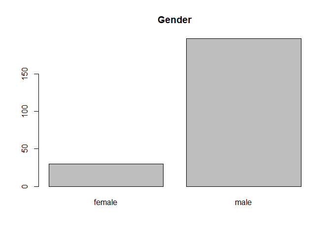<!-- -->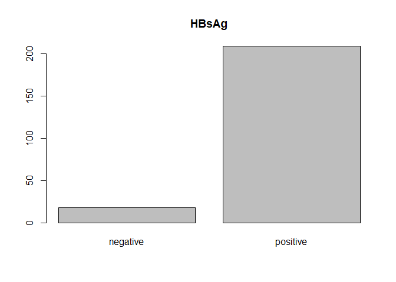<!-- -->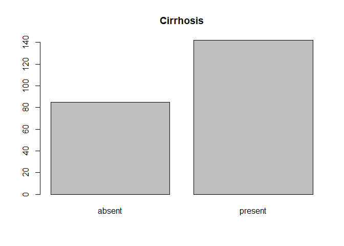<!-- -->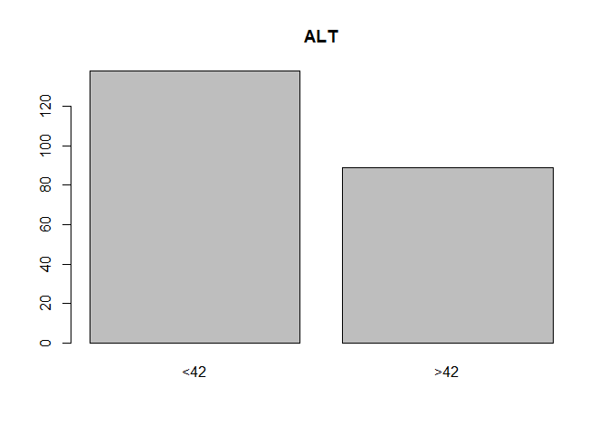<!-- -->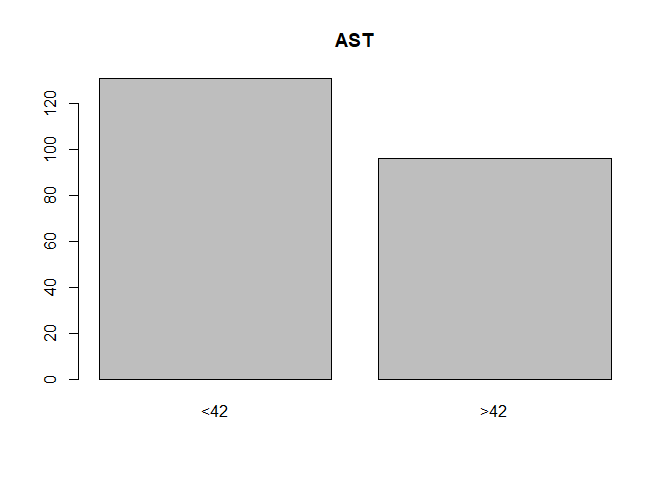<!-- -->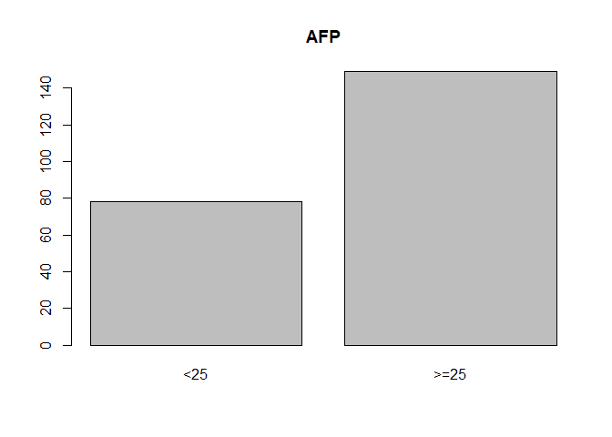<!-- -->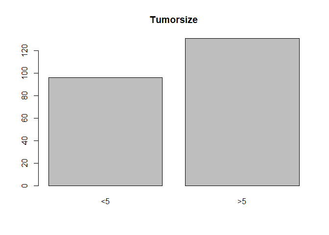<!-- -->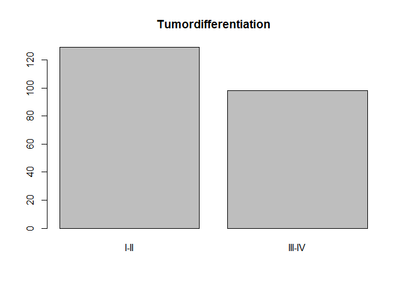<!-- -->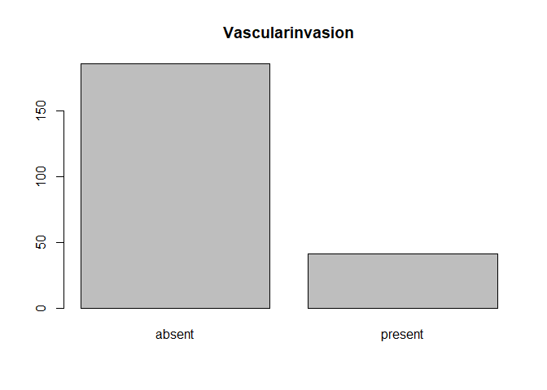<!-- -->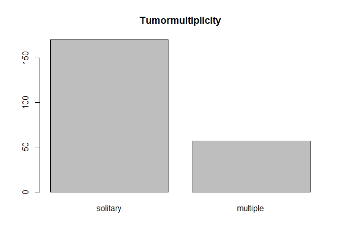<!-- -->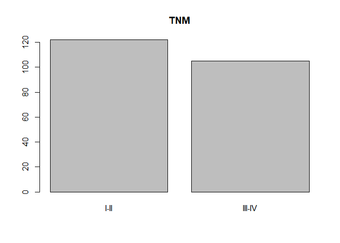<!-- -->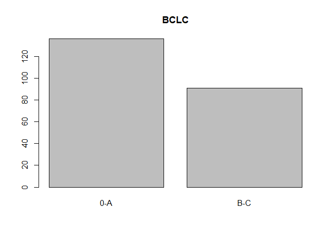<!-- --><!-- -->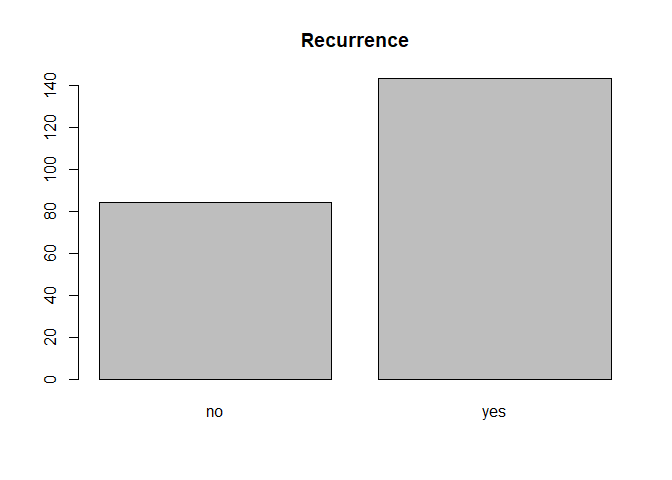<!-- -->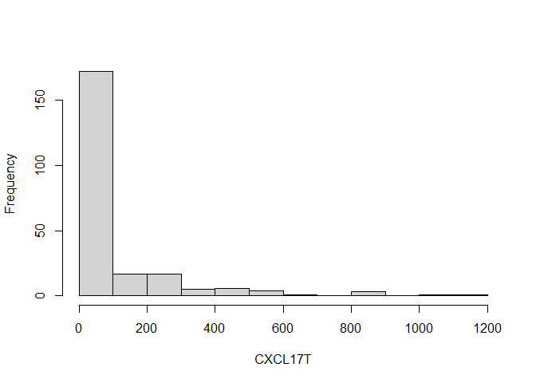<!-- -->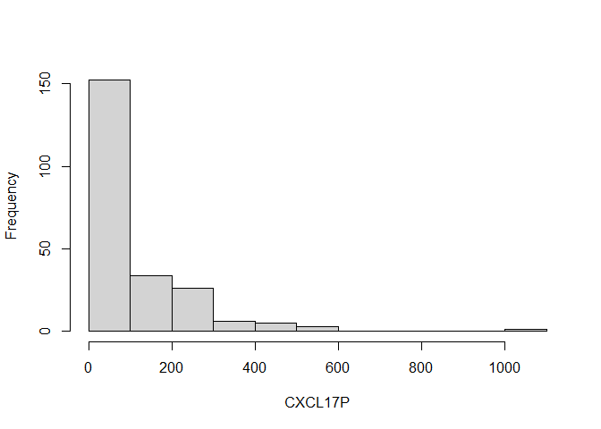<!-- --><!-- -->

<br/> Nothing seems out of the ordinary. We can notice that for some
categories, namely **Gender**and **HBsAg**, there is one value that is
quite underrepresented, which will make the estimation of its effect
difficult.

As our last universal step, we will perform a simple redundancy analysis
to detect potential redundant predictors. <br/>

``` r
library(Hmisc)
redun(~.- Death - Recurrence - OS - RFS,data = hepatoCellular,nk = 4, r2 = 0.95)
```

    ## 
    ## Redundancy Analysis
    ## 
    ## ~Age + Gender + HBsAg + Cirrhosis + ALT + AST + AFP + Tumorsize + 
    ##     Tumordifferentiation + Vascularinvasion + Tumormultiplicity + 
    ##     Capsulation + TNM + BCLC + CXCL17T + CXCL17P + CXCL17N
    ## <environment: 0x0000027e2e034430>
    ## 
    ## n: 227   p: 17   nk: 4 
    ## 
    ## Number of NAs:    0 
    ## 
    ## Transformation of target variables forced to be linear
    ## 
    ## R-squared cutoff: 0.95   Type: ordinary 
    ## 
    ## R^2 with which each variable can be predicted from all other variables:
    ## 
    ##                  Age               Gender                HBsAg 
    ##                0.123                0.110                0.162 
    ##            Cirrhosis                  ALT                  AST 
    ##                0.207                0.191                0.296 
    ##                  AFP            Tumorsize Tumordifferentiation 
    ##                0.183                0.350                0.156 
    ##     Vascularinvasion    Tumormultiplicity          Capsulation 
    ##                0.449                0.555                0.152 
    ##                  TNM                 BCLC              CXCL17T 
    ##                0.539                0.746                0.339 
    ##              CXCL17P              CXCL17N 
    ##                0.610                0.536 
    ## 
    ## No redundant variables

<br/> No predictors seem overly redundant, and hence, we will consider
all of them for modelling. <br/>

## Survival and hazard function and their estimators

<br/> Let us start our survival analysis by establishing some basic
terms. In survival analysis, the variable under investigation is time to
the first occurrence of some event $T$, in our case, the recurrence of
HCC and death. Since the usual question is a probability that $T$ is
greater than some threshold, survival analysis often uses the survival
function (reliability function) $S(t) = P[T>t] = 1 - F(t)$ to
characterize the distribution of $T$ instead of the cumulative
distribution function $F$.

Another important characteristics of the distribution of $T$ used in
survival analysis is the hazard function
$h(t) = \lim_{\Delta t \rightarrow 0} \frac{P[t\leq T<t+\Delta t \mid T\geq t]}{\Delta t} = \frac{f(t)}{S(t)}$.
The hazard function (intensity function or the force of mortality) is
the probability that the individual fails, i.e., experiences the event,
in the next small time interval divided by the length of this interval.
For example, provided that the distribution of $T$ is exponential
($S(t) = e^{-\lambda t}$), the hazard function is constant (its value is
equal to $\lambda$). In practice, we can expect the hazard to evolve
over time. For example, we can expect the hazard function to start quite
high in our case (many complications tend to appear shortly after
surgery) and then decrease over time.

The Kaplan–Meier estimator is the most important estimator of the
survival function from the data. We cannot use a standard empirical
cumulative distribution function as an estimator due to *censoring*. Not
all patients experienced the event, i.e., we have only partial
information about their survival (we only know that they survived till
the last follow-up). The Kaplan–Meier estimator accounts for the
censoring and its form is
$\hat{S}(t) = \prod_{t_i \leq t} (1-\frac{d_i}{n_i})$, where $n_i$ is a
number of subjects at risk at time $t_i$ and $d_i$ is a number of
subjects that failed at time $t_i$. We should note that the key
assumption of the Kaplan–Meier estimator is non-informative censoring,
i.e, the estimator assumes that the censoring is unrelated to the
outcome.

Let us plot the Kaplan–Meier estimator of the survival function for the
overall survival (**OS**) for the whole dataset via the *survival*
package. <br/>

``` r
library(survival)
library(ggsurvfit)

# recode event/censoring to the format used in the survival package
hepatoCellular$Death <- as.numeric(hepatoCellular$Death) - 1
hepatoCellular$Recurrence <- as.numeric(hepatoCellular$Recurrence) - 1

km_os <- survfit(Surv(OS, Death) ~ 1, data = hepatoCellular, conf.type ='log-log')
summary(km_os)
```

    ## Call: survfit(formula = Surv(OS, Death) ~ 1, data = hepatoCellular, 
    ##     conf.type = "log-log")
    ## 
    ##  time n.risk n.event survival std.err lower 95% CI upper 95% CI
    ##     2    227       3    0.987 0.00758        0.960        0.996
    ##     3    224       4    0.969 0.01147        0.936        0.985
    ##     4    220       1    0.965 0.01224        0.931        0.982
    ##     5    219       4    0.947 0.01485        0.909        0.970
    ##     6    214       2    0.938 0.01598        0.898        0.963
    ##     7    212       5    0.916 0.01841        0.872        0.946
    ##     8    207       2    0.907 0.01927        0.861        0.939
    ##     9    204       5    0.885 0.02121        0.836        0.920
    ##    10    199       7    0.854 0.02350        0.801        0.894
    ##    11    190       4    0.836 0.02467        0.781        0.878
    ##    12    186       2    0.827 0.02521        0.771        0.870
    ##    13    183       3    0.813 0.02598        0.756        0.859
    ##    14    179       3    0.800 0.02671        0.741        0.846
    ##    15    176       3    0.786 0.02739        0.726        0.834
    ##    16    172       2    0.777 0.02782        0.717        0.826
    ##    17    170       4    0.759 0.02863        0.697        0.810
    ##    18    165       2    0.750 0.02901        0.687        0.801
    ##    19    161       2    0.740 0.02939        0.677        0.793
    ##    20    158       3    0.726 0.02993        0.662        0.780
    ##    22    153       1    0.721 0.03011        0.657        0.776
    ##    23    151       4    0.702 0.03079        0.637        0.758
    ##    24    147       3    0.688 0.03125        0.622        0.745
    ##    25    142       2    0.678 0.03156        0.612        0.736
    ##    26    140       1    0.673 0.03170        0.607        0.731
    ##    27    138       1    0.669 0.03184        0.602        0.727
    ##    28    137       1    0.664 0.03198        0.597        0.722
    ##    29    135       2    0.654 0.03226        0.587        0.713
    ##    31    130       3    0.639 0.03267        0.571        0.699
    ##    32    127       1    0.634 0.03280        0.566        0.694
    ##    33    125       2    0.624 0.03304        0.555        0.685
    ##    35    120       1    0.618 0.03318        0.550        0.680
    ##    37    112       1    0.613 0.03334        0.544        0.674
    ##    38    110       3    0.596 0.03379        0.527        0.659
    ##    40    101       1    0.590 0.03397        0.520        0.653
    ##    45     85       2    0.576 0.03456        0.506        0.641
    ##    48     74       1    0.569 0.03496        0.497        0.634
    ##    50     65       1    0.560 0.03550        0.487        0.626
    ##    51     62       2    0.542 0.03658        0.467        0.610
    ##    52     60       1    0.533 0.03707        0.457        0.602
    ##    60     52       2    0.512 0.03837        0.435        0.584

``` r
survfit2(Surv(OS,Death) ~ 1, data = hepatoCellular,conf.type ='log-log') %>% 
  ggsurvfit() +
  labs(
    x = "Months",
    y = "Overall survival probability"
  ) + add_confidence_interval()
```

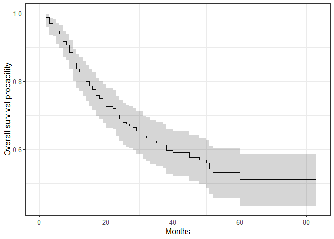<!-- -->

<br/> The parameter *conf.type* refers to the method of computation of
the confidence interval for the Kaplan–Meier estimator. Since the
survival probability inherently lies in \[0,1\], the confidence
intervals are computed for log(-log($S$)) to ensure that the confidence
intervals for $S$ lie in \[0,1\] \[2\].

The Nelson-Altschuler estimator is an alternative estimator that
estimates the cumulative hazard function as
$\sum_{t_i \leq t} \frac{d_i}{n_i}$. we can then use the relation
$S(t) = e^{-H(t)}$ to estimate the survival function (Fleming-Harrington
estimator). We can check that both methods yield almost identical
results. <br/>

``` r
fh_os <- survfit(Surv(OS, Death) ~ 1, data = hepatoCellular,conf.type ='log-log',type='fh')
surv_func <- cbind(summary(km_os)$time,summary(km_os)$surv,summary(fh_os)$surv)
colnames(surv_func) <- c('time','K-M','F-H')
surv_func
```

    ##       time       K-M       F-H
    ##  [1,]    2 0.9867841 0.9868132
    ##  [2,]    3 0.9691630 0.9692308
    ##  [3,]    4 0.9647577 0.9648352
    ##  [4,]    5 0.9471366 0.9472528
    ##  [5,]    6 0.9382848 0.9384207
    ##  [6,]    7 0.9161555 0.9163402
    ##  [7,]    8 0.9073037 0.9075080
    ##  [8,]    9 0.8850659 0.8853196
    ##  [9,]   10 0.8539329 0.8542558
    ## [10,]   11 0.8359554 0.8363187
    ## [11,]   12 0.8269666 0.8273502
    ## [12,]   13 0.8134098 0.8138241
    ## [13,]   14 0.7997772 0.8002226
    ## [14,]   15 0.7861446 0.7866211
    ## [15,]   16 0.7770034 0.7775009
    ## [16,]   17 0.7587210 0.7592605
    ## [17,]   18 0.7495244 0.7500851
    ## [18,]   19 0.7402135 0.7407962
    ## [19,]   20 0.7261588 0.7267749
    ## [20,]   22 0.7214127 0.7220402
    ## [21,]   23 0.7023024 0.7029765
    ## [22,]   24 0.6879697 0.6886787
    ## [23,]   25 0.6782800 0.6790131
    ## [24,]   26 0.6734351 0.6741803
    ## [25,]   27 0.6685552 0.6693126
    ## [26,]   28 0.6636752 0.6644449
    ## [27,]   29 0.6538430 0.6546376
    ## [28,]   31 0.6387543 0.6395885
    ## [29,]   32 0.6337247 0.6345722
    ## [30,]   33 0.6235852 0.6244595
    ## [31,]   35 0.6183886 0.6192773
    ## [32,]   37 0.6128673 0.6137727
    ## [33,]   38 0.5961527 0.5971093
    ## [34,]   40 0.5902502 0.5912265
    ## [35,]   45 0.5763620 0.5773968
    ## [36,]   48 0.5685733 0.5696466
    ## [37,]   50 0.5598260 0.5609499
    ## [38,]   51 0.5417671 0.5429999
    ## [39,]   52 0.5327377 0.5340249
    ## [40,]   60 0.5122478 0.5136817

<br/> Next, let us plot the Kaplan-Meier estimator for recurrence of HCC
(**RFS**). <br/>

``` r
km_rfs <- survfit(Surv(RFS, Recurrence) ~ 1, data = hepatoCellular, conf.type ='log-log')
summary(km_rfs)
```

    ## Call: survfit(formula = Surv(RFS, Recurrence) ~ 1, data = hepatoCellular, 
    ##     conf.type = "log-log")
    ## 
    ##  time n.risk n.event survival std.err lower 95% CI upper 95% CI
    ##     1    227      14    0.938  0.0160        0.898        0.963
    ##     2    213       9    0.899  0.0200        0.851        0.931
    ##     3    204      14    0.837  0.0245        0.782        0.879
    ##     4    190      15    0.771  0.0279        0.711        0.820
    ##     5    175       6    0.744  0.0289        0.682        0.796
    ##     6    169       3    0.731  0.0294        0.669        0.784
    ##     7    166       2    0.722  0.0297        0.659        0.776
    ##     8    164       6    0.696  0.0305        0.632        0.751
    ##     9    158       5    0.674  0.0311        0.609        0.731
    ##    10    153       4    0.656  0.0315        0.591        0.714
    ##    11    149       7    0.626  0.0321        0.559        0.685
    ##    12    142       6    0.599  0.0325        0.532        0.660
    ##    13    136       5    0.577  0.0328        0.510        0.638
    ##    14    130       3    0.564  0.0329        0.497        0.625
    ##    15    127       5    0.542  0.0331        0.474        0.604
    ##    16    122       4    0.524  0.0332        0.457        0.586
    ##    17    118       1    0.519  0.0332        0.452        0.582
    ##    18    116       3    0.506  0.0332        0.439        0.569
    ##    19    111       3    0.492  0.0333        0.426        0.555
    ##    20    107       1    0.488  0.0333        0.421        0.551
    ##    21    104       2    0.478  0.0333        0.412        0.542
    ##    22    102       1    0.474  0.0333        0.407        0.537
    ##    23    100       4    0.455  0.0333        0.389        0.518
    ##    24     96       1    0.450  0.0333        0.384        0.514
    ##    25     95       1    0.445  0.0332        0.379        0.509
    ##    26     94       2    0.436  0.0332        0.370        0.500
    ##    27     91       2    0.426  0.0332        0.361        0.490
    ##    28     89       1    0.421  0.0331        0.356        0.485
    ##    29     88       1    0.417  0.0331        0.351        0.480
    ##    30     85       1    0.412  0.0331        0.347        0.476
    ##    32     84       1    0.407  0.0330        0.342        0.471
    ##    33     82       1    0.402  0.0330        0.337        0.466
    ##    35     80       2    0.392  0.0329        0.327        0.456
    ##    37     73       2    0.381  0.0329        0.317        0.445
    ##    44     59       1    0.375  0.0330        0.310        0.439
    ##    45     55       2    0.361  0.0331        0.296        0.426
    ##    48     46       1    0.353  0.0333        0.288        0.418
    ##    50     41       1    0.344  0.0336        0.279        0.410

``` r
survfit2(Surv(RFS,Recurrence) ~ 1, data = hepatoCellular, conf.type ='log-log') %>% 
  ggsurvfit() +
  labs(
    x = "Months",
    y = "Recurrence-free survival probability"
  ) + add_confidence_interval()
```

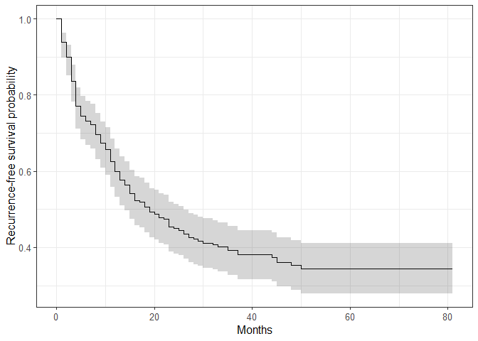<!-- -->

<br/> When constructing the Kaplan-Meier estimator for the recurrence,
there is an important fact to consider. If a patient would die before
experiencing the recurrence of HCC (they could die due to another
unrelated cause), they had to be censored since their recurrence
survival time cannot be measured. However, this censoring influences the
recurrence event (they are dead and thus HCC cannot obviously recur for
them in the future).

These types of censoring events are called *competing risks* and they
violate the assumption of the Kaplan-Meier estimator (censoring is
unrelated to the event of interest). Crucially, they cause a bias in the
Kaplan-Meier estimator, namely, they cause an overestimation of the risk
of the event. The issue is that the Kaplan-Meier estimator does not
differentiate between censoring due to lack of follow-up (subject is
still at risk in our case of recurrence) and censoring due to, in our
case, death (subject is obviously no longer at risk of recurrence)
\[3\].

Let us make sure that we are not dealing with competing risks in our
case. <br/>

``` r
any(hepatoCellular$Recurrence == 0 & hepatoCellular$Death == 1)
```

    ## [1] FALSE

<br/> No subject died before experiencing recurrence, i.e., we have no
observed competing risks in the data. Thus, the Kaplan-Meier estimator
for **RFS** is valid.

Another important descriptive statistic of the survival data is the
median survival time (the smallest t such that the survival function is
less than or equal to 0.5). <br/>

``` r
km_os
```

    ## Call: survfit(formula = Surv(OS, Death) ~ 1, data = hepatoCellular, 
    ##     conf.type = "log-log")
    ## 
    ##        n events median 0.95LCL 0.95UCL
    ## [1,] 227     97     NA      48      NA

``` r
km_rfs
```

    ## Call: survfit(formula = Surv(RFS, Recurrence) ~ 1, data = hepatoCellular, 
    ##     conf.type = "log-log")
    ## 
    ##        n events median 0.95LCL 0.95UCL
    ## [1,] 227    143     19      14      26

<br/> The median does not exist for overall survival because the
probability of overall survival never fell below 0.5.

The median follow-up time is another useful descriptive statistic. A
simple median of in our case **OS** or **RFS** could be quite small,
provided that death/recurrence happens often early. Thus, we can compute
instead a potential median follow-up time (i.e., how long follow-up time
would be provided if the subjects did not fail). We compute it by
switching the role of censoring and event \[2\]. <br/>

``` r
# simple
median(hepatoCellular$OS)
```

    ## [1] 36

``` r
median(hepatoCellular$RFS)
```

    ## [1] 18

``` r
# potential
survfit(Surv(OS,1-Death) ~ 1, data = hepatoCellular)
```

    ## Call: survfit(formula = Surv(OS, 1 - Death) ~ 1, data = hepatoCellular)
    ## 
    ##        n events median 0.95LCL 0.95UCL
    ## [1,] 227    130     50      47      60

``` r
survfit(Surv(RFS,1-Recurrence) ~ 1, data = hepatoCellular)
```

    ## Call: survfit(formula = Surv(RFS, 1 - Recurrence) ~ 1, data = hepatoCellular)
    ## 
    ##        n events median 0.95LCL 0.95UCL
    ## [1,] 227     84     55      47      61

<br/> We see that the potential median follow-up time is 50 and 55
months, respectively, whereas the simple one is only 36 and 18 months.

The last estimator we will mention in this part of our analysis is the
estimator of the hazard function. Similarly to estimating a density
function, we need some kind of smoothing to obtain a continuous
estimator. As usual, the difficult part is to determine how much
smoothing is needed. We plot several kernel estimators of the hazard
function (**OS**) with various values of the smoothing parameter via the
package *muhaz* and compare the resulting survival function with the
Kaplan-Meier estimator. <br/>

``` r
library(muhaz)

muhaz1 <- muhaz(hepatoCellular$OS, hepatoCellular$Death, max.time=80, bw.grid=1, bw.method="global", b.cor="none")
muhaz5 <- muhaz(hepatoCellular$OS, hepatoCellular$Death, max.time=80, bw.grid=5, bw.method="global", b.cor="none")
muhaz10 <- muhaz(hepatoCellular$OS, hepatoCellular$Death, max.time=80, bw.grid=10, bw.method="global", b.cor="none")
muhaz15 <- muhaz(hepatoCellular$OS, hepatoCellular$Death, max.time=80, bw.grid=15, bw.method="global", b.cor="none")

par(mfrow = c(1, 2))
plot(muhaz1)
plot(muhaz5)
```

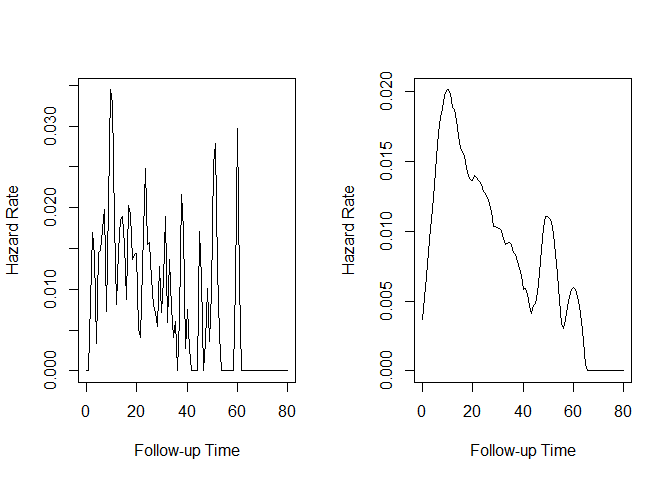<!-- -->

``` r
plot(muhaz10)
plot(muhaz15)
```

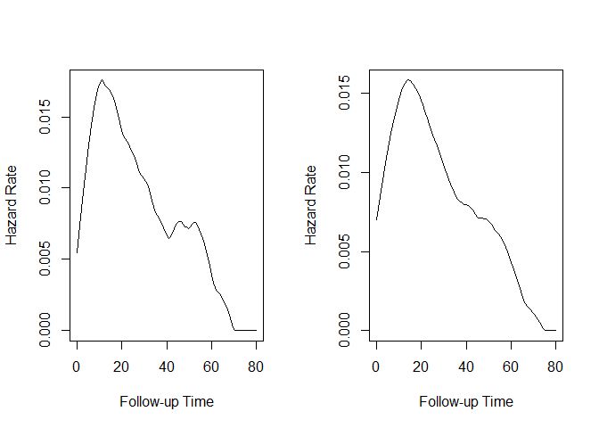<!-- -->

``` r
# compare K-M with hazard

haz1 <- muhaz1$haz.est
times1 <- muhaz1$est.grid
surv1 <- exp(-cumsum(haz1[1:(length(haz1)-1)]*diff(times1)))

haz2 <- muhaz5$haz.est
times2 <- muhaz5$est.grid
surv2 <- exp(-cumsum(haz2[1:(length(haz2)-1)]*diff(times2)))

haz3 <- muhaz10$haz.est
times3 <- muhaz10$est.grid
surv3 <- exp(-cumsum(haz3[1:(length(haz3)-1)]*diff(times3)))

haz4 <- muhaz15$haz.est
times4 <- muhaz15$est.grid
surv4 <- exp(-cumsum(haz4[1:(length(haz4)-1)]*diff(times4)))


par(mfrow = c(1, 1))
plot(km_os, conf.int=T, xlab="Time in months", xlim=c(0,80), ylab="Survival probability")
lines(surv1 ~ times1[1:(length(times1) - 1)], col = 'red')
lines(surv2 ~ times2[1:(length(times2) - 1)], col = 'blue')
lines(surv3 ~ times3[1:(length(times3) - 1)], col = 'green')
lines(surv4 ~ times4[1:(length(times4) - 1)], col = 'purple')
```

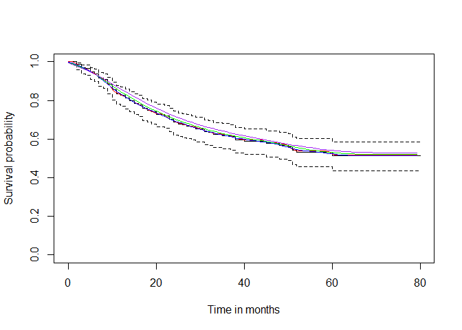<!-- -->

<br/> The value of smoothing about 10 (15 might be too much) is just
about right. As expected, the hazard rate increases in the early months
after surgery and then steadily decreases about one year after the
surgery. Interestingly, there appears to be a slight ‘bump’ in the
hazard rate after about three years, but that could be just an artifact
in the data. <br/>

## Univariate analysis via log-rank tests

<br/> In this part of our analysis, we will demonstrate the univariate
analysis of the survival data. First, we can plot the Kaplan-Meier
estimators for various factor levels. <br/>

``` r
survfit2(Surv(OS,Death) ~ Age > median(Age), data = hepatoCellular, conf.type ='log-log') %>% 
  ggsurvfit() +
  labs(
    x = "Months",
    y = "Overall survival probability (Age)"
  ) + add_confidence_interval()
```

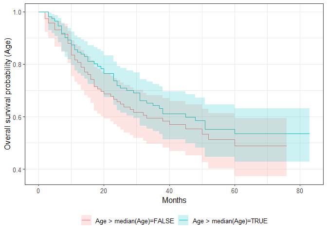<!-- -->

``` r
survfit2(Surv(OS,Death) ~ Gender, data = hepatoCellular, conf.type ='log-log') %>% 
  ggsurvfit() +
  labs(
    x = "Months",
    y = "Overall survival probability (Gender)"
  ) + add_confidence_interval()
```

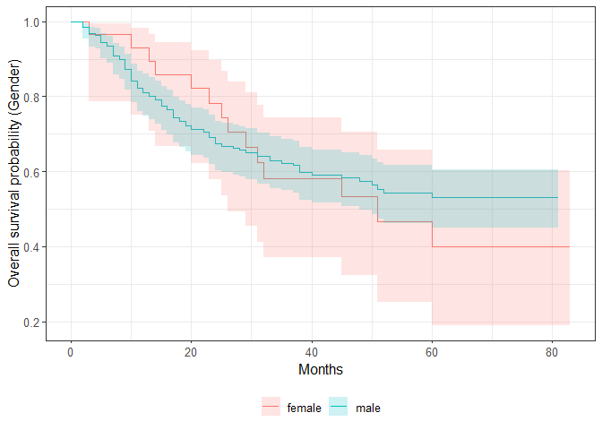<!-- -->

``` r
survfit2(Surv(OS,Death) ~ AST, data = hepatoCellular, conf.type ='log-log') %>% 
  ggsurvfit() +
  labs(
    x = "Months",
    y = "Overall survival probability (AST)"
  ) + add_confidence_interval()
```

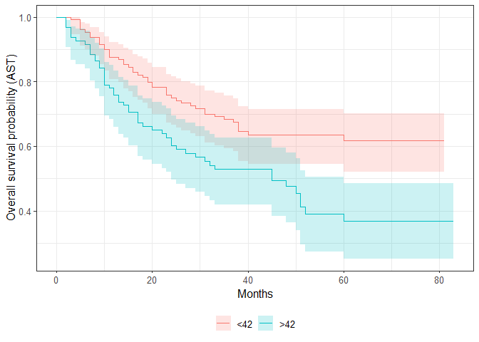<!-- -->

``` r
survfit2(Surv(OS,Death) ~ AFP, data = hepatoCellular, conf.type ='log-log') %>% 
  ggsurvfit() +
  labs(
    x = "Months",
    y = "Overall survival probability (AFP)"
  ) + add_confidence_interval()
```

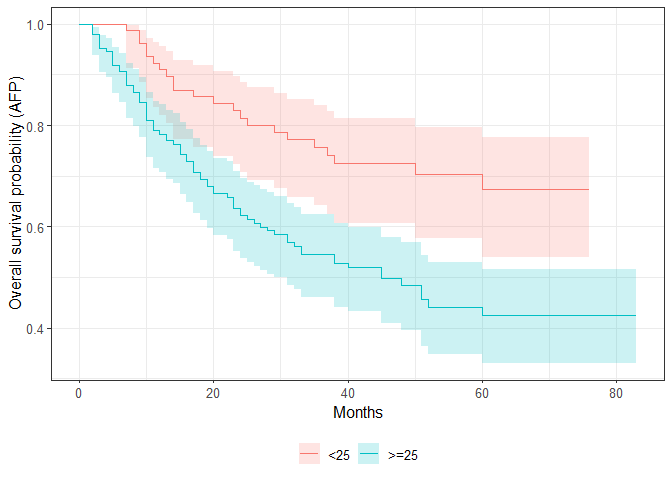<!-- -->

``` r
survfit2(Surv(OS,Death) ~ Tumorsize, data = hepatoCellular, conf.type ='log-log') %>% 
  ggsurvfit() +
  labs(
    x = "Months",
    y = "Overall survival probability (Tumorsize)"
  ) + add_confidence_interval()
```

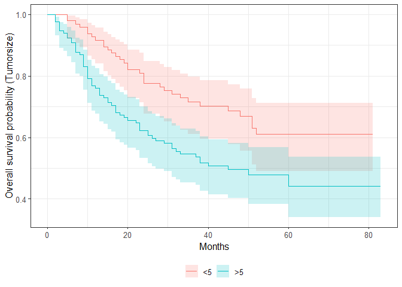<!-- -->

``` r
survfit2(Surv(OS,Death) ~ Tumordifferentiation, data = hepatoCellular, conf.type ='log-log') %>% 
  ggsurvfit() +
  labs(
    x = "Months",
    y = "Overall survival probability (Tumordiff.)"
  ) + add_confidence_interval()
```

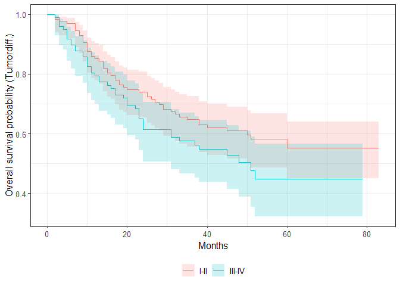<!-- -->

``` r
survfit2(Surv(OS,Death) ~ Vascularinvasion, data = hepatoCellular, conf.type ='log-log') %>% 
  ggsurvfit() +
  labs(
    x = "Months",
    y = "Overall survival probability (Vascularinv.)"
  ) + add_confidence_interval()
```

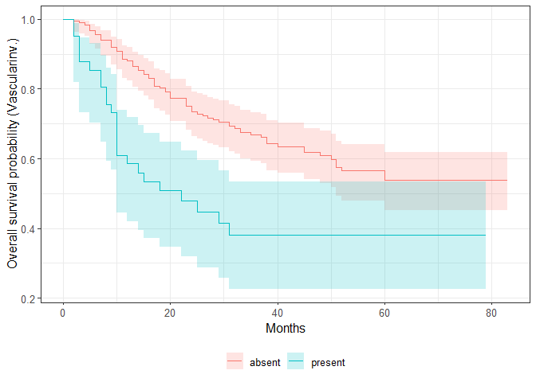<!-- -->

``` r
survfit2(Surv(OS,Death) ~ Tumormultiplicity, data = hepatoCellular, conf.type ='log-log') %>% 
  ggsurvfit() +
  labs(
    x = "Months",
    y = "Overall survival probability (Tumormult.)"
  ) + add_confidence_interval()
```

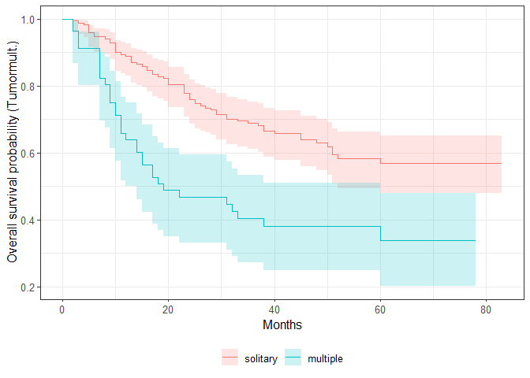<!-- -->

``` r
survfit2(Surv(OS,Death) ~ TNM, data = hepatoCellular, conf.type ='log-log') %>% 
  ggsurvfit() +
  labs(
    x = "Months",
    y = "Overall survival probability (TNM)"
  ) + add_confidence_interval()
```

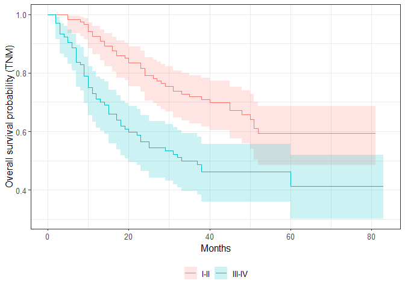<!-- -->

``` r
survfit2(Surv(OS,Death) ~ BCLC, data = hepatoCellular, conf.type ='log-log') %>% 
  ggsurvfit() +
  labs(
    x = "Months",
    y = "Overall survival probability (BCLC)"
  ) + add_confidence_interval()
```

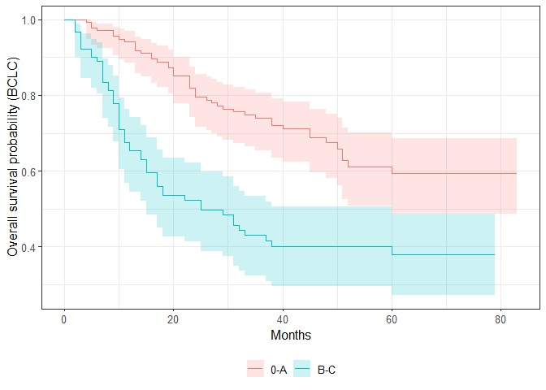<!-- -->

``` r
survfit2(Surv(OS,Death) ~ CXCL17T > median(CXCL17T), data = hepatoCellular, conf.type ='log-log') %>% 
  ggsurvfit() +
  labs(
    x = "Months",
    y = "Overall survival probability"
  ) + add_confidence_interval()
```

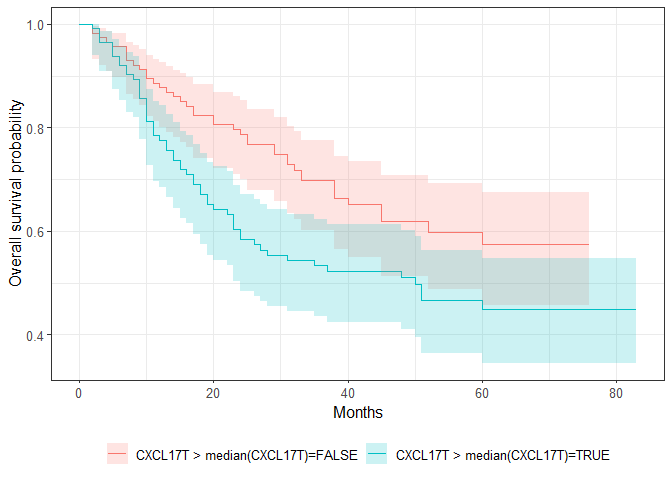<!-- -->

``` r
survfit2(Surv(OS,Death) ~ CXCL17P > median(CXCL17P), data = hepatoCellular, conf.type ='log-log') %>% 
  ggsurvfit() +
  labs(
    x = "Months",
    y = "Overall survival probability"
  ) + add_confidence_interval()
```

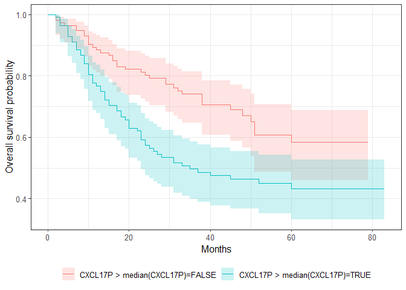<!-- -->

``` r
survfit2(Surv(OS,Death) ~ CXCL17N > median(CXCL17N), data = hepatoCellular, conf.type ='log-log') %>% 
  ggsurvfit() +
  labs(
    x = "Months",
    y = "Overall survival probability"
  ) + add_confidence_interval()
```

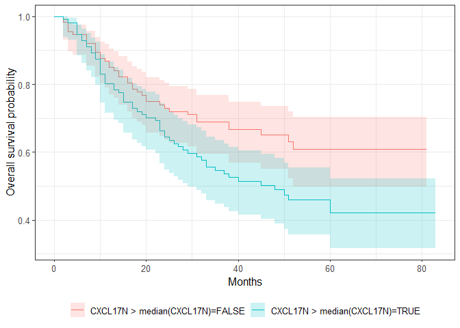<!-- -->

<br/> We observe that some factors, such as **Age** and **Gender**, seem
to have little effect. However, others, such as
**Tumorsize**,**Tumormultiplicity**, **TNM**, and **BCLC**, influence
the survival probability noticeably. Crucially, the biomarker **CXCL17**
may help to differentiate the high-risk patients based on these plots.

The log-rank test allows us to formalize the comparison of two survival
distributions \[2\]. <br/>

``` r
survdiff(Surv(OS,Death) ~ Age > median(Age), data = hepatoCellular)
```

    ## Call:
    ## survdiff(formula = Surv(OS, Death) ~ Age > median(Age), data = hepatoCellular)
    ## 
    ##                           N Observed Expected (O-E)^2/E (O-E)^2/V
    ## Age > median(Age)=FALSE 116       50       46     0.352     0.681
    ## Age > median(Age)=TRUE  111       47       51     0.318     0.681
    ## 
    ##  Chisq= 0.7  on 1 degrees of freedom, p= 0.4

``` r
var_names <- c('Age(low vs high)','Gender','HBsAg','Cirrhosis','ALT','AST','AFP','Tumorsize','Tumordifferentiation','Vascularinvasion','Tumormultiplicity','Capsulation','TNM','BCLC','CXCL17T(low vs high)','CXCL17P(low vs high)','CXCL17N(low vs high)')

lr1 <- survdiff(Surv(OS,Death) ~ Age > median(Age), data = hepatoCellular)
lr2 <- survdiff(Surv(OS,Death) ~ Gender, data = hepatoCellular)
lr3 <- survdiff(Surv(OS,Death) ~ HBsAg, data = hepatoCellular)
lr4 <- survdiff(Surv(OS,Death) ~ Cirrhosis, data = hepatoCellular)
lr5 <- survdiff(Surv(OS,Death) ~ ALT, data = hepatoCellular)
lr6 <- survdiff(Surv(OS,Death) ~ AST, data = hepatoCellular)
lr7 <- survdiff(Surv(OS,Death) ~ AFP, data = hepatoCellular)
lr8 <- survdiff(Surv(OS,Death) ~ Tumorsize, data = hepatoCellular)
lr9 <- survdiff(Surv(OS,Death) ~ Tumordifferentiation, data = hepatoCellular)
lr10 <- survdiff(Surv(OS,Death) ~ Vascularinvasion, data = hepatoCellular)
lr11 <- survdiff(Surv(OS,Death) ~ Tumormultiplicity, data = hepatoCellular)
lr12 <- survdiff(Surv(OS,Death) ~ Capsulation, data = hepatoCellular)
lr13 <- survdiff(Surv(OS,Death) ~ TNM, data = hepatoCellular)
lr14 <- survdiff(Surv(OS,Death) ~ BCLC, data = hepatoCellular)
lr15 <- survdiff(Surv(OS,Death) ~ CXCL17T > median(CXCL17T), data = hepatoCellular)
lr16 <- survdiff(Surv(OS,Death) ~ CXCL17P > median(CXCL17P), data = hepatoCellular)
lr17 <- survdiff(Surv(OS,Death) ~ CXCL17N > median(CXCL17N), data = hepatoCellular)


lr_pvalues_os <- c(lr1$pvalue,lr2$pvalue,lr3$pvalue,lr4$pvalue,lr5$pvalue,lr6$pvalue,lr7$pvalue,lr8$pvalue,lr9$pvalue,lr10$pvalue,lr11$pvalue,lr12$pvalue,lr13$pvalue,lr14$pvalue,lr15$pvalue,lr16$pvalue,lr17$pvalue)
names(lr_pvalues_os) <- var_names
lr_pvalues_os
```

    ##     Age(low vs high)               Gender                HBsAg 
    ##         4.092588e-01         7.531564e-01         5.346242e-01 
    ##            Cirrhosis                  ALT                  AST 
    ##         3.170086e-01         2.462995e-01         2.593726e-03 
    ##                  AFP            Tumorsize Tumordifferentiation 
    ##         7.768895e-04         3.913464e-03         1.499465e-01 
    ##     Vascularinvasion    Tumormultiplicity          Capsulation 
    ##         6.702762e-04         3.724055e-05         1.030656e-01 
    ##                  TNM                 BCLC CXCL17T(low vs high) 
    ##         3.446123e-04         4.054496e-06         2.403882e-02 
    ## CXCL17P(low vs high) CXCL17N(low vs high) 
    ##         1.777698e-03         2.322501e-02

<br/> Let us also compute the test for recurrence-free survival. <br/>

``` r
lr1 <- survdiff(Surv(RFS,Recurrence) ~ Age > median(Age), data = hepatoCellular)
lr2 <- survdiff(Surv(RFS,Recurrence) ~ Gender, data = hepatoCellular)
lr3 <- survdiff(Surv(RFS,Recurrence) ~ HBsAg, data = hepatoCellular)
lr4 <- survdiff(Surv(RFS,Recurrence) ~ Cirrhosis, data = hepatoCellular)
lr5 <- survdiff(Surv(RFS,Recurrence) ~ ALT, data = hepatoCellular)
lr6 <- survdiff(Surv(RFS,Recurrence) ~ AST, data = hepatoCellular)
lr7 <- survdiff(Surv(RFS,Recurrence) ~ AFP, data = hepatoCellular)
lr8 <- survdiff(Surv(RFS,Recurrence) ~ Tumorsize, data = hepatoCellular)
lr9 <- survdiff(Surv(RFS,Recurrence) ~ Tumordifferentiation, data = hepatoCellular)
lr10 <- survdiff(Surv(RFS,Recurrence) ~ Vascularinvasion, data = hepatoCellular)
lr11 <- survdiff(Surv(RFS,Recurrence) ~ Tumormultiplicity, data = hepatoCellular)
lr12 <- survdiff(Surv(RFS,Recurrence) ~ Capsulation, data = hepatoCellular)
lr13 <- survdiff(Surv(RFS,Recurrence) ~ TNM, data = hepatoCellular)
lr14 <- survdiff(Surv(RFS,Recurrence) ~ BCLC, data = hepatoCellular)
lr15 <- survdiff(Surv(RFS,Recurrence) ~ CXCL17T > median(CXCL17T), data = hepatoCellular)
lr16 <- survdiff(Surv(RFS,Recurrence) ~ CXCL17P > median(CXCL17P), data = hepatoCellular)
lr17 <- survdiff(Surv(RFS,Recurrence) ~ CXCL17N > median(CXCL17N), data = hepatoCellular)

lr_pvalues_rfs <- c(lr1$pvalue,lr2$pvalue,lr3$pvalue,lr4$pvalue,lr5$pvalue,lr6$pvalue,lr7$pvalue,lr8$pvalue,lr9$pvalue,lr10$pvalue,lr11$pvalue,lr12$pvalue,lr13$pvalue,lr14$pvalue,lr15$pvalue,lr16$pvalue,lr17$pvalue)
names(lr_pvalues_rfs) <- var_names
lr_pvalues_rfs
```

    ##     Age(low vs high)               Gender                HBsAg 
    ##         1.370484e-01         2.507325e-01         7.187140e-02 
    ##            Cirrhosis                  ALT                  AST 
    ##         3.002352e-01         6.135280e-01         7.788281e-03 
    ##                  AFP            Tumorsize Tumordifferentiation 
    ##         2.842977e-03         6.586641e-03         3.450952e-01 
    ##     Vascularinvasion    Tumormultiplicity          Capsulation 
    ##         2.086590e-02         3.620969e-06         6.618040e-02 
    ##                  TNM                 BCLC CXCL17T(low vs high) 
    ##         3.710218e-04         1.682630e-05         4.817357e-03 
    ## CXCL17P(low vs high) CXCL17N(low vs high) 
    ##         1.039007e-04         4.685938e-04

<br/> We observe that CXCL17T,CXCL17P, and CXCL17N are all significant.
However, we are not adjusting for other covariates. To do so, a solution
would be stratification, e.g. <br/>

``` r
survfit2(Surv(RFS,Recurrence) ~ strata(BCLC) + (CXCL17N > median(CXCL17N)), data = hepatoCellular, conf.type ='log-log') %>% 
  ggsurvfit() +
  labs(
    x = "Months",
    y = "Recurrence free survival probability"
  ) + add_confidence_interval()
```

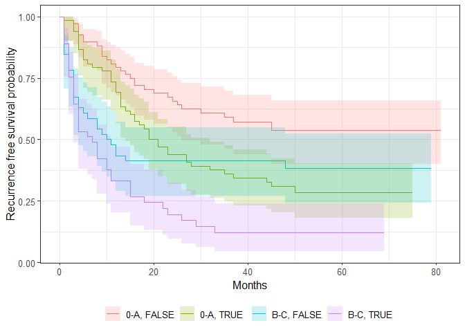<!-- -->

``` r
survdiff(Surv(RFS,Recurrence) ~ strata(BCLC) + (CXCL17N > median(CXCL17N)), data = hepatoCellular)
```

    ## Call:
    ## survdiff(formula = Surv(RFS, Recurrence) ~ strata(BCLC) + (CXCL17N > 
    ##     median(CXCL17N)), data = hepatoCellular)
    ## 
    ##                                   N Observed Expected (O-E)^2/E (O-E)^2/V
    ## CXCL17N > median(CXCL17N)=FALSE 114       57     77.2      5.27      12.2
    ## CXCL17N > median(CXCL17N)=TRUE  113       86     65.8      6.18      12.2
    ## 
    ##  Chisq= 12.2  on 1 degrees of freedom, p= 5e-04

<br/> However, this approach does not handle continuous covariates very
well. Moreover, while the log-rank test appears to be nonparametric, it
is actually not, and it is mostly equivalent to the Cox proportional
hazards model (<https://www.fharrell.com/post/logrank>), which we will
discuss next.  
<br/>

## Cox proportional hazards model

<br/> The Cox proportional hazards model assumes the hazard function
$h(t) = h_0(t)e^{X\beta}$. It is often called a semi-parametric model,
since the baseline hazard $h_0(t)$ actually does not need to be
estimated to estimate parameters $\beta$. The model is actually quite
similar to the continuation ratio model for ordinal response (Third
Circle). The difference is that instead of ordered categories, we have
continuous time.

Having noticed that the proportional hazards assumption should be quite
familiar, it essentially assumes that the effect of predictors on the
hazard function does not change in time. Again, quite similar to the
ordinal models, when proportionality means that the effect of predictors
in the model did not change with the categories of the response.

Before we proceed to fit the model, let us assess what kind of model our
data supports. The effective sample size of the survival data is the
number of failures \[4\], which is 97 (for **OS**) and 143 (for
**RFS**). <br/>

``` r
sum(hepatoCellular$Death)
```

    ## [1] 97

``` r
sum(hepatoCellular$Recurrence)
```

    ## [1] 143

<br/> Thus, our data support about 5 - 10 and 7 - 14 predictors. We will
include all predictors in our model (which stretches our guidelines, but
we are mostly interested in testing the effect of **CXCL17** and thus
parsimony is not as important). However, we cannot really include any
interactions and nonlinear terms. <br/>

### Parameter estimates and baseline hazard functions

<br/> Let us fit the Cox proportional hazards model for **OS** first.
<br/>

``` r
library(car)

coxmodel_os <- coxph(Surv(OS, Death) ~ Age + Gender + HBsAg + Cirrhosis + ALT + AST + AFP + Tumorsize + Tumordifferentiation + Vascularinvasion + Tumormultiplicity  + Capsulation  + TNM  + BCLC  + CXCL17T  + CXCL17P  + CXCL17N, data = hepatoCellular, x = TRUE)

coefficients(coxmodel_os)
```

    ##                        Age                 Gendermale 
    ##               0.0031516392              -0.0947074940 
    ##              HBsAgpositive           Cirrhosispresent 
    ##               0.0026742491               0.2712439727 
    ##                     ALT>42                     AST>42 
    ##               0.0187713947               0.1656114683 
    ##                    AFP>=25                Tumorsize>5 
    ##               0.8200900055               0.5928784583 
    ## TumordifferentiationIII-IV    Vascularinvasionpresent 
    ##               0.2797416384               0.2783885967 
    ##  Tumormultiplicitymultiple         Capsulationpresent 
    ##               0.1774358486              -0.3349700091 
    ##                  TNMIII-IV                    BCLCB-C 
    ##              -0.3371879802               0.7232410156 
    ##                    CXCL17T                    CXCL17P 
    ##               0.0009899852               0.0030201759 
    ##                    CXCL17N 
    ##              -0.0007080725

``` r
# no interactions -> we can use type II Anova
Anova(coxmodel_os)
```

    ## Analysis of Deviance Table (Type II tests)
    ##                      LR Chisq Df Pr(>Chisq)   
    ## Age                    0.1186  1   0.730576   
    ## Gender                 0.0918  1   0.761929   
    ## HBsAg                  0.0000  1   0.994886   
    ## Cirrhosis              1.3780  1   0.240436   
    ## ALT                    0.0060  1   0.938319   
    ## AST                    0.4521  1   0.501327   
    ## AFP                   10.0201  1   0.001548 **
    ## Tumorsize              5.2594  1   0.021828 * 
    ## Tumordifferentiation   1.6596  1   0.197663   
    ## Vascularinvasion       0.6166  1   0.432326   
    ## Tumormultiplicity      0.2777  1   0.598233   
    ## Capsulation            1.8007  1   0.179625   
    ## TNM                    1.2158  1   0.270182   
    ## BCLC                   2.9498  1   0.085886 . 
    ## CXCL17T                2.9025  1   0.088445 . 
    ## CXCL17P                7.9692  1   0.004758 **
    ## CXCL17N                0.8511  1   0.356241   
    ## ---
    ## Signif. codes:  0 '***' 0.001 '**' 0.01 '*' 0.05 '.' 0.1 ' ' 1

<br/> We observe that after adjusting for other covariates, only
**CXCL17P** is clearly significant, **CXCL17T** and **CXCL17N** are not
(**CXCL17T** is somewhat borderline). <br/>

``` r
coxmodel_rfs <- coxph(Surv(RFS, Recurrence) ~ Age + Gender + HBsAg + Cirrhosis + ALT + AST + AFP + Tumorsize + Tumordifferentiation + Vascularinvasion + Tumormultiplicity  + Capsulation  + TNM  + BCLC  + CXCL17T  + CXCL17P  + CXCL17N, data = hepatoCellular, x = TRUE)

coefficients(coxmodel_rfs)
```

    ##                        Age                 Gendermale 
    ##              -0.0072103214              -0.2251090449 
    ##              HBsAgpositive           Cirrhosispresent 
    ##               0.5283697300               0.0362237698 
    ##                     ALT>42                     AST>42 
    ##              -0.1010580974               0.1303408955 
    ##                    AFP>=25                Tumorsize>5 
    ##               0.5882922750               0.3924580574 
    ## TumordifferentiationIII-IV    Vascularinvasionpresent 
    ##               0.1682376466               0.0045396289 
    ##  Tumormultiplicitymultiple         Capsulationpresent 
    ##               0.1648389027              -0.3043523710 
    ##                  TNMIII-IV                    BCLCB-C 
    ##              -0.2651201545               0.6900686973 
    ##                    CXCL17T                    CXCL17P 
    ##               0.0013588963               0.0024451517 
    ##                    CXCL17N 
    ##              -0.0001410281

``` r
Anova(coxmodel_rfs)
```

    ## Analysis of Deviance Table (Type II tests)
    ##                      LR Chisq Df Pr(>Chisq)   
    ## Age                    0.8839  1   0.347129   
    ## Gender                 0.8084  1   0.368586   
    ## HBsAg                  2.2049  1   0.137574   
    ## Cirrhosis              0.0359  1   0.849697   
    ## ALT                    0.2654  1   0.606420   
    ## AST                    0.4279  1   0.513002   
    ## AFP                    8.3789  1   0.003796 **
    ## Tumorsize              3.2620  1   0.070903 . 
    ## Tumordifferentiation   0.9043  1   0.341638   
    ## Vascularinvasion       0.0002  1   0.987833   
    ## Tumormultiplicity      0.3388  1   0.560536   
    ## Capsulation            2.1377  1   0.143721   
    ## TNM                    1.1140  1   0.291212   
    ## BCLC                   3.8913  1   0.048538 * 
    ## CXCL17T                6.5950  1   0.010227 * 
    ## CXCL17P                6.4169  1   0.011304 * 
    ## CXCL17N                0.0480  1   0.826509   
    ## ---
    ## Signif. codes:  0 '***' 0.001 '**' 0.01 '*' 0.05 '.' 0.1 ' ' 1

<br/> In the **RFS** model, both **CXCL17T** and **CXCL17P** are
significant.

Even though it is not strictly necessary to estimate the parameters in
the model (and estimate the hazard ratios), we can also estimate the
baseline hazard functions (and thus obtain absolute survival
probabilities, not just ratios, if needed). <br/>

``` r
par(mfrow = c(1, 1))

plot(basehaz(coxmodel_os,centered = FALSE)[,2],basehaz(coxmodel_os,centered = FALSE)[,1],xlab = 'Time (in months)', ylab = 'Baseline hazard function (OS)')
```

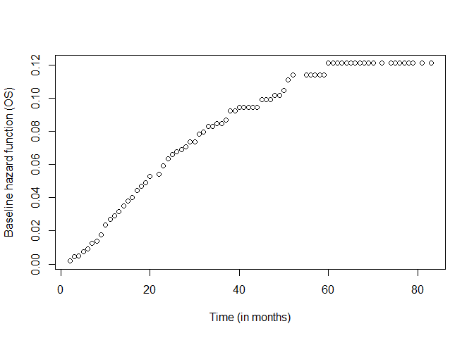<!-- -->

``` r
plot(basehaz(coxmodel_rfs,centered = FALSE)[,2],basehaz(coxmodel_rfs,centered = FALSE)[,1],xlab = 'Time (in months)', ylab = 'Baseline hazard function (RFS)')
```

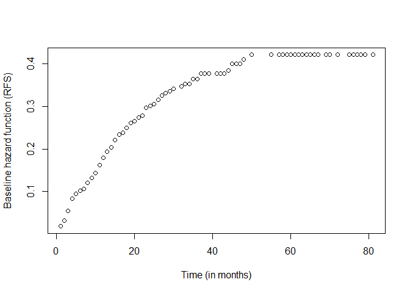<!-- -->

<br/> Let us end this section by plotting risk scores ($e^{X\beta}$) for
predictors that appeared significant. <br/>

``` r
library(sjPlot)
plot_model(coxmodel_os, type = "pred", terms = c('AFP'),title = 'Predicted risk scores (OS)')
```

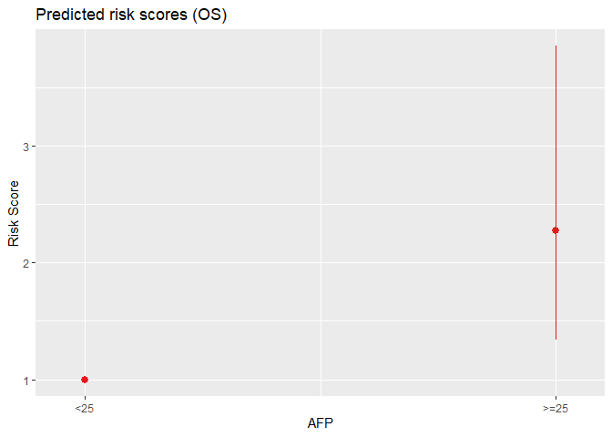<!-- -->

``` r
plot_model(coxmodel_os, type = "pred", terms = c('Tumorsize'),title = 'Predicted risk scores (OS)')
```

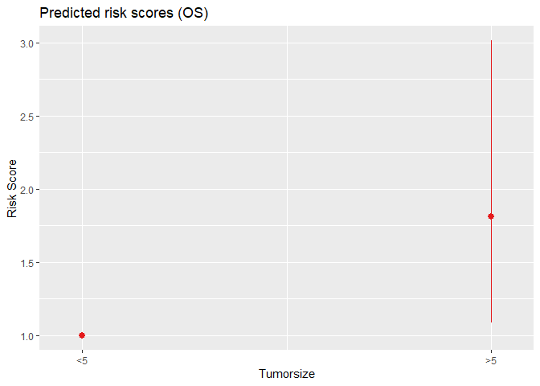<!-- -->

``` r
plot_model(coxmodel_os, type = "pred", terms = c('CXCL17P'),title = 'Predicted risk scores (OS)')
```

<!-- -->

``` r
plot_model(coxmodel_rfs, type = "pred", terms = c('AFP'),title = 'Predicted risk scores (RFS)')
```

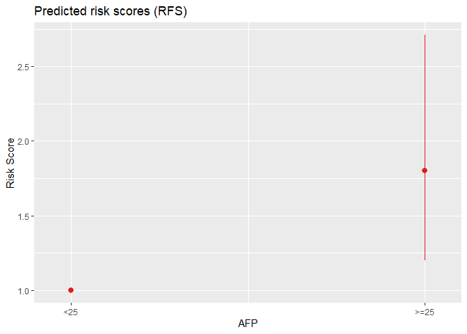<!-- -->

``` r
plot_model(coxmodel_rfs, type = "pred", terms = c('Tumorsize'),title = 'Predicted risk scores (RFS)')
```

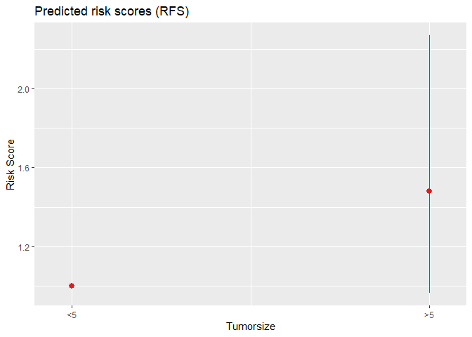<!-- -->

``` r
plot_model(coxmodel_rfs, type = "pred", terms = c('BCLC'),title = 'Predicted risk scores (RFS)')
```

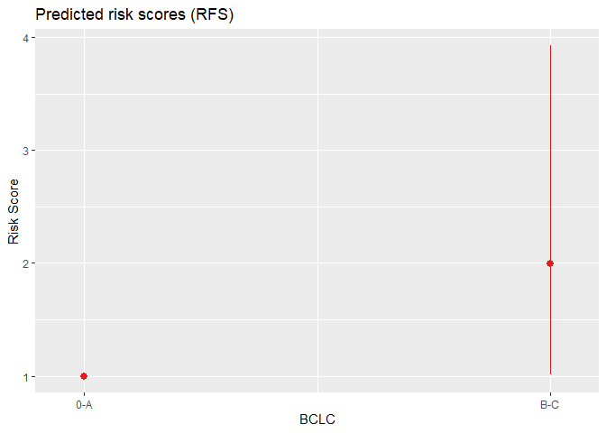<!-- -->

``` r
plot_model(coxmodel_rfs, type = "pred", terms = c('CXCL17T'),title = 'Predicted risk scores (RFS)')
```

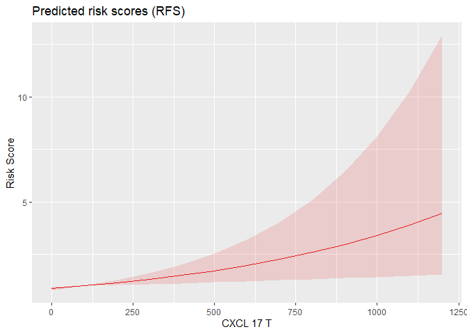<!-- -->

``` r
plot_model(coxmodel_rfs, type = "pred", terms = c('CXCL17P'),title = 'Predicted risk scores (RFS)')
```

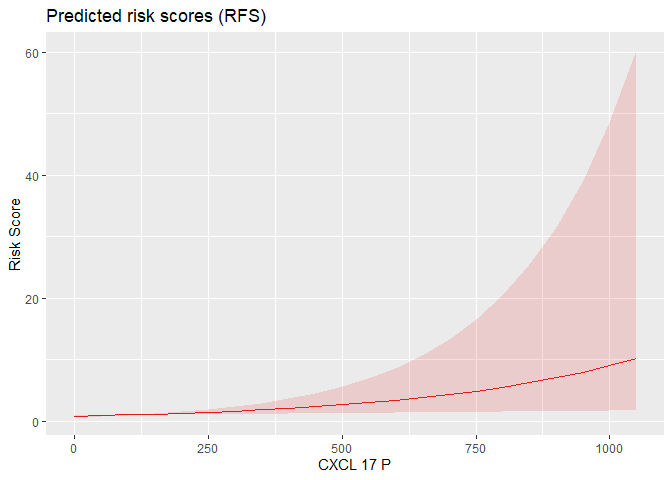<!-- -->

### Model diagnostics

<br/> As always, we need to check the model specification/assumptions.
One element specific to the Cox model is the proportional hazards
assumption. This assumption can be investigated via the Schoenfeld
residuals. Therneau and Grambsch showed that their expected value at
time $t$ is approximately $\beta(t) - \hat{\beta}$, where $\hat{\beta}$
is estimated from the Cox model and $\beta(t)$ are the actual
time-dependent coefficients. These plots can be obtained by the function
*cox.zph*. <br/>

``` r
par(mfrow = c(1, 2))
plot(cox.zph(coxmodel_os))
```

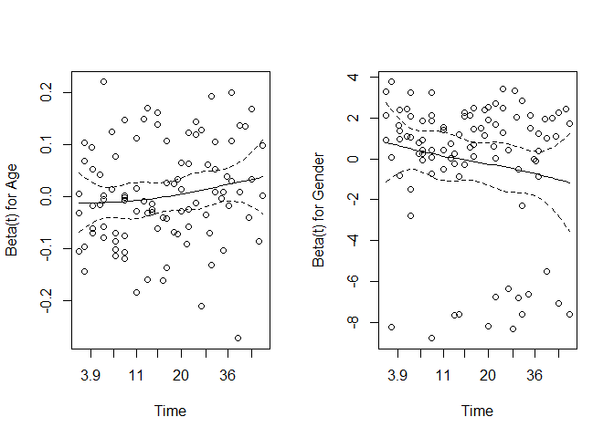<!-- -->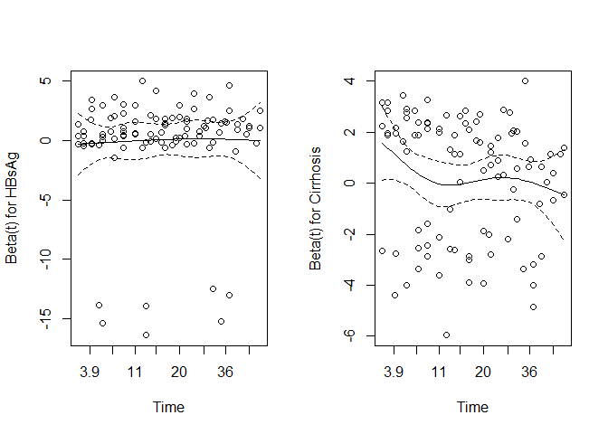<!-- -->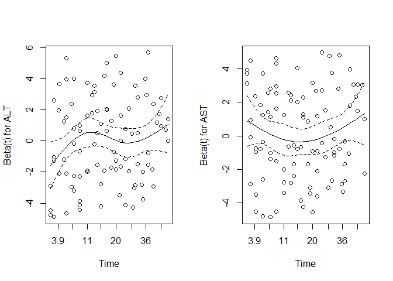<!-- -->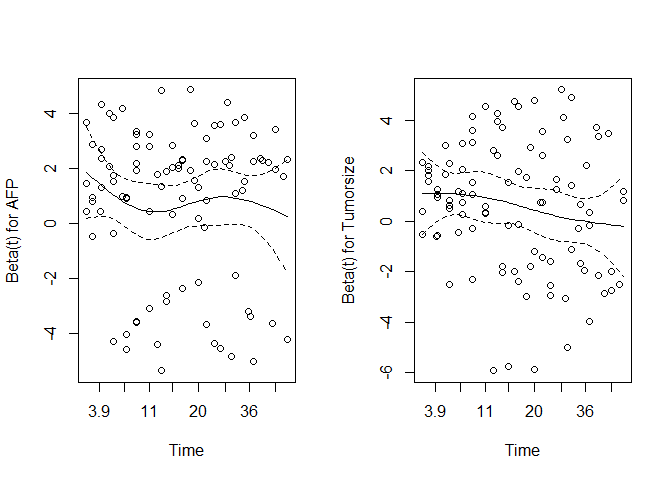<!-- -->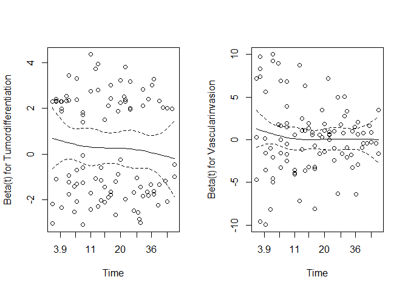<!-- -->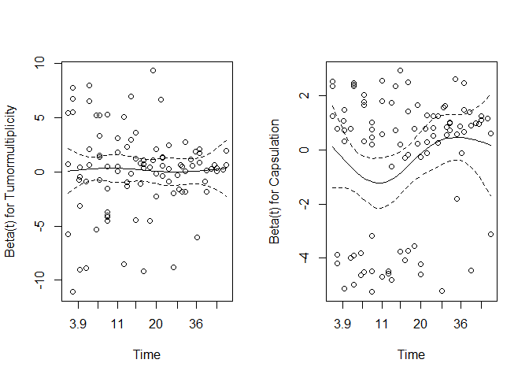<!-- -->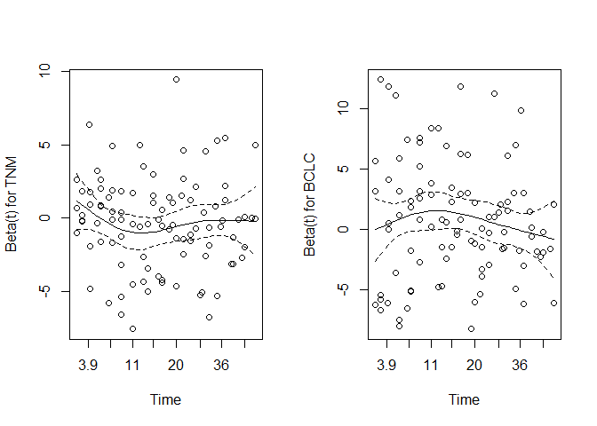<!-- -->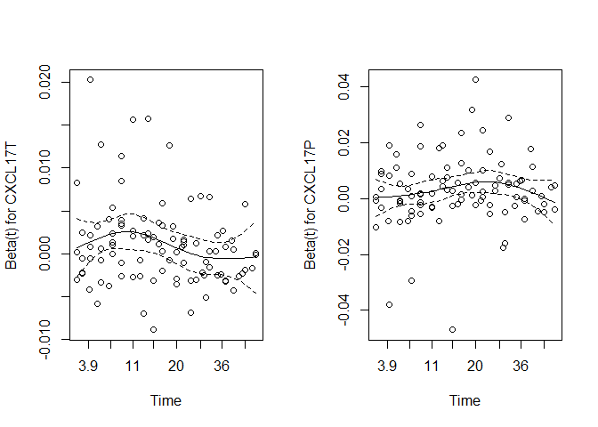<!-- -->

``` r
plot(cox.zph(coxmodel_rfs))
```

<!-- -->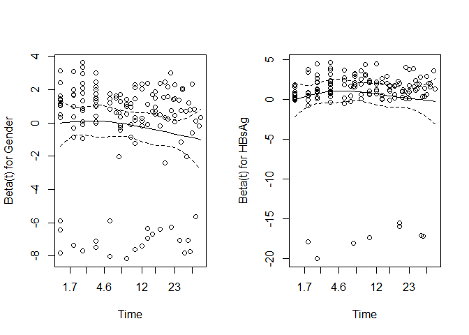<!-- -->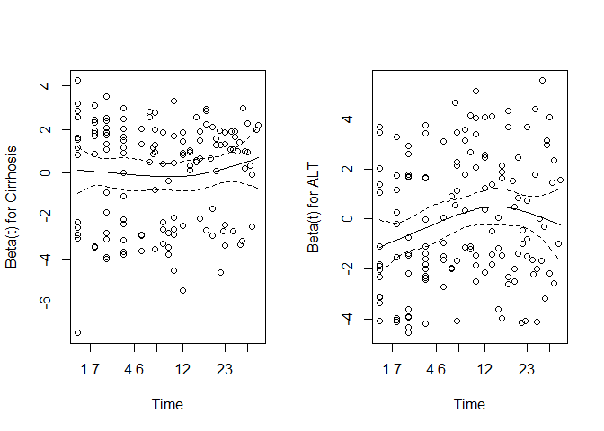<!-- -->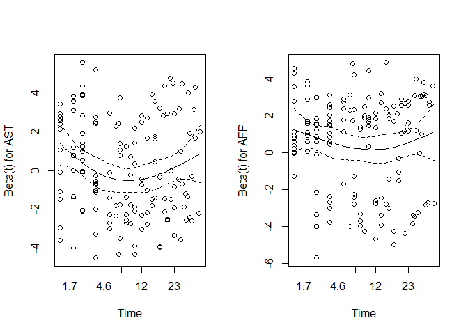<!-- -->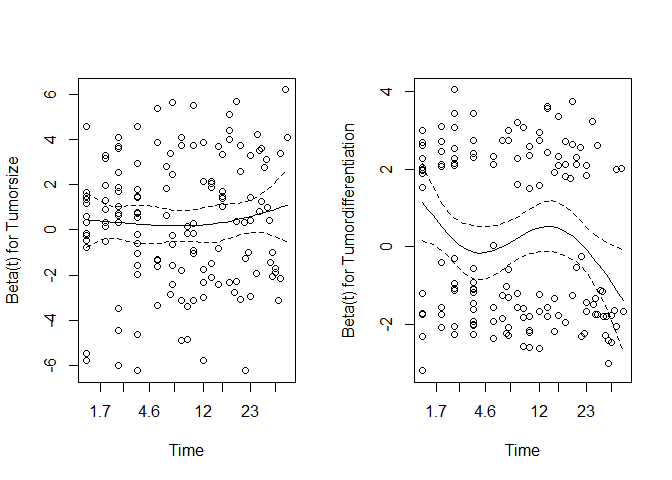<!-- -->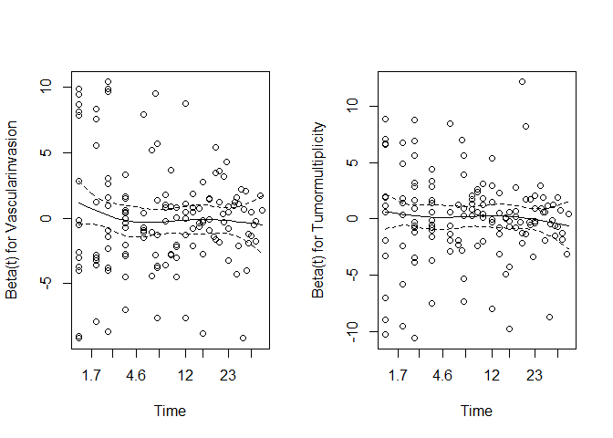<!-- -->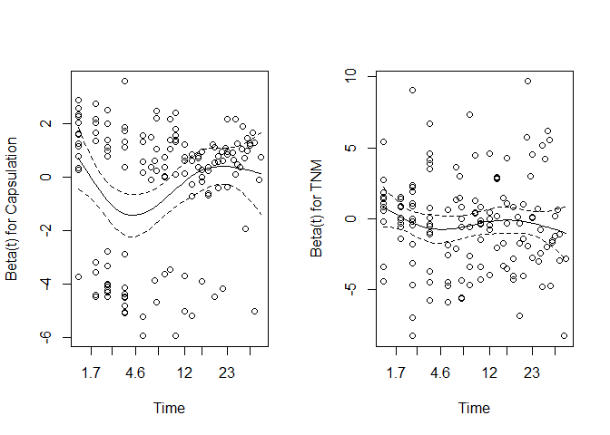<!-- -->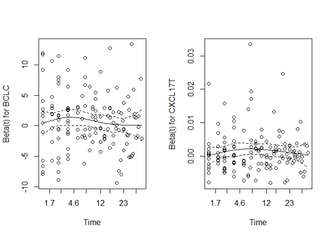<!-- --><!-- -->

<br/> Provided that the proportional hazards assumption holds, these
values are expected to be constant in time. A formal test consists of
simply fitting horizontal lines in these plots. <br/>

``` r
cox.zph(coxmodel_os)
```

    ##                         chisq df       p
    ## Age                   1.02053  1 0.31239
    ## Gender                4.53251  1 0.03326
    ## HBsAg                 0.03131  1 0.85956
    ## Cirrhosis             0.34417  1 0.55743
    ## ALT                   0.93331  1 0.33400
    ## AST                   0.00331  1 0.95409
    ## AFP                   1.01451  1 0.31383
    ## Tumorsize             6.78557  1 0.00919
    ## Tumordifferentiation  0.61911  1 0.43138
    ## Vascularinvasion      5.42872  1 0.01981
    ## Tumormultiplicity     4.58961  1 0.03217
    ## Capsulation           2.43480  1 0.11867
    ## TNM                   7.73138  1 0.00543
    ## BCLC                 11.05955  1 0.00088
    ## CXCL17T               0.26900  1 0.60400
    ## CXCL17P               1.98082  1 0.15930
    ## CXCL17N               0.27077  1 0.60281
    ## GLOBAL               31.49390 17 0.01738

``` r
cox.zph(coxmodel_rfs)
```

    ##                       chisq df       p
    ## Age                   6.199  1 0.01278
    ## Gender                0.896  1 0.34376
    ## HBsAg                 0.174  1 0.67678
    ## Cirrhosis             1.168  1 0.27991
    ## ALT                   1.312  1 0.25201
    ## AST                   1.828  1 0.17635
    ## AFP                   4.942  1 0.02621
    ## Tumorsize             1.808  1 0.17878
    ## Tumordifferentiation  4.058  1 0.04398
    ## Vascularinvasion      8.057  1 0.00453
    ## Tumormultiplicity    10.348  1 0.00130
    ## Capsulation           2.897  1 0.08876
    ## TNM                   8.541  1 0.00347
    ## BCLC                 21.875  1 2.9e-06
    ## CXCL17T               2.422  1 0.11965
    ## CXCL17P               7.164  1 0.00744
    ## CXCL17N               1.879  1 0.17047
    ## GLOBAL               44.079 17 0.00033

<br/> We observe that the proportional hazards assumption is probably
violated. Namely, **BCLC** is a clear suspect. One easy fix for cases in
which the variable is of no particular interest to us and is categorical
is stratification. <br/>

``` r
coxmodel_os_strat <- coxph(Surv(OS, Death) ~ Age + Gender + HBsAg + Cirrhosis + ALT + AST + AFP + Tumorsize + Tumordifferentiation + Vascularinvasion + Tumormultiplicity  + Capsulation  + TNM  + strata(BCLC)  + CXCL17T  + CXCL17P  + CXCL17N, data = hepatoCellular, x =  TRUE)

coxmodel_rfs_strat <- coxph(Surv(RFS, Recurrence) ~ Age + Gender + HBsAg + Cirrhosis + ALT + AST + AFP + Tumorsize + Tumordifferentiation + Vascularinvasion + Tumormultiplicity  + Capsulation  + TNM  + strata(BCLC)  + CXCL17T  + CXCL17P  + CXCL17N, data = hepatoCellular, x = TRUE)

cox.zph(coxmodel_os_strat)
```

    ##                         chisq df     p
    ## Age                   1.34703  1 0.246
    ## Gender                2.85769  1 0.091
    ## HBsAg                 0.04280  1 0.836
    ## Cirrhosis             0.33124  1 0.565
    ## ALT                   1.55588  1 0.212
    ## AST                   0.59799  1 0.439
    ## AFP                   0.72948  1 0.393
    ## Tumorsize             2.85104  1 0.091
    ## Tumordifferentiation  0.48278  1 0.487
    ## Vascularinvasion      0.77521  1 0.379
    ## Tumormultiplicity     0.01805  1 0.893
    ## Capsulation           1.64320  1 0.200
    ## TNM                   1.29163  1 0.256
    ## CXCL17T               1.08599  1 0.297
    ## CXCL17P               0.71407  1 0.398
    ## CXCL17N               0.00849  1 0.927
    ## GLOBAL               20.61945 16 0.194

``` r
cox.zph(coxmodel_rfs_strat)
```

    ##                         chisq df     p
    ## Age                   6.51372  1 0.011
    ## Gender                0.40318  1 0.525
    ## HBsAg                 0.19726  1 0.657
    ## Cirrhosis             1.98022  1 0.159
    ## ALT                   1.73819  1 0.187
    ## AST                   0.10686  1 0.744
    ## AFP                   4.48277  1 0.034
    ## Tumorsize             0.00164  1 0.968
    ## Tumordifferentiation  3.44410  1 0.063
    ## Vascularinvasion      0.30713  1 0.579
    ## Tumormultiplicity     0.15268  1 0.696
    ## Capsulation           1.35088  1 0.245
    ## TNM                   0.01793  1 0.893
    ## CXCL17T               1.64115  1 0.200
    ## CXCL17P               4.17171  1 0.041
    ## CXCL17N               1.18311  1 0.277
    ## GLOBAL               22.84894 16 0.118

<br/> By stratifying **BCL**, the proportionality test is no longer
significant. Let us have a look at the coefficients of these new models.
<br/>

``` r
# for stratified Cox models, LR tests are not supported (we will use Wald tests instead)
(summary(coxmodel_os_strat)$coefficients)[14:16,]
```

    ##                  coef exp(coef)     se(coef)         z    Pr(>|z|)
    ## CXCL17T  0.0009100837 1.0009105 0.0005485221  1.659156 0.097084374
    ## CXCL17P  0.0032189356 1.0032241 0.0010895960  2.954247 0.003134332
    ## CXCL17N -0.0009470121 0.9990534 0.0007992656 -1.184853 0.236075673

``` r
(summary(coxmodel_rfs_strat)$coefficients)[14:16,]
```

    ##                  coef exp(coef)     se(coef)          z    Pr(>|z|)
    ## CXCL17T  0.0013339400 1.0013348 0.0005123650  2.6034955 0.009227849
    ## CXCL17P  0.0024463673 1.0024494 0.0009770256  2.5038929 0.012283523
    ## CXCL17N -0.0002163489 0.9997837 0.0006475989 -0.3340785 0.738320298

<br/> We observe that our results did not change much. An alternative to
stratification would be to use time-varying coefficients instead (see
<https://cran.r-project.org/web/packages/survival/vignettes/timedep.pdf>
for more details). Let us take another look at the **BCLC** coefficient
for the **OS** model, which appeared to be the most significant. <br/>

``` r
par(mfrow = c(1, 1))
plot(cox.zph(coxmodel_os)[14])
```

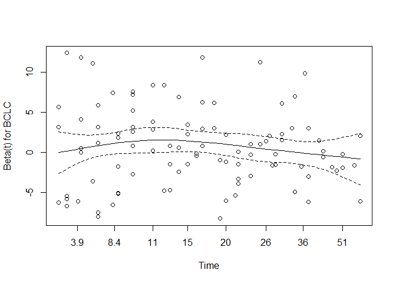<!-- -->

<br/> We can split the dataset by time and fit the model in which **OS**
interacts with the split. <br/>

``` r
# split the dataset: t<15, 15<t<30, t > 30
hepatoCellular_split_os <- survSplit(Surv(OS, Death) ~ Age + Gender + HBsAg + Cirrhosis + ALT + AST + AFP + Tumorsize + Tumordifferentiation + Vascularinvasion + Tumormultiplicity  + Capsulation  + TNM  + BCLC  + CXCL17T  + CXCL17P  + CXCL17N, data= hepatoCellular, cut=c(15,30), episode= 'tgroup', id='id')

# fit Cox model, BCLC interacts with tgroup (variable denoting the intervals)
coxmodel_os_split <- coxph(Surv(tstart,OS,Death) ~ Age + Gender + HBsAg + Cirrhosis + ALT + AST + AFP + Tumorsize + Tumordifferentiation + Vascularinvasion + Tumormultiplicity  + Capsulation  + TNM  + BCLC:strata(tgroup)  + CXCL17T  + CXCL17P  + CXCL17N, data = hepatoCellular_split_os)


coefficients(coxmodel_os_split)[c(17,19,21)]
```

    ## BCLC0-A:strata(tgroup)tgroup=1 BCLC0-A:strata(tgroup)tgroup=2 
    ##                    -1.58711829                    -0.10540372 
    ## BCLC0-A:strata(tgroup)tgroup=3 
    ##                    -0.04338359

``` r
cox.zph(coxmodel_os_split)
```

    ##                        chisq df     p
    ## Age                   1.1944  1 0.274
    ## Gender                3.2423  1 0.072
    ## HBsAg                 0.0369  1 0.848
    ## Cirrhosis             0.3955  1 0.529
    ## ALT                   1.5361  1 0.215
    ## AST                   0.3892  1 0.533
    ## AFP                   0.7137  1 0.398
    ## Tumorsize             3.5575  1 0.059
    ## Tumordifferentiation  0.6323  1 0.426
    ## Vascularinvasion      1.2938  1 0.255
    ## Tumormultiplicity     0.1759  1 0.675
    ## Capsulation           1.7289  1 0.189
    ## TNM                   1.8203  1 0.177
    ## CXCL17T               0.8864  1 0.346
    ## CXCL17P               0.8684  1 0.351
    ## CXCL17N               0.0418  1 0.838
    ## BCLC:strata(tgroup)   4.7089  3 0.194
    ## GLOBAL               25.7481 19 0.137

<br/> It appears that **BCLC** has its greatest effect early on and then
dissipates. The non-proportionality after this modification is again no
longer significant overall. However, this is not a systematic approach:
we used the data informally to determine the time cut-offs. Thus, we
will consider the stratified models for further diagnostics.

Residuals that deserve some look are the martingale residuals \[5\].
<br/>

``` r
coxmodel_os_null <- coxph(Surv(OS, Death) ~ 1, data = hepatoCellular)
coxmodel_rfs_null <- coxph(Surv(RFS, Recurrence) ~ 1, data = hepatoCellular)

par(mfrow = c(1, 2))
plot(residuals(coxmodel_os_null, type='martingale'),ylab = 'Martingale residuals',main = 'Null model (OS)')
plot(residuals(coxmodel_os_strat, type='martingale'),ylab = 'Martingale residuals',main = 'Full model (OS)')
```

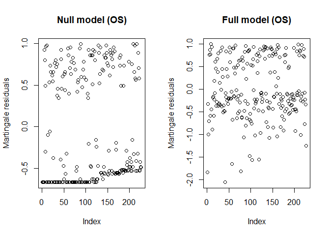<!-- -->

``` r
plot(residuals(coxmodel_rfs_null, type='martingale'),ylab = 'Martingale residuals',main = 'Null model (RFS)')
plot(residuals(coxmodel_rfs_strat, type='martingale'),ylab = 'Martingale residuals',main = 'Full model (RFS)')
```

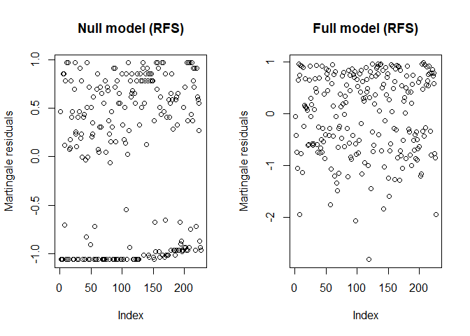<!-- -->

<br/> Large martingale residuals indicate a poor fit of the model for
particular observations. For example, a large negative martingale
residual indicates that the patient survived longer than expected,
despite the model predicting high risks for them.

Another popular residuals are the dfbetas residuals (scaled by the
variance of $\beta$), which measure the influence of each individual
observation on the coefficients $\beta$. <br/>

``` r
par(mfrow = c(1, 3))
plot(residuals(coxmodel_os_strat, type='dfbetas')[,14],ylab = 'dfbetas residuals',main = 'CXCL17T (OS)')
plot(residuals(coxmodel_os_strat, type='dfbetas')[,15],ylab = 'dfbetas residuals',main = 'CXCL17P (OS)')
plot(residuals(coxmodel_os_strat, type='dfbetas')[,16],ylab = 'dfbetas residuals',main = 'CXCL17N (OS)')
```

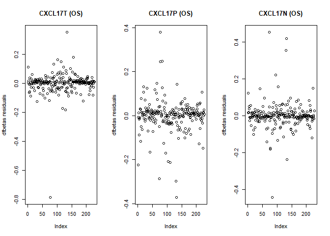<!-- -->

``` r
plot(residuals(coxmodel_rfs_strat, type='dfbetas')[,14],ylab = 'dfbetas residuals',main = 'CXCL17T (RFS)')
plot(residuals(coxmodel_rfs_strat, type='dfbetas')[,15],ylab = 'dfbetas residuals',main = 'CXCL17P (RFS)')
plot(residuals(coxmodel_rfs_strat, type='dfbetas')[,16],ylab = 'dfbetas residuals',main = 'CXCL17N (RFS)')
```

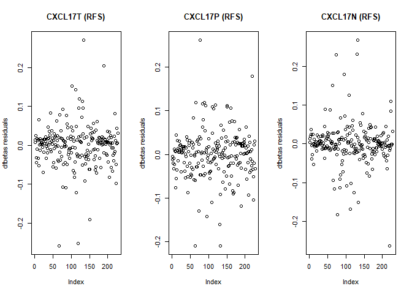<!-- -->

<br/> One observation for the **OS** model seems very influential on the
\*\* CXCL17T\*\*. <br/>

``` r
residuals(coxmodel_os_strat, type='dfbetas')[77,14]
```

    ##         77 
    ## -0.7862101

``` r
coxmodel_os_strat_alt <- coxph(Surv(OS, Death) ~ Age + Gender + HBsAg + Cirrhosis + ALT + AST + AFP + Tumorsize + Tumordifferentiation + Vascularinvasion + Tumormultiplicity  + Capsulation  + TNM  + strata(BCLC)  + CXCL17T  + CXCL17P  + CXCL17N, data = hepatoCellular[-77,])

coefficients(coxmodel_os_strat)[14:16]
```

    ##       CXCL17T       CXCL17P       CXCL17N 
    ##  0.0009100837  0.0032189356 -0.0009470121

``` r
coefficients(coxmodel_os_strat_alt)[14:16]
```

    ##      CXCL17T      CXCL17P      CXCL17N 
    ##  0.001960490  0.002178464 -0.000590035

``` r
summary(coxmodel_os_strat)$coefficients[14:16,]
```

    ##                  coef exp(coef)     se(coef)         z    Pr(>|z|)
    ## CXCL17T  0.0009100837 1.0009105 0.0005485221  1.659156 0.097084374
    ## CXCL17P  0.0032189356 1.0032241 0.0010895960  2.954247 0.003134332
    ## CXCL17N -0.0009470121 0.9990534 0.0007992656 -1.184853 0.236075673

``` r
summary(coxmodel_os_strat_alt)$coefficients[14:16,]
```

    ##                 coef exp(coef)     se(coef)          z    Pr(>|z|)
    ## CXCL17T  0.001960490 1.0019624 0.0006926204  2.8305401 0.004646948
    ## CXCL17P  0.002178464 1.0021808 0.0011735400  1.8563188 0.063408133
    ## CXCL17N -0.000590035 0.9994101 0.0007626040 -0.7737109 0.439101748

<br/> Indeed, the coefficient for **CXCL17T** changed quite a lot and
**CXCL17T** is now clearly significant (and **CXCL17P** is now
borderline).

Let us wrap this part up with a bootstrapped Wald test of the
coefficients. <br/>

``` r
set.seed(123) # for reproducibility
nb <- 2500

coefmat_os <- matrix(NA,nb,16)
coefmat_rfs <- matrix(NA,nb,16)

wald_boot_os <- matrix(0,16,nb)
pwald_os <- numeric(16)

wald_boot_rfs <- matrix(0,16,nb)
pwald_rfs <- numeric(16)

for(i in 1:nb){
  
  hepatoCellular_new <-  hepatoCellular[sample(nrow(hepatoCellular) , rep=TRUE),]
  
  model_os_new <- coxph(Surv(OS, Death) ~ Age + Gender + HBsAg + Cirrhosis + ALT + AST + AFP + Tumorsize + Tumordifferentiation + Vascularinvasion + Tumormultiplicity  + Capsulation  + TNM  + strata(BCLC)  + CXCL17T  + CXCL17P  + CXCL17N, data = hepatoCellular_new)
  
  model_rfs_new <- coxph(Surv(RFS, Recurrence) ~ Age + Gender + HBsAg + Cirrhosis + ALT + AST + AFP + Tumorsize + Tumordifferentiation + Vascularinvasion + Tumormultiplicity  + Capsulation  + TNM  + strata(BCLC)  + CXCL17T  + CXCL17P  + CXCL17N, data = hepatoCellular_new)
  
  coefmat_os[i,] <- coefficients(model_os_new)
  coefmat_rfs[i,] <- coefficients(model_rfs_new)
  
  for (j in 1:16){
    
  # trycatch to skip numerical problems with inversions
  V <- vcov(model_os_new)[j,j]
  wald_boot_os[j,i] <- tryCatch((coefficients(model_os_new)[j]-coefficients(coxmodel_os_strat)[j]) %*% solve(V) %*% (coefficients(model_os_new)[j]-coefficients(coxmodel_os_strat)[j]), error = function(e) {NaN})
  
  V <- vcov(model_rfs_new)[j,j]
  wald_boot_rfs[j,i] <- tryCatch((coefficients(model_rfs_new)[j]-coefficients(coxmodel_rfs_strat)[j]) %*% solve(V) %*% (coefficients(model_rfs_new)[j]-coefficients(coxmodel_rfs_strat)[j]), error = function(e) {NaN})
  
  }
}

for (j in 1:16){
V <- vcov(coxmodel_os_strat)[j,j]
wald <- coefficients(coxmodel_os_strat)[j] %*% solve(V) %*% coefficients(coxmodel_os_strat)[j]      
pwald_os[j] <- mean(wald_boot_os[j,] > as.numeric(wald),na.rm = TRUE) # p-value

V <- vcov(coxmodel_rfs_strat)[j,j]
wald <- coefficients(coxmodel_rfs_strat)[j] %*% solve(V) %*% coefficients(coxmodel_rfs_strat)[j]      
pwald_rfs[j] <- mean(wald_boot_rfs[j,] > as.numeric(wald),na.rm = TRUE) # p-value

}

var_names <- c('Age','Gender','HBsAg','Cirrhosis','ALT','AST','AFP','Tumorsize','Tumordifferentiation','Vascularinvasion','Tumormultiplicity','Capsulation','TNM','CXCL17T','CXCL17P','CXCL17N')
names(pwald_os) <- var_names
names(pwald_rfs) <- var_names

pwald_os[14:16]
```

    ## CXCL17T CXCL17P CXCL17N 
    ##  0.2224  0.0244  0.3536

``` r
pwald_rfs[14:16]
```

    ## CXCL17T CXCL17P CXCL17N 
    ##  0.0124  0.0088  0.7140

<br/> The bootstrap aligns with our original assessments; **CXCL17P** is
significant in the **OS** model, and **CXCL17T** and **CXCL17P** are
significant in the **RFS** model. We can also compute bootstrap
confidence intervals (quantile-based).  
<br/>

``` r
ci_os <- cbind(confint(coxmodel_os_strat),t(apply(coefmat_os,2,function(x) quantile(x,c(0.025,0.975)))))[c(14,15,16),]
colnames(ci_os) <- c('2.5 %','97.5 %','2.5 % (boot)','97.5 % (boot)')


ci_rfs <- cbind(confint(coxmodel_rfs_strat),t(apply(coefmat_rfs,2,function(x) quantile(x,c(0.025,0.975)))))[c(14,15,16),]
colnames(ci_rfs) <- c('2.5 %','97.5 %','2.5 % (boot)','97.5 % (boot)')

ci_os
```

    ##                 2.5 %       97.5 %  2.5 % (boot) 97.5 % (boot)
    ## CXCL17T -0.0001649999 0.0019851673 -3.250048e-04   0.003395880
    ## CXCL17P  0.0010833666 0.0053545045  1.984293e-05   0.006563183
    ## CXCL17N -0.0025135440 0.0006195198 -3.478925e-03   0.001187223

``` r
ci_rfs
```

    ##                 2.5 %      97.5 %  2.5 % (boot) 97.5 % (boot)
    ## CXCL17T  0.0003297230 0.002338157  0.0002545479   0.002543521
    ## CXCL17P  0.0005314324 0.004361302  0.0005122625   0.004609201
    ## CXCL17N -0.0014856194 0.001052922 -0.0019043150   0.001012304

### Model validation

<br/> Let us now focus on metrics associated with the Cox model, which
we can use for its validation. The first metric concordance \[6\] helps
assess the model’s discrimination capability. Concordance is a
proportion of concordance pairs among all comparable pairs. For survival
data, a pair of data is comparable whenever they differ in failure time.
A comparable pair is considered concordant if the observation with the
higher risk score actually experienced the event. <br/>

``` r
concordance(coxmodel_os)$concordance
```

    ## [1] 0.7407243

``` r
concordance(coxmodel_rfs)$concordance
```

    ## [1] 0.7062418

``` r
concordance(coxmodel_os_strat)$concordance
```

    ## [1] 0.7007425

``` r
concordance(coxmodel_rfs_strat)$concordance
```

    ## [1] 0.6650731

<br/> We should note here that concordance has its unique issues with
survival data compared to, for example, binary response data. For the
binary response, comparable pairs differ in outcome; for survival data,
they differ in failure time. However, failure time is a continuous
variable, and thus, these differences, and consequently, the underlying
risks, can be quite small. In other words, concordance can compare quite
a lot of very similar observations in terms of their risk scores. Hence,
overall concordance for survival models can be surprisingly small even
for decent models, because while these models can discriminate between
distinct risk groups, they cannot discriminate within these groups, see
\[7\] for a quite extreme example.

To provide an example here, let us assume that we will compare only the
pairs in which the ratio of failure times is at least 4.

``` r
conc <- function(risk,failt,event) {
  
n_conc <- 0 
n_comp<- 0

n <- length(risk)

for(i in 1:n){
  
  risk_i <- risk[i]
  failt_i <- failt[i]
  event_i <- event[i]

  if ((i+1) < n){
  for(j in (i+1):n){
    
    risk_j <- risk[j]
    failt_j <- failt[j]
    event_j <- event[j]
    
      if ((failt_i < 0.25*failt_j | failt_j < 0.25*failt_i ) & ((failt_i < failt_j & event_i == 1) | (failt_i > failt_j & event_j == 1) )) {
        
        n_comp <- n_comp + 1
        
        
          if ((failt_i < failt_j & risk_i >  risk_j & event_i == 1) | (failt_i > failt_j & risk_i <  risk_j & event_j == 1  )) {
            n_conc <- n_conc + 1
            } else if (risk_i == risk_j) {}
          
            }
          }
      }
    }

return ((n_conc)/(n_comp))
}


conc(predict(coxmodel_os,type = 'risk'),hepatoCellular$OS,hepatoCellular$Death)
```

    ## [1] 0.848559

``` r
conc(predict(coxmodel_rfs,type = 'risk'),hepatoCellular$RFS,hepatoCellular$Recurrence)
```

    ## [1] 0.7997091

<br/> We observe that the concordance jumped by 0.1 for both **OS** and
**RFS** when comparing only extreme pairs. When evaluating the survival
models in terms of concordance, we must consider what type of
discrimination is actually of interest to us.

Another popular discrimination score that we encountered in the previous
projects is the Brier score. For the uncensored survival data, the Brier
score at time $t$ is simply
$B(t) = \frac{1}{n}\sum_i (1_{T_i \leq t} - S_i(t))^2$, where
$1_{T_i \leq t}$ is an indicator that observation $i$ have not
experienced till time $t$ and $S_i(t)$ is the survival probability till
time $t$. The actual Brier score for the survival data is a bit more
complicated, since we have to deal with the censoring, for example, by
weighting the values by the probability of censoring (inverse
probability of censoring weights method \[8\]), see, e.g.,
<https://square.github.io/pysurvival/metrics/brier_score.html> for the
complete formula.

Since the Brier score is defined only for one particular time instant,
it makes sense to integrate it over the whole time interval of interest.
This integrated Brier score is actually the continuous version of the
ranked probability score (RPS) for the ordinal response.

We will compute the integrated Brier score using the package *pec*
(*cens.model = ‘marginal’* denotes that distribution of the censoring
events is estimated via the Kaplan-Meier estimator ). <br/>

``` r
library(pec)
as.numeric(crps(pec(coxmodel_os,cens.model = 'marginal'),start = 0, times = 83))[2]
```

    ## [1] 0.1803527

``` r
as.numeric(crps(pec(coxmodel_rfs,cens.model = 'marginal'),start = 0, times = 81))[2]
```

    ## [1] 0.1797274

``` r
as.numeric(crps(pec(coxmodel_os_strat,cens.model = 'marginal'),start = 0, times = 79))[2]
```

    ## [1] 0.1692952

``` r
as.numeric(crps(pec(coxmodel_rfs_strat,cens.model = 'marginal'),start = 0, times = 81))[2]
```

    ## [1] 0.1749063

<br/> To conclude this section, we will mention the assessment of the
calibration of Cox models. We will use the method proposed in \[9\]. The
method is based on the observation that the Cox regression with a
prefixed baseline hazard reduces to the Poisson regression. First, we
obtain the values of linear predictors and the logarithms of baseline
hazards at the time of the last follow-up. Then, we fit a Poisson model
with **Death / Recurrence** as the response and the linear predictor as
the predicted variable and logarithms of baseline hazards as offsets.
This approach is very similar to the calibration assessment of logistic
models. <br/>

``` r
# OS model
p <- log(predict(coxmodel_os,type='expected')) # linear predictor + log base hazard 
lp <- predict(coxmodel_os, type='lp') # linear predictor 
logbase <- p - lp # log base hazard at T 
fit <- glm(Death ~ lp + offset(logbase), family=poisson,data=hepatoCellular)
coefficients(fit)
```

    ##  (Intercept)           lp 
    ## 4.630418e-12 1.000000e+00

``` r
# RFS model
p <- log(predict(coxmodel_rfs,type='expected')) 
lp <- predict(coxmodel_rfs, type='lp') 
logbase <- p - lp 
fit <- glm(Recurrence ~ lp + offset(logbase), family=poisson,data=hepatoCellular)
coefficients(fit)
```

    ##  (Intercept)           lp 
    ## 1.240941e-11 1.000000e+00

``` r
# OS model strat
p <- log(predict(coxmodel_os_strat,type='expected')) # linear predictor + log base hazard 
lp <- predict(coxmodel_os_strat, type='lp') # linear predictor 
logbase <- p - lp # log base hazard at T 
fit <- glm(Death ~ lp + offset(logbase), family=poisson,data=hepatoCellular)
coefficients(fit)
```

    ##  (Intercept)           lp 
    ## 1.011825e-09 1.000000e+00

``` r
# RFS model strat
p <- log(predict(coxmodel_rfs_strat,type='expected')) 
lp <- predict(coxmodel_rfs_strat, type='lp') 
logbase <- p - lp 
fit <- glm(Recurrence ~ lp + offset(logbase), family=poisson,data=hepatoCellular)
coefficients(fit)
```

    ##  (Intercept)           lp 
    ## 2.560567e-12 1.000000e+00

<br/> Naturally, if we evaluate the calibration on the same set of data,
we get a perfect calibration. However, this is not the case when we
assess the calibration on the dataset that was not used for learning the
model. <br/>

``` r
library(caret)
set.seed(123)

d <- createFolds(seq(1,dim(hepatoCellular)[1],1), k = 10)
index <- unlist(d[1])
train_set <- hepatoCellular[-index,]
test_set <- hepatoCellular[index,]
    
model_os_new <- coxph(Surv(OS,Death) ~ Age + Gender + HBsAg + Cirrhosis + ALT + AST + AFP + Tumorsize + Tumordifferentiation + Vascularinvasion + Tumormultiplicity  + Capsulation  + TNM  + BCLC  + CXCL17T  + CXCL17P  + CXCL17N, data = train_set)
p <- log(predict(model_os_new,test_set,type='expected')) 
lp <- predict(model_os_new,test_set, type='lp')  
logbase <- p - lp # log base hazard at T 
fit <- glm(Death ~ lp + offset(logbase), family=poisson,data=test_set)
coefficients(fit)
```

    ## (Intercept)          lp 
    ##   -1.461350    1.684415

<br/> Let us use cross-validation to validate the performance of the Cox
models. <br/>

``` r
## Number of repetitions and folds
rep <- 100
folds <- 10

set.seed(123) # for reproducibility

k <- 1

concordance_cv <- matrix(NA,folds*rep,4)
brier_cv <- matrix(NA,folds*rep,4)
gamma0_cv <- matrix(NA,folds*rep,4)
gamma1_cv <- matrix(NA,folds*rep,4)


for(j in 1:rep){
  
  d <- createFolds(seq(1,dim(hepatoCellular)[1],1), k = 10)
  
  for(i in 1:folds){

    index <- unlist(d[i])
    train_set <- hepatoCellular[-index,]
    test_set <- hepatoCellular[index,]

    model_os_new <- coxph(Surv(OS,Death) ~ Age + Gender + HBsAg + Cirrhosis + ALT + AST + AFP + Tumorsize + Tumordifferentiation + Vascularinvasion + Tumormultiplicity  + Capsulation  + TNM  + BCLC  + CXCL17T  + CXCL17P  + CXCL17N, data = train_set, x =  TRUE)

    model_rfs_new <- coxph(Surv(RFS,Recurrence) ~ Age + Gender + HBsAg + Cirrhosis + ALT + AST + AFP + Tumorsize + Tumordifferentiation + Vascularinvasion + Tumormultiplicity  + Capsulation  + TNM  + BCLC  + CXCL17T  + CXCL17P  + CXCL17N, data = train_set, x =  TRUE)
    
    model_os_strat_new <- coxph(Surv(OS,Death) ~ Age + Gender + HBsAg + Cirrhosis + ALT + AST + AFP + Tumorsize + Tumordifferentiation + Vascularinvasion + Tumormultiplicity  + Capsulation  + TNM  + strata(BCLC)  + CXCL17T  + CXCL17P  + CXCL17N, data = train_set, x =  TRUE)

    model_rfs_strat_new <- coxph(Surv(RFS,Recurrence) ~ Age + Gender + HBsAg + Cirrhosis + ALT + AST + AFP + Tumorsize + Tumordifferentiation + Vascularinvasion + Tumormultiplicity  + Capsulation  + TNM  + strata(BCLC)  + CXCL17T  + CXCL17P  + CXCL17N, data = train_set, x =  TRUE)
    

    # concordance
    concordance_cv[k,1] <- concordance(model_os_new,newdata = test_set)$concordance
    concordance_cv[k,2] <- concordance(model_rfs_new,newdata = test_set)$concordance
    concordance_cv[k,3] <- concordance(model_os_strat_new,newdata = test_set)$concordance
    concordance_cv[k,4] <- concordance(model_rfs_strat_new,newdata = test_set)$concordance
    
    # brier
    brier_cv[k,1] <- as.numeric(crps(pec(model_os_new,newdata = test_set,cens.model = 'marginal')))[2]
    brier_cv[k,2] <- as.numeric(crps(pec(model_rfs_new,newdata = test_set,cens.model = 'marginal')))[2]
    brier_cv[k,3] <- as.numeric(crps(pec(model_os_strat_new,newdata = test_set,cens.model = 'marginal'),start = min(test_set$OS), times = max(test_set$OS) - min(test_set$OS)))[2]
    brier_cv[k,4] <- as.numeric(crps(pec(model_rfs_strat_new,newdata = test_set,cens.model = 'marginal'),start = min(test_set$RFS), times = max(test_set$RFS)))[2]
    
    # calibration
    p_os <- log(predict(model_os_new,newdata = test_set,type='expected'))
    lp_os <- predict(model_os_new, newdata = test_set,type='lp')
    fit_os <- tryCatch(glm(Death ~ lp_os + offset(p_os-lp_os), family=poisson,data=test_set), error = function(e) {NA})
    
    p_rfs <- log(predict(model_rfs_new,newdata = test_set,type='expected'))
    lp_rfs <- predict(model_rfs_new, newdata = test_set,type='lp')
    fit_rfs <- tryCatch(glm(Recurrence ~ lp_rfs + offset(p_rfs-lp_rfs), family=poisson,data=test_set), error = function(e) {NA})
    
    p_os_strat <- log(predict(model_os_strat_new,newdata = test_set,type='expected'))
    lp_os_strat <- predict(model_os_new, newdata = test_set,type='lp')
    fit_os_strat <- tryCatch(glm(Death ~ lp_os_strat + offset(p_os_strat-lp_os_strat), family=poisson,data=test_set), error = function(e) {NA})
    
    p_rfs_strat <- log(predict(model_rfs_strat_new,newdata = test_set,type='expected'))
    lp_rfs_strat <- predict(model_rfs_new, newdata = test_set,type='lp')
    fit_rfs_strat <- tryCatch(glm(Recurrence ~ lp_rfs_strat + offset(p_rfs_strat-lp_rfs_strat), family=poisson,data=test_set), error = function(e) {NA})
    

    gamma0_cv[k,1] <- tryCatch(coefficients(fit_os)[1], error = function(e) {NA})
    gamma0_cv[k,2] <- tryCatch(coefficients(fit_rfs)[1], error = function(e) {NA})
    gamma0_cv[k,3] <- tryCatch(coefficients(fit_os_strat)[1], error = function(e) {NA})
    gamma0_cv[k,4] <- tryCatch(coefficients(fit_rfs_strat)[1], error = function(e) {NA})
    
    gamma1_cv[k,1] <- tryCatch(coefficients(fit_os)[2], error = function(e) {NA})
    gamma1_cv[k,2] <- tryCatch(coefficients(fit_rfs)[2], error = function(e) {NA})
    gamma1_cv[k,3] <- tryCatch(coefficients(fit_os_strat)[2], error = function(e) {NA})
    gamma1_cv[k,4] <- tryCatch(coefficients(fit_rfs_strat)[2], error = function(e) {NA})
    
    k <- k + 1
  }
}

cv_res <- rbind(apply(concordance_cv,2,mean,na.rm=TRUE),apply(brier_cv,2,mean, na.rm=TRUE),apply(gamma0_cv,2,mean,na.rm=TRUE),apply(gamma1_cv,2,mean,na.rm=TRUE))
colnames(cv_res) <- c('Cox (OS)', 'Cox (RFS)','Cox (OS) strat', 'Cox (RFS) strat')
rownames(cv_res) <- c('Concordance','Brier','Intercept','Slope')
cv_res
```

    ##              Cox (OS) Cox (RFS) Cox (OS) strat Cox (RFS) strat
    ## Concordance 0.6800047 0.6605543      0.6291492       0.6149960
    ## Brier       0.1771490 0.1785544      0.1693030       0.1786114
    ## Intercept   0.4534692 0.2596973      0.4077029       0.2370864
    ## Slope       0.6753696 0.7308997      0.6958995       0.7527891

<br/> We observe that all metrics decreased noticeably. For **OS**, the
best model appears to be the stratified model. For **RFS**, the best
model is the plain model. Still, the overall discrimination metrics are
better than discrimination via a random chance. We should note that
cross-validation for the stratified models is not fully valid, as our
stratification was based on the data; thus, this step should also be
incorporated into the cross-validation. <br/>

## Parametric models

<br/> The next type of models we will discuss in the project, as an
alternative to the Cox proportional hazards model, are the fully
parametric models. Namely, accelerated failure time models (AFT):
$S(T \mid X) = \psi ((\mathrm{log}(T)-X\beta)/\sigma))$ or equivalently
$\mathrm{log} T = X\beta + \sigma\varepsilon$, where $\sigma$ is a scale
parameter and $\varepsilon$ has a distribution $\psi$. The distribution
$\psi$ is usually assumed to be normal ($\psi(u) = 1 - \Phi (u)$),
logistic $\psi(u) = (1 + e^u)^{-1}$, or extreme valued distribution
($\psi(u) = e^{-e^u}$). These choices lead to the log-normal, the
log-logistic, and the Weibull AFT model, respectively.

The Weibull model is a bit special in comparison to other AFT models in
the sense that it is a parametric proportional hazards model since
$S(T\mid X) = \mathrm{exp}[-\mathrm{exp}((\mathrm{log}T-X\beta)/\sigma)] = \mathrm{exp}[-H(T\mid X)]$,
where
$H(T\mid X) = \mathrm{exp}(\mathrm{log}T/\sigma - X\beta/\sigma) = \mathrm{exp}(\mathrm{log}T/\sigma + X\tilde{\beta})$,
i.e., hazards stay proportional in time for various $X$. We should note
that the Weibull model is the only model that is both an AFT model and a
proportional hazards model.

The Weibull model is called like that because
$S(T) = \mathrm{exp}(-\lambda^\alpha T^\alpha) = \mathrm{exp}(-\mathrm{exp}(\alpha\mathrm{log}\lambda +  \alpha\mathrm{log}T))$
is a survival function of the Weibull distribution (using more standard
parametrization). Provided that $\sigma$ / $\alpha$ is fixed at one, the
Weibull regression model reduces to an exponential model, i.e., the
baseline hazard is constant in time for all $X$. <br/>

### Fit of AFT models and checking assumptions

<br/> Let us fit all the aforementioned AFT models. <br/>

``` r
exp_reg_os <- survreg(Surv(OS, Death) ~ Age + Gender + HBsAg + Cirrhosis + ALT + AST + AFP + Tumorsize + Tumordifferentiation + Vascularinvasion + Tumormultiplicity  + Capsulation  + TNM  + BCLC  + CXCL17T  + CXCL17P  + CXCL17N, data = hepatoCellular,dist='exponential')

weib_reg_os <- survreg(Surv(OS, Death) ~ Age + Gender + HBsAg + Cirrhosis + ALT + AST + AFP + Tumorsize + Tumordifferentiation + Vascularinvasion + Tumormultiplicity  + Capsulation  + TNM  + BCLC  + CXCL17T  + CXCL17P  + CXCL17N, data = hepatoCellular,dist='weibull')

lnorm_reg_os <- survreg(Surv(OS, Death) ~ Age + Gender + HBsAg + Cirrhosis + ALT + AST + AFP + Tumorsize + Tumordifferentiation + Vascularinvasion + Tumormultiplicity  + Capsulation  + TNM  + BCLC  + CXCL17T  + CXCL17P  + CXCL17N, data = hepatoCellular,dist='lognormal')

llog_reg_os <- survreg(Surv(OS, Death) ~ Age + Gender + HBsAg + Cirrhosis + ALT + AST + AFP + Tumorsize + Tumordifferentiation + Vascularinvasion + Tumormultiplicity  + Capsulation  + TNM  + BCLC  + CXCL17T  + CXCL17P  + CXCL17N, data = hepatoCellular,dist='loglogistic')

exp_reg_rfs <- survreg(Surv(RFS, Recurrence) ~ Age + Gender + HBsAg + Cirrhosis + ALT + AST + AFP + Tumorsize + Tumordifferentiation + Vascularinvasion + Tumormultiplicity  + Capsulation  + TNM  + BCLC  + CXCL17T  + CXCL17P  + CXCL17N, data = hepatoCellular,dist='exponential')

weib_reg_rfs <- survreg(Surv(RFS, Recurrence) ~ Age + Gender + HBsAg + Cirrhosis + ALT + AST + AFP + Tumorsize + Tumordifferentiation + Vascularinvasion + Tumormultiplicity  + Capsulation  + TNM  + BCLC  + CXCL17T  + CXCL17P  + CXCL17N, data = hepatoCellular,dist='weibull')

lnorm_reg_rfs <- survreg(Surv(RFS, Recurrence) ~ Age + Gender + HBsAg + Cirrhosis + ALT + AST + AFP + Tumorsize + Tumordifferentiation + Vascularinvasion + Tumormultiplicity  + Capsulation  + TNM  + BCLC  + CXCL17T  + CXCL17P  + CXCL17N, data = hepatoCellular,dist='lognormal')

llog_reg_rfs <- survreg(Surv(RFS, Recurrence) ~ Age + Gender + HBsAg + Cirrhosis + ALT + AST + AFP + Tumorsize + Tumordifferentiation + Vascularinvasion + Tumormultiplicity  + Capsulation  + TNM  + BCLC  + CXCL17T  + CXCL17P  + CXCL17N, data = hepatoCellular,dist='loglogistic')
```

<br/> We can compare the model using the Akaike information criterion.
<br/>

``` r
AIC(exp_reg_os)
```

    ## [1] 1030.831

``` r
AIC(weib_reg_os)
```

    ## [1] 1032.709

``` r
AIC(lnorm_reg_os)
```

    ## [1] 1009.409

``` r
AIC(llog_reg_os)
```

    ## [1] 1015.356

``` r
AIC(exp_reg_rfs)
```

    ## [1] 1297.103

``` r
AIC(weib_reg_rfs)
```

    ## [1] 1286.552

``` r
AIC(lnorm_reg_rfs)
```

    ## [1] 1254.478

``` r
AIC(llog_reg_rfs)
```

    ## [1] 1260.211

<br/> The log-normal models (noticeably non-proportional hazards model)
are the best fit. Let’s test the significance of the predictors next.
<br/>

``` r
pvalues_LR_os <- cbind(Anova(exp_reg_os)$`Pr(>Chisq)`,Anova(weib_reg_os)$`Pr(>Chisq)`,Anova(lnorm_reg_os)$`Pr(>Chisq)`,Anova(llog_reg_os)$`Pr(>Chisq)`)
rownames(pvalues_LR_os) <- names(coefficients(exp_reg_os)[2:length(coefficients(exp_reg_os))])
colnames(pvalues_LR_os) <- c('exp','weibull','lognorm','loglogist')
pvalues_LR_os
```

    ##                                    exp     weibull     lognorm    loglogist
    ## Age                        0.872302126 0.890168181 0.852249351 0.8780879747
    ## Gendermale                 0.834432428 0.839606653 0.975292775 0.8347772693
    ## HBsAgpositive              0.895215399 0.889209904 0.694785218 0.8369065907
    ## Cirrhosispresent           0.266567539 0.272274291 0.217935036 0.1290855676
    ## ALT>42                     0.964892740 0.974129593 0.873550578 0.7901891614
    ## AST>42                     0.491511754 0.489182927 0.566190151 0.6424561513
    ## AFP>=25                    0.002165034 0.002145403 0.001007146 0.0005245268
    ## Tumorsize>5                0.029553613 0.030008145 0.005096583 0.0030801763
    ## TumordifferentiationIII-IV 0.159199535 0.154464102 0.028308760 0.0469999300
    ## Vascularinvasionpresent    0.534496567 0.520855606 0.470116806 0.5114862556
    ## Tumormultiplicitymultiple  0.479311785 0.464711394 0.547218306 0.7046603078
    ## Capsulationpresent         0.222468809 0.218050952 0.235420033 0.2117972594
    ## TNMIII-IV                  0.279279715 0.282185694 0.389304029 0.2916486263
    ## BCLCB-C                    0.092077703 0.094000185 0.034305954 0.0272226947
    ## CXCL17T                    0.091171657 0.088937204 0.070536570 0.0554645895
    ## CXCL17P                    0.003903857 0.003675410 0.022731610 0.0244289123
    ## CXCL17N                    0.368278936 0.367568011 0.431461639 0.3886186098

``` r
pvalues_LR_rfs <- cbind(Anova(exp_reg_rfs)$`Pr(>Chisq)`,Anova(weib_reg_rfs)$`Pr(>Chisq)`,Anova(lnorm_reg_rfs)$`Pr(>Chisq)`,Anova(llog_reg_rfs)$`Pr(>Chisq)`)
rownames(pvalues_LR_rfs) <- names(coefficients(exp_reg_rfs)[2:length(coefficients(exp_reg_rfs))])
colnames(pvalues_LR_rfs) <- c('exp','weibull','lognorm','loglogist')
pvalues_LR_rfs
```

    ##                                     exp     weibull    lognorm  loglogist
    ## Age                        0.1638066110 0.267242871 0.16526293 0.13542522
    ## Gendermale                 0.2441671150 0.293901393 0.32200874 0.21309042
    ## HBsAgpositive              0.0688328122 0.098365605 0.07497654 0.08050728
    ## Cirrhosispresent           0.8920134794 0.701301920 0.48674617 0.42742356
    ## ALT>42                     0.4681811370 0.555721078 0.68592268 0.76860595
    ## AST>42                     0.4234841791 0.479103159 0.44074350 0.43810562
    ## AFP>=25                    0.0007618526 0.002293930 0.00596375 0.01358665
    ## Tumorsize>5                0.0207056910 0.031155988 0.05286427 0.04611218
    ## TumordifferentiationIII-IV 0.4449549421 0.431303854 0.06724037 0.03400251
    ## Vascularinvasionpresent    0.9180143207 0.870956063 0.88240223 0.80747463
    ## Tumormultiplicitymultiple  0.5014528870 0.509845995 0.23132165 0.14783887
    ## Capsulationpresent         0.1108020613 0.166088306 0.17342277 0.16405447
    ## TNMIII-IV                  0.3182854854 0.336293793 0.73718659 0.72812283
    ## BCLCB-C                    0.0770775043 0.088565587 0.05952449 0.06631516
    ## CXCL17T                    0.0023972846 0.007677698 0.01552993 0.01216702
    ## CXCL17P                    0.0023648534 0.006710830 0.05881832 0.08201201
    ## CXCL17N                    0.8544722756 0.750524393 0.60787377 0.66004628

<br/> The results are quite close to each other and to the Cox model.
Again, **CXCL17T** and **CXCL17P** biomarkers seem mostly significant.

Again, we need to check the assumptions of the model. We will focus on
the lognormal models, since they have attained the lowest value of AIC.
An approach mentioned in \[4\] and nicely presented in
<https://www.drizopoulos.com/courses/emc/basic_surivival_analysis_in_r#residuals>
is to plot the residuals $(\mathrm{log} T - X\beta)/\sigma$ against the
assumed distribution. Since $\mathrm{log} T$ is censored, we will again
employ the Kaplan-Meier estimator to get the estimate of the
distribution of residuals. <br/>

``` r
rr <- (log(hepatoCellular$OS) - lnorm_reg_os$linear.predictors)/lnorm_reg_os$scale # residuals
resKM <- survfit(Surv(rr, Death) ~ 1, data = hepatoCellular) # KM of residuals
plot(resKM, mark.time = FALSE, xlab = "Residuals", ylab = "Overall Survival Probability")
xx <- seq(min(rr), max(rr), length.out = 50)
 yy <- pnorm(xx, lower.tail = FALSE) # for log-normal model
# yy <- plogis(xx, lower.tail = FALSE) # for log-logistic model 
# yy <- exp(- exp(xx)) # for weibull model
lines(xx, yy, col = "red", lwd = 2)
```

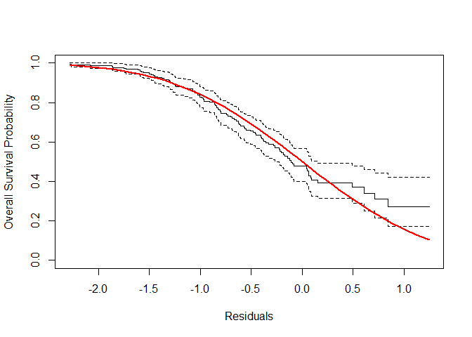<!-- -->

``` r
rr <- (log(hepatoCellular$RFS) - lnorm_reg_rfs$linear.predictors)/lnorm_reg_rfs$scale # residuals
resKM <- survfit(Surv(rr, Recurrence) ~ 1, data = hepatoCellular) # KM of residulas
plot(resKM, mark.time = FALSE, xlab = "Residuals", ylab = "Reccurence-free Survival Probability")
xx <- seq(min(rr), max(rr), length.out = 50)
 yy <- pnorm(xx, lower.tail = FALSE) # for log-normal model
# yy <- plogis(xx, lower.tail = FALSE) # for log-logistic model 
# yy <- exp(- exp(xx)) # for weibull model
 lines(xx, yy, col = "red", lwd = 2)
```

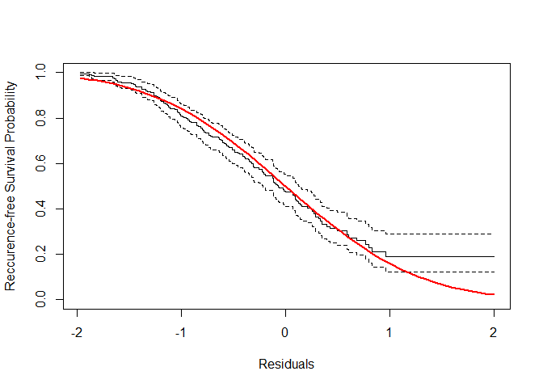<!-- -->

<br/> It seems that the log-normal model is a pretty good fit. Before we
continue, we will refit the models via the *rms* package, since it
provides a better functionality for parametric survival models than the
*survival* package. <br/>

``` r
library(rms)

exp_reg_os_psm <- psm (Surv(OS, Death) ~ Age + Gender + HBsAg + Cirrhosis + ALT + AST + AFP + Tumorsize + Tumordifferentiation + Vascularinvasion + Tumormultiplicity  + Capsulation  + TNM  + BCLC  + CXCL17T  + CXCL17P  + CXCL17N, data = as.data.frame(hepatoCellular), dist= 'exponential' , y=TRUE)

weib_reg_os_psm <- psm (Surv(OS, Death) ~ Age + Gender + HBsAg + Cirrhosis + ALT + AST + AFP + Tumorsize + Tumordifferentiation + Vascularinvasion + Tumormultiplicity  + Capsulation  + TNM  + BCLC  + CXCL17T  + CXCL17P  + CXCL17N, data = as.data.frame(hepatoCellular), dist= 'weibull' , y=TRUE)

lnorm_reg_os_psm <- psm (Surv(OS, Death) ~ Age + Gender + HBsAg + Cirrhosis + ALT + AST + AFP + Tumorsize + Tumordifferentiation + Vascularinvasion + Tumormultiplicity  + Capsulation  + TNM  + BCLC  + CXCL17T  + CXCL17P  + CXCL17N, data = as.data.frame(hepatoCellular), dist= 'lognormal' , y=TRUE)

llog_reg_os_psm <- psm (Surv(OS, Death) ~ Age + Gender + HBsAg + Cirrhosis + ALT + AST + AFP + Tumorsize + Tumordifferentiation + Vascularinvasion + Tumormultiplicity  + Capsulation  + TNM  + BCLC  + CXCL17T  + CXCL17P  + CXCL17N, data = as.data.frame(hepatoCellular), dist= 'loglogistic' , y=TRUE)


exp_reg_rfs_psm <- psm (Surv(RFS, Recurrence) ~ Age + Gender + HBsAg + Cirrhosis + ALT + AST + AFP + Tumorsize + Tumordifferentiation + Vascularinvasion + Tumormultiplicity  + Capsulation  + TNM  + BCLC  + CXCL17T  + CXCL17P  + CXCL17N, data = as.data.frame(hepatoCellular), dist= 'exponential' , y=TRUE)

weib_reg_rfs_psm <- psm (Surv(RFS, Recurrence) ~ Age + Gender + HBsAg + Cirrhosis + ALT + AST + AFP + Tumorsize + Tumordifferentiation + Vascularinvasion + Tumormultiplicity  + Capsulation  + TNM  + BCLC  + CXCL17T  + CXCL17P  + CXCL17N, data = as.data.frame(hepatoCellular), dist= 'weibull' , y=TRUE)

lnorm_reg_rfs_psm <- psm (Surv(RFS, Recurrence) ~ Age + Gender + HBsAg + Cirrhosis + ALT + AST + AFP + Tumorsize + Tumordifferentiation + Vascularinvasion + Tumormultiplicity  + Capsulation  + TNM  + BCLC  + CXCL17T  + CXCL17P  + CXCL17N, data = hepatoCellular, dist= 'lognormal' , y=TRUE)

lnorm_reg_rfs_psm <- psm (Surv(RFS, Recurrence) ~ Age + Gender + HBsAg + Cirrhosis + ALT + AST + AFP + Tumorsize + Tumordifferentiation + Vascularinvasion + Tumormultiplicity  + Capsulation  + TNM  + BCLC  + CXCL17T  + CXCL17P  + CXCL17N, data = as.data.frame(hepatoCellular), dist= 'lognormal' , y=TRUE)

llog_reg_rfs_psm <- psm (Surv(RFS, Recurrence) ~ Age + Gender + HBsAg + Cirrhosis + ALT + AST + AFP + Tumorsize + Tumordifferentiation + Vascularinvasion + Tumormultiplicity  + Capsulation  + TNM  + BCLC  + CXCL17T  + CXCL17P  + CXCL17N, data = as.data.frame(hepatoCellular), dist= 'loglogistic' , y=TRUE)
```

<br/> With the *rms* package, we can easily repeat the previous residual
plot and, in addition, group the residuals according to predictors to
check the fit in more detail. <br/>

``` r
resid_os <- resid(lnorm_reg_os_psm)
resid_rfs <- resid(lnorm_reg_rfs_psm)

par(mfrow = c(1, 2))
survplot (resid_os,main = 'Overall Survival')
survplot (resid_rfs,main = 'Recurrence-free Survival')
```

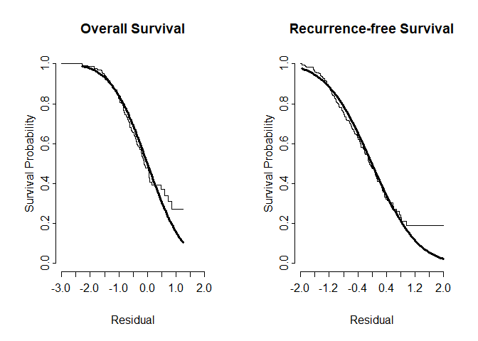<!-- -->

``` r
survplot (resid_os, hepatoCellular$Age,label.curve =TRUE,main = 'OS (Age)')
survplot (resid_rfs, hepatoCellular$Age,label.curve =TRUE,main = 'RFS (Age)')
```

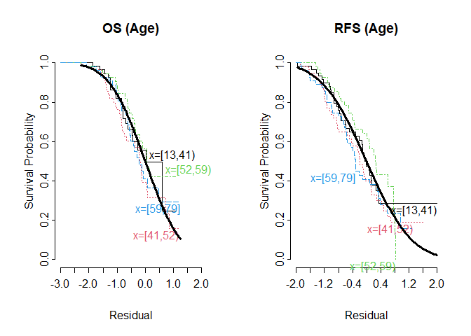<!-- -->

``` r
survplot (resid_os, hepatoCellular$Gender,label.curve =TRUE,main = 'OS (Gender)')
survplot (resid_rfs, hepatoCellular$Gender,label.curve =TRUE,main = 'RFS (Gender)')
```

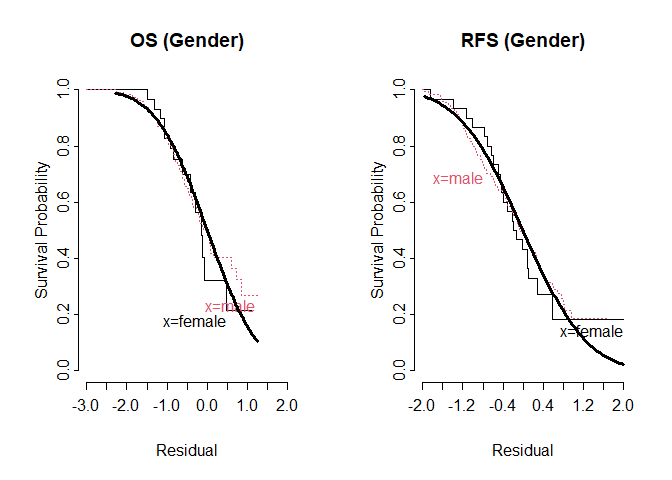<!-- -->

``` r
survplot (resid_os, hepatoCellular$Tumorsize,label.curve =TRUE,main = 'OS (Tumorsize)')
survplot (resid_rfs, hepatoCellular$Tumorsize,label.curve =TRUE,main = 'RFS (Tumorsize)')
```

<!-- -->

``` r
survplot (resid_os, hepatoCellular$Tumordifferentiation,label.curve =TRUE,main = 'OS (Tumordifferentiation)')
survplot (resid_rfs, hepatoCellular$Tumordifferentiation,label.curve =TRUE,main = 'RFS (Tumordifferentiation)')
```

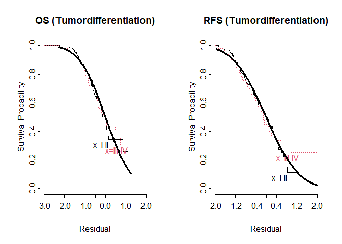<!-- -->

``` r
survplot (resid_os, hepatoCellular$BCLC,label.curve =TRUE,main = 'OS (BCLC)')
survplot (resid_rfs, hepatoCellular$BCLC,label.curve =TRUE,main = 'RFS (BCLC)')
```

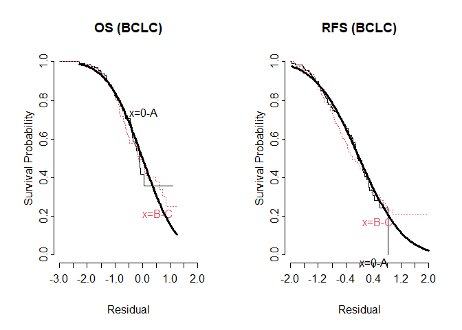<!-- -->

``` r
survplot (resid_os, hepatoCellular$CXCL17T,label.curve =TRUE,main = 'OS (CXCL17T)')
survplot (resid_rfs, hepatoCellular$CXCL17T,label.curve =TRUE,main = 'RFS (CXCL17T)')
```

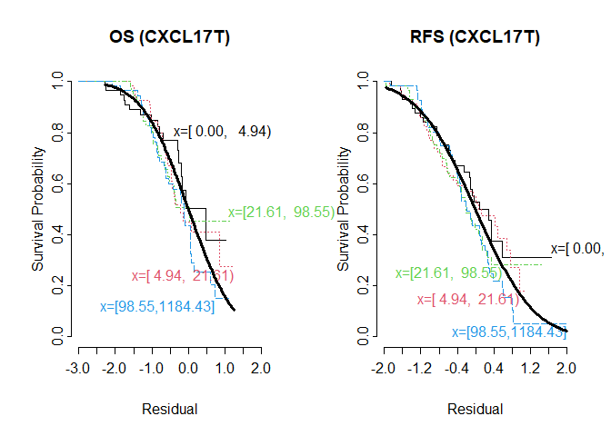<!-- -->

``` r
survplot (resid_os, hepatoCellular$CXCL17P,label.curve =TRUE,main = 'OS (CXCL17P)')
survplot (resid_rfs, hepatoCellular$CXCL17P,label.curve =TRUE,main = 'RFS (CXCL17P)')
```

<!-- -->

``` r
survplot (resid_os, hepatoCellular$CXCL17P,label.curve =TRUE,main = 'OS (CXCL17N)')
survplot (resid_rfs, hepatoCellular$CXCL17P,label.curve =TRUE,main = 'RFS (CXCL17N)')
```

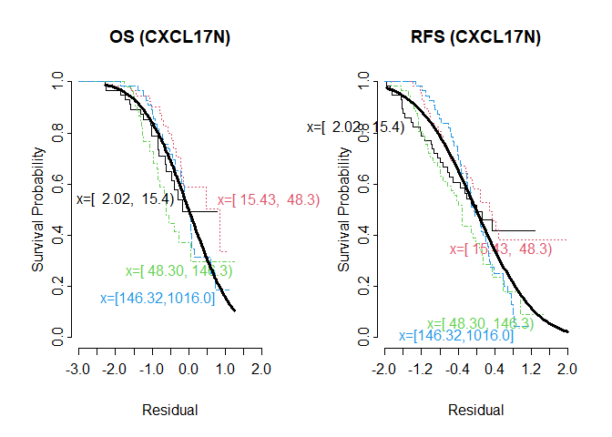<!-- -->

<br/> Next, we can also check the dfbetas residuals to assess the
influence of individual observations on the fit. <br/>

``` r
par(mfrow = c(1, 3))
plot(residuals(lnorm_reg_os_psm, type='dfbetas')[,14],ylab = 'dfbetas residuals',main = 'CXCL17T (OS)')
plot(residuals(lnorm_reg_os_psm, type='dfbetas')[,15],ylab = 'dfbetas residuals',main = 'CXCL17P (OS)')
plot(residuals(lnorm_reg_os_psm, type='dfbetas')[,16],ylab = 'dfbetas residuals',main = 'CXCL17N (OS)')
```

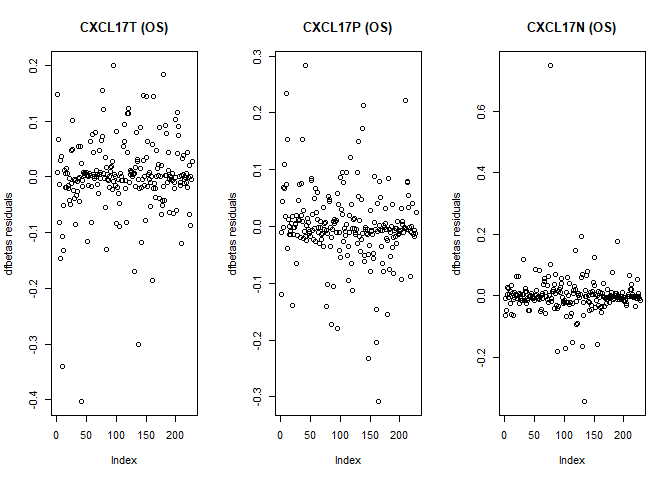<!-- -->

``` r
plot(residuals(lnorm_reg_rfs_psm, type='dfbetas')[,14],ylab = 'dfbetas residuals',main = 'CXCL17T (RFS)')
plot(residuals(lnorm_reg_rfs_psm, type='dfbetas')[,15],ylab = 'dfbetas residuals',main = 'CXCL17P (RFS)')
plot(residuals(lnorm_reg_rfs_psm, type='dfbetas')[,16],ylab = 'dfbetas residuals',main = 'CXCL17N (RFS)')
```

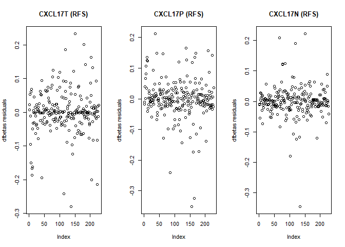<!-- -->

<br/> One observation has a significant effect on the estimate of
**CXCL17N** in the **OS** model. Let us check whether its exclusion
would change our conclusions. <br/>

``` r
lnorm_reg_os_red <- survreg(Surv(OS, Death) ~ Age + Gender + HBsAg + Cirrhosis + ALT + AST + AFP + Tumorsize + Tumordifferentiation + Vascularinvasion + Tumormultiplicity  + Capsulation  + TNM  + BCLC  + CXCL17T  + CXCL17P  + CXCL17N, data = hepatoCellular[-77,],dist='lognormal')

Anova(lnorm_reg_os_red)[15:17,]
```

    ## Analysis of Deviance Table (Type II tests)
    ##         LR Chisq Df Pr(>Chisq)  
    ## CXCL17T   6.5638  1    0.01041 *
    ## CXCL17P   2.9351  1    0.08667 .
    ## CXCL17N   0.3541  1    0.55181  
    ## ---
    ## Signif. codes:  0 '***' 0.001 '**' 0.01 '*' 0.05 '.' 0.1 ' ' 1

<br/> **CXCL17N** is still clearly non-significant. Lastly, we will
perform bootstrapped Wald tests. <br/>

``` r
set.seed(123) # for reproducibility
nb <- 2500

coefmat_os <- matrix(NA,nb,18)
coefmat_rfs <- matrix(NA,nb,18)

wald_boot_os <- matrix(0,18,nb)
pwald_os <- numeric(18)

wald_boot_rfs <- matrix(0,18,nb)
pwald_rfs <- numeric(18)

for(i in 1:nb){
  
  hepatoCellular_new <-  hepatoCellular[sample(nrow(hepatoCellular) , rep=TRUE),]
  
  model_os_new <- survreg(Surv(OS, Death) ~ Age + Gender + HBsAg + Cirrhosis + ALT + AST + AFP + Tumorsize + Tumordifferentiation + Vascularinvasion + Tumormultiplicity  + Capsulation  + TNM  + BCLC  + CXCL17T  + CXCL17P  + CXCL17N, data = hepatoCellular_new,dist='lognormal')
  
  model_rfs_new <- survreg(Surv(RFS, Recurrence) ~ Age + Gender + HBsAg + Cirrhosis + ALT + AST + AFP + Tumorsize + Tumordifferentiation + Vascularinvasion + Tumormultiplicity  + Capsulation  + TNM  + BCLC  + CXCL17T  + CXCL17P  + CXCL17N, data = hepatoCellular_new,dist='lognormal')
  
  coefmat_os[i,] <- coefficients(model_os_new)
  coefmat_rfs[i,] <- coefficients(model_rfs_new)
  
  for (j in 1:18){
    
  # trycatch to skip numerical problems with inversions
  V <- vcov(model_os_new)[j,j]
  wald_boot_os[j,i] <- tryCatch((coefficients(model_os_new)[j]-coefficients(lnorm_reg_os)[j]) %*% solve(V) %*% (coefficients(model_os_new)[j]-coefficients(lnorm_reg_os)[j]), error = function(e) {NaN})
  
  V <- vcov(model_rfs_new)[j,j]
  wald_boot_rfs[j,i] <- tryCatch((coefficients(model_rfs_new)[j]-coefficients(lnorm_reg_rfs)[j]) %*% solve(V) %*% (coefficients(model_rfs_new)[j]-coefficients(lnorm_reg_rfs)[j]), error = function(e) {NaN})
  
  }
}

for (j in 1:18){
V <- vcov(lnorm_reg_os)[j,j]
wald <- coefficients(lnorm_reg_os)[j] %*% solve(V) %*% coefficients(lnorm_reg_os)[j]      
pwald_os[j] <- mean(wald_boot_os[j,] > as.numeric(wald),na.rm = TRUE) # p-value

V <- vcov(lnorm_reg_rfs)[j,j]
wald <- coefficients(lnorm_reg_os)[j] %*% solve(V) %*% coefficients(lnorm_reg_os)[j]      
pwald_rfs[j] <- mean(wald_boot_rfs[j,] > as.numeric(wald),na.rm = TRUE) # p-value

}

var_names <- c('Intercept','Age','Gender','HBsAg','Cirrhosis','ALT','AST','AFP','Tumorsize','Tumordifferentiation','Vascularinvasion','Tumormultiplicity','Capsulation','TNM','BCLC','CXCL17T','CXCL17P','CXCL17N')
names(pwald_os) <- var_names
names(pwald_rfs) <- var_names

pwald_os[16:18]
```

    ## CXCL17T CXCL17P CXCL17N 
    ##  0.1008  0.0320  0.4448

``` r
pwald_rfs[16:18]
```

    ## CXCL17T CXCL17P CXCL17N 
    ##  0.0484  0.0224  0.4176

<br/> We obtained results similar to those of the likelihood ratio
tests. <br/>

### Predictions and validations

<br/> The *rms* package gives us easy ways to visualize the effect of
the predictors. <br/>

``` r
options(datadist="dd")
dd <- datadist(hepatoCellular)

par(mfrow = c(1, 2))
survplot(lnorm_reg_os_psm,Age = c(50,70),xlab = 'Months', ylab = 'Overall Survival Probability (Age)', adj.subtitle=FALSE)
survplot(lnorm_reg_rfs_psm,Age= c(50,70),xlab = 'Months', ylab = 'Recurrence-free Survival Probability (Age)',adj.subtitle=FALSE)
```

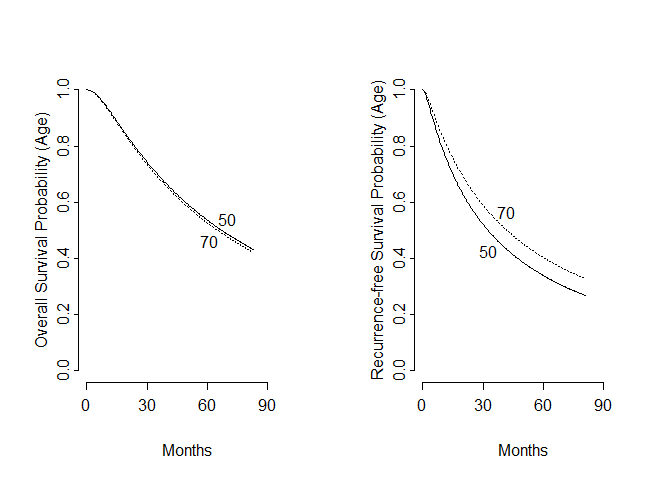<!-- -->

``` r
par(mfrow = c(1, 2))
survplot(lnorm_reg_os_psm,Gender,xlab = 'Months', ylab = 'Overall Survival Probability (Gender)', adj.subtitle=FALSE)
survplot(lnorm_reg_rfs_psm,Gender,xlab = 'Months', ylab = 'Recurrence-free Survival Probability (Gender)',adj.subtitle=FALSE)
```

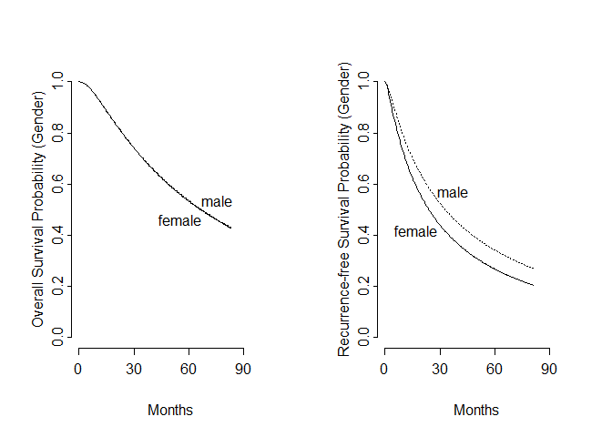<!-- -->

``` r
survplot(lnorm_reg_os_psm,Tumorsize,xlab = 'Months', ylab = 'Overall Survival Probability (Tumorsize)', adj.subtitle=FALSE)
survplot(lnorm_reg_rfs_psm,Tumorsize,xlab = 'Months', ylab = 'Recurrence-free Survival Probability (Tumorsize)',adj.subtitle=FALSE)
```

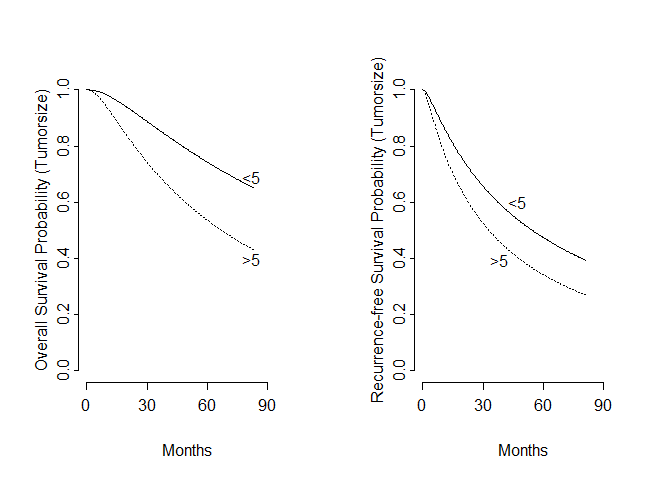<!-- -->

``` r
survplot(lnorm_reg_os_psm,Tumordifferentiation,xlab = 'Months', ylab = 'Overall Survival Probability (Tumordiff)', adj.subtitle=FALSE)
survplot(lnorm_reg_rfs_psm,Tumordifferentiation,xlab = 'Months', ylab = 'Recurrence-free Survival Probability (Tumordiff)',adj.subtitle=FALSE)
```

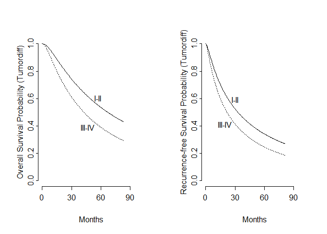<!-- -->

``` r
survplot(lnorm_reg_os_psm,BCLC,xlab = 'Months', ylab = 'Overall Survival Probability (BCLC)', adj.subtitle=FALSE)
survplot(lnorm_reg_rfs_psm,BCLC,xlab = 'Months', ylab = 'Recurrence-free Survival Probability (BCLC)',adj.subtitle=FALSE)
```

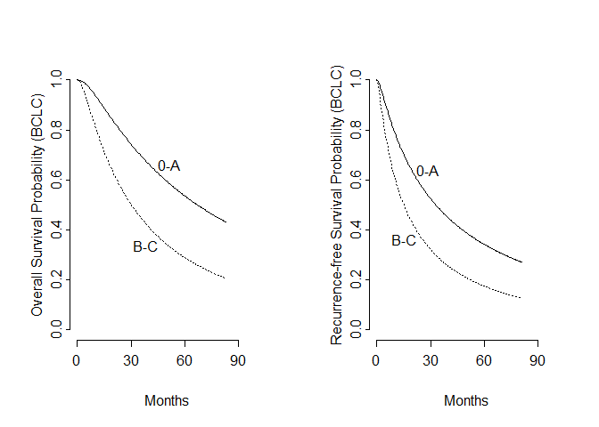<!-- -->

``` r
survplot(lnorm_reg_os_psm,CXCL17T = c(0,500,1000),xlab = 'Months', ylab = 'Overall Survival Probability (CXCL17T)', adj.subtitle=FALSE)
survplot(lnorm_reg_rfs_psm,CXCL17T = c(0,500,1000),xlab = 'Months', ylab = 'Recurrence-free Survival Probability (CXCL17T)',adj.subtitle=FALSE)
```

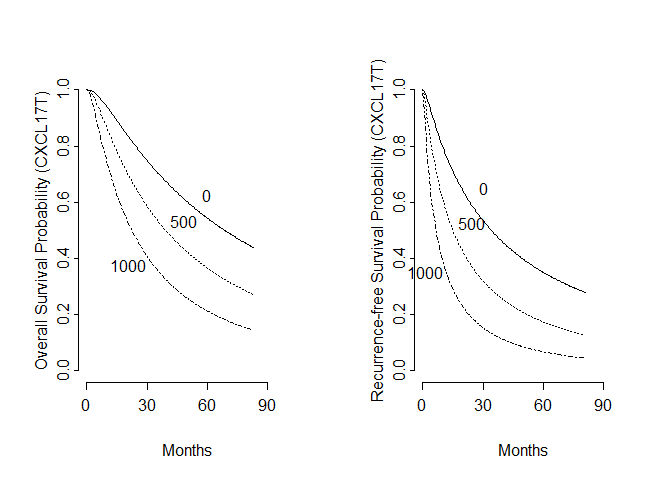<!-- -->

``` r
survplot(lnorm_reg_os_psm,CXCL17P = c(0,500,1000),xlab = 'Months', ylab = 'Overall Survival Probability (CXCL17P)', adj.subtitle=FALSE)
survplot(lnorm_reg_rfs_psm,CXCL17P = c(0,500,1000),xlab = 'Months', ylab = 'Recurrence-free Survival Probability (CXCL17P)',adj.subtitle=FALSE)
```

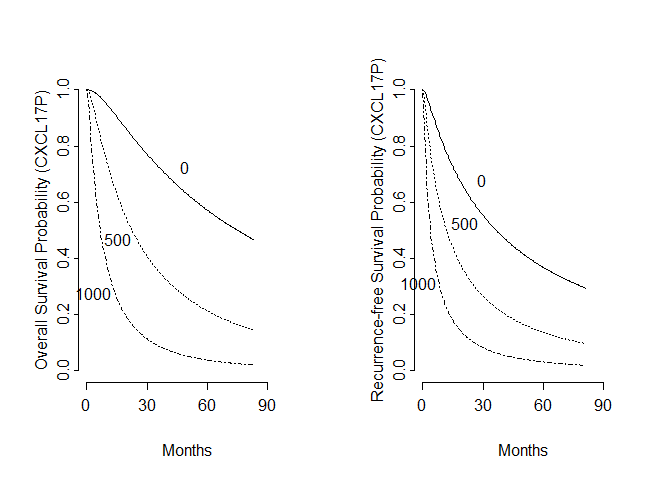<!-- -->

``` r
survplot(lnorm_reg_os_psm,CXCL17N = c(0,500,1000),xlab = 'Months', ylab = 'Overall Survival Probability (CXCL17N)', adj.subtitle=FALSE)
survplot(lnorm_reg_rfs_psm,CXCL17N = c(0,500,1000),xlab = 'Months', ylab = 'Recurrence-free Survival Probability (CXCL17N)',adj.subtitle=FALSE)
```

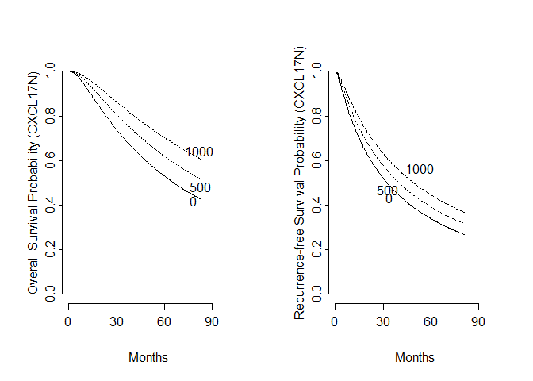<!-- -->

<br/> All that remains is model validation. Again, the discrimination
metrics we will consider in this project are concordance and the Brier
score. <br/>

``` r
conc_atm <- cbind(c(concordance(exp_reg_os_psm)$concordance,
concordance(weib_reg_os_psm)$concordance,
concordance(lnorm_reg_os_psm)$concordance,
concordance(llog_reg_os_psm)$concordance),
c(concordance(exp_reg_rfs_psm)$concordance,
concordance(weib_reg_rfs_psm)$concordance,
concordance(lnorm_reg_rfs_psm)$concordance,
concordance(llog_reg_rfs_psm)$concordance))

colnames(conc_atm) <- c('OS','RFS')
rownames(conc_atm) <- c('exp','weib','lognormal','loglogist')
conc_atm
```

    ##                  OS       RFS
    ## exp       0.7409780 0.7029987
    ## weib      0.7403438 0.7053017
    ## lognormal 0.7435149 0.7180391
    ## loglogist 0.7430710 0.7177571

``` r
brier_atm <- cbind(c(as.numeric(crps(pec(exp_reg_os_psm,cens.model = 'marginal'),start = 0,times = 80))[2],
as.numeric(crps(pec(weib_reg_os_psm,cens.model = 'marginal')))[2],
as.numeric(crps(pec(lnorm_reg_os_psm,cens.model = 'marginal')))[2],
as.numeric(crps(pec(llog_reg_os_psm,cens.model = 'marginal')))[2]),
c(as.numeric(crps(pec(exp_reg_rfs_psm,cens.model = 'marginal')))[2],
as.numeric(crps(pec(weib_reg_rfs_psm,cens.model = 'marginal')))[2],
as.numeric(crps(pec(lnorm_reg_rfs_psm,cens.model = 'marginal')))[2],
as.numeric(crps(pec(llog_reg_rfs_psm,cens.model = 'marginal')))[2]))

colnames(brier_atm) <- c('OS','RFS')
rownames(brier_atm) <- c('exp','weib','lognormal','loglogist')
brier_atm
```

    ##                  OS       RFS
    ## exp       0.1728363 0.1836381
    ## weib      0.1819156 0.1793541
    ## lognormal 0.1763566 0.1792864
    ## loglogist 0.1780133 0.1788907

<br/> As far as calibration is concerned, we cannot use the approach for
the proportional hazard models. Instead, we will use the approach
described in
<https://www.rdocumentation.org/packages/rms/versions/8.0-0/topics/val.surv>
<br/>

``` r
par(mfrow = c(1, 1))
plot(val.surv(lnorm_reg_rfs_psm))
```

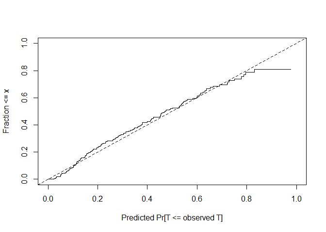<!-- -->

<br/> It will be more illustrative to remake this plot manually. First,
we obtain the predicted survival probabilities $S(T_{obs}\mid X)$ from
the model, where $T_{obs}$ are the observed survival times. Then, we
will compute the Kepler-Meier estimator of $1- S(T_{obs}\mid X)$, since
$T_{obs}$ are censored. Provided that the model is well-calibrated, this
survival estimator should be approximately a -45° line from one to zero
(*val.surv* plot is just 1 - the KM estimator). We can then evaluate the
calibration via a linear fit. <br/>

``` r
# compute surv. probabilities
surv_probabilities <- diag(predictSurvProb(lnorm_reg_rfs_psm,newdata = as.data.frame(hepatoCellular),times = hepatoCellular$RFS))

# KM estimator of 1-S with Recurrence censoring
km_surv_probabilities <- survfit(Surv(1-surv_probabilities, Recurrence) ~ 1, data = hepatoCellular)
plot(km_surv_probabilities)
abline(1,-1)
```

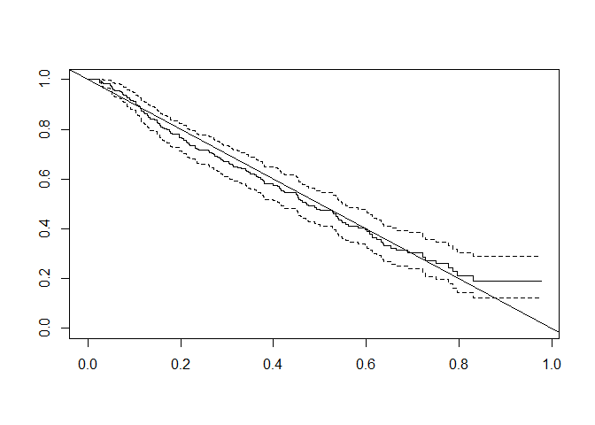<!-- -->

``` r
# the val.surv plot
plot(km_surv_probabilities$time, 1 - km_surv_probabilities$surv,xlim = c(0,1),ylim = c(0,1),xlab = 'Predicted P(T <= observed T)', ylab = 'observed fractions (KM estimator)',main = 'RFS')
abline(0,1)
```

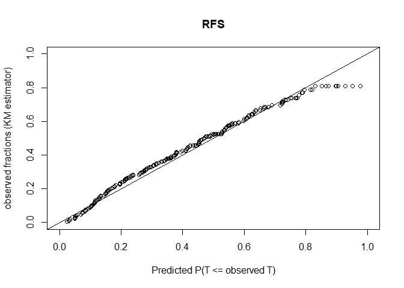<!-- -->

``` r
lm(1-km_surv_probabilities$surv~km_surv_probabilities$time)
```

    ## 
    ## Call:
    ## lm(formula = 1 - km_surv_probabilities$surv ~ km_surv_probabilities$time)
    ## 
    ## Coefficients:
    ##                (Intercept)  km_surv_probabilities$time  
    ##                    0.03365                     0.94608

<br/> The model is well-calibrated on the training data. Again, the
result could be quite different on the test data. <br/>

``` r
set.seed(113)
d <- createFolds(seq(1,dim(hepatoCellular)[1],1), k = 10)
index <- unlist(d[1])
train_set <- hepatoCellular[-index,]
test_set <- hepatoCellular[index,]

lnorm_reg_rfs_psm_partial <- psm (Surv(RFS, Recurrence) ~ Age + Gender + HBsAg + Cirrhosis + ALT + AST + AFP + Tumorsize + Tumordifferentiation + Vascularinvasion + Tumormultiplicity  + Capsulation  + TNM  + BCLC  + CXCL17T  + CXCL17P  + CXCL17N, data = as.data.frame(train_set), dist= 'lognormal' , y=TRUE)


# compute surv. probabilities
surv_probabilities <- diag(predictSurvProb(lnorm_reg_rfs_psm_partial,newdata = as.data.frame(test_set),times = test_set$RFS))

# KM estimator of 1-S with Recurrence censoring
km_surv_probabilities <- survfit(Surv(1-surv_probabilities, Recurrence) ~ 1, data = test_set)

plot(km_surv_probabilities$time, 1 - km_surv_probabilities$surv,xlim = c(0,1),ylim = c(0,1),xlab = 'Predicted P(T <= observed T)', ylab = 'observed fractions (KM estimator)',main = 'RFS')
abline(0,1)
```

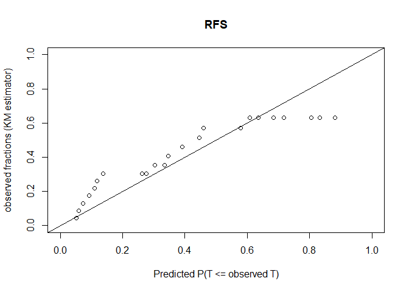<!-- -->

``` r
lm(1-km_surv_probabilities$surv~km_surv_probabilities$time)
```

    ## 
    ## Call:
    ## lm(formula = 1 - km_surv_probabilities$surv ~ km_surv_probabilities$time)
    ## 
    ## Coefficients:
    ##                (Intercept)  km_surv_probabilities$time  
    ##                     0.1336                      0.6956

<br/> All that remains is a cross-validation of all AFT models. <br/>

``` r
library(caret)

## Number of repetitions and folds
rep <- 100
folds <- 10

set.seed(123) # for reproducibility

k <- 1

concordance_cv <- matrix(NA,folds*rep,8)
brier_cv <- matrix(NA,folds*rep,8)
gamma0_cv <- matrix(NA,folds*rep,8)
gamma1_cv <- matrix(NA,folds*rep,8)


for(j in 1:rep){
  
  d <- createFolds(seq(1,dim(hepatoCellular)[1],1), k = 10)
  
  for(i in 1:folds){

    index <- unlist(d[i])
    train_set <- as.data.frame(hepatoCellular[-index,])
    test_set <- as.data.frame(hepatoCellular[index,])

    exp_reg_os_psm_new <- psm (Surv(OS, Death) ~ Age + Gender + HBsAg + Cirrhosis + ALT + AST + AFP + Tumorsize + Tumordifferentiation + Vascularinvasion + Tumormultiplicity  + Capsulation  + TNM  + BCLC  + CXCL17T  + CXCL17P  + CXCL17N, train_set, dist= 'exponential' , y=TRUE)
    
    weib_reg_os_psm_new <- psm (Surv(OS, Death) ~ Age + Gender + HBsAg + Cirrhosis + ALT + AST + AFP + Tumorsize + Tumordifferentiation + Vascularinvasion + Tumormultiplicity  + Capsulation  + TNM  + BCLC  + CXCL17T  + CXCL17P  + CXCL17N, train_set, dist= 'weibull' , y=TRUE)
    
    lnorm_reg_os_psm_new <- psm (Surv(OS, Death) ~ Age + Gender + HBsAg + Cirrhosis + ALT + AST + AFP + Tumorsize + Tumordifferentiation + Vascularinvasion + Tumormultiplicity  + Capsulation  + TNM  + BCLC  + CXCL17T  + CXCL17P  + CXCL17N, data = train_set, dist= 'lognormal' , y=TRUE)
    
    llog_reg_os_psm_new <- psm (Surv(OS, Death) ~ Age + Gender + HBsAg + Cirrhosis + ALT + AST + AFP + Tumorsize + Tumordifferentiation + Vascularinvasion + Tumormultiplicity  + Capsulation  + TNM  + BCLC  + CXCL17T  + CXCL17P  + CXCL17N, data = train_set, dist= 'loglogistic' , y=TRUE)
    
    exp_reg_rfs_psm_new <- psm (Surv(RFS, Recurrence) ~ Age + Gender + HBsAg + Cirrhosis + ALT + AST + AFP + Tumorsize + Tumordifferentiation + Vascularinvasion + Tumormultiplicity  + Capsulation  + TNM  + BCLC  + CXCL17T  + CXCL17P  + CXCL17N, data = train_set, dist= 'exponential' , y=TRUE)
    
    weib_reg_rfs_psm_new <- psm (Surv(RFS, Recurrence) ~ Age + Gender + HBsAg + Cirrhosis + ALT + AST + AFP + Tumorsize + Tumordifferentiation + Vascularinvasion + Tumormultiplicity  + Capsulation  + TNM  + BCLC  + CXCL17T  + CXCL17P  + CXCL17N, data = train_set, dist= 'weibull' , y=TRUE)
    
    lnorm_reg_rfs_psm_new <- psm (Surv(RFS, Recurrence) ~ Age + Gender + HBsAg + Cirrhosis + ALT + AST + AFP + Tumorsize + Tumordifferentiation + Vascularinvasion + Tumormultiplicity  + Capsulation  + TNM  + BCLC  + CXCL17T  + CXCL17P  + CXCL17N, data = train_set, dist= 'lognormal' , y=TRUE)
    
    lnorm_reg_rfs_psm_new <- psm (Surv(RFS, Recurrence) ~ Age + Gender + HBsAg + Cirrhosis + ALT + AST + AFP + Tumorsize + Tumordifferentiation + Vascularinvasion + Tumormultiplicity  + Capsulation  + TNM  + BCLC  + CXCL17T  + CXCL17P  + CXCL17N, data = train_set, dist= 'lognormal' , y=TRUE)
    
    llog_reg_rfs_psm_new <- psm (Surv(RFS, Recurrence) ~ Age + Gender + HBsAg + Cirrhosis + ALT + AST + AFP + Tumorsize + Tumordifferentiation + Vascularinvasion + Tumormultiplicity  + Capsulation  + TNM  + BCLC  + CXCL17T  + CXCL17P  + CXCL17N, data = train_set, dist= 'loglogistic' , y=TRUE)

    # concordance
    concordance_cv[k,1] <- concordance(exp_reg_os_psm_new,newdata = test_set)$concordance
    concordance_cv[k,2] <- concordance(weib_reg_os_psm_new,newdata = test_set)$concordance
    concordance_cv[k,3] <- concordance(lnorm_reg_os_psm_new,newdata = test_set)$concordance
    concordance_cv[k,4] <- concordance(llog_reg_os_psm_new,newdata = test_set)$concordance
    concordance_cv[k,5] <- concordance(exp_reg_rfs_psm_new,newdata = test_set)$concordance
    concordance_cv[k,6] <- concordance(weib_reg_rfs_psm_new,newdata = test_set)$concordance
    concordance_cv[k,7] <- concordance(lnorm_reg_rfs_psm_new,newdata = test_set)$concordance
    concordance_cv[k,8] <- concordance(llog_reg_rfs_psm_new,newdata = test_set)$concordance
    
    
    brier_cv[k,1] <- as.numeric(crps(pec(exp_reg_os_psm_new,newdata = test_set,cens.model = 'marginal')))[2]
    brier_cv[k,2] <- as.numeric(crps(pec(weib_reg_os_psm_new,data = test_set,cens.model = 'marginal')))[2]
    brier_cv[k,3] <- as.numeric(crps(pec(lnorm_reg_os_psm_new,data = test_set,cens.model = 'marginal')))[2]
    brier_cv[k,4] <- as.numeric(crps(pec(llog_reg_os_psm_new,data = test_set,cens.model = 'marginal')))[2]
    brier_cv[k,5] <- as.numeric(crps(pec(exp_reg_rfs_psm_new,data = test_set,cens.model = 'marginal')))[2]
    brier_cv[k,6] <- as.numeric(crps(pec(weib_reg_rfs_psm_new,data = test_set,cens.model = 'marginal')))[2]
    brier_cv[k,7] <- as.numeric(crps(pec(lnorm_reg_rfs_psm_new,data = test_set,cens.model = 'marginal')))[2]
    brier_cv[k,8] <- as.numeric(crps(pec(llog_reg_rfs_psm_new,data = test_set,cens.model = 'marginal')))[2]

    
    # exp_reg_os_psm_new
    surv_probabilities <- diag(predictSurvProb(exp_reg_os_psm_new,newdata = as.data.frame(test_set),times = test_set$OS))
    km_surv_probabilities <- survfit(Surv(1-surv_probabilities, Death) ~ 1, data = test_set)
    gammas <- coefficients(lm(1-km_surv_probabilities$surv~km_surv_probabilities$time))
    gamma0_cv[k,1] <- gammas[1]
    gamma1_cv[k,1] <- gammas[2]
    
    # weib_reg_os_psm_new
    surv_probabilities <- diag(predictSurvProb(weib_reg_os_psm_new,newdata = as.data.frame(test_set),times = test_set$OS))
    km_surv_probabilities <- survfit(Surv(1-surv_probabilities, Death) ~ 1, data = test_set)
    gammas <- coefficients(lm(1-km_surv_probabilities$surv~km_surv_probabilities$time))
    gamma0_cv[k,2] <- gammas[1]
    gamma1_cv[k,2] <- gammas[2]
    
    # lnorm_reg_os_psm_new
    surv_probabilities <- diag(predictSurvProb(lnorm_reg_os_psm_new,newdata = as.data.frame(test_set),times = test_set$OS))
    km_surv_probabilities <- survfit(Surv(1-surv_probabilities, Death) ~ 1, data = test_set)
    gammas <- coefficients(lm(1-km_surv_probabilities$surv~km_surv_probabilities$time))
    gamma0_cv[k,3] <- gammas[1]
    gamma1_cv[k,3] <- gammas[2]
    
    # llog_reg_os_psm_new
    surv_probabilities <- diag(predictSurvProb(llog_reg_os_psm_new,newdata = as.data.frame(test_set),times = test_set$OS))
    km_surv_probabilities <- survfit(Surv(1-surv_probabilities, Death) ~ 1, data = test_set)
    gammas <- coefficients(lm(1-km_surv_probabilities$surv~km_surv_probabilities$time))
    gamma0_cv[k,4] <- gammas[1]
    gamma1_cv[k,4] <- gammas[2]
    
    # exp_reg_rfs_psm_new
    surv_probabilities <- diag(predictSurvProb(exp_reg_rfs_psm_new,newdata = as.data.frame(test_set),times = test_set$RFS))
    km_surv_probabilities <- survfit(Surv(1-surv_probabilities, Recurrence) ~ 1, data = test_set)
    gammas <- coefficients(lm(1-km_surv_probabilities$surv~km_surv_probabilities$time))
    gamma0_cv[k,5] <- gammas[1]
    gamma1_cv[k,5] <- gammas[2]
    
    # weib_reg_rfs_psm_new
    surv_probabilities <- diag(predictSurvProb(weib_reg_rfs_psm_new,newdata = as.data.frame(test_set),times = test_set$RFS))
    km_surv_probabilities <- survfit(Surv(1-surv_probabilities, Recurrence) ~ 1, data = test_set)
    gammas <- coefficients(lm(1-km_surv_probabilities$surv~km_surv_probabilities$time))
    gamma0_cv[k,6] <- gammas[1]
    gamma1_cv[k,6] <- gammas[2]
    
    # lnorm_reg_rfs_psm_new
    surv_probabilities <- diag(predictSurvProb(lnorm_reg_rfs_psm_new,newdata = as.data.frame(test_set),times = test_set$RFS))
    km_surv_probabilities <- survfit(Surv(1-surv_probabilities, Recurrence) ~ 1, data = test_set)
    gammas <- coefficients(lm(1-km_surv_probabilities$surv~km_surv_probabilities$time))
    gamma0_cv[k,7] <- gammas[1]
    gamma1_cv[k,7] <- gammas[2]
    
    # llog_reg_rfs_psm_new
    surv_probabilities <- diag(predictSurvProb(llog_reg_rfs_psm_new,newdata = as.data.frame(test_set),times = test_set$RFS))
    km_surv_probabilities <- survfit(Surv(1-surv_probabilities, Recurrence) ~ 1, data = test_set)
    gammas <- coefficients(lm(1-km_surv_probabilities$surv~km_surv_probabilities$time))
    gamma0_cv[k,8] <- gammas[1]
    gamma1_cv[k,8] <- gammas[2]
    
    k <- k + 1
    
  }
}

cv_res2 <- cbind(apply(concordance_cv,2,mean,na.rm = TRUE),
apply(brier_cv,2,mean,na.rm = TRUE), 
apply(gamma0_cv,2,mean,na.rm = TRUE),       
apply(gamma1_cv,2,mean,na.rm = TRUE))

colnames(cv_res2) <- c('Concordance','Brier','Intercept','Slope')
rownames(cv_res2) <- c('exp(OS)','weib(OS)','lognorm(OS)','loglogist(OS)','exp(RFS)','weib(RFS)','lognorm(RFS)','loglogist(RFS)')
cv_res2
```

    ##                Concordance     Brier  Intercept     Slope
    ## exp(OS)          0.6776436 0.1779743 0.07839673 0.8322796
    ## weib(OS)         0.6772239 0.2065976 0.08581284 0.8130601
    ## lognorm(OS)      0.6914899 0.1932363 0.07386192 0.8327019
    ## loglogist(OS)    0.6889358 0.1956405 0.07312120 0.8120709
    ## exp(RFS)         0.6560249 0.2195807 0.13917731 0.7731406
    ## weib(RFS)        0.6582086 0.2130243 0.07988177 0.8770423
    ## lognorm(RFS)     0.6742468 0.2065366 0.07778715 0.8703010
    ## loglogist(RFS)   0.6730152 0.2071313 0.07267633 0.8578033

<br/> Log-normal models appear to be the best overall. It also seems
that the lognormal models perform a bit better in terms of concordance
than the Cox models, but are worse in terms of the Brier score. <br/>

### Conclusions

<br/> In this project, we have performed an analysis of the
Hepatocellular dataset. We have shown that the biomarker **CXCL17P** is
associated with the overall survival and the recurrence-free survival
using the Cox proportional hazards models and the lognormal AFT models,
both of which provided similar results (P-value \< 0.05 in all
considered likelihood ratio tests, Wald tests, and bootstrapped Wald
tests). The biomarker **CXCL17T** is associated with the recurrence-free
survival (P-value \< 0.05 in all considered likelihood ratio tests, Wald
tests, and bootstrapped Wald tests), but it was not significant in some
tests for the overall survival models. The biomarker **CXCL17N** was not
significant in any of the considered models. We have also performed
model validation of all considered models via cross-validation to assess
the generalizability of the results to new data.

With that conclusion, we end Part One of this circle dedicated to the
survival analysis. In Part Two, we will have a look at the survival
models with multiple outcomes / competing risks. <br/>

### References

- \[1\] L. Li et al. CXCL17 expression predicts poor prognosis and
  correlates with adverse immune infiltration in hepatocellular
  carcinoma. PloS one 9.10 (2014): e110064.

- \[2\] D. F. Moore. Applied survival analysis using R. Vol. 473. Cham:
  Springer, 2016.

- \[3\] P. C. Austin, D. S. Lee, and J. P. Fine. Introduction to the
  analysis of survival data in the presence of competing risks.
  Circulation 133.6 (2016): 601-609.

- \[4\] F.Harrell. Regression modeling strategies. New York:
  Springer-Verlag, 2001.

- \[5\] T. M. Therneau and P. M. Grambsch. Modeling survival data:
  extending the Cox model. New York, NY: Springer New York, 2000

- \[6\] F. E. Harrell, K. L. Lee, and D. B. Mark. Multivariable
  prognostic models: issues in developing models, evaluating assumptions
  and adequacy, and measuring and reducing errors. Statistics in
  medicine 15.4 (1996): 361-387.

- \[7\] N. Hartman et al. Pitfalls of the concordance index for survival
  outcomes. Statistics in medicine 42.13 (2023): 2179-2190.

- \[8\] E. Graf et al. Assessment and comparison of prognostic
  classification schemes for survival data. Statistics in medicine
  18.17‐18 (1999): 2529-2545.

- \[9\] C. S. Crowson, E. J. Atkinson, and T. M. Therneau. Assessing
  calibration of prognostic risk scores. Statistical methods in medical
  research 25.4 (2016): 1692-1706.
