<br/> In this project, we will demonstrate application of using linear
regression and some of its extensions (we will eventually move to models
for panel data and the final model will be a mixed effects model). Our
objective will be to build a model for life expectancy using health,
immunization, and economic and demographic data about 179 countries. We
will explore whether the obtained model would be useful for predictions
about life expectancy. We also wish to identify predictors that seem to
have the greatest effect on life expectancy. We will split this
presentation into three parts: data preparation & exploration, creating
a model , and model predictions & discussion. <br/>

## Life Expectancy (WHO) dataset

<br/> Let us start with the description of our data set. Our data are
taken from
<https://www.kaggle.com/datasets/lashagoch/life-expectancy-who-updated>.
Data contains life expectancy, health, immunization, and economic and
demographic information about 179 countries from 2000 to 2015 <br/>

- **Country**
- **Region**
- **Year** - Data observed from 2000 to 2015
- **Infant_deaths** - Infant deaths per 1000 population
- **Under_five_deaths** - Deaths of children under five years old per
  1000 population
- **Adult_mortality** - Deaths of adults between 15 and 60 per 1000
  population
- **Alcohol_consumption** - Alcohol consumption in liters of pure
  alcohol per capita for 15+ years old
- **Hepatitis_B** - Coverage (%) of Hepatitis B (HepB3) immunization
  among 1-year-olds.
- **Measles** - Coverage (%) of Measles immunization among 1-year-olds
- **BMI** - Mean body mass index (BMI) of adult population 18+
- **Polio** - Coverage (%) of Polio (Pol3) immunization among
  1-year-olds
- **Diptheria** - Coverage (%) of Diphtheria tetanus toxoid and
  pertussis (DTP3) immunization among 1-year-olds.
- **Incidents_HIV** - Incidents of HIV per 1000 population aged 15-49
- **GDP_per_capita** - GDP per capita in USD
- **Population_mln** - Total population in millions
- **Thinness_10-19** - Prevalence of thinness among adolescents aged
  10-19 years: BMI \< -2 standard deviations below the median
- **Thinness_5-9** - Prevalence of thinness among children aged 5-9
  years: BMI \< -2 standard deviations below the median
- **Schooling** - Average years that people aged 25+ spent in formal
  education
- **Developed** - Economically developed country (status in the World
  Trade Organization)
- **Developing** - Economically developing country (status in the World
  Trade Organization)
- **Life_expectancy** - Average life expectancy

<br/> As stated on the Kaggle page, information about Population, GDP,
and Life Expectancy were taken from World Bank Data. Information about
vaccinations for Measles, Hepatitis B, Polio, and Diphtheria, alcohol
consumption, BMI, HIV incidents, mortality rates, and thinness were
collected from World Health Organization public datasets. Information
about Schooling was collected from the Our World in Data which is a
project of the University of Oxford. The data had some missing values
and were imputed with either closest three-year average or average of
the Region. Unfortunately, these missing values are not denoted, thus,
we will not be able to test other imputation methods.

We start with loading in the data, and displaying the first few rows to
check that it loaded correctly. <br/>

``` r
library(readr)
life_expectancy <- read_csv('C:/Users/elini/Desktop/nine circles/Life-Expectancy-Data-Updated.csv')
```

``` r
head(life_expectancy)
```

    ## # A tibble: 6 × 21
    ##   Country    Region         Year Infant_deaths Under_five_deaths Adult_mortality
    ##   <chr>      <chr>         <dbl>         <dbl>             <dbl>           <dbl>
    ## 1 Turkiye    Middle East    2015          11.1              13             106. 
    ## 2 Spain      European Uni…  2015           2.7               3.3            57.9
    ## 3 India      Asia           2007          51.5              67.9           201. 
    ## 4 Guyana     South America  2006          32.8              40.5           222. 
    ## 5 Israel     Middle East    2012           3.4               4.3            58.0
    ## 6 Costa Rica Central Amer…  2006           9.8              11.2            95.2
    ## # ℹ 15 more variables: Alcohol_consumption <dbl>, Hepatitis_B <dbl>,
    ## #   Measles <dbl>, BMI <dbl>, Polio <dbl>, Diphtheria <dbl>,
    ## #   Incidents_HIV <dbl>, GDP_per_capita <dbl>, Population_mln <dbl>,
    ## #   Thinness_ten_nineteen_years <dbl>, Thinness_five_nine_years <dbl>,
    ## #   Schooling <dbl>, Economy_status_Developed <dbl>,
    ## #   Economy_status_Developing <dbl>, Life_expectancy <dbl>

## Initial Data Exploration

<br/> We start with a brief data exploration. We will mostly look for
serious problems with the data such as missing values, nonsensical
values, etc. Let us first look at the size of the dataset. <br/>

``` r
dim(life_expectancy)
```

    ## [1] 2864   21

<br/> We have 2864 observations, one response we wish to model/predict
(**Life_expectancy**), and 20 possible predictors. Let us check whether
there are indeed 2864 full observations.

``` r
any(is.na(life_expectancy))
```

    ## [1] FALSE

<br/> No data entry is missing, and every country has a unique record
for each year, i.e., there are no duplicate observations. <br/>

``` r
any(duplicated(cbind(life_expectancy$Country,life_expectancy$Year)))
```

    ## [1] FALSE

<br/> Now, let us have a closer look at the predictors. Predictors
**Economy_status_Developed** and **Economy_status_Developing** should be
considered as one factor variable (every country is either developed or
developing). Let us check that fact and make the appropriate changes.
<br/>

``` r
## Economy_status_Developed and Economy_status_Developing should add up to a vector of ones
which(life_expectancy$Economy_status_Developed+life_expectancy$Economy_status_Developing != 1)
```

    ## integer(0)

``` r
## Turn column Economy_status_Developed into a factor, rename the levels and the column, drop the redundant column
library(tibble)
library(dplyr)
life_expectancy$Economy_status_Developed <- factor(life_expectancy$Economy_status_Developed)
levels(life_expectancy$Economy_status_Developed) <- c('Developing','Developed')
life_expectancy <- life_expectancy %>% rename(Economy_status = Economy_status_Developed)
life_expectancy$Economy_status_Developing <- NULL

## Turn column Region into a factor while we are at it
life_expectancy$Region <- factor(life_expectancy$Region)
```

<br/> The rest of the predictors are correctly specified as numerical.
Let us check that their values make some sense. <br/>

- **Infant_deaths**

``` r
summary(life_expectancy$Infant_deaths)
```

    ##    Min. 1st Qu.  Median    Mean 3rd Qu.    Max. 
    ##    1.80    8.10   19.60   30.36   47.35  138.10

- **Under_five_deaths**

<!-- -->

    ##    Min. 1st Qu.  Median    Mean 3rd Qu.    Max. 
    ##   2.300   9.675  23.100  42.938  66.000 224.900

- **Adult_mortality**

<!-- -->

    ##    Min. 1st Qu.  Median    Mean 3rd Qu.    Max. 
    ##   49.38  106.91  163.84  192.25  246.79  719.36

- **Alcohol_consumption**

<!-- -->

    ##    Min. 1st Qu.  Median    Mean 3rd Qu.    Max. 
    ##   0.000   1.200   4.020   4.821   7.777  17.870

- **Hepatitis_B**

<!-- -->

    ##    Min. 1st Qu.  Median    Mean 3rd Qu.    Max. 
    ##   12.00   78.00   89.00   84.29   96.00   99.00

- **Measles**

<!-- -->

    ##    Min. 1st Qu.  Median    Mean 3rd Qu.    Max. 
    ##   10.00   64.00   83.00   77.34   93.00   99.00

- **Polio**

<!-- -->

    ##    Min. 1st Qu.  Median    Mean 3rd Qu.    Max. 
    ##     8.0    81.0    93.0    86.5    97.0    99.0

- **Diphtheria**

<!-- -->

    ##    Min. 1st Qu.  Median    Mean 3rd Qu.    Max. 
    ##   16.00   81.00   93.00   86.27   97.00   99.00

- **Incidents_HIV**

<!-- -->

    ##    Min. 1st Qu.  Median    Mean 3rd Qu.    Max. 
    ##  0.0100  0.0800  0.1500  0.8943  0.4600 21.6800

- **GDP_per_capita**

<!-- -->

    ##    Min. 1st Qu.  Median    Mean 3rd Qu.    Max. 
    ##     148    1416    4217   11541   12557  112418

- **Population_mln**

<!-- -->

    ##     Min.  1st Qu.   Median     Mean  3rd Qu.     Max. 
    ##    0.080    2.098    7.850   36.676   23.688 1379.860

- **Thinness_ten_nineteen_years**

<!-- -->

    ##    Min. 1st Qu.  Median    Mean 3rd Qu.    Max. 
    ##   0.100   1.600   3.300   4.866   7.200  27.700

- **Thinness_five_nine_years**

<!-- -->

    ##    Min. 1st Qu.  Median    Mean 3rd Qu.    Max. 
    ##     0.1     1.6     3.4     4.9     7.3    28.6

- **Schooling**

<!-- -->

    ##    Min. 1st Qu.  Median    Mean 3rd Qu.    Max. 
    ##   1.100   5.100   7.800   7.632  10.300  14.100

<br/> None of the minimal or maximal values seems nonsensical. To
conclude this initial exploration of the data, we plot histograms of all
predictors to check whether all predictors are varied enough (i.e., we
check whether some predictors should be omitted due to being
non-informative for modelling/prediction purposes). Histograms also help
us assess the overall distribution of the predictors. <br/>

``` r
library(ggplot2)
library(gridExtra)

plot1 <- ggplot(life_expectancy, aes(x=Infant_deaths)) + geom_histogram() + xlab("Infant_deaths") + ylab("Frequency")
plot2 <- ggplot(life_expectancy, aes(x=Under_five_deaths)) + geom_histogram() + xlab("Under_five_deaths") + ylab("Frequency")
plot3 <- ggplot(life_expectancy, aes(x=Adult_mortality)) + geom_histogram() + xlab("Adult_mortality") + ylab("Frequency")
grid.arrange(plot1, plot2, plot3, ncol=3)
```

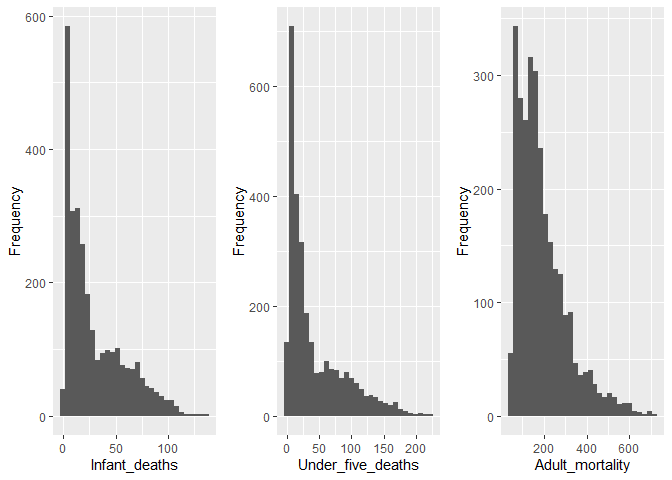

<br/>
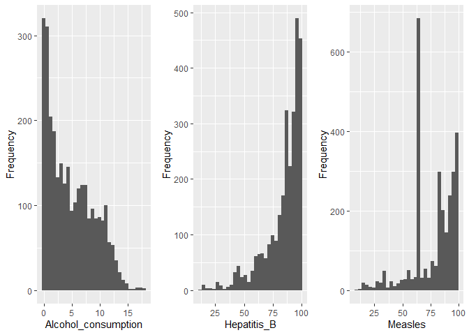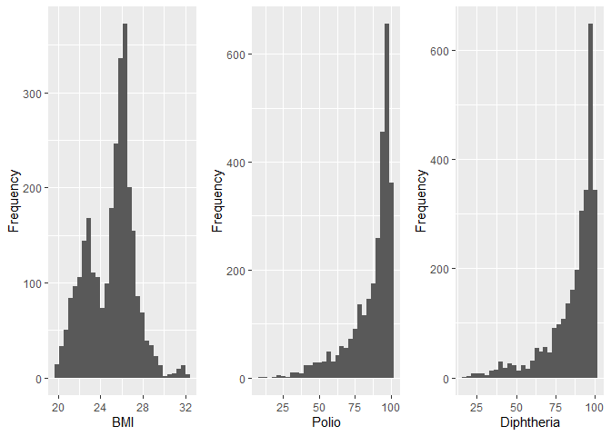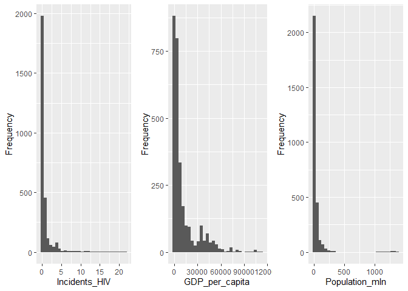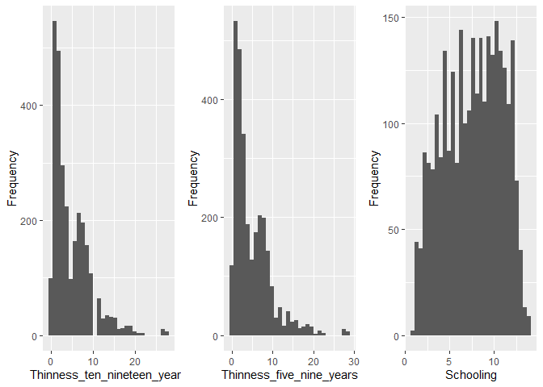

<br/> None of the numerical predictors seems nearly constant, so we will
consider all of them for modelling now. I will just do a logarithm
transformation of **Population_mln** and **GDP_per_capita** to reduce
their large spread of values (we do not expect that the effects of these
predictors will have such a proportional spread). <br/>

``` r
Population_log <- log(life_expectancy$Population_mln + 1)
GDP_log <- log(life_expectancy$GDP_per_capita)
life_expectancy <- life_expectancy %>% add_column(Population_log)
life_expectancy <- life_expectancy %>% add_column(GDP_log)
```

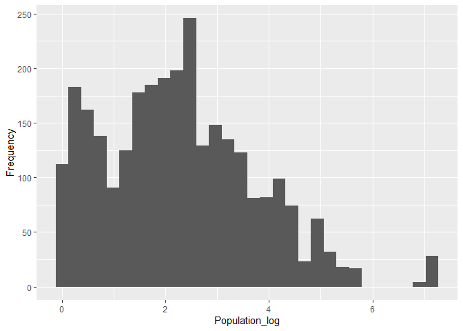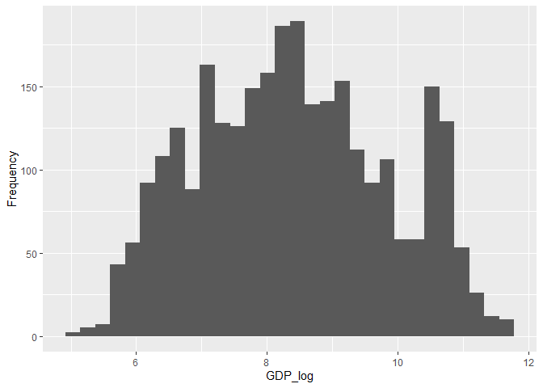

## Redundancy Analysis

<br/> As we will discuss further in Part 2, our model of life expectancy
will contain as the main predictors of interest all predictors except
**Country**, **Year**, and **Adult_mortality**. Our dataset consists of
a relatively small number of predictors. However, the effective size of
our dataset is also much smaller than which would appear at the first
glance, as we discuss in Part Two. Hence, it is worthwhile to check
whether some predictors contain redundant information. We first plot a
correlation heatmap. <br/>

``` r
library(pheatmap)
pheatmap(cor(life_expectancy[,c(4,5,7:13,16,17,18,21,22)]),display_numbers = TRUE, fontsize = 8, cluster_rows = FALSE, cluster_cols = FALSE)
```

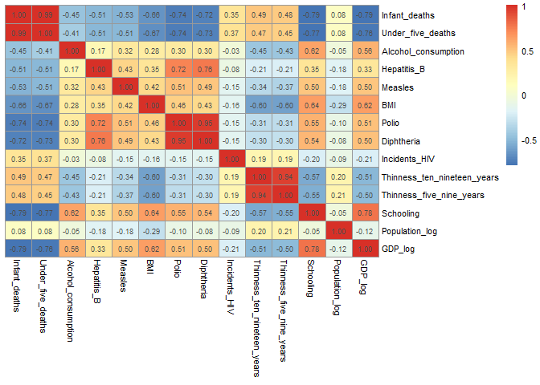

<br/> As can be seen from the heatmap, some predictors are significantly
correlated. Let us test whether such predictors can indeed be modelled
via the remaining predictors. We use a variance inflation factor (VIF)
that considers the linear regression of every predictor against all
other predictors. <br/>

``` r
library(car)
model <- lm(Life_expectancy ~ .  - Year - Country - Region - GDP_per_capita - Adult_mortality - Population_mln, data=life_expectancy)
vif(model)
```

    ##               Infant_deaths           Under_five_deaths 
    ##                   45.496298                   43.384616 
    ##         Alcohol_consumption                 Hepatitis_B 
    ##                    2.266525                    2.618636 
    ##                     Measles                         BMI 
    ##                    1.622987                    2.918694 
    ##                       Polio                  Diphtheria 
    ##                   12.154609                   13.065068 
    ##               Incidents_HIV Thinness_ten_nineteen_years 
    ##                    1.350231                    8.894234 
    ##    Thinness_five_nine_years                   Schooling 
    ##                    8.942022                    4.352311 
    ##              Economy_status              Population_log 
    ##                    2.657490                    1.230802 
    ##                     GDP_log 
    ##                    4.257298

<br/> Since **Infant_deaths** and **Under_five_deaths** are almost
perfectly collinear, we indeed observe that these two predictors have
extremely high VIF, because one predictor can accurately model the
other. <br/>

``` r
## Show R^2 statistics for linear regression Infant_deaths ~ Under_five_deaths
summary(lm(Infant_deaths~Under_five_deaths,data = life_expectancy))$r.squared
```

    ## [1] 0.9715086

<br/> The reason for this is the fact that **Under_five_deaths** also
include **Infant_deaths** and **Infant_deaths** are a large proportion
of **Under_five_deaths**. <br/>

``` r
hist(life_expectancy$Infant_deaths,xlab = 'Infant deaths',main = NULL)
```

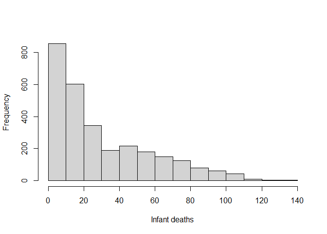<!-- -->

``` r
hist(life_expectancy$Under_five_deaths,xlab = 'Under five deaths',main = NULL)
```

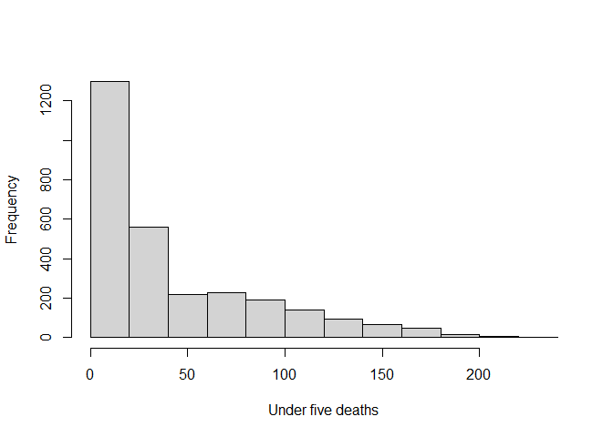<!-- -->

``` r
hist(life_expectancy$Under_five_deaths-life_expectancy$Infant_deaths,xlab = 'Under five deaths - Infant deaths',main = NULL)
```

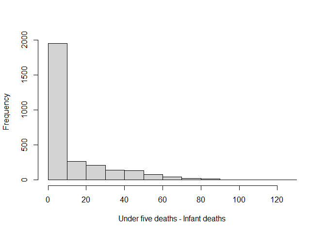<!-- -->

<br/> When faced with a group of collinear predictors, it is recommended
to summarize the predictors(e.g., using the principal component
analysis) instead of arbitrarily choosing one. In our case, it makes
sense to simply split **Infant_deaths** and **Under_five_deaths** that
are not **Infant_deaths** <br/>

``` r
udf_diff <- life_expectancy$Under_five_deaths - life_expectancy$Infant_deaths
life_expectancy <- life_expectancy %>% add_column(udf_diff) %>% rename(Under_five_deaths_dif = udf_diff)

summary(lm(Under_five_deaths_dif~Infant_deaths,data = life_expectancy))$r.squared
```

    ## [1] 0.8260172

``` r
model <- lm(Life_expectancy ~ .  - Year - Country - Region - GDP_per_capita - Adult_mortality - Population_mln - Under_five_deaths + Under_five_deaths_dif, data=life_expectancy)
vif(model)
```

    ##               Infant_deaths         Alcohol_consumption 
    ##                   11.238622                    2.266525 
    ##                 Hepatitis_B                     Measles 
    ##                    2.618636                    1.622987 
    ##                         BMI                       Polio 
    ##                    2.918694                   12.154609 
    ##                  Diphtheria               Incidents_HIV 
    ##                   13.065068                    1.350231 
    ## Thinness_ten_nineteen_years    Thinness_five_nine_years 
    ##                    8.894234                    8.942022 
    ##                   Schooling              Economy_status 
    ##                    4.352311                    2.657490 
    ##              Population_log                     GDP_log 
    ##                    1.230802                    4.257298 
    ##       Under_five_deaths_dif 
    ##                    7.104666

<br/> We see that by this simple fix the major collinearity issue
disappeared. The second pair of collinear predictors that could be
combined is **Polio** and **Diphtheria**, However, they are much closer
to the rule of thumb cutoff: VIF = 10. Hence, I chose to keep both for
modelling. <br/>

``` r
summary(lm(Diphtheria~Polio,data = life_expectancy))$r.squared
```

    ## [1] 0.9085481

<br/> VIF considers only regression models in which all predictors enter
linearly. We can consider a more sophisticated redundancy analysis using
the function *redun*, which uses more flexible regression splines for
predicting each variable from all others. We can see from the results
that no more predictors seem excessively redundant (I chose a 0.95
R-squared cutoff). <br/>

``` r
library(Hmisc)
redun(~.- Life_expectancy - Under_five_deaths - Year - Country  -  Adult_mortality - Population_mln - GDP_per_capita,data = life_expectancy,nk = 4, r2 = 0.95)
```

    ## 
    ## Redundancy Analysis
    ## 
    ## ~Region + Infant_deaths + Alcohol_consumption + Hepatitis_B + 
    ##     Measles + BMI + Polio + Diphtheria + Incidents_HIV + Thinness_ten_nineteen_years + 
    ##     Thinness_five_nine_years + Schooling + Economy_status + Population_log + 
    ##     GDP_log + Under_five_deaths_dif
    ## <environment: 0x0000021673cbc158>
    ## 
    ## n: 2864  p: 16   nk: 4 
    ## 
    ## Number of NAs:    0 
    ## 
    ## Transformation of target variables forced to be linear
    ## 
    ## R-squared cutoff: 0.95   Type: ordinary 
    ## 
    ## R^2 with which each variable can be predicted from all other variables:
    ## 
    ##                      Region               Infant_deaths 
    ##                       0.876                       0.947 
    ##         Alcohol_consumption                 Hepatitis_B 
    ##                       0.758                       0.667 
    ##                     Measles                         BMI 
    ##                       0.545                       0.810 
    ##                       Polio                  Diphtheria 
    ##                       0.927                       0.930 
    ##               Incidents_HIV Thinness_ten_nineteen_years 
    ##                       0.529                       0.893 
    ##    Thinness_five_nine_years                   Schooling 
    ##                       0.896                       0.849 
    ##              Economy_status              Population_log 
    ##                       0.912                       0.467 
    ##                     GDP_log       Under_five_deaths_dif 
    ##                       0.884                       0.918 
    ## 
    ## No redundant variables

<br/> The redundancy analysis concludes Part One of our demonstration.
In the next part, we will focus on creating a life expectancy model.
<br/>
