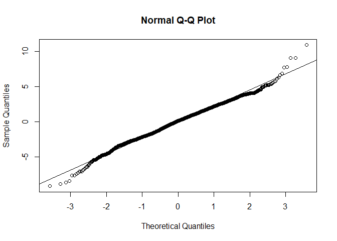
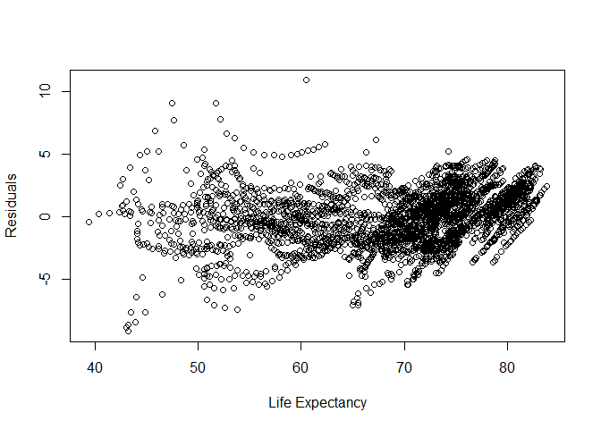
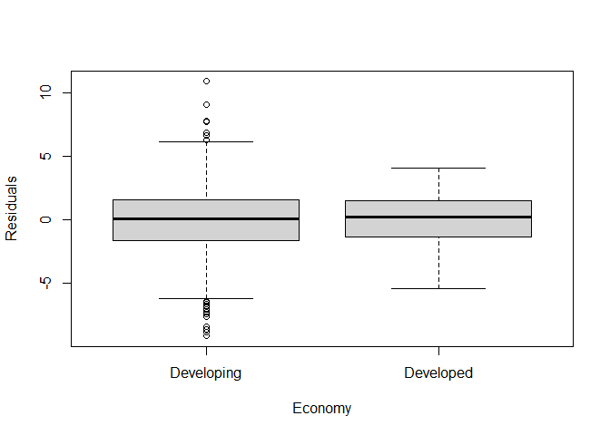
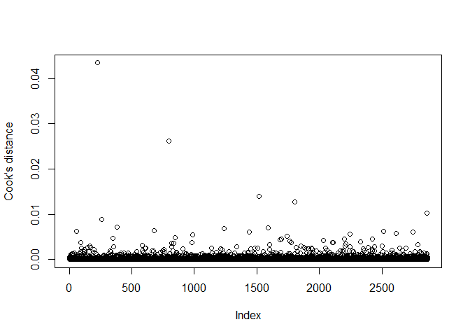
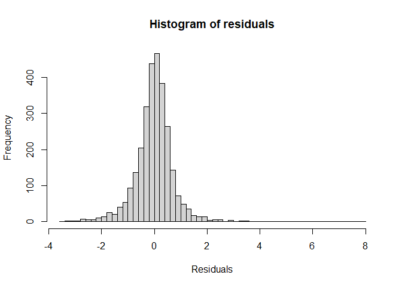
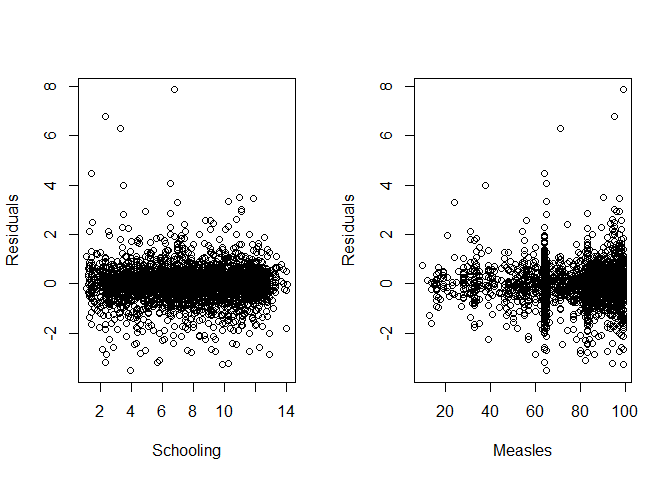
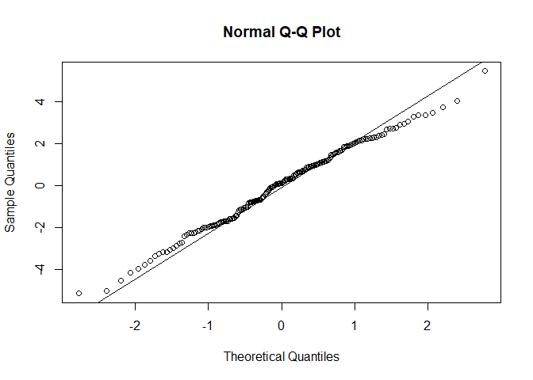
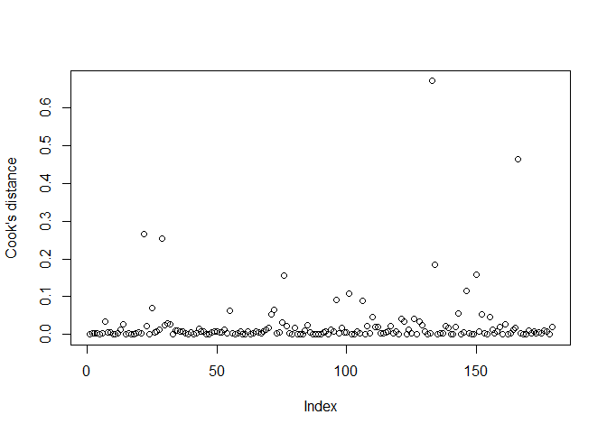

# The First Circle: Linear Regression, Part Two

<br/>
Jiří Fejlek

2025-05-19
<br/>

<br/> In Part Two of this demonstration of using linear regression, we
seek to model **Life expectancy** using data that contains health,
immunization, and economic and demographic information about 179
countries from 2000 to 2015.

In this demonstration, we will start with a simple linear regression
model, but we will eventually move to models for panel data in the
latter half of this text. Thus, we will give a brief introduction to
random and fixed effects models for panel data and even to a
lesser-known *correlated random effects* models. <br/>

## Specification of predictors

<br/> Let us start the modelling with our choice of the predictors. We
will not consider **Adult_mortality** as our predictor, because
**Adult_mortality** is tightly connected to **Life_expectancy**, but
does not give much additional insight into why life expectancy is lower,
what the difference is between these countries, other than that people
tend to die before reaching senior age. To illustrate this connection,
we can see that a simple linear regression **Adult_mortality** on
**Life_expectancy** <br/>

``` r
summary(lm(formula = Life_expectancy ~ Adult_mortality, data = life_expectancy))
```

    ## 
    ## Call:
    ## lm(formula = Life_expectancy ~ Adult_mortality, data = life_expectancy)
    ## 
    ## Residuals:
    ##      Min       1Q   Median       3Q      Max 
    ## -11.2512  -2.1188   0.5152   2.0643  15.4313 
    ## 
    ## Coefficients:
    ##                   Estimate Std. Error t value Pr(>|t|)    
    ## (Intercept)     83.7324030  0.1117193   749.5   <2e-16 ***
    ## Adult_mortality -0.0773794  0.0004988  -155.1   <2e-16 ***
    ## ---
    ## Signif. codes:  0 '***' 0.001 '**' 0.01 '*' 0.05 '.' 0.1 ' ' 1
    ## 
    ## Residual standard error: 3.067 on 2862 degrees of freedom
    ## Multiple R-squared:  0.8937, Adjusted R-squared:  0.8937 
    ## F-statistic: 2.406e+04 on 1 and 2862 DF,  p-value: < 2.2e-16

<br/> already explains almost 90% of the variability in the data.

Initially, we will also not consider **Country** and **Year** as our
predictors in our model. We are not developing a model for a
*particular* country in a *particular* time. Although, as we will see
later, it is actually quite important to acknowledge that our data are
panel data (i.e., data for some individuals evolving in time).

Such data for a given individual, in our case, for a given country, are
usually significantly correlated. Consequently, it is quite incorrect to
consider a model that sees these data as 2864 *independent*
observations, since it would lead to overly optimistic estimates of
effects (e.g, too narrow confidence intervals). In addition, including
**Country** and **Year** in our model in some way allows us to reduce
the omitted variable bias of our estimates (thus, panel data allows us
to hopefully get more accurate estimates of the predictors’ effects), as
we see later.

Still, we will proceed to use a simple linear regression model as our
starting point (mostly for illustrative purposes and to upheld the title
of this project), and make the necessary corrections in the model later.
Based on the data exploration in Part One, we will use the logarithm
transformation of predictors **Population_mln** and **GDP_per_capita**,
and use the predictor **Inf5_m**, that combines the predictors
**Infant_deaths** and **Under_five_deaths**.

Overall, we get the following predictors <br/>

- **Infant_deaths**
- **Under_five_deaths** - **Infant_deaths**
- **Region**
- **Alcohol_consumption**
- **Hepatitis_B**
- **Measles**
- **BMI**
- **Polio**
- **Diptheria**
- **Incidents_HIV** -
- **log(GDP_per_capita)**
- **log(Population_mln + 1)**
- **Thinness_10-19**
- **Thinness_5-9**
- **Schooling**
- **Economy** - Factor variable with levels **Developed** and
  **Developing** <br/>

We will consider a simple model where all predictors enter linearly. We
will not consider any interaction or nonlinear terms in the model. We do
not have any prior knowledge of which specific interaction/nonlinear
terms should be included in the model, nor we have posed a specific
hypothesis about interactions/nonlinearity. Our dataset is not large
enough to reasonably include even just all simple linear interaction
terms, or for that matter, two cubic spline knots for each numerical
variable to model nonlinear terms. We should remember that this dataset
consists of panel data of effective sample size of as low as 179
(depending on how strongly the observations for each country are
correlated, and these correlations will be strong since such country
characteristics do not change in time that much). The rule of thumb for
a number of predictors in such a case is between ~ 179/10 = 18 and
~179/20 = 9, which nicely corresponds to our total number of predictors
of interest. Thus, to obtain reasonable estimates of interactions and
nonlinearities, we would have to guess which interactions (and/or
nonlinear terms) to include from the data itself, which is not an
advisable approach.

Before we start the modelling, we will do some variable renaming to
shorten the predictor names. <br/>

``` r
library(tibble)
library(dplyr)

## Renaming variables
life_expectancy <- life_expectancy %>% rename(Thin_10_19 = Thinness_ten_nineteen_years) %>% rename(Thin_5_9 = Thinness_five_nine_years) %>% rename(Alcohol = Alcohol_consumption) %>% rename(HIV = Incidents_HIV) %>% rename(Economy = Economy_status ) %>% rename(Adult_m = Adult_mortality ) %>% rename(Pop_log = Population_log) %>% rename(I_deaths = Infant_deaths) %>% rename(U5_deaths = Under_five_deaths_dif)
```

## Simple linear model (and accounting for heteroskedasticity)

<br/> As we discussed earlier, we first fit a simple linear model
ignoring the panel nature of our data. <br/>

``` r
## Simple linear model
linear_model <- lm(Life_expectancy ~ Economy + Region + Alcohol + Hepatitis_B + Measles + BMI + Polio + Diphtheria + HIV + GDP_log + Pop_log + Thin_10_19 + Thin_5_9 + Schooling + I_deaths + U5_deaths, data = life_expectancy)
summary(linear_model)
```

    ## 
    ## Call:
    ## lm(formula = Life_expectancy ~ Economy + Region + Alcohol + Hepatitis_B + 
    ##     Measles + BMI + Polio + Diphtheria + HIV + GDP_log + Pop_log + 
    ##     Thin_10_19 + Thin_5_9 + Schooling + I_deaths + U5_deaths, 
    ##     data = life_expectancy)
    ## 
    ## Residuals:
    ##     Min      1Q  Median      3Q     Max 
    ## -9.1431 -1.5660  0.1179  1.5023 10.8650 
    ## 
    ## Coefficients:
    ##                   Estimate Std. Error t value Pr(>|t|)    
    ## (Intercept)      62.092457   1.161338  53.466  < 2e-16 ***
    ## EconomyDeveloped  4.496615   0.259204  17.348  < 2e-16 ***
    ## RegionAsia        1.385362   0.180943   7.656 2.60e-14 ***
    ## RegionCAm         2.428107   0.196767  12.340  < 2e-16 ***
    ## RegionEU         -0.569325   0.292840  -1.944   0.0520 .  
    ## RegionMidE        0.239836   0.226081   1.061   0.2889    
    ## RegionNAm         0.347921   0.399422   0.871   0.3838    
    ## RegionOce        -0.626235   0.243685  -2.570   0.0102 *  
    ## RegionNotEU       1.234358   0.233674   5.282 1.37e-07 ***
    ## RegionSAm         2.123527   0.223668   9.494  < 2e-16 ***
    ## Alcohol          -0.223374   0.018848 -11.851  < 2e-16 ***
    ## Hepatitis_B      -0.003135   0.004251  -0.737   0.4609    
    ## Measles           0.004727   0.002875   1.644   0.1003    
    ## BMI               0.054956   0.037135   1.480   0.1390    
    ## Polio             0.019078   0.009556   1.996   0.0460 *  
    ## Diphtheria       -0.014641   0.009627  -1.521   0.1284    
    ## HIV              -0.924405   0.021225 -43.553  < 2e-16 ***
    ## GDP_log           1.455482   0.065401  22.255  < 2e-16 ***
    ## Pop_log           0.185615   0.034947   5.311 1.17e-07 ***
    ## Thin_10_19       -0.018971   0.027670  -0.686   0.4930    
    ## Thin_5_9          0.020743   0.027540   0.753   0.4514    
    ## Schooling        -0.171926   0.030119  -5.708 1.26e-08 ***
    ## I_deaths         -0.165518   0.005168 -32.029  < 2e-16 ***
    ## U5_deaths        -0.084030   0.006441 -13.047  < 2e-16 ***
    ## ---
    ## Signif. codes:  0 '***' 0.001 '**' 0.01 '*' 0.05 '.' 0.1 ' ' 1
    ## 
    ## Residual standard error: 2.199 on 2840 degrees of freedom
    ## Multiple R-squared:  0.9458, Adjusted R-squared:  0.9453 
    ## F-statistic:  2154 on 23 and 2840 DF,  p-value: < 2.2e-16

<br/> Many predictors seem highly significant (though again, this
significance is inflated since we did not consider the correlation
between the observations for the same country). Let us check the
distributional assumptions of linear regression by plotting the
residuals of the fit. We will check a histogram and QQ-plot of residuals
and plots of residuals vs. fitted values and residuals vs. predictors.
<br/>



<br/> We notice that residuals have an almost normal distribution
(although the distribution has slightly heavier tails than the normal
distribution). We also observe noticeable heteroscedasticity in
residuals of developed vs. developing countries. Thus, it is advisable
to recompute the standard errors to account for heteroskedasticity. One
method is to use heteroskedasticity-consistent standard errors
(Eicker–Huber–White standard errors) <br/>

``` r
library(lmtest)
library(sandwich)
coeftest(linear_model, vcov = vcovHC(linear_model, type = c("HC0")))
```

    ## 
    ## t test of coefficients:
    ## 
    ##                    Estimate Std. Error  t value  Pr(>|t|)    
    ## (Intercept)      62.0924573  1.2960432  47.9093 < 2.2e-16 ***
    ## EconomyDeveloped  4.4966148  0.2426938  18.5279 < 2.2e-16 ***
    ## RegionAsia        1.3853616  0.2030726   6.8220 1.093e-11 ***
    ## RegionCAm         2.4281069  0.2239311  10.8431 < 2.2e-16 ***
    ## RegionEU         -0.5693246  0.2825910  -2.0147   0.04403 *  
    ## RegionMidE        0.2398358  0.2247795   1.0670   0.28607    
    ## RegionNAm         0.3479211  0.3957534   0.8791   0.37940    
    ## RegionOce        -0.6262348  0.2940496  -2.1297   0.03328 *  
    ## RegionNotEU       1.2343579  0.2623758   4.7045 2.666e-06 ***
    ## RegionSAm         2.1235274  0.2165425   9.8065 < 2.2e-16 ***
    ## Alcohol          -0.2233743  0.0195059 -11.4517 < 2.2e-16 ***
    ## Hepatitis_B      -0.0031347  0.0038085  -0.8231   0.41053    
    ## Measles           0.0047271  0.0027785   1.7013   0.08899 .  
    ## BMI               0.0549557  0.0393171   1.3978   0.16230    
    ## Polio             0.0190780  0.0085431   2.2331   0.02562 *  
    ## Diphtheria       -0.0146411  0.0088272  -1.6586   0.09730 .  
    ## HIV              -0.9244045  0.0345052 -26.7903 < 2.2e-16 ***
    ## GDP_log           1.4554819  0.0666200  21.8475 < 2.2e-16 ***
    ## Pop_log           0.1856147  0.0349724   5.3075 1.197e-07 ***
    ## Thin_10_19       -0.0189712  0.0275828  -0.6878   0.49164    
    ## Thin_5_9          0.0207428  0.0277391   0.7478   0.45465    
    ## Schooling        -0.1719262  0.0293495  -5.8579 5.226e-09 ***
    ## I_deaths         -0.1655184  0.0064301 -25.7412 < 2.2e-16 ***
    ## U5_deaths        -0.0840303  0.0091377  -9.1960 < 2.2e-16 ***
    ## ---
    ## Signif. codes:  0 '***' 0.001 '**' 0.01 '*' 0.05 '.' 0.1 ' ' 1

<br/> We can obtain similar heteroskedasticity-consistent estimates
using a simple nonparametric bootstrap that resamples with repetitions
the whole dataset, a so-called pairs bootstrap (*A. C. Cameron and P. K.
Trivedi. Microeconometrics: methods and applications. Cambridge
university press, 2005.*).

We should note here that we will compute a simple percentile-based
confidence intervals, which works well when the distribution is
symmetrical and centered on the observed statistic, i.e, unbiased (*T.
C. Hesterberg. What teachers should know about the bootstrap: Resampling
in the undergraduate statistics curriculum. The american statistician
69.4 (2015): 371-386.*). <br/>

``` r
set.seed(123) # for reproducibility
nb <- 2500
coefmat <- matrix(NA,nb,24)
for(i in 1:nb){
life_expectancy_new <-  life_expectancy[sample(nrow(life_expectancy) , rep=TRUE),]
model_new <- lm(Life_expectancy ~ Economy + Region + Alcohol + Hepatitis_B + Measles + BMI + Polio + Diphtheria + HIV + GDP_log + Pop_log + Thin_10_19 + Thin_5_9 + Schooling + I_deaths + U5_deaths, data = life_expectancy_new)
coefmat[i,] <- coef(model_new)
}
colnames(coefmat) <- rownames(as.data.frame(coef(linear_model)))
coefmat <- data.frame(coefmat)

## Original (non-robust) CI
confint(linear_model)
```

    ##                          2.5 %       97.5 %
    ## (Intercept)      59.8153059823 64.369608569
    ## EconomyDeveloped  3.9883674398  5.004862173
    ## RegionAsia        1.0305683614  1.740154898
    ## RegionCAm         2.0422869316  2.813926782
    ## RegionEU         -1.1435250057  0.004875842
    ## RegionMidE       -0.2034645286  0.683136141
    ## RegionNAm        -0.4352659764  1.131108258
    ## RegionOce        -1.1040532156 -0.148416478
    ## RegionNotEU       0.7761699432  1.692545874
    ## RegionSAm         1.6849584524  2.562096385
    ## Alcohol          -0.2603318498 -0.186416794
    ## Hepatitis_B      -0.0114693128  0.005199941
    ## Measles          -0.0009104319  0.010364566
    ## BMI              -0.0178580537  0.127769546
    ## Polio             0.0003409056  0.037815059
    ## Diphtheria       -0.0335184889  0.004236333
    ## HIV              -0.9660220188 -0.882787020
    ## GDP_log           1.3272432602  1.583720539
    ## Pop_log           0.1170905303  0.254138817
    ## Thin_10_19       -0.0732264932  0.035284087
    ## Thin_5_9         -0.0332580504  0.074743741
    ## Schooling        -0.2309841017 -0.112868348
    ## I_deaths         -0.1756513223 -0.155385498
    ## U5_deaths        -0.0966593592 -0.071401244

``` r
## Bootstrap (robust) CI
t(apply(coefmat,2,function(x) quantile(x,c(0.025,0.5,0.975))))
```

    ##                           2.5%          50%        97.5%
    ## X.Intercept.     59.5910514354 62.207687938 64.685494370
    ## EconomyDeveloped  4.0058921008  4.492592205  4.972060521
    ## RegionAsia        0.9831215435  1.366136848  1.770529494
    ## RegionCAm         1.9858277112  2.409300074  2.871508042
    ## RegionEU         -1.1440843440 -0.585506546 -0.002189248
    ## RegionMidE       -0.2247775903  0.222855914  0.666393818
    ## RegionNAm        -0.4772939351  0.340496153  1.109999870
    ## RegionOce        -1.2383765526 -0.643859640 -0.069269669
    ## RegionNotEU       0.7115550609  1.215639859  1.737020783
    ## RegionSAm         1.6865024024  2.101965528  2.539624986
    ## Alcohol          -0.2614992328 -0.223082042 -0.182303083
    ## Hepatitis_B      -0.0109629416 -0.003114844  0.004969283
    ## Measles          -0.0006316573  0.004789285  0.009975551
    ## BMI              -0.0224472362  0.053002017  0.130432211
    ## Polio             0.0016693979  0.019063935  0.035474009
    ## Diphtheria       -0.0321797392 -0.014684563  0.002706503
    ## HIV              -0.9977931690 -0.925757274 -0.861779541
    ## GDP_log           1.3298343793  1.453431883  1.585517931
    ## Pop_log           0.1187909984  0.185863281  0.257551359
    ## Thin_10_19       -0.0741075601 -0.018995721  0.035149180
    ## Thin_5_9         -0.0343114294  0.019760843  0.078274113
    ## Schooling        -0.2323474081 -0.171168597 -0.116312072
    ## I_deaths         -0.1782379585 -0.165717831 -0.153347580
    ## U5_deaths        -0.1016852179 -0.084468975 -0.067601917

<br/> We see that the statistical significance/confidence intervals did
not change much compared to the ones provided by the standard non-robust
estimates. Lastly, we can check for influential observations (and
potential outliers). A common metric to detect overly influential
observations is the Cook’s distance. <br/>



A simple rule of thumb is that an observation could be overtly
influential if its Cook’s distance is greater than one. That is
definitely not the case for our model. Still, some observations have a
significantly greater Cook’s distance than others. Let us compare the
regression of coefficients with observations deleted based on the Cook’s
distance.

``` r
linear_model_red1 <- lm(Life_expectancy ~ Economy + Region + Alcohol + Hepatitis_B + Measles + BMI + Polio + Diphtheria + HIV + GDP_log + Pop_log + Thin_10_19 + Thin_5_9 + Schooling + I_deaths + U5_deaths, data = life_expectancy[cooks.distance(linear_model) < 0.02,])

linear_model_red2 <- lm(Life_expectancy ~ Economy + Region + Alcohol + Hepatitis_B + Measles + BMI + Polio + Diphtheria + HIV + GDP_log + Pop_log + Thin_10_19 + Thin_5_9 + Schooling + I_deaths + U5_deaths, data = life_expectancy[cooks.distance(linear_model) < 0.01,])

linear_model_red3 <- lm(Life_expectancy ~ Economy + Region + Alcohol + Hepatitis_B + Measles + BMI + Polio + Diphtheria + HIV + GDP_log + Pop_log + Thin_10_19 + Thin_5_9 + Schooling + I_deaths + U5_deaths, data = life_expectancy[cooks.distance(linear_model) < 0.005,])

coeff_delete <- cbind(coefficients(linear_model),coefficients(linear_model_red1),coefficients(linear_model_red2),coefficients(linear_model_red3))
colnames(coeff_delete) <- c('All','CD<0.02','CD<0.01','CD<0.005')
round(coeff_delete,4)
```

    ##                      All CD<0.02 CD<0.01 CD<0.005
    ## (Intercept)      62.0925 62.6604 62.8038  63.7792
    ## EconomyDeveloped  4.4966  4.4971  4.4660   4.4165
    ## RegionAsia        1.3854  1.2805  1.2072   1.1074
    ## RegionCAm         2.4281  2.2968  2.2361   2.1808
    ## RegionEU         -0.5693 -0.6778 -0.7402  -0.8119
    ## RegionMidE        0.2398  0.1735  0.1285   0.0702
    ## RegionNAm         0.3479  0.2877  0.2205   0.1219
    ## RegionOce        -0.6262 -0.7297 -0.7875  -0.8414
    ## RegionNotEU       1.2344  1.1251  1.0509   0.9494
    ## RegionSAm         2.1235  2.0178  1.9436   1.8686
    ## Alcohol          -0.2234 -0.2202 -0.2179  -0.2218
    ## Hepatitis_B      -0.0031 -0.0022 -0.0023  -0.0044
    ## Measles           0.0047  0.0038  0.0035   0.0036
    ## BMI               0.0550  0.0450  0.0386   0.0242
    ## Polio             0.0191  0.0184  0.0181   0.0147
    ## Diphtheria       -0.0146 -0.0159 -0.0155  -0.0126
    ## HIV              -0.9244 -0.9372 -0.9590  -0.9607
    ## GDP_log           1.4555  1.4477  1.4532   1.4215
    ## Pop_log           0.1856  0.1814  0.1823   0.1868
    ## Thin_10_19       -0.0190 -0.0180 -0.0186  -0.0374
    ## Thin_5_9          0.0207  0.0189  0.0176   0.0329
    ## Schooling        -0.1719 -0.1688 -0.1633  -0.1523
    ## I_deaths         -0.1655 -0.1647 -0.1629  -0.1682
    ## U5_deaths        -0.0840 -0.0895 -0.0928  -0.0906

<br/> We see that no values of the parameters dramatically changed, and
all values stayed within the confidence intervals provided by the
bootstrap. <br/>

## Accounting for autocorrelation

<br/> All of the aforementioned approaches, including
heteroskedasticity-consistent standard errors and pairs bootstrap,
assume that the error terms are independent. However, our data set
consists of longitudinal data for 179 countries, and hence, these
observations might be significantly correlated. We can check our
suspicion by plotting the residuals of our model for a given country
against **Year**. <br/>


<br/> These residuals are clearly strongly correlated. Hence, instead of
heteroskedasticity-consistent standard errors, we should use
cluster-robust standard errors. Our clusters consist of observations
from the same country, which we expect to be correlated. <br/>

``` r
library(clubSandwich)
options(width = 1000)
coef_test(linear_model, vcov = "CR2", cluster = life_expectancy$Country)
```

    ## Alternative hypothesis: two-sided 
    ##             Coef. Estimate      SE Null value t-stat d.f. (Satt) p-val (Satt) Sig.
    ##       (Intercept) 62.09246 4.45098          0 13.950       60.02      < 0.001  ***
    ##  EconomyDeveloped  4.49661 0.94532          0  4.757       22.90      < 0.001  ***
    ##        RegionAsia  1.38536 0.71742          0  1.931       52.49      0.05889    .
    ##         RegionCAm  2.42811 0.72639          0  3.343       42.85      0.00173   **
    ##          RegionEU -0.56932 1.03117          0 -0.552       32.26      0.58467     
    ##        RegionMidE  0.23984 0.83544          0  0.287       33.35      0.77583     
    ##         RegionNAm  0.34792 1.78040          0  0.195        4.37      0.85383     
    ##         RegionOce -0.62623 1.16061          0 -0.540       22.68      0.59475     
    ##       RegionNotEU  1.23436 0.95954          0  1.286       51.60      0.20404     
    ##         RegionSAm  2.12353 0.75522          0  2.812       31.69      0.00838   **
    ##           Alcohol -0.22337 0.06797          0 -3.286       54.26      0.00178   **
    ##       Hepatitis_B -0.00313 0.00985          0 -0.318       26.91      0.75264     
    ##           Measles  0.00473 0.00975          0  0.485       41.83      0.63022     
    ##               BMI  0.05496 0.15289          0  0.359       35.00      0.72142     
    ##             Polio  0.01908 0.02245          0  0.850       26.95      0.40301     
    ##        Diphtheria -0.01464 0.02184          0 -0.670       31.98      0.50747     
    ##               HIV -0.92440 0.10886          0 -8.492        6.50      < 0.001  ***
    ##           GDP_log  1.45548 0.24052          0  6.051       50.09      < 0.001  ***
    ##           Pop_log  0.18561 0.13633          0  1.361       51.93      0.17924     
    ##        Thin_10_19 -0.01897 0.02763          0 -0.687        6.39      0.51651     
    ##          Thin_5_9  0.02074 0.03146          0  0.659        6.86      0.53116     
    ##         Schooling -0.17193 0.10633          0 -1.617       65.92      0.11067     
    ##          I_deaths -0.16552 0.02164          0 -7.650       29.61      < 0.001  ***
    ##         U5_deaths -0.08403 0.02623          0 -3.204       12.75      0.00707   **

<br/> We observe that the cluster-robust standard errors are
significantly larger and that many effects are no longer significant.
<br/>

## Pooled, fixed effects, and random effects panel data models

<br/> This linear model we constructed is in the context of panel data
models called *pooled* because it stacks the data for all individuals
and time instants together. This model is consistent provided there is
no unobserved heterogeneity in the data that is *correlated* with the
predictors in the model (i.e., there is no omitted variable bias). We
can alleviate some of this potential bias by considering so-called
*fixed effects*.

We first consider time fixed effects, i.e., effects corresponding to
unobservables that change in time but are independent of individual
countries. From a technical standpoint, we can simply include factor
variables corresponding to the variable **Year** to the model. Again, we
compute cluster-robust standard errors for the coefficients. <br/>

``` r
linear_model_year <- lm(Life_expectancy ~ Economy + Region + Alcohol + Hepatitis_B + Measles + BMI + Polio + Diphtheria + HIV + GDP_log + Pop_log + Thin_10_19 + Thin_5_9 + Schooling + I_deaths + U5_deaths + factor(Year), data = life_expectancy)
coef_test(linear_model_year, vcov = "CR2", cluster = life_expectancy$Country)
```

    ## Alternative hypothesis: two-sided 
    ##             Coef. Estimate      SE Null value  t-stat d.f. (Satt) p-val (Satt) Sig.
    ##       (Intercept) 62.17615 4.40011          0 14.1306       61.37      < 0.001  ***
    ##  EconomyDeveloped  4.50160 0.94276          0  4.7749       22.90      < 0.001  ***
    ##        RegionAsia  1.61997 0.74344          0  2.1790       49.51      0.03412    *
    ##         RegionCAm  2.67721 0.76782          0  3.4867       40.74      0.00119   **
    ##          RegionEU -0.28631 1.05826          0 -0.2705       32.26      0.78846     
    ##        RegionMidE  0.57726 0.88795          0  0.6501       31.29      0.52037     
    ##         RegionNAm  0.69036 1.76594          0  0.3909        4.48      0.71374     
    ##         RegionOce -0.33084 1.16969          0 -0.2828       22.01      0.77994     
    ##       RegionNotEU  1.56941 0.99292          0  1.5806       51.15      0.12014     
    ##         RegionSAm  2.39667 0.79856          0  3.0012       31.75      0.00520   **
    ##           Alcohol -0.21591 0.06764          0 -3.1921       54.32      0.00235   **
    ##       Hepatitis_B -0.00605 0.01009          0 -0.5998       27.13      0.55360     
    ##           Measles  0.00457 0.00987          0  0.4632       41.83      0.64561     
    ##               BMI  0.02323 0.15065          0  0.1542       33.15      0.87840     
    ##             Polio  0.02317 0.02273          0  1.0194       27.00      0.31704     
    ##        Diphtheria -0.01418 0.02211          0 -0.6413       32.05      0.52588     
    ##               HIV -0.90960 0.10450          0 -8.7042        6.46      < 0.001  ***
    ##           GDP_log  1.49510 0.24106          0  6.2022       49.45      < 0.001  ***
    ##           Pop_log  0.16561 0.13789          0  1.2011       51.39      0.23523     
    ##        Thin_10_19 -0.02292 0.02679          0 -0.8556        6.40      0.42309     
    ##          Thin_5_9  0.01849 0.03166          0  0.5838        6.84      0.57807     
    ##         Schooling -0.19904 0.10882          0 -1.8291       64.05      0.07204    .
    ##          I_deaths -0.16248 0.02166          0 -7.5004       29.46      < 0.001  ***
    ##         U5_deaths -0.08165 0.02607          0 -3.1315       12.82      0.00807   **
    ##  factor(Year)2001 -0.07014 0.04130          0 -1.6984      178.00      0.09118    .
    ##  factor(Year)2002 -0.19474 0.07610          0 -2.5590      177.97      0.01133    *
    ##  factor(Year)2003 -0.25808 0.10106          0 -2.5537      177.98      0.01150    *
    ##  factor(Year)2004 -0.20032 0.12706          0 -1.5766      177.96      0.11666     
    ##  factor(Year)2005 -0.23497 0.14823          0 -1.5852      177.90      0.11470     
    ##  factor(Year)2006 -0.19660 0.16420          0 -1.1973      177.84      0.23278     
    ##  factor(Year)2007 -0.12950 0.17551          0 -0.7378      177.75      0.46158     
    ##  factor(Year)2008 -0.00437 0.18326          0 -0.0239      177.72      0.98099     
    ##  factor(Year)2009  0.12445 0.19769          0  0.6295      177.59      0.52982     
    ##  factor(Year)2010  0.30526 0.21105          0  1.4464      177.47      0.14984     
    ##  factor(Year)2011  0.39587 0.21900          0  1.8076      177.31      0.07236    .
    ##  factor(Year)2012  0.52419 0.22348          0  2.3456      177.15      0.02010    *
    ##  factor(Year)2013  0.67778 0.23481          0  2.8865      176.93      0.00438   **
    ##  factor(Year)2014  0.81838 0.24571          0  3.3307      176.75      0.00105   **
    ##  factor(Year)2015  0.85333 0.25046          0  3.4070      176.53      < 0.001  ***

<br/> Time fixed effects appear to be significant. We can test it
formally by a robust Wald test
(<https://cran.r-project.org/web/packages/clubSandwich/vignettes/panel-data-CRVE.html>).
<br/>

``` r
Wald_test(linear_model_year, constraints = constrain_zero(c("factor(Year)2001","factor(Year)2002","factor(Year)2003","factor(Year)2004","factor(Year)2005","factor(Year)2006","factor(Year)2007","factor(Year)2008","factor(Year)2009","factor(Year)2010","factor(Year)2011","factor(Year)2012","factor(Year)2013","factor(Year)2014","factor(Year)2015")), vcov = "CR2", cluster = life_expectancy$Country)
```

    ##  test Fstat df_num df_denom  p_val sig
    ##   HTZ   3.9     15      164 <0.001 ***

<br/> The estimates of main effects for the pooled model and the time
fixed effects model are quite similar. However, we observe that the
pooled model seems to slightly overestimate the life expectancy for
earlier years and underestimate the life expectancy for the latter
years. In the plot, blue: predicted mean life expectancy for linear
model per year and red: predicted mean life expectancy for time fixed
effect model per year (i.e, observed mean **Life_expectancy** per year
due to how linear regression fits the data). <br/>

``` r
par(mfrow = c(1, 1))

pred_lin_mean <- tapply(predict(linear_model), life_expectancy$Year, mean)
pred_lin_year_mean <- tapply(predict(linear_model_year), life_expectancy$Year, mean)
years <- seq(2000,2015,1)

plot(years, pred_lin_year_mean, type = "n", xlab ='Year', ylab = 'Mean life expectancy')
lines(years, pred_lin_year_mean, type = "l", col = "red")
lines(years, pred_lin_mean, type = "l", col = "blue")
```


<br/> Thus, including the time-fixed effects in the model seems
advisable.

The second type of effects that could be considered in the model are
effects corresponding to individual countries. These effects model
unobservables that are individual for each country but constant in time.
Again, from a technical standpoint, individual fixed effects can be
simply modeled as factor variables corresponding to the variable
**Country**.

There is also a third major model used for panel data, a *random
effects* model. Random effects model individual effects as normal random
variables with some constant mean and variance (in our case, a constant
for each country and year). In other words, they are random intercepts
that shift the regression hyperplane a bit up or down for each
individual country. Now, the key assumption of the random effects model
is that these individual effects are *not* correlated with other
covariates, i.e., the random effects model does not help with accounting
for unobserved heterogeneity that is correlated with the predictors in
the model. Still, the random effects model is worth talking about due to
its efficiency.

The pooled model is an ordinary linear regression model; thus, to be
efficient, the errors need to be independent, which is almost never the
case for panel data. The random effects model, by introducing random
effects, inherently creates a correlation structure between the
observations for the same individual (in our case, for the same
country). This structure is equicorrelated, i.e., the correlation of the
composite error (random effect + error) between two distinct
observations for the same individual is constant. This may not be as
realistic for a long time series (we expect the correlation between
observations to reduce over time). However, it is still more realistic
than the assumption of the pooled model that this correlation is always
zero. So overall, the random effects model should provide more accurate
estimates than the pooled model provided that the exogeneity assumption
(individual effects are uncorrelated with the rest of the predictors)
holds (see, e.g., *J. M. Wooldridge. Econometric analysis of cross
section and panel data* or *A. C. Cameron and P. K. Trivedi.
Microeconometrics: methods and applications. Cambridge university press,
2005.*) for a much more detailed explanation about pooled, fixed
effects, and random effects models). <br/>

``` r
library(plm)

# individual fixed effects + time fixed effects 
fixed_effect_model_plm <- plm(Life_expectancy ~ Economy + Region + Alcohol + Hepatitis_B + Measles + BMI + Polio + Diphtheria + HIV + GDP_log + Pop_log + Thin_10_19 + Thin_5_9 + Schooling + I_deaths + U5_deaths + factor(Year), data = life_expectancy,index = c("Country", "Year"),  model = 'within', effect = 'individual')
summary(fixed_effect_model_plm)
```

    ## Oneway (individual) effect Within Model
    ## 
    ## Call:
    ## plm(formula = Life_expectancy ~ Economy + Region + Alcohol + 
    ##     Hepatitis_B + Measles + BMI + Polio + Diphtheria + HIV + 
    ##     GDP_log + Pop_log + Thin_10_19 + Thin_5_9 + Schooling + I_deaths + 
    ##     U5_deaths + factor(Year), data = life_expectancy, effect = "individual", 
    ##     model = "within", index = c("Country", "Year"))
    ## 
    ## Balanced Panel: n = 179, T = 16, N = 2864
    ## 
    ## Residuals:
    ##      Min.   1st Qu.    Median   3rd Qu.      Max. 
    ## -3.422931 -0.317733  0.028145  0.295129  8.036925 
    ## 
    ## Coefficients:
    ##                     Estimate  Std. Error  t-value  Pr(>|t|)    
    ## Alcohol          -0.01012086  0.01899492  -0.5328 0.5942033    
    ## Hepatitis_B       0.00129125  0.00214889   0.6009 0.5479645    
    ## Measles          -0.00629200  0.00213639  -2.9452 0.0032559 ** 
    ## BMI              -0.94886111  0.09789058  -9.6931 < 2.2e-16 ***
    ## Polio             0.00120325  0.00427006   0.2818 0.7781290    
    ## Diphtheria        0.01247418  0.00428631   2.9102 0.0036416 ** 
    ## HIV              -0.82352092  0.03008375 -27.3743 < 2.2e-16 ***
    ## GDP_log           0.48962676  0.12741601   3.8427 0.0001245 ***
    ## Pop_log           0.25579561  0.28123968   0.9095 0.3631535    
    ## Thin_10_19        0.00043603  0.01125065   0.0388 0.9690880    
    ## Thin_5_9          0.00039117  0.01111433   0.0352 0.9719267    
    ## Schooling        -0.02089668  0.04466199  -0.4679 0.6399051    
    ## I_deaths         -0.10521057  0.00592741 -17.7498 < 2.2e-16 ***
    ## U5_deaths        -0.05070453  0.00610965  -8.2991 < 2.2e-16 ***
    ## factor(Year)2001  0.11562490  0.08066442   1.4334 0.1518594    
    ## factor(Year)2002  0.18178704  0.08258911   2.2011 0.0278146 *  
    ## factor(Year)2003  0.30067142  0.08568090   3.5092 0.0004569 ***
    ## factor(Year)2004  0.53282534  0.09037490   5.8957 4.203e-09 ***
    ## factor(Year)2005  0.65854261  0.09551236   6.8948 6.713e-12 ***
    ## factor(Year)2006  0.88197329  0.10192756   8.6529 < 2.2e-16 ***
    ## factor(Year)2007  1.09709337  0.10846901  10.1143 < 2.2e-16 ***
    ## factor(Year)2008  1.39108402  0.11560850  12.0327 < 2.2e-16 ***
    ## factor(Year)2009  1.67493572  0.12227966  13.6976 < 2.2e-16 ***
    ## factor(Year)2010  1.98920758  0.12921775  15.3942 < 2.2e-16 ***
    ## factor(Year)2011  2.25145619  0.13699708  16.4343 < 2.2e-16 ***
    ## factor(Year)2012  2.50890877  0.14428414  17.3887 < 2.2e-16 ***
    ## factor(Year)2013  2.80272964  0.15211424  18.4252 < 2.2e-16 ***
    ## factor(Year)2014  3.10305771  0.16022109  19.3673 < 2.2e-16 ***
    ## factor(Year)2015  3.28986188  0.16737463  19.6557 < 2.2e-16 ***
    ## ---
    ## Signif. codes:  0 '***' 0.001 '**' 0.01 '*' 0.05 '.' 0.1 ' ' 1
    ## 
    ## Total Sum of Squares:    12342
    ## Residual Sum of Squares: 1520.9
    ## R-Squared:      0.87678
    ## Adj. R-Squared: 0.86717
    ## F-statistic: 651.66 on 29 and 2656 DF, p-value: < 2.22e-16

``` r
# individual random effects + time fixed effects
random_effect_model_plm <- plm(Life_expectancy ~ Economy + Region + Alcohol + Hepatitis_B + Measles + BMI + Polio + Diphtheria + HIV + GDP_log + Pop_log + Thin_10_19 + Thin_5_9 + Schooling + I_deaths + U5_deaths + factor(Year), data = life_expectancy,index = c("Country", "Year"),  model = 'random', effect = 'individual')
summary(random_effect_model_plm)
```

    ## Oneway (individual) effect Random Effect Model 
    ##    (Swamy-Arora's transformation)
    ## 
    ## Call:
    ## plm(formula = Life_expectancy ~ Economy + Region + Alcohol + 
    ##     Hepatitis_B + Measles + BMI + Polio + Diphtheria + HIV + 
    ##     GDP_log + Pop_log + Thin_10_19 + Thin_5_9 + Schooling + I_deaths + 
    ##     U5_deaths + factor(Year), data = life_expectancy, effect = "individual", 
    ##     model = "random", index = c("Country", "Year"))
    ## 
    ## Balanced Panel: n = 179, T = 16, N = 2864
    ## 
    ## Effects:
    ##                  var std.dev share
    ## idiosyncratic 0.5726  0.7567 0.117
    ## individual    4.3290  2.0806 0.883
    ## theta: 0.9094
    ## 
    ## Residuals:
    ##      Min.   1st Qu.    Median   3rd Qu.      Max. 
    ## -3.637574 -0.363769  0.026878  0.366068  7.967350 
    ## 
    ## Coefficients:
    ##                     Estimate  Std. Error  z-value  Pr(>|z|)    
    ## (Intercept)      69.33251002  2.03587602  34.0554 < 2.2e-16 ***
    ## EconomyDeveloped  5.40884877  0.86114395   6.2810 3.364e-10 ***
    ## RegionAsia        3.94638471  0.54829390   7.1976 6.129e-13 ***
    ## RegionCAm         6.37754262  0.64499568   9.8877 < 2.2e-16 ***
    ## RegionEU          2.70508316  0.99332477   2.7233 0.0064641 ** 
    ## RegionMidE        6.25784905  0.73639859   8.4979 < 2.2e-16 ***
    ## RegionNAm         5.62603568  1.45823002   3.8581 0.0001143 ***
    ## RegionOce         3.47760368  0.80937909   4.2966 1.734e-05 ***
    ## RegionNotEU       4.90910058  0.73411955   6.6871 2.277e-11 ***
    ## RegionSAm         6.32619723  0.74533843   8.4877 < 2.2e-16 ***
    ## Alcohol          -0.05145840  0.01882048  -2.7342 0.0062538 ** 
    ## Hepatitis_B       0.00147906  0.00219710   0.6732 0.5008288    
    ## Measles          -0.00481434  0.00216498  -2.2237 0.0261663 *  
    ## BMI              -0.39657423  0.07683228  -5.1616 2.449e-07 ***
    ## Polio             0.00326990  0.00438296   0.7460 0.4556380    
    ## Diphtheria        0.01017319  0.00439740   2.3135 0.0206976 *  
    ## HIV              -0.83198321  0.02873208 -28.9566 < 2.2e-16 ***
    ## GDP_log           0.89736491  0.11038893   8.1291 4.324e-16 ***
    ## Pop_log          -0.04804504  0.11961915  -0.4017 0.6879415    
    ## Thin_10_19       -0.00044815  0.01155871  -0.0388 0.9690725    
    ## Thin_5_9         -0.00089755  0.01141587  -0.0786 0.9373324    
    ## Schooling         0.09088306  0.04078566   2.2283 0.0258599 *  
    ## I_deaths         -0.10603862  0.00567423 -18.6878 < 2.2e-16 ***
    ## U5_deaths        -0.05630481  0.00588971  -9.5599 < 2.2e-16 ***
    ## factor(Year)2001  0.04667847  0.08282368   0.5636 0.5730342    
    ## factor(Year)2002  0.04551917  0.08397134   0.5421 0.5877635    
    ## factor(Year)2003  0.09387602  0.08575021   1.0948 0.2736212    
    ## factor(Year)2004  0.24687997  0.08842912   2.7918 0.0052409 ** 
    ## factor(Year)2005  0.30506063  0.09148528   3.3345 0.0008544 ***
    ## factor(Year)2006  0.45288432  0.09525783   4.7543 1.991e-06 ***
    ## factor(Year)2007  0.60055052  0.09909809   6.0602 1.360e-09 ***
    ## factor(Year)2008  0.82616667  0.10340641   7.9895 1.355e-15 ***
    ## factor(Year)2009  1.05127000  0.10781767   9.7504 < 2.2e-16 ***
    ## factor(Year)2010  1.30609353  0.11211055  11.6500 < 2.2e-16 ***
    ## factor(Year)2011  1.50183833  0.11706284  12.8293 < 2.2e-16 ***
    ## factor(Year)2012  1.70182025  0.12174709  13.9783 < 2.2e-16 ***
    ## factor(Year)2013  1.93475516  0.12689756  15.2466 < 2.2e-16 ***
    ## factor(Year)2014  2.17233197  0.13220055  16.4321 < 2.2e-16 ***
    ## factor(Year)2015  2.29705835  0.13692573  16.7759 < 2.2e-16 ***
    ## ---
    ## Signif. codes:  0 '***' 0.001 '**' 0.01 '*' 0.05 '.' 0.1 ' ' 1
    ## 
    ## Total Sum of Squares:    14318
    ## Residual Sum of Squares: 1717.8
    ## R-Squared:      0.88003
    ## Adj. R-Squared: 0.87841
    ## Chisq: 20722.3 on 38 DF, p-value: < 2.22e-16

<br/> An important point to notice is that by transitioning to the fixed
effects model, predictors that stay constant in time (**Region** and
**Economy status**) are no longer estimable since they become part of
the respective individual fixed effects. However, the fixed effects
model is consistent even when the individual effects are correlated with
other predictors, whereas the random effects model is not. A standard
test that is traditionally used to test the consistency of the random
effects model is the Hausman test. <br/>

``` r
phtest(fixed_effect_model_plm,random_effect_model_plm)
```

    ## 
    ##  Hausman Test
    ## 
    ## data:  Life_expectancy ~ Economy + Region + Alcohol + Hepatitis_B +  ...
    ## chisq = 524.84, df = 29, p-value < 2.2e-16
    ## alternative hypothesis: one model is inconsistent

<br/> The Hausman test has the disadvantage that it assumes standard
errors (which we know is a bit problematic for panel data). Thus, we can
instead perform the following robust Wald test. The main idea is to add
the cluster means of the time-varying predictors to the random effects
model (*J. Antonakis, N. Bastardoz, and M. Rönkkö. “On ignoring the
random effects assumption in multilevel models: Review, critique, and
recommendations.” Organizational Research Methods 24.2 (2021):
443-483.*). <br/>

``` r
life_expectancy_cent <- within(life_expectancy, {
  Alcohol_cent <- tapply(Alcohol, Country, mean)[factor(Country)]
  Hepatitis_B_cent <- tapply(Hepatitis_B, Country, mean)[factor(Country)]
  Measles_cent <- tapply(Measles, Country, mean)[factor(Country)]
  BMI_cent <- tapply(BMI, Country, mean)[factor(Country)]
  Polio_cent <- tapply(Polio, Country, mean)[factor(Country)]
  Diphtheria_cent <- tapply(Diphtheria, Country, mean)[factor(Country)]
  HIV_cent <- tapply(HIV, Country, mean)[factor(Country)]
  GDP_log_cent <- tapply(GDP_log, Country, mean)[factor(Country)]
  Pop_log_cent <- tapply(Pop_log, Country, mean)[factor(Country)]
  Thin_10_19_cent <- tapply(Thin_10_19, Country, mean)[factor(Country)]
  Thin_5_9_cent <- tapply(Thin_5_9, Country, mean)[factor(Country)]
  Schooling_cent <- tapply(Schooling, Country, mean)[factor(Country)]
  I_deaths_cent <- tapply(I_deaths, Country, mean)[factor(Country)]
  U5_deaths_cent <- tapply(U5_deaths, Country, mean)[factor(Country)]
})

corr_random_effect_model_plm <- plm(Life_expectancy ~ Economy + Region + Alcohol + Hepatitis_B + Measles + BMI + Polio + Diphtheria + HIV + GDP_log + Pop_log + Thin_10_19 + Thin_5_9 + Schooling + I_deaths + U5_deaths  + Alcohol_cent + Hepatitis_B_cent + Measles_cent + BMI_cent + Polio_cent + Diphtheria_cent + HIV_cent + GDP_log_cent + Pop_log_cent + Thin_10_19_cent + Thin_5_9_cent + Schooling_cent + I_deaths_cent + U5_deaths_cent + factor(Year), data = life_expectancy_cent,index = c("Country", "Year"),  model = 'random', effect = 'individual')
summary(corr_random_effect_model_plm)
```

    ## Oneway (individual) effect Random Effect Model 
    ##    (Swamy-Arora's transformation)
    ## 
    ## Call:
    ## plm(formula = Life_expectancy ~ Economy + Region + Alcohol + 
    ##     Hepatitis_B + Measles + BMI + Polio + Diphtheria + HIV + 
    ##     GDP_log + Pop_log + Thin_10_19 + Thin_5_9 + Schooling + I_deaths + 
    ##     U5_deaths + Alcohol_cent + Hepatitis_B_cent + Measles_cent + 
    ##     BMI_cent + Polio_cent + Diphtheria_cent + HIV_cent + GDP_log_cent + 
    ##     Pop_log_cent + Thin_10_19_cent + Thin_5_9_cent + Schooling_cent + 
    ##     I_deaths_cent + U5_deaths_cent + factor(Year), data = life_expectancy_cent, 
    ##     effect = "individual", model = "random", index = c("Country", 
    ##         "Year"))
    ## 
    ## Balanced Panel: n = 179, T = 16, N = 2864
    ## 
    ## Effects:
    ##                  var std.dev share
    ## idiosyncratic 0.5726  0.7567 0.117
    ## individual    4.3290  2.0806 0.883
    ## theta: 0.9094
    ## 
    ## Residuals:
    ##      Min.   1st Qu.    Median   3rd Qu.      Max. 
    ## -3.532357 -0.334980  0.018574  0.355363  7.853731 
    ## 
    ## Coefficients:
    ##                     Estimate  Std. Error  z-value  Pr(>|z|)    
    ## (Intercept)      63.75223547  4.99193627  12.7710 < 2.2e-16 ***
    ## EconomyDeveloped  4.73663866  1.00318129   4.7216 2.340e-06 ***
    ## RegionAsia        1.12294489  0.73441487   1.5290 0.1262562    
    ## RegionCAm         2.11100709  0.79365617   2.6599 0.0078175 ** 
    ## RegionEU         -1.02086714  1.16533896  -0.8760 0.3810159    
    ## RegionMidE        0.10852284  0.89413190   0.1214 0.9033962    
    ## RegionNAm        -0.03160276  1.57644422  -0.0200 0.9840060    
    ## RegionOce        -0.94325634  0.97785634  -0.9646 0.3347369    
    ## RegionNotEU       1.00043667  0.94244834   1.0615 0.2884494    
    ## RegionSAm         1.78992782  0.90445676   1.9790 0.0478150 *  
    ## Alcohol          -0.01012086  0.01899492  -0.5328 0.5941588    
    ## Hepatitis_B       0.00129125  0.00214889   0.6009 0.5479132    
    ## Measles          -0.00629200  0.00213639  -2.9452 0.0032278 ** 
    ## BMI              -0.94886111  0.09789058  -9.6931 < 2.2e-16 ***
    ## Polio             0.00120325  0.00427006   0.2818 0.7781071    
    ## Diphtheria        0.01247418  0.00428631   2.9102 0.0036115 ** 
    ## HIV              -0.82352092  0.03008375 -27.3743 < 2.2e-16 ***
    ## GDP_log           0.48962676  0.12741601   3.8427 0.0001217 ***
    ## Pop_log           0.25579561  0.28123968   0.9095 0.3630710    
    ## Thin_10_19        0.00043603  0.01125065   0.0388 0.9690851    
    ## Thin_5_9          0.00039117  0.01111433   0.0352 0.9719241    
    ## Schooling        -0.02089668  0.04466199  -0.4679 0.6398667    
    ## I_deaths         -0.10521057  0.00592741 -17.7498 < 2.2e-16 ***
    ## U5_deaths        -0.05070453  0.00610965  -8.2991 < 2.2e-16 ***
    ## Alcohol_cent     -0.18853329  0.08040328  -2.3448 0.0190350 *  
    ## Hepatitis_B_cent -0.02173382  0.02428098  -0.8951 0.3707356    
    ## Measles_cent      0.00997841  0.01302189   0.7663 0.4435099    
    ## BMI_cent          0.95764771  0.17759694   5.3923 6.958e-08 ***
    ## Polio_cent        0.04390158  0.05853374   0.7500 0.4532416    
    ## Diphtheria_cent  -0.03875755  0.05993504  -0.6467 0.5178525    
    ## HIV_cent         -0.09072754  0.09076054  -0.9996 0.3174865    
    ## GDP_log_cent      0.94869364  0.28949606   3.2771 0.0010490 ** 
    ## Pop_log_cent     -0.09248748  0.31185818  -0.2966 0.7667955    
    ## Thin_10_19_cent  -0.09214970  0.24304961  -0.3791 0.7045843    
    ## Thin_5_9_cent     0.06792261  0.24326454   0.2792 0.7800814    
    ## Schooling_cent   -0.27703804  0.13093976  -2.1158 0.0343646 *  
    ## I_deaths_cent    -0.05985385  0.02259038  -2.6495 0.0080604 ** 
    ## U5_deaths_cent   -0.05958388  0.02908747  -2.0484 0.0405171 *  
    ## factor(Year)2001  0.11562490  0.08066442   1.4334 0.1517417    
    ## factor(Year)2002  0.18178704  0.08258911   2.2011 0.0277288 *  
    ## factor(Year)2003  0.30067142  0.08568090   3.5092 0.0004495 ***
    ## factor(Year)2004  0.53282534  0.09037490   5.8957 3.730e-09 ***
    ## factor(Year)2005  0.65854261  0.09551236   6.8948 5.392e-12 ***
    ## factor(Year)2006  0.88197329  0.10192756   8.6529 < 2.2e-16 ***
    ## factor(Year)2007  1.09709337  0.10846901  10.1143 < 2.2e-16 ***
    ## factor(Year)2008  1.39108402  0.11560850  12.0327 < 2.2e-16 ***
    ## factor(Year)2009  1.67493572  0.12227966  13.6976 < 2.2e-16 ***
    ## factor(Year)2010  1.98920758  0.12921775  15.3942 < 2.2e-16 ***
    ## factor(Year)2011  2.25145619  0.13699708  16.4343 < 2.2e-16 ***
    ## factor(Year)2012  2.50890877  0.14428414  17.3887 < 2.2e-16 ***
    ## factor(Year)2013  2.80272964  0.15211424  18.4252 < 2.2e-16 ***
    ## factor(Year)2014  3.10305771  0.16022109  19.3673 < 2.2e-16 ***
    ## factor(Year)2015  3.28986188  0.16737463  19.6557 < 2.2e-16 ***
    ## ---
    ## Signif. codes:  0 '***' 0.001 '**' 0.01 '*' 0.05 '.' 0.1 ' ' 1
    ## 
    ## Total Sum of Squares:    14318
    ## Residual Sum of Squares: 1609.7
    ## R-Squared:      0.88758
    ## Adj. R-Squared: 0.8855
    ## Chisq: 22193.1 on 52 DF, p-value: < 2.22e-16

<br/> If there is no significant endogeneity in the model, the estimates
of parameters corresponding to cluster means should be zero. We can test
this using a robust Wald test, <br/>

``` r
Wald_test(corr_random_effect_model_plm, constraints = constrain_zero(c("Alcohol_cent","Hepatitis_B_cent","Measles_cent","BMI_cent","Polio_cent","Diphtheria_cent","HIV_cent","GDP_log_cent","Pop_log_cent","Thin_10_19_cent","Thin_5_9_cent","Schooling_cent","I_deaths_cent","U5_deaths_cent")), vcov = "CR2", cluster = life_expectancy$Country)
```

    ##  test Fstat df_num df_denom  p_val sig
    ##   HTZ  3.79     14     31.7 <0.001 ***

<br/> We reject the hypothesis; thus, the random effects model is not
consistent and should not be used.

The model we used to test the consistency of the random effects model is
of particular interest. It is a so-called *correlated random effects*
model (CRE). The CRE model is an extension of the random effects model
that attempts to model the unobserved endogeneity via the cluster mean
predictors. A nice property of the CRE model is that estimates of the
time-varying predictors in the CRE model are identical to the fixed
effects estimates. Hence, the CRE model provides an alternative to the
fixed effects model that keeps the time-invariant predictors in the
model.

The CRE models are quite old (*Y. Mundlak. On the pooling of time series
and cross section data. Econometrica: journal of the Econometric Society
(1978): 69-85.*). However, it seems they got nowhere near as popular as
fixed effects and random effects models. Although there seem to be
recent papers (e.g., *D. McNeish, and K. Kelley. Fixed effects models
versus mixed effects models for clustered data: Reviewing the
approaches, disentangling the differences, and making recommendations.
Psychological Methods 24.1 (2019): 20*, *J. M. Wooldridge. Correlated
random effects models with unbalanced panels. Journal of Econometrics
211.1 (2019): 137-150*, *J. Antonakis, N. Bastardoz, and M. Rönkkö. “On
ignoring the random effects assumption in multilevel models: Review,
critique, and recommendations.” Organizational Research Methods 24.2
(2021): 443-483.* ) that encourage usage of CRE models instead of random
effects models (that are often significantly biased in practice) and
fixed effects models (that make time-invariant predictors inestimable).

<br/> Let us do some model diagnostics. We first check the residuals.
<br/>



<br/> We should also check the random effects. <br/>

``` r
# Random effects
par(mfrow = c(1, 1))
hist(ranef(corr_random_effect_model_plm),main = 'Histogram of random effects',xlab = 'Random effects')
```


``` r
qqnorm(ranef(corr_random_effect_model_plm))
qqline(ranef(corr_random_effect_model_plm))
```



<br/> We see that random effects are approximately normally distributed
as assumed. Residuals are symmetric, although the tails are a bit
heavier than a normal distribution would have. We suspect that there
might be some heteroscedasticity (developing vs. developed countries).
We also might have some overly influential observations/outliers.

Unfortunately, *plm* package does not have support for computing
influence diagnostics. Hence, we will refit our correlated random
effects model using a package *lme4* that can be used to fit general
linear mixed-effects models. We should mention here, that while both
*plm* and *lme4* will fit the same model, their methods are different:
*plm* uses generalized least squares approaches (following an
“econometrics’ tradition”) whereas *lme4* uses restricted maximum
likelihood estimation (REML). Thus, these two functions may not always
produce the same results, see
<https://cran.r-project.org/web/packages/plm/vignettes/A_plmPackage.html>
for a bit more details. However, our model is fairly simple and our data
“nice” enough, and thus, we observe that optimization of restricted
maximum likelihood converged to the same solution as the one provided by
*plm*. <br/>

``` r
library(lme4)

lmer_model <- lmer(Life_expectancy ~ Economy + Region + Alcohol + Hepatitis_B + Measles + BMI + Polio + Diphtheria + HIV + GDP_log + Pop_log + Thin_10_19 + Thin_5_9 + Schooling + I_deaths + U5_deaths  + Alcohol_cent + Hepatitis_B_cent + Measles_cent + BMI_cent + Polio_cent + Diphtheria_cent + HIV_cent + GDP_log_cent + Pop_log_cent + Thin_10_19_cent + Thin_5_9_cent + Schooling_cent + I_deaths_cent + U5_deaths_cent + factor(Year) + (1 | Country), life_expectancy_cent)

sum_lmer <- summary(lmer_model)
sum_plm <- summary(corr_random_effect_model_plm)
cbind(sum_lmer$coefficients,sum_plm$coefficients)
```

    ##                       Estimate  Std. Error      t value      Estimate  Std. Error      z-value      Pr(>|z|)
    ## (Intercept)      63.7522354610 4.991936319  12.77104342 63.7522354677 4.991936267  12.77104355  2.379428e-37
    ## EconomyDeveloped  4.7366386614 1.003181297   4.72161779  4.7366386624 1.003181287   4.72161784  2.339760e-06
    ## RegionAsia        1.1229448929 0.734414882   1.52903341  1.1229448929 0.734414874   1.52903343  1.262562e-01
    ## RegionCAm         2.1110070864 0.793656178   2.65985088  2.1110070865 0.793656170   2.65985091  7.817525e-03
    ## RegionEU         -1.0208671429 1.165338975  -0.87602592 -1.0208671436 1.165338963  -0.87602593  3.810159e-01
    ## RegionMidE        0.1085228418 0.894131914   0.12137229  0.1085228426 0.894131904   0.12137230  9.033962e-01
    ## RegionNAm        -0.0316027603 1.576444237  -0.02004686 -0.0316027601 1.576444220  -0.02004686  9.840060e-01
    ## RegionOce        -0.9432563365 0.977856347  -0.96461647 -0.9432563367 0.977856336  -0.96461648  3.347369e-01
    ## RegionNotEU       1.0004366734 0.942448349   1.06152945  1.0004366729 0.942448339   1.06152946  2.884494e-01
    ## RegionSAm         1.7899278191 0.904456769   1.97900871  1.7899278192 0.904456759   1.97900873  4.781502e-02
    ## Alcohol          -0.0101208598 0.018994924  -0.53281918 -0.0101208598 0.018994924  -0.53281918  5.941588e-01
    ## Hepatitis_B       0.0012912461 0.002148889   0.60089001  0.0012912461 0.002148889   0.60089001  5.479132e-01
    ## Measles          -0.0062920048 0.002136386  -2.94516325 -0.0062920048 0.002136386  -2.94516325  3.227843e-03
    ## BMI              -0.9488611081 0.097890576  -9.69307919 -0.9488611080 0.097890576  -9.69307918  3.226515e-22
    ## Polio             0.0012032460 0.004270060   0.28178671  0.0012032460 0.004270060   0.28178671  7.781071e-01
    ## Diphtheria        0.0124741837 0.004286307   2.91024011  0.0124741837 0.004286307   2.91024011  3.611512e-03
    ## HIV              -0.8235209206 0.030083749 -27.37427858 -0.8235209206 0.030083749 -27.37427857 5.552518e-165
    ## GDP_log           0.4896267597 0.127416012   3.84274120  0.4896267598 0.127416012   3.84274120  1.216677e-04
    ## Pop_log           0.2557956108 0.281239678   0.90952888  0.2557956108 0.281239678   0.90952888  3.630710e-01
    ## Thin_10_19        0.0004360276 0.011250650   0.03875577  0.0004360276 0.011250650   0.03875577  9.690851e-01
    ## Thin_5_9          0.0003911710 0.011114328   0.03519520  0.0003911710 0.011114328   0.03519520  9.719241e-01
    ## Schooling        -0.0208966840 0.044661992  -0.46788517 -0.0208966839 0.044661992  -0.46788517  6.398667e-01
    ## I_deaths         -0.1052105702 0.005927413 -17.74982843 -0.1052105702 0.005927413 -17.74982842  1.728814e-70
    ## U5_deaths        -0.0507045331 0.006109655  -8.29908320 -0.0507045331 0.006109655  -8.29908319  1.049179e-16
    ## Alcohol_cent     -0.1885332887 0.080403280  -2.34484575 -0.1885332886 0.080403279  -2.34484577  1.903495e-02
    ## Hepatitis_B_cent -0.0217338177 0.024280981  -0.89509636 -0.0217338177 0.024280981  -0.89509637  3.707356e-01
    ## Measles_cent      0.0099784072 0.013021886   0.76627973  0.0099784072 0.013021886   0.76627974  4.435099e-01
    ## BMI_cent          0.9576477067 0.177596939   5.39225345  0.9576477065 0.177596938   5.39225349  6.957952e-08
    ## Polio_cent        0.0439015776 0.058533739   0.75002176  0.0439015776 0.058533738   0.75002177  4.532416e-01
    ## Diphtheria_cent  -0.0387575491 0.059935038  -0.64665929 -0.0387575492 0.059935037  -0.64665930  5.178525e-01
    ## HIV_cent         -0.0907275373 0.090760545  -0.99963632 -0.0907275373 0.090760544  -0.99963633  3.174865e-01
    ## GDP_log_cent      0.9486936415 0.289496064   3.27705195  0.9486936406 0.289496062   3.27705197  1.048971e-03
    ## Pop_log_cent     -0.0924874813 0.311858180  -0.29656904 -0.0924874813 0.311858179  -0.29656904  7.667955e-01
    ## Thin_10_19_cent  -0.0921496974 0.243049614  -0.37913945 -0.0921496972 0.243049611  -0.37913946  7.045843e-01
    ## Thin_5_9_cent     0.0679226139 0.243264538   0.27921297  0.0679226138 0.243264535   0.27921297  7.800814e-01
    ## Schooling_cent   -0.2770380377 0.130939765  -2.11576703 -0.2770380377 0.130939764  -2.11576705  3.436462e-02
    ## I_deaths_cent    -0.0598538523 0.022590377  -2.64952874 -0.0598538523 0.022590376  -2.64952877  8.060411e-03
    ## U5_deaths_cent   -0.0595838767 0.029087467  -2.04843814 -0.0595838767 0.029087467  -2.04843816  4.051709e-02
    ## factor(Year)2001  0.1156248999 0.080664420   1.43340645  0.1156248999 0.080664420   1.43340645  1.517417e-01
    ## factor(Year)2002  0.1817870445 0.082589110   2.20110187  0.1817870445 0.082589110   2.20110187  2.772881e-02
    ## factor(Year)2003  0.3006714155 0.085680904   3.50919986  0.3006714155 0.085680904   3.50919985  4.494570e-04
    ## factor(Year)2004  0.5328253370 0.090374897   5.89572279  0.5328253370 0.090374897   5.89572278  3.730448e-09
    ## factor(Year)2005  0.6585426137 0.095512358   6.89484199  0.6585426136 0.095512358   6.89484199  5.392471e-12
    ## factor(Year)2006  0.8819732900 0.101927561   8.65294218  0.8819732899 0.101927561   8.65294217  5.018846e-18
    ## factor(Year)2007  1.0970933695 0.108469006  10.11434891  1.0970933694 0.108469006  10.11434891  4.771791e-24
    ## factor(Year)2008  1.3910840208 0.115608504  12.03271365  1.3910840206 0.115608504  12.03271364  2.391683e-33
    ## factor(Year)2009  1.6749357190 0.122279660  13.69758245  1.6749357189 0.122279660  13.69758244  1.049612e-42
    ## factor(Year)2010  1.9892075833 0.129217745  15.39422915  1.9892075831 0.129217746  15.39422914  1.789443e-53
    ## factor(Year)2011  2.2514561934 0.136997080  16.43433708  2.2514561932 0.136997080  16.43433707  1.086058e-60
    ## factor(Year)2012  2.5089087731 0.144284145  17.38866580  2.5089087729 0.144284145  17.38866579  1.005477e-67
    ## factor(Year)2013  2.8027296353 0.152114238  18.42516307  2.8027296352 0.152114238  18.42516305  8.254161e-76
    ## factor(Year)2014  3.1030577106 0.160221088  19.36734887  3.1030577104 0.160221088  19.36734886  1.455622e-83
    ## factor(Year)2015  3.2898618792 0.167374630  19.65567826  3.2898618790 0.167374630  19.65567825  5.169339e-86

<br/> We then use *lme4* in combination with *HLMdiag* to determine the
influence of individual observations. Since we are dealing with panel
data, we will consider diagnostics based on deleting whole clusters
given by **Country.** We will again use the Cook’s distance and refit
the model based on several Cook’s distance cut-offs based on the Cook’s
distance plot. <br/>

``` r
library(HLMdiag)


# Compute influence by deleting individual Countries
inf <- hlm_influence(lmer_model, level = "Country")

# Plot Cook's distance
plot(inf$cooksd,ylab = "Cook's distance")
```



``` r
# Refit model for deleted observations
lmer_model_red1 <- lmer(Life_expectancy ~ Economy + Region + Alcohol + Hepatitis_B + Measles + BMI + Polio + Diphtheria + HIV + GDP_log + Pop_log + Thin_10_19 + Thin_5_9 + Schooling + I_deaths + U5_deaths  + Alcohol_cent + Hepatitis_B_cent + Measles_cent + BMI_cent + Polio_cent + Diphtheria_cent + HIV_cent + GDP_log_cent + Pop_log_cent + Thin_10_19_cent + Thin_5_9_cent + Schooling_cent + I_deaths_cent + U5_deaths_cent + factor(Year) + (1 | Country), data = life_expectancy_cent[life_expectancy_cent$Country  %in% inf$Country[inf$cooksd < 0.4],])

lmer_model_red2 <- lmer(Life_expectancy ~ Economy + Region + Alcohol + Hepatitis_B + Measles + BMI + Polio + Diphtheria + HIV + GDP_log + Pop_log + Thin_10_19 + Thin_5_9 + Schooling + I_deaths + U5_deaths  + Alcohol_cent + Hepatitis_B_cent + Measles_cent + BMI_cent + Polio_cent + Diphtheria_cent + HIV_cent + GDP_log_cent + Pop_log_cent + Thin_10_19_cent + Thin_5_9_cent + Schooling_cent + I_deaths_cent + U5_deaths_cent + factor(Year) + (1 | Country),data = life_expectancy_cent[life_expectancy_cent$Country  %in% inf$Country[inf$cooksd < 0.2],])

lmer_model_red3 <- lmer(Life_expectancy ~ Economy + Region + Alcohol + Hepatitis_B + Measles + BMI + Polio + Diphtheria + HIV + GDP_log + Pop_log + Thin_10_19 + Thin_5_9 + Schooling + I_deaths + U5_deaths  + Alcohol_cent + Hepatitis_B_cent + Measles_cent + BMI_cent + Polio_cent + Diphtheria_cent + HIV_cent + GDP_log_cent + Pop_log_cent + Thin_10_19_cent + Thin_5_9_cent + Schooling_cent + I_deaths_cent + U5_deaths_cent + factor(Year) + (1 | Country), data = life_expectancy_cent[life_expectancy_cent$Country  %in% inf$Country[inf$cooksd < 0.1],])

lmer_model_red4 <- lmer(Life_expectancy ~ Economy + Region + Alcohol + Hepatitis_B + Measles + BMI + Polio + Diphtheria + HIV + GDP_log + Pop_log + Thin_10_19 + Thin_5_9 + Schooling + I_deaths + U5_deaths  + Alcohol_cent + Hepatitis_B_cent + Measles_cent + BMI_cent + Polio_cent + Diphtheria_cent + HIV_cent + GDP_log_cent + Pop_log_cent + Thin_10_19_cent + Thin_5_9_cent + Schooling_cent + I_deaths_cent + U5_deaths_cent + factor(Year) + (1 | Country), data = life_expectancy_cent[life_expectancy_cent$Country  %in% inf$Country[inf$cooksd < 0.05],])


coeff_delete <- cbind(fixef(lmer_model),fixef(lmer_model_red1),fixef(lmer_model_red2),fixef(lmer_model_red3),fixef(lmer_model_red4))
colnames(coeff_delete) <- c('All','CD<0.4','CD<0.2','CD<0.1','CD<0.05')
round(coeff_delete,4)[1:24,]
```

    ##                      All  CD<0.4  CD<0.2  CD<0.1 CD<0.05
    ## (Intercept)      63.7522 63.9387 65.8910 66.3713 68.0176
    ## EconomyDeveloped  4.7366  4.7546  4.8128  4.4884  4.4676
    ## RegionAsia        1.1229  1.1399  1.0859  0.5312  0.0702
    ## RegionCAm         2.1110  2.2877  2.2593  1.9466  1.6549
    ## RegionEU         -1.0209 -0.9746 -1.1290 -1.3895 -1.7634
    ## RegionMidE        0.1085  0.1365  0.1740 -0.3358 -0.6274
    ## RegionNAm        -0.0316  0.0062 -0.0640 -0.4289 -0.8872
    ## RegionOce        -0.9433 -0.9135 -1.1560 -1.4992 -1.9267
    ## RegionNotEU       1.0004  1.0433  0.8355  0.4379 -0.0412
    ## RegionSAm         1.7899  1.8404  1.7881  1.4779  1.0566
    ## Alcohol          -0.0101 -0.0113 -0.0256 -0.0199 -0.0483
    ## Hepatitis_B       0.0013  0.0033  0.0028  0.0021  0.0003
    ## Measles          -0.0063 -0.0016 -0.0006 -0.0040 -0.0048
    ## BMI              -0.9489 -0.8941 -0.8642 -0.8296 -0.8262
    ## Polio             0.0012  0.0006 -0.0005 -0.0061  0.0014
    ## Diphtheria        0.0125  0.0083  0.0064  0.0110  0.0062
    ## HIV              -0.8235 -0.8425 -0.7766 -0.7606 -0.5861
    ## GDP_log           0.4896  0.5546  0.5266  0.7422  0.4391
    ## Pop_log           0.2558 -0.2865 -0.2118 -0.0068 -0.4322
    ## Thin_10_19        0.0004  0.0028  0.0026 -0.0033 -0.0061
    ## Thin_5_9          0.0004  0.0008  0.0010 -0.0055  0.0099
    ## Schooling        -0.0209 -0.0152 -0.0281  0.0357  0.0038
    ## I_deaths         -0.1052 -0.0851 -0.0895 -0.0655 -0.0861
    ## U5_deaths        -0.0507 -0.0835 -0.0812 -0.1052 -0.0902

<br/> We see that our estimates did not change that much (the
coefficients for predictors that appear somewhat significant did not
change signs), thus, there is no reason to delete some observations from
the data.

The last thing that remains is computing confidence intervals for the
effect estimates. We already discussed that random effects account for
the correlation of observations within the same clusters, thus we could
take the standard errors as is. However, with random effect models,
things are a bit murky, because it is in general non-trivial to
determine correct degrees of freedom, see
<https://bbolker.github.io/mixedmodels-misc/glmmFAQ.html#why-doesnt-lme4-display-denominator-degrees-of-freedomp-values-what-other-options-do-i-have>
that discusses several alternatives to use. Let us explore them.

Let us start with the standard confidence intervals (i.e, standard error
multiplied by *qnorm(0.975)*, thus ignoring degrees of freedom). The
p-values that *plm* provide are based on this approximation. We will use
*confint* on *lmer_model*, because it provides more options. <br/>

``` r
confint(lmer_model,method ='Wald')[3:25,]
```

    ##                         2.5 %       97.5 %
    ## (Intercept)      53.968220063 73.536250859
    ## EconomyDeveloped  2.770439449  6.702837874
    ## RegionAsia       -0.316481826  2.562371612
    ## RegionCAm         0.555469561  3.666544612
    ## RegionEU         -3.304889564  1.263155278
    ## RegionMidE       -1.643943507  1.860989190
    ## RegionNAm        -3.121376688  3.058171168
    ## RegionOce        -2.859819558  0.973306885
    ## RegionNotEU      -0.846728147  2.847601494
    ## RegionSAm         0.017225127  3.562630511
    ## Alcohol          -0.047350226  0.027108507
    ## Hepatitis_B      -0.002920500  0.005502992
    ## Measles          -0.010479244 -0.002104766
    ## BMI              -1.140723112 -0.756999104
    ## Polio            -0.007165917  0.009572409
    ## Diphtheria        0.004073176  0.020875192
    ## HIV              -0.882483985 -0.764557856
    ## GDP_log           0.239895965  0.739357555
    ## Pop_log          -0.295424029  0.807015251
    ## Thin_10_19       -0.021614841  0.022486896
    ## Thin_5_9         -0.021392512  0.022174854
    ## Schooling        -0.108432580  0.066639212
    ## I_deaths         -0.116828087 -0.093593054

<br/> Another alternative is profile likelihood confidence intervals.
<br/>

``` r
confint(lmer_model,method ='profile')[3:25,]
```

    ##                         2.5 %       97.5 %
    ## (Intercept)      54.598478364 72.905992608
    ## EconomyDeveloped  2.897134549  6.576142783
    ## RegionAsia       -0.223730130  2.469619921
    ## RegionCAm         0.655703037  3.566311142
    ## RegionEU         -3.157715033  1.115980754
    ## RegionMidE       -1.531020615  1.748066307
    ## RegionNAm        -2.922282307  2.859076798
    ## RegionOce        -2.736322831  0.849810165
    ## RegionNotEU      -0.727703214  2.728576567
    ## RegionSAm         0.131451978  3.448403667
    ## Alcohol          -0.047161875  0.026920156
    ## Hepatitis_B      -0.002899191  0.005481684
    ## Measles          -0.010458060 -0.002125950
    ## BMI              -1.139752443 -0.757969773
    ## Polio            -0.007123576  0.009530068
    ## Diphtheria        0.004115678  0.020832689
    ## HIV              -0.882185678 -0.764856163
    ## GDP_log           0.241159404  0.738094115
    ## Pop_log          -0.292635296  0.804226518
    ## Thin_10_19       -0.021503281  0.022375336
    ## Thin_5_9         -0.021282304  0.022064646
    ## Schooling        -0.107989718  0.066196350
    ## I_deaths         -0.116769312 -0.093651829

<br/> Another another method is based on *parametric* bootstrap, i.e.,
bootstrap based on simulating new responses for our data from the
estimated model (see Part Three for an implementation of the parametric
bootstrap from scratch). <br/>

``` r
confint(lmer_model,method ='boot')[3:25,]
```

    ##                         2.5 %       97.5 %
    ## (Intercept)      53.361104255 72.896538991
    ## EconomyDeveloped  2.649102301  6.636950073
    ## RegionAsia       -0.374631296  2.578503088
    ## RegionCAm         0.540464186  3.779344549
    ## RegionEU         -3.232288010  1.345963942
    ## RegionMidE       -1.586687004  1.844413023
    ## RegionNAm        -3.059022792  3.252255234
    ## RegionOce        -2.724953718  1.021794034
    ## RegionNotEU      -0.552810274  2.876798518
    ## RegionSAm         0.053601814  3.625417942
    ## Alcohol          -0.047550479  0.027339711
    ## Hepatitis_B      -0.003221194  0.005593567
    ## Measles          -0.010384743 -0.002002158
    ## BMI              -1.171022106 -0.749524087
    ## Polio            -0.007137839  0.009883699
    ## Diphtheria        0.004212554  0.021328117
    ## HIV              -0.882333473 -0.769162152
    ## GDP_log           0.238838281  0.736553962
    ## Pop_log          -0.285563213  0.772647614
    ## Thin_10_19       -0.022815045  0.021793549
    ## Thin_5_9         -0.022432835  0.023705734
    ## Schooling        -0.114449471  0.068211546
    ## I_deaths         -0.117051362 -0.093693638

<br/> Another another another alternative is t-test statistics with a
degrees of freedom (DOF) correction. We will use function *coef_test*
that computes cluster-robust standard errors (CR2) and Satterthwaite DOF
correction (we used this approach for several tests before) <br/>

``` r
coef_stats <- coef_test(corr_random_effect_model_plm, vcov = "CR2", cluster = life_expectancy$Country)[1:24,]
conf_int <- cbind(coefficients(corr_random_effect_model_plm)[1:24] - coef_stats$SE*qt(0.975,coef_stats$df_Satt),coefficients(corr_random_effect_model_plm)[1:24] + coef_stats$SE*qt(0.975,coef_stats$df_Satt))
colnames(conf_int) <- c('2.5 %','97.5 %')
conf_int
```

    ##                         2.5 %       97.5 %
    ## (Intercept)      52.892342660 74.612128276
    ## EconomyDeveloped  2.720914919  6.752362406
    ## RegionAsia       -0.503765307  2.749655092
    ## RegionCAm         0.473382198  3.748631975
    ## RegionEU         -3.301433348  1.259699061
    ## RegionMidE       -1.693654340  1.910700025
    ## RegionNAm        -5.133503701  5.070298181
    ## RegionOce        -3.468022466  1.581509792
    ## RegionNotEU      -1.089677429  3.090550774
    ## RegionSAm         0.078961716  3.500893922
    ## Alcohol          -0.123101253  0.102859534
    ## Hepatitis_B      -0.007791515  0.010374007
    ## Measles          -0.017649993  0.005065983
    ## BMI              -1.491535406 -0.406186810
    ## Polio            -0.014860712  0.017267204
    ## Diphtheria       -0.006452436  0.031400804
    ## HIV              -1.207360936 -0.439680906
    ## GDP_log          -0.317984965  1.297238485
    ## Pop_log          -1.395556658  1.907147880
    ## Thin_10_19       -0.029958452  0.030830508
    ## Thin_5_9         -0.032866872  0.033649214
    ## Schooling        -0.259408355  0.217614987
    ## I_deaths         -0.153832977 -0.056588163
    ## U5_deaths        -0.126710507  0.025301441

<br/> Lastly, we consider a nonparametric bootstrap. We cannot use a
simple pairs bootstrap, since this bootstrap would destroy the panel
data structure. Instead, we have to use the fact that we assume that
observations for each individual country are independent from each
other, and thus, bootstrap over these whole time series(*A. C. Cameron
and P. K. Trivedi. Microeconometrics: methods and applications.
Cambridge university press, 2005.*). We obtain a so-called *pairs
cluster bootstrap*. <br/>

``` r
set.seed(123) # for reproducibility
nb <- 2500
coefmat <- matrix(NA,nb,length(corr_random_effect_model_plm$coefficients))
colnames(coefmat) <- rownames(as.data.frame(corr_random_effect_model_plm$coefficients))

Countries_list <- unique(life_expectancy$Country)

for(i in 1:nb){
Countries_new <- sample(Countries_list , rep=TRUE)
life_expectancy_new <- life_expectancy_cent[life_expectancy_cent$Country == Countries_new[1],]

for (j in 2:length(Countries_list)){
  life_expectancy_new <- rbind(life_expectancy_new,life_expectancy_cent[life_expectancy_cent$Country == Countries_new[j],])
}

model_new <-  plm(Life_expectancy ~ Economy + Region + Alcohol + Hepatitis_B + Measles + BMI + Polio + Diphtheria + HIV + GDP_log + Pop_log + Thin_10_19 + Thin_5_9 + Schooling + I_deaths + U5_deaths  + Alcohol_cent + Hepatitis_B_cent + Measles_cent + BMI_cent + Polio_cent + Diphtheria_cent + HIV_cent + GDP_log_cent + Pop_log_cent + Thin_10_19_cent + Thin_5_9_cent + Schooling_cent + I_deaths_cent + U5_deaths_cent + factor(Year), data = life_expectancy_new,index = c("Country", "Year"),  model = 'random', effect = 'individual')

## Some region coefficients might be inestimable due to resample  
coefmat[i,colnames(t(as.data.frame(model_new$coefficients)))] <- t(as.data.frame(model_new$coefficients))

}
colnames(coefmat) <- rownames(as.data.frame(corr_random_effect_model_plm$coefficients))
coefmat <- data.frame(coefmat)

## Bootstrap CI
boot_ci <- t(apply(coefmat,2,function(x) quantile(x[!is.na(x)],c(0.025,0.5,0.975))))
boot_ci[1:24,]
```

    ##                          2.5%           50%        97.5%
    ## X.Intercept.     53.289370108 64.4347225249 76.016041068
    ## EconomyDeveloped  2.647980556  4.7918080159  6.898029785
    ## RegionAsia       -0.611790087  0.9506135450  2.687252654
    ## RegionCAm         0.403570862  1.9722013497  3.687122773
    ## RegionEU         -3.526168729 -1.2794026758  1.138885365
    ## RegionMidE       -1.781289898  0.0031436606  1.828901583
    ## RegionNAm        -3.944812684 -0.1535166772  2.947670526
    ## RegionOce        -3.585133515 -1.1982060908  1.188968957
    ## RegionNotEU      -1.252576729  0.8082758224  2.881804454
    ## RegionSAm         0.027951538  1.6776907312  3.384755584
    ## Alcohol          -0.118381656 -0.0129355062  0.087638832
    ## Hepatitis_B      -0.007176253  0.0012694353  0.010079869
    ## Measles          -0.017118556 -0.0058539084  0.003741328
    ## BMI              -1.477628974 -0.9309576737 -0.452828575
    ## Polio            -0.015870659  0.0007605494  0.015675650
    ## Diphtheria       -0.006097150  0.0122330082  0.030411674
    ## HIV              -1.160407208 -0.8056625204 -0.400481005
    ## GDP_log          -0.206637899  0.5335516044  1.350179161
    ## Pop_log          -1.392101178  0.2278852275  1.815251393
    ## Thin_10_19       -0.022936642 -0.0006462721  0.034848325
    ## Thin_5_9         -0.034440185 -0.0013555446  0.023595701
    ## Schooling        -0.245745402 -0.0184082720  0.197627061
    ## I_deaths         -0.144442295 -0.1009846107 -0.046095607
    ## U5_deaths        -0.142250502 -0.0549189969 -0.002001119

<br/> We see that the nonparametric bootstrap mostly corresponds to the
confidence intervals based on the robust standard errors with the DOF
correction. The parametric bootstrap and the other two methods provided
slightly narrower confidence intervals. However, the first three methods
rely on the fact that our model correctly specified (mainly residual
errors are i.i.d. normally distributed). Meanwhile, the nonparametric
bootstrap and cluster robust errors are robust to the heteroskedasticity
and within cluster correlation. Hence, we prefer the results of the
nonparametric bootstrap / robust standard errors (especially since the
QQ-plot of the residuals showed noticeable deviation from normality and
residuals vs. predictors indicated heteroskedasticity).

We should note here that there are other more sophisticated bootstrap
techniques that perform even more reliably than robust standard errors/
pairs cluster bootstrap, especially in cases when the usual asymptotic
assumptions do not hold (a low number of clusters, unbalanced clusters),
see *A. C. Cameron and D. L. Miller. A practitioner’s guide to
cluster-robust inference. Journal of human resources 50.2 (2015):
317-372* for more details. But our data is “nice” in that regard, thus
we can end our computation here.

With the final model obtained and the evaluation of the confidence
intervals complete, we end Part Two. In the last part of this project,
we will discuss our resulting model. We will look at its predictive
performance, and we will discuss the predictors that appeared the most
important for life expectancy prediction in the model. <br/>
