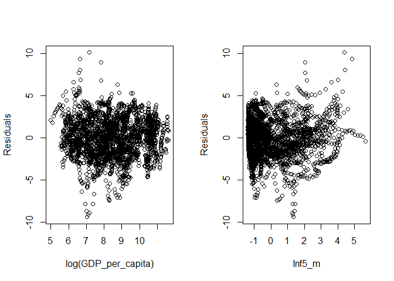
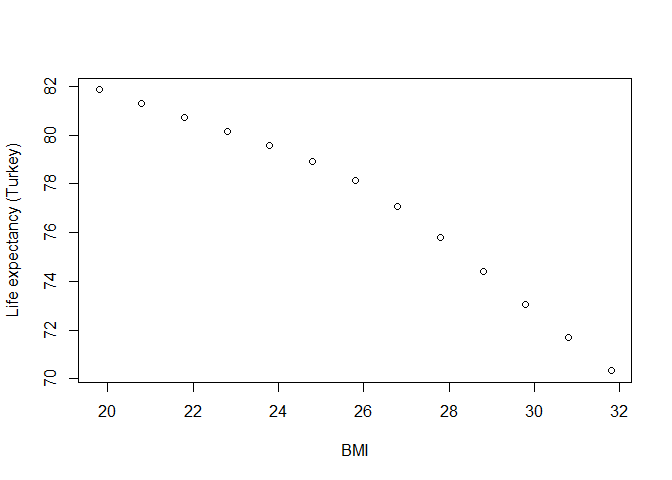

# The First Circle: Linear Regression, Part Two


Jiří Fejlek
<br/>
2025-05-15


## Linear Regression Model (*effect estimation and hypothesis testing*)

<br/> In Part Two of this demonstration of using linear regression, we
seek to model **Life expectancy** using data that contains health,
immunization, and economic and demographic information about 179
countries from 2000 to 2015.

<br/> I will not consider **Adult_mortality** as our predictor, because
**Adult_mortality** is tightly connected to **Life_expectancy**, but
does not give much additional insight into why life expectancy is lower,
what the difference is between these countries, other than people tend
to die younger. To illustrate this connection, we can see that a simple
linear regression **Adult_mortality** on **Life_expectancy** <br/> <br/>

``` r
summary(lm(formula = Life_expectancy ~ Adult_mortality, data = life_expectancy))
```

    ## 
    ## Call:
    ## lm(formula = Life_expectancy ~ Adult_mortality, data = life_expectancy)
    ## 
    ## Residuals:
    ##      Min       1Q   Median       3Q      Max 
    ## -11.2512  -2.1188   0.5152   2.0643  15.4313 
    ## 
    ## Coefficients:
    ##                   Estimate Std. Error t value Pr(>|t|)    
    ## (Intercept)     83.7324030  0.1117193   749.5   <2e-16 ***
    ## Adult_mortality -0.0773794  0.0004988  -155.1   <2e-16 ***
    ## ---
    ## Signif. codes:  0 '***' 0.001 '**' 0.01 '*' 0.05 '.' 0.1 ' ' 1
    ## 
    ## Residual standard error: 3.067 on 2862 degrees of freedom
    ## Multiple R-squared:  0.8937, Adjusted R-squared:  0.8937 
    ## F-statistic: 2.406e+04 on 1 and 2862 DF,  p-value: < 2.2e-16

<br/> already explains almost 90% of the variability in the data. <br/>

I will also not consider **Country** and **Year** as our predictors in
our initial model, since we are not developing a model for a
*particular* country in a *particular* time. Although, as we will see
later, it is actually quite important to acknowledge that our data are
panel data (i.e., data for some subjects evolving in time). Such data
for a given subject, in our case, for a given country, are usually
significantly correlated. Consequently, it is quite incorrect to
consider a model that sees these data as 2864 *independent*
observations, since it would lead to overly too optimistic estimates of
effects (e.g, too narrow confidence intervals).

In addition, including **Country** and **Year** in our model allows us
to reduce the omitted variable bias in our estimates, as we see later.
Still, I will proceed to do this first, a simple linear regression model
(mostly for illustrative purposes) anyway, and make corrections in the
model later.

<br/> Based on the data exploration in Part One, I will use the
logarithm transformation of predictors **Population_mln** and
**GDP_per_capita**, and the predictor **Inf5_m**, combining predictors
**Infant_deaths** and **Under_five_deaths**. Hence, we will consider the
following predictors <br/>

-   **Inf5_m** - Linear combination of **Infant_deaths** and
    **Under_five_deaths** (see Part One)
-   **Region**
-   **Alcohol_consumption**
-   **Hepatitis_B**
-   **Measles**
-   **BMI**
-   **Polio**
-   **Diptheria**
-   **Incidents_HIV** -
-   **log(GDP_per_capita)**
-   **log(Population_mln + 1)**
-   **Thinness_10-19**
-   **Thinness_5-9**
-   **Schooling**
-   **Economy** - Factor variable with levels **Developed** and
    **Developing** <br/>

I will a simple model where all predictors enters linearly. I will not
consider any interaction or nonlinear terms in the model. I do not have
any prior knowledge which specific interaction/nonlinear terms should be
included in the model nor I have a specific hypothesis about
interactions/nonlinearity I wish to test.

Our dataset is not large enough to reasonably include even just all
simple linear interaction terms, or for that matter, two cubic spline
knots for each numerical variable to model nonlinear terms. We should
remember that this dataset consists of panel data of effective sample
size of as low as 179 (depending on how strongly the observations for
each country are correlated, and these correlations will be strong since
such country characteristics do not change in time that much). The rule
of thumb for a number of predictors in such a case is between ~ 179/10 =
18 and ~179/20 = 9, which nicely corresponds to our total number of
predictors.

Thus, to obtain reasonable estimates, we would have to guess which
interactions (or nonlinear terms) to include from the data itself, which
is not an advisable approach.

<br/> Before we start the modelling, we will do some variable renaming
to shorten the predictor names. <br/>

``` r
library(tibble)
library(dplyr)

## Renaming variables
life_expectancy <- life_expectancy %>% rename(Thin_10_19 = Thinness_ten_nineteen_years) %>% rename(Thin_5_9 = Thinness_five_nine_years) %>% rename(Alcohol = Alcohol_consumption) %>% rename(HIV = Incidents_HIV) %>% rename(Economy = Economy_status ) %>% rename(Adult_m = Adult_mortality ) %>% rename(Pop_log = Population_log)
```

### Simple linear model (and accounting for heteroskedasticity)

<br/> As we discussed earlier, we first fit a simple linear model
ignoring the panel nature of our data. <br/>

``` r
## Simple linear model
linear_model <- lm(Life_expectancy ~ Economy + Region + Alcohol + Hepatitis_B + Measles + BMI + Polio + Diphtheria + HIV + GDP_log + Pop_log + Thin_10_19 + Thin_5_9 + Schooling + Inf5_m, data = life_expectancy)
summary(linear_model)
```

    ## 
    ## Call:
    ## lm(formula = Life_expectancy ~ Economy + Region + Alcohol + Hepatitis_B + 
    ##     Measles + BMI + Polio + Diphtheria + HIV + GDP_log + Pop_log + 
    ##     Thin_10_19 + Thin_5_9 + Schooling + Inf5_m, data = life_expectancy)
    ## 
    ## Residuals:
    ##     Min      1Q  Median      3Q     Max 
    ## -9.3728 -1.5304  0.0978  1.4964 10.0799 
    ## 
    ## Coefficients:
    ##                   Estimate Std. Error t value Pr(>|t|)    
    ## (Intercept)      55.884000   1.084655  51.522  < 2e-16 ***
    ## EconomyDeveloped  4.447894   0.258838  17.184  < 2e-16 ***
    ## RegionAsia        1.502877   0.175689   8.554  < 2e-16 ***
    ## RegionCAm         2.489351   0.195633  12.725  < 2e-16 ***
    ## RegionEU         -0.518107   0.292524  -1.771   0.0766 .  
    ## RegionMidE        0.267738   0.226082   1.184   0.2364    
    ## RegionNAm         0.394002   0.399478   0.986   0.3241    
    ## RegionOce        -0.542559   0.241919  -2.243   0.0250 *  
    ## RegionNotEU       1.257482   0.233765   5.379 8.09e-08 ***
    ## RegionSAm         2.204399   0.221843   9.937  < 2e-16 ***
    ## Alcohol          -0.226736   0.018826 -12.044  < 2e-16 ***
    ## Hepatitis_B      -0.004508   0.004224  -1.067   0.2859    
    ## Measles           0.004769   0.002878   1.657   0.0977 .  
    ## BMI               0.065374   0.036969   1.768   0.0771 .  
    ## Polio             0.017788   0.009554   1.862   0.0627 .  
    ## Diphtheria       -0.011988   0.009586  -1.251   0.2112    
    ## HIV              -0.927553   0.021215 -43.722  < 2e-16 ***
    ## GDP_log           1.434164   0.064981  22.070  < 2e-16 ***
    ## Pop_log           0.180462   0.034931   5.166 2.55e-07 ***
    ## Thin_10_19       -0.018867   0.027700  -0.681   0.4958    
    ## Thin_5_9          0.023569   0.027549   0.856   0.3923    
    ## Schooling        -0.169491   0.030138  -5.624 2.05e-08 ***
    ## Inf5_m           -4.235425   0.081424 -52.017  < 2e-16 ***
    ## ---
    ## Signif. codes:  0 '***' 0.001 '**' 0.01 '*' 0.05 '.' 0.1 ' ' 1
    ## 
    ## Residual standard error: 2.201 on 2841 degrees of freedom
    ## Multiple R-squared:  0.9457, Adjusted R-squared:  0.9452 
    ## F-statistic:  2247 on 22 and 2841 DF,  p-value: < 2.2e-16

<br/> Many predictors seem highly significant (though again, this
significance is inflated since we did not consider correlation between
the observations for the same country). Let us check the assumptions of
linear regression by plotting the residuals of the fit. We will check a
histogram and QQ-plot of residuals and plots of residuals vs. fitted
values and residuals vs. predictors. <br/>



<br/> We notice that residuals have an almost normal distribution
(although the distribution has slightly heavier tails than the normal
distribution). We also observe noticeable heteroscedasticity in
residuals of developed vs. developing countries. Thus, it is advisable
to recompute the standard errors to account for heteroskedasticity. One
method is to use heteroskedasticity-consistent standard errors
(Eicker–Huber–White standard errors) <br/>

``` r
library(lmtest)
library(sandwich)
coeftest(linear_model, vcov = vcovHC(linear_model, type = c("HC0")))
```

    ## 
    ## t test of coefficients:
    ## 
    ##                    Estimate Std. Error  t value  Pr(>|t|)    
    ## (Intercept)      55.8839997  1.1957769  46.7345 < 2.2e-16 ***
    ## EconomyDeveloped  4.4478937  0.2420920  18.3727 < 2.2e-16 ***
    ## RegionAsia        1.5028775  0.1893976   7.9350 3.000e-15 ***
    ## RegionCAm         2.4893513  0.2122763  11.7269 < 2.2e-16 ***
    ## RegionEU         -0.5181069  0.2781556  -1.8627   0.06261 .  
    ## RegionMidE        0.2677376  0.2233535   1.1987   0.23074    
    ## RegionNAm         0.3940020  0.3973433   0.9916   0.32148    
    ## RegionOce        -0.5425593  0.2932121  -1.8504   0.06436 .  
    ## RegionNotEU       1.2574819  0.2606791   4.8239 1.482e-06 ***
    ## RegionSAm         2.2043987  0.2044258  10.7834 < 2.2e-16 ***
    ## Alcohol          -0.2267364  0.0191529 -11.8382 < 2.2e-16 ***
    ## Hepatitis_B      -0.0045082  0.0037146  -1.2136   0.22499    
    ## Measles           0.0047687  0.0027586   1.7287   0.08398 .  
    ## BMI               0.0653741  0.0394366   1.6577   0.09749 .  
    ## Polio             0.0177880  0.0085897   2.0709   0.03846 *  
    ## Diphtheria       -0.0119880  0.0087665  -1.3675   0.17158    
    ## HIV              -0.9275532  0.0347372 -26.7020 < 2.2e-16 ***
    ## GDP_log           1.4341637  0.0663090  21.6285 < 2.2e-16 ***
    ## Pop_log           0.1804618  0.0351475   5.1344 3.021e-07 ***
    ## Thin_10_19       -0.0188670  0.0285200  -0.6615   0.50832    
    ## Thin_5_9          0.0235686  0.0285780   0.8247   0.40960    
    ## Schooling        -0.1694914  0.0292736  -5.7899 7.814e-09 ***
    ## Inf5_m           -4.2354249  0.0984360 -43.0272 < 2.2e-16 ***
    ## ---
    ## Signif. codes:  0 '***' 0.001 '**' 0.01 '*' 0.05 '.' 0.1 ' ' 1

<br/> We observe that heteroskedasticity-consistent estimates of
standard errors are not very different. We can obtain a similar result
using a simple nonparametric bootstrap that resamples with repetitions
the whole dataset (paired bootstrap). This approach can also be shown to
be consistent in the presence of heteroskedasticity. <br/>

``` r
set.seed(123) # for reproducibility
nb <- 2500
coefmat <- matrix(NA,nb,23)
for(i in 1:nb){
life_expectancy_new <-  life_expectancy[sample(nrow(life_expectancy) , rep=TRUE),]
model_new <- lm(Life_expectancy ~ Economy + Region + Alcohol + Hepatitis_B + Measles + BMI + Polio + Diphtheria + HIV + GDP_log + Pop_log + Thin_10_19 + Thin_5_9 + Schooling + Inf5_m, data = life_expectancy_new)
coefmat[i,] <- coef(model_new)
}
colnames(coefmat) <- rownames(as.data.frame(coef(linear_model)))
coefmat <- data.frame(coefmat)

## Original CI
confint(linear_model)
```

    ##                          2.5 %       97.5 %
    ## (Intercept)      53.7572097756 58.010789688
    ## EconomyDeveloped  3.9403637843  4.955423516
    ## RegionAsia        1.1583872496  1.847367695
    ## RegionCAm         2.1057538074  2.872948804
    ## RegionEU         -1.0916885544  0.055474817
    ## RegionMidE       -0.1755646570  0.711039792
    ## RegionNAm        -0.3892943362  1.177298414
    ## RegionOce        -1.0169133400 -0.068205227
    ## RegionNotEU       0.7991165891  1.715847202
    ## RegionSAm         1.7694085064  2.639388887
    ## Alcohol          -0.2636508788 -0.189821867
    ## Hepatitis_B      -0.0127903738  0.003773963
    ## Measles          -0.0008747467  0.010412216
    ## BMI              -0.0071138640  0.137862095
    ## Polio            -0.0009452557  0.036521160
    ## Diphtheria       -0.0307846059  0.006808664
    ## HIV              -0.9691510335 -0.885955397
    ## GDP_log           1.3067488545  1.561578515
    ## Pop_log           0.1119688126  0.248954866
    ## Thin_10_19       -0.0731806325  0.035446591
    ## Thin_5_9         -0.0304503789  0.077587627
    ## Schooling        -0.2285856714 -0.110397126
    ## Inf5_m           -4.3950804529 -4.075769295

``` r
## Bootstrap CI
t(apply(coefmat,2,function(x) quantile(x,c(0.025,0.5,0.975))))
```

    ##                           2.5%          50%        97.5%
    ## X.Intercept.     53.5804612659 55.968462697 58.285341225
    ## EconomyDeveloped  3.9574241430  4.443657891  4.914076249
    ## RegionAsia        1.1245555305  1.481820995  1.872323381
    ## RegionCAm         2.0726865027  2.473277066  2.910174398
    ## RegionEU         -1.0779561791 -0.534567981  0.036187213
    ## RegionMidE       -0.1917432442  0.253112867  0.698196897
    ## RegionNAm        -0.4294987293  0.385278408  1.157812512
    ## RegionOce        -1.1550522756 -0.557985089  0.019413943
    ## RegionNotEU       0.7438286435  1.239356575  1.766747676
    ## RegionSAm         1.7881616249  2.185781248  2.609963090
    ## Alcohol          -0.2643844723 -0.226743594 -0.186080399
    ## Hepatitis_B      -0.0120143650 -0.004447968  0.003388272
    ## Measles          -0.0005492499  0.004811339  0.010011945
    ## BMI              -0.0115471383  0.063767004  0.140662553
    ## Polio             0.0003181483  0.017816253  0.034297423
    ## Diphtheria       -0.0298706492 -0.012021603  0.005213430
    ## HIV              -1.0022900029 -0.928983589 -0.863685407
    ## GDP_log           1.3095550953  1.432420339  1.562417579
    ## Pop_log           0.1130304343  0.181209624  0.252649850
    ## Thin_10_19       -0.0757003186 -0.018766146  0.037378187
    ## Thin_5_9         -0.0331397031  0.022705010  0.082952333
    ## Schooling        -0.2297458653 -0.168631065 -0.113419844
    ## Inf5_m           -4.4305396082 -4.242004563 -4.034264795

<br/> We see that the confidence intervals did not change significantly
compared to the ones provided by the standard estimates. Lastly, we can
check for influential observations (and potential outliers). A common
metric to detect overly influential observations is Cook’s distance.
<br/>


A simple rule of thumb is that an observation could be overtly
influential if its Cook’s distance is greater than one. That is
definitely not the case for our model. Still some observations have
significantly greater Cook’s distance than others. Let us compare the
regression of coefficients with observations deleted based on Cook’s
distance.

``` r
linear_model_red1 <- lm(Life_expectancy ~ Economy + Region + Alcohol + Hepatitis_B + Measles + BMI + Polio + Diphtheria + HIV + GDP_log + Pop_log + Thin_10_19 + Thin_5_9 + Schooling + Inf5_m, data = life_expectancy[cooks.distance(linear_model) < 0.02,])

linear_model_red2 <- lm(Life_expectancy ~ Economy + Region + Alcohol + Hepatitis_B + Measles + BMI + Polio + Diphtheria + HIV + GDP_log + Pop_log + Thin_10_19 + Thin_5_9 + Schooling + Inf5_m, data = life_expectancy[cooks.distance(linear_model) < 0.01,])

linear_model_red3 <- lm(Life_expectancy ~ Economy + Region + Alcohol + Hepatitis_B + Measles + BMI + Polio + Diphtheria + HIV + GDP_log + Pop_log + Thin_10_19 + Thin_5_9 + Schooling + Inf5_m, data = life_expectancy[cooks.distance(linear_model) < 0.005,])

coeff_delete <- cbind(coefficients(linear_model),coefficients(linear_model_red1),coefficients(linear_model_red2),coefficients(linear_model_red3))
colnames(coeff_delete) <- c('All','CD<0.02','CD<0.01','CD<0.005')
round(coeff_delete,4)
```

    ##                      All CD<0.02 CD<0.01 CD<0.005
    ## (Intercept)      55.8840 56.3388 56.4269  57.3573
    ## EconomyDeveloped  4.4479  4.4347  4.3986   4.3607
    ## RegionAsia        1.5029  1.4338  1.3834   1.2484
    ## RegionCAm         2.4894  2.3835  2.3447   2.2779
    ## RegionEU         -0.5181 -0.6058 -0.6451  -0.7255
    ## RegionMidE        0.2677  0.2125  0.1746   0.1109
    ## RegionNAm         0.3940  0.3490  0.3069   0.2111
    ## RegionOce        -0.5426 -0.6178 -0.6530  -0.7216
    ## RegionNotEU       1.2575  1.1610  1.1048   0.9977
    ## RegionSAm         2.2044  2.1262  2.0791   1.9916
    ## Alcohol          -0.2267 -0.2247 -0.2240  -0.2277
    ## Hepatitis_B      -0.0045 -0.0040 -0.0039  -0.0053
    ## Measles           0.0048  0.0039  0.0037   0.0039
    ## BMI               0.0654  0.0586  0.0542   0.0350
    ## Polio             0.0178  0.0169  0.0168   0.0150
    ## Diphtheria       -0.0120 -0.0125 -0.0125  -0.0119
    ## HIV              -0.9276 -0.9412 -0.9646  -0.9650
    ## GDP_log           1.4342  1.4217  1.4262   1.3983
    ## Pop_log           0.1805  0.1752  0.1756   0.1803
    ## Thin_10_19       -0.0189 -0.0180 -0.0187  -0.0311
    ## Thin_5_9          0.0236  0.0226  0.0228   0.0316
    ## Schooling        -0.1695 -0.1655 -0.1589  -0.1471
    ## Inf5_m           -4.2354 -4.2804 -4.2759  -4.3528

<br/> We see that no values of the parameters dramatically changed and
all values stayed within the confidence intervals provided by the
bootstrap. <br/>

### Linear model for panel data (i.e., accounting for autocorrelation)

<br/> All of the aforementioned approaches, including
heteroskedasticity-consistent standard errors and paired bootstrap,
assume that the error terms are independent. However, our data set
consists of longitudinal data for 179 countries, and hence, these
observations might be significantly correlated. We can check our
suspicion by plotting the residuals of our model for a given country
against **Year** . <br/>


<br/> These residuals are clearly strongly correlated. Hence, instead of
heteroskedasticity-consistent standard errors, we should use
cluster-robust standard errors. Our clusters consist of observations
from the same country, which we expect to be correlated. We should
remember that our underlying assumption is that error terms from
different clusters are independent. <br/>

``` r
library(clubSandwich)
options(width = 1000)
coef_test(linear_model, vcov = "CR2", cluster = life_expectancy$Country)
```

    ## Alternative hypothesis: two-sided 
    ##             Coef. Estimate      SE Null value  t-stat d.f. (Satt) p-val (Satt) Sig.
    ##       (Intercept) 55.88400 4.21655          0  13.253       58.61      < 0.001  ***
    ##  EconomyDeveloped  4.44789 0.94249          0   4.719       22.66      < 0.001  ***
    ##        RegionAsia  1.50288 0.69586          0   2.160       49.24      0.03569    *
    ##         RegionCAm  2.48935 0.73090          0   3.406       42.50      0.00145   **
    ##          RegionEU -0.51811 1.03899          0  -0.499       31.62      0.62147     
    ##        RegionMidE  0.26774 0.83785          0   0.320       33.45      0.75129     
    ##         RegionNAm  0.39400 1.79412          0   0.220        4.34      0.83613     
    ##         RegionOce -0.54256 1.18995          0  -0.456       20.27      0.65327     
    ##       RegionNotEU  1.25748 0.96679          0   1.301       51.60      0.19915     
    ##         RegionSAm  2.20440 0.74943          0   2.941       30.64      0.00617   **
    ##           Alcohol -0.22674 0.06770          0  -3.349       53.37      0.00149   **
    ##       Hepatitis_B -0.00451 0.00960          0  -0.470       27.34      0.64223     
    ##           Measles  0.00477 0.00964          0   0.495       41.82      0.62330     
    ##               BMI  0.06537 0.15381          0   0.425       36.27      0.67332     
    ##             Polio  0.01779 0.02265          0   0.785       27.24      0.43895     
    ##        Diphtheria -0.01199 0.02209          0  -0.543       33.34      0.59089     
    ##               HIV -0.92755 0.10979          0  -8.448        6.47      < 0.001  ***
    ##           GDP_log  1.43416 0.23776          0   6.032       51.77      < 0.001  ***
    ##           Pop_log  0.18046 0.13648          0   1.322       51.94      0.19188     
    ##        Thin_10_19 -0.01887 0.02806          0  -0.672        6.39      0.52494     
    ##          Thin_5_9  0.02357 0.03236          0   0.728        6.86      0.49052     
    ##         Schooling -0.16949 0.10601          0  -1.599       65.99      0.11462     
    ##            Inf5_m -4.23542 0.27803          0 -15.234       44.67      < 0.001  ***

<br/> We observe that the cluster-robust standard errors are
significantly larger (corresponding to the fact that we assume to have a
much smaller number of independent observations) and that many of the
effects are no longer significant.

This linear model we constructed is in the context of panel data models
called *pooled* because it stacks the data for all individuals and time
instants together. This model is valid provided there is no unobserved
heterogeneity in the data that is *correlated* with the predictors in
the model (i.e., there is no omitted variable bias). A *fixed effects
model* for panel data alleviates some of this bias by adding factor
predictors corresponding to all individuals and time instants to model
the unobserved heterogeneity: <br/>

``` r
fixed_efffect_model <- lm(Life_expectancy ~ Alcohol + Hepatitis_B + Measles + BMI + Polio + Diphtheria + HIV + GDP_log + Pop_log + Thin_10_19 + Thin_5_9 + Schooling + Inf5_m + factor(Country) + factor(Year), data = life_expectancy)
summary(fixed_efffect_model)
```

    ## 
    ## Call:
    ## lm(formula = Life_expectancy ~ Alcohol + Hepatitis_B + Measles + 
    ##     BMI + Polio + Diphtheria + HIV + GDP_log + Pop_log + Thin_10_19 + 
    ##     Thin_5_9 + Schooling + Inf5_m + factor(Country) + factor(Year), 
    ##     data = life_expectancy)
    ## 
    ## Residuals:
    ##     Min      1Q  Median      3Q     Max 
    ## -3.4644 -0.3188  0.0278  0.2942  7.7158 
    ## 
    ## Coefficients:
    ##                                                 Estimate Std. Error t value Pr(>|t|)    
    ## (Intercept)                                    8.116e+01  2.521e+00  32.194  < 2e-16 ***
    ## Alcohol                                       -9.912e-03  1.900e-02  -0.522 0.601878    
    ## Hepatitis_B                                    9.379e-04  2.132e-03   0.440 0.660074    
    ## Measles                                       -6.292e-03  2.137e-03  -2.945 0.003261 ** 
    ## BMI                                           -9.757e-01  9.575e-02 -10.190  < 2e-16 ***
    ## Polio                                          1.088e-03  4.270e-03   0.255 0.798874    
    ## Diphtheria                                     1.297e-02  4.270e-03   3.039 0.002401 ** 
    ## HIV                                           -8.416e-01  2.678e-02 -31.430  < 2e-16 ***
    ## GDP_log                                        4.553e-01  1.247e-01   3.650 0.000267 ***
    ## Pop_log                                        2.635e-01  2.812e-01   0.937 0.348890    
    ## Thin_10_19                                     4.314e-05  1.125e-02   0.004 0.996940    
    ## Thin_5_9                                       7.771e-04  1.111e-02   0.070 0.944253    
    ## Schooling                                     -2.305e-02  4.464e-02  -0.516 0.605711    
    ## Inf5_m                                        -2.697e+00  6.837e-02 -39.451  < 2e-16 ***
    ## factor(Country)Albania                         1.185e+01  8.159e-01  14.526  < 2e-16 ***
    ## factor(Country)Algeria                         9.423e+00  5.054e-01  18.646  < 2e-16 ***
    ## factor(Country)Angola                         -2.979e+00  3.908e-01  -7.623 3.42e-14 ***
    ## factor(Country)Antigua and Barbuda             1.020e+01  1.079e+00   9.451  < 2e-16 ***
    ## factor(Country)Argentina                       1.048e+01  7.135e-01  14.684  < 2e-16 ***
    ## factor(Country)Armenia                         9.654e+00  8.507e-01  11.348  < 2e-16 ***
    ## factor(Country)Australia                       1.504e+01  8.396e-01  17.916  < 2e-16 ***
    ## factor(Country)Austria                         1.268e+01  7.712e-01  16.444  < 2e-16 ***
    ## factor(Country)Azerbaijan                      8.802e+00  6.911e-01  12.737  < 2e-16 ***
    ## factor(Country)Bahamas, The                    9.067e+00  1.116e+00   8.124 6.81e-16 ***
    ## factor(Country)Bahrain                         9.325e+00  9.300e-01  10.026  < 2e-16 ***
    ## factor(Country)Bangladesh                      2.928e+00  5.749e-01   5.093 3.77e-07 ***
    ## factor(Country)Barbados                        1.500e+01  1.088e+00  13.781  < 2e-16 ***
    ## factor(Country)Belarus                         5.279e+00  7.270e-01   7.261 5.01e-13 ***
    ## factor(Country)Belgium                         1.272e+01  7.732e-01  16.456  < 2e-16 ***
    ## factor(Country)Belize                          1.034e+01  1.148e+00   9.011  < 2e-16 ***
    ## factor(Country)Benin                           2.741e-01  4.163e-01   0.658 0.510368    
    ## factor(Country)Bhutan                          3.159e+00  8.548e-01   3.696 0.000223 ***
    ## factor(Country)Bolivia                         5.255e+00  5.821e-01   9.028  < 2e-16 ***
    ## factor(Country)Bosnia and Herzegovina          9.903e+00  7.378e-01  13.423  < 2e-16 ***
    ## factor(Country)Botswana                        3.600e+00  8.315e-01   4.330 1.55e-05 ***
    ## factor(Country)Brazil                          7.446e+00  8.021e-01   9.282  < 2e-16 ***
    ## factor(Country)Brunei Darussalam               8.840e+00  1.047e+00   8.439  < 2e-16 ***
    ## factor(Country)Bulgaria                        8.072e+00  7.222e-01  11.176  < 2e-16 ***
    ## factor(Country)Burkina Faso                   -3.339e+00  3.691e-01  -9.044  < 2e-16 ***
    ## factor(Country)Burundi                        -4.793e+00  4.821e-01  -9.943  < 2e-16 ***
    ## factor(Country)Cabo Verde                      6.182e+00  9.250e-01   6.683 2.84e-11 ***
    ## factor(Country)Cambodia                        2.472e-01  3.726e-01   0.663 0.507172    
    ## factor(Country)Cameroon                       -1.809e+00  3.735e-01  -4.843 1.35e-06 ***
    ## factor(Country)Canada                          1.465e+01  8.471e-01  17.296  < 2e-16 ***
    ## factor(Country)Central African Republic       -6.232e+00  5.299e-01 -11.760  < 2e-16 ***
    ## factor(Country)Colombia                        9.878e+00  5.569e-01  17.736  < 2e-16 ***
    ## factor(Country)Comoros                         1.880e+00  8.351e-01   2.252 0.024410 *  
    ## factor(Country)Congo, Dem. Rep.               -2.664e+00  4.062e-01  -6.557 6.56e-11 ***
    ## factor(Country)Congo, Rep.                    -2.406e+00  5.806e-01  -4.144 3.51e-05 ***
    ## factor(Country)Costa Rica                      1.392e+01  7.787e-01  17.873  < 2e-16 ***
    ## factor(Country)Cote d'Ivoire                  -4.459e+00  3.543e-01 -12.587  < 2e-16 ***
    ## factor(Country)Croatia                         1.056e+01  8.284e-01  12.743  < 2e-16 ***
    ## factor(Country)Cuba                            1.144e+01  6.494e-01  17.622  < 2e-16 ***
    ## factor(Country)Cyprus                          1.367e+01  1.020e+00  13.395  < 2e-16 ***
    ## factor(Country)Czechia                         1.134e+01  8.051e-01  14.079  < 2e-16 ***
    ## factor(Country)Denmark                         1.122e+01  8.517e-01  13.170  < 2e-16 ***
    ## factor(Country)Djibouti                        1.147e+00  8.210e-01   1.398 0.162374    
    ## factor(Country)Dominican Republic              9.033e+00  5.967e-01  15.140  < 2e-16 ***
    ## factor(Country)Ecuador                         1.077e+01  6.095e-01  17.664  < 2e-16 ***
    ## factor(Country)Egypt, Arab Rep.                8.903e+00  7.615e-01  11.691  < 2e-16 ***
    ## factor(Country)El Salvador                     7.971e+00  7.030e-01  11.339  < 2e-16 ***
    ## factor(Country)Equatorial Guinea               1.659e+00  7.901e-01   2.100 0.035791 *  
    ## factor(Country)Eritrea                        -4.514e+00  6.975e-01  -6.472 1.15e-10 ***
    ## factor(Country)Estonia                         8.323e+00  9.993e-01   8.329  < 2e-16 ***
    ## factor(Country)Eswatini                        4.731e+00  9.862e-01   4.797 1.70e-06 ***
    ## factor(Country)Ethiopia                       -3.260e+00  4.794e-01  -6.799 1.29e-11 ***
    ## factor(Country)Fiji                            4.024e+00  1.009e+00   3.988 6.84e-05 ***
    ## factor(Country)Finland                         1.279e+01  8.475e-01  15.095  < 2e-16 ***
    ## factor(Country)France                          1.278e+01  7.953e-01  16.072  < 2e-16 ***
    ## factor(Country)Gabon                           1.046e+00  7.830e-01   1.336 0.181751    
    ## factor(Country)Gambia, The                    -1.384e+00  7.422e-01  -1.864 0.062385 .  
    ## factor(Country)Georgia                         8.272e+00  8.586e-01   9.634  < 2e-16 ***
    ## factor(Country)Germany                         1.262e+01  9.109e-01  13.852  < 2e-16 ***
    ## factor(Country)Ghana                          -1.034e+00  3.712e-01  -2.786 0.005378 ** 
    ## factor(Country)Greece                          1.426e+01  7.644e-01  18.653  < 2e-16 ***
    ## factor(Country)Grenada                         8.929e+00  1.073e+00   8.325  < 2e-16 ***
    ## factor(Country)Guatemala                       8.185e+00  5.287e-01  15.483  < 2e-16 ***
    ## factor(Country)Guinea                         -1.628e+00  3.840e-01  -4.240 2.31e-05 ***
    ## factor(Country)Guinea-Bissau                  -1.086e+00  7.302e-01  -1.488 0.136964    
    ## factor(Country)Guyana                          5.619e+00  9.272e-01   6.060 1.55e-09 ***
    ## factor(Country)Haiti                           2.049e+00  4.533e-01   4.520 6.47e-06 ***
    ## factor(Country)Honduras                        9.293e+00  5.964e-01  15.583  < 2e-16 ***
    ## factor(Country)Hungary                         8.470e+00  7.695e-01  11.007  < 2e-16 ***
    ## factor(Country)Chad                           -5.748e+00  3.804e-01 -15.110  < 2e-16 ***
    ## factor(Country)Chile                           1.371e+01  7.282e-01  18.822  < 2e-16 ***
    ## factor(Country)China                           5.462e+00  1.194e+00   4.575 4.97e-06 ***
    ## factor(Country)Iceland                         1.515e+01  1.085e+00  13.957  < 2e-16 ***
    ## factor(Country)India                           4.838e-01  1.124e+00   0.431 0.666797    
    ## factor(Country)Indonesia                       1.807e+00  7.476e-01   2.418 0.015684 *  
    ## factor(Country)Iran, Islamic Rep.              8.026e+00  6.290e-01  12.759  < 2e-16 ***
    ## factor(Country)Iraq                            7.988e+00  6.501e-01  12.287  < 2e-16 ***
    ## factor(Country)Ireland                         1.399e+01  9.121e-01  15.338  < 2e-16 ***
    ## factor(Country)Israel                          1.514e+01  8.652e-01  17.505  < 2e-16 ***
    ## factor(Country)Italy                           1.395e+01  7.620e-01  18.304  < 2e-16 ***
    ## factor(Country)Jamaica                         1.107e+01  8.350e-01  13.260  < 2e-16 ***
    ## factor(Country)Japan                           1.193e+01  8.709e-01  13.699  < 2e-16 ***
    ## factor(Country)Jordan                          1.148e+01  8.481e-01  13.538  < 2e-16 ***
    ## factor(Country)Kazakhstan                      3.933e+00  6.870e-01   5.725 1.15e-08 ***
    ## factor(Country)Kenya                          -3.475e+00  3.680e-01  -9.443  < 2e-16 ***
    ## factor(Country)Kiribati                        9.436e+00  1.196e+00   7.890 4.38e-15 ***
    ## factor(Country)Kuwait                          1.102e+01  9.777e-01  11.267  < 2e-16 ***
    ## factor(Country)Kyrgyz Republic                 6.753e+00  7.322e-01   9.223  < 2e-16 ***
    ## factor(Country)Lao PDR                         1.045e+00  4.961e-01   2.106 0.035267 *  
    ## factor(Country)Latvia                          7.416e+00  9.254e-01   8.014 1.65e-15 ***
    ## factor(Country)Lebanon                         1.321e+01  7.640e-01  17.287  < 2e-16 ***
    ## factor(Country)Lesotho                         4.081e-01  8.230e-01   0.496 0.620001    
    ## factor(Country)Liberia                         4.208e+00  5.859e-01   7.182 8.89e-13 ***
    ## factor(Country)Libya                           8.696e+00  7.712e-01  11.276  < 2e-16 ***
    ## factor(Country)Lithuania                       7.438e+00  8.866e-01   8.390  < 2e-16 ***
    ## factor(Country)Luxembourg                      1.323e+01  1.093e+00  12.108  < 2e-16 ***
    ## factor(Country)Madagascar                     -9.117e-01  3.683e-01  -2.476 0.013357 *  
    ## factor(Country)Malawi                         -3.278e+00  4.114e-01  -7.968 2.38e-15 ***
    ## factor(Country)Malaysia                        7.068e+00  5.796e-01  12.195  < 2e-16 ***
    ## factor(Country)Maldives                        8.729e+00  9.389e-01   9.297  < 2e-16 ***
    ## factor(Country)Mali                           -3.164e+00  3.413e-01  -9.268  < 2e-16 ***
    ## factor(Country)Malta                           1.550e+01  1.078e+00  14.383  < 2e-16 ***
    ## factor(Country)Mauritania                      3.959e+00  6.148e-01   6.439 1.42e-10 ***
    ## factor(Country)Mauritius                       8.091e+00  8.713e-01   9.287  < 2e-16 ***
    ## factor(Country)Mexico                          1.147e+01  8.058e-01  14.232  < 2e-16 ***
    ## factor(Country)Micronesia, Fed. Sts.           7.107e+00  1.182e+00   6.011 2.10e-09 ***
    ## factor(Country)Moldova                         6.239e+00  8.721e-01   7.155 1.08e-12 ***
    ## factor(Country)Mongolia                        3.281e+00  7.914e-01   4.146 3.49e-05 ***
    ## factor(Country)Montenegro                      9.916e+00  1.035e+00   9.581  < 2e-16 ***
    ## factor(Country)Morocco                         9.376e+00  4.518e-01  20.752  < 2e-16 ***
    ## factor(Country)Mozambique                     -3.569e+00  3.309e-01 -10.786  < 2e-16 ***
    ## factor(Country)Myanmar                         1.539e-02  3.449e-01   0.045 0.964400    
    ## factor(Country)Namibia                        -1.851e+00  7.460e-01  -2.482 0.013137 *  
    ## factor(Country)Nepal                           1.510e+00  3.187e-01   4.736 2.30e-06 ***
    ## factor(Country)Netherlands                     1.263e+01  7.687e-01  16.429  < 2e-16 ***
    ## factor(Country)New Zealand                     1.541e+01  9.258e-01  16.640  < 2e-16 ***
    ## factor(Country)Nicaragua                       9.390e+00  6.912e-01  13.586  < 2e-16 ***
    ## factor(Country)Niger                          -2.699e+00  3.434e-01  -7.860 5.53e-15 ***
    ## factor(Country)Nigeria                        -6.072e+00  6.996e-01  -8.680  < 2e-16 ***
    ## factor(Country)North Macedonia                 9.925e+00  8.674e-01  11.442  < 2e-16 ***
    ## factor(Country)Norway                          1.388e+01  9.117e-01  15.226  < 2e-16 ***
    ## factor(Country)Oman                            9.241e+00  8.125e-01  11.374  < 2e-16 ***
    ## factor(Country)Pakistan                        4.569e+00  6.339e-01   7.208 7.38e-13 ***
    ## factor(Country)Panama                          1.288e+01  8.013e-01  16.077  < 2e-16 ***
    ## factor(Country)Papua New Guinea                7.373e-01  5.336e-01   1.382 0.167149    
    ## factor(Country)Paraguay                        8.713e+00  6.585e-01  13.232  < 2e-16 ***
    ## factor(Country)Peru                            9.174e+00  5.687e-01  16.129  < 2e-16 ***
    ## factor(Country)Philippines                     2.797e+00  5.653e-01   4.949 7.92e-07 ***
    ## factor(Country)Poland                          9.544e+00  7.134e-01  13.378  < 2e-16 ***
    ## factor(Country)Portugal                        1.216e+01  6.794e-01  17.901  < 2e-16 ***
    ## factor(Country)Qatar                           1.496e+01  1.057e+00  14.149  < 2e-16 ***
    ## factor(Country)Romania                         7.701e+00  6.450e-01  11.940  < 2e-16 ***
    ## factor(Country)Russian Federation              2.054e+00  8.435e-01   2.435 0.014945 *  
    ## factor(Country)Rwanda                         -1.236e+00  4.691e-01  -2.635 0.008466 ** 
    ## factor(Country)Samoa                           1.289e+01  1.324e+00   9.735  < 2e-16 ***
    ## factor(Country)Sao Tome and Principe           3.705e+00  9.866e-01   3.755 0.000177 ***
    ## factor(Country)Saudi Arabia                    9.983e+00  7.752e-01  12.877  < 2e-16 ***
    ## factor(Country)Senegal                         2.864e-01  3.669e-01   0.781 0.435066    
    ## factor(Country)Serbia                          8.140e+00  7.105e-01  11.457  < 2e-16 ***
    ## factor(Country)Seychelles                      1.120e+01  1.083e+00  10.343  < 2e-16 ***
    ## factor(Country)Sierra Leone                   -5.190e+00  4.671e-01 -11.111  < 2e-16 ***
    ## factor(Country)Singapore                       1.144e+01  7.906e-01  14.472  < 2e-16 ***
    ## factor(Country)Slovak Republic                 9.021e+00  8.018e-01  11.252  < 2e-16 ***
    ## factor(Country)Slovenia                        1.238e+01  9.396e-01  13.180  < 2e-16 ***
    ## factor(Country)Solomon Islands                 6.850e+00  9.619e-01   7.121 1.37e-12 ***
    ## factor(Country)Somalia                        -6.978e-01  3.753e-01  -1.860 0.063064 .  
    ## factor(Country)South Africa                    4.944e+00  7.066e-01   6.997 3.30e-12 ***
    ## factor(Country)Spain                           1.441e+01  7.350e-01  19.607  < 2e-16 ***
    ## factor(Country)Sri Lanka                       6.271e+00  5.347e-01  11.728  < 2e-16 ***
    ## factor(Country)St. Lucia                       1.309e+01  1.139e+00  11.487  < 2e-16 ***
    ## factor(Country)St. Vincent and the Grenadines  8.368e+00  1.074e+00   7.789 9.62e-15 ***
    ## factor(Country)Suriname                        6.558e+00  9.730e-01   6.741 1.93e-11 ***
    ## factor(Country)Sweden                          1.387e+01  8.207e-01  16.901  < 2e-16 ***
    ## factor(Country)Switzerland                     1.387e+01  8.461e-01  16.397  < 2e-16 ***
    ## factor(Country)Syrian Arab Republic            1.093e+01  6.127e-01  17.833  < 2e-16 ***
    ## factor(Country)Tajikistan                      6.167e+00  6.647e-01   9.278  < 2e-16 ***
    ## factor(Country)Tanzania                       -2.535e+00  3.635e-01  -6.974 3.88e-12 ***
    ## factor(Country)Thailand                        5.930e+00  5.361e-01  11.062  < 2e-16 ***
    ## factor(Country)Timor-Leste                     1.900e+00  7.972e-01   2.384 0.017200 *  
    ## factor(Country)Togo                           -2.217e+00  5.012e-01  -4.424 1.01e-05 ***
    ## factor(Country)Tonga                           1.176e+01  1.386e+00   8.481  < 2e-16 ***
    ## factor(Country)Trinidad and Tobago             8.481e+00  9.559e-01   8.872  < 2e-16 ***
    ## factor(Country)Tunisia                         1.027e+01  5.805e-01  17.686  < 2e-16 ***
    ## factor(Country)Turkiye                         9.895e+00  7.167e-01  13.806  < 2e-16 ***
    ## factor(Country)Turkmenistan                    4.563e+00  7.123e-01   6.405 1.77e-10 ***
    ## factor(Country)Uganda                         -4.345e+00  3.872e-01 -11.220  < 2e-16 ***
    ## factor(Country)Ukraine                         5.034e+00  6.482e-01   7.766 1.14e-14 ***
    ## factor(Country)United Arab Emirates            1.149e+01  8.821e-01  13.026  < 2e-16 ***
    ## factor(Country)United Kingdom                  1.347e+01  8.936e-01  15.072  < 2e-16 ***
    ## factor(Country)United States                   1.289e+01  1.205e+00  10.701  < 2e-16 ***
    ## factor(Country)Uruguay                         1.179e+01  8.164e-01  14.441  < 2e-16 ***
    ## factor(Country)Uzbekistan                      6.516e+00  5.820e-01  11.196  < 2e-16 ***
    ## factor(Country)Vanuatu                         6.302e+00  1.020e+00   6.179 7.43e-10 ***
    ## factor(Country)Venezuela, RB                   9.023e+00  6.380e-01  14.142  < 2e-16 ***
    ## factor(Country)Vietnam                         5.251e+00  5.287e-01   9.931  < 2e-16 ***
    ## factor(Country)Yemen, Rep.                     1.936e+00  3.730e-01   5.192 2.24e-07 ***
    ## factor(Country)Zambia                         -3.194e+00  4.410e-01  -7.241 5.80e-13 ***
    ## factor(Country)Zimbabwe                       -5.557e+00  4.859e-01 -11.436  < 2e-16 ***
    ## factor(Year)2001                               1.145e-01  8.067e-02   1.419 0.156034    
    ## factor(Year)2002                               1.798e-01  8.259e-02   2.178 0.029531 *  
    ## factor(Year)2003                               2.983e-01  8.567e-02   3.482 0.000506 ***
    ## factor(Year)2004                               5.307e-01  9.037e-02   5.873 4.83e-09 ***
    ## factor(Year)2005                               6.565e-01  9.551e-02   6.874 7.76e-12 ***
    ## factor(Year)2006                               8.810e-01  1.019e-01   8.643  < 2e-16 ***
    ## factor(Year)2007                               1.097e+00  1.085e-01  10.117  < 2e-16 ***
    ## factor(Year)2008                               1.392e+00  1.156e-01  12.044  < 2e-16 ***
    ## factor(Year)2009                               1.676e+00  1.223e-01  13.709  < 2e-16 ***
    ## factor(Year)2010                               1.990e+00  1.292e-01  15.401  < 2e-16 ***
    ## factor(Year)2011                               2.255e+00  1.370e-01  16.463  < 2e-16 ***
    ## factor(Year)2012                               2.514e+00  1.443e-01  17.426  < 2e-16 ***
    ## factor(Year)2013                               2.808e+00  1.521e-01  18.468  < 2e-16 ***
    ## factor(Year)2014                               3.110e+00  1.602e-01  19.416  < 2e-16 ***
    ## factor(Year)2015                               3.297e+00  1.673e-01  19.708  < 2e-16 ***
    ## ---
    ## Signif. codes:  0 '***' 0.001 '**' 0.01 '*' 0.05 '.' 0.1 ' ' 1
    ## 
    ## Residual standard error: 0.7568 on 2657 degrees of freedom
    ## Multiple R-squared:  0.994,  Adjusted R-squared:  0.9935 
    ## F-statistic:  2134 on 206 and 2657 DF,  p-value: < 2.2e-16

<br/> An important point to notice is that by transitioning to the fixed
effects model, predictors that stay constant in time (**Region** and
**Economy status**) are no longer estimable since they become part of
the respective individual fixed effects.

Package *plm* for panel data models provides a cleaner summary for the
fixed effects model. <br/>

``` r
library(plm)
fixed_efffect_model_plm <- plm(Life_expectancy ~ Economy + Region + Alcohol + Hepatitis_B + Measles + BMI + Polio + Diphtheria + HIV + GDP_log + Pop_log + Thin_10_19 + Thin_5_9 + Schooling + Inf5_m, data = life_expectancy,index = c("Country", "Year"),  model = 'within', effect = 'twoways')
summary(fixed_efffect_model_plm)
```

    ## Twoways effects Within Model
    ## 
    ## Call:
    ## plm(formula = Life_expectancy ~ Economy + Region + Alcohol + 
    ##     Hepatitis_B + Measles + BMI + Polio + Diphtheria + HIV + 
    ##     GDP_log + Pop_log + Thin_10_19 + Thin_5_9 + Schooling + Inf5_m, 
    ##     data = life_expectancy, effect = "twoways", model = "within", 
    ##     index = c("Country", "Year"))
    ## 
    ## Balanced Panel: n = 179, T = 16, N = 2864
    ## 
    ## Residuals:
    ##      Min.   1st Qu.    Median   3rd Qu.      Max. 
    ## -3.464423 -0.318801  0.027809  0.294210  7.715751 
    ## 
    ## Coefficients:
    ##                Estimate  Std. Error  t-value  Pr(>|t|)    
    ## Alcohol     -9.9119e-03  1.8997e-02  -0.5218 0.6018782    
    ## Hepatitis_B  9.3793e-04  2.1323e-03   0.4399 0.6600741    
    ## Measles     -6.2919e-03  2.1367e-03  -2.9447 0.0032606 ** 
    ## BMI         -9.7572e-01  9.5751e-02 -10.1902 < 2.2e-16 ***
    ## Polio        1.0881e-03  4.2697e-03   0.2548 0.7988736    
    ## Diphtheria   1.2974e-02  4.2700e-03   3.0385 0.0024006 ** 
    ## HIV         -8.4157e-01  2.6776e-02 -31.4296 < 2.2e-16 ***
    ## GDP_log      4.5525e-01  1.2473e-01   3.6500 0.0002673 ***
    ## Pop_log      2.6348e-01  2.8122e-01   0.9369 0.3488902    
    ## Thin_10_19   4.3137e-05  1.1248e-02   0.0038 0.9969404    
    ## Thin_5_9     7.7709e-04  1.1112e-02   0.0699 0.9442529    
    ## Schooling   -2.3045e-02  4.4638e-02  -0.5163 0.6057113    
    ## Inf5_m      -2.6974e+00  6.8373e-02 -39.4511 < 2.2e-16 ***
    ## ---
    ## Signif. codes:  0 '***' 0.001 '**' 0.01 '*' 0.05 '.' 0.1 ' ' 1
    ## 
    ## Total Sum of Squares:    4623.7
    ## Residual Sum of Squares: 1521.9
    ## R-Squared:      0.67085
    ## Adj. R-Squared: 0.64533
    ## F-statistic: 416.564 on 13 and 2657 DF, p-value: < 2.22e-16

<br/> Similar to the pooled model, we still have to adjust the error
estimates due to autocorrelation. <br/>

``` r
options(width = 1000)
coef_test(fixed_efffect_model_plm, vcov = "CR2", cluster = life_expectancy$Country)
```

    ## Alternative hypothesis: two-sided 
    ##        Coef.  Estimate      SE Null value   t-stat d.f. (Satt) p-val (Satt) Sig.
    ##      Alcohol -9.91e-03 0.05562          0 -0.17821       31.81      0.85969     
    ##  Hepatitis_B  9.38e-04 0.00407          0  0.23025       45.47      0.81893     
    ##      Measles -6.29e-03 0.00557          0 -1.12882       38.04      0.26604     
    ##          BMI -9.76e-01 0.27433          0 -3.55676       38.63      0.00101   **
    ##        Polio  1.09e-03 0.00802          0  0.13570       54.35      0.89256     
    ##   Diphtheria  1.30e-02 0.00879          0  1.47602       51.91      0.14598     
    ##          HIV -8.42e-01 0.14720          0 -5.71709        5.81      0.00138   **
    ##      GDP_log  4.55e-01 0.38777          0  1.17401       38.42      0.24762     
    ##      Pop_log  2.63e-01 0.75910          0  0.34709       18.39      0.73247     
    ##   Thin_10_19  4.31e-05 0.01195          0  0.00361        5.89      0.99724     
    ##     Thin_5_9  7.77e-04 0.01307          0  0.05943        5.44      0.95473     
    ##    Schooling -2.30e-02 0.11752          0 -0.19610       66.66      0.84513     
    ##       Inf5_m -2.70e+00 0.30261          0 -8.91381       35.44      < 0.001  ***

<br/> We can also obtain robust estimates via bootstrap, but we cannot
use a simple paired bootstrap, since this bootstrap would destroy the
data structure. Instead, we have to use the fact that we assume that
observations for each individual country are independent from each
other, and thus, bootstrap over these whole time series. <br/>

``` r
set.seed(123) # for reproducibility
nb <- 2500
coefmat <- matrix(NA,nb,length(fixed_efffect_model_plm$coefficients))
Countries_list <- unique(life_expectancy$Country)

for(i in 1:nb){
Countries_new <- sample(Countries_list , rep=TRUE)
life_expectancy_new <- life_expectancy[life_expectancy$Country == Countries_new[1],]

for (j in 2:length(Countries_list)){
  life_expectancy_new <- rbind(life_expectancy_new,life_expectancy[life_expectancy$Country == Countries_new[j],])
}

model_new <- plm(Life_expectancy ~ Economy + Region + Alcohol + Hepatitis_B + Measles + BMI + Polio + Diphtheria + HIV + GDP_log + Pop_log + Thin_10_19 + Thin_5_9 + Schooling + Inf5_m, data = life_expectancy_new,index = c("Country", "Year"),  model = 'within', effect = 'twoways')
coefmat[i,] <- model_new$coefficients

}
colnames(coefmat) <- rownames(as.data.frame(fixed_efffect_model_plm$coefficients))
coefmat <- data.frame(coefmat)

## Bootstrap CI
t(apply(coefmat,2,function(x) quantile(x,c(0.025,0.5,0.975))))
```

    ##                     2.5%           50%        97.5%
    ## Alcohol     -0.120875103 -0.0135748393  0.088558670
    ## Hepatitis_B -0.006938248  0.0007359743  0.008529785
    ## Measles     -0.017384031 -0.0059322264  0.003638968
    ## BMI         -1.526493089 -0.9660997039 -0.488111856
    ## Polio       -0.015744875  0.0005180592  0.015862202
    ## Diphtheria  -0.003467844  0.0134109872  0.030615580
    ## HIV         -1.166958309 -0.8480892170 -0.500609167
    ## GDP_log     -0.196909286  0.4728072081  1.308891879
    ## Pop_log     -1.246163481  0.2810800785  1.838659306
    ## Thin_10_19  -0.021658933 -0.0007905785  0.035914240
    ## Thin_5_9    -0.033563950  0.0001041811  0.024369521
    ## Schooling   -0.248854264 -0.0225201774  0.187523507
    ## Inf5_m      -3.260260023 -2.6941930363 -2.105902953

<br/> We see that the bootstrap result corresponds to the robust
standard errors (the same predictors appear to be significant).

Since there is a lot of unobserved heterogeneity in the data, we prefer
the fixed effects model over the pooled model. Let us plot the residuals
of the fixed effects model to check the fit. <br/>


<br/> We observe that residuals seem symmetric but have significantly
heavier tails than the normal distribution would, and there are possibly
some outliers. We will repeat the fit for deleted observations based on
Cook’s distance. <br/>

``` r
fixed_efffect_model_red1 <- lm(Life_expectancy ~ Alcohol + Hepatitis_B + Measles + BMI + Polio + Diphtheria + HIV + GDP_log + Pop_log + Thin_10_19 + Thin_5_9 + Schooling + Inf5_m + factor(Country) + factor(Year), data = life_expectancy[cooks.distance(fixed_efffect_model) < 0.04,])

fixed_efffect_model_red2 <- lm(Life_expectancy ~ Alcohol + Hepatitis_B + Measles + BMI + Polio + Diphtheria + HIV + GDP_log + Pop_log + Thin_10_19 + Thin_5_9 + Schooling + Inf5_m + factor(Country) + factor(Year), data = life_expectancy[cooks.distance(fixed_efffect_model) < 0.02,])

fixed_efffect_model_red3 <- lm(Life_expectancy ~ Alcohol + Hepatitis_B + Measles + BMI + Polio + Diphtheria + HIV + GDP_log + Pop_log + Thin_10_19 + Thin_5_9 + Schooling + Inf5_m + factor(Country) + factor(Year), data = life_expectancy[cooks.distance(fixed_efffect_model) < 0.01,])

coeff_delete <- cbind(coefficients(fixed_efffect_model),coefficients(fixed_efffect_model_red1),coefficients(fixed_efffect_model_red2),coefficients(fixed_efffect_model_red3))
colnames(coeff_delete) <- c('All','CD<0.04','CD<0.02','CD<0.01')
round(coeff_delete[1:14,],3)
```

    ##                All CD<0.04 CD<0.02 CD<0.01
    ## (Intercept) 81.156  84.266  83.946  82.821
    ## Alcohol     -0.010  -0.009  -0.011  -0.019
    ## Hepatitis_B  0.001   0.001   0.002   0.001
    ## Measles     -0.006  -0.005  -0.005  -0.004
    ## BMI         -0.976  -1.022  -1.006  -0.957
    ## Polio        0.001   0.000   0.000  -0.001
    ## Diphtheria   0.013   0.010   0.011   0.011
    ## HIV         -0.842  -0.857  -0.883  -0.911
    ## GDP_log      0.455   0.374   0.384   0.416
    ## Pop_log      0.263  -0.093  -0.137  -0.172
    ## Thin_10_19   0.000  -0.001  -0.002  -0.006
    ## Thin_5_9     0.001   0.000  -0.001  -0.001
    ## Schooling   -0.023  -0.014  -0.005  -0.006
    ## Inf5_m      -2.697  -2.865  -2.855  -2.826

<br/> Again, we notice that the values of the parameters did not
dramatically change, and all actually stayed within the confidence
intervals provided by the bootstrap. Thus, I will consider the fixed
effects model with all the data as our final model <br/>

### Conclusions

<br/> Whether we use cluster-robust standard errors or bootstrap, we
notice that most of the predictors in the fixed effects model are not
significant. The only significant predictors of our model appear to be
**Inf5_m**, **BMI**, and **HIV**. Let us try to make some sense of our
results.

The most important predictor (in the sense of the effect size)
**Inf5_m**, i.e., infant mortality / deaths of children under five years
old per 1000 population. This effect is expected since the incidence of
such early deaths drives the overall mean life expectancy down.

We could observe this effect quite clearly from the data (the red curve
is a LOESS fit of the data: span = 0.5, degree = 2) <br/>


<br/> Another significant predictor is a number of **HIV** incidents,
and it is actually the only disease that proved to be significant in our
model. This significance of this effect is again to be expected. For
example, the UNAIDS report *THE URGENCY OF NOW AIDS AT A CROSSROADS*
shows that from successes in the treatment of HIV, life expectancy in
Africa increased from 56 to 61 between 2010 and 2024. Again, if we
visualize the data, the effect of **HIV** is also quite noticeable.
<br/>


<br/> The last significant predictor is average **BMI** of adult
population. This one is a bit trickier to interpret. If we simply
visualize the data, we could argue that life expectancy actually
increases slightly with BMI. <br/>


<br/> However, more economically developed countries tend to have higher
average BMI <br/>


<br/> and those countries tend to have higher life expectancy (and lower
infant mortality/child deaths and lower HIV incidents count) <br/>


<br/> Actually, if we plot BMI vs life expectancy for developed
countries, this negative effect for large average BMI is hinted at (that
low BMI and high life expectancy country is Japan) <br/>


If we plot again life expectancy vs. BMI for all countries, but adjust
for If5_m and HIV, which were significant in our model


the plot flattens a bit. We could suspect a nonlinear dependence in BMI,
although, interestingly enough fitting a more complex model, nonlinear
BMI model (via restricted cubic splines), does not change the apparent
downward trend much.

``` r
library(rms)
fixed_efffect_model_nonlin <- lm(Life_expectancy ~ Alcohol + Hepatitis_B + Measles + rcs(BMI,4) + Polio + Diphtheria + HIV + GDP_log + Pop_log + Thin_10_19 + Thin_5_9 + Schooling + Inf5_m + factor(Country) + factor(Year), data = life_expectancy)


# Plot the predicted life expectancy vs. BMI for the first observation
BMI_seq <- seq(min(life_expectancy$BMI),max(life_expectancy$BMI),1)
obs <- life_expectancy[1,]
obs <- obs[rep(1, length(BMI_seq)), ]
obs$BMI  <- BMI_seq

pred <- predict(fixed_efffect_model_nonlin ,obs,type = 'response')
plot(obs$BMI,pred,xlab = 'BMI', ylab = 'Life expectancy (Turkey)')
```



Overall, it is individual/time effects in the fixed effects model, which
are seemingly playing a huge role here. Thus, our model is still quite
lacking in providing explanations in this regard. Still, having
identified BMI as a negative factor in a life expectancy model is not
without some basis, see e.g., Oxford University research *Moderate
obesity takes years off life expectancy*
(<https://www.ox.ac.uk/news/2009-03-18-moderate-obesity-takes-years-life-expectancy>
) or 2023 paper from Nature Food, *Life expectancy can increase by up to
10 years following sustained shifts towards healthier diets in the
United Kingdom*.

Overall, we kind of confirmed a statement about life expectancy on
Wikipedia, which claims that *… great variations in life expectancy …
(are) mostly caused by differences in public health, medical care, and
diet*. With a bit of hyperbole, our stand-ins for these causes are the
three factors in our model: HIV, infant mortality, and BMI. However, we
also observed a lot of additional heterogeneity in the data unexplained
by these three predictors (and other predictors included in the
dataset). Thus, if were to investigate models of life expectancy
further, we should explore including additional predictors in the future
model.
