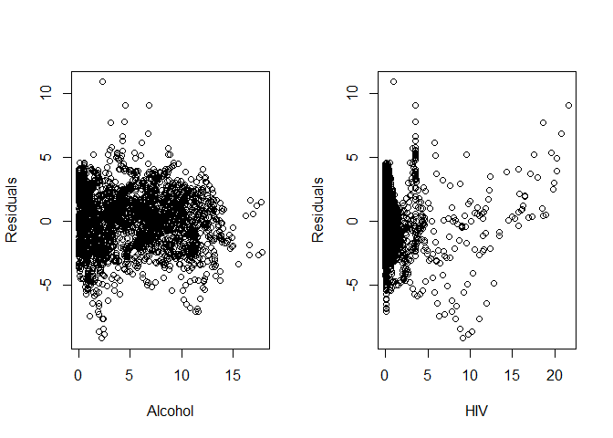
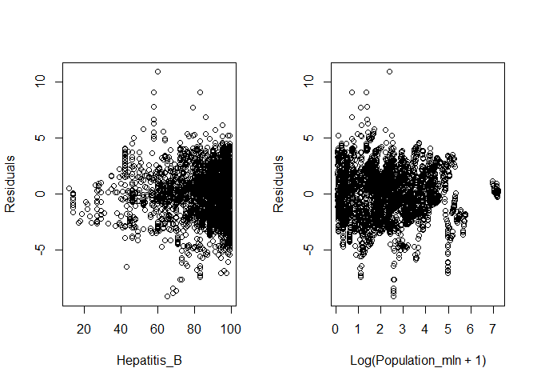
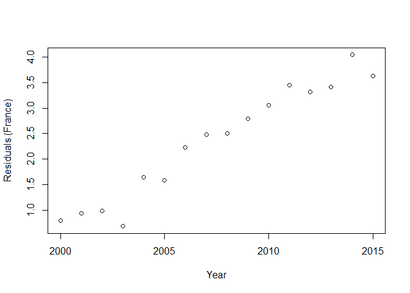
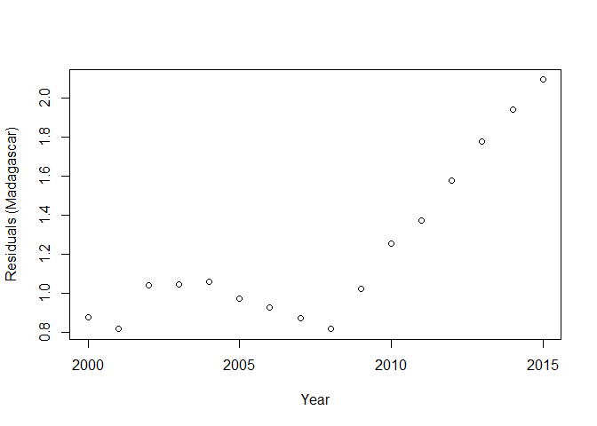
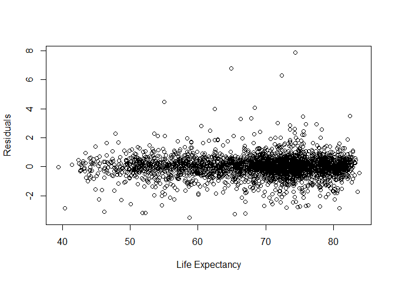
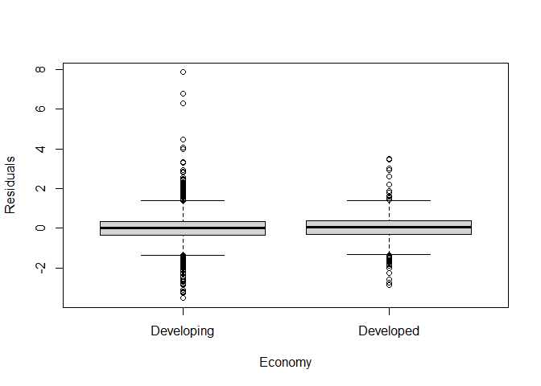
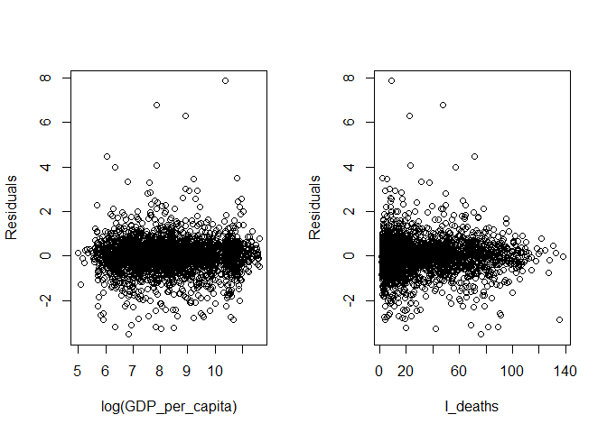
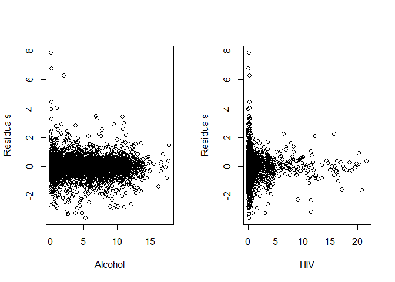
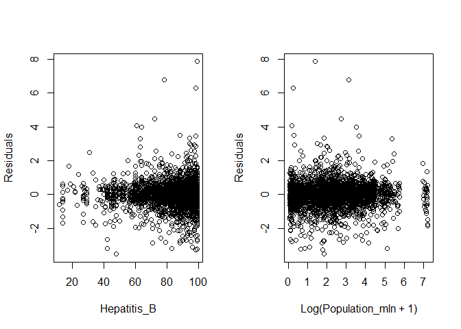

# The First Circle: Linear Regression, Part Two

<br/>
Jiří Fejlek

2025-05-18
<br/>

## Linear Regression Model (*for effect estimation and hypothesis testing*)

<br/> In Part Two of this demonstration of using linear regression, we
seek to model **Life expectancy** using data that contains health,
immunization, and economic and demographic information about 179
countries from 2000 to 2015. In this demonstration, we will start with a
simple linear regression model, but we will eventually move to models
for panel data. Thus, we will introduce random and fixed effects models
for panel data and even lesser known *correlated random effects models*.

Let us start the modelling with our choice of the predictors. I will not
consider **Adult_mortality** as our predictor, because
**Adult_mortality** is tightly connected to **Life_expectancy**, but
does not give much additional insight into why life expectancy is lower,
what the difference is between these countries, other than that people
tend to die before reaching senior age. To illustrate this connection,
we can see that a simple linear regression **Adult_mortality** on
**Life_expectancy** <br/>

``` r
summary(lm(formula = Life_expectancy ~ Adult_mortality, data = life_expectancy))
```

    ## 
    ## Call:
    ## lm(formula = Life_expectancy ~ Adult_mortality, data = life_expectancy)
    ## 
    ## Residuals:
    ##      Min       1Q   Median       3Q      Max 
    ## -11.2512  -2.1188   0.5152   2.0643  15.4313 
    ## 
    ## Coefficients:
    ##                   Estimate Std. Error t value Pr(>|t|)    
    ## (Intercept)     83.7324030  0.1117193   749.5   <2e-16 ***
    ## Adult_mortality -0.0773794  0.0004988  -155.1   <2e-16 ***
    ## ---
    ## Signif. codes:  0 '***' 0.001 '**' 0.01 '*' 0.05 '.' 0.1 ' ' 1
    ## 
    ## Residual standard error: 3.067 on 2862 degrees of freedom
    ## Multiple R-squared:  0.8937, Adjusted R-squared:  0.8937 
    ## F-statistic: 2.406e+04 on 1 and 2862 DF,  p-value: < 2.2e-16

<br/> already explains almost 90% of the variability in the data. <br/>

I will also not consider **Country** and **Year** as our predictors in
our initial model, since we are not developing a model for a
*particular* country in a *particular* time. Although, as we will see
later, it is actually quite important to acknowledge that our data are
panel data (i.e., data for some individuals evolving in time). Such data
for a given individual, in our case, for a given country, are usually
significantly correlated. Consequently, it is quite incorrect to
consider a model that sees these data as 2864 *independent*
observations, since it would lead to overly optimistic estimates of
effects (e.g, too narrow confidence intervals).

In addition, including **Country** and **Year** in our model allows us
to reduce the omitted variable bias of our estimates, as we see later.
Still, I will proceed to do this first, a simple linear regression model
(mostly for illustrative purposes) anyway, and make corrections in the
model later.

Based on the data exploration in Part One, I will use the logarithm
transformation of predictors **Population_mln** and **GDP_per_capita**,
and the predictor **Inf5_m**, combining predictors **Infant_deaths** and
**Under_five_deaths**. Hence, we will consider the following predictors
<br/>

- **Inf5_m** - Linear combination of **Infant_deaths** and
  **Under_five_deaths** (see Part One)
- **Region**
- **Alcohol_consumption**
- **Hepatitis_B**
- **Measles**
- **BMI**
- **Polio**
- **Diptheria**
- **Incidents_HIV** -
- **log(GDP_per_capita)**
- **log(Population_mln + 1)**
- **Thinness_10-19**
- **Thinness_5-9**
- **Schooling**
- **Economy** - Factor variable with levels **Developed** and
  **Developing** <br/>

I will consider a simple model where all predictors enter linearly. I
will not consider any interaction or nonlinear terms in the model. I do
not have any prior knowledge of which specific interaction/nonlinear
terms should be included in the model, nor do I have a specific
hypothesis about interactions/nonlinearity I wish to test.

Our dataset is not large enough to reasonably include even just all
simple linear interaction terms, or for that matter, two cubic spline
knots for each numerical variable to model nonlinear terms. We should
remember that this dataset consists of panel data of effective sample
size of as low as 179 (depending on how strongly the observations for
each country are correlated, and these correlations will be strong since
such country characteristics do not change in time that much). The rule
of thumb for a number of predictors in such a case is between ~ 179/10 =
18 and ~179/20 = 9, which nicely corresponds to our total number of
predictors of interest.

Thus, to obtain reasonable estimates, we would have to guess which
interactions (or nonlinear terms) to include from the data itself, which
is not an advisable approach.

Before we start the modelling, we will do some variable renaming to
shorten the predictor names. <br/>

``` r
library(tibble)
library(dplyr)

## Renaming variables
life_expectancy <- life_expectancy %>% rename(Thin_10_19 = Thinness_ten_nineteen_years) %>% rename(Thin_5_9 = Thinness_five_nine_years) %>% rename(Alcohol = Alcohol_consumption) %>% rename(HIV = Incidents_HIV) %>% rename(Economy = Economy_status ) %>% rename(Adult_m = Adult_mortality ) %>% rename(Pop_log = Population_log)
```

### Simple linear model (and accounting for heteroskedasticity)

<br/> As we discussed earlier, we first fit a simple linear model
ignoring the panel nature of our data. <br/>

``` r
## Simple linear model
linear_model <- lm(Life_expectancy ~ Economy + Region + Alcohol + Hepatitis_B + Measles + BMI + Polio + Diphtheria + HIV + GDP_log + Pop_log + Thin_10_19 + Thin_5_9 + Schooling + Inf5_m, data = life_expectancy)
summary(linear_model)
```

    ## 
    ## Call:
    ## lm(formula = Life_expectancy ~ Economy + Region + Alcohol + Hepatitis_B + 
    ##     Measles + BMI + Polio + Diphtheria + HIV + GDP_log + Pop_log + 
    ##     Thin_10_19 + Thin_5_9 + Schooling + Inf5_m, data = life_expectancy)
    ## 
    ## Residuals:
    ##     Min      1Q  Median      3Q     Max 
    ## -9.3728 -1.5304  0.0978  1.4964 10.0799 
    ## 
    ## Coefficients:
    ##                   Estimate Std. Error t value Pr(>|t|)    
    ## (Intercept)      55.884000   1.084655  51.522  < 2e-16 ***
    ## EconomyDeveloped  4.447894   0.258838  17.184  < 2e-16 ***
    ## RegionAsia        1.502877   0.175689   8.554  < 2e-16 ***
    ## RegionCAm         2.489351   0.195633  12.725  < 2e-16 ***
    ## RegionEU         -0.518107   0.292524  -1.771   0.0766 .  
    ## RegionMidE        0.267738   0.226082   1.184   0.2364    
    ## RegionNAm         0.394002   0.399478   0.986   0.3241    
    ## RegionOce        -0.542559   0.241919  -2.243   0.0250 *  
    ## RegionNotEU       1.257482   0.233765   5.379 8.09e-08 ***
    ## RegionSAm         2.204399   0.221843   9.937  < 2e-16 ***
    ## Alcohol          -0.226736   0.018826 -12.044  < 2e-16 ***
    ## Hepatitis_B      -0.004508   0.004224  -1.067   0.2859    
    ## Measles           0.004769   0.002878   1.657   0.0977 .  
    ## BMI               0.065374   0.036969   1.768   0.0771 .  
    ## Polio             0.017788   0.009554   1.862   0.0627 .  
    ## Diphtheria       -0.011988   0.009586  -1.251   0.2112    
    ## HIV              -0.927553   0.021215 -43.722  < 2e-16 ***
    ## GDP_log           1.434164   0.064981  22.070  < 2e-16 ***
    ## Pop_log           0.180462   0.034931   5.166 2.55e-07 ***
    ## Thin_10_19       -0.018867   0.027700  -0.681   0.4958    
    ## Thin_5_9          0.023569   0.027549   0.856   0.3923    
    ## Schooling        -0.169491   0.030138  -5.624 2.05e-08 ***
    ## Inf5_m           -4.235425   0.081424 -52.017  < 2e-16 ***
    ## ---
    ## Signif. codes:  0 '***' 0.001 '**' 0.01 '*' 0.05 '.' 0.1 ' ' 1
    ## 
    ## Residual standard error: 2.201 on 2841 degrees of freedom
    ## Multiple R-squared:  0.9457, Adjusted R-squared:  0.9452 
    ## F-statistic:  2247 on 22 and 2841 DF,  p-value: < 2.2e-16

<br/> Many predictors seem highly significant (though again, this
significance is inflated since we did not consider the correlation
between the observations for the same country). Let us check the
distributional assumptions of linear regression by plotting the
residuals of the fit. We will check a histogram and QQ-plot of residuals
and plots of residuals vs. fitted values and residuals vs. predictors.
<br/>



<br/> We notice that residuals have an almost normal distribution
(although the distribution has slightly heavier tails than the normal
distribution). We also observe noticeable heteroscedasticity in
residuals of developed vs. developing countries. Thus, it is advisable
to recompute the standard errors to account for heteroskedasticity. One
method is to use heteroskedasticity-consistent standard errors
(Eicker–Huber–White standard errors) <br/>

``` r
library(lmtest)
library(sandwich)
coeftest(linear_model, vcov = vcovHC(linear_model, type = c("HC0")))
```

    ## 
    ## t test of coefficients:
    ## 
    ##                    Estimate Std. Error  t value  Pr(>|t|)    
    ## (Intercept)      55.8839997  1.1957769  46.7345 < 2.2e-16 ***
    ## EconomyDeveloped  4.4478937  0.2420920  18.3727 < 2.2e-16 ***
    ## RegionAsia        1.5028775  0.1893976   7.9350 3.000e-15 ***
    ## RegionCAm         2.4893513  0.2122763  11.7269 < 2.2e-16 ***
    ## RegionEU         -0.5181069  0.2781556  -1.8627   0.06261 .  
    ## RegionMidE        0.2677376  0.2233535   1.1987   0.23074    
    ## RegionNAm         0.3940020  0.3973433   0.9916   0.32148    
    ## RegionOce        -0.5425593  0.2932121  -1.8504   0.06436 .  
    ## RegionNotEU       1.2574819  0.2606791   4.8239 1.482e-06 ***
    ## RegionSAm         2.2043987  0.2044258  10.7834 < 2.2e-16 ***
    ## Alcohol          -0.2267364  0.0191529 -11.8382 < 2.2e-16 ***
    ## Hepatitis_B      -0.0045082  0.0037146  -1.2136   0.22499    
    ## Measles           0.0047687  0.0027586   1.7287   0.08398 .  
    ## BMI               0.0653741  0.0394366   1.6577   0.09749 .  
    ## Polio             0.0177880  0.0085897   2.0709   0.03846 *  
    ## Diphtheria       -0.0119880  0.0087665  -1.3675   0.17158    
    ## HIV              -0.9275532  0.0347372 -26.7020 < 2.2e-16 ***
    ## GDP_log           1.4341637  0.0663090  21.6285 < 2.2e-16 ***
    ## Pop_log           0.1804618  0.0351475   5.1344 3.021e-07 ***
    ## Thin_10_19       -0.0188670  0.0285200  -0.6615   0.50832    
    ## Thin_5_9          0.0235686  0.0285780   0.8247   0.40960    
    ## Schooling        -0.1694914  0.0292736  -5.7899 7.814e-09 ***
    ## Inf5_m           -4.2354249  0.0984360 -43.0272 < 2.2e-16 ***
    ## ---
    ## Signif. codes:  0 '***' 0.001 '**' 0.01 '*' 0.05 '.' 0.1 ' ' 1

<br/> We can obtain similar heteroskedasticity-consistent estimates
using a simple nonparametric bootstrap that resamples with repetitions
the whole dataset (paired bootstrap). <br/>

``` r
set.seed(123) # for reproducibility
nb <- 2500
coefmat <- matrix(NA,nb,23)
for(i in 1:nb){
life_expectancy_new <-  life_expectancy[sample(nrow(life_expectancy) , rep=TRUE),]
model_new <- lm(Life_expectancy ~ Economy + Region + Alcohol + Hepatitis_B + Measles + BMI + Polio + Diphtheria + HIV + GDP_log + Pop_log + Thin_10_19 + Thin_5_9 + Schooling + Inf5_m, data = life_expectancy_new)
coefmat[i,] <- coef(model_new)
}
colnames(coefmat) <- rownames(as.data.frame(coef(linear_model)))
coefmat <- data.frame(coefmat)

## Original (non-robust) CI
confint(linear_model)
```

    ##                          2.5 %       97.5 %
    ## (Intercept)      53.7572097756 58.010789688
    ## EconomyDeveloped  3.9403637843  4.955423516
    ## RegionAsia        1.1583872496  1.847367695
    ## RegionCAm         2.1057538074  2.872948804
    ## RegionEU         -1.0916885544  0.055474817
    ## RegionMidE       -0.1755646570  0.711039792
    ## RegionNAm        -0.3892943362  1.177298414
    ## RegionOce        -1.0169133400 -0.068205227
    ## RegionNotEU       0.7991165891  1.715847202
    ## RegionSAm         1.7694085064  2.639388887
    ## Alcohol          -0.2636508788 -0.189821867
    ## Hepatitis_B      -0.0127903738  0.003773963
    ## Measles          -0.0008747467  0.010412216
    ## BMI              -0.0071138640  0.137862095
    ## Polio            -0.0009452557  0.036521160
    ## Diphtheria       -0.0307846059  0.006808664
    ## HIV              -0.9691510335 -0.885955397
    ## GDP_log           1.3067488545  1.561578515
    ## Pop_log           0.1119688126  0.248954866
    ## Thin_10_19       -0.0731806325  0.035446591
    ## Thin_5_9         -0.0304503789  0.077587627
    ## Schooling        -0.2285856714 -0.110397126
    ## Inf5_m           -4.3950804529 -4.075769295

``` r
## Bootstrap (robust) CI
t(apply(coefmat,2,function(x) quantile(x,c(0.025,0.5,0.975))))
```

    ##                           2.5%          50%        97.5%
    ## X.Intercept.     53.5804612659 55.968462697 58.285341225
    ## EconomyDeveloped  3.9574241430  4.443657891  4.914076249
    ## RegionAsia        1.1245555305  1.481820995  1.872323381
    ## RegionCAm         2.0726865027  2.473277066  2.910174398
    ## RegionEU         -1.0779561791 -0.534567981  0.036187213
    ## RegionMidE       -0.1917432442  0.253112867  0.698196897
    ## RegionNAm        -0.4294987293  0.385278408  1.157812512
    ## RegionOce        -1.1550522756 -0.557985089  0.019413943
    ## RegionNotEU       0.7438286435  1.239356575  1.766747676
    ## RegionSAm         1.7881616249  2.185781248  2.609963090
    ## Alcohol          -0.2643844723 -0.226743594 -0.186080399
    ## Hepatitis_B      -0.0120143650 -0.004447968  0.003388272
    ## Measles          -0.0005492499  0.004811339  0.010011945
    ## BMI              -0.0115471383  0.063767004  0.140662553
    ## Polio             0.0003181483  0.017816253  0.034297423
    ## Diphtheria       -0.0298706492 -0.012021603  0.005213430
    ## HIV              -1.0022900029 -0.928983589 -0.863685407
    ## GDP_log           1.3095550953  1.432420339  1.562417579
    ## Pop_log           0.1130304343  0.181209624  0.252649850
    ## Thin_10_19       -0.0757003186 -0.018766146  0.037378187
    ## Thin_5_9         -0.0331397031  0.022705010  0.082952333
    ## Schooling        -0.2297458653 -0.168631065 -0.113419844
    ## Inf5_m           -4.4305396082 -4.242004563 -4.034264795

<br/> We see that the statistical significance/confidence intervals did
not change much compared to the ones provided by the standard non-robust
estimates. Lastly, we can check for influential observations (and
potential outliers). A common metric to detect overly influential
observations is the Cook’s distance. <br/>


A simple rule of thumb is that an observation could be overtly
influential if its Cook’s distance is greater than one. That is
definitely not the case for our model. Still, some observations have a
significantly greater Cook’s distance than others. Let us compare the
regression of coefficients with observations deleted based on the Cook’s
distance.

``` r
linear_model_red1 <- lm(Life_expectancy ~ Economy + Region + Alcohol + Hepatitis_B + Measles + BMI + Polio + Diphtheria + HIV + GDP_log + Pop_log + Thin_10_19 + Thin_5_9 + Schooling + Inf5_m, data = life_expectancy[cooks.distance(linear_model) < 0.02,])

linear_model_red2 <- lm(Life_expectancy ~ Economy + Region + Alcohol + Hepatitis_B + Measles + BMI + Polio + Diphtheria + HIV + GDP_log + Pop_log + Thin_10_19 + Thin_5_9 + Schooling + Inf5_m, data = life_expectancy[cooks.distance(linear_model) < 0.01,])

linear_model_red3 <- lm(Life_expectancy ~ Economy + Region + Alcohol + Hepatitis_B + Measles + BMI + Polio + Diphtheria + HIV + GDP_log + Pop_log + Thin_10_19 + Thin_5_9 + Schooling + Inf5_m, data = life_expectancy[cooks.distance(linear_model) < 0.005,])

coeff_delete <- cbind(coefficients(linear_model),coefficients(linear_model_red1),coefficients(linear_model_red2),coefficients(linear_model_red3))
colnames(coeff_delete) <- c('All','CD<0.02','CD<0.01','CD<0.005')
round(coeff_delete,4)
```

    ##                      All CD<0.02 CD<0.01 CD<0.005
    ## (Intercept)      55.8840 56.3388 56.4269  57.3573
    ## EconomyDeveloped  4.4479  4.4347  4.3986   4.3607
    ## RegionAsia        1.5029  1.4338  1.3834   1.2484
    ## RegionCAm         2.4894  2.3835  2.3447   2.2779
    ## RegionEU         -0.5181 -0.6058 -0.6451  -0.7255
    ## RegionMidE        0.2677  0.2125  0.1746   0.1109
    ## RegionNAm         0.3940  0.3490  0.3069   0.2111
    ## RegionOce        -0.5426 -0.6178 -0.6530  -0.7216
    ## RegionNotEU       1.2575  1.1610  1.1048   0.9977
    ## RegionSAm         2.2044  2.1262  2.0791   1.9916
    ## Alcohol          -0.2267 -0.2247 -0.2240  -0.2277
    ## Hepatitis_B      -0.0045 -0.0040 -0.0039  -0.0053
    ## Measles           0.0048  0.0039  0.0037   0.0039
    ## BMI               0.0654  0.0586  0.0542   0.0350
    ## Polio             0.0178  0.0169  0.0168   0.0150
    ## Diphtheria       -0.0120 -0.0125 -0.0125  -0.0119
    ## HIV              -0.9276 -0.9412 -0.9646  -0.9650
    ## GDP_log           1.4342  1.4217  1.4262   1.3983
    ## Pop_log           0.1805  0.1752  0.1756   0.1803
    ## Thin_10_19       -0.0189 -0.0180 -0.0187  -0.0311
    ## Thin_5_9          0.0236  0.0226  0.0228   0.0316
    ## Schooling        -0.1695 -0.1655 -0.1589  -0.1471
    ## Inf5_m           -4.2354 -4.2804 -4.2759  -4.3528

<br/> We see that no values of the parameters dramatically changed, and
all values stayed within the confidence intervals provided by the
bootstrap. <br/>

### Accounting for autocorrelation

<br/> All of the aforementioned approaches, including
heteroskedasticity-consistent standard errors and paired bootstrap,
assume that the error terms are independent. However, our data set
consists of longitudinal data for 179 countries, and hence, these
observations might be significantly correlated. We can check our
suspicion by plotting the residuals of our model for a given country
against **Year**. <br/>



<br/> These residuals are clearly strongly correlated. Hence, instead of
heteroskedasticity-consistent standard errors, we should use
cluster-robust standard errors. Our clusters consist of observations
from the same country, which we expect to be correlated. <br/>

``` r
library(clubSandwich)
options(width = 1000)
coef_test(linear_model, vcov = "CR2", cluster = life_expectancy$Country)
```

    ## Alternative hypothesis: two-sided 
    ##             Coef. Estimate      SE Null value  t-stat d.f. (Satt) p-val (Satt) Sig.
    ##       (Intercept) 55.88400 4.21655          0  13.253       58.61      < 0.001  ***
    ##  EconomyDeveloped  4.44789 0.94249          0   4.719       22.66      < 0.001  ***
    ##        RegionAsia  1.50288 0.69586          0   2.160       49.24      0.03569    *
    ##         RegionCAm  2.48935 0.73090          0   3.406       42.50      0.00145   **
    ##          RegionEU -0.51811 1.03899          0  -0.499       31.62      0.62147     
    ##        RegionMidE  0.26774 0.83785          0   0.320       33.45      0.75129     
    ##         RegionNAm  0.39400 1.79412          0   0.220        4.34      0.83613     
    ##         RegionOce -0.54256 1.18995          0  -0.456       20.27      0.65327     
    ##       RegionNotEU  1.25748 0.96679          0   1.301       51.60      0.19915     
    ##         RegionSAm  2.20440 0.74943          0   2.941       30.64      0.00617   **
    ##           Alcohol -0.22674 0.06770          0  -3.349       53.37      0.00149   **
    ##       Hepatitis_B -0.00451 0.00960          0  -0.470       27.34      0.64223     
    ##           Measles  0.00477 0.00964          0   0.495       41.82      0.62330     
    ##               BMI  0.06537 0.15381          0   0.425       36.27      0.67332     
    ##             Polio  0.01779 0.02265          0   0.785       27.24      0.43895     
    ##        Diphtheria -0.01199 0.02209          0  -0.543       33.34      0.59089     
    ##               HIV -0.92755 0.10979          0  -8.448        6.47      < 0.001  ***
    ##           GDP_log  1.43416 0.23776          0   6.032       51.77      < 0.001  ***
    ##           Pop_log  0.18046 0.13648          0   1.322       51.94      0.19188     
    ##        Thin_10_19 -0.01887 0.02806          0  -0.672        6.39      0.52494     
    ##          Thin_5_9  0.02357 0.03236          0   0.728        6.86      0.49052     
    ##         Schooling -0.16949 0.10601          0  -1.599       65.99      0.11462     
    ##            Inf5_m -4.23542 0.27803          0 -15.234       44.67      < 0.001  ***

<br/> We observe that the cluster-robust standard errors are
significantly larger and that many effects are no longer significant.
<br/>

### Pooled, fixed effects, and random effects panel data models

<br/> This linear model we constructed is in the context of panel data
models called *pooled* because it stacks the data for all individuals
and time instants together. This model is consistent provided there is
no unobserved heterogeneity in the data that is *correlated* with the
predictors in the model (i.e., there is no omitted variable bias). We
can alleviate some of this potential bias by considering so-called
*fixed effects*.

We first consider time fixed effects, i.e., effects corresponding to
unobservables that change in time but are independent of individual
countries. From a technical standpoint, we can simply include factor
variables corresponding to the variable **Year** to the model. Again, we
compute cluster-robust standard errors for the coefficients. <br/>

``` r
linear_model_year <- lm(Life_expectancy ~ Economy + Region + Alcohol + Hepatitis_B + Measles + BMI + Polio + Diphtheria + HIV + GDP_log + Pop_log + Thin_10_19 + Thin_5_9 + Schooling + Inf5_m + factor(Year), data = life_expectancy)
coef_test(linear_model_year, vcov = "CR2", cluster = life_expectancy$Country)
```

    ## Alternative hypothesis: two-sided 
    ##             Coef. Estimate      SE Null value  t-stat d.f. (Satt) p-val (Satt) Sig.
    ##       (Intercept) 56.09933 4.15897          0  13.489       59.90      < 0.001  ***
    ##  EconomyDeveloped  4.45580 0.93903          0   4.745       22.67      < 0.001  ***
    ##        RegionAsia  1.73158 0.72203          0   2.398       46.66      0.02053    *
    ##         RegionCAm  2.73596 0.77245          0   3.542       40.45      0.00102   **
    ##          RegionEU -0.23684 1.06567          0  -0.222       31.62      0.82555     
    ##        RegionMidE  0.60502 0.89100          0   0.679       31.42      0.50209     
    ##         RegionNAm  0.73527 1.78011          0   0.413        4.45      0.69871     
    ##         RegionOce -0.25078 1.19552          0  -0.210       19.66      0.83601     
    ##       RegionNotEU  1.59270 1.00063          0   1.592       51.18      0.11761     
    ##         RegionSAm  2.47401 0.79315          0   3.119       30.75      0.00392   **
    ##           Alcohol -0.21904 0.06740          0  -3.250       53.44      0.00200   **
    ##       Hepatitis_B -0.00736 0.00991          0  -0.742       27.57      0.46416     
    ##           Measles  0.00461 0.00977          0   0.472       41.83      0.63952     
    ##               BMI  0.03289 0.15163          0   0.217       34.32      0.82955     
    ##             Polio  0.02198 0.02284          0   0.962       27.31      0.34431     
    ##        Diphtheria -0.01168 0.02232          0  -0.523       33.42      0.60412     
    ##               HIV -0.91250 0.10542          0  -8.656        6.42      < 0.001  ***
    ##           GDP_log  1.47523 0.23835          0   6.189       51.23      < 0.001  ***
    ##           Pop_log  0.16067 0.13798          0   1.164       51.45      0.24962     
    ##        Thin_10_19 -0.02285 0.02713          0  -0.842        6.40      0.43006     
    ##          Thin_5_9  0.02115 0.03253          0   0.650        6.83      0.53689     
    ##         Schooling -0.19688 0.10843          0  -1.816       64.10      0.07409    .
    ##            Inf5_m -4.14714 0.28642          0 -14.479       44.04      < 0.001  ***
    ##  factor(Year)2001 -0.07101 0.04134          0  -1.718      178.00      0.08758    .
    ##  factor(Year)2002 -0.19628 0.07602          0  -2.582      177.97      0.01063    *
    ##  factor(Year)2003 -0.26037 0.10103          0  -2.577      177.98      0.01077    *
    ##  factor(Year)2004 -0.20417 0.12688          0  -1.609      177.95      0.10935     
    ##  factor(Year)2005 -0.23949 0.14807          0  -1.617      177.90      0.10756     
    ##  factor(Year)2006 -0.19972 0.16408          0  -1.217      177.84      0.22515     
    ##  factor(Year)2007 -0.13104 0.17534          0  -0.747      177.74      0.45585     
    ##  factor(Year)2008 -0.00476 0.18286          0  -0.026      177.72      0.97927     
    ##  factor(Year)2009  0.12459 0.19753          0   0.631      177.59      0.52904     
    ##  factor(Year)2010  0.30289 0.20929          0   1.447      177.47      0.14959     
    ##  factor(Year)2011  0.39800 0.21983          0   1.810      177.31      0.07192    .
    ##  factor(Year)2012  0.52711 0.22450          0   2.348      177.15      0.01998    *
    ##  factor(Year)2013  0.68047 0.23609          0   2.882      176.94      0.00444   **
    ##  factor(Year)2014  0.82084 0.24695          0   3.324      176.76      0.00108   **
    ##  factor(Year)2015  0.85478 0.25176          0   3.395      176.54      < 0.001  ***

<br/> Time fixed effects appear to be significant. We can test it
formally by a robust Wald test. <br/>

``` r
Wald_test(linear_model_year, constraints = constrain_zero(c("factor(Year)2001","factor(Year)2002","factor(Year)2003","factor(Year)2004","factor(Year)2005","factor(Year)2006","factor(Year)2007","factor(Year)2008","factor(Year)2009","factor(Year)2010","factor(Year)2011","factor(Year)2012","factor(Year)2013","factor(Year)2014","factor(Year)2015")), vcov = "CR2", cluster = life_expectancy$Country)
```

    ##  test Fstat df_num df_denom  p_val sig
    ##   HTZ  3.82     15      164 <0.001 ***

<br/> The estimates of main effects for the pooled model and the time
fixed effects model are quite similar. However, we observe that the
pooled model seems to slightly overestimate the life expectancy for
earlier years and underestimate the life expectancy for the latter
years. In the plot, blue: predicted mean life expectancy for linear
model per year and red: predicted mean life expectancy for time fixed
effect model per year (i.e, observed mean **Life_expectancy** per year
due to how linear regression fits the data). <br/>

``` r
par(mfrow = c(1, 1))

pred_lin_mean <- tapply(predict(linear_model), life_expectancy$Year, mean)
pred_lin_year_mean <- tapply(predict(linear_model_year), life_expectancy$Year, mean)
years <- seq(2000,2015,1)

plot(years, pred_lin_year_mean, type = "n", xlab ='Year', ylab = 'Mean life expectancy')
lines(years, pred_lin_year_mean, type = "l", col = "red")
lines(years, pred_lin_mean, type = "l", col = "blue")
```


<br/> Thus, including the time-fixed effects in the model seems
advisable.

The second type of effects that could be considered in the model are
effects corresponding to individual countries. These effects model
unobservables that are individual for each country but constant in time.
Again, from a technical standpoint, individual fixed effects can be
simply modeled as factor variables corresponding to the variable
**Country**.

There is also a third major model used for panel data, a *random
effects* model. Random effects model individual effects as normal random
variables with some constant mean and variance (in our case, a constant
for each country and year). In other words, they are random intercepts
that shift the regression hyperplane a bit up or down for each
individual country. Now, the key assumption of the random effects model
is that these individual effects are *not* correlated with other
covariates, i.e., the random effects model does not help with accounting
for unobserved heterogeneity that is correlated with the predictors in
the model. Still, the random effects model is worth talking about due to
its efficiency.

The pooled model is an ordinary linear regression model; thus, to be
efficient, the errors need to be independent, which is almost never the
case for panel data. The random effects model, by introducing random
effects, inherently creates a correlation structure between the
observations for the same individual (in our case, for the same
country). This structure is equicorrelated, i.e., the correlation of the
composite error (random effect + error) between two distinct
observations for the same individual is constant. This may not be as
realistic for a long time series (we expect the correlation between
observations to reduce over time). However, it is still more realistic
than the assumption of the pooled model that this correlation is always
zero. So overall, the random effects model should provide more accurate
estimates than the pooled model provided that the exogeneity assumption
(individual effects are uncorrelated with the rest of the predictors)
holds (see, e.g., *Wooldridge, Jeffrey M. Econometric analysis of cross
section and panel data* or *Cameron, A. Colin, and Pravin K. Trivedi.
Microeconometrics: methods and applications* for a much more detailed
explanation about pooled, fixed effects, and random effects models).
<br/>

``` r
library(plm)

# individual fixed effects + time fixed effects 
fixed_effect_model_plm <- plm(Life_expectancy ~ Economy + Region + Alcohol + Hepatitis_B + Measles + BMI + Polio + Diphtheria + HIV + GDP_log + Pop_log + Thin_10_19 + Thin_5_9 + Schooling + Inf5_m + factor(Year), data = life_expectancy,index = c("Country", "Year"),  model = 'within', effect = 'individual')
summary(fixed_effect_model_plm)
```

    ## Oneway (individual) effect Within Model
    ## 
    ## Call:
    ## plm(formula = Life_expectancy ~ Economy + Region + Alcohol + 
    ##     Hepatitis_B + Measles + BMI + Polio + Diphtheria + HIV + 
    ##     GDP_log + Pop_log + Thin_10_19 + Thin_5_9 + Schooling + Inf5_m + 
    ##     factor(Year), data = life_expectancy, effect = "individual", 
    ##     model = "within", index = c("Country", "Year"))
    ## 
    ## Balanced Panel: n = 179, T = 16, N = 2864
    ## 
    ## Residuals:
    ##      Min.   1st Qu.    Median   3rd Qu.      Max. 
    ## -3.464423 -0.318801  0.027809  0.294210  7.715751 
    ## 
    ## Coefficients:
    ##                     Estimate  Std. Error  t-value  Pr(>|t|)    
    ## Alcohol          -9.9119e-03  1.8997e-02  -0.5218 0.6018782    
    ## Hepatitis_B       9.3793e-04  2.1323e-03   0.4399 0.6600741    
    ## Measles          -6.2919e-03  2.1367e-03  -2.9447 0.0032606 ** 
    ## BMI              -9.7572e-01  9.5751e-02 -10.1902 < 2.2e-16 ***
    ## Polio             1.0881e-03  4.2697e-03   0.2548 0.7988736    
    ## Diphtheria        1.2974e-02  4.2700e-03   3.0385 0.0024006 ** 
    ## HIV              -8.4157e-01  2.6776e-02 -31.4296 < 2.2e-16 ***
    ## GDP_log           4.5525e-01  1.2473e-01   3.6500 0.0002673 ***
    ## Pop_log           2.6348e-01  2.8122e-01   0.9369 0.3488902    
    ## Thin_10_19        4.3137e-05  1.1248e-02   0.0038 0.9969404    
    ## Thin_5_9          7.7709e-04  1.1112e-02   0.0699 0.9442529    
    ## Schooling        -2.3045e-02  4.4638e-02  -0.5163 0.6057113    
    ## Inf5_m           -2.6974e+00  6.8373e-02 -39.4511 < 2.2e-16 ***
    ## factor(Year)2001  1.1447e-01  8.0671e-02   1.4189 0.1560336    
    ## factor(Year)2002  1.7983e-01  8.2587e-02   2.1775 0.0295306 *  
    ## factor(Year)2003  2.9830e-01  8.5674e-02   3.4818 0.0005060 ***
    ## factor(Year)2004  5.3072e-01  9.0373e-02   5.8725 4.827e-09 ***
    ## factor(Year)2005  6.5655e-01  9.5513e-02   6.8739 7.757e-12 ***
    ## factor(Year)2006  8.8102e-01  1.0194e-01   8.6426 < 2.2e-16 ***
    ## factor(Year)2007  1.0975e+00  1.0848e-01  10.1165 < 2.2e-16 ***
    ## factor(Year)2008  1.3925e+00  1.1562e-01  12.0436 < 2.2e-16 ***
    ## factor(Year)2009  1.6765e+00  1.2229e-01  13.7087 < 2.2e-16 ***
    ## factor(Year)2010  1.9903e+00  1.2923e-01  15.4012 < 2.2e-16 ***
    ## factor(Year)2011  2.2553e+00  1.3699e-01  16.4635 < 2.2e-16 ***
    ## factor(Year)2012  2.5138e+00  1.4426e-01  17.4255 < 2.2e-16 ***
    ## factor(Year)2013  2.8084e+00  1.5207e-01  18.4677 < 2.2e-16 ***
    ## factor(Year)2014  3.1097e+00  1.6016e-01  19.4156 < 2.2e-16 ***
    ## factor(Year)2015  3.2972e+00  1.6731e-01  19.7076 < 2.2e-16 ***
    ## ---
    ## Signif. codes:  0 '***' 0.001 '**' 0.01 '*' 0.05 '.' 0.1 ' ' 1
    ## 
    ## Total Sum of Squares:    12342
    ## Residual Sum of Squares: 1521.9
    ## R-Squared:      0.8767
    ## Adj. R-Squared: 0.86714
    ## F-statistic: 674.686 on 28 and 2657 DF, p-value: < 2.22e-16

``` r
# individual random effects + time fixed effects
random_effect_model_plm <- plm(Life_expectancy ~ Economy + Region + Alcohol + Hepatitis_B + Measles + BMI + Polio + Diphtheria + HIV + GDP_log + Pop_log + Thin_10_19 + Thin_5_9 + Schooling + Inf5_m + factor(Year), data = life_expectancy,index = c("Country", "Year"),  model = 'random', effect = 'individual')
summary(random_effect_model_plm)
```

    ## Oneway (individual) effect Random Effect Model 
    ##    (Swamy-Arora's transformation)
    ## 
    ## Call:
    ## plm(formula = Life_expectancy ~ Economy + Region + Alcohol + 
    ##     Hepatitis_B + Measles + BMI + Polio + Diphtheria + HIV + 
    ##     GDP_log + Pop_log + Thin_10_19 + Thin_5_9 + Schooling + Inf5_m + 
    ##     factor(Year), data = life_expectancy, effect = "individual", 
    ##     model = "random", index = c("Country", "Year"))
    ## 
    ## Balanced Panel: n = 179, T = 16, N = 2864
    ## 
    ## Effects:
    ##                  var std.dev share
    ## idiosyncratic 0.5728  0.7568 0.116
    ## individual    4.3560  2.0871 0.884
    ## theta: 0.9097
    ## 
    ## Residuals:
    ##      Min.   1st Qu.    Median   3rd Qu.      Max. 
    ## -3.669565 -0.365385  0.027368  0.362918  7.492737 
    ## 
    ## Coefficients:
    ##                     Estimate  Std. Error  z-value  Pr(>|z|)    
    ## (Intercept)      66.42826100  1.92481468  34.5115 < 2.2e-16 ***
    ## EconomyDeveloped  5.39797101  0.86369931   6.2498 4.109e-10 ***
    ## RegionAsia        3.93659707  0.54991644   7.1585 8.154e-13 ***
    ## RegionCAm         6.37756413  0.64690961   9.8585 < 2.2e-16 ***
    ## RegionEU          2.65455376  0.99604412   2.6651 0.0076966 ** 
    ## RegionMidE        6.27945096  0.73850576   8.5029 < 2.2e-16 ***
    ## RegionNAm         5.67455693  1.46265872   3.8796 0.0001046 ***
    ## RegionOce         3.51622245  0.81168136   4.3320 1.477e-05 ***
    ## RegionNotEU       4.84051853  0.73534367   6.5827 4.621e-11 ***
    ## RegionSAm         6.33885772  0.74758443   8.4791 < 2.2e-16 ***
    ## Alcohol          -0.05125131  0.01882983  -2.7218 0.0064925 ** 
    ## Hepatitis_B       0.00093237  0.00218151   0.4274 0.6690897    
    ## Measles          -0.00483692  0.00216579  -2.2333 0.0255274 *  
    ## BMI              -0.41883186  0.07626550  -5.4918 3.979e-08 ***
    ## Polio             0.00311328  0.00438370   0.7102 0.4775838    
    ## Diphtheria        0.01095702  0.00438242   2.5002 0.0124116 *  
    ## HIV              -0.85645763  0.02612200 -32.7868 < 2.2e-16 ***
    ## GDP_log           0.84887446  0.10809102   7.8533 4.051e-15 ***
    ## Pop_log          -0.05827047  0.11984266  -0.4862 0.6268078    
    ## Thin_10_19       -0.00113122  0.01155742  -0.0979 0.9220291    
    ## Thin_5_9         -0.00041558  0.01141693  -0.0364 0.9709629    
    ## Schooling         0.09090831  0.04081881   2.2271 0.0259394 *  
    ## Inf5_m           -2.79992197  0.06336913 -44.1843 < 2.2e-16 ***
    ## factor(Year)2001  0.04340916  0.08283102   0.5241 0.6002306    
    ## factor(Year)2002  0.03963412  0.08394251   0.4722 0.6368141    
    ## factor(Year)2003  0.08578981  0.08567676   1.0013 0.3166724    
    ## factor(Year)2004  0.23746739  0.08832587   2.6885 0.0071766 ** 
    ## factor(Year)2005  0.29433197  0.09135065   3.2220 0.0012730 ** 
    ## factor(Year)2006  0.44220908  0.09513493   4.6482 3.348e-06 ***
    ## factor(Year)2007  0.59042517  0.09900222   5.9638 2.465e-09 ***
    ## factor(Year)2008  0.81608059  0.10332381   7.8983 2.828e-15 ***
    ## factor(Year)2009  1.03999218  0.10771349   9.6552 < 2.2e-16 ***
    ## factor(Year)2010  1.29295082  0.11196207  11.5481 < 2.2e-16 ***
    ## factor(Year)2011  1.49125015  0.11700423  12.7453 < 2.2e-16 ***
    ## factor(Year)2012  1.69152484  0.12170869  13.8981 < 2.2e-16 ***
    ## factor(Year)2013  1.92441228  0.12687130  15.1682 < 2.2e-16 ***
    ## factor(Year)2014  2.16196969  0.13218743  16.3553 < 2.2e-16 ***
    ## factor(Year)2015  2.28634284  0.13691585  16.6989 < 2.2e-16 ***
    ## ---
    ## Signif. codes:  0 '***' 0.001 '**' 0.01 '*' 0.05 '.' 0.1 ' ' 1
    ## 
    ## Total Sum of Squares:    14306
    ## Residual Sum of Squares: 1719.4
    ## R-Squared:      0.87982
    ## Adj. R-Squared: 0.87825
    ## Chisq: 20688.6 on 37 DF, p-value: < 2.22e-16

<br/> An important point to notice is that by transitioning to the fixed
effects model, predictors that stay constant in time (**Region** and
**Economy status**) are no longer estimable since they become part of
the respective individual fixed effects. However, the fixed effects
model is consistent even when the individual effects are correlated with
other predictors, whereas the random effects model is not. A standard
test that is traditionally used to test the consistency of the random
effects model is the Hausman test. <br/>

``` r
phtest(fixed_effect_model_plm,random_effect_model_plm)
```

    ## 
    ##  Hausman Test
    ## 
    ## data:  Life_expectancy ~ Economy + Region + Alcohol + Hepatitis_B +  ...
    ## chisq = 971.78, df = 28, p-value < 2.2e-16
    ## alternative hypothesis: one model is inconsistent

<br/> The Hausman test has the disadvantage that it assumes standard
errors (which we know is a bit problematic for panel data). Thus, we can
instead perform the following robust Wald test. The main idea is to add
the cluster means of the time-varying predictors to the random effects
model (*J. Antonakis, N. Bastardoz, and M. Rönkkö. “On ignoring the
random effects assumption in multilevel models: Review, critique, and
recommendations.” Organizational Research Methods 24.2 (2021):
443-483.*). <br/>

``` r
life_expectancy_cent <- within(life_expectancy, {
  Alcohol_cent <- tapply(Alcohol, Country, mean)[factor(Country)]
  Hepatitis_B_cent <- tapply(Hepatitis_B, Country, mean)[factor(Country)]
  Measles_cent <- tapply(Measles, Country, mean)[factor(Country)]
  BMI_cent <- tapply(BMI, Country, mean)[factor(Country)]
  Polio_cent <- tapply(Polio, Country, mean)[factor(Country)]
  Diphtheria_cent <- tapply(Diphtheria, Country, mean)[factor(Country)]
  HIV_cent <- tapply(HIV, Country, mean)[factor(Country)]
  GDP_log_cent <- tapply(GDP_log, Country, mean)[factor(Country)]
  Pop_log_cent <- tapply(Pop_log, Country, mean)[factor(Country)]
  Thin_10_19_cent <- tapply(Thin_10_19, Country, mean)[factor(Country)]
  Thin_5_9_cent <- tapply(Thin_5_9, Country, mean)[factor(Country)]
  Schooling_cent <- tapply(Schooling, Country, mean)[factor(Country)]
  Inf5_m_cent <- tapply(Inf5_m, Country, mean)[factor(Country)]
})

corr_random_effect_model_plm <- plm(Life_expectancy ~ Economy + Region + Alcohol + Hepatitis_B + Measles + BMI + Polio + Diphtheria + HIV + GDP_log + Pop_log + Thin_10_19 + Thin_5_9 + Schooling + Inf5_m  + Alcohol_cent + Hepatitis_B_cent + Measles_cent + BMI_cent + Polio_cent + Diphtheria_cent + HIV_cent + GDP_log_cent + Pop_log_cent + Thin_10_19_cent + Thin_5_9_cent + Schooling_cent + Inf5_m_cent + factor(Year), data = life_expectancy_cent,index = c("Country", "Year"),  model = 'random', effect = 'individual')
summary(corr_random_effect_model_plm)
```

    ## Oneway (individual) effect Random Effect Model 
    ##    (Swamy-Arora's transformation)
    ## 
    ## Call:
    ## plm(formula = Life_expectancy ~ Economy + Region + Alcohol + 
    ##     Hepatitis_B + Measles + BMI + Polio + Diphtheria + HIV + 
    ##     GDP_log + Pop_log + Thin_10_19 + Thin_5_9 + Schooling + Inf5_m + 
    ##     Alcohol_cent + Hepatitis_B_cent + Measles_cent + BMI_cent + 
    ##     Polio_cent + Diphtheria_cent + HIV_cent + GDP_log_cent + 
    ##     Pop_log_cent + Thin_10_19_cent + Thin_5_9_cent + Schooling_cent + 
    ##     Inf5_m_cent + factor(Year), data = life_expectancy_cent, 
    ##     effect = "individual", model = "random", index = c("Country", 
    ##         "Year"))
    ## 
    ## Balanced Panel: n = 179, T = 16, N = 2864
    ## 
    ## Effects:
    ##                  var std.dev share
    ## idiosyncratic 0.5728  0.7568 0.116
    ## individual    4.3560  2.0871 0.884
    ## theta: 0.9097
    ## 
    ## Residuals:
    ##      Min.   1st Qu.    Median   3rd Qu.      Max. 
    ## -3.580366 -0.337804  0.024659  0.351934  7.543948 
    ## 
    ## Coefficients:
    ##                     Estimate  Std. Error  z-value  Pr(>|z|)    
    ## (Intercept)       5.6566e+01  4.6096e+00  12.2714 < 2.2e-16 ***
    ## EconomyDeveloped  4.6263e+00  1.0032e+00   4.6116 3.996e-06 ***
    ## RegionAsia        1.4257e+00  7.0414e-01   2.0247 0.0429007 *  
    ## RegionCAm         2.3214e+00  7.8176e-01   2.9695 0.0029830 ** 
    ## RegionEU         -8.1217e-01  1.1594e+00  -0.7005 0.4836001    
    ## RegionMidE        2.0451e-01  8.9427e-01   0.2287 0.8191097    
    ## RegionNAm         1.2436e-01  1.5774e+00   0.0788 0.9371601    
    ## RegionOce        -6.8623e-01  9.6350e-01  -0.7122 0.4763256    
    ## RegionNotEU       1.1381e+00  9.4022e-01   1.2105 0.2260985    
    ## RegionSAm         2.0581e+00  8.8674e-01   2.3210 0.0202866 *  
    ## Alcohol          -9.9119e-03  1.8997e-02  -0.5218 0.6018347    
    ## Hepatitis_B       9.3793e-04  2.1323e-03   0.4399 0.6600383    
    ## Measles          -6.2919e-03  2.1367e-03  -2.9447 0.0032325 ** 
    ## BMI              -9.7572e-01  9.5751e-02 -10.1902 < 2.2e-16 ***
    ## Polio             1.0881e-03  4.2697e-03   0.2548 0.7988539    
    ## Diphtheria        1.2974e-02  4.2700e-03   3.0385 0.0023774 ** 
    ## HIV              -8.4157e-01  2.6776e-02 -31.4296 < 2.2e-16 ***
    ## GDP_log           4.5525e-01  1.2473e-01   3.6500 0.0002622 ***
    ## Pop_log           2.6348e-01  2.8122e-01   0.9369 0.3488050    
    ## Thin_10_19        4.3137e-05  1.1248e-02   0.0038 0.9969401    
    ## Thin_5_9          7.7709e-04  1.1112e-02   0.0699 0.9442476    
    ## Schooling        -2.3045e-02  4.4638e-02  -0.5163 0.6056683    
    ## Inf5_m           -2.6974e+00  6.8373e-02 -39.4511 < 2.2e-16 ***
    ## Alcohol_cent     -2.0095e-01  8.0165e-02  -2.5067 0.0121866 *  
    ## Hepatitis_B_cent -2.4381e-02  2.4259e-02  -1.0050 0.3148804    
    ## Measles_cent      1.0932e-02  1.3043e-02   0.8382 0.4019377    
    ## BMI_cent          1.0149e+00  1.7547e-01   5.7841 7.292e-09 ***
    ## Polio_cent        3.9076e-02  5.8607e-02   0.6667 0.5049354    
    ## Diphtheria_cent  -3.1193e-02  5.9841e-02  -0.5213 0.6021836    
    ## HIV_cent         -7.3970e-02  8.9967e-02  -0.8222 0.4109647    
    ## GDP_log_cent      9.5129e-01  2.8815e-01   3.3013 0.0009622 ***
    ## Pop_log_cent     -1.0993e-01  3.1194e-01  -0.3524 0.7245269    
    ## Thin_10_19_cent  -1.0143e-01  2.4370e-01  -0.4162 0.6772532    
    ## Thin_5_9_cent     8.8990e-02  2.4353e-01   0.3654 0.7148013    
    ## Schooling_cent   -2.6253e-01  1.3099e-01  -2.0042 0.0450534 *  
    ## Inf5_m_cent      -1.7953e+00  3.7917e-01  -4.7348 2.193e-06 ***
    ## factor(Year)2001  1.1447e-01  8.0671e-02   1.4189 0.1559163    
    ## factor(Year)2002  1.7983e-01  8.2587e-02   2.1775 0.0294429 *  
    ## factor(Year)2003  2.9830e-01  8.5674e-02   3.4818 0.0004980 ***
    ## factor(Year)2004  5.3072e-01  9.0373e-02   5.8725 4.292e-09 ***
    ## factor(Year)2005  6.5655e-01  9.5513e-02   6.8739 6.248e-12 ***
    ## factor(Year)2006  8.8102e-01  1.0194e-01   8.6426 < 2.2e-16 ***
    ## factor(Year)2007  1.0975e+00  1.0848e-01  10.1165 < 2.2e-16 ***
    ## factor(Year)2008  1.3925e+00  1.1562e-01  12.0436 < 2.2e-16 ***
    ## factor(Year)2009  1.6765e+00  1.2229e-01  13.7087 < 2.2e-16 ***
    ## factor(Year)2010  1.9903e+00  1.2923e-01  15.4012 < 2.2e-16 ***
    ## factor(Year)2011  2.2553e+00  1.3699e-01  16.4635 < 2.2e-16 ***
    ## factor(Year)2012  2.5138e+00  1.4426e-01  17.4255 < 2.2e-16 ***
    ## factor(Year)2013  2.8084e+00  1.5207e-01  18.4677 < 2.2e-16 ***
    ## factor(Year)2014  3.1097e+00  1.6016e-01  19.4156 < 2.2e-16 ***
    ## factor(Year)2015  3.2972e+00  1.6731e-01  19.7076 < 2.2e-16 ***
    ## ---
    ## Signif. codes:  0 '***' 0.001 '**' 0.01 '*' 0.05 '.' 0.1 ' ' 1
    ## 
    ## Total Sum of Squares:    14306
    ## Residual Sum of Squares: 1611.2
    ## R-Squared:      0.88738
    ## Adj. R-Squared: 0.88537
    ## Chisq: 22164 on 50 DF, p-value: < 2.22e-16

<br/> If there is no significant endogeneity in the model, the estimates
of parameters corresponding to cluster means should be zero. We can test
this using a robust Wald test, <br/>

``` r
Wald_test(corr_random_effect_model_plm, constraints = constrain_zero(c("Alcohol_cent","Hepatitis_B_cent","Measles_cent","BMI_cent","Polio_cent","Diphtheria_cent","HIV_cent","GDP_log_cent","Pop_log_cent","Thin_10_19_cent","Thin_5_9_cent","Schooling_cent","Inf5_m_cent")), vcov = "CR2", cluster = life_expectancy$Country)
```

    ##  test Fstat df_num df_denom   p_val sig
    ##   HTZ   3.8     13     31.2 0.00111  **

<br/> We reject the hypothesis; thus, the random effects model is not
consistent and should not be used.

The model we used to test the consistency of the random effects model is
of particular interest. It is a so-called *correlated random effects*
model (CRE). The CRE model is an extension of the random effects model
that attempts to model the unobserved endogeneity via the cluster mean
predictors. A nice property of the CRE model is that estimates of the
time-varying predictors in the CRE model are identical to the fixed
effects estimates. Hence, the CRE model provides an alternative to the
fixed effects model that keeps the time-invariant predictors in the
model.

The CRE models are quite old (*Y. Mundlak. On the pooling of time series
and cross section data. Econometrica: journal of the Econometric Society
(1978): 69-85.*). However, it seems they got nowhere near as popular as
fixed effects and random effects models. Although there seem to be
recent papers emerging (e.g., *D. McNeish, and K. Kelley. Fixed effects
models versus mixed effects models for clustered data: Reviewing the
approaches, disentangling the differences, and making recommendations.
Psychological Methods 24.1 (2019): 20*, *J. M. Wooldridge. Correlated
random effects models with unbalanced panels. Journal of Econometrics
211.1 (2019): 137-150*, *J. Antonakis, N. Bastardoz, and M. Rönkkö. “On
ignoring the random effects assumption in multilevel models: Review,
critique, and recommendations.” Organizational Research Methods 24.2
(2021): 443-483.* ) that encourage usage of CRE models instead of random
effects models (that are often significantly biased in practice) and
fixed effects models (that make time-invariant predictors inestimable).

<br/> Let us do some model diagnostics. We first check the residuals.
<br/>



<br/> We should also check the random effects. <br/>

``` r
# Random effects
par(mfrow = c(1, 1))
hist(ranef(corr_random_effect_model_plm),main = 'Histogram of random effects',xlab = 'Random effects')
```


``` r
qqnorm(ranef(corr_random_effect_model_plm))
qqline(ranef(corr_random_effect_model_plm))
```


<br/> We see that random effects are approximately normally distributed
as assumed. Residuals are symmetric, although the tails are a bit
heavier than a normal distribution would have. We suspect that there
might be some heteroscedasticity (developing vs. developed countries).
We also might have some overly influential observations/outliers.
Unfortunately, *plm* package does not have support for computing
influence diagnostics. Hence, we will refit our correlated random
effects model using a package *lme4* that can be used to fit general
linear mixed-effects models. We then use package *HLMdiag* to determine
the influence of individual observations. Since we are dealing with
panel data, we will consider diagnostics based on deleting whole
clusters given by **Country.** We will again use the Cook’s distance and
refit the model based on several Cook’s distance cut-offs based on the
Cook’s distance plot. <br/>

``` r
library(HLMdiag)
library(lme4)

lmer_model <- lmer(Life_expectancy ~ Economy + Region + Alcohol + Hepatitis_B + Measles + BMI + Polio + Diphtheria + HIV + GDP_log + Pop_log + Thin_10_19 + Thin_5_9 + Schooling + Inf5_m  + Alcohol_cent + Hepatitis_B_cent + Measles_cent + BMI_cent + Polio_cent + Diphtheria_cent + HIV_cent + GDP_log_cent + Pop_log_cent + Thin_10_19_cent + Thin_5_9_cent + Schooling_cent + Inf5_m_cent + factor(Year) + (1 | Country), life_expectancy_cent)

# Compute influence by deleting individual Countries
inf <- hlm_influence(lmer_model, level = "Country")

# Plot Cook's distance
plot(inf$cooksd,ylab = "Cook's distance")
```


``` r
# Refit model for deleted observations
lmer_model_red1 <- lmer(Life_expectancy ~ Economy + Region + Alcohol + Hepatitis_B + Measles + BMI + Polio + Diphtheria + HIV + GDP_log + Pop_log + Thin_10_19 + Thin_5_9 + Schooling + Inf5_m  + Alcohol_cent + Hepatitis_B_cent + Measles_cent + BMI_cent + Polio_cent + Diphtheria_cent + HIV_cent + GDP_log_cent + Pop_log_cent + Thin_10_19_cent + Thin_5_9_cent + Schooling_cent + Inf5_m_cent + factor(Year) + (1 | Country), data = life_expectancy_cent[life_expectancy_cent$Country  %in% inf$Country[inf$cooksd < 0.4],])

lmer_model_red2 <- lmer(Life_expectancy ~ Economy + Region + Alcohol + Hepatitis_B + Measles + BMI + Polio + Diphtheria + HIV + GDP_log + Pop_log + Thin_10_19 + Thin_5_9 + Schooling + Inf5_m  + Alcohol_cent + Hepatitis_B_cent + Measles_cent + BMI_cent + Polio_cent + Diphtheria_cent + HIV_cent + GDP_log_cent + Pop_log_cent + Thin_10_19_cent + Thin_5_9_cent + Schooling_cent + Inf5_m_cent + factor(Year) + (1 | Country),data = life_expectancy_cent[life_expectancy_cent$Country  %in% inf$Country[inf$cooksd < 0.2],])

lmer_model_red3 <- lmer(Life_expectancy ~ Economy + Region + Alcohol + Hepatitis_B + Measles + BMI + Polio + Diphtheria + HIV + GDP_log + Pop_log + Thin_10_19 + Thin_5_9 + Schooling + Inf5_m  + Alcohol_cent + Hepatitis_B_cent + Measles_cent + BMI_cent + Polio_cent + Diphtheria_cent + HIV_cent + GDP_log_cent + Pop_log_cent + Thin_10_19_cent + Thin_5_9_cent + Schooling_cent + Inf5_m_cent + factor(Year) + (1 | Country), data = life_expectancy_cent[life_expectancy_cent$Country  %in% inf$Country[inf$cooksd < 0.1],])

lmer_model_red4 <- lmer(Life_expectancy ~ Economy + Region + Alcohol + Hepatitis_B + Measles + BMI + Polio + Diphtheria + HIV + GDP_log + Pop_log + Thin_10_19 + Thin_5_9 + Schooling + Inf5_m  + Alcohol_cent + Hepatitis_B_cent + Measles_cent + BMI_cent + Polio_cent + Diphtheria_cent + HIV_cent + GDP_log_cent + Pop_log_cent + Thin_10_19_cent + Thin_5_9_cent + Schooling_cent + Inf5_m_cent + factor(Year) + (1 | Country), data = life_expectancy_cent[life_expectancy_cent$Country  %in% inf$Country[inf$cooksd < 0.05],])


coeff_delete <- cbind(fixef(lmer_model),fixef(lmer_model_red1),fixef(lmer_model_red2),fixef(lmer_model_red3),fixef(lmer_model_red4))
colnames(coeff_delete) <- c('All','CD<0.4','CD<0.2','CD<0.1','CD<0.05')
round(coeff_delete,4)[1:23,]
```

    ##                      All  CD<0.4  CD<0.2  CD<0.1 CD<0.05
    ## (Intercept)      56.5661 56.6428 58.9626 59.6623 60.9916
    ## EconomyDeveloped  4.6263  4.5842  4.7404  4.4290  4.4652
    ## RegionAsia        1.4257  1.3666  1.2698  0.8215  0.3345
    ## RegionCAm         2.3214  2.2614  2.3761  2.1584  1.8421
    ## RegionEU         -0.8122 -0.8824 -1.0195 -1.2010 -1.6161
    ## RegionMidE        0.2045  0.1489  0.2307 -0.2494 -0.5545
    ## RegionNAm         0.1244  0.0743  0.0225 -0.2258 -0.7363
    ## RegionOce        -0.6862 -0.7349 -1.0172 -1.2961 -1.7526
    ## RegionNotEU       1.1381  1.0617  0.8978  0.5562  0.0616
    ## RegionSAm         2.0581  1.9893  1.9448  1.7606  1.3106
    ## Alcohol          -0.0099 -0.0153 -0.0257 -0.0215 -0.0496
    ## Hepatitis_B       0.0009  0.0007  0.0009  0.0003 -0.0007
    ## Measles          -0.0063 -0.0023 -0.0009 -0.0043 -0.0049
    ## BMI              -0.9757 -0.9596 -0.9711 -0.9593 -0.9016
    ## Polio             0.0011  0.0013 -0.0010 -0.0058  0.0018
    ## Diphtheria        0.0130  0.0137  0.0094  0.0135  0.0075
    ## HIV              -0.8416 -0.9535 -0.8575 -0.9155 -0.7159
    ## GDP_log           0.4553  0.5177  0.3838  0.5539  0.3060
    ## Pop_log           0.2635  0.1607 -0.1189  0.1809 -0.3170
    ## Thin_10_19        0.0000  0.0006  0.0008  0.0000 -0.0033
    ## Thin_5_9          0.0008  0.0024  0.0026  0.0025  0.0173
    ## Schooling        -0.0230 -0.0474 -0.0410  0.0056 -0.0130
    ## Inf5_m           -2.6974 -2.5994 -2.8554 -2.6405 -2.8083

<br/> We see that our estimates did not change much, thus, there is no
reason to delete some observations from the data.

The last thing that remains is finding the significant predictors and
validating the results. We already discussed that random effects account
for the correlation of observations within the same clusters, thus we
could take the standard errors as is. However, with random effect
models, things are a bit murky, because it is in general non-trivial to
determine correct degrees of freedom, see
<https://bbolker.github.io/mixedmodels-misc/glmmFAQ.html#why-doesnt-lme4-display-denominator-degrees-of-freedomp-values-what-other-options-do-i-have>
that discusses several alternatives to use. Let us explore them.

Let us start with the standard confidence intervals (i.e, standard error
multiplied by *qnorm(0.975)*, thus ignoring degrees of freedom). <br/>

``` r
confint(lmer_model,method ='Wald')[3:25,]
```

    ##                         2.5 %       97.5 %
    ## (Intercept)      47.531453546 65.600747265
    ## EconomyDeveloped  2.660079695  6.592484288
    ## RegionAsia        0.045565925  2.805756837
    ## RegionCAm         0.789194963  3.853619299
    ## RegionEU         -3.084493293  1.460158372
    ## RegionMidE       -1.548217999  1.957237556
    ## RegionNAm        -2.967246963  3.215967341
    ## RegionOce        -2.574640729  1.202190553
    ## RegionNotEU      -0.704688892  2.980905340
    ## RegionSAm         0.320148665  3.796099800
    ## Alcohol          -0.047145067  0.027321304
    ## Hepatitis_B      -0.003241372  0.005117231
    ## Measles          -0.010479733 -0.002104103
    ## BMI              -1.163390602 -0.788053751
    ## Polio            -0.007280492  0.009456617
    ## Diphtheria        0.004605424  0.021343495
    ## HIV              -0.894053017 -0.789091228
    ## GDP_log           0.210794911  0.699710487
    ## Pop_log          -0.287701046  0.814652325
    ## Thin_10_19       -0.022002993  0.022089268
    ## Thin_5_9         -0.021002004  0.022556176
    ## Schooling        -0.110534627  0.064444150
    ## Inf5_m           -2.831380676 -2.563365394

<br/> Another alternative is profile likelihood confidence intervals.
<br/>

``` r
confint(lmer_model,method ='profile')[3:25,]
```

    ##                         2.5 %       97.5 %
    ## (Intercept)      48.086197450 65.046003428
    ## EconomyDeveloped  2.780850471  6.471713520
    ## RegionAsia        0.130336042  2.720986725
    ## RegionCAm         0.883308601  3.759505666
    ## RegionEU         -2.944919379  1.320584464
    ## RegionMidE       -1.440559547  1.849579113
    ## RegionNAm        -2.777350026  3.026070416
    ## RegionOce        -2.458647872  1.086197702
    ## RegionNotEU      -0.591498080  2.867714532
    ## RegionSAm         0.426900985  3.689347486
    ## Alcohol          -0.046963670  0.027139907
    ## Hepatitis_B      -0.003221011  0.005096870
    ## Measles          -0.010459331 -0.002124506
    ## BMI              -1.162476296 -0.788968057
    ## Polio            -0.007239721  0.009415847
    ## Diphtheria        0.004646197  0.021302722
    ## HIV              -0.893797334 -0.789346911
    ## GDP_log           0.211985890  0.698519508
    ## Pop_log          -0.285015757  0.811967035
    ## Thin_10_19       -0.021895586  0.021981861
    ## Thin_5_9         -0.020895898  0.022450070
    ## Schooling        -0.110108386  0.064017909
    ## Inf5_m           -2.830727801 -2.564018268

<br/> Another another method is based on *parametric* bootstrap (i.e.,
bootstrap based on simulating new responses for our data from the
estimated model and getting new estimates by refitting the model) <br/>

``` r
confint(lmer_model,method ='boot')[3:25,]
```

    ##                         2.5 %       97.5 %
    ## (Intercept)      46.722216352 65.609894350
    ## EconomyDeveloped  2.547958333  6.494962061
    ## RegionAsia        0.051459002  2.825399412
    ## RegionCAm         0.765586660  3.983933787
    ## RegionEU         -2.963763458  1.522150003
    ## RegionMidE       -1.451339799  1.940870721
    ## RegionNAm        -2.890663610  3.381734314
    ## RegionOce        -2.364751036  1.178219438
    ## RegionNotEU      -0.430443133  3.044613841
    ## RegionSAm         0.411867430  3.862104332
    ## Alcohol          -0.047298725  0.027635192
    ## Hepatitis_B      -0.003552128  0.005047911
    ## Measles          -0.010385215 -0.002001467
    ## BMI              -1.193570951 -0.783589687
    ## Polio            -0.007236502  0.009809156
    ## Diphtheria        0.004565825  0.021522299
    ## HIV              -0.896836076 -0.792177634
    ## GDP_log           0.216139653  0.691544932
    ## Pop_log          -0.275853889  0.778638134
    ## Thin_10_19       -0.023279162  0.021767030
    ## Thin_5_9         -0.022224810  0.023953784
    ## Schooling        -0.117098398  0.063440879
    ## Inf5_m           -2.839072116 -2.558247467

<br/> Another another another alternative is t-test statistics with a
degrees of freedom (DOF) correction. We will use function *coef_test*
that computes cluster-robust standard errors (CR2) and Satterthwaite DOF
correction (we used this approach for several tests before) <br/>

``` r
coef_stats <- coef_test(lmer_model, vcov = "CR2", cluster = life_expectancy$Country)[1:23,]
conf_int <- cbind(fixef(lmer_model)[1:23] - coef_stats$SE*qt(0.975,coef_stats$df_Satt),fixef(lmer_model)[1:23] + coef_stats$SE*qt(0.975,coef_stats$df_Satt))
colnames(conf_int) <- c('2.5 %','97.5 %')
conf_int
```

    ##                         2.5 %       97.5 %
    ## (Intercept)      46.387583751 66.744617060
    ## EconomyDeveloped  2.616563847  6.636000135
    ## RegionAsia       -0.117700221  2.969022982
    ## RegionCAm         0.686834662  3.955979599
    ## RegionEU         -3.145213314  1.520878392
    ## RegionMidE       -1.616408543  2.025428100
    ## RegionNAm        -5.148086642  5.396807020
    ## RegionOce        -3.362797486  1.990347310
    ## RegionNotEU      -0.991935825  3.268152273
    ## RegionSAm         0.376744323  3.739504142
    ## Alcohol          -0.123232662  0.103408899
    ## Hepatitis_B      -0.007264218  0.009140078
    ## Measles          -0.017575275  0.004991439
    ## BMI              -1.530774539 -0.420669814
    ## Polio            -0.014984663  0.017160789
    ## Diphtheria       -0.004665023  0.030613943
    ## HIV              -1.204608137 -0.478536109
    ## GDP_log          -0.329472381  1.239977779
    ## Pop_log          -1.328905481  1.855856759
    ## Thin_10_19       -0.029316444  0.029402719
    ## Thin_5_9         -0.032028810  0.033582982
    ## Schooling        -0.257634833  0.211544356
    ## Inf5_m           -3.311423816 -2.083322253

<br/> Lastly, we consider a method that is our validation method of
choice: a nonparametric bootstrap. We cannot use a simple paired
bootstrap, since this bootstrap would destroy the panel data structure.
Instead, we have to use the fact that we assume that observations for
each individual country are independent from each other, and thus,
bootstrap over these whole time series. <br/>

``` r
set.seed(123) # for reproducibility
nb <- 2500
coefmat <- matrix(NA,nb,length(corr_random_effect_model_plm$coefficients))
colnames(coefmat) <- rownames(as.data.frame(corr_random_effect_model_plm$coefficients))

Countries_list <- unique(life_expectancy$Country)

for(i in 1:nb){
Countries_new <- sample(Countries_list , rep=TRUE)
life_expectancy_new <- life_expectancy_cent[life_expectancy_cent$Country == Countries_new[1],]

for (j in 2:length(Countries_list)){
  life_expectancy_new <- rbind(life_expectancy_new,life_expectancy_cent[life_expectancy_cent$Country == Countries_new[j],])
}

model_new <-  plm(Life_expectancy ~ Economy + Region + Alcohol + Hepatitis_B + Measles + BMI + Polio + Diphtheria + HIV + GDP_log + Pop_log + Thin_10_19 + Thin_5_9 + Schooling + Inf5_m  + Alcohol_cent + Hepatitis_B_cent + Measles_cent + BMI_cent + Polio_cent + Diphtheria_cent + HIV_cent + GDP_log_cent + Pop_log_cent + Thin_10_19_cent + Thin_5_9_cent + Schooling_cent + Inf5_m_cent + factor(Year), data = life_expectancy_new,index = c("Country", "Year"),  model = 'random', effect = 'individual')

## Some region coefficients might be inestimable due to resample  
coefmat[i,colnames(t(as.data.frame(model_new$coefficients)))] <- t(as.data.frame(model_new$coefficients))

}
colnames(coefmat) <- rownames(as.data.frame(corr_random_effect_model_plm$coefficients))
coefmat <- data.frame(coefmat)

## Bootstrap CI
boot_ci <- t(apply(coefmat,2,function(x) quantile(x[!is.na(x)],c(0.025,0.5,0.975))))
boot_ci[1:23,]
```

    ##                          2.5%           50%        97.5%
    ## X.Intercept.     46.693609098 57.3480999136 67.974522600
    ## EconomyDeveloped  2.561725454  4.6959634003  6.810691944
    ## RegionAsia       -0.256982716  1.2616058698  2.858288709
    ## RegionCAm         0.645349021  2.1824879899  3.881066177
    ## RegionEU         -3.408907588 -1.0957851114  1.341465225
    ## RegionMidE       -1.719707370  0.0885772452  1.938182583
    ## RegionNAm        -3.842920506  0.0324546271  3.202212042
    ## RegionOce        -3.442960247 -0.9697587501  1.424952045
    ## RegionNotEU      -1.162758390  0.9232032811  3.045823699
    ## RegionSAm         0.315761044  1.9063418035  3.607219520
    ## Alcohol          -0.120875103 -0.0135748393  0.088558670
    ## Hepatitis_B      -0.006938248  0.0007359743  0.008529785
    ## Measles          -0.017384031 -0.0059322264  0.003638968
    ## BMI              -1.526493089 -0.9660997039 -0.488111856
    ## Polio            -0.015744875  0.0005180592  0.015862202
    ## Diphtheria       -0.003467844  0.0134109872  0.030615580
    ## HIV              -1.166958309 -0.8480892170 -0.500609167
    ## GDP_log          -0.196909286  0.4728072081  1.308891879
    ## Pop_log          -1.246163481  0.2810800785  1.838659306
    ## Thin_10_19       -0.021658933 -0.0007905785  0.035914240
    ## Thin_5_9         -0.033563950  0.0001041811  0.024369521
    ## Schooling        -0.248854264 -0.0225201774  0.187523507
    ## Inf5_m           -3.260260023 -2.6941930363 -2.105902953

<br/> We see that the nonparametric bootstrap nicely corresponds to the
confidence intervals based on the robust standard errors with the DOF
correction. The parametric bootstrap and the other two methods provided
slightly narrower confidence intervals. Since the intervals based on the
robust standard errors and nonparametric bootstrap match, I guess the
issue is indeed heteroskedasticity of errors (parametric bootstrap
cannot account for this since it simulates directly from the model that
assumes homoscedastic errors). With the validation complete, we end the
Part Two. In the last part of this project, we will discuss our results.
<br/>
