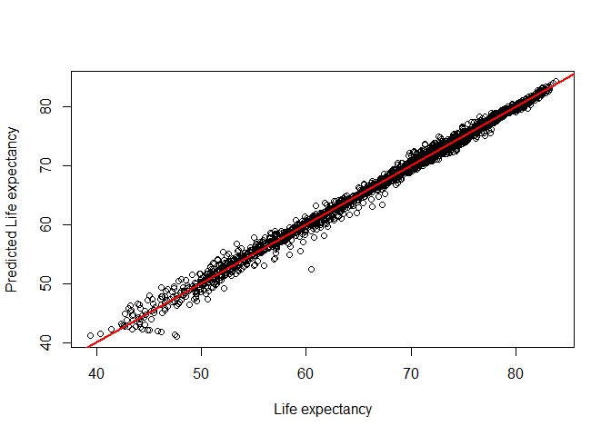
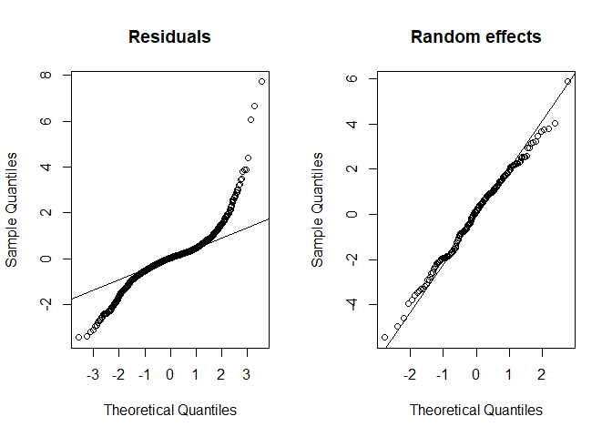
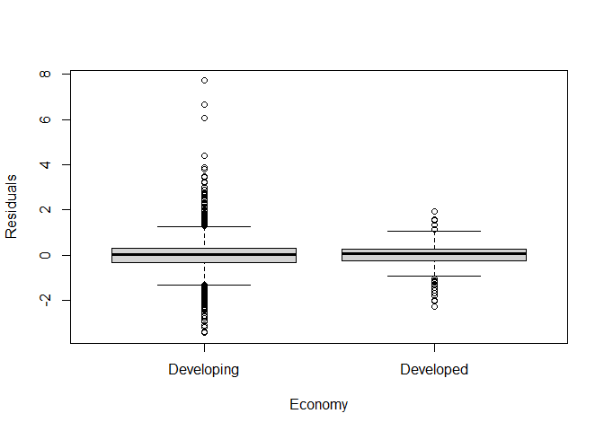
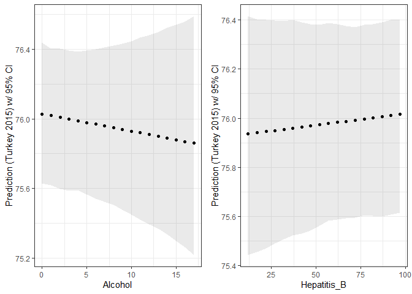
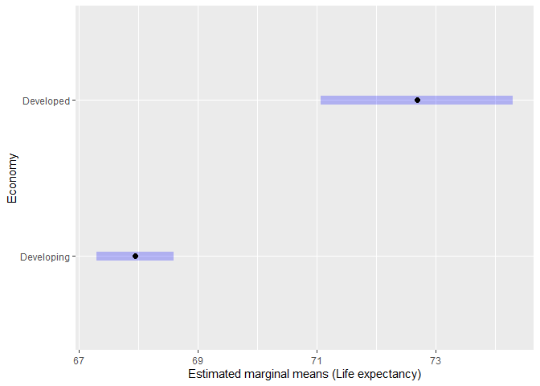
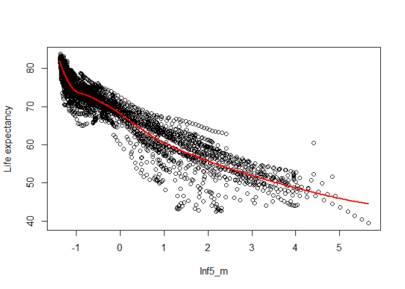
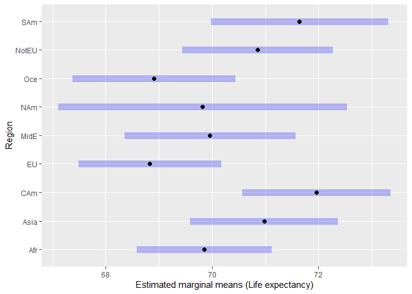
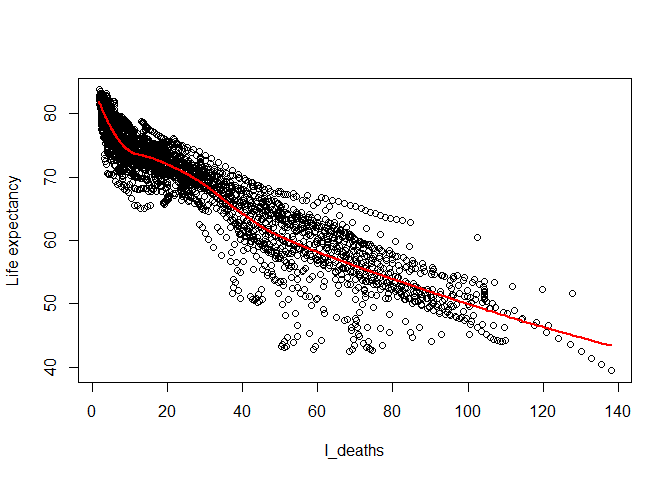
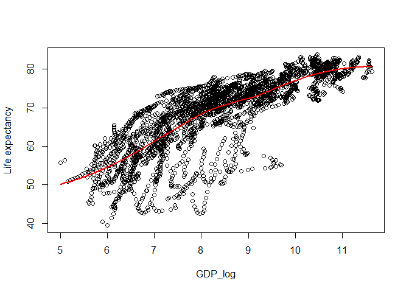
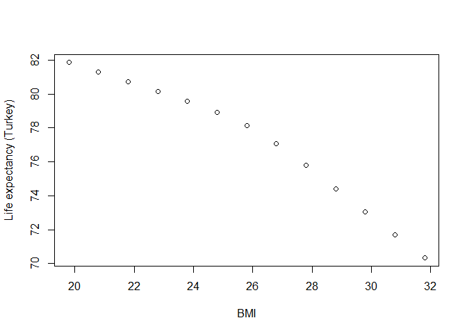

# The First Circle: Linear Regression, Part Three

<br/>
Jiří Fejlek

2025-05-25
<br/>

<br/> In Part Three of this demonstration of using linear regression and
some of its extensions, we seek to evaluate the **Life expectancy**
model (we created in Part Two) based on the data containing health,
immunization, and economic and demographic information about 179
countries from 2000 to 2015. Namely, we will look at its significant
predictors and evaluate its predictive performance. <br/>

## Evaluation of predictive performance (via cross-validation)

<br/> Let us discuss the correlated random effects model (CRE) we
constructed in Part Two in terms of predictive performance. We created
this model primarily to estimate the effect of our predictors on life
expectancy. Still, it is worth a look at how these apparently
significant effects in the model would be useful in the actual
prediction of life expectancy.

As a reminder, our model is (we will use *lmer* for the fit instead of
*plm*, because we plan to compare models using a likelihood ratio test
in a bit and *plm* does not compute likelihood function since it uses
estimates based on generalized least squares). <br/>

``` r
library(lme4)
library(sandwich)
library(clubSandwich)

## We will order the dataset by Country and Year (it will be useful later)

life_expectancy_pred <- life_expectancy_cent[order(life_expectancy_cent$Country,life_expectancy_cent$Year),]

## Correlated random effects model
cre_model <- lmer(Life_expectancy ~ Economy + Region + Alcohol + Hepatitis_B + Measles + BMI + Polio + Diphtheria + HIV + GDP_log + Pop_log + Thin_10_19 + Thin_5_9 + Schooling + Inf5_m  + Alcohol_cent + Hepatitis_B_cent + Measles_cent + BMI_cent + Polio_cent + Diphtheria_cent + HIV_cent + GDP_log_cent + Pop_log_cent + Thin_10_19_cent + Thin_5_9_cent + Schooling_cent + Inf5_m_cent + factor(Year) + (1 | Country), life_expectancy_pred)

summary(lmer_model)
```

    ## Linear mixed model fit by REML ['lmerMod']
    ## Formula: Life_expectancy ~ Economy + Region + Alcohol + Hepatitis_B +  
    ##     Measles + BMI + Polio + Diphtheria + HIV + GDP_log + Pop_log +  
    ##     Thin_10_19 + Thin_5_9 + Schooling + Inf5_m + Alcohol_cent +  
    ##     Hepatitis_B_cent + Measles_cent + BMI_cent + Polio_cent +  
    ##     Diphtheria_cent + HIV_cent + GDP_log_cent + Pop_log_cent +  
    ##     Thin_10_19_cent + Thin_5_9_cent + Schooling_cent + Inf5_m_cent +  
    ##     factor(Year) + (1 | Country)
    ##    Data: life_expectancy_cent
    ## 
    ## REML criterion at convergence: 7515.6
    ## 
    ## Scaled residuals: 
    ##     Min      1Q  Median      3Q     Max 
    ## -4.5599 -0.4188  0.0450  0.3907 10.1744 
    ## 
    ## Random effects:
    ##  Groups   Name        Variance Std.Dev.
    ##  Country  (Intercept) 4.3560   2.0871  
    ##  Residual             0.5728   0.7568  
    ## Number of obs: 2864, groups:  Country, 179
    ## 
    ## Fixed effects:
    ##                    Estimate Std. Error t value
    ## (Intercept)       5.657e+01  4.610e+00  12.271
    ## EconomyDeveloped  4.626e+00  1.003e+00   4.612
    ## RegionAsia        1.426e+00  7.041e-01   2.025
    ## RegionCAm         2.321e+00  7.818e-01   2.969
    ## RegionEU         -8.122e-01  1.159e+00  -0.701
    ## RegionMidE        2.045e-01  8.943e-01   0.229
    ## RegionNAm         1.244e-01  1.577e+00   0.079
    ## RegionOce        -6.862e-01  9.635e-01  -0.712
    ## RegionNotEU       1.138e+00  9.402e-01   1.210
    ## RegionSAm         2.058e+00  8.867e-01   2.321
    ## Alcohol          -9.912e-03  1.900e-02  -0.522
    ## Hepatitis_B       9.379e-04  2.132e-03   0.440
    ## Measles          -6.292e-03  2.137e-03  -2.945
    ## BMI              -9.757e-01  9.575e-02 -10.190
    ## Polio             1.088e-03  4.270e-03   0.255
    ## Diphtheria        1.297e-02  4.270e-03   3.039
    ## HIV              -8.416e-01  2.678e-02 -31.430
    ## GDP_log           4.553e-01  1.247e-01   3.650
    ## Pop_log           2.635e-01  2.812e-01   0.937
    ## Thin_10_19        4.314e-05  1.125e-02   0.004
    ## Thin_5_9          7.771e-04  1.111e-02   0.070
    ## Schooling        -2.305e-02  4.464e-02  -0.516
    ## Inf5_m           -2.697e+00  6.837e-02 -39.451
    ## Alcohol_cent     -2.009e-01  8.016e-02  -2.507
    ## Hepatitis_B_cent -2.438e-02  2.426e-02  -1.005
    ## Measles_cent      1.093e-02  1.304e-02   0.838
    ## BMI_cent          1.015e+00  1.755e-01   5.784
    ## Polio_cent        3.908e-02  5.861e-02   0.667
    ## Diphtheria_cent  -3.119e-02  5.984e-02  -0.521
    ## HIV_cent         -7.397e-02  8.997e-02  -0.822
    ## GDP_log_cent      9.513e-01  2.882e-01   3.301
    ## Pop_log_cent     -1.099e-01  3.119e-01  -0.352
    ## Thin_10_19_cent  -1.014e-01  2.437e-01  -0.416
    ## Thin_5_9_cent     8.899e-02  2.435e-01   0.365
    ## Schooling_cent   -2.625e-01  1.310e-01  -2.004
    ## Inf5_m_cent      -1.795e+00  3.792e-01  -4.735
    ## factor(Year)2001  1.145e-01  8.067e-02   1.419
    ## factor(Year)2002  1.798e-01  8.259e-02   2.178
    ## factor(Year)2003  2.983e-01  8.567e-02   3.482
    ## factor(Year)2004  5.307e-01  9.037e-02   5.873
    ## factor(Year)2005  6.565e-01  9.551e-02   6.874
    ## factor(Year)2006  8.810e-01  1.019e-01   8.643
    ## factor(Year)2007  1.097e+00  1.085e-01  10.117
    ## factor(Year)2008  1.392e+00  1.156e-01  12.044
    ## factor(Year)2009  1.676e+00  1.223e-01  13.709
    ## factor(Year)2010  1.990e+00  1.292e-01  15.401
    ## factor(Year)2011  2.255e+00  1.370e-01  16.463
    ## factor(Year)2012  2.514e+00  1.443e-01  17.426
    ## factor(Year)2013  2.808e+00  1.521e-01  18.468
    ## factor(Year)2014  3.110e+00  1.602e-01  19.416
    ## factor(Year)2015  3.297e+00  1.673e-01  19.708

<br/> Let us start with an obligatory actual vs. predicted plot. We
should note that prediction for a known individual is computed (using
function *predict*) as $X\hat{\beta} + \hat{\tau} + \hat{\mu}$, where $X$
are our “main” predictors, $\hat{\beta}$ is the estimate of the coefficients 
for the “main” predictors, $\hat{\tau}$ are the estimates of the fixed
time effects in the model, and $\hat{\mu}$ is the estimate of the
individual random effect from the model (this estimate is known as
*BLUP*, the best linear unbiased predictor). <br/>

``` r
plot(life_expectancy_pred$Life_expectancy,predict(cre_model),xlab = 'Life expectancy',ylab = 'Predicted Life expectancy')
abline(0,1, col="red", lwd = 2)
```

<!-- -->

<br/> It seem that the model fits the data pretty well. Let us evaluate,
how good this model would be for the predictions of life expectancy
(even though this is not its primary purpose which was effect
estimation/hypothesis testing).

Unlike fixed effects models, we have some options. Remember that the
fixed effects model uses a factor for each individual. Hence, we can
only make a reasonable prediction for the individuals in the model. With
random effects, we can actually make a prediction about new individuals
since the random effects model directly models the distribution of
individual effects (i.i.d. normally distributed with mean zero). Thus,
for an unknown individual, the random effect effectively becomes just
another error term.

Concerning the effects for individual years, we use the fixed effects.
Hence, we cannot make a prediction, for example, for the year 2016. To
make such predictions, we have to change the model by either replacing
time-fixed effects with time-random effects or, probably even better; we
could try to model the dependency in time directly by including
numerical predictor **Year** in some form (life expectancy seems to
steadily increase in time and our fixed effects estimates corresponded
to that, which is a far cry from estimates of individual effects). Let
us try that (we will model **Year** using a restricted cubic spline)
<br/>

``` r
library(rms)
cre_model_year <- lmer(Life_expectancy ~ Economy + Region + Alcohol + Hepatitis_B + Measles + BMI + Polio + Diphtheria + HIV + GDP_log + Pop_log + Thin_10_19 + Thin_5_9 + Schooling + Inf5_m  + Alcohol_cent + Hepatitis_B_cent + Measles_cent + BMI_cent + Polio_cent + Diphtheria_cent + HIV_cent + GDP_log_cent + Pop_log_cent + Thin_10_19_cent + Thin_5_9_cent + Schooling_cent + Inf5_m_cent + rcs(Year,4) + (1 | Country), life_expectancy_pred)
```

<br/> We can compare these two models using the likelihood ratio test.
The function *anova* refits the model using maximum likelihood instead
of using restricted maximum likelihood (REML) because restricted
likelihood functions of distinct models are not comparable if they do
not have the same *fixed effects*. We should mention here that the
*fixed effects *(in the context of general mixed models) mean just terms
in the model that are not random effects (i.e., they are terms that
would form an ordinary regression model). <br/>

``` r
anova(cre_model,cre_model_year)
```

    ## Data: life_expectancy_pred
    ## Models:
    ## cre_model_year: Life_expectancy ~ Economy + Region + Alcohol + Hepatitis_B + Measles + BMI + Polio + Diphtheria + HIV + GDP_log + Pop_log + Thin_10_19 + Thin_5_9 + Schooling + Inf5_m + Alcohol_cent + Hepatitis_B_cent + Measles_cent + BMI_cent + Polio_cent + Diphtheria_cent + HIV_cent + GDP_log_cent + Pop_log_cent + Thin_10_19_cent + Thin_5_9_cent + Schooling_cent + Inf5_m_cent + rcs(Year, 4) + (1 | Country)
    ## cre_model: Life_expectancy ~ Economy + Region + Alcohol + Hepatitis_B + Measles + BMI + Polio + Diphtheria + HIV + GDP_log + Pop_log + Thin_10_19 + Thin_5_9 + Schooling + Inf5_m + Alcohol_cent + Hepatitis_B_cent + Measles_cent + BMI_cent + Polio_cent + Diphtheria_cent + HIV_cent + GDP_log_cent + Pop_log_cent + Thin_10_19_cent + Thin_5_9_cent + Schooling_cent + Inf5_m_cent + factor(Year) + (1 | Country)
    ##                npar    AIC    BIC  logLik deviance  Chisq Df Pr(>Chisq)
    ## cre_model_year   41 7424.9 7669.2 -3671.4   7342.9                     
    ## cre_model        53 7445.9 7761.8 -3669.9   7339.9 3.0132 12     0.9954

<br/> As can be seen from the results, these two models indeed seem
almost identical in terms of log-likelihood. Hence, we will use the
model with **Year** modeled using a restricted cubic spline. This model
allows us to predict life expectancy for unobserved years. Hence, let us
evaluate its performance via a cross-validation. To respect the
structure of the panel data and keep it balanced, I will consider
cross-validation over the whole columns. Since we have the data for only
16 years, I will perform merely a simple leave-one-out cross-validation
with mean square error as a performance metric. <br/>

``` r
years <- seq(2000,2015,1)
MSE_pred <- numeric(16)

for(i in 1:16){
  
  train_set <- life_expectancy_pred[life_expectancy_pred$Year != years[i],]
  test_set <- life_expectancy_pred[life_expectancy_pred$Year == years[i],]
  
  
cre_model_year_new <- lmer(Life_expectancy ~ Economy + Region + Alcohol + Hepatitis_B + Measles + BMI + Polio + Diphtheria + HIV + GDP_log + Pop_log + Thin_10_19 + Thin_5_9 + Schooling + Inf5_m  + Alcohol_cent + Hepatitis_B_cent + Measles_cent + BMI_cent + Polio_cent + Diphtheria_cent + HIV_cent + GDP_log_cent + Pop_log_cent + Thin_10_19_cent + Thin_5_9_cent + Schooling_cent + Inf5_m_cent + rcs(Year,4) + (1 | Country), train_set)
  
  MSE_pred[i] <- mean((test_set$Life_expectancy - predict(cre_model_year_new,test_set))^2)
  }
MSE_pred
```

    ##  [1] 2.1632567 0.9825796 0.5638226 0.4621187 0.4167693 0.4485832 0.4290238
    ##  [8] 0.3617235 0.2488589 0.2264488 0.7179689 0.4322098 0.4481797 0.6004497
    ## [15] 0.8282301 1.0851344

``` r
mean(MSE_pred)
```

    ## [1] 0.6509599

<br/> We see that predictions are fairly accurate on average. The
squared root of MSE (0.81) is just a bit higher than the estimated
standard deviation of the residual error (0.76). Notice that the worst
predictions are, as one would expect, outside the boundaries of the
dataset (i.e., the prediction for the year 2000 using the data from
2001-2015 and the prediction for the year 2015 using the data from
2000-2014).

Let us try the predictions for a new individual. Thus, we will now
perform a cross-validation on the countries, i.e., using the rows of the
dataset. I will perform 100 repetitions of the 10-fold cross-validation.
We should emphasize that for a new individual, the prediction of the
individual random effect is simply zero. <br/>

``` r
library(caret)

## Define not in function
`%!in%` = Negate(`%in%`)

## Number of repetitions and folds
rep <- 100
folds <- 10

## List of countries
countries_list <- unique(life_expectancy$Country)

## I add dummies for Region to data explicitly to make prediction work even when some levels of factor 
## would be missing due to resampling

le_cc <- life_expectancy_pred %>% add_column(as.data.frame(dummy(life_expectancy_pred$Region)))

MSE_pred <- matrix(0,folds,rep)

set.seed(123) # for reproducibility


for(j in 1:rep){
  
  d <- createFolds(countries_list, k = folds)

  for(i in 1:folds){

    countries_test <- countries_list[unlist(d[i])]
    train_set <- le_cc[le_cc$Country %!in% countries_test,]
    test_set <- le_cc[le_cc$Country %in% countries_test,]

    cre_model_year_new <- lmer(Life_expectancy ~ Economy + NAm + Asia + CAm + EU + MidE + Oce + NotEU + SAm + 
                                 Alcohol + Hepatitis_B + Measles + BMI + Polio + Diphtheria + HIV + GDP_log + 
                                 Pop_log + Thin_10_19 + Thin_5_9 + Schooling + Inf5_m  + Alcohol_cent + 
                                 Hepatitis_B_cent+ Measles_cent + BMI_cent + Polio_cent + Diphtheria_cent + 
                                 HIV_cent + GDP_log_cent + Pop_log_cent + Thin_10_19_cent + Thin_5_9_cent +
                                 Schooling_cent + Inf5_m_cent + rcs(Year,4) + (1 | Country), train_set)

    ## Set random effect prediction zero via re.form=~0
    MSE_pred[i,j] <- mean((test_set$Life_expectancy - predict(cre_model_year_new,test_set, re.form=~0))^2)
    
  }
}

mean(MSE_pred)  
```

    ## [1] 6.325255

<br/> We see that the mean square error is significantly higher than in
the previous setup. Still, the squared root of MSE (2.5) again mostly
corresponds to the estimates of deviance of individual random effects
and residual error (2.2) <br/>

``` r
VarCorr(cre_model_year)
```

    ##  Groups   Name        Std.Dev.
    ##  Country  (Intercept) 2.08714 
    ##  Residual             0.75555

<br/> Overall, our predictors model life expectancy fairly well. Still,
a noticeable portion of the variance in life expectancy is captured by
individual random effects, which could be perhaps explained by new
additional predictions. <br/>

## Predictions for individual countries (confidence intervals)

<br/> Let us now move to predictions for an individual country. We will
assume the dataset without one country, e.g., France, and try to predict
France’s life expectancy from the rest of the data. We will first
compute the confidence interval, i.e., an interval estimate for the mean
prediction.

The default method for mixed effects models is a parametric bootstrap.
This bootstrap assumes that the model is correctly specified, and thus,
creates bootstrap samples directly from the model. <br/>

``` r
## Design matrices and no France model
le_france <- life_expectancy_pred[life_expectancy_pred$Country == 'France',]
le_nofrance <- life_expectancy_pred[life_expectancy_pred$Country != 'France',]

model_nofrance <- lmer(Life_expectancy ~ Economy + Region + Alcohol + Hepatitis_B + Measles + BMI + Polio + Diphtheria + HIV + GDP_log + Pop_log + Thin_10_19 + Thin_5_9 + Schooling + Inf5_m  + Alcohol_cent + Hepatitis_B_cent + Measles_cent + BMI_cent + Polio_cent + Diphtheria_cent + HIV_cent + GDP_log_cent + Pop_log_cent + Thin_10_19_cent + Thin_5_9_cent + Schooling_cent + Inf5_m_cent + rcs(Year,4) + (1 | Country), le_nofrance)

## Random effects & error estimates
country_sd <- as.data.frame(VarCorr(model_nofrance))$sdcor[1]
resid_sd <- as.data.frame(VarCorr(model_nofrance))$sdcor[2]

## Parametric bootstrap
set.seed(123) # for reproducibility

pred_france_pb <- matrix(0,1000,16)

for(i in 1:1000){
## New observations (we have to remember that we need to generate random effect for each country only once)
new_ref <- rep(rnorm(178,0,country_sd),each = 16)
le_new <-  predict(model_nofrance,le_nofrance, re.form=~0) + new_ref + rnorm(dim(le_nofrance)[1],0,resid_sd)
  
## Refit the model and predict France (confidence interval)
model_new <- refit(model_nofrance, le_new)
pred_france_pb[i,] <-  predict(model_new,le_france, re.form=~0)
}
```

<br/> The parametric bootstrap is sensitive to a misspecification of the
model. Remember that we noticed from the diagnostic plots that residuals
are not normally distributed, and there might be heteroskedasticity
between the clusters. Let us focus on the nonnormality first. <br/>

``` r
par(mfrow = c(1, 2))
qqnorm(residuals(model_nofrance), main = "Residuals")
qqline((residuals(model_nofrance)))

qqnorm(unlist(ranef(model_nofrance)), main = "Random effects")
qqline(unlist(ranef(model_nofrance)))
```



<br/> We see that residuals do not have a normal distribution. Thus,
instead of a parametric bootstrap, we can consider a semi-parametric
bootstrap: a residual (cluster) bootstrap, which, instead of generating
new individual (so-called idiosyncratic) errors from the assumed
distribution, resamples observed residuals by clusters. Notice that this
approach assumes that each cluster’s distributions of individual errors
are identical. <br/>

``` r
## Residual cluster bootstrap
set.seed(123) # for reproducibility

country_index <- seq(1,178,1)
res_nofrance <- matrix(residuals(model_nofrance),ncol = 16,byrow = TRUE)
pred_france_spb <- matrix(0,1000,16)

for(i in 1:1000){
## Resample residuals by clusters
new_res <- res_nofrance[sample(country_index, rep=TRUE),]
new_res <- matrix(t(new_res),ncol = 1)
new_ref <- rep(rnorm(178,0,country_sd),each = 16)

le_new <- predict(model_nofrance,le_nofrance, re.form=~0) + new_ref + new_res

## Refit the model and predict France (confidence interval)

model_new <- refit(model_nofrance, le_new)
pred_france_spb[i,] <-  predict(model_new,le_france, re.form=~0)
}
```

<br/> The disadvantage of parametric bootstrap is that this approach is
not robust to hetereskodasticity between clusters. Thus, we can consider
another semi-parametric bootstrap: *wild bootstrap*. Instead of
resampling the residuals themselves, the wild bootstrap rescales
residuals with a random variable *v* such that $\mathrm{E} v = 0$ and
$\mathrm{Var} v = 1$. Often, these weights are chosen simply as *-1*
with a probability *0.5* and *1* with a probability *0.5*, the so-called
Rademacher weights. This is why the bootstrap is termed wild, because it
is kind of *wild* that such a bootstrap provides asymptotically valid
results, see, e.g., *A. A. Djogbenou, J. G. MacKinnon, and M. Ø.
Nielsen. Asymptotic theory and wild bootstrap inference with clustered
errors. Journal of Econometrics 212.2 (2019): 393-412*. <br/>

``` r
## Wild cluster bootstrap
set.seed(123) # for reproducibility

res_nofrance <- residuals(model_nofrance)
pred_france_wb <- matrix(0,1000,16)

for(i in 1:1000){
## Scale  residuals by Rademacher weights
new_res <-rep(2*round(runif(178),0)-1,each = 16) * res_nofrance
new_ref <- rep(rnorm(178,0,country_sd),each = 16)

le_new <- predict(model_nofrance,le_nofrance, re.form=~0) + new_ref + new_res

## Refit the model and predict France (confidence interval)
model_new <- refit(model_nofrance, le_new)
pred_france_wb[i,] <- predict(model_new,le_france, re.form=~0)
}
```

<br/> The last variant of bootstrap we will try is pairs cluster
bootstrap that we already used few times in this project. <br/>

``` r
## Pairs cluster bootstrap
set.seed(123) # for reproducibility

Countries_list <- unique(le_nofrance$Country)
pred_france_pcb <- matrix(0,1000,16)

for(i in 1:1000){
## Resample observations by clusters  
Countries_new <- sample(Countries_list , rep=TRUE)
le_nofrance_new <- le_nofrance[le_nofrance$Country == Countries_new[1],]

for (j in 2:length(Countries_list)){
  le_nofrance_new <- rbind(le_nofrance_new,le_nofrance[le_nofrance$Country == Countries_new[j],])
}

## Refit the model and predict France (confidence interval)
model_new <- lmer(Life_expectancy ~ Economy + Region + Alcohol + Hepatitis_B + Measles + BMI + Polio + Diphtheria + HIV + GDP_log + Pop_log + Thin_10_19 + Thin_5_9 + Schooling + Inf5_m  + Alcohol_cent + Hepatitis_B_cent + Measles_cent + BMI_cent + Polio_cent + Diphtheria_cent + HIV_cent + GDP_log_cent + Pop_log_cent + Thin_10_19_cent + Thin_5_9_cent + Schooling_cent + Inf5_m_cent + rcs(Year,4) + (1 | Country), le_nofrance_new)

pred_france_pcb[i,] <- predict(model_new, le_france, re.form=~0)
}
```

<br/> Let us check the results. <br/>

``` r
options(width = 1000)

pb <- t(apply(pred_france_pb,2,function(x) quantile(x[!is.na(x)],c(0.025,0.975)))) 
spb <- t(apply(pred_france_spb,2,function(x) quantile(x[!is.na(x)],c(0.025,0.975))))
wb <-  t(apply(pred_france_wb,2,function(x) quantile(x[!is.na(x)],c(0.025,0.975))))
pcb <- t(apply(pred_france_pcb,2,function(x) quantile(x[!is.na(x)],c(0.025,0.975))))

ci_france <- cbind(pb,spb,wb,pcb)
colnames(ci_france) <- c('2.5% (Par)','97.5% (Par)','2.5% (Semi-Par)','97.5% (Semi-Par)','2.5% (Wild)','97.5% (Wild)','2.5% (Pairs)','97.5% (Pairs)')
ci_france
```

    ##       2.5% (Par) 97.5% (Par) 2.5% (Semi-Par) 97.5% (Semi-Par) 2.5% (Wild) 97.5% (Wild) 2.5% (Pairs) 97.5% (Pairs)
    ##  [1,]   75.01653    80.02804        74.95629         79.99386    74.89860     80.30795     75.47026      79.62444
    ##  [2,]   75.02097    80.05916        74.99642         80.00336    74.92078     80.28307     75.49082      79.62930
    ##  [3,]   75.15086    80.19861        75.10462         80.12476    75.06134     80.41120     75.60051      79.70364
    ##  [4,]   75.29730    80.35208        75.22136         80.28829    75.26493     80.55889     75.77792      79.84461
    ##  [5,]   75.40582    80.46887        75.33470         80.39512    75.34130     80.62156     75.84445      79.98333
    ##  [6,]   75.61219    80.68519        75.52712         80.59968    75.56166     80.81484     76.06027      80.20230
    ##  [7,]   75.84619    80.94960        75.74420         80.82069    75.79641     81.07350     76.30385      80.45333
    ##  [8,]   76.11015    81.23791        76.02022         81.12155    76.04009     81.33190     76.57865      80.69782
    ##  [9,]   76.39512    81.49626        76.30733         81.38206    76.32355     81.63169     76.81878      81.03116
    ## [10,]   76.67587    81.75129        76.55992         81.64558    76.56129     81.88197     77.10031      81.22202
    ## [11,]   76.95615    82.01075        76.87710         81.94095    76.83840     82.13498     77.34276      81.57064
    ## [12,]   77.18767    82.27237        77.12228         82.17348    77.11516     82.34062     77.58371      81.82797
    ## [13,]   77.50788    82.61496        77.45262         82.49961    77.47878     82.70530     77.96575      82.15238
    ## [14,]   77.73091    82.87598        77.70943         82.79578    77.72438     82.92494     78.24446      82.39478
    ## [15,]   77.99397    83.14406        77.93634         83.02149    77.99098     83.18327     78.50487      82.65954
    ## [16,]   78.27526    83.37908        78.20063         83.30831    78.26793     83.42383     78.75552      82.93481

<br/> We see that the results of all four bootstraps are fairly similar
in this particular case. Having demonstrated the computation of
confidence intervals for any single observation, let us investigate
*prediction* intervals. <br/>

## Predictions for individual countries (prediction intervals)

<br/> Prediction intervals are interval estimates for a new
observations. Provided that the model is correctly specified, the
computation of the prediction interval is straightforward via the
parametric bootstrap. <br/>

``` r
## Parametric bootstrap
set.seed(123) # for reproducibility

pred_france_pb <- matrix(0,1000,16)

for(i in 1:1000){
## New observations
new_ref <- rep(rnorm(178,0,country_sd),each = 16)
le_new <- predict(model_nofrance,le_nofrance, re.form=~0) + new_ref + rnorm(dim(le_nofrance)[1],0,resid_sd)

## Refit the model and predict France (prediction interval)
model_new <- refit(model_nofrance, le_new)
country_sd_new <- as.data.frame(VarCorr(model_new))$sdcor[1]
resid_sd_new <- as.data.frame(VarCorr(model_new))$sdcor[2]

pred_france_pb[i,] <- predict(model_new, le_france, re.form=~0) + rnorm(1,0,country_sd_new) + rnorm(16,0,resid_sd_new)
}
```

<br/> Alternatively, we can also use residual cluster bootstrap to
account for non-normal distribution and inter-cluster correlation. <br/>

``` r
## Residual cluster bootstrap
set.seed(123) # for reproducibility

country_index <- seq(1,178,1)
res_nofrance <- residuals(model_nofrance)
res_nofrance <- matrix(res_nofrance,ncol = 16,byrow = TRUE)
pred_france_spb <- matrix(0,1000,16)

for(i in 1:1000){
## We resample residuals by clusters
new_res <- res_nofrance[sample(country_index, rep=TRUE),]
new_res <- matrix(t(new_res),ncol = 1)
new_ref <- rep(rnorm(178,0,country_sd),each = 16)
le_new <- predict(model_nofrance,le_nofrance, re.form=~0) + new_ref + new_res

## Refit the model and predict France (prediction interval)
model_new <- refit(model_nofrance, le_new)
country_sd_new <- as.data.frame(VarCorr(model_new))$sdcor[1]
res_nofrance_new <- residuals(model_new)
res_nofrance_new <- matrix(res_nofrance,ncol = 16,byrow = TRUE)
new_res <- res_nofrance_new[sample(seq(1,178,1),1),]

pred_france_spb[i,] <- predict(model_new, le_france, re.form=~0) + rnorm(1,0,country_sd_new) + new_res
}
```

<br/> However, the residual cluster bootstrap does not help with
heteroskedasticity. Provided that the variance of individual errors
changes with the value of predictors, our prediction interval could be
severely underestimated or overestimated (residual cluster bootstrap, in
essence, pools these errors together, creating an “averaged” estimate of
the individual error). And to remedy that, we would need a
heteroskedasticity model. This is unlike confidence intervals, which we
could compute in a way that was robust to heteroskedasticity.

For example, we can notice that there seems to be heteroskedasticity
wrt. the **Economy** factor developing/developed. <br/>



<br/> We can fit a new model that models this heteroskedasticity by
assuming a different individual error variance per stratum developed and
developing. We need to use a different package, *nlme*, which allows us
to fit a mixed effects model with variance structure functions (see
<https://stat.ethz.ch/R-manual/R-devel/library/nlme/html/varClasses.html>
for the available options). <br/>

``` r
library(nlme)
library(lmeInfo)
model_economy <- lme(Life_expectancy ~ Economy + Region + Alcohol + Hepatitis_B + Measles + BMI + Polio + Diphtheria + HIV + GDP_log + Pop_log + Thin_10_19 + Thin_5_9 + Schooling + Inf5_m  + Alcohol_cent + Hepatitis_B_cent + Measles_cent + BMI_cent + Polio_cent + Diphtheria_cent + HIV_cent + GDP_log_cent + Pop_log_cent + Thin_10_19_cent + Thin_5_9_cent + Schooling_cent + Inf5_m_cent + rcs(Year,4), random = ~1|Country, weights=varIdent(form =  ~ 1|Economy), data = le_nofrance)
summary(model_economy)
```

    ## Linear mixed-effects model fit by REML
    ##   Data: le_nofrance 
    ##        AIC      BIC    logLik
    ##   7323.873 7573.377 -3619.936
    ## 
    ## Random effects:
    ##  Formula: ~1 | Country
    ##         (Intercept)  Residual
    ## StdDev:    2.087928 0.8245656
    ## 
    ## Variance function:
    ##  Structure: Different standard deviations per stratum
    ##  Formula: ~1 | Economy 
    ##  Parameter estimates:
    ## Developing  Developed 
    ##  1.0000000  0.5383832 
    ## Fixed effects:  Life_expectancy ~ Economy + Region + Alcohol + Hepatitis_B +      Measles + BMI + Polio + Diphtheria + HIV + GDP_log + Pop_log +      Thin_10_19 + Thin_5_9 + Schooling + Inf5_m + Alcohol_cent +      Hepatitis_B_cent + Measles_cent + BMI_cent + Polio_cent +      Diphtheria_cent + HIV_cent + GDP_log_cent + Pop_log_cent +      Thin_10_19_cent + Thin_5_9_cent + Schooling_cent + Inf5_m_cent +      rcs(Year, 4) 
    ##                         Value Std.Error   DF   t-value p-value
    ## (Intercept)        -249.94103  34.79842 2654  -7.18254  0.0000
    ## EconomyDeveloped      4.72741   1.01028  155   4.67929  0.0000
    ## RegionAsia            1.43964   0.70505  155   2.04189  0.0429
    ## RegionCAm             2.34254   0.78302  155   2.99168  0.0032
    ## RegionEU             -0.86659   1.16053  155  -0.74672  0.4564
    ## RegionMidE            0.19088   0.89528  155   0.21320  0.8314
    ## RegionNAm             0.31097   1.59450  155   0.19503  0.8456
    ## RegionOce            -0.71243   0.96491  155  -0.73833  0.4614
    ## RegionNotEU           1.16569   0.94135  155   1.23832  0.2175
    ## RegionSAm             2.11286   0.89030  155   2.37321  0.0189
    ## Alcohol              -0.01846   0.01630 2654  -1.13238  0.2576
    ## Hepatitis_B          -0.00011   0.00205 2654  -0.05266  0.9580
    ## Measles              -0.00653   0.00206 2654  -3.16914  0.0015
    ## BMI                  -0.84858   0.08515 2654  -9.96511  0.0000
    ## Polio                -0.00022   0.00443 2654  -0.05024  0.9599
    ## Diphtheria            0.01367   0.00444 2654   3.08018  0.0021
    ## HIV                  -0.82057   0.02891 2654 -28.38756  0.0000
    ## GDP_log               0.29623   0.12666 2654   2.33883  0.0194
    ## Pop_log              -0.38225   0.28053 2654  -1.36261  0.1731
    ## Thin_10_19           -0.00217   0.01223 2654  -0.17760  0.8590
    ## Thin_5_9              0.00027   0.01208 2654   0.02264  0.9819
    ## Schooling            -0.05367   0.03927 2654  -1.36661  0.1719
    ## Inf5_m               -2.64274   0.07102 2654 -37.21233  0.0000
    ## Alcohol_cent         -0.20042   0.08019  155  -2.49944  0.0135
    ## Hepatitis_B_cent     -0.01303   0.02728  155  -0.47758  0.6336
    ## Measles_cent          0.01248   0.01314  155   0.94939  0.3439
    ## BMI_cent              0.89055   0.17007  155   5.23631  0.0000
    ## Polio_cent            0.03975   0.05869  155   0.67738  0.4992
    ## Diphtheria_cent      -0.04260   0.06129  155  -0.69503  0.4881
    ## HIV_cent             -0.09303   0.09074  155  -1.02526  0.3068
    ## GDP_log_cent          1.08942   0.29038  155   3.75173  0.0002
    ## Pop_log_cent          0.52897   0.31147  155   1.69831  0.0915
    ## Thin_10_19_cent      -0.11860   0.24516  155  -0.48376  0.6292
    ## Thin_5_9_cent         0.11274   0.24551  155   0.45919  0.6467
    ## Schooling_cent       -0.22430   0.12970  155  -1.72942  0.0857
    ## Inf5_m_cent          -1.86706   0.38058  155  -4.90584  0.0000
    ## rcs(Year, 4)Year      0.15315   0.01722 2654   8.89645  0.0000
    ## rcs(Year, 4)Year'     0.25229   0.04350 2654   5.80020  0.0000
    ## rcs(Year, 4)Year''   -0.60231   0.12592 2654  -4.78324  0.0000
    ##  Correlation: 
    ##                    (Intr) EcnmyD RegnAs RgnCAm RegnEU RgnMdE RgnNAm RegnOc RgnNEU RgnSAm Alcohl Hptt_B Measls BMI    Polio  Dphthr HIV    GDP_lg Pop_lg Th_10_19 Th_5_9 Schlng Inf5_m Alchl_ Hpt_B_ Msls_c BMI_cn Pl_cnt Dphth_ HIV_cn GDP_l_ Pp_lg_ T_10_19_ T_5_9_ Schln_ Inf5__ rc(Y,4)Y rc(Y,4)Y'
    ## EconomyDeveloped    0.002                                                                                                                                                                                                                                                                            
    ## RegionAsia         -0.012  0.036                                                                                                                                                                                                                                                                     
    ## RegionCAm          -0.007  0.074  0.365                                                                                                                                                                                                                                                              
    ## RegionEU           -0.013 -0.588  0.304  0.459                                                                                                                                                                                                                                                       
    ## RegionMidE          0.023 -0.023  0.445  0.441  0.311                                                                                                                                                                                                                                                
    ## RegionNAm           0.015 -0.190  0.263  0.315  0.458  0.320                                                                                                                                                                                                                                         
    ## RegionOce          -0.011 -0.221  0.277  0.490  0.480  0.430  0.293                                                                                                                                                                                                                                  
    ## RegionNotEU        -0.025 -0.104  0.440  0.565  0.616  0.381  0.390  0.475                                                                                                                                                                                                                           
    ## RegionSAm          -0.009  0.146  0.337  0.538  0.378  0.395  0.319  0.407  0.498                                                                                                                                                                                                                    
    ## Alcohol            -0.033  0.000  0.000  0.000  0.000  0.000  0.000  0.000  0.000  0.000                                                                                                                                                                                                             
    ## Hepatitis_B         0.062  0.000  0.000  0.000  0.000  0.000  0.000  0.000  0.000  0.000  0.063                                                                                                                                                                                                      
    ## Measles             0.020  0.000  0.000  0.000  0.000  0.000  0.000  0.000  0.000  0.000 -0.048 -0.196                                                                                                                                                                                               
    ## BMI                 0.350  0.000  0.000  0.000  0.000  0.000  0.000  0.000  0.000  0.000 -0.053  0.049  0.061                                                                                                                                                                                        
    ## Polio               0.028  0.000  0.000  0.000  0.000  0.000  0.000  0.000  0.000  0.000 -0.033  0.001 -0.050  0.010                                                                                                                                                                                 
    ## Diphtheria         -0.018  0.000  0.000  0.000  0.000  0.000  0.000  0.000  0.000  0.000  0.031 -0.225 -0.007  0.006 -0.785                                                                                                                                                                          
    ## HIV                -0.051  0.000  0.000  0.000  0.000  0.000  0.000  0.000  0.000  0.000  0.031  0.011 -0.031 -0.058 -0.007  0.005                                                                                                                                                                   
    ## GDP_log             0.150  0.000  0.000  0.000  0.000  0.000  0.000  0.000  0.000  0.000 -0.284 -0.085 -0.044 -0.143  0.028 -0.020 -0.097                                                                                                                                                            
    ## Pop_log             0.096  0.000  0.000  0.000  0.000  0.000  0.000  0.000  0.000  0.000 -0.027 -0.028 -0.017 -0.088 -0.026 -0.032 -0.030  0.361                                                                                                                                                     
    ## Thin_10_19          0.014  0.000  0.000  0.000  0.000  0.000  0.000  0.000  0.000  0.000 -0.022 -0.003 -0.009  0.005 -0.055  0.049 -0.050  0.012  0.005                                                                                                                                              
    ## Thin_5_9            0.012  0.000  0.000  0.000  0.000  0.000  0.000  0.000  0.000  0.000 -0.033  0.003  0.003  0.008 -0.010  0.002 -0.081  0.007 -0.017 -0.652                                                                                                                                       
    ## Schooling           0.346  0.000  0.000  0.000  0.000  0.000  0.000  0.000  0.000  0.000 -0.017 -0.024 -0.107  0.105  0.034  0.001  0.015 -0.038  0.018  0.022    0.008                                                                                                                              
    ## Inf5_m              0.017  0.000  0.000  0.000  0.000  0.000  0.000  0.000  0.000  0.000  0.005 -0.053 -0.069  0.138  0.080  0.132 -0.279  0.343  0.443 -0.007   -0.007 -0.080                                                                                                                       
    ## Alcohol_cent        0.009 -0.111  0.133 -0.247 -0.292  0.211 -0.093  0.011 -0.236 -0.221 -0.203 -0.013  0.010  0.011  0.007 -0.006 -0.006  0.058  0.005  0.005    0.007  0.003 -0.001                                                                                                                
    ## Hepatitis_B_cent   -0.001  0.108  0.069  0.098  0.065  0.024  0.313  0.025  0.130  0.095 -0.005 -0.075  0.015 -0.004  0.000  0.017 -0.001  0.006  0.002  0.000    0.000  0.002  0.004 -0.131                                                                                                         
    ## Measles_cent       -0.013  0.098 -0.019  0.018 -0.051 -0.045 -0.038  0.083 -0.063  0.123  0.008  0.031 -0.157 -0.010  0.008  0.001  0.005  0.007  0.003  0.001   -0.001  0.017  0.011 -0.047  0.006                                                                                                  
    ## BMI_cent           -0.254  0.237  0.071 -0.167 -0.180 -0.263 -0.211 -0.270 -0.064 -0.109  0.027 -0.025 -0.031 -0.501 -0.005 -0.003  0.029  0.071  0.044 -0.002   -0.004 -0.053 -0.069  0.084 -0.061  0.031                                                                                           
    ## Polio_cent         -0.023  0.011 -0.006  0.127  0.091  0.077  0.099  0.113  0.120  0.122  0.002  0.000  0.004 -0.001 -0.075  0.059  0.001 -0.002  0.002  0.004    0.001 -0.003 -0.006 -0.043  0.075 -0.131 -0.093                                                                                    
    ## Diphtheria_cent    -0.004 -0.087 -0.016 -0.104 -0.052 -0.032 -0.201 -0.013 -0.086 -0.109 -0.002  0.016  0.001  0.000  0.057 -0.072  0.000  0.001  0.002 -0.004    0.000  0.000 -0.010  0.091 -0.500  0.026  0.104 -0.833                                                                             
    ## HIV_cent            0.041  0.067  0.293  0.258  0.195  0.208  0.147  0.179  0.241  0.207 -0.010 -0.004  0.010  0.018  0.002 -0.002 -0.319  0.031  0.010  0.016    0.026 -0.005  0.089 -0.132  0.058  0.050 -0.112 -0.063 -0.033                                                                      
    ## GDP_log_cent       -0.115 -0.392  0.057  0.084  0.285 -0.097  0.032  0.210  0.247  0.018  0.124  0.037  0.019  0.062 -0.012  0.009  0.042 -0.436 -0.158 -0.005   -0.003  0.016 -0.149 -0.162 -0.029 -0.119 -0.148  0.146 -0.036 -0.075                                                               
    ## Pop_log_cent       -0.104 -0.059 -0.049  0.059  0.046 -0.044 -0.075  0.089  0.034 -0.034  0.024  0.026  0.016  0.079  0.023  0.029  0.027 -0.325 -0.901 -0.005    0.016 -0.016 -0.399 -0.024  0.032  0.046  0.006  0.026 -0.025  0.023  0.213                                                        
    ## Thin_10_19_cent     0.005 -0.109  0.087 -0.005  0.035  0.009 -0.025  0.052 -0.004 -0.052  0.001  0.000  0.000  0.000  0.003 -0.002  0.003 -0.001  0.000 -0.050    0.033 -0.001  0.000  0.108 -0.131 -0.245 -0.018 -0.049  0.102  0.050 -0.012  0.006                                                 
    ## Thin_5_9_cent      -0.020  0.145 -0.162  0.022 -0.038 -0.054  0.026 -0.032  0.017  0.096  0.002  0.000  0.000  0.000  0.000  0.000  0.004  0.000  0.001  0.032   -0.049  0.000  0.000 -0.117  0.139  0.272  0.089  0.058 -0.110 -0.093  0.009 -0.009 -0.964                                          
    ## Schooling_cent     -0.091 -0.138 -0.293  0.057  0.046  0.000  0.024  0.017 -0.154  0.053  0.005  0.007  0.032 -0.032 -0.010  0.000 -0.005  0.011 -0.005 -0.007   -0.002 -0.303  0.024 -0.276  0.082 -0.067 -0.208  0.006 -0.029 -0.130 -0.133 -0.026  0.097   -0.040                                 
    ## Inf5_m_cent        -0.090 -0.145  0.196  0.326  0.331  0.211  0.099  0.350  0.368  0.302 -0.001  0.010  0.013 -0.026 -0.015 -0.025  0.052 -0.064 -0.083  0.001    0.001  0.015 -0.187 -0.105 -0.069 -0.007  0.094  0.265  0.019 -0.234  0.443  0.124 -0.062    0.087  0.208                          
    ## rcs(Year, 4)Year   -0.991  0.000  0.000  0.000  0.000  0.000  0.000  0.000  0.000  0.000  0.033 -0.063 -0.020 -0.353 -0.028  0.018  0.051 -0.152 -0.097 -0.014   -0.012 -0.349 -0.017 -0.007  0.005  0.003  0.177  0.002 -0.001 -0.016  0.066  0.087  0.001    0.001  0.106  0.003                   
    ## rcs(Year, 4)Year'   0.802  0.000  0.000  0.000  0.000  0.000  0.000  0.000  0.000  0.000  0.046  0.015  0.004  0.023  0.009 -0.008 -0.013  0.031 -0.014  0.004    0.023  0.036 -0.004 -0.009 -0.001 -0.001 -0.012 -0.001  0.001  0.004 -0.013  0.013  0.000   -0.001 -0.011  0.001 -0.810            
    ## rcs(Year, 4)Year'' -0.727  0.000  0.000  0.000  0.000  0.000  0.000  0.000  0.000  0.000 -0.035 -0.004 -0.008 -0.010 -0.004  0.013  0.010 -0.015  0.016  0.000   -0.025 -0.010  0.008  0.007  0.000  0.001  0.005  0.000 -0.001 -0.003  0.006 -0.014  0.000    0.001  0.003 -0.001  0.734   -0.983   
    ## 
    ## Standardized Within-Group Residuals:
    ##         Min          Q1         Med          Q3         Max 
    ## -4.71935555 -0.43012383  0.02300607  0.40328170  9.03973243 
    ## 
    ## Number of Observations: 2848
    ## Number of Groups: 178

<br/> We see that, indeed, the estimated standard deviation of
individual errors is lower for developed countries. Thus, we can use
this model instead to construct the prediction interval for France. We
will use a wild bootstrap to generate new datasets and a residual
bootstrap to simulate new observations for France. <br/>

``` r
economy_sd <- extract_varcomp(model_economy)$var_params

## Wild cluster bootstrap + residual cluster bootstrap, modeling heteroskedasticity using factor Economy
set.seed(123) # for reproducibility

country_index <- seq(1,178,1)
country_sd <- as.numeric(VarCorr(model_economy)[1,2])
developing_ind <- matrix(le_nofrance$Economy,ncol = 16,byrow = TRUE)[,1] # index for developed countries
  
res_nofrance <- residuals(model_economy)
pred_france_ec <- matrix(0,1000,16)

X_nofrance <- model.matrix(model_nofrance)
X_france <- model.matrix(cre_model_year)[which(life_expectancy_pred$Country == 'France'),]

for(i in 1:1000){
## Perform a wild bootstrap
new_res <- rep(2*round(runif(178),0)-1,each = 16) * res_nofrance
new_ref <- rep(rnorm(178,0,country_sd),each = 16)
le_new <- X_nofrance %*% fixef(model_economy) + new_ref + new_res

## Refit the model
model_new <- lme(le_new ~ Economy + Region + Alcohol + Hepatitis_B + Measles + BMI + Polio + Diphtheria + HIV + GDP_log + Pop_log + Thin_10_19 + Thin_5_9 + Schooling + Inf5_m  + Alcohol_cent + Hepatitis_B_cent + Measles_cent + BMI_cent + Polio_cent + Diphtheria_cent + HIV_cent + GDP_log_cent + Pop_log_cent + Thin_10_19_cent + Thin_5_9_cent + Schooling_cent + Inf5_m_cent + rcs(Year,4), random = ~1|Country, weights=varIdent(form =  ~ 1|Economy), data = le_nofrance)

country_sd_new <-  as.numeric(VarCorr(model_economy)[1,2])
res_nofrance_new <- residuals(model_new)
res_nofrance_new <- matrix(res_nofrance,ncol = 16,byrow = TRUE)

## Choose a residual from the new sample, reweigh the one for developing countries and predict France (prediction interval)
index <- sample(seq(1,178,1),1)

if (developing_ind[index] == 'Developing') {
  new_res <- res_nofrance_new[index,]*extract_varcomp(model_economy)$var_params
} else if (developing_ind[index] == 'Developed') {
  new_res <- res_nofrance_new[index,]
}

pred_france_ec[i,] <- X_france %*% fixef(model_new) + rnorm(1,0,country_sd_new) + new_res
}
```

<br/> Let us compare the results. <br/>

``` r
options(width = 1000)

pb <-  t(apply(pred_france_pb,2,function(x) quantile(x[!is.na(x)],c(0.025,0.975)))) 
spb <- t(apply(pred_france_spb,2,function(x) quantile(x[!is.na(x)],c(0.025,0.975))))
pecb <- t(apply(pred_france_ec,2,function(x) quantile(x[!is.na(x)],c(0.025,0.975))))

pi_france <- cbind(pb,spb,pecb)
colnames(pi_france) <- c('2.5% (Par)','97.5% (Par)','2.5% (Semi-Par)','97.5% (Semi-Par)','2.5% (Het. Eco)','97.5% (Het. Eco)')
pi_france
```

    ##       2.5% (Par) 97.5% (Par) 2.5% (Semi-Par) 97.5% (Semi-Par) 2.5% (Het. Eco) 97.5% (Het. Eco)
    ##  [1,]   72.47659    82.28048        72.50501         82.23970        72.09306         82.18711
    ##  [2,]   72.61622    82.73907        72.28958         82.25184        72.18341         82.22117
    ##  [3,]   72.63750    82.39562        72.67585         82.24425        72.22373         82.19017
    ##  [4,]   72.68780    82.74515        72.74275         82.52454        72.40041         82.37849
    ##  [5,]   72.61368    82.74347        72.98978         82.58019        72.62420         82.56339
    ##  [6,]   72.75291    82.83589        72.84371         82.67432        72.89825         82.80101
    ##  [7,]   73.08848    83.07026        73.36079         83.13692        73.17628         83.07372
    ##  [8,]   73.29208    83.62257        73.55795         83.28172        73.54691         83.39764
    ##  [9,]   73.91079    83.78639        73.89797         83.48660        73.93141         83.62997
    ## [10,]   73.88592    84.18325        74.18283         83.81993        74.22687         83.88079
    ## [11,]   74.13028    84.23198        74.09747         84.33955        74.43959         84.28576
    ## [12,]   74.77617    84.46284        74.90058         84.62171        74.82945         84.52522
    ## [13,]   74.91688    84.91984        74.90866         84.63818        75.01286         84.83705
    ## [14,]   75.03803    85.16312        75.20921         85.32377        75.27152         85.08898
    ## [15,]   75.34649    85.21657        75.54219         85.30182        75.44507         85.30824
    ## [16,]   75.95765    85.74094        75.71568         85.70238        75.74157         85.49925

<br/> We see that the prediction intervals did not change that much.
Still we cannot be really sure that the coverage of the prediction is
valid since we did not account for the heteroskedasticity in a
systematic manner. To do so, we would have to stray away from the
ordinary regression even farther and use, e.g., *quantile regression*
which seek to model quantiles of the response instead of just mean
response.

To summarize the results concerning the predictive performance of our
model, we see that our predictors can predict life expectancy reasonably
well on average (our estimate of RMSE for a new individual using the
10-fold cross-validation was 2.5). This corresponds to our estimate of
the prediction interval for predicting France from the rest of the data:
$\pm$ 5 years according to our computational experiments. Overall, there
is still a lot of unobserved heterogeneity modeled by individual
effects, and thus, to get more accurate predictions, we would have to
consider additional predictors in the model. <br/>

## Significant effects in the life expectancy model

<br/> Let us return to the model we used for effect estimation. <br/>

``` r
library(lme4)
life_expectancy <- life_expectancy_cent

## Correlated random effects model
cre_model <- lmer(Life_expectancy ~ Economy + Region + Alcohol + Hepatitis_B + Measles + BMI + Polio + Diphtheria + HIV + GDP_log + Pop_log + Thin_10_19 + Thin_5_9 + Schooling + Inf5_m  + Alcohol_cent + Hepatitis_B_cent + Measles_cent + BMI_cent + Polio_cent + Diphtheria_cent + HIV_cent + GDP_log_cent + Pop_log_cent + Thin_10_19_cent + Thin_5_9_cent + Schooling_cent + Inf5_m_cent + factor(Year) + (1 | Country), life_expectancy)
```

<br/> We will use cluster-robust standard errors (CR2) and Satterthwaite
DOF correction to identify significant predictors. <br/>

``` r
library(clubSandwich)
options(width = 1000)
coef_test(cre_model, vcov = "CR2", cluster = life_expectancy$Country)[1:23,]
```

    ## Alternative hypothesis: two-sided 
    ##             Coef.  Estimate      SE Null value   t-stat d.f. (Satt) p-val (Satt) Sig.
    ##       (Intercept)  5.66e+01 5.06094          0 11.17700       47.49      < 0.001  ***
    ##  EconomyDeveloped  4.63e+00 0.97155          0  4.76174       23.02      < 0.001  ***
    ##        RegionAsia  1.43e+00 0.76490          0  1.86386       42.24      0.06930    .
    ##         RegionCAm  2.32e+00 0.80738          0  2.87522       37.92      0.00659   **
    ##          RegionEU -8.12e-01 1.14468          0 -0.70951       31.52      0.48322     
    ##        RegionMidE  2.05e-01 0.89237          0  0.22918       30.62      0.82026     
    ##         RegionNAm  1.24e-01 1.95445          0  0.06363        4.32      0.95210     
    ##         RegionOce -6.86e-01 1.28595          0 -0.53363       20.71      0.59928     
    ##       RegionNotEU  1.14e+00 1.05947          0  1.07423       48.14      0.28808     
    ##         RegionSAm  2.06e+00 0.82448          0  2.49626       31.07      0.01806    *
    ##           Alcohol -9.91e-03 0.05562          0 -0.17821       31.81      0.85969     
    ##       Hepatitis_B  9.38e-04 0.00407          0  0.23025       45.47      0.81893     
    ##           Measles -6.29e-03 0.00557          0 -1.12882       38.04      0.26604     
    ##               BMI -9.76e-01 0.27433          0 -3.55676       38.63      0.00101   **
    ##             Polio  1.09e-03 0.00802          0  0.13570       54.35      0.89256     
    ##        Diphtheria  1.30e-02 0.00879          0  1.47602       51.91      0.14598     
    ##               HIV -8.42e-01 0.14720          0 -5.71709        5.81      0.00138   **
    ##           GDP_log  4.55e-01 0.38777          0  1.17401       38.42      0.24762     
    ##           Pop_log  2.63e-01 0.75910          0  0.34709       18.39      0.73247     
    ##        Thin_10_19  4.31e-05 0.01195          0  0.00361        5.89      0.99724     
    ##          Thin_5_9  7.77e-04 0.01307          0  0.05943        5.44      0.95473     
    ##         Schooling -2.30e-02 0.11752          0 -0.19610       66.66      0.84513     
    ##            Inf5_m -2.70e+00 0.30261          0 -8.91381       35.44      < 0.001  ***

<br/> We see that most of the predictors are not significant. Let us
start with the time-invariant predictors that we were able to estimate
thanks to the CRE model. The significant predictors are **Economy** and
some **Region**-specific factors. As far as **Economy** is concerned, it
seems that economically developed countries tend to have higher life
expectancy than developing countries, even after adjusting for other
covariates. We can investigate this more formally post hoc using
*lsmeans* (lsmeans computes estimated marginal means for a given factor,
see
<https://cran.r-project.org/web/packages/emmeans/vignettes/basics.html>
for more details). <br/>

    ## $lsmeans
    ##  Economy    lsmean    SE  df lower.CL upper.CL
    ##  Developing   68.0 0.329 156     67.3     68.6
    ##  Developed    72.6 0.819 156     71.0     74.2
    ## 
    ## Results are averaged over the levels of: Region, Year 
    ## Degrees-of-freedom method: kenward-roger 
    ## Confidence level used: 0.95 
    ## 
    ## $contrasts
    ##  contrast               estimate SE  df t.ratio p.value
    ##  Developing - Developed    -4.63  1 156  -4.612  <.0001
    ## 
    ## Results are averaged over the levels of: Region, Year 
    ## Degrees-of-freedom method: kenward-roger



<br/> Next, we focus on the **Region**-specific factors. First, we can
test formally whether the factor **Region** is significant in the model.
<br/>

``` r
Wald_test(cre_model, constraints = constrain_zero(c("RegionAsia","RegionCAm","RegionEU","RegionMidE","RegionNAm","RegionOce","RegionNotEU","RegionSAm")), vcov = "CR2", cluster = life_expectancy$Country)
```

    ##  test Fstat df_num df_denom  p_val sig
    ##   HTZ  2.95      8     32.4 0.0134   *

<br/> Indeed, it is. However, the differences between the estimated
marginal means for regions seem much less significant. <br/>

    ## $lsmeans
    ##  Region lsmean    SE  df lower.CL upper.CL
    ##  Afr      69.7 0.631 156     68.4     70.9
    ##  Asia     71.1 0.698 156     69.7     72.5
    ##  CAm      72.0 0.707 156     70.6     73.4
    ##  EU       68.9 0.680 156     67.5     70.2
    ##  MidE     69.9 0.811 156     68.3     71.5
    ##  NAm      69.8 1.380 156     67.1     72.5
    ##  Oce      69.0 0.775 156     67.4     70.5
    ##  NotEU    70.8 0.719 156     69.4     72.2
    ##  SAm      71.7 0.845 156     70.1     73.4
    ## 
    ## Results are averaged over the levels of: Economy, Year 
    ## Degrees-of-freedom method: kenward-roger 
    ## Confidence level used: 0.95 
    ## 
    ## $contrasts
    ##  contrast     estimate    SE  df t.ratio p.value
    ##  Afr - Asia    -1.4257 0.704 156  -2.025  0.5287
    ##  Afr - CAm     -2.3214 0.782 156  -2.969  0.0808
    ##  Afr - EU       0.8122 1.160 156   0.701  0.9987
    ##  Afr - MidE    -0.2045 0.894 156  -0.229  1.0000
    ##  Afr - NAm     -0.1244 1.580 156  -0.079  1.0000
    ##  Afr - Oce      0.6862 0.963 156   0.712  0.9986
    ##  Afr - NotEU   -1.1381 0.940 156  -1.210  0.9532
    ##  Afr - SAm     -2.0581 0.887 156  -2.321  0.3361
    ##  Asia - CAm    -0.8957 0.840 156  -1.067  0.9781
    ##  Asia - EU      2.2378 1.160 156   1.932  0.5929
    ##  Asia - MidE    1.2212 0.857 156   1.425  0.8865
    ##  Asia - NAm     1.3013 1.550 156   0.840  0.9954
    ##  Asia - Oce     2.1119 1.020 156   2.064  0.5020
    ##  Asia - NotEU   0.2876 0.893 156   0.322  1.0000
    ##  Asia - SAm    -0.6325 0.929 156  -0.681  0.9990
    ##  CAm - EU       3.1336 1.060 156   2.962  0.0823
    ##  CAm - MidE     2.1169 0.891 156   2.377  0.3043
    ##  CAm - NAm      2.1970 1.530 156   1.440  0.8804
    ##  CAm - Oce      3.0076 0.894 156   3.364  0.0263
    ##  CAm - NotEU    1.1833 0.816 156   1.451  0.8759
    ##  CAm - SAm      0.2633 0.807 156   0.326  1.0000
    ##  EU - MidE     -1.0167 1.230 156  -0.830  0.9958
    ##  EU - NAm      -0.9365 1.450 156  -0.645  0.9993
    ##  EU - Oce      -0.1259 1.100 156  -0.115  1.0000
    ##  EU - NotEU    -1.9503 0.938 156  -2.078  0.4920
    ##  EU - SAm      -2.8703 1.160 156  -2.477  0.2511
    ##  MidE - NAm     0.0801 1.540 156   0.052  1.0000
    ##  MidE - Oce     0.8907 0.994 156   0.896  0.9929
    ##  MidE - NotEU  -0.9336 1.020 156  -0.915  0.9919
    ##  MidE - SAm    -1.8536 0.978 156  -1.895  0.6180
    ##  NAm - Oce      0.8106 1.580 156   0.513  0.9999
    ##  NAm - NotEU   -1.0137 1.490 156  -0.680  0.9990
    ##  NAm - SAm     -1.9338 1.550 156  -1.247  0.9444
    ##  Oce - NotEU   -1.8243 0.975 156  -1.872  0.6340
    ##  Oce - SAm     -2.7443 1.010 156  -2.727  0.1469
    ##  NotEU - SAm   -0.9200 0.917 156  -1.003  0.9851
    ## 
    ## Results are averaged over the levels of: Economy, Year 
    ## Degrees-of-freedom method: kenward-roger 
    ## P value adjustment: tukey method for comparing a family of 9 estimates



<br/> If I were to guess why the factors for **Central**, **South
America**, and **Asia** appeared (for **Asia** almost) significant in
the CRE model, I would suspect that there is a noticeable difference
between developing countries of South/Central America and Asia and the
developing countries in Africa many of them which are considered least
developed countries (using the UN terminology) and the region-specific
factors serve as a kind of proxy for this fact.

Let us move to the time-varying predictors in our model, the only
significant ones appear to be **Inf5_m**, **BMI**, and **HIV**. Let us
try to make some sense of this results.

The first significant predictor is **Inf5_m**, i.e., infant
mortality/deaths of children under five years old per 1000 population.
This effect is expected since the incidence of such early deaths
necessarily drives the life expectancy down. We could observe this
effect quite clearly from the data (the red curve is a LOESS fit of the
data: span = 0.5, degree = 2) <br/>



<br/> Another significant predictor is the number of **HIV** incidents,
and it is the only disease that proved to be significant in our model.
The significance of this effect is again to be expected. For example,
the UNAIDS report *THE URGENCY OF NOW AIDS AT A CROSSROADS* shows that
from successes in the treatment of HIV, life expectancy in Africa
increased from 56 to 61 between 2010 and 2024. Again, if we visualize
the data, the effect of **HIV** is also quite noticeable. <br/>



<br/> The last significant predictor is the average **BMI** of the adult
population. This one is a bit trickier to interpret. If we simply
visualize the data, we could argue that **Life_expectancy** actually
increases slightly with **BMI**. <br/>



<br/> However, more economically developed countries tend to have higher
average **BMI**. Actually, if we plot **BMI** vs **Life_expectancy** for
developed countries, this negative effect for large average **BMI** is
hinted at (that low **BMI** and high **Life_expectancy** country is
Japan) <br/>



<br/> We could suspect a nonlinear dependence in **BMI**, although
interestingly enough, fitting a more complex nonlinear (via restricted
cubic splines) does not change the downward trend much. <br/>

``` r
# I fit just a fixed effects model for simplicity's sake
library(rms)
fixed_effect_model_nonlin <- lm(Life_expectancy ~ Alcohol + Hepatitis_B + Measles + rcs(BMI,4) + Polio + Diphtheria + HIV + GDP_log + Pop_log + Thin_10_19 + Thin_5_9 + Schooling + Inf5_m + factor(Country) + factor(Year), data = life_expectancy)

# Plot the predicted life expectancy vs. BMI for the first observation
BMI_seq <- seq(min(life_expectancy$BMI),max(life_expectancy$BMI),1)
obs <- life_expectancy[1,]
obs <- obs[rep(1, length(BMI_seq)), ]
obs$BMI  <- BMI_seq

pred <- predict(fixed_effect_model_nonlin ,obs,type = 'response')
plot(obs$BMI,pred,xlab = 'BMI', ylab = 'Life expectancy (Turkey)')
```



<br/> Having identified BMI as a negative factor in a life expectancy
model is not without some basis. BMI is associated with an increased
mortality rate. See, e.g., *H.L. Walls et al. Obesity and trends in life
expectancy. Journal of Obesity 2012.1 (2012): 107989*, *K. Bhaskaran et
al. “Association of BMI with overall and cause-specific mortality: a
population-based cohort study of 3· 6 million adults in the UK.” The
Lancet Diabetes & Endocrinology 6.12 (2018): 944-953*. Still, if the
dependency in terms of the country-level life expectancy should follow
individual trends, this dependence should be “J-shaped,” i.e., life
expectancy shows a decrease for very low and very high BMIs <br/>

## Conclusions

<br/> Overall, we kind of confirmed a statement about life expectancy on
Wikipedia, which claims that *… great variations in life expectancy …
(are) mostly caused by differences in public health, medical care, and
diet*. With some hyperbole, our stand-ins for these causes are the three
time-varying factors in our model: **HIV**, **infant mortality**, and
**BMI**. However, we also observed a lot of additional heterogeneity in
the data (see, e.g., our analysis of the predictive performance of our
model) unexplained by these three predictors (some of it is captured by
the **Economy** factor). Thus, if we were to investigate models of life
expectancy further, we should explore including additional predictors in
the model.

This conclusion wraps up the The First Circle: Linear Regression. I
strayed a bit from ordinary linear regression by including random
effects, using a correlated random effects model instead of a fixed
effects model. However, thanks to that road we took, we got the model
that could partially model the individual effects and could be employed
for predictions, so moving the analysis in this direction felt right.
Lastly, I would like to mention that most of the methods showed here for
mixed effects models (robust standard error estimates, various
bootstraps) would be used in a similar fashion for ordinary linear
regression models. <br/>
