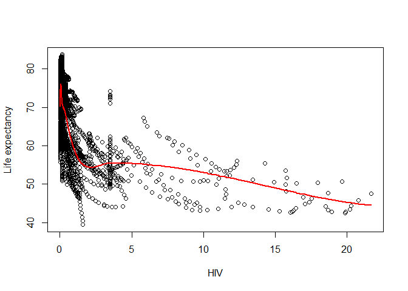
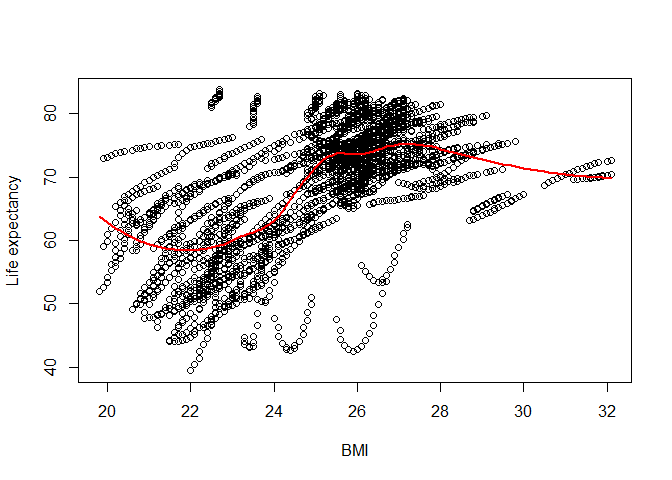
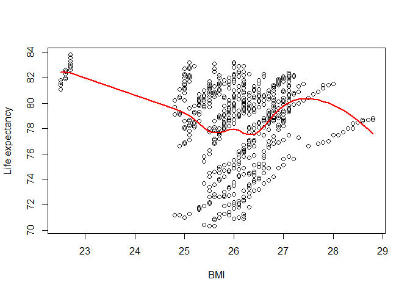

# The First Circle: Linear Regression, Part Three

<br/>
Jiří Fejlek

2025-05-25
<br/>

<br/> In Part Three of this demonstration of using linear regression and
some of its extensions, we seek to evaluate the **Life expectancy**
model (we created in Part Two) based on the data containing health,
immunization, and economic and demographic information about 179
countries from 2000 to 2015. Namely, we will look at its predictive
performance and we will also discuss the predictors that seem to have
the greatest effect on predictions. <br/>

## Evaluation of predictive performance (via cross-validation)

<br/> Let us discuss the correlated random effects model (CRE) we
constructed in Part Two in terms of predictive performance. As a
reminder, our model is <br/>

``` r
library(lme4)
library(sandwich)
library(clubSandwich)

## We will order the dataset by Country and Year (it will be useful later)

life_expectancy_pred <- life_expectancy_cent[order(life_expectancy_cent$Country,life_expectancy_cent$Year),]

## Correlated random effects model
cre_model <- lmer(Life_expectancy ~ Economy + Region + Alcohol + Hepatitis_B + Measles + BMI + Polio + Diphtheria + HIV + GDP_log + Pop_log + Thin_10_19 + Thin_5_9 + Schooling + I_deaths + U5_deaths  + Alcohol_cent + Hepatitis_B_cent + Measles_cent + BMI_cent + Polio_cent + Diphtheria_cent + HIV_cent + GDP_log_cent + Pop_log_cent + Thin_10_19_cent + Thin_5_9_cent + Schooling_cent + I_deaths_cent + U5_deaths_cent + factor(Year) + (1 | Country), life_expectancy_pred)

summary(lmer_model)
```

    ## Linear mixed model fit by REML ['lmerMod']
    ## Formula: Life_expectancy ~ Economy + Region + Alcohol + Hepatitis_B +  
    ##     Measles + BMI + Polio + Diphtheria + HIV + GDP_log + Pop_log +  
    ##     Thin_10_19 + Thin_5_9 + Schooling + I_deaths + U5_deaths +  
    ##     Alcohol_cent + Hepatitis_B_cent + Measles_cent + BMI_cent +  
    ##     Polio_cent + Diphtheria_cent + HIV_cent + GDP_log_cent +  
    ##     Pop_log_cent + Thin_10_19_cent + Thin_5_9_cent + Schooling_cent +  
    ##     I_deaths_cent + U5_deaths_cent + factor(Year) + (1 | Country)
    ##    Data: life_expectancy_cent
    ## 
    ## REML criterion at convergence: 7537.4
    ## 
    ## Scaled residuals: 
    ##     Min      1Q  Median      3Q     Max 
    ## -4.5058 -0.4206  0.0423  0.3938 10.5988 
    ## 
    ## Random effects:
    ##  Groups   Name        Variance Std.Dev.
    ##  Country  (Intercept) 4.3290   2.0806  
    ##  Residual             0.5726   0.7567  
    ## Number of obs: 2864, groups:  Country, 179
    ## 
    ## Fixed effects:
    ##                    Estimate Std. Error t value
    ## (Intercept)      63.7522355  4.9919363  12.771
    ## EconomyDeveloped  4.7366387  1.0031813   4.722
    ## RegionAsia        1.1229449  0.7344149   1.529
    ## RegionCAm         2.1110071  0.7936562   2.660
    ## RegionEU         -1.0208671  1.1653390  -0.876
    ## RegionMidE        0.1085228  0.8941319   0.121
    ## RegionNAm        -0.0316028  1.5764442  -0.020
    ## RegionOce        -0.9432563  0.9778563  -0.965
    ## RegionNotEU       1.0004367  0.9424483   1.062
    ## RegionSAm         1.7899278  0.9044568   1.979
    ## Alcohol          -0.0101209  0.0189949  -0.533
    ## Hepatitis_B       0.0012912  0.0021489   0.601
    ## Measles          -0.0062920  0.0021364  -2.945
    ## BMI              -0.9488611  0.0978906  -9.693
    ## Polio             0.0012032  0.0042701   0.282
    ## Diphtheria        0.0124742  0.0042863   2.910
    ## HIV              -0.8235209  0.0300837 -27.374
    ## GDP_log           0.4896268  0.1274160   3.843
    ## Pop_log           0.2557956  0.2812397   0.910
    ## Thin_10_19        0.0004360  0.0112506   0.039
    ## Thin_5_9          0.0003912  0.0111143   0.035
    ## Schooling        -0.0208967  0.0446620  -0.468
    ## I_deaths         -0.1052106  0.0059274 -17.750
    ## U5_deaths        -0.0507045  0.0061097  -8.299
    ## Alcohol_cent     -0.1885333  0.0804033  -2.345
    ## Hepatitis_B_cent -0.0217338  0.0242810  -0.895
    ## Measles_cent      0.0099784  0.0130219   0.766
    ## BMI_cent          0.9576477  0.1775969   5.392
    ## Polio_cent        0.0439016  0.0585337   0.750
    ## Diphtheria_cent  -0.0387575  0.0599350  -0.647
    ## HIV_cent         -0.0907275  0.0907605  -1.000
    ## GDP_log_cent      0.9486936  0.2894961   3.277
    ## Pop_log_cent     -0.0924875  0.3118582  -0.297
    ## Thin_10_19_cent  -0.0921497  0.2430496  -0.379
    ## Thin_5_9_cent     0.0679226  0.2432645   0.279
    ## Schooling_cent   -0.2770380  0.1309398  -2.116
    ## I_deaths_cent    -0.0598539  0.0225904  -2.650
    ## U5_deaths_cent   -0.0595839  0.0290875  -2.048
    ## factor(Year)2001  0.1156249  0.0806644   1.433
    ## factor(Year)2002  0.1817870  0.0825891   2.201
    ## factor(Year)2003  0.3006714  0.0856809   3.509
    ## factor(Year)2004  0.5328253  0.0903749   5.896
    ## factor(Year)2005  0.6585426  0.0955124   6.895
    ## factor(Year)2006  0.8819733  0.1019276   8.653
    ## factor(Year)2007  1.0970934  0.1084690  10.114
    ## factor(Year)2008  1.3910840  0.1156085  12.033
    ## factor(Year)2009  1.6749357  0.1222797  13.698
    ## factor(Year)2010  1.9892076  0.1292177  15.394
    ## factor(Year)2011  2.2514562  0.1369971  16.434
    ## factor(Year)2012  2.5089088  0.1442841  17.389
    ## factor(Year)2013  2.8027296  0.1521142  18.425
    ## factor(Year)2014  3.1030577  0.1602211  19.367
    ## factor(Year)2015  3.2898619  0.1673746  19.656

<br/> We used *lmer* for the fit instead of *plm*, because we plan to
compare models using a likelihood ratio test in a bit and *plm* does not
compute likelihood function since it uses estimates based on generalized
least squares.

Let us start with an obligatory actual vs. predicted plot. We should
note that prediction for a known individual is computed (using function
*predict*) as $X\hat{\beta} + \hat{\tau} + \hat{\mu}$, where $X$ are our
“main” predictors, $\hat{\beta}$ is the estimate of the coefficients for
the “main” predictors, $\hat{\tau}$ are the estimates of the fixed time
effects in the model, and $\hat{\mu}$ is the estimate of the individual
random effect from the model (this estimate is known as *BLUP*, the best
linear unbiased predictor). <br/>

``` r
plot(life_expectancy_pred$Life_expectancy,predict(cre_model),xlab = 'Life expectancy',ylab = 'Predicted Life expectancy')
abline(0,1, col="red", lwd = 2)
```

<!-- -->

<br/> It seem that the model fits the data pretty well. Let us evaluate,
how good this model would be for the predictions of life expectancy.

Unlike fixed effects models, we have some options. Remember that the
fixed effects model uses a factor for each individual. Hence, we can
only make a reasonable prediction for the individuals in the model. With
random effects, we can actually make a prediction about new individuals
since the random effects model directly models the distribution of
individual effects (i.i.d. normally distributed with mean zero). Thus,
for an unknown individual, the random effect effectively becomes just
another error term.

Concerning the effects for individual years, we use the fixed effects.
Hence, we cannot make a prediction, for example, for the year 2016. To
make such predictions, we have to change the model by either replacing
fixed time effects with random time effects or, probably even better; we
could try to model the dependency in time directly by including
numerical predictor **Year** in some form (life expectancy seems to
steadily increase in time and our fixed effects estimates corresponded
to that, which is a far cry from estimates of individual effects). Let
us try that (we will model **Year** using a restricted cubic spline).
<br/>

``` r
library(rms)
cre_model_year <- lmer(Life_expectancy ~ Economy + Region + Alcohol + Hepatitis_B + Measles + BMI + Polio + Diphtheria + HIV + GDP_log + Pop_log + Thin_10_19 + Thin_5_9 + Schooling + I_deaths + U5_deaths  + Alcohol_cent + Hepatitis_B_cent + Measles_cent + BMI_cent + Polio_cent + Diphtheria_cent + HIV_cent + GDP_log_cent + Pop_log_cent + Thin_10_19_cent + Thin_5_9_cent + Schooling_cent + I_deaths_cent + U5_deaths_cent + rcs(Year,4) + (1 | Country), life_expectancy_pred)
```

<br/> We can compare these two models using the likelihood ratio test.
The function *anova* refits the model using maximum likelihood instead
of using restricted maximum likelihood (REML) because restricted
likelihood functions of distinct models are not comparable if they do
not have the same *fixed effects*. We should mention here that the
*fixed effects *(in the context of general mixed models) mean just terms
in the model that are not random effects (i.e., they are terms that
would form an ordinary regression model). <br/>

``` r
anova(cre_model,cre_model_year)
```

    ## Data: life_expectancy_pred
    ## Models:
    ## cre_model_year: Life_expectancy ~ Economy + Region + Alcohol + Hepatitis_B + Measles + BMI + Polio + Diphtheria + HIV + GDP_log + Pop_log + Thin_10_19 + Thin_5_9 + Schooling + I_deaths + U5_deaths + Alcohol_cent + Hepatitis_B_cent + Measles_cent + BMI_cent + Polio_cent + Diphtheria_cent + HIV_cent + GDP_log_cent + Pop_log_cent + Thin_10_19_cent + Thin_5_9_cent + Schooling_cent + I_deaths_cent + U5_deaths_cent + rcs(Year, 4) + (1 | Country)
    ## cre_model: Life_expectancy ~ Economy + Region + Alcohol + Hepatitis_B + Measles + BMI + Polio + Diphtheria + HIV + GDP_log + Pop_log + Thin_10_19 + Thin_5_9 + Schooling + I_deaths + U5_deaths + Alcohol_cent + Hepatitis_B_cent + Measles_cent + BMI_cent + Polio_cent + Diphtheria_cent + HIV_cent + GDP_log_cent + Pop_log_cent + Thin_10_19_cent + Thin_5_9_cent + Schooling_cent + I_deaths_cent + U5_deaths_cent + factor(Year) + (1 | Country)
    ##                npar    AIC    BIC  logLik deviance Chisq Df Pr(>Chisq)
    ## cre_model_year   43 7424.9 7681.2 -3669.5   7338.9                    
    ## cre_model        55 7445.9 7773.7 -3667.9   7335.9 3.039 12     0.9953

<br/> As can be seen from the results, these two models indeed seem
almost identical in terms of log-likelihood. Hence, we will use the
model with **Year** modeled using a restricted cubic spline. This model
allows us to predict life expectancy for unobserved years. Hence, let us
evaluate its performance via a cross-validation. To respect the
structure of the panel data and keep it balanced, I will consider
cross-validation over the whole columns. Since we have the data for only
16 years, I will perform merely a simple leave-one-out cross-validation
with mean square error as a performance metric. <br/>

``` r
years <- seq(2000,2015,1)
MSE_pred <- numeric(16)

for(i in 1:16){
  
  train_set <- life_expectancy_pred[life_expectancy_pred$Year != years[i],]
  test_set <- life_expectancy_pred[life_expectancy_pred$Year == years[i],]
  
cre_model_year_new <- lmer(Life_expectancy ~ Economy + Region + Alcohol + Hepatitis_B + Measles + BMI + Polio + Diphtheria + HIV + GDP_log + Pop_log + Thin_10_19 + Thin_5_9 + Schooling + I_deaths + U5_deaths  + Alcohol_cent + Hepatitis_B_cent + Measles_cent + BMI_cent + Polio_cent + Diphtheria_cent + HIV_cent + GDP_log_cent + Pop_log_cent + Thin_10_19_cent + Thin_5_9_cent + Schooling_cent + I_deaths_cent + U5_deaths_cent + rcs(Year,4) + (1 | Country), train_set)
  
  MSE_pred[i] <- mean((test_set$Life_expectancy - predict(cre_model_year_new,test_set))^2)
  }
MSE_pred
```

    ##  [1] 2.1862874 0.9799063 0.5659197 0.4634224 0.4162323 0.4455651 0.4271891
    ##  [8] 0.3587713 0.2482901 0.2264938 0.9138499 0.4326662 0.4495528 0.5996300
    ## [15] 0.8258693 1.0836092

``` r
mean(MSE_pred)
```

    ## [1] 0.6639534

<br/> We see that predictions are fairly accurate on average. The
squared root of MSE (0.81) is just a bit higher than the estimated
standard deviation of the residual error (0.76). Notice that the worst
predictions are, as one would expect, outside the boundaries of the
dataset (i.e., the prediction for the year 2000 using the data from
2001-2015 and the prediction for the year 2015 using the data from
2000-2014).

This validation is slightly incorrect due to a *data leakage* that is
often easy to miss. The centered predictors for the train set were
computed for each country using the whole dataset, i.e. using the test
set data. The correct cross-validation should be computed as follows.
<br/>

``` r
years <- seq(2000,2015,1)
MSE_pred <- numeric(16)

for(i in 1:16){
  
  train_set <- life_expectancy_pred[life_expectancy_pred$Year != years[i],]
  test_set <- life_expectancy_pred[life_expectancy_pred$Year == years[i],]
  
  train_set <- within(train_set, {
  Alcohol_cent <- tapply(Alcohol, Country, mean)[factor(Country)]
  Hepatitis_B_cent <- tapply(Hepatitis_B, Country, mean)[factor(Country)]
  Measles_cent <- tapply(Measles, Country, mean)[factor(Country)]
  BMI_cent <- tapply(BMI, Country, mean)[factor(Country)]
  Polio_cent <- tapply(Polio, Country, mean)[factor(Country)]
  Diphtheria_cent <- tapply(Diphtheria, Country, mean)[factor(Country)]
  HIV_cent <- tapply(HIV, Country, mean)[factor(Country)]
  GDP_log_cent <- tapply(GDP_log, Country, mean)[factor(Country)]
  Pop_log_cent <- tapply(Pop_log, Country, mean)[factor(Country)]
  Thin_10_19_cent <- tapply(Thin_10_19, Country, mean)[factor(Country)]
  Thin_5_9_cent <- tapply(Thin_5_9, Country, mean)[factor(Country)]
  Schooling_cent <- tapply(Schooling, Country, mean)[factor(Country)]
  I_deaths_cent <- tapply(I_deaths, Country, mean)[factor(Country)]
  U5_deaths_cent <- tapply(U5_deaths, Country, mean)[factor(Country)]
})

cre_model_year_new <- lmer(Life_expectancy ~ Economy + Region + Alcohol + Hepatitis_B + Measles + BMI + Polio + Diphtheria + HIV + GDP_log + Pop_log + Thin_10_19 + Thin_5_9 + Schooling + I_deaths + U5_deaths  + Alcohol_cent + Hepatitis_B_cent + Measles_cent + BMI_cent + Polio_cent + Diphtheria_cent + HIV_cent + GDP_log_cent + Pop_log_cent + Thin_10_19_cent + Thin_5_9_cent + Schooling_cent + I_deaths_cent + U5_deaths_cent + rcs(Year,4) + (1 | Country), train_set)
  
  MSE_pred[i] <- mean((test_set$Life_expectancy - predict(cre_model_year_new,test_set))^2)
  }
MSE_pred
```

    ##  [1] 2.2256107 1.0019984 0.5662997 0.4582212 0.4146832 0.4417465 0.4211425
    ##  [8] 0.3547708 0.2501417 0.2305672 0.9529928 0.4352325 0.4506142 0.5877513
    ## [15] 0.8029303 1.0665156

``` r
mean(MSE_pred)
```

    ## [1] 0.6663262

<br/> We observe that the results are only a tiny bit worse (this data
leakage was not that severe).

Let us try the predictions for a new individual. Thus, we will now
perform a cross-validation on the countries, i.e., using the rows of the
dataset. I will perform 100 repetitions of the 10-fold cross-validation.
We should emphasize that for a new individual, the prediction of the
individual random effect is simply zero. We should note that the data
leakage due to centered predictors are not the problem in this case,
because these are computed for each countries, i.e., the train set and
the test set is in this setup correctly separated. <br/>

``` r
library(caret)

## Define not in function
`%!in%` = Negate(`%in%`)

## Number of repetitions and folds
rep <- 100
folds <- 10

## List of countries
countries_list <- unique(life_expectancy$Country)

## I add dummies for Region to data explicitly to make prediction work even when some levels of factor 
## would be missing due to resampling

le_cc <- life_expectancy_pred %>% add_column(as.data.frame(dummy(life_expectancy_pred$Region)))

MSE_pred <- matrix(0,folds,rep)

set.seed(123) # for reproducibility


for(j in 1:rep){
  
  d <- createFolds(countries_list, k = folds)

  for(i in 1:folds){

    countries_test <- countries_list[unlist(d[i])]
    train_set <- le_cc[le_cc$Country %!in% countries_test,]
    test_set <- le_cc[le_cc$Country %in% countries_test,]
    
    cre_model_year_new <- lmer(Life_expectancy ~ Economy + NAm + Asia + CAm + EU + MidE + Oce + NotEU + SAm + 
                                 Alcohol + Hepatitis_B + Measles + BMI + Polio + Diphtheria + HIV + GDP_log + 
                                 Pop_log + Thin_10_19 + Thin_5_9 + Schooling + I_deaths + U5_deaths  + 
                                 Alcohol_cent + Hepatitis_B_cent+ Measles_cent + BMI_cent + Polio_cent + 
                                 Diphtheria_cent + HIV_cent + GDP_log_cent + Pop_log_cent + Thin_10_19_cent + 
                                 Thin_5_9_cent + Schooling_cent + I_deaths_cent + U5_deaths_cent + rcs(Year,4) + 
                                 (1 | Country),train_set)

    ## Set random effect prediction zero via re.form=~0
    MSE_pred[i,j] <- mean((test_set$Life_expectancy - predict(cre_model_year_new,test_set, re.form=~0))^2)
    
  }
}

mean(MSE_pred)  
```

    ## [1] 6.28858

<br/> We see that the mean square error is significantly higher than in
the previous setup. Still, the squared root of MSE (2.5) again mostly
corresponds to the estimates of deviance of individual random effects
and residual error (2.2) <br/>

``` r
VarCorr(cre_model_year)
```

    ##  Groups   Name        Std.Dev.
    ##  Country  (Intercept) 2.08065 
    ##  Residual             0.75544

<br/> Overall, our predictors model life expectancy fairly well. Still,
a noticeable portion of the variance in life expectancy is captured by
individual random effects, which could be perhaps explained by new
additional predictions. <br/>

## Predictions for individual countries (confidence intervals)

<br/> Let us now move to predictions for an individual country. We will
assume the dataset without one country, e.g., France, and try to predict
France’s life expectancy from the rest of the data. We will first
compute the confidence interval, i.e., an interval estimate for the mean
prediction.

The default method for mixed effects models is a parametric bootstrap.
This bootstrap assumes that the model is correctly specified, and thus,
creates bootstrap samples directly from the model. <br/>

``` r
## Design matrices and no France model
le_france <- life_expectancy_pred[life_expectancy_pred$Country == 'France',]
le_nofrance <- life_expectancy_pred[life_expectancy_pred$Country != 'France',]

model_nofrance <- lmer(Life_expectancy ~ Economy + Region + Alcohol + Hepatitis_B + Measles + BMI + Polio + Diphtheria + HIV + GDP_log + Pop_log + Thin_10_19 + Thin_5_9 + Schooling + I_deaths + U5_deaths  + Alcohol_cent + Hepatitis_B_cent + Measles_cent + BMI_cent + Polio_cent + Diphtheria_cent + HIV_cent + GDP_log_cent + Pop_log_cent + Thin_10_19_cent + Thin_5_9_cent + Schooling_cent + I_deaths_cent + U5_deaths_cent + rcs(Year,4) + (1 | Country), le_nofrance)

## Random effects & error estimates
country_sd <- as.data.frame(VarCorr(model_nofrance))$sdcor[1]
resid_sd <- as.data.frame(VarCorr(model_nofrance))$sdcor[2]

## Parametric bootstrap
set.seed(123) # for reproducibility

pred_france_pb <- matrix(0,1000,16)

for(i in 1:1000){
## New observations (we have to remember that we need to generate random effect for each country only once)
new_ref <- rep(rnorm(178,0,country_sd),each = 16)
le_new <-  predict(model_nofrance,le_nofrance, re.form=~0) + new_ref + rnorm(dim(le_nofrance)[1],0,resid_sd)
  
## Refit the model and predict France (confidence interval)
model_new <- refit(model_nofrance, le_new)
pred_france_pb[i,] <-  predict(model_new,le_france, re.form=~0)
}
```

<br/> The parametric bootstrap is sensitive to a misspecification of the
model. Remember that we noticed from the diagnostic plots that residuals
are not normally distributed, and there might be heteroskedasticity
between the clusters. Let us focus on the nonnormality first. <br/>

``` r
par(mfrow = c(1, 2))
qqnorm(residuals(model_nofrance), main = "Residuals")
qqline((residuals(model_nofrance)))

qqnorm(unlist(ranef(model_nofrance)), main = "Random effects")
qqline(unlist(ranef(model_nofrance)))
```


<br/> We see that residuals do not have a normal distribution. Thus,
instead of a parametric bootstrap, we can consider a semi-parametric
bootstrap: a residual (cluster) bootstrap, which, instead of generating
new individual (so-called idiosyncratic) errors from the assumed
distribution, resamples observed residuals by clusters. Notice that this
approach assumes that each cluster’s distributions of individual errors
are identical. <br/>

``` r
## Residual cluster bootstrap
set.seed(123) # for reproducibility

country_index <- seq(1,178,1)
res_nofrance <- matrix(residuals(model_nofrance),ncol = 16,byrow = TRUE)
pred_france_spb <- matrix(0,1000,16)

for(i in 1:1000){
## Resample residuals by clusters
new_res <- res_nofrance[sample(country_index, rep=TRUE),]
new_res <- matrix(t(new_res),ncol = 1)
new_ref <- rep(rnorm(178,0,country_sd),each = 16)

le_new <- predict(model_nofrance,le_nofrance, re.form=~0) + new_ref + new_res

## Refit the model and predict France (confidence interval)

model_new <- refit(model_nofrance, le_new)
pred_france_spb[i,] <-  predict(model_new,le_france, re.form=~0)
}
```

<br/> The disadvantage of parametric bootstrap is that this approach is
not robust to hetereskodasticity between clusters. Thus, we can consider
another semi-parametric bootstrap: *wild bootstrap*. Instead of
resampling the residuals themselves, the wild bootstrap rescales
residuals with a random variable *v* such that $\mathrm{E} v = 0$ and
$\mathrm{Var} v = 1$. Often, these weights are chosen simply as *-1*
with a probability *0.5* and *1* with a probability *0.5*, the so-called
Rademacher weights. This is why the bootstrap is termed wild, because it
is kind of *wild* that such a bootstrap provides asymptotically valid
results, see, e.g., *A. A. Djogbenou, J. G. MacKinnon, and M. Ø.
Nielsen. Asymptotic theory and wild bootstrap inference with clustered
errors. Journal of Econometrics 212.2 (2019): 393-412*. <br/>

``` r
## Wild cluster bootstrap
set.seed(123) # for reproducibility

res_nofrance <- residuals(model_nofrance)
pred_france_wb <- matrix(0,1000,16)

for(i in 1:1000){
## Scale  residuals by Rademacher weights
new_res <-rep(2*round(runif(178),0)-1,each = 16) * res_nofrance
new_ref <- rep(rnorm(178,0,country_sd),each = 16)

le_new <- predict(model_nofrance,le_nofrance, re.form=~0) + new_ref + new_res

## Refit the model and predict France (confidence interval)
model_new <- refit(model_nofrance, le_new)
pred_france_wb[i,] <- predict(model_new,le_france, re.form=~0)
}
```

<br/> The last variant of bootstrap we will try is pairs cluster
bootstrap that we already used few times in this project. <br/>

``` r
## Pairs cluster bootstrap
set.seed(123) # for reproducibility

Countries_list <- unique(le_nofrance$Country)
pred_france_pcb <- matrix(0,1000,16)

for(i in 1:1000){
## Resample observations by clusters  
Countries_new <- sample(Countries_list , rep=TRUE)
le_nofrance_new <- le_nofrance[le_nofrance$Country == Countries_new[1],]

for (j in 2:length(Countries_list)){
  le_nofrance_new <- rbind(le_nofrance_new,le_nofrance[le_nofrance$Country == Countries_new[j],])
}

## Refit the model and predict France (confidence interval)
model_new <- lmer(Life_expectancy ~ Economy + Region + Alcohol + Hepatitis_B + Measles + BMI + Polio + Diphtheria + HIV + GDP_log + Pop_log + Thin_10_19 + Thin_5_9 + Schooling + I_deaths + U5_deaths  + Alcohol_cent + Hepatitis_B_cent + Measles_cent + BMI_cent + Polio_cent + Diphtheria_cent + HIV_cent + GDP_log_cent + Pop_log_cent + Thin_10_19_cent + Thin_5_9_cent + Schooling_cent + I_deaths_cent + U5_deaths_cent + rcs(Year,4) + (1 | Country), le_nofrance_new)

pred_france_pcb[i,] <- predict(model_new, le_france, re.form=~0)
}
```

<br/> Let us check the results. For simplicity’s sake, we will compute a
simple percentile-based confidence intervals (another popular more
sophisticated option would be bias-corrected and accelerated (BCa)
bootstrap that better handles skew and bias *B. Efron. Better bootstrap
confidence intervals. Journal of the American statistical Association
82.397 (1987): 171-185.*) <br/>

``` r
options(width = 1000)

pb <- t(apply(pred_france_pb,2,function(x) quantile(x[!is.na(x)],c(0.025,0.975)))) 
spb <- t(apply(pred_france_spb,2,function(x) quantile(x[!is.na(x)],c(0.025,0.975))))
wb <-  t(apply(pred_france_wb,2,function(x) quantile(x[!is.na(x)],c(0.025,0.975))))
pcb <- t(apply(pred_france_pcb,2,function(x) quantile(x[!is.na(x)],c(0.025,0.975))))

ci_france <- cbind(pb,spb,wb,pcb)
colnames(ci_france) <- c('2.5% (Par)','97.5% (Par)','2.5% (Semi-Par)','97.5% (Semi-Par)','2.5% (Wild)','97.5% (Wild)','2.5% (Pairs)','97.5% (Pairs)')
ci_france
```

    ##       2.5% (Par) 97.5% (Par) 2.5% (Semi-Par) 97.5% (Semi-Par) 2.5% (Wild) 97.5% (Wild) 2.5% (Pairs) 97.5% (Pairs)
    ##  [1,]   74.96131    79.95261        74.89121         79.87688    74.87707     80.20532     75.35319      79.60903
    ##  [2,]   74.96817    79.99057        74.94441         79.90277    74.88762     80.20887     75.37770      79.64143
    ##  [3,]   75.10434    80.13502        75.07571         80.04820    75.02876     80.37163     75.48796      79.76549
    ##  [4,]   75.25188    80.29389        75.17741         80.20390    75.19862     80.49522     75.61519      79.91382
    ##  [5,]   75.36012    80.41233        75.30636         80.32307    75.32084     80.58576     75.72071      80.01800
    ##  [6,]   75.55850    80.62059        75.50314         80.53933    75.49192     80.76456     75.90881      80.22095
    ##  [7,]   75.79673    80.87371        75.75336         80.74429    75.72713     81.01643     76.20469      80.46394
    ##  [8,]   76.07965    81.13089        76.05162         81.00217    75.99328     81.26127     76.46990      80.74862
    ##  [9,]   76.34848    81.39141        76.31684         81.27968    76.28955     81.54891     76.74882      81.01625
    ## [10,]   76.62689    81.66365        76.56803         81.59916    76.53336     81.79977     77.05274      81.27159
    ## [11,]   76.89246    81.95120        76.87825         81.86025    76.81260     82.04001     77.26913      81.53861
    ## [12,]   77.14739    82.22572        77.08470         82.13277    77.09114     82.31048     77.55942      81.87417
    ## [13,]   77.49180    82.58734        77.40807         82.45334    77.46407     82.62059     77.92333      82.27384
    ## [14,]   77.72113    82.84062        77.68708         82.71368    77.71849     82.85035     78.19158      82.45193
    ## [15,]   77.96990    83.11390        77.91528         82.93889    77.97424     83.08763     78.43622      82.78936
    ## [16,]   78.24485    83.35971        78.17803         83.22360    78.23703     83.32616     78.64705      83.06904

<br/> We see that the results of all four bootstraps are fairly similar
in this particular case. Having demonstrated the computation of
confidence intervals for any single observation, let us investigate
*prediction* intervals. <br/>

## Predictions for individual countries (prediction intervals)

<br/> Prediction intervals are interval estimates for a new
observations. Provided that the model is correctly specified, the
computation of the prediction interval is straightforward via the
parametric bootstrap (we simply add the individual random effect and the
idiosyncratic error to the prediction). <br/>

``` r
## Parametric bootstrap
set.seed(123) # for reproducibility

pred_france_pb <- matrix(0,1000,16)

for(i in 1:1000){
## New observations
new_ref <- rep(rnorm(178,0,country_sd),each = 16)
le_new <- predict(model_nofrance,le_nofrance, re.form=~0) + new_ref + rnorm(dim(le_nofrance)[1],0,resid_sd)

## Refit the model and predict France (prediction interval)
model_new <- refit(model_nofrance, le_new)
country_sd_new <- as.data.frame(VarCorr(model_new))$sdcor[1]
resid_sd_new <- as.data.frame(VarCorr(model_new))$sdcor[2]

pred_france_pb[i,] <- predict(model_new, le_france, re.form=~0) + rnorm(1,0,country_sd_new) + rnorm(16,0,resid_sd_new)
}
```

<br/> Alternatively, we can also use residual cluster bootstrap to
account for non-normal distribution and inter-cluster correlation of
idiosyncratic errors. <br/>

``` r
## Residual cluster bootstrap
set.seed(123) # for reproducibility

country_index <- seq(1,178,1)
res_nofrance <- residuals(model_nofrance)
res_nofrance <- matrix(res_nofrance,ncol = 16,byrow = TRUE)
pred_france_spb <- matrix(0,1000,16)

for(i in 1:1000){
## We resample residuals by clusters
new_res <- res_nofrance[sample(country_index, rep=TRUE),]
new_res <- matrix(t(new_res),ncol = 1)
new_ref <- rep(rnorm(178,0,country_sd),each = 16)
le_new <- predict(model_nofrance,le_nofrance, re.form=~0) + new_ref + new_res

## Refit the model and predict France (prediction interval)
model_new <- refit(model_nofrance, le_new)
country_sd_new <- as.data.frame(VarCorr(model_new))$sdcor[1]
res_nofrance_new <- residuals(model_new)
res_nofrance_new <- matrix(res_nofrance,ncol = 16,byrow = TRUE)
new_res <- res_nofrance_new[sample(seq(1,178,1),1),]

pred_france_spb[i,] <- predict(model_new, le_france, re.form=~0) + rnorm(1,0,country_sd_new) + new_res
}
```

<br/> However, the residual cluster bootstrap does not help with
heteroskedasticity. Provided that the variance of idiosyncratic errors
changes with the value of predictors, our prediction interval could be
severely underestimated or overestimated (residual cluster bootstrap, in
essence, pools these errors together, creating an “averaged” estimate of
the idiosyncratic error). And to remedy that, we would need a
heteroskedasticity model. This is unlike confidence intervals, which we
could compute in a way that was robust to heteroskedasticity.

For example, we can notice that there seems to be heteroskedasticity
wrt. the **Economy** factor developing/developed. <br/>


<br/> We can fit a new model that models this heteroskedasticity by
assuming a different idiosyncratic error variance per stratum developed
and developing. We need to use a different package, *nlme*, which allows
us to fit a mixed effects model with variance structure functions (see
<https://stat.ethz.ch/R-manual/R-devel/library/nlme/html/varClasses.html>
for the available options). <br/>

``` r
library(nlme)
library(lmeInfo)
model_economy <- lme(Life_expectancy ~ Economy + Region + Alcohol + Hepatitis_B + Measles + BMI + Polio + Diphtheria + HIV + GDP_log + Pop_log + Thin_10_19 + Thin_5_9 + Schooling + I_deaths + U5_deaths  + Alcohol_cent + Hepatitis_B_cent + Measles_cent + BMI_cent + Polio_cent + Diphtheria_cent + HIV_cent + GDP_log_cent + Pop_log_cent + Thin_10_19_cent + Thin_5_9_cent + Schooling_cent + I_deaths_cent + U5_deaths_cent + rcs(Year,4), random = ~1|Country, weights=varIdent(form =  ~ 1|Economy), data = le_nofrance)
summary(model_economy)
```

    ## Linear mixed-effects model fit by REML
    ##   Data: le_nofrance 
    ##        AIC      BIC    logLik
    ##   7346.196 7607.551 -3629.098
    ## 
    ## Random effects:
    ##  Formula: ~1 | Country
    ##         (Intercept)  Residual
    ## StdDev:     2.08115 0.8246889
    ## 
    ## Variance function:
    ##  Structure: Different standard deviations per stratum
    ##  Formula: ~1 | Economy 
    ##  Parameter estimates:
    ## Developing  Developed 
    ##  1.0000000  0.5359667 
    ## Fixed effects:  Life_expectancy ~ Economy + Region + Alcohol + Hepatitis_B +      Measles + BMI + Polio + Diphtheria + HIV + GDP_log + Pop_log +      Thin_10_19 + Thin_5_9 + Schooling + I_deaths + U5_deaths +      Alcohol_cent + Hepatitis_B_cent + Measles_cent + BMI_cent +      Polio_cent + Diphtheria_cent + HIV_cent + GDP_log_cent +      Pop_log_cent + Thin_10_19_cent + Thin_5_9_cent + Schooling_cent +      I_deaths_cent + U5_deaths_cent + rcs(Year, 4) 
    ##                         Value Std.Error   DF    t-value p-value
    ## (Intercept)        -242.75178  34.79071 2653  -6.977489  0.0000
    ## EconomyDeveloped      4.84111   1.01023  154   4.792085  0.0000
    ## RegionAsia            1.13469   0.73520  154   1.543370  0.1248
    ## RegionCAm             2.13085   0.79476  154   2.681120  0.0081
    ## RegionEU             -1.07841   1.16646  154  -0.924516  0.3567
    ## RegionMidE            0.09375   0.89505  154   0.104748  0.9167
    ## RegionNAm             0.15827   1.59303  154   0.099351  0.9210
    ## RegionOce            -0.97224   0.97925  154  -0.992842  0.3223
    ## RegionNotEU           1.02731   0.94342  154   1.088920  0.2779
    ## RegionSAm             1.84375   0.90766  154   2.031328  0.0439
    ## Alcohol              -0.01949   0.01627 2653  -1.198192  0.2309
    ## Hepatitis_B           0.00041   0.00206 2653   0.199552  0.8418
    ## Measles              -0.00651   0.00206 2653  -3.163047  0.0016
    ## BMI                  -0.80257   0.08725 2653  -9.198066  0.0000
    ## Polio                -0.00008   0.00443 2653  -0.017691  0.9859
    ## Diphtheria            0.01289   0.00445 2653   2.897873  0.0038
    ## HIV                  -0.78779   0.03235 2653 -24.351961  0.0000
    ## GDP_log               0.35456   0.12936 2653   2.740944  0.0062
    ## Pop_log              -0.39706   0.28036 2653  -1.416257  0.1568
    ## Thin_10_19           -0.00143   0.01224 2653  -0.116743  0.9071
    ## Thin_5_9             -0.00047   0.01209 2653  -0.038845  0.9690
    ## Schooling            -0.05186   0.03921 2653  -1.322748  0.1860
    ## I_deaths             -0.09746   0.00622 2653 -15.667460  0.0000
    ## U5_deaths            -0.05645   0.00656 2653  -8.604199  0.0000
    ## Alcohol_cent         -0.18727   0.08039  154  -2.329464  0.0211
    ## Hepatitis_B_cent     -0.01028   0.02729  154  -0.376847  0.7068
    ## Measles_cent          0.01153   0.01312  154   0.878922  0.3808
    ## BMI_cent              0.81395   0.17209  154   4.729672  0.0000
    ## Polio_cent            0.04457   0.05861  154   0.760516  0.4481
    ## Diphtheria_cent      -0.05020   0.06138  154  -0.817798  0.4147
    ## HIV_cent             -0.12447   0.09164  154  -1.358193  0.1764
    ## GDP_log_cent          1.06257   0.29166  154   3.643142  0.0004
    ## Pop_log_cent          0.55343   0.31120  154   1.778388  0.0773
    ## Thin_10_19_cent      -0.11004   0.24446  154  -0.450148  0.6532
    ## Thin_5_9_cent         0.09240   0.24518  154   0.376880  0.7068
    ## Schooling_cent       -0.23837   0.12959  154  -1.839444  0.0678
    ## I_deaths_cent        -0.06815   0.02270  154  -3.002741  0.0031
    ## U5_deaths_cent       -0.05444   0.02922  154  -1.863141  0.0643
    ## rcs(Year, 4)Year      0.15317   0.01718 2653   8.913223  0.0000
    ## rcs(Year, 4)Year'     0.24988   0.04342 2653   5.754651  0.0000
    ## rcs(Year, 4)Year''   -0.59719   0.12569 2653  -4.751260  0.0000
    ##  Correlation: 
    ##                    (Intr) EcnmyD RegnAs RgnCAm RegnEU RgnMdE RgnNAm RegnOc RgnNEU RgnSAm Alcohl Hptt_B Measls BMI    Polio  Dphthr HIV    GDP_lg Pop_lg Th_10_19 Th_5_9 Schlng I_dths U5_dth Alchl_ Hpt_B_ Msls_c BMI_cn Pl_cnt Dphth_ HIV_cn GDP_l_ Pp_lg_ T_10_19_ T_5_9_ Schln_ I_dth_ U5_dt_ rc(Y,4)Y rc(Y,4)Y'
    ## EconomyDeveloped    0.006                                                                                                                                                                                                                                                                                          
    ## RegionAsia         -0.019  0.011                                                                                                                                                                                                                                                                                   
    ## RegionCAm          -0.014  0.058  0.398                                                                                                                                                                                                                                                                            
    ## RegionEU           -0.019 -0.592  0.326  0.472                                                                                                                                                                                                                                                                     
    ## RegionMidE          0.019 -0.029  0.447  0.446  0.317                                                                                                                                                                                                                                                              
    ## RegionNAm           0.013 -0.194  0.271  0.321  0.462  0.323                                                                                                                                                                                                                                                       
    ## RegionOce          -0.019 -0.231  0.315  0.508  0.491  0.436  0.300                                                                                                                                                                                                                                                
    ## RegionNotEU        -0.032 -0.111  0.449  0.572  0.621  0.386  0.394  0.483                                                                                                                                                                                                                                         
    ## RegionSAm          -0.016  0.125  0.376  0.557  0.393  0.401  0.325  0.430  0.507                                                                                                                                                                                                                                  
    ## Alcohol            -0.033  0.000  0.000  0.000  0.000  0.000  0.000  0.000  0.000  0.000                                                                                                                                                                                                                           
    ## Hepatitis_B         0.063  0.000  0.000  0.000  0.000  0.000  0.000  0.000  0.000  0.000  0.059                                                                                                                                                                                                                    
    ## Measles             0.020  0.000  0.000  0.000  0.000  0.000  0.000  0.000  0.000  0.000 -0.048 -0.194                                                                                                                                                                                                             
    ## BMI                 0.343  0.000  0.000  0.000  0.000  0.000  0.000  0.000  0.000  0.000 -0.057  0.074  0.061                                                                                                                                                                                                      
    ## Polio               0.028  0.000  0.000  0.000  0.000  0.000  0.000  0.000  0.000  0.000 -0.033  0.002 -0.050  0.014                                                                                                                                                                                               
    ## Diphtheria         -0.019  0.000  0.000  0.000  0.000  0.000  0.000  0.000  0.000  0.000  0.033 -0.232 -0.007 -0.012 -0.784                                                                                                                                                                                        
    ## HIV                -0.040  0.000  0.000  0.000  0.000  0.000  0.000  0.000  0.000  0.000  0.016  0.061 -0.026  0.051  0.001 -0.031                                                                                                                                                                                 
    ## GDP_log             0.149  0.000  0.000  0.000  0.000  0.000  0.000  0.000  0.000  0.000 -0.284 -0.059 -0.042 -0.090  0.031 -0.036  0.008                                                                                                                                                                          
    ## Pop_log             0.096  0.000  0.000  0.000  0.000  0.000  0.000  0.000  0.000  0.000 -0.027 -0.030 -0.017 -0.089 -0.026 -0.031 -0.033  0.351                                                                                                                                                                   
    ## Thin_10_19          0.014  0.000  0.000  0.000  0.000  0.000  0.000  0.000  0.000  0.000 -0.023  0.000 -0.009  0.011 -0.055  0.047 -0.033  0.017  0.005                                                                                                                                                            
    ## Thin_5_9            0.012  0.000  0.000  0.000  0.000  0.000  0.000  0.000  0.000  0.000 -0.033  0.000  0.003  0.002 -0.010  0.004 -0.084  0.001 -0.017 -0.652                                                                                                                                                     
    ## Schooling           0.347  0.000  0.000  0.000  0.000  0.000  0.000  0.000  0.000  0.000 -0.018 -0.021 -0.108  0.108  0.034 -0.001  0.024 -0.032  0.018  0.022    0.008                                                                                                                                            
    ## I_deaths            0.018  0.000  0.000  0.000  0.000  0.000  0.000  0.000  0.000  0.000 -0.021  0.075 -0.029  0.262  0.052 -0.006  0.277  0.340  0.197  0.021   -0.027 -0.016                                                                                                                                     
    ## U5_deaths          -0.008  0.000  0.000  0.000  0.000  0.000  0.000  0.000  0.000  0.000  0.027 -0.121 -0.016 -0.199 -0.002  0.099 -0.485 -0.145  0.091 -0.028    0.025 -0.038 -0.786                                                                                                                              
    ## Alcohol_cent        0.012 -0.101  0.095 -0.261 -0.302  0.201 -0.100 -0.009 -0.245 -0.237 -0.202 -0.012  0.010  0.012  0.007 -0.007 -0.003  0.057  0.005  0.005    0.007  0.004  0.004 -0.005                                                                                                                       
    ## Hepatitis_B_cent    0.001  0.114  0.041  0.080  0.053  0.018  0.306  0.009  0.120  0.075 -0.004 -0.075  0.015 -0.006  0.000  0.017 -0.005  0.004  0.002  0.000    0.000  0.002 -0.006  0.009 -0.121                                                                                                                
    ## Measles_cent       -0.013  0.093 -0.004  0.027 -0.044 -0.041 -0.035  0.091 -0.058  0.130  0.008  0.030 -0.157 -0.010  0.008  0.001  0.004  0.007  0.003  0.001   -0.001  0.017  0.005  0.003 -0.052  0.002                                                                                                         
    ## BMI_cent           -0.254  0.222  0.104 -0.138 -0.160 -0.248 -0.198 -0.238 -0.049 -0.078  0.029 -0.037 -0.031 -0.507 -0.007  0.006 -0.026  0.046  0.045 -0.005   -0.001 -0.055 -0.133  0.101  0.068 -0.069  0.037                                                                                                  
    ## Polio_cent         -0.027  0.016 -0.023  0.113  0.082  0.072  0.094  0.099  0.113  0.107  0.003  0.000  0.004 -0.001 -0.076  0.059  0.000 -0.002  0.002  0.004    0.001 -0.003 -0.004  0.000 -0.036  0.079 -0.134 -0.099                                                                                           
    ## Diphtheria_cent    -0.006 -0.094  0.013 -0.083 -0.039 -0.024 -0.193  0.006 -0.075 -0.085 -0.002  0.017  0.001  0.001  0.057 -0.072  0.002  0.003  0.002 -0.003    0.000  0.000  0.000 -0.007  0.080 -0.504  0.031  0.114 -0.834                                                                                    
    ## HIV_cent            0.042  0.067  0.273  0.249  0.189  0.204  0.144  0.172  0.235  0.197 -0.006 -0.021  0.009 -0.018  0.000  0.011 -0.353 -0.003  0.012  0.011    0.030 -0.009 -0.098  0.171 -0.129  0.060  0.049 -0.092 -0.061 -0.034                                                                             
    ## GDP_log_cent       -0.121 -0.382  0.032  0.068  0.270 -0.102  0.026  0.190  0.236  0.001  0.126  0.026  0.019  0.040 -0.014  0.016 -0.004 -0.444 -0.155 -0.008   -0.001  0.014 -0.151  0.064 -0.153 -0.021 -0.122 -0.144  0.149 -0.044 -0.059                                                                      
    ## Pop_log_cent       -0.104 -0.057 -0.053  0.054  0.043 -0.045 -0.077  0.083  0.031 -0.037  0.024  0.027  0.016  0.080  0.024  0.028  0.030 -0.316 -0.901 -0.005    0.015 -0.016 -0.177 -0.082 -0.021  0.034  0.045  0.002  0.027 -0.026  0.020  0.212                                                               
    ## Thin_10_19_cent     0.006 -0.107  0.076 -0.010  0.031  0.007 -0.027  0.046 -0.007 -0.056  0.001  0.000  0.000 -0.001  0.003 -0.002  0.002 -0.001  0.000 -0.050    0.033 -0.001 -0.001  0.001  0.110 -0.128 -0.246 -0.021 -0.047  0.099  0.050 -0.010  0.007                                                        
    ## Thin_5_9_cent      -0.022  0.140 -0.137  0.033 -0.030 -0.049  0.030 -0.020  0.023  0.106  0.002  0.000  0.000  0.000  0.000  0.000  0.004  0.000  0.001  0.032   -0.049  0.000  0.001 -0.001 -0.122  0.133  0.274  0.095  0.054 -0.104 -0.093  0.004 -0.010 -0.964                                                 
    ## Schooling_cent     -0.095 -0.143 -0.260  0.069  0.054  0.005  0.029  0.029 -0.146  0.065  0.005  0.006  0.033 -0.033 -0.010  0.000 -0.007  0.010 -0.005 -0.007   -0.002 -0.303  0.005  0.011 -0.281  0.076 -0.063 -0.195  0.002 -0.022 -0.127 -0.136 -0.027  0.095   -0.036                                        
    ## I_deaths_cent      -0.067 -0.046 -0.069  0.094  0.140  0.094  0.023  0.111  0.184  0.062  0.006 -0.021  0.008 -0.072 -0.014  0.002 -0.076 -0.093 -0.054 -0.006    0.007  0.004 -0.274  0.215 -0.001  0.012 -0.039  0.007  0.225 -0.054 -0.115  0.379  0.098 -0.024    0.019  0.101                                 
    ## U5_deaths_cent     -0.031 -0.106  0.319  0.246  0.190  0.117  0.085  0.250  0.174  0.261 -0.006  0.027  0.004  0.045  0.000 -0.022  0.109  0.033 -0.020  0.006   -0.006  0.008  0.176 -0.225 -0.122 -0.097  0.046  0.114 -0.003  0.097 -0.093 -0.003  0.008 -0.039    0.076  0.105 -0.557                          
    ## rcs(Year, 4)Year   -0.990  0.000  0.000  0.000  0.000  0.000  0.000  0.000  0.000  0.000  0.033 -0.064 -0.020 -0.346 -0.028  0.019  0.041 -0.151 -0.096 -0.014   -0.012 -0.350 -0.018  0.008 -0.007  0.005  0.003  0.175  0.002 -0.001 -0.014  0.067  0.087  0.001    0.001  0.106  0.005 -0.002                   
    ## rcs(Year, 4)Year'   0.801  0.000  0.000  0.000  0.000  0.000  0.000  0.000  0.000  0.000  0.046  0.013  0.004  0.018  0.008 -0.006 -0.020  0.027 -0.014  0.003    0.023  0.036 -0.019  0.018 -0.009 -0.001 -0.001 -0.009 -0.001  0.000  0.007 -0.012  0.012  0.000   -0.001 -0.011  0.005 -0.004 -0.810            
    ## rcs(Year, 4)Year'' -0.726  0.000  0.000  0.000  0.000  0.000  0.000  0.000  0.000  0.000 -0.036 -0.002 -0.008 -0.006 -0.004  0.012  0.016 -0.012  0.016  0.000   -0.025 -0.010  0.017 -0.014  0.007  0.000  0.001  0.003  0.000 -0.001 -0.006  0.005 -0.014  0.000    0.001  0.003 -0.005  0.003  0.734   -0.983   
    ## 
    ## Standardized Within-Group Residuals:
    ##         Min          Q1         Med          Q3         Max 
    ## -4.73330164 -0.43261355  0.01850146  0.40108111  9.76592298 
    ## 
    ## Number of Observations: 2848
    ## Number of Groups: 178

<br/> We see that, indeed, the estimated standard deviation of
idiosyncratic errors is lower for developed countries. Thus, we can use
this model instead to construct the prediction interval for France. We
will use a wild bootstrap to generate new datasets and a residual
bootstrap to simulate new observations for France. <br/>

``` r
economy_sd <- extract_varcomp(model_economy)$var_params

## Wild cluster bootstrap + residual cluster bootstrap, modeling heteroskedasticity using factor Economy
set.seed(123) # for reproducibility

country_index <- seq(1,178,1)
country_sd <- as.numeric(VarCorr(model_economy)[1,2])
developing_ind <- matrix(le_nofrance$Economy,ncol = 16,byrow = TRUE)[,1] # index for developed countries
  
res_nofrance <- residuals(model_economy)
pred_france_ec <- matrix(0,1000,16)

X_nofrance <- model.matrix(model_nofrance)
X_france <- model.matrix(cre_model_year)[which(life_expectancy_pred$Country == 'France'),]

for(i in 1:1000){
## Perform a wild bootstrap
new_res <- rep(2*round(runif(178),0)-1,each = 16) * res_nofrance
new_ref <- rep(rnorm(178,0,country_sd),each = 16)
le_new <- X_nofrance %*% fixef(model_economy) + new_ref + new_res

## Refit the model
model_new <- lme(le_new ~ Economy + Region + Alcohol + Hepatitis_B + Measles + BMI + Polio + Diphtheria + HIV + GDP_log + Pop_log + Thin_10_19 + Thin_5_9 + Schooling + I_deaths + U5_deaths  + Alcohol_cent + Hepatitis_B_cent + Measles_cent + BMI_cent + Polio_cent + Diphtheria_cent + HIV_cent + GDP_log_cent + Pop_log_cent + Thin_10_19_cent + Thin_5_9_cent + Schooling_cent + I_deaths_cent + U5_deaths_cent + rcs(Year,4), random = ~1|Country, weights=varIdent(form =  ~ 1|Economy), data = le_nofrance)

country_sd_new <-  as.numeric(VarCorr(model_economy)[1,2])
res_nofrance_new <- residuals(model_new)
res_nofrance_new <- matrix(res_nofrance,ncol = 16,byrow = TRUE)

## Choose a residual from the new sample, reweigh the one for developing countries and predict France (prediction interval)
index <- sample(seq(1,178,1),1)

if (developing_ind[index] == 'Developing') {
  new_res <- res_nofrance_new[index,]*extract_varcomp(model_economy)$var_params
} else if (developing_ind[index] == 'Developed') {
  new_res <- res_nofrance_new[index,]
}

pred_france_ec[i,] <- X_france %*% fixef(model_new) + rnorm(1,0,country_sd_new) + new_res
}
```

<br/> Let us compare the results. <br/>

``` r
options(width = 1000)

pb <-  t(apply(pred_france_pb,2,function(x) quantile(x[!is.na(x)],c(0.025,0.975)))) 
spb <- t(apply(pred_france_spb,2,function(x) quantile(x[!is.na(x)],c(0.025,0.975))))
pecb <- t(apply(pred_france_ec,2,function(x) quantile(x[!is.na(x)],c(0.025,0.975))))

pi_france <- cbind(pb,spb,pecb)
colnames(pi_france) <- c('2.5% (Par)','97.5% (Par)','2.5% (Semi-Par)','97.5% (Semi-Par)','2.5% (Het. Eco)','97.5% (Het. Eco)')
pi_france
```

    ##       2.5% (Par) 97.5% (Par) 2.5% (Semi-Par) 97.5% (Semi-Par) 2.5% (Het. Eco) 97.5% (Het. Eco)
    ##  [1,]   72.40293    82.22017        72.50725         82.17980        72.03600         82.08407
    ##  [2,]   72.56667    82.70503        72.33023         82.20903        72.13053         82.12589
    ##  [3,]   72.59532    82.36305        72.67333         82.18353        72.24321         82.14180
    ##  [4,]   72.63160    82.67893        72.76513         82.53613        72.38242         82.27355
    ##  [5,]   72.60310    82.66077        72.95186         82.51990        72.62507         82.49229
    ##  [6,]   72.72288    82.75497        72.79033         82.61260        72.87115         82.71614
    ##  [7,]   73.06174    83.01461        73.35064         83.11307        73.15855         82.98351
    ##  [8,]   73.26913    83.56650        73.56941         83.23171        73.47242         83.31632
    ##  [9,]   73.86445    83.71593        73.84272         83.42450        73.90011         83.57517
    ## [10,]   73.82115    84.10104        74.14955         83.79026        74.17154         83.82726
    ## [11,]   74.05816    84.18073        74.09517         84.28646        74.42257         84.24625
    ## [12,]   74.74285    84.41918        74.87387         84.56432        74.78860         84.44850
    ## [13,]   74.85090    84.84944        75.02561         84.57254        74.98825         84.77712
    ## [14,]   75.00187    85.11177        75.23524         85.27390        75.23172         85.03207
    ## [15,]   75.29603    85.17326        75.48787         85.26256        75.44512         85.26189
    ## [16,]   75.90935    85.70450        75.63266         85.67732        75.71685         85.46743

<br/> We see that the prediction intervals did not change that much.
Still we cannot be really sure that the coverage of the prediction is
valid since we did not account for the heteroskedasticity in a
systematic manner. To do so, we would have to stray away from the
ordinary regression even farther and use, e.g., *quantile regression*
which seek to model quantiles of the response instead of just mean
response.

To summarize the results concerning the predictive performance of our
model, we see that our predictors can predict life expectancy reasonably
well on average (our estimate of RMSE for a new individual using the
10-fold cross-validation was 2.5). This corresponds to our estimate of
the prediction interval for predicting France from the rest of the data:
$\pm$ 5 years according to our computational experiments. Overall, there
is still a lot of unobserved heterogeneity modeled by individual
effects, and thus, to get more accurate predictions, we would have to
consider additional predictors in the model. <br/>

## Effects of predictors in the life expectancy model

<br/> Let us return to our original model with fixed time effects. <br/>

``` r
library(lme4)
life_expectancy <- life_expectancy_cent

## Correlated random effects model
cre_model <- lmer(Life_expectancy ~ Economy + Region + Alcohol + Hepatitis_B + Measles + BMI + Polio + Diphtheria + HIV + GDP_log + Pop_log + Thin_10_19 + Thin_5_9 + Schooling + I_deaths + U5_deaths  + Alcohol_cent + Hepatitis_B_cent + Measles_cent + BMI_cent + Polio_cent + Diphtheria_cent + HIV_cent + GDP_log_cent + Pop_log_cent + Thin_10_19_cent + Thin_5_9_cent + Schooling_cent + I_deaths_cent + U5_deaths_cent + factor(Year) + (1 | Country), life_expectancy)
```

<br/> We will determine which predictors appeared to be significant in
the model based on cluster-robust standard errors (CR2) and
Satterthwaite DOF correction. We will also recompute confidence
intervals based on these errors. Let us also remind ourselves of the
ranges of values for the continuous variables. <br/>

``` r
library(clubSandwich)
options(width = 1000)

coef_stats <- coef_test(cre_model, vcov = "CR2", cluster = life_expectancy$Country)[1:23,]
coef_stats
```

    ## Alternative hypothesis: two-sided 
    ##             Coef.  Estimate      SE Null value  t-stat d.f. (Satt) p-val (Satt) Sig.
    ##       (Intercept) 63.752235 5.39478          0 11.8174       45.88      < 0.001  ***
    ##  EconomyDeveloped  4.736639 0.97500          0  4.8581       23.25      < 0.001  ***
    ##        RegionAsia  1.122945 0.80643          0  1.3925       42.65      0.17099     
    ##         RegionCAm  2.111007 0.80864          0  2.6106       37.57      0.01291    *
    ##          RegionEU -1.020867 1.12064          0 -0.9110       32.77      0.36896     
    ##        RegionMidE  0.108523 0.88235          0  0.1230       29.93      0.90293     
    ##         RegionNAm -0.031603 1.90213          0 -0.0166        4.39      0.98747     
    ##         RegionOce -0.943256 1.22423          0 -0.7705       24.35      0.44842     
    ##       RegionNotEU  1.000437 1.03929          0  0.9626       47.58      0.34061     
    ##         RegionSAm  1.789928 0.84057          0  2.1294       32.59      0.04087    *
    ##           Alcohol -0.010121 0.05545          0 -0.1825       31.73      0.85633     
    ##       Hepatitis_B  0.001291 0.00451          0  0.2863       45.37      0.77598     
    ##           Measles -0.006292 0.00561          0 -1.1214       38.04      0.26914     
    ##               BMI -0.948861 0.26718          0 -3.5514       34.53      0.00113   **
    ##             Polio  0.001203 0.00801          0  0.1502       54.32      0.88120     
    ##        Diphtheria  0.012474 0.00943          0  1.3226       51.94      0.19177     
    ##               HIV -0.823521 0.16649          0 -4.9463        8.01      0.00112   **
    ##           GDP_log  0.489627 0.39850          0  1.2287       36.77      0.22700     
    ##           Pop_log  0.255796 0.78693          0  0.3251       18.30      0.74883     
    ##        Thin_10_19  0.000436 0.01237          0  0.0352        5.91      0.97305     
    ##          Thin_5_9  0.000391 0.01326          0  0.0295        5.45      0.97752     
    ##         Schooling -0.020897 0.11947          0 -0.1749       66.24      0.86168     
    ##          I_deaths -0.105211 0.02388          0 -4.4061       32.28      < 0.001  ***

``` r
conf_int <- cbind(fixef(cre_model)[1:24] - coef_stats$SE*qt(0.975,coef_stats$df_Satt),fixef(cre_model)[1:23] + coef_stats$SE*qt(0.975,coef_stats$df_Satt))
colnames(conf_int) <- c('2.5 %','97.5 %')
conf_int
```

    ##                          2.5 %       97.5 %
    ## (Intercept)       52.892342652 74.612128270
    ## EconomyDeveloped   2.720914918  6.752362405
    ## RegionAsia        -0.503765307  2.749655092
    ## RegionCAm          0.473382198  3.748631975
    ## RegionEU          -3.301433348  1.259699062
    ## RegionMidE        -1.693654341  1.910700025
    ## RegionNAm         -5.133503702  5.070298182
    ## RegionOce         -3.468022466  1.581509793
    ## RegionNotEU       -1.089677428  3.090550775
    ## RegionSAm          0.078961716  3.500893922
    ## Alcohol           -0.123101253  0.102859534
    ## Hepatitis_B       -0.007791515  0.010374007
    ## Measles           -0.017649993  0.005065983
    ## BMI               -1.491535406 -0.406186810
    ## Polio             -0.014860712  0.017267204
    ## Diphtheria        -0.006452436  0.031400804
    ## HIV               -1.207360936 -0.439680906
    ## GDP_log           -0.317984965  1.297238484
    ## Pop_log           -1.395556658  1.907147880
    ## Thin_10_19        -0.029958452  0.030830508
    ## Thin_5_9          -0.032866872  0.033649214
    ## Schooling         -0.259408355  0.217614987
    ## I_deaths          -0.153832977 -0.056588163
    ## U5_deaths        -10.910597342 74.612128270

``` r
summary(life_expectancy[,c(4,6:11,14:18,21,22,23)])
```

    ##     I_deaths         Adult_m          Alcohol        Hepatitis_B       Measles           BMI            Polio      GDP_per_capita   Population_mln       Thin_10_19        Thin_5_9      Schooling        U5_deaths         Pop_log           GDP_log      
    ##  Min.   :  1.80   Min.   : 49.38   Min.   : 0.000   Min.   :12.00   Min.   :10.00   Min.   :19.80   Min.   : 8.0   Min.   :   148   Min.   :   0.080   Min.   : 0.100   Min.   : 0.1   Min.   : 1.100   Min.   :  0.50   Min.   :0.07696   Min.   : 4.997  
    ##  1st Qu.:  8.10   1st Qu.:106.91   1st Qu.: 1.200   1st Qu.:78.00   1st Qu.:64.00   1st Qu.:23.20   1st Qu.:81.0   1st Qu.:  1416   1st Qu.:   2.098   1st Qu.: 1.600   1st Qu.: 1.6   1st Qu.: 5.100   1st Qu.:  1.40   1st Qu.:1.13059   1st Qu.: 7.255  
    ##  Median : 19.60   Median :163.84   Median : 4.020   Median :89.00   Median :83.00   Median :25.50   Median :93.0   Median :  4217   Median :   7.850   Median : 3.300   Median : 3.4   Median : 7.800   Median :  3.30   Median :2.18042   Median : 8.347  
    ##  Mean   : 30.36   Mean   :192.25   Mean   : 4.821   Mean   :84.29   Mean   :77.34   Mean   :25.03   Mean   :86.5   Mean   : 11541   Mean   :  36.676   Mean   : 4.866   Mean   : 4.9   Mean   : 7.632   Mean   : 12.57   Mean   :2.26750   Mean   : 8.399  
    ##  3rd Qu.: 47.35   3rd Qu.:246.79   3rd Qu.: 7.777   3rd Qu.:96.00   3rd Qu.:93.00   3rd Qu.:26.40   3rd Qu.:97.0   3rd Qu.: 12557   3rd Qu.:  23.688   3rd Qu.: 7.200   3rd Qu.: 7.3   3rd Qu.:10.300   3rd Qu.: 17.60   3rd Qu.:3.20630   3rd Qu.: 9.438  
    ##  Max.   :138.10   Max.   :719.36   Max.   :17.870   Max.   :99.00   Max.   :99.00   Max.   :32.10   Max.   :99.0   Max.   :112418   Max.   :1379.860   Max.   :27.700   Max.   :28.6   Max.   :14.100   Max.   :127.90   Max.   :7.23046   Max.   :11.630

<br/> First, we will compute the confidence intervals for the
predictions, varying one predictor while keeping the other fixed (other
fixed effects are chosen as Turkey 2015) using a simple parametric
bootstrap (we assume that the individual random effects are fixed).
<br/>


<br/> We see that many predictors seem to have little absolute effect:
**Alcohol**, **Hepatitis_B**, **Measles**, **Polio**, **Diphtheria**,
**Pop_log**, **Thin_10_19**, **Thin_5_9**, and **Schooling**. Let us
have a closer look at the rest.

Let us start with the time-invariant predictors that we were able to
estimate thanks to the CRE model: **Economy** and **Region**-specific
factors. As far as **Economy** is concerned, it is a highly significant
predictor in the model. It seems that economically developed countries
tend to have higher life expectancy than developing countries, even
after adjusting for other covariates in the model. We can investigate
this more formally post hoc using *lsmeans* (lsmeans computes estimated
marginal means for a given factor, see
<https://cran.r-project.org/web/packages/emmeans/vignettes/basics.html>
for more details). <br/>

    ## $lsmeans
    ##  Economy    lsmean    SE  df lower.CL upper.CL
    ##  Developing   67.9 0.329 155     67.3     68.6
    ##  Developed    72.7 0.818 155     71.1     74.3
    ## 
    ## Results are averaged over the levels of: Region, Year 
    ## Degrees-of-freedom method: kenward-roger 
    ## Confidence level used: 0.95 
    ## 
    ## $contrasts
    ##  contrast               estimate SE  df t.ratio p.value
    ##  Developing - Developed    -4.74  1 155  -4.722  <.0001
    ## 
    ## Results are averaged over the levels of: Region, Year 
    ## Degrees-of-freedom method: kenward-roger


<br/> Next, we focus on the **Region**-specific factors. We can test
formally that this factor **Region** is significant in the model. <br/>

``` r
Wald_test(cre_model, constraints = constrain_zero(c("RegionAsia","RegionCAm","RegionEU","RegionMidE","RegionNAm","RegionOce","RegionNotEU","RegionSAm")), vcov = "CR2", cluster = life_expectancy$Country)
```

    ##  test Fstat df_num df_denom  p_val sig
    ##   HTZ   2.6      8     32.6 0.0256   *

<br/> However, the differences between the estimated marginal means for
regions seem overall pretty close. <br/>

    ## $lsmeans
    ##  Region lsmean    SE  df lower.CL upper.CL
    ##  Afr      69.9 0.643 155     68.6     71.1
    ##  Asia     71.0 0.701 155     69.6     72.4
    ##  CAm      72.0 0.705 155     70.6     73.4
    ##  EU       68.8 0.678 155     67.5     70.2
    ##  MidE     70.0 0.811 155     68.4     71.6
    ##  NAm      69.8 1.370 155     67.1     72.5
    ##  Oce      68.9 0.774 155     67.4     70.4
    ##  NotEU    70.9 0.718 155     69.4     72.3
    ##  SAm      71.6 0.844 155     70.0     73.3
    ## 
    ## Results are averaged over the levels of: Economy, Year 
    ## Degrees-of-freedom method: kenward-roger 
    ## Confidence level used: 0.95 
    ## 
    ## $contrasts
    ##  contrast     estimate    SE  df t.ratio p.value
    ##  Afr - Asia    -1.1229 0.734 155  -1.529  0.8402
    ##  Afr - CAm     -2.1110 0.794 155  -2.660  0.1713
    ##  Afr - EU       1.0209 1.170 155   0.876  0.9939
    ##  Afr - MidE    -0.1085 0.894 155  -0.121  1.0000
    ##  Afr - NAm      0.0316 1.580 155   0.020  1.0000
    ##  Afr - Oce      0.9433 0.978 155   0.965  0.9884
    ##  Afr - NotEU   -1.0004 0.942 155  -1.062  0.9787
    ##  Afr - SAm     -1.7899 0.904 155  -1.979  0.5603
    ##  Asia - CAm    -0.9881 0.840 155  -1.176  0.9603
    ##  Asia - EU      2.1438 1.160 155   1.853  0.6466
    ##  Asia - MidE    1.0144 0.867 155   1.170  0.9615
    ##  Asia - NAm     1.1545 1.550 155   0.746  0.9980
    ##  Asia - Oce     2.0662 1.020 155   2.024  0.5291
    ##  Asia - NotEU   0.1225 0.898 155   0.136  1.0000
    ##  Asia - SAm    -0.6670 0.926 155  -0.720  0.9984
    ##  CAm - EU       3.1319 1.050 155   2.970  0.0808
    ##  CAm - MidE     2.0025 0.892 155   2.246  0.3820
    ##  CAm - NAm      2.1426 1.520 155   1.408  0.8931
    ##  CAm - Oce      3.0543 0.892 155   3.424  0.0219
    ##  CAm - NotEU    1.1106 0.815 155   1.363  0.9097
    ##  CAm - SAm      0.3211 0.806 155   0.398  1.0000
    ##  EU - MidE     -1.1294 1.220 155  -0.923  0.9914
    ##  EU - NAm      -0.9893 1.450 155  -0.683  0.9989
    ##  EU - Oce      -0.0776 1.090 155  -0.071  1.0000
    ##  EU - NotEU    -2.0213 0.937 155  -2.157  0.4388
    ##  EU - SAm      -2.8108 1.160 155  -2.432  0.2744
    ##  MidE - NAm     0.1401 1.540 155   0.091  1.0000
    ##  MidE - Oce     1.0518 0.997 155   1.054  0.9796
    ##  MidE - NotEU  -0.8919 1.020 155  -0.876  0.9939
    ##  MidE - SAm    -1.6814 0.983 155  -1.711  0.7389
    ##  NAm - Oce      0.9117 1.580 155   0.578  0.9997
    ##  NAm - NotEU   -1.0320 1.490 155  -0.695  0.9988
    ##  NAm - SAm     -1.8215 1.550 155  -1.177  0.9602
    ##  Oce - NotEU   -1.9437 0.975 155  -1.993  0.5506
    ##  Oce - SAm     -2.7332 1.000 155  -2.725  0.1479
    ##  NotEU - SAm   -0.7895 0.919 155  -0.859  0.9947
    ## 
    ## Results are averaged over the levels of: Economy, Year 
    ## Degrees-of-freedom method: kenward-roger 
    ## P value adjustment: tukey method for comparing a family of 9 estimates


<br/> So overall, the differences between regions after adjusting for
other covariates are not that noticeable.

Let us move to the time-varying predictors in our model. We start with
**I_deaths** and **U5_deaths**, i.e., infant mortality/deaths of
children under five years old per 1000 population. This effect appears
strongly significant in the model. This is expected since the incidence
of such early deaths necessarily drives the life expectancy down. We
could observe this effect quite clearly from the data (the red curve is
a LOESS fit of the data: span = 0.5, degree = 2) <br/>


<br/> Another predictor worth mentioning is **GDP_log**. Now, this
predictor is not significant (using a commonly used p-value cut-off
0.05) in the model. The confidence interval for the estimated effect is
a bit too large. However, its point estimate is positive, as one would
expect; more economically developed countries tend to have higher life
expectancy. <br/>


<br/> Another highly significant predictor in the model is the number of
**HIV** incidents. The importance of this effect is again to be
expected. For example, the UNAIDS report *THE URGENCY OF NOW AIDS AT A
CROSSROADS* shows that from successes in the treatment of HIV, life
expectancy in Africa increased from 56 to 61 between 2010 and 2024.
Again, if we visualize the data, the effect of **HIV** is also quite
noticeable. <br/>



<br/> The last predictor we need to mention is the average **BMI** of
the adult population. This one is a bit trickier to interpret. If we
simply visualize the data, we could argue that **Life_expectancy**
actually increases slightly with **BMI**. <br/>



<br/> However, more economically developed countries tend to have higher
average **BMI**. Actually, if we plot **BMI** vs **Life_expectancy** for
developed countries, this negative effect for large average **BMI** is
hinted at (that low **BMI** and high **Life_expectancy** country is
Japan) <br/>



<br/> We could suspect a nonlinear dependence in **BMI**, although
interestingly enough, fitting a more complex nonlinear (via restricted
cubic splines) does not change the downward trend much. <br/>

``` r
# I fit just a fixed effects model for simplicity's sake
library(rms)
fixed_effect_model_nonlin <- lm(Life_expectancy ~ Alcohol + Hepatitis_B + Measles + rcs(BMI,4) + Polio + Diphtheria + HIV + GDP_log + Pop_log + Thin_10_19 + Thin_5_9 + Schooling + I_deaths + U5_deaths        + factor(Country) + factor(Year), data = life_expectancy)

# Plot the predicted life expectancy vs. BMI for the first observation
BMI_seq <- seq(min(life_expectancy$BMI),max(life_expectancy$BMI),1)
obs <- life_expectancy[1,]
obs <- obs[rep(1, length(BMI_seq)), ]
obs$BMI  <- BMI_seq

pred <- predict(fixed_effect_model_nonlin ,obs,type = 'response')
plot(obs$BMI,pred,xlab = 'BMI', ylab = 'Life expectancy (Turkey)')
```


<br/> Having identified BMI as a negative factor in a life expectancy
model is not without some basis. BMI is associated with an increased
mortality rate. See, e.g., *H.L. Walls et al. Obesity and trends in life
expectancy. Journal of Obesity 2012.1 (2012): 107989*, *K. Bhaskaran et
al. “Association of BMI with overall and cause-specific mortality: a
population-based cohort study of 3· 6 million adults in the UK.” The
Lancet Diabetes & Endocrinology 6.12 (2018): 944-953*. Still, if the
dependency in terms of the country-level life expectancy should follow
individual trends, this dependence should be “hill-shaped,” i.e., life
expectancy shows a decrease for very low and very high BMIs <br/>

## Conclusions

<br/> Overall, we kind of confirmed a statement about life expectancy on
Wikipedia, which claims that *… great variations in life expectancy …
(are) mostly caused by differences in public health, medical care, and
diet*. With some hyperbole, our stand-ins for these causes are the three
time-varying factors in our model: **HIV**, **infant/child mortality**,
and **BMI**. However, we also observed a lot of additional heterogeneity
in the data (see, e.g., our analysis of the predictive performance of
our model) unexplained by these three predictors (some of it is captured
by the **Economy** factor). Thus, if we were to investigate models of
life expectancy further, we should explore including additional
predictors in the model.

This conclusion wraps up the The First Circle: Linear Regression. I
strayed a bit from ordinary linear regression by including random
effects, using a correlated random effects model instead of a fixed
effects model. However, thanks to that road we took, we got the model
that could partially model the individual effects and could be employed
for predictions, so moving the analysis in this direction felt right.
Lastly, I would like to mention that most of the methods showed here for
mixed effects models (robust standard error estimates, various
bootstraps) would be used in a similar fashion for ordinary linear
regression models. <br/>
