# The Fourth Circle: Count Regression

<br/>
Jiří Fejlek

2025-08-15
<br/>

<br/> This project is concerned with models for a count response. We
will look at the two most important models: the Poisson model and the
negative binomial model. We will also briefly introduce two major
generalizations to these models to handle an excessive number of zero
outcomes, hurdle models and zero-inflated models.

This project will be different in the sense that we will be repeating
the analysis from *A. Zeileis, C. Kleiber, and S. Jackman. Regression
models for count data in R. Journal of statistical software 27.1 (2008):
1-25.* However, we will add quite a few things to the original analysis;
thus, this project will not be a complete rehash. The investigated
dataset is originally from *P. Deb and P. K. Trivedi. Demand for medical
care by the elderly: a finite mixture approach. Journal of applied
Econometrics 12.3 (1997): 313-336.* and is concerned with the medical
needs of people age 66 and over. In particular, we seek to model
physician office visits. <br/>

## National medical expenditure survey (1987-1988) dataset

<br/> We will use the aforementioned dataset from *P. Deb and P. K.
Trivedi. Demand for medical care by the elderly: a finite mixture
approach. Journal of applied Econometrics 12.3 (1997): 313-336.* This
dataset is based on a representative, national probability sample of the
civilian US population (non-institutionalized and no individuals
admitted to long-term care facilities) during 1987. More than 38000
individuals in 15000 households across the United States were
interviewed about their health insurance coverage, the services they
used, and the cost and source of payments for those services. In
addition to health-care data, data about employment, sociodemographic
characteristics, and economic status were also provided. The dataset we
will use here for our analysis is the subsample of individuals of age 66
and over, as in *P. Deb and P. K. Trivedi. Demand for medical care by
the elderly: a finite mixture approach. Journal of applied Econometrics
12.3 (1997): 313-336.*.

The data contains the following information about 4,406 individuals.
<br/>

- **ofp** - \# of physician office visits
- **ofnp** - \# of non-physician office visits
- **opp** - \# of physician hospital outpatient visits
- **opnp** - \# of non-physician hospital outpatient visits
- **emr** - \# of emergency room visits
- **hosp** - \# of hospital stays
- **health** - poor, average, excellent (self-perceived)
- **numchron** - \# of chronic conditions (cancer, heart attack, gall
  bladder problems, emphysema, arthritis, diabetes, other heart disease)
- **adldiff** - whether the person has a condition that limits
  activities of daily living
- **region** - northeastern US, midwestern US, western US, and other
- **age**
- **black**
- **gender**
- **married**
- **school** - \# of years of education
- **faminc** - family income in \$10 000
- **employed**
- **privins** - whether the person is covered by private health
  insurance
- **medicaid** - whether the person is covered by Medicaid

<br/> Let us start with loading the dataset and specifying the correct
variable types. <br/>

``` r
library(readr)
library(dplyr)

DebTrivedi <- read_csv('C:/Users/elini/Desktop/nine circles/DebTrivedi.csv')

DebTrivedi$health <- factor(DebTrivedi$health,ordered = TRUE,levels = c('poor','average','excellent'))
DebTrivedi$adldiff <- factor(DebTrivedi$adldiff)
DebTrivedi$region <- factor(DebTrivedi$region,levels = c('other','midwest','noreast','west'))
DebTrivedi$black <- factor(DebTrivedi$black)
DebTrivedi$gender <- factor(DebTrivedi$gender)
DebTrivedi$married <- factor(DebTrivedi$married)
DebTrivedi$employed <- factor(DebTrivedi$employed)
DebTrivedi$privins <- factor(DebTrivedi$privins)
DebTrivedi$medicaid <- factor(DebTrivedi$medicaid)
```

<br/> We will seek to model \# of physician office visits **ofp** using
predictors **emr**,**hosp**, **health**, **numchron**, **adldiff**,
**region**, **age**, **black**, **gender**, **married**, **school**,
**faminc**, **employed**, **privins**, and **medicaid**. Let us check
the predictors next. <br/>

``` r
any(duplicated(DebTrivedi))
```

    ## [1] FALSE

``` r
any(is.na(DebTrivedi))
```

    ## [1] FALSE

    ##    Min. 1st Qu.  Median    Mean 3rd Qu.    Max. 
    ##  0.0000  0.0000  0.0000  0.2635  0.0000 12.0000

    ##    Min. 1st Qu.  Median    Mean 3rd Qu.    Max. 
    ##   0.000   0.000   0.000   0.296   0.000   8.000

    ##      poor   average excellent 
    ##       554      3509       343

    ##    Min. 1st Qu.  Median    Mean 3rd Qu.    Max. 
    ##   0.000   1.000   1.000   1.542   2.000   8.000

    ##   no  yes 
    ## 3507  899

    ##   other midwest noreast    west 
    ##    1614    1157     837     798

    ##    Min. 1st Qu.  Median    Mean 3rd Qu.    Max. 
    ##   6.600   6.900   7.300   7.402   7.800  10.900

    ##   no  yes 
    ## 3890  516

    ## female   male 
    ##   2628   1778

    ##   no  yes 
    ## 2000 2406

    ##    Min. 1st Qu.  Median    Mean 3rd Qu.    Max. 
    ##    0.00    8.00   11.00   10.29   12.00   18.00

    ##    Min. 1st Qu.  Median    Mean 3rd Qu.    Max. 
    ## -1.0125  0.9122  1.6982  2.5271  3.1728 54.8351

    ##   no  yes 
    ## 3951  455

    ##   no  yes 
    ##  985 3421

    ##   no  yes 
    ## 4004  402

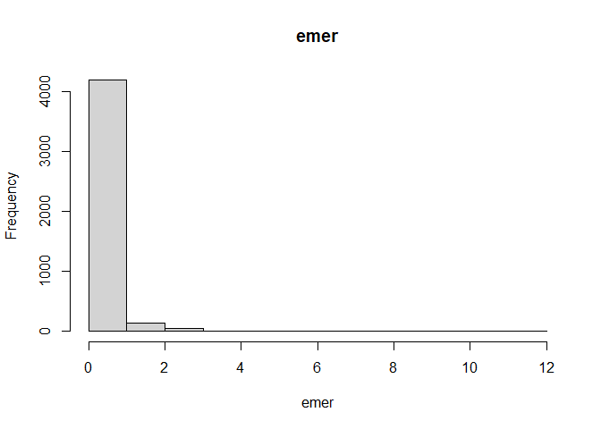<!-- -->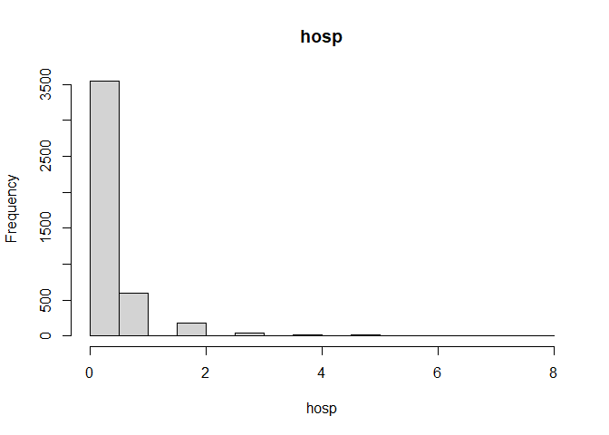<!-- -->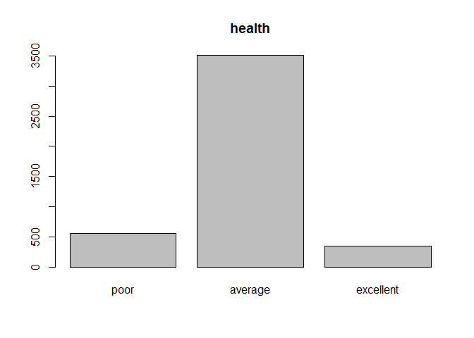<!-- -->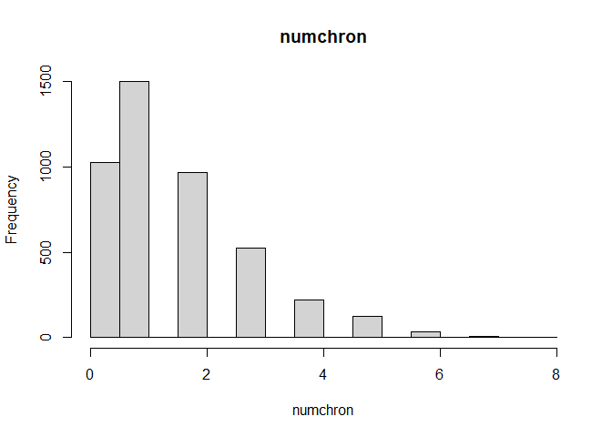<!-- -->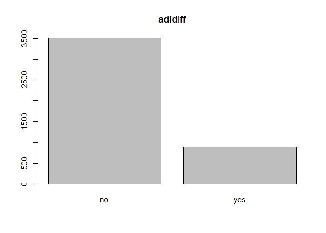<!-- -->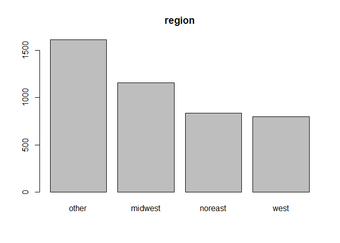<!-- -->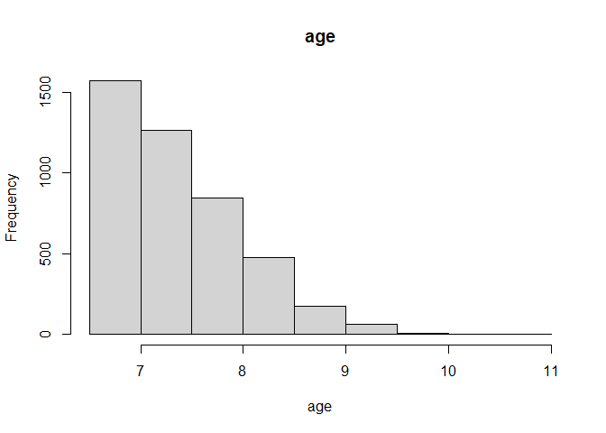<!-- -->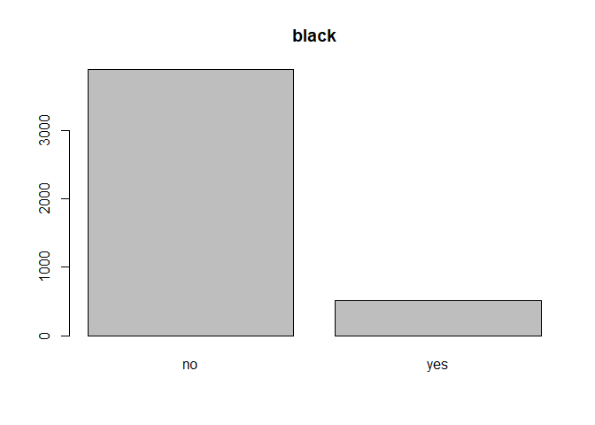<!-- -->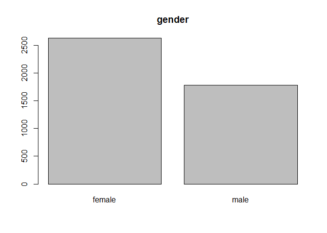<!-- -->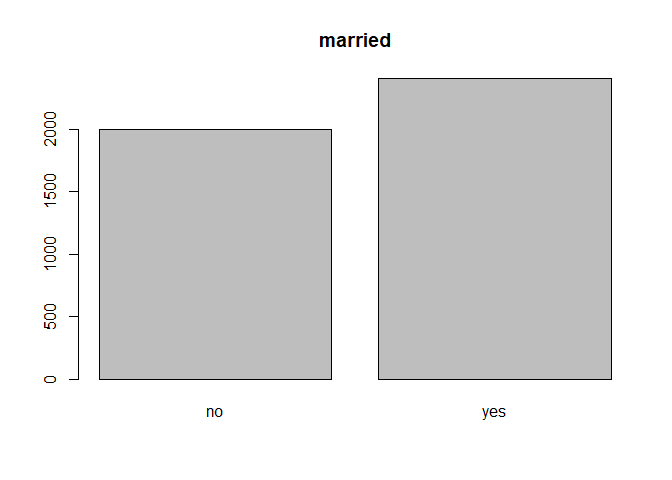<!-- -->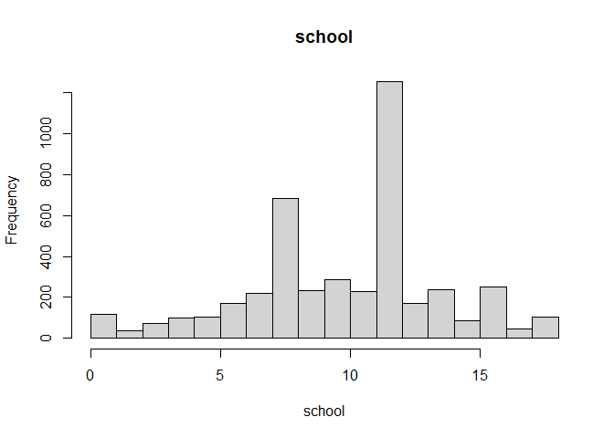<!-- -->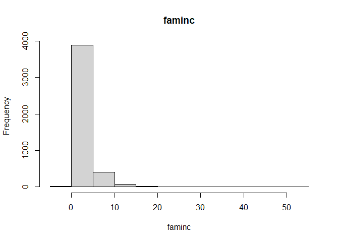<!-- -->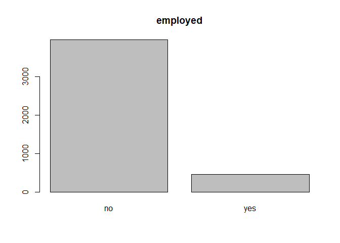<!-- -->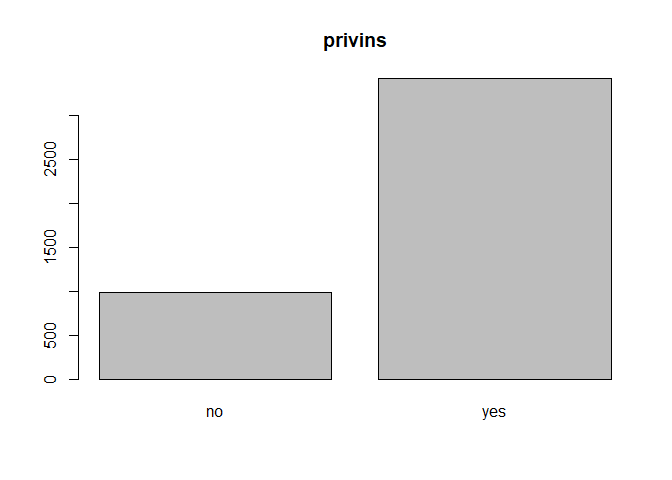<!-- --><!-- -->

<br/> No data is missing. Concerning the values of the predictors,
nothing seems out of the ordinary. The redundancy analysis is next.
<br/>

``` r
library(Hmisc)
redun(~.- ofp - ofnp - opp - opnp,data = DebTrivedi,nk = 0, r2 = 0.95)
```

    ## 
    ## Redundancy Analysis
    ## 
    ## ~emer + hosp + health + numchron + adldiff + region + age + black + 
    ##     gender + married + school + faminc + employed + privins + 
    ##     medicaid
    ## <environment: 0x000001de6bf73ee8>
    ## 
    ## n: 4406  p: 15   nk: 0 
    ## 
    ## Number of NAs:    0 
    ## 
    ## Transformation of target variables forced to be linear
    ## 
    ## R-squared cutoff: 0.95   Type: ordinary 
    ## 
    ## R^2 with which each variable can be predicted from all other variables:
    ## 
    ##     emer     hosp   health numchron  adldiff   region      age    black 
    ##    0.247    0.255    0.229    0.182    0.245    0.060    0.167    0.157 
    ##   gender  married   school   faminc employed  privins medicaid 
    ##    0.175    0.273    0.222    0.142    0.085    0.311    0.286 
    ## 
    ## No redundant variables

<br/> No variable is overly redundant; thus, we keep all variables in
the model. Let us check the number of parameters. <br/>

``` r
dim(model.matrix(ofp ~ emer + hosp + health + numchron + adldiff + region + age + black + gender + married + school + faminc + employed + privins + medicaid,data = DebTrivedi))
```

    ## [1] 4406   19

``` r
dim(model.matrix(ofp ~ (emer + hosp + health + numchron + adldiff + region + age + black + gender + married + school + faminc + employed + privins + medicaid)^2,data = DebTrivedi))
```

    ## [1] 4406  168

<br/> We have 4406 individual observations. The Poisson model with all
interactions will have 168 terms, which satisfies our guidelines (15-20
observations per parameter, the ratio is 26.2 for our model). We could
even consider additional nonlinear terms in the model. However, we wish
to keep the presentation simpler. In addition, we also fit
hurdle/zero-inflated models, which double the number of parameters. In
such a case, the fits seem still reasonable enough. <br/>

## Poisson regression

<br/> We start our modelling with a Poisson regression, i.e., the model
assumes that the response has a Poisson distribution
$P[Y = k] = e^{-\lambda} \frac{\lambda^k}{k!}$, where $\lambda>0$.

The Poisson distribution is a natural distribution for a count response,
as we explain later. The link function for the model is usually taken as
the logarithm (which is a canonical link for the Poisson model). Thus,
the link function for the model is$\mathrm{log} \; E(Y|X) = X\beta$,
i.e., $\lambda = e^{X\beta}$.

Let us fit the Poisson model for our data. <br/>

``` r
full_model <- glm(ofp ~ (emer + hosp + health + numchron + adldiff + region + age + black + gender + married + school + faminc + employed + privins + medicaid)^2, family = poisson, DebTrivedi)
```

<br/> We can test the significance of the predictors via the likelihood
ratio test. <br/>

``` r
variables <- c('emer','hosp','health','numchron','adldiff','region','age','black','gender' ,'married','school','faminc','employed','privins','medicaid')

anova_pvalues <- rep(0,1,length(variables))

 for(i in 1:length(variables)){
      
      formula <- as.formula(paste('ofp ~ (',paste(variables[-i],collapse='+'),')^2'))
      model_red <- glm(formula, family = poisson, DebTrivedi)
      anova_pvalues[i] <- anova(model_red,full_model)$`Pr(>Chi)`[2]
 }

res <- as.data.frame(cbind(variables,round(anova_pvalues,digits = 6)))
colnames(res) <- c('Variable','Pr(>Chi)')
res
```

    ##    Variable Pr(>Chi)
    ## 1      emer        0
    ## 2      hosp        0
    ## 3    health        0
    ## 4  numchron        0
    ## 5   adldiff        0
    ## 6    region        0
    ## 7       age        0
    ## 8     black        0
    ## 9    gender        0
    ## 10  married        0
    ## 11   school        0
    ## 12   faminc        0
    ## 13 employed        0
    ## 14  privins        0
    ## 15 medicaid        0

<br/> All variables seem highly significant. We can also check the
significance of interaction terms. <br/>

``` r
no_int_model <- glm(ofp ~ emer + hosp + health + numchron + adldiff + region + age + black + gender + married + school + faminc + employed + privins + medicaid, family = poisson, DebTrivedi)

anova(no_int_model,full_model)
```

    ## Analysis of Deviance Table
    ## 
    ## Model 1: ofp ~ emer + hosp + health + numchron + adldiff + region + age + 
    ##     black + gender + married + school + faminc + employed + privins + 
    ##     medicaid
    ## Model 2: ofp ~ (emer + hosp + health + numchron + adldiff + region + age + 
    ##     black + gender + married + school + faminc + employed + privins + 
    ##     medicaid)^2
    ##   Resid. Df Resid. Dev  Df Deviance  Pr(>Chi)    
    ## 1      4387      22872                           
    ## 2      4238      20723 149   2149.3 < 2.2e-16 ***
    ## ---
    ## Signif. codes:  0 '***' 0.001 '**' 0.01 '*' 0.05 '.' 0.1 ' ' 1

<br/> Akaike’s information criterion offers another way to compare these
models. <br/>

``` r
aic_stat <- cbind(AIC(full_model),AIC(no_int_model))
colnames(aic_stat) <- c('full','no inter.')
aic_stat
```

    ##          full no inter.
    ## [1,] 33834.47  35685.74

<br/> Overall, the full model with all interactions seems justified.
However, we need to check the distributional assumptions of our model to
ensure that our tests are valid.

Let us first discuss a motivation behind modelling count responses via
the Poisson model. Let’s assume a simple count process, a random process
that denotes a number of occurrences of some event in time, i.e., this
process starts in the state zero, then eventually moves to the state
one, then two, and so on. Let us assume that the *rate* of occurrence of
the tracked event is constant in time; the distribution of time to the
next event is always the same and does not depend on the past. Only
continuous distribution that has this *memoryless* property is
exponential distribution $f(t;\lambda) = \lambda e^{-\lambda t}$ (i.e.,
it meets $P[t > T + \delta| t > \delta] = P[t >T]$, in other words, the
distribution of the time to a next event does not depend on how much
time has already passed). It can be shown that the distribution of the
number of events in the period $[0,T]$ for this count process is Poisson
with parameter $\lambda T$.

Thus, we see that the Poisson distribution of the count response is tied
to the assumption that the underlying count process is close to this
idealized simple count process with a constant rate. Usually, this is
not the case, and the counts are somehow correlated (in our case, we can
suspect that a visit to a doctor increases the probability of further
visits). Thus, the distribution of the number of visits is not truly
Poisson. In terms of fit, this model misspecification translates to a
so-called overdispersion/underdispersion.

Poisson distribution is a single-parameter distribution; thus, as
opposed to the normal distribution, it does not have a separate
parameter for scale (or, in other words, variance). The variance of the
Poisson distribution is equal to its mean, i.e, the variance function of
the model is $\mathrm{Var} (Y|X) =  E(Y|X) = e^{X\beta}$. Let us plot
the residuals of the model to check this assumption. First, we plot the
raw residuals. <br/>

``` r
plot(predict(full_model,type = 'response'),residuals(full_model,type = 'response'),xlab = 'Predicted Values', ylab = 'Raw residuals')
```

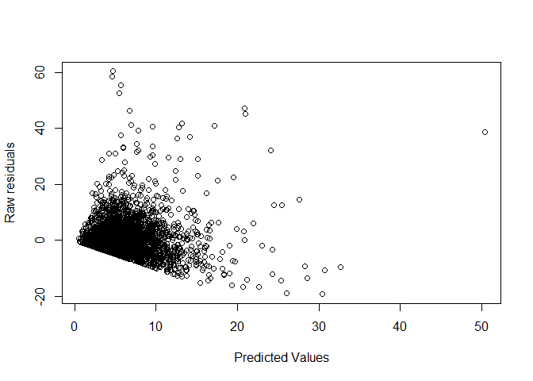<!-- -->

``` r
qqnorm(residuals(full_model,type = 'response'))
qqline(residuals(full_model,type = 'response'))
```

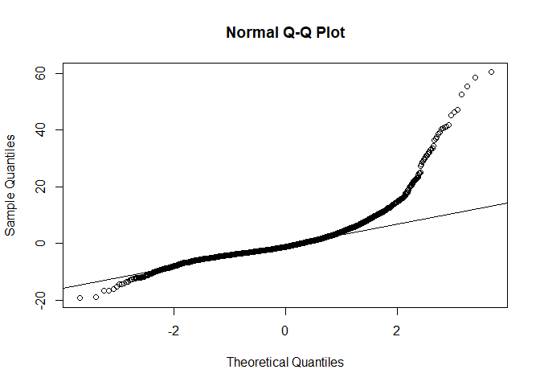<!-- -->

<br/> We observe that the distribution of residuals is obviously not
normal, and their variance increases with the predicted values. Let us
compute the Pearson residuals
$\frac{y_i - \hat{y}_i}{\sqrt{\hat{y}_i}}$, the raw residuals divided by
their expected standard deviation. <br/>

``` r
(residuals(full_model,type = 'response')/sqrt(predict(full_model,type = 'response')))[1:5]
```

    ##          1          2          3          4          5 
    ##  0.8576485 -2.2620983 -0.7393201  2.7313738 -0.4838007

``` r
residuals(full_model,type = 'pearson')[1:5]
```

    ##          1          2          3          4          5 
    ##  0.8576485 -2.2620983 -0.7393201  2.7313738 -0.4838007

<br/> If the specification of our model is correct, the Pearson
residuals should have a constant spread. <br/>

``` r
plot(predict(full_model,type = 'response'),residuals(full_model,type = 'pearson'),xlab = 'Predicted Values', ylab = 'Pearson residuals')
```

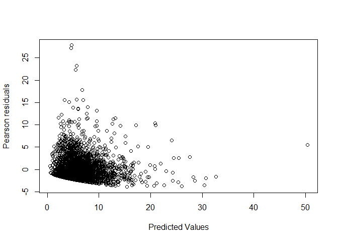<!-- -->

``` r
qqnorm(residuals(full_model,type = 'pearson'))
qqline(residuals(full_model,type = 'pearson'))
```

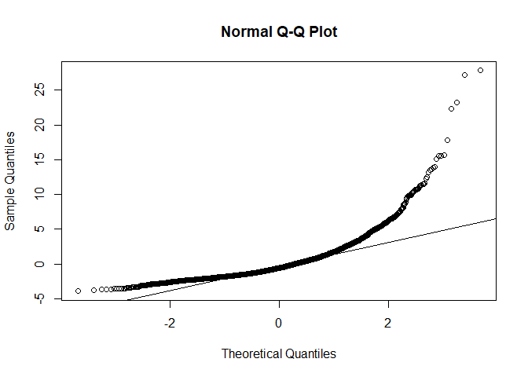<!-- -->

<br/> We observe that this is not the case; the spread in residuals
still increases with the predicted values even after the correction.
Another way to check the variance assumption is to compute the Pearson
$\chi^2$ statistic (or deviance statistic) of the model and divide it by
its degrees of freedom. Provided that the Poisson model is correctly
specified, these ratios should be close to one (*J. W. Hardin and J. M.
Hilbe. Generalized linear models and extensions. Stata Press, 2007.*).
<br/>

``` r
# Pearson chi-squared
sum(residuals(full_model,type = 'pearson')^2)/summary(full_model)$df.residual
```

    ## [1] 5.909182

``` r
# Deviance
summary(full_model)$deviance/summary(full_model)$df.residual
```

    ## [1] 4.889818

<br/> We see that these values are very far from one. Thus, our model is
clearly *overdispersed*. There are two primary sources of the
overdispersion (*J. M. Hilbe. Negative binomial regression. Cambridge
University Press, 2011.*). One is *apparent*, it is caused, for example,
by missing important predictors in the model, outliers, or an inadequate
link. The real overdispersion is, for example, caused by correlation
between responses, as we discussed earlier, or by an excess variation
between response probabilities.

Let us check that our overdispersion is not merely *apparent*. We fitted
a fairly general model that included all assumed predictors and all
first-order interactions, which should be sufficient. Thus, let us look
for the presence of outliers. First, we will plot the leverage and the
Cook’s distance. <br/>

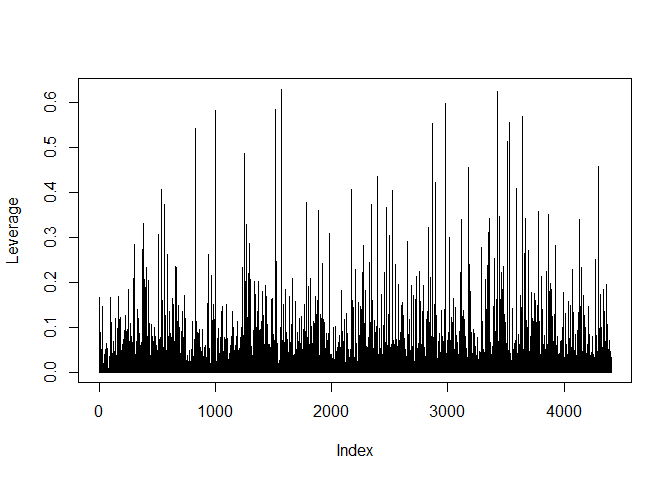<!-- -->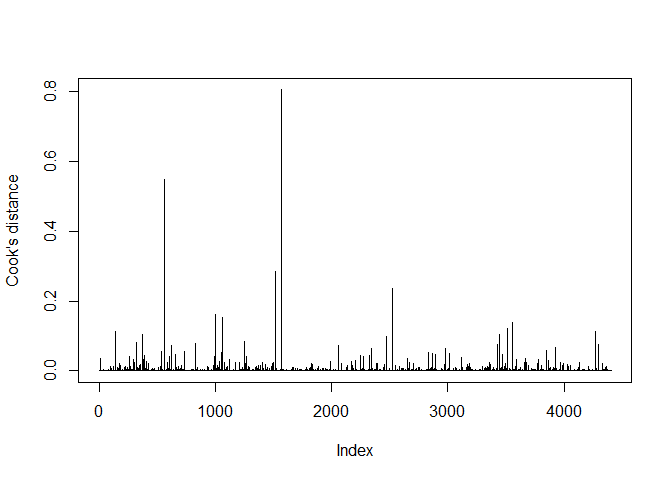<!-- -->

<br/> Some observations might be overly influential. Thus, we will
attempt to remove these (based on the leverage and the Cook’s distance
thresholds) and check whether the overdispersion improved. <br/>

``` r
full_model_cred1 <- glm(ofp ~ (emer + hosp + health + numchron + adldiff + region + age + black + gender + married + school + faminc + employed + privins + medicaid)^2, family = poisson, DebTrivedi[cooks.distance(full_model) < 0.2,])

full_model_cred2 <- glm(ofp ~ (emer + hosp + health + numchron + adldiff + region + age + black + gender + married + school + faminc + employed + privins + medicaid)^2, family = poisson, DebTrivedi[cooks.distance(full_model) < 0.1,])

full_model_cred3 <- glm(ofp ~ (emer + hosp + health + numchron + adldiff + region + age + black + gender + married + school + faminc + employed + privins + medicaid)^2, family = poisson, DebTrivedi[cooks.distance(full_model) < 0.05,])

full_model_cred4 <- glm(ofp ~ (emer + hosp + health + numchron + adldiff + region + age + black + gender + married + school + faminc + employed + privins + medicaid)^2, family = poisson, DebTrivedi[cooks.distance(full_model) < 0.025,])


full_model_lred1 <- glm(ofp ~ (emer + hosp + health + numchron + adldiff + region + age + black + gender + married + school + faminc + employed + privins + medicaid)^2, family = poisson, DebTrivedi[hatvalues(full_model) < 0.8,])

full_model_lred2 <- glm(ofp ~ (emer + hosp + health + numchron + adldiff + region + age + black + gender + married + school + faminc + employed + privins + medicaid)^2, family = poisson, DebTrivedi[hatvalues(full_model) < 0.6,])

full_model_lred3 <- glm(ofp ~ (emer + hosp + health + numchron + adldiff + region + age + black + gender + married + school + faminc + employed + privins + medicaid)^2, family = poisson, DebTrivedi[hatvalues(full_model) < 0.4,])

full_model_lred4 <- glm(ofp ~ (emer + hosp + health + numchron + adldiff + region + age + black + gender + married + school + faminc + employed + privins + medicaid)^2, family = poisson, DebTrivedi[hatvalues(full_model) < 0.2,])


full_model_clred1 <- glm(ofp ~ (emer + hosp + health + numchron + adldiff + region + age + black + gender + married + school + faminc + employed + privins + medicaid)^2, family = poisson, DebTrivedi[hatvalues(full_model) < 0.8 & cooks.distance(full_model) < 0.2,])

full_model_clred2 <- glm(ofp ~ (emer + hosp + health + numchron + adldiff + region + age + black + gender + married + school + faminc + employed + privins + medicaid)^2, family = poisson, DebTrivedi[hatvalues(full_model) < 0.6 & cooks.distance(full_model) < 0.1,])

full_model_clred3 <- glm(ofp ~ (emer + hosp + health + numchron + adldiff + region + age + black + gender + married + school + faminc + employed + privins + medicaid)^2, family = poisson, DebTrivedi[hatvalues(full_model) < 0.4 & cooks.distance(full_model) < 0.05,])

full_model_clred4 <- glm(ofp ~ (emer + hosp + health + numchron + adldiff + region + age + black + gender + married + school + faminc + employed + privins + medicaid)^2, family = poisson, DebTrivedi[hatvalues(full_model) < 0.2 & cooks.distance(full_model) < 0.025,])

pearson_stat <- rbind(
  sum(residuals(full_model,type = 'pearson')^2)/summary(full_model)$df.residual,
  sum(residuals(full_model_cred1,type = 'pearson')^2)/summary(full_model_cred1)$df.residual,
  sum(residuals(full_model_cred2,type = 'pearson')^2)/summary(full_model_cred2)$df.residual,
  sum(residuals(full_model_cred3,type = 'pearson')^2)/summary(full_model_cred3)$df.residual,
  sum(residuals(full_model_cred4,type = 'pearson')^2)/summary(full_model_cred4)$df.residual,
  sum(residuals(full_model_lred1,type = 'pearson')^2)/summary(full_model_cred1)$df.residual,
  sum(residuals(full_model_lred2,type = 'pearson')^2)/summary(full_model_cred2)$df.residual,
  sum(residuals(full_model_lred3,type = 'pearson')^2)/summary(full_model_cred3)$df.residual,
  sum(residuals(full_model_lred4,type = 'pearson')^2)/summary(full_model_cred4)$df.residual,
  sum(residuals(full_model_clred1,type = 'pearson')^2)/summary(full_model_cred1)$df.residual,
  sum(residuals(full_model_clred2,type = 'pearson')^2)/summary(full_model_cred2)$df.residual,
  sum(residuals(full_model_clred3,type = 'pearson')^2)/summary(full_model_cred3)$df.residual,
  sum(residuals(full_model_clred4,type = 'pearson')^2)/summary(full_model_cred4)$df.residual)
dev_stat <- rbind(
  summary(full_model)$deviance/summary(full_model)$df.residual,
  summary(full_model_cred1)$deviance/summary(full_model_cred1)$df.residual,
  summary(full_model_cred2)$deviance/summary(full_model_cred2)$df.residual,
  summary(full_model_cred3)$deviance/summary(full_model_cred3)$df.residual,
  summary(full_model_cred4)$deviance/summary(full_model_cred4)$df.residual,
  summary(full_model_lred1)$deviance/summary(full_model_cred1)$df.residual,
  summary(full_model_lred2)$deviance/summary(full_model_cred2)$df.residual,
  summary(full_model_lred3)$deviance/summary(full_model_cred3)$df.residual,
  summary(full_model_lred4)$deviance/summary(full_model_cred4)$df.residual,
  summary(full_model_clred1)$deviance/summary(full_model_cred1)$df.residual,
  summary(full_model_clred2)$deviance/summary(full_model_cred2)$df.residual,
  summary(full_model_clred3)$deviance/summary(full_model_cred3)$df.residual,
  summary(full_model_clred4)$deviance/summary(full_model_cred4)$df.residual)

stats <- cbind(pearson_stat,dev_stat)
rownames(stats) <- c('full','CD < 0.2','CD < 0.1','CD < 0.05','CD < 0.025','L < 0.8','L < 0.6','L < 0.4','L < 0.2','CD < 0.2 & L < 0.8','CD < 0.1 & L < 0.6','CD < 0.05 & L < 0.4','CD < 0.025 & L < 0.2')
colnames(stats) <- c('pearson * (1/dof)','deviance * (1/dof)')
stats
```

    ##                      pearson * (1/dof) deviance * (1/dof)
    ## full                          5.909182           4.889818
    ## CD < 0.2                      5.647430           4.765851
    ## CD < 0.1                      5.334794           4.611409
    ## CD < 0.05                     5.058929           4.455270
    ## CD < 0.025                    4.669133           4.223916
    ## L < 0.8                       5.914764           4.894437
    ## L < 0.6                       5.897181           4.882618
    ## L < 0.4                       5.906431           4.871048
    ## L < 0.2                       5.698736           4.688336
    ## CD < 0.2 & L < 0.8            5.647430           4.765851
    ## CD < 0.1 & L < 0.6            5.335690           4.607679
    ## CD < 0.05 & L < 0.4           5.037680           4.435983
    ## CD < 0.025 & L < 0.2          4.604662           4.146757

<br/> We observe that the overdispersion showed little improvement.
Thus, we will assume that the overdispersion is not merely apparent.

The last method to assess the fit of the Poisson model we will
demonstrate here is to compare predicted ratios of count responses to
the observed ratios in the data. We will compute the predicted
percentages by computing the predicted probabilities for each
observation and averaging the result for each count response (0, 1, 2,
etc. ).  
<br/>

``` r
obs_freq <- numeric(21)
pred_freq <- numeric(21)

y <- predict(full_model,type = 'response')

for(i in 0:20){
obs_freq[i+1] <- sum(DebTrivedi$ofp == i)/4406*100 # observed percentage
pred_freq[i+1] <- mean(exp(-y)*y^i/factorial(i))*100 # predicted percentage
}

obs_freq
```

    ##  [1] 15.5015887 10.9169315  9.7140263  9.5324557  8.6926918  7.6713572
    ##  [7]  6.0826146  4.9251021  4.2669088  3.8810713  2.9051294  2.6100772
    ## [13]  1.9518838  1.6568316  1.7249206  1.2029051  1.0667272  1.0894235
    ## [19]  0.6808897  0.5447118  0.3631412

``` r
pred_freq
```

    ##  [1]  2.1762813  5.9672856  9.7953598 12.3229966 13.0507346 12.2457415
    ##  [7] 10.5294446  8.5041624  6.5759356  4.9414573  3.6496285  2.6711310
    ## [13]  1.9480102  1.4204919  1.0378476  0.7607215  0.5599161  0.4142272
    ## [19]  0.3083855  0.2314064  0.1753614

``` r
# or simply
library(pscl)
apply(predprob(full_model),2,mean)[1:21]*100
```

    ##          0          1          2          3          4          5          6 
    ##  2.1762813  5.9672856  9.7953598 12.3229966 13.0507346 12.2457415 10.5294446 
    ##          7          8          9         10         11         12         13 
    ##  8.5041624  6.5759356  4.9414573  3.6496285  2.6711310  1.9480102  1.4204919 
    ##         14         15         16         17         18         19         20 
    ##  1.0378476  0.7607215  0.5599161  0.4142272  0.3083855  0.2314064  0.1753614

<br/> We observe that in this regard, the fit is quite poor. The Poisson
model predicts a significantly smaller number of zero (and one)
responses compared to the observed counts. Underestimation of zero
responses, especially, is another common issue with Poisson models in
practice.

A nice way to visualize this effect is a rootogram: the red line denotes
the square root of the predicted total number of count responses (total
number of 0s, total number of 1s, etc.). The grey bars denote the actual
observed counts. Provided that the Poisson model is correct, the gray
bars should have their endpoints near the zero line. <br/>

``` r
library(topmodels)
rootogram(full_model, xlim = c(0,60), confint = FALSE, plot = "base")
```

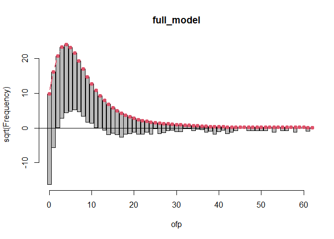<!-- -->

<br/> Overall, we determined that significant overdispersion is present
and there is an excessive number of zeros, making the simple Poisson
model not suitable for this dataset. <br/>

## Variance robust errors, pairs bootstrap, and quasi-Poisson model

<br/> Before we introduce more general models than the Poisson model, we
will examine methods that adjust standard error estimates to account for
overdispersion in the Poisson model. Overdispersion causes biased
(deflated) standard error estimates, which underestimate the variance in
the data and make insignificant predictors appear highly significant.
However, the coefficient estimates are still consistent provided that
the conditional mean expectation ($E(Y|X) = e^{X\beta}$) is correctly
specified (*A. C. Cameron and P. K. Trivedi. Microeconometrics: methods
and applications. Cambridge University Press, 2005.*).

We should keep in mind that these methods do not change the fit itself
(only the standard error estimates). Hence, these methods are probably
not the most appropriate in our case, since we observed that the Poisson
model fits the data poorly due to a large number of excess zeros.

Handling overdispersion in Poisson regression is very similar to
heteroskedasticity in ordinary linear regression. The first correction
of standard error estimates is using heteroskedasticity-consistent
standard errors (*J. W. Hardin and J. M. Hilbe. Generalized linear
models and extensions. Stata press, 2007.*). We will consider HC0
standard errors (Eicker–Huber–White) and HC4 standard errors
(Cribari-Neto). According to simulations, HC4 estimates should perform
better in the presence of high leverage observations, and when errors
are not normally distributed (*F. Cribari-Neto. Asymptotic inference
under heteroskedasticity of unknown form. Computational Statistics &
Data Analysis 45.2 (2004): 215-233.*), which is our case.

To assess the significance of the predictors in the model, we will use
the Wald test with the heteroskedasticity-consistent standard errors.
<br/>

``` r
library(lmtest)
library(sandwich)

st_errors <- cbind(coeftest(full_model)[1:20,2],coeftest(full_model,vcov = vcovHC(full_model, type = 'HC0'))[1:20,2],coeftest(full_model,vcov = vcovHC(full_model, type = 'HC4'))[1:20,2])
colnames(st_errors) <- c('SE', 'SE(HC0)','SE(HC4)')
st_errors
```

    ##                        SE    SE(HC0)    SE(HC4)
    ## (Intercept)   0.410600816 1.03888457 1.38835922
    ## emer          0.132027676 0.50963926 1.13337402
    ## hosp          0.120046318 0.33523421 0.61505566
    ## health.L      0.371306785 0.95738556 1.19371070
    ## health.Q      0.225357707 0.58020654 0.71283883
    ## numchron      0.067443642 0.16037451 0.20891416
    ## adldiffyes    0.224822969 0.55217981 0.71524589
    ## regionmidwest 0.251518900 0.60200539 0.72381427
    ## regionnoreast 0.264237715 0.68271092 0.81626358
    ## regionwest    0.261808274 0.61391984 0.73997366
    ## age           0.052459417 0.13395962 0.17616064
    ## blackyes      0.309066092 0.77822530 0.98321250
    ## gendermale    0.220250495 0.60278756 0.70068691
    ## marriedyes    0.216196967 0.54872365 0.62436516
    ## school        0.025082565 0.06459161 0.07716736
    ## faminc        0.038531475 0.08737352 0.13343862
    ## employedyes   0.372276651 1.06410252 1.43800049
    ## privinsyes    0.270090072 0.66246248 0.95836620
    ## medicaidyes   0.337593269 0.77595925 1.04443128
    ## emer:hosp     0.004936461 0.01137547 0.03641450

``` r
waldtest_pvalues <- rep(0,1,length(variables))
waldtest_HC0_pvalues <- rep(0,1,length(variables))
waldtest_HC4_pvalues <- rep(0,1,length(variables))

for(i in 1:length(variables)){
      
      formula <- as.formula(paste('ofp ~ (',paste(variables[-i],collapse='+'),')^2'))
      model_red <- glm(formula, family = poisson, DebTrivedi)
      waldtest_pvalues[i] <- waldtest(model_red,full_model,test = "Chisq")$`Pr(>Chisq)`[2]
      waldtest_HC0_pvalues[i] <- waldtest(model_red,full_model,vcov = vcovHC(full_model, type = c("HC0")),test = "Chisq")$`Pr(>Chisq)`[2]
      waldtest_HC4_pvalues[i] <- waldtest(model_red,full_model,vcov = vcovHC(full_model, type = c("HC4")),test = "Chisq")$`Pr(>Chisq)`[2]
}

res_HC <- as.data.frame(cbind(variables,round(waldtest_pvalues,digits = 6),round(waldtest_HC0_pvalues,digits = 6),round(waldtest_HC4_pvalues,digits = 6)))
colnames(res_HC) <- c('Variable','Pr(>Chi)', 'Pr(>Chi) (HC0)' ,'Pr(>Chi) (HC4)')
res_HC
```

    ##    Variable Pr(>Chi) Pr(>Chi) (HC0) Pr(>Chi) (HC4)
    ## 1      emer        0       0.002585       0.454414
    ## 2      hosp        0              0          9e-06
    ## 3    health        0              0              0
    ## 4  numchron        0              0              0
    ## 5   adldiff        0       0.013207       0.170875
    ## 6    region        0       0.006667       0.195393
    ## 7       age        0       0.000705       0.053506
    ## 8     black        0       0.615805       0.958293
    ## 9    gender        0        0.02345       0.133566
    ## 10  married        0       0.353071       0.798309
    ## 11   school        0       0.001239       0.038745
    ## 12   faminc        0       0.502091       0.984073
    ## 13 employed        0          6e-06       0.698637
    ## 14  privins        0              0       0.000159
    ## 15 medicaid        0        1.3e-05       0.479246

<br/> We observe that heteroskedasticity-consistent standard errors are
much larger than the original standard error estimates; HC4 estimates
are even larger than HC0 estimates. Some variable are no longer
statistically significant; **black**, **married**, and **faminc** for
HC0 and even **emer**, **adldiff**,**region**,**gender**,**employed**,
and **medicaid** for HC4.

An alternative to heteroskedasticity-consistent standard errors is a
bootstrapped Wald test (*J. W. Hardin and J. M. Hilbe. Generalized
linear models and extensions. Stata press, 2007.*). \<br/

``` r
set.seed(123) # for reproducibility
nb <- 500
wald_boot <- matrix(0,15,nb)
pwald <- numeric(15)

for(i in 1:nb){
  
  DebTrivedi_new <-  DebTrivedi[sample(nrow(DebTrivedi) , rep=TRUE),]
  
  full_model_new <- glm(ofp ~ (emer + hosp + health + numchron + adldiff + region + age + black + gender + married + school + faminc + employed + privins + medicaid)^2, family = poisson, DebTrivedi_new)
  
  for (j in 1:15){
  index <- grepl(variables[j],names(coefficients(full_model)))
  
  # trycatch to skip numerical problems with inversions
  V <- vcov(full_model_new)[index,index]
  wald_boot[j,i] <- tryCatch((coefficients(full_model_new)[index]-coefficients(full_model)[index]) %*% solve(V) %*% (coefficients(full_model_new)[index]-coefficients(full_model)[index]), error = function(e) {NaN})
  }
}

for (j in 1:15){
index <- grepl(variables[j],names(coefficients(full_model)))
V <- vcov(full_model)[index,index]
wald <- coefficients(full_model)[index] %*% solve(V) %*% coefficients(full_model)[index]          
pwald[j] <- mean(wald_boot[j,] > as.numeric(wald),na.rm = TRUE) # p-value
}

boot_res <- as.data.frame(cbind(res_HC,round(pwald,digits = 3)))
colnames(boot_res) <- c('Variable','Pr(>Chi)', 'Pr(>Chi) (HC0)' ,'Pr(>Chi) (HC4)','P-value (bootstrap)')
boot_res
```

    ##    Variable Pr(>Chi) Pr(>Chi) (HC0) Pr(>Chi) (HC4) P-value (bootstrap)
    ## 1      emer        0       0.002585       0.454414               0.044
    ## 2      hosp        0              0          9e-06               0.000
    ## 3    health        0              0              0               0.000
    ## 4  numchron        0              0              0               0.000
    ## 5   adldiff        0       0.013207       0.170875               0.004
    ## 6    region        0       0.006667       0.195393               0.046
    ## 7       age        0       0.000705       0.053506               0.002
    ## 8     black        0       0.615805       0.958293               0.768
    ## 9    gender        0        0.02345       0.133566               0.148
    ## 10  married        0       0.353071       0.798309               0.414
    ## 11   school        0       0.001239       0.038745               0.002
    ## 12   faminc        0       0.502091       0.984073               0.762
    ## 13 employed        0          6e-06       0.698637               0.002
    ## 14  privins        0              0       0.000159               0.000
    ## 15 medicaid        0        1.3e-05       0.479246               0.000

<br/> The results of the bootstrap seem to fall between the HC0 and HC4
estimates. Again, some variables appear to be non-significant, namely,
**black**, **gender**, **married**, and **faminc**.

The last method, which we will mention in this part, is quasi-Poisson
regression. Quasi-Poisson regression has the same conditional mean
specification as the Poisson model
($\mathrm{log} \; \mu = \mathrm{log} \; E(Y|X) = X\beta$), but the
variance function is assumed to be $\mathrm{Var} (Y|X) = \theta\mu$,
where $\theta$ is a free dispersion parameter. Quasi-Poisson regression
exploits the fact that to obtain estimates of $\beta  s$, we do not need
to specify the whole distribution, just the mean and variance (this is
an approach fully utilized in generalized estimating equations,
so-called GEE).

Quasi-Poisson regression leads to the same $\beta s$ estimates as
Poisson regression. However, the error estimates are modified (*A.
Zeileis, C. Kleiber, and S. Jackman. Regression models for count data in
R. Journal of statistical software 27.1 (2008): 1-25.*). We can also
notice that the scaling parameter for dispersion is based on the
aforementioned Pearson statistic.

``` r
full_model_qp <- glm(ofp ~ (emer + hosp + health + numchron + adldiff + region + age + black + gender + married + school + faminc + employed + privins + medicaid)^2, family = quasipoisson, DebTrivedi)


coef <- cbind(coefficients(full_model),coefficients(full_model_qp))[1:20,]
colnames(coef) <- c('Poisson','Quasi-Poisson')
coef
```

    ##                   Poisson Quasi-Poisson
    ## (Intercept)    0.05649902    0.05649902
    ## emer           0.61643524    0.61643524
    ## hosp           0.39944448    0.39944448
    ## health.L      -1.93523494   -1.93523494
    ## health.Q       0.29307423    0.29307423
    ## numchron       0.08015591    0.08015591
    ## adldiffyes     1.69646820    1.69646820
    ## regionmidwest  0.18954454    0.18954454
    ## regionnoreast  0.21557182    0.21557182
    ## regionwest     0.01376039    0.01376039
    ## age            0.07600386    0.07600386
    ## blackyes      -0.93414190   -0.93414190
    ## gendermale    -0.83392736   -0.83392736
    ## marriedyes    -0.01588045   -0.01588045
    ## school         0.13528794    0.13528794
    ## faminc         0.01449464    0.01449464
    ## employedyes    0.02448784    0.02448784
    ## privinsyes     0.27149580    0.27149580
    ## medicaidyes    0.46540620    0.46540620
    ## emer:hosp     -0.03418532   -0.03418532

``` r
sum(residuals(full_model,type = 'pearson')^2)/summary(full_model)$df.residual
```

    ## [1] 5.909182

``` r
summary(full_model_qp)$dispersion
```

    ## [1] 5.909183

<br/> We should note that quasi-Poisson regression is a
*quasi-likelihood* approach; we are not specifying the whole
distribution, just the first two moments. This means that we do not have
some usual characteristics available, such as the likelihood function,
the AIC, or the count probabilities of the model. <br/>

``` r
logLik(full_model_qp)
```

    ## 'log Lik.' NA (df=169)

``` r
AIC(full_model_qp)
```

    ## [1] NA

``` r
predprob(full_model_qp)
```

    ## Error in predprob.glm(full_model_qp): your object of class glm is unsupported by predprob.glmyour object of class lm is unsupported by predprob.glm

<br/> However, we have available recomputed standard errors. <br/>

``` r
anova_pvalues_qp <- rep(0,1,length(variables))

 for(i in 1:length(variables)){
      
      formula <- as.formula(paste('ofp ~ (',paste(variables[-i],collapse='+'),')^2'))
      model_red <- glm(formula, family = quasipoisson, DebTrivedi)
      anova_pvalues_qp[i] <- anova(model_red,full_model_qp)$`Pr(>F)`[2]
 }


res_qp <- as.data.frame(cbind(boot_res,round(anova_pvalues_qp,digits = 6)))
colnames(res_qp) <- c('Variable','Pr(>Chi)', 'Pr(>Chi) (HC0)' ,'Pr(>Chi) (HC4)','P-value (bootstrap)','Pr(>F) (quasi-pois.)')
res_qp
```

    ##    Variable Pr(>Chi) Pr(>Chi) (HC0) Pr(>Chi) (HC4) P-value (bootstrap)
    ## 1      emer        0       0.002585       0.454414               0.044
    ## 2      hosp        0              0          9e-06               0.000
    ## 3    health        0              0              0               0.000
    ## 4  numchron        0              0              0               0.000
    ## 5   adldiff        0       0.013207       0.170875               0.004
    ## 6    region        0       0.006667       0.195393               0.046
    ## 7       age        0       0.000705       0.053506               0.002
    ## 8     black        0       0.615805       0.958293               0.768
    ## 9    gender        0        0.02345       0.133566               0.148
    ## 10  married        0       0.353071       0.798309               0.414
    ## 11   school        0       0.001239       0.038745               0.002
    ## 12   faminc        0       0.502091       0.984073               0.762
    ## 13 employed        0          6e-06       0.698637               0.002
    ## 14  privins        0              0       0.000159               0.000
    ## 15 medicaid        0        1.3e-05       0.479246               0.000
    ##    Pr(>F) (quasi-pois.)
    ## 1              0.003232
    ## 2              0.000000
    ## 3              0.000000
    ## 4              0.000000
    ## 5              0.000886
    ## 6              0.011994
    ## 7              0.000235
    ## 8              0.598136
    ## 9              0.033481
    ## 10             0.270552
    ## 11             0.000100
    ## 12             0.784165
    ## 13             0.000016
    ## 14             0.000001
    ## 15             0.000423

<br/> We observe that the significance of the variables in the model for
the quasi-likelihood regression is quite similar to the Wald test based
on HC0 standard errors; variables **black**, **married**, and **faminc**
appear non-significant. <br/>

## Negative binomial regression

<br/> Negative binomial regression is an alternative to Poisson
regression for modelling the count response. Negative binomial
distribution models the number of failures in a sequence of i.i.d.
Bernoulli trials before a specified number of successes occur, i.e., the
distribution has two parameters: the probability of a success and the
number of successes. The Poisson distribution is a limit of the negative
binomial distribution when the probability of success goes to one.

This usual interpretation of the negative binomial distribution does not
really provide a connection to the count processes. To achieve one
example of this connection, let us assume that the distribution of
counts has a Poisson distribution with a parameter $\lambda$. Now, let
us assume that $\lambda$ is not fully deterministic (as was the case for
the Poisson regression, where $\lambda = e^{X\beta}$). Instead, let
$\lambda$ be equal to $\nu \mu$ where $\nu>0$ is a random variable and
just $\mu$ is deterministic (e.g., $\mu = e^{X\beta}$) .

The $\nu$ represents an observed heterogeneity in the data. Let us
assume that $\nu$ has a gamma distribution
(<https://en.wikipedia.org/wiki/Gamma_distribution>) with the shape
parameter $\delta$ equal to the rate parameter. Then, the marginal
distribution of the count response (in which $\nu$ is integrated out,
i.e., it is essentially an “average” distribution of the count response)
is a negative binomial distribution with parameter $\delta$ and
$\mu = X\beta$, see *A. C. Cameron and P. K. Trivedi. Microeconometrics:
methods and applications. Cambridge university press, 2005.* for more
details.

The link function for the negative binomial is usually logarithmic, as
in the Poisson distribution, i.e.,
$\mathrm{log} \; \mu = \mathrm{log} \; E(Y|X) = X\beta$ (negative
binomial regression has the same conditional mean specification as the
Poisson model). However, the variance function is
$\mathrm{Var}(Y|X) = \mu + \alpha\mu^2$, where $\theta >0$ (i.e., it is
a quadratic function of the mean).

The fit of the negative binomial regression for our data is as follows.
<br/>

``` r
library(MASS)
full_model_nb <- glm.nb(ofp ~ (emer + hosp + health + numchron + adldiff + region + age + black + gender + married + school + faminc + employed + privins + medicaid)^2, control = list(epsilon = 1e-08, maxit = 100, trace = FALSE), DebTrivedi)
```

<br/> We can compare the negative binomial model with the Poisson model
using the AIC. <br/>

``` r
aic_stat <- cbind(AIC(full_model),AIC(full_model_nb))
colnames(aic_stat) <- c('poisson','negbin')
aic_stat
```

    ##       poisson   negbin
    ## [1,] 33834.47 24296.08

<br/> We observe that the fit in terms of AIC is significantly better.
Let us check the significance of variables. <br/>

``` r
anova_pvalues_nb <- rep(0,1,length(variables))

 for(i in 1:length(variables)){
      
      formula <- as.formula(paste('ofp ~ (',paste(variables[-i],collapse='+'),')^2'))
      model_red <- glm.nb(formula, control = list(epsilon = 1e-08, maxit = 100, trace = FALSE), DebTrivedi)
      anova_pvalues_nb[i] <- anova(model_red,full_model_nb)$`Pr(Chi)`[2]
 }

res_nb <- as.data.frame(cbind(variables,round(anova_pvalues_nb,digits = 6)))
colnames(res_nb) <- c('Variable','Pr(>Chi)')
res_nb
```

    ##    Variable Pr(>Chi)
    ## 1      emer 0.000105
    ## 2      hosp        0
    ## 3    health        0
    ## 4  numchron        0
    ## 5   adldiff 0.003098
    ## 6    region 0.002597
    ## 7       age 0.000536
    ## 8     black 0.875188
    ## 9    gender 0.019961
    ## 10  married 0.086635
    ## 11   school    2e-06
    ## 12   faminc 0.875861
    ## 13 employed 0.000467
    ## 14  privins        0
    ## 15 medicaid 0.001473

<br/> The significance is quite similar to the quasi-Poisson model.
Again, variables **black** and **faminc** appear non-significant
(**married** is borderline). We can compare the results of likelihood
ratio tests with the bootstrapped Wald test. <br/>

``` r
set.seed(123) # for reproducibility
nb <- 500
wald_boot <- matrix(0,15,nb)
pwald <- numeric(15)

for(i in 1:nb){
  
  DebTrivedi_new <-  DebTrivedi[sample(nrow(DebTrivedi) , rep=TRUE),]
  
  full_model_new <- glm.nb(ofp ~ (emer + hosp + health + numchron + adldiff + region + age + black + gender + married + school + faminc + employed + privins + medicaid)^2, control = list(epsilon = 1e-08, maxit = 100, trace = FALSE), DebTrivedi_new)
  
  if (full_model_new$converged == TRUE){
    
    for (j in 1:15){
      
      index <- grepl(variables[j],names(coefficients(full_model_nb)))
      
      V <- tryCatch(vcov(full_model_new)[index,index], error = function(e) {NaN})
      
      if (any(is.na(V)) == FALSE){
        wald_boot[j,i] <- tryCatch((coefficients(full_model_new)[index]-
                                  coefficients(full_model_nb)[index])%*%solve(V) %*%
                                  (coefficients(full_model_new)[index]-coefficients(full_model_nb)[index]),
                                  error = function(e) {NaN})
      } else {wald_boot[j,i] = NaN}
    }
  } else {wald_boot[,i] = NaN}
}

for (j in 1:15){
index <- grepl(variables[j],names(coefficients(full_model_nb)))
V <- vcov(full_model_nb)[index,index]
wald <- coefficients(full_model_nb)[index] %*% solve(V) %*% coefficients(full_model_nb)[index]          
pwald[j] <- mean(wald_boot[j,] > as.numeric(wald),na.rm = TRUE) # p-value
}

boot_res_nb <- as.data.frame(cbind(variables,round(anova_pvalues_nb,digits = 6),round(pwald,digits = 3)))
colnames(boot_res_nb) <- c('Variable','Pr(>Chi)','P-value (bootstrap)')
boot_res_nb
```

    ##    Variable Pr(>Chi) P-value (bootstrap)
    ## 1      emer 0.000105               0.037
    ## 2      hosp        0                   0
    ## 3    health        0                   0
    ## 4  numchron        0                   0
    ## 5   adldiff 0.003098               0.061
    ## 6    region 0.002597               0.095
    ## 7       age 0.000536               0.011
    ## 8     black 0.875188               0.971
    ## 9    gender 0.019961               0.133
    ## 10  married 0.086635                0.31
    ## 11   school    2e-06                   0
    ## 12   faminc 0.875861               0.891
    ## 13 employed 0.000467               0.074
    ## 14  privins        0                   0
    ## 15 medicaid 0.001473               0.029

<br/> The results of the bootstrap are similar to the previous bootstrap
(**black**, **married**, and **faminc** appear to be largely
non-significant).

The negative binomial model can still be overdispersed, and we should
check the number of predicted zeros. First, we can check the deviance
and Pearson statistics.  
<br/>

``` r
# Pearson chi-squared
sum(residuals(full_model_nb,type = 'pearson')^2)/summary(full_model_nb)$df.residual
```

    ## [1] 1.228089

``` r
# Deviance
summary(full_model_nb)$deviance/summary(full_model_nb)$df.residual
```

    ## [1] 1.192739

<br/> These values are much closer to one. Next, we look at the
residuals. We will use the simulation-based randomized quantile
residuals from the DHARMa package
(<https://cran.r-project.org/web/packages/DHARMa/vignettes/DHARMa.html#interpreting-residuals-and-recognizing-misspecification-problems>).
Provided that the model is correctly specified, the randomized quantile
residuals should be uniformly distributed. <br/>

``` r
library(DHARMa)
simulationOutput_nb <- simulateResiduals(fittedModel = full_model_nb)
testUniformity(simulationOutput_nb)
```

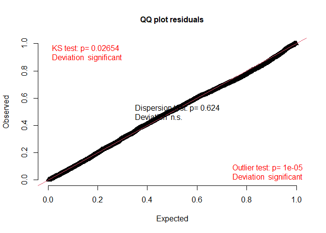<!-- -->

    ## 
    ##  Asymptotic one-sample Kolmogorov-Smirnov test
    ## 
    ## data:  simulationOutput$scaledResiduals
    ## D = 0.022147, p-value = 0.02654
    ## alternative hypothesis: two-sided

``` r
testDispersion(simulationOutput_nb)
```

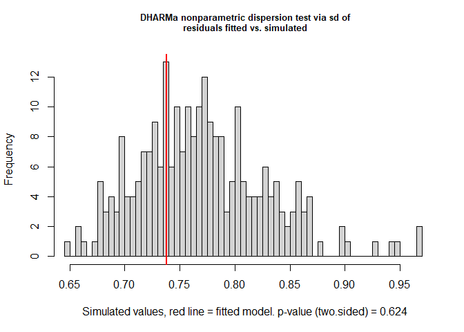<!-- -->

    ## 
    ##  DHARMa nonparametric dispersion test via sd of residuals fitted vs.
    ##  simulated
    ## 
    ## data:  simulationOutput
    ## dispersion = 0.95806, p-value = 0.624
    ## alternative hypothesis: two.sided

``` r
testQuantiles(simulationOutput_nb)
```

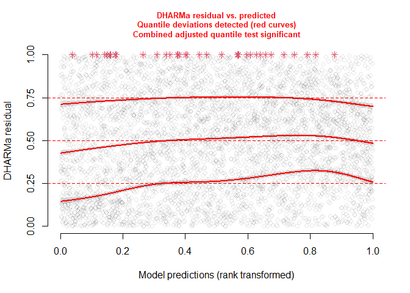<!-- -->

    ## 
    ##  Test for location of quantiles via qgam
    ## 
    ## data:  res
    ## p-value < 2.2e-16
    ## alternative hypothesis: both

<br/> For comparison, let us repeat these tests for the Poisson model.
<br/>

``` r
simulationOutput_q <- simulateResiduals(fittedModel = full_model)
testUniformity(simulationOutput_q)
```

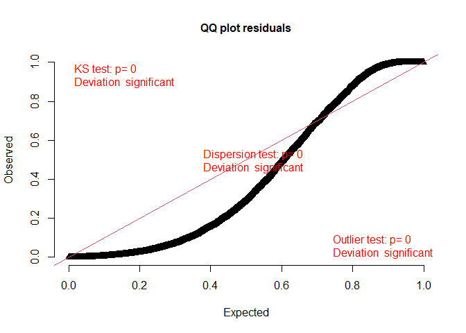<!-- -->

    ## 
    ##  Asymptotic one-sample Kolmogorov-Smirnov test
    ## 
    ## data:  simulationOutput$scaledResiduals
    ## D = 0.2424, p-value < 2.2e-16
    ## alternative hypothesis: two-sided

``` r
testDispersion(simulationOutput_q)
```

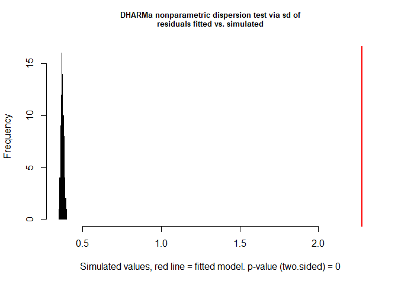<!-- -->

    ## 
    ##  DHARMa nonparametric dispersion test via sd of residuals fitted vs.
    ##  simulated
    ## 
    ## data:  simulationOutput
    ## dispersion = 6.1696, p-value < 2.2e-16
    ## alternative hypothesis: two.sided

``` r
testQuantiles(simulationOutput_q)
```

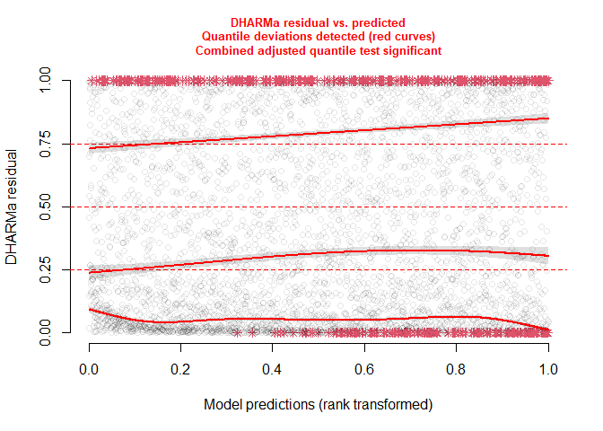<!-- -->

    ## 
    ##  Test for location of quantiles via qgam
    ## 
    ## data:  res
    ## p-value < 2.2e-16
    ## alternative hypothesis: both

<br/> The negative binomial model is a vast improvement over the Poisson
model, although the models still do not seem quite right. Let us check
the zeros next. The DHARMa package has a dedicated simulation-based
test. <br/>

``` r
testZeroInflation(simulationOutput_nb)
```

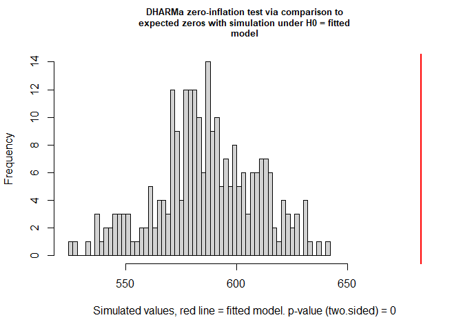<!-- -->

    ## 
    ##  DHARMa zero-inflation test via comparison to expected zeros with
    ##  simulation under H0 = fitted model
    ## 
    ## data:  simulationOutput
    ## ratioObsSim = 1.1639, p-value < 2.2e-16
    ## alternative hypothesis: two.sided

<br/> We see that the number of zeros is still incorrect. We can also
check this fact by comparing the predicted number of zeros and the
observed number. <br/>

``` r
freq <- rbind(obs_freq,pred_freq,100*apply(predprob(full_model_nb),2,mean)[1:21])
rownames(freq) <- c('observed','poisson','negative binomial')
freq
```

    ##                           0         1         2         3         4         5
    ## observed          15.501589 10.916931  9.714026  9.532456  8.692692  7.671357
    ## poisson            2.176281  5.967286  9.795360 12.322997 13.050735 12.245742
    ## negative binomial 13.308183 13.306110 11.734554  9.958378  8.321731  6.909778
    ##                           6        7        8        9       10       11
    ## observed           6.082615 4.925102 4.266909 3.881071 2.905129 2.610077
    ## poisson           10.529445 8.504162 6.575936 4.941457 3.649629 2.671131
    ## negative binomial  5.725403 4.744974 3.938370 3.276379 2.733217 2.287087
    ##                         12       13       14        15        16        17
    ## observed          1.951884 1.656832 1.724921 1.2029051 1.0667272 1.0894235
    ## poisson           1.948010 1.420492 1.037848 0.7607215 0.5599161 0.4142272
    ## negative binomial 1.919969 1.617144 1.366667 1.1588751 0.9859602 0.8416112
    ##                          18        19        20
    ## observed          0.6808897 0.5447118 0.3631412
    ## poisson           0.3083855 0.2314064 0.1753614
    ## negative binomial 0.7207223 0.6191552 0.5335486

<br/> Again, we observe that the negative binomial model is
significantly better than the Poisson model, but it is slightly off.
<br/>

``` r
rootogram(full_model_nb, xlim = c(0,60), confint = FALSE, plot = "base")
```

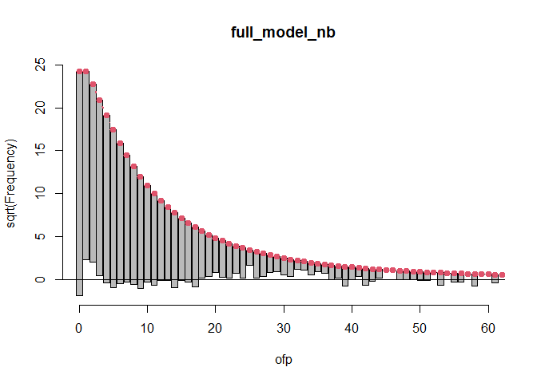<!-- -->

## Hurdle model

<br/> The hurdle model consists of essentially two models, one model for
modelling zero response and one model for modelling non-zero response.
The usual combination is a binomial (i.e., logistic) regression for
separating zero and non-zero responses with a truncated Poisson or
truncated negative binomial regression for modeling positive counts. Let
us first use the default hurdle model via the function *hurdle*; the
binomial truncated Poisson hurdle model. <br/>

``` r
hurdle_binomial_poisson <- hurdle(ofp ~ (emer + hosp + health + numchron + adldiff + region + age + black + gender + married + school + faminc + employed + privins + medicaid)^2, data = DebTrivedi)


aic_stat <- cbind(AIC(full_model),AIC(full_model_nb),AIC(hurdle_binomial_poisson))
colnames(aic_stat) <- c('poisson','negbin','hurdle (bin/poisson)')
aic_stat
```

    ##       poisson   negbin hurdle (bin/poisson)
    ## [1,] 33834.47 24296.08             30910.06

<br/> We observe that the fit is relatively poor; let us check the
truncated negative binomial model next. <br/>

``` r
hurdle_binomial_negbin <- hurdle(ofp ~ (emer + hosp + health + numchron + adldiff + region + age + black + gender + married + school + faminc + employed + privins + medicaid)^2, data = DebTrivedi, dist = 'negbin')

aic_stat <- cbind(AIC(full_model),AIC(full_model_nb),AIC(hurdle_binomial_poisson),AIC(hurdle_binomial_negbin))
colnames(aic_stat) <- c('poisson','negbin','hurdle (bin/poisson)','hurdle (bin/negbin)')
aic_stat
```

    ##       poisson   negbin hurdle (bin/poisson) hurdle (bin/negbin)
    ## [1,] 33834.47 24296.08             30910.06             24240.4

<br/> The binomial/negative binomial hurdle is the best-fitting model so
far in terms of the AIC. Let us demonstrate that the hurdle model indeed
consists of two separate models. First, we fit the logistic model to
model zero responses and compare the coefficients with the zero hurdle
model coefficients. <br/>

``` r
visit <- ifelse(DebTrivedi$ofp > 0, 1, 0)
zero_hurdle_model <- glm(visit ~ (emer + hosp + health + numchron + adldiff + region + age + black + gender + married + school + faminc + employed + privins + medicaid)^2, data=DebTrivedi,family=binomial)

cbind(coefficients(hurdle_binomial_negbin)[(length(coefficients(hurdle_binomial_negbin))/2+1):length(coefficients(hurdle_binomial_negbin))],coefficients(zero_hurdle_model))[1:25,]
```

    ##                                [,1]        [,2]
    ## zero_(Intercept)        -4.72907586 -4.72907586
    ## zero_emer                2.63746550  2.63746550
    ## zero_hosp                1.03760547  1.03760547
    ## zero_health.L           -4.31212726 -4.31212726
    ## zero_health.Q            0.35672969  0.35672969
    ## zero_numchron            0.84027578  0.84027578
    ## zero_adldiffyes          1.08274386  1.08274386
    ## zero_regionmidwest       1.34020064  1.34020064
    ## zero_regionnoreast      -0.63436487 -0.63436487
    ## zero_regionwest          0.27708393  0.27708393
    ## zero_age                 0.63041669  0.63041669
    ## zero_blackyes           -0.93383768 -0.93383768
    ## zero_gendermale         -1.77568139 -1.77568139
    ## zero_marriedyes         -2.51731017 -2.51731017
    ## zero_school              0.34990599  0.34990599
    ## zero_faminc             -0.34721341 -0.34721341
    ## zero_employedyes         3.79683366  3.79683366
    ## zero_privinsyes          2.95369766  2.95369766
    ## zero_medicaidyes         3.00096819  3.00096819
    ## zero_emer:hosp          -0.14760180 -0.14760180
    ## zero_emer:health.L      -0.13049068 -0.13049068
    ## zero_emer:health.Q       0.03240382  0.03240382
    ## zero_emer:numchron       0.03245484  0.03245484
    ## zero_emer:adldiffyes    -0.40184300 -0.40184300
    ## zero_emer:regionmidwest -0.35221718 -0.35221718

<br/> We observe that the fits are identical. Next, we fit the truncated
negative binomial model for the non-zero responses and compare the
coefficients with the count model coefficients of the hurdle model.
<br/>

``` r
library(glmmTMB)
truncated_hurdle_model <-  glmmTMB(ofp ~ (emer + hosp + health + numchron + adldiff + region + age + black + gender + married + school + faminc + employed + privins + medicaid)^2, family=truncated_nbinom2(link = "log"), control=glmmTMBControl(optCtrl=list(iter.max=1e3,eval.max=1e3)), data=DebTrivedi[DebTrivedi$ofp >0 ,])

cbind(coefficients(hurdle_binomial_negbin)[2:25],unlist(fixef(truncated_hurdle_model))[2:25])
```

    ##                                  [,1]         [,2]
    ## count_emer                0.399637547  0.399674800
    ## count_hosp                0.376898068  0.376893518
    ## count_health.L           -1.434824639 -1.434916048
    ## count_health.Q            0.384422285  0.384532681
    ## count_numchron            0.006373564  0.006425057
    ## count_adldiffyes          1.810940233  1.810743656
    ## count_regionmidwest      -0.070039632 -0.069979837
    ## count_regionnoreast      -0.121918935 -0.121709591
    ## count_regionwest          0.324323450  0.323962355
    ## count_age                -0.083069670 -0.083059137
    ## count_blackyes           -0.485520972 -0.485255104
    ## count_gendermale         -0.213817214 -0.213650965
    ## count_marriedyes          0.159290408  0.159169232
    ## count_school              0.061740681  0.061745180
    ## count_faminc              0.009337997  0.009375750
    ## count_employedyes         0.097787455  0.097836751
    ## count_privinsyes         -0.247231596 -0.247293230
    ## count_medicaidyes        -0.521692914 -0.521587761
    ## count_emer:hosp          -0.032540761 -0.032540133
    ## count_emer:health.L      -0.206124204 -0.206092677
    ## count_emer:health.Q      -0.166396175 -0.166386784
    ## count_emer:numchron      -0.013630245 -0.013631027
    ## count_emer:adldiffyes     0.047672169  0.047683070
    ## count_emer:regionmidwest  0.001408345  0.001415820

<br/> These fits are also almost identical, which demonstrates that we
could indeed fit two separate models. Next, we will check the
significance of the predictors via the Wald test. <br/>

``` r
waldtest_pvalues_hurdle <- rep(0,1,length(variables))

 for(i in 1:length(variables)){
      
      formula <- as.formula(paste('ofp ~ (',paste(variables[-i],collapse='+'),')^2'))
      model_red <- hurdle(formula, data = DebTrivedi, dist = 'negbin')
      waldtest_pvalues_hurdle[i] <- waldtest(model_red,hurdle_binomial_negbin)$`Pr(>Chisq)`[2]
 }

res_hurdle <- as.data.frame(cbind(variables,round(waldtest_pvalues_hurdle,digits = 6)))
colnames(res_hurdle) <- c('Variable','Pr(>Chi)')
res_hurdle
```

    ##    Variable Pr(>Chi)
    ## 1      emer 0.038176
    ## 2      hosp        0
    ## 3    health        0
    ## 4  numchron        0
    ## 5   adldiff 0.000676
    ## 6    region 0.006383
    ## 7       age 0.001304
    ## 8     black 0.574616
    ## 9    gender    5e-06
    ## 10  married 0.007414
    ## 11   school  7.4e-05
    ## 12   faminc 0.391829
    ## 13 employed 0.001061
    ## 14  privins        0
    ## 15 medicaid 0.028212

<br/> We see that the results are pretty similar to the negative
binomial and quasi-Poisson models (variables **black** and **faminc**
appear again non-significant). Let us check the results by comparing
them to the bootstrap Wald test. <br/>

``` r
set.seed(123) # for reproducibility
nb <- 500
wald_boot_hurdle <- matrix(0,15,nb)
pwald_hurdle <- numeric(15)

for(i in 1:nb){
  
  DebTrivedi_new <-  DebTrivedi[sample(nrow(DebTrivedi) , rep=TRUE),]
  
  hurdle_model_new <- tryCatch(hurdle(ofp ~ (emer + hosp + health + numchron + adldiff + region + age + black + gender + married + school + faminc + employed + privins + medicaid)^2, data = DebTrivedi_new, dist = 'negbin'), error = function(e) {NaN})
  
  if (any(is.na(hurdle_model_new)) == FALSE){
  for (j in 1:15){
    
  index <- grepl(variables[j],names(coefficients(hurdle_binomial_negbin)))
  V <- vcov(hurdle_model_new)[index,index]
  wald_boot_hurdle[j,i] <- tryCatch((coefficients(hurdle_model_new)[index]-coefficients(hurdle_binomial_negbin)[index]) %*% solve(V) %*% (coefficients(hurdle_model_new)[index]-coefficients(hurdle_binomial_negbin)[index]), error = function(e) {NaN})

  }
  }
  
  if (any(is.na(hurdle_model_new)) == TRUE){
    wald_boot_hurdle[j,i] <-  NaN
  }

}

for (j in 1:15){
  
index <- grepl(variables[j],names(coefficients(hurdle_binomial_negbin)))
V <- vcov(hurdle_binomial_negbin)[index,index]
wald <- coefficients(hurdle_binomial_negbin)[index] %*% solve(V) %*% coefficients(hurdle_binomial_negbin)[index]          
pwald_hurdle[j] <- mean(wald_boot_hurdle[j,] > as.numeric(wald),na.rm = TRUE) # p-value
}

boot_res_hurdle <- cbind(res_hurdle,round(pwald_hurdle,digits = 3))
colnames(boot_res_hurdle) <- c('Variable','P-value (Wald test)','P-value (bootstrap)')
boot_res_hurdle
```

    ##    Variable P-value (Wald test) P-value (bootstrap)
    ## 1      emer            0.038176               0.138
    ## 2      hosp                   0               0.000
    ## 3    health                   0               0.000
    ## 4  numchron                   0               0.000
    ## 5   adldiff            0.000676               0.004
    ## 6    region            0.006383               0.074
    ## 7       age            0.001304               0.014
    ## 8     black            0.574616               0.822
    ## 9    gender               5e-06               0.000
    ## 10  married            0.007414               0.030
    ## 11   school             7.4e-05               0.004
    ## 12   faminc            0.391829               0.588
    ## 13 employed            0.001061               0.052
    ## 14  privins                   0               0.000
    ## 15 medicaid            0.028212               0.072

<br/> We observe that the bootstrap mostly confirms the results of the
Wald test (variables **black** and **faminc** appear non-significant).
Let us now check the fit of the model. We investigate the predicted
counts first. <br/>

``` r
freq <- rbind(obs_freq,pred_freq,100*apply(predprob(full_model_nb),2,mean)[1:21], 100*apply(predprob(hurdle_binomial_negbin),2,mean)[1:21])
rownames(freq) <- c('observed','poisson','negative binomial','hurdle (bin/negbin)')
freq
```

    ##                             0         1         2         3         4         5
    ## observed            15.501589 10.916931  9.714026  9.532456  8.692692  7.671357
    ## poisson              2.176281  5.967286  9.795360 12.322997 13.050735 12.245742
    ## negative binomial   13.308183 13.306110 11.734554  9.958378  8.321731  6.909778
    ## hurdle (bin/negbin) 15.501589 10.811819 10.554293  9.560382  8.349427  7.145637
    ##                             6        7        8        9       10       11
    ## observed             6.082615 4.925102 4.266909 3.881071 2.905129 2.610077
    ## poisson             10.529445 8.504162 6.575936 4.941457 3.649629 2.671131
    ## negative binomial    5.725403 4.744974 3.938370 3.276379 2.733217 2.287087
    ## hurdle (bin/negbin)  6.043140 5.074826 4.244519 3.542844 2.955217 2.465841
    ##                           12       13       14        15        16        17
    ## observed            1.951884 1.656832 1.724921 1.2029051 1.0667272 1.0894235
    ## poisson             1.948010 1.420492 1.037848 0.7607215 0.5599161 0.4142272
    ## negative binomial   1.919969 1.617144 1.366667 1.1588751 0.9859602 0.8416112
    ## hurdle (bin/negbin) 2.059620 1.722989 1.444174 1.2131734 1.0216098 0.8625272
    ##                            18        19        20
    ## observed            0.6808897 0.5447118 0.3631412
    ## poisson             0.3083855 0.2314064 0.1753614
    ## negative binomial   0.7207223 0.6191552 0.5335486
    ## hurdle (bin/negbin) 0.7301853 0.6198652 0.5276962

``` r
rootogram(hurdle_binomial_negbin, xlim = c(0,60), confint = FALSE, plot = "base")
```

<!-- -->

<br/> The predicted counts mirror the observed ones well. Lastly, let us
check the residuals. Unfortunately, the DHARMa package does not support
the model obtained from the *hurdle* function. However, we can check our
separate fits. Alternatively, we can refit the hurdle model via the
supported glmmTMB package. <br/>

``` r
simulationOutput_zero <- simulateResiduals(fittedModel = zero_hurdle_model)
testUniformity(simulationOutput_zero)
```

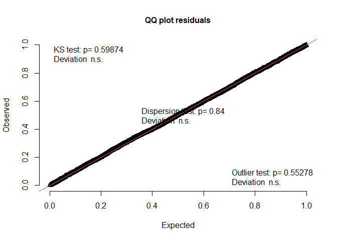<!-- -->

    ## 
    ##  Asymptotic one-sample Kolmogorov-Smirnov test
    ## 
    ## data:  simulationOutput$scaledResiduals
    ## D = 0.011554, p-value = 0.5987
    ## alternative hypothesis: two-sided

``` r
testQuantiles(simulationOutput_zero)
```

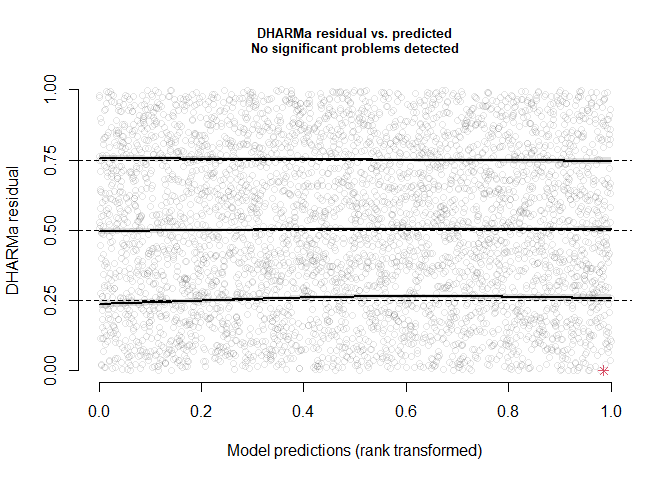<!-- -->

    ## 
    ##  Test for location of quantiles via qgam
    ## 
    ## data:  res
    ## p-value = 0.8519
    ## alternative hypothesis: both

``` r
simulationOutput_trunc <- simulateResiduals(fittedModel = truncated_hurdle_model)
testUniformity(truncated_hurdle_model)
```

<!-- -->

    ## 
    ##  Asymptotic one-sample Kolmogorov-Smirnov test
    ## 
    ## data:  simulationOutput$scaledResiduals
    ## D = 0.022588, p-value = 0.04479
    ## alternative hypothesis: two-sided

``` r
testQuantiles(truncated_hurdle_model)
```

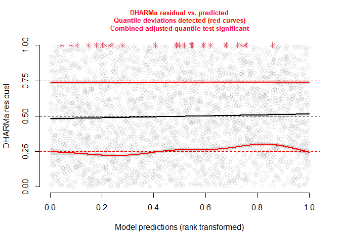<!-- -->

    ## 
    ##  Test for location of quantiles via qgam
    ## 
    ## data:  res
    ## p-value = 0.007141
    ## alternative hypothesis: both

``` r
# Refit of the hurdle model
hurdle_binomial_negbin_alt <-  glmmTMB(ofp ~ (emer + hosp + health + numchron + adldiff + region + age + black + gender + married + school + faminc + employed + privins + medicaid)^2, family=truncated_nbinom2(link = "log"), control=glmmTMBControl(optCtrl=list(iter.max=5e3,eval.max=5e3)), data=DebTrivedi, ziformula = ~.)

simulationOutput_hurdle <- simulateResiduals(fittedModel = hurdle_binomial_negbin_alt)
testUniformity(simulationOutput_hurdle)
```

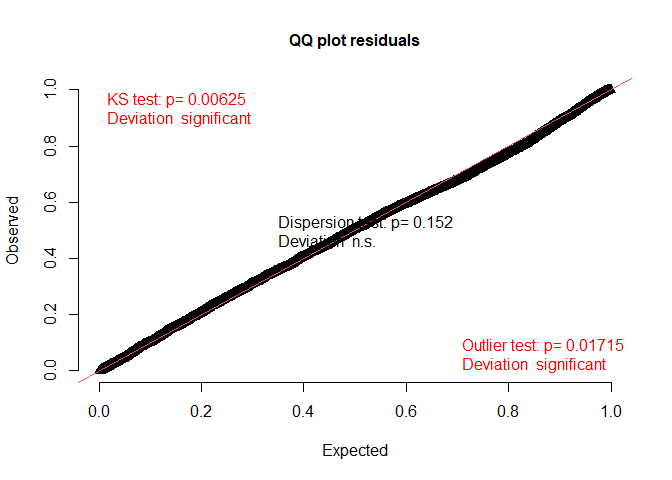<!-- -->

    ## 
    ##  Asymptotic one-sample Kolmogorov-Smirnov test
    ## 
    ## data:  simulationOutput$scaledResiduals
    ## D = 0.025585, p-value = 0.006251
    ## alternative hypothesis: two-sided

``` r
testQuantiles(simulationOutput_hurdle)
```

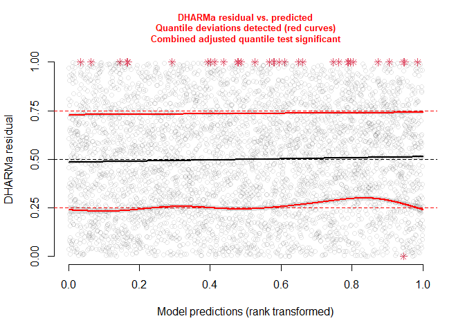<!-- -->

    ## 
    ##  Test for location of quantiles via qgam
    ## 
    ## data:  res
    ## p-value = 0.02364
    ## alternative hypothesis: both

<br/> We see no problems with the logistic regression model. We detect
some slight discrepancies in the truncated negative binomial model.
However, our hurdle model fits the data reasonably well overall. <br/>

## Zero-inflated model

<br/> The last model we will demonstrate here is zero-inflated. The
zero-inflated model is a slight variation on the hurdle model. Similarly
to the hurdle model, we assume a binary process that generates zeros.
However, if the binary process does not generate a zero, the response
can still be zero due to the count process. In other words, the
zero-inflated model combines the logistic regression with a
non-truncated Poisson or negative binomial regression. Since zero
responses due to the binary process and the count are intertwined, the
fit of the zero-inflated model cannot be separated into two fits (*J. M.
Hilbe. Negative binomial regression. Cambridge University Press,
2011.*).

First, we fit the zero-inflated Poisson model. <br/>

``` r
zeroinfl_poisson <- zeroinfl(ofp ~ (emer + hosp + health + numchron + adldiff + region + age + black + gender + married + school + faminc + employed + privins + medicaid)^2, data = DebTrivedi)
AIC(zeroinfl_poisson)
```

    ## [1] 30913.51

<br/> Analogously to the hurdle Poisson model, the zero-inflated Poisson
model is poor. Let’s try the zero-inflated negative binomial model next.
<br/>

``` r
zeroinfl_negbin <- zeroinfl(ofp ~ (emer + hosp + health + numchron + adldiff + region + age + black + gender + married + school + faminc + employed + privins + medicaid)^2, data = DebTrivedi, dist = 'negbin')
vcov(zeroinfl_negbin)[1,1:20]
```

    ##   count_(Intercept)          count_emer          count_hosp      count_health.L 
    ##                  NA                  NA                  NA                  NA 
    ##      count_health.Q      count_numchron    count_adldiffyes count_regionmidwest 
    ##                  NA                  NA                  NA                  NA 
    ## count_regionnoreast    count_regionwest           count_age      count_blackyes 
    ##                  NA                  NA                  NA                  NA 
    ##    count_gendermale    count_marriedyes        count_school        count_faminc 
    ##                  NA                  NA                  NA                  NA 
    ##   count_employedyes    count_privinsyes   count_medicaidyes     count_emer:hosp 
    ##                  NA                  NA                  NA                  NA

<br/> Unfortunately, it appears that the fit is ill-conditioned. We can
try the glmmTMB package instead. <br/>

``` r
zeroinfl_negbin_refit <- glmmTMB(ofp ~ (emer + hosp + health + numchron + adldiff + region + age + black + gender + married + school + faminc + employed + privins + medicaid)^2, data=DebTrivedi, ziformula=~., family=nbinom2, control=glmmTMBControl(optCtrl=list(iter.max=5e3,eval.max=5e3)))
zeroinfl_negbin_refit$fit$message
```

    ## [1] "singular convergence (7)"

<br/> We see that indeed the convergence problem persists. Hence, we
will fit a far simpler model without interactions instead. <br/>

``` r
zeroinfl_negbin_no_int <- zeroinfl(ofp ~ emer + hosp + health + numchron + adldiff + region + age + black + gender + married + school + faminc + employed + privins + medicaid, data = DebTrivedi, dist = 'negbin')
summary(zeroinfl_negbin_no_int)
```

    ## 
    ## Call:
    ## zeroinfl(formula = ofp ~ emer + hosp + health + numchron + adldiff + 
    ##     region + age + black + gender + married + school + faminc + employed + 
    ##     privins + medicaid, data = DebTrivedi, dist = "negbin")
    ## 
    ## Pearson residuals:
    ##     Min      1Q  Median      3Q     Max 
    ## -1.2043 -0.7086 -0.2727  0.3331 15.1479 
    ## 
    ## Count model coefficients (negbin with log link):
    ##                 Estimate Std. Error z value Pr(>|z|)    
    ## (Intercept)    1.6941179  0.2115473   8.008 1.16e-15 ***
    ## emer           0.0474816  0.0228606   2.077  0.03780 *  
    ## hosp           0.1774309  0.0215791   8.222  < 2e-16 ***
    ## health.L      -0.3859788  0.0543117  -7.107 1.19e-12 ***
    ## health.Q      -0.0209007  0.0325680  -0.642  0.52103    
    ## numchron       0.1275866  0.0120398  10.597  < 2e-16 ***
    ## adldiffyes     0.0617975  0.0405994   1.522  0.12798    
    ## regionmidwest -0.0341746  0.0392939  -0.870  0.38446    
    ## regionnoreast  0.1019508  0.0424704   2.401  0.01637 *  
    ## regionwest     0.1066564  0.0435738   2.448  0.01438 *  
    ## age           -0.0834297  0.0260333  -3.205  0.00135 ** 
    ## blackyes      -0.0336510  0.0533974  -0.630  0.52856    
    ## gendermale    -0.0248246  0.0346593  -0.716  0.47384    
    ## marriedyes    -0.0812349  0.0357485  -2.272  0.02306 *  
    ## school         0.0205480  0.0045813   4.485 7.29e-06 ***
    ## faminc        -0.0004465  0.0053300  -0.084  0.93324    
    ## employedyes   -0.0027213  0.0515707  -0.053  0.95792    
    ## privinsyes     0.2190730  0.0483881   4.527 5.97e-06 ***
    ## medicaidyes    0.1886435  0.0640238   2.946  0.00321 ** 
    ## Log(theta)     0.4115241  0.0346159  11.888  < 2e-16 ***
    ## 
    ## Zero-inflation model coefficients (binomial with logit link):
    ##                Estimate Std. Error z value Pr(>|z|)    
    ## (Intercept)    5.532147   1.543415   3.584 0.000338 ***
    ## emer          -0.790336   0.461017  -1.714 0.086468 .  
    ## hosp          -1.013707   0.605935  -1.673 0.094334 .  
    ## health.L       0.204712   0.395429   0.518 0.604670    
    ## health.Q       0.126805   0.242206   0.524 0.600599    
    ## numchron      -1.188716   0.172283  -6.900 5.21e-12 ***
    ## adldiffyes    -0.022060   0.410688  -0.054 0.957163    
    ## regionmidwest -0.478589   0.287104  -1.667 0.095524 .  
    ## regionnoreast -0.221086   0.266519  -0.830 0.406804    
    ## regionwest    -0.302858   0.304461  -0.995 0.319866    
    ## age           -0.677436   0.200239  -3.383 0.000717 ***
    ## blackyes       0.425110   0.265038   1.604 0.108723    
    ## gendermale     0.926169   0.228236   4.058 4.95e-05 ***
    ## marriedyes    -0.627893   0.236728  -2.652 0.007993 ** 
    ## school        -0.099100   0.029348  -3.377 0.000733 ***
    ## faminc        -0.004411   0.047603  -0.093 0.926164    
    ## employedyes   -0.257301   0.325852  -0.790 0.429746    
    ## privinsyes    -1.048562   0.249927  -4.195 2.72e-05 ***
    ## medicaidyes   -0.705718   0.393039  -1.796 0.072568 .  
    ## ---
    ## Signif. codes:  0 '***' 0.001 '**' 0.01 '*' 0.05 '.' 0.1 ' ' 1 
    ## 
    ## Theta = 1.5091 
    ## Number of iterations in BFGS optimization: 50 
    ## Log-likelihood: -1.205e+04 on 39 Df

<br/> In terms of the AIC, this zero-inflated model is better than all
models considered before. However, it is marginally worse than the
binomial/negative binomial hurdle model without interaction terms. <br/>

``` r
hurdle_binomial_negbin_noint <- hurdle(ofp ~ (emer + hosp + health + numchron + adldiff + region + age + black + gender + married + school + faminc + employed + privins + medicaid), data = DebTrivedi, dist = 'negbin')


aic_stat <- cbind(AIC(full_model),AIC(full_model_nb),AIC(hurdle_binomial_poisson),AIC(hurdle_binomial_negbin), AIC(hurdle_binomial_negbin_noint), AIC(zeroinfl_negbin_no_int))
colnames(aic_stat) <- c('poisson','negbin','hurdle (bin/poisson)','hurdle (bin/negbin)', 'hurdle (bin/negbin, no inter.)', 'zero-infl (negbin, no inter.)')
aic_stat
```

    ##       poisson   negbin hurdle (bin/poisson) hurdle (bin/negbin)
    ## [1,] 33834.47 24296.08             30910.06             24240.4
    ##      hurdle (bin/negbin, no inter.) zero-infl (negbin, no inter.)
    ## [1,]                       24169.97                      24171.76

<br/> The Wald test for the zero-inflated model is performed analogously
to the hurdle models. <br/>

``` r
waldtest_pvalues_hurdle <- rep(0,1,length(variables))

 for(i in 1:length(variables)){
      
      formula <- as.formula(paste('ofp ~ (',paste(variables[-i],collapse='+'),')'))
      model_red <- zeroinfl(formula, data = DebTrivedi, dist = 'negbin')
      waldtest_pvalues_hurdle[i] <- waldtest(model_red,zeroinfl_negbin_no_int)$`Pr(>Chisq)`[2]
 }

res_zeroinfl <- as.data.frame(cbind(variables,round(waldtest_pvalues_hurdle,digits = 6)))
colnames(res_zeroinfl) <- c('Variable','Pr(>Chi)')
res_zeroinfl
```

    ##    Variable Pr(>Chi)
    ## 1      emer 0.016336
    ## 2      hosp        0
    ## 3    health        0
    ## 4  numchron        0
    ## 5   adldiff 0.288749
    ## 6    region 0.004056
    ## 7       age 0.000109
    ## 8     black 0.162473
    ## 9    gender  7.1e-05
    ## 10  married 0.006287
    ## 11   school        0
    ## 12   faminc 0.993452
    ## 13 employed 0.726552
    ## 14  privins        0
    ## 15 medicaid 0.000508

<br/> We can also perform the bootstrap Wald test. <br/>

``` r
set.seed(123) # for reproducibility
nb <- 500
wald_boot_hurdle <- matrix(0,15,nb)
wald_boot_zeroinfl <- matrix(0,15,nb)

pwald_hurdle <- numeric(15)
pwald_zeroinfl <- numeric(15)


for(i in 1:nb){
  
  DebTrivedi_new <-  DebTrivedi[sample(nrow(DebTrivedi) , rep=TRUE),]
  
  zeroinfl_model_new <- tryCatch(zeroinfl(ofp ~ (emer + hosp + health + numchron + adldiff + region + age + black + gender + married + school + faminc + employed + privins + medicaid), data = DebTrivedi_new, dist = 'negbin'), error = function(e) {NaN})
  
  
  if (any(is.na(zeroinfl_model_new)) == FALSE){
  for (j in 1:15){
  
  index <- grepl(variables[j],names(coefficients(zeroinfl_negbin_no_int)))
  V <- vcov(zeroinfl_model_new)[index,index]
  wald_boot_zeroinfl[j,i] <- tryCatch((coefficients(zeroinfl_model_new)[index]-coefficients(zeroinfl_negbin_no_int)[index]) %*% solve(V) %*% (coefficients(zeroinfl_model_new)[index]-coefficients(zeroinfl_negbin_no_int)[index]), error = function(e) {NaN})
  
  }
  }
  
   if (any(is.na(zeroinfl_model_new)) == TRUE){
    wald_boot_zeroinfl[j,i] <-  NaN
  }
}

for (j in 1:15){
  
index <- grepl(variables[j],names(coefficients(zeroinfl_negbin_no_int)))
V <- vcov(zeroinfl_negbin_no_int)[index,index]
wald <- coefficients(zeroinfl_negbin_no_int)[index] %*% solve(V) %*% coefficients(zeroinfl_negbin_no_int)[index]          
pwald_zeroinfl[j] <- mean(wald_boot_zeroinfl[j,] > as.numeric(wald),na.rm = TRUE) # p-value

}

boot_res_zf <- cbind(res_zeroinfl,round(pwald_zeroinfl,digits = 3))
colnames(boot_res_zf) <- c('Variable','P-value (Wald test)','P-value (bootstrap)')
boot_res_zf
```

    ##    Variable P-value (Wald test) P-value (bootstrap)
    ## 1      emer            0.016336               0.158
    ## 2      hosp                   0               0.008
    ## 3    health                   0               0.000
    ## 4  numchron                   0               0.000
    ## 5   adldiff            0.288749               0.472
    ## 6    region            0.004056               0.022
    ## 7       age            0.000109               0.004
    ## 8     black            0.162473               0.312
    ## 9    gender             7.1e-05               0.002
    ## 10  married            0.006287               0.010
    ## 11   school                   0               0.000
    ## 12   faminc            0.993452               0.992
    ## 13 employed            0.726552               0.780
    ## 14  privins                   0               0.000
    ## 15 medicaid            0.000508               0.002

<br/> We observe that the bootstrap corresponds to the results of the
Wald test. The biggest difference in comparison to the previous models
is the fact that **employed** appears largely non-significant

Next, we confirm that the model is well-specified. Let us plot the
rootograms for the zero-inflated model. <br/>

``` r
rootogram(zeroinfl_negbin_no_int, xlim = c(0,60), confint = FALSE, plot = "base")
```

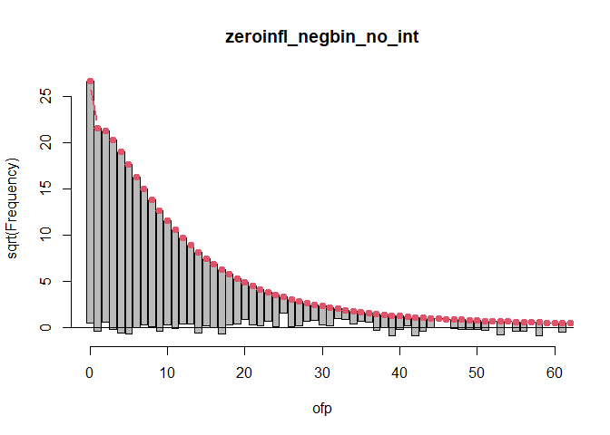<!-- -->

``` r
rootogram(hurdle_binomial_negbin, xlim = c(0,60), confint = FALSE, plot = "base")
```

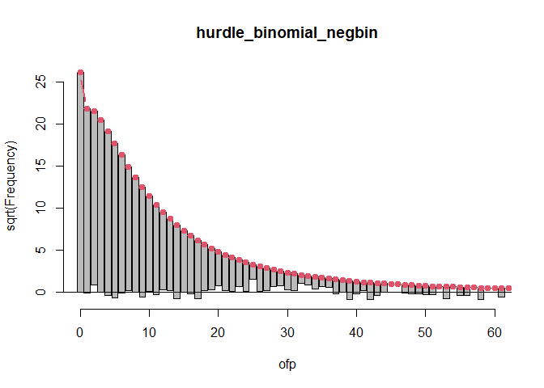<!-- -->

<br/> As can be seen, the rootogram is almost identical to the hurdle
model. Unfortunately, the DHARMa package also does not support the
*zeroinfl* function. However, we can refit the model using the glmmTMB
package. <br/>

``` r
zeroinfl_negbin_no_int_refit <- glmmTMB(ofp ~ emer + hosp + health + numchron + adldiff + region + age + black + gender + married + school + faminc + employed + privins + medicaid, data=DebTrivedi, ziformula=~., family=nbinom2)


simulationOutput_zeroinfl <- simulateResiduals(fittedModel = zeroinfl_negbin_no_int_refit)
testUniformity(simulationOutput_zeroinfl)
```

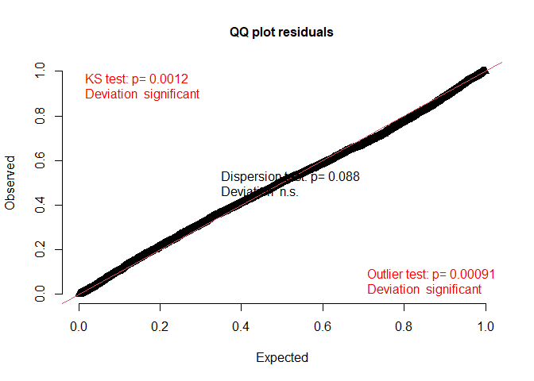<!-- -->

    ## 
    ##  Asymptotic one-sample Kolmogorov-Smirnov test
    ## 
    ## data:  simulationOutput$scaledResiduals
    ## D = 0.029013, p-value = 0.001201
    ## alternative hypothesis: two-sided

``` r
testQuantiles(simulationOutput_zeroinfl)
```

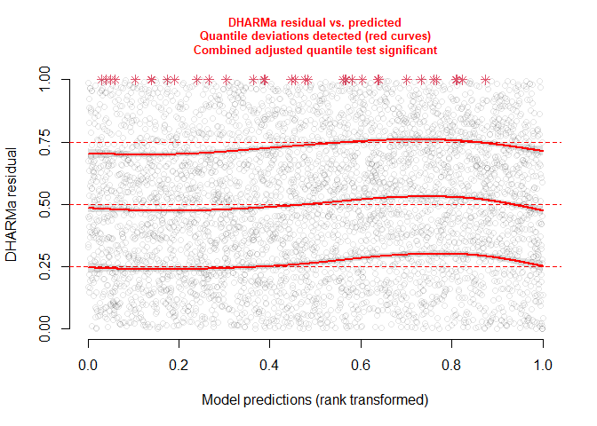<!-- -->

    ## 
    ##  Test for location of quantiles via qgam
    ## 
    ## data:  res
    ## p-value = 0.0004367
    ## alternative hypothesis: both

<br/> The model seems to fit the data fairly well. <br/>

## Model validation

<br/> In evaluating the predictive performance of our count models, we
can use the fact that all the considered regression models except the
quasi-Poisson model provide a predictive distribution of the count
response. Thus, we can use the same *scoring rules* that we used for
models with ordinal response to compare the predictive distribution with
the observed counts (*C. Czado, T. Gneiting, and L. Held. Predictive
model assessment for count data. Biometrics 65.4 (2009): 1254-1261.*).
). <br/>

- logarithmic score ($\frac{1}{n}\sum_i - \mathrm{log} \hat{p}_i$ where
  $\hat{p}_i$ is predicted probability of the observed count)

``` r
log_score <- function(pred_prob,obs_prob) {
  
  score <- 0
  for (i in 1:dim(pred_prob)[1]){
    score <- score -log(pred_prob[i,(obs_prob[i]+1)])
  }
  return (as.numeric(score/dim(pred_prob)[1]))
}

log_score_res <- rbind(
log_score(predprob(full_model,at=0:200),DebTrivedi$ofp),
log_score(predprob(full_model_nb,at=0:200),DebTrivedi$ofp),
log_score(predprob(hurdle_binomial_poisson,at=0:200),DebTrivedi$ofp),
log_score(predprob(hurdle_binomial_negbin,at=0:200),DebTrivedi$ofp),
log_score(predprob(hurdle_binomial_negbin_noint,at=0:200),DebTrivedi$ofp),
log_score(predprob(zeroinfl_poisson,at=0:200),DebTrivedi$ofp),
log_score(predprob(zeroinfl_negbin_no_int,at=0:200),DebTrivedi$ofp))

rownames(log_score_res) <- c('poisson','negbin','hurdle bin/poisson','hurdle bin/negbin','hurdle bin/negbin (no int)','zeroinf poisson','zeroinf negbin (no int)')
colnames(log_score_res) <- 'log_score'
log_score_res
```

    ##                            log_score
    ## poisson                     3.801460
    ## negbin                      2.718802
    ## hurdle bin/poisson          3.431464
    ## hurdle bin/negbin           2.674353
    ## hurdle bin/negbin (no int)  2.733995
    ## zeroinf poisson             3.431855
    ## zeroinf negbin (no int)     2.734199

- Brier score ($\frac{1}{n}\sum_i \sum_j (\hat{p}_{i,j} - 1_i(x=j))^2$
  where $1_i$ is the indicator function for $i\mathrm{th}$ observation )

``` r
brier_score <- function(pred_prob,obs_prob) {

  ind <- matrix(0,dim(pred_prob)[1],max(dim(pred_prob)[2],max(obs_prob)+1))
  
  for (i in 1:dim(pred_prob)[1]){
    ind[i,obs_prob[i]+1] <- 1
  }
  
  score <- sum((pred_prob - ind[,1:dim(pred_prob)[2]])^2)
  return (as.numeric(score/dim(pred_prob)[1]))
}

brier_score_res <- rbind(
brier_score(predprob(full_model,at = 0:200),DebTrivedi$ofp),
brier_score(predprob(full_model_nb,at = 0:200),DebTrivedi$ofp),
brier_score(predprob(hurdle_binomial_poisson,at = 0:200),DebTrivedi$ofp),
brier_score(predprob(hurdle_binomial_negbin,at = 0:200),DebTrivedi$ofp),
brier_score(predprob(hurdle_binomial_negbin_noint,at = 0:200),DebTrivedi$ofp),
brier_score(predprob(zeroinfl_poisson,at = 0:200),DebTrivedi$ofp),
brier_score(predprob(zeroinfl_negbin_no_int,at = 0:200),DebTrivedi$ofp))

rownames(brier_score_res) <- c('poisson','negbin','hurdle bin/poisson','hurdle bin/negbin','hurdle bin/negbin (no int)','zeroinf poisson','zeroinf negbin (no int)')
colnames(brier_score_res) <- 'brier_score'
brier_score_res
```

    ##                            brier_score
    ## poisson                      0.9561595
    ## negbin                       0.9041298
    ## hurdle bin/poisson           0.9169427
    ## hurdle bin/negbin            0.8905166
    ## hurdle bin/negbin (no int)   0.9014709
    ## zeroinf poisson              0.9169420
    ## zeroinf negbin (no int)      0.9010911

- ranked probability score ($\frac{1}{n}\sum_i \sum_j (\hat{P}_{i,j} - 1_i(x\leq j))^2$ 
  where $1_i$ $\hat{P}_{i,j}$ is the predicted cumulative probability for the
  $i\mathrm{th}$ observation and the response count $j$)

``` r
rps_score <- function(pred_prob,obs_prob) {
  
  ind <- matrix(0,dim(pred_prob)[1],max(dim(pred_prob)[2],max(obs_prob)+1))
  
  
  for (i in 1:dim(pred_prob)[1]){
    ind[i,obs_prob[i]+1] <- 1
  }

  score <- 0
  for (i in 1:dim(pred_prob)[1]){
    score <- score + sum((cumsum(pred_prob[i,]) - cumsum(ind[i,1:dim(pred_prob)[2]]))^2)
  }
  return (as.numeric(score/dim(pred_prob)[1]))
}

rps_score_res <- rbind(
rps_score(predprob(full_model,at = 0:200),DebTrivedi$ofp),
rps_score(predprob(full_model_nb,at = 0:200),DebTrivedi$ofp),
rps_score(predprob(hurdle_binomial_poisson,at = 0:200),DebTrivedi$ofp),
rps_score(predprob(hurdle_binomial_negbin,at = 0:200),DebTrivedi$ofp),
rps_score(predprob(hurdle_binomial_negbin_noint,at = 0:200),DebTrivedi$ofp),
rps_score(predprob(zeroinfl_poisson,at = 0:200),DebTrivedi$ofp),
rps_score(predprob(zeroinfl_negbin_no_int,at = 0:200),DebTrivedi$ofp))

rownames(rps_score_res) <- c('poisson','negbin','hurdle bin/poisson','hurdle bin/negbin','hurdle bin/negbin (no int)','zeroinf poisson','zeroinf negbin (no int)')
colnames(rps_score_res) <- 'rps_score'
rps_score_res
```

    ##                            rps_score
    ## poisson                     3.000542
    ## negbin                      2.754998
    ## hurdle bin/poisson          2.890468
    ## hurdle bin/negbin           2.716049
    ## hurdle bin/negbin (no int)  2.855597
    ## zeroinf poisson             2.889880
    ## zeroinf negbin (no int)     2.843904

<br/> Let us also recheck the AIC. <br/>

``` r
aic_all <- rbind(AIC(full_model),AIC(full_model_nb),AIC(hurdle_binomial_poisson),AIC(hurdle_binomial_negbin),AIC(hurdle_binomial_negbin_noint),AIC(zeroinfl_poisson),AIC(zeroinfl_negbin_no_int))
colnames(aic_all) <- 'AIC'

cbind(log_score_res,brier_score_res,rps_score_res,aic_all)
```

    ##                            log_score brier_score rps_score      AIC
    ## poisson                     3.801460   0.9561595  3.000542 33834.47
    ## negbin                      2.718802   0.9041298  2.754998 24296.08
    ## hurdle bin/poisson          3.431464   0.9169427  2.890468 30910.06
    ## hurdle bin/negbin           2.674353   0.8905166  2.716049 24240.40
    ## hurdle bin/negbin (no int)  2.733995   0.9014709  2.855597 24169.97
    ## zeroinf poisson             3.431855   0.9169420  2.889880 30913.51
    ## zeroinf negbin (no int)     2.734199   0.9010911  2.843904 24171.76

<br/> The hurdle bin/negbin model is overall the best in terms of the
scoring rules. However, it has significantly more parameters than other
models: negbin, hurdle bin/negbin (no int), and zeroinf negbin (no int).
Hurdle bin/negbin (no int) and zeroinf negbin (no int) have the lowest
value of AIC. Thus, these models should generalize well.  
<br/>

``` r
library(caret)

## Number of repetitions and folds
rep <- 50
folds <- 10

set.seed(123) # for reproducibility

k <- 1

log_score_cv <- matrix(NA,folds*rep,7)
brier_score_cv <- matrix(NA,folds*rep,7)
rps_score_cv <- matrix(NA,folds*rep,7)

for(j in 1:rep){
  
  d <- createFolds(seq(1,dim(DebTrivedi)[1],1), k = 10)
  
  for(i in 1:folds){

    index <- unlist(d[i])
    train_set <- DebTrivedi[-index,]
    test_set <- DebTrivedi[index,]
    
    poisson_new <- glm(ofp ~ (emer + hosp + health + numchron + adldiff + region + age + black + gender + married + school + faminc + employed + privins + medicaid)^2, family = poisson, train_set)
    
    negbin_new <- glm.nb(ofp ~ (emer + hosp + health + numchron + adldiff + region + age + black + gender + married + school + faminc + employed + privins + medicaid)^2, control = list(epsilon = 1e-08, maxit = 100, trace = FALSE), train_set)
    
    hurdle_binomial_poisson_new <- hurdle(ofp ~ (emer + hosp + health + numchron + adldiff + region + age + black + gender + married + school + faminc + employed + privins + medicaid)^2, data = train_set)
    
    hurdle_binomial_negbin_new <- hurdle(ofp ~ (emer + hosp + health + numchron + adldiff + region + age + black + gender + married + school + faminc + employed + privins + medicaid)^2, data = train_set, dist = 'negbin')
    
    hurdle_binomial_negbin_noint_new <- hurdle(ofp ~ (emer + hosp + health + numchron + adldiff + region + age + black + gender + married + school + faminc + employed + privins + medicaid), data = train_set, dist = 'negbin')
    
    zeroinfl_poisson_new <- zeroinfl(ofp ~ (emer + hosp + health + numchron + adldiff + region + age + black + gender + married + school + faminc + employed + privins + medicaid)^2, data = train_set)
    
    zeroinfl_negbin_no_int_new <- zeroinfl(ofp ~ emer + hosp + health + numchron + adldiff + region + age + black + gender + married + school + faminc + employed + privins + medicaid, data = train_set, dist = 'negbin')
    
    
    log_score_cv[k,1] <- log_score(predprob(poisson_new,test_set,at=0:200),test_set$ofp)
    log_score_cv[k,2] <- log_score(predprob(negbin_new,test_set,at=0:200),test_set$ofp)
    log_score_cv[k,3] <- log_score(predprob(hurdle_binomial_poisson_new,test_set,at=0:200),test_set$ofp)
    log_score_cv[k,4] <- log_score(predprob(hurdle_binomial_negbin_new,test_set,at=0:200),test_set$ofp)
    log_score_cv[k,5] <- log_score(predprob(hurdle_binomial_negbin_noint_new,test_set,at=0:200),test_set$ofp)
    log_score_cv[k,6] <- log_score(predprob(zeroinfl_poisson_new,test_set,at=0:200),test_set$ofp)
    log_score_cv[k,7] <- log_score(predprob(zeroinfl_negbin_no_int_new,test_set,at=0:200),test_set$ofp)
    
    brier_score_cv[k,1] <-  brier_score(predprob(poisson_new,test_set,at=0:200),test_set$ofp)
    brier_score_cv[k,2] <-  brier_score(predprob(negbin_new,test_set,at=0:200),test_set$ofp)
    brier_score_cv[k,3] <-  brier_score(predprob(hurdle_binomial_poisson_new,test_set,at=0:200),test_set$ofp)
    brier_score_cv[k,4] <-  brier_score(predprob(hurdle_binomial_negbin_new,test_set,at=0:200),test_set$ofp)
    brier_score_cv[k,5] <-  brier_score(predprob(hurdle_binomial_negbin_noint_new,test_set,at=0:200),test_set$ofp)
    brier_score_cv[k,6] <-  brier_score(predprob(zeroinfl_poisson_new,test_set,at =0:200),test_set$ofp)
    brier_score_cv[k,7] <-  brier_score(predprob(zeroinfl_negbin_no_int_new,test_set,at=0:200),test_set$ofp)
    
    rps_score_cv[k,1] <-  rps_score(predprob(poisson_new,test_set,at=0:200),test_set$ofp)
    rps_score_cv[k,2] <-  rps_score(predprob(negbin_new,test_set,at=0:200),test_set$ofp)
    rps_score_cv[k,3] <-  rps_score(predprob(hurdle_binomial_poisson_new,test_set,at=0:200),test_set$ofp)
    rps_score_cv[k,4] <-  rps_score(predprob(hurdle_binomial_negbin_new,test_set,at= 0:200),test_set$ofp)
    rps_score_cv[k,5] <-  rps_score(predprob(hurdle_binomial_negbin_noint_new,test_set,at=0:200),test_set$ofp)
    rps_score_cv[k,6] <-  rps_score(predprob(zeroinfl_poisson_new,test_set,at=0:200),test_set$ofp)
    rps_score_cv[k,7] <-  rps_score(predprob(zeroinfl_negbin_no_int_new,test_set,at=0:200),test_set$ofp)
    
    k <- k + 1
    
  }
}

cbind(log_score_res,brier_score_res,rps_score_res,aic_all)
```

    ##                            log_score brier_score rps_score      AIC
    ## poisson                     3.801460   0.9561595  3.000542 33834.47
    ## negbin                      2.718802   0.9041298  2.754998 24296.08
    ## hurdle bin/poisson          3.431464   0.9169427  2.890468 30910.06
    ## hurdle bin/negbin           2.674353   0.8905166  2.716049 24240.40
    ## hurdle bin/negbin (no int)  2.733995   0.9014709  2.855597 24169.97
    ## zeroinf poisson             3.431855   0.9169420  2.889880 30913.51
    ## zeroinf negbin (no int)     2.734199   0.9010911  2.843904 24171.76

``` r
cv_res <- cbind((apply(log_score_cv,2,mean)),(apply(brier_score_cv,2,mean)),(apply(rps_score_cv,2,mean)))
rownames(cv_res) <- rownames(rps_score_res)
colnames(cv_res) <- c('log_score','brier_score','rps_score')
cv_res
```

    ##                            log_score brier_score rps_score
    ## poisson                     4.162080   0.9614886  3.248699
    ## negbin                      2.788087   0.9087600  2.919028
    ## hurdle bin/poisson          3.831977   0.9371432  3.170888
    ## hurdle bin/negbin           2.806644   0.9097621  2.917647
    ## hurdle bin/negbin (no int)  2.745605   0.9032847  2.875304
    ## zeroinf poisson             3.829069   0.9373834  3.170951
    ## zeroinf negbin (no int)     2.746829   0.9038969  2.866572

<br/> Indeed, the hurdle bin/negbin (no int) and zeroinf negbin (no int)
achieved the best cross-validation results. We should also point out
that the values of scoring metrics did not degrade much demonstrating
that the models generalize quite well. <br/>

## Conclusions

<br/> Let us conclude our results. We have fitted several count models
for modelling physician office visits from the National Medical
Expenditure Survey (1987-1988) dataset, namely the Poisson, the
quasi-Poisson, the negative binomial, the binomial/negative binomial
hurdle model, and the zero-inflated negative binomial.

We have shown that the binomial/negative binomial hurdle model and the
zero-inflated negative binomial fitted the data best. We have
cross-validated the predictive performance of all models, and the best
model overall was the binomial/negative binomial hurdle model (without
interaction terms).

The significance of variables in the models was mostly consistent across
the models. We observe that the health-related predictors
(**emer**,**hosp**,**health**,**numchron**,**adldiff**) have a
noticeable effect on the count of physician office visits. The number of
visits also tends to increase with education. We also observe that
people with health insurance (**privins**,**medicaid**) tend to visit a
doctor more. Interestingly enough, the number of visits decreases with
age, probably due to the decreasing mobility of older people. These
results are mostly consistent with the results published in *P. Deb and
P. K. Trivedi. Demand for medical care by the elderly: a finite mixture
approach. Journal of applied Econometrics 12.3 (1997): 313-336.*

Let us plot the effect of predictors for the binomial/negative binomial
hurdle model (without interaction terms) that performed best in the
validation. <br/>

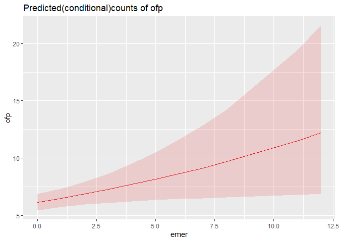<!-- -->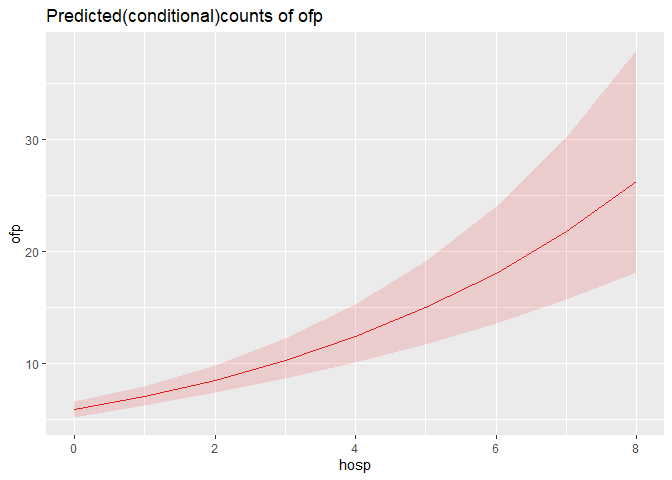<!-- -->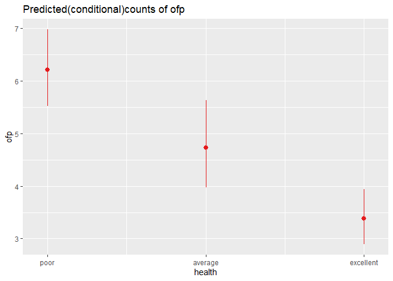<!-- -->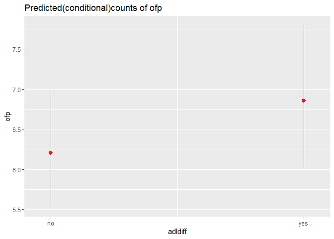<!-- -->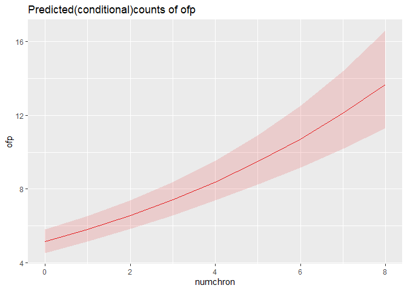<!-- -->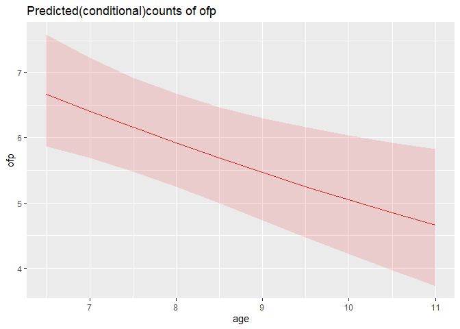<!-- -->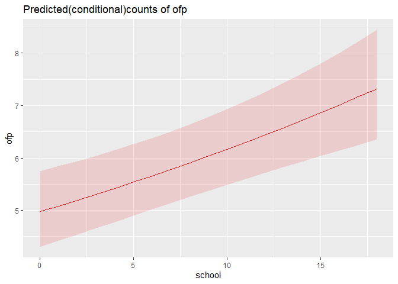<!-- -->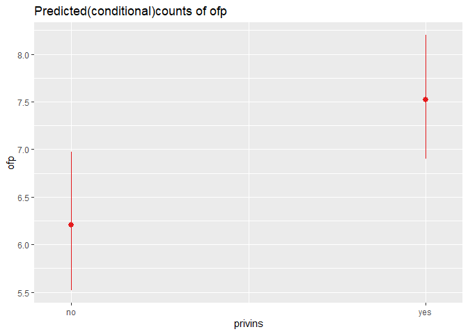<!-- -->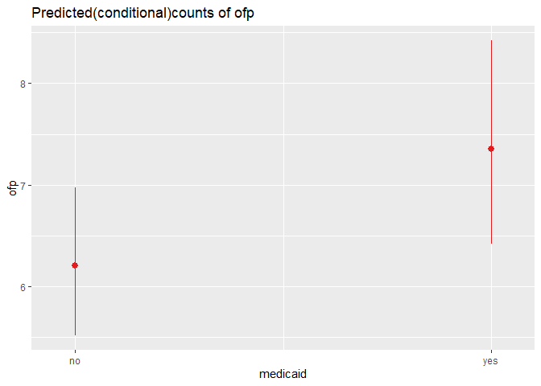<!-- -->

<br/> The effect of other predictors is much weaker; family income has
surprisingly little effect in particular. <br/>

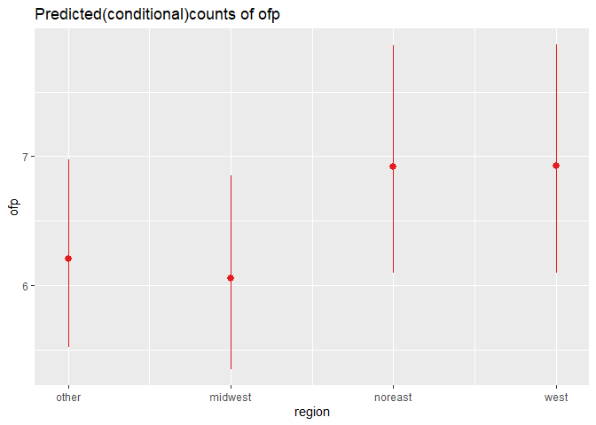<!-- -->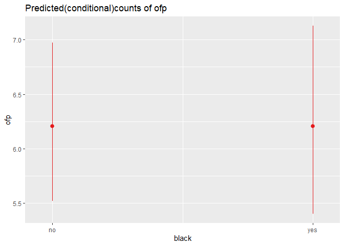<!-- -->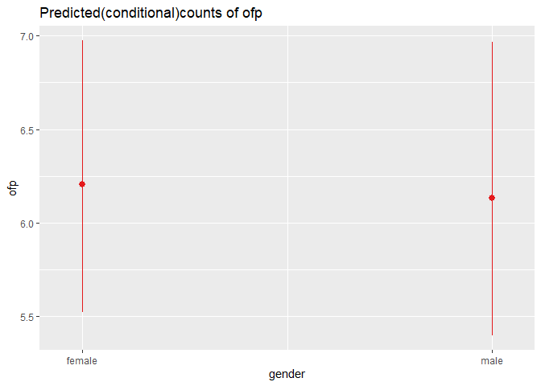<!-- -->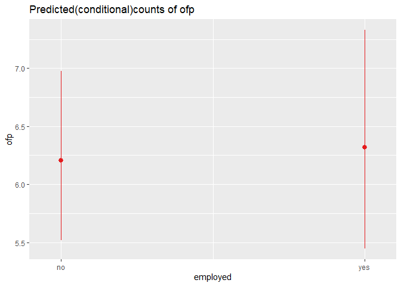<!-- -->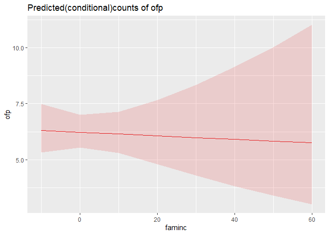<!-- -->

<br/> With these plots, we conclude the Fourth Circle: Count Regression.

In the end of this project, I would like to point out that that these
first four circles formed a somewhat closed thematic circle around main
models for typical responses: linear regression (real continuous
response), logistic regression (binary response), ordinal regressions
(ordinal/multinomial response), and Poisson and negative binomial
regression (count response). All of these models belong to a broader
family called generalized linear models, which are based on the
specification of the conditional mean function $E (Y|X) = g(X\beta)$ and
the variance function $\mathrm{Var}(Y|X) = V(\mu)$.

Most of the time, the whole distribution of $Y|X$ was specified (normal,
Bernoulli, multinomial, Poisson, negative binomial, …), leading to a
maximum likelihood approach of estimation. This list of models is
definitely not exhaustive, and there are other distributions useful for
particular problems, such as gamma, inverse Gaussian, and others.

In addition, we have also encountered a quasi-likelihood approach in
quasi-Poisson regression in which just these two moments were specified
and not the distribution as a whole. In the first circle, we also had
the opportunity to introduce a further generalization in terms of mixed
models to deal with correlated observations. We will probably return to
both quasi-likelihood models and mixed models in a separate project.

Lastly, we introduced some general techniques of modelling:
cross-validation to evaluate generalization of the model to new data,
bootstrap to perform statistical tests and compute confidence intervals
in cases for which asymptotic theory is not readily available or its
assumptions are questionable. Lastly, we looked at imputation methods,
which gave us a systematic manner to handle missing data.

While the first four projects were mostly connected, the following ones
will probably be much more disjointed, covering mostly separate topics.
<br/>
