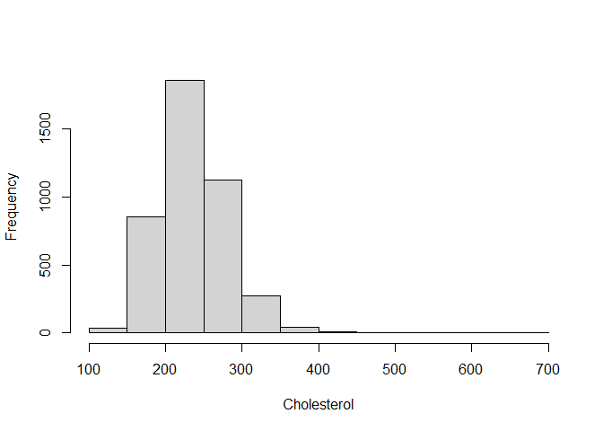
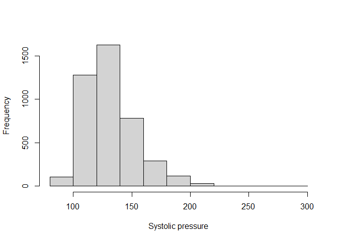
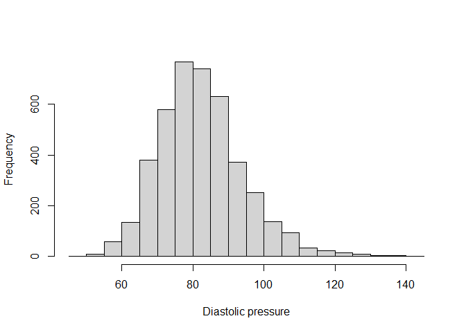
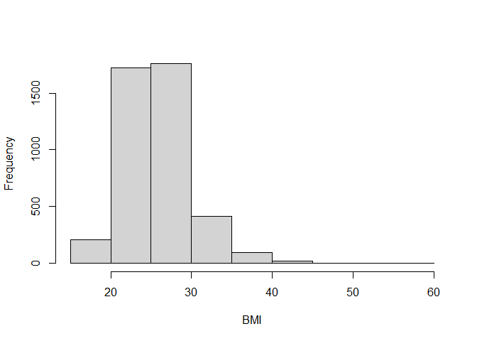
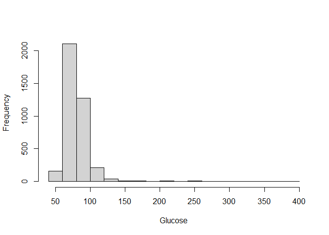
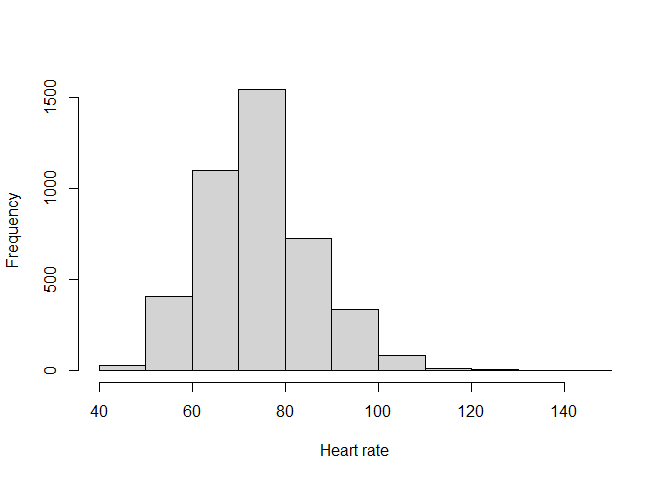
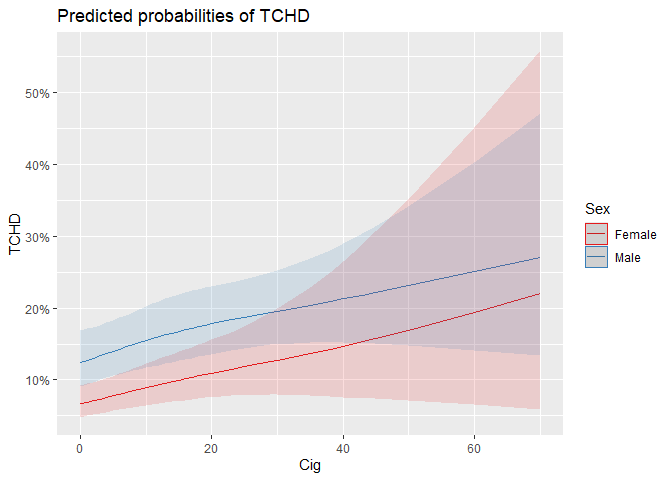
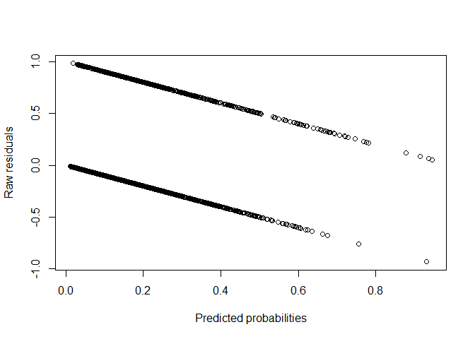

# The Second Circle: Logistic Regression, Part One

<br/>
Jiří Fejlek

2025-06-02
<br/>

<br/> In this project, we will examine modeling binary response data
using logistic regression. As we will see in a moment, the dataset we
will use in this demonstration contains a significant portion of missing
values. Thus, we will also demonstrate the usage of both single and
multiple imputation methods. Our primary objective will be to develop a
model that predicts the likelihood of developing coronary heart disease.
We will also be interested in which predictors seem to have the greatest
effect on the predictions.

We will split this presentation into three parts. In the first part, we
will describe the data preparation and exploration and then fit the
model with missing data using both a complete case approach. In the
second part, we will show both single and multiple imputation
approaches, and in the final part, we will evaluate the final model and
discuss the results. <br/>

## Cardiovascular study on residents of the town of Framingham, Massachusetts

<br/> In this project, we will use the dataset obtained from
<https://www.kaggle.com/datasets/dileep070/heart-disease-prediction-using-logistic-regression/data>
based on Framingham Heart Study <https://www.framinghamheartstudy.org>.

The Framingham Heart Study is a long-term, ongoing cardiovascular cohort
study of residents in the city of Framingham, Massachusetts, which began
in 1948 to identify factors that contribute to cardiovascular diseases,
such as the effects of high blood pressure and smoking. It was actually
this study that helped discover these now commonly known associations.

The data contains the following information about 4,238 individuals.
Each individual was examined and then followed for 10 years for the
outcome of developing coronary heart disease. <br/>

- **Sex**
- **Age** - Age (at the time of examination)
- **Education** - Four levels: no high school, high school, college, and
  college graduate
- **Current Smoker** - Whether or not the subject was a smoker (at the
  time of examination)
- **Cigs Per Day** - The number of cigarettes smoked on average in one
  day
- **BP Meds** - Whether or not the subject was on blood pressure
  medication
- **Prevalent Stroke** - Whether or not the subject had previously had a
  stroke
- **Prevalent Hyp** - Whether or not the subject was hypertensive
- **Diabetes** - Whether or not the subject had diabetes
- **Tot Chol** - total cholesterol level
- **Sys BP** - Systolic blood pressure
- **Dia BP** - Diastolic blood pressure
- **BMI** - Body Mass Index
- **Glucose** - glucose level
- **TenYearCHD** - Whether or not a coronary heart disease occurred in
  10 years after examination

<br/> First, let’s load the dataset. <br/>

``` r
library(readr)
framingham <- read_csv('C:/Users/elini/Desktop/nine circles/framingham.csv')
head(framingham)
```

    ## # A tibble: 6 × 16
    ##    male   age education currentSmoker cigsPerDay BPMeds prevalentStroke
    ##   <dbl> <dbl>     <dbl>         <dbl>      <dbl>  <dbl>           <dbl>
    ## 1     1    39         4             0          0      0               0
    ## 2     0    46         2             0          0      0               0
    ## 3     1    48         1             1         20      0               0
    ## 4     0    61         3             1         30      0               0
    ## 5     0    46         3             1         23      0               0
    ## 6     0    43         2             0          0      0               0
    ## # ℹ 9 more variables: prevalentHyp <dbl>, diabetes <dbl>, totChol <dbl>,
    ## #   sysBP <dbl>, diaBP <dbl>, BMI <dbl>, heartRate <dbl>, glucose <dbl>,
    ## #   TenYearCHD <dbl>

## Initial Data Exploration

<br/> As always, we start with a data exploration. Let us check the size
of the dataset.

``` r
dim(framingham)
```

    ## [1] 4238   16

<br/> We have 4238 observations, one response we wish to model/predict
(**TenYearCHD**), and 15 candidates for predictors. Let’s check whether
any dates are missing. <br/>

``` r
any(duplicated(framingham))
```

    ## [1] FALSE

``` r
any(is.na(framingham))
```

    ## [1] TRUE

<br/> Some values are missing; let us check how many observations have
some missing values and the pattern of missing data. <br/>

``` r
library(mice)
dim(framingham[rowSums(is.na(framingham)) > 0,])
```

    ## [1] 582  16

``` r
md.pattern(framingham, rotate.names = TRUE)
```


    ##      male age currentSmoker prevalentStroke prevalentHyp diabetes sysBP diaBP
    ## 3656    1   1             1               1            1        1     1     1
    ## 331     1   1             1               1            1        1     1     1
    ## 93      1   1             1               1            1        1     1     1
    ## 8       1   1             1               1            1        1     1     1
    ## 51      1   1             1               1            1        1     1     1
    ## 1       1   1             1               1            1        1     1     1
    ## 9       1   1             1               1            1        1     1     1
    ## 38      1   1             1               1            1        1     1     1
    ## 1       1   1             1               1            1        1     1     1
    ## 1       1   1             1               1            1        1     1     1
    ## 23      1   1             1               1            1        1     1     1
    ## 4       1   1             1               1            1        1     1     1
    ## 2       1   1             1               1            1        1     1     1
    ## 13      1   1             1               1            1        1     1     1
    ## 4       1   1             1               1            1        1     1     1
    ## 1       1   1             1               1            1        1     1     1
    ## 1       1   1             1               1            1        1     1     1
    ## 1       1   1             1               1            1        1     1     1
    ##         0   0             0               0            0        0     0     0
    ##      TenYearCHD heartRate BMI cigsPerDay totChol BPMeds education glucose    
    ## 3656          1         1   1          1       1      1         1       1   0
    ## 331           1         1   1          1       1      1         1       0   1
    ## 93            1         1   1          1       1      1         0       1   1
    ## 8             1         1   1          1       1      1         0       0   2
    ## 51            1         1   1          1       1      0         1       1   1
    ## 1             1         1   1          1       1      0         1       0   2
    ## 9             1         1   1          1       0      1         1       1   1
    ## 38            1         1   1          1       0      1         1       0   2
    ## 1             1         1   1          1       0      1         0       1   2
    ## 1             1         1   1          1       0      0         1       0   3
    ## 23            1         1   1          0       1      1         1       1   1
    ## 4             1         1   1          0       1      1         1       0   2
    ## 2             1         1   1          0       1      1         0       1   2
    ## 13            1         1   0          1       1      1         1       1   1
    ## 4             1         1   0          1       1      1         1       0   2
    ## 1             1         1   0          1       1      1         0       1   2
    ## 1             1         1   0          1       0      1         1       0   3
    ## 1             1         0   1          1       1      1         1       1   1
    ##               0         1  19         29      50     53       105     388 645

<br/> We see no obvious pattern for missing data. The fraction of rows
with some missing values is 582/4238 ~ 0.14. This is a significantly
greater value than 3%, which is a rule of thumb value for which it
should not matter that much how the observation with missing values is
treated. Hence, we may need to employ a multiple imputation: data may
not be missing completely at random (MCAR), and if so, then case
deletion or single imputation may cause a significant bias (see *Stef
Van Buuren. Flexible imputation of missing data. CRC press, 2012*).

Before we perform any imputation, we have to analyze predictors.
Improper predictors could easily ruin the subsequent imputation process.
We first rename the columns a little and convert the variables to proper
types. <br/>

``` r
library(tibble)
library(dplyr)

framingham <- framingham %>% rename(Sex = male )  %>% rename(Age = age ) %>% rename(Smoker = currentSmoker ) %>% rename(Stroke = prevalentStroke) %>% rename(Hyp = prevalentHyp ) %>% rename(Diab = diabetes ) %>% rename(TCHD = TenYearCHD  ) %>% rename(SysP = sysBP) %>% rename(DiaP = diaBP) %>%
rename(Hrate = heartRate )  %>% rename(Cig = cigsPerDay  ) %>% rename(Chol = totChol ) %>% rename(Meds = BPMeds )  %>% rename(Edu = education  ) %>% rename(Gluc = glucose )
```

<br/>

``` r
framingham$Sex <- factor(framingham$Sex)
levels(framingham$Sex) <- c('Female','Male')
framingham$Edu  <- factor(framingham$Edu, ordered = TRUE)
framingham$Smoker <- factor(framingham$Smoker)
framingham$Meds <- factor(framingham$Meds)
framingham$Stroke <- factor(framingham$Stroke)
framingham$Hyp <- factor(framingham$Hyp)
framingham$Diab <- factor(framingham$Diab)
framingham$TCHD <- factor(framingham$TCHD)
```

<br/> Next, we check the values of the predictors and their
distributions. <br/>

``` r
summary(framingham$Age)
```

    ##    Min. 1st Qu.  Median    Mean 3rd Qu.    Max. 
    ##   32.00   42.00   49.00   49.58   56.00   70.00

``` r
summary(framingham$Cig)
```

    ##    Min. 1st Qu.  Median    Mean 3rd Qu.    Max.    NA's 
    ##   0.000   0.000   0.000   9.003  20.000  70.000      29

``` r
summary(framingham$Chol)
```

    ##    Min. 1st Qu.  Median    Mean 3rd Qu.    Max.    NA's 
    ##   107.0   206.0   234.0   236.7   263.0   696.0      50

``` r
summary(framingham$SysP)
```

    ##    Min. 1st Qu.  Median    Mean 3rd Qu.    Max. 
    ##    83.5   117.0   128.0   132.4   144.0   295.0

``` r
summary(framingham$DiaP)
```

    ##    Min. 1st Qu.  Median    Mean 3rd Qu.    Max. 
    ##   48.00   75.00   82.00   82.89   89.88  142.50

``` r
summary(framingham$BMI)
```

    ##    Min. 1st Qu.  Median    Mean 3rd Qu.    Max.    NA's 
    ##   15.54   23.07   25.40   25.80   28.04   56.80      19

``` r
summary(framingham$Hrate)
```

    ##    Min. 1st Qu.  Median    Mean 3rd Qu.    Max.    NA's 
    ##   44.00   68.00   75.00   75.88   83.00  143.00       1

``` r
summary(framingham$Gluc)
```

    ##    Min. 1st Qu.  Median    Mean 3rd Qu.    Max.    NA's 
    ##   40.00   71.00   78.00   81.97   87.00  394.00     388



<br/> Overall, the values and their distributions seem reasonable. Some
minima and maxima are pretty extreme, but none of these seem impossible
to occur. Several factors, namely **BP Meds**, **Diabetes**, and
especially **Prevalent Stroke**, have low number of cases  
<br/>

    ## [1] 25

    ## [1] 109

    ## [1] 124

<br/> which could hurt the accuracy of their estimates. Still, these
predictors seem too important to be just ignored.

Let us conclude this initial data exploration with redundancy analysis
(on complete cases). <br/>

``` r
library(Hmisc)
redun(~.- TCHD ,data = framingham[rowSums(is.na(framingham)) == 0,],nk = 4, r2 = 0.95)
```

    ## 
    ## Redundancy Analysis
    ## 
    ## ~Sex + Age + Edu + Smoker + Cig + Meds + Stroke + Hyp + Diab + 
    ##     Chol + SysP + DiaP + BMI + Hrate + Gluc
    ## <environment: 0x000001c3ebe55190>
    ## 
    ## n: 3656  p: 15   nk: 4 
    ## 
    ## Number of NAs:    0 
    ## 
    ## Transformation of target variables forced to be linear
    ## 
    ## R-squared cutoff: 0.95   Type: ordinary 
    ## 
    ## R^2 with which each variable can be predicted from all other variables:
    ## 
    ##    Sex    Age    Edu Smoker    Cig   Meds Stroke    Hyp   Diab   Chol   SysP 
    ##  0.239  0.301  0.086  0.838  0.636  0.128  0.024  0.596  0.455  0.135  0.743 
    ##   DiaP    BMI  Hrate   Gluc 
    ##  0.681  0.205  0.096  0.391 
    ## 
    ## No redundant variables

<br/> No variables seem overly redundant. However, we will remove
**Current Smoker** and keep just **Cigs Per Day** since no smoker
reports that he/she smokes zero cigarettes per day on average.  
<br/>

``` r
which(framingham$Smoker == 1 & framingham$Cig == 0)
```

    ## integer(0)

<br/> Thus, we opt to quantify the effect of smoking in our model using
a more informative numerical predictor **Cigs Per Day.** Otherwise, we
will consider all predictors for modeling. <br/>

## Complete case analysis

<br/> Before we proceed to model with the imputation of missing values,
we will perform *complete case analysis* (listwise deletion) for future
comparison with other approaches. We should remember that complete case
analysis is valid under the missing completely at random (MCAR)
condition (the probability of being missing is the same for all cases),
i.e., complete case analysis under MCAR produces unbiased regression
estimates. If this is not the case (missingness depends on the data or
it depends on some unobserved variables), then these estimates may be
severely biased. Another disadvantage of complete case analysis is that
it is potentially wasteful (standard errors and significance levels are
often larger relative to all available data). On the other hand,
complete case analysis is very simple to perform. <br/>

``` r
framingham_complete <- framingham[rowSums(is.na(framingham)) == 0,]
```

<br/> Before we select our mode, let us check our effective sample size.
<br/>

``` r
dim(framingham_complete)
```

    ## [1] 3656   16

``` r
summary(framingham_complete$TCHD)
```

    ##    0    1 
    ## 3099  557

<br/> The effective sample size for binary response is the minimum of
the two values; in our case, it is 557 (even though we technically have
3656 observations). Thus, our data reasonably support approximately
557/10 ~ 56 to 557/20 ~ 28 parameters.

Since we have only 14 predictors, we can include some nonlinearities and
interactions in the model. We will consider restricted cubic splines
with 4 knots for all numerical predictors. We will also consider linear
interactions of age and sex with risk factors (i.e., the full model has
52 parameters). <br/>

``` r
library(rms)

# full model
full_model <- glm(TCHD  ~ Sex + rcs(Age,4) + Edu + rcs(Cig,4) + Meds + Stroke + Hyp + Diab + rcs(Chol,4) + rcs(SysP,4) + rcs(DiaP,4) + rcs(BMI,4) + rcs(Hrate,4) + rcs(Gluc,4) + Age:(Cig + Stroke + Hyp + Diab + Chol + SysP + DiaP + BMI + Hrate + Gluc) + Sex:(Cig + Stroke + Hyp + Diab + Chol + SysP + DiaP + BMI + Hrate + Gluc), family = binomial, framingham_complete)
```

<br/> If we were only interested in testing a hypothesis whether a given
variable (e.g., **Cigs per day**) has a significant effect on the
probability of developing **TCHD**, we can use a likelihood ratio test
based on the full model.  
<br/>

``` r
model_no_cig <- glm(TCHD  ~ Sex + rcs(Age,4) + Edu + Meds + Stroke + Hyp + Diab + rcs(Chol,4) + rcs(SysP,4) + rcs(DiaP,4) + rcs(BMI,4) + rcs(Hrate,4) + rcs(Gluc,4) + Age:(Stroke + Hyp + Diab + Chol + SysP + DiaP + BMI + Hrate + Gluc) + Sex:(Stroke + Hyp + Diab + Chol + SysP + DiaP + BMI + Hrate + Gluc), family = binomial, framingham_complete)
anova(model_no_cig,full_model)
```

    ## Analysis of Deviance Table
    ## 
    ## Model 1: TCHD ~ Sex + rcs(Age, 4) + Edu + Meds + Stroke + Hyp + Diab + 
    ##     rcs(Chol, 4) + rcs(SysP, 4) + rcs(DiaP, 4) + rcs(BMI, 4) + 
    ##     rcs(Hrate, 4) + rcs(Gluc, 4) + Age:(Stroke + Hyp + Diab + 
    ##     Chol + SysP + DiaP + BMI + Hrate + Gluc) + Sex:(Stroke + 
    ##     Hyp + Diab + Chol + SysP + DiaP + BMI + Hrate + Gluc)
    ## Model 2: TCHD ~ Sex + rcs(Age, 4) + Edu + rcs(Cig, 4) + Meds + Stroke + 
    ##     Hyp + Diab + rcs(Chol, 4) + rcs(SysP, 4) + rcs(DiaP, 4) + 
    ##     rcs(BMI, 4) + rcs(Hrate, 4) + rcs(Gluc, 4) + Age:(Cig + Stroke + 
    ##     Hyp + Diab + Chol + SysP + DiaP + BMI + Hrate + Gluc) + Sex:(Cig + 
    ##     Stroke + Hyp + Diab + Chol + SysP + DiaP + BMI + Hrate + 
    ##     Gluc)
    ##   Resid. Df Resid. Dev Df Deviance  Pr(>Chi)    
    ## 1      3608     2730.3                          
    ## 2      3604     2710.1  4   20.217 0.0004525 ***
    ## ---
    ## Signif. codes:  0 '***' 0.001 '**' 0.01 '*' 0.05 '.' 0.1 ' ' 1

<br/> Let us list these tests for all predictors in the model. We also
include adjusted p-values for multiple comparisons if we were to use
these values to “discover” significant predictors to reduce the chance
of false discoveries. The price of this adjustment is losing the
statistical power,i.e., we are more likely to not detect predictors in
the model that have an effect on the response. Bonferroni and
Bonferroni-Holm (Bonferroni-Holm is uniformly more powerful than
Bonferroni. Thus, there is often little reason to use Bonferroni)
corrections control for family-wise error (probability of making one or
more false discoveries). Benjamini–Yekutieli procedure controls for
false discovery rate, i.e., the expected proportion of false
discoveries, and thus, it is less stringent and sacrifices less power.
<br/>

``` r
c1 <- c('Sex','Age','Edu','Cig','Meds','Stroke','Hyp','Diab','Chol','Sysp','DiaP','BMI','Hrate','Gluc')
c2 <-c(a1$`Pr(>Chi)`[2],a2$`Pr(>Chi)`[2],a3$`Pr(>Chi)`[2],a4$`Pr(>Chi)`[2],a5$`Pr(>Chi)`[2],a6$`Pr(>Chi)`[2],a7$`Pr(>Chi)`[2],a8$`Pr(>Chi)`[2],a9$`Pr(>Chi)`[2],a10$`Pr(>Chi)`[2],a11$`Pr(>Chi)`[2],a12$`Pr(>Chi)`[2],a13$`Pr(>Chi)`[2],a14$`Pr(>Chi)`[2])
c3 <- p.adjust(c2,'bonferroni')
c4 <- p.adjust(c2,'holm')
c5 <- p.adjust(c2,'BY')

res <- as.data.frame(cbind(c1,round(c2,digits = 5),round(c3,digits = 5),round(c4,digits = 5),round(c5,digits = 5)))
colnames(res) <- c('Variable','Pr(>Chi)','Bonf. adj.','Bonf.-H. adj.','Benj.–Yek. adj.')
res
```

    ##    Variable Pr(>Chi) Bonf. adj. Bonf.-H. adj. Benj.–Yek. adj.
    ## 1       Sex  0.00088    0.01228       0.01053         0.01331
    ## 2       Age        0          0             0               0
    ## 3       Edu  0.44263          1             1               1
    ## 4       Cig  0.00045    0.00633       0.00588          0.0103
    ## 5      Meds  0.63746          1             1               1
    ## 6    Stroke  0.40459          1             1               1
    ## 7       Hyp  0.08583          1       0.60078         0.48837
    ## 8      Diab  0.45523          1             1               1
    ## 9      Chol  0.04753    0.66548       0.38027         0.30912
    ## 10     Sysp  0.00264    0.03699       0.02907         0.03007
    ## 11     DiaP  0.01763    0.24685       0.17632         0.16053
    ## 12      BMI  0.66259          1             1               1
    ## 13    Hrate  0.50901          1             1               1
    ## 14     Gluc   0.0313    0.43821        0.2817         0.23748

<br/> We see that, regardless of the adjustment method, we consider
**Sex**, **Age**, **Cigs Per Day**, and **Sys BP** to be significant
risk factors.

Let us examine the predicted marginal effects (along with their
confidence intervals) based on our model. We will obtain the plots using
*sjPlot* package
(<https://strengejacke.github.io/sjPlot/articles/plot_marginal_effects.html>).
These plots are a bit more involved since the interactions with Age and
Sex are present in the model. We should keep in mind that by default,
continuous variables are set to their mean, while factors are set to
their reference level in these plots. <br/>

``` r
library(sjPlot)

# Effect of Age for each Sex
plot_model(full_model, type = "pred", terms = c('Age','Sex'))
```

<!-- -->

``` r
# Effect of Cig for each Sex (Age fixed)
plot_model(full_model, type = "pred", terms = c('Cig','Sex')) 
```

<!-- -->

``` r
# Effect of Cig for each Sex (Age = 40,55,70)
plot_model(full_model, type = "pred", terms = c('Cig','Sex','Age [40,55,70]'))  
```

<!-- -->

``` r
# Effect of Edu for each Sex (Age fixed)
plot_model(full_model, type = "pred", terms = c('Edu','Sex')) 
```

<!-- -->

``` r
# Effect of Edu for each Sex (Age = 40,55,70)
plot_model(full_model, type = "pred", terms = c('Edu','Sex','Age [40,55,70]')) 
```

<!-- -->

``` r
# Effect of Meds for each Sex and Age
plot_model(full_model, type = "pred", terms = c('Age','Sex','Meds'),title  = 'Predicted probabilities of TCHD for Meds')
```

<!-- -->

``` r
# Effect of Stroke for each Sex and Age
plot_model(full_model, type = "pred", terms = c('Age','Sex','Stroke'),title  = 'Predicted probabilities of TCHD for Stroke')
```

<!-- -->

``` r
# Effect of Hyp for each Sex and Age
plot_model(full_model, type = "pred", terms = c('Age','Sex','Hyp'),title  = 'Predicted probabilities of TCHD for Hyp')
```

<!-- -->

``` r
# Effect of Diab for each Sex and Age
plot_model(full_model, type = "pred", terms = c('Age','Sex','Diab'),title  = 'Predicted probabilities of TCHD for Diab')
```

<!-- -->

``` r
# Effect of Chol for each Sex and Age (Age fixed)
plot_model(full_model, type = "pred", terms = c('Chol','Sex'))
```

<!-- -->

``` r
# Effect of Chol for each Sex and Age (Age = 40,55,70)
plot_model(full_model, type = "pred", terms = c('Chol','Sex','Age [40,55,70]'))
```

<!-- -->

``` r
# Effect of SysP for each Sex and Age (Age fixed)
plot_model(full_model, type = "pred", terms = c('SysP','Sex'))
```

<!-- -->

``` r
# Effect of SysP for each Sex and Age (Age = 40,55,70)
plot_model(full_model, type = "pred", terms = c('SysP','Sex','Age [40,55,70]'))
```

<!-- -->

``` r
# Effect of DiaP for each Sex and Age (Age fixed)
plot_model(full_model, type = "pred", terms = c('DiaP','Sex'))
```

<!-- -->

``` r
# Effect of DiaP for each Sex and Age (Age = 40,55,70)
plot_model(full_model, type = "pred", terms = c('DiaP','Sex','Age [40,55,70]'))
```

<!-- -->

``` r
# Effect of BMI for each Sex and Age (Age fixed)
plot_model(full_model, type = "pred", terms = c('BMI','Sex'))
```

<!-- -->

``` r
# Effect of BMI for each Sex and Age (Age = 40,55,70)
plot_model(full_model, type = "pred", terms = c('BMI','Sex','Age [40,55,70]'))
```

<!-- -->

``` r
# Effect of Hrate for each Sex and Age (Age fixed)
plot_model(full_model, type = "pred", terms = c('Hrate','Sex'))
```

<!-- -->

``` r
# Effect of Hrate for each Sex and Age (Age = 40,55,70)
plot_model(full_model, type = "pred", terms = c('Hrate','Sex','Age [40,55,70]'))
```

<!-- -->

``` r
# Effect of Gluc for each Sex and Age (Age fixed)
plot_model(full_model, type = "pred", terms = c('Gluc','Sex'))
```

<!-- -->

``` r
# Effect of Gluc for each Sex and Age (Age = 40,55,70)
plot_model(full_model, type = "pred", terms = c('Gluc','Sex','Age [40,55,70]'))
```

<!-- -->

<br/> Looking at the plots, we can notice that **Sex**,**Age**, **Cig**,
**Chol**, **SysP**, **DiaP**, and **Gluc** (predictors that were
somewhat “significant”) seem to have a noticeable effect on the
probability of TCHD. Interestingly enough, **DiaP** is the only
numerical predictor that seems to have a strong nonlinear effect.
Factors **Stroke** and **Diab** seem to have an effect, but the
uncertainty of predictions is too high (probably because of the low
number of cases, as we discussed earlier). Variables **Edu**, **Meds**,
**Hyp**, **BMI**, **Hrate** seem to have from the plots very little
effect.

We can check that **DiaP** indeed has a significant nonlinear part, and
we will also test all nonlinear terms in general. <br/>

``` r
model_diap_linear <- glm(TCHD  ~ Sex + rcs(Age,4) + Edu + rcs(Cig,4) + Meds + Stroke + Hyp + Diab + rcs(Chol,4) + rcs(SysP,4) + DiaP + rcs(BMI,4) + rcs(Hrate,4) + rcs(Gluc,4) + Age:(Cig + Stroke + Hyp + Diab + Chol + SysP + DiaP + BMI + Hrate + Gluc) + Sex:(Cig + Stroke + Hyp + Diab + Chol + SysP + DiaP + BMI + Hrate + Gluc), family = binomial, framingham_complete)
anova(model_diap_linear,full_model)
```

    ## Analysis of Deviance Table
    ## 
    ## Model 1: TCHD ~ Sex + rcs(Age, 4) + Edu + rcs(Cig, 4) + Meds + Stroke + 
    ##     Hyp + Diab + rcs(Chol, 4) + rcs(SysP, 4) + DiaP + rcs(BMI, 
    ##     4) + rcs(Hrate, 4) + rcs(Gluc, 4) + Age:(Cig + Stroke + Hyp + 
    ##     Diab + Chol + SysP + DiaP + BMI + Hrate + Gluc) + Sex:(Cig + 
    ##     Stroke + Hyp + Diab + Chol + SysP + DiaP + BMI + Hrate + 
    ##     Gluc)
    ## Model 2: TCHD ~ Sex + rcs(Age, 4) + Edu + rcs(Cig, 4) + Meds + Stroke + 
    ##     Hyp + Diab + rcs(Chol, 4) + rcs(SysP, 4) + rcs(DiaP, 4) + 
    ##     rcs(BMI, 4) + rcs(Hrate, 4) + rcs(Gluc, 4) + Age:(Cig + Stroke + 
    ##     Hyp + Diab + Chol + SysP + DiaP + BMI + Hrate + Gluc) + Sex:(Cig + 
    ##     Stroke + Hyp + Diab + Chol + SysP + DiaP + BMI + Hrate + 
    ##     Gluc)
    ##   Resid. Df Resid. Dev Df Deviance Pr(>Chi)   
    ## 1      3606     2720.8                        
    ## 2      3604     2710.1  2   10.744 0.004645 **
    ## ---
    ## Signif. codes:  0 '***' 0.001 '**' 0.01 '*' 0.05 '.' 0.1 ' ' 1

``` r
model_no_nonlinear <- glm(TCHD  ~ Sex + Age + Edu  + Cig + Meds + Stroke + Hyp + Diab + Chol + SysP + DiaP + BMI + Hrate + Gluc + Age:(Cig + Stroke + Hyp + Diab + Chol + SysP + DiaP + BMI + Hrate + Gluc) + Sex:(Cig + Stroke + Hyp + Diab + Chol + SysP + DiaP + BMI + Hrate + Gluc), family = binomial, framingham_complete)
anova(model_no_nonlinear,full_model)
```

    ## Analysis of Deviance Table
    ## 
    ## Model 1: TCHD ~ Sex + Age + Edu + Cig + Meds + Stroke + Hyp + Diab + Chol + 
    ##     SysP + DiaP + BMI + Hrate + Gluc + Age:(Cig + Stroke + Hyp + 
    ##     Diab + Chol + SysP + DiaP + BMI + Hrate + Gluc) + Sex:(Cig + 
    ##     Stroke + Hyp + Diab + Chol + SysP + DiaP + BMI + Hrate + 
    ##     Gluc)
    ## Model 2: TCHD ~ Sex + rcs(Age, 4) + Edu + rcs(Cig, 4) + Meds + Stroke + 
    ##     Hyp + Diab + rcs(Chol, 4) + rcs(SysP, 4) + rcs(DiaP, 4) + 
    ##     rcs(BMI, 4) + rcs(Hrate, 4) + rcs(Gluc, 4) + Age:(Cig + Stroke + 
    ##     Hyp + Diab + Chol + SysP + DiaP + BMI + Hrate + Gluc) + Sex:(Cig + 
    ##     Stroke + Hyp + Diab + Chol + SysP + DiaP + BMI + Hrate + 
    ##     Gluc)
    ##   Resid. Df Resid. Dev Df Deviance Pr(>Chi)  
    ## 1      3619     2736.7                       
    ## 2      3604     2710.1 15   26.649  0.03173 *
    ## ---
    ## Signif. codes:  0 '***' 0.001 '**' 0.01 '*' 0.05 '.' 0.1 ' ' 1

<br/> Variable **DiaP** indeed appears to have a significant nonlinear
component, and the overall test is also significant.

Concerning the interactions in the model, none of them seemed that
significant from the plots. Let us perform the corresponding likelihood
ratio test. <br/>

``` r
model_no_interactions <- glm(TCHD  ~ Sex + rcs(Age,4) + Edu + rcs(Cig,4) + Meds + Stroke + Hyp + Diab + rcs(Chol,4) + rcs(SysP,4) + rcs(DiaP,4) + rcs(BMI,4) + rcs(Hrate,4) + rcs(Gluc,4), family = binomial, framingham_complete)
anova(model_no_interactions,full_model)
```

    ## Analysis of Deviance Table
    ## 
    ## Model 1: TCHD ~ Sex + rcs(Age, 4) + Edu + rcs(Cig, 4) + Meds + Stroke + 
    ##     Hyp + Diab + rcs(Chol, 4) + rcs(SysP, 4) + rcs(DiaP, 4) + 
    ##     rcs(BMI, 4) + rcs(Hrate, 4) + rcs(Gluc, 4)
    ## Model 2: TCHD ~ Sex + rcs(Age, 4) + Edu + rcs(Cig, 4) + Meds + Stroke + 
    ##     Hyp + Diab + rcs(Chol, 4) + rcs(SysP, 4) + rcs(DiaP, 4) + 
    ##     rcs(BMI, 4) + rcs(Hrate, 4) + rcs(Gluc, 4) + Age:(Cig + Stroke + 
    ##     Hyp + Diab + Chol + SysP + DiaP + BMI + Hrate + Gluc) + Sex:(Cig + 
    ##     Stroke + Hyp + Diab + Chol + SysP + DiaP + BMI + Hrate + 
    ##     Gluc)
    ##   Resid. Df Resid. Dev Df Deviance Pr(>Chi)
    ## 1      3624     2727.7                     
    ## 2      3604     2710.1 20   17.673   0.6089

<br/> The test seems noticeably nonsignificant. Thus, we can consider
removing all interactions from our **TCHD** prediction model. Let us
test whether we would include interactions in the cross-validation that
would repeat in our modeling process (we will choose a p-value cut-off
of 0.2). <br/>

``` r
library(caret)

## Number of repetitions and folds
rep <- 100
folds <- 10

dev_matrix <- matrix(0,folds,rep)
set.seed(123) # for reproducibility

for(j in 1:rep){
  
  d <- createFolds(seq(1,3656,1), k = 10)
  
  for(i in 1:folds){

    index <- unlist(d[i])
    train_set <- framingham_complete[-index,]
    
    full_model_new <- glm(TCHD  ~ 
                            Sex + rcs(Age,4) + Edu + rcs(Cig,4) + Meds + Stroke + Hyp + 
                            Diab + rcs(Chol,4) + rcs(SysP,4) + rcs(DiaP,4) + rcs(BMI,4) + 
                            rcs(Hrate,4) + rcs(Gluc,4) + Age:(Cig + Stroke + Hyp + Diab + 
                            Chol + SysP + DiaP + BMI + Hrate + Gluc) + Sex:(Cig + Stroke + Hyp + 
                            Diab + Chol + SysP + DiaP + BMI + Hrate + Gluc), family = binomial, train_set)
    
    model_no_interactions_new <- glm(TCHD  ~ Sex + rcs(Age,4) + Edu + rcs(Cig,4) + Meds + 
                                       Stroke + Hyp + Diab + rcs(Chol,4) + rcs(SysP,4) + rcs(DiaP,4) + 
                                       rcs(BMI,4) + rcs(Hrate,4) + rcs(Gluc,4), family = binomial, train_set)

    dev_matrix[i,j] <-  anova(model_no_interactions_new,full_model_new)$Deviance[2]
  }
}

mean(dev_matrix > qchisq(0.80,20))
```

    ## [1] 0.013

<br/> We observe that almost no cross-validation samples would retain
interactions in the model. We can repeat the same test for nonlinear
terms. <br/>

``` r
## Number of repetitions and folds
rep <- 100
folds <- 10

dev_matrix <- matrix(0,folds,rep)
set.seed(123) # for reproducibility

for(j in 1:rep){
  
  d <- createFolds(seq(1,3656,1), k = 10)
  
  for(i in 1:folds){

    index <- unlist(d[i])
    train_set <- framingham_complete[-index,]
    
    full_model_new <- glm(TCHD  ~ 
                            Sex + rcs(Age,4) + Edu + rcs(Cig,4) + Meds + Stroke + Hyp + 
                            Diab + rcs(Chol,4) + rcs(SysP,4) + rcs(DiaP,4) + rcs(BMI,4) + 
                            rcs(Hrate,4) + rcs(Gluc,4) + Age:(Cig + Stroke + Hyp + Diab + 
                            Chol + SysP + DiaP + BMI + Hrate + Gluc) + Sex:(Cig + Stroke + Hyp + 
                            Diab + Chol + SysP + DiaP + BMI + Hrate + Gluc), family = binomial, train_set)
    
    model_no_nonlinear_new <- glm(TCHD  ~ 
                                    Sex + Age + Edu  + Cig + Meds + Stroke + Hyp + Diab + Chol + SysP + 
                                    DiaP + BMI + Hrate + Gluc + Age:(Cig + Stroke + Hyp + Diab + Chol + 
                                    SysP + DiaP + BMI + Hrate + Gluc) + Sex:(Cig + Stroke + Hyp + Diab + 
                                    Chol + SysP + DiaP + BMI + Hrate + Gluc), 
                                    family = binomial, train_set)
    
    anova(model_no_nonlinear,train_set)
    dev_matrix[i,j] <-  anova(model_no_nonlinear_new,full_model_new)$Deviance[2]
    
  }
}

mean(dev_matrix > qchisq(0.80,15))
```

    ## [1] 0.985

<br/> We observe that almost all cross-validation samples would keep
nonlinear terms in the model.

To conclude Part One of this demonstration, let us have a look at the
model diagnostics. Logistic regression of a binary response does not
have distributional assumptions (we directly model the probability of an
event $\mathrm{ln} \frac{p}{1-p} = X\beta$); hence, bias in our
estimates will be connected to model misspecifications, such as omitted
variable bias. An interesting fact about logistic regression is that
omitted variable bias is caused by both missing predictors correlated
with $X$ (as in linear regression) but also by uncorrelated omitted
variables (unlike linear regression, see *C. Mood. Logistic regression:
Why we cannot do what we think we can do, and what we can do about it.
European sociological review 26.1 (2010): 67-82.* for more details).
However, this second source of bias is always downwards (i.e., other
effects will tend to look smaller than they actually are).

Having discussed distribution assumptions, let us examine influence
observations using Cook’s distance next. <br/>



<br/> Some observations may be overly influential. Hence, let us test
whether deleting them significantly changes the estimates. <br/>

``` r
full_model_red1 <- glm(TCHD  ~ Sex + rcs(Age,4) + Edu + rcs(Cig,4) + Meds + Stroke + Hyp + Diab + rcs(Chol,4) + rcs(SysP,4) + rcs(DiaP,4) + rcs(BMI,4) + rcs(Hrate,4) + rcs(Gluc,4) + Age:(Cig + Stroke + Hyp + Diab + Chol + SysP + DiaP + BMI + Hrate + Gluc) + Sex:(Cig + Stroke + Hyp + Diab + Chol + SysP + DiaP + BMI + Hrate + Gluc), family = binomial, framingham_complete[cooks.distance(full_model) < 0.02,])

full_model_red2 <- glm(TCHD  ~ Sex + rcs(Age,4) + Edu + rcs(Cig,4) + Meds + Stroke + Hyp + Diab + rcs(Chol,4) + rcs(SysP,4) + rcs(DiaP,4) + rcs(BMI,4) + rcs(Hrate,4) + rcs(Gluc,4) + Age:(Cig + Stroke + Hyp + Diab + Chol + SysP + DiaP + BMI + Hrate + Gluc) + Sex:(Cig + Stroke + Hyp + Diab + Chol + SysP + DiaP + BMI + Hrate + Gluc), family = binomial, framingham_complete[cooks.distance(full_model) < 0.01,])

full_model_red3 <- glm(TCHD  ~ Sex + rcs(Age,4) + Edu + rcs(Cig,4) + Meds + Stroke + Hyp + Diab + rcs(Chol,4) + rcs(SysP,4) + rcs(DiaP,4) + rcs(BMI,4) + rcs(Hrate,4) + rcs(Gluc,4) + Age:(Cig + Stroke + Hyp + Diab + Chol + SysP + DiaP + BMI + Hrate + Gluc) + Sex:(Cig + Stroke + Hyp + Diab + Chol + SysP + DiaP + BMI + Hrate + Gluc), family = binomial, framingham_complete[cooks.distance(full_model) < 0.005,])


coeff_delete <- cbind(coefficients(full_model),coefficients(full_model_red1),coefficients(full_model_red2),coefficients(full_model_red3))

colnames(coeff_delete) <- c('All','CD<0.02','CD<0.01','CD<0.005')

# Confidence interval (based on likelihood profiling)
ci <- confint(full_model)

cbind(round(coeff_delete,4),round(ci,4))
```

    ##                          All CD<0.02  CD<0.01 CD<0.005    2.5 % 97.5 %
    ## (Intercept)          -8.9136 -8.3868  -7.7348 -10.3267 -18.8173 0.7098
    ## SexMale              -1.9001 -2.1158  -1.8750  -1.9468  -4.4332 0.6342
    ## rcs(Age, 4)Age        0.1645  0.1539   0.1339   0.1666   0.0019 0.3303
    ## rcs(Age, 4)Age'      -0.0240 -0.0282  -0.0230  -0.0371  -0.2921 0.2381
    ## rcs(Age, 4)Age''     -0.0277 -0.0192  -0.0309  -0.0185  -0.6918 0.6462
    ## Edu.L                -0.0060  0.0031   0.0065   0.0160  -0.2416 0.2226
    ## Edu.Q                 0.1739  0.1667   0.1741   0.1663  -0.0589 0.4059
    ## Edu.C                 0.0152  0.0112   0.0021   0.0091  -0.2147 0.2488
    ## rcs(Cig, 4)Cig        0.0298  0.0307   0.0310   0.0348  -0.0329 0.0927
    ## rcs(Cig, 4)Cig'      -0.0166 -0.0158  -0.0163  -0.0192  -0.0588 0.0254
    ## Meds1                 0.1143  0.0988   0.1680   0.2124  -0.3684 0.5802
    ## Stroke1              -4.5127 -4.6299 -23.3719 -18.0537 -19.5736 5.9276
    ## Hyp1                 -0.4834 -0.5164  -0.4330  -0.8449  -2.6140 1.6142
    ## Diab1                 2.4763  2.6766   2.7674  -0.4495  -3.1107 7.7223
    ## rcs(Chol, 4)Chol      0.0037  0.0044   0.0053   0.0021  -0.0142 0.0221
    ## rcs(Chol, 4)Chol'     0.0032  0.0030   0.0031   0.0083  -0.0304 0.0363
    ## rcs(Chol, 4)Chol''    0.0049  0.0061   0.0056  -0.0178  -0.1000 0.1109
    ## rcs(SysP, 4)SysP      0.0046  0.0016   0.0041   0.0039  -0.0625 0.0714
    ## rcs(SysP, 4)SysP'    -0.0798 -0.0787  -0.0809  -0.1004  -0.2307 0.0679
    ## rcs(SysP, 4)SysP''    0.1988  0.1959   0.2041   0.2539  -0.2006 0.6048
    ## rcs(DiaP, 4)DiaP      0.0144  0.0216   0.0172   0.0468  -0.0829 0.1140
    ## rcs(DiaP, 4)DiaP'     0.1432  0.1366   0.1369   0.1160  -0.0067 0.2923
    ## rcs(DiaP, 4)DiaP''   -0.3416 -0.3212  -0.3325  -0.2626  -0.8245 0.1426
    ## rcs(BMI, 4)BMI       -0.0583 -0.0496  -0.0516  -0.0646  -0.2554 0.1410
    ## rcs(BMI, 4)BMI'       0.2653  0.2524   0.2045   0.1652  -0.1301 0.6552
    ## rcs(BMI, 4)BMI''     -0.7437 -0.7044  -0.5214  -0.4125  -1.9592 0.4820
    ## rcs(Hrate, 4)Hrate    0.0186  0.0167   0.0187   0.0174  -0.0509 0.0890
    ## rcs(Hrate, 4)Hrate'  -0.1267 -0.1255  -0.1264  -0.1165  -0.2729 0.0172
    ## rcs(Hrate, 4)Hrate''  0.3229  0.3208   0.3221   0.2984  -0.0467 0.6957
    ## rcs(Gluc, 4)Gluc     -0.0110 -0.0233  -0.0336  -0.0209  -0.0567 0.0355
    ## rcs(Gluc, 4)Gluc'    -0.0184 -0.0304  -0.0363  -0.0366  -0.1568 0.1163
    ## rcs(Gluc, 4)Gluc''    0.0733  0.1136   0.1358   0.1406  -0.2936 0.4486
    ## Age:Cig               0.0001  0.0000   0.0000   0.0000  -0.0010 0.0011
    ## Stroke1:Age           0.0879  0.0899   0.4094   0.3188  -0.0946 0.3463
    ## Hyp1:Age              0.0184  0.0192   0.0171   0.0242  -0.0188 0.0563
    ## Diab1:Age            -0.0525 -0.0571  -0.0624  -0.0156  -0.1440 0.0424
    ## Age:Chol             -0.0001 -0.0001  -0.0002  -0.0001  -0.0004 0.0002
    ## Age:SysP              0.0005  0.0005   0.0005   0.0006  -0.0006 0.0015
    ## Age:DiaP             -0.0015 -0.0016  -0.0014  -0.0019  -0.0031 0.0002
    ## Age:BMI              -0.0002 -0.0003  -0.0001   0.0003  -0.0032 0.0029
    ## Age:Hrate             0.0000  0.0000   0.0000   0.0000  -0.0010 0.0011
    ## Age:Gluc              0.0003  0.0005   0.0007   0.0005  -0.0004 0.0009
    ## SexMale:Cig          -0.0059 -0.0062  -0.0055  -0.0036  -0.0256 0.0144
    ## SexMale:Stroke1       0.4554  0.4829  -0.0627   0.5496  -1.6274 2.5827
    ## SexMale:Hyp1         -0.5314 -0.5265  -0.4804  -0.4423  -1.1093 0.0427
    ## SexMale:Diab1         0.6458  0.5258   0.6495   1.2462  -0.6526 1.9920
    ## SexMale:Chol          0.0037  0.0036   0.0035   0.0045  -0.0009 0.0083
    ## SexMale:SysP          0.0107  0.0118   0.0123   0.0090  -0.0049 0.0265
    ## SexMale:DiaP          0.0040  0.0024   0.0018   0.0057  -0.0211 0.0291
    ## SexMale:BMI          -0.0195 -0.0211  -0.0233  -0.0200  -0.0747 0.0353
    ## SexMale:Hrate         0.0069  0.0076   0.0070   0.0077  -0.0104 0.0241
    ## SexMale:Gluc         -0.0009  0.0021   0.0003  -0.0023  -0.0102 0.0085

<br/> We see that the estimates remained within the confidence intervals
for the coefficients; thus, there seems to be no reason to delete any
observations. The last step is to validate the model by evaluating its
predictive performance. However, before we proceed, we take a step back
and recall that we initially built the model using only the full cases,
thereby completely ignoring the incomplete data.

Thus, in Part Two of this demonstration, we will repeat the entire
modeling process using both complete and incomplete observations via
single and multiple imputation methods, and we will compare our results
with those from the complete case analysis. <br/>
