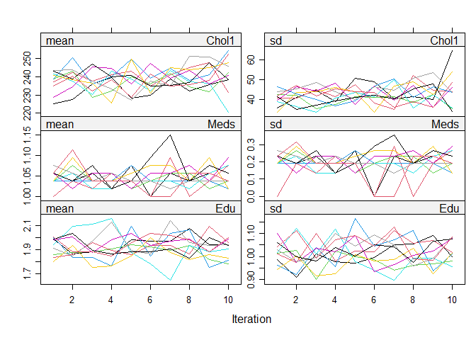
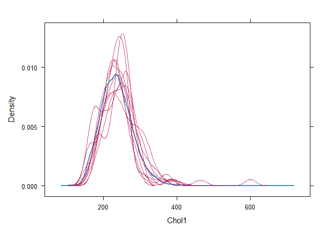
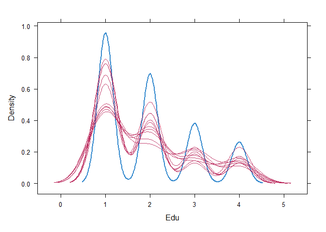

# The Second Circle: Logistic Regression, Part Two

<br/>
Jiří Fejlek

2025-06-11
<br/>

<br/> In Part Two of this project, we will demonstrate the use of
imputation methods on the Framingham Heart Study dataset (mean,
multivariate, and multiple imputation) and compare them with the
complete case analysis performed in Part One.

We start with the simplest imputation method: mean imputation. <br/>

## Mean Imputation

<br/> Mean imputation offers a quick fix for missing data by replacing
them with their mean. However, it disturbs the relationships between
variables (biasing regression estimates), and standard errors will be
biased downwards. Only the estimates of variable means will be unbiased
and only under the missing completely at random (MCAR) condition (*Stef
Van Buuren. Flexible imputation of missing data. CRC press, 2018*).
Overall, the mean imputation is not the preferred method of imputation.

Still, let us perform it. Let us start with categorical variables. The
most prevalent level of **Meds** is zero, and of **Edu** is 1. <br/>

<!-- --><!-- -->

<br/> Thus, these are the imputed values for these variables <br/>

``` r
framingham_mean_imp <- framingham
framingham_mean_imp[is.na(framingham$Meds),]$Meds <- framingham_mean_imp[3,]$Meds # level 0
framingham_mean_imp[is.na(framingham$Edu),]$Edu <- framingham_mean_imp[3,]$Edu # level 1
```

<br/> We impute **Hrate**, **BMI**, and **Chol** using their population
mean values. <br/>

``` r
framingham_mean_imp[is.na(framingham$Hrate),]$Hrate <- mean(framingham$Hrate,na.rm = TRUE)
framingham_mean_imp[is.na(framingham$BMI),]$BMI <- mean(framingham$BMI,na.rm = TRUE)
framingham_mean_imp[is.na(framingham$Chol),]$Chol <- mean(framingham$Chol,na.rm = TRUE)
```

<br/> For **Cigs**, we can do a bit better. A nonsmoker would smoke zero
cigarettes per day. However, there is no nonsmoker with **Cigs**
missing. <br/>

``` r
framingham[is.na(framingham$Cig) & framingham$Smoker  == 0,]
```

    ## # A tibble: 0 × 16
    ## # ℹ 16 variables: Sex <fct>, Age <dbl>, Edu <ord>, Smoker <fct>, Cig <dbl>,
    ## #   Meds <fct>, Stroke <fct>, Hyp <fct>, Diab <fct>, Chol <dbl>, SysP <dbl>,
    ## #   DiaP <dbl>, BMI <dbl>, Hrate <dbl>, Gluc <dbl>, TCHD <fct>

<br/> Thus, we impute **Cigs** with the mean for smokers <br/>

``` r
framingham_mean_imp[is.na(framingham$Cig),]$Cig <- mean(framingham$Cig[framingham$Smoker  == 1],na.rm = TRUE)
```

<br/> Lastly, we impute **Gluc** using **Diab** (diabetes) status, which
is not missing in the dataset. Note that the distributions of **Gluc**
vary significantly for people with and without diabetes. <br/>

``` r
par(mfrow = c(1, 2))
hist(framingham$Gluc[framingham$Diab == 0],xlab = 'Gluc for Diab = 0', main=NULL)
hist(framingham$Gluc[framingham$Diab == 1],xlab = 'Gluc for Diab = 1', main=NULL)
```

<!-- -->

<br/> Thus, we split the imputation of **Gluc** based on **Diab**. <br/>

``` r
framingham_mean_imp[is.na(framingham$Gluc) & framingham$Diab == 0,]$Gluc <- mean(framingham$Gluc[framingham$Diab == 0],na.rm = TRUE)
framingham_mean_imp[is.na(framingham$Gluc) & framingham$Diab == 1,]$Gluc <- mean(framingham$Gluc[framingham$Diab == 1],na.rm = TRUE)
```

<br/> The mean imputation is complete; let us fit the full model (the
same one as in the complete case analysis) and compare the results with
those from the complete case analysis. <br/>

``` r
full_model_mean_imp <- glm(TCHD  ~ Sex + rcs(Age,4) + Edu + rcs(Cig,4) + Meds + Stroke + Hyp + Diab + rcs(Chol,4) + rcs(SysP,4) + rcs(DiaP,4) + rcs(BMI,4) + rcs(Hrate,4) + rcs(Gluc,4) + Age:(Cig + Stroke + Hyp + Diab + Chol + SysP + DiaP + BMI + Hrate + Gluc) + Sex:(Cig + Stroke + Hyp + Diab + Chol + SysP + DiaP + BMI + Hrate + Gluc), family = binomial, framingham_mean_imp)

options(width = 1000)
coeffs <- cbind(round(coefficients(full_model),4),round(coefficients(full_model_mean_imp),4))
colnames(coeffs) <- c('Complete Case','Mean Imp.')
coeffs
```

    ##                      Complete Case Mean Imp.
    ## (Intercept)                -8.9136   -8.6056
    ## SexMale                    -1.9001   -2.3118
    ## rcs(Age, 4)Age              0.1645    0.1848
    ## rcs(Age, 4)Age'            -0.0240   -0.0785
    ## rcs(Age, 4)Age''           -0.0277    0.0911
    ## Edu.L                      -0.0060    0.0820
    ## Edu.Q                       0.1739    0.1653
    ## Edu.C                       0.0152   -0.0226
    ## rcs(Cig, 4)Cig              0.0298    0.0446
    ## rcs(Cig, 4)Cig'            -0.0166   -0.0170
    ## Meds1                       0.1143    0.2162
    ## Stroke1                    -4.5127   -7.4346
    ## Hyp1                       -0.4834   -0.2413
    ## Diab1                       2.4763    3.0400
    ## rcs(Chol, 4)Chol            0.0037    0.0064
    ## rcs(Chol, 4)Chol'           0.0032    0.0086
    ## rcs(Chol, 4)Chol''          0.0049   -0.0164
    ## rcs(SysP, 4)SysP            0.0046   -0.0001
    ## rcs(SysP, 4)SysP'          -0.0798   -0.0775
    ## rcs(SysP, 4)SysP''          0.1988    0.2000
    ## rcs(DiaP, 4)DiaP            0.0144    0.0238
    ## rcs(DiaP, 4)DiaP'           0.1432    0.1412
    ## rcs(DiaP, 4)DiaP''         -0.3416   -0.3718
    ## rcs(BMI, 4)BMI             -0.0583   -0.0915
    ## rcs(BMI, 4)BMI'             0.2653    0.3304
    ## rcs(BMI, 4)BMI''           -0.7437   -0.9306
    ## rcs(Hrate, 4)Hrate          0.0186   -0.0047
    ## rcs(Hrate, 4)Hrate'        -0.1267   -0.0777
    ## rcs(Hrate, 4)Hrate''        0.3229    0.1929
    ## rcs(Gluc, 4)Gluc           -0.0110   -0.0067
    ## rcs(Gluc, 4)Gluc'          -0.0184   -0.0310
    ## rcs(Gluc, 4)Gluc''          0.0733    0.1324
    ## Age:Cig                     0.0001   -0.0003
    ## Stroke1:Age                 0.0879    0.1403
    ## Hyp1:Age                    0.0184    0.0140
    ## Diab1:Age                  -0.0525   -0.0578
    ## Age:Chol                   -0.0001   -0.0002
    ## Age:SysP                    0.0005    0.0005
    ## Age:DiaP                   -0.0015   -0.0015
    ## Age:BMI                    -0.0002   -0.0001
    ## Age:Hrate                   0.0000    0.0003
    ## Age:Gluc                    0.0003    0.0002
    ## SexMale:Cig                -0.0059    0.0016
    ## SexMale:Stroke1             0.4554    0.4576
    ## SexMale:Hyp1               -0.5314   -0.5740
    ## SexMale:Diab1               0.6458    0.3419
    ## SexMale:Chol                0.0037    0.0025
    ## SexMale:SysP                0.0107    0.0145
    ## SexMale:DiaP                0.0040    0.0017
    ## SexMale:BMI                -0.0195   -0.0079
    ## SexMale:Hrate               0.0069    0.0057
    ## SexMale:Gluc               -0.0009    0.0003

<br/> We see that the estimates are not that different. Let’s take a
look at confidence intervals. <br/>

    ##                      2.5 % (Complete Case) 97.5 % (Complete Case) 2.5 % (Mean Imp.) 97.5 % (Mean Imp.)
    ## (Intercept)                       -18.8173                 0.7098          -17.9144             0.4702
    ## SexMale                            -4.4332                 0.6342           -4.6757             0.0476
    ## rcs(Age, 4)Age                      0.0019                 0.3303            0.0309             0.3415
    ## rcs(Age, 4)Age'                    -0.2921                 0.2381           -0.3264             0.1638
    ## rcs(Age, 4)Age''                   -0.6918                 0.6462           -0.5224             0.7142
    ## Edu.L                              -0.2416                 0.2226           -0.1356             0.2936
    ## Edu.Q                              -0.0589                 0.4059           -0.0501             0.3801
    ## Edu.C                              -0.2147                 0.2488           -0.2356             0.1933
    ## rcs(Cig, 4)Cig                     -0.0329                 0.0927           -0.0142             0.1040
    ## rcs(Cig, 4)Cig'                    -0.0588                 0.0254           -0.0559             0.0216
    ## Meds1                              -0.3684                 0.5802           -0.2353             0.6529
    ## Stroke1                           -19.5736                 5.9276          -22.0376             2.5496
    ## Hyp1                               -2.6140                 1.6142           -2.2023             1.6917
    ## Diab1                              -3.1107                 7.7223           -2.0342             7.8666
    ## rcs(Chol, 4)Chol                   -0.0142                 0.0221           -0.0104             0.0236
    ## rcs(Chol, 4)Chol'                  -0.0304                 0.0363           -0.0211             0.0379
    ## rcs(Chol, 4)Chol''                 -0.1000                 0.1109           -0.1123             0.0808
    ## rcs(SysP, 4)SysP                   -0.0625                 0.0714           -0.0617             0.0615
    ## rcs(SysP, 4)SysP'                  -0.2307                 0.0679           -0.2161             0.0584
    ## rcs(SysP, 4)SysP''                 -0.2006                 0.6048           -0.1669             0.5729
    ## rcs(DiaP, 4)DiaP                   -0.0829                 0.1140           -0.0669             0.1163
    ## rcs(DiaP, 4)DiaP'                  -0.0067                 0.2923            0.0044             0.2771
    ## rcs(DiaP, 4)DiaP''                 -0.8245                 0.1426           -0.8139             0.0717
    ## rcs(BMI, 4)BMI                     -0.2554                 0.1410           -0.2727             0.0916
    ## rcs(BMI, 4)BMI'                    -0.1301                 0.6552           -0.0353             0.6922
    ## rcs(BMI, 4)BMI''                   -1.9592                 0.4820           -2.0756             0.2211
    ## rcs(Hrate, 4)Hrate                 -0.0509                 0.0890           -0.0689             0.0602
    ## rcs(Hrate, 4)Hrate'                -0.2729                 0.0172           -0.2221             0.0647
    ## rcs(Hrate, 4)Hrate''               -0.0467                 0.6957           -0.1686             0.5569
    ## rcs(Gluc, 4)Gluc                   -0.0567                 0.0355           -0.0505             0.0379
    ## rcs(Gluc, 4)Gluc'                  -0.1568                 0.1163           -0.1546             0.0892
    ## rcs(Gluc, 4)Gluc''                 -0.2936                 0.4486           -0.2776             0.5520
    ## Age:Cig                            -0.0010                 0.0011           -0.0013             0.0007
    ## Stroke1:Age                        -0.0946                 0.3463           -0.0307             0.3883
    ## Hyp1:Age                           -0.0188                 0.0563           -0.0203             0.0489
    ## Diab1:Age                          -0.1440                 0.0424           -0.1424             0.0291
    ## Age:Chol                           -0.0004                 0.0002           -0.0005             0.0001
    ## Age:SysP                           -0.0006                 0.0015           -0.0005             0.0015
    ## Age:DiaP                           -0.0031                 0.0002           -0.0030             0.0000
    ## Age:BMI                            -0.0032                 0.0029           -0.0029             0.0027
    ## Age:Hrate                          -0.0010                 0.0011           -0.0007             0.0013
    ## Age:Gluc                           -0.0004                 0.0009           -0.0004             0.0009
    ## SexMale:Cig                        -0.0256                 0.0144           -0.0163             0.0200
    ## SexMale:Stroke1                    -1.6274                 2.5827           -1.5742             2.5840
    ## SexMale:Hyp1                       -1.1093                 0.0427           -1.1071            -0.0439
    ## SexMale:Diab1                      -0.6526                 1.9920           -0.8805             1.5846
    ## SexMale:Chol                       -0.0009                 0.0083           -0.0017             0.0067
    ## SexMale:SysP                       -0.0049                 0.0265            0.0000             0.0292
    ## SexMale:DiaP                       -0.0211                 0.0291           -0.0217             0.0251
    ## SexMale:BMI                        -0.0747                 0.0353           -0.0585             0.0425
    ## SexMale:Hrate                      -0.0104                 0.0241           -0.0102             0.0215
    ## SexMale:Gluc                       -0.0102                 0.0085           -0.0087             0.0094

<br/> Again, not a massive difference. Let’s test the significance of
the predictors (which would be of the most interest, provided that
hypothesis testing was our main goal). <br/>

    ##    Variable Complete Case Mean Imp.
    ## 1       Sex       0.00088   0.00089
    ## 2       Age             0   0.00000
    ## 3       Edu       0.44263   0.42365
    ## 4       Cig       0.00045   0.00003
    ## 5      Meds       0.63746   0.34302
    ## 6    Stroke       0.40459   0.09893
    ## 7       Hyp       0.08583   0.05337
    ## 8      Diab       0.45523   0.52133
    ## 9      Chol       0.04753   0.09142
    ## 10     Sysp       0.00264   0.00070
    ## 11     DiaP       0.01763   0.03483
    ## 12      BMI       0.66259   0.45713
    ## 13    Hrate       0.50901   0.81492
    ## 14     Gluc        0.0313   0.02849

<br/> The p-values changed a bit. The biggest difference is **Stroke**.
We see that previous stroke is a major risk factor for developing
**TCHD** in the future; however, we had too few observations with
**Stroke**. The imputation helped in that regard.

Next, we can compare our overall tests about the significance of
nonlinear terms and interactions. <br/>

``` r
model_no_nonlinear_mean_imp <- glm(TCHD  ~ Sex + Age + Edu  + Cig + Meds + Stroke + Hyp + Diab + Chol + SysP + DiaP + BMI + Hrate + Gluc + Age:(Cig + Stroke + Hyp + Diab + Chol + SysP + DiaP + BMI + Hrate + Gluc) + Sex:(Cig + Stroke + Hyp + Diab + Chol + SysP + DiaP + BMI + Hrate + Gluc), family = binomial, framingham_mean_imp)

model_no_interactions_mean_imp <- glm(TCHD  ~ Sex + rcs(Age,4) + Edu + rcs(Cig,4) + Meds + Stroke + Hyp + Diab + rcs(Chol,4) + rcs(SysP,4) + rcs(DiaP,4) + rcs(BMI,4) + rcs(Hrate,4) + rcs(Gluc,4), family = binomial, framingham_mean_imp)


anova(model_no_nonlinear_mean_imp,full_model_mean_imp)
```

    ## Analysis of Deviance Table
    ## 
    ## Model 1: TCHD ~ Sex + Age + Edu + Cig + Meds + Stroke + Hyp + Diab + Chol + 
    ##     SysP + DiaP + BMI + Hrate + Gluc + Age:(Cig + Stroke + Hyp + 
    ##     Diab + Chol + SysP + DiaP + BMI + Hrate + Gluc) + Sex:(Cig + 
    ##     Stroke + Hyp + Diab + Chol + SysP + DiaP + BMI + Hrate + 
    ##     Gluc)
    ## Model 2: TCHD ~ Sex + rcs(Age, 4) + Edu + rcs(Cig, 4) + Meds + Stroke + 
    ##     Hyp + Diab + rcs(Chol, 4) + rcs(SysP, 4) + rcs(DiaP, 4) + 
    ##     rcs(BMI, 4) + rcs(Hrate, 4) + rcs(Gluc, 4) + Age:(Cig + Stroke + 
    ##     Hyp + Diab + Chol + SysP + DiaP + BMI + Hrate + Gluc) + Sex:(Cig + 
    ##     Stroke + Hyp + Diab + Chol + SysP + DiaP + BMI + Hrate + 
    ##     Gluc)
    ##   Resid. Df Resid. Dev Df Deviance Pr(>Chi)  
    ## 1      4201     3184.6                       
    ## 2      4186     3159.5 15   25.042  0.04939 *
    ## ---
    ## Signif. codes:  0 '***' 0.001 '**' 0.01 '*' 0.05 '.' 0.1 ' ' 1

``` r
anova(model_no_interactions_mean_imp,full_model_mean_imp)
```

    ## Analysis of Deviance Table
    ## 
    ## Model 1: TCHD ~ Sex + rcs(Age, 4) + Edu + rcs(Cig, 4) + Meds + Stroke + 
    ##     Hyp + Diab + rcs(Chol, 4) + rcs(SysP, 4) + rcs(DiaP, 4) + 
    ##     rcs(BMI, 4) + rcs(Hrate, 4) + rcs(Gluc, 4)
    ## Model 2: TCHD ~ Sex + rcs(Age, 4) + Edu + rcs(Cig, 4) + Meds + Stroke + 
    ##     Hyp + Diab + rcs(Chol, 4) + rcs(SysP, 4) + rcs(DiaP, 4) + 
    ##     rcs(BMI, 4) + rcs(Hrate, 4) + rcs(Gluc, 4) + Age:(Cig + Stroke + 
    ##     Hyp + Diab + Chol + SysP + DiaP + BMI + Hrate + Gluc) + Sex:(Cig + 
    ##     Stroke + Hyp + Diab + Chol + SysP + DiaP + BMI + Hrate + 
    ##     Gluc)
    ##   Resid. Df Resid. Dev Df Deviance Pr(>Chi)
    ## 1      4206     3182.0                     
    ## 2      4186     3159.5 20   22.454   0.3164

<br/> Again, we got the same result as in the complete case analysis.
Next, we plot the significant predictors (we will plot for interactions
for simplicity’s sake). A denotes plots for the complete case analysis,
and B denotes plots for mean imputation. <br/>

<!-- --><!-- --><!-- --><!-- --><!-- --><!-- --><!-- --><!-- -->

<br/> Overall, our results would not have changed much.

We performed our inference based on the imputed data without accounting
for the fact that these data were imputed from the original dataset. To
obtain inferences that take imputation into consideration, we could use
a bootstrap. For example, to obtain confidence intervals for parameters,
we can use the following pairs bootstrap (we will use percentile-based
confidence intervals for simplicity’s sake). <br/>

``` r
set.seed(123) # for reproducibility
nb <- 2500
coefmat <- matrix(NA,nb,length(coefficients(full_model_mean_imp)))
colnames(coefmat) <- rownames(as.data.frame(coefficients(full_model_mean_imp)))

for(i in 1:nb){

  framingham_new <-  framingham[sample(nrow(framingham) , rep=TRUE),]
  framingham_mean_imp_new <- framingham_new
  
  framingham_mean_imp_new[is.na(framingham_new$Meds),]$Meds <- framingham_mean_imp[3,]$Meds # level 0
  framingham_mean_imp_new[is.na(framingham_new$Edu),]$Edu <- framingham_mean_imp[3,]$Edu # level 1
  
  framingham_mean_imp_new[is.na(framingham_new$Hrate),]$Hrate <- mean(framingham_new$Hrate,na.rm = TRUE)
  framingham_mean_imp_new[is.na(framingham_new$BMI),]$BMI <- mean(framingham_new$BMI,na.rm = TRUE)
  framingham_mean_imp_new[is.na(framingham_new$Chol),]$Chol <- mean(framingham_new$Chol,na.rm = TRUE)
  
  framingham_mean_imp_new[is.na(framingham_new$Gluc) & framingham_new$Diab == 0,]$Gluc <- mean(framingham_new$Gluc[framingham_new$Diab == 0],na.rm = TRUE)
  framingham_mean_imp_new[is.na(framingham_new$Gluc) & framingham_new$Diab == 1,]$Gluc <- mean(framingham_new$Gluc[framingham_new$Diab == 1],na.rm = TRUE)
  
  framingham_mean_imp_new[is.na(framingham_new$Cig),]$Cig <- 
    mean(framingham_new$Cig[framingham_new$Smoker  == 1],na.rm = TRUE)

  full_model_mean_imp_new <- glm(TCHD  ~ Sex + rcs(Age,4) + Edu + rcs(Cig,4) + Meds + Stroke + Hyp + Diab + rcs(Chol,4) + rcs(SysP,4) + rcs(DiaP,4) + rcs(BMI,4) + rcs(Hrate,4) + rcs(Gluc,4) + Age:(Cig + Stroke + Hyp + Diab + Chol + SysP + DiaP + BMI + Hrate + Gluc) + Sex:(Cig + Stroke + Hyp + Diab + Chol + SysP + DiaP + BMI + Hrate + Gluc), family = binomial, framingham_mean_imp_new)
  
  
  coefmat[i,colnames(t(as.data.frame(full_model_mean_imp_new$coefficients)))] <- t(as.data.frame(full_model_mean_imp_new$coefficients))
}

boot_ci <- t(apply(coefmat,2,function(x) quantile(x[!is.na(x)],c(0.025,0.975))))

options(width = 1000)
ci <- cbind(confint(full_model_mean_imp),boot_ci)
colnames(ci) <- c('2.5 % (profiling)','97.5 % (profiling)','2.5 % (bootstrap)','97.5 % (bootstrap)')
ci
```

    ##                      2.5 % (profiling) 97.5 % (profiling) 2.5 % (bootstrap) 97.5 % (bootstrap)
    ## (Intercept)              -1.791437e+01       4.702430e-01     -1.993760e+01       1.4873648106
    ## SexMale                  -4.675661e+00       4.755572e-02     -4.867942e+00       0.0755575329
    ## rcs(Age, 4)Age            3.094169e-02       3.414598e-01      1.819158e-02       0.3590374284
    ## rcs(Age, 4)Age'          -3.264444e-01       1.638330e-01     -3.365202e-01       0.1640843239
    ## rcs(Age, 4)Age''         -5.224440e-01       7.142098e-01     -5.241367e-01       0.7288536965
    ## Edu.L                    -1.355529e-01       2.936276e-01     -1.561599e-01       0.2961546633
    ## Edu.Q                    -5.009630e-02       3.800952e-01     -6.085997e-02       0.3782058650
    ## Edu.C                    -2.356500e-01       1.933334e-01     -2.384471e-01       0.1948882318
    ## rcs(Cig, 4)Cig           -1.418219e-02       1.039739e-01     -1.223404e-02       0.1072519144
    ## rcs(Cig, 4)Cig'          -5.593787e-02       2.160174e-02     -5.389086e-02       0.0184231122
    ## Meds1                    -2.352608e-01       6.528735e-01     -2.516263e-01       0.6970566741
    ## Stroke1                  -2.203762e+01       2.549577e+00     -1.287635e+02       1.5106069521
    ## Hyp1                     -2.202331e+00       1.691706e+00     -2.295160e+00       1.7776406018
    ## Diab1                    -2.034245e+00       7.866587e+00     -3.062416e+00       8.1996483294
    ## rcs(Chol, 4)Chol         -1.039122e-02       2.357322e-02     -1.082064e-02       0.0261533224
    ## rcs(Chol, 4)Chol'        -2.111451e-02       3.788751e-02     -2.619502e-02       0.0403255485
    ## rcs(Chol, 4)Chol''       -1.123205e-01       8.083148e-02     -1.217965e-01       0.1011511893
    ## rcs(SysP, 4)SysP         -6.174337e-02       6.150611e-02     -6.683110e-02       0.0633502789
    ## rcs(SysP, 4)SysP'        -2.160821e-01       5.838772e-02     -2.450894e-01       0.0638114267
    ## rcs(SysP, 4)SysP''       -1.668863e-01       5.728618e-01     -1.746592e-01       0.6230755951
    ## rcs(DiaP, 4)DiaP         -6.686135e-02       1.163497e-01     -7.423356e-02       0.1320170280
    ## rcs(DiaP, 4)DiaP'         4.367664e-03       2.771193e-01     -8.321651e-04       0.2722647459
    ## rcs(DiaP, 4)DiaP''       -8.139471e-01       7.169631e-02     -8.172325e-01       0.0713235150
    ## rcs(BMI, 4)BMI           -2.726895e-01       9.155845e-02     -2.922418e-01       0.1040273042
    ## rcs(BMI, 4)BMI'          -3.530341e-02       6.921795e-01     -5.143450e-02       0.6940512101
    ## rcs(BMI, 4)BMI''         -2.075570e+00       2.211321e-01     -2.121730e+00       0.2911874549
    ## rcs(Hrate, 4)Hrate       -6.887424e-02       6.016109e-02     -6.705821e-02       0.0591494388
    ## rcs(Hrate, 4)Hrate'      -2.220545e-01       6.467995e-02     -2.175375e-01       0.0624908460
    ## rcs(Hrate, 4)Hrate''     -1.685816e-01       5.569204e-01     -1.655932e-01       0.5671461461
    ## rcs(Gluc, 4)Gluc         -5.053575e-02       3.789536e-02     -6.077013e-02       0.0414748820
    ## rcs(Gluc, 4)Gluc'        -1.545651e-01       8.916440e-02     -1.753785e-01       0.0952239469
    ## rcs(Gluc, 4)Gluc''       -2.775985e-01       5.519513e-01     -2.903458e-01       0.6191599630
    ## Age:Cig                  -1.281930e-03       6.892663e-04     -1.351024e-03       0.0006845538
    ## Stroke1:Age              -3.065371e-02       3.882930e-01     -1.125816e-02       2.3080023375
    ## Hyp1:Age                 -2.030925e-02       4.887695e-02     -2.111842e-02       0.0490879553
    ## Diab1:Age                -1.424390e-01       2.909808e-02     -1.505376e-01       0.0383021743
    ## Age:Chol                 -4.722228e-04       6.852425e-05     -4.989943e-04       0.0000930602
    ## Age:SysP                 -5.216326e-04       1.471232e-03     -5.644203e-04       0.0015861882
    ## Age:DiaP                 -3.031516e-03       3.951719e-05     -3.249548e-03       0.0001647240
    ## Age:BMI                  -2.925465e-03       2.684147e-03     -2.939118e-03       0.0030319143
    ## Age:Hrate                -6.590772e-04       1.276192e-03     -6.605826e-04       0.0012488428
    ## Age:Gluc                 -3.747164e-04       8.743015e-04     -4.492963e-04       0.0011281788
    ## SexMale:Cig              -1.632254e-02       2.004003e-02     -1.527709e-02       0.0212749483
    ## SexMale:Stroke1          -1.574245e+00       2.583961e+00     -2.995473e+00       7.9820986250
    ## SexMale:Hyp1             -1.107110e+00      -4.386688e-02     -1.141769e+00      -0.0223365119
    ## SexMale:Diab1            -8.805193e-01       1.584593e+00     -9.978218e-01       1.7087840594
    ## SexMale:Chol             -1.671162e-03       6.677774e-03     -1.580532e-03       0.0076058548
    ## SexMale:SysP             -1.029527e-06       2.918418e-02      1.907607e-04       0.0302812250
    ## SexMale:DiaP             -2.174718e-02       2.507459e-02     -2.277666e-02       0.0266469596
    ## SexMale:BMI              -5.852673e-02       4.252654e-02     -6.205503e-02       0.0423389063
    ## SexMale:Hrate            -1.024685e-02       2.150946e-02     -1.080305e-02       0.0223346012
    ## SexMale:Gluc             -8.657019e-03       9.370232e-03     -9.612390e-03       0.0112081671

<br/> We see that bootstrap confidence intervals are quite similar to
those based on likelihood profiling. We should note that the bootstrap
does not fix the main issue of the mean imputation (our estimates could
be severely biased in general). Bootstrap confidence intervals for
predictions would be obtained in a similar manner.

Concerning hypothesis testing, we can use the bootstrap Wald test.
First, we compute the Wald test statistic for the original sample:
$W =\frac{\hat{\theta}^T \hat{\theta}}{\mathrm{Cov}\; \hat{\theta}}$.
Then, we compute for each bootstrap sample the Wald test statistic
$W^* =\frac{(\theta' - \hat{\theta})^T(\theta' - \hat{\theta})}{\mathrm{Cov}\; \theta}$,
where $\theta'$ is the estimate for the bootstrap sample. The p-value
for the test is then $\frac{\mathrm{count} W' > W}{\mathrm{count} W'}$. The idea behind the
test is that under alternative, the Wald test statistic $W$ between
$\hat{\theta}$ and the null $\theta_0 = 0$ should be much larger than
the Wald test statistic $W'$ between $\hat{\theta}$ and $\theta'$, see
*P. Hall, and S. R. Wilson. Two guidelines for bootstrap hypothesis
testing. Biometrics (1991): 757-762* for more details.

We demonstrate the bootstrap Wald test for **Sex**, **Education**, and
interactions terms. <br/>

``` r
set.seed(123) # for reproducibility
nb <- 2500
wald1 <- numeric(nb)  # sex
wald2 <- numeric(nb)  # education
wald3 <- numeric(nb)  # interactions

for(i in 1:nb){
  
  framingham_new <-  framingham[sample(nrow(framingham) , rep=TRUE),]
  framingham_mean_imp_new <- framingham_new
  
  framingham_mean_imp_new[is.na(framingham_new$Meds),]$Meds <- framingham_mean_imp[3,]$Meds # level 0
  framingham_mean_imp_new[is.na(framingham_new$Edu),]$Edu <- framingham_mean_imp[3,]$Edu # level 1
  
  framingham_mean_imp_new[is.na(framingham_new$Hrate),]$Hrate <- mean(framingham_new$Hrate,na.rm = TRUE)
  framingham_mean_imp_new[is.na(framingham_new$BMI),]$BMI <- mean(framingham_new$BMI,na.rm = TRUE)
  framingham_mean_imp_new[is.na(framingham_new$Chol),]$Chol <- mean(framingham_new$Chol,na.rm = TRUE)
  
  framingham_mean_imp_new[is.na(framingham_new$Gluc) & framingham_new$Diab == 0,]$Gluc <- mean(framingham_new$Gluc[framingham_new$Diab == 0],na.rm = TRUE)
  framingham_mean_imp_new[is.na(framingham_new$Gluc) & framingham_new$Diab == 1,]$Gluc <- mean(framingham_new$Gluc[framingham_new$Diab == 1],na.rm = TRUE)
  
  framingham_mean_imp_new[is.na(framingham_new$Cig),]$Cig <- 
    mean(framingham_new$Cig[framingham_new$Smoker  == 1],na.rm = TRUE)

  full_model_mean_imp_new <- glm(TCHD  ~ Sex + rcs(Age,4) + Edu + rcs(Cig,4) + Meds + Stroke + Hyp + Diab + rcs(Chol,4) + rcs(SysP,4) + rcs(DiaP,4) + rcs(BMI,4) + rcs(Hrate,4) + rcs(Gluc,4) + Age:(Cig + Stroke + Hyp + Diab + Chol + SysP + DiaP + BMI + Hrate + Gluc) + Sex:(Cig + Stroke + Hyp + Diab + Chol + SysP + DiaP + BMI + Hrate + Gluc), family = binomial, framingham_mean_imp_new)
  
# trycatch to skip numerical problems with inversions for some samples  
V <- vcov(full_model_mean_imp_new)[c(2,43:52),c(2,43:52)]
wald1[i] <- tryCatch((coefficients(full_model_mean_imp_new)[c(2,43:52)]-coefficients(full_model_mean_imp)[c(2,43:52)]) %*% solve(V) %*% (coefficients(full_model_mean_imp_new)[c(2,43:52)]-coefficients(full_model_mean_imp)[c(2,43:52)]), error = function(e) {NaN})

V <- vcov(full_model_mean_imp_new)[c(6:8),c(6:8)]
wald2[i] <- tryCatch((coefficients(full_model_mean_imp_new)[c(6:8)]-coefficients(full_model_mean_imp)[c(6:8)]) %*% solve(V) %*% (coefficients(full_model_mean_imp_new)[c(6:8)]-coefficients(full_model_mean_imp)[c(6:8)]), error = function(e) {NaN})

V <- vcov(full_model_mean_imp_new)[c(33:52),c(33:52)]
wald3[i] <- tryCatch((coefficients(full_model_mean_imp_new)[c(33:52)]-coefficients(full_model_mean_imp)[c(33:52)]) %*% solve(V) %*% (coefficients(full_model_mean_imp_new)[c(33:52)]-coefficients(full_model_mean_imp)[c(33:52)]), error = function(e) {NaN})
}

# Sex
V <- vcov(full_model_mean_imp)[c(2,43:52),c(2,43:52)]
wald <- coefficients(full_model_mean_imp)[c(2,43:52)] %*% solve(V) %*% coefficients(full_model_mean_imp)[c(2,43:52)]          
mean(wald1 > as.numeric(wald),na.rm = TRUE) # p-value
```

    ## [1] 0.002402883

``` r
# Education
V <- vcov(full_model_mean_imp)[c(6:8),c(6:8)]
wald <- coefficients(full_model_mean_imp)[c(6:8)] %*% solve(V) %*% coefficients(full_model_mean_imp)[c(6:8)]
mean(wald2 > as.numeric(wald),na.rm = TRUE)
```

    ## [1] 0.4324

``` r
# Interactions
V <- vcov(full_model_mean_imp)[c(33:52),c(33:52)]
wald <- coefficients(full_model_mean_imp)[c(33:52)] %*% solve(V) %*% coefficients(full_model_mean_imp)[c(33:52)]
mean(wald3 > as.numeric(wald),na.rm = TRUE)
```

    ## [1] 0.4230769

<br/> We again obtained very similar results to the likelihood ratio
test we performed earlier. <br/>

## Multivariate single imputation

<br/> The main disadvantage of the mean imputation is that it disrupts
relations between variables. Thus, we can try to model these
relationships and base the imputation on these models instead. A major
complication with that approach is that, in general, values for multiple
variables can be missing for a single observation. This complicates the
imputation since we may need one missing value to impute the second one
and vice versa.

One solution to this issue is the so-called fully conditional
specification (FCS), also known as a chained equation. The idea is to
initialize the imputation with randomly imputed values. Then, the
variables are imputed one at a time (using the rest of the data). Once
all variables are imputed, the process is iteratively repeated, creating
a Markov random process. It is assumed that this process will have a
unique stationary distribution (which often seems to be the case for
real-world data), i.e., the distribution of our imputed values will not
depend on the initial selection of the imputed values if enough
iterations are taken, see *Stef Van Buuren. Flexible imputation of
missing data. CRC press, 2018* for more details.

In R, this algorithm is implemented in the *mice* package. Let’s use it
to create an imputation model for our dataset. First, let us recall the
pattern of missing data. <br/>

``` r
library(mice)
options(width = 1000)

dim(framingham[rowSums(is.na(framingham)) > 0,])
```

    ## [1] 582  16

``` r
par(mfrow = c(1, 1))
md.pattern(framingham, rotate.names = TRUE)
```


    ##      Sex Age Smoker Stroke Hyp Diab SysP DiaP TCHD Hrate BMI Cig Chol Meds Edu Gluc    
    ## 3656   1   1      1      1   1    1    1    1    1     1   1   1    1    1   1    1   0
    ## 331    1   1      1      1   1    1    1    1    1     1   1   1    1    1   1    0   1
    ## 93     1   1      1      1   1    1    1    1    1     1   1   1    1    1   0    1   1
    ## 8      1   1      1      1   1    1    1    1    1     1   1   1    1    1   0    0   2
    ## 51     1   1      1      1   1    1    1    1    1     1   1   1    1    0   1    1   1
    ## 1      1   1      1      1   1    1    1    1    1     1   1   1    1    0   1    0   2
    ## 9      1   1      1      1   1    1    1    1    1     1   1   1    0    1   1    1   1
    ## 38     1   1      1      1   1    1    1    1    1     1   1   1    0    1   1    0   2
    ## 1      1   1      1      1   1    1    1    1    1     1   1   1    0    1   0    1   2
    ## 1      1   1      1      1   1    1    1    1    1     1   1   1    0    0   1    0   3
    ## 23     1   1      1      1   1    1    1    1    1     1   1   0    1    1   1    1   1
    ## 4      1   1      1      1   1    1    1    1    1     1   1   0    1    1   1    0   2
    ## 2      1   1      1      1   1    1    1    1    1     1   1   0    1    1   0    1   2
    ## 13     1   1      1      1   1    1    1    1    1     1   0   1    1    1   1    1   1
    ## 4      1   1      1      1   1    1    1    1    1     1   0   1    1    1   1    0   2
    ## 1      1   1      1      1   1    1    1    1    1     1   0   1    1    1   0    1   2
    ## 1      1   1      1      1   1    1    1    1    1     1   0   1    0    1   1    0   3
    ## 1      1   1      1      1   1    1    1    1    1     0   1   1    1    1   1    1   1
    ##        0   0      0      0   0    0    0    0    0     1  19  29   50   53 105  388 645

<br/> Unfortunately, the missing pattern is not monotone (the variables
cannot be ordered such that if variable $Y_j$ is missing, then all
variables $Y_k$ with $k >j$ are also missing). Therefore, we must employ
the chained equation approach to impute the missing data. First, let’s
do a quick analysis of the variables based on influx and outflux (*Stef
Van Buuren. Flexible imputation of missing data. CRC press, 2018*) <br/>

``` r
flux(framingham)
```

    ##             pobs       influx   outflux      ainb        aout       fico
    ## Sex    1.0000000 0.0000000000 1.0000000 0.0000000 0.010146295 0.13732893
    ## Age    1.0000000 0.0000000000 1.0000000 0.0000000 0.010146295 0.13732893
    ## Edu    0.9752242 0.0232717419 0.8186047 0.9923810 0.008516816 0.11541253
    ## Smoker 1.0000000 0.0000000000 1.0000000 0.0000000 0.010146295 0.13732893
    ## Cig    0.9931571 0.0063874455 0.9457364 0.9862069 0.009661836 0.13138513
    ## Meds   0.9874941 0.0117922070 0.9131783 0.9962264 0.009382716 0.12640382
    ## Stroke 1.0000000 0.0000000000 1.0000000 0.0000000 0.010146295 0.13732893
    ## Hyp    1.0000000 0.0000000000 1.0000000 0.0000000 0.010146295 0.13732893
    ## Diab   1.0000000 0.0000000000 1.0000000 0.0000000 0.010146295 0.13732893
    ## Chol   0.9882020 0.0105266292 0.8558140 0.9426667 0.008787011 0.12702961
    ## SysP   1.0000000 0.0000000000 1.0000000 0.0000000 0.010146295 0.13732893
    ## DiaP   1.0000000 0.0000000000 1.0000000 0.0000000 0.010146295 0.13732893
    ## BMI    0.9955168 0.0041391838 0.9596899 0.9754386 0.009781149 0.13344394
    ## Hrate  0.9997640 0.0002233373 0.9984496 1.0000000 0.010132956 0.13712532
    ## Gluc   0.9084474 0.0857763947 0.3069767 0.9898625 0.003428571 0.05038961
    ## TCHD   1.0000000 0.0000000000 1.0000000 0.0000000 0.010146295 0.13732893

``` r
fluxplot(framingham)
```

<!-- -->

<br/> Influx measures how much the variable is missing in cases when
other variables are not missing. Outflux measures how much a variable is
observed when other variables are missing. In general, variables near
the diagonal in the influx-outflux pattern are preferred.

We see that **Gluc** has a relatively small outflux; it is often missing
when other variables are missing. Thus, if we were not interested in
this variable and considered it not so important in the model, we could
remove it since **Gluc** may not help that much in imputing other
variables. Still, we consider all variables important in the model, and
thus, we keep it.

Next, we need to specify all the predictors in the model. We will follow
the following principle: the considered imputation model should be *at
least as general* as our response model.

First, we create a model matrix using completely observed variables,
including **Smoker** (this variable helps us to impute **Cig** at least)
and the outcome variable **TCHD** (including the response in the
imputation model is quite important: we assume that our predictors are
connected to the response and thus, the response is probably a strong
variable for predicting missing values). We also include all observed
interactions (we use in the full **TCHD** model) and all observed
nonlinear terms. <br/>

``` r
framingham_ext <- model.matrix(lm(log(Age) ~ TCHD + Sex + rcs(Age,4) + Smoker + Stroke + Hyp + Diab + rcs(SysP,4) + rcs(DiaP,4) + Age:Stroke + Age:Hyp + Age:Diab + Age:SysP + Age:DiaP + Sex:Stroke + Sex:Hyp + Sex:Diab + Sex:SysP + Sex:DiaP, data = framingham))
```

<br/> Next, we will add variables with missing data. <br/>

``` r
framingham_ext <- cbind(framingham_ext[,-c(1,17)],framingham$Hrate,framingham$BMI,framingham$Cig,framingham$Chol,framingham$Meds,framingham$Edu,framingham$Gluc)

colnames(framingham_ext) <- c('TCHD','Sex','Age1','Age2','Age3','Smoker','Stroke','Hyp','Diab','SysP1','SysP2','SysP3','DiaP1','DiaP2','DiaP3','AgeStroke','AgeHyp','AgeDiab','AgeSysP','AgeDiaP','SexStroke','SexHyp','SexDiab','SexSysP','SexDiaP','Hrate1','BMI1','Cig1','Chol1','Meds','Edu','Gluc1')

framingham_ext <- as_tibble(framingham_ext)
```

<br/> Next, we need to add variables computed from the variables with
missing values (remaining nonlinearities and interactions from our full
**TCHD** model) <br/>

``` r
Hrate_rcs <- rcs(framingham_ext$Hrate1,4)
BMI_rcs <- rcs(framingham_ext$BMI1,4)
Cig_rcs <- rcs(framingham_ext$Cig1,4)
Chol_rcs <- rcs(framingham_ext$Chol1,4)
Gluc_rcs <- rcs(framingham_ext$Gluc1,4)

framingham_ext <- framingham_ext %>% add_column(Hrate2 = as.numeric(Hrate_rcs[,2])) %>% add_column(Hrate3 = as.numeric(Hrate_rcs[,3])) %>% add_column(BMI2 = as.numeric(BMI_rcs[,2])) %>% add_column(BMI3 = as.numeric(BMI_rcs[,3])) %>% add_column(Cig2 = as.numeric(Cig_rcs[,2])) %>% add_column(Chol2 = as.numeric(Chol_rcs[,2])) %>% add_column(Chol3 = as.numeric(Chol_rcs[,3])) %>% add_column(Gluc2 = as.numeric(Gluc_rcs[,2])) %>% add_column(Gluc3 = as.numeric(Gluc_rcs[,3]))

framingham_ext <- framingham_ext %>% 
  add_column(AgeHrate = framingham_ext$Age1*framingham_ext$Hrate1) %>% 
  add_column(AgeBMI = framingham_ext$Age1*framingham_ext$BMI1) %>% 
  add_column(AgeCig = framingham_ext$Age1*framingham_ext$Cig1) %>% 
  add_column(AgeChol = framingham_ext$Age1*framingham_ext$Chol1) %>% 
  add_column(AgeGluc = framingham_ext$Age1*framingham_ext$Gluc1) %>% 
  add_column(SexHrate = framingham_ext$Sex*framingham_ext$Hrate1) %>% 
  add_column(SexBMI = framingham_ext$Sex*framingham_ext$BMI1) %>% 
  add_column(SexCig = framingham_ext$Sex*framingham_ext$Cig1) %>% 
  add_column(SexChol = framingham_ext$Sex*framingham_ext$Chol1) %>% 
  add_column(SexGluc = framingham_ext$Sex*framingham_ext$Gluc1)


framingham_ext$TCHD <- factor(framingham_ext$TCHD)
framingham_ext$Sex <- factor(framingham_ext$Sex)
framingham_ext$Smoker <- factor(framingham_ext$Smoker)
framingham_ext$Stroke <- factor(framingham_ext$Stroke)
framingham_ext$Hyp <- factor(framingham_ext$Hyp)
framingham_ext$Diab <- factor(framingham_ext$Diab)
framingham_ext$SexStroke <- factor(framingham_ext$SexStroke)
framingham_ext$SexHyp <- factor(framingham_ext$SexHyp)
framingham_ext$SexDiab <- factor(framingham_ext$SexDiab)
framingham_ext$Meds <- factor(framingham_ext$Meds)
framingham_ext$Edu  <- factor(framingham_ext$Edu, ordered = TRUE)
```

<br/> Our model matrix is complete. The next step is to determine which
methods should be used for imputing each variable. There are many
options (see *Stef Van Buuren. Flexible imputation of missing data. CRC
press, 2018*); we will use the default ones: predictive mean matching
for continuous variables, logistic regression for binary factor
variables, and ordered logit model for ordinal variables. <br/>

``` r
ini <- mice(framingham_ext, m = 1, maxit = 0)
meth <-ini$method
meth
```

    ##      TCHD       Sex      Age1      Age2      Age3    Smoker    Stroke       Hyp      Diab     SysP1     SysP2     SysP3     DiaP1     DiaP2     DiaP3 AgeStroke    AgeHyp   AgeDiab   AgeSysP   AgeDiaP SexStroke    SexHyp   SexDiab   SexSysP   SexDiaP    Hrate1      BMI1      Cig1     Chol1      Meds       Edu     Gluc1    Hrate2    Hrate3      BMI2      BMI3      Cig2     Chol2     Chol3     Gluc2     Gluc3  AgeHrate    AgeBMI    AgeCig   AgeChol   AgeGluc  SexHrate    SexBMI    SexCig   SexChol   SexGluc 
    ##        ""        ""        ""        ""        ""        ""        ""        ""        ""        ""        ""        ""        ""        ""        ""        ""        ""        ""        ""        ""        ""        ""        ""        ""        ""     "pmm"     "pmm"     "pmm"     "pmm"  "logreg"    "polr"     "pmm"     "pmm"     "pmm"     "pmm"     "pmm"     "pmm"     "pmm"     "pmm"     "pmm"     "pmm"     "pmm"     "pmm"     "pmm"     "pmm"     "pmm"     "pmm"     "pmm"     "pmm"     "pmm"     "pmm"

<br/> Now, some missing variables are direct functions of other missing
variables (nonlinear terms and interactions). Thus, instead of imputing
them, we will treat them as *derived variables*, i.e., we will directly
state how to compute them using the other variables. <br/>

``` r
meth["Hrate2"] <- "~rcspline.eval(Hrate1,knots = attributes(Hrate_rcs)$parms,inclx = TRUE)[,2]"
meth["Hrate3"] <- "~rcspline.eval(Hrate1,knots = attributes(Hrate_rcs)$parms,inclx = TRUE)[,3]"
meth["BMI2"] <- "~rcspline.eval(BMI1,knots = attributes(BMI_rcs)$parms,inclx = TRUE)[,2]"
meth["BMI3"] <- "~rcspline.eval(BMI1,knots = attributes(BMI_rcs)$parms,inclx = TRUE)[,3]"
meth["Cig2"] <- "~rcspline.eval(Cig1,knots = attributes(Cig_rcs)$parms,inclx = TRUE)[,2]"
meth["Chol2"] <- "~rcspline.eval(Chol1,knots = attributes(Chol_rcs)$parms,inclx = TRUE)[,2]"
meth["Chol3"] <- "~rcspline.eval(Chol1,knots = attributes(Chol_rcs)$parms,inclx = TRUE)[,3]"
meth["Gluc2"] <- "~rcspline.eval(Gluc1,knots = attributes(Gluc_rcs)$parms,inclx = TRUE)[,2]"
meth["Gluc3"] <- "~rcspline.eval(Gluc1,knots = attributes(Gluc_rcs)$parms,inclx = TRUE)[,3]"

meth["AgeHrate"] <- "~I(Age1*Hrate1)"
meth["AgeBMI"] <- "~I(Age1*BMI1)"
meth["AgeCig"] <- "~I(Age1*Cig1)"
meth["AgeChol"] <- "~I(Age1*Chol1)"
meth["AgeGluc"] <- "~I(Age1*Gluc1)"


meth["SexHrate"] <- "~I((as.numeric(Sex)-1)*Hrate1)"
meth["SexBMI"] <- "~I((as.numeric(Sex)-1)*BMI1)"
meth["SexCig"] <- "~I((as.numeric(Sex)-1)*Cig1)"
meth["SexChol"] <- "~I((as.numeric(Sex)-1)*Chol1)"
meth["SexGluc"] <- "~I((as.numeric(Sex)-1)*Gluc1)"
```

<br/> As the final step, we need to determine which variables should
actually be used in the imputation models for each variable. We will use
the function *quickpred*, which selects variables that are correlated
with a given variable with a correlation coefficient greater than
specified values. We also discuss using the derived variables for the
imputation of variables from which these are directly derived. Not doing
so would introduce imputation *loops* into our imputation, which could
result in an imputation process that would not have a stationary
distribution. <br/>

``` r
pred <- quickpred(framingham_ext,mincor = 0.10)

pred["Hrate1",c("Hrate2","Hrate3","AgeHrate","SexHrate")] <- 0
pred["BMI1",c("BMI2","BMI3","AgeBMI","SexBMI")] <- 0
pred["Cig1",c("Cig2","AgeCig","SexCig")] <- 0
pred["Chol1",c("Chol2","Chol3","AgeChol","SexChol")] <- 0
pred["Gluc1",c("Gluc2","Gluc3","AgeGluc","SexGluc")] <- 0

table(rowSums(pred))
```

    ## 
    ##  0 10 11 12 13 15 16 17 20 21 23 24 28 35 36 
    ## 25  1  1  1  2  3  5  3  3  1  1  1  1  2  1

``` r
mean(rowSums(pred)[rowSums(pred)>0])
```

    ## [1] 19.11538

<br/> The recommended number of predictor variables in an imputation
model is between 15 and 25, according to *Stef Van Buuren. Flexible
imputation of missing data. CRC press, 2018*. We observe that our
imputation models generally meet this recommendation.

Having specified all imputation models, we can finally perform the
imputation. We will perform 10 iterations of the FCS imputation. <br/>

``` r
imp <- mice(framingham_ext, pred = pred,meth = meth, m = 1, maxit = 10, seed = 123)
```

    ## 
    ##  iter imp variable
    ##   1   1  Hrate1  BMI1  Cig1  Chol1  Meds  Edu  Gluc1  Hrate2  Hrate3  BMI2  BMI3  Cig2  Chol2  Chol3  Gluc2  Gluc3  AgeHrate  AgeBMI  AgeCig  AgeChol  AgeGluc  SexHrate  SexBMI  SexCig  SexChol  SexGluc
    ##   2   1  Hrate1  BMI1  Cig1  Chol1  Meds  Edu  Gluc1  Hrate2  Hrate3  BMI2  BMI3  Cig2  Chol2  Chol3  Gluc2  Gluc3  AgeHrate  AgeBMI  AgeCig  AgeChol  AgeGluc  SexHrate  SexBMI  SexCig  SexChol  SexGluc
    ##   3   1  Hrate1  BMI1  Cig1  Chol1  Meds  Edu  Gluc1  Hrate2  Hrate3  BMI2  BMI3  Cig2  Chol2  Chol3  Gluc2  Gluc3  AgeHrate  AgeBMI  AgeCig  AgeChol  AgeGluc  SexHrate  SexBMI  SexCig  SexChol  SexGluc
    ##   4   1  Hrate1  BMI1  Cig1  Chol1  Meds  Edu  Gluc1  Hrate2  Hrate3  BMI2  BMI3  Cig2  Chol2  Chol3  Gluc2  Gluc3  AgeHrate  AgeBMI  AgeCig  AgeChol  AgeGluc  SexHrate  SexBMI  SexCig  SexChol  SexGluc
    ##   5   1  Hrate1  BMI1  Cig1  Chol1  Meds  Edu  Gluc1  Hrate2  Hrate3  BMI2  BMI3  Cig2  Chol2  Chol3  Gluc2  Gluc3  AgeHrate  AgeBMI  AgeCig  AgeChol  AgeGluc  SexHrate  SexBMI  SexCig  SexChol  SexGluc
    ##   6   1  Hrate1  BMI1  Cig1  Chol1  Meds  Edu  Gluc1  Hrate2  Hrate3  BMI2  BMI3  Cig2  Chol2  Chol3  Gluc2  Gluc3  AgeHrate  AgeBMI  AgeCig  AgeChol  AgeGluc  SexHrate  SexBMI  SexCig  SexChol  SexGluc
    ##   7   1  Hrate1  BMI1  Cig1  Chol1  Meds  Edu  Gluc1  Hrate2  Hrate3  BMI2  BMI3  Cig2  Chol2  Chol3  Gluc2  Gluc3  AgeHrate  AgeBMI  AgeCig  AgeChol  AgeGluc  SexHrate  SexBMI  SexCig  SexChol  SexGluc
    ##   8   1  Hrate1  BMI1  Cig1  Chol1  Meds  Edu  Gluc1  Hrate2  Hrate3  BMI2  BMI3  Cig2  Chol2  Chol3  Gluc2  Gluc3  AgeHrate  AgeBMI  AgeCig  AgeChol  AgeGluc  SexHrate  SexBMI  SexCig  SexChol  SexGluc
    ##   9   1  Hrate1  BMI1  Cig1  Chol1  Meds  Edu  Gluc1  Hrate2  Hrate3  BMI2  BMI3  Cig2  Chol2  Chol3  Gluc2  Gluc3  AgeHrate  AgeBMI  AgeCig  AgeChol  AgeGluc  SexHrate  SexBMI  SexCig  SexChol  SexGluc
    ##   10   1  Hrate1  BMI1  Cig1  Chol1  Meds  Edu  Gluc1  Hrate2  Hrate3  BMI2  BMI3  Cig2  Chol2  Chol3  Gluc2  Gluc3  AgeHrate  AgeBMI  AgeCig  AgeChol  AgeGluc  SexHrate  SexBMI  SexCig  SexChol  SexGluc

<br/> An important step is now to diagnose the imputation. First, we
need to check the progress of the imputation process. Function
*plot(imp)* plots means and standard deviations for each imputed
variable. These values should change randomly from one iteration to the
next, i.e., there should be no apparent trend. Otherwise, the imputation
process did not converge to a stationary distribution. Notice that
**Hrate** was missing just one value. <br/>

``` r
plot(imp)
```


<br/> We see no obvious trends. However, this issue can be challenging
to assess for a short series. Thus, let us repeat the plot for a much
larger amount of iterations to be sure. <br/>

``` r
imp2 <- mice(framingham_ext, pred = pred,meth = meth, m = 1, maxit = 100, seed = 123)
```

``` r
plot(imp2)
```


<br/> Again, we see no obvious trends. Thus, we will continue to analyze
the imputation *imp*. Next, we should compare the distributions of the
imputed data with those of the observed data. <br/>

``` r
densityplot(imp,~ BMI1)
```


``` r
densityplot(imp,~ Cig1)
```


``` r
densityplot(imp,~ Chol1)
```


``` r
densityplot(imp,~ Meds)
```


``` r
densityplot(imp,~ Edu)
```


``` r
densityplot(imp,~ Gluc1)
```


<br/> The only variable that is clearly different is **Cig**. This is
because we compare the overall distribution of **Cig** for both
nonsmokers and smokers, using imputed values that are specific to
smokers only. If we compare only smokers, the distribution of the
imputed data appears to be fine. <br/>

``` r
densityplot(imp,~ Cig1)
```


``` r
hist(framingham$Cig[framingham$Smoker == 1],20,xlab = 'Cig for Smokers',main = NULL)
```


<br/> Overall, the imputation seems reasonable. Thus, we will proceed
with the analysis of our **TCHD** model based on the imputed dataset.
Let’s fit the model. <br/>

``` r
complete_data <- complete(imp,1)
complete_data_fit <- complete_data[,c("TCHD","Sex","Age1","Smoker","Stroke","Hyp","Diab","SysP1","DiaP1","Hrate1","BMI1","Cig1","Chol1","Meds","Edu","Gluc1")]
colnames(complete_data_fit) <-c("TCHD","Sex","Age","Smoker","Stroke","Hyp","Diab","SysP","DiaP","Hrate","BMI","Cig","Chol","Meds","Edu","Gluc")

full_model_mvar_imp <- glm(TCHD  ~ Sex + rcs(Age,4) + Edu + rcs(Cig,4) + Meds + Stroke + Hyp + Diab + rcs(Chol,4) + rcs(SysP,4) + rcs(DiaP,4) + rcs(BMI,4) + rcs(Hrate,4) + rcs(Gluc,4) + Age:(Cig + Stroke + Hyp + Diab + Chol + SysP + DiaP + BMI + Hrate + Gluc) + Sex:(Cig + Stroke + Hyp + Diab + Chol + SysP + DiaP + BMI + Hrate + Gluc), family = binomial, complete_data_fit)

options(width = 1000)

coeffs <- cbind(round(coefficients(full_model),4),round(coefficients(full_model_mvar_imp),4))
colnames(coeffs) <- c('Complete Case','Multv. Imp.')
coeffs
```

    ##                      Complete Case Multv. Imp.
    ## (Intercept)                -8.9136     -9.1240
    ## SexMale                    -1.9001     -2.1943
    ## rcs(Age, 4)Age              0.1645      0.1941
    ## rcs(Age, 4)Age'            -0.0240     -0.0736
    ## rcs(Age, 4)Age''           -0.0277      0.0766
    ## Edu.L                      -0.0060      0.0949
    ## Edu.Q                       0.1739      0.1751
    ## Edu.C                       0.0152      0.0013
    ## rcs(Cig, 4)Cig              0.0298      0.0433
    ## rcs(Cig, 4)Cig'            -0.0166     -0.0178
    ## Meds1                       0.1143      0.2265
    ## Stroke1                    -4.5127     -7.2769
    ## Hyp1                       -0.4834     -0.2413
    ## Diab1                       2.4763      1.5663
    ## rcs(Chol, 4)Chol            0.0037      0.0075
    ## rcs(Chol, 4)Chol'           0.0032      0.0063
    ## rcs(Chol, 4)Chol''          0.0049     -0.0083
    ## rcs(SysP, 4)SysP            0.0046     -0.0033
    ## rcs(SysP, 4)SysP'          -0.0798     -0.0745
    ## rcs(SysP, 4)SysP''          0.1988      0.1918
    ## rcs(DiaP, 4)DiaP            0.0144      0.0292
    ## rcs(DiaP, 4)DiaP'           0.1432      0.1402
    ## rcs(DiaP, 4)DiaP''         -0.3416     -0.3699
    ## rcs(BMI, 4)BMI             -0.0583     -0.1101
    ## rcs(BMI, 4)BMI'             0.2653      0.3609
    ## rcs(BMI, 4)BMI''           -0.7437     -0.9963
    ## rcs(Hrate, 4)Hrate          0.0186     -0.0034
    ## rcs(Hrate, 4)Hrate'        -0.1267     -0.0784
    ## rcs(Hrate, 4)Hrate''        0.3229      0.1943
    ## rcs(Gluc, 4)Gluc           -0.0110      0.0016
    ## rcs(Gluc, 4)Gluc'          -0.0184     -0.0384
    ## rcs(Gluc, 4)Gluc''          0.0733      0.1287
    ## Age:Cig                     0.0001     -0.0003
    ## Stroke1:Age                 0.0879      0.1373
    ## Hyp1:Age                    0.0184      0.0140
    ## Diab1:Age                  -0.0525     -0.0353
    ## Age:Chol                   -0.0001     -0.0002
    ## Age:SysP                    0.0005      0.0005
    ## Age:DiaP                   -0.0015     -0.0016
    ## Age:BMI                    -0.0002      0.0000
    ## Age:Hrate                   0.0000      0.0003
    ## Age:Gluc                    0.0003      0.0001
    ## SexMale:Cig                -0.0059      0.0024
    ## SexMale:Stroke1             0.4554      0.4633
    ## SexMale:Hyp1               -0.5314     -0.5730
    ## SexMale:Diab1               0.6458      0.5357
    ## SexMale:Chol                0.0037      0.0024
    ## SexMale:SysP                0.0107      0.0150
    ## SexMale:DiaP                0.0040      0.0007
    ## SexMale:BMI                -0.0195     -0.0072
    ## SexMale:Hrate               0.0069      0.0052
    ## SexMale:Gluc               -0.0009     -0.0005

``` r
ci <- cbind(confint(full_model),confint(full_model_mvar_imp))
colnames(ci) <- c('2.5 % (Complete Case)', '97.5 % (Complete Case)', '2.5 % (Multv. Imp.)', '97.5 % (Multv. Imp.)')
round(ci,4)
```

    ##                      2.5 % (Complete Case) 97.5 % (Complete Case) 2.5 % (Multv. Imp.) 97.5 % (Multv. Imp.)
    ## (Intercept)                       -18.8173                 0.7098            -18.4294              -0.0493
    ## SexMale                            -4.4332                 0.6342             -4.5567               0.1636
    ## rcs(Age, 4)Age                      0.0019                 0.3303              0.0399               0.3511
    ## rcs(Age, 4)Age'                    -0.2921                 0.2381             -0.3217               0.1690
    ## rcs(Age, 4)Age''                   -0.6918                 0.6462             -0.5376               0.7002
    ## Edu.L                              -0.2416                 0.2226             -0.1211               0.3055
    ## Edu.Q                              -0.0589                 0.4059             -0.0384               0.3880
    ## Edu.C                              -0.2147                 0.2488             -0.2095               0.2152
    ## rcs(Cig, 4)Cig                     -0.0329                 0.0927             -0.0155               0.1027
    ## rcs(Cig, 4)Cig'                    -0.0588                 0.0254             -0.0568               0.0210
    ## Meds1                              -0.3684                 0.5802             -0.2200               0.6586
    ## Stroke1                           -19.5736                 5.9276            -21.9477               2.7462
    ## Hyp1                               -2.6140                 1.6142             -2.2062               1.6956
    ## Diab1                              -3.1107                 7.7223             -3.7596               6.5821
    ## rcs(Chol, 4)Chol                   -0.0142                 0.0221             -0.0093               0.0247
    ## rcs(Chol, 4)Chol'                  -0.0304                 0.0363             -0.0245               0.0365
    ## rcs(Chol, 4)Chol''                 -0.1000                 0.1109             -0.1035               0.0881
    ## rcs(SysP, 4)SysP                   -0.0625                 0.0714             -0.0652               0.0585
    ## rcs(SysP, 4)SysP'                  -0.2307                 0.0679             -0.2132               0.0615
    ## rcs(SysP, 4)SysP''                 -0.2006                 0.6048             -0.1755               0.5651
    ## rcs(DiaP, 4)DiaP                   -0.0829                 0.1140             -0.0619               0.1223
    ## rcs(DiaP, 4)DiaP'                  -0.0067                 0.2923              0.0032               0.2763
    ## rcs(DiaP, 4)DiaP''                 -0.8245                 0.1426             -0.8126               0.0741
    ## rcs(BMI, 4)BMI                     -0.2554                 0.1410             -0.2900               0.0712
    ## rcs(BMI, 4)BMI'                    -0.1301                 0.6552             -0.0048               0.7230
    ## rcs(BMI, 4)BMI''                   -1.9592                 0.4820             -2.1296               0.1434
    ## rcs(Hrate, 4)Hrate                 -0.0509                 0.0890             -0.0676               0.0615
    ## rcs(Hrate, 4)Hrate'                -0.2729                 0.0172             -0.2229               0.0641
    ## rcs(Hrate, 4)Hrate''               -0.0467                 0.6957             -0.1673               0.5586
    ## rcs(Gluc, 4)Gluc                   -0.0567                 0.0355             -0.0395               0.0434
    ## rcs(Gluc, 4)Gluc'                  -0.1568                 0.1163             -0.1684               0.0882
    ## rcs(Gluc, 4)Gluc''                 -0.2936                 0.4486             -0.2155               0.4808
    ## Age:Cig                            -0.0010                 0.0011             -0.0013               0.0007
    ## Stroke1:Age                        -0.0946                 0.3463             -0.0350               0.3868
    ## Hyp1:Age                           -0.0188                 0.0563             -0.0204               0.0489
    ## Diab1:Age                          -0.1440                 0.0424             -0.1223               0.0549
    ## Age:Chol                           -0.0004                 0.0002             -0.0005               0.0001
    ## Age:SysP                           -0.0006                 0.0015             -0.0005               0.0015
    ## Age:DiaP                           -0.0031                 0.0002             -0.0031               0.0000
    ## Age:BMI                            -0.0032                 0.0029             -0.0027               0.0028
    ## Age:Hrate                          -0.0010                 0.0011             -0.0007               0.0013
    ## Age:Gluc                           -0.0004                 0.0009             -0.0005               0.0007
    ## SexMale:Cig                        -0.0256                 0.0144             -0.0155               0.0210
    ## SexMale:Stroke1                    -1.6274                 2.5827             -1.5698               2.5832
    ## SexMale:Hyp1                       -1.1093                 0.0427             -1.1069              -0.0422
    ## SexMale:Diab1                      -0.6526                 1.9920             -0.7117               1.8163
    ## SexMale:Chol                       -0.0009                 0.0083             -0.0018               0.0065
    ## SexMale:SysP                       -0.0049                 0.0265              0.0004               0.0296
    ## SexMale:DiaP                       -0.0211                 0.0291             -0.0227               0.0242
    ## SexMale:BMI                        -0.0747                 0.0353             -0.0577               0.0431
    ## SexMale:Hrate                      -0.0104                 0.0241             -0.0107               0.0211
    ## SexMale:Gluc                       -0.0102                 0.0085             -0.0091               0.0083

<br/> Again, the difference between full case analysis and imputation
(here, multivariate) is not that big. Let’s check whether the results of
significance tests changed in a meaningful way. <br/>

    ##    Variable Complete Case Multv. Imp.
    ## 1       Sex       0.00088     0.00063
    ## 2       Age             0     0.00000
    ## 3       Edu       0.44263     0.40287
    ## 4       Cig       0.00045     0.00003
    ## 5      Meds       0.63746     0.31553
    ## 6    Stroke       0.40459     0.12027
    ## 7       Hyp       0.08583     0.05448
    ## 8      Diab       0.45523     0.62192
    ## 9      Chol       0.04753     0.09376
    ## 10     Sysp       0.00264     0.00080
    ## 11     DiaP       0.01763     0.03501
    ## 12      BMI       0.66259     0.31709
    ## 13    Hrate       0.50901     0.82991
    ## 14     Gluc        0.0313     0.00982

<br/> Testing nonlinearities and interactions is next. <br/>

``` r
model_no_nonlinear_mean_imp <- glm(TCHD  ~ Sex + Age + Edu  + Cig + Meds + Stroke + Hyp + Diab + Chol + SysP + DiaP + BMI + Hrate + Gluc + Age:(Cig + Stroke + Hyp + Diab + Chol + SysP + DiaP + BMI + Hrate + Gluc) + Sex:(Cig + Stroke + Hyp + Diab + Chol + SysP + DiaP + BMI + Hrate + Gluc), family = binomial, complete_data_fit)

model_no_interactions_mean_imp <- glm(TCHD  ~ Sex + rcs(Age,4) + Edu + rcs(Cig,4) + Meds + Stroke + Hyp + Diab + rcs(Chol,4) + rcs(SysP,4) + rcs(DiaP,4) + rcs(BMI,4) + rcs(Hrate,4) + rcs(Gluc,4), family = binomial, complete_data_fit)


anova(model_no_nonlinear_mean_imp,full_model_mvar_imp)
```

    ## Analysis of Deviance Table
    ## 
    ## Model 1: TCHD ~ Sex + Age + Edu + Cig + Meds + Stroke + Hyp + Diab + Chol + 
    ##     SysP + DiaP + BMI + Hrate + Gluc + Age:(Cig + Stroke + Hyp + 
    ##     Diab + Chol + SysP + DiaP + BMI + Hrate + Gluc) + Sex:(Cig + 
    ##     Stroke + Hyp + Diab + Chol + SysP + DiaP + BMI + Hrate + 
    ##     Gluc)
    ## Model 2: TCHD ~ Sex + rcs(Age, 4) + Edu + rcs(Cig, 4) + Meds + Stroke + 
    ##     Hyp + Diab + rcs(Chol, 4) + rcs(SysP, 4) + rcs(DiaP, 4) + 
    ##     rcs(BMI, 4) + rcs(Hrate, 4) + rcs(Gluc, 4) + Age:(Cig + Stroke + 
    ##     Hyp + Diab + Chol + SysP + DiaP + BMI + Hrate + Gluc) + Sex:(Cig + 
    ##     Stroke + Hyp + Diab + Chol + SysP + DiaP + BMI + Hrate + 
    ##     Gluc)
    ##   Resid. Df Resid. Dev Df Deviance Pr(>Chi)  
    ## 1      4201     3182.7                       
    ## 2      4186     3155.8 15   26.857  0.02993 *
    ## ---
    ## Signif. codes:  0 '***' 0.001 '**' 0.01 '*' 0.05 '.' 0.1 ' ' 1

``` r
anova(model_no_interactions_mean_imp,full_model_mvar_imp)
```

    ## Analysis of Deviance Table
    ## 
    ## Model 1: TCHD ~ Sex + rcs(Age, 4) + Edu + rcs(Cig, 4) + Meds + Stroke + 
    ##     Hyp + Diab + rcs(Chol, 4) + rcs(SysP, 4) + rcs(DiaP, 4) + 
    ##     rcs(BMI, 4) + rcs(Hrate, 4) + rcs(Gluc, 4)
    ## Model 2: TCHD ~ Sex + rcs(Age, 4) + Edu + rcs(Cig, 4) + Meds + Stroke + 
    ##     Hyp + Diab + rcs(Chol, 4) + rcs(SysP, 4) + rcs(DiaP, 4) + 
    ##     rcs(BMI, 4) + rcs(Hrate, 4) + rcs(Gluc, 4) + Age:(Cig + Stroke + 
    ##     Hyp + Diab + Chol + SysP + DiaP + BMI + Hrate + Gluc) + Sex:(Cig + 
    ##     Stroke + Hyp + Diab + Chol + SysP + DiaP + BMI + Hrate + 
    ##     Gluc)
    ##   Resid. Df Resid. Dev Df Deviance Pr(>Chi)
    ## 1      4206     3177.9                     
    ## 2      4186     3155.8 20    22.11   0.3346

<br/> As expected, the same result. We will conclude the comparisons
with plots of the predicted probabilities of *TCHD*. <br/>

``` r
library(sjPlot)
p1 <- plot_model(full_model, type = "pred", terms = c('Age','Sex'))
p2 <- plot_model(full_model_mvar_imp, type = "pred", terms = c('Age','Sex'))
plot_grid(list(p1,p2))
```

<!-- -->

``` r
p1 <- plot_model(full_model, type = "pred", terms = c('Cig','Sex')) 
p2 <- plot_model(full_model_mvar_imp, type = "pred", terms = c('Cig','Sex')) 
plot_grid(list(p1,p2))
```

<!-- -->

``` r
p1 <- plot_model(full_model, type = "pred", terms = c('Age','Sex','Stroke'),title  = 'Predicted probabilities of TCHD for Stroke')
p2 <- plot_model(full_model_mvar_imp, type = "pred", terms = c('Age','Sex','Stroke'),title  = 'Predicted probabilities of TCHD for Stroke')
plot_grid(list(p1,p2))
```

<!-- -->

``` r
p1 <-  plot_model(full_model, type = "pred", terms = c('Age','Sex','Hyp'),title  = 'Predicted probabilities of TCHD for Hyp')
p2 <- plot_model(full_model_mvar_imp, type = "pred", terms = c('Age','Sex','Hyp'),title  = 'Predicted probabilities of TCHD for Hyp')
plot_grid(list(p1,p2))
```

<!-- -->

``` r
p1 <- plot_model(full_model, type = "pred", terms = c('Chol','Sex'))
p2 <- plot_model(full_model_mvar_imp, type = "pred", terms = c('Chol','Sex'))
plot_grid(list(p1,p2))
```

<!-- -->

``` r
p1 <- plot_model(full_model, type = "pred", terms = c('SysP','Sex'))
p2 <- plot_model(full_model_mvar_imp, type = "pred", terms = c('SysP','Sex'))
plot_grid(list(p1,p2))
```

<!-- -->

``` r
p1 <- plot_model(full_model, type = "pred", terms = c('DiaP','Sex'))
p2 <- plot_model(full_model_mvar_imp, type = "pred", terms = c('DiaP','Sex'))
plot_grid(list(p1,p2))
```

<!-- -->

``` r
p1 <- plot_model(full_model, type = "pred", terms = c('Gluc','Sex'))
p2 <- plot_model(full_model_mvar_imp, type = "pred", terms = c('Gluc','Sex'))
plot_grid(list(p1,p2))
```

<!-- -->

<br/> Overall, the results of the multivariate single imputation are
similar to those of the complete case analysis. Again, we can bootstrap
our analysis to account for the imputation. We will demonstrate the
percentile-based pairs bootstrapped confidence intervals for single
multivariate imputation. <br/>

``` r
set.seed(123) # for reproducibility
nb <- 2500
coefmat <- matrix(NA,nb,length(coefficients(full_model_mvar_imp)))
colnames(coefmat) <- rownames(as.data.frame(coefficients(full_model_mvar_imp)))

for(i in 1:nb){

  framingham_new <-  framingham[sample(nrow(framingham) , rep=TRUE),]
  
  framingham_ext_new <- model.matrix(lm(log(Age) ~ TCHD + Sex + rcs(Age,4) + Smoker + Stroke + Hyp + Diab + rcs(SysP,4) + rcs(DiaP,4) + Age:Stroke + Age:Hyp + Age:Diab + Age:SysP + Age:DiaP + Sex:Stroke + Sex:Hyp + Sex:Diab + Sex:SysP + Sex:DiaP, data = framingham_new))
  
  framingham_ext_new <- cbind(framingham_ext_new[,-c(1,17)],framingham_new$Hrate,framingham_new$BMI,framingham_new$Cig,framingham_new$Chol,framingham_new$Meds,framingham_new$Edu,framingham_new$Gluc)
  
  colnames(framingham_ext_new) <- c('TCHD','Sex','Age1','Age2','Age3','Smoker','Stroke','Hyp','Diab','SysP1','SysP2','SysP3','DiaP1','DiaP2','DiaP3','AgeStroke','AgeHyp','AgeDiab','AgeSysP','AgeDiaP','SexStroke','SexHyp','SexDiab','SexSysP','SexDiaP','Hrate1','BMI1','Cig1','Chol1','Meds','Edu','Gluc1')
  
  framingham_ext_new <- as_tibble(framingham_ext_new)
  
  Hrate_rcs <- rcs(framingham_ext_new$Hrate1,4)
  BMI_rcs <- rcs(framingham_ext_new$BMI1,4)
  Cig_rcs <- rcs(framingham_ext_new$Cig1,4)
  Chol_rcs <- rcs(framingham_ext_new$Chol1,4)
  Gluc_rcs <- rcs(framingham_ext_new$Gluc1,4)
  
  framingham_ext_new <- framingham_ext_new %>% add_column(Hrate2 = as.numeric(Hrate_rcs[,2])) %>% add_column(Hrate3 = as.numeric(Hrate_rcs[,3])) %>% add_column(BMI2 = as.numeric(BMI_rcs[,2])) %>% add_column(BMI3 = as.numeric(BMI_rcs[,3])) %>% add_column(Cig2 = as.numeric(Cig_rcs[,2])) %>% add_column(Chol2 = as.numeric(Chol_rcs[,2])) %>% add_column(Chol3 = as.numeric(Chol_rcs[,3])) %>% add_column(Gluc2 = as.numeric(Gluc_rcs[,2])) %>% add_column(Gluc3 = as.numeric(Gluc_rcs[,3]))
  
  framingham_ext_new <- framingham_ext_new %>% 
  add_column(AgeHrate = framingham_ext_new$Age1*framingham_ext_new$Hrate1) %>% 
  add_column(AgeBMI = framingham_ext_new$Age1*framingham_ext_new$BMI1) %>% 
  add_column(AgeCig = framingham_ext_new$Age1*framingham_ext_new$Cig1) %>% 
  add_column(AgeChol = framingham_ext_new$Age1*framingham_ext_new$Chol1) %>% 
  add_column(AgeGluc = framingham_ext_new$Age1*framingham_ext_new$Gluc1) %>% 
  add_column(SexHrate = framingham_ext_new$Sex*framingham_ext_new$Hrate1) %>% 
  add_column(SexBMI = framingham_ext_new$Sex*framingham_ext_new$BMI1) %>% 
  add_column(SexCig = framingham_ext_new$Sex*framingham_ext_new$Cig1) %>% 
  add_column(SexChol = framingham_ext_new$Sex*framingham_ext_new$Chol1) %>% 
  add_column(SexGluc = framingham_ext_new$Sex*framingham_ext_new$Gluc1)
  
  framingham_ext_new$TCHD <- factor(framingham_ext_new$TCHD)
  framingham_ext_new$Sex <- factor(framingham_ext_new$Sex)
  framingham_ext_new$Smoker <- factor(framingham_ext_new$Smoker)
  framingham_ext_new$Stroke <- factor(framingham_ext_new$Stroke)
  framingham_ext_new$Hyp <- factor(framingham_ext_new$Hyp)
  framingham_ext_new$Diab <- factor(framingham_ext_new$Diab)
  framingham_ext_new$SexStroke <- factor(framingham_ext_new$SexStroke)
  framingham_ext_new$SexHyp <- factor(framingham_ext_new$SexHyp)
  framingham_ext_new$SexDiab <- factor(framingham_ext_new$SexDiab)
  framingham_ext_new$Meds <- factor(framingham_ext_new$Meds)
  framingham_ext_new$Edu  <- factor(framingham_ext_new$Edu, ordered = TRUE)
  
  ini_new <- mice(framingham_ext_new, m = 1, maxit = 0)
  meth_new <-ini_new$method
  
  meth_new["Hrate2"] <- "~rcspline.eval(Hrate1,knots = attributes(Hrate_rcs)$parms,inclx = TRUE)[,2]"
  meth_new["Hrate3"] <- "~rcspline.eval(Hrate1,knots = attributes(Hrate_rcs)$parms,inclx = TRUE)[,3]"
  meth_new["BMI2"] <- "~rcspline.eval(BMI1,knots = attributes(BMI_rcs)$parms,inclx = TRUE)[,2]"
  meth_new["BMI3"] <- "~rcspline.eval(BMI1,knots = attributes(BMI_rcs)$parms,inclx = TRUE)[,3]"
  meth_new["Cig2"] <- "~rcspline.eval(Cig1,knots = attributes(Cig_rcs)$parms,inclx = TRUE)[,2]"
  meth_new["Chol2"] <- "~rcspline.eval(Chol1,knots = attributes(Chol_rcs)$parms,inclx = TRUE)[,2]"
  meth_new["Chol3"] <- "~rcspline.eval(Chol1,knots = attributes(Chol_rcs)$parms,inclx = TRUE)[,3]"
  meth_new["Gluc2"] <- "~rcspline.eval(Gluc1,knots = attributes(Gluc_rcs)$parms,inclx = TRUE)[,2]"
  meth_new["Gluc3"] <- "~rcspline.eval(Gluc1,knots = attributes(Gluc_rcs)$parms,inclx = TRUE)[,3]"
  
  meth_new["AgeHrate"] <- "~I(Age1*Hrate1)"
  meth_new["AgeBMI"] <- "~I(Age1*BMI1)"
  meth_new["AgeCig"] <- "~I(Age1*Cig1)"
  meth_new["AgeChol"] <- "~I(Age1*Chol1)"
  meth_new["AgeGluc"] <- "~I(Age1*Gluc1)"
  
  meth_new["SexHrate"] <- "~I((as.numeric(Sex)-1)*Hrate1)"
  meth_new["SexBMI"] <- "~I((as.numeric(Sex)-1)*BMI1)"
  meth_new["SexCig"] <- "~I((as.numeric(Sex)-1)*Cig1)"
  meth_new["SexChol"] <- "~I((as.numeric(Sex)-1)*Chol1)"
  meth_new["SexGluc"] <- "~I((as.numeric(Sex)-1)*Gluc1)"
  
  pred_new <- quickpred(framingham_ext_new,mincor = 0.10)
  pred_new["Hrate1",c("Hrate2","Hrate3","AgeHrate","SexHrate")] <- 0
  pred_new["BMI1",c("BMI2","BMI3","AgeBMI","SexBMI")] <- 0
  pred_new["Cig1",c("Cig2","AgeCig","SexCig")] <- 0
  pred_new["Chol1",c("Chol2","Chol3","AgeChol","SexChol")] <- 0
  pred_new["Gluc1",c("Gluc2","Gluc3","AgeGluc","SexGluc")] <- 0
  
  imp_new <- mice(framingham_ext_new, pred = pred_new,meth = meth_new, m = 1, maxit = 10)
  
  complete_data_new <- complete(imp_new,1)
  
  complete_data_fit_new <- complete_data_new[,c("TCHD","Sex","Age1","Smoker","Stroke","Hyp","Diab","SysP1","DiaP1","Hrate1","BMI1","Cig1","Chol1","Meds","Edu","Gluc1")]
  colnames(complete_data_fit_new) <-c("TCHD","Sex","Age","Smoker","Stroke","Hyp","Diab","SysP","DiaP","Hrate","BMI","Cig","Chol","Meds","Edu","Gluc")
  
  full_model_mvar_imp_new <- glm(TCHD  ~ Sex + rcs(Age,4) + Edu + rcs(Cig,4) + Meds + Stroke + Hyp + Diab + rcs(Chol,4) + rcs(SysP,4) + rcs(DiaP,4) + rcs(BMI,4) + rcs(Hrate,4) + rcs(Gluc,4) + Age:(Cig + Stroke + Hyp + Diab + Chol + SysP + DiaP + BMI + Hrate + Gluc) + Sex:(Cig + Stroke + Hyp + Diab + Chol + SysP + DiaP + BMI + Hrate + Gluc), family = binomial, complete_data_fit_new)
  
  
  coefmat[i,colnames(t(as.data.frame(full_model_mvar_imp_new$coefficients)))] <- t(as.data.frame(full_model_mvar_imp_new$coefficients))
}
```

``` r
options(width = 1000)

boot_ci <- t(apply(coefmat,2,function(x) quantile(x[!is.na(x)],c(0.025,0.975))))

ci <- cbind(confint(full_model_mvar_imp),boot_ci)
colnames(ci) <- c('2.5 % (profiling)','97.5 % (profiling)','2.5 % (bootstrap)','97.5 % (bootstrap)')
ci
```

    ##                      2.5 % (profiling) 97.5 % (profiling) 2.5 % (bootstrap) 97.5 % (bootstrap)
    ## (Intercept)              -1.842941e+01      -4.932046e-02     -1.895731e+01       1.4870356590
    ## Sex1                     -4.556664e+00       1.635841e-01     -5.020155e+00      -0.0779448291
    ## rcs(Age, 4)Age            3.987855e-02       3.511104e-01      1.762924e-02       0.3528492852
    ## rcs(Age, 4)Age'          -3.217454e-01       1.689610e-01     -3.446239e-01       0.1596605748
    ## rcs(Age, 4)Age''         -5.376010e-01       7.002380e-01     -5.254248e-01       0.7322570704
    ## Edu.L                    -1.211497e-01       3.054544e-01     -1.490534e-01       0.2900682012
    ## Edu.Q                    -3.839425e-02       3.879888e-01     -5.286615e-02       0.3744925753
    ## Edu.C                    -2.095424e-01       2.152283e-01     -2.454490e-01       0.1929168512
    ## rcs(Cig, 4)Cig           -1.552927e-02       1.027421e-01     -1.152497e-02       0.1094771113
    ## rcs(Cig, 4)Cig'          -5.684109e-02       2.095080e-02     -5.788467e-02       0.0175644989
    ## Meds2                    -2.200263e-01       6.586412e-01     -2.409086e-01       0.6974286390
    ## Stroke1                  -2.194772e+01       2.746231e+00     -9.041911e+01       1.0111315096
    ## Hyp1                     -2.206242e+00       1.695613e+00     -2.310791e+00       1.7515753272
    ## Diab1                    -3.759592e+00       6.582131e+00     -3.347935e+00       8.4908660727
    ## rcs(Chol, 4)Chol         -9.261506e-03       2.470096e-02     -1.088918e-02       0.0249647764
    ## rcs(Chol, 4)Chol'        -2.454120e-02       3.654521e-02     -2.700384e-02       0.0389207960
    ## rcs(Chol, 4)Chol''       -1.034881e-01       8.812163e-02     -1.105652e-01       0.0999713473
    ## rcs(SysP, 4)SysP         -6.518384e-02       5.849032e-02     -6.676987e-02       0.0642237022
    ## rcs(SysP, 4)SysP'        -2.132314e-01       6.154231e-02     -2.435419e-01       0.0611568521
    ## rcs(SysP, 4)SysP''       -1.755350e-01       5.651064e-01     -1.625368e-01       0.6249091036
    ## rcs(DiaP, 4)DiaP         -6.188947e-02       1.222793e-01     -6.932298e-02       0.1290461896
    ## rcs(DiaP, 4)DiaP'         3.196304e-03       2.763113e-01     -1.741669e-03       0.2685533876
    ## rcs(DiaP, 4)DiaP''       -8.125506e-01       7.413471e-02     -8.131173e-01       0.0974037906
    ## rcs(BMI, 4)BMI           -2.900130e-01       7.124483e-02     -2.963520e-01       0.0767066563
    ## rcs(BMI, 4)BMI'          -4.770546e-03       7.229828e-01     -3.368281e-02       0.7204479600
    ## rcs(BMI, 4)BMI''         -2.129589e+00       1.434401e-01     -2.117263e+00       0.2419136924
    ## rcs(Hrate, 4)Hrate       -6.758866e-02       6.147455e-02     -6.625982e-02       0.0592521281
    ## rcs(Hrate, 4)Hrate'      -2.229133e-01       6.405358e-02     -2.141953e-01       0.0623030137
    ## rcs(Hrate, 4)Hrate''     -1.673095e-01       5.585958e-01     -1.697395e-01       0.5554653010
    ## rcs(Gluc, 4)Gluc         -3.954997e-02       4.343290e-02     -5.996512e-02       0.0430707211
    ## rcs(Gluc, 4)Gluc'        -1.684453e-01       8.824384e-02     -1.766707e-01       0.1024235530
    ## rcs(Gluc, 4)Gluc''       -2.155037e-01       4.808006e-01     -2.570201e-01       0.5122458920
    ## Age:Cig                  -1.264338e-03       7.083606e-04     -1.375445e-03       0.0006627741
    ## Stroke1:Age              -3.499461e-02       3.867881e-01     -8.191773e-03       1.4840069289
    ## Hyp1:Age                 -2.039022e-02       4.893037e-02     -2.128964e-02       0.0509270963
    ## Diab1:Age                -1.222758e-01       5.485344e-02     -1.550207e-01       0.0426812558
    ## Age:Chol                 -4.759920e-04       6.139501e-05     -4.917927e-04       0.0001084731
    ## Age:SysP                 -4.825705e-04       1.513823e-03     -5.571200e-04       0.0016154994
    ## Age:DiaP                 -3.114060e-03      -3.110625e-05     -3.149536e-03       0.0001143643
    ## Age:BMI                  -2.749899e-03       2.799879e-03     -2.760436e-03       0.0030832975
    ## Age:Hrate                -6.713988e-04       1.263068e-03     -6.715011e-04       0.0012296241
    ## Age:Gluc                 -4.549364e-04       6.815113e-04     -4.025055e-04       0.0011094582
    ## Sex1:Cig                 -1.550357e-02       2.098589e-02     -1.616114e-02       0.0218907645
    ## Sex1:Stroke1             -1.569817e+00       2.583165e+00     -2.993566e+00       7.0210025665
    ## Sex1:Hyp1                -1.106910e+00      -4.220322e-02     -1.139780e+00      -0.0285047935
    ## Sex1:Diab1               -7.117244e-01       1.816293e+00     -9.196022e-01       1.7729611907
    ## Sex1:Chol                -1.776658e-03       6.533495e-03     -1.670440e-03       0.0076077140
    ## Sex1:SysP                 4.474008e-04       2.962019e-02      7.124972e-05       0.0310629461
    ## Sex1:DiaP                -2.269050e-02       2.415989e-02     -2.363517e-02       0.0249098437
    ## Sex1:BMI                 -5.768854e-02       4.308038e-02     -6.166652e-02       0.0460160480
    ## Sex1:Hrate               -1.067390e-02       2.107671e-02     -1.137461e-02       0.0218305145
    ## Sex1:Gluc                -9.128837e-03       8.337862e-03     -9.559478e-03       0.0105836443

<br/> We should note that chained equation-based imputation provides
unbiased regression estimates under missing at random (MAR) conditions
(i.e., missingness depends on the observed data), provided that the
imputation models are correctly specified and the chained equations
converge to a unique stationary distribution. There is also a so-called
congeniality condition, which is essentially about the compatibility of
the imputation model with the models used for later analysis (this is
the reason why we follow the principle that the imputation model should
be as at least as general as the so-called *substantive* model), see *J
S. Murray. Multiple imputation: a review of practical and theoretical
findings. (2018): 142-159.* for more details. With single imputation,
standard errors estimated from the fits also tend to be smaller than
they should be.

The bootstrap, followed by single imputation, actually performs quite
well and can even be somewhat robust to uncongeniality and
misspecification, according to simulations, see *J. Brand, S. van
Buuren, S. le Cessie, and W. van den Hout. Combining multiple imputation
and bootstrap in the analysis of cost-effectiveness trial data.
Statistics in Medicine 38.2 (2019): 210-220* and *J. W. Bartlett and R.
A. Hughes. Bootstrap inference for multiple imputation under
uncongeniality and misspecification. Statistical methods in medical
research 29.12 (2020): 3533-3546*.

Another approach to addressing the issue of underestimating the overall
variance in the data is *multiple imputation*, which involves generating
multiple imputed data sets. Then, we can use so-called Rubin’s rules to
pool the results and obtain valid parameter estimates with correct
standard errors (provided that all the assumptions are met). <br/>

## Multiple imputation

<br/> We already prepared everything to perform multiple imputation. We
just generate multiple imputed datasets using the imputation model we
prepared. <br/>

``` r
mimp <- mice(framingham_ext, pred = pred,meth = meth, m = 10, maxit = 10, seed = 123)
```

<br/> Again, we can check the convergence of the chained equations.
<br/>

``` r
plot(mimp)
```

<!-- --><!-- --><!-- --><!-- --><!-- --><!-- --><!-- --><!-- --><!-- -->

<br/> We see that individual single imputations mixed well. We can also
check the distributions of the imputed values. <br/>

``` r
densityplot(mimp,~ BMI1)
```


``` r
densityplot(mimp,~ Cig1)
```


``` r
densityplot(mimp,~ Chol1)
```



``` r
densityplot(mimp,~ Meds)
```


``` r
densityplot(mimp,~ Edu)
```



``` r
densityplot(mimp,~ Gluc1)
```


<br/> Again, these values seem reasonable. Let us fit the model using
the imputed datasets; in our case, we obtain 10 models. <br/>

``` r
model_full_mimp <- with(mimp, glm(TCHD ~ Sex + Age1 + Age2 + Age3 + Stroke + Hyp + Diab + SysP1 + SysP2 + SysP3 + DiaP1 + DiaP2 + DiaP3 + AgeStroke + AgeHyp + AgeDiab + AgeSysP + AgeDiaP + SexStroke + SexHyp + SexDiab + SexSysP + SexDiaP + Hrate1 + BMI1 + Cig1 + Chol1 + Meds + Edu + Gluc1 + Hrate2 + Hrate3 + BMI2 + BMI3 + Cig2 + Chol2 + Chol3 + Gluc2 + Gluc3 + AgeHrate + AgeBMI + AgeCig + AgeChol + AgeGluc + SexHrate + SexBMI + SexCig + SexChol + SexGluc,family = binomial))
```

<br/> Function *pool* pools these models together (using Rubin’s rules)
and provides parameter estimates. The key values are *estimate* (pooled
estimate), *t* (its total variance), and *df* (degrees of freedom for
hypotheses testing); see
<https://www.rdocumentation.org/packages/mice/versions/3.17.0/topics/pool>
for the detailed explanation. <br/>

``` r
options(width = 1000)
pool(model_full_mimp)
```

    ## Class: mipo    m = 10 
    ##           term  m      estimate         ubar            b            t dfcom        df          riv       lambda          fmi
    ## 1  (Intercept) 10 -8.2448904106 2.162939e+01 2.909620e-01 2.194945e+01  4186 3757.0382 0.0147973745 0.0145816050 0.0151057584
    ## 2         Sex1 10 -2.3877764954 1.430730e+00 2.216204e-02 1.455109e+00  4186 3646.1097 0.0170390197 0.0167535555 0.0172924521
    ## 3         Age1 10  0.1839344524 6.182694e-03 3.778555e-05 6.224258e-03  4186 4072.2063 0.0067226531 0.0066777609 0.0071652563
    ## 4         Age2 10 -0.0779307004 1.561448e-02 1.302679e-05 1.562881e-02  4186 4178.5338 0.0009177036 0.0009168622 0.0013947171
    ## 5         Age3 10  0.0885534753 9.938858e-02 8.017633e-05 9.947677e-02  4186 4178.7664 0.0008873652 0.0008865785 0.0013644212
    ## 6      Stroke1 10 -7.3042261215 3.761095e+01 2.415656e-02 3.763753e+01  4186 4180.0796 0.0007065021 0.0007060033 0.0011837824
    ## 7         Hyp1 10 -0.2347771631 9.858546e-01 1.808501e-04 9.860535e-01  4186 4183.0782 0.0002017895 0.0002017488 0.0006794266
    ## 8        Diab1 10  3.0330558430 6.009550e+00 8.220958e-01 6.913855e+00  4186  459.5973 0.1504780542 0.1307961101 0.1345540388
    ## 9        SysP1 10 -0.0007513124 9.897227e-04 7.883538e-06 9.983946e-04  4186 4008.2980 0.0087619410 0.0086858362 0.0091800972
    ## 10       SysP2 10 -0.0773533796 4.898096e-03 5.932675e-06 4.904622e-03  4186 4175.0027 0.0013323427 0.0013305699 0.0018086306
    ## 11       SysP3 10  0.1989762578 3.559418e-02 5.634261e-05 3.565616e-02  4186 4170.8808 0.0017412078 0.0017381812 0.0022165187
    ## 12       DiaP1 10  0.0247261197 2.186224e-03 7.272345e-06 2.194224e-03  4186 4143.2397 0.0036590847 0.0036457447 0.0041263509
    ## 13       DiaP2 10  0.1412889110 4.836424e-03 1.948105e-06 4.838567e-03  4186 4181.7673 0.0004430786 0.0004428823 0.0009205945
    ## 14       DiaP3 10 -0.3720596109 5.100944e-02 3.290614e-05 5.104564e-02  4186 4180.0581 0.0007096088 0.0007091056 0.0011868857
    ## 15   AgeStroke 10  0.1378021613 1.093559e-02 8.056084e-06 1.094445e-02  4186 4179.3409 0.0008103532 0.0008096971 0.0012875110
    ## 16      AgeHyp 10  0.0138162518 3.112442e-04 8.040577e-08 3.113327e-04  4186 4182.6559 0.0002841702 0.0002840895 0.0007617761
    ## 17     AgeDiab 10 -0.0575871074 1.813468e-03 1.990219e-04 2.032393e-03  4186  642.2256 0.1207211777 0.1077174056 0.1104832061
    ## 18     AgeSysP 10  0.0004791299 2.588175e-07 1.810271e-09 2.608088e-07  4186 4043.3169 0.0076938319 0.0076350888 0.0081255916
    ## 19     AgeDiaP 10 -0.0014983961 6.143105e-07 1.829930e-09 6.163234e-07  4186 4149.8250 0.0032767188 0.0032660170 0.0037460440
    ## 20  SexStroke1 10  0.4577065174 1.061550e+00 2.024892e-04 1.061773e+00  4186 4183.0382 0.0002098235 0.0002097795 0.0006874580
    ## 21     SexHyp1 10 -0.5706050212 7.355056e-02 2.821698e-05 7.358160e-02  4186 4181.8907 0.0004220046 0.0004218266 0.0008995348
    ## 22    SexDiab1 10  0.3183959856 3.799121e-01 1.807354e-02 3.997930e-01  4186 1900.1423 0.0523302525 0.0497279750 0.0507266097
    ## 23     SexSysP 10  0.0145320287 5.541456e-05 5.934633e-08 5.547984e-05  4186 4176.3933 0.0011780472 0.0011766611 0.0016546363
    ## 24     SexDiaP 10  0.0015451423 1.425030e-04 1.988250e-07 1.427218e-04  4186 4173.0412 0.0015347568 0.0015324049 0.0020105935
    ## 25      Hrate1 10 -0.0055371092 1.081198e-03 1.303264e-06 1.082632e-03  4186 4175.0623 0.0013259268 0.0013241710 0.0018022280
    ## 26        BMI1 10 -0.0982962459 8.566244e-03 1.071119e-04 8.684068e-03  4186 3805.9466 0.0137543470 0.0135677317 0.0140856871
    ## 27        Cig1 10  0.0451108608 9.037726e-04 2.264997e-06 9.062641e-04  4186 4157.9294 0.0027567739 0.0027491950 0.0032285354
    ## 28       Chol1 10  0.0060642064 7.407180e-05 3.189802e-06 7.758058e-05  4186 2093.7633 0.0473700111 0.0452275801 0.0461382908
    ## 29       Meds2 10  0.2430363313 5.006055e-02 1.406921e-03 5.160817e-02  4186 2887.5621 0.0309148279 0.0299877614 0.0306589196
    ## 30       Edu.L 10  0.0741719648 1.184169e-02 2.867782e-04 1.215715e-02  4186 3123.1969 0.0266394437 0.0259481981 0.0265713526
    ## 31       Edu.Q 10  0.1597992540 1.181369e-02 3.443145e-04 1.219244e-02  4186 2825.7586 0.0320599091 0.0310640001 0.0317490610
    ## 32       Edu.C 10 -0.0262384491 1.168911e-02 2.322078e-04 1.194454e-02  4186 3389.3785 0.0218518369 0.0213845453 0.0219614947
    ## 33       Gluc1 10 -0.0081325990 4.754958e-04 6.288312e-05 5.446672e-04  4186  484.0698 0.1454722172 0.1269975954 0.1305823068
    ## 34      Hrate2 10 -0.0764488255 5.339789e-03 6.838599e-06 5.347311e-03  4186 4174.2805 0.0014087559 0.0014067741 0.0018848810
    ## 35      Hrate3 10  0.1901572101 3.418830e-02 4.595914e-05 3.423885e-02  4186 4173.5997 0.0014787238 0.0014765404 0.0019546918
    ## 36        BMI2 10  0.3395422790 3.440739e-02 3.600715e-04 3.480347e-02  4186 3904.0017 0.0115114395 0.0113804343 0.0118865102
    ## 37        BMI3 10 -0.9382740154 3.383130e-01 3.595766e-03 3.422683e-01  4186 3896.5309 0.0116913730 0.0115562644 0.0120632196
    ## 38        Cig2 10 -0.0186869448 3.907511e-04 3.171366e-06 3.942396e-04  4186 4002.5723 0.0089276844 0.0088486861 0.0093435723
    ## 39       Chol2 10  0.0099241380 2.361456e-04 1.498348e-06 2.377937e-04  4186 4064.8480 0.0069795200 0.0069311439 0.0074193966
    ## 40       Chol3 10 -0.0195423155 2.335162e-03 1.551565e-05 2.352229e-03  4186 4055.1162 0.0073087915 0.0072557607 0.0077450243
    ## 41       Gluc2 10 -0.0202306672 4.195844e-03 2.935139e-04 4.518709e-03  4186 1212.6463 0.0769488271 0.0714507739 0.0729784373
    ## 42       Gluc3 10  0.0714049582 3.067533e-02 2.220997e-03 3.311842e-02  4186 1159.1722 0.0796437036 0.0737685065 0.0753624724
    ## 43    AgeHrate 10  0.0003098461 2.432640e-07 2.651858e-10 2.435557e-07  4186 4176.2087 0.0011991272 0.0011976911 0.0016756774
    ## 44      AgeBMI 10 -0.0001250805 2.031734e-06 1.701672e-08 2.050452e-06  4186 3992.5375 0.0092130129 0.0091289081 0.0096248970
    ## 45      AgeCig 10 -0.0002870513 2.514217e-07 5.372603e-10 2.520126e-07  4186 4163.5701 0.0023505782 0.0023450660 0.0028239514
    ## 46     AgeChol 10 -0.0002062768 1.866529e-08 5.813920e-10 1.930482e-08  4186 2709.0311 0.0342631322 0.0331280610 0.0338410853
    ## 47     AgeGluc 10  0.0002420972 9.252846e-08 1.446717e-08 1.084423e-07  4186  374.1192 0.1719891422 0.1467497744 0.1512748702
    ## 48    SexHrate 10  0.0056341269 6.552400e-05 1.208341e-07 6.565692e-05  4186 4167.6070 0.0020285319 0.0020244253 0.0025030010
    ## 49      SexBMI 10 -0.0065265444 6.602827e-04 2.924137e-06 6.634992e-04  4186 4118.9339 0.0048714755 0.0048478593 0.0053307162
    ## 50      SexCig 10  0.0015580367 8.528335e-05 4.228928e-07 8.574853e-05  4186 4105.4385 0.0054545480 0.0054249574 0.0059091194
    ## 51     SexChol 10  0.0026019371 4.462449e-06 1.528744e-07 4.630611e-06  4186 2534.5618 0.0376837687 0.0363152724 0.0370748083
    ## 52     SexGluc 10  0.0006619608 1.976642e-05 1.117387e-06 2.099555e-05  4186 1575.6306 0.0621825090 0.0585422076 0.0597349601

<br/> Mice also supports pooled hypothesis testing, such as the Wald
test. For example, we can test the significance of **sex** as follows.
<br/>

``` r
model_no_sex_mimp <- with(mimp, glm(TCHD ~ Age1 + Age2 + Age3 + Stroke + Hyp + Diab + SysP1 + SysP2 + SysP3 + DiaP1 + DiaP2 + DiaP3 + AgeStroke + AgeHyp + AgeDiab + AgeSysP + AgeDiaP  + Hrate1 + BMI1 + Cig1 + Chol1 + Meds + Edu + Gluc1 + Hrate2 + Hrate3 + BMI2 + BMI3 + Cig2 + Chol2 + Chol3 + Gluc2 + Gluc3 + AgeHrate + AgeBMI + AgeCig + AgeChol + AgeGluc,family = binomial))


summary(D1(model_full_mimp, model_no_sex_mimp))
```

    ## 
    ## Models:
    ##  model                                                                                                                                                                                                                                                                                                                                                                                                                                  formula
    ##      1 TCHD ~ Sex + Age1 + Age2 + Age3 + Stroke + Hyp + Diab + SysP1 + SysP2 + SysP3 + DiaP1 + DiaP2 + DiaP3 + AgeStroke + AgeHyp + AgeDiab + AgeSysP + AgeDiaP + SexStroke + SexHyp + SexDiab + SexSysP + SexDiaP + Hrate1 + BMI1 + Cig1 + Chol1 + Meds + Edu + Gluc1 + Hrate2 + Hrate3 + BMI2 + BMI3 + Cig2 + Chol2 + Chol3 + Gluc2 + Gluc3 + AgeHrate + AgeBMI + AgeCig + AgeChol + AgeGluc + SexHrate + SexBMI + SexCig + SexChol + SexGluc
    ##      2                                                                                                           TCHD ~ Age1 + Age2 + Age3 + Stroke + Hyp + Diab + SysP1 + SysP2 + SysP3 + DiaP1 + DiaP2 + DiaP3 + AgeStroke + AgeHyp + AgeDiab + AgeSysP + AgeDiaP + Hrate1 + BMI1 + Cig1 + Chol1 + Meds + Edu + Gluc1 + Hrate2 + Hrate3 + BMI2 + BMI3 + Cig2 + Chol2 + Chol3 + Gluc2 + Gluc3 + AgeHrate + AgeBMI + AgeCig + AgeChol + AgeGluc
    ## 
    ## Comparisons:
    ##    test statistic df1      df2 dfcom     p.value        riv
    ##  1 ~~ 2  2.835981  11 4158.749  4186 0.001056945 0.01162158
    ## 
    ## Number of imputations:  10   Method D1

<br/> Let’s evaluate the significance of all predictors. <br/>

    ##    Variable Complete Case Multiple. Imp.
    ## 1       Sex       0.00088        0.00106
    ## 2       Age             0        0.00000
    ## 3       Edu       0.44263        0.45190
    ## 4       Cig       0.00045        0.00003
    ## 5      Meds       0.63746        0.28484
    ## 6    Stroke       0.40459        0.18574
    ## 7       Hyp       0.08583        0.06052
    ## 8      Diab       0.45523        0.54642
    ## 9      Chol       0.04753        0.08415
    ## 10     Sysp       0.00264        0.00107
    ## 11     DiaP       0.01763        0.03180
    ## 12      BMI       0.66259        0.37866
    ## 13    Hrate       0.50901        0.81890
    ## 14     Gluc        0.0313        0.07321

<br/> We again got very similar results to the complete case analysis.
Next, we test nonlinear terms and interactions. <br/>

``` r
model_no_int_mimp <- with(mimp, glm(TCHD ~ Sex + Age1 + Age2 + Age3 + Stroke + Hyp + Diab + SysP1 + SysP2 + SysP3 + DiaP1 + DiaP2 + DiaP3 + Hrate1 + BMI1 + Cig1 + Chol1 + Meds + Edu + Gluc1 + Hrate2 + Hrate3 + BMI2 + BMI3 + Cig2 + Chol2 + Chol3 + Gluc2 + Gluc3,family = binomial))

model_no_nonlin_mimp <- with(mimp, glm(TCHD ~ Sex + Age1 + Stroke + Hyp + Diab + SysP1 + DiaP1 + AgeStroke + AgeHyp + AgeDiab + AgeSysP + AgeDiaP + SexStroke + SexHyp + SexDiab + SexSysP + SexDiaP + Hrate1 + BMI1 + Cig1 + Chol1 + Meds + Edu + Gluc1 + AgeHrate + AgeBMI + AgeCig + AgeChol + AgeGluc + SexHrate + SexBMI + SexCig + SexChol + SexGluc,family = binomial))


summary(D1(model_full_mimp, model_no_int_mimp))
```

    ## 
    ## Models:
    ##  model                                                                                                                                                                                                                                                                                                                                                                                                                                  formula
    ##      1 TCHD ~ Sex + Age1 + Age2 + Age3 + Stroke + Hyp + Diab + SysP1 + SysP2 + SysP3 + DiaP1 + DiaP2 + DiaP3 + AgeStroke + AgeHyp + AgeDiab + AgeSysP + AgeDiaP + SexStroke + SexHyp + SexDiab + SexSysP + SexDiaP + Hrate1 + BMI1 + Cig1 + Chol1 + Meds + Edu + Gluc1 + Hrate2 + Hrate3 + BMI2 + BMI3 + Cig2 + Chol2 + Chol3 + Gluc2 + Gluc3 + AgeHrate + AgeBMI + AgeCig + AgeChol + AgeGluc + SexHrate + SexBMI + SexCig + SexChol + SexGluc
    ##      2                                                                                                                                                                                                         TCHD ~ Sex + Age1 + Age2 + Age3 + Stroke + Hyp + Diab + SysP1 + SysP2 + SysP3 + DiaP1 + DiaP2 + DiaP3 + Hrate1 + BMI1 + Cig1 + Chol1 + Meds + Edu + Gluc1 + Hrate2 + Hrate3 + BMI2 + BMI3 + Cig2 + Chol2 + Chol3 + Gluc2 + Gluc3
    ## 
    ## Comparisons:
    ##    test statistic df1      df2 dfcom   p.value        riv
    ##  1 ~~ 2  1.061643  20 4154.886  4186 0.3840194 0.01724088
    ## 
    ## Number of imputations:  10   Method D1

``` r
summary(D1(model_full_mimp, model_no_nonlin_mimp))
```

    ## 
    ## Models:
    ##  model                                                                                                                                                                                                                                                                                                                                                                                                                                  formula
    ##      1 TCHD ~ Sex + Age1 + Age2 + Age3 + Stroke + Hyp + Diab + SysP1 + SysP2 + SysP3 + DiaP1 + DiaP2 + DiaP3 + AgeStroke + AgeHyp + AgeDiab + AgeSysP + AgeDiaP + SexStroke + SexHyp + SexDiab + SexSysP + SexDiaP + Hrate1 + BMI1 + Cig1 + Chol1 + Meds + Edu + Gluc1 + Hrate2 + Hrate3 + BMI2 + BMI3 + Cig2 + Chol2 + Chol3 + Gluc2 + Gluc3 + AgeHrate + AgeBMI + AgeCig + AgeChol + AgeGluc + SexHrate + SexBMI + SexCig + SexChol + SexGluc
    ##      2                                                                                                                      TCHD ~ Sex + Age1 + Stroke + Hyp + Diab + SysP1 + DiaP1 + AgeStroke + AgeHyp + AgeDiab + AgeSysP + AgeDiaP + SexStroke + SexHyp + SexDiab + SexSysP + SexDiaP + Hrate1 + BMI1 + Cig1 + Chol1 + Meds + Edu + Gluc1 + AgeHrate + AgeBMI + AgeCig + AgeChol + AgeGluc + SexHrate + SexBMI + SexCig + SexChol + SexGluc
    ## 
    ## Comparisons:
    ##    test statistic df1      df2 dfcom    p.value        riv
    ##  1 ~~ 2  1.674271  15 4153.268  4186 0.04891104 0.01520073
    ## 
    ## Number of imputations:  10   Method D1

<br/> Once more, these results correspond to the complete case analysis.

Mice, unfortunately, does not provide a function for computing
predictions and standard errors/confidence intervals. Luckily, the
application of Rubin’s rules for predictions is not that complicated;
see *A. Miles. Obtaining predictions from models fit to multiply imputed
data. Sociological Methods & Research 45.1 (2016): 175-185.*

We demonstrate predicting the linear predictor (i.e., log odds ratio)
for the first observation with age replaced by values (40, 45,…, 90). We
manually fit the full model for each imputed dataset, compute the
predictions, and pool them together using Rubin’s rules. We should note
that Rubin’s rules assume that the statistics are normal (hence, we use
the linear predictor and not the response). <br/>

``` r
age_seq <- seq(40,90,5)
obs <- complete_data_fit[rep(1, length(age_seq)), ]
obs$Age <- age_seq
m <- 10

fit <- matrix(NA,m,length(age_seq))
se.fit <- matrix(NA,m,length(age_seq))

for(i in 1:m){
complete_data_i <- complete(mimp,i)
complete_data_fit_i <- complete_data_i[,c("TCHD","Sex","Age1","Smoker","Stroke","Hyp","Diab","SysP1","DiaP1","Hrate1","BMI1","Cig1","Chol1","Meds","Edu","Gluc1")]
colnames(complete_data_fit_i) <-c("TCHD","Sex","Age","Smoker","Stroke","Hyp","Diab","SysP","DiaP","Hrate","BMI","Cig","Chol","Meds","Edu","Gluc")

full_model_mimp_i <- glm(TCHD  ~ Sex + rcs(Age,4) + Edu + rcs(Cig,4) + Meds + Stroke + Hyp + Diab + rcs(Chol,4) + rcs(SysP,4) + rcs(DiaP,4) + rcs(BMI,4) + rcs(Hrate,4) + rcs(Gluc,4) + Age:(Cig + Stroke + Hyp + Diab + Chol + SysP + DiaP + BMI + Hrate + Gluc) + Sex:(Cig + Stroke + Hyp + Diab + Chol + SysP + DiaP + BMI + Hrate + Gluc), family = binomial, complete_data_fit_i)

pred_i <- predict(full_model_mimp_i,obs,se.fit = TRUE)

fit[i,] <- pred_i$fit
se.fit[i,] <- pred_i$se.fit
}

# Rubin's rules

# point estimate = average fit
lin_pred <- apply(fit,2,mean)

# within imputation variance = average se.fit^2
var_within <- apply(se.fit^2,2,mean)

# between imputation variance
fit_minus <- fit
for(i in 1:m) {
  fit_minus[i,] <- fit_minus[i,] - lin_pred
}

var_between <- 1/(m-1) * apply(fit_minus^2,2,sum)

# total variance

var_total <- var_within + var_between*(1-1/m)
sd_total <- sqrt(var_total)


lin_pred
```

    ##  [1] -3.4879820 -2.8916089 -2.4081250 -2.0414290 -1.7638978 -1.5266945 -1.2937858 -1.0608770 -0.8279683 -0.5950595 -0.3621508

``` r
sd_total
```

    ##  [1] 0.3142804 0.2885808 0.2658535 0.2690488 0.2846727 0.3347793 0.4185489 0.5201847 0.6311133 0.7472073 0.8663928

<br/> The confidence interval for the response (i.e., probability of
*TCHD*) can be estimated simply as <br/>

``` r
prob <- exp(lin_pred) / (1 + exp(lin_pred)) 
prob_ub <- exp(lin_pred+qnorm(0.975)*sd_total) / (1 + exp(lin_pred+qnorm(0.975)*sd_total)) 
prob_lb <- exp(lin_pred-qnorm(0.975)*sd_total) / (1 + exp(lin_pred-qnorm(0.975)*sd_total))

zci <- t(rbind(prob_lb,prob,prob_ub))
colnames(zci) <- c('2.5%','pred','97.5%')
zci
```

    ##             2.5%       pred      97.5%
    ##  [1,] 0.01623911 0.02965612 0.05355500
    ##  [2,] 0.03055436 0.05256993 0.08899236
    ##  [3,] 0.05072940 0.08255522 0.13157985
    ##  [4,] 0.07117656 0.11492130 0.18033153
    ##  [5,] 0.08932977 0.14630284 0.23041852
    ##  [6,] 0.10130119 0.17847783 0.29514211
    ##  [7,] 0.10773135 0.21521272 0.38380119
    ##  [8,] 0.11101447 0.25714189 0.48966805
    ##  [9,] 0.11255269 0.30407484 0.60084594
    ## [10,] 0.11309006 0.35547481 0.70462915
    ## [11,] 0.11302082 0.41043903 0.79182279

<br/> A valid alternative to Rubin’s rules would be to use a bootstrap
after the imputation, i.e., perform a bootstrap for each imputed dataset
and then take, e.g., percentile-based interval from all the results.
This is useful, e.g., in cases when Rubin’s rules would be too complex
to use or when the computed statistic does not have (at least
approximately) a normal distribution, see *M. Schomaker and C. Heumann.
Bootstrap inference when using multiple imputation. Statistics in
medicine 37.14 (2018): 2252-2266.* <br/>

``` r
set.seed(123) # for reproducibility
age_seq <- seq(40,90,5)
obs <- complete_data_fit[rep(1, length(age_seq)), ]
obs$Age <- age_seq

m <- 10
nb <- 1000
k <- 1

fit_b <- matrix(NA,m*nb,length(age_seq))

for(i in 1:m){
  
complete_data_i <- complete(mimp,i)
complete_data_fit_i <- complete_data_i[,c("TCHD","Sex","Age1","Smoker","Stroke","Hyp","Diab","SysP1","DiaP1","Hrate1","BMI1","Cig1","Chol1","Meds","Edu","Gluc1")]
colnames(complete_data_fit_i) <-c("TCHD","Sex","Age","Smoker","Stroke","Hyp","Diab","SysP","DiaP","Hrate","BMI","Cig","Chol","Meds","Edu","Gluc")

for (j in 1:nb){
  
complete_data_fit_i_new <-  complete_data_fit_i[sample(nrow(complete_data_fit_i) , rep=TRUE),]

full_model_mimp_i_new <- glm(TCHD  ~ Sex + rcs(Age,4) + Edu + rcs(Cig,4) + Meds + Stroke + Hyp + Diab + rcs(Chol,4) + rcs(SysP,4) + rcs(DiaP,4) + rcs(BMI,4) + rcs(Hrate,4) + rcs(Gluc,4) + Age:(Cig + Stroke + Hyp + Diab + Chol + SysP + DiaP + BMI + Hrate + Gluc) + Sex:(Cig + Stroke + Hyp + Diab + Chol + SysP + DiaP + BMI + Hrate + Gluc), family = binomial, complete_data_fit_i_new)

fit_b[k,] <- predict(full_model_mimp_i_new,obs,type = 'response')
k <- k + 1
}
}

boot_ci <- t(apply(fit_b,2,function(x) quantile(x[!is.na(x)],c(0.025,0.975))))
ci_all <- cbind(prob_lb,prob_ub,boot_ci)
colnames(ci_all) <- c('2.5% (Rubin)','97.5% (Rubin)','2.5% (Boot)','97.5% (Boot)')
ci_all
```

    ##       2.5% (Rubin) 97.5% (Rubin) 2.5% (Boot) 97.5% (Boot)
    ##  [1,]   0.01623911    0.05355500  0.01402698   0.05023247
    ##  [2,]   0.03055436    0.08899236  0.02777687   0.08499109
    ##  [3,]   0.05072940    0.13157985  0.04686329   0.12691811
    ##  [4,]   0.07117656    0.18033153  0.06581463   0.17496956
    ##  [5,]   0.08932977    0.23041852  0.08151646   0.22319640
    ##  [6,]   0.10130119    0.29514211  0.09071224   0.28876863
    ##  [7,]   0.10773135    0.38380119  0.09468228   0.38074055
    ##  [8,]   0.11101447    0.48966805  0.09620223   0.48457150
    ##  [9,]   0.11255269    0.60084594  0.09462982   0.59711923
    ## [10,]   0.11309006    0.70462915  0.09212383   0.70370975
    ## [11,]   0.11302082    0.79182279  0.08905901   0.79200106

<br/> Multiple imputation, combined with Rubin’s rules or a subsequent
bootstrap, provides valid inference under correct specification and
congeniality. To obtain a more robust inference, one can bootstrap the
original dataset and then perform multiple imputation, see *J. W.
Bartlett and R. A. Hughes. Bootstrap inference for multiple imputation
under uncongeniality and misspecification. Statistical methods in
medical research 29.12 (2020): 3533-3546*. This is, of course, very
computationally expensive (we have to perform a separate multiple
imputation for each bootstrap sample, not just once), and thus, one can
use a cheaper bootstrap + single imputation, which we performed earlier.

We conclude Part Two here. We observed that our inference was pretty
much the same regardless of the method. In the final part of this
demonstration, we examine the predictive performance of our model and
discuss our results. <br/>
