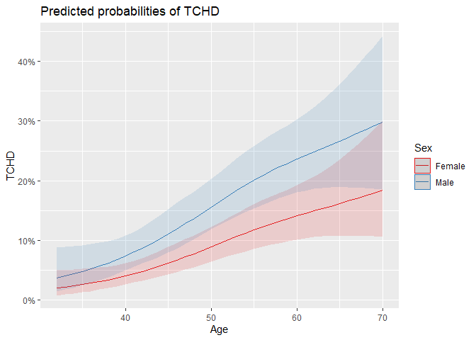

# The Second Circle: Logistic Regression, Part Three

<br/>
Jiří Fejlek

2025-06-20
<br/>

<br/> This last part concludes our presentation on applying logistic
regression to the Framingham Heart Study dataset. We will evaluate the
predictive performance of the models we created in Part Two. At the end,
we will also summarize and discuss our findings. <br/>

## Evaluating predictive ability (complete case model)

<br/> We begin by evaluating the model’s performance based on a complete
case analysis (i.e., with no missing data). In the previous part, we
considered the following logistic regression model of the probability of
**TCHD**. <br/>

``` r
framingham_complete <- framingham[rowSums(is.na(framingham)) == 0,]

full_model <- glm(TCHD  ~ Sex + rcs(Age,4) + Edu + rcs(Cig,4) + Meds + Stroke + Hyp + Diab + rcs(Chol,4) + rcs(SysP,4) + rcs(DiaP,4) + rcs(BMI,4) + rcs(Hrate,4) + rcs(Gluc,4) + Age:(Cig + Stroke + Hyp + Diab + Chol + SysP + DiaP + BMI + Hrate + Gluc) + Sex:(Cig + Stroke + Hyp + Diab + Chol + SysP + DiaP + BMI + Hrate + Gluc), family = binomial, framingham_complete)
full_model
```

    ## 
    ## Call:  glm(formula = TCHD ~ Sex + rcs(Age, 4) + Edu + rcs(Cig, 4) + 
    ##     Meds + Stroke + Hyp + Diab + rcs(Chol, 4) + rcs(SysP, 4) + 
    ##     rcs(DiaP, 4) + rcs(BMI, 4) + rcs(Hrate, 4) + rcs(Gluc, 4) + 
    ##     Age:(Cig + Stroke + Hyp + Diab + Chol + SysP + DiaP + BMI + 
    ##         Hrate + Gluc) + Sex:(Cig + Stroke + Hyp + Diab + Chol + 
    ##     SysP + DiaP + BMI + Hrate + Gluc), family = binomial, data = framingham_complete)
    ## 
    ## Coefficients:
    ##          (Intercept)               SexMale        rcs(Age, 4)Age  
    ##           -8.9135783            -1.9001221             0.1645302  
    ##      rcs(Age, 4)Age'      rcs(Age, 4)Age''                 Edu.L  
    ##           -0.0240404            -0.0277471            -0.0059854  
    ##                Edu.Q                 Edu.C        rcs(Cig, 4)Cig  
    ##            0.1738908             0.0151940             0.0297756  
    ##      rcs(Cig, 4)Cig'                 Meds1               Stroke1  
    ##           -0.0165686             0.1142713            -4.5126626  
    ##                 Hyp1                 Diab1      rcs(Chol, 4)Chol  
    ##           -0.4834114             2.4762574             0.0037282  
    ##    rcs(Chol, 4)Chol'    rcs(Chol, 4)Chol''      rcs(SysP, 4)SysP  
    ##            0.0031998             0.0049031             0.0045729  
    ##    rcs(SysP, 4)SysP'    rcs(SysP, 4)SysP''      rcs(DiaP, 4)DiaP  
    ##           -0.0798065             0.1987695             0.0144093  
    ##    rcs(DiaP, 4)DiaP'    rcs(DiaP, 4)DiaP''        rcs(BMI, 4)BMI  
    ##            0.1431788            -0.3415799            -0.0583376  
    ##      rcs(BMI, 4)BMI'      rcs(BMI, 4)BMI''    rcs(Hrate, 4)Hrate  
    ##            0.2652619            -0.7436953             0.0186034  
    ##  rcs(Hrate, 4)Hrate'  rcs(Hrate, 4)Hrate''      rcs(Gluc, 4)Gluc  
    ##           -0.1266756             0.3228554            -0.0109942  
    ##    rcs(Gluc, 4)Gluc'    rcs(Gluc, 4)Gluc''               Age:Cig  
    ##           -0.0183758             0.0732557             0.0000656  
    ##          Stroke1:Age              Hyp1:Age             Diab1:Age  
    ##            0.0879386             0.0184071            -0.0524525  
    ##             Age:Chol              Age:SysP              Age:DiaP  
    ##           -0.0001320             0.0004591            -0.0014561  
    ##              Age:BMI             Age:Hrate              Age:Gluc  
    ##           -0.0002104             0.0000253             0.0002576  
    ##          SexMale:Cig       SexMale:Stroke1          SexMale:Hyp1  
    ##           -0.0059053             0.4553840            -0.5313783  
    ##        SexMale:Diab1          SexMale:Chol          SexMale:SysP  
    ##            0.6458028             0.0037207             0.0107435  
    ##         SexMale:DiaP           SexMale:BMI         SexMale:Hrate  
    ##            0.0040304            -0.0194524             0.0068911  
    ##         SexMale:Gluc  
    ##           -0.0008810  
    ## 
    ## Degrees of Freedom: 3655 Total (i.e. Null);  3604 Residual
    ## Null Deviance:       3121 
    ## Residual Deviance: 2710  AIC: 2814

<br/> It is expected that this model will perform worse in predicting
the probability of **TCHD** for the new data. The following heuristic
van Houwelingen and le Cessie *shrinkage* estimate (J. C. Van
Houwelingen, and S. Le Cessie. Predictive value of statistical models.
Statistics in medicine 9.11 (1990): 1303-1325) can often estimate the
decrease in performance quite well. <br/>

``` r
a <- anova(glm(TCHD  ~ 1, family = binomial, framingham_complete), full_model)
(a$Deviance[2] - a$Df[2]) / a$Deviance[2]
```

    ## [1] 0.8757541

<br/> The shrinkage factor is 0.88. Thus, we expect the model to perform
approximately 12% worse on new data. The model overfits a bit too much
(rule of thumb is 10%, *F. E. Harrell. Regression modeling strategies:
with applications to linear models, logistic regression, and survival
analysis. Vol. 608. New York Springer, 2001.*).

To reduce overfitting somewhat, we recall that interactions appeared
largely insignificant. <br/>

``` r
no_inter_model <- glm(TCHD  ~ Sex + rcs(Age,4) + Edu + rcs(Cig,4) + Meds + Stroke + Hyp + Diab + rcs(Chol,4) + rcs(SysP,4) + rcs(DiaP,4) + rcs(BMI,4) + rcs(Hrate,4) + rcs(Gluc,4), family = binomial, framingham_complete)

lin_model <- glm(TCHD  ~ Sex + Age + Edu + Cig + Meds + Stroke + Hyp + Diab + Chol + SysP + DiaP + BMI + Hrate + Gluc, family = binomial, framingham_complete)


anova(no_inter_model,full_model)
```

    ## Analysis of Deviance Table
    ## 
    ## Model 1: TCHD ~ Sex + rcs(Age, 4) + Edu + rcs(Cig, 4) + Meds + Stroke + 
    ##     Hyp + Diab + rcs(Chol, 4) + rcs(SysP, 4) + rcs(DiaP, 4) + 
    ##     rcs(BMI, 4) + rcs(Hrate, 4) + rcs(Gluc, 4)
    ## Model 2: TCHD ~ Sex + rcs(Age, 4) + Edu + rcs(Cig, 4) + Meds + Stroke + 
    ##     Hyp + Diab + rcs(Chol, 4) + rcs(SysP, 4) + rcs(DiaP, 4) + 
    ##     rcs(BMI, 4) + rcs(Hrate, 4) + rcs(Gluc, 4) + Age:(Cig + Stroke + 
    ##     Hyp + Diab + Chol + SysP + DiaP + BMI + Hrate + Gluc) + Sex:(Cig + 
    ##     Stroke + Hyp + Diab + Chol + SysP + DiaP + BMI + Hrate + 
    ##     Gluc)
    ##   Resid. Df Resid. Dev Df Deviance Pr(>Chi)
    ## 1      3624     2727.7                     
    ## 2      3604     2710.1 20   17.673   0.6089

<br/> Thus, they are relatively safe to remove. A shrinkage estimate for
the model without interaction is <br/>

``` r
a <- anova(glm(TCHD  ~ 1, family = binomial, framingham_complete), no_inter_model)
(a$Deviance[2] - a$Df[2]) / a$Deviance[2]
```

    ## [1] 0.92108

<br/> much more acceptable. Consequently, We will consider the model
without interactions as our final model for predicting the probabilities
of **TCHD**. <br/>

``` r
final_model <- no_inter_model
```

### Prediction accuracy (percentage of correct predictions)

<br/> Let us start with evaluating the predictive performance of the
model. The most natural performance metric is the overall accuracy of
predictions. Let us evaluate it on the whole dataset. To do so, we first
select a probability threshold and then predict that a particular
subject will develop **CHD** in ten years if the estimated probability
exceeds the threshold.

First, we report the result of predictions as a so-called *confusion
table*, which splits the results into four categories: true positive,
false positive, true negative, and false negative. The overall
prediction accuracy is then the percentage of true positive and true
negative. <br/>

``` r
p_pred <- predict(final_model,type = 'response')
y_pred <- ifelse(p_pred < 0.5,0,1)
y <- as.numeric(framingham_complete$TCHD) - 1
conf_table <- xtabs( ~ y + y_pred)

# Confusion table
conf_table
```

    ##    y_pred
    ## y      0    1
    ##   0 3074   25
    ##   1  508   49

``` r
# Prediction accuracy
(conf_table[1,1] + conf_table[2,2])/ sum(conf_table)
```

    ## [1] 0.8542123

<br/> The overall accuracy is about 85%. One issue with the accuracy
metric is that it depends on the threshold. Let’s compare the accuracy
of predictions for various thresholds. <br/>

``` r
p_pred <- predict(final_model,type = 'response')
y <- as.numeric(framingham_complete$TCHD) - 1

tresh = seq(0.05,0.95,0.05)
acc <- numeric(19)
spec <- numeric(19)
sens <- numeric(19)

for (i in 1:19){
y_pred <- ifelse(p_pred < tresh[i],0,1)

conf_table <- xtabs( ~ y + y_pred)

acc[i] <- (conf_table[1,1] + conf_table[2,2])/ sum(conf_table)
}
plot(tresh,acc, type="l")
```

<!-- -->

<br/> We see that the accuracy peaks at about the aforementioned 85%.

There are some serious issues with using the overall accuracy as the
performance index. Accuracy is not a proper so-called *scoring rule*
(its value is not optimal for the true probability distribution of the
outcome). Thus, the model that maximizes the accuracy might not be the
one that correctly models the underlying probability distribution of the
outcomes. Accuracy ignores the uncertainty of predictions (it does not
care if the predicted probability of the outcome was 1%, 51%, or 99%; it
only cares whether the predicted outcome for a given threshold is
correct or not).

It is also misleading for imbalanced prevalence. Think of the dataset
with 99% negative results and 1% positive results. In such a dataset,
predicting only negative values reaches 99% accuracy. However, the
overall accuracy can yield weird recommendations, even for balanced data
(see <https://www.fharrell.com/post/class-damage/>, where a model that
ignored an important predictor had better accuracy).

The last issue we mention here is its dependence on the threshold. As we
will see later, a selection of the threshold is tied to making decisions
(and considering the cost of these decisions). In this context, the
prediction accuracy again may not be appropriate for a particular choice
of the cost of decisions (so-called *utility function*). <br/>

### Specificity & sensitivity, ROC curve

<br/> Since the prevalence heavily influences the accuracy, there are
two other popular metrics tied to the outcomes: specificity (true
negative rate) and sensitivity (true positive rate). <br/>

``` r
spec <- numeric(19)
sens <- numeric(19)

for (i in 1:19){
y_pred <- ifelse(p_pred < tresh[i],0,1)

conf_table <- xtabs( ~ y + y_pred)

spec[i] <- conf_table[1,1]/(conf_table[1,1] + conf_table[1,2])
sens[i] <- conf_table[2,2]/(conf_table[2,1] + conf_table[2,2])
}
```

<!-- --><!-- -->

<br/> We see that our model is not very sensitive; we need to choose a
relatively low threshold to detect the majority of positive cases (those
that actually developed **CHD**), which results in an overall high false
positive rate (low specificity). <br/>

``` r
y_pred <- ifelse(p_pred < 0.1,0,1)
conf_table <- xtabs( ~ y + y_pred)
conf_table 
```

    ##    y_pred
    ## y      0    1
    ##   0 1501 1598
    ##   1   88  469

<br/> Still, we predict about half of the negative cases (those that did
not develop *CHD* in ten years) correctly, which could make the model
still valuable enough for making decisions (see decision curve analysis
later in the text). This analysis provides an example of a typical
trade-off between sensitivity and specificity, often depicted for a
particular model of binary response using the ROC (Receiver Operating
Characteristic) curve. <br/>

<!-- -->

<br/> A diagonal line represents a model that predicts the outcome
randomly. The area under the ROC curve is another popular performance
metric for models of binary response / binary classifiers. We compute
the area under the ROC curve (denoted by *c*) using *val.prob* from the
*rms* package. <br/>

``` r
val.prob(p_pred,y,pl=FALSE)[2]
```

    ##   C (ROC) 
    ## 0.7467927

<br/> A value of *c* of 0.5 corresponds to random predictions, and a
value of 1 indicates perfect predictions (i.e., the model perfectly
separates positive and negative results). Generally, *c* \> 0.7 is
considered an acceptable predictive power.

The area under ROC is also known as the *concordance index*. The
concordance index is equal to the concordance probability: the
proportion of *permissible pairs* in the data (pairs that have different
outcomes) that are concordant (individuals with the higher predicted
probability experienced the event). It can be shown that the concordance
probability is equal to the area under the AUC curve. Another value
connected to *c* is Somers’ rank correlation $D_{xy}$ between predicted
probabilities and observed responses: $c =  \frac{(D_{xy} + 1)}{2}$.

*c*-index is another improper scoring rule (*S. Byrne. A note on the use
of empirical AUC for evaluating probabilistic forecasts. (2016):
380-393.*), and thus, *c* can give some weird results (*N. R. Cook. Use
and misuse of the receiver operating characteristic curve in risk
prediction. Circulation 115.7 (2007): 928-935.*). It is also a somewhat
insensitive metric (adding or removing significant predictors may not
change the value of *Dxy/c*), and thus, it is overall not sufficient for
comparing models. <br/>

### Strictly proper scoring rules (logarithmic score and Brier score)

<br/> We start with the logarithmic scoring rule (log loss):
$\sum y_i\mathrm{log}\,p_i + (1-y_i)\mathrm{log}\,(1-p_i)$. <br/>

``` r
ls <- sum(y*log(p_pred) + (1-y)*log(1-p_pred))
```

<br/> We observe that this is nothing but the log-likelihood of the
logistic model (i.e., this is the scoring rule that the logistic
regression coefficients maximize). <br/>

``` r
logLik(final_model)
```

    ## 'log Lik.' -1363.862 (df=32)

<br/> We used logarithmic scoring to compare nested models throughout
this presentation via a likelihood ratio test. Alternatively, we could
use Akaike information criterion which
$\mathrm{AIC} = 2k - 2\,\mathrm{log}\, L$. For example, using AIC to
compare our full model with the model without interactions, we would get
the difference <br/>

``` r
AIC(full_model) - AIC(no_inter_model)
```

    ## [1] 22.32666

<br/> which is significantly greater than 10, indicating that our full
model has essentially no support according to rule-of-thumbs from *K. P.
Burnham et al. Practical use of the information-theoretic approach.
Springer New York, 1998.* Log loss scoring rule and AIC can be used only
to compare models on a particular dataset. Their total value has little
meaning. Thus, another strictly proper scoring rule is commonly used,
the Brier score.

The Brier score is a mean square error between the observed outcomes (0
and 1) and the estimated probabilities. <br/>

``` r
mean((y-p_pred)^2)
```

    ## [1] 0.113778

<br/> There are two interesting values of estimated probabilities for
which we can compute the Brier score: 0.5 and the mean of the observed
outcome. <br/>

``` r
mean((y-0.5)^2)
```

    ## [1] 0.25

``` r
mean((y-mean(y))^2)
```

    ## [1] 0.1291411

<br/> The Brier score for “coin flip” predictions is always 0.25. The
second Brier score corresponds to predicting the outcome based on
overall prevalence. We see that our model is better than that.

The optimal value of the Brier score depends on the true distribution.
Consequently, the absolute value of the Brier score may be a bit
misleading, depending on the true distribution of the outcome; see *L
Hoessly. On misconceptions about the Brier score in binary prediction
models. arXiv preprint (2025).* Overall, the Brier score is easier to
interpret than log loss, and its values are somewhat comparable for
different models on different data sets, provided that the underlying
distribution is the same. <br/>

### Calibration

<br/> The predicted probabilities by the model should correspond to the
actual probabilities. Otherwise, the model might be too confident in its
predictions. Logistic regression models are typically well-calibrated
due to the use of optimization of the log scoring rule.

The simplest evaluation of calibration is to split data by predicted
probabilities (e.g., by deciles) and compare the observed mean estimated
probabilities vs the mean observed proportions. <br/>

``` r
quant <- ntile(p_pred, 10) 

pred_prob <- numeric(10)
obs_prob <- numeric(10)

for(i in 1:100){
  pred_prob[i] <- mean(p_pred[quant == i])
  obs_prob[i] <- mean(y[quant == i])
}
```

<!-- -->

<br/> We see that the points are near the diagonal. This plot depends on
the choice of binning. We could use the lowess method instead. <br/>

``` r
plot(lowess(p_pred, y, iter=0),type='l',col = 'red',xlab = 'Predicted probability',ylab = 'Observed probability')
abline(0,1)
```

<!-- -->

<br/> The evaluation metric for calibration uses a fit of the logistic
regression model on predicted probabilities. <br/>

``` r
glm(y~logit(p_pred),family = binomial)
```

    ## 
    ## Call:  glm(formula = y ~ logit(p_pred), family = binomial)
    ## 
    ## Coefficients:
    ##   (Intercept)  logit(p_pred)  
    ##     1.643e-08      1.000e+00  
    ## 
    ## Degrees of Freedom: 3655 Total (i.e. Null);  3654 Residual
    ## Null Deviance:       3121 
    ## Residual Deviance: 2728  AIC: 2732

<br/> Since we used a logistic model in the first place, this fit
naturally has a slope of one. On the new data, this slope would,
however, be different from one in general, indicating that the model may
no longer be as well calibrated on the new data.

We can obtain calibration plots and other performance indices by using
*val.prob*.  
<br/>

``` r
val.prob(p_pred,y)
```

<!-- -->

    ##           Dxy       C (ROC)            R2             D      D:Chi-sq 
    ##  4.935854e-01  7.467927e-01  1.774452e-01  1.071671e-01  3.928029e+02 
    ##           D:p             U      U:Chi-sq           U:p             Q 
    ##  0.000000e+00 -5.470460e-04 -9.094947e-13  1.000000e+00  1.077141e-01 
    ##         Brier     Intercept         Slope          Emax           E90 
    ##  1.137780e-01  1.650958e-08  1.000000e+00  3.814111e-02  9.596964e-03 
    ##          Eavg           S:z           S:p 
    ##  4.076230e-03 -2.447687e-02  9.804722e-01

### Decision curve analysis:

<br/> The previously mentioned performance and calibration indices did
not evaluate whether the model is actually any good for making
decisions. Decision curve analysis (*A. J. Vickers and E. B. Elkin.
Decision curve analysis: a novel method for evaluating prediction
models. Medical Decision Making 26.6 (2006): 565-574.*)

We consider a simple decision problem. Let the probability of the
condition (in our case **TCHD**) be $p$. We have four outcomes: true
positive, false positive (followed by treatment), and false negative,
true negative (followed by no treatment). Let the value of the outcomes
be $a, b, c$, and $d$, respectively. Threshold probability, when the
expected benefit of the treatment is equal to the expected benefit of
avoiding the treatment, meets $p_ta + (1-p_t)b = p_tc + (1-p_t)d$, i.e.,
$\frac{1-p_t}{p_t} = \frac{a-c}{d-b}$: $d-b$ is a consequence of being
treated unnecessarily (false positive result), $a − c$ is the
consequence of avoiding treatment (false negative result). Thus,
depending on our choice of ratio $\frac{a-c}{d-b}$ (consequence of false
positive and consequence of false negative), we select threshold
probability $p_t$.

Let $\hat{p}$ be the estimated probability of the condition using our
model. Let’s fix the consequence of false negative result as
$a - c = 1$, then the threshold probability $\hat{p}_t$ is given by the
consequence of the false positive result
$d-b = \frac{\hat{p}_t}{1-\hat{p}_t}$.

The net benefit for the threshold probability $\hat{p}_t$ estimated from
our data is (*A. J. Vickers and E. B. Elkin. Decision curve analysis: a
novel method for evaluating prediction models. Medical Decision Making
26.6 (2006): 565-574.*)
$$\mathrm{net \;benefit} = \frac{\mathrm{true \;positive \; count} (\hat{p}_t)}{n}  - \frac{\mathrm{false \;positive \; count }(\hat{p}_t)}{n}\frac{\hat{p}_t}{1-\hat{p}_t}$$
where true positive and false positive counts are evaluated based on the
threshold $\hat{p}_t$. <br/>

``` r
library(dcurves)
```

    ## Warning: package 'dcurves' was built under R version 4.4.3

``` r
dca_curve <- dca(y ~ p_pred,data = framingham_complete) 
dca_curve
```

<!-- -->

<br/> We see that between thresholds of 0-75 %, our model is uniformly
better for making decisions than a simple treat-all policy and
treat-none policy. Thus, it is not entirely useless for making decisions
and could be applied in practice.

We estimated the performance metrics on the complete data. Next, we need
to validate their values using cross-validation. <br/>

``` r
library(caret)

## Number of repetitions and folds
rep <- 100
folds <- 10

stats_cc <- matrix(NA,rep*folds,length(val.prob(p_pred,y,pl=FALSE)))
dca_obs_cc <- matrix(NA,rep*folds,200)
k <- 1  
  
for(j in 1:rep){
  
  d <- createFolds(seq(1,dim(framingham_complete)[1],1), k = folds)

  for(i in 1:folds){

    train_set <- framingham_complete[-unlist(d[i]),]
    test_set <- framingham_complete[unlist(d[i]),]

    model_new <- glm(TCHD  ~ Sex + rcs(Age,4) + Edu + rcs(Cig,4) + Meds + Stroke + Hyp + Diab + rcs(Chol,4) + rcs(SysP,4) + rcs(DiaP,4) + rcs(BMI,4) + rcs(Hrate,4) + rcs(Gluc,4), family = binomial, train_set)
    
    p_pred_new <- predict(model_new,test_set,type = 'response')
    y_new <- as.numeric(test_set$TCHD)-1
    
    stats_cc[k,] <- val.prob(p_pred_new,y_new,pl=FALSE)
    dca_new <- dca(y_new ~ p_pred_new,data = as.data.frame(y_new)) 
    dca_obs_cc[k,] <- t(dca_new$dca[c(1:100,201:300),'net_benefit'])
    k <- k + 1
  }
}
```

<br/> Let’s first compute the so-called discrimination and calibration
indices (*Emax* represents the maximum absolute distance between the
estimated calibration curve and the logit calibration curve). <br/>

``` r
colnames(stats_cc) <- names(val.prob(p_pred,y,pl=FALSE))
round(val.prob(p_pred,y,pl=FALSE)[c('Dxy','C (ROC)', 'Brier', 'Intercept', 'Slope','Emax')],4)
```

    ##       Dxy   C (ROC)     Brier Intercept     Slope      Emax 
    ##    0.4936    0.7468    0.1138    0.0000    1.0000    0.0381

<br/> We observe that the predicted c-index on new data is slightly
lower. Analogously, the Brier score estimate is a bit higher. The model
is also no longer perfectly calibrated. The value of the calibration
slope of 0.91 is slightly worse than our original estimate of shrinkage
at 0.92. Nevertheless, overall, the performance did not degrade much.
The estimated confidence intervals for the statistics are as follows
<br/>

``` r
apply(stats_cc,2,mean)[c('Dxy','C (ROC)', 'Brier', 'Intercept', 'Slope','Emax')]
```

    ##        Dxy    C (ROC)      Brier  Intercept      Slope       Emax 
    ##  0.4594208  0.7297104  0.1168838 -0.1456971  0.9103200  0.1848962

``` r
(apply(stats_cc,2,function(x) quantile(x[!is.na(x)],c(0.025,0.975))))[,c('Dxy','C (ROC)', 'Brier', 'Intercept', 'Slope','Emax')]
```

    ##             Dxy   C (ROC)      Brier  Intercept     Slope      Emax
    ## 2.5%  0.3198227 0.6599113 0.09608185 -0.7456175 0.5883624 0.0424555
    ## 97.5% 0.5860911 0.7930455 0.14064771  0.4734296 1.2871427 0.5459893

<br/> Let’s have a look at the DCA. <br/>

``` r
dca_results <- cbind(apply(dca_obs_cc[,101:200],2,mean),t(apply(dca_obs_cc[,101:200],2,function(x) quantile(x[!is.na(x)],c(0.025,0.975)))))

dca_results <- cbind(dca_results,apply(dca_obs_cc[,1:100],2,mean),dca_curve$dca[101:200,'net_benefit'],seq(0,0.99,0.01))
colnames(dca_results) <- c('nb_model','lb','ub','tall','tnone','threshold')

dca_results <- as.data.frame(dca_results)

ggplot(dca_results, aes(x = threshold)) + geom_line(data=dca_results, aes(x=threshold, y=tall),color = 'red',size = 1.1)+ geom_line(data=dca_results, aes(x=threshold, y=tnone),color = 'green',size = 1.1) + geom_line(data=dca_results, aes(x=threshold, y=nb_model),color = 'blue',size = 1.1) + geom_ribbon(data=dca_results,aes(ymin=lb,ymax=ub),alpha=0.1,color = 'blue',fill='blue') +  geom_ribbon(data=dca_results,aes(ymin=lb,ymax=ub),alpha=0.1,color = 'blue',fill='blue') + ylim(-0.05, 0.185) + xlim(0.00, 1.00) + ylab('Net benefit') + xlab('Threshold')
```

<!-- -->

<br/> We see that the expected net benefit of our model remains
uniformly better than the treat-all and treat-none policies. The blue
band plots the confidence intervals. One thing to note is that the plot
does not show the confidence band for treat-all policies (its net
benefit depends on prevalence). If we plot the difference of net
benefits between treat-all and our model, we get the following graph.
<br/>

``` r
dif <- dca_obs_cc[,1:100] - dca_obs_cc[,101:200]
dca_results <- cbind(dca_results, apply(dif,2,mean), t(apply(dif,2,function(x) quantile(x[!is.na(x)],c(0.025,0.975)))))
colnames(dca_results) <- c('nb_model','lb','ub','tall','tnone','threshold','mean_dif','dif_lb','dif_ub')
dca_results <- as.data.frame(dca_results)

ggplot(dca_results, aes(x = threshold)) + geom_line(data=dca_results, aes(x=threshold, y=tnone),color = 'green',size = 1.1) + geom_line(data=dca_results, aes(x=threshold, y=mean_dif),color = 'blue',size = 1.1) + geom_ribbon(data=dca_results,aes(ymin=dif_lb,ymax=dif_ub),alpha=0.1,color = 'blue',fill='blue') + xlim(0.00, 0.15) + ylim(-0.075, 0.01) + xlab('Threshold') + ylab('Net Gain: Treat All - Model')
```

<!-- -->

<br/> The confidence interval of the difference is much narrower, and
our model is superior to the treat-all policy at a threshold of
approximately 10% (i.e., the cost of avoiding treatment is nine times
higher than the cost of unnecessary treatment) and beyond. In our case,
it would be something like the cost of repeated routine medical checkups
(due to being considered a risk subject) vs. the cost of treating
developed **CHD**. <br/>

## Evaluating predictive ability (mean imputation)

<br/> Let us move on to the whole dataset with missing values. First, we
will consider the model with mean imputation of missing data. <br/>

``` r
framingham_mean_imp <- framingham
framingham_mean_imp[is.na(framingham$Meds),]$Meds <- framingham_mean_imp[3,]$Meds # level 0
framingham_mean_imp[is.na(framingham$Edu),]$Edu <- framingham_mean_imp[3,]$Edu # level 1
framingham_mean_imp[is.na(framingham$Hrate),]$Hrate <- mean(framingham$Hrate,na.rm = TRUE)
framingham_mean_imp[is.na(framingham$BMI),]$BMI <- mean(framingham$BMI,na.rm = TRUE)
framingham_mean_imp[is.na(framingham$Chol),]$Chol <- mean(framingham$Chol,na.rm = TRUE)
framingham_mean_imp[is.na(framingham$Cig),]$Cig <- mean(framingham$Cig[framingham$Smoker  == 1],na.rm = TRUE)
framingham_mean_imp[is.na(framingham$Gluc) & framingham$Diab == 0,]$Gluc <- mean(framingham$Gluc[framingham$Diab == 0],na.rm = TRUE)
framingham_mean_imp[is.na(framingham$Gluc) & framingham$Diab == 1,]$Gluc <- mean(framingham$Gluc[framingham$Diab == 1],na.rm = TRUE)

model_mean_imp <- glm(TCHD  ~ Sex + rcs(Age,4) + Edu + rcs(Cig,4) + Meds + Stroke + Hyp + Diab + rcs(Chol,4) + rcs(SysP,4) + rcs(DiaP,4) + rcs(BMI,4) + rcs(Hrate,4) + rcs(Gluc,4), family = binomial, framingham_mean_imp)
```

<br/> We already discussed all performance indices. Thus, let us move to
the evaluation <br/>

``` r
p_pred_imp <- predict(model_mean_imp,framingham_mean_imp,type = 'response')
y_all<- as.numeric(framingham$TCHD)-1
round(val.prob(p_pred_imp,y_all,pl=FALSE)[c('Dxy','C (ROC)', 'Brier', 'Intercept', 'Slope','Emax')],4)
```

    ##       Dxy   C (ROC)     Brier Intercept     Slope      Emax 
    ##    0.4775    0.7387    0.1144    0.0000    1.0000    0.0534

``` r
dca_curve <- dca(y_all ~ p_pred_imp,data = framingham_mean_imp) 
dca_curve
```

<!-- -->

<br/> We observe that our results are very similar to the complete case
model (the indices are just slightly worse due to considering missing
data). Let us cross-validate the result. <br/>

``` r
## Number of repetitions and folds
rep <- 100
folds <- 10

stats_meanimp <- matrix(NA,rep*folds,length(val.prob(p_pred,y,pl=FALSE)))
dca_obs_meanimp <- matrix(NA,rep*folds,200)
k <- 1  
  
for(j in 1:rep){
  
  d <- createFolds(seq(1,dim(framingham)[1],1), k = folds)

  for(i in 1:folds){

    train_set <- framingham[-unlist(d[i]),]
    test_set <- framingham[unlist(d[i]),]
    
  # Impute train set
  train_set[is.na(train_set$Meds),]$Meds <- train_set[3,]$Meds # level 0
  train_set[is.na(train_set$Edu),]$Edu <- train_set[3,]$Edu # level 1
  
  train_set[is.na(train_set$Hrate),]$Hrate <- mean(train_set$Hrate,na.rm = TRUE)
  train_set[is.na(train_set$BMI),]$BMI <- mean(train_set$BMI,na.rm = TRUE)
  train_set[is.na(train_set$Chol),]$Chol <- mean(train_set$Chol,na.rm = TRUE)
  
  train_set[is.na(train_set$Gluc) & train_set$Diab == 0,]$Gluc <- mean(train_set$Gluc[train_set$Diab == 0],na.rm = TRUE)
  train_set[is.na(train_set$Gluc) & train_set$Diab == 1,]$Gluc <- mean(train_set$Gluc[train_set$Diab == 1],na.rm = TRUE)
  train_set[is.na(train_set$Cig),]$Cig <- mean(train_set$Cig[train_set$Smoker  == 1],na.rm = TRUE)
  
  # Impute test set using train set
  test_set[is.na(test_set$Meds),]$Meds <- train_set[3,]$Meds # level 0
  test_set[is.na(test_set$Edu),]$Edu <- train_set[3,]$Edu # level 1
  
  test_set[is.na(test_set$Hrate),]$Hrate <- mean(train_set$Hrate,na.rm = TRUE)
  test_set[is.na(test_set$BMI),]$BMI <- mean(train_set$BMI,na.rm = TRUE)
  test_set[is.na(test_set$Chol),]$Chol <- mean(train_set$Chol,na.rm = TRUE)
  
  test_set[is.na(test_set$Gluc) & test_set$Diab == 0,]$Gluc <- mean(train_set$Gluc[train_set$Diab == 0],na.rm = TRUE)
  test_set[is.na(test_set$Gluc) & test_set$Diab == 1,]$Gluc <- mean(train_set$Gluc[train_set$Diab == 1],na.rm = TRUE)
  test_set[is.na(test_set$Cig),]$Cig <- mean(train_set$Cig[train_set$Smoker  == 1],na.rm = TRUE)
    

    model_new <- glm(TCHD  ~ Sex + rcs(Age,4) + Edu + rcs(Cig,4) + Meds + Stroke + Hyp + Diab + rcs(Chol,4) + rcs(SysP,4) + rcs(DiaP,4) + rcs(BMI,4) + rcs(Hrate,4) + rcs(Gluc,4), family = binomial, train_set)
    
    p_pred_new <- predict(model_new,test_set,type = 'response')
    y_new <- as.numeric(test_set$TCHD)-1
    
    stats_meanimp[k,] <- val.prob(p_pred_new,y_new,pl=FALSE)
    dca_new <- dca(y_new ~ p_pred_new,data = as.data.frame(y_new)) 
    dca_obs_meanimp[k,] <- t(dca_new$dca[c(1:100,201:300),'net_benefit'])
    k <- k + 1
  }
}
```

<br/> We see that the estimates based on the new data are again
degraded, similar to those in the complete case analysis. <br/>

    ##       Dxy   C (ROC)     Brier Intercept     Slope      Emax 
    ##    0.4775    0.7387    0.1144    0.0000    1.0000    0.0534

    ##        Dxy    C (ROC)      Brier  Intercept      Slope       Emax 
    ##  0.4472482  0.7236241  0.1170616 -0.1383267  0.9148410  0.1832099

    ##             Dxy   C (ROC)      Brier  Intercept    Slope       Emax
    ## 2.5%  0.3254944 0.6627472 0.09734071 -0.7511737 0.604647 0.04015378
    ## 97.5% 0.5760956 0.7880478 0.13881821  0.4596812 1.278341 0.51688267

<!-- -->

## Evaluating predictive ability (multivariate single imputation)

<br/> Validating multivariate single/multiple imputations via chained
equations is a bit more involved (multiple imputations were initially
intended for inference and not predictions). We observed this by
noticing that the *mice* package does not even have *predict*
functionality. The core difficulty with using the multiple imputation
method for prediction with missing data is that the imputation models
used in multiple imputations include the response variable. The value of
the response variable is naturally not known for new observations. Thus,
the chained equations performed on the original data sets are not
directly applicable.

A way around this is to run a new multiple imputation algorithm using
the original dataset and the new observations to impute the missing
values of the predictors, see *B. JA Mertens, E. Banzato, and L. C. de
Wreede. Construction and assessment of prediction rules for binary
outcome in the presence of missing predictor data using multiple
imputation and cross‐validation: Methodological approach and data‐based
evaluation.” Biometrical Journal 62.3 (2020): 724-74 * how to
cross-validate such procedure. Of course, an unpleasant consequence of
this approach is that obtaining a new prediction is quite
computationally expensive.

Let us first evaluate the performance of the multivariate single
imputation model on the whole dataset. <br/>

``` r
library(mice)

framingham_ext <- model.matrix(lm(log(Age) ~ TCHD + Sex + rcs(Age,4) + Smoker + Stroke + Hyp + Diab + rcs(SysP,4) + rcs(DiaP,4) + Age:Stroke + Age:Hyp + Age:Diab + Age:SysP + Age:DiaP + Sex:Stroke + Sex:Hyp + Sex:Diab + Sex:SysP + Sex:DiaP, data = framingham))
framingham_ext <- cbind(framingham_ext[,-c(1,17)],framingham$Hrate,framingham$BMI,framingham$Cig,framingham$Chol,framingham$Meds,framingham$Edu,framingham$Gluc)

colnames(framingham_ext) <- c('TCHD','Sex','Age1','Age2','Age3','Smoker','Stroke','Hyp','Diab','SysP1','SysP2','SysP3','DiaP1','DiaP2','DiaP3','AgeStroke','AgeHyp','AgeDiab','AgeSysP','AgeDiaP','SexStroke','SexHyp','SexDiab','SexSysP','SexDiaP','Hrate1','BMI1','Cig1','Chol1','Meds','Edu','Gluc1')

framingham_ext <- as_tibble(framingham_ext)


Hrate_rcs <- rcs(framingham_ext$Hrate1,4)
BMI_rcs <- rcs(framingham_ext$BMI1,4)
Cig_rcs <- rcs(framingham_ext$Cig1,4)
Chol_rcs <- rcs(framingham_ext$Chol1,4)
Gluc_rcs <- rcs(framingham_ext$Gluc1,4)

framingham_ext <- framingham_ext %>% add_column(Hrate2 = as.numeric(Hrate_rcs[,2])) %>% add_column(Hrate3 = as.numeric(Hrate_rcs[,3])) %>% add_column(BMI2 = as.numeric(BMI_rcs[,2])) %>% add_column(BMI3 = as.numeric(BMI_rcs[,3])) %>% add_column(Cig2 = as.numeric(Cig_rcs[,2])) %>% add_column(Chol2 = as.numeric(Chol_rcs[,2])) %>% add_column(Chol3 = as.numeric(Chol_rcs[,3])) %>% add_column(Gluc2 = as.numeric(Gluc_rcs[,2])) %>% add_column(Gluc3 = as.numeric(Gluc_rcs[,3]))

framingham_ext <- framingham_ext %>% 
  add_column(AgeHrate = framingham_ext$Age1*framingham_ext$Hrate1) %>% 
  add_column(AgeBMI = framingham_ext$Age1*framingham_ext$BMI1) %>% 
  add_column(AgeCig = framingham_ext$Age1*framingham_ext$Cig1) %>% 
  add_column(AgeChol = framingham_ext$Age1*framingham_ext$Chol1) %>% 
  add_column(AgeGluc = framingham_ext$Age1*framingham_ext$Gluc1) %>% 
  add_column(SexHrate = framingham_ext$Sex*framingham_ext$Hrate1) %>% 
  add_column(SexBMI = framingham_ext$Sex*framingham_ext$BMI1) %>% 
  add_column(SexCig = framingham_ext$Sex*framingham_ext$Cig1) %>% 
  add_column(SexChol = framingham_ext$Sex*framingham_ext$Chol1) %>% 
  add_column(SexGluc = framingham_ext$Sex*framingham_ext$Gluc1)


framingham_ext$TCHD <- factor(framingham_ext$TCHD)
framingham_ext$Sex <- factor(framingham_ext$Sex)
framingham_ext$Smoker <- factor(framingham_ext$Smoker)
framingham_ext$Stroke <- factor(framingham_ext$Stroke)
framingham_ext$Hyp <- factor(framingham_ext$Hyp)
framingham_ext$Diab <- factor(framingham_ext$Diab)
framingham_ext$SexStroke <- factor(framingham_ext$SexStroke)
framingham_ext$SexHyp <- factor(framingham_ext$SexHyp)
framingham_ext$SexDiab <- factor(framingham_ext$SexDiab)
framingham_ext$Meds <- factor(framingham_ext$Meds)
framingham_ext$Edu  <- factor(framingham_ext$Edu, ordered = TRUE)

ini <- mice(framingham_ext, m = 1, maxit = 0)
meth <-ini$method

meth["Hrate2"] <- "~rcspline.eval(Hrate1,knots = attributes(Hrate_rcs)$parms,inclx = TRUE)[,2]"
meth["Hrate3"] <- "~rcspline.eval(Hrate1,knots = attributes(Hrate_rcs)$parms,inclx = TRUE)[,3]"
meth["BMI2"] <- "~rcspline.eval(BMI1,knots = attributes(BMI_rcs)$parms,inclx = TRUE)[,2]"
meth["BMI3"] <- "~rcspline.eval(BMI1,knots = attributes(BMI_rcs)$parms,inclx = TRUE)[,3]"
meth["Cig2"] <- "~rcspline.eval(Cig1,knots = attributes(Cig_rcs)$parms,inclx = TRUE)[,2]"
meth["Chol2"] <- "~rcspline.eval(Chol1,knots = attributes(Chol_rcs)$parms,inclx = TRUE)[,2]"
meth["Chol3"] <- "~rcspline.eval(Chol1,knots = attributes(Chol_rcs)$parms,inclx = TRUE)[,3]"
meth["Gluc2"] <- "~rcspline.eval(Gluc1,knots = attributes(Gluc_rcs)$parms,inclx = TRUE)[,2]"
meth["Gluc3"] <- "~rcspline.eval(Gluc1,knots = attributes(Gluc_rcs)$parms,inclx = TRUE)[,3]"

meth["AgeHrate"] <- "~I(Age1*Hrate1)"
meth["AgeBMI"] <- "~I(Age1*BMI1)"
meth["AgeCig"] <- "~I(Age1*Cig1)"
meth["AgeChol"] <- "~I(Age1*Chol1)"
meth["AgeGluc"] <- "~I(Age1*Gluc1)"


meth["SexHrate"] <- "~I((as.numeric(Sex)-1)*Hrate1)"
meth["SexBMI"] <- "~I((as.numeric(Sex)-1)*BMI1)"
meth["SexCig"] <- "~I((as.numeric(Sex)-1)*Cig1)"
meth["SexChol"] <- "~I((as.numeric(Sex)-1)*Chol1)"
meth["SexGluc"] <- "~I((as.numeric(Sex)-1)*Gluc1)"

pred <- quickpred(framingham_ext,mincor = 0.10)

pred["Hrate1",c("Hrate2","Hrate3","AgeHrate","SexHrate")] <- 0
pred["BMI1",c("BMI2","BMI3","AgeBMI","SexBMI")] <- 0
pred["Cig1",c("Cig2","AgeCig","SexCig")] <- 0
pred["Chol1",c("Chol2","Chol3","AgeChol","SexChol")] <- 0
pred["Gluc1",c("Gluc2","Gluc3","AgeGluc","SexGluc")] <- 0

imp <- mice(framingham_ext, pred = pred,meth = meth, m = 1, maxit = 10, seed = 123)

complete_data <- complete(imp,1)
complete_data <- complete_data[,c("TCHD","Sex","Age1","Smoker","Stroke","Hyp","Diab","SysP1","DiaP1","Hrate1","BMI1","Cig1","Chol1","Meds","Edu","Gluc1")]
colnames(complete_data) <-c("TCHD","Sex","Age","Smoker","Stroke","Hyp","Diab","SysP","DiaP","Hrate","BMI","Cig","Chol","Meds","Edu","Gluc")
```

``` r
model_mvar_imp <- glm(TCHD  ~ Sex + rcs(Age,4) + Edu + rcs(Cig,4) + Meds + Stroke + Hyp + Diab + rcs(Chol,4) + rcs(SysP,4) + rcs(DiaP,4) + rcs(BMI,4) + rcs(Hrate,4) + rcs(Gluc,4), family = binomial, complete_data)
p_pred_mimp <- predict(model_mvar_imp,complete_data,type = 'response')
y_all<- as.numeric(framingham$TCHD)-1
round(val.prob(p_pred_mimp,y_all,pl=FALSE)[c('Dxy','C (ROC)', 'Brier', 'Intercept', 'Slope','Emax')],4)
```

    ##       Dxy   C (ROC)     Brier Intercept     Slope      Emax 
    ##    0.4794    0.7397    0.1142    0.0000    1.0000    0.0584

``` r
dca_curve <- dca(y_all ~ p_pred_mimp,data = complete_data) 
dca_curve
```

<!-- -->

<br/> The performance indices and DCA are, again, quite similar to those
of other models.

We will simplify the cross-validation a bit. We will perform one single
imputation in each split: a fold corresponding to the new data will have
an outcome variable missing, instead of doing a separate imputation for
each single observation of the ‘new data’ fold with some missing
predictors (which more accurately represents the actual process of the
prediction of a new observation).

In practice, we should also repeat this imputation multiple times and
pool the predictions. *B. JA Mertens, E. Banzato, and L. C. de Wreede.
Construction and assessment of prediction rules for binary outcome in
the presence of missing predictor data using multiple imputation and
cross‐validation: Methodological approach and data‐based evaluation.”
Biometrical Journal 62.3 (2020): 724-7* recommends 1000 imputations to
obtain accurate predictions with minimal variations due to the influence
of imputation. We are not cross-validating *that* … We should mention
that these “drastic” numbers of repetitions are required on a level of
estimating the variance of individual predictions and do not seem to be
required for validation of overall metrics such as the Brier score. We
should also note that a lower number of imputations leads to a greater
variance in predictions due to the imputation process, and thus, it
should generally lead to lower predictive performance, i.e., a higher
value of the Brier score than could be obtained by pooling more
imputations. <br/>

``` r
set.seed(123) # for reproducibility

rep <- 100
folds <- 10

stats_mimp <- matrix(NA,rep*folds,length(val.prob(p_pred,y,pl=FALSE)))
dca_obs_mimp <- matrix(NA,rep*folds,200)
k <- 1  
  
for(j in 1:rep){
  
  d <- createFolds(seq(1,dim(framingham)[1],1), k = folds)

  for(i in 1:folds){
    
    train_set <- framingham[-unlist(d[i]),]
    test_set <- framingham[unlist(d[i]),]
    
    test_set_nan <- test_set
    test_set_nan$TCHD <- NaN
    
    test_train <-  rbind(train_set,test_set_nan)
    
    test_train_ext <- model.matrix(lm(log(Age) ~ Sex + rcs(Age,4) + Smoker + Stroke + Hyp + Diab + rcs(SysP,4) + rcs(DiaP,4) + Age:Stroke + Age:Hyp + Age:Diab + Age:SysP + Age:DiaP + Sex:Stroke + Sex:Hyp + Sex:Diab + Sex:SysP + Sex:DiaP, data = test_train))
    
     test_train_ext <- cbind(test_train_ext[,-c(1,16)],test_train$TCHD,test_train$Hrate,test_train$BMI,test_train$Cig,test_train$Chol,test_train$Meds,test_train$Edu,test_train$Gluc)
     
     colnames(test_train_ext) <- c('Sex','Age1','Age2','Age3','Smoker','Stroke','Hyp','Diab','SysP1','SysP2','SysP3','DiaP1','DiaP2','DiaP3','AgeStroke','AgeHyp','AgeDiab','AgeSysP','AgeDiaP','SexStroke','SexHyp','SexDiab','SexSysP','SexDiaP','TCHD','Hrate1','BMI1','Cig1','Chol1','Meds','Edu','Gluc1')
     
     
     test_train_ext <- as_tibble(test_train_ext)
     
     Hrate_rcs <- rcs(test_train_ext$Hrate1,4)
     BMI_rcs <- rcs(test_train_ext$BMI1,4)
     Cig_rcs <- rcs(test_train_ext$Cig1,4)
     Chol_rcs <- rcs(test_train_ext$Chol1,4)
     Gluc_rcs <- rcs(test_train_ext$Gluc1,4)
     
     test_train_ext <- test_train_ext %>% add_column(Hrate2 = as.numeric(Hrate_rcs[,2])) %>% add_column(Hrate3 = as.numeric(Hrate_rcs[,3])) %>% add_column(BMI2 = as.numeric(BMI_rcs[,2])) %>% add_column(BMI3 = as.numeric(BMI_rcs[,3])) %>% add_column(Cig2 = as.numeric(Cig_rcs[,2])) %>% add_column(Chol2 = as.numeric(Chol_rcs[,2])) %>% add_column(Chol3 = as.numeric(Chol_rcs[,3])) %>% add_column(Gluc2 = as.numeric(Gluc_rcs[,2])) %>% add_column(Gluc3 = as.numeric(Gluc_rcs[,3]))
     
     test_train_ext <- test_train_ext %>% 
  add_column(AgeHrate = test_train_ext$Age1*test_train_ext$Hrate1) %>% 
  add_column(AgeBMI = test_train_ext$Age1*test_train_ext$BMI1) %>% 
  add_column(AgeCig = test_train_ext$Age1*test_train_ext$Cig1) %>% 
  add_column(AgeChol = test_train_ext$Age1*test_train_ext$Chol1) %>% 
  add_column(AgeGluc = test_train_ext$Age1*test_train_ext$Gluc1) %>% 
  add_column(SexHrate = test_train_ext$Sex*test_train_ext$Hrate1) %>% 
  add_column(SexBMI = test_train_ext$Sex*test_train_ext$BMI1) %>% 
  add_column(SexCig = test_train_ext$Sex*test_train_ext$Cig1) %>% 
  add_column(SexChol = test_train_ext$Sex*test_train_ext$Chol1) %>% 
  add_column(SexGluc = test_train_ext$Sex*test_train_ext$Gluc1)
     
  test_train_ext$TCHD <- factor(test_train_ext$TCHD)
  test_train_ext$Sex <- factor(test_train_ext$Sex)
  test_train_ext$Smoker <- factor(test_train_ext$Smoker)
  test_train_ext$Stroke <- factor(test_train_ext$Stroke)
  test_train_ext$Hyp <- factor(test_train_ext$Hyp)
  test_train_ext$Diab <- factor(test_train_ext$Diab)
  test_train_ext$SexStroke <- factor(test_train_ext$SexStroke)
  test_train_ext$SexHyp <- factor(test_train_ext$SexHyp)
  test_train_ext$SexDiab <- factor(test_train_ext$SexDiab)
  test_train_ext$Meds <- factor(test_train_ext$Meds)
  test_train_ext$Edu  <- factor(test_train_ext$Edu, ordered = TRUE)
  
  
   ini_new <- mice(test_train_ext, m = 1, maxit = 0)
  meth_new <-ini_new$method
     
  meth_new["Hrate2"] <- "~rcspline.eval(Hrate1,knots = attributes(Hrate_rcs)$parms,inclx = TRUE)[,2]"
  meth_new["Hrate3"] <- "~rcspline.eval(Hrate1,knots = attributes(Hrate_rcs)$parms,inclx = TRUE)[,3]"
  meth_new["BMI2"] <- "~rcspline.eval(BMI1,knots = attributes(BMI_rcs)$parms,inclx = TRUE)[,2]"
  meth_new["BMI3"] <- "~rcspline.eval(BMI1,knots = attributes(BMI_rcs)$parms,inclx = TRUE)[,3]"
  meth_new["Cig2"] <- "~rcspline.eval(Cig1,knots = attributes(Cig_rcs)$parms,inclx = TRUE)[,2]"
  meth_new["Chol2"] <- "~rcspline.eval(Chol1,knots = attributes(Chol_rcs)$parms,inclx = TRUE)[,2]"
  meth_new["Chol3"] <- "~rcspline.eval(Chol1,knots = attributes(Chol_rcs)$parms,inclx = TRUE)[,3]"
  meth_new["Gluc2"] <- "~rcspline.eval(Gluc1,knots = attributes(Gluc_rcs)$parms,inclx = TRUE)[,2]"
  meth_new["Gluc3"] <- "~rcspline.eval(Gluc1,knots = attributes(Gluc_rcs)$parms,inclx = TRUE)[,3]"
  
  meth_new["AgeHrate"] <- "~I(Age1*Hrate1)"
  meth_new["AgeBMI"] <- "~I(Age1*BMI1)"
  meth_new["AgeCig"] <- "~I(Age1*Cig1)"
  meth_new["AgeChol"] <- "~I(Age1*Chol1)"
  meth_new["AgeGluc"] <- "~I(Age1*Gluc1)"
  
  meth_new["SexHrate"] <- "~I((as.numeric(Sex)-1)*Hrate1)"
  meth_new["SexBMI"] <- "~I((as.numeric(Sex)-1)*BMI1)"
  meth_new["SexCig"] <- "~I((as.numeric(Sex)-1)*Cig1)"
  meth_new["SexChol"] <- "~I((as.numeric(Sex)-1)*Chol1)"
  meth_new["SexGluc"] <- "~I((as.numeric(Sex)-1)*Gluc1)"
  
  pred_new <- quickpred(test_train_ext,mincor = 0.10)
  pred_new["Hrate1",c("Hrate2","Hrate3","AgeHrate","SexHrate")] <- 0
  pred_new["BMI1",c("BMI2","BMI3","AgeBMI","SexBMI")] <- 0
  pred_new["Cig1",c("Cig2","AgeCig","SexCig")] <- 0
  pred_new["Chol1",c("Chol2","Chol3","AgeChol","SexChol")] <- 0
  pred_new["Gluc1",c("Gluc2","Gluc3","AgeGluc","SexGluc")] <- 0
  
  imp_new <- mice(test_train_ext, pred = pred_new,meth = meth_new, m = 1, maxit = 10)
  complete_data_new <- complete(imp_new,1)   
  
  complete_data_new <- complete_data_new[,c("TCHD","Sex","Age1","Smoker","Stroke","Hyp","Diab","SysP1","DiaP1","Hrate1","BMI1","Cig1","Chol1","Meds","Edu","Gluc1")]
  colnames(complete_data_new) <-c("TCHD","Sex","Age","Smoker","Stroke","Hyp","Diab","SysP","DiaP","Hrate","BMI","Cig","Chol","Meds","Edu","Gluc")
  
  train_set_full <- complete_data_new[1:dim(train_set)[1],]
  test_set_full <- complete_data_new[-(1:dim(train_set)[1]),]
  
   model_mvar_imp_new <- glm(TCHD  ~ Sex + rcs(Age,4) + Edu + rcs(Cig,4) + Meds + Stroke + Hyp + Diab + rcs(Chol,4) + rcs(SysP,4) + rcs(DiaP,4) + rcs(BMI,4) + rcs(Hrate,4) + rcs(Gluc,4), family = binomial, train_set_full)
   
   
    p_pred_new <- predict(model_mvar_imp_new,test_set_full,type = 'response')
    y_new <- as.numeric(test_set$TCHD)-1
    
    stats_mimp[k,] <- val.prob(p_pred_new,y_new,pl=FALSE)
    dca_new <- dca(y_new ~ p_pred_new,data = as.data.frame(y_new)) 
    dca_obs_mimp[k,] <- t(dca_new$dca[c(1:100,201:300),'net_benefit'])
    k <- k + 1
  }
  }
```

    ##       Dxy   C (ROC)     Brier Intercept     Slope      Emax 
    ##    0.4794    0.7397    0.1142    0.0000    1.0000    0.0584

    ##        Dxy    C (ROC)      Brier  Intercept      Slope       Emax 
    ##  0.4470225  0.7235112  0.1170760 -0.1410433  0.9125041  0.1795113

    ##             Dxy   C (ROC)     Brier  Intercept     Slope       Emax
    ## 2.5%  0.3208499 0.6604249 0.0972325 -0.7316192 0.5962351 0.04091871
    ## 97.5% 0.5659069 0.7829535 0.1365373  0.4815250 1.2675603 0.52144616

    ## Warning: Removed 80 rows containing missing values or values outside the scale range
    ## (`geom_line()`).

<!-- -->

<br/> We achieve a similar overall performance on the new data compared
to mean imputation. Of course, if we were interested in accurate
individual probability predictions, the chained equation approach would
be superior, as it does not disrupt the relationships between the
predictors and the outcome variables as much as mean imputation. <br/>

## Conclusions

<br/> In this project, we created a logistic regression model to predict
the probability of developing coronary heart disease (CHT) in 10 years
using the dataset
<https://www.kaggle.com/datasets/dileep070/heart-disease-prediction-using-logistic-regression/data>
based on Framingham Heart Study. Since the dataset contain some missing
entries, we repeated the analysis, ignoring the missing data, and then
we used imputation methods: mean imputation, multivariate single
imputation, and multivariate multiple imputation. Our results were
overall similar regardless of the method used.

Let’s discuss the predictors that seemed to be the most important in the
model. Concerning the effect of **Age** and **Sex**, **Age** is a
naturally important factor in predicting the likelihood of developing
CHT. The risk of developing CHT before the age of 40 years is low, and
the cumulative risk increases with age (*D. M. Lloyd-Jones et
al. Lifetime risk of developing coronary heart disease. The Lancet
353.9147 (1999): 89-92.*). It is also well-established observation that
women tend to develop CHT older (*A.H.E.M. Maas and Y. E. A. Appelman.
Gender differences in coronary heart disease.” Netherlands Heart Journal
18 (2010): 598-603*) than men (the difference is about 10 years). Risk
factors involving coronary heart disease except female hormonal status
seem largely the same for both genders *R. van Lennep, E. Jeanine, et
al. Risk factors for coronary heart disease: implications of gender.
Cardiovascular research 53.3 (2002): 538-549*, although their impact may
differ (*L. Pilote et al. A comprehensive view of sex-specific issues
related to cardiovascular disease.” Cmaj 176.6 (2007): S1-S44*). <br/>

    ## Warning: package 'sjPlot' was built under R version 4.4.3

<!-- --><!-- --><!-- -->

<br/> As far as the effect of smoking is concerned, the Framingham Heart
Study has demonstrated that smoking is a significant risk factor for
various cardiovascular diseases (*K.B. Filion, Kristian and R. V.
Luepker. Cigarette smoking and cardiovascular disease: lessons from
Framingham. Global heart 8.1 (2013): 35-41.*) Thus, quite expectedly, we
observed this effect in our model as well. <br/>

<!-- -->

<br/> Systolic and diastolic blood pressure both predict coronary heart
disease (*A. C. Flint et al. Effect of systolic and diastolic blood
pressure on cardiovascular outcomes. New England Journal of Medicine
381.3 (2019): 243-251*), though systolic blood pressure is considered to
be more strong predictor (*J. Stamler, J. D. Neaton, and D. N.
Wentworth. Blood pressure (systolic and diastolic) and risk of fatal
coronary heart disease. Hypertension 13.5_supplement (1989): I2.*)

An interesting observation is an apparent “J-shaped” dependency on
diastolic blood pressure, which was the only nonlinear trend strongly
observed in the data. This is not an unfamiliar concept (e.g., *W. B.
Kannel et al. “A likely explanation for the J-curve of blood pressure
cardiovascular risk. The American journal of cardiology 94.3 (2004):
380-384*, *M. Banach and W. S. Aronow. Blood pressure j-curve: current
concepts. Current hypertension reports 14 (2012): 556-566.*, and *B.
Gaffney et al. The diastolic blood pressure J-curve in hypertension
management: links and risk for cardiovascular disease.” Integrated blood
pressure control (2021): 179-187.*). The consensus nowadays seems to be
that this apparent J-curve is the result of confounding and reverse
causation (i.e., low blood pressure can indicate a high-risk state
caused by other comorbidities), and it is highly unlikely to reflect a
causal process (*J. McEvoy et al. 2024 ESC Guidelines for the management
of elevated blood pressure and hypertension: Developed by the task force
on the management of elevated blood pressure and hypertension of the
European Society of Cardiology (ESC) and endorsed by the European
Society of Endocrinology (ESE) and the European Stroke Organisation
(ESO). European heart journal 45.38 (2024): 3912-4018.*). <br/>

<!-- --><!-- -->

<br/> Another significant predictor in the model was **Cholesterol**.
This is another important risk factor that the Framingham Heart Study
helped to solidly establish (*D. Steinberg. The cholesterol wars: the
skeptics vs the preponderance of evidence. Elsevier, 2011.*) <br/>

<!-- -->

<br/> The last significant predictor, according to our model, is
*Glucose*. Diabetes (one of the most prevalent causes of hyperglycemia)
was identified as a risk factor for developing cardiovascular heart
disease again using the data from the Framingham Heart Study (*W. B.
Kannel, and D. L. McGee. Diabetes and cardiovascular risk factors: the
Framingham study. Circulation 59.1 (1979): 8-13.*). However, chronic
hyperglycemia is an important risk factor for both individuals with
diabetes and nondiabetic individuals (*E. Selvin et al. Glycemic control
and coronary heart disease risk in persons with and without diabetes:
the atherosclerosis risk in communities study. Archives of internal
medicine 165.16 (2005): 1910-1916.* and *C. T. Rentsch et
al. Sex-specific risks for cardiovascular disease across the glycaemic
spectrum: a population-based cohort study using the UK Biobank. The
Lancet Regional Health–Europe 32 (2023).*). <br/>

<!-- -->

<br/> Overall, the significant predictors identified in our model are in
line with established risk factors for developing cardiovascular heart
disease. As far as the predictive performance of our model is concerned,
our model is relatively weak for outcome predictions (especially in
terms of sensitivity). However, we demonstrated through decision curve
analysis that even such a model can be helpful in practice for making
informed decisions.

With that conclusion, we leave The Second Circle: Logistic Regression
(and imputation to some extent). <br/>
