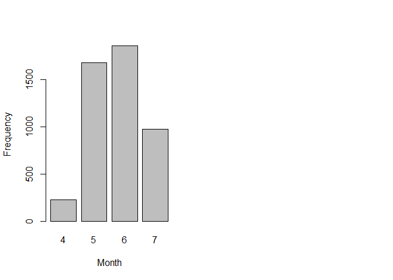
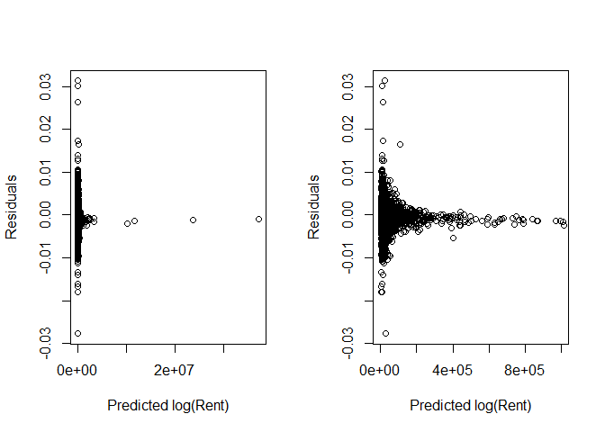
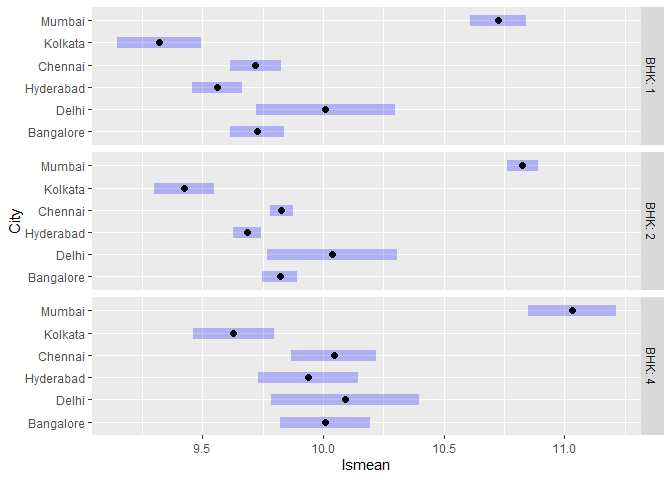
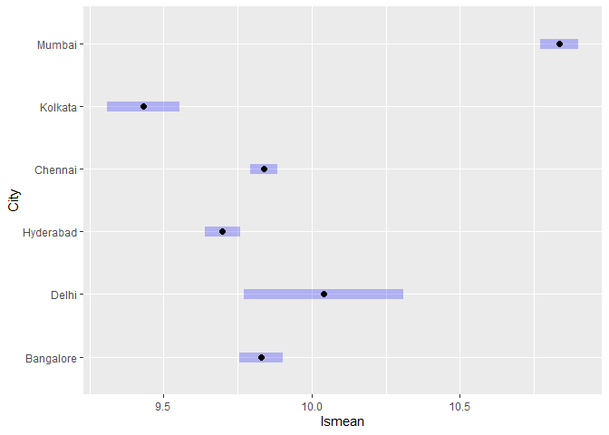
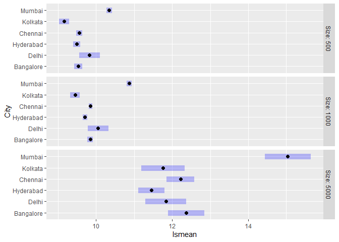
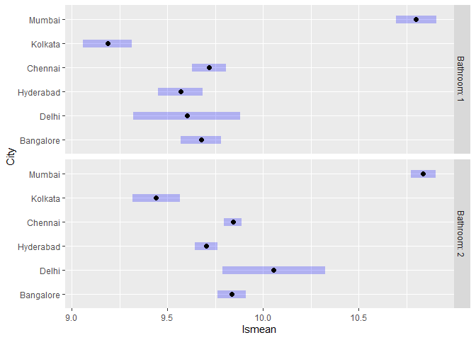

# The Seventh Circle: Quantile Regression

<br/>
Jiří Fejlek

2025-10-6
<br/>

- [Initial Data Exploration](#initial-data-exploration)
- [Linear regression model](#linear-regression-model)
  - [Initial fit](#initial-fit)
  - [Box-Cox transformation and log-linear
    model](#box-cox-transformation-and-log-linear-model)
- [Generalized linear models](#generalized-linear-models)
  - [Gaussian model with log-link](#gaussian-model-with-log-link)
  - [Quasi-Poisson GLM](#quasi-poisson-glm)
  - [Gamma model with log-link](#gamma-model-with-log-link)
  - [Inverse Gaussian model with
    log-link](#inverse-gaussian-model-with-log-link)
- [Quantile regression](#quantile-regression)
  - [Fit](#fit)
  - [Inference](#inference)
  - [Predictions](#predictions)
- [Validation](#validation)
- [Conclusion](#conclusion)
- [References](#references)

<br/> This project focuses on quantile regression. In addition, we will
also demonstrate the use of several generalized linear models: the
log-linear, gamma, and inverse Gaussian models. The uniting theme of
these models is dealing with data that is skewed towards more extreme
values of the response, which often makes the plain linear regression
model inappropriate.

The dataset we will use for the demonstration consists of rental rates
for over 4,000 residential properties in India during the spring/summer
of 2022. <br/>

## Initial Data Exploration

<br/> The dataset was initially posted on
<https://www.kaggle.com/datasets/iamsouravbanerjee/house-rent-prediction-dataset>
and was sourced from <https://www.magicbricks.com/>. The dataset
contains the following variables. <br/>

- **BHK** - number of bedrooms, halls, kitchens
- **Rent** - rent
- **Size** - size in square feet
- **Floor** - houses/apartments/flats situated on which floor and the
  total number of floors
- **Area Type** - size calculated on either the super area, carpet area,
  or build area
- **Area Locality** - locality
- **City** - city
- **Furnishing Status** - furnishing status, whether it is furnished,
  semi-furnished, or unfurnished.
- **Tenant Preferred** - type of tenant preferred by the owner or agent.
- **Bathroom** - number of bathrooms.
- **Point of Contact** - contact for more information

<br/> We start by loading the data and correcting the data types. <br/>

``` r
library(readr)
library(dplyr)

House_Rent <- read_csv('C:/Users/elini/Desktop/nine circles/House_Rent_Dataset.csv')

colnames(House_Rent) <- c('Posted','BHK','Rent','Size','Floor','Area_type','Area_Locality','City','Furnishing','Pref_Tenant','Bathroom','POC')

House_Rent$Area_type <- factor(House_Rent$Area_type)
House_Rent$City <- factor(House_Rent$City)
House_Rent$Furnishing <- factor(House_Rent$Furnishing)
House_Rent$Pref_Tenant <- factor(House_Rent$Pref_Tenant)
House_Rent$POC <- factor(House_Rent$POC)
House_Rent$Area_Locality <- factor(House_Rent$Area_Locality)
```

<br/> The **Floor** and **Maximum_floor** variables are not in the
appropriate (numeric) format. <br/>

``` r
House_Rent$Floor[1:10]
```

    ##  [1] "Ground out of 2" "1 out of 3"      "1 out of 3"      "1 out of 2"     
    ##  [5] "1 out of 2"      "Ground out of 1" "Ground out of 4" "1 out of 2"     
    ##  [9] "1 out of 2"      "1 out of 3"

<br/> Consequently, we need to extract the numeric values contained
within these expressions. <br/>

``` r
floor <- numeric(dim(House_Rent)[1])
max_floor <- numeric(dim(House_Rent)[1])

for (i in 1:dim(House_Rent)[1]){
  
  numbers <- gregexpr("[0-9]+", House_Rent$Floor[i])
  numbers <- as.numeric(unlist(regmatches(House_Rent$Floor[i], numbers)))
  
  if (length(numbers) == 0) {
    floor[i] <- 0 
    max_floor[i] <- 0
  }
  else if (length(numbers) == 1){
    floor[i] <- 0
    max_floor[i] <- numbers[1]
  }
  else {
    floor[i] <- numbers[1]
    max_floor[i] <- numbers[2]
  }
}

# fix inconsistencies
any(floor>max_floor)
```

    ## [1] TRUE

``` r
which(floor>max_floor)
```

    ## [1] 106 162

``` r
House_Rent$Floor[106]
```

    ## [1] "8 out of 5"

``` r
House_Rent$Floor[162]
```

    ## [1] "2 out of 1"

``` r
floor[106] <- 5
max_floor[106] <- 8
floor[162] <- 1
max_floor[162] <- 2
```

<br/> Next, we extract years and months from the **Date** variable.
<br/>

``` r
years  <- as.numeric(format(as.Date(House_Rent$Posted, format="%Y-%m-%d"),"%Y"))
summary(as.factor(years))
```

    ## 2022 
    ## 4746

``` r
months <- as.numeric(format(as.Date(House_Rent$Posted, format="%Y-%m-%d"),"%m"))
summary(as.factor(months))
```

    ##    4    5    6    7 
    ##  228 1681 1859  978

<br/> All data are from 2022. However, the months vary. Hence, we can
test the inclusion of a trend in the model.

We will add the **Month**, **Floor**, and **Maximum_floor** variables to
the dataset and remove the original **Floor** variable and the
**Posted** variable. <br/>

``` r
library(tibble)
House_Rent_orig <- House_Rent
# House_Rent <- House_Rent_orig

House_Rent <- House_Rent %>% dplyr::select(-c('Posted','Floor')) %>% add_column(floor) %>%  add_column(max_floor)  %>% rename(Floor = floor) %>% rename(Max_Floor = max_floor)
```

<br/> Let us have a look at the **Area Locality** variable next. <br/>

``` r
House_Rent$Area_Locality[1:10]
```

    ##  [1] Bandel                          Phool Bagan, Kankurgachi       
    ##  [3] Salt Lake City Sector 2         Dumdum Park                    
    ##  [5] South Dum Dum                   Thakurpukur                    
    ##  [7] Malancha                        Malancha                       
    ##  [9] Palm Avenue Kolkata, Ballygunge Natunhat                       
    ## 2234 Levels: 117 Residency, Chembur East 2 BHK ... Zamin Pallavaram, Pallavaram

``` r
plot(House_Rent$Area_Locality,xlab = 'Locations',ylab = 'Count',xaxt = 'n')
```

<!-- -->

<br/> There are many various locations. Since these represent
neighboring observations, we can consider them as clusters later in our
analysis to account for the fact that these observations might be
dependent.

Let us check next for missing and duplicated data. <br/>

``` r
any(duplicated(House_Rent))
```

    ## [1] TRUE

``` r
any(is.na(House_Rent))
```

    ## [1] FALSE

<br/> Some records are repeated. We can verify that these records
pertain to the same properties, but with different posted times. <br/>

``` r
any(duplicated(House_Rent_orig))
```

    ## [1] FALSE

``` r
House_Rent_orig[which(duplicated(House_Rent)),]
```

    ## # A tibble: 8 × 12
    ##   Posted       BHK   Rent  Size Floor   Area_type Area_Locality City  Furnishing
    ##   <date>     <dbl>  <dbl> <dbl> <chr>   <fct>     <fct>         <fct> <fct>     
    ## 1 2022-06-12     1   4700   250 1 out … Super Ar… Kaikhali      Kolk… Furnished 
    ## 2 2022-05-14     4 150000  1460 11 out… Carpet A… Insignia, Ba… Mumb… Semi-Furn…
    ## 3 2022-07-04     3 150000  1300 6 out … Carpet A… Seven Bungal… Mumb… Semi-Furn…
    ## 4 2022-06-16     3 100000  1300 12 out… Carpet A… L&T Emerald … Mumb… Semi-Furn…
    ## 5 2022-05-27     1   8000   200 2 out … Carpet A… kst chattarp… Delhi Unfurnish…
    ## 6 2022-05-26     4  42000  2700 2 out … Carpet A… Pushpanjali,… Delhi Semi-Furn…
    ## 7 2022-05-27     1  20000   400 3 out … Carpet A… Lajpat Nagar… Delhi Furnished 
    ## 8 2022-05-14     2  13000   400 2 out … Carpet A… kst chattarp… Delhi Unfurnish…
    ## # ℹ 3 more variables: Pref_Tenant <fct>, Bathroom <dbl>, POC <fct>

``` r
House_Rent_orig[which(duplicated(House_Rent,fromLast = TRUE)),]
```

    ## # A tibble: 8 × 12
    ##   Posted       BHK   Rent  Size Floor   Area_type Area_Locality City  Furnishing
    ##   <date>     <dbl>  <dbl> <dbl> <chr>   <fct>     <fct>         <fct> <fct>     
    ## 1 2022-07-01     1   4700   250 1 out … Super Ar… Kaikhali      Kolk… Furnished 
    ## 2 2022-05-18     4 150000  1460 11 out… Carpet A… Insignia, Ba… Mumb… Semi-Furn…
    ## 3 2022-07-06     3 150000  1300 6 out … Carpet A… Seven Bungal… Mumb… Semi-Furn…
    ## 4 2022-05-27     3 100000  1300 12 out… Carpet A… L&T Emerald … Mumb… Semi-Furn…
    ## 5 2022-06-04     1  20000   400 3 out … Carpet A… Lajpat Nagar… Delhi Furnished 
    ## 6 2022-05-23     1   8000   200 2 out … Carpet A… kst chattarp… Delhi Unfurnish…
    ## 7 2022-07-04     4  42000  2700 2 out … Carpet A… Pushpanjali,… Delhi Semi-Furn…
    ## 8 2022-06-04     2  13000   400 2 out … Carpet A… kst chattarp… Delhi Unfurnish…
    ## # ℹ 3 more variables: Pref_Tenant <fct>, Bathroom <dbl>, POC <fct>

<br/> We will remove these duplicate postings. <br/>

``` r
months <- months[-which(duplicated(House_Rent))]
House_Rent <- House_Rent[-which(duplicated(House_Rent)),]

House_Rent <- House_Rent %>% add_column(months) %>% rename(Month = months) 
```

<br/> Let us check the remaining variables. <br/>

    ##           Min. 1st Qu. Median         Mean 3rd Qu.    Max.
    ## Rent      1200   10000  16000 34949.603208   33000 3500000
    ## BHK          1       2      2     2.083369       3       6
    ## Bathroom     1       1      2     1.965386       2      10
    ## Floor        0       1      2     3.441325       3      76
    ## Max_Floor    0       2      4     6.968130       6      89

<!-- --><!-- --><!-- --><!-- --><!-- --><!-- -->

<br/> We observe two main issues. The dependent variable **Rent** has
heavy tails. This is an important fact that we need to keep in mind when
constructing the model. Additionally, **Area_type** and **POC** have
severely underrepresented classes. <br/>

``` r
House_Rent$Rent[order(House_Rent$Rent,decreasing = TRUE)][1:250]
```

    ##   [1] 3500000 1200000 1000000  850000  700000  680000  650000  600000  600000
    ##  [10]  600000  600000  530000  500000  450000  400000  400000  400000  400000
    ##  [19]  400000  400000  400000  380000  380000  380000  360000  350000  350000
    ##  [28]  350000  350000  350000  350000  350000  350000  330000  330000  330000
    ##  [37]  330000  320000  310000  310000  310000  300000  300000  300000  300000
    ##  [46]  300000  300000  300000  300000  300000  300000  300000  300000  290000
    ##  [55]  280000  280000  280000  280000  280000  280000  280000  280000  270000
    ##  [64]  270000  270000  270000  260000  260000  260000  260000  260000  250000
    ##  [73]  250000  250000  250000  250000  250000  250000  250000  250000  250000
    ##  [82]  250000  250000  250000  250000  240000  230000  230000  230000  230000
    ##  [91]  230000  230000  220000  220000  220000  210000  210000  210000  210000
    ## [100]  200000  200000  200000  200000  200000  200000  200000  200000  200000
    ## [109]  200000  200000  200000  200000  200000  200000  190000  190000  190000
    ## [118]  190000  190000  190000  190000  190000  190000  190000  190000  180000
    ## [127]  180000  180000  180000  180000  180000  180000  180000  180000  180000
    ## [136]  180000  180000  180000  180000  180000  180000  180000  180000  180000
    ## [145]  170000  170000  170000  170000  170000  170000  170000  160000  160000
    ## [154]  160000  160000  160000  160000  160000  160000  160000  160000  150000
    ## [163]  150000  150000  150000  150000  150000  150000  150000  150000  150000
    ## [172]  150000  150000  150000  150000  150000  150000  150000  150000  150000
    ## [181]  150000  150000  150000  150000  150000  150000  150000  150000  150000
    ## [190]  150000  150000  150000  150000  150000  150000  150000  150000  140000
    ## [199]  140000  140000  140000  140000  140000  140000  140000  140000  140000
    ## [208]  140000  140000  140000  140000  140000  140000  140000  140000  140000
    ## [217]  140000  140000  130000  130000  130000  130000  130000  130000  130000
    ## [226]  130000  130000  130000  130000  130000  130000  130000  130000  130000
    ## [235]  130000  130000  130000  130000  130000  130000  130000  130000  130000
    ## [244]  130000  130000  120000  120000  120000  120000  120000

``` r
which(House_Rent$POC == 'Contact Builder')
```

    ## [1] 4054

``` r
which(House_Rent$Area_type == 'Built Area')
```

    ## [1] 3072 3959

<br/> We will replace ‘Contact Builder’ with ‘Contact Owner’ and ‘Built
Area’ with ‘Carpet Area’ for modelling. <br/>

``` r
House_Rent$POC[which(House_Rent$POC == 'Contact Builder')] <- 'Contact Owner'
House_Rent$Area_type[which(House_Rent$Area_type == 'Built Area')] <- 'Carpet Area'
```

<br/> Finally, we will perform the redundancy analysis. <br/>

``` r
library(Hmisc)
redun(~.- Rent  - Area_Locality - Month,data = House_Rent,nk = 4, r2 = 0.95)
```

    ## 
    ## Redundancy Analysis
    ## 
    ## ~BHK + Size + Area_type + City + Furnishing + Pref_Tenant + Bathroom + 
    ##     POC + Floor + Max_Floor
    ## <environment: 0x00000189f5cbcd28>
    ## 
    ## n: 4738  p: 10   nk: 4 
    ## 
    ## Number of NAs:    0 
    ## 
    ## Transformation of target variables forced to be linear
    ## 
    ## R-squared cutoff: 0.95   Type: ordinary 
    ## 
    ## R^2 with which each variable can be predicted from all other variables:
    ## 
    ##         BHK        Size   Area_type        City  Furnishing Pref_Tenant 
    ##       0.726       0.670       0.402       0.608       0.127       0.168 
    ##    Bathroom         POC       Floor   Max_Floor 
    ##       0.752       0.537       0.747       0.788 
    ## 
    ## No redundant variables

<br/> No variable seems overly redundant. <br/>

## Linear regression model

<br/> We will start the modelling with a simple linear regression model.
<br/>

### Initial fit

<br/> We will consider a linear model with all first-order interactions.
<br/>

``` r
model_lr <- lm(Rent ~ (BHK + Size + Area_type + City + Furnishing + Pref_Tenant + Bathroom + POC + Floor + Max_Floor + Month)^2, data = House_Rent)
```

<br/> This model consists of 142 variable parameters, which are
well-supported by 4,738 observations. <br/>

``` r
dim(model.matrix(model_lr))
```

    ## [1] 4738  142

``` r
dim(model.matrix(model_lr))[1]/dim(model.matrix(model_lr))[2]
```

    ## [1] 33.3662

<br/> Let us assess the model’s fit. We will compute root mean squared
error (RMSE) and the mean absolute error (MAE). We will also compute the
quantiles of the absolute errors. <br/>

``` r
# RMSE
sqrt(mean((predict(model_lr) - House_Rent$Rent)^2))
```

    ## [1] 56427.15

``` r
# MAE
mean(abs(predict(model_lr) - House_Rent$Rent))
```

    ## [1] 14351.65

``` r
# quantiles
quantile(abs(predict(model_lr) - House_Rent$Rent),c(0.05,0.25,0.5,0.75,0.95))
```

    ##         5%        25%        50%        75%        95% 
    ##   543.1598  2981.4305  6872.9655 14170.4167 47454.4854

<br/> We observe that the RMSE and MAE differ significantly, and the MAE
deviates substantially from the median. These observations show that
some model errors are pretty extreme in value. Let us check the QQ-plot
of residuals. <br/>

<!-- -->

<br/> The distribution of errors has noticeably heavier tails than the
assumed normal distribution. By plotting the residuals against the
predicted **Rent**, we also notice a clear heteroskedasticity. <br/>

<!-- -->

<br/> We can also check the simulation-based residuals using the
*DHARMa* package
(<https://cran.r-project.org/web/packages/DHARMa/vignettes/DHARMa.html>).
Provided that the model is correctly specified, these values should have
a uniform distribution. <br/>

``` r
library(DHARMa)
simulationOutput <- simulateResiduals(fittedModel = model_lr)
plotQQunif(simulationOutput,testUniformity = TRUE, testOutliers = FALSE, testDispersion = FALSE)
```

<!-- -->

``` r
plotResiduals(simulationOutput)
```

<!-- -->

<br/> We observe that the model is clearly misspecified. We should also
note that some predicted rents are negative, which does not make sense.
<br/>

``` r
summary(predict(model_lr))
```

    ##    Min. 1st Qu.  Median    Mean 3rd Qu.    Max. 
    ##  -36532   10170   17085   34950   37625  875058

<br/> We noticed that the data consists of a significant number of
observations with comparably large responses (i.e., **Rent**), which
might unduly influence the fit. Let us examine the influential
observations by plotting the Cook’s distance for each observation. <br/>

``` r
quantile(cooks.distance(model_lr), c(0.5,0.75,0.95,0.99))
```

    ##          50%          75%          95%          99% 
    ## 2.011411e-06 1.270533e-05 2.638581e-04 2.303904e-03

``` r
par(mfrow = c(1, 2))
plot(cooks.distance(model_lr),ylab = "Cook's distance")
plot(cooks.distance(model_lr)[cooks.distance(model_lr) < 0.1],ylab = "Cook's distance")
```

<!-- -->

<br/> We observe that some observations are significantly more
influential on the fit than others. Based on the pattern in the Cook’s
distance plot, we will try to remove 1% of the observations
(corresponding to 0.0023 Cook’s distance). These mostly correspond to
the observations with very high rent. <br/>

``` r
House_Rent[cooks.distance(model_lr) > quantile(cooks.distance(model_lr), 0.99),]
```

    ## # A tibble: 48 × 13
    ##      BHK    Rent  Size Area_type   Area_Locality    City  Furnishing Pref_Tenant
    ##    <dbl>   <dbl> <dbl> <fct>       <fct>            <fct> <fct>      <fct>      
    ##  1     4   30000  4000 Super Area  Sakher Bazar, P… Kolk… Furnished  Bachelors/…
    ##  2     4  300000  1600 Carpet Area Trump Tower, Wo… Mumb… Semi-Furn… Bachelors/…
    ##  3     5  350000  1880 Carpet Area Runwal Elegante… Mumb… Furnished  Family     
    ##  4     3  300000  1600 Super Area  Chaitanya Tower… Mumb… Semi-Furn… Bachelors/…
    ##  5     4  600000  2500 Carpet Area Mount Marry, Ba… Mumb… Semi-Furn… Bachelors/…
    ##  6     3  330000  1650 Carpet Area buena vista      Mumb… Furnished  Bachelors  
    ##  7     4  230000  3700 Carpet Area Lake Superior, … Mumb… Furnished  Bachelors/…
    ##  8     4 1000000  3064 Carpet Area Raheja Artesia,… Mumb… Semi-Furn… Family     
    ##  9     4  280000  2800 Carpet Area JVPD Scheme      Mumb… Furnished  Family     
    ## 10     3  160000  2000 Carpet Area Flora Heights, … Mumb… Furnished  Family     
    ## # ℹ 38 more rows
    ## # ℹ 5 more variables: Bathroom <dbl>, POC <fct>, Floor <dbl>, Max_Floor <dbl>,
    ## #   Month <dbl>

``` r
model_lr_red <- lm(Rent ~ (BHK + Size + Area_type + City + Furnishing + Pref_Tenant + Bathroom + POC + Floor + Max_Floor + Month)^2, data = House_Rent[cooks.distance(model_lr) < quantile(cooks.distance(model_lr), 0.99),])
```

<!-- --><!-- -->

<br/> We observe that the fit on the remaining dataset is a bit better,
although the model is still clearly misspecified. Let us assess the fit
errors on the whole dataset. <br/>

    ##                 RMSE      MAE
    ## linear      56427.15 14351.65
    ## linear(red) 57395.01 12064.22

    ##                   5%      25%      50%      75%      95%
    ## linear      543.1598 2981.431 6872.966 14170.42 47454.49
    ## linear(red) 457.5159 2260.159 4992.613 10758.33 38965.36

<br/> After removing the influential observations, the RMSE worsens (as
expected; linear regression optimizes this particular value after all),
but the MAE and error quantiles improve, indicating that the model
better fits the majority of the data when ignoring the extremes.

Still, we observed that the model is relatively poor, and thus, we
should look for an alternative model. <br/>

### Box-Cox transformation and log-linear model

<br/> To obtain a model that better fits the data, we will first
consider transforming the response to obtain data that will better
conform to the fit by ordinary least squares. Namely, we will consider
Box-Cox transformation \[2\]
$g_\lambda(y) = \frac{y^\lambda-1}{\lambda}$ for $\lambda \neq 0$ and
$g_\lambda(y) = \mathrm{log}$ for $\lambda = 0$.

The Box-Cox transformation is parametrized by $\lambda$, and hence, we
can plot the residual sum of squares for various values of $\lambda$ and
select the value that best fits the data. <br/>

``` r
library(MASS)
par(mfrow = c(1, 1))
boxcox(model_lr, plotit=T)
```

<!-- -->

<br/> The optimal \$ \$ seems to be close to zero. Consequently, we will
use the log transformation to maintain the clear interpretability of the
model (instead of considering the non-integer value of $\lambda$). <br/>

``` r
log_rent <- log(House_Rent$Rent)
House_Rent <- House_Rent %>% add_column(log_rent) %>% rename(Log_Rent = log_rent) 

model_lr_log <- lm(Log_Rent ~ (BHK + Size + Area_type + City + Furnishing + Pref_Tenant + Bathroom + POC + Floor + Max_Floor + Month)^2, data = House_Rent)
```

<br/> Let us plot the residuals. <br/>

<!-- --><!-- -->

<br/> Heteroskedasticity in log(Rent) appears to be stabilized. The
residuals still have heavy tails, but to a lesser degree than the model
with the original response. <br/>

<!-- --><!-- -->

<br/> Simulation-based residuals are fairly uniform. The statistical
test still detects significant deviations, but we must keep in mind that
we have a substantial number of observations in the dataset (and thus,
any slight deviation will be considered significant).

RMSE/MAE in the original scale are as follows. <br/>

    ##                 RMSE      MAE
    ## linear      56427.15 14351.65
    ## linear(red) 57395.01 12064.22
    ## log-linear  62394.86 11557.54

    ##                   5%      25%      50%       75%      95%
    ## linear      543.1598 2981.431 6872.966 14170.417 47454.49
    ## linear(red) 457.5159 2260.159 4992.613 10758.330 38965.36
    ## log-linear  293.1116 1501.829 3471.372  8499.362 38838.71

<br/> We notice that the absolute errors are even smaller than those for
the ordinary linear model, from which we removed 1% of the most
influential observations from the fit.

In these predictions, we used a naive prediction:
$\hat{Y} = \mathrm{exp}(\mathrm{log}\hat{Y})$. However,
$\mathrm{E}h(X) \neq  h(\mathrm{E}X)$ in general. To demonstrate why
this is relevant, let us assume that the model is correctly specified,
i.e., $\mathrm{log} Y = X\beta + \varepsilon$ and
$\mathrm{E}(\varepsilon|X) = 0$. Thus, we obtain that
$Y = \mathrm{exp}(X\beta)\mathrm{exp}(\varepsilon)$. The expected value
of $Y$ meets
$\mathrm{E}(Y|X) = \mathrm{exp}(X\beta)\mathrm{E}(\mathrm{exp}(\varepsilon|X))$.
However,
$\mathrm{E}(\mathrm{exp}(\varepsilon|X)) > 1 = \mathrm{exp}(\mathrm{E}(\varepsilon|X))$
due to Jensen’s inequality, i.e., the naive predictions are biased.

Let us assume that $\varepsilon \sim \mathrm{N}(0,\sigma^2)$, i.e., $Y$
has a so-called log-normal distribution with parameters $\mu = X\beta$
and $\sigma^2$. Then,
$\mathrm{E}(Y) = \mathrm{exp}(X\beta)\mathrm{exp}(\sigma^2/2)$ (because
the expected value of the log-normal distribution is $\mu + \sigma^2/2$;
<https://en.wikipedia.org/wiki/Log-normal_distribution>).

We can correct the prediction using the *Smearing retransformation*
(<https://en.wikipedia.org/wiki/Smearing_retransformation>). We will
also consider Duan’s Smearing retransformation, which attempts to
accommodate the fact that the distribution of residuals might not be
normal \[5\]. <br/>

``` r
corr <- exp(1/2*(summary(model_lr_log)$sigma)^2)
corr2 <- mean((exp(residuals(model_lr_log))))


er_log2 <- rbind(er_log,
c(sqrt(mean((corr*exp(predict(model_lr_log)) - House_Rent$Rent)^2)),mean(abs(corr*exp(predict(model_lr_log)) - House_Rent$Rent))),
c(sqrt(mean((corr2*exp(predict(model_lr_log)) - House_Rent$Rent)^2)),mean(abs(corr2*exp(predict(model_lr_log)) - House_Rent$Rent)))
)

colnames(er_log2) <- c('RMSE','MAE')
rownames(er_log2) <- c('linear','linear(red)','log-linear','log-linear (smearing)','log-linear (Duan)')

quan_log2 <- rbind(quan_log,
  quantile(abs(corr*exp(predict(model_lr_log)) -House_Rent$Rent),c(0.05,0.25,0.5,0.75,0.95)),
  quantile(abs(corr2*exp(predict(model_lr_log)) -House_Rent$Rent),c(0.05,0.25,0.5,0.75,0.95))
)
rownames(quan_log2) <- c('linear','linear(red)','log-linear','log-linear (smearing)','log-linear (Duan)')

er_log2
```

    ##                           RMSE      MAE
    ## linear                56427.15 14351.65
    ## linear(red)           57395.01 12064.22
    ## log-linear            62394.86 11557.54
    ## log-linear (smearing) 63793.95 11909.09
    ## log-linear (Duan)     64152.27 12034.02

``` r
quan_log2
```

    ##                             5%      25%      50%       75%      95%
    ## linear                543.1598 2981.431 6872.966 14170.417 47454.49
    ## linear(red)           457.5159 2260.159 4992.613 10758.330 38965.36
    ## log-linear            293.1116 1501.829 3471.372  8499.362 38838.71
    ## log-linear (smearing) 362.4775 1649.542 3821.907  8975.441 38663.36
    ## log-linear (Duan)     361.1314 1699.299 3961.497  9066.869 40023.54

<br/> We observe that neither of the corrections improved the overall
predictions. This hints at the fact that the model is still misspecified
(the residuals are still heteroskedastic and thus the estimate of
$\sigma^2$ is off).

Next, we can compare the linear and the log-linear models. Naively, we
would write the following. <br/>

``` r
c(AIC(model_lr),AIC(model_lr_log))
```

    ## [1] 117405.989   4510.831

<br/> However, these values are incomparable because the responses
differ \[3\]. Still, we can use the fact that the response was merely
transformed, citing Hirotugu Akaike \[4\], “The effect of transforming
the variable is represented simply by the multiplication of the
likelihood by the corresponding Jacobian”. In our case, the Jacobian is
$\frac{\mathrm{d}}{\mathrm{d}y}(\mathrm{log}y) = 1/y$. Thus, we need to
add the term $2\sum_i \mathrm{log} y_i$ to the value AIC
($2k - 2\mathrm{log} L$, where $k$ is the number of parameters). <br/>

``` r
c(AIC(model_lr),AIC(model_lr_log) + 2*sum(House_Rent$Log_Rent))
```

    ## [1] 117405.99  98108.52

<br/> We end the diagnosis of the log-linear model by investigating the
influential observations.  
<br/>

    ##          50%          75%          95%          99% 
    ## 4.662491e-05 1.764606e-04 1.134188e-03 4.120072e-03

<!-- -->

<br/> Let us remove again 1% of the most influential observations, as
determined by Cook’s distance. <br/>

    ##                               RMSE      MAE
    ## linear                    56427.15 14351.65
    ## linear(red)               57395.01 12064.22
    ## log-linear                62394.86 11557.54
    ## log-linear (red)          81211.23 12619.64
    ## log-linear (red,smearing) 84922.29 13013.00
    ## log-linear (red, Duan)    84847.49 13003.28

    ##                                 5%      25%      50%       75%      95%
    ## linear                    543.1598 2981.431 6872.966 14170.417 47454.49
    ## linear(red)               457.5159 2260.159 4992.613 10758.330 38965.36
    ## log-linear                293.1116 1501.829 3471.372  8499.362 38838.71
    ## log-linear (red)          283.3274 1479.404 3422.906  8448.426 38478.45
    ## log-linear (red,smearing) 367.5644 1594.711 3704.706  8850.051 38688.95
    ## log-linear (red, Duan)    368.5774 1596.812 3698.784  8860.927 38591.26

<br/> We observe that the fit did not improve significantly (the MAE is
actually worse), demonstrating that the log-linear fit is more robust
overall. <br/>

## Generalized linear models

<br/> Before we move to the quantile regression model, we will consider
generalized linear models as an alternative to the log-linear model. An
advantage of the generalized linear models is that they allow us to
include the log transformation without biasing the predictions in the
original scale. <br/>

### Gaussian model with log-link

<br/> The simplest generalized model with a log transformation would be
the ordinary least squares model with the log link, where the
conditional mean is modeled as
$\mathrm{E}Y = \mu = \mathrm{log} (X\beta)$. The variance function is
constant $\mathrm{Var} Y (\mu) = \sigma^2$.

Now, we know that this model is clearly misspecified for our data; the
residuals are not normally distributed, as we observed when analyzing
the log-linear model. Still, let us perform the fit. <br/>

``` r
model_glm_gaussloglink <- glm(Rent ~ (BHK + Size + Area_type + City + Furnishing + Pref_Tenant + Bathroom + POC + Floor + Max_Floor + Month)^2, data = House_Rent, family = gaussian(link = 'log'),maxit = 50)
```

<br/> As we have mentioned, the residuals should be normally distributed
with constant variance. <br/>

<!-- --><!-- -->

<br/> They are clearly not. The simulated residuals also confirm the
misspecification. <br/>

<!-- -->

<br/> We can also check the AIC. <br/>

``` r
c(AIC(model_lr),
AIC(model_lr_log) + 2*sum(log(House_Rent$Rent)),
AIC(model_glm_gaussloglink))
```

    ## [1] 117405.99  98108.52 110172.24

<br/> The prediction errors are as follows. <br/>

    ##                           RMSE      MAE
    ## linear                56427.15 14351.65
    ## linear(red)           57395.01 12064.22
    ## log-linear            62394.86 11557.54
    ## log-linear (red)      81211.23 12619.64
    ## GLM (gauss, log-link) 26300.15 13473.01

    ##                             5%      25%      50%       75%      95%
    ## linear                543.1598 2981.431 6872.966 14170.417 47454.49
    ## linear(red)           457.5159 2260.159 4992.613 10758.330 38965.36
    ## log-linear            293.1116 1501.829 3471.372  8499.362 38838.71
    ## log-linear (red)      283.3274 1479.404 3422.906  8448.426 38478.45
    ## GLM (gauss, log-link) 564.6077 2832.127 7000.000 15099.103 46968.89

<br/> We observe that the MAE of the Gaussian GLM is quite comparable to
that of linear regression, except for the RMSE, which is quite low.
However, this value is heavily influenced by the prediction for the few
outlying observations. <br/>

### Quasi-Poisson GLM

<br/> Since the Gaussian variance function does not correspond to the
observed variance in the data, we can consider another model. The
quasi-Poisson model is known to us from Circle Four, where we used it to
model count data. Its conditional mean is $\mathrm{log} \mu = X\beta$
and the variance function is $\mathrm{Var}Y = \phi\mu$. We should note
that the quasi-Poisson model is a quasi-likelihood approach, as it does
not correspond to a specific probability distribution.  
<br/>

``` r
model_glm_qpoissloglink <- glm(Rent ~ (BHK + Size + Area_type + City + Furnishing + Pref_Tenant + Bathroom + POC + Floor + Max_Floor + Month)^2, data = House_Rent, family = quasipoisson, maxit = 50)
```

<br/> Since the quasi-Poisson regression is merely a quasi-likelihood
approach, we do not have the AIC available nor the simulated residuals.
However, we can plot the Pearson residuals, which should be
homoskedastic under the quasi-Poisson model. <br/>

<!-- -->

<!-- -->

<br/> We observe a slight heteroskedasticity in the Pearson residuals.
This is not surprising since the linear mean-variance relation
corresponds to the square-root stabilizing transformation \[1\].
However, we determined previously that the stabilizing transformation
for our data is closer to the logarithm transformation.

Let us evaluate the fit. We will also consider the model in which we
remove 1% of the most influential observations according to Cook’s
distance. <br/>

    ##                                        RMSE      MAE
    ## linear                             56427.15 14351.65
    ## linear(red)                        57395.01 12064.22
    ## log-linear                         62394.86 11557.54
    ## log-linear (red)                   81211.23 12619.64
    ## GLM (gauss, log-link)              26300.15 13473.01
    ## GLM (quasi-Poisson, log-link)      53993.07 12080.56
    ## GLM (quasi-Poisson, log-link, red) 65035.97 11768.69

    ##                                5%      25%      50%       75%      95%
    ## linear                   543.1598 2981.431 6872.966 14170.417 47454.49
    ## linear(red)              457.5159 2260.159 4992.613 10758.330 38965.36
    ## log-linear               293.1116 1501.829 3471.372  8499.362 38838.71
    ## log-linear (red)         283.3274 1479.404 3422.906  8448.426 38478.45
    ## GLM (gauss, log-link)    564.6077 2832.127 7000.000 15099.103 46968.89
    ## GLM (quasi-Poisson)      341.7867 1778.027 4447.695 10465.704 43357.17
    ## GLM (quasi-Poisson, red) 330.5470 1654.658 3913.441  9320.795 37729.66

<br/> The quasi-Poisson model appears to be slightly inferior to the
log-linear model. <br/>

### Gamma model with log-link

<br/> We consider the gamma model next. The conditional mean is again
$\mathrm{log} \mu = X\beta$. The variance function is quadratic in the
mean, i.e., $\mathrm{Var}Y = \phi\mu^2$. The gamma model is a standard
GLM full likelihood model with the response having a gamma
distribution.  
<br/>

``` r
model_glm_gammaloglink <- glm(Rent ~ (BHK + Size + Area_type + City + Furnishing + Pref_Tenant + Bathroom + POC + Floor + Max_Floor + Month)^2, data = House_Rent, family = Gamma(link = 'log'), maxit = 50)
```

<br/> Let us compute the AIC criterion. <br/>

``` r
c(AIC(model_lr),
AIC(model_lr_log) + 2*sum(log(House_Rent$Rent)),
AIC(model_glm_gaussloglink),
AIC(model_glm_gammaloglink))
```

    ## [1] 117405.99  98108.52 110172.24  98976.81

<br/> The AIC of the gamma model is similar to the log-linear model. We
plot the deviance residuals next. <br/>

``` r
par(mfrow = c(1, 1))
plot(predict(model_glm_gammaloglink, type = 'response'),residuals(model_glm_gammaloglink,type = 'deviance'), ylab = 'Residuals', xlab = 'Predicted log(Rent)')
```

<!-- -->

<br/> From the plot, the variance function might be a bit strong. Let us
check the simulated residuals. <br/>

<!-- --><!-- -->

<br/> The gamma model fits the data fairly well. Let us check the Cook’s
distance and compute the model with 1% of the most influential
observations deleted. <br/>

    ##          50%          75%          95%          99% 
    ## 1.538523e-05 5.699538e-05 3.744616e-04 1.466545e-03

<!-- -->

    ##                                   RMSE      MAE
    ## linear                        56427.15 14351.65
    ## linear(red)                   57395.01 12064.22
    ## log-linear                    62394.86 11557.54
    ## log-linear (red)              81211.23 12619.64
    ## GLM (gauss, log-link)         26300.15 13473.01
    ## GLM (quasi-Poisson, log-link) 53993.07 12080.56
    ## GLM (quasi-Poisson, log-link) 65035.97 11768.69
    ## GLM (gamma, log-link)         78442.29 13208.78
    ## GLM (gamma, log-link, red)    80696.97 12756.59

    ##                                  5%      25%      50%       75%      95%
    ## linear                     543.1598 2981.431 6872.966 14170.417 47454.49
    ## linear(red)                457.5159 2260.159 4992.613 10758.330 38965.36
    ## log-linear                 293.1116 1501.829 3471.372  8499.362 38838.71
    ## log-linear (red)           283.3274 1479.404 3422.906  8448.426 38478.45
    ## GLM (gauss, log-link)      564.6077 2832.127 7000.000 15099.103 46968.89
    ## GLM (quasi-Poisson)        341.7867 1778.027 4447.695 10465.704 43357.17
    ## GLM (quasi-Poisson, red)   330.5470 1654.658 3913.441  9320.795 37729.66
    ## GLM (gamma, log-link)      332.1732 1688.041 3958.569  9241.624 40709.90
    ## GLM (gamma, log-link, red) 337.1819 1600.093 3692.537  8870.524 38637.25

<br/> The gamma model is even closer to the log-linear model than the
quasi-Poisson model. <br/>

### Inverse Gaussian model with log-link

<br/> The last model we will consider here is the inverse Gaussion GLM.
The inverse Gaussian is again a full likelihood model for which the
responses have an inverse Gaussian distribution. The conditional mean is
the same; $\mu = \mathrm{log} X\beta$. However, the variance function is
even stronger $\mathrm{Var}Y = \phi\mu^3$. <br/>

``` r
model_glm_igaussloglink <- glm(Rent ~ (BHK + Size + Area_type + City + Furnishing + Pref_Tenant + Bathroom + POC + Floor + Max_Floor + Month)^2, data = House_Rent, family = inverse.gaussian(link = 'log'), maxit = 50)
```

<br/> The AIC is as follows. <br/>

``` r
c(AIC(model_lr),
AIC(model_lr_log) + 2*sum(log(House_Rent$Rent)),
AIC(model_glm_gaussloglink),
AIC(model_glm_gammaloglink),
AIC(model_glm_igaussloglink))
```

    ## [1] 117405.99  98108.52 110172.24  98976.81  98986.14

<br/> We expect that the variance function will be far too strong. <br/>

<!-- -->

<br/> Indeed, it is. The simulated residuals also show that the model is
misspecified. <br/>

<!-- --><!-- -->

<br/> Let us evaluate the predictions of the model <br/>

    ##                                     5%      25%      50%       75%      95%
    ## linear                        543.1598 2981.431 6872.966 14170.417 47454.49
    ## linear(red)                   457.5159 2260.159 4992.613 10758.330 38965.36
    ## log-linear                    293.1116 1501.829 3471.372  8499.362 38838.71
    ## log-linear (red)              283.3274 1479.404 3422.906  8448.426 38478.45
    ## GLM (gauss, log-link)         564.6077 2832.127 7000.000 15099.103 46968.89
    ## GLM (quasi-Poisson)           341.7867 1778.027 4447.695 10465.704 43357.17
    ## GLM (quasi-Poisson, red)      330.5470 1654.658 3913.441  9320.795 37729.66
    ## GLM (gamma, log-link)         332.1732 1688.041 3958.569  9241.624 40709.90
    ## GLM (gamma, log-link, red)    337.1819 1600.093 3692.537  8870.524 38637.25
    ## GLM (inv. gaussian, log-link) 324.4820 1622.435 3884.023  9183.590 49022.23

    ##                                    RMSE      MAE
    ## linear                         56427.15 14351.65
    ## linear(red)                    57395.01 12064.22
    ## log-linear                     62394.86 11557.54
    ## log-linear (red)               81211.23 12619.64
    ## GLM (gauss, log-link)          26300.15 13473.01
    ## GLM (quasi-Poisson)            53993.07 12080.56
    ## GLM (quasi-Poisson, red)       65035.97 11768.69
    ## GLM (gamma, log-link)          78442.29 13208.78
    ## GLM (gamma, log-link, red)     80696.97 12756.59
    ## GLM (inv. gaussian, log-link) 668592.06 36128.90

<br/> Overall, the log-linear model is the best one, with the gamma
model being very similar. This is not surprising since both of these
models are recommended as close alternatives \[1\]. <br/>

## Quantile regression

<br/> The last family of models we will consider for modelling our data
is quantile regression. Quantile regression is a semiparametric method
that is quite similar to quasi-likelihood methods; it does not assume a
particular family of distributions, but rather parametrizes some of its
characteristics. However, instead of moments (mean, variance), quantile
regression models quantiles of the distribution. This makes quantile
regression inherently more robust than the usual methods that consider
the conditional mean \[6\].

To illustrate the issue of robustness, let us consider the standard
linear regression, which is characterized by the conditional mean
$\mathrm{E} Y = X\beta$. The estimates is given as a solution of
$\hat{\beta} = \mathrm{argmin}_\beta \sum_i{(y_i - x_i^T\beta)^2}$. This
estimate, due to the presence of the quadratic term, is quite sensitive
to the presence of outliers. It can be shown that a slight
contamination, however small, sufficiently far from the center of the
data can significantly alter the estimate, taking it far away from its
original value \[6\].

In quantile regression, we model conditional quantiles of $Y$ instead of
expected values. For example, the median regression is given as
$\mathrm{median} Y = X\beta$. It can be shown, that the estimate
$\hat{\beta}$ for conditional quantile $\rho$ can be also found as a
solution of some optimization, namely of a linear program
$\mathrm{argmin}_\beta\sum_i \rho_\tau (y_i -  x_i^T\beta)$, where
$\rho_\tau(u) = u(\tau-I(u <0))$ (piecewise linear function with slopes
$\tau - 1$ for negative $u$ and $\tau$ for positive $u$). For the
median, this formula reduces to
$\mathrm{argmin}_\beta\sum_i |y_i -  x_i^T\beta|$, i.e., median
regression minimizes the mean absolute error (MAE) \[6\]. This
optimization examines the computation of quantiles, giving us another
insight into why quantile regression is more robust (we minimize the
absolute value of deviations instead of squared deviations).

Another advantage of quantile regression is that we can model multiple
quantiles of the distribution of $Y$, providing a more complete picture
of the overall distribution than just modeling the mean. This is
important, for example, in situations when distributional assumptions
are in question (e.g., under heteroskedasticity). Remember from Circle
One Part Three that in such a case, we cannot really compute, for
example, the prediction intervals for a new observation. Unless the
distribution assumptions are met, we merely know the asymptotic
distribution of the mean. With quantile regression, we can directly
model the prediction interval by considering the corresponding
quantiles.

The last advantage of quantile regression we mention here is that that
unlike the mean, quantiles are equivariant to monotone transformation,
i.e., $Q_\tau h(Y) = h(Q_\tau Y)$, where $Q_\tau$ denotes
$\tau\mathrm{th}$ quantile (the quantiles of the transformed random
variable $h(Y)$ are the transformed quantiles of the original $Y$)
\[6\]. <br/>

### Fit

<br/> In R, quantile regression is performed using the
*quantreg*package. Let us start with the model for the median. <br/>

``` r
library(quantreg)
model_med <- rq(Log_Rent ~ (BHK + Size + Area_type + City + Furnishing + Pref_Tenant + Bathroom + POC + Floor + Max_Floor + Month)^2, tau = .5, data = House_Rent)
```

<br/> Let us evaluate the RMSE and MAE. <br/>

    ##                                         RMSE      MAE
    ## linear                              56427.15 14351.65
    ## linear(red)                         57395.01 12064.22
    ## log-linear                          62394.86 11557.54
    ## log-linear (red)                    81211.23 12619.64
    ## GLM (gauss, log-link)               26300.15 13473.01
    ## GLM (quasi-Poisson, log-link)       53993.07 12080.56
    ## GLM (quasi-Poisson, log-link, red)  65035.97 11768.69
    ## GLM (gamma, log-link)               78442.29 13208.78
    ## GLM (gamma, log-link, red)          80696.97 12756.59
    ## GLM (inv. gaussian, log-link)      668592.06 36128.90
    ## median regression                   67108.28 11726.51

<br/> We see that the median model is almost identical to the log-linear
model in terms of MAE. One could be surprised that the median regression
attained has a larger value even though it should minimize it (the
functional form is the same for both models). This MAE is, however,
computed for the original response; in the log-scale, the median
regression minimizes the MAE as expected. <br/>

``` r
mean(abs((predict(model_med)) - House_Rent$Log_Rent))
```

    ## [1] 0.2742021

``` r
mean(abs((predict(model_lr_log)) - House_Rent$Log_Rent))
```

    ## [1] 0.2786752

<br/> The quantiles of absolute deviations are as follows. <br/>

    ##                                     5%      25%      50%       75%      95%
    ## linear                        543.1598 2981.431 6872.966 14170.417 47454.49
    ## linear(red)                   457.5159 2260.159 4992.613 10758.330 38965.36
    ## log-linear                    293.1116 1501.829 3471.372  8499.362 38838.71
    ## log-linear (red)              283.3274 1479.404 3422.906  8448.426 38478.45
    ## GLM (gauss, log-link)         564.6077 2832.127 7000.000 15099.103 46968.89
    ## GLM (quasi-Poisson)           341.7867 1778.027 4447.695 10465.704 43357.17
    ## GLM (quasi-Poisson, red)      330.5470 1654.658 3913.441  9320.795 37729.66
    ## GLM (gamma, log-link)         332.1732 1688.041 3958.569  9241.624 40709.90
    ## GLM (gamma, log-link, red)    337.1819 1600.093 3692.537  8870.524 38637.25
    ## GLM (inv. gaussian, log-link) 324.4820 1622.435 3884.023  9183.590 49022.23
    ## median regression             117.3394 1248.287 3210.823  8326.745 38878.08

<br/> The predictions based on median response are slightly better.
<br/>

### Inference

<br/> Let us now consider the inference in the quantile regression.
First, we will consider a model with no interactions for simplicity’s
sake. <br/>

``` r
model_med_simple <- rq(Log_Rent ~ BHK + Size + Area_type + City + Furnishing + Pref_Tenant + Bathroom + POC + Floor + Max_Floor + Month, tau = .5, data = House_Rent)
```

<br/> There are multiple approaches to computing the covariance matrix
(and consequently, the standard errors) of model parameter estimates.
This is due to the fact that the asymptotics of quantile estimates
depend on the reciprocal of a density function of the response evaluated
at the quantile of interest (so-called sparsity function \[6\]). This
value must be estimated from the data (e.g., by kernel estimate, see
<https://www.rdocumentation.org/packages/quantreg/versions/6.1/topics/summary.rq>
for all options implemented in *quantreg*). Otherwise, the standard
error must be estimated directly via a bootstrap.

We use two methods mentioned explicitly in \[6\], the Hendricks–Koenker
sandwich and the Powell sandwich. We also include pairs bootstrap
estimate of standard errors and pairs cluster bootstrap (clustering by
**Area_Locality**). <br/>

``` r
summary(model_med_simple, se = 'nid') # Hendricks and Koenker estimate
```

    ## 
    ## Call: rq(formula = Log_Rent ~ BHK + Size + Area_type + City + Furnishing + 
    ##     Pref_Tenant + Bathroom + POC + Floor + Max_Floor + Month, 
    ##     tau = 0.5, data = House_Rent)
    ## 
    ## tau: [1] 0.5
    ## 
    ## Coefficients:
    ##                             Value     Std. Error t value   Pr(>|t|) 
    ## (Intercept)                   8.91307   0.05679  156.94571   0.00000
    ## BHK                           0.21978   0.01266   17.35897   0.00000
    ## Size                          0.00043   0.00002   26.80948   0.00000
    ## Area_typeSuper Area          -0.03636   0.01463   -2.48553   0.01297
    ## CityDelhi                     0.20885   0.03281    6.36450   0.00000
    ## CityHyderabad                -0.14336   0.01655   -8.66433   0.00000
    ## CityChennai                  -0.03904   0.01831   -2.13178   0.03308
    ## CityKolkata                  -0.29332   0.02402  -12.21116   0.00000
    ## CityMumbai                    0.91184   0.02491   36.60995   0.00000
    ## FurnishingSemi-Furnished     -0.16895   0.02235   -7.55984   0.00000
    ## FurnishingUnfurnished        -0.27549   0.02263  -12.17612   0.00000
    ## Pref_TenantBachelors/Family  -0.01991   0.01724   -1.15475   0.24825
    ## Pref_TenantFamily            -0.06201   0.02405   -2.57871   0.00995
    ## Bathroom                      0.14612   0.01383   10.56550   0.00000
    ## POCContact Owner             -0.33496   0.01897  -17.65309   0.00000
    ## Floor                         0.00335   0.00193    1.73488   0.08283
    ## Max_Floor                     0.00492   0.00118    4.17265   0.00003
    ## Month                         0.00785   0.00749    1.04923   0.29413

``` r
summary(model_med_simple, se = 'ker') # Powell kernel estimate
```

    ## 
    ## Call: rq(formula = Log_Rent ~ BHK + Size + Area_type + City + Furnishing + 
    ##     Pref_Tenant + Bathroom + POC + Floor + Max_Floor + Month, 
    ##     tau = 0.5, data = House_Rent)
    ## 
    ## tau: [1] 0.5
    ## 
    ## Coefficients:
    ##                             Value     Std. Error t value   Pr(>|t|) 
    ## (Intercept)                   8.91307   0.06567  135.72145   0.00000
    ## BHK                           0.21978   0.01690   13.00374   0.00000
    ## Size                          0.00043   0.00002   17.74032   0.00000
    ## Area_typeSuper Area          -0.03636   0.01680   -2.16360   0.03055
    ## CityDelhi                     0.20885   0.03024    6.90557   0.00000
    ## CityHyderabad                -0.14336   0.01977   -7.25206   0.00000
    ## CityChennai                  -0.03904   0.01987   -1.96465   0.04951
    ## CityKolkata                  -0.29332   0.02477  -11.84330   0.00000
    ## CityMumbai                    0.91184   0.02785   32.74071   0.00000
    ## FurnishingSemi-Furnished     -0.16895   0.02348   -7.19580   0.00000
    ## FurnishingUnfurnished        -0.27549   0.02434  -11.32024   0.00000
    ## Pref_TenantBachelors/Family  -0.01991   0.01906   -1.04422   0.29644
    ## Pref_TenantFamily            -0.06201   0.02585   -2.39853   0.01650
    ## Bathroom                      0.14612   0.01747    8.36224   0.00000
    ## POCContact Owner             -0.33496   0.02104  -15.91774   0.00000
    ## Floor                         0.00335   0.00200    1.67292   0.09441
    ## Max_Floor                     0.00492   0.00150    3.28363   0.00103
    ## Month                         0.00785   0.00810    0.96979   0.33220

``` r
summary(model_med_simple, se = 'boot', R = 500, bsmethod = "xy") # pairs bootstrap
```

    ## 
    ## Call: rq(formula = Log_Rent ~ BHK + Size + Area_type + City + Furnishing + 
    ##     Pref_Tenant + Bathroom + POC + Floor + Max_Floor + Month, 
    ##     tau = 0.5, data = House_Rent)
    ## 
    ## tau: [1] 0.5
    ## 
    ## Coefficients:
    ##                             Value     Std. Error t value   Pr(>|t|) 
    ## (Intercept)                   8.91307   0.06651  134.01032   0.00000
    ## BHK                           0.21978   0.01846   11.90331   0.00000
    ## Size                          0.00043   0.00003   17.25533   0.00000
    ## Area_typeSuper Area          -0.03636   0.01657   -2.19418   0.02827
    ## CityDelhi                     0.20885   0.03436    6.07766   0.00000
    ## CityHyderabad                -0.14336   0.01877   -7.63869   0.00000
    ## CityChennai                  -0.03904   0.02135   -1.82906   0.06745
    ## CityKolkata                  -0.29332   0.02409  -12.17387   0.00000
    ## CityMumbai                    0.91184   0.02847   32.02441   0.00000
    ## FurnishingSemi-Furnished     -0.16895   0.02671   -6.32497   0.00000
    ## FurnishingUnfurnished        -0.27549   0.02630  -10.47643   0.00000
    ## Pref_TenantBachelors/Family  -0.01991   0.01886   -1.05545   0.29127
    ## Pref_TenantFamily            -0.06201   0.02752   -2.25355   0.02427
    ## Bathroom                      0.14612   0.01946    7.50868   0.00000
    ## POCContact Owner             -0.33496   0.02111  -15.86654   0.00000
    ## Floor                         0.00335   0.00199    1.68393   0.09226
    ## Max_Floor                     0.00492   0.00150    3.28378   0.00103
    ## Month                         0.00785   0.00805    0.97571   0.32926

``` r
summary(model_med_simple, se = 'boot', R = 500, bsmethod = "cluster",cluster = House_Rent$Area_Locality)  # cluster  bootstrap
```

    ## 
    ## Call: rq(formula = Log_Rent ~ BHK + Size + Area_type + City + Furnishing + 
    ##     Pref_Tenant + Bathroom + POC + Floor + Max_Floor + Month, 
    ##     tau = 0.5, data = House_Rent)
    ## 
    ## tau: [1] 0.5
    ## 
    ## Coefficients:
    ##                             Value     Std. Error t value   Pr(>|t|) 
    ## (Intercept)                   8.91307   0.07299  122.10784   0.00000
    ## BHK                           0.21978   0.01728   12.71576   0.00000
    ## Size                          0.00043   0.00003   16.98386   0.00000
    ## Area_typeSuper Area          -0.03636   0.01746   -2.08248   0.03735
    ## CityDelhi                     0.20885   0.04826    4.32770   0.00002
    ## CityHyderabad                -0.14336   0.02413   -5.94098   0.00000
    ## CityChennai                  -0.03904   0.02731   -1.42962   0.15289
    ## CityKolkata                  -0.29332   0.02950   -9.94200   0.00000
    ## CityMumbai                    0.91184   0.03871   23.55662   0.00000
    ## FurnishingSemi-Furnished     -0.16895   0.02715   -6.22285   0.00000
    ## FurnishingUnfurnished        -0.27549   0.02819   -9.77422   0.00000
    ## Pref_TenantBachelors/Family  -0.01991   0.02251   -0.88412   0.37668
    ## Pref_TenantFamily            -0.06201   0.02976   -2.08336   0.03727
    ## Bathroom                      0.14612   0.01872    7.80511   0.00000
    ## POCContact Owner             -0.33496   0.02875  -11.64958   0.00000
    ## Floor                         0.00335   0.00209    1.60471   0.10863
    ## Max_Floor                     0.00492   0.00194    2.53070   0.01142
    ## Month                         0.00785   0.00838    0.93727   0.34867

<br/> We observe that the standard error estimates are pretty similar.
As expected, cluster pairs bootstrap provided slightly wider standard
errors than pairs bootstrap. The main takeaway is that the **Month**
variable is not significant.

To perform inference for multiple parameters simultaneously, we can use
a standard Wald test \[6\] using the aforementioned estimates of the
covariance matrix. For example, we can compute the Wald statistic to
test whether the **Month** variable is significant in our full model
with all interactions. <br/>

``` r
# estimate of covariance matrix for month via Powell estimate
cov_model <- summary(model_med,covariance = TRUE, se = 'ker')$cov
index <- grepl('Month',names(coefficients(model_med)))
V <- cov_model[index,index]

# Wald statistics
coefficients(model_med)[index] %*% solve(V) %*% coefficients(model_med)[index]/sum(index)
```

    ##          [,1]
    ## [1,] 1.362468

<br/> We get the same result using the implemented *anova* function.
<br/>

``` r
model_no_Month <- rq(Log_Rent ~ (BHK + Size + Area_type + City + Furnishing + Pref_Tenant + Bathroom + POC + Floor + Max_Floor)^2, tau = .5, data = House_Rent)

anova(model_med,model_no_Month, test = 'Wald',se = 'ker')
```

    ## Quantile Regression Analysis of Deviance Table
    ## 
    ## Model 1: Log_Rent ~ (BHK + Size + Area_type + City + Furnishing + Pref_Tenant + Bathroom + POC + Floor + Max_Floor + Month)^2
    ## Model 2: Log_Rent ~ (BHK + Size + Area_type + City + Furnishing + Pref_Tenant + Bathroom + POC + Floor + Max_Floor)^2
    ##   Df Resid Df F value Pr(>F)
    ## 1 17     4596  1.3625 0.1447

<br/> We observe that, indeed, the variable **Month** is not
significant. Let us test all variables. <br/>

    ##          BHK         Size    Area_type         City   Furnishing  Pref_Tenant 
    ## 0.000000e+00 0.000000e+00 0.000000e+00 0.000000e+00 0.000000e+00 3.467296e-02 
    ##     Bathroom          POC        Floor    Max_Floor        Month 
    ## 0.000000e+00 0.000000e+00 1.160132e-01 1.471921e-09 1.447016e-01

<br/> **Floor** and **Month** appear non-significant, **Pref_tenant** is
a bit borderline. We can also perform a paired bootstrap Wald test and a
cluster paired bootstrap Wald test (to account for the fact that
observations from the same locality may be correlated). <br/>

``` r
set.seed(123)
nb <- 500
wald_boot <- matrix(NA,11,nb)
pwald <- numeric(11)

for(i in 1:nb){
  
  House_Rent_new <-  House_Rent[sample(nrow(House_Rent) , rep=TRUE),]
  
  model_med_new <- rq(Log_Rent ~ (BHK + Size + Area_type + City + Furnishing + Pref_Tenant + Bathroom + POC + Floor + Max_Floor + Month)^2, tau = .5, data = House_Rent_new)
  
  cov_model_new <- summary(model_med_new,covariance = TRUE, se = 'ker')$cov

  for (j in 1:11){
    
    index <- grepl(variables[j],names(coefficients(model_med_new)))
    # trycatch to skip numerical problems with inversions
    V <- cov_model_new[index,index]
    
    wald_boot[j,i] <- tryCatch((coefficients(model_med_new)[index]-coefficients(model_med)[index]) %*% solve(V) %*% (coefficients(model_med_new)[index]-coefficients(model_med)[index]), error = function(e) {NaN})
  }
}

cov_model <- summary(model_med,covariance = TRUE, se = 'ker')$cov
for (j in 1:11){
index <- grepl(variables[j],names(coefficients(model_med)))
V <- cov_model[index,index]
wald <- coefficients(model_med)[index] %*% solve(V) %*% coefficients(model_med)[index]          
pwald[j] <- mean(wald_boot[j,] > as.numeric(wald),na.rm = TRUE) # p-value
}

names(pwald) <- variables
pwald
```

    ##         BHK        Size   Area_type        City  Furnishing Pref_Tenant 
    ##       0.000       0.000       0.046       0.000       0.000       0.462 
    ##    Bathroom         POC       Floor   Max_Floor       Month 
    ##       0.000       0.000       0.000       0.002       0.380

``` r
set.seed(123)
nb <- 500
wald_boot <- matrix(NA,11,nb)
pwald <- numeric(11)

Area_Loc <- unique(House_Rent$Area_Locality)

for(i in 1:nb){
  
  Area_Loc_new <-  Area_Loc[sample(length(Area_Loc) , rep=TRUE)]
  House_Rent_new <- House_Rent[0,]
  for (k in 1:length(Area_Loc_new)){
    House_Rent_new <- rbind(House_Rent_new,House_Rent[House_Rent$Area_Locality == Area_Loc_new[k],])

  }
  
  model_med_new <- rq(Log_Rent ~ (BHK + Size + Area_type + City + Furnishing + Pref_Tenant + Bathroom + POC + Floor + Max_Floor + Month)^2, tau = .5, data = House_Rent_new)
  
  cov_model_new <- summary(model_med_new,covariance = TRUE, se = 'ker')$cov

  for (j in 1:11){
    
    index <- grepl(variables[j],names(coefficients(model_med_new)))
    # trycatch to skip numerical problems with inversions
    V <- cov_model_new[index,index]
    
    wald_boot[j,i] <- tryCatch((coefficients(model_med_new)[index]-coefficients(model_med)[index]) %*% solve(V) %*% (coefficients(model_med_new)[index]-coefficients(model_med)[index]), error = function(e) {NaN})
  }
}

cov_model <- summary(model_med,covariance = TRUE, se = 'ker')$cov
for (j in 1:11){
index <- grepl(variables[j],names(coefficients(model_med)))
V <- cov_model[index,index]
wald <- coefficients(model_med)[index] %*% solve(V) %*% coefficients(model_med)[index]          
pwald[j] <- mean(wald_boot[j,] > as.numeric(wald),na.rm = TRUE) # p-value
}

names(pwald) <- variables
pwald
```

    ##         BHK        Size   Area_type        City  Furnishing Pref_Tenant 
    ##       0.000       0.000       0.054       0.000       0.000       0.618 
    ##    Bathroom         POC       Floor   Max_Floor       Month 
    ##       0.000       0.000       0.002       0.010       0.404

<br/> Using the bootstrap, it is **Month** and **Pref_tenant** that are
clearly not significant.

One last statistical test that would be clearly of interest is the
comparison between cities. Even without modelling, we could look at the
mean and median rents based on our data. <br/>

``` r
tapply(House_Rent$Rent,House_Rent$City,mean)
```

    ## Bangalore     Delhi Hyderabad   Chennai   Kolkata    Mumbai 
    ##  24966.37  29519.97  20555.05  21614.09  11658.45  85172.56

``` r
tapply(House_Rent$Rent,House_Rent$City,median)
```

    ## Bangalore     Delhi Hyderabad   Chennai   Kolkata    Mumbai 
    ##     14000     17000     14000     14000      8500     52000

<br/> We observe that rents in Mumbai are significantly higher. However,
our regression model allows us to adjust for other covariates in the
model (perhaps the data for Mumbai includes properties that contribute
to expensive rents in Mumbai).

We will use the package *emmeans* to perform this comparison. <br/>

``` r
library(emmeans)
plot(lsmeans(model_med, pairwise~ City))
```

<!-- -->

<br/> It seems that rents in Mumbai are indeed more expensive than in
other cities. Now, we must be cautious with our conclusions, as
interactions are present (see
<https://cran.r-project.org/web/packages/emmeans/vignettes/interactions.html>
for more details). The marginal effects are estimated in the average
values of numeric variables and then averaged over the levels of
factors. Let us plot the marginal effects at the levels of the factors.
<br/>

``` r
plot(lsmeans(model_med, pairwise~ City|Area_type))
```

<!-- -->

``` r
plot(lsmeans(model_med, pairwise~ City|Furnishing))
```

<!-- -->

``` r
plot(lsmeans(model_med, pairwise~ City|Pref_Tenant))
```

<!-- -->

``` r
plot(lsmeans(model_med, pairwise~ City|POC))
```

<!-- -->

<br/> For numerical variables, we can specify the levels manually. <br/>

``` r
plot(lsmeans(model_med, pairwise~ City|Size, at = list(Size = c(500,1000,5000))))
```

<!-- -->

``` r
plot(lsmeans(model_med, pairwise~ City|BHK, at = list(BHK = c(1,2,4))))
```

<!-- -->

``` r
plot(lsmeans(model_med, pairwise~ City|Bathroom, at = list(Bathroom = c(1,2))))
```

<!-- -->

``` r
plot(lsmeans(model_med, pairwise~ City|Floor, at = list(Floor = c(0,5,10,20))))
```

<!-- -->

``` r
plot(lsmeans(model_med, pairwise~ City|Max_Floor, at = list(Max_Floor = c(0,5,10,20))))
```

<!-- -->

``` r
plot(lsmeans(model_med, pairwise~ City|Size + Area_type + POC, at = list(Size = c(500,1000,5000))))
```

<!-- -->

<br/> We observe that predictions for Mumbai are consistently higher. We
can also evaluate the slopes for numerical predictors, e.g., **Size**
<br/>

``` r
emtrends(model_med, pairwise ~ City, var = "Size")$emtrends
```

    ##  City      Size.trend       SE   df lower.CL upper.CL
    ##  Bangalore   0.000630 6.20e-05 4596 0.000508 0.000751
    ##  Delhi       0.000445 5.89e-05 4596 0.000330 0.000561
    ##  Hyderabad   0.000435 4.73e-05 4596 0.000343 0.000528
    ##  Chennai     0.000591 4.88e-05 4596 0.000495 0.000686
    ##  Kolkata     0.000578 6.86e-05 4596 0.000444 0.000712
    ##  Mumbai      0.001042 7.29e-05 4596 0.000899 0.001185
    ## 
    ## Results are averaged over the levels of: Area_type, Furnishing, Pref_Tenant, POC 
    ## Confidence level used: 0.95

<br/> We observe that the average slope of **Size** for Mumbai is
noticeably higher than for other cities, and **Size** is naturally a
crucial factor in determining rent. Overall, it seems that it is fair to
say that rents in Mumbai are more expensive than in other cities. <br/>

### Predictions

<br/> A notable strength of quantile regression is the fact that we can
model other quantiles. <br/>

``` r
model_025 <- rq(Log_Rent ~ (BHK + Size + Area_type + City + Furnishing + Pref_Tenant + Bathroom + POC + Floor + Max_Floor + Month)^2, tau = .025, data = House_Rent)
model_05 <- rq(Log_Rent ~ (BHK + Size + Area_type + City + Furnishing + Pref_Tenant + Bathroom + POC + Floor + Max_Floor + Month)^2, tau = .05, data = House_Rent)
model_25 <- rq(Log_Rent ~ (BHK + Size + Area_type + City + Furnishing + Pref_Tenant + Bathroom + POC + Floor + Max_Floor + Month)^2, tau = .25, data = House_Rent)
model_75 <- rq(Log_Rent ~ (BHK + Size + Area_type + City + Furnishing + Pref_Tenant + Bathroom + POC + Floor + Max_Floor + Month)^2, tau = .75, data = House_Rent)
model_95 <- rq(Log_Rent ~ (BHK + Size + Area_type + City + Furnishing + Pref_Tenant + Bathroom + POC + Floor + Max_Floor + Month)^2, tau = .95, data = House_Rent)
model_975 <- rq(Log_Rent ~ (BHK + Size + Area_type + City + Furnishing + Pref_Tenant + Bathroom + POC + Floor + Max_Floor + Month)^2, tau = .975, data = House_Rent)
```

<br/> When computing predictions, we typically rely solely on confidence
intervals, such as the one shown below for the median of the first
observation. <br/>

``` r
predict(model_med,House_Rent[1,],interval = "confidence",level = .95, se = 'ker')
```

    ##        fit    lower   higher
    ## 1 9.279032 9.179687 9.378376

<br/> However, thanks to the other quantile regressions, we can compute
the 95%-prediction interval using the 2.5% and 97.5% quantiles. <br/>

``` r
predict(model_025,House_Rent[1,],interval = "confidence",level = .95, se = 'ker')
```

    ##        fit    lower   higher
    ## 1 8.693164 8.543927 8.842402

``` r
predict(model_975,House_Rent[1,],interval = "confidence",level = .95, se = 'ker')
```

    ##       fit    lower   higher
    ## 1 9.99688 9.747218 10.24654

<br/> Let us plot the effects of predictors using the quantile models.
<br/>

``` r
library(sjPlot)
library(ggplot2)

plot1 <- plot_model(model_med, type = "pred", terms = c('Size', 'City [Kolkata]'))
plot2 <- plot_model(model_05, type = "pred", terms = c('Size', 'City [Kolkata]'))
plot3 <- plot_model(model_25, type = "pred", terms = c('Size', 'City [Kolkata]')) 
plot4 <- plot_model(model_75, type = "pred", terms = c('Size', 'City [Kolkata]')) 
plot5 <- plot_model(model_95, type = "pred", terms = c('Size', 'City [Kolkata]'))

ggplot() +
  geom_line(data = plot1$data,aes(x = x, y = predicted, color = "0.5 quantile")) +
  geom_ribbon(data = plot1$data,aes(ymin = conf.low, ymax = conf.high, x = x, fill = "0.5 quantile"),alpha = 0.1, linewidth = 0, show.legend = FALSE) +
  geom_line(data = plot2$data,aes(x = x, y = predicted, color = "0.05 quantile")) +
  geom_ribbon(data = plot2$data,aes(ymin = conf.low, ymax = conf.high, x = x, fill = "0.05 quantile"),alpha = 0.1, linewidth = 0, show.legend = FALSE) +
  geom_line(data = plot3$data,aes(x = x, y = predicted, color = "0.25 quantile")) +
  geom_line(data = plot4$data,aes(x = x, y = predicted, color = "0.75 quantile")) +
  geom_line(data = plot5$data,aes(x = x, y = predicted, color = "0.95 quantile")) + 
geom_ribbon(data = plot5$data,aes(ymin = conf.low, ymax = conf.high, x = x, fill = "0.95 quantile"),alpha = 0.1, linewidth = 0, show.legend = FALSE) + labs(title="Kolkata", x="Size", y="Predicted Log Rent")
```

<!-- -->

<!-- -->

<!-- --><!-- --><!-- -->

<br/> Interestingly, the quantile regression lines actually cross for
some predictions, which is, of course, impossible for the actual values
of the quantiles. It can be shown that the quantile estimates are always
monotonic for the centroid of the data. Thus, such crossings (which are
a consequence of independent estimation of quantiles) usually happen
merely in outlying regions of the data \[6\].

Additionally, the regression lines for the quantiles are not parallel in
some plots. This so-called location shift test \[6\] can be tested more
formally via the Wald test. <br/>

``` r
anova(model_med,model_025,model_05,model_25,model_75,model_95,model_975, se = 'ker')
```

    ## Quantile Regression Analysis of Deviance Table
    ## 
    ## Model: Log_Rent ~ (BHK + Size + Area_type + City + Furnishing + Pref_Tenant + Bathroom + POC + Floor + Max_Floor + Month)^2
    ## Joint Test of Equality of Slopes: tau in {  0.5 0.025 0.05 0.25 0.75 0.95 0.975  }
    ## 
    ##    Df Resid Df F value    Pr(>F)    
    ## 1 846    32320  4.7387 < 2.2e-16 ***
    ## ---
    ## Signif. codes:  0 '***' 0.001 '**' 0.01 '*' 0.05 '.' 0.1 ' ' 1

## Validation

<br/> Lastly, we will validate the accuracy of our models’ predictions
through cross-validation. Let us consider the absolute errors first.
<br/>

``` r
library(caret)

set.seed(123)

## Number of repetitions and folds
rep <- 1
folds <- 10

ae_mde <- matrix(NA,rep*folds,5)
ae_lr <- matrix(NA,rep*folds,5)
ae_lr_red <- matrix(NA,rep*folds,5)
ae_lr_log <- matrix(NA,rep*folds,5)
ae_lr_log_red <- matrix(NA,rep*folds,5)
ae_gaussloglink <- matrix(NA,rep*folds,5)
ae_gaussloglink_red <- matrix(NA,rep*folds,5)
ae_qpoissloglink <- matrix(NA,rep*folds,5)
ae_qpoissloglink_red <- matrix(NA,rep*folds,5)
ae_gammaloglink <- matrix(NA,rep*folds,5)
ae_gammaloglink_red <- matrix(NA,rep*folds,5) 
ae_igaussloglink <- matrix(NA,rep*folds,5) 
ae_igaussloglink_red<- matrix(NA,rep*folds,5)

k <- 1

for(j in 1:rep){
  
  d <- createFolds(seq(1,dim(House_Rent)[1],1), k = folds)

  for(i in 1:folds){
    train_set <- House_Rent[-unlist(d[i]),]
    test_set <- House_Rent[unlist(d[i]),]
    
    
    model_med_cv <- rq(Log_Rent ~ (BHK + Size + Area_type + City + Furnishing + Pref_Tenant + Bathroom + POC + Floor + Max_Floor + Month)^2, tau = .5, data = train_set)

     model_lr_cv <- lm(Rent ~ (BHK + Size + Area_type + City + Furnishing + Pref_Tenant + Bathroom + POC + Floor + Max_Floor + Month)^2, data = train_set)
    model_lr_red_cv <- lm(Rent ~ (BHK + Size + Area_type + City + Furnishing + Pref_Tenant + Bathroom + POC + Floor + Max_Floor + Month)^2, data = train_set[cooks.distance(model_lr_cv) < quantile(cooks.distance(model_lr_cv), 0.99),])
    
    model_lr_log_cv <- lm(Log_Rent ~ (BHK + Size + Area_type + City + Furnishing + Pref_Tenant + Bathroom + POC + Floor + Max_Floor + Month)^2, data = train_set)
    
    model_lr_log_red_cv <- lm(Log_Rent ~ (BHK + Size + Area_type + City + Furnishing + Pref_Tenant + Bathroom + POC + Floor + Max_Floor + Month)^2, data = train_set[cooks.distance(model_lr_log_cv) < quantile(cooks.distance(model_lr_log_cv),0.99,na.rm = TRUE),])
    
    model_glm_gaussloglink_cv <- glm(Rent ~ (BHK + Size + Area_type + City + Furnishing + Pref_Tenant + Bathroom + POC + Floor + Max_Floor + Month)^2, data = train_set, family = gaussian(link = 'log'),maxit = 50)
    
    model_glm_gaussloglink_red_cv <- glm(Rent ~ (BHK + Size + Area_type + City + Furnishing + Pref_Tenant + Bathroom + POC + Floor + Max_Floor + Month)^2, data = train_set[cooks.distance(model_glm_gaussloglink_cv) < quantile(cooks.distance(model_glm_gaussloglink_cv), 0.99,na.rm = TRUE),], family = gaussian(link = 'log'),maxit = 50)
    
    model_glm_qpoissloglink_cv <- glm(Rent ~ (BHK + Size + Area_type + City + Furnishing + Pref_Tenant + Bathroom + POC + Floor + Max_Floor + Month)^2, data = train_set, family = quasipoisson, maxit = 50)
    
    model_glm_qpoissloglink_red_cv <- glm(Rent ~ (BHK + Size + Area_type + City + Furnishing + Pref_Tenant + Bathroom + POC + Floor + Max_Floor + Month)^2, data = train_set[cooks.distance(model_glm_qpoissloglink_cv) < quantile(cooks.distance(model_glm_qpoissloglink_cv), 0.99,na.rm = TRUE),], family = quasipoisson, maxit = 50)
    
    model_glm_gammaloglink_cv <- glm(Rent ~ (BHK + Size + City + Furnishing + Pref_Tenant + Bathroom + POC + Floor + Max_Floor + Month)^2, data = train_set, family = Gamma(link = 'log'), maxit = 50)
    
    model_glm_gammaloglink_red_cv <- glm(Rent ~ (BHK + Size + Area_type + City + Furnishing + Pref_Tenant + Bathroom + POC + Floor + Max_Floor + Month)^2, data = train_set[cooks.distance(model_glm_gammaloglink_cv) < quantile(cooks.distance(model_glm_gammaloglink_cv), 0.99,na.rm = TRUE),], family = Gamma(link = 'log'), maxit = 50)
    
    model_glm_igaussloglink_cv <- glm(Rent ~ (BHK + Size + Area_type + City + Furnishing + Pref_Tenant + Bathroom + POC + Floor + Max_Floor + Month)^2, data = train_set, family = inverse.gaussian(link = 'log'), maxit = 100)
    
    model_glm_igaussloglink_red_cv <- glm(Rent ~ (BHK + Size + Area_type + City + Furnishing + Pref_Tenant + Bathroom + POC + Floor + Max_Floor + Month)^2, data = train_set[cooks.distance(model_glm_igaussloglink_cv) < quantile(cooks.distance(model_glm_igaussloglink_cv), 0.99,na.rm = TRUE),], family = inverse.gaussian(link = 'log'), maxit = 100)
    
 
    ae_mde[k,] <- quantile(abs(exp(predict(model_med_cv,test_set))- 
                                     test_set$Rent),c(0.05,0.25,0.5,0.75,0.95))
    ae_lr[k,] <- quantile(abs((predict(model_lr_cv,test_set)) -
                                    test_set$Rent),c(0.05,0.25,0.5,0.75,0.95))
    ae_lr_red[k,] <- quantile(abs((predict(model_lr_red_cv,test_set)) -
                                   test_set$Rent),c(0.05,0.25,0.5,0.75,0.95))
    
    ae_lr_log[k,] <- quantile(abs(exp(predict(model_lr_log_cv,test_set))- 
                                    test_set$Rent),c(0.05,0.25,0.5,0.75,0.95))
    
    ae_lr_log_red[k,] <- quantile(abs(exp(predict(model_lr_log_red_cv,test_set))- 
                                     test_set$Rent),c(0.05,0.25,0.5,0.75,0.95))
    ae_gaussloglink[k,] <- quantile(abs(exp(predict(model_glm_gaussloglink_cv,test_set))- 
                                     test_set$Rent),c(0.05,0.25,0.5,0.75,0.95))
    
    ae_gaussloglink_red[k,] <- quantile(abs(exp(predict(model_glm_gaussloglink_red_cv,test_set)) -
                                    test_set$Rent),c(0.05,0.25,0.5,0.75,0.95))
    
    ae_qpoissloglink[k,] <- quantile(abs(exp(predict(model_glm_qpoissloglink_cv,test_set))- 
                                     test_set$Rent),c(0.05,0.25,0.5,0.75,0.95))
    
    ae_qpoissloglink_red[k,] <- quantile(abs(exp(predict(model_glm_qpoissloglink_red_cv,test_set)) -
                                    test_set$Rent),c(0.05,0.25,0.5,0.75,0.95))
    
    ae_gammaloglink[k,] <- quantile(abs(exp(predict(model_glm_gammaloglink_cv,test_set))- 
                                     test_set$Rent),c(0.05,0.25,0.5,0.75,0.95))
    
    ae_gammaloglink_red[k,] <- quantile(abs(exp(predict(model_glm_gammaloglink_red_cv,test_set)) -
                                    test_set$Rent),c(0.05,0.25,0.5,0.75,0.95))
    
    ae_igaussloglink[k,] <- quantile(abs(exp(predict(model_glm_igaussloglink_cv,test_set))- 
                                     test_set$Rent),c(0.05,0.25,0.5,0.75,0.95))
    
    ae_igaussloglink_red[k,] <- quantile(abs(exp(predict(model_glm_igaussloglink_red_cv,test_set)) -
                                    test_set$Rent),c(0.05,0.25,0.5,0.75,0.95))
    
    k <-  k +1
  }
}

cv_res <- (rbind(apply(ae_mde,2,mean),
apply(ae_lr,2,mean),
apply(ae_lr_red,2,mean),
apply(ae_lr_log,2,mean),
apply(ae_lr_log_red,2,mean),
apply(ae_gaussloglink,2,mean),
apply(ae_gaussloglink_red,2,mean),
apply(ae_qpoissloglink,2,mean),
apply(ae_qpoissloglink_red,2,mean),
apply(ae_gammaloglink,2,mean),
apply(ae_gammaloglink_red,2,mean),
apply(ae_igaussloglink,2,mean),
apply(ae_igaussloglink_red,2,mean)))

colnames(cv_res) <- c('5%','25%','50%','75%','95%')
rownames(cv_res) <- c('median','linear','linear(red)','log-linear','log-linear (red)','GLM (gauss)','GLM (gauss,red)', 'GLM(quasi-Poisson)','GLM (quasi-Poisson, red)','GLM (gamma)','GLM (gamma, red)','GLM (inv. gaussian)', 'GLM (inv. gaussian, red)')
cv_res
```

    ##                                5%      25%      50%          75%          95%
    ## median                   283.7658 1451.256 3505.135 8.956025e+03 4.127155e+04
    ## linear                   597.0387 3076.717 7296.349 1.556262e+04 4.975670e+04
    ## linear(red)              447.9187 2260.136 5017.435 1.126735e+04 4.278015e+04
    ## log-linear               285.7348 1534.880 3600.474 8.722116e+03 4.123905e+04
    ## log-linear (red)         280.9822 1530.148 3557.441 8.707730e+03 3.946672e+04
    ## GLM (gauss)              580.4878 2804.569 7218.501 1.549687e+04 5.381197e+04
    ## GLM (gauss,red)          370.9490 1923.333 4692.325 1.111128e+04 4.384186e+04
    ## GLM(quasi-Poisson)       345.4033 1828.374 4582.280 1.111955e+04 4.598972e+04
    ## GLM (quasi-Poisson, red) 353.1354 1687.315 4014.393 9.733315e+03 4.174644e+04
    ## GLM (gamma)              380.7123 1713.324 4037.425 9.615375e+03 4.276105e+04
    ## GLM (gamma, red)         341.7479 1625.298 3768.801 9.098808e+03 4.002579e+04
    ## GLM (inv. gaussian)      334.0413 1665.332 3954.396 9.661329e+03 5.172285e+04
    ## GLM (inv. gaussian, red) 840.4019 2621.970 7272.742 3.553043e+14 1.062558e+46

<br/> We observe that the median model is best for predictions (in terms
of the median absolute error). However, the differences between the
median model and the log-linear model are minor. The other models are
significantly worse.

The second cross-validation we will consider is the accuracy of the
prediction intervals. Namely, we will calculate the proportion of
predictions that fall within the prediction interval. <br/>

``` r
set.seed(123)

## Number of repetitions and folds
rep <- 100
folds <- 10

accu_mde <- matrix(NA,rep*folds,1)
accu_lr_log <- matrix(NA,rep*folds,1)

k <- 1

for(j in 1:rep){
  
  d <- createFolds(seq(1,dim(House_Rent)[1],1), k = folds)

  for(i in 1:folds){
    
    train_set <- House_Rent[-unlist(d[i]),]
    test_set <- House_Rent[unlist(d[i]),]
    
    
    model_975_cv <- rq(Log_Rent ~ (BHK + Size + Area_type + City + Furnishing + Pref_Tenant + Bathroom + POC + Floor + Max_Floor + Month)^2, tau = .975, data = train_set)
    
    model_025_cv <- rq(Log_Rent ~ (BHK + Size + Area_type + City + Furnishing + Pref_Tenant + Bathroom + POC + Floor + Max_Floor + Month)^2, tau = .025, data = train_set)
    
    model_lr_log_cv <- lm(Log_Rent ~ (BHK + Size + Area_type + City + Furnishing + Pref_Tenant + Bathroom + POC + Floor + Max_Floor + Month)^2, data = train_set)

    lr_log_pred <- predict(model_lr_log_cv,test_set, interval = "confidence",level = .95)
    
    lb <- lr_log_pred[,2]
    ub <- lr_log_pred[,3]
    accu_lr_log[k] <- sum(test_set$Log_Rent > (lb + qnorm(0.025,0,summary(model_lr_log_cv)$sigma)) &  test_set$Log_Rent < (ub - qnorm(0.025,0,summary(model_lr_log_cv)$sigma)))/dim(test_set)[1]
    
    
    lb <- predict(model_025,test_set,interval = "confidence",level = .95, se = 'ker')[,2]
    ub <- predict(model_975,test_set,interval = "confidence",level = .95, se = 'ker')[,3]
    

    accu_mde[k] <- sum(test_set$Log_Rent > lb &  test_set$Log_Rent < ub)/dim(test_set)[1]
    
    k <-  k +1
  }
}
```

``` r
# quantile PI
apply(accu_mde,2,mean)
```

    ## [1] 0.9915575

``` r
# log-linear PI
apply(accu_lr_log,2,mean)
```

    ## [1] 0.9719964

<br/> We observe that predictions of new observations fell within the
prediction intervals based on 2.5% and 97.5% quantile estimates in 99%
of cases. Thus, these estimates are a bit more conservative on average.
The prediction intervals for the log-linear model, based on the
assumption of normal errors, also have the stated coverage; on average,
the observations fell within the prediction interval in 97.5% of
cases.  
<br/>

## Conclusion

In this project, we analyzed the rents of over 4,000 residential
properties in India during the spring/summer of 2022. Based on the
cross-validation, the best-performing model in terms of prediction was
the median regression model for the logarithm of rent. Other models we
compared included a log-linear regression model and various generalized
linear models (Gaussian with log link, quasi-Poisson, gamma, inverse
Gaussian).

We also performed hypothesis testing for the median model. Namely, we
observed no significant trend over the four-month period for which we
have available data. We also investigated the marginal effects of the
cities. We found that the median rent in Mumbai is significantly higher
than in other cities, even after adjusting for other covariates in the
model. Indeed, this issue of high rents seems to have noticeable effects
on the affordability of housing in Mumbai (see, e.g.,
<https://www.livemint.com/news/india/brain-drain-in-mumbai-due-to-ever-rising-real-estate-prices-people-earn-rs-4-49-lakh-to-pay-rs-5-18-lakh-for-re-11729244633576.html>
and
<https://www.ndtv.com/offbeat/rs-50-70-000-for-1-bhk-lawyers-post-on-high-prices-of-rented-flats-in-mumbai-5856671>)

## References

- \[1\] FARAWAY, Julian J. *Extending the linear model with R:
  generalized linear, mixed effects and nonparametric regression
  models.* Chapman and Hall/CRC, 2016.

- \[2\] FARAWAY, Julian J. *Linear Models with R (2nd ed.).* Chapman and
  Hall/CRC, 2015.

- \[3\] BURNHAM, Kenneth P.; ANDERSON, David R. (ed.). *Model selection
  and multimodel inference: a practical information-theoretic approach.*
  New York, NY: Springer New York, 2002.

- \[4\] AKAIKE, Hirotugu. On the likelihood of a time series model.
  *Journal of the Royal Statistical Society: Series D (The
  Statistician)*, 1978, 27.3-4: 217-235.

- \[5\] DUAN, Naihua. Smearing estimate: a nonparametric
  retransformation method. *Journal of the American Statistical
  Association*, 1983, 78.383: 605-610.

- \[6\] KOENKER, Roger. *Quantile regression.* Cambridge University
  Press, 2005.
