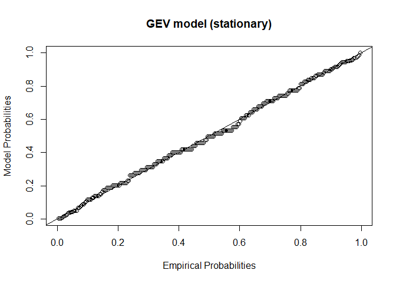
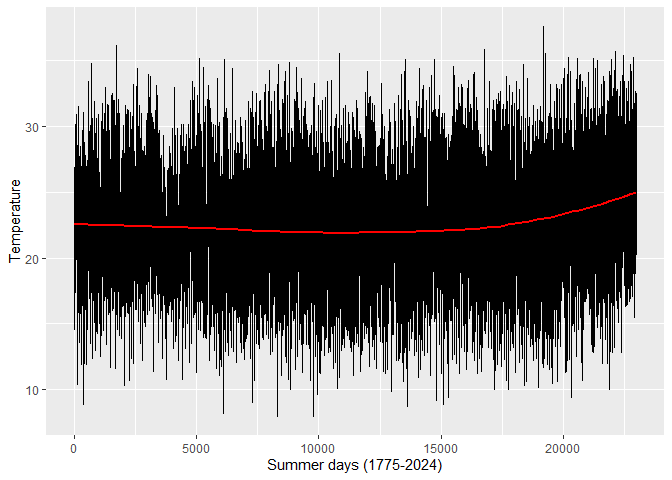
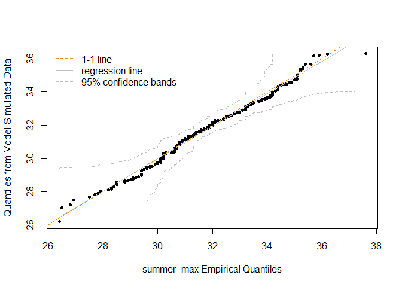

# The Fifth Circle: Extreme Value Analysis

<br/>
Jiří Fejlek

2025-09-19
<br/>

<br/> In this project, we will have a look at extreme value analysis.
Unlike the previous projects in which we modeled expected responses,
extreme value analysis is concerned with the modelling of rare events.
As far as the dataset in this project is concerned, we will investigate
the weather recording data from Clementinum in Prague, which dates back
to 1775 and continues uninterrupted till the present day, making it one
of the world’s longest continuous meteorological records.

Specifically, we will model maximum yearly temperature at 14:00:00 CET
(i.e, 13:00:00 UTC) based on the Clementinum records
(<https://opendata.chmi.cz/meteorology/climate/historical_csv/data/daily/temperature>
; dataset dly-0-203-0-11514-T.csv ; 0-203-0-11514 is the Clementinum
WIGOS Station Identifier).  
<br/>

## Clementinum dataset

<br/> Let us load the dataset and extract the temperatures we are
interested in. We also add Year, Month, and Day columns extracted from
the dates. <br/>

``` r
library(readr)
library(dplyr)

Sys.setlocale("LC_TIME", "English")
```

    ## [1] "English_United States.1252"

``` r
clementinum_all <- read_csv('C:/Users/elini/Desktop/nine circles/clementinum.csv')
clementinum_all$TIME <- factor(clementinum_all$TIME)


clementinum <- clementinum_all[clementinum_all$TIME == '13:00',]
clementinum <- clementinum %>% select(-c('WSI','EG_EL_ABBREVIATION','TIME','FLAG1','QUALITY','...8'))

clementinum$Year <- as.numeric(format(as.Date(clementinum$DT, format="%Y-%m-%d"),"%Y"))
clementinum$Month <- as.numeric(format(as.Date(clementinum$DT, format="%Y-%m-%d"),"%m"))
clementinum$Day <- as.numeric(format(as.Date(clementinum$DT, format="%Y-%m-%d"),"%d"))
clementinum$Index <- seq(1,dim(clementinum)[1],1)
```

<br/> Next, we check whether some data is missing. <br/>

``` r
any(duplicated(clementinum))
```

    ## [1] FALSE

``` r
any(is.na(clementinum))
```

    ## [1] FALSE

<br/> Let us check the values. <br/>

``` r
summary(clementinum$VALUE)
```

    ##    Min. 1st Qu.  Median    Mean 3rd Qu.    Max. 
    ##  -23.80    5.00   12.60   12.45   20.00   37.60

<br/> We observe that the maximum recorded temperature at 14:00:00 is
37.60°C, the minimum temperature is -23.80°C, and the mean temperature
is 12.45°C.

We plot the whole time series next. <br/>

<!-- -->

<br/> One important thing to keep in mind is a clear seasonal trend in
the temperature time series. <br/>

<!-- -->

<br/> Daily temperatures are also clearly correlated. <br/>

<!-- -->

<br/> There is also a noticeable overall trend in the time series. <br/>

<!-- --><!-- -->

## Block Maxima Method

<br/> Before we move to modelling, we start with a brief introduction to
extreme value analysis. Let $X_1, \ldots X_n$ be i.i.d. with the
distribution $F$. We denote the maximum
$M_n = \max \{X_1, \ldots X_n \}$. The probability
$P[M_n \leq m] = P[X_1 \leq m, \ldots, X_n \leq m]$ is equal to
$F^n(m)$. However, since $F$ is usually unknown and must be estimated,
$F^n$ would be very inaccurate in practice to estimate the distribution
of $M_n$.

The extreme value analysis is based on the so-called
Fisher–Tippett–Gnedenko theorem \[1\]. If there exists sequences of
constants $(a_n)$ and $(b_n)$ such that
$P[\frac{M_n - b_n}{a_n} \leq m] \rightarrow G(m)$ as
$n \rightarrow + \infty$ where $G$ is some non-degenerate distribution
function. Then $G$ is a member of the *generalized extreme value* family
of distributions.

Thus, the Fisher–Tippett–Gnedenko theorem is an analogue to the central
limit theorem, which describes the asymptotic distribution of
$\sum_{i = 1}^n X_i$. Although the central limit theorem is a bit
stronger providing sufficient conditions of convergence, e.g.,
$X_1, \ldots X_n$ i.i.d. with finite variance whereas
Fisher–Tippett–Gnedenko *assumes* the convergence.

The generalized extreme value (GEV) family includes distributions
$G(m) = \mathrm{exp} \{ - [1+\xi(m-\mu)/\sigma ]^{-1/\xi}\},$ where
$\mu,\xi \in \mathbb{R}$, $\sigma >0$ and $m$ lies in the set
$\{m \mid 1+\xi(m-\mu)/\sigma  > 0\}$. Depending on the value of the
shape parameter $\xi$, these distributions are also known as the Gumbel
distribution (or Type I, $\xi = 0$), the Fréchet distribution (or Type
II, $\xi >0$), or the Weibull distribution (or Type III, $\xi < 0$).

Since $P[\frac{M_n-b_n}{b_n} \leq m] \approx G(m)$ for large enough $n$,
it holds that $P[M_n \leq m] \approx G(\frac{m - b_n}{a_n}) = G^*(m)$
where G^\* is another GEV distribution. This fact implies that, in
practice, we can estimate the distribution of $M_n$ directly by
considering sequences of maxima computed from, e.g., observations
corresponding to a time period of length one year \[1\].

The Fisher–Tippett–Gnedenko theorem theorem assumes i.i.d. observations.
This is too strict an assumption, since analysis of time series is often
of interest (as in our case), and these will rarely consist of a series
of independent observations. Fortunately, there is a generalization to
stationary time series $X_1, X_2, \ldots$. Stationarity means that
temporal statistical characteristics of the time series (such as mean
and variance) stay constant in time, or more formally, joint probability
distribution remains the same when shifted in time, i.e.,
$F(x_{t_1},\ldots,x_{t_n}) = F(x_{t_1+h},\ldots,x_{t_n+h})$ for all
$t_1,\ldots,t_n, h, n\in\mathbb{N}$

The Fisher–Tippett–Gnedenko theorem still holds for stationary time
series \[1\], provided that the extreme events are almost independent if
they are sufficiently distant in time (see $D(u_n)$ condition \[1,
Definition 5.1\]). This observation gives us a theoretical justification
to use GEV distributions for modelling so-called block maxima in
practice. <br/>

### Initial fit

<br/> In this section, we will use the Fisher–Tippett–Gnedenko theorem
to estimate the distribution of yearly temperature maxima. We reduce our
attention to the summer months, June to August, to reduce the effect of
seasonal trends. We will ignore for now a trend in the yearly means that
we observed in our data exploration, and we will assume for now that the
time series of daily summer temperatures is stationary. <br/>

<!-- -->

<br/> We can also check that no daily record is missing. <br/>

``` r
summary(tapply(clementinum_summer $Index, as.factor(clementinum_summer $Year), length))
```

    ##    Min. 1st Qu.  Median    Mean 3rd Qu.    Max. 
    ##      92      92      92      92      92      92

<br/> Let us compute the year maxima. A one-year period should be enough
to ensure that the maxima are independent. Remember that we are
investigating merely summer temperatures and thus the values for each
year are clearly separated. <br/>

<!-- -->

<br/> Next, we fit the block maxima GEV model using the *extRemes*
package. <br/>

``` r
library(extRemes)
bm_stationary <- fevd(clementinum_summer_max)
summary(bm_stationary)
```

    ## 
    ## fevd(x = clementinum_summer_max)
    ## 
    ## [1] "Estimation Method used: MLE"
    ## 
    ## 
    ##  Negative Log-Likelihood Value:  528.8681 
    ## 
    ## 
    ##  Estimated parameters:
    ##   location      scale      shape 
    ## 31.1168757  2.0242361 -0.2800013 
    ## 
    ##  Standard Error Estimates:
    ##   location      scale      shape 
    ## 0.13780307 0.09543594 0.02824479 
    ## 
    ##  Estimated parameter covariance matrix.
    ##               location         scale         shape
    ## location  0.0189896864 -0.0004362983 -0.0012765619
    ## scale    -0.0004362983  0.0091080181 -0.0015887843
    ## shape    -0.0012765619 -0.0015887843  0.0007977684
    ## 
    ##  AIC = 1063.736 
    ## 
    ##  BIC = 1074.3

<br/> Parameter estimates are computed via the maximum likelihood
method, and thus, we can obtain the confidence intervals for the
parameters $\mu,\sigma,\xi$ based on normal approximation. <br/>

``` r
ci.fevd(bm_stationary, type = 'parameter')
```

    ## fevd(x = clementinum_summer_max)
    ## 
    ## [1] "Normal Approx."
    ## 
    ##          95% lower CI   Estimate 95% upper CI
    ## location   30.8467867 31.1168757   31.3869648
    ## scale       1.8371851  2.0242361    2.2112871
    ## shape      -0.3353601 -0.2800013   -0.2246425

<br/> Alternatively, we can use a parametric bootstrap (percentile-based
confidence intervals). <br/>

``` r
ci.fevd(bm_stationary, type = 'parameter',method = 'boot',R = 1000)
```

    ## fevd(x = clementinum_summer_max)
    ## 
    ## [1] "Parametric Bootstrap"
    ## 1000  iterations
    ## 
    ##                2.5%   Estimate      97.5%
    ## location 30.8404460 31.1168757 31.4051399
    ## scale     1.8259877  2.0242361  2.2131820
    ## shape    -0.3673405 -0.2800013 -0.2135795

<br/> We are primarily interested in the predictions of the model.
First, we compute the probabilities $P[M_n > T]$ based on the block
maxima GEV model. <br/>

``` r
pextRemes(bm_stationary,lower.tail = FALSE, q = seq(25,35,1))
```

    ##  [1] 0.99986782 0.99884386 0.99327285 0.97260884 0.91810535 0.81182977
    ##  [7] 0.65317970 0.46630912 0.28849886 0.14995705 0.06186151

``` r
# We can obtain these values directly by evaluating 1-cdf of the GEV
library(evd)
bm_pars <- distill.fevd(bm_stationary)
pgev(seq(25,35,1), loc=bm_pars[1], scale=bm_pars[2], shape=bm_pars[3], lower.tail = FALSE)
```

    ##  [1] 0.99986782 0.99884386 0.99327285 0.97260884 0.91810535 0.81182977
    ##  [7] 0.65317970 0.46630912 0.28849886 0.14995705 0.06186151

<!-- -->

<br/> Predictions in survival analysis are usually presented in terms of
*return levels*. A return level is a quantile of the GEV distribution,
i.e., $x_p$ such that $G(x_p) = 1-p$. This means that, in our case,
annual maximum temperature exceeds $x_p$ with probability $p$ and thus,
return level $x_p$ is on average exceeded every $1/p$ years (the
so-called return period). This is what terms like a 10-year storm or a
1000-year flood refer to.

We should note that return level estimates are almost assuredly
extrapolations; time series are often much shorter than the return
periods that are being estimated, and thus the predicted return levels
are not directly observed even just once. A rule of thumb in \[2\]
recommends a series of at least 50 independent values (i.e., 50
independent maxima) to obtain a reliable GEV fit. As far as quantile
estimates are concerned, there is no clear consensus, although a limit
of up to approximately five times the observation period is mentioned in
\[2\].

Keeping in mind these limitations in the predictions, let us compute the
return levels for return periods up to 1000 years. <br/>

``` r
return.level(bm_stationary,return.period = c(2,5,10,20,50,100,500,1000))
```

    ## fevd(x = clementinum_summer_max)
    ## get(paste("return.level.fevd.", newcl, sep = ""))(x = x, return.period = return.period)
    ## 
    ##  GEV model fitted to  clementinum_summer_max  
    ## Data are assumed to be  stationary 
    ## [1] "Return Levels for period units in years"
    ##    2-year level    5-year level   10-year level   20-year level   50-year level 
    ##        31.82199        33.59614        34.49636        35.19911        35.92180 
    ##  100-year level  500-year level 1000-year level 
    ##        36.35233        37.07712        37.30116

``` r
qgev(c(0.5,0.2,0.1,0.05,0.02,0.01,0.002,0.001), loc=bm_pars[1], scale=bm_pars[2], shape=bm_pars[3], lower.tail = FALSE)
```

    ## [1] 31.82199 33.59614 34.49636 35.19911 35.92180 36.35233 37.07712 37.30116

``` r
plot(bm_stationary,'rl',main = 'GEV model (stationary)')
```

<!-- -->

<br/> We observe that the predicted 1000-year temperature for our model
is 37.3°C. We notice from the plot that we actually observed “1000-year
temperature” according to our model, since the maximum temperature in
1984 was 37.6°C.

Confidence intervals for the return periods are as follows. <br/>

``` r
# normal confidence intervals
ci.fevd(bm_stationary,return.period = c(2,5,10,20,50,100,500,1000))
```

    ## fevd(x = clementinum_summer_max)
    ## 
    ## [1] "Normal Approx."
    ## 
    ##                        95% lower CI Estimate 95% upper CI
    ## 2-year return level        31.54942 31.82199     32.09455
    ## 5-year return level        33.30005 33.59614     33.89224
    ## 10-year return level       34.18393 34.49636     34.80878
    ## 20-year return level       34.86405 35.19911     35.53418
    ## 50-year return level       35.54074 35.92180     36.30287
    ## 100-year return level      35.92543 36.35233     36.77923
    ## 500-year return level      36.52605 37.07712     37.62819
    ## 1000-year return level     36.69581 37.30116     37.90650

``` r
# parametric bootstrap
ci.fevd(bm_stationary,return.period = c(2,5,10,20,50,100,500,1000),method = 'boot',R = 1000)
```

    ## fevd(x = clementinum_summer_max)
    ## 
    ## [1] "Parametric Bootstrap"
    ## 1000  iterations
    ## 
    ##               2.5% Estimate    97.5%
    ## 2-year    31.54748 31.82199 32.11116
    ## 5-year    33.28919 33.59614 33.89360
    ## 10-year   34.16323 34.49636 34.78786
    ## 20-year   34.80060 35.19911 35.50332
    ## 50-year   35.40758 35.92180 36.29039
    ## 100-year  35.76521 36.35233 36.79803
    ## 500-year  36.29378 37.07712 37.69751
    ## 1000-year 36.43279 37.30116 37.99135

### Model diagnostics

<br/> Let us assess the fit. Since the GEV model is without covariates,
we can directly compare the observed distribution with the theoretical
one. <br/>

``` r
plot(bm_stationary,'probprob', main = 'GEV model (stationary)')
```

<!-- -->

``` r
plot(bm_stationary,'qq', main = 'GEV model (stationary)')
```

<!-- -->

``` r
plot(bm_stationary,'qq2')
```

<!-- -->

``` r
plot(bm_stationary,'density', main = 'GEV model (stationary)')
```

<!-- -->

``` r
plot(bm_stationary,'rl', main = 'GEV model (stationary)')
```

<!-- -->

<br/> We observe that the model fits the observed data reasonably well.
However, we also have to check the assumptions of our model. We assumed
that the series of summer temperatures is stationary. <br/>

<!-- -->

<br/> As can be seen from the loess regressions of the series, there is
a noticeable trend in the yearly mean and variance of the time series.
<br/>

<!-- --><!-- -->

<br/> We can use a formal test to detect monotonic trends, the
Mann-Kendall test \[2\]. <br/>

``` r
library(Kendall)
MannKendall(clementinum_summer$VALUE)
```

    ## tau = 0.0549, 2-sided pvalue =< 2.22e-16

<br/> The test is clearly significant. Similarly, the series of yearly
maxima should have no trend, and the observations should be independent.
<br/>

<!-- -->

``` r
MannKendall(clementinum_summer_max)
```

    ## tau = 0.239, 2-sided pvalue =< 2.22e-16

<br/> We observe a noticeable increasing trend in the yearly maxima. We
can also test the dependence in the series by estimating the
autocorrelation function plot. <br/>

``` r
acf(clementinum_summer_max)
```

<!-- -->

<br/> Some correlations appear significant. However, all the
correlations are positive, which hints that these are caused by the
observed increasing trend in the series of yearly maxima. Overall, the
stationary model is not justified, and we need to account for the fact
that the series is not stationary. <br/>

### Non-stationary model (GEP model with time-dependent parameters)

<br/> The first approach to deal with the non-stationarity of the time
series involves considering a GEV model with time-varying parameters.

We will fit several block maxima GEV models that assume polynomial
(linear, quadratic, and frestricted cubic splines) trends in the
location and the log scale ($\phi = \mathrm{log} \sigma$) parameters
(log transformation of the scale ensures that the scale is always
positive). We will assume that the shape is constant, which is an usual
assumption \[2\].

One justification is an observation that trends of the time series in
the mean and variance do not change the shape of the GEV distribution.
$Y(t) = \frac{X(t) - m(t)}{s(t)}$ and the maxima of $Y(t)$ follow
$\mathrm{GEV}(\mu_Y(t),\sigma_Y(t),\xi_Y(t))$, then the maxima of $X(t)$
have distribution $\mathrm{GEV}(\mu_X(t),\sigma_X(t),\xi_X(t))$, where
$\xi_X(t) = \xi_Y(t)$, $\sigma_X(t) = \sigma_Y(t)s(t)$,
$\mu_X(t) = m(t) + \mu_Y(t)s(t)$ \[3\].

Another, more pragmatic reason is that extreme value model shape
parameters are difficult to estimate with precision, so it is often
unrealistic to model them as a smooth function of time \[1\]. <br/>

``` r
library(rms)
# use.phi = TRUE to use phi = log sigma parametrization

clementinum_summer_max_data <- as.data.frame(cbind(clementinum_summer_max,years))
clementinum_summer_max_data$years <- (clementinum_summer_max_data$years - 1774)/250
colnames(clementinum_summer_max_data) <- c('summer_max','year')

bm_nonstationary_1 <- fevd(summer_max,data = clementinum_summer_max_data, location.fun = ~ year)
bm_nonstationary_2 <- fevd(summer_max,data = clementinum_summer_max_data, location.fun = ~ year + I(year^2))
bm_nonstationary_3 <- fevd(summer_max,data = clementinum_summer_max_data, location.fun = ~ rcs(year,5))

bm_nonstationary_4 <- fevd(summer_max,data = clementinum_summer_max_data, scale.fun = ~ year,use.phi = TRUE)
bm_nonstationary_5 <- fevd(summer_max,data = clementinum_summer_max_data, scale.fun = ~ year + I(year^2),use.phi = TRUE)
bm_nonstationary_6 <- fevd(summer_max,data = clementinum_summer_max_data, scale.fun = ~ rcs(year,5),use.phi = TRUE)


bm_nonstationary_7 <- fevd(summer_max,data = clementinum_summer_max_data, location.fun = ~ year, scale.fun = ~ year,use.phi = TRUE)
bm_nonstationary_8 <- fevd(summer_max,data = clementinum_summer_max_data, location.fun = ~ year + I(year^2), scale.fun = ~ year,use.phi = TRUE)
bm_nonstationary_9 <- fevd(summer_max,data = clementinum_summer_max_data, location.fun = ~ rcs(year,5), scale.fun = ~ year,use.phi = TRUE)

bm_nonstationary_10 <- fevd(summer_max,data = clementinum_summer_max_data, location.fun = ~ year, scale.fun = ~ year + I(year^2),use.phi = TRUE)
bm_nonstationary_11 <- fevd(summer_max,data = clementinum_summer_max_data, location.fun = ~ year + I(year^2), scale.fun = ~ year + I(year^2),use.phi = TRUE)
bm_nonstationary_12 <- fevd(summer_max,data = clementinum_summer_max_data, location.fun = ~ rcs(year,5), scale.fun = ~ year + I(year^2),use.phi = TRUE)


bm_nonstationary_13 <- fevd(summer_max,data = clementinum_summer_max_data, location.fun = ~ year, scale.fun = ~ rcs(year,5),use.phi = TRUE)
bm_nonstationary_14 <- fevd(summer_max,data = clementinum_summer_max_data, location.fun = ~ year + I(year^2), scale.fun = ~ rcs(year,5),use.phi = TRUE)
bm_nonstationary_15 <- fevd(summer_max,data = clementinum_summer_max_data, location.fun = ~ year + rcs(year,5), scale.fun = ~ rcs(year,5),use.phi = TRUE)
```

<br/> We will choose the best-fitting model using the AIC. <br/>

``` r
AIC_stat <- c(summary(bm_stationary,silent = TRUE)$AIC, # stationary model
summary(bm_nonstationary_1,silent = TRUE)$AIC,
summary(bm_nonstationary_2,silent = TRUE)$AIC,
summary(bm_nonstationary_3,silent = TRUE)$AIC,
summary(bm_nonstationary_4,silent = TRUE)$AIC,
summary(bm_nonstationary_5,silent = TRUE)$AIC,
summary(bm_nonstationary_6,silent = TRUE)$AIC,
summary(bm_nonstationary_7,silent = TRUE)$AIC,
summary(bm_nonstationary_8,silent = TRUE)$AIC,
summary(bm_nonstationary_9,silent = TRUE)$AIC,
summary(bm_nonstationary_10,silent = TRUE)$AIC,
summary(bm_nonstationary_11,silent = TRUE)$AIC,
summary(bm_nonstationary_12,silent = TRUE)$AIC,
summary(bm_nonstationary_13,silent = TRUE)$AIC,
summary(bm_nonstationary_14,silent = TRUE)$AIC)
# summary(bm_nonstationary_15,silent = TRUE)$AIC  did not converged

names(AIC_stat) <- c('stationary',seq(1,14,1))
AIC_stat
```

    ## stationary          1          2          3          4          5          6 
    ##   1063.736   1028.616   1024.855   1027.753   1065.551   1059.685   1061.688 
    ##          7          8          9         10         11         12         13 
    ##   1022.674   1017.725   1020.069   1024.120   1019.724   1021.935   1027.016 
    ##         14 
    ##   1021.581

<br/> We observe that model 8 (quadratic in location, linear in log
shape) attained the lowest value of AIC. Let us plot the trends in the
parameters for model 8, model 12 (rcs in location, quadratic in log
shape), and the model with constant parameters. <br/>

<!-- --><!-- -->

<br/> We observe that the trends in both location and scale are clearly
significant. We can formally test these hypotheses via the likelihood
ratio tests. <br/>

``` r
lr.test(bm_stationary, bm_nonstationary_3) # location 
```

    ## 
    ##  Likelihood-ratio Test
    ## 
    ## data:  clementinum_summer_maxsummer_max
    ## Likelihood-ratio = 43.983, chi-square critical value = 9.4877, alpha =
    ## 0.0500, Degrees of Freedom = 4.0000, p-value = 6.468e-09
    ## alternative hypothesis: greater

``` r
lr.test(bm_stationary, bm_nonstationary_6) # scale
```

    ## 
    ##  Likelihood-ratio Test
    ## 
    ## data:  clementinum_summer_maxsummer_max
    ## Likelihood-ratio = 10.048, chi-square critical value = 9.4877, alpha =
    ## 0.0500, Degrees of Freedom = 4.0000, p-value = 0.03963
    ## alternative hypothesis: greater

<br/> Let us check the diagnostics plot for model 8. <br/>

``` r
plot(bm_nonstationary_8,'probprob', main = 'GEV model (time-dependent parameters)')
```

<!-- -->

``` r
plot(bm_nonstationary_8,'qq', main = 'GEV model (time-dependent parameters)')
```

<!-- -->

``` r
plot(bm_nonstationary_8,'qq2')
```

<!-- -->

``` r
plot(bm_nonstationary_8,'density', main = 'GEV model (time-dependent parameters)')
```

<!-- -->

\<br/ We observe that this model fits the data fairly well. Let us
compute the confidence intervals for the parameters. <br/>

``` r
ci.fevd(bm_nonstationary_8, type = 'parameter')
```

    ## fevd(x = summer_max, data = clementinum_summer_max_data, location.fun = ~year + 
    ##     I(year^2), scale.fun = ~year, use.phi = TRUE)
    ## 
    ## [1] "Normal Approx."
    ## 
    ##       95% lower CI   Estimate 95% upper CI
    ## mu0     29.6019186 30.3829594   31.1640001
    ## mu1     -4.5552092 -1.2534165    2.0483761
    ## mu2      1.0813342  4.1278611    7.1743880
    ## phi0     0.6201087  0.7862979    0.9524871
    ## phi1    -0.7293935 -0.4379772   -0.1465609
    ## shape   -0.3036133 -0.2300259   -0.1564385

``` r
ci.fevd(bm_nonstationary_8, type = 'parameter',method = 'boot',R = 1000)
```

    ## fevd(x = summer_max, data = clementinum_summer_max_data, location.fun = ~year + 
    ##     I(year^2), scale.fun = ~year, use.phi = TRUE)
    ## 
    ## [1] "Parametric Bootstrap"
    ## 1000  iterations
    ## 
    ##             2.5%   Estimate      97.5%
    ## mu0   29.6265309 30.3829594 31.1517047
    ## mu1   -4.1931595 -1.2534165  1.9168737
    ## mu2    1.3249253  4.1278611  7.0043476
    ## phi0  -0.8937970  0.7862979  0.9436307
    ## phi1  -0.7193703 -0.4379772  0.0000000
    ## shape -0.3163279 -0.2300259 -0.1564652

<br/> The predicted return levels for the year 2024 are as follows.
<br/>

``` r
return_levels <- rbind(return.level(bm_stationary,return.period = c(2,5,10,20,50,100,500,1000)),
                       return.level(bm_nonstationary_8,return.period = c(2,5,10,20,50,100,500,1000))[250,])

rownames(return_levels) <- c('stationary','time-dependent parameters')
return_levels
```

    ##                                  2        5       10       20       50      100
    ## stationary                31.82199 33.59614 34.49636 35.19911 35.92180 36.35233
    ## time-dependent parameters 33.75535 35.05453 35.74603 36.30609 36.90608 37.27852
    ##                                500     1000
    ## stationary                37.07712 37.30116
    ## time-dependent parameters 37.94131 38.15883

``` r
# or 
# bm_nonstationary_pars <- distill.fevd(bm_nonstationary_8)
# qgev(c(0.5,0.2,0.1,0.05,0.02,0.01,0.002,0.001), loc=bm_nonstationary_pars[1] + bm_nonstationary_pars[2] + bm_nonstationary_pars[3], scale=exp(bm_nonstationary_pars[4] + bm_nonstationary_pars[5]), shape=bm_nonstationary_pars[6], lower.tail = FALSE)
```

<!-- -->

<br/> The return level predictions for the year 2024 are higher for the
time-dependent parameter model than for the stationary model. Let us
compute the confidence intervals of the return levels for the
time-dependent parameter model. We note that the parametric confidence
intervals are not implemented in *extRemes*. <br/>

``` r
# normal CI
cov_values <- make.qcov(bm_nonstationary_8, vals = c(1,1,1,1,1,1), nr = 1)
ci.fevd(bm_nonstationary_8,return.period = c(2,5,10,20,50,100,500,1000),qcov = cov_values)
```

    ## fevd(x = summer_max, data = clementinum_summer_max_data, location.fun = ~year + 
    ##     I(year^2), scale.fun = ~year, use.phi = TRUE)
    ## 
    ## [1] "Normal Approx."
    ## 
    ##                        95% lower CI Estimate 95% upper CI Standard Error
    ## 2-year return level        33.16472 33.75535     34.34599      0.3013509
    ## 5-year return level        34.42996 35.05453     35.67910      0.3186651
    ## 10-year return level       35.08819 35.74603     36.40388      0.3356389
    ## 20-year return level       35.61257 36.30609     36.99962      0.3538473
    ## 50-year return level       36.15959 36.90608     37.65258      0.3808717
    ## 100-year return level      36.48664 37.27852     38.07039      0.4040253
    ## 500-year return level      37.02926 37.94131     38.85336      0.4653390
    ## 1000-year return level     37.19146 38.15883     39.12620      0.4935665

``` r
# parametric bootstrap CI
set.seed(123)
nb <- 500
return_levels_boot <- matrix(0,nb,8)
bm_nonstationary_pars_all <- findpars(bm_nonstationary_8)

for (j in 1:nb){
  
clementinum_summer_max_new <- clementinum_summer_max

for (i in 1:250){

  clementinum_summer_max_new[i] <- rgev(1, loc=bm_nonstationary_pars_all$location[i], scale=bm_nonstationary_pars_all$scale[i], shape=bm_nonstationary_pars_all$shape[i])
}

  bm_nonstationary_new <- fevd(clementinum_summer_max_new,data = clementinum_summer_max_data, location.fun = ~ year + I(year^2), scale.fun = ~ year,use.phi = TRUE)
  
  if (any(is.null(parcov.fevd(bm_nonstationary_new))) == FALSE){
  return_levels_boot[j,] <- return.level(bm_nonstationary_new,return.period = c(2,5,10,20,50,100,500,1000))[250,]
  }
  else
    {return_levels_boot[j,] <- NA}
}

t(apply(return_levels_boot,2,function(x) quantile(x,c(0.025,0.975), na.rm= TRUE)))
```

    ##          2.5%    97.5%
    ## [1,] 33.18093 37.62285
    ## [2,] 34.38658 37.62285
    ## [3,] 34.95517 37.62285
    ## [4,] 35.40904 37.63417
    ## [5,] 35.78767 37.83647
    ## [6,] 35.91187 38.25676
    ## [7,] 36.05008 39.21013
    ## [8,] 36.05008 39.57648

<br/> Since we fitted the parametric model, we can actually predict the
future values of the return levels. <br/>

``` r
future_returns <- matrix(0,5,8)
years_returns <- c(2024,2034,2054,2074,2124)

for (j in 1:5){
mult <- years_returns[j] - 2024
future_returns[j,] <-   qgev(c(0.5,0.2,0.1,0.05,0.02,0.01,0.002,0.001), loc=bm_nonstationary_pars[1] + bm_nonstationary_pars[2]*(1 + 0.004*mult) + bm_nonstationary_pars[3]*(1 + 0.004*mult)^2, scale=exp(bm_nonstationary_pars[4] + bm_nonstationary_pars[5]*(1 + 0.004*mult)), shape=bm_nonstationary_pars[6], lower.tail = FALSE)
}

rownames(future_returns) <- years_returns
colnames(future_returns) <- c(2,5,10,20,50,100,500,1000)
future_returns
```

    ##             2        5       10       20       50      100      500     1000
    ## 2024 33.75535 35.05453 35.74603 36.30609 36.90608 37.27852 37.94131 38.15883
    ## 2034 34.03340 35.31002 35.98951 36.53985 37.12941 37.49538 38.14667 38.36041
    ## 2054 34.62958 35.86223 36.51833 37.04972 37.61899 37.97235 38.60121 38.80759
    ## 2074 35.27917 36.46938 37.10289 37.61598 38.16565 38.50685 39.11406 39.31333
    ## 2124 37.13671 38.22711 38.80748 39.27754 39.78111 40.09369 40.64997 40.83253

<br/> Return periods/ return levels assume a stationary series, and they
do not retain their meaning for the non-stationary series. In \[2\], the
return level for non-stationary series is defined as
$E[X_t > x_p \mid t_0 \leq t \leq T \Delta] = 1$, i.e., the expectation
of exceeding $x_p$ in the following $T$ periods of length $\Delta$ is 1.
<br/>

``` r
# return level (non-stationary) for 2024-2124

return_level_nonstat <- function(loc0,loc1,loc2,scale0,scale1,shape0,t0,nperiod,temp) {
  
prob <-0

for(i in 0:nperiod){
  prob <- prob + pgev(temp, loc=loc0 + loc1*(t0+i/250) + loc2*(t0+i/250)^2, scale=exp(scale0 + scale1*(t0+i/250)), shape=shape0, lower.tail = FALSE)
}
return (prob)
}

return_level_nonstat(bm_nonstationary_pars[1],bm_nonstationary_pars[2],bm_nonstationary_pars[3],bm_nonstationary_pars[4],bm_nonstationary_pars[5],bm_nonstationary_pars[6],1,100,39.1406)
```

    ##    shape 
    ## 1.000016

<br/> We observe that this value (39.1°C) is between the 100-year
temperature for 2024 (37.3°C) and the 100-year temperature for 2124
(40.1°C). <br/>

## Threshold Excess Method

<br/> The threshold excess model is an alternative to the model based on
block maxima. The disadvantage of block maxima is that it is quite
wasteful in terms of data. The threshold excess model considers
modelling the series excess over a given threshold instead of modelling
the series maxima. This allows the model to consider a larger quantity
of observations and, subsequently, obtain a more precise fit. <br/>

``` r
num_exces <- numeric(15)

for (i in 1:15){
  num_exces[i] <- sum(clementinum_summer$VALUE>19+i)
}

names(num_exces) <- c('>20','>21','>22','>23','>24','>25','>26','>27','>28','>29','>30','>31','>32','>33','>34')
num_exces
```

    ##   >20   >21   >22   >23   >24   >25   >26   >27   >28   >29   >30   >31   >32 
    ## 16004 14099 12175 10187  8378  6662  5046  3649  2547  1665  1028   570   292 
    ##   >33   >34 
    ##   151    56

<br/> The model of excesses is based on the following theorem \[1\]. Let
$X_1\ldots, X_n$ be i.i.d. and let $M_n = \max \{X_1\,\ldots, X_n\}$ and
let $X_1\ldots, X_n$ meet Fisher–Tippett–Gnedenko theorem, i.e, the
distribution of $M_n$ converges to $\mathrm{GEV}(\mu,\sigma,\xi)$. Then
the distribution of excesses $y = x-u$ such that $y > 0$ converges for
large enough $u$ to the generalized Pareto distribution (GP)
$P[Y\leq y] = 1-(1+\frac{\xi y}{\tilde\sigma})^{-1/\xi}$, where
$\tilde{\sigma} = \sigma + \xi(u-\mu)$.

The theorem implies that instead of block maxima, we can model the
distribution of excesses for large enough thresholds using the GP
distribution. Graphical methods can help us choose a suitable threshold.
For example, if an excess GP model is valid, $E(X-u\mid X > u)$ should
be linear function of $u$ \[1\], and thus, the mean residual life plot
(the plot u vs $\frac{1}{\# x > u} \sum_{x > u} x - u$) should be
approximately linear. <br/>

``` r
par(mfrow = c(1, 1))
mrlplot(clementinum_summer$VALUE, xlim = c(15, 35))
```

<!-- -->

<br/> Another graphical method is based on the evolution of parameters
of the GP distribution. Provided that the threshold $u_0$ is large
enough such that the distribution of excesses is approximately GP, then
the parameters of the GP model for thresholds $u>u_0$ should $\xi$ stay
constant and $\sigma_u = \sigma_{u_0} + \xi(u-u_0)$ \[1\]. <br/>

``` r
threshrange.plot(clementinum_summer$VALUE, r = c(15, 35), nint = 21)
```

<!-- -->

<br/> Based on these plots, we choose a threshold of 28°C.

Now, similarly to the GEV models for block maxima, the threshold excess
models can be generalized to stationary series (see \[Theorem 6.2,2\]).
However, there is a noticeable difference between block maxima and
threshold excesses to consider. Block maxima are computed over large
enough periods. Hence, unless these maxima can be positioned near the
endpoints of the time intervals, we can consider these individual maxima
as independent observations. Threshold excesses do not meet in general.
<br/>

<!-- -->

<br/> Since the temperature observations are correlated in time, we see
that the threshold excesses are not always independent and form
clusters. More formally, the presence of such clusters at high levels
for the time series can be investigated via the auto-tail dependence
function \[5\]. Assume $X_1\,\ldots X_n$ identically distributed, then
auto–tail dependence function at level $u$ is
$\rho(h,u) = P[X_{h+i} > F^{-1}(u) \mid X_i > F^{-1}(u)]$ (rho should be
small for $u$ close to one, if the tails excesses are independent)

Let us plot the auto-tail dependence function for the 0.9 quantile of
summer temperatures (28.3°C). <br/>

``` r
quantile(clementinum_summer$VALUE,0.9)
```

    ##  90% 
    ## 28.3

``` r
atdf(clementinum_summer$VALUE, 0.9)
```

<!-- -->

<br/> We see clearly that clusters are present at high levels. The
second value $\bar{\rho}$ is an alternative definition of the auto-tail
dependence function \[5\]
$\bar{\rho}(u,h) = \frac{2 \mathrm{log} P[X_i > F^{-1}(u)]}{\mathrm{log} P[X_i > F^{-1}(u), X_{h+i} > F^{-1}(u)]} - 1$,
and hence, the values of $\bar{\rho}(u,h)$ should be below zero.

To get the excesses that are independent, we need to separate them using
*declustering*. <br/>

``` r
VALUE_decl <- as.numeric(decluster(clementinum_summer$VALUE, 28))
```

<!-- -->

<br/> Let us compute the auto-tail dependence function for declustered
values. <br/>

``` r
atdf(VALUE_decl, 0.9)
```

<!-- -->

<br/> We can notice that $\bar{\rho}(u,1) = -1$. This is due to
declustering; the next observations after exceeding the threshold will
not exceed the threshold, thus the fraction in the definition
$\bar{\rho}(u,h)$ equals 0. <br/>

### Initial fit

<br/> Having obtained independent threshold excesses, we can fit the GP
model. At the start, we assume a simple model for a stationary time
series. <br/>

``` r
te_stationary  <- fevd(VALUE_decl[VALUE_decl>28], threshold = 28, type = 'GP') 
summary(te_stationary)
```

    ## 
    ## fevd(x = VALUE_decl[VALUE_decl > 28], threshold = 28, type = "GP")
    ## 
    ## [1] "Estimation Method used: MLE"
    ## 
    ## 
    ##  Negative Log-Likelihood Value:  2238.712 
    ## 
    ## 
    ##  Estimated parameters:
    ##      scale      shape 
    ##  2.7471832 -0.2697226 
    ## 
    ##  Standard Error Estimates:
    ##      scale      shape 
    ## 0.08518232 0.01553388 
    ## 
    ##  Estimated parameter covariance matrix.
    ##              scale         shape
    ## scale  0.007256027 -0.0010822275
    ## shape -0.001082227  0.0002413014
    ## 
    ##  AIC = 4481.423 
    ## 
    ##  BIC = 4491.742

<br/> The confidence intervals for the parameters are as follows. <br/>

``` r
ci.fevd(te_stationary, type = 'parameter')
```

    ## fevd(x = VALUE_decl[VALUE_decl > 28], threshold = 28, type = "GP")
    ## 
    ## [1] "Normal Approx."
    ## 
    ##       95% lower CI   Estimate 95% upper CI
    ## scale    2.5802289  2.7471832    2.9141375
    ## shape   -0.3001684 -0.2697226   -0.2392767

``` r
ci.fevd(te_stationary, type = 'parameter',method = 'boot',R = 1000)
```

    ## fevd(x = VALUE_decl[VALUE_decl > 28], threshold = 28, type = "GP")
    ## 
    ## [1] "Parametric Bootstrap"
    ## 1000  iterations
    ## 
    ##             2.5%   Estimate      97.5%
    ## scale  2.5807843  2.7471832  2.9436244
    ## shape -0.3199565 -0.2697226 -0.2316917

<br/> As far as predictions are concerned, the GP model naturally
provides threshold excesses probabilities $P[X > T \mid X > u]$ \[1\]
<br/>

``` r
library(SpatialExtremes)

te_pars <- distill.fevd(te_stationary)

pextRemes(te_stationary,lower.tail = FALSE, q = seq(25,35,1))
```

    ##  [1] 1.00000000 1.00000000 1.00000000 1.00000000 0.68171620 0.44463988
    ##  [7] 0.27428315 0.15736055 0.08183609 0.03697982 0.01343792

``` r
# or using cdf of generalized Pareto distribution
pgpd(q = seq(25,35,1), loc = 28, scale = te_pars[1], shape = te_pars[2], lower.tail = FALSE)
```

    ##  [1] 1.00000000 1.00000000 1.00000000 1.00000000 0.68171620 0.44463988
    ##  [7] 0.27428315 0.15736055 0.08183609 0.03697982 0.01343792

<!-- -->

<br/> However, we are interested in the estimation of return
levels/return periods. The return levels are equal to
$x_m = u + \frac{\hat\sigma}{\xi}[(m\zeta_u)^\xi+1]$ \[1\] where
$\zeta_u = P[X > u]$. Hence, to evaluate the return levels, we need an
estimate of marginal probabilities $P[X > u]$. A natural estimate of
$P[X > u]$ is $n_u/n$, where $n_u$ is the number of cluster excesses.
<br/>

``` r
# extRemes package requires an estimate of the number of excesses per year to compute the return levels 
n_excess <- tapply(VALUE_decl,as.factor(clementinum_summer$Year),function(x) sum(x>28))
mean(n_excess)
```

    ## [1] 5.144

``` r
te_stationary  <- fevd(VALUE_decl[VALUE_decl>28], threshold = 28, type = 'GP',time.units = '5.144/year') 
return.level(te_stationary,return.period = c(2,5,10,20,50,100,500,1000))
```

    ## fevd(x = VALUE_decl[VALUE_decl > 28], threshold = 28, type = "GP", 
    ##     time.units = "5.144/year")
    ## get(paste("return.level.fevd.", newcl, sep = ""))(x = x, return.period = return.period)
    ## 
    ##  GP model fitted to  VALUE_decl[VALUE_decl > 28]  
    ## Data are assumed to be  stationary 
    ## [1] "Return Levels for period units in years"
    ##    2-year level    5-year level   10-year level   20-year level   50-year level 
    ##        32.75369        33.94304        34.66642        35.26645        35.90558 
    ##  100-year level  500-year level 1000-year level 
    ##        36.29431        36.96020        37.16909

``` r
# or using the formula directly
p_exceed <- sum(VALUE_decl>28)/length(VALUE_decl)
28 + te_pars[1]/te_pars[2]*
  (((c(2,5,10,20,50,100,500,1000)*92*p_exceed)^te_pars[2])-1)
```

    ## [1] 32.75369 33.94304 34.66642 35.26645 35.90558 36.29431 36.96020 37.16909

<br/> The package *extRemes* provides merely the normal confidence
intervals for the return levels of the GP model. <br/>

``` r
# normal CI
ci.fevd(te_stationary,return.period = c(2,5,10,20,50,100,500,1000))
```

    ## fevd(x = VALUE_decl[VALUE_decl > 28], threshold = 28, type = "GP", 
    ##     time.units = "5.144/year")
    ## 
    ## [1] "Normal Approx."
    ## 
    ##                        95% lower CI Estimate 95% upper CI
    ## 2-year return level        32.56692 32.75369     32.94047
    ## 5-year return level        33.73063 33.94304     34.15546
    ## 10-year return level       34.43331 34.66642     34.89954
    ## 20-year return level       35.00800 35.26645     35.52491
    ## 50-year return level       35.60647 35.90558     36.20470
    ## 100-year return level      35.96083 36.29431     36.62778
    ## 500-year return level      36.54451 36.96020     37.37588
    ## 1000-year return level     36.71971 37.16909     37.61847

<br/> We also compute the confidence intervals via moving block
bootstrap \[4\] on the summer temperature series (this allows us to
include the choice of the threshold, declustering, and estimation of
$\zeta_u = P[X > u]$ into the CI estimate). Note that in our simple
model, we assume that the summer temperature series is stationary and
thus the moving block bootstrap is appropriate. To perform the moving
block bootstrap, we first need to examine the autocorrelation function
of summer temperatures.  
<br/>

``` r
acf(clementinum_summer$VALUE, main ='ACF of the residual series')
```

<!-- -->

<br/> The correlation in summer temperatures is relatively weak for
blocks beyond 30. We will use blocks of 40, as it splits the series into
575 blocks of the same length. The moving block bootstrap resamples the
temperature time series by replacing each block of length 40 in the
original series with a block that starts from a random time instant in
the original series. <br/>

``` r
# moving block bootstrap CI
set.seed(123)
nb <- 500
return_levels_boot2 <- matrix(0,nb,8)
m <- c(2,5,10,20,50,100,500,1000)*92

for (j in 1:nb){
new_series <- clementinum_summer$VALUE

for (i in 1:575){
  rand_ind <- sample(seq(1,22961,1),1)
  new_series[(40*(i-1)+1):(40*i)] <- clementinum_summer$VALUE[rand_ind:(rand_ind+39)]
}

threshold_new <- quantile(new_series,0.9)
VALUE_decl_new <- as.numeric(decluster(new_series, threshold_new))
te_stationary_new  <- fevd(VALUE_decl_new, threshold = threshold_new, type = 'GP')
p_exceed <- sum(VALUE_decl>threshold_new)/length(VALUE_decl)
te_pars_new <- distill.fevd(te_stationary_new)

return_levels_boot2[j,] <- threshold_new + te_pars_new[1]/te_pars_new[2]*
  (((m*p_exceed)^te_pars_new[2])-1)
}

t(apply(return_levels_boot2,2,function(x) quantile(x,c(0.025,0.975))))
```

    ##          2.5%    97.5%
    ## [1,] 32.54253 32.94155
    ## [2,] 33.62974 34.16666
    ## [3,] 34.23129 34.93535
    ## [4,] 34.71934 35.57382
    ## [5,] 35.18021 36.26012
    ## [6,] 35.47462 36.69035
    ## [7,] 35.91771 37.45525
    ## [8,] 36.03906 37.70753

<br/> Lastly, we can compare the stationary block maxima model and the
stationary threshold excess model. <br/>

``` r
return_levels_stationary <- rbind(return.level(bm_stationary,return.period = c(2,5,10,20,50,100,500,1000)),
return.level(te_stationary,return.period = c(2,5,10,20,50,100,500,1000)))
rownames(return_levels_stationary) <- c('Block maxima (stat.)','Threshold excess (stat.)')
return_levels_stationary
```

    ##                                 2        5       10       20       50      100
    ## Block maxima (stat.)     31.82199 33.59614 34.49636 35.19911 35.92180 36.35233
    ## Threshold excess (stat.) 32.75369 33.94304 34.66642 35.26645 35.90558 36.29431
    ##                               500     1000
    ## Block maxima (stat.)     37.07712 37.30116
    ## Threshold excess (stat.) 36.96020 37.16909

``` r
cbind(ci.fevd(bm_stationary,return.period = c(2,5,10,20,50,100,500,1000))[,c(1,3)],
ci.fevd(te_stationary,return.period = c(2,5,10,20,50,100,500,1000))[,c(1,3)])
```

    ##                        95% lower CI 95% upper CI 95% lower CI 95% upper CI
    ## 2-year return level        31.54942     32.09455     32.56692     32.94047
    ## 5-year return level        33.30005     33.89224     33.73063     34.15546
    ## 10-year return level       34.18393     34.80878     34.43331     34.89954
    ## 20-year return level       34.86405     35.53418     35.00800     35.52491
    ## 50-year return level       35.54074     36.30287     35.60647     36.20470
    ## 100-year return level      35.92543     36.77923     35.96083     36.62778
    ## 500-year return level      36.52605     37.62819     36.54451     37.37588
    ## 1000-year return level     36.69581     37.90650     36.71971     37.61847

``` r
cbind(ci.fevd(bm_stationary,return.period = c(2,5,10,20,50,100,500,1000),method = 'boot', R = 1000)[,c(1,3)],
t(apply(return_levels_boot2,2,function(x) quantile(x,c(0.025,0.975)))))
```

    ##               2.5%    97.5%     2.5%    97.5%
    ## 2-year    31.52888 32.10673 32.54253 32.94155
    ## 5-year    33.27877 33.88913 33.62974 34.16666
    ## 10-year   34.14930 34.81492 34.23129 34.93535
    ## 20-year   34.80640 35.53190 34.71934 35.57382
    ## 50-year   35.45138 36.32623 35.18021 36.26012
    ## 100-year  35.78639 36.81849 35.47462 36.69035
    ## 500-year  36.30078 37.75324 35.91771 37.45525
    ## 1000-year 36.44090 38.06702 36.03906 37.70753

<br/> We observe that differences in estimates of return levels are
minimal. The normal confidence intervals are a bit narrower for the
threshold excess method (remember, the threshold excess model has more
observations to fit). However, in our case, the benefit is relatively
small. The bootstrap confidence intervals are almost of the same width.
Although, the confidence interval for the block maxima model is
parametric, whereas the bootstrap for the threshold excess is
nonparametric. <br/>

### Model diagnostics

<br/> Let us start with the main diagnostics plots. <br/>

``` r
plot(te_stationary  ,'probprob', main = 'GP model (stationary)')
```

<!-- -->

``` r
plot(te_stationary  ,'qq', main = 'GP model (stationary)')
```

<!-- -->

``` r
plot(te_stationary  ,'qq2', main = 'GP model')
```

<!-- -->

``` r
plot(te_stationary  ,'density', main = 'GP model (stationary)')
```

<!-- -->

<br/> Again, this plot shows that the model fits the data fairly well.
Still, as we investigated the block maxima model, there is a trend in
the temperature series. To assess this fact for the threshold excess
model, we will have a look  
at the number of excess clusters per year. <br/>

``` r
plot(seq(1775,2024,1),n_excess,xlab = 'Year',ylab='Number of exceedances')
```

<!-- -->

<br/> The number of clusters should asymptotically follow the Poisson
distribution \[Theorem 6.2,2\]. <br/>

``` r
library(fitdistrplus)
plotdist(as.numeric(n_excess))
```

<!-- -->

``` r
n_excess_poisson_fit <- fitdist(as.numeric(n_excess), "pois")

par(mfrow = c(2, 2))
qqcomp(n_excess_poisson_fit)
denscomp(n_excess_poisson_fit)
cdfcomp(n_excess_poisson_fit)
ppcomp(n_excess_poisson_fit)
```

<!-- -->

<br/> Moreover, the intervals between consecutive clusters should be
asymptotically exponential \[2\], i.e., the cluster maxima converge to a
Poisson point process. <br/>

``` r
differ <- diff(seq(1,23000,1)[VALUE_decl > 28])
plotdist(differ)
```

<!-- -->

``` r
differ_fit <- fitdist(differ, "exp")

par(mfrow = c(2, 2))
qqcomp(differ_fit)
denscomp(differ_fit)
cdfcomp(differ_fit)
ppcomp(differ_fit)
```

<!-- -->

<br/> We observe noticeable discrepancies from the expected
distributions. The reason is again the presence of a trend; in this
case, in the threshold excesses. <br/>

<!-- --><!-- -->

<br/> We clearly observe that the number of excesses increases in time
and thus, the intervals between the excesses shorten in time. Thus,
similarly to the block maxima approach, we need to consider a
non-stationary model. <br/>

### Non-stationary model (GP model with time-dependent parameters)

<br/> Analogously to the block maxima approach, we can consider a
generalized Pareto model with time-dependent parameters. However, unlike
the GEV models, the GP model has only two parameters: the scale
parameter and the shape parameter. In addition, we already discussed
that, provided the trend in the time series can be characterized by the
trend in the mean and variance, the shape parameter can be considered
constant. Thus, we have just one parameter to modify.

Let us fit these models. We will consider linear, quadratic, and the
restricted cubic spline trend in time. <br/>

``` r
clementinum_summer_exc_data <- as.data.frame(cbind(VALUE_decl,years))
clementinum_summer_exc_data$years <- (clementinum_summer$Year - 1774)/250
colnames(clementinum_summer_exc_data) <- c('summer_exc','year')
clementinum_summer_exc_data <- as.data.frame(clementinum_summer_exc_data)

te_nonstationary_1  <- fevd(VALUE_decl[VALUE_decl>28], data = clementinum_summer_exc_data[VALUE_decl>28,], threshold = 28, type = 'GP',scale.fun = ~ year,use.phi = TRUE)

te_nonstationary_2  <- fevd(VALUE_decl[VALUE_decl>28], data = clementinum_summer_exc_data[VALUE_decl>28,], threshold = 28, type = 'GP',scale.fun = ~ year + I(year^2),use.phi = TRUE)

te_nonstationary_3  <- fevd(VALUE_decl[VALUE_decl>28], data = clementinum_summer_exc_data[VALUE_decl>28,], threshold = 28, type = 'GP',scale.fun = ~rcs(year,5),use.phi = TRUE)
```

<br/> Let us compare these models using the AIC. <br/>

``` r
AIC_te_all <- c(summary(te_stationary,silent = TRUE)$AIC,
summary(te_nonstationary_1,silent = TRUE)$AIC,
summary(te_nonstationary_2,silent = TRUE)$AIC,
summary(te_nonstationary_3,silent = TRUE)$AIC)

names(AIC_te_all) <- c('stationary',1,2,3)
AIC_te_all
```

    ## stationary          1          2          3 
    ##   4481.423   4461.990   4459.458   4462.865

<br/> We observe that the quadratic model minimizes the AIC. Let us
perform the likelihood ratio tests to formally test whether the trend in
the scale is significant. <br/>

``` r
lr.test(te_stationary,te_nonstationary_3)
```

    ## 
    ##  Likelihood-ratio Test
    ## 
    ## data:  VALUE_decl[VALUE_decl > 28]VALUE_decl[VALUE_decl > 28]
    ## Likelihood-ratio = 26.558, chi-square critical value = 9.4877, alpha =
    ## 0.0500, Degrees of Freedom = 4.0000, p-value = 2.442e-05
    ## alternative hypothesis: greater

<br/> The trend in the scale parameter is clearly significant.
Diagnostic plots for the model are as follows. <br/>

``` r
par(mfrow = c(1, 2))
plot(te_nonstationary_3  ,'probprob', main = 'GP model (time-dependent parameters)')
plot(te_nonstationary_3  ,'qq', main = 'GP model (time-dependent parameters)')
```

<!-- -->

``` r
par(mfrow = c(1, 1))
plot(te_nonstationary_3  ,'qq2', main = 'GP model (time-dependent parameters)')
```

<!-- -->

<br/> Now, we were discussing that the GP model is a two-parameter
model. However, it is actually not, since to compute the return levels,
we need to estimate the number of excess events per year, i.e., the
intensity of the underlying Poisson process. Assuming that the intensity
of the Poisson process is constant, we get the following estimate of the
return levels. <br/>

``` r
te_nonstationary_2  <- fevd(VALUE_decl[VALUE_decl>28], data = clementinum_summer_exc_data[VALUE_decl>28,], threshold = 28, type = 'GP',scale.fun = ~ year + I(year^2),time.units = '5.144/year',use.phi = TRUE)

return.level(te_nonstationary_2,return.period = c(2,5,10,20,50,100,500,1000))[sum(n_excess),]
```

    ##    2-year level    5-year level   10-year level   20-year level   50-year level 
    ##        33.67947        35.06842        35.90419        36.59114        37.31521 
    ##  100-year level  500-year level 1000-year level 
    ##        37.75090        38.48646        38.71359

<br/> We observe that the number of return periods again increased
significantly. <br/>

``` r
return_levels_2 <- rbind(return.level(bm_stationary,return.period = c(2,5,10,20,50,100,500,1000)),
                       return.level(bm_nonstationary_8,return.period = c(2,5,10,20,50,100,500,1000))[250,],
                       return.level(te_stationary,return.period = c(2,5,10,20,50,100,500,1000)),
                       return.level(te_nonstationary_2,return.period = c(2,5,10,20,50,100,500,1000))[sum(n_excess),]
                       )
rownames(return_levels_2 ) <- c('BM (stationary)','BM (time-dependent parameters)', 'TE (stationary)','TE (time-dependent parameters)')
return_levels_2 
```

    ##                                       2        5       10       20       50
    ## BM (stationary)                31.82199 33.59614 34.49636 35.19911 35.92180
    ## BM (time-dependent parameters) 33.75535 35.05453 35.74603 36.30609 36.90608
    ## TE (stationary)                32.75369 33.94304 34.66642 35.26645 35.90558
    ## TE (time-dependent parameters) 33.67947 35.06842 35.90419 36.59114 37.31521
    ##                                     100      500     1000
    ## BM (stationary)                36.35233 37.07712 37.30116
    ## BM (time-dependent parameters) 37.27852 37.94131 38.15883
    ## TE (stationary)                36.29431 36.96020 37.16909
    ## TE (time-dependent parameters) 37.75090 38.48646 38.71359

<br/> We can compute the confidence intervals using the parametric
bootstrap. <br/>

``` r
# parametric bootstrap CI
set.seed(123)
nb <- 500
return_levels_boot3 <- matrix(0,nb,8)
te_nonstationary_pars_all <- findpars(te_nonstationary_2)

for (j in 1:nb){
  
  VALUE_decl_new <- VALUE_decl[VALUE_decl>28]
  
  for (i in 1:length(VALUE_decl_new)){
  
  VALUE_decl_new[i] <- rgpd(1, loc = 0, scale = te_nonstationary_pars_all$scale[i], shape =
                              te_nonstationary_pars_all$shape[i]) + 28
    }

  te_nonstationary_new <- fevd(VALUE_decl_new, data = clementinum_summer_exc_data[VALUE_decl>28,], threshold = 28, type = 'GP',scale.fun = ~ year + I(year^2),time.units = '5.144/year',use.phi = TRUE)
  
  if (any(is.null(parcov.fevd(te_nonstationary_new))) == FALSE){
  return_levels_boot3[j,] <- return.level(te_nonstationary_new,
                                         return.period = c(2,5,10,20,50,100,500,1000))[sum(n_excess),]
  }
  else
    {return_levels_boot3[j,] <- NA}
}

t(apply(return_levels_boot3,2,function(x) quantile(x,c(0.025,0.975), na.rm= TRUE)))
```

    ##          2.5%    97.5%
    ## [1,] 33.15984 34.12685
    ## [2,] 34.42194 35.58368
    ## [3,] 35.16924 36.47356
    ## [4,] 35.77439 37.22030
    ## [5,] 36.37916 37.99376
    ## [6,] 36.72860 38.44372
    ## [7,] 37.29717 39.26099
    ## [8,] 37.46407 39.52971

<br/> The GP model models the size of the excesses; however, it does not
consider the number of excesses. As we saw from the data, the number of
excesses increases over time. Thus, we consider the number of excesses
per year to be also time-varying. Let us fit the corresponding Poisson
models. <br/>

``` r
poisson_data <- as.data.frame(cbind(n_excess,(years-1774)/250))
colnames(poisson_data) <- c('n_excess','year') 

poisson1 <- glm(n_excess~1,data = poisson_data, family ='poisson')
poisson2 <- glm(n_excess~year,data = poisson_data, family ='poisson')
poisson3 <- glm(n_excess~year + I(year^2),data = poisson_data, family ='poisson')
poisson4 <- glm(n_excess~rcs(year,5),data = poisson_data, family ='poisson')
```

<br/> We can compare these models via the AIC. <br/>

``` r
AIC(poisson1)
```

    ## [1] 1289.712

``` r
AIC(poisson2)
```

    ## [1] 1233.689

``` r
AIC(poisson3)
```

    ## [1] 1204.175

``` r
AIC(poisson4)
```

    ## [1] 1202.239

<br/> The restricted cubic spline model seems to fit the data best.
<br/>

<!-- -->

<br/> We can formally test that the trend is significant. <br/>

``` r
anova(poisson1,poisson4)
```

    ## Analysis of Deviance Table
    ## 
    ## Model 1: n_excess ~ 1
    ## Model 2: n_excess ~ rcs(year, 5)
    ##   Resid. Df Resid. Dev Df Deviance  Pr(>Chi)    
    ## 1       249     469.29                          
    ## 2       245     373.81  4   95.473 < 2.2e-16 ***
    ## ---
    ## Signif. codes:  0 '***' 0.001 '**' 0.01 '*' 0.05 '.' 0.1 ' ' 1

<br/> Return levels for the year 2024 are then modified as follows.
<br/>

``` r
timeunit <- paste(predict(poisson4,type = 'response')[250],'/year')

te_nonstationary_2_alt  <- fevd(VALUE_decl[VALUE_decl>28], data = clementinum_summer_exc_data[VALUE_decl>28,], threshold = 28, type = 'GP',scale.fun = ~ year + I(year^2),time.units = timeunit, use.phi = TRUE )


pars <- findpars(te_nonstationary_2_alt)


28 + pars$scale[1286]/pars$shape[1286]*(((c(2,5,10,20,50,100,500,1000)*10.61)^pars$shape[1286])-1)
```

    ## [1] 34.80597 35.93768 36.61867 37.17839 37.76836 38.12335 38.72269 38.90775

``` r
return_levels_3 <- rbind(return.level(bm_stationary,return.period = c(2,5,10,20,50,100,500,1000)),
                       return.level(bm_nonstationary_8,return.period = c(2,5,10,20,50,100,500,1000))[250,],
                       return.level(te_stationary,return.period = c(2,5,10,20,50,100,500,1000)),
                       return.level(te_nonstationary_2,return.period 
                                    = c(2,5,10,20,50,100,500,1000))[sum(n_excess),],
                       return.level(te_nonstationary_2_alt,return.period 
                                    = c(2,5,10,20,50,100,500,1000))[sum(n_excess),]
                       )

rownames(return_levels_3 ) <- c('BM (stationary)','BM (time-dependent parameters)', 'TE (stationary)','TE (lambda const., scale time-dep)','TE (lambda time-dep., scale time-dep.)')
return_levels_3 
```

    ##                                               2        5       10       20
    ## BM (stationary)                        31.82199 33.59614 34.49636 35.19911
    ## BM (time-dependent parameters)         33.75535 35.05453 35.74603 36.30609
    ## TE (stationary)                        32.75369 33.94304 34.66642 35.26645
    ## TE (lambda const., scale time-dep)     33.67947 35.06842 35.90419 36.59114
    ## TE (lambda time-dep., scale time-dep.) 34.80626 35.93791 36.61885 37.17854
    ##                                              50      100      500     1000
    ## BM (stationary)                        35.92180 36.35233 37.07712 37.30116
    ## BM (time-dependent parameters)         36.90608 37.27852 37.94131 38.15883
    ## TE (stationary)                        35.90558 36.29431 36.96020 37.16909
    ## TE (lambda const., scale time-dep)     37.31521 37.75090 38.48646 38.71359
    ## TE (lambda time-dep., scale time-dep.) 37.76847 38.12345 38.72275 38.90780

<br/> To compute the confidence interval, we will combine two parametric
bootstraps: one for the Poisson model and one for the GP model. We first
simulate new yearly numbers of excesses using the Poisson model and then
model their value via the GP model. <br/>

``` r
# parametric bootstrap CI
set.seed(123)
nb <- 500
return_levels_boot4 <- matrix(0,nb,8)
te_nonstationary_pars_all <- distill.fevd(te_nonstationary_2)

predict_poisson <- predict(poisson4,type = 'response')

for (j in 1:nb){
  
  n_excess_new <- numeric(250)
  
  for (i in 1:250){
    n_excess_new[i] <- rpois(1,predict_poisson[i])
  }
  
  VALUE_decl_new <- numeric(sum(n_excess_new))
  year_new <- numeric(sum(n_excess_new))
  
  l <- 1
  for (i in 1:250){
    
    te_nonstationary_scale <-  exp(te_nonstationary_pars_all[1] + 
                                     te_nonstationary_pars_all[2]*i/250 + te_nonstationary_pars_all[3]*(i/250)^2)
    te_nonstationary_shape <-  te_nonstationary_pars_all[4]
    
    for (k in 1:n_excess_new[i]){
      VALUE_decl_new[l] <- rgpd(1, loc = 0, scale = te_nonstationary_scale, shape =te_nonstationary_shape) + 28
      year_new[l] <- i/250
      l <- l + 1
    }
  }
  
  poisson_data_new <- poisson_data
  poisson_data_new$n_excess <- n_excess_new
  poisson_new <- glm(n_excess~rcs(year,5),data = poisson_data_new, family ='poisson')
  timeunit_new <- predict(poisson_new,type = 'response')[250]
  
  
  clementinum_summer_exc_data_new <- cbind(VALUE_decl_new,year_new)
  colnames(clementinum_summer_exc_data_new) <- c('exc','year')
  clementinum_summer_exc_data_new <- as.data.frame(clementinum_summer_exc_data_new)

  te_nonstationary_new <- fevd(VALUE_decl_new, data = clementinum_summer_exc_data_new, threshold = 28, type = 'GP',scale.fun = ~ year + I(year^2),use.phi = TRUE)
  
  if (any(is.null(parcov.fevd(te_nonstationary_new))) == FALSE){
    
    te_pars_new <- findpars.fevd(te_nonstationary_new)
    scale_new <- te_pars_new$scale[sum(n_excess_new)]
    shape_new <- te_pars_new$shape[sum(n_excess_new)]
    
    return_levels_boot4[j,] <- 28 + scale_new/shape_new*(((c(2,5,10,20,50,100,500,1000)*timeunit_new)^shape_new)-1)
  }
  else
    {return_levels_boot4[j,] <- NA}
}

t(apply(return_levels_boot4,2,function(x) quantile(x,c(0.025,0.975), na.rm= TRUE)))
```

    ##          2.5%    97.5%
    ## [1,] 34.08226 35.45926
    ## [2,] 35.09780 36.66948
    ## [3,] 35.65028 37.40215
    ## [4,] 36.11299 38.00155
    ## [5,] 36.62188 38.63945
    ## [6,] 36.93302 39.02938
    ## [7,] 37.42670 39.75962
    ## [8,] 37.55904 40.00755

<br/> The method of fitting the GP distribution to model sizes of
excesses and the Poisson model to model the frequencies is referred to
as the Poisson-GP model. An alternative approach, which we will discuss
next, involves fitting both models simultaneously. <br/>

## Poisson Point Process Approach

<br/> When we fitted the generalized Pareto model for the threshold
excesses, we estimated the frequency of exceeding separately. An
alternative way is to estimate the frequency simultaneously with all the
remaining parameters using the Poisson point process characterization of
extreme events.

We introduced a term, Poisson point process, informally in the previous
circle, when we discussed the Poisson and a negative binomial
regression, and more specifically, their motivation. Let us introduce
the Poisson point process more formally. Let us assume a set
$\mathcal{A}$ (usually representing a period of time) and let $N(A)$ be
a random variable that denotes the number of events that happened during
$A \in \mathcal{A}$. We denote $\Lambda(A) = \mathrm{E} N(A)$ and we
assume that $\Lambda(A) = \int_A \lambda(x) \mathrm{d}x$.The function
$\lambda(x)$ is called the intensity of the point process \[1\].

An important point process known to us is *homogeneous Poisson process*,
which is defined on $\mathcal{A} \subset \mathbb{R}$ and meets two
properties

- 1.  For all $A = [t_1,t_2]\subset \mathcal{A}$ is
      $N(A) \sim \mathrm{Poisson} (\lambda(t_2-t_1))$
- 2.  For non-overlapping subsets $A, B \subset \mathcal{A}$, events
      $N(A)$ and $N(B)$ are independent.

Non-homogeneous Poisson process is a generalization of homogeneous
Poisson process for which the intensity $\lambda$ is not constant, i.e.,
$N(A) \sim \mathrm{Poisson} (\int_{t_1}^{t_2} \lambda(t) \mathrm{d}t)$
for $A = [t_1,t_2]$. We can generalize even further to a non-homogeneous
Poisson process on $\mathcal{A} \subset \mathbb{R}^k$, in which we
require $N(A) \sim \mathrm{Poisson} (\int_A \lambda(x) \mathrm{d}x)$.

Let us connect a particular non-homogeneous Poisson process in
$\mathbb{R}^2$ to the extreme values. Let $X_1, \ldots, X_n$ be an i.i.d
sequence of excesses such that maxima converges to
$\mathrm{GEV}(\mu,\sigma,\xi)$. Next, we define a point process in
$\mathbb{R}^2$ as $N_n = \{ (i/(n+1),X_i) \mid i = 1, \ldots, n\}$,
i.e., the point process consists of events
$(\frac{1}{n+1},X_1), (\frac{2}{n+1},X_2), \ldots, (\frac{n}{n+1},X_n)$.
Then, due to \[Theorem 7.1, 1\], this process is on regions
$(0,1) \times [u,+\infty)$ for large enough $u$ is approximately Poisson
with an intensity measure
$\Lambda(A) = (t_2-t_1)[1+\xi\frac{z-\mu}{\sigma}]^{-1/\xi}$ for regions
$A = [t_1,t_2] \times [z,+\infty)$.

In practice, this means that the parameters $(\xi,\mu,\sigma)$ of the
GEV distribution can be estimated from observations $(t_i,x_i)$ in
region $A = (0,1) \times [u,+\infty)$ using the appropriate likelihood
function \[(7.9),1\]. Looking at the shape of the region $A$, these
observations are nothing but threshold excesses.

### Initial fit

<br/> We first fit a stationary model. Note that the approach to
determine the threshold and declustering would be the same, so we skip
that step. <br/>

``` r
# time.units to denote observations per year
pp_stationary  <- fevd(VALUE_decl, data = clementinum_summer_exc_data, threshold = 28, type = 'PP', time.units = '92/year')
```

<br/> We can compare the parameters of all our stationary models. The PP
model and the GEV model parameters should be the same (they are both
models for 1-year maxima). However, the PP model uses significantly more
observations. Moreover, the GP threshold excess model and the PP model
use the same data (and almost the same likelihood function, see
\[Section 7.6,1\]). The scale of GP should meet
$\tilde\sigma = \sigma + \xi(u - \mu )$ and the shape parameters should
be the same. <br/>

``` r
distill.fevd(bm_stationary)
```

    ##          location             scale             shape              nllh 
    ##      3.111688e+01      2.024236e+00     -2.800013e-01      5.288681e+02 
    ## location.location    scale.location    shape.location    location.scale 
    ##      1.898969e-02     -4.362983e-04     -1.276562e-03     -4.362983e-04 
    ##       scale.scale       shape.scale    location.shape       scale.shape 
    ##      9.108018e-03     -1.588784e-03     -1.276562e-03     -1.588784e-03 
    ##       shape.shape 
    ##      7.977684e-04

``` r
distill.fevd(pp_stationary)
```

    ##          location             scale             shape              nllh 
    ##      3.163702e+01      1.766153e+00     -2.697101e-01      1.418461e+03 
    ## location.location    scale.location    shape.location    location.scale 
    ##      9.075744e-03      1.379465e-03     -7.701683e-04      1.379465e-03 
    ##       scale.scale       shape.scale    location.shape       scale.shape 
    ##      1.169479e-03      3.528347e-06     -7.701683e-04      3.528347e-06 
    ##       shape.shape 
    ##      2.431744e-04

``` r
distill.fevd(te_stationary)
```

    ##         scale         shape          nllh   scale.scale   shape.scale 
    ##  2.747183e+00 -2.697226e-01  2.238712e+03  7.256027e-03 -1.082227e-03 
    ##   scale.shape   shape.shape 
    ## -1.082227e-03  2.413014e-04

``` r
distill.fevd(pp_stationary)[2] + distill.fevd(pp_stationary)[3]*(28-distill.fevd(pp_stationary)[1])
```

    ##    scale 
    ## 2.747093

<br/> We observe that the values of the parameters of the GP model and
the PP model correspond to each other. The values of the parameters of
the PP model and the GEV model are close, but not the same. This is
expected since the data used for the estimation are slightly different.

One interesting observation is that the estimate of the expected number
of excesses in the PP approach is
$[1+\xi\frac{u-\mu}{\sigma}]^{-1/\xi}$, <br/>

``` r
# estimate of yearly Lambda
(1+ distill.fevd(pp_stationary)[3]*(28-distill.fevd(pp_stationary)[1])/distill.fevd(pp_stationary)[2])^(-1/distill.fevd(pp_stationary)[3])
```

    ## shape 
    ## 5.144

``` r
# mean number of excess per year
mean(n_excess) 
```

    ## [1] 5.144

<br/> which is equal to the mean number of excesses, i.e., the PP model
and the GP+Poisson model are practically identical. They only differ in
parametrization.

Let us compute the confidence intervals for PP parameters and compare
them to the GEV block maxima model. <br/>

``` r
ci.fevd(bm_stationary, type = 'parameter')
```

    ## fevd(x = clementinum_summer_max)
    ## 
    ## [1] "Normal Approx."
    ## 
    ##          95% lower CI   Estimate 95% upper CI
    ## location   30.8467867 31.1168757   31.3869648
    ## scale       1.8371851  2.0242361    2.2112871
    ## shape      -0.3353601 -0.2800013   -0.2246425

``` r
ci.fevd(pp_stationary, type = 'parameter')
```

    ## fevd(x = VALUE_decl, data = clementinum_summer_exc_data, threshold = 28, 
    ##     type = "PP", time.units = "92/year")
    ## 
    ## [1] "Normal Approx."
    ## 
    ##          95% lower CI   Estimate 95% upper CI
    ## location   31.4502978 31.6370171   31.8237364
    ## scale       1.6991271  1.7661532    1.8331794
    ## shape      -0.3002738 -0.2697101   -0.2391463

``` r
ci.fevd(bm_stationary, type = 'parameter',method = 'boot',R = 1000)
```

    ## fevd(x = clementinum_summer_max)
    ## 
    ## [1] "Parametric Bootstrap"
    ## 1000  iterations
    ## 
    ##                2.5%   Estimate      97.5%
    ## location 30.8705428 31.1168757 31.4088514
    ## scale     1.8194185  2.0242361  2.2229858
    ## shape    -0.3645333 -0.2800013 -0.2127874

``` r
ci.fevd(pp_stationary, type = 'parameter',method = 'boot',R = 1000)
```

    ## fevd(x = VALUE_decl, data = clementinum_summer_exc_data, threshold = 28, 
    ##     type = "PP", time.units = "92/year")
    ## 
    ## [1] "Parametric Bootstrap"
    ## 1000  iterations
    ## 
    ##                2.5%   Estimate      97.5%
    ## location 31.4688331 31.6370171 31.8026787
    ## scale     1.6891267  1.7661532  1.8326502
    ## shape    -0.3157782 -0.2697101 -0.2353283

<br/> We observe that the confidence intervals for the PP model are
narrower than expected. Let us have a look at the return levels next.
<br/>

``` r
return_levels_stationary <- rbind(
  return.level(bm_stationary,return.period = c(2,5,10,20,50,100,500,1000)),
  return.level(te_stationary,return.period = c(2,5,10,20,50,100,500,1000)),
  return.level(pp_stationary,return.period = c(2,5,10,20,50,100,500,1000))
  )

rownames(return_levels_stationary) <- c('BM(GEV)', 'TE(GP)', 'TE(PP)')
return_levels_stationary
```

    ##                2        5       10       20       50      100      500     1000
    ## BM(GEV) 31.82199 33.59614 34.49636 35.19911 35.92180 36.35233 37.07712 37.30116
    ## TE(GP)  32.75369 33.94304 34.66642 35.26645 35.90558 36.29431 36.96020 37.16909
    ## TE(PP)  32.25337 33.81580 34.61643 35.24621 35.89932 36.29171 36.95987 37.16897

``` r
ci.fevd(pp_stationary,return.period = c(2,5,10,20,50,100,500,1000))
```

    ## fevd(x = VALUE_decl, data = clementinum_summer_exc_data, threshold = 28, 
    ##     type = "PP", time.units = "92/year")
    ## 
    ## [1] "Normal Approx."
    ## 
    ##                        95% lower CI Estimate 95% upper CI
    ## 2-year return level        32.05724 32.25337     32.44949
    ## 5-year return level        33.59676 33.81580     34.03483
    ## 10-year return level       34.37912 34.61643     34.85374
    ## 20-year return level       34.98500 35.24621     35.50742
    ## 50-year return level       35.59834 35.89932     36.20030
    ## 100-year return level      35.95663 36.29171     36.62679
    ## 500-year return level      36.54259 36.95987     37.37714
    ## 1000-year return level     36.71790 37.16897     37.62003

<br/> We observe that the estimates of the return levels of the GP model
and the PP model are identical. The return levels for the PP model are
computed from the estimated GEV parameters. <br/>

``` r
pp_pars <- distill.fevd(pp_stationary)
qgev(c(0.5,0.2,0.1,0.05,0.02,0.01,0.002,0.001), loc=pp_pars[1], scale=pp_pars[2], shape=pp_pars[3], lower.tail = FALSE)
```

    ## [1] 32.25337 33.81580 34.61643 35.24621 35.89932 36.29171 36.95987 37.16897

<br/> We will not perform the complete diagnostics, since we have
already identified the trends in excesses. <br/>

``` r
plot(pp_stationary,'qq', main = 'PP model (stationary)')
```

<!-- -->

``` r
plot(pp_stationary,'qq2')
```

<!-- -->

``` r
plot(pp_stationary,'rl', main = 'PP model (stationary)')
```

<!-- -->

### Non-stationary model (PP model with time-dependent parameters)

<br/> We move to the non-stationary models. Again, we fit several models
with various polynomial trends (linear, quadratic, restricted cubic
spline) in the location parameter and the scale. <br/>

``` r
pp_nonstationary_1 <- fevd(VALUE_decl,data = clementinum_summer_exc_data, threshold = 28, type = 'PP', time.units = '92/year', location.fun = ~ year)
pp_nonstationary_2 <- fevd(VALUE_decl,data = clementinum_summer_exc_data, threshold = 28, type = 'PP', time.units = '92/year', location.fun = ~ year + I(year^2))
pp_nonstationary_3 <- fevd(VALUE_decl,data = clementinum_summer_exc_data, threshold = 28, type = 'PP', time.units = '92/year', location.fun = ~ rcs(year,5))

pp_nonstationary_4 <- fevd(VALUE_decl,data = clementinum_summer_exc_data, threshold = 28, type = 'PP', time.units = '92/year', scale.fun = ~ year,use.phi = TRUE)
pp_nonstationary_5 <- fevd(VALUE_decl,data = clementinum_summer_exc_data, threshold = 28, type = 'PP', time.units = '92/year', scale.fun = ~ year + I(year^2),use.phi = TRUE)
pp_nonstationary_6 <- fevd(VALUE_decl,data = clementinum_summer_exc_data, threshold = 28, type = 'PP', time.units = '92/year', scale.fun = ~ rcs(year,5),use.phi = TRUE)


pp_nonstationary_7 <- fevd(VALUE_decl,data = clementinum_summer_exc_data, threshold = 28, type = 'PP', time.units = '92/year', location.fun = ~ year, scale.fun = ~ year,use.phi = TRUE)
pp_nonstationary_8 <- fevd(VALUE_decl,data = clementinum_summer_exc_data, threshold = 28, type = 'PP', time.units = '92/year', location.fun = ~ year + I(year^2), scale.fun = ~ year,use.phi = TRUE)
pp_nonstationary_9 <- fevd(VALUE_decl,data = clementinum_summer_exc_data, threshold = 28, type = 'PP', time.units = '92/year', location.fun = ~ rcs(year,5), scale.fun = ~ year,use.phi = TRUE)

pp_nonstationary_10 <- fevd(VALUE_decl,data = clementinum_summer_exc_data, threshold = 28, type = 'PP', time.units = '92/year', location.fun = ~ year, scale.fun = ~ year + I(year^2),use.phi = TRUE)
pp_nonstationary_11 <- fevd(VALUE_decl,data = clementinum_summer_exc_data, threshold = 28, type = 'PP', time.units = '92/year', location.fun = ~ year + I(year^2), scale.fun = ~ year + I(year^2),use.phi = TRUE)
pp_nonstationary_12 <- fevd(VALUE_decl,data = clementinum_summer_exc_data, threshold = 28, type = 'PP', time.units = '92/year', location.fun = ~ rcs(year,5), scale.fun = ~ year + I(year^2),use.phi = TRUE)


pp_nonstationary_13 <- fevd(VALUE_decl,data = clementinum_summer_exc_data, threshold = 28, type = 'PP', time.units = '92/year', location.fun = ~ year, scale.fun = ~ rcs(year,5),use.phi = TRUE)
pp_nonstationary_14 <- fevd(VALUE_decl,data = clementinum_summer_exc_data, threshold = 28, type = 'PP', time.units = '92/year', location.fun = ~ year + I(year^2), scale.fun = ~ rcs(year,5),use.phi = TRUE)
pp_nonstationary_15 <- fevd(VALUE_decl,data = clementinum_summer_exc_data, threshold = 28, type = 'PP', time.units = '92/year', location.fun = ~ year + rcs(year,5), scale.fun = ~ rcs(year,5),use.phi = TRUE)
```

<br/> We will again choose the best-fitting model using the AIC. <br/>

``` r
AIC_stat <- c(summary(pp_stationary,silent = TRUE)$AIC, # stationary model
summary(pp_nonstationary_1,silent = TRUE)$AIC,
summary(pp_nonstationary_2,silent = TRUE)$AIC,
summary(pp_nonstationary_3,silent = TRUE)$AIC,
summary(pp_nonstationary_4,silent = TRUE)$AIC,
summary(pp_nonstationary_5,silent = TRUE)$AIC,
summary(pp_nonstationary_6,silent = TRUE)$AIC,
summary(pp_nonstationary_7,silent = TRUE)$AIC,
summary(pp_nonstationary_8,silent = TRUE)$AIC,
summary(pp_nonstationary_9,silent = TRUE)$AIC,
summary(pp_nonstationary_10,silent = TRUE)$AIC,
summary(pp_nonstationary_11,silent = TRUE)$AIC,
summary(pp_nonstationary_12,silent = TRUE)$AIC,
summary(pp_nonstationary_13,silent = TRUE)$AIC,
summary(pp_nonstationary_14,silent = TRUE)$AIC)
# summary(bm_nonstationary_15,silent = TRUE)$AIC  did not converged

names(AIC_stat) <- c('stationary',seq(1,14,1))
AIC_stat
```

    ## stationary          1          2          3          4          5          6 
    ##   2842.922   2769.141   2734.318   2731.003   2833.014   2824.870   2827.307 
    ##          7          8          9         10         11         12         13 
    ##   2771.100   2735.748   2731.882   2759.678   2737.322   2733.772   2759.751 
    ##         14 
    ##   2737.337

<br/> The lowest value of the AIC is attained by models 3 and 9. Let us
compare the models with the varying location parameter and the varying
scale parameter with the stationary model. We also compare models 3 and
9. <br/>

``` r
lr.test(pp_stationary,pp_nonstationary_3) # location test
```

    ## 
    ##  Likelihood-ratio Test
    ## 
    ## data:  VALUE_declVALUE_decl
    ## Likelihood-ratio = 119.92, chi-square critical value = 9.4877, alpha =
    ## 0.0500, Degrees of Freedom = 4.0000, p-value < 2.2e-16
    ## alternative hypothesis: greater

``` r
lr.test(pp_stationary,pp_nonstationary_6) # scale test
```

    ## 
    ##  Likelihood-ratio Test
    ## 
    ## data:  VALUE_declVALUE_decl
    ## Likelihood-ratio = 23.615, chi-square critical value = 9.4877, alpha =
    ## 0.0500, Degrees of Freedom = 4.0000, p-value = 9.54e-05
    ## alternative hypothesis: greater

``` r
lr.test(pp_nonstationary_3,pp_nonstationary_9) # 3 vs 9
```

    ## 
    ##  Likelihood-ratio Test
    ## 
    ## data:  VALUE_declVALUE_decl
    ## Likelihood-ratio = 1.1204, chi-square critical value = 3.8415, alpha =
    ## 0.0500, Degrees of Freedom = 1.0000, p-value = 0.2898
    ## alternative hypothesis: greater

<br/> We observe that when comparing with the stationary model, both
scale and shape are significant. However, the difference between models
3 and 9 appears largely non-significant. We can indeed plot the
evolution of parameters (red - model 3, blue - model 9, green -
stationary model) and see that these models are indeed almost identical.
<br/>

<!-- -->

<br/> Thus, we will keep a simpler model 3 as our final PP model. Next,
we can compare how much this PP model differs from the other
non-stationary models we fitted. We start with the block maxima GEV
models (red: BM GEV (quadratic location, linear shape), blue: PP model
3, green: BM GEV stationary, purple: BM GEV (rcs location, linear
shape). <br/>

<!-- -->

<br/> Our final non-stationary PP model differs quite a bit from the
non-stationary GEV models we fitted. The location trend in the
non-stationary PP model appears to capture more accurately the fact that
the mean temperature in summer begins to increase significantly in the
last third of the examined period. <br/>

<!-- -->

<br/> The trend in the yearly maxima is much more pronounced throughout
the period, and the BM estimate follows that. However, the trend in
cluster excesses is noticeably shallower and follows more closely the
trend in the mean. <br/>

<!-- -->

<br/> We will also compare our PP model with the GP excess model. We
again use the relation $\tilde\sigma = \sigma + \xi(u - \mu )$ to
compare the estimates of the scale of the GP distribution. We also use
the relation $\Lambda = [1+\xi\frac{u-\mu}{\sigma}]^{-1/\xi}$ to derive
the estimated number of excesses per year from the PP model (blue: PP
model 3, red: GP model (quadratic), purple: GP model (rcs), green:
stationary GP. <br/>

<!-- --><!-- -->

<br/> We observe that the estimates of the parameters of GEV and GP are
very close to each other. In addition, our estimate of The expected
number of excess based on Poisson regression is almost identical to the
estimate from the GEV parameters.

Let us compare return periods for the year 2024 of all models. <br/>

``` r
return_levels_all_2024 <- rbind(
  return.level(bm_stationary,return.period = c(2,5,10,20,50,100,500,1000)),
  return.level(te_stationary,return.period = c(2,5,10,20,50,100,500,1000)),
  return.level(pp_stationary,return.period = c(2,5,10,20,50,100,500,1000)),
  return.level(bm_nonstationary_8,return.period = c(2,5,10,20,50,100,500,1000))[250,],
  return.level(te_nonstationary_2_alt,return.period = c(2,5,10,20,50,100,500,1000))[sum(VALUE_decl>28),],
  return.level(pp_nonstationary_3,return.period = c(2,5,10,20,50,100,500,1000))[23000,]
  )
rownames(return_levels_all_2024) <- c('BM(GEV) stat.', 'TE(GP) stat.', 'TE(PP) stat.', 'BM(GEV) final', 'TE(GP) final', 'TE(PP) final')
return_levels_all_2024
```

    ##                      2        5       10       20       50      100      500
    ## BM(GEV) stat. 31.82199 33.59614 34.49636 35.19911 35.92180 36.35233 37.07712
    ## TE(GP) stat.  32.75369 33.94304 34.66642 35.26645 35.90558 36.29431 36.96020
    ## TE(PP) stat.  32.25337 33.81580 34.61643 35.24621 35.89932 36.29171 36.95987
    ## BM(GEV) final 33.75535 35.05453 35.74603 36.30609 36.90608 37.27852 37.94131
    ## TE(GP) final  34.80626 35.93791 36.61885 37.17854 37.76847 38.12345 38.72275
    ## TE(PP) final  34.29667 35.79611 36.55388 37.14361 37.74800 38.10680 38.70805
    ##                   1000
    ## BM(GEV) stat. 37.30116
    ## TE(GP) stat.  37.16909
    ## TE(PP) stat.  37.16897
    ## BM(GEV) final 38.15883
    ## TE(GP) final  38.90780
    ## TE(PP) final  38.89297

<br/> All the stationary models, i.e., with constant values of the
parameters, are close to each other in terms of the estimates. However,
as we thoroughly examined, these are misspecified. The final PP and GP
models are very close to each other, as one should expect.

Let us compute the return levels for the year 1775 to get a clear
comparison. <br/>

``` r
return_levels_all_1775 <- rbind(
  return.level(bm_stationary,return.period = c(2,5,10,20,50,100,500,1000)),
  return.level(te_stationary,return.period = c(2,5,10,20,50,100,500,1000)),
  return.level(pp_stationary,return.period = c(2,5,10,20,50,100,500,1000)),
  return.level(bm_nonstationary_8,return.period = c(2,5,10,20,50,100,500,1000))[1,],
  return.level(te_nonstationary_2_alt,return.period = c(2,5,10,20,50,100,500,1000))[1,],
  return.level(pp_nonstationary_3,return.period = c(2,5,10,20,50,100,500,1000))[1,]
  )
rownames(return_levels_all_1775) <- c('BM(GEV) stat.', 'TE(GP) stat.', 'TE(PP) stat.', 'BM(GEV) final', 'TE(GP) final', 'TE(PP) final')
return_levels_all_1775
```

    ##                      2        5       10       20       50      100      500
    ## BM(GEV) stat. 31.82199 33.59614 34.49636 35.19911 35.92180 36.35233 37.07712
    ## TE(GP) stat.  32.75369 33.94304 34.66642 35.26645 35.90558 36.29431 36.96020
    ## TE(PP) stat.  32.25337 33.81580 34.61643 35.24621 35.89932 36.29171 36.95987
    ## BM(GEV) final 31.14827 33.15791 34.22757 35.09390 36.02199 36.59810 37.62335
    ## TE(GP) final  33.29275 34.17275 34.70227 35.13750 35.59625 35.87229 36.33833
    ## TE(PP) final  31.63497 33.13442 33.89218 34.48192 35.08630 35.44511 36.04636
    ##                   1000
    ## BM(GEV) stat. 37.30116
    ## TE(GP) stat.  37.16909
    ## TE(PP) stat.  37.16897
    ## BM(GEV) final 37.95982
    ## TE(GP) final  36.48223
    ## TE(PP) final  36.23127

<br/> We observe that the return levels are much lower for all
non-stationary models. Let us compute the confidence intervals. The
normal ones are computed as follows <br/>

``` r
# normal CI 2024
cov_values <- make.qcov(pp_nonstationary_3, 
                        vals = c(1,as.numeric(rcs(clementinum_summer_exc_data$year,5)[23000,]),1,1), nr = 1)
ci.fevd(pp_nonstationary_3,return.period = c(2,5,10,20,50,100,500,1000),qcov = cov_values)
```

    ## fevd(x = VALUE_decl, data = clementinum_summer_exc_data, threshold = 28, 
    ##     location.fun = ~rcs(year, 5), type = "PP", time.units = "92/year")
    ## 
    ## [1] "Normal Approx."
    ## 
    ##                        95% lower CI Estimate 95% upper CI Standard Error
    ## 2-year return level        33.77052 34.29667     34.82281      0.2684470
    ## 5-year return level        35.25944 35.79611     36.33279      0.2738184
    ## 10-year return level       36.01041 36.55388     37.09735      0.2772837
    ## 20-year return level       36.59087 37.14361     37.69636      0.2820163
    ## 50-year return level       37.17805 37.74800     38.31794      0.2907944
    ## 100-year return level      37.52051 38.10680     38.69309      0.2991335
    ## 500-year return level      38.07757 38.70805     39.33854      0.3216816
    ## 1000-year return level     38.24276 38.89297     39.54317      0.3317445

``` r
# normal CI 1775
cov_values <- make.qcov(pp_nonstationary_3, 
                        vals = c(1,1/250*as.numeric(rcs(clementinum_summer_exc_data$year,5)[1,]),1,1), nr = 1)
ci.fevd(pp_nonstationary_3,return.period = c(2,5,10,20,50,100,500,1000),qcov = cov_values)
```

    ## fevd(x = VALUE_decl, data = clementinum_summer_exc_data, threshold = 28, 
    ##     location.fun = ~rcs(year, 5), type = "PP", time.units = "92/year")
    ## 
    ## [1] "Normal Approx."
    ## 
    ##                        95% lower CI Estimate 95% upper CI Standard Error
    ## 2-year return level        31.06618 31.63254     32.19890      0.2889658
    ## 5-year return level        32.56041 33.13199     33.70356      0.2916248
    ## 10-year return level       33.31152 33.88975     34.46799      0.2950225
    ## 20-year return level       33.89080 34.47949     35.06817      0.3003556
    ## 50-year return level       34.47562 35.08387     35.69212      0.3103389
    ## 100-year return level      34.81616 35.44268     36.06919      0.3196555
    ## 500-year return level      35.36929 36.04393     36.71856      0.3442078
    ## 1000-year return level     35.53312 36.22884     36.92455      0.3549641

<br/> We can also use a parametric bootstrap. <br/>

``` r
# parametric bootstrap CI
set.seed(123)
nb <- 500

return_levels_boot51 <- matrix(0,nb,8)
return_levels_boot52 <- matrix(0,nb,8)

pp_nonstationary_pars_all <- findpars(pp_nonstationary_3)

for (j in 1:nb){

  n_excess_new <- numeric(250)
  VALUE_decl_new <- matrix(0,92,250)
  
  for (i in 1:250){
    
    pp_location <- pp_nonstationary_pars_all$location[92*(i-1)+1] 
    pp_scale <- pp_nonstationary_pars_all$scale[92*(i-1)+1] 
    pp_shape <- pp_nonstationary_pars_all$shape[92*(i-1)+1]
    pp_lambda <- (1 + pp_shape*(28-pp_location)/pp_scale)^(-1/pp_shape)
     
    n_excess_new[i] <- rpois(1,pp_lambda)
    
    for (k in 1:n_excess_new[i]){
      
      gp_scale <- pp_scale + pp_shape*(28-pp_location)
      VALUE_decl_new[k,i] <- rgpd(1, loc = 0, scale = gp_scale, shape = pp_shape) + 28
      
    }
  }
  
  VALUE_decl_new <- c(VALUE_decl_new)
  clementinum_summer_exc_data_new <- cbind(VALUE_decl_new,clementinum_summer_exc_data$year)
  colnames(clementinum_summer_exc_data_new) <- c('exc','year')
  clementinum_summer_exc_data_new <- as.data.frame(clementinum_summer_exc_data_new)

  pp_nonstationary_new <- fevd(exc,data = clementinum_summer_exc_data_new, threshold = 28, type = 'PP', time.units = '92/year', location.fun = ~ rcs(year,5))
  
  if (any(is.null(parcov.fevd(pp_nonstationary_new))) == FALSE){

    pp_nonstationary_pars_all_new <- findpars(pp_nonstationary_new)
    pp_location_new <- pp_nonstationary_pars_all_new$location[1] 
    pp_scale_new <- pp_nonstationary_pars_all_new$scale[1] 
    pp_shape_new <- pp_nonstationary_pars_all_new$shape[1]
    
    return_levels_boot51[j,] <- qgev(c(0.5,0.2,0.1,0.05,0.02,0.01,0.002,0.001), 
                                    loc=pp_location_new, scale=pp_scale_new, shape=pp_shape_new, lower.tail = FALSE)
    
    
    pp_location_new <- pp_nonstationary_pars_all_new$location[23000] 
    pp_scale_new <- pp_nonstationary_pars_all_new$scale[23000] 
    pp_shape_new <- pp_nonstationary_pars_all_new$shape[23000]
    
    return_levels_boot52[j,] <- qgev(c(0.5,0.2,0.1,0.05,0.02,0.01,0.002,0.001), 
                                    loc=pp_location_new, scale=pp_scale_new, shape=pp_shape_new, lower.tail = FALSE)
    
  }
  else
    {return_levels_boot5[j,] <- NA}
}

t(apply(return_levels_boot51,2,function(x) quantile(x,c(0.025,0.975), na.rm= TRUE)))
```

    ##          2.5%    97.5%
    ## [1,] 31.13259 32.15578
    ## [2,] 32.56352 33.65453
    ## [3,] 33.28127 34.42323
    ## [4,] 33.81894 35.04404
    ## [5,] 34.39219 35.65932
    ## [6,] 34.68879 36.03215
    ## [7,] 35.16928 36.76494
    ## [8,] 35.32170 36.97454

``` r
t(apply(return_levels_boot52,2,function(x) quantile(x,c(0.025,0.975), na.rm= TRUE)))
```

    ##          2.5%    97.5%
    ## [1,] 33.79095 34.82277
    ## [2,] 35.26525 36.31676
    ## [3,] 35.99628 37.07303
    ## [4,] 36.53062 37.66510
    ## [5,] 37.07465 38.27113
    ## [6,] 37.40128 38.65933
    ## [7,] 37.92610 39.29154
    ## [8,] 38.07258 39.50333

<br/> To wrap up this section, we will look at the diagnostics plots.
<br/>

``` r
par(mfrow = c(1, 1))
plot(pp_nonstationary_3,'qq', main = 'PP model (time-varying parameters)')
```

<!-- -->

``` r
plot(pp_nonstationary_3,'qq2', main = 'PP model (time-varying parameters)')
```

<!-- -->

## Mean and variance trend approach

<br/> Before we end this project, we will consider an alternative
approach to time-varying parameter models \[2\]. Let $Y(t)$ be a
stationary process and let $X(t)= s(t) Y(t) + m(t)$. Then the parameters
of the GEV distribution of the yearly maxima meet $\xi_X = \xi_Y$,
$\sigma_X = \sigma_Y s(t)$, and $\mu_X = m(t) + \sigma_Y m(t)$ \[3\] and
the parameters of the GP distribution of excesses of $X(t)$ meet
$\xi_X = \xi_Y$, $\sigma_X = \sigma_Y s(t)$, $u_X(t) = m(t) + u_Ys(t)$
\[2\].

Thus, instead of modelling the time-varying parameters directly, we can
try to extract the trends in the mean and the variance of the original
series and model the extremes of the residual series that could
hopefully be considered stationary. The advantage of this approach is
that we can estimate the trends from the whole series and not just its
extremes.

Let us adjust the series of summer temperatures using the default
parameters of loess, which seems to fit the trend reasonably well, to
create a series that could be considered stationary. We are simplifying
this step a bit. Ideally, we should determine the values of the
smoothing parameters algorithmically, using, for example,
cross-validation \[2\]. We will return to this point at the end of this
section. <br/>

``` r
# mean adjust
loess_fit_mean <- loess(clementinum_summer$VALUE~seq(1,23000,1))$fitted 
clementinum_summer_mean_adjust <- clementinum_summer$VALUE - loess_fit_mean 
# variance adjust
loess_fit_var <- loess(clementinum_summer_mean_adjust^2~seq(1,23000,1))$fitted 
clementinum_summer_resid <- clementinum_summer_mean_adjust/sqrt(loess_fit_var)
```

<br/> We have obtained a residual temperature series, which is
reasonably stationary. <br/>

<!-- -->

``` r
MannKendall(clementinum_summer_resid)
```

    ## tau = -0.000608, 2-sided pvalue =0.89007

<br/> First, let us compute the yearly residual maxima. <br/>

``` r
clementinum_summer_max_adjust <- tapply(clementinum_summer_resid,
                                        as.factor(clementinum_summer$Year),max)
```

<!-- -->

<br/> The trend in residual maxima is no longer significant according to
the Mann-Kendall test, and the values also no longer appear serially
correlated. <br/>

``` r
MannKendall(clementinum_summer_max_adjust)
```

    ## tau = -0.017, 2-sided pvalue =0.6895

``` r
acf(clementinum_summer_max_adjust)
```

<!-- -->

<br/> Still, there appears to be a slight downward trend in the variance
of yearly maxima of standardized summer temperatures. Hence, we will
also consider models with time-varying parameters. We will model the
time-varying trends in parameters via restricted cubic splines. <br/>

``` r
clementinum_summer_max_adjust_data <- cbind(clementinum_summer_max_adjust,years)
colnames(clementinum_summer_max_adjust_data) <- c('summer_max_adjust','year')
clementinum_summer_max_adjust_data <- as.data.frame(clementinum_summer_max_adjust_data)
clementinum_summer_max_adjust_data$year <- (clementinum_summer_max_adjust_data$year - 1774)/250

bm_adjust_stationary <- fevd(summer_max_adjust, data =  clementinum_summer_max_adjust_data)
bm_adjust_nonstationary_1 <- fevd(summer_max_adjust, data =  clementinum_summer_max_adjust_data, location.fun = ~ year)
bm_adjust_nonstationary_2 <- fevd(summer_max_adjust, data =  clementinum_summer_max_adjust_data, scale.fun = ~ rcs(year,5),use.phi = TRUE)
```

<br/> Let us compare the models using the likelihood ratio tests. <br/>

``` r
lr.test(bm_adjust_stationary,bm_adjust_nonstationary_1)
```

    ## 
    ##  Likelihood-ratio Test
    ## 
    ## data:  summer_max_adjustsummer_max_adjust
    ## Likelihood-ratio = 0.09064, chi-square critical value = 3.8415, alpha =
    ## 0.0500, Degrees of Freedom = 1.0000, p-value = 0.7634
    ## alternative hypothesis: greater

``` r
lr.test(bm_adjust_stationary,bm_adjust_nonstationary_2)
```

    ## 
    ##  Likelihood-ratio Test
    ## 
    ## data:  summer_max_adjustsummer_max_adjust
    ## Likelihood-ratio = 18.872, chi-square critical value = 9.4877, alpha =
    ## 0.0500, Degrees of Freedom = 4.0000, p-value = 0.000833
    ## alternative hypothesis: greater

<br/> There is indeed a significant trend in the scale of the
parameters, even though we have standardized the series. We can test
that the linear trend is actually enough to model the remaining
variance. Let us do that, and for a comparison, look at the return
levels for the year 2024. <br/>

    ## 
    ##  Likelihood-ratio Test
    ## 
    ## data:  summer_max_adjustsummer_max_adjust
    ## Likelihood-ratio = 3.3916, chi-square critical value = 7.8147, alpha =
    ## 0.0500, Degrees of Freedom = 3.0000, p-value = 0.3351
    ## alternative hypothesis: greater

    ##                                 2-year level 5-year level 10-year level
    ## GEV (time-dependent parameters)     33.75535     35.05453      35.74603
    ## GEV (mean and variance adj.)        34.44711     35.71354      36.39240
    ## GP (time-dependent parameters)      34.80626     35.93791      36.61885
    ## PP (time-dependent parameters)      34.29667     35.79611      36.55388
    ##                                 20-year level 50-year level 100-year level
    ## GEV (time-dependent parameters)      36.30609      36.90608       37.27852
    ## GEV (mean and variance adj.)         36.94521      37.54102       37.91313
    ## GP (time-dependent parameters)       37.17854      37.76847       38.12345
    ## PP (time-dependent parameters)       37.14361      37.74800       38.10680
    ##                                 500-year level 1000-year level
    ## GEV (time-dependent parameters)       37.94131        38.15883
    ## GEV (mean and variance adj.)          38.58081        38.80187
    ## GP (time-dependent parameters)        38.72275        38.90780
    ## PP (time-dependent parameters)        38.70805        38.89297

<br/> We can observe that the resulting return levels for the GEV model
are actually quite close to the maxima obtained from the excess models.
However, since the residual time series is not stationary “enough”,
obtaining bootstrap confidence intervals for these estimates would be
difficult.

Hence, let us check the threshold excesses for the residuals instead.
<br/>

``` r
num_exces_resid <- numeric(12)

for (i in 1:12){
  num_exces_resid[i] <- sum(clementinum_summer_resid>0+i/4)
}

names(num_exces_resid) <- c('>0.25','>0.5','>0.75','>1','>1.25','>1.5','>1.75','>2','>2.25','>2.5','>2.75','>3')
num_exces_resid
```

    ## >0.25  >0.5 >0.75    >1 >1.25  >1.5 >1.75    >2 >2.25  >2.5 >2.75    >3 
    ##  9183  7308  5476  3914  2575  1635   927   482   241    87    35    10

<!-- -->

<br/> Again, we select the threshold using the plots. <br/>

``` r
mrlplot(clementinum_summer_resid, xlim = c(0.25, 3))
```

<!-- -->

``` r
threshrange.plot(clementinum_summer_resid, r = c(0.25, 3), nint = 25)
```

<!-- -->

<br/> Based on these plots, we select the threshold as 1.5. We decluster
the residual series next. <br/>

``` r
VALUE_decl_resid <- decluster(clementinum_summer_resid, 1.5)
VALUE_decl_resid <- as.numeric(VALUE_decl_resid)
atdf(VALUE_decl_resid, 0.95)
```

<!-- -->

<br/> It seems that the declustering was successful. Hence, let us fit
the models. We will consider models with constant parameters and with
time-varying parameters, since there is no guarantee that our
standardization removed all trends in the distribution of the
extremes.  
<br/>

``` r
te_adjust_1  <- fevd(VALUE_decl_resid[VALUE_decl_resid>1.5], 
                     data = clementinum_summer_exc_data[VALUE_decl_resid>1.5,], threshold = 1.5, type = 'GP')
te_adjust_2  <- fevd(VALUE_decl_resid[VALUE_decl_resid>1.5], 
                     data = clementinum_summer_exc_data[VALUE_decl_resid>1.5,], threshold = 1.5, 
                     type = 'GP',scale.fun = ~ rcs(year,5),use.phi = TRUE)
```

<br/> Let us compare the two models using the likelihood ratio test.
<br/>

``` r
lr.test(te_adjust_1,te_adjust_2)
```

    ## 
    ##  Likelihood-ratio Test
    ## 
    ## data:  VALUE_decl_resid[VALUE_decl_resid > 1.5]VALUE_decl_resid[VALUE_decl_resid > 1.5]
    ## Likelihood-ratio = 8.951, chi-square critical value = 9.4877, alpha =
    ## 0.0500, Degrees of Freedom = 4.0000, p-value = 0.06233
    ## alternative hypothesis: greater

<br/> We observe that the test is borderline significant. Let us have a
look at the Poisson point process models.  
<br/>

``` r
pp_adjust_1 <- fevd(VALUE_decl_resid,data = clementinum_summer_exc_data, threshold = 1.5, type = 'PP', time.units = '92/year')
pp_adjust_2 <- fevd(VALUE_decl_resid,data = clementinum_summer_exc_data, threshold = 1.5, type = 'PP', time.units = '92/year', location.fun = ~rcs(year,5))
pp_adjust_3 <- fevd(VALUE_decl_resid,data = clementinum_summer_exc_data, threshold = 1.5, type = 'PP', time.units = '92/year', scale.fun = ~rcs(year,5), use.phi = TRUE)
pp_adjust_4 <- fevd(VALUE_decl_resid,data = clementinum_summer_exc_data, threshold = 1.5, type = 'PP', time.units = '92/year', location.fun = ~rcs(year,5), scale.fun = ~rcs(year,5), use.phi = TRUE)
```

<br/> Likelihood ratio tests are as follows. <br/>

``` r
lr.test(pp_adjust_1,pp_adjust_2)
```

    ## 
    ##  Likelihood-ratio Test
    ## 
    ## data:  VALUE_decl_residVALUE_decl_resid
    ## Likelihood-ratio = 0.47561, chi-square critical value = 9.4877, alpha =
    ## 0.0500, Degrees of Freedom = 4.0000, p-value = 0.9758
    ## alternative hypothesis: greater

``` r
lr.test(pp_adjust_1,pp_adjust_3)
```

    ## 
    ##  Likelihood-ratio Test
    ## 
    ## data:  VALUE_decl_residVALUE_decl_resid
    ## Likelihood-ratio = 5.3384, chi-square critical value = 9.4877, alpha =
    ## 0.0500, Degrees of Freedom = 4.0000, p-value = 0.2543
    ## alternative hypothesis: greater

``` r
lr.test(pp_adjust_1,pp_adjust_4)
```

    ## 
    ##  Likelihood-ratio Test
    ## 
    ## data:  VALUE_decl_residVALUE_decl_resid
    ## Likelihood-ratio = 9.286, chi-square critical value = 15.507, alpha =
    ## 0.050, Degrees of Freedom = 8.000, p-value = 0.3187
    ## alternative hypothesis: greater

<br/> All tests are non-significant. Let us check the diagnostics plot
next. <br/>

``` r
par(mfrow = c(1, 2))
plot(pp_adjust_1  ,'qq', main = 'GP model (standardized)')
plot(pp_adjust_1  ,'qq2', main = 'GP model (standardized)')
```

<!-- -->

<br/> We see that the GP model fits the data quite well. Let us compute
the return levels using the aforementioned formulas $\xi_X = \xi_Y$,
$\sigma_X = \sigma_Y s(t)$, and $\mu_X = m(t) + \sigma_Y m(t)$. <br/>

    ##                                 2-year level 5-year level 10-year level
    ## GEV (time-dependent parameters)     33.75535     35.05453      35.74603
    ## GEV (mean and variance adj.)        34.44711     35.71354      36.39240
    ## GP (time-dependent parameters)      34.80626     35.93791      36.61885
    ## PP (time-dependent parameters)      34.29667     35.79611      36.55388
    ## PP (mean and variance adj.)         34.85177     36.42314      37.26290
    ##                                 20-year level 50-year level 100-year level
    ## GEV (time-dependent parameters)      36.30609      36.90608       37.27852
    ## GEV (mean and variance adj.)         36.94521      37.54102       37.91313
    ## GP (time-dependent parameters)       37.17854      37.76847       38.12345
    ## PP (time-dependent parameters)       37.14361      37.74800       38.10680
    ## PP (mean and variance adj.)          37.94515      38.67857       39.13541
    ##                                 500-year level 1000-year level
    ## GEV (time-dependent parameters)       37.94131        38.15883
    ## GEV (mean and variance adj.)          38.58081        38.80187
    ## GP (time-dependent parameters)        38.72275        38.90780
    ## PP (time-dependent parameters)        38.70805        38.89297
    ## PP (mean and variance adj.)           39.95225        40.22167

    ##                                 2-year level 5-year level 10-year level
    ## GEV (time-dependent parameters)     31.14827     33.15791      34.22757
    ## GEV (mean and variance adj.)        30.73665     31.83328      32.42112
    ## GP (time-dependent parameters)      34.80626     35.93791      36.61885
    ## PP (time-dependent parameters)      31.63497     33.13442      33.89218
    ## PP (mean and variance adj.)         31.08705     32.44774      33.17490
    ##                                 20-year level 50-year level 100-year level
    ## GEV (time-dependent parameters)      35.09390      36.02199       36.59810
    ## GEV (mean and variance adj.)         32.89981      33.41574       33.73795
    ## GP (time-dependent parameters)       37.17854      37.76847       38.12345
    ## PP (time-dependent parameters)       34.48192      35.08630       35.44511
    ## PP (mean and variance adj.)          33.76568      34.40076       34.79634
    ##                                 500-year level 1000-year level
    ## GEV (time-dependent parameters)       37.62335        37.95982
    ## GEV (mean and variance adj.)          34.31611        34.50753
    ## GP (time-dependent parameters)        38.72275        38.90780
    ## PP (time-dependent parameters)        36.04636        36.23127
    ## PP (mean and variance adj.)           35.50366        35.73696

<br/> We observe that the return levels are significantly higher.
However, we have to keep in mind that we used loess to estimate the
trends in mean and variance. The question is how much our quite
arbitrary choice of the smoothing parameter of loess influences our
estimates. <br/>

``` r
loess_par <- c(0.05,0.1,0.2,0.5,0.7,1,2,5,7,10)
return_levels_loess <- matrix(0,10,8)


for (j in 1:10){
   loess_fit_mean_alt <- loess(clementinum_summer$VALUE~seq(1,23000,1),span = loess_par[j])$fitted 
   clementinum_summer_mean_adjust_alt <- clementinum_summer$VALUE - loess_fit_mean_alt   
   loess_fit_var_alt <- loess(clementinum_summer_mean_adjust_alt^2~seq(1,23000,1),span = loess_par[j])$fitted 
   clementinum_summer_resid_alt <- clementinum_summer_mean_adjust_alt/sqrt(loess_fit_var_alt)
   
   threshold_alt <- quantile(clementinum_summer_resid_alt,0.95)
   VALUE_decl_resid_alt <- decluster(clementinum_summer_resid_alt, threshold_alt)
   
   
   pp_adjust_alt  <- pp_adjust_1 <- fevd(VALUE_decl_resid_alt,data = clementinum_summer_exc_data, threshold = threshold_alt, type = 'PP', time.units = '92/year')
   
   pp_pars_adjust_alt <- distill.fevd(pp_adjust_alt)

  return_levels_loess[j,] <- qgev(c(0.5,0.2,0.1,0.05,0.02,0.01,0.002,0.001),
                             loc=pp_pars_adjust_alt[1]*sqrt(loess_fit_var[23000]) +loess_fit_mean[23000],
                             scale=pp_pars_adjust_alt[2]*sqrt(loess_fit_var[23000]),
                             shape=pp_pars_adjust_alt[3], lower.tail = FALSE)
}

rownames(return_levels_loess) <- loess_par
colnames(return_levels_loess) <- 1/c(0.5,0.2,0.1,0.05,0.02,0.01,0.002,0.001)
return_levels_loess
```

    ##             2        5       10       20       50      100      500     1000
    ## 0.05 34.74765 36.27601 37.11191 37.80325 38.56136 39.04309 39.92811 40.22858
    ## 0.1  34.75508 36.32555 37.19908 37.93100 38.74531 39.27032 40.25415 40.59525
    ## 0.2  34.79413 36.33236 37.16740 37.85406 38.60221 39.07456 39.93477 40.22411
    ## 0.5  34.85149 36.42123 37.26780 37.96041 38.71082 39.18192 40.03327 40.31729
    ## 0.7  34.84109 36.40115 37.24149 37.92838 38.67181 39.13806 39.97946 40.25974
    ## 1    34.85070 36.41284 37.24915 37.92953 38.66205 39.11904 39.93783 40.20850
    ## 2    34.83321 36.38327 37.22180 37.90949 38.65652 39.12676 39.97963 40.26525
    ## 5    34.82627 36.37311 37.21347 37.90490 38.65875 39.13502 40.00312 40.29539
    ## 7    34.82679 36.37236 37.21217 37.90324 38.65682 39.13297 40.00107 40.29340
    ## 10   34.82635 36.37165 37.21144 37.90258 38.65631 39.13263 40.00116 40.29369

<br/> Our estimates of return levels are actually quite robust to the
choice of the smoothing parameter, which increases our confidence in our
estimates. Let us finish this section with bootstrap confidence
intervals. Since we observed that the residual temperature is
approximately stationary (in terms of using the series for the PP model
at least), we can consider a moving block bootstrap for the residuals.
Again, we will omit smoothing parameter selection from the bootstrap
since we did not perform this step algorithmically. Instead, we will use
the default choice of the parameters. <br/>

``` r
set.seed(123)
nb <- 500
return_levels_boot61 <- matrix(0,nb,8)
return_levels_boot62 <- matrix(0,nb,8)

for (j in 1:nb){
  clementinum_summer_new <- clementinum_summer
  
  for (i in 1:575){
    rand_ind <- sample(seq(1,22961,1),1)
    resid <- clementinum_summer_resid[rand_ind:(rand_ind+39)]
    clementinum_summer_new$VALUE[(40*(i-1)+1):(40*i)] <- loess_fit_mean[(40*(i-1)+1):(40*i)] + resid* sqrt(loess_fit_var[(40*(i-1)+1):(40*i)])
  }
  
  loess_fit_mean_new <- loess(clementinum_summer_new$VALUE~seq(1,23000,1))$fitted 
  clementinum_summer_mean_adjust_new <- clementinum_summer_new$VALUE - loess_fit_mean_new
  loess_fit_var_new <- loess(clementinum_summer_mean_adjust_new^2~seq(1,23000,1))$fitted 
  clementinum_summer_var_adjust_new  <- clementinum_summer_mean_adjust_new/sqrt(loess_fit_var_new)
  
  threshold_new <- quantile(clementinum_summer_var_adjust_new,0.95)
  VALUE_decl_adjust_new <- as.numeric(decluster(clementinum_summer_var_adjust_new, threshold_new))

  pp_adjust_new  <- fevd(VALUE_decl_adjust_new,data = clementinum_summer_exc_data, threshold = threshold_new, type = 'PP', time.units = '92/year')
  
  pp_pars_adjust_new <- distill.fevd(pp_adjust_new)
  
  return_levels_boot61[j,] <- qgev(c(0.5,0.2,0.1,0.05,0.02,0.01,0.002,0.001),
                             loc=pp_pars_adjust_new[1]*sqrt(loess_fit_var_new[1]) +loess_fit_mean_new[1],
                             scale=pp_pars_adjust_new[2]*sqrt(loess_fit_var_new[1]),
                             shape=pp_pars_adjust_new[3], lower.tail = FALSE)
  
  return_levels_boot62[j,] <- qgev(c(0.5,0.2,0.1,0.05,0.02,0.01,0.002,0.001),
                             loc=pp_pars_adjust_new[1]*sqrt(loess_fit_var_new[23000]) +loess_fit_mean_new[23000],
                             scale=pp_pars_adjust_new[2]*sqrt(loess_fit_var_new[23000]),
                             shape=pp_pars_adjust_new[3], lower.tail = FALSE)
}

t(apply(return_levels_boot61,2,function(x) quantile(x,c(0.025,0.975))))
```

    ##          2.5%    97.5%
    ## [1,] 30.39247 31.82825
    ## [2,] 31.67001 33.20050
    ## [3,] 32.32202 33.97498
    ## [4,] 32.85377 34.59489
    ## [5,] 33.43123 35.28929
    ## [6,] 33.78100 35.76513
    ## [7,] 34.37078 36.60897
    ## [8,] 34.56604 36.89543

``` r
t(apply(return_levels_boot62,2,function(x) quantile(x,c(0.025,0.975))))
```

    ##          2.5%    97.5%
    ## [1,] 34.07361 35.62551
    ## [2,] 35.56866 37.25652
    ## [3,] 36.39094 38.12964
    ## [4,] 36.99078 38.81349
    ## [5,] 37.70204 39.57404
    ## [6,] 38.11564 40.08693
    ## [7,] 38.80881 41.13084
    ## [8,] 39.04604 41.45144

## Conclusion

<br/> Let us conclude this project. One might be surprised that we
skipped the usual step of validating the models by evaluating their
predictions on the new data. However, the extreme value analysis is
different in this regard. Since we are often interested in estimating
extreme events that are predicted to happen once every 100 or 1000
years, we simply do not have enough data to validate the model via the
usual means. Extreme value analysis is, by its nature, an extrapolation
far beyond what the original data can offer, which naturally brings the
questions about the validity of the predictions. Still, the predictions
of extreme events are necessary, and extreme value analysis employs
techniques that have a solid foundation in probability theory.

Concerning our analysis of the Clementinum dataset, we have clearly
shown that there is an increasing trend in the maximum summer
temperatures (at 14:00:00 CET) between years 1774-2024 at the
Clementinum measuring station. We have estimated that the 1000-year
maximum increased from about 36°C (bootstrap CI \[35.4,36.8\]) in 1775
to 39°C (bootstrap CI \[38.1,39.6\]) in 2024 (based on the threshold
excess model). We have also fitted an alternative threshold excess
model, based on adjusting the trend in the mean and variance, which
estimates that the 1000-year maximum in 2024 is 40°C (bootstrap CI:
\[39.1, 41.3\]).

These final observations conclude the Sixth Circle: Extreme Value
Analysis. <br/>

## References

- \[1\] S. Coles, Stuart. An introduction to statistical modeling of
  extreme values. Vol. 208. London: Springer, 2001.

- \[2\] N. Bousquet and Pietro Bernardara. Extreme value theory with
  applications to natural hazards. Springer International Publishing,
  2021.

- \[3\] S. Parey, Thi Thu Huong Hoang, and D. Dacunha‐Castelle. The
  importance of mean and variance in predicting changes in temperature
  extremes. Journal of Geophysical Research: Atmospheres 118.15 (2013):
  8285-8296.

- \[4\] S. N. Lahiri. Resampling methods for dependent data. Springer
  Science & Business Media, 2013.

- \[5\] R.-D. Reiss and M. Thomas. Statistical analysis of extreme
  values: with applications to insurance, finance, hydrology and other
  fields. Basel: Birkhäuser Basel, 2007.

- \[6\] E. Gilleland and R. W. Katz. extRemes 2.0: an extreme value
  analysis package in R. Journal of Statistical Software 72 (2016):
  1-39.
