# The Third Circle: Ordinal Regression, Part One

<br/>
Jiří Fejlek

2025-07-06
<br/>

<br/> In this project, we will model an ordinal outcome, i.e.,
categorical data with a natural order. We will mainly cover the ordered
logit model (proportional odds logistic regression). We will also
briefly cover the continuation ratio model.

Our primary goal is to develop a model for predicting students’ math
final grades, but we will also be interested in identifying predictors
that have the greatest impact. We will split this presentation into two
parts. In the first part, we will describe the data preparation and
exploration and then fit the models. In the second part, we will
validate the final model obtained in the first part and discuss the
results. <br/>

## Predicting Grades for the School Year

<br/> The dataset used in this project is obtained from
<https://www.kaggle.com/code/janiobachmann/predicting-grades-for-the-school-year>
dataset, and this dataset originates from the paper *P. Cortez and A. M.
Gonçalves Silva. Using data mining to predict secondary school student
performance. (2008).* The data were collected during the 2005-2006
school year from two public secondary schools in the Alentejo region of
Portugal. The dataset was built from two sources: school reports and
questionnaires. <br/>

- **sex**
- **age**
- **school** - *Gabriel Pereira* or *Mousinho da Silveira*
- **address** - student’s home address type (urban or rural)
- **Pstatus** - parent’s cohabitation status (together or apart)
- **Medu** - mother’s education (0 – none, 1 – primary education (4th
  grade), 2 – 5th to 9th grade, 3 – secondary education or 4 – higher
  education)
- **Mjob** - mother’s job (teacher, health care related, civil services
  (e.g., administrative or police), at home or other)
- **Fedu** - father’s education
- **Fjob** - father’s job
- **guardian** - student’s guardian
- **famsize** - lesser than three or greater than three
- **famrel** - from 1 – very bad to 5 – excellent
- **reason** - reason to choose this school
- **traveltime** - home to school travel time (1 – \< 15 min., 2 – 15 to
  30 min., 3 – 30 min. to 1 hour or 4 – \> 1 hour)
- **studytime** - weekly study time (1 – \< 2 hours, 2 – 2 to 5 hours, 3
  – 5 to 10 hours or 4 – \> 10 hours)
- **failures** - number of past class failures (n if 1 ≤ n \< 3, else 4)
- **schoolsup** - extra educational school support
- **famsup** - family educational support
- **activities** - extra-curricular activities
- **paidclass** - extra paid classes
- **internet** - Internet access at home
- **nursery** - attended nursery school
- **higher** - wants to take higher education
- **romantic** - with a romantic relationship
- **freetime** - free time after school (from 1 – very low to 5 – very
  high)
- **goout** - going out with friends (from 1 – very low to 5 – very
  high)
- **Walc** - weekend alcohol consumption (from 1 – very low to 5 – very
  high)
- **Dalc** - workday alcohol consumption (from 1 – very low to 5 – very
  high)
- **health** - current health status (from 1 – very bad to 5 – very
  good)
- **absences** - number of school absences
- **G1** - first period grade
- **G2** - second period grade
- **G3** - final grade

## Initial Data Exploration

<br/> We start with the data exploration. Let’s load the dataset and
take a look. <br/>

``` r
library(readr)
student_mat <- read_csv('C:/Users/elini/Desktop/nine circles/student-mat.csv')
head(student_mat)
```

    ## # A tibble: 6 × 33
    ##   school sex     age address famsize Pstatus  Medu  Fedu Mjob     Fjob    reason
    ##   <chr>  <chr> <dbl> <chr>   <chr>   <chr>   <dbl> <dbl> <chr>    <chr>   <chr> 
    ## 1 GP     F        18 U       GT3     A           4     4 at_home  teacher course
    ## 2 GP     F        17 U       GT3     T           1     1 at_home  other   course
    ## 3 GP     F        15 U       LE3     T           1     1 at_home  other   other 
    ## 4 GP     F        15 U       GT3     T           4     2 health   servic… home  
    ## 5 GP     F        16 U       GT3     T           3     3 other    other   home  
    ## 6 GP     M        16 U       LE3     T           4     3 services other   reput…
    ## # ℹ 22 more variables: guardian <chr>, traveltime <dbl>, studytime <dbl>,
    ## #   failures <dbl>, schoolsup <chr>, famsup <chr>, paid <chr>,
    ## #   activities <chr>, nursery <chr>, higher <chr>, internet <chr>,
    ## #   romantic <chr>, famrel <dbl>, freetime <dbl>, goout <dbl>, Dalc <dbl>,
    ## #   Walc <dbl>, health <dbl>, absences <dbl>, G1 <dbl>, G2 <dbl>, G3 <dbl>

<br/> We have 395 observations, 30 predictors, and three outcomes: the
first-period grade, the second-period grade, and the final grade. In
this project, we will model the final grade using 30 predictors
(excluding the period grades in the model).

First, we convert the final grade via the Erasmus grade conversion
system. Then, we will split the grade into three categories (A and B, C
and D, and F) obtaining **grade** to obtain the final ordinal outcomes.
We will assume just three ordinal categories mostly for simplicity’s
sake. However, another reason is to get more observations in each
category, which allows us to more easily fit “partial” ordinal models as
we will see later. <br/>

``` r
library(tibble)
library(dplyr)

G3 <- student_mat$G3
erasmus_grade <- factor(case_when(G3 > 15 ~ 'A', G3 > 13 & G3 < 16 ~ 'B',  G3 > 11 & G3 < 14 ~ 'C',  G3 > 9 & G3 < 12 ~ 'D' , G3 < 10 ~ 'F'))
erasmus_grade <- factor(erasmus_grade, ordered = TRUE, levels=rev(levels(erasmus_grade)))


grade <- factor(case_when(G3 > 13 ~ 'A/B',  G3 > 9 & G3 < 14 ~ 'C/D', G3 < 10 ~ 'F'))
grade <- factor(grade, ordered = TRUE, levels=rev(levels(grade)))

par(mfrow = c(1, 2))
plot(erasmus_grade)
plot(grade)
```

<!-- -->

<br/> Let’s check if any data is missing. <br/>

``` r
any(duplicated(student_mat))
```

    ## [1] FALSE

``` r
any(is.na(student_mat))
```

    ## [1] FALSE

<br/> Next, we convert the variables to the correct types. <br/>

``` r
student_mat$school  <- factor(student_mat$school)
student_mat$sex  <- factor(student_mat$sex)
student_mat$address  <- factor(student_mat$address)
student_mat$famsize   <- factor(student_mat$famsize)
student_mat$Pstatus   <- factor(student_mat$Pstatus)
student_mat$Medu     <- factor(student_mat$Medu, ordered = TRUE)
student_mat$Fedu     <- factor(student_mat$Fedu, ordered = TRUE)
student_mat$Mjob   <- factor(student_mat$Mjob)
student_mat$Mjob <- relevel(student_mat$Mjob, ref = 'other')
student_mat$Fjob  <- factor(student_mat$Fjob)
student_mat$Fjob <- relevel(student_mat$Fjob, ref = 'other')
student_mat$reason  <- factor(student_mat$reason)
student_mat$reason <- relevel(student_mat$reason, ref = 'other')
student_mat$guardian   <- factor(student_mat$guardian)
student_mat$guardian <- relevel(student_mat$guardian, ref = 'other')
student_mat$traveltime  <- factor(student_mat$traveltime, ordered = TRUE)
student_mat$studytime   <- factor(student_mat$studytime, ordered = TRUE)
student_mat$schoolsup  <- factor(student_mat$schoolsup)
student_mat$famsup  <- factor(student_mat$famsup)
student_mat$paid <- factor(student_mat$paid)
student_mat$activities <- factor(student_mat$activities)
student_mat$nursery <- factor(student_mat$nursery)
student_mat$higher <- factor(student_mat$higher)
student_mat$internet <- factor(student_mat$internet)
student_mat$romantic <- factor(student_mat$romantic)
student_mat$famrel <- factor(student_mat$famrel, ordered = TRUE)
student_mat$freetime <- factor(student_mat$freetime, ordered = TRUE)
student_mat$goout <- factor(student_mat$goout, ordered = TRUE)
student_mat$Dalc <- factor(student_mat$Dalc, ordered = TRUE)
student_mat$Walc <- factor(student_mat$Walc, ordered = TRUE)
student_mat$health <- factor(student_mat$health, ordered = TRUE)
```

<br/> Let us check the predictors. <br/>

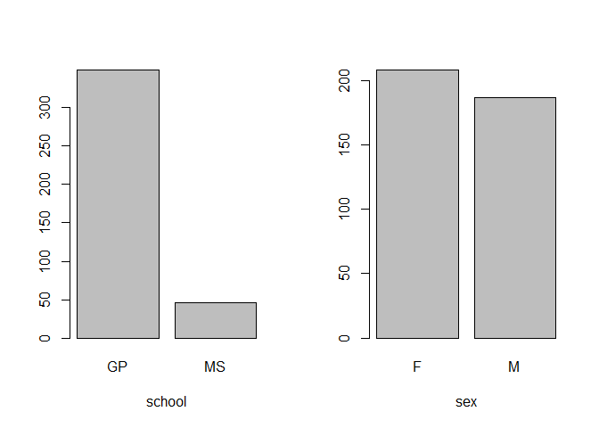<!-- -->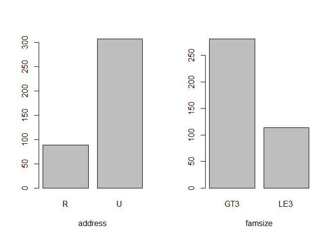<!-- --><!-- --><!-- -->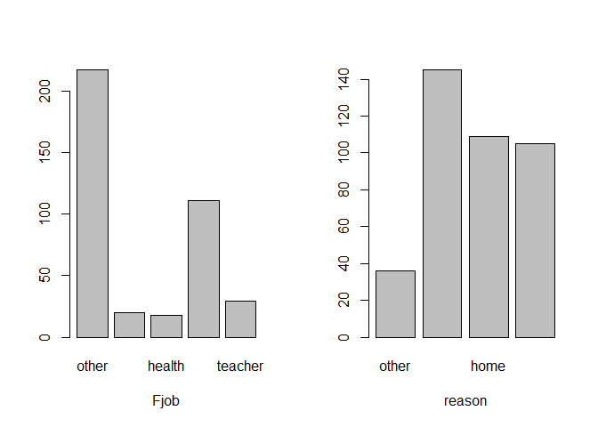<!-- -->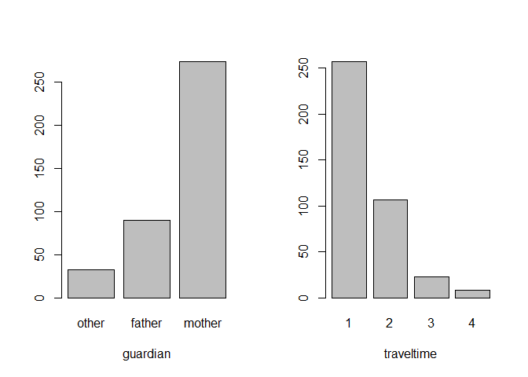<!-- -->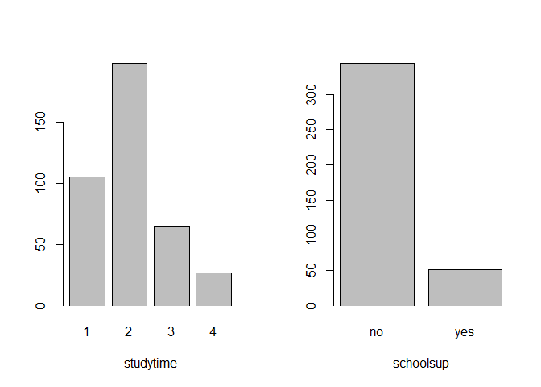<!-- -->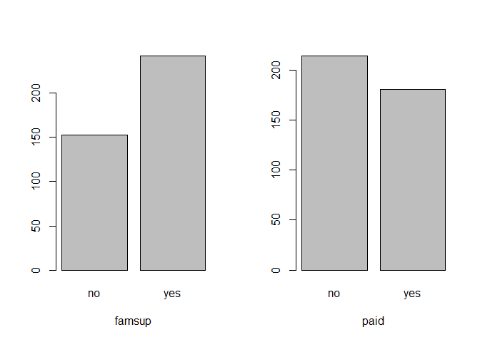<!-- -->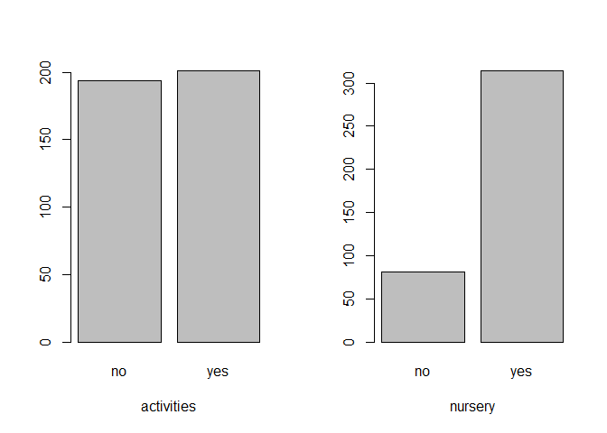<!-- --><!-- --><!-- --><!-- -->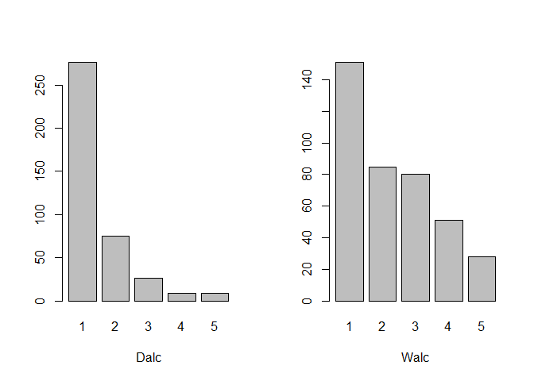<!-- --><!-- -->

<br/> All predictors seem reasonable enough. However even though we have
merely 30 predictors, almost all of them are categorical (nominal or
ordinal). Thus, the number of parameters in the model is much greater.
<br/>

``` r
dim(model.matrix(erasmus_grade ~. - G1 - G2 - G3 , data = student_mat))
```

    ## [1] 395  68

<br/> We see that our model would have 68 parameters (plus thresholds
and possible non-parallel terms as we will see later). The effective
sample size for the ordinal response under proportional odds assumption
(which states in short that the effect of variables is independent of
the response level, i.e., no non-parallel terms in the model) is
$n - \frac{1}{n^2}\sum_i n_i^3$ (*F. E. Harrell. Regression modeling
strategies: with applications to linear models, logistic regression, and
survival analysis. Vol. 608. New York: springer, 2001.*). <br/>

``` r
summary(grade)
```

    ##   F C/D A/B 
    ## 130 165 100

``` r
395 - 1/395^2*(130^3+165^3+100^3)
```

    ## [1] 345.7186

<br/> We see that under under proportional odds assumption , our rule of
thumb suggests that a model for **grade** could support about 17 to 34
parameters.

Now, if we were interested in testing only a specific hypothesis, the
model’s parsimony is not as important. However, since we are also
interested in the predictive performance of our model, 68 parameters are
way too much (we have a significant risk of overfitting and subsequent
poor generalization of the resulting model on new data).

Let us look for redundant variables first. <br/>

    ## 
    ## Redundancy Analysis
    ## 
    ## ~school + sex + age + address + famsize + Pstatus + Medu + Fedu + 
    ##     Mjob + Fjob + reason + guardian + traveltime + studytime + 
    ##     failures + schoolsup + famsup + paid + activities + nursery + 
    ##     higher + internet + romantic + famrel + freetime + goout + 
    ##     Dalc + Walc + health + absences
    ## <environment: 0x000001d88d470540>
    ## 
    ## n: 395   p: 30   nk: 0 
    ## 
    ## Number of NAs:    0 
    ## 
    ## Transformation of target variables forced to be linear
    ## 
    ## R-squared cutoff: 0.95   Type: ordinary 
    ## 
    ## R^2 with which each variable can be predicted from all other variables:
    ## 
    ##     school        sex        age    address    famsize    Pstatus       Medu 
    ##      0.407      0.379      0.487      0.350      0.214      0.211      0.699 
    ##       Fedu       Mjob       Fjob     reason   guardian traveltime  studytime 
    ##      0.561      0.604      0.381      0.229      0.361      0.304      0.363 
    ##   failures  schoolsup     famsup       paid activities    nursery     higher 
    ##      0.348      0.205      0.257      0.323      0.201      0.206      0.304 
    ##   internet   romantic     famrel   freetime      goout       Dalc       Walc 
    ##      0.260      0.212      0.199      0.293      0.394      0.582      0.654 
    ##     health   absences 
    ##      0.244      0.256 
    ## 
    ## No redundant variables

<br/> No variable seems redundant. Thus, we will need to perform the
data reduction another way. Ideally, creating summarizing variables
would be done with the help of experts in the particular field. In this
project, we will have to do. Let’s take a look at cluster analysis,
which groups the predictors based on Spearman’s rank correlation
coefficients. For simplicity’s sake, we treat the ordinal variables as
numerical (by considering only linear polynomial contrasts *poly(.,1)*).
<br/>

``` r
par(mfrow = c(1, 1))
clus <- varclus(~ school + sex + age + address + famsize + Pstatus + poly(Fedu ,1) + poly(Medu ,1) + Mjob + Fjob + reason + guardian + poly(traveltime,1) + poly(studytime,1) + failures + schoolsup + famsup + paid + activities  + nursery  + higher  + internet  + romantic + poly(famrel ,1) + poly(freetime,1) + poly(goout ,1) + poly(Dalc ,1) + poly(Walc ,1) +  poly(health ,1) + absences,data = student_mat)
plot(clus)
```

<!-- -->

<br/> Based on the results, we will combine *Medu* and *Fedu* (mother’s
and father’s education) into one summary score. We will do the same for
*Dalc* and *Walc* (workday and weekend alcohol consumption), *famsup*,
and *paid* (family support and extra paid classes). We will also
simplify *Mjob* and *Fjob* by merely tracking whether either parent is a
teacher, healthcare-related, in civil services, or at home. <br/>

``` r
# Edu
edu <- factor(round((as.numeric(student_mat$Medu) + as.numeric(student_mat$Fedu))/2), ordered = TRUE)  

# Alc
alc <- factor(round((as.numeric(student_mat$Dalc) + as.numeric(student_mat$Walc))/2), ordered = TRUE)

# Extra support
extrasup <- factor(student_mat$famsup == 'yes' | student_mat$paid == 'yes')
levels(extrasup) <- c('no','yes')

# Jobs
at_home <- factor(student_mat$Fjob == 'at_home' | student_mat$Mjob == 'at_home')
levels(at_home) <- c('no','yes')

health <- factor(student_mat$Fjob == 'health' | student_mat$Mjob == 'health')
levels(health) <- c('no','yes')

services <- factor(student_mat$Fjob == 'services' | student_mat$Mjob == 'services')
levels(services) <- c('no','yes')

teacher <- factor(student_mat$Fjob == 'teacher' | student_mat$Mjob == 'teacher')
levels(teacher) <- c('no','yes')
```

<br/> Lastly, we choose to remove the variables *guardian* and *reason*
from the model (we suppose these variables are probably not that
important for predicting the final grades) and the variable *freetime*
(we think its effect is covered in the model by variables
*studytime*,*traveltime* and *goout*). <br/>

``` r
student_mat_final <- student_mat

student_mat_final <- subset(student_mat_final,select = -c(G1,G2,G3, Medu,Fedu,Mjob,Fjob,reason,guardian,famsup,paid,freetime,Dalc,Walc))

student_mat_final <- student_mat_final %>% mutate(edu = edu) %>% mutate(alc = alc) %>% mutate(extrasup = extrasup) %>% mutate(at_home = at_home) %>% mutate(health = health) %>% mutate(services = services) %>% mutate(teacher = teacher) %>% mutate(grade = grade)
```

<br/> Thus, our final full model has 44 parameters corresponding to the
prediction variables (we will consider no interactions) and we can
consider further parameter reduction by lowering the maximum degrees of
polynomial contrasts. We should note that there will also be additional
parameters corresponding to thresholds and non-parallel terms, as we
will see shortly. <br/>

``` r
dim(model.matrix(grade ~ school + sex + age + address + famsize + Pstatus + traveltime + studytime + failures + schoolsup + activities + nursery  + higher  + internet  + romantic + famrel  + goout + health + absences + edu + alc +  extrasup + at_home + services + teacher, data = student_mat_final))
```

    ## [1] 395  44

## Ordered logit model (proportional odds logistic regression)

<br/> To model the ordinal response (in this case, the final grade), we
will use the ordered logit model. Ordered logit models cumulative
distribution functions
$P[Y \leq k ] = \mathrm{ilogit}  (\theta_k - X\beta)$ for ordinal
response $k = 1,2,3, \ldots$. The model is called proportional since the
parameter $\beta$ does not depend on class $k$.

We fit the ordered logit model using the *polr* function from the *MASS*
package. <br/>

``` r
library(MASS)
library(lmtest)

full_model <- polr(grade ~ school + sex + age + address + famsize + Pstatus + traveltime + studytime + failures + schoolsup + activities + nursery + higher + internet + romantic + famrel + goout + health + absences + edu + alc + extrasup + at_home + services + teacher, data = student_mat_final)

# Coefficients
coeftest(full_model)
```

    ## 
    ## t test of coefficients:
    ## 
    ##                 Estimate Std. Error t value  Pr(>|t|)    
    ## schoolMS      -0.0358848  0.3722399 -0.0964 0.9232562    
    ## sexM           0.5419914  0.2410643  2.2483 0.0251771 *  
    ## age           -0.2174880  0.1044705 -2.0818 0.0380856 *  
    ## addressU       0.3509980  0.2840427  1.2357 0.2173903    
    ## famsizeLE3     0.2534106  0.2343587  1.0813 0.2803110    
    ## PstatusT      -0.1859338  0.3447187 -0.5394 0.5899689    
    ## traveltime.L   0.0529510  0.5415957  0.0978 0.9221721    
    ## traveltime.Q   0.0049423  0.4582362  0.0108 0.9914008    
    ## traveltime.C  -0.3077657  0.3614374 -0.8515 0.3950712    
    ## studytime.L    0.6102128  0.3334411  1.8300 0.0680933 .  
    ## studytime.Q   -0.1789694  0.2784313 -0.6428 0.5207894    
    ## studytime.C   -0.5353297  0.2306980 -2.3205 0.0208893 *  
    ## failures      -0.8007194  0.1848087 -4.3327 1.927e-05 ***
    ## schoolsupyes  -1.2743961  0.3391753 -3.7573 0.0002011 ***
    ## activitiesyes  0.0048695  0.2164363  0.0225 0.9820632    
    ## nurseryyes    -0.2100897  0.2677991 -0.7845 0.4332745    
    ## higheryes      0.7657825  0.5665521  1.3517 0.1773589    
    ## internetyes    0.0476574  0.2984135  0.1597 0.8732074    
    ## romanticyes   -0.3303764  0.2336798 -1.4138 0.1583096    
    ## famrel.L       0.6092385  0.4999895  1.2185 0.2238537    
    ## famrel.Q      -0.5052096  0.4464340 -1.1317 0.2585539    
    ## famrel.C       0.4373141  0.4008381  1.0910 0.2760237    
    ## famrel^4      -0.3859728  0.3202428 -1.2053 0.2289209    
    ## goout.L       -0.6860155  0.3674402 -1.8670 0.0627356 .  
    ## goout.Q       -0.0070818  0.3142714 -0.0225 0.9820347    
    ## goout.C        0.2540270  0.2653453  0.9573 0.3390540    
    ## goout^4        0.0785835  0.2075767  0.3786 0.7052325    
    ## health.L      -0.7340511  0.2592175 -2.8318 0.0048965 ** 
    ## health.Q       0.4649659  0.2537041  1.8327 0.0676951 .  
    ## health.C      -0.1568891  0.2785610 -0.5632 0.5736506    
    ## health^4      -0.1107913  0.2559799 -0.4328 0.6654177    
    ## absences      -0.0150582  0.0144088 -1.0451 0.2967126    
    ## edu.L          0.7823652  0.2934492  2.6661 0.0080296 ** 
    ## edu.Q          0.4232825  0.2355902  1.7967 0.0732470 .  
    ## edu.C         -0.0673883  0.2165838 -0.3111 0.7558780    
    ## alc.L         -0.0698644  0.5030853 -0.1389 0.8896312    
    ## alc.Q          0.4078647  0.4499721  0.9064 0.3653360    
    ## alc.C          0.2885623  0.3435102  0.8400 0.4014594    
    ## alc^4         -0.2082599  0.3400904 -0.6124 0.5406931    
    ## extrasupyes   -0.3288710  0.2506905 -1.3119 0.1904268    
    ## at_homeyes    -0.1668150  0.3057067 -0.5457 0.5856404    
    ## servicesyes    0.1343947  0.2182915  0.6157 0.5385149    
    ## teacheryes    -0.6067032  0.3157868 -1.9212 0.0555130 .  
    ## ---
    ## Signif. codes:  0 '***' 0.001 '**' 0.01 '*' 0.05 '.' 0.1 ' ' 1

``` r
# Confidence intervals (profile likelihood)
confint(full_model)
```

    ##                     2.5 %      97.5 %
    ## schoolMS      -0.76910324  0.69303490
    ## sexM           0.07155894  1.01779694
    ## age           -0.42370432 -0.01345584
    ## addressU      -0.20381537  0.91134439
    ## famsizeLE3    -0.20531873  0.71452470
    ## PstatusT      -0.86443273  0.49086134
    ## traveltime.L  -1.03816062  1.10998572
    ## traveltime.Q  -0.90861954  0.90217432
    ## traveltime.C  -1.01907931  0.40324539
    ## studytime.L   -0.04043352  1.27037631
    ## studytime.Q   -0.72637419  0.36739596
    ## studytime.C   -0.99085767 -0.08514861
    ## failures      -1.17942886 -0.45131974
    ## schoolsupyes  -1.94965741 -0.61712948
    ## activitiesyes -0.42002419  0.42930601
    ## nurseryyes    -0.73656616  0.31489316
    ## higheryes     -0.31643560  1.92393633
    ## internetyes   -0.53740294  0.63460224
    ## romanticyes   -0.78999920  0.12706975
    ## famrel.L      -0.35791618  1.61987440
    ## famrel.Q      -1.40339634  0.36041874
    ## famrel.C      -0.34858739  1.22999567
    ## famrel^4      -1.01717453  0.24204010
    ## goout.L       -1.41064654  0.03372574
    ## goout.Q       -0.62368914  0.61180389
    ## goout.C       -0.26546313  0.77621335
    ## goout^4       -0.32838547  0.48614240
    ## health.L      -1.24687411 -0.22914325
    ## health.Q      -0.03071332  0.96513507
    ## health.C      -0.70383001  0.38988345
    ## health^4      -0.61379784  0.39091106
    ## absences      -0.04401321  0.01292166
    ## edu.L          0.21089538  1.36307447
    ## edu.Q         -0.03660196  0.88805987
    ## edu.C         -0.49350338  0.35677021
    ## alc.L         -1.06221960  0.92064247
    ## alc.Q         -0.48010569  1.29182832
    ## alc.C         -0.38421009  0.96679788
    ## alc^4         -0.88076302  0.45634638
    ## extrasupyes   -0.82220889  0.16193116
    ## at_homeyes    -0.76799454  0.43248826
    ## servicesyes   -0.29284016  0.56376483
    ## teacheryes    -1.22919423  0.01085067

<br/> Since we assume no significant interactions, we can use type II
ANOVA to test the main effects in the model. <br/>

``` r
library(car)
Anova(full_model)
```

    ## Analysis of Deviance Table (Type II tests)
    ## 
    ## Response: grade
    ##            LR Chisq Df Pr(>Chisq)    
    ## school       0.0093  1  0.9231245    
    ## sex          5.1034  1  0.0238789 *  
    ## age          4.3662  1  0.0366580 *  
    ## address      1.5364  1  0.2151564    
    ## famsize      1.1714  1  0.2791081    
    ## Pstatus      0.2909  1  0.5896529    
    ## traveltime   1.5057  3  0.6809628    
    ## studytime   10.8915  3  0.0123270 *  
    ## failures    21.5725  1  3.407e-06 ***
    ## schoolsup   14.6469  1  0.0001296 ***
    ## activities   0.0005  1  0.9818698    
    ## nursery      0.6156  1  0.4326836    
    ## higher       1.9007  1  0.1679962    
    ## internet     0.0253  1  0.8736138    
    ## romantic     2.0033  1  0.1569600    
    ## famrel       2.9138  4  0.5723578    
    ## goout        6.9009  4  0.1412201    
    ## health      10.1089  4  0.0386334 *  
    ## absences     1.1075  1  0.2926192    
    ## edu          9.1181  3  0.0277611 *  
    ## alc          2.3569  4  0.6704232    
    ## extrasup     1.7249  1  0.1890689    
    ## at_home      0.2971  1  0.5857131    
    ## services     0.3803  1  0.5374447    
    ## teacher      3.7076  1  0.0541639 .  
    ## ---
    ## Signif. codes:  0 '***' 0.001 '**' 0.01 '*' 0.05 '.' 0.1 ' ' 1

<br/> We see that somewhat significant predictors in the full model
(p-value \< 0.1) are **sex**, **age**, **studytime**, **failures**,
**schoolsup**, **health**, **edu**, and **teacher**.

Now, let us take a look at the predictions. We first compute the linear
predictor and then obtain the cumulative probability (distribution
function). Class probabilities are derived from cumulative probabilities
quite straightforwardly. <br/>

``` r
library(faraway)

# linear predictor (i.e., Xbeta)
model.matrix(full_model)[1:3,2:44] %*% (coefficients(full_model))
```

    ##        [,1]
    ## 1 -5.411375
    ## 2 -3.857494
    ## 3 -6.787019

``` r
# or simply
full_model$lp[1:3]
```

    ##         1         2         3 
    ## -5.411375 -3.857494 -6.787019

``` r
# compute the cumulative probability
prob <- matrix(NA,5,2)
for(i in 1:5){
prob[i,1:2] <- ilogit(full_model$zeta - full_model$lp[i])
}
# compute class probabilities
prob <- cbind(prob[,1],prob[,2]-prob[,1],1-prob[,2])
colnames(prob) <- c('F', 'C/D', 'A/B')
prob
```

    ##               F        C/D        A/B
    ## [1,] 0.70241401 0.25830494 0.03928104
    ## [2,] 0.33290819 0.50504258 0.16204923
    ## [3,] 0.90330195 0.08647246 0.01022559
    ## [4,] 0.08782228 0.41157785 0.50059987
    ## [5,] 0.17701050 0.51326032 0.30972918

``` r
# or simply
predict(full_model, type = 'probs')[1:5,]
```

    ##            F        C/D        A/B
    ## 1 0.70241401 0.25830494 0.03928104
    ## 2 0.33290819 0.50504258 0.16204923
    ## 3 0.90330195 0.08647246 0.01022559
    ## 4 0.08782228 0.41157785 0.50059987
    ## 5 0.17701050 0.51326032 0.30972918

<br/> Unfortunately, the function *predict* for the *polr* model does
not provide confidence intervals. Probably the most straightforward way
to get these is a percentile-based confidence interval based on a simple
nonparametric (pairs) bootstrap. For example, the confidence intervals
for predicted probabilities for the first observation are as follows.
<br/>

``` r
set.seed(123) # for reproducibility
nb <- 2500
probmat <- matrix(NA,nb,3)

colnames(probmat) <- c('F', 'C/D', 'A/B')

for(i in 1:nb){

  student_mat_final_new <-  student_mat_final[sample(nrow(student_mat_final) , rep=TRUE),]
  
  # we skip the iterations in which fit failed to converge
  
  full_model_new <- tryCatch(polr(grade ~ school + sex + age + address + famsize + Pstatus + traveltime + studytime + failures + schoolsup + activities + nursery + higher + internet + romantic + famrel + goout + health + absences + edu + alc + extrasup + at_home + services + teacher, data = student_mat_final_new), error = function(e) {NaN})
  probmat[i,] <- tryCatch({predict(full_model_new, student_mat_final[1,], type = 'probs')}, error = function(e) {NaN})
  
}

boot_ci <- t(apply(probmat,2,function(x) quantile(x[!is.na(x)],c(0.025,0.975))))
boot_ci
```

    ##            2.5%     97.5%
    ## F   0.273016464 0.9471436
    ## C/D 0.048682710 0.5503159
    ## A/B 0.004129889 0.1681113

<br/> Next, let us plot the predicted probabilities vs. individual
predictors using *sjPlot*. We recomputed the model using the *ordinal*
package since *sjPlot* supports it better than *polr* (for which it does
not compute confidence intervals). <br/>

``` r
library(sjPlot)
library(ordinal) 

full_model_clm <- clm(grade ~ school + sex + age + address + famsize + Pstatus + traveltime + studytime + failures + schoolsup + activities + nursery + higher + internet + romantic + famrel + goout + health + absences + edu + alc + extrasup + at_home + services + teacher, data = student_mat_final)
```

<!-- --><!-- --><!-- --><!-- --><!-- --><!-- --><!-- --><!-- --><!-- --><!-- --><!-- --><!-- --><!-- --><!-- --><!-- --><!-- --><!-- --><!-- --><!-- --><!-- --><!-- --><!-- --><!-- --><!-- -->

<br/> From the plots, we see that the model predicts that **males**
perform slightly better. In addition, the predicted probabilities of the
F grade increases increases with **schoolsup**, **failures**, and
**age**. **studytime**, and a low number of **absences** also seems to
improve the grades a bit.

Let us check the model assumptions. Similarly to logistic regression,
the ordered logit directly models the class probabilities. The
assumption concerning the probabilities is *proportional odds
assumption*: $\mathrm{logit}\; P(Y <=j|X_1)$ -
$\mathrm{logit}\; P(Y <=j|X_2) = (X_2-X_1)\beta$, i.e, the effect of $X$
on relative odds does not depend on class $j$ since $\beta$ are
independent of class.

Let us check the reasonability of the proportional odds
assumption.First, we use the function *plot.xmean.ordinaly* from the
*rms* package, which plots the observed means of predictors versus
levels of Y and the estimated expected means of predictors under the
proportional odds assumption. <br/>

``` r
library(rms)
par(mfrow = c(1, 2))
plot.xmean.ordinaly(grade ~ school + sex + age + address + famsize + Pstatus + traveltime + studytime + failures + schoolsup + activities + nursery  + higher  + internet  + romantic + famrel + goout + health + absences + edu + alc +  extrasup + at_home + services + teacher, student_mat_final,cr=FALSE)
```

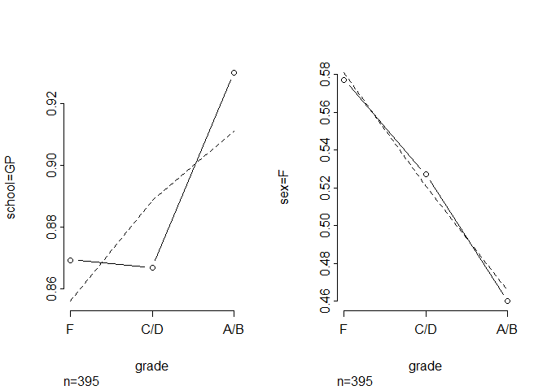<!-- --><!-- --><!-- -->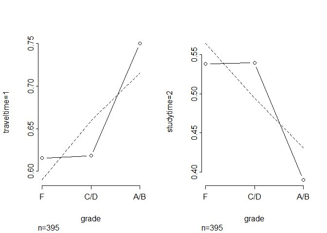<!-- -->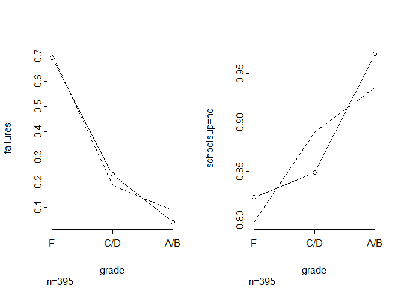<!-- -->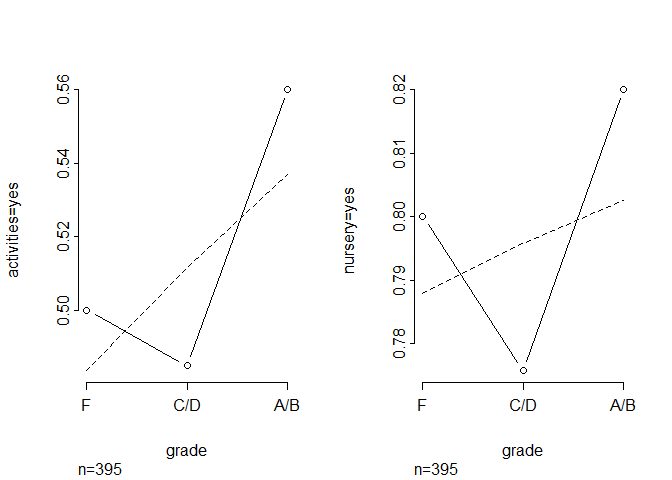<!-- --><!-- --><!-- -->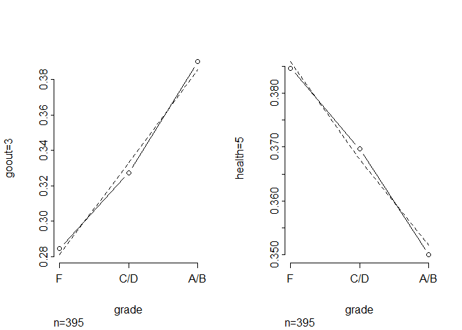<!-- -->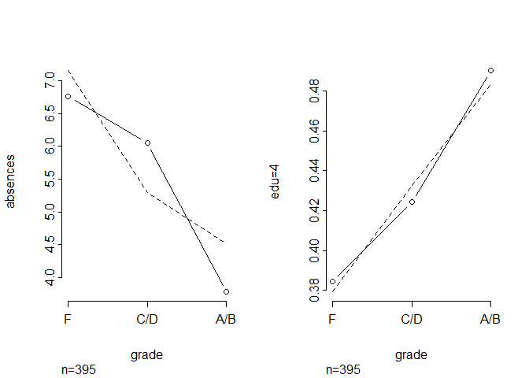<!-- --><!-- --><!-- --><!-- -->

<br/> We see that the proportional odds assumption seem reasonable for
many predictors but it also may be violated for some others. Another
quick test is to look at coefficients logistic regression for events
$Y \leq k$, where $Y$ is the ordinal outcome. Provided that the
proportional odds assumptions holds these coefficients should be
similar. <br/>

``` r
logit1 <- glm(grade <= 'F' ~ school + sex + age + address + famsize + Pstatus + traveltime + studytime + failures + schoolsup + activities + nursery + higher + internet + romantic + famrel + goout + health + absences + edu + alc + extrasup + at_home + services + teacher, family = binomial ,data = student_mat_final)
logit2 <- glm(grade <= 'C/D' ~ school + sex + age + address + famsize + Pstatus + traveltime + studytime + failures + schoolsup + activities + nursery + higher + internet + romantic + famrel + goout + health + absences + edu + alc + extrasup + at_home + services + teacher, family = binomial ,data = student_mat_final)


logitmodels <- cbind(coefficients(logit1),sqrt(diag(vcov(logit1))),coefficients(logit2),sqrt(diag(vcov(logit2))))
colnames(logitmodels) <- c('<=F', 'Std. Error', '<= C/D', 'Std. Error')
round(logitmodels,4)
```

    ##                   <=F Std. Error   <= C/D Std. Error
    ## (Intercept)   -6.6105     2.4370  22.2287  1324.2642
    ## schoolMS      -0.0736     0.4474   0.4538     0.5892
    ## sexM          -0.6153     0.3112  -0.7608     0.3284
    ## age            0.2765     0.1257   0.1649     0.1480
    ## addressU      -0.2128     0.3381  -0.3759     0.4340
    ## famsizeLE3    -0.2971     0.2994  -0.1031     0.3298
    ## PstatusT       0.5128     0.4541   0.0022     0.5265
    ## traveltime.L  -0.1609     0.6941  11.1594  1183.3231
    ## traveltime.Q   0.0693     0.5919   8.0664   881.9971
    ## traveltime.C   0.3540     0.4612   3.9262   394.4414
    ## studytime.L   -0.5509     0.4217  -0.7998     0.4551
    ## studytime.Q    0.3311     0.3505  -0.1896     0.3708
    ## studytime.C    0.3748     0.2923   0.6833     0.3018
    ## failures       0.8095     0.1925   1.1065     0.4801
    ## schoolsupyes   0.9227     0.3859   2.4742     0.6820
    ## activitiesyes  0.0856     0.2639   0.1944     0.3079
    ## nurseryyes     0.2834     0.3354   0.1736     0.3865
    ## higheryes     -0.6385     0.6192 -16.6407  1190.3627
    ## internetyes   -0.1505     0.3527  -0.0335     0.4596
    ## romanticyes    0.4343     0.2848   0.1115     0.3362
    ## famrel.L      -0.2905     0.6815  -0.5143     0.9140
    ## famrel.Q      -0.1555     0.5996   0.9834     0.8097
    ## famrel.C       0.1009     0.5025  -0.8719     0.6350
    ## famrel^4       0.2175     0.3807   0.5041     0.4622
    ## goout.L        1.3703     0.4826  -0.0919     0.5326
    ## goout.Q       -0.1171     0.4046   0.1656     0.4489
    ## goout.C       -0.1834     0.3327  -0.4094     0.3836
    ## goout^4       -0.0054     0.2549   0.0578     0.2896
    ## health.L       0.6174     0.3338   1.0418     0.3513
    ## health.Q      -0.2002     0.3227  -0.7209     0.3525
    ## health.C       0.2369     0.3387   0.1193     0.3777
    ## health^4      -0.1510     0.3127   0.5215     0.3569
    ## absences       0.0119     0.0156   0.0487     0.0290
    ## edu.L         -0.8932     0.3919  -0.9659     0.4024
    ## edu.Q         -0.5586     0.3036  -0.2690     0.3433
    ## edu.C          0.0574     0.2649   0.0813     0.3197
    ## alc.L         -1.1939     0.7786  11.0781  1192.5839
    ## alc.Q         -0.7552     0.6567   7.9822  1007.9174
    ## alc.C         -0.7099     0.4715   5.1294   596.2920
    ## alc^4          0.0139     0.4094   2.7167   225.3780
    ## extrasupyes    0.4010     0.3156   0.2723     0.3549
    ## at_homeyes     0.0829     0.3575   0.3874     0.4741
    ## servicesyes   -0.0768     0.2709  -0.2654     0.3114
    ## teacheryes     1.0299     0.4033   0.3324     0.3989

<br/> One thing to notice is that some coefficients such as **higher**
are very hard to estimate since almost all values of **higher** for the
A/B grade are *yes*. Consequently, we cannot really decide from the data
whether the proportional odds assumption is met for **higher**. We
observe a similar problem for **alc** and **traveltime**. <br/>

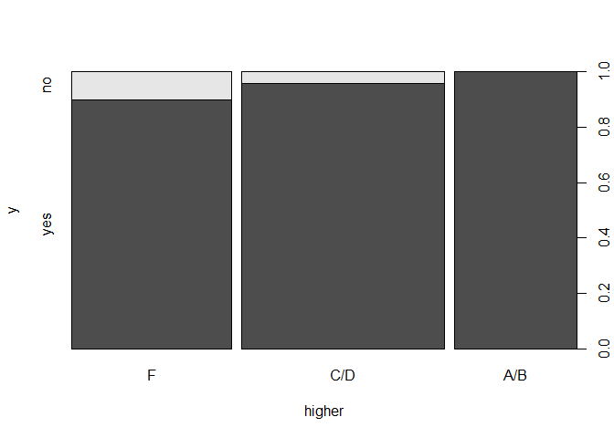<!-- --><!-- --><!-- -->

<br/> Another more formal test from *F. E. Harrell. Regression modeling
strategies: with applications to linear models, logistic regression, and
survival analysis. Vol. 608. New York: springer, 2001.* involves *score
residual* plots. <br/>

``` r
full_model_lrm <- lrm(grade ~ school + sex + age + address + famsize + Pstatus + traveltime + studytime + failures + schoolsup + activities + nursery  + higher  + internet  + romantic + famrel + goout + health + absences + edu + alc +  extrasup + at_home + services + teacher, data = student_mat_final, x=TRUE , y=TRUE )

par(mfrow = c(1, 2))
resid(full_model_lrm , 'score.binary' , pl=TRUE)
```

<!-- --><!-- --><!-- --><!-- --><!-- --><!-- --><!-- --><!-- --><!-- --><!-- --><!-- --><!-- --><!-- --><!-- --><!-- --><!-- --><!-- --><!-- --><!-- --><!-- --><!-- --><!-- -->

<br/> A confidence interval that lies outside of the zero line provides
strong evidence against the proportional odds assumption. We observe
that **alc** and **traveltime** are borderline.

An alternative to the ordered logit is a model where we allow $\beta$ to
vary: $P[Y \leq k ] = \mathrm{ilogit}  (\theta_k - X\beta_k)$. This
model no longer assumes the proportional odds assumption. The price for
the generalization is a much larger number of parameters. Thus, it is
advisable to relax the proportional odds assumption only for some
variables forming the so-called *partial proportional odds model*. The
package *ordinal* provides the *nominal_test* function that fits the
partial proportional odds model for each variable separately and
compares it with the proportional odds model. <br/>

``` r
full_model_clm <- clm(grade ~ school + sex + age + address + famsize + Pstatus + traveltime + studytime + failures + schoolsup + activities + nursery + higher + internet + romantic + famrel + goout + health + absences + edu + alc + extrasup + at_home + services + teacher, data = student_mat_final)
nominal_test(full_model_clm)
```

    ## Tests of nominal effects
    ## 
    ## formula: grade ~ school + sex + age + address + famsize + Pstatus + traveltime + studytime + failures + schoolsup + activities + nursery + higher + internet + romantic + famrel + goout + health + absences + edu + alc + extrasup + at_home + services + teacher
    ##            Df  logLik    AIC     LRT Pr(>Chi)  
    ## <none>        -358.39 806.78                   
    ## school      1 -357.81 807.62  1.1637  0.28069  
    ## sex         1 -358.29 808.57  0.2131  0.64432  
    ## age         1 -358.37 808.75  0.0345  0.85258  
    ## address     1 -357.32 806.64  2.1479  0.14276  
    ## famsize     1 -358.11 808.22  0.5672  0.45137  
    ## Pstatus     1 -357.74 807.49  1.2948  0.25517  
    ## traveltime  3 -355.07 806.13  6.6530  0.08382 .
    ## studytime   3 -356.81 809.63  3.1575  0.36797  
    ## failures    1 -357.72 807.43  1.3511  0.24509  
    ## schoolsup   1 -356.66 805.33  3.4575  0.06296 .
    ## activities  1 -357.94 807.87  0.9143  0.33896  
    ## nursery     1 -358.05 808.10  0.6844  0.40807  
    ## higher      1 -356.84 805.67  3.1134  0.07765 .
    ## internet    1 -358.15 808.29  0.4899  0.48396  
    ## romantic    1 -358.36 808.73  0.0579  0.80977  
    ## famrel      4 -356.91 811.81  2.9708  0.56272  
    ## goout       4 -356.53 811.06  3.7231  0.44477  
    ## health      4 -356.80 811.59  3.1936  0.52596  
    ## absences    1 -357.28 806.56  2.2222  0.13604  
    ## edu         3 -356.96 809.93  2.8571  0.41419  
    ## alc         4 -352.15 802.30 12.4841  0.01409 *
    ## extrasup    1 -358.25 808.49  0.2922  0.58879  
    ## at_home     1 -357.85 807.70  1.0857  0.29744  
    ## services    1 -358.39 808.78  0.0001  0.99258  
    ## teacher     1 -356.54 805.07  3.7126  0.05400 .
    ## ---
    ## Signif. codes:  0 '***' 0.001 '**' 0.01 '*' 0.05 '.' 0.1 ' ' 1

<br/> We observe that partial proportional odds models **traveltime**,
**schoolsup**, and **higher** are almost significant and **alc** is
significant in comparison to the proportional odds model. However, we
have to keep in mind our previous observation that coefficients for
**traveltime**, **higher**, and **alc** were hard to estimate. We can
confirm this fact by checking the convergence of the fits. <br/>

``` r
partial_traveltime_model <- clm(grade ~ school + sex + age + address + famsize + Pstatus  + studytime + failures + schoolsup + activities + nursery + higher + internet + romantic + famrel + goout + health + absences + edu + alc + extrasup + at_home + services + teacher, nominal = ~traveltime, data = student_mat_final)
partial_traveltime_model$convergence
```

    ## $code
    ## [1] 1
    ## 
    ## $messages
    ## [1] "Hessian is numerically singular: parameters are not uniquely determined"
    ## 
    ## $alg.message
    ## [1] "Absolute convergence criterion was met, but relative criterion was not met"

``` r
partial_higher_model <- clm(grade ~ school + sex + age + address + famsize + Pstatus + traveltime + studytime + failures + schoolsup + activities + nursery + internet + romantic + famrel + goout + health + absences + edu + alc + extrasup + at_home + services + teacher,nominal = ~ higher, data = student_mat_final)
partial_higher_model$convergence
```

    ## $code
    ## [1] 1
    ## 
    ## $messages
    ## [1] "Hessian is numerically singular: parameters are not uniquely determined"
    ## 
    ## $alg.message
    ## [1] "Absolute convergence criterion was met, but relative criterion was not met"

``` r
partial_alc_model <- clm(grade ~ school + sex + age + address + famsize + Pstatus + traveltime + studytime + failures + schoolsup + activities + nursery + higher + internet + romantic + famrel + goout + health + absences + edu  + extrasup + at_home + services + teacher,nominal = ~ alc, data = student_mat_final)
partial_alc_model$convergence
```

    ## $code
    ## [1] 1
    ## 
    ## $messages
    ## [1] "Hessian is numerically singular: parameters are not uniquely determined"
    ## 
    ## $alg.message
    ## [1] "Absolute convergence criterion was met, but relative criterion was not met"

<br/> Since **traveltime** and **alc** are ordinal variables, we can
make the fit more stable by considering only polynomial contrasts of
limited order. <br/>

``` r
partial_lin_traveltime_model <- clm(grade ~ school + sex + age + address + famsize + Pstatus  + studytime + failures + schoolsup + activities + nursery + higher + internet + romantic + famrel + goout + health + absences + edu + alc + extrasup + at_home + services + teacher, nominal = ~poly(traveltime,2), data = student_mat_final)
partial_lin_traveltime_model$convergence
```

    ## $code
    ## [1] 0
    ## 
    ## $messages
    ## [1] "successful convergence"
    ## 
    ## $alg.message
    ## [1] "Absolute and relative convergence criteria were met"

``` r
anova(partial_lin_traveltime_model,full_model_clm)
```

    ## Likelihood ratio tests of cumulative link models:
    ##  
    ##                              formula:                                                                                                                                                                                                                                                 
    ## full_model_clm               grade ~ school + sex + age + address + famsize + Pstatus + traveltime + studytime + failures + schoolsup + activities + nursery + higher + internet + romantic + famrel + goout + health + absences + edu + alc + extrasup + at_home + services + teacher
    ## partial_lin_traveltime_model grade ~ school + sex + age + address + famsize + Pstatus + studytime + failures + schoolsup + activities + nursery + higher + internet + romantic + famrel + goout + health + absences + edu + alc + extrasup + at_home + services + teacher             
    ##                              nominal:             link: threshold:
    ## full_model_clm               ~1                   logit flexible  
    ## partial_lin_traveltime_model ~poly(traveltime, 2) logit flexible  
    ## 
    ##                              no.par    AIC  logLik LR.stat df Pr(>Chisq)  
    ## full_model_clm                   45 806.78 -358.39                        
    ## partial_lin_traveltime_model     46 803.66 -355.83   5.123  1    0.02361 *
    ## ---
    ## Signif. codes:  0 '***' 0.001 '**' 0.01 '*' 0.05 '.' 0.1 ' ' 1

``` r
partial_lin_alc_model <- clm(grade ~ school + sex + age + address + famsize + Pstatus + traveltime + studytime + failures + schoolsup + activities + nursery + higher + internet + romantic + famrel + goout + health + absences + edu + extrasup + at_home + services + teacher, nominal = ~poly(alc,3), data = student_mat_final)
partial_lin_alc_model$convergence
```

    ## $code
    ## [1] 0
    ## 
    ## $messages
    ## [1] "successful convergence"
    ## 
    ## $alg.message
    ## [1] "Absolute and relative convergence criteria were met"

``` r
anova(partial_lin_alc_model,full_model_clm)
```

    ## Likelihood ratio tests of cumulative link models:
    ##  
    ##                       formula:                                                                                                                                                                                                                                                 
    ## full_model_clm        grade ~ school + sex + age + address + famsize + Pstatus + traveltime + studytime + failures + schoolsup + activities + nursery + higher + internet + romantic + famrel + goout + health + absences + edu + alc + extrasup + at_home + services + teacher
    ## partial_lin_alc_model grade ~ school + sex + age + address + famsize + Pstatus + traveltime + studytime + failures + schoolsup + activities + nursery + higher + internet + romantic + famrel + goout + health + absences + edu + extrasup + at_home + services + teacher      
    ##                       nominal:      link: threshold:
    ## full_model_clm        ~1            logit flexible  
    ## partial_lin_alc_model ~poly(alc, 3) logit flexible  
    ## 
    ##                       no.par    AIC  logLik LR.stat df Pr(>Chisq)   
    ## full_model_clm            45 806.78 -358.39                         
    ## partial_lin_alc_model     47 800.83 -353.41  9.9586  2   0.006879 **
    ## ---
    ## Signif. codes:  0 '***' 0.001 '**' 0.01 '*' 0.05 '.' 0.1 ' ' 1

<br/> We observe that non-parallel slopes for **traveltime** and
especially **alc** are significant.

Since some “non-parallel” terms seem significant, let us fit a partial
proportion model and check whether are conclusion about important
predictors would change. Our full model includes significant
non-parallel terms (P \< 0.1) with **higher** assumed to be proportional
and polynomial contrasts of a limited order for **traveltime** and
**alc** due to the aforementioned issues. <br/>

``` r
full_model_clm_PP <- clm(grade ~ higher + school + sex + age + address + famsize + Pstatus  + studytime + failures  + activities + nursery  + internet + romantic + famrel + goout + health + absences + edu + extrasup + at_home + services, nominal = ~ poly(traveltime,2) + schoolsup + poly(alc,3) + teacher,data = student_mat_final)
full_model_clm_PP$convergence
```

    ## $code
    ## [1] 0
    ## 
    ## $messages
    ## [1] "successful convergence"
    ## 
    ## $alg.message
    ## [1] "Absolute and relative convergence criteria were met"

``` r
summary(full_model_clm_PP)
```

    ## formula: 
    ## grade ~ higher + school + sex + age + address + famsize + Pstatus + studytime + failures + activities + nursery + internet + romantic + famrel + goout + health + absences + edu + extrasup + at_home + services
    ## nominal: ~poly(traveltime, 2) + schoolsup + poly(alc, 3) + teacher
    ## data:    student_mat_final
    ## 
    ##  link  threshold nobs logLik  AIC    niter max.grad cond.H 
    ##  logit flexible  395  -347.89 795.77 7(0)  9.03e-12 9.3e+05
    ## 
    ## Coefficients:
    ##                 Estimate Std. Error z value Pr(>|z|)    
    ## higheryes      0.7847666  0.5665136   1.385  0.16597    
    ## schoolMS      -0.0424919  0.3793975  -0.112  0.91082    
    ## sexM           0.4874273  0.2444788   1.994  0.04618 *  
    ## age           -0.2210323  0.1049204  -2.107  0.03515 *  
    ## addressU       0.3049173  0.2879298   1.059  0.28960    
    ## famsizeLE3     0.2342215  0.2360744   0.992  0.32112    
    ## PstatusT      -0.2259965  0.3547549  -0.637  0.52409    
    ## studytime.L    0.6266085  0.3438510   1.822  0.06841 .  
    ## studytime.Q   -0.1674845  0.2823172  -0.593  0.55301    
    ## studytime.C   -0.5286737  0.2324245  -2.275  0.02293 *  
    ## failures      -0.8550114  0.1891938  -4.519 6.21e-06 ***
    ## activitiesyes  0.0003662  0.2189887   0.002  0.99867    
    ## nurseryyes    -0.3085901  0.2768627  -1.115  0.26502    
    ## internetyes    0.0594471  0.3010852   0.197  0.84348    
    ## romanticyes   -0.2881676  0.2374502  -1.214  0.22490    
    ## famrel.L       0.4294599  0.5216541   0.823  0.41036    
    ## famrel.Q      -0.3101260  0.4644896  -0.668  0.50434    
    ## famrel.C       0.3236668  0.4171395   0.776  0.43780    
    ## famrel^4      -0.3573955  0.3302233  -1.082  0.27913    
    ## goout.L       -0.7960055  0.3776003  -2.108  0.03503 *  
    ## goout.Q        0.0408315  0.3226049   0.127  0.89928    
    ## goout.C        0.1878241  0.2697094   0.696  0.48618    
    ## goout^4        0.0541678  0.2098781   0.258  0.79634    
    ## health.L      -0.7371911  0.2625634  -2.808  0.00499 ** 
    ## health.Q       0.3791513  0.2549668   1.487  0.13700    
    ## health.C      -0.1921157  0.2842597  -0.676  0.49914    
    ## health^4      -0.1205668  0.2583565  -0.467  0.64074    
    ## absences      -0.0166085  0.0144153  -1.152  0.24926    
    ## edu.L          0.7879556  0.2966603   2.656  0.00791 ** 
    ## edu.Q          0.3729642  0.2405210   1.551  0.12099    
    ## edu.C         -0.0722234  0.2198860  -0.328  0.74257    
    ## extrasupyes   -0.3478726  0.2543151  -1.368  0.17135    
    ## at_homeyes    -0.1469422  0.3086843  -0.476  0.63405    
    ## servicesyes    0.1570651  0.2207288   0.712  0.47673    
    ## ---
    ## Signif. codes:  0 '***' 0.001 '**' 0.01 '*' 0.05 '.' 0.1 ' ' 1
    ## 
    ## Threshold coefficients:
    ##                              Estimate Std. Error z value
    ## F|C/D.(Intercept)             -4.9179     1.9737  -2.492
    ## C/D|A/B.(Intercept)           -2.4770     1.9604  -1.264
    ## F|C/D.poly(traveltime, 2)1    -1.2629     2.6925  -0.469
    ## C/D|A/B.poly(traveltime, 2)1   6.3988     4.0750   1.570
    ## F|C/D.poly(traveltime, 2)2    -1.8995     2.6257  -0.723
    ## C/D|A/B.poly(traveltime, 2)2   0.8797     4.2342   0.208
    ## F|C/D.schoolsupyes             0.9946     0.3738   2.661
    ## C/D|A/B.schoolsupyes           2.2375     0.6522   3.431
    ## F|C/D.poly(alc, 3)1           -2.4044     2.9981  -0.802
    ## C/D|A/B.poly(alc, 3)1          8.0840     3.8993   2.073
    ## F|C/D.poly(alc, 3)2            0.5684     2.7059   0.210
    ## C/D|A/B.poly(alc, 3)2          2.3778     3.9924   0.596
    ## F|C/D.poly(alc, 3)3           -3.9679     2.6864  -1.477
    ## C/D|A/B.poly(alc, 3)3          1.4587     4.0139   0.363
    ## F|C/D.teacheryes               0.9173     0.3586   2.558
    ## C/D|A/B.teacheryes             0.3098     0.3589   0.863

    ##                 LR_stat        
    ## school     1.254728e-02 0.91081
    ## sex        4.001015e+00 0.04547
    ## age        4.466825e+00 0.03456
    ## address    1.124500e+00 0.28895
    ## famsize    9.869907e-01 0.32048
    ## Pstatus    4.067273e-01 0.52364
    ## traveltime 4.775246e+00 0.31115
    ## studytime  1.074150e+01 0.01321
    ## failures   2.374526e+01 0.00000
    ## schoolsup  1.951217e+01 0.00006
    ## activities 2.796637e-06 0.99867
    ## nursery    1.246693e+00 0.26419
    ## higher     1.986453e+00 0.15871
    ## internet   3.899261e-02 0.84346
    ## romantic   1.474104e+00 0.22470
    ## famrel     1.867318e+00 0.76015
    ## goout      7.264941e+00 0.12253
    ## health     9.704210e+00 0.04572
    ## absences   1.341522e+00 0.24677
    ## edu        8.432981e+00 0.03786
    ## alc        1.148299e+01 0.07455
    ## extrasup   1.878919e+00 0.17046
    ## at_home    2.266611e-01 0.63401
    ## services   5.071091e-01 0.47639
    ## teacher    6.659750e+00 0.03580

**sex**,
**age**,**studytime**,**failures**,**schoolsup**,**health**,**edu**,**alc**,
and **teacher** are significant with P \<0.1. An interesting observation
is the following fact: variable **alc** was clearly not significant in
the proportional odds model, but it is significant in partial
proportional odds model. <br/>

``` r
no_alc_model_clm <- clm(grade ~ school + sex + age + address + famsize + Pstatus + traveltime + studytime + failures + schoolsup + activities + nursery + higher + internet + romantic + famrel + goout + health + absences + edu  + extrasup + at_home + services + teacher, data = student_mat_final)

anova(no_alc_model_clm,full_model_clm)
```

    ## Likelihood ratio tests of cumulative link models:
    ##  
    ##                  formula:                                                                                                                                                                                                                                                 
    ## no_alc_model_clm grade ~ school + sex + age + address + famsize + Pstatus + traveltime + studytime + failures + schoolsup + activities + nursery + higher + internet + romantic + famrel + goout + health + absences + edu + extrasup + at_home + services + teacher      
    ## full_model_clm   grade ~ school + sex + age + address + famsize + Pstatus + traveltime + studytime + failures + schoolsup + activities + nursery + higher + internet + romantic + famrel + goout + health + absences + edu + alc + extrasup + at_home + services + teacher
    ##                  link: threshold:
    ## no_alc_model_clm logit flexible  
    ## full_model_clm   logit flexible  
    ## 
    ##                  no.par    AIC  logLik LR.stat df Pr(>Chisq)
    ## no_alc_model_clm     41 801.14 -359.57                      
    ## full_model_clm       45 806.78 -358.39  2.3569  4     0.6704

<br/> We should mention that violating the proportional odds assumption
might not be detrimental. The proportional odds model, even when the
proportional odds assumption is not met, still retains meaning: it
essentially estimates an average odds ratio across the outcome levels,
i.e., it provides a general trend. Where a serious departure can occur
is when investigating the effect on individual outcome levels; see
<https://www.fharrell.com/post/po/> for more details (and our **alc**
example).

Let us compare the predicted probabilities of proportional odds and
partial proportional odds model. We will refit the partial proportional
odds model using the package *VGAM*, since its *predict* provides all
class probabilities. <br/>

``` r
library(VGAM)
full_model_PP <- vglm(grade ~ higher + school + sex + age + address + famsize + Pstatus  + studytime + failures  + activities + nursery  + internet + romantic + famrel + goout + health + absences + edu + extrasup + at_home + services + poly(traveltime,2) + schoolsup + poly(alc,3) + teacher, family = cumulative(parallel = FALSE ~ poly(traveltime,2) + schoolsup + poly(alc,3) + teacher), data = student_mat_final)

# class probabilities
cbind(predict(full_model,type='probs')[1:10,], predict(full_model_PP,type = 'response')[1:10,])
```

    ##             F        C/D        A/B          F       C/D         A/B
    ## 1  0.70241401 0.25830494 0.03928104 0.71797878 0.2560436 0.025977657
    ## 2  0.33290819 0.50504258 0.16204923 0.38556510 0.3928113 0.221623623
    ## 3  0.90330195 0.08647246 0.01022559 0.89245346 0.1043636 0.003182983
    ## 4  0.08782228 0.41157785 0.50059987 0.11778642 0.3098898 0.572323813
    ## 5  0.17701050 0.51326032 0.30972918 0.18392356 0.5265873 0.289489140
    ## 6  0.08313396 0.40127410 0.51559194 0.09033974 0.4292404 0.480419880
    ## 7  0.18620005 0.51713441 0.29666553 0.23663988 0.3977351 0.365624975
    ## 8  0.43198436 0.45540629 0.11260935 0.47750934 0.4533340 0.069156679
    ## 9  0.01877129 0.14666034 0.83456837 0.02603058 0.1040909 0.869878534
    ## 10 0.08715309 0.41015147 0.50269544 0.11200408 0.3018127 0.586183258

``` r
# classified in the same category
sum(max.col(predict(full_model_PP,type = 'response')) == as.numeric(predict(full_model)))
```

    ## [1] 340

<br/> We observe that 86% (~340/395) of observations would be classified
in the same category.

The last thing that we evaluate is residuals. Similarly to the logistic
regression, it is not straightforward to define residuals that help to
assess the model. For this purpose, we will use *surrogate residuals*
proposed by *D. Liu and H. Zhang. Residuals and diagnostics for ordinal
regression models: a surrogate approach.” Journal of the American
Statistical Association 113.522 (2018): 845-854.* specifically for
ordinal models (see
<https://koalaverse.github.io/sure/articles/sure.html> for more
details). Under a well-specified model, the surrogate residuals have a
zero mean and are homoskedastic (i.e., have constant variance
independent of $X$).

Let us compute the surrogate residuals for our partial proportional odds
model model using the *sure package* and plot them vs the linear
predictor and variables we choose to omit. <br/>

``` r
library(sure)

sres <- resids(full_model_clm_PP)

# QQ plot and residuals vs linear predictor
autoplot.resid(sres, what = 'qq') 
```

<!-- -->

``` r
autoplot.resid(sres, what = 'fitted',fit = full_model_clm_PP) 
```

<!-- -->

``` r
# residuals vs variables in the model
autoplot.resid(sres, what = 'covariate',x = student_mat_final$school) 
```

<!-- -->

``` r
autoplot.resid(sres, what = 'covariate',x = student_mat_final$sex) 
```

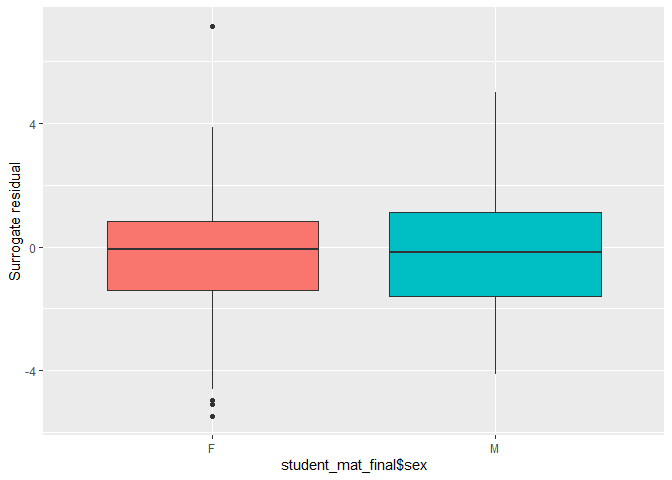<!-- -->

``` r
autoplot.resid(sres, what = 'covariate',x = student_mat_final$age) 
```

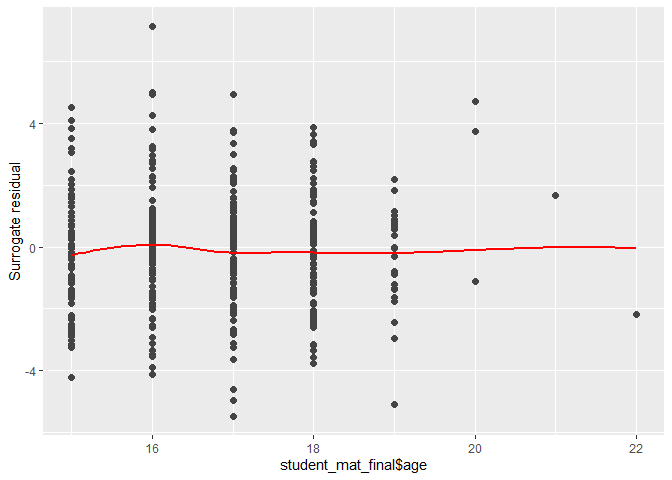<!-- -->

``` r
autoplot.resid(sres, what = 'covariate',x = student_mat_final$address) 
```

<!-- -->

``` r
autoplot.resid(sres, what = 'covariate',x = student_mat_final$famsize) 
```

<!-- -->

``` r
autoplot.resid(sres, what = 'covariate',x = student_mat_final$Pstatus) 
```

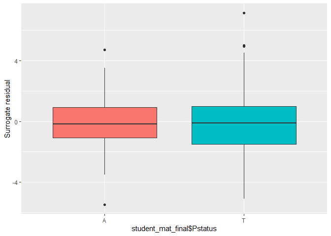<!-- -->

``` r
autoplot.resid(sres, what = 'covariate',x = student_mat_final$traveltime) 
```

<!-- -->

``` r
autoplot.resid(sres, what = 'covariate',x = student_mat_final$studytime) 
```

<!-- -->

``` r
autoplot.resid(sres, what = 'covariate',x = as.factor(student_mat_final$failures))  
```

<!-- -->

``` r
autoplot.resid(sres, what = 'covariate',x = student_mat_final$schoolsup) 
```

<!-- -->

``` r
autoplot.resid(sres, what = 'covariate',x = student_mat_final$activities) 
```

<!-- -->

``` r
autoplot.resid(sres, what = 'covariate',x = student_mat_final$nursery) 
```

<!-- -->

``` r
autoplot.resid(sres, what = 'covariate',x = student_mat_final$higher) 
```

<!-- -->

``` r
autoplot.resid(sres, what = 'covariate',x = student_mat_final$internet) 
```

<!-- -->

``` r
autoplot.resid(sres, what = 'covariate',x = student_mat_final$romantic)
```

<!-- -->

``` r
autoplot.resid(sres, what = 'covariate',x = student_mat_final$famrel)
```

<!-- -->

``` r
autoplot.resid(sres, what = 'covariate',x = student_mat_final$goout)
```

<!-- -->

``` r
autoplot.resid(sres, what = 'covariate',x = student_mat_final$health)
```

<!-- -->

``` r
autoplot.resid(sres, what = 'covariate',x = student_mat_final$absences)
```

<!-- -->

``` r
autoplot.resid(sres, what = 'covariate',x = student_mat_final$edu)
```

<!-- -->

``` r
autoplot.resid(sres, what = 'covariate',x = student_mat_final$alc)
```

<!-- -->

``` r
autoplot.resid(sres, what = 'covariate',x = student_mat_final$extrasup)
```

<!-- -->

``` r
autoplot.resid(sres, what = 'covariate',x = student_mat_final$at_home)
```

<!-- -->

``` r
autoplot.resid(sres, what = 'covariate',x = student_mat_final$services)
```

<!-- -->

``` r
autoplot.resid(sres, what = 'covariate',x = student_mat_final$teacher)
```

<!-- -->

``` r
# residuals vs omitted variables
autoplot.resid(sres, what = 'covariate',x = student_mat$Medu)
```

<!-- -->

``` r
autoplot.resid(sres, what = 'covariate',x = student_mat$Fedu)
```

<!-- -->

``` r
autoplot.resid(sres, what = 'covariate',x = student_mat$Mjob)
```

<!-- -->

``` r
autoplot.resid(sres, what = 'covariate',x = student_mat$Fjob)
```

<!-- -->

``` r
autoplot.resid(sres, what = 'covariate',x = student_mat$Dalc)
```

<!-- -->

``` r
autoplot.resid(sres, what = 'covariate',x = student_mat$Walc)
```

<!-- -->

``` r
autoplot.resid(sres, what = 'covariate',x = student_mat$famsup)
```

<!-- -->

``` r
autoplot.resid(sres, what = 'covariate',x = student_mat$paid)
```

<!-- -->

``` r
autoplot.resid(sres, what = 'covariate',x = student_mat$guardian)
```

<!-- -->

``` r
autoplot.resid(sres, what = 'covariate',x = student_mat$freetime)
```

<!-- -->

``` r
autoplot.resid(sres, what = 'covariate',x = student_mat$reason)
```

<!-- -->

<br/> We see no apparent trends in the residuals. However, the question
always is how much obvious trends in the residuals are “obvious.” For
illustration, let us examine some residual plots for the *obviously*
wrong trivial model. <br/>

``` r
null_model <- polr(grade ~ 1, data = student_mat_final)
sres_null <- resids(null_model)
autoplot.resid(sres_null, what = 'qq') 
```

<!-- -->

``` r
autoplot.resid(sres_null, what = 'fitted',fit = full_model) 
```

<!-- -->

``` r
autoplot.resid(sres_null, what = 'covariate',x = student_mat_final$sex) 
```

<!-- -->

``` r
autoplot.resid(sres_null, what = 'covariate',x = student_mat_final$age) 
```

<!-- -->

``` r
autoplot.resid(sres_null, what = 'covariate',x = student_mat_final$famsize) 
```

<!-- -->

``` r
autoplot.resid(sres_null, what = 'covariate',x = student_mat_final$edu)
```

<!-- -->

``` r
autoplot.resid(sres_null, what = 'covariate',x = as.factor(student_mat_final$failures)) 
```

<!-- -->

``` r
autoplot.resid(sres_null, what = 'covariate',x = student_mat_final$studytime)
```

<!-- -->

``` r
autoplot.resid(sres_null, what = 'covariate',x = student_mat_final$health)
```

<!-- -->

<br/> We observe that some trends (e.g., for **failures** and **edu**)
are quite noticeable, suggesting that these variables should be included
in the model.

The last thing to check is the presence of influential observations. The
package *VGAM* includes some basic functions for such diagnostics. Let
us first plot the hat values (leverages) for each observation. <br/>

``` r
hatplot(full_model_PP)
```

<!-- --><!-- -->

<br/> We observe that some observations might be overly influential. Let
us check, whether deleting observations based on several leverage
thresholds change the fit significantly. <br/>

``` r
lvrg <- hatvalues(full_model_PP)

full_model_red1 <- vglm(grade ~ higher + school + sex + age + address + famsize + Pstatus  + studytime + failures  + activities + nursery  + internet + romantic + famrel + goout + health + absences + edu + extrasup + at_home + services + poly(traveltime,2) + schoolsup + poly(alc,3) + teacher, family = cumulative(parallel = FALSE ~ poly(traveltime,2) + schoolsup + poly(alc,3) + teacher), data = student_mat_final[lvrg[,1]<0.3 & lvrg[,2]<0.3,])


full_model_red2 <- vglm(grade ~ higher + school + sex + age + address + famsize + Pstatus  + studytime + failures  + activities + nursery  + internet + romantic + famrel + goout + health + absences + edu + extrasup + at_home + services + poly(traveltime,2) + schoolsup + poly(alc,3) + teacher, family = cumulative(parallel = FALSE ~ poly(traveltime,2) + schoolsup + poly(alc,3) + teacher), data = student_mat_final[lvrg[,1]<0.2 & lvrg[,2]<0.2,])

full_model_red3 <- vglm(grade ~ higher + school + sex + age + address + famsize + Pstatus  + studytime + failures  + activities + nursery  + internet + romantic + famrel + goout + health + absences + edu + extrasup + at_home + services + poly(traveltime,2) + schoolsup + poly(alc,3) + teacher, family = cumulative(parallel = FALSE ~ poly(traveltime,2) + schoolsup + poly(alc,3) + teacher), data = student_mat_final[lvrg[,1]<0.1 & lvrg[,2]<0.1,])


coeff_delete <- cbind(coefficients(full_model_PP),coefficients(full_model_red1),coefficients(full_model_red2),coefficients(full_model_red3))

colnames(coeff_delete) <- c('All','CD<0.3','CD<0.2','CD<0.1')
coeff_delete
```

    ##                                  All        CD<0.3        CD<0.2       CD<0.1
    ## (Intercept):1          -4.9179818290 -5.0350663906 -5.0913151807 -4.624019720
    ## (Intercept):2          -2.4770793998 -2.6130898948 -2.7612993197 -2.252979109
    ## higheryes              -0.7847658211 -0.7764928362 -0.6127226834 -1.298382330
    ## schoolMS                0.0424916360  0.0469169717  0.0860454543  0.235299407
    ## sexM                   -0.4874351314 -0.4936799839 -0.5305051912 -0.402515844
    ## age                     0.2210353130  0.2249410333  0.2276544508  0.198632271
    ## addressU               -0.3049129172 -0.3023706126 -0.3005153951 -0.775829747
    ## famsizeLE3             -0.2342232638 -0.2282988245 -0.1965969718  0.002575402
    ## PstatusT                0.2259980454  0.2436294877  0.2107574013  0.111568922
    ## studytime.L            -0.6266114592 -0.6505998453 -0.7059999145 -0.697104693
    ## studytime.Q             0.1674837570  0.1526724598  0.2038662526  0.187291708
    ## studytime.C             0.5286733001  0.5243738431  0.4732723036  0.402756074
    ## failures                0.8550109050  0.8558716814  0.9229042697  0.824089134
    ## activitiesyes          -0.0003598167 -0.0006285075  0.0004988787  0.088091909
    ## nurseryyes              0.3085820966  0.3170415563  0.3301395356  0.168485619
    ## internetyes            -0.0594456081 -0.0613500413 -0.0083575857  0.273933202
    ## romanticyes             0.2881652623  0.2846939422  0.2377428719  0.291601504
    ## famrel.L               -0.4294667544 -0.3670177076 -0.6144687625 -0.993339909
    ## famrel.Q                0.3101262229  0.2586560807  0.4150604543  0.601381482
    ## famrel.C               -0.3236652745 -0.2956994239 -0.3691112530 -0.192463877
    ## famrel^4                0.3574002634  0.3501225241  0.3592383538  4.373931613
    ## goout.L                 0.7959935375  0.7970146653  0.9016577628 -2.992424602
    ## goout.Q                -0.0408218681 -0.0317392201  0.0023892149  1.476051320
    ## goout.C                -0.1878333315 -0.1781034414 -0.1382485273 -1.023178913
    ## goout^4                -0.0541659152 -0.0568358638 -0.0603411822  0.945831222
    ## health.L                0.7371957470  0.7366649306  0.7086574248 -0.585501194
    ## health.Q               -0.3791557736 -0.3715272885 -0.3705085017  0.044869019
    ## health.C                0.1921150704  0.1882402071  0.1996725986  0.150885756
    ## health^4                0.1205601461  0.1135455644  0.0931178147 -0.015052444
    ## absences                0.0166082706  0.0167881633  0.0091034133 -0.923620905
    ## edu.L                  -0.7879569551 -0.7961252186 -0.8064892719 -0.324575648
    ## edu.Q                  -0.3729692327 -0.3884233528 -0.3518788094 -0.201724492
    ## edu.C                   0.0722213833  0.0748883263  0.0739797662  0.239193490
    ## extrasupyes             0.3478660840  0.3488992119  0.3565853272  0.374498234
    ## at_homeyes              0.1469331592  0.1427368044  0.0944341472 -0.149473766
    ## servicesyes            -0.1570682166 -0.1618452494 -0.1609308348  0.464062611
    ## poly(traveltime, 2)1:1 -1.2629065383 -1.2542067748 -1.4340507619  3.617384868
    ## poly(traveltime, 2)1:2  6.3986864315  6.5205114102  4.0878616685  0.549638632
    ## poly(traveltime, 2)2:1 -1.8994038474 -1.8843112705 -2.7284007591 -2.790383147
    ## poly(traveltime, 2)2:2  0.8795558715  0.9772575896 -1.2123094569  0.727183317
    ## schoolsupyes:1          0.9946405083  0.9948433917  0.9719984818  2.324805846
    ## schoolsupyes:2          2.2374838990  2.2354830310  2.2321540869 -4.090983208
    ## poly(alc, 3)1:1        -2.4044014179 -2.3137983186 -1.0676704171  1.246931736
    ## poly(alc, 3)1:2         8.0840188396  6.8870667272  5.6697997457  0.867738989
    ## poly(alc, 3)2:1         0.5683951731  0.7060712673  2.0419067333 -2.218148744
    ## poly(alc, 3)2:2         2.3778050142  1.0148146927  0.0954149949 -4.072360329
    ## poly(alc, 3)3:1        -3.9679343344 -3.9233666771 -2.3055302167 -1.522002090
    ## poly(alc, 3)3:2         1.4586478436  0.1708776907 -0.1177101818  1.032554633
    ## teacheryes:1            0.9173475388  0.9278086993  0.8769648143  0.334430774
    ## teacheryes:2            0.3097918136  0.3225576004  0.3410764334 -4.624019720

<br/> We do not observe major changes in the fits, thus, there we found
no reason to consider deleting observations. <br/>

## Continuation ratio model

<br/> Before we conclude the first part of this project, we will take a
brief look at an alternative models of ordinal response. We start with
the *continuation ratio model*. Unlike the proportional odds model, the
continuation ratio (CR) model considers conditional probabilities
$P[Y = k | Y \geq k ] = \mathrm{ilogit}  (\theta_k + X\beta)$.
Essentially, the CR model is a discrete version of the Cox proportional
hazards model used in survival analysis.

A nice property of the CR model is that it can be estimated using the
logistic regression by an appropriate extension of the design matrix
(*F. E. Harrell. Regression modeling strategies: with applications to
linear models, logistic regression, and survival analysis. Vol. 608. New
York: springer, 2001.*). In R, this approach is implemented in the *rms*
package as follows. <br/>

``` r
u <- cr.setup(grade)
student_mat_expanded <- student_mat_final[u$sub , ]
y <- u$y
cohort <- u$cohort
levels(cohort) <- c('>= F','>= C/D')
```

<br/> The CR model is then a logistic regression of *y* against the
*cohort* variable (corresponding to $\theta_k$ in the continuation ratio
model) and the original regressors. <br/>

``` r
cr_model <- glm(y ~ cohort + school + sex + age + address + famsize + Pstatus + traveltime + studytime + failures + schoolsup + activities + nursery  + higher  + internet  + romantic + famrel + goout + health + absences + edu + alc +  extrasup + at_home + services + teacher - 1, data = student_mat_expanded, family = binomial)
anova(cr_model)
```

    ## Analysis of Deviance Table
    ## 
    ## Model: binomial, link: logit
    ## 
    ## Response: y
    ## 
    ## Terms added sequentially (first to last)
    ## 
    ## 
    ##            Df Deviance Resid. Df Resid. Dev  Pr(>Chi)    
    ## NULL                         660     914.95              
    ## cohort      2   63.190       658     851.76 1.899e-14 ***
    ## school      1    2.225       657     849.54 0.1358065    
    ## sex         1    2.948       656     846.59 0.0860047 .  
    ## age         1   12.405       655     834.19 0.0004282 ***
    ## address     1    3.180       654     831.01 0.0745636 .  
    ## famsize     1    0.149       653     830.86 0.6992970    
    ## Pstatus     1    0.017       652     830.84 0.8950775    
    ## traveltime  3    3.782       649     827.06 0.2860279    
    ## studytime   3   20.021       646     807.04 0.0001681 ***
    ## failures    1   40.820       645     766.22 1.669e-10 ***
    ## schoolsup   1   13.381       644     752.84 0.0002542 ***
    ## activities  1    0.099       643     752.74 0.7532160    
    ## nursery     1    0.665       642     752.07 0.4149671    
    ## higher      1    3.107       641     748.97 0.0779390 .  
    ## internet    1    0.245       640     748.72 0.6209715    
    ## romantic    1    2.226       639     746.50 0.1356934    
    ## famrel      4    1.592       635     744.90 0.8102769    
    ## goout       4    7.209       631     737.69 0.1252312    
    ## health      4    9.621       627     728.07 0.0473125 *  
    ## absences    1    1.359       626     726.71 0.2436493    
    ## edu         3    5.745       623     720.97 0.1247045    
    ## alc         4    2.695       619     718.27 0.6101531    
    ## extrasup    1    1.830       618     716.45 0.1761813    
    ## at_home     1    0.344       617     716.10 0.5576743    
    ## services    1    0.430       616     715.67 0.5119988    
    ## teacher     1    3.039       615     712.63 0.0812894 .  
    ## ---
    ## Signif. codes:  0 '***' 0.001 '**' 0.01 '*' 0.05 '.' 0.1 ' ' 1

<br/> We see that predictors that appear to be significant (**sex**,
**age**, **address**,**studytime**, **failures**, **schoolsup**,
**higher**,**health**,**teacher**) are very similar to those in the
proportional odds model.

Computing class probabilities is a bit more involved, requiring the
derivation of unconditional probabilities from the conditional ones.
<br/>

``` r
# probability of F
prob_F <- ilogit(model.matrix(full_model)[,2:44] %*%  coefficients(cr_model)[3:45] + coefficients(cr_model)[1])
resF <- cbind(prob_F,predict(full_model, type = 'probs')[,1])
colnames(resF) <- c('CR','PO')
resF[1:15,]
```

    ##            CR         PO
    ## 1  0.67316954 0.70241401
    ## 2  0.33569682 0.33290819
    ## 3  0.90540754 0.90330195
    ## 4  0.09398778 0.08782228
    ## 5  0.20227340 0.17701050
    ## 6  0.10952104 0.08313396
    ## 7  0.19636092 0.18620005
    ## 8  0.42502213 0.43198436
    ## 9  0.02762402 0.01877129
    ## 10 0.10335120 0.08715309
    ## 11 0.14362328 0.14377042
    ## 12 0.07623399 0.05717500
    ## 13 0.05286033 0.03824585
    ## 14 0.25561085 0.24024167
    ## 15 0.07664132 0.06227082

``` r
# probability of C/D
prob_CD <- (ilogit(model.matrix(full_model)[,2:44] %*%  coefficients(cr_model)[3:45] + coefficients(cr_model)[2]))*
(1-prob_F)
resCD <- cbind(prob_CD,predict(full_model, type = 'probs')[,2])
colnames(resCD) <- c('CR','PO')
resCD[1:15,]
```

    ##            CR         PO
    ## 1  0.30424184 0.25830494
    ## 2  0.50997624 0.50504258
    ## 3  0.09310495 0.08647246
    ## 4  0.36619448 0.41157785
    ## 5  0.49761557 0.51326032
    ## 6  0.39693887 0.40127410
    ## 7  0.49428488 0.51713441
    ## 8  0.47641794 0.45540629
    ## 9  0.15233967 0.14666034
    ## 10 0.38537016 0.41015147
    ## 11 0.44793618 0.49124619
    ## 12 0.32378246 0.32870975
    ## 13 0.25324322 0.25356534
    ## 14 0.51502638 0.52592034
    ## 15 0.32485360 0.34534069

``` r
# probability of A/b
prob_AB <- (1-prob_CD-prob_F)
resAB <- cbind(prob_AB,predict(full_model, type = 'probs')[,3])
colnames(resAB) <- c('CR','PO')
resAB[1:15,]
```

    ##             CR         PO
    ## 1  0.022588621 0.03928104
    ## 2  0.154326939 0.16204923
    ## 3  0.001487503 0.01022559
    ## 4  0.539817734 0.50059987
    ## 5  0.300111032 0.30972918
    ## 6  0.493540087 0.51559194
    ## 7  0.309354199 0.29666553
    ## 8  0.098559930 0.11260935
    ## 9  0.820036313 0.83456837
    ## 10 0.511278641 0.50269544
    ## 11 0.408440541 0.36498338
    ## 12 0.599983546 0.61411525
    ## 13 0.693896448 0.70818882
    ## 14 0.229362763 0.23383800
    ## 15 0.598505078 0.59238848

<br/> We observe that the predicted probabilities generally align with
those provided by the ordered logit model. We can check how much the
predicted classes differ overall. <br/>

``` r
pred_cr <- cbind(resF[,1],resCD[,1],resAB[,1])
sum(max.col(pred_cr) == as.numeric(predict(full_model)))
```

    ## [1] 369

<br/> We see that the predicted classes are the same in 93% (~369/395)
of all cases. We should note that an alternative method for fitting the
CR model is available via the *VGAM* package. <br/>

``` r
library(VGAM)
cr_vglm <- vglm(grade ~ school + sex + age + address + famsize + Pstatus + traveltime + studytime + failures + schoolsup + activities + nursery  + higher  + internet  + romantic + famrel + goout + health + absences + edu + alc +  extrasup + at_home + services + teacher, data = student_mat_final, family=cratio(parallel = TRUE))

# same coefficients (just opposite signs)
coefficients(cr_vglm)
```

    ## (Intercept):1 (Intercept):2      schoolMS          sexM           age 
    ##   3.702186790   1.824378687  -0.060638127   0.486080847  -0.180354465 
    ##      addressU    famsizeLE3      PstatusT  traveltime.L  traveltime.Q 
    ##   0.333038275   0.206644492  -0.139376412  -0.017139028   0.004124383 
    ##  traveltime.C   studytime.L   studytime.Q   studytime.C      failures 
    ##  -0.256317702   0.557619832  -0.122080609  -0.500728117  -0.751862223 
    ##  schoolsupyes activitiesyes    nurseryyes     higheryes   internetyes 
    ##  -1.176088908  -0.003392557  -0.224294648   0.838967551   0.061726423 
    ##   romanticyes      famrel.L      famrel.Q      famrel.C      famrel^4 
    ##  -0.277414425   0.556710500  -0.542914021   0.448518152  -0.335119209 
    ##       goout.L       goout.Q       goout.C       goout^4      health.L 
    ##  -0.571680394  -0.013434100   0.209111158   0.063413399  -0.674738993 
    ##      health.Q      health.C      health^4      absences         edu.L 
    ##   0.389634494  -0.110375030  -0.160299185  -0.016139295   0.720961407 
    ##         edu.Q         edu.C         alc.L         alc.Q         alc.C 
    ##   0.354521835  -0.081670406  -0.177940724   0.352631379   0.164589481 
    ##         alc^4   extrasupyes    at_homeyes   servicesyes    teacheryes 
    ##  -0.266526489  -0.303241944  -0.173641531   0.103283954  -0.504266529

``` r
coefficients(cr_model)
```

    ##    cohort>= F  cohort>= C/D      schoolMS          sexM           age 
    ##  -3.702318768  -1.824497747   0.060631251  -0.486090770   0.180362469 
    ##      addressU    famsizeLE3      PstatusT  traveltime.L  traveltime.Q 
    ##  -0.333033127  -0.206641807   0.139378513   0.017142201  -0.004120884 
    ##  traveltime.C   studytime.L   studytime.Q   studytime.C      failures 
    ##   0.256315816  -0.557618130   0.122092850   0.500727311   0.751868830 
    ##  schoolsupyes activitiesyes    nurseryyes     higheryes   internetyes 
    ##   1.176082148   0.003399997   0.224285116  -0.838960961  -0.061721324 
    ##   romanticyes      famrel.L      famrel.Q      famrel.C      famrel^4 
    ##   0.277419250  -0.556718132   0.542911950  -0.448517518   0.335124662 
    ##       goout.L       goout.Q       goout.C       goout^4      health.L 
    ##   0.571686937   0.013456228  -0.209114676  -0.063415224   0.674739963 
    ##      health.Q      health.C      health^4      absences         edu.L 
    ##  -0.389646474   0.110386436   0.160289620   0.016137517  -0.720968053 
    ##         edu.Q         edu.C         alc.L         alc.Q         alc.C 
    ##  -0.354539846   0.081673394   0.177915118  -0.352637963  -0.164586579 
    ##         alc^4   extrasupyes    at_homeyes   servicesyes    teacheryes 
    ##   0.266535728   0.303243024   0.173635259  -0.103290755   0.504284458

``` r
# same predicted probabilities
predict(cr_vglm,type = 'response')[1:15,]
```

    ##          [,1]       [,2]       [,3]
    ## 1  0.67317135 0.30424006 0.02258859
    ## 2  0.33569844 0.50997433 0.15432723
    ## 3  0.90541005 0.09310251 0.00148744
    ## 4  0.09398726 0.36619055 0.53982218
    ## 5  0.20227620 0.49761465 0.30010915
    ## 6  0.10952394 0.39694128 0.49353478
    ## 7  0.19635925 0.49428144 0.30935931
    ## 8  0.42502706 0.47641445 0.09855849
    ## 9  0.02762488 0.15234201 0.82003311
    ## 10 0.10335049 0.38536595 0.51128357
    ## 11 0.14362198 0.44793184 0.40844617
    ## 12 0.07623531 0.32378323 0.59998146
    ## 13 0.05286199 0.25324654 0.69389146
    ## 14 0.25561344 0.51502470 0.22936185
    ## 15 0.07664154 0.32485145 0.59850701

``` r
pred_cr[1:15,]
```

    ##          [,1]       [,2]        [,3]
    ## 1  0.67316954 0.30424184 0.022588621
    ## 2  0.33569682 0.50997624 0.154326939
    ## 3  0.90540754 0.09310495 0.001487503
    ## 4  0.09398778 0.36619448 0.539817734
    ## 5  0.20227340 0.49761557 0.300111032
    ## 6  0.10952104 0.39693887 0.493540087
    ## 7  0.19636092 0.49428488 0.309354199
    ## 8  0.42502213 0.47641794 0.098559930
    ## 9  0.02762402 0.15233967 0.820036313
    ## 10 0.10335120 0.38537016 0.511278641
    ## 11 0.14362328 0.44793618 0.408440541
    ## 12 0.07623399 0.32378246 0.599983546
    ## 13 0.05286033 0.25324322 0.693896448
    ## 14 0.25561085 0.51502638 0.229362763
    ## 15 0.07664132 0.32485360 0.598505078

<br/> The CR model is not inherently better than the proportional odds
model. However, its main advantage over the proportional odds model is
the fact that its “parallel slopes assumption” ($\beta$ does not depend
on class) is much more easily relaxed than in the proportional odds
model (which requires specialized software). One just needs to include
interaction terms with the *cohort* in the logit model (*F. E. Harrell.
Regression modeling strategies: with applications to linear models,
logistic regression, and survival analysis. Vol. 608. New York:
springer, 2001.*). <br/>

``` r
cr_model_inter <- glm(y ~ cohort*(school + sex + age + address + famsize + Pstatus + traveltime + studytime + failures + schoolsup + activities + nursery  + higher  + internet  + romantic + famrel + goout + health + absences + edu + alc +  extrasup + at_home + services + teacher) - 1, data = student_mat_expanded, family = binomial)

anova(cr_model,cr_model_inter)
```

    ## Analysis of Deviance Table
    ## 
    ## Model 1: y ~ cohort + school + sex + age + address + famsize + Pstatus + 
    ##     traveltime + studytime + failures + schoolsup + activities + 
    ##     nursery + higher + internet + romantic + famrel + goout + 
    ##     health + absences + edu + alc + extrasup + at_home + services + 
    ##     teacher - 1
    ## Model 2: y ~ cohort * (school + sex + age + address + famsize + Pstatus + 
    ##     traveltime + studytime + failures + schoolsup + activities + 
    ##     nursery + higher + internet + romantic + famrel + goout + 
    ##     health + absences + edu + alc + extrasup + at_home + services + 
    ##     teacher) - 1
    ##   Resid. Df Resid. Dev Df Deviance Pr(>Chi)
    ## 1       615     712.63                     
    ## 2       572     660.35 43   52.283   0.1568

<br/> We observe that the difference between the two CR models is not
significant, which suggests that the parallel slopes assumption in the
CR model is overall somewhat justified. <br/>

## Adjacent categories model

<br/> The next ordinal response model we will discuss here is an
adjacent categories model. The probabilities in the model are given as
$\mathrm{log}  \frac{p_k}{p_{k+1}} = \theta_k + X\beta$. The adjacent
categories mode can be fitted via the *VGAM* package. <br/>

``` r
ac_vglm <- vglm(grade ~ school + sex + age + address + famsize + Pstatus + traveltime + studytime + failures + schoolsup + activities + nursery  + higher  + internet  + romantic + famrel + goout + health + absences + edu + alc +  extrasup + at_home + services + teacher, data = student_mat_final, family=acat(parallel = TRUE))
```

<br/> Let us check the significant predictors. <br/>

``` r
Anova(ac_vglm)
```

    ## Analysis of Deviance Table (Type II tests)
    ## 
    ## Response: grade
    ##            Df   Chisq Pr(>Chisq)    
    ## school      1  0.0067  0.9347141    
    ## sex         1  6.0981  0.0135329 *  
    ## age         1  4.1778  0.0409571 *  
    ## address     1  1.4127  0.2346130    
    ## famsize     1  0.8622  0.3531366    
    ## Pstatus     1  0.4344  0.5098373    
    ## traveltime  3  1.1248  0.7711024    
    ## studytime   3 10.2915  0.0162439 *  
    ## failures    1 17.6053  2.718e-05 ***
    ## schoolsup   1 14.1769  0.0001664 ***
    ## activities  1  0.0754  0.7836929    
    ## nursery     1  0.5552  0.4561823    
    ## higher      1  2.2105  0.1370748    
    ## internet    1  0.0904  0.7636747    
    ## romantic    1  1.9378  0.1639073    
    ## famrel      4  2.4213  0.6587789    
    ## goout       4  6.8334  0.1449593    
    ## health      4 10.0202  0.0400886 *  
    ## absences    1  1.3720  0.2414737    
    ## edu         3  8.8955  0.0307127 *  
    ## alc         4  2.0944  0.7183958    
    ## extrasup    1  1.9196  0.1659052    
    ## at_home     1  0.3749  0.5403265    
    ## services    1  0.4214  0.5162565    
    ## teacher     1  4.0203  0.0449551 *  
    ## ---
    ## Signif. codes:  0 '***' 0.001 '**' 0.01 '*' 0.05 '.' 0.1 ' ' 1

<br/> The significant predictors are **sex**,**age**, **studytime**,
**failures**, **schoolsup**, **health**, **edu**, and **teacher**, which
is similar to the proportional odds model and the continual ratio model.
We can again compare the predictions of the model <br/>

``` r
sum(max.col(predict(ac_vglm ,type='response')) == as.numeric(predict(full_model)))
```

    ## [1] 380

<br/> We see that about 96% (~380/395) of the observations has the same
predicted class as in the proportional odds model. Again, we could
consider the model with non-parallel slopes. We could suspect based on
our observations for the proportional odds model that **alc** violates
the parallel slopes condition. <br/>

``` r
ac_vglm_alc_PP <- vglm(grade ~ school + sex + age + address + famsize + Pstatus + traveltime + studytime + failures + schoolsup + activities + nursery  + higher  + internet  + romantic + famrel + goout + health + absences + edu + alc +  extrasup + at_home + services + teacher, data = student_mat_final, family=acat(parallel = FALSE ~ alc))
anova(ac_vglm,ac_vglm_alc_PP,type = 'I')
```

    ## Analysis of Deviance Table
    ## 
    ## Model 1: grade ~ school + sex + age + address + famsize + Pstatus + traveltime + 
    ##     studytime + failures + schoolsup + activities + nursery + 
    ##     higher + internet + romantic + famrel + goout + health + 
    ##     absences + edu + alc + extrasup + at_home + services + teacher
    ## Model 2: grade ~ school + sex + age + address + famsize + Pstatus + traveltime + 
    ##     studytime + failures + schoolsup + activities + nursery + 
    ##     higher + internet + romantic + famrel + goout + health + 
    ##     absences + edu + alc + extrasup + at_home + services + teacher
    ##   Resid. Df Resid. Dev Df Deviance Pr(>Chi)  
    ## 1       745     711.94                       
    ## 2       741     699.97  4   11.975  0.01754 *
    ## ---
    ## Signif. codes:  0 '***' 0.001 '**' 0.01 '*' 0.05 '.' 0.1 ' ' 1

<br/> Indeed, it seems that it does. Again, we could then observe that
in the non-parallel model **alc** is somewhat significant whereas in the
plain adjacent categories model it was not. <br/>

``` r
ac_vglm_noalc <- vglm(grade ~ school + sex + age + address + famsize + Pstatus + traveltime + studytime + failures + schoolsup + activities + nursery  + higher  + internet  + romantic + famrel + goout + health + absences + edu +  extrasup + at_home + services + teacher, data = student_mat_final, family=acat(parallel = TRUE))
anova(ac_vglm_noalc,ac_vglm_alc_PP,type = 'I')
```

    ## Analysis of Deviance Table
    ## 
    ## Model 1: grade ~ school + sex + age + address + famsize + Pstatus + traveltime + 
    ##     studytime + failures + schoolsup + activities + nursery + 
    ##     higher + internet + romantic + famrel + goout + health + 
    ##     absences + edu + extrasup + at_home + services + teacher
    ## Model 2: grade ~ school + sex + age + address + famsize + Pstatus + traveltime + 
    ##     studytime + failures + schoolsup + activities + nursery + 
    ##     higher + internet + romantic + famrel + goout + health + 
    ##     absences + edu + alc + extrasup + at_home + services + teacher
    ##   Resid. Df Resid. Dev Df Deviance Pr(>Chi)  
    ## 1       749     714.08                       
    ## 2       741     699.97  8   14.109  0.07898 .
    ## ---
    ## Signif. codes:  0 '***' 0.001 '**' 0.01 '*' 0.05 '.' 0.1 ' ' 1

<br/> Overall, we could repeat all the steps for the adjacent categories
model as we did for the proportional odds model. <br/>

## Multinomial logistic regression

<br/> The last model that should be mentioned here is the multinomial
logit model. This model assumes nominal categorical response, i.e, it
assumes that there is no particular order for resposne categories. In
other words, it corresponds to the model in which there are no
“parallel” terms. Thus, this model has the largest number of parameters.
The model is described by the equations
$\mathrm{log}\; \frac{p_i}{p_1} = X\beta_i$, where $i = 2,3,\ldots$.
<br/>

``` r
multi_model <- vglm(grade ~ school + sex + age + address + famsize + Pstatus + traveltime + studytime + failures + schoolsup + activities + nursery + higher + internet + romantic + famrel + goout + health + absences + edu + alc + extrasup + at_home + services + teacher, family=multinomial,data = student_mat_final)
multi_model
```

    ## 
    ## Call:
    ## vglm(formula = grade ~ school + sex + age + address + famsize + 
    ##     Pstatus + traveltime + studytime + failures + schoolsup + 
    ##     activities + nursery + higher + internet + romantic + famrel + 
    ##     goout + health + absences + edu + alc + extrasup + at_home + 
    ##     services + teacher, family = multinomial, data = student_mat_final)
    ## 
    ## 
    ## Coefficients:
    ##   (Intercept):1   (Intercept):2      schoolMS:1      schoolMS:2          sexM:1 
    ##    17.231120132    23.362959869     0.383036313     0.496704407    -1.052384727 
    ##          sexM:2           age:1           age:2      addressU:1      addressU:2 
    ##    -0.622961766     0.329687789     0.077392147    -0.423604504    -0.354865464 
    ##    famsizeLE3:1    famsizeLE3:2      PstatusT:1      PstatusT:2  traveltime.L:1 
    ##    -0.250748342    -0.015547885     0.399649929    -0.183318848    10.925779312 
    ##  traveltime.L:2  traveltime.Q:1  traveltime.Q:2  traveltime.C:1  traveltime.C:2 
    ##    11.145383912     8.076678564     7.985593671     4.124506223     3.826192000 
    ##   studytime.L:1   studytime.L:2   studytime.Q:1   studytime.Q:2   studytime.C:1 
    ##    -0.970066909    -0.736840070     0.070155662    -0.324144301     0.809584277 
    ##   studytime.C:2      failures:1      failures:2  schoolsupyes:1  schoolsupyes:2 
    ##     0.618363749     1.478336496     0.781494992     2.817121480     2.324779744 
    ## activitiesyes:1 activitiesyes:2    nurseryyes:1    nurseryyes:2     higheryes:1 
    ##     0.268500056     0.162303005     0.339761174     0.115265442   -16.756184365 
    ##     higheryes:2   internetyes:1   internetyes:2   romanticyes:1   romanticyes:2 
    ##   -16.393743787    -0.113475716     0.008938607     0.373953794    -0.026633209 
    ##      famrel.L:1      famrel.L:2      famrel.Q:1      famrel.Q:2      famrel.C:1 
    ##    -0.634656165    -0.473249509     0.705769970     1.102894193    -0.631596239 
    ##      famrel.C:2      famrel^4:1      famrel^4:2       goout.L:1       goout.L:2 
    ##    -0.982340746     0.566177726     0.473194125     0.876826160    -0.550243759 
    ##       goout.Q:1       goout.Q:2       goout.C:1       goout.C:2       goout^4:1 
    ##     0.036814293     0.129120458    -0.498456189    -0.349857376     0.108531339 
    ##       goout^4:2      health.L:1      health.L:2      health.Q:1      health.Q:2 
    ##     0.055331110     1.297853242     0.921849409    -0.719118568    -0.728417034 
    ##      health.C:1      health.C:2      health^4:1      health^4:2      absences:1 
    ##     0.271353654     0.066726182     0.315839052     0.606845534     0.052822366 
    ##      absences:2         edu.L:1         edu.L:2         edu.Q:1         edu.Q:2 
    ##     0.046782639    -1.442140252    -0.764507745    -0.592421125    -0.105202891 
    ##         edu.C:1         edu.C:2         alc.L:1         alc.L:2         alc.Q:1 
    ##     0.095247090     0.034489301     9.819600182    11.412917721     7.352346941 
    ##         alc.Q:2         alc.C:1         alc.C:2         alc^4:1         alc^4:2 
    ##     8.037465354     4.528400705     5.297745528     2.624313697     2.715122251 
    ##   extrasupyes:1   extrasupyes:2    at_homeyes:1    at_homeyes:2   servicesyes:1 
    ##     0.487578330     0.151368452     0.372499585     0.393094441    -0.291619453 
    ##   servicesyes:2    teacheryes:1    teacheryes:2 
    ##    -0.261345557     1.032891356    -0.007409919 
    ## 
    ## Degrees of Freedom: 790 Total; 702 Residual
    ## Residual deviance: 659.2147 
    ## Log-likelihood: -329.6073 
    ## 
    ## This is a multinomial logit model with 3 levels

<br/> We can again check the significant predictors. <br/>

``` r
Anova(multi_model)
```

    ## Analysis of Deviance Table (Type II tests)
    ## 
    ## Response: grade
    ##            Df   Chisq Pr(>Chisq)    
    ## school      2  0.6498  0.7226058    
    ## sex         2  6.9861  0.0304073 *  
    ## age         2  4.8192  0.0898492 .  
    ## address     2  0.7961  0.6716324    
    ## famsize     2  0.6327  0.7288097    
    ## Pstatus     2  1.5302  0.4652813    
    ## traveltime  6  2.2825  0.8919740    
    ## studytime   6 13.0124  0.0428401 *  
    ## failures    2 18.2066  0.0001113 ***
    ## schoolsup   2 14.7969  0.0006122 ***
    ## activities  2  0.5601  0.7557492    
    ## nursery     2  0.6442  0.7246373    
    ## higher      2  0.3476  0.8404667    
    ## internet    2  0.1173  0.9430297    
    ## romantic    2  1.9140  0.3840341    
    ## famrel      8  4.3280  0.8263850    
    ## goout       8 12.7327  0.1213834    
    ## health      8 15.7916  0.0454617 *  
    ## absences    2  2.9605  0.2275802    
    ## edu         6  9.8658  0.1304191    
    ## alc         8 11.7321  0.1635639    
    ## extrasup    2  1.5445  0.4619770    
    ## at_home     2  0.6656  0.7169179    
    ## services    2  0.7668  0.6815465    
    ## teacher     2  6.3796  0.0411797 *  
    ## ---
    ## Signif. codes:  0 '***' 0.001 '**' 0.01 '*' 0.05 '.' 0.1 ' ' 1

<br/> The significant predictors (P \<0.1) are **sex**,**age**,
**studytime**, **failures**, **schoolsup**,**health**, and **teacher**,
which is similar to the other models we have considered. We can also
compare the predictions of the model <br/>

``` r
sum(max.col(predict(multi_model ,type='response')) == as.numeric(predict(full_model)))
```

    ## [1] 289

<br/> We see that about 73% (~289/395) of the observations has the same
predicted class as in the proportional odds model. Thus, these models
are quite different. The multinomial logit is the most flexible model we
have considered but it has about two times the number of parameters than
the proportional odds model and thus, there is the greatest risk of
overfitting and the greatest risk of poor generalization to new data.

We will conclude Part One here. In the second part of this
demonstration, we examine the predictive performance of our four models
and discuss the results. <br/>
