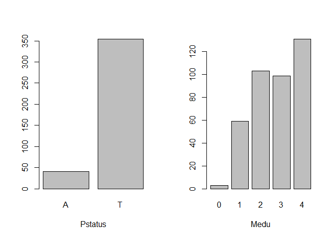
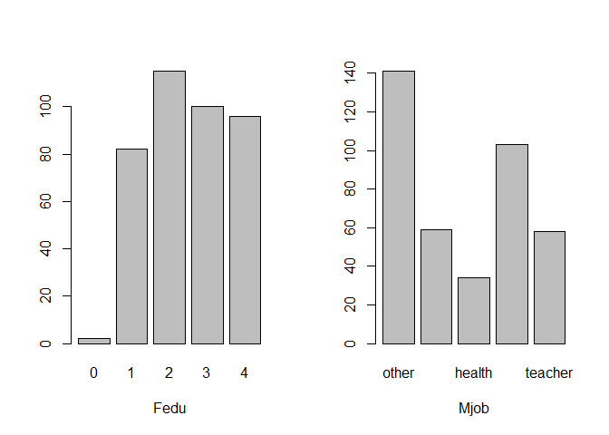
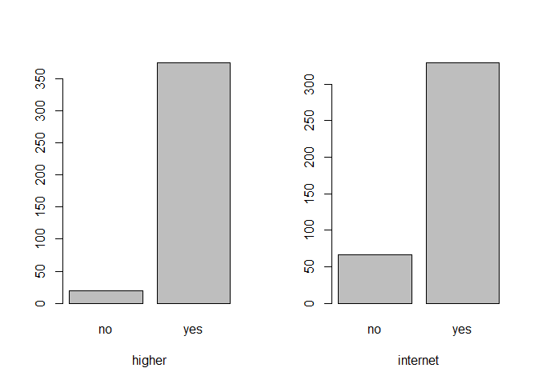
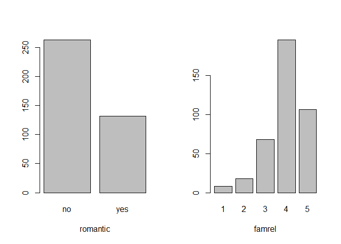
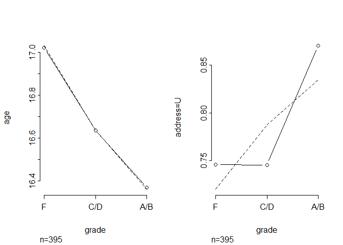
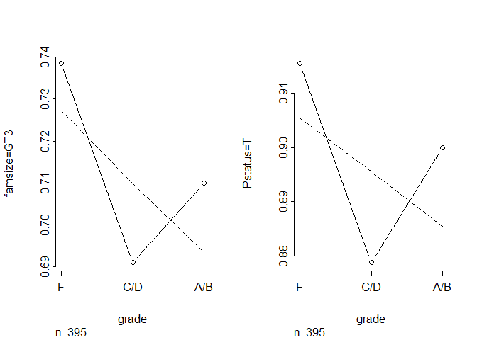
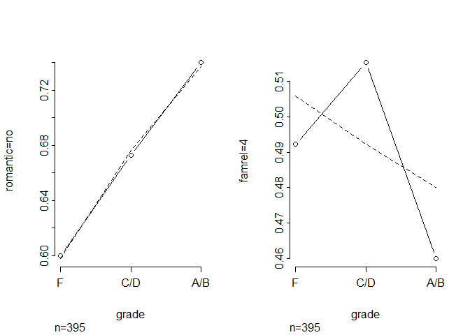
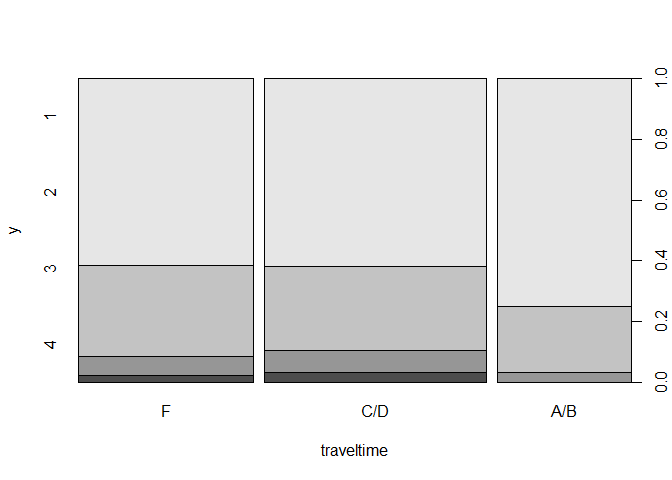

# The Third Circle: Ordinal Regression, Part One

<br/>
Jiří Fejlek

2025-06-7
<br/>

<br/> In this project, we will model an ordinal outcome, i.e.,
categorical data with a natural order. We will mainly cover the ordered
logit model (proportional odds logistic regression). We will also
briefly cover the continuation ratio model.

Our primary goal is to develop a model for predicting students’ math
final grades, but we will also be interested in identifying predictors
that have the greatest impact. We will split this presentation into two
parts. In the first part, we will describe the data preparation and
exploration and then fit the models. In the second part, we will
validate the final model obtained in the first part and discuss the
results. <br/>

## Predicting Grades for the School Year

<br/> The dataset used in this project is obtained from
<https://www.kaggle.com/code/janiobachmann/predicting-grades-for-the-school-year>
dataset, and this dataset originates from the paper *P. Cortez and A. M.
Gonçalves Silva. Using data mining to predict secondary school student
performance. (2008).* The data were collected during the 2005-2006
school year from two public secondary schools in the Alentejo region of
Portugal. The dataset was built from two sources: school reports and
questionnaires. <br/>

- **sex**
- **age**
- **school** - *Gabriel Pereira* or *Mousinho da Silveira*
- **address** - student’s home address type (urban or rural)
- **Pstatus** - parent’s cohabitation status (together or apart)
- **Medu** - mother’s education (0 – none, 1 – primary education (4th
  grade), 2 – 5th to 9th grade, 3 – secondary education or 4 – higher
  education)
- **Mjob** - mother’s job (teacher, health care related, civil services
  (e.g., administrative or police), at home or other)
- **Fedu** - father’s education
- **Fjob** - father’s job
- **guardian** - student’s guardian
- **famsize** - lesser than three or greater than three
- **famrel** - from 1 – very bad to 5 – excellent
- **reason** - reason to choose this school
- **traveltime** - home to school travel time (1 – \< 15 min., 2 – 15 to
  30 min., 3 – 30 min. to 1 hour or 4 – \> 1 hour)
- **studytime** - weekly study time (1 – \< 2 hours, 2 – 2 to 5 hours, 3
  – 5 to 10 hours or 4 – \> 10 hours)
- **failures** - number of past class failures (n if 1 ≤ n \< 3, else 4)
- **schoolsup** - extra educational school support
- **famsup** - family educational support
- **activities** - extra-curricular activities
- **paidclass** - extra paid classes
- **internet** - Internet access at home
- **nursery** - attended nursery school
- **higher** - wants to take higher education
- **romantic** - with a romantic relationship
- **freetime** - free time after school (from 1 – very low to 5 – very
  high)
- **goout** - going out with friends (from 1 – very low to 5 – very
  high)
- **Walc** - weekend alcohol consumption (from 1 – very low to 5 – very
  high)
- **Dalc** - workday alcohol consumption (from 1 – very low to 5 – very
  high)
- **health** - current health status (from 1 – very bad to 5 – very
  good)
- **absences** - number of school absences
- **G1** - first period grade
- **G2** - second period grade
- **G3** - final grade

## Initial Data Exploration

<br/> We start with the data exploration. Let’s load the dataset and
take a look. <br/>

``` r
library(readr)
student_mat <- read_csv('C:/Users/elini/Desktop/nine circles/student-mat.csv')
head(student_mat)
```

    ## # A tibble: 6 × 33
    ##   school sex     age address famsize Pstatus  Medu  Fedu Mjob     Fjob    reason
    ##   <chr>  <chr> <dbl> <chr>   <chr>   <chr>   <dbl> <dbl> <chr>    <chr>   <chr> 
    ## 1 GP     F        18 U       GT3     A           4     4 at_home  teacher course
    ## 2 GP     F        17 U       GT3     T           1     1 at_home  other   course
    ## 3 GP     F        15 U       LE3     T           1     1 at_home  other   other 
    ## 4 GP     F        15 U       GT3     T           4     2 health   servic… home  
    ## 5 GP     F        16 U       GT3     T           3     3 other    other   home  
    ## 6 GP     M        16 U       LE3     T           4     3 services other   reput…
    ## # ℹ 22 more variables: guardian <chr>, traveltime <dbl>, studytime <dbl>,
    ## #   failures <dbl>, schoolsup <chr>, famsup <chr>, paid <chr>,
    ## #   activities <chr>, nursery <chr>, higher <chr>, internet <chr>,
    ## #   romantic <chr>, famrel <dbl>, freetime <dbl>, goout <dbl>, Dalc <dbl>,
    ## #   Walc <dbl>, health <dbl>, absences <dbl>, G1 <dbl>, G2 <dbl>, G3 <dbl>

<br/> We have 395 observations, 30 predictors, and three outcomes: the
first-period grade, the second-period grade, and the final grade. In
this project, we will model the final grade using 30 predictors
(excluding the period grades in the model). First, we convert the final
grade via the Erasmus grade conversion system to obtain an ordinal
outcome (and thus, we can demonstrate the models for ordinal outcomes).
<br/>

``` r
library(tibble)
library(dplyr)

G3 <- student_mat$G3
student_mat$G3 <- factor(case_when(G3 > 15 ~ 'A', G3 > 13 & G3 < 16 ~ 'B',  G3 > 11 & G3 < 14 ~ 'C',  G3 > 9 & G3 < 12 ~ 'D' , G3 < 10 ~ 'F'))

student_mat <- student_mat %>% rename(grade = G3)
student_mat <- subset(student_mat,select =  -c(G1,G2))
```

<br/> Let’s check if any data is missing. <br/>

``` r
any(duplicated(student_mat))
```

    ## [1] FALSE

``` r
any(is.na(student_mat))
```

    ## [1] FALSE

<br/> Next, we convert the variables to the correct types. <br/>

``` r
student_mat$grade  <- factor(student_mat$grade, ordered = TRUE, levels=rev(levels(student_mat$grade)))
student_mat$school  <- factor(student_mat$school)
student_mat$sex  <- factor(student_mat$sex)
student_mat$address  <- factor(student_mat$address)
student_mat$famsize   <- factor(student_mat$famsize)
student_mat$Pstatus   <- factor(student_mat$Pstatus)
student_mat$Medu     <- factor(student_mat$Medu, ordered = TRUE)
student_mat$Fedu     <- factor(student_mat$Fedu, ordered = TRUE)
student_mat$Mjob   <- factor(student_mat$Mjob)
student_mat$Mjob <- relevel(student_mat$Mjob, ref = 'other')
student_mat$Fjob  <- factor(student_mat$Fjob)
student_mat$Fjob <- relevel(student_mat$Fjob, ref = 'other')
student_mat$reason  <- factor(student_mat$reason)
student_mat$reason <- relevel(student_mat$reason, ref = 'other')
student_mat$guardian   <- factor(student_mat$guardian)
student_mat$guardian <- relevel(student_mat$guardian, ref = 'other')
student_mat$traveltime  <- factor(student_mat$traveltime, ordered = TRUE)
student_mat$studytime   <- factor(student_mat$studytime, ordered = TRUE)
student_mat$schoolsup  <- factor(student_mat$schoolsup)
student_mat$famsup  <- factor(student_mat$famsup)
student_mat$paid <- factor(student_mat$paid)
student_mat$activities <- factor(student_mat$activities)
student_mat$nursery <- factor(student_mat$nursery)
student_mat$higher <- factor(student_mat$higher)
student_mat$internet <- factor(student_mat$internet)
student_mat$romantic <- factor(student_mat$romantic)
student_mat$famrel <- factor(student_mat$famrel, ordered = TRUE)
student_mat$freetime <- factor(student_mat$freetime, ordered = TRUE)
student_mat$goout <- factor(student_mat$goout, ordered = TRUE)
student_mat$Dalc <- factor(student_mat$Dalc, ordered = TRUE)
student_mat$Walc <- factor(student_mat$Walc, ordered = TRUE)
student_mat$health <- factor(student_mat$health, ordered = TRUE)
```

<br/> Let us check the predictors. <br/>

<!-- --><!-- --><!-- --><!-- --><!-- --><!-- --><!-- --><!-- --><!-- --><!-- --><!-- --><!-- --><!-- --><!-- --><!-- --><!-- --><!-- --><!-- --><!-- --><!-- --><!-- --><!-- --><!-- --><!-- --><!-- --><!-- --><!-- -->

<br/> All predictors seem reasonable enough. However, even though we
have merely 30 predictors, almost all of them are categorical (nominal
or ordinal). Thus, the number of parameters in the model is much
greater. <br/>

``` r
dim(model.matrix(grade ~ . , data = student_mat))
```

    ## [1] 395  68

<br/> We see that our model would have 68 parameters (plus intercepts).
The effective sample size for the ordinal response is
$n - \frac{1}{n^2}\sum_i n_i^3$ (*F. E. Harrell. Regression modeling
strategies: with applications to linear models, logistic regression, and
survival analysis. Vol. 608. New York: springer, 2001.*). <br/>

``` r
summary(student_mat$grade)
```

    ##   F   D   C   B   A 
    ## 130 103  62  60  40

``` r
395 - 1/395^2*(40^3+60^3+62^3+103^3+130^3)
```

    ## [1] 370.5933

<br/> Our rule of thumb suggests that our model could support about 19
to 37 parameters. Now, if we were interested in testing only a specific
hypothesis, the model’s parsimony is not as important. However, since we
are also interested in the predictive performance of our model, 68
parameters are way too much (we have a significant risk of overfitting
and subsequent poor generalization of the resulting model on new data).

Let us look for redundant variables first. <br/>

``` r
library(Hmisc)
```

    ## 
    ## Attaching package: 'Hmisc'

    ## The following objects are masked from 'package:dplyr':
    ## 
    ##     src, summarize

    ## The following objects are masked from 'package:base':
    ## 
    ##     format.pval, units

``` r
redun(~.- grade ,data = student_mat,nk = 0, r2 = 0.95)
```

    ## 
    ## Redundancy Analysis
    ## 
    ## ~school + sex + age + address + famsize + Pstatus + Medu + Fedu + 
    ##     Mjob + Fjob + reason + guardian + traveltime + studytime + 
    ##     failures + schoolsup + famsup + paid + activities + nursery + 
    ##     higher + internet + romantic + famrel + freetime + goout + 
    ##     Dalc + Walc + health + absences
    ## <environment: 0x00000251a347eaf0>
    ## 
    ## n: 395   p: 30   nk: 0 
    ## 
    ## Number of NAs:    0 
    ## 
    ## Transformation of target variables forced to be linear
    ## 
    ## R-squared cutoff: 0.95   Type: ordinary 
    ## 
    ## R^2 with which each variable can be predicted from all other variables:
    ## 
    ##     school        sex        age    address    famsize    Pstatus       Medu 
    ##      0.407      0.379      0.487      0.350      0.214      0.211      0.699 
    ##       Fedu       Mjob       Fjob     reason   guardian traveltime  studytime 
    ##      0.561      0.604      0.381      0.229      0.361      0.304      0.363 
    ##   failures  schoolsup     famsup       paid activities    nursery     higher 
    ##      0.348      0.205      0.257      0.323      0.201      0.206      0.304 
    ##   internet   romantic     famrel   freetime      goout       Dalc       Walc 
    ##      0.260      0.212      0.199      0.293      0.394      0.582      0.654 
    ##     health   absences 
    ##      0.244      0.256 
    ## 
    ## No redundant variables

<br/> No variable seems redundant. Thus, we will need to perform the
data reduction the hard way. Ideally, creating summarizing variables
would be done with the help of experts in the particular field. In this
project, we will have to do. Let’s take a look at cluster analysis,
which groups the predictors based on Spearman’s rank correlation
coefficients. For simplicity’s sake, we treat the ordinal variables as
numerical (by considering only linear polynomial contrasts *poly(.,1)*).
<br/>

``` r
clus <- varclus(~ school + sex + age + address + famsize + Pstatus + poly(Fedu ,1) + poly(Medu ,1) + Mjob + Fjob + reason + guardian + poly(traveltime,1) + poly(studytime,1) + failures + schoolsup + famsup + paid + activities  + nursery  + higher  + internet  + romantic + poly(famrel ,1) + poly(freetime,1) + poly(goout ,1) + poly(Dalc ,1) + poly(Walc ,1) +  poly(health ,1) + absences,data = student_mat)
plot(clus)
```

<!-- -->

<br/> Based on the results, we will combine *Medu* and *Fedu* (mother’s
and father’s education) into one summary score. We will do the same for
*Dalc* and *Walc* (workday and weekend alcohol consumption), *famsup*,
and *paid* (family support and extra paid classes). We will also
simplify *Mjob* and *Fjob* by merely tracking whether either parent is a
teacher, healthcare-related, in civil services, or at home. <br/>

``` r
# Edu
edu <- factor(round((as.numeric(student_mat$Medu) + as.numeric(student_mat$Fedu))/2), ordered = TRUE)  

# Alc
alc <- factor(round((as.numeric(student_mat$Dalc) + as.numeric(student_mat$Walc))/2), ordered = TRUE)

# Extra support
extrasup <- factor(student_mat$famsup == 'yes' | student_mat$paid == 'yes')
levels(extrasup) <- c('no','yes')

# Jobs
at_home <- factor(student_mat$Fjob == 'at_home' | student_mat$Mjob == 'at_home')
levels(at_home) <- c('no','yes')

health <- factor(student_mat$Fjob == 'health' | student_mat$Mjob == 'health')
levels(health) <- c('no','yes')

services <- factor(student_mat$Fjob == 'services' | student_mat$Mjob == 'services')
levels(services) <- c('no','yes')

teacher <- factor(student_mat$Fjob == 'teacher' | student_mat$Mjob == 'teacher')
levels(teacher) <- c('no','yes')
```

<br/> Lastly, we choose to remove the variables *guardian* and *reason*
from the model (we think these variables are probably not that important
for predicting the final grades) and the variable *freetime* (we think
its effect is covered in the model by variables *studytime*,*traveltime*
and *goout*). <br/>

``` r
student_mat_final <- student_mat
student_mat_final <- subset(student_mat_final,select = -c(Medu,Fedu,Mjob,Fjob,reason,guardian,famsup,paid,freetime,Dalc,Walc))

student_mat_final <- student_mat_final %>% mutate(edu = edu) %>% mutate(alc = alc) %>% mutate(extrasup = extrasup) %>% mutate(at_home = at_home) %>% mutate(health = health) %>% mutate(services = services) %>% mutate(teacher = teacher)  
```

<br/> Thus, our final full model has 44 parameters corresponding to the
prediction variables (we will consider no interactions). We should note
that there will also be four intercepts in the model, as we will see
shortly. <br/>

``` r
dim(model.matrix(grade ~ school + sex + age + address + famsize + Pstatus + traveltime + studytime + failures + schoolsup + activities + nursery  + higher  + internet  + romantic + famrel  + goout + health + absences + edu + alc +  extrasup + at_home + services + teacher, data = student_mat_final))
```

    ## [1] 395  44

## Ordered logit model (proportional odds logistic regression)

<br/> To model the ordinal response (in this case, the final grade), we
will use the ordered logit model. Ordered logit models cumulative
distribution functions
$P[Y \leq k ] = \mathrm{ilogit}\, (\theta_k - X\beta)$ for ordinal
response $k = 1,2,3, \ldots$. The model is called proportional since the
parameter $\beta$ does not depend on class $k$.

We fit the ordered logit model using the *polr* function from the *MASS*
package. <br/>

``` r
library(MASS)
library(lmtest)

full_model <- polr(grade ~ school + sex + age + address + famsize + Pstatus + traveltime + studytime + failures + schoolsup + activities + nursery + higher + internet + romantic + famrel + goout + health + absences + edu + alc + extrasup + at_home + services + teacher, data = student_mat_final)

# Coefficients
coeftest(full_model)
```

    ## 
    ## t test of coefficients:
    ## 
    ##                Estimate Std. Error t value  Pr(>|t|)    
    ## schoolMS      -0.074950   0.354249 -0.2116 0.8325636    
    ## sexM           0.594577   0.225960  2.6313 0.0088834 ** 
    ## age           -0.197427   0.100954 -1.9556 0.0513092 .  
    ## addressU       0.241439   0.270893  0.8913 0.3733996    
    ## famsizeLE3     0.394558   0.221998  1.7773 0.0763912 .  
    ## PstatusT      -0.155846   0.326272 -0.4777 0.6331940    
    ## traveltime.L  -0.229040   0.510575 -0.4486 0.6540048    
    ## traveltime.Q  -0.216588   0.432559 -0.5007 0.6168894    
    ## traveltime.C  -0.406040   0.341469 -1.1891 0.2352125    
    ## studytime.L    0.599845   0.317801  1.8875 0.0599269 .  
    ## studytime.Q   -0.073818   0.260350 -0.2835 0.7769348    
    ## studytime.C   -0.466215   0.216062 -2.1578 0.0316281 *  
    ## failures      -0.782643   0.177723 -4.4037 1.418e-05 ***
    ## schoolsupyes  -1.265133   0.329537 -3.8391 0.0001467 ***
    ## activitiesyes -0.088770   0.206277 -0.4303 0.6672132    
    ## nurseryyes    -0.114864   0.249064 -0.4612 0.6449566    
    ## higheryes      0.682926   0.553512  1.2338 0.2181082    
    ## internetyes    0.045745   0.283724  0.1612 0.8720057    
    ## romanticyes   -0.195604   0.221892 -0.8815 0.3786410    
    ## famrel.L       0.248851   0.462591  0.5380 0.5909550    
    ## famrel.Q      -0.155900   0.414188 -0.3764 0.7068506    
    ## famrel.C       0.235133   0.372757  0.6308 0.5285883    
    ## famrel^4      -0.245763   0.299373 -0.8209 0.4122492    
    ## goout.L       -0.493846   0.358846 -1.3762 0.1696429    
    ## goout.Q       -0.035810   0.307916 -0.1163 0.9074825    
    ## goout.C        0.331183   0.253336  1.3073 0.1919795    
    ## goout^4        0.015784   0.195111  0.0809 0.9355700    
    ## health.L      -0.593804   0.237493 -2.5003 0.0128683 *  
    ## health.Q       0.360295   0.237031  1.5200 0.1294111    
    ## health.C      -0.165758   0.259700 -0.6383 0.5237184    
    ## health^4      -0.156958   0.242163 -0.6482 0.5173140    
    ## absences      -0.013525   0.013760 -0.9829 0.3263442    
    ## edu.L          0.712425   0.269090  2.6475 0.0084770 ** 
    ## edu.Q          0.450814   0.222457  2.0265 0.0434736 *  
    ## edu.C         -0.129461   0.207759 -0.6231 0.5336048    
    ## alc.L          0.019520   0.474482  0.0411 0.9672087    
    ## alc.Q          0.570236   0.429035  1.3291 0.1846814    
    ## alc.C          0.297228   0.330838  0.8984 0.3695883    
    ## alc^4         -0.091181   0.320665 -0.2843 0.7763121    
    ## extrasupyes   -0.373708   0.235006 -1.5902 0.1126971    
    ## at_homeyes    -0.100482   0.293728 -0.3421 0.7324886    
    ## servicesyes    0.210992   0.206154  1.0235 0.3067964    
    ## teacheryes    -0.510211   0.296106 -1.7231 0.0857646 .  
    ## ---
    ## Signif. codes:  0 '***' 0.001 '**' 0.01 '*' 0.05 '.' 0.1 ' ' 1

``` r
# Confidence intervals (profile likelihood)
confint(full_model)
```

    ##                     2.5 %        97.5 %
    ## schoolMS      -0.77397949  0.6175077497
    ## sexM           0.15311429  1.0397992648
    ## age           -0.39674679 -0.0005634016
    ## addressU      -0.28861705  0.7749052032
    ## famsizeLE3    -0.04034971  0.8307906618
    ## PstatusT      -0.79362641  0.4890447028
    ## traveltime.L  -1.25819836  0.7669932200
    ## traveltime.Q  -1.07853048  0.6309188538
    ## traveltime.C  -1.07555919  0.2676499198
    ## studytime.L   -0.02274582  1.2258096602
    ## studytime.Q   -0.58741940  0.4352150748
    ## studytime.C   -0.89106466 -0.0431258734
    ## failures      -1.14681164 -0.4464691525
    ## schoolsupyes  -1.92119233 -0.6264813642
    ## activitiesyes -0.49389585  0.3153855979
    ## nurseryyes    -0.60263891  0.3750324155
    ## higheryes     -0.36979551  1.8207396562
    ## internetyes   -0.50852710  0.6056834182
    ## romanticyes   -0.63182176  0.2387845022
    ## famrel.L      -0.65035417  1.1842875440
    ## famrel.Q      -0.98669510  0.6525998908
    ## famrel.C      -0.50142866  0.9669300055
    ## famrel^4      -0.83300763  0.3442359593
    ## goout.L       -1.19909184  0.2108922221
    ## goout.Q       -0.64099045  0.5686907654
    ## goout.C       -0.16425247  0.8300901284
    ## goout^4       -0.36675018  0.3986955383
    ## health.L      -1.06095337 -0.1288227599
    ## health.Q      -0.10428712  0.8258498405
    ## health.C      -0.67587174  0.3435754421
    ## health^4      -0.63248049  0.3177840884
    ## absences      -0.04114847  0.0132317243
    ## edu.L          0.18688330  1.2431550283
    ## edu.Q          0.01605217  0.8889738115
    ## edu.C         -0.53852607  0.2769429729
    ## alc.L         -0.92115969  0.9532786984
    ## alc.Q         -0.27936313  1.4113319168
    ## alc.C         -0.35018189  0.9511927675
    ## alc^4         -0.72529053  0.5353200270
    ## extrasupyes   -0.83508041  0.0871622283
    ## at_homeyes    -0.67814092  0.4749887419
    ## servicesyes   -0.19271339  0.6160627703
    ## teacheryes    -1.09347239  0.0691331384

<br/> For ordinal variables, similar to numerical variables, we can
consider altering the complexity of the fit in terms of nonlinearity. By
default, R uses orthonormal polynomial contrast up to order $n-1$, where
$n$ is a number of levels of the ordinal variable. Let us compare the
full model with a model that includes only linear polynomial contrasts
for all ordinal predictors. <br/>

``` r
lin_model <- polr(grade ~ school + sex + age + address + famsize + Pstatus + poly(traveltime,1) + poly(studytime,1) + failures + schoolsup + activities + nursery  + higher  + internet  + romantic + poly(famrel ,1) + poly(goout ,1) + poly(health ,1) + absences + poly(edu ,1) + poly(alc ,1) +  extrasup + at_home + services + teacher, data = student_mat_final)

anova(full_model,lin_model)
```

    ## Likelihood ratio tests of ordinal regression models
    ## 
    ## Response: grade
    ##                                                                                                                                                                                                                                                                                                              Model
    ## 1 school + sex + age + address + famsize + Pstatus + poly(traveltime, 1) + poly(studytime, 1) + failures + schoolsup + activities + nursery + higher + internet + romantic + poly(famrel, 1) + poly(goout, 1) + poly(health, 1) + absences + poly(edu, 1) + poly(alc, 1) + extrasup + at_home + services + teacher
    ## 2                                                                school + sex + age + address + famsize + Pstatus + traveltime + studytime + failures + schoolsup + activities + nursery + higher + internet + romantic + famrel + goout + health + absences + edu + alc + extrasup + at_home + services + teacher
    ##   Resid. df Resid. Dev   Test    Df LR stat.   Pr(Chi)
    ## 1       366   1088.833                                
    ## 2       348   1070.510 1 vs 2    18  18.3233 0.4345532

<br/> We observe that the difference is not significant, i.e., ordinal
variables in the model seem to influence the outcome linearly, or in
other words, evenly per their levels. We will retain the full model for
hypothesis testing, although we can consider this simplification when
constructing the predictive model.

Since we assume no significant interactions, we can use type II ANOVA to
test the main effects in the model. <br/>

``` r
library(car)
Anova(full_model)
```

    ## Analysis of Deviance Table (Type II tests)
    ## 
    ## Response: grade
    ##            LR Chisq Df Pr(>Chisq)    
    ## school       0.0445  1   0.832931    
    ## sex          6.9800  1   0.008243 ** 
    ## age          3.8635  1   0.049348 *  
    ## address      0.7958  1   0.372349    
    ## famsize      3.1622  1   0.075359 .  
    ## Pstatus      0.2271  1   0.633680    
    ## traveltime   1.9908  3   0.574316    
    ## studytime   10.3839  3   0.015569 *  
    ## failures    22.2694  1  2.370e-06 ***
    ## schoolsup   15.2745  1  9.296e-05 ***
    ## activities   0.1854  1   0.666812    
    ## nursery      0.2217  1   0.637716    
    ## higher       1.5869  1   0.207767    
    ## internet     0.0259  1   0.872052    
    ## romantic     0.7784  1   0.377621    
    ## famrel       1.0297  4   0.905265    
    ## goout        6.3420  4   0.175019    
    ## health       8.3570  4   0.079341 .  
    ## absences     0.9775  1   0.322808    
    ## edu          9.8047  3   0.020301 *  
    ## alc          2.6953  4   0.610032    
    ## extrasup     2.5273  1   0.111891    
    ## at_home      0.1173  1   0.732004    
    ## services     1.0480  1   0.305978    
    ## teacher      2.9798  1   0.084309 .  
    ## ---
    ## Signif. codes:  0 '***' 0.001 '**' 0.01 '*' 0.05 '.' 0.1 ' ' 1

<br/> We see that somewhat significant predictors in the full model
(p-value \< 0.1) are **sex**, **age**, **famsize**, **studytime**,
**failures**, **schoolsup**, **health**, and **edu**.

Now, let us take a look at the predictions of the ordered logit model.
We first compute the linear predictor and then obtain the cumulative
probability (distribution function). Class probabilities are derived
from cumulative probabilities quite straightforwardly. <br/>

``` r
library(faraway)

# linear predictor (i.e., Xbeta)
model.matrix(full_model)[1:5,2:44] %*% (coefficients(full_model))
```

    ##        [,1]
    ## 1 -4.941673
    ## 2 -3.535749
    ## 3 -6.362681
    ## 4 -1.887321
    ## 5 -2.910422

``` r
# or simply
full_model$lp[1:5]
```

    ##         1         2         3         4         5 
    ## -4.941673 -3.535749 -6.362681 -1.887321 -2.910422

``` r
# compute the cumulative probability
prob <- matrix(NA,5,5)
for(i in 1:5){
prob[i,1:4] <- ilogit(full_model$zeta - full_model$lp[i])
}
# compute class probabilities
prob <- cbind(prob[,1],prob[,2]-prob[,1],prob[,3]-prob[,2],prob[,4]-prob[,3],1-prob[,4])
colnames(prob) <- c('A', 'B', 'C', 'D', ' F')
prob
```

    ##               A          B          C           D           F
    ## [1,] 0.68510247 0.21065556 0.05970608 0.031955575 0.012580315
    ## [2,] 0.34782754 0.33026772 0.16213985 0.110359985 0.049404905
    ## [3,] 0.90009937 0.07256807 0.01620246 0.008063055 0.003067042
    ## [4,] 0.09304325 0.19530987 0.21453443 0.284392978 0.212719473
    ## [5,] 0.22202075 0.30786990 0.20792607 0.173652833 0.088530444

``` r
# or simply
predict(full_model, type = 'probs')[1:5,]
```

    ##            F          D          C           B           A
    ## 1 0.68510247 0.21065556 0.05970608 0.031955575 0.012580315
    ## 2 0.34782754 0.33026772 0.16213985 0.110359985 0.049404905
    ## 3 0.90009937 0.07256807 0.01620246 0.008063055 0.003067042
    ## 4 0.09304325 0.19530987 0.21453443 0.284392978 0.212719473
    ## 5 0.22202075 0.30786990 0.20792607 0.173652833 0.088530444

<br/> Unfortunately, the function *predict* for the *polr* model does
not provide confidence intervals. Probably the most straightforward way
to get these is a percentile-based confidence interval based on a simple
nonparametric (pairs) bootstrap. For example, the confidence intervals
for predicted probabilities for the first observation are as follows.
<br/>

``` r
set.seed(123) # for reproducibility
nb <- 2500
probmat <- matrix(NA,nb,5)

colnames(probmat) <- c('A', 'B',' C', 'D',' F')

for(i in 1:nb){

  student_mat_final_new <-  student_mat_final[sample(nrow(student_mat_final) , rep=TRUE),]
  
  # we skip the iterations in which fit failed to converge
  
  full_model_new <- tryCatch(polr(grade ~ school + sex + age + address + famsize + Pstatus + traveltime + studytime + failures + schoolsup + activities + nursery + higher + internet + romantic + famrel + goout + health + absences + edu + alc + extrasup + at_home + services + teacher, data = student_mat_final_new), error = function(e) {NaN})
  probmat[i,] <- tryCatch({predict(full_model_new, student_mat_final[1,], type = 'probs')}, error = function(e) {NaN})
  
}

boot_ci <- t(apply(probmat,2,function(x) quantile(x[!is.na(x)],c(0.025,0.975))))
boot_ci
```

    ##           2.5%      97.5%
    ## A  0.260584511 0.93448285
    ## B  0.049957830 0.37256763
    ##  C 0.009351432 0.19929176
    ## D  0.004235143 0.12999960
    ##  F 0.001291785 0.05501338

<br/> Next, let us plot the predicted probabilities vs. individual
predictors using *sjPlot*. We recomputed the model using the *ordinal*
package since *sjPlot* supports it better than *polr* (for which it does
not compute confidence intervals). <br/>

``` r
library(sjPlot)
library(ordinal) 

full_model_clm <- clm(grade ~ school + sex + age + address + famsize + Pstatus + traveltime + studytime + failures + schoolsup + activities + nursery + higher + internet + romantic + famrel + goout + health + absences + edu + alc + extrasup + at_home + services + teacher, data = student_mat_final)
```

<!-- --><!-- --><!-- --><!-- --><!-- --><!-- --><!-- --><!-- --><!-- --><!-- --><!-- --><!-- --><!-- --><!-- --><!-- --><!-- --><!-- --><!-- --><!-- --><!-- --><!-- --><!-- --><!-- --><!-- -->

<br/> From the plots, we see that **males** and students from small
**famsize** seem to perform slightly better in math. In addition, the
probability of F increases for **schoolsup** and decreases for
**higher**. Moreover, the probability of F increases noticeably with
**failures** and **age**. **studytime**, good **health**, and a low
number of **absences** also seems to improve the grades a bit.

Let us check the model assumptions. Similarly to logistic regression,
the ordered logit directly models the class probabilities. The
assumption concerning the probabilities is *proportional odds
assumption*: $\mathrm{logit} P(Y <=j|X_1)$ -
$\mathrm{logit} P(Y <=j|X_2) = (X_2-X_1)\beta$, i.e, the effect of
$X$ on relative odds does not depend on class $j$ since $\beta$s are
independent of class.

Let us check the reasonability of the proportional odds assumption.
First, we use the function *plot.xmean.ordinaly* from the *rms* package,
which plots the observed means of predictors versus levels of Y and the
estimated expected means of predictors under the proportional odds
assumption. For simplicity’s sake, let us treat all ordinal variables as
numeric, i.e., we approximate their effect as linear, rather than
treating them as categorical (i.e., treating each class separately).
<br/>

``` r
library(rms)
plot.xmean.ordinaly(grade ~ school + sex + age + address + famsize + Pstatus + as.numeric(traveltime) + as.numeric(studytime) + failures + schoolsup + activities + nursery  + higher  + internet  + romantic + as.numeric(famrel) + as.numeric(goout) + as.numeric(health) + absences + as.numeric(edu) + as.numeric(alc) +  extrasup + at_home + services + teacher, student_mat_final,cr=TRUE )
```

<!-- --><!-- --><!-- --><!-- --><!-- --><!-- --><!-- --><!-- --><!-- --><!-- --><!-- --><!-- --><!-- --><!-- --><!-- --><!-- --><!-- --><!-- --><!-- --><!-- --><!-- --><!-- --><!-- --><!-- --><!-- -->

<br/> We see that the proportional odds assumption may be violated for
some predictors. A more formal test from *F. E. Harrell. Regression
modeling strategies: with applications to linear models, logistic
regression, and survival analysis. Vol. 608. New York: springer, 2001.*
involves *score residual* plots. <br/>

``` r
full_model_lrm <- lrm(grade ~ school + sex + age + address + famsize + Pstatus + as.numeric(traveltime) + as.numeric(studytime) + failures + schoolsup + activities + nursery  + higher  + internet  + romantic + as.numeric(famrel) + as.numeric(goout) + as.numeric(health) + absences + as.numeric(edu) + as.numeric(alc) +  extrasup + at_home + services + teacher, data = student_mat_final, x=TRUE , y=TRUE )

resid(full_model_lrm , 'score.binary' , pl=TRUE)
```

<!-- --><!-- --><!-- --><!-- --><!-- --><!-- --><!-- --><!-- --><!-- --><!-- --><!-- --><!-- --><!-- --><!-- --><!-- --><!-- --><!-- --><!-- --><!-- --><!-- --><!-- --><!-- --><!-- --><!-- --><!-- -->

<br/> A confidence interval that lies outside of the zero line provides
strong evidence against the proportional odds assumption. Thus, we have
not found strong evidence against the proportional odds assumption.

Lastly, we should mention that violating the proportional odds
assumption might not be detrimental. The proportional odds model, even
when the proportional odds assumption is not met, still retains meaning:
it essentially estimates an average odds ratio across the outcome
levels, i.e., it provides a general trend. Where a serious departure can
occur is when investigating the effect on individual outcome levels; see
<https://www.fharrell.com/post/po/> for more details.

An alternative to the ordered logit is a model where we allow $\beta$s
to vary: $P[Y \leq k ] = \mathrm{ilogit}\, (\theta_k - X\beta_k)$. This
model no longer assumes the proportional odds assumption. The price for
the generalization is a much larger number of parameters. In addition,
the model might no longer be consistent in the sense that
$P[Y \leq k ] = \mathrm{ilogit}\, (\theta_k - X\beta_k) <  \mathrm{ilogit}\, (\theta_j - X\beta_j) = P[Y \leq j ]$
for all $k < j$ and all reasonable values of $X$, since the slopes are
no longer parallel. The reverse inequality $P[Y \leq k ] > P[Y \leq j ]$
leads to negative predicted class probabilities, which are obviously
wrong.

Such a model can be fitted using the *VGAM* package <br/>

``` r
library(VGAM)
```

``` r
full_model_vglm <- vglm(grade ~ school + sex + age + address + famsize + Pstatus + traveltime + studytime + failures + schoolsup + activities + nursery  + higher  + internet  + romantic + famrel + goout + health + absences + edu + alc +  extrasup + at_home + services + teacher, data = student_mat_final, family=cumulative(parallel=FALSE))
```

    ## Warning in Deviance.categorical.data.vgam(mu = mu, y = y, w = w, residuals =
    ## residuals, : fitted values close to 0 or 1

    ## Warning in eval(slot(family, "deriv")): some probabilities are very close to 0

    ## Warning in Deviance.categorical.data.vgam(mu = mu, y = y, w = w, residuals =
    ## residuals, : fitted values close to 0 or 1

    ## Error in tapplymat1(cump, "diff"): NA/NaN/Inf in foreign function call (arg 1)

<br/> We observe that in our case, the fit failed to converge for this
generalized model; therefore, we will stick to the proportional odds
model.

The last thing that we evaluate is residuals. Similarly to the logistic
regression, it is not straightforward to define residuals that help to
assess the model. For this purpose, we will use *surrogate residuals*
proposed by *D. Liu and H. Zhang. Residuals and diagnostics for ordinal
regression models: a surrogate approach.” Journal of the American
Statistical Association 113.522 (2018): 845-854.* specifically for
ordinal models (see
<https://koalaverse.github.io/sure/articles/sure.html> for more
details). Under a well-specified model, the surrogate residuals have a
zero mean and are homoskedastic (i.e., have constant variance
independent of $X$).

Let us compute the surrogate residuals for our model using the *sure
package* and plot them vs the linear predictor and our regressors (both
those we included in the model and those we choose to omit) <br/>

``` r
library(sure)
sres <- resids(full_model)

# QQ plot and residuals vs linear predictor
autoplot.resid(sres, what = 'qq') 
```

<!-- -->

``` r
autoplot.resid(sres, what = 'fitted',fit = full_model) 
```

<!-- -->

``` r
# residuals vs variables in the model
autoplot.resid(sres, what = 'covariate',x = student_mat_final$school) 
```

<!-- -->

``` r
autoplot.resid(sres, what = 'covariate',x = student_mat_final$sex) 
```

<!-- -->

``` r
autoplot.resid(sres, what = 'covariate',x = student_mat_final$age) 
```

<!-- -->

``` r
autoplot.resid(sres, what = 'covariate',x = student_mat_final$address) 
```

<!-- -->

``` r
autoplot.resid(sres, what = 'covariate',x = student_mat_final$famsize) 
```

<!-- -->

``` r
autoplot.resid(sres, what = 'covariate',x = student_mat_final$Pstatus) 
```

<!-- -->

``` r
autoplot.resid(sres, what = 'covariate',x = student_mat_final$traveltime) 
```

<!-- -->

``` r
autoplot.resid(sres, what = 'covariate',x = student_mat_final$studytime) 
```

<!-- -->

``` r
autoplot.resid(sres, what = 'covariate',x = as.factor(student_mat_final$failures))  
```

<!-- -->

``` r
autoplot.resid(sres, what = 'covariate',x = student_mat_final$schoolsup) 
```

<!-- -->

``` r
autoplot.resid(sres, what = 'covariate',x = student_mat_final$activities) 
```

<!-- -->

``` r
autoplot.resid(sres, what = 'covariate',x = student_mat_final$nursery) 
```

<!-- -->

``` r
autoplot.resid(sres, what = 'covariate',x = student_mat_final$higher) 
```

<!-- -->

``` r
autoplot.resid(sres, what = 'covariate',x = student_mat_final$internet) 
```

<!-- -->

``` r
autoplot.resid(sres, what = 'covariate',x = student_mat_final$romantic)
```

<!-- -->

``` r
autoplot.resid(sres, what = 'covariate',x = student_mat_final$famrel)
```

<!-- -->

``` r
autoplot.resid(sres, what = 'covariate',x = student_mat_final$goout)
```

<!-- -->

``` r
autoplot.resid(sres, what = 'covariate',x = student_mat_final$health)
```

<!-- -->

``` r
autoplot.resid(sres, what = 'covariate',x = student_mat_final$absences)
```

<!-- -->

``` r
autoplot.resid(sres, what = 'covariate',x = student_mat_final$edu)
```

<!-- -->

``` r
autoplot.resid(sres, what = 'covariate',x = student_mat_final$alc)
```

<!-- -->

``` r
autoplot.resid(sres, what = 'covariate',x = student_mat_final$extrasup)
```

<!-- -->

``` r
autoplot.resid(sres, what = 'covariate',x = student_mat_final$at_home)
```

<!-- -->

``` r
autoplot.resid(sres, what = 'covariate',x = student_mat_final$services)
```

<!-- -->

``` r
autoplot.resid(sres, what = 'covariate',x = student_mat_final$teacher)
```

<!-- -->

``` r
# residuals vs omitted variables
autoplot.resid(sres, what = 'covariate',x = student_mat$Medu)
```

<!-- -->

``` r
autoplot.resid(sres, what = 'covariate',x = student_mat$Fedu)
```

<!-- -->

``` r
autoplot.resid(sres, what = 'covariate',x = student_mat$Mjob)
```

<!-- -->

``` r
autoplot.resid(sres, what = 'covariate',x = student_mat$Fjob)
```

<!-- -->

``` r
autoplot.resid(sres, what = 'covariate',x = student_mat$Dalc)
```

<!-- -->

``` r
autoplot.resid(sres, what = 'covariate',x = student_mat$Walc)
```

<!-- -->

``` r
autoplot.resid(sres, what = 'covariate',x = student_mat$famsup)
```

<!-- -->

``` r
autoplot.resid(sres, what = 'covariate',x = student_mat$paid)
```

<!-- -->

``` r
autoplot.resid(sres, what = 'covariate',x = student_mat$guardian)
```

<!-- -->

``` r
autoplot.resid(sres, what = 'covariate',x = student_mat$freetime)
```

<!-- -->

``` r
autoplot.resid(sres, what = 'covariate',x = student_mat$reason)
```

<!-- -->

<br/> We see no apparent trends in the residuals. However, the question
always is how much obvious trends in the residuals are “obvious.” For
illustration, let us examine some residual plots for the *obviously*
wrong trivial model. <br/>

``` r
null_model <- polr(grade ~ 1, data = student_mat_final)
sres_null <- resids(null_model)
autoplot.resid(sres_null, what = 'qq') 
```

<!-- -->

``` r
autoplot.resid(sres_null, what = 'fitted',fit = full_model) 
```

<!-- -->

``` r
autoplot.resid(sres_null, what = 'covariate',x = student_mat_final$sex) 
```

<!-- -->

``` r
autoplot.resid(sres_null, what = 'covariate',x = student_mat_final$age) 
```

<!-- -->

``` r
autoplot.resid(sres_null, what = 'covariate',x = student_mat_final$famsize) 
```

<!-- -->

``` r
autoplot.resid(sres_null, what = 'covariate',x = student_mat_final$edu)
```

<!-- -->

``` r
autoplot.resid(sres_null, what = 'covariate',x = as.factor(student_mat_final$failures)) 
```

<!-- -->

``` r
autoplot.resid(sres_null, what = 'covariate',x = student_mat_final$studytime)
```

<!-- -->

``` r
autoplot.resid(sres_null, what = 'covariate',x = student_mat_final$health)
```

<!-- -->

<br/> We observe that some trends (e.g., for **failures** and **edu**)
are quite noticeable, suggesting that these variables should be included
in the model. <br/>

## Continuation ratio model

<br/> Before we conclude the first part of this project, we will take a
brief look at an alternative model of ordinal response: the
*continuation ratio model*. Unlike the proportional odds model, the
continuation ratio (CR) model considers conditional probabilities
$P[Y = k | Y \geq k ] = \mathrm{ilogit}\, (\theta_k + X\beta)$.
Essentially, the CR model is a discrete version of the Cox proportional
hazards model used in survival analysis.

A nice property of the CR model is that it can be estimated using the
logistic regression by an appropriate extension of the design matrix
(*F. E. Harrell. Regression modeling strategies: with applications to
linear models, logistic regression, and survival analysis. Vol. 608. New
York: springer, 2001.*). In R, this approach is implemented in the *rms*
package as follows. <br/>

``` r
u <- cr.setup(student_mat_final$grade)
student_mat_expanded <- student_mat_final[u$sub , ]
y <- u$y
cohort <- u$cohort
levels(cohort) <- c('>= F','>= D','>=C','>=B')
```

<br/> The CR model is then a logistic regression of *y* against the
*cohort* variable (corresponding to $\theta_k$ in the continuation ratio
model) and the original regressors. <br/>

``` r
cr_model <- glm(y ~ cohort + school + sex + age + address + famsize + Pstatus + traveltime + studytime + failures + schoolsup + activities + nursery  + higher  + internet  + romantic + famrel + goout + health + absences + edu + alc +  extrasup + at_home + services + teacher - 1, data = student_mat_expanded, family = binomial)
anova(cr_model)
```

    ## Analysis of Deviance Table
    ## 
    ## Model: binomial, link: logit
    ## 
    ## Response: y
    ## 
    ## Terms added sequentially (first to last)
    ## 
    ## 
    ##            Df Deviance Resid. Df Resid. Dev  Pr(>Chi)    
    ## NULL                         922     1278.2              
    ## cohort      4   73.353       918     1204.8 4.443e-15 ***
    ## school      1    2.183       917     1202.6 0.1395140    
    ## sex         1    4.537       916     1198.1 0.0331734 *  
    ## age         1    8.482       915     1189.6 0.0035859 ** 
    ## address     1    2.561       914     1187.0 0.1095005    
    ## famsize     1    0.955       913     1186.1 0.3283778    
    ## Pstatus     1    0.164       912     1185.9 0.6858401    
    ## traveltime  3    5.104       909     1180.8 0.1643138    
    ## studytime   3   18.902       906     1161.9 0.0002865 ***
    ## failures    1   41.241       905     1120.7 1.346e-10 ***
    ## schoolsup   1   13.279       904     1107.4 0.0002683 ***
    ## activities  1    0.002       903     1107.4 0.9666362    
    ## nursery     1    0.040       902     1107.4 0.8417724    
    ## higher      1    2.418       901     1104.9 0.1199525    
    ## internet    1    0.405       900     1104.5 0.5244248    
    ## romantic    1    1.004       899     1103.5 0.3162348    
    ## famrel      4    1.282       895     1102.2 0.8644876    
    ## goout       4    7.988       891     1094.3 0.0920343 .  
    ## health      4    7.359       887     1086.9 0.1180875    
    ## absences    1    1.466       886     1085.4 0.2259164    
    ## edu         3    6.084       883     1079.3 0.1075797    
    ## alc         4    4.912       879     1074.4 0.2964926    
    ## extrasup    1    2.496       878     1072.0 0.1141434    
    ## at_home     1    0.079       877     1071.9 0.7781979    
    ## services    1    1.307       876     1070.6 0.2529707    
    ## teacher     1    0.646       875     1069.9 0.4215271    
    ## ---
    ## Signif. codes:  0 '***' 0.001 '**' 0.01 '*' 0.05 '.' 0.1 ' ' 1

<br/> We see that predictors that appear to be significant (**sex**,
**age**, **studytime**, **failures**, **schoolsup**, **goout**) are very
similar to those in the proportional odds model.

Computing class probabilities is a bit more involved, requiring the
derivation of unconditional probabilities from conditional ones. <br/>

``` r
# probability of F
prob_F <- ilogit(model.matrix(full_model)[,2:44] %*%  coefficients(cr_model)[5:47] + coefficients(cr_model)[1])
resF <- cbind(prob_F,predict(full_model, type = 'probs')[,1])
colnames(resF) <- c('CR','PO')
resF[1:15,]
```

    ##            CR         PO
    ## 1  0.55770478 0.68510247
    ## 2  0.34039534 0.34782754
    ## 3  0.88315660 0.90009937
    ## 4  0.12462041 0.09304325
    ## 5  0.26479702 0.22202075
    ## 6  0.14285490 0.08629208
    ## 7  0.18886183 0.17413009
    ## 8  0.44540547 0.48654717
    ## 9  0.04527478 0.02027892
    ## 10 0.14535302 0.11668874
    ## 11 0.18299786 0.18374119
    ## 12 0.12585429 0.05972021
    ## 13 0.09647813 0.04622689
    ## 14 0.28354002 0.26870481
    ## 15 0.10835610 0.07102542

``` r
# probability of D
prob_D <- (ilogit(model.matrix(full_model)[,2:44] %*%  coefficients(cr_model)[5:47] + coefficients(cr_model)[2]))*
(1-prob_F)
resD <- cbind(prob_D,predict(full_model, type = 'probs')[,2])
colnames(resD) <- c('CR','PO')
resD[1:15,]
```

    ##            CR         PO
    ## 1  0.31048832 0.21065556
    ## 2  0.32377144 0.33026772
    ## 3  0.10911589 0.07256807
    ## 4  0.18390180 0.19530987
    ## 5  0.29571274 0.30786990
    ## 6  0.20351193 0.18538333
    ## 7  0.24587526 0.28024710
    ## 8  0.33278850 0.30260293
    ## 9  0.07769737 0.05529571
    ## 10 0.20606965 0.22618064
    ## 11 0.24101755 0.28690039
    ## 12 0.18528175 0.14082782
    ## 13 0.15026224 0.11444602
    ## 14 0.30454239 0.32334135
    ## 15 0.16497356 0.16091101

``` r
# probability of C
prob_C <- (ilogit(model.matrix(full_model)[,2:44] %*%  coefficients(cr_model)[5:47] + coefficients(cr_model)[3]))*
(1-prob_D-prob_F)
resC <- cbind(prob_C,predict(full_model, type = 'probs')[,3])
colnames(resC) <- c('CR','PO')
resC[1:15,]
```

    ##             CR         PO
    ## 1  0.097956821 0.05970608
    ## 2  0.182088579 0.16213985
    ## 3  0.007306314 0.01620246
    ## 4  0.170284287 0.21453443
    ## 5  0.198882918 0.20792607
    ## 6  0.180840095 0.21053398
    ## 7  0.196859336 0.22085499
    ## 8  0.143792094 0.11417741
    ## 9  0.086081138 0.09393517
    ## 10 0.182082119 0.22285143
    ## 11 0.195558273 0.21877162
    ## 12 0.171084846 0.18455913
    ## 13 0.148261131 0.16270670
    ## 14 0.196056116 0.19165671
    ## 15 0.158469765 0.19791365

``` r
# probability of B
prob_B <- (ilogit(model.matrix(full_model)[,2:44] %*%  coefficients(cr_model)[5:47] + coefficients(cr_model)[4]))*
(1-prob_C-prob_D-prob_F)
resB <- cbind(prob_B,predict(full_model, type = 'probs')[,4])
colnames(resB) <- c('CR','PO')
resB[1:15,]
```

    ##              CR          PO
    ## 1  0.0306976628 0.031955575
    ## 2  0.1229054936 0.110359985
    ## 3  0.0004140996 0.008063055
    ## 4  0.2729370043 0.284392978
    ## 5  0.1769793865 0.173652833
    ## 6  0.2660707724 0.290885090
    ## 7  0.2367424132 0.208576875
    ## 8  0.0671820517 0.068252095
    ## 9  0.2120177650 0.257993410
    ## 10 0.2648484864 0.260843821
    ## 11 0.2410649858 0.200948145
    ## 12 0.2726032246 0.311064556
    ## 13 0.2734252816 0.312789800
    ## 14 0.1626447127 0.146150353
    ## 15 0.2750859623 0.304068785

``` r
# probability of A
prob_A <- (1-prob_B-prob_C-prob_D-prob_F)
resA <- cbind(prob_A,predict(full_model, type = 'probs')[,5])
colnames(resA) <- c('CR','PO')
resA[1:15,]
```

    ##              CR          PO
    ## 1  3.152421e-03 0.012580315
    ## 2  3.083915e-02 0.049404905
    ## 3  7.094181e-06 0.003067042
    ## 4  2.482565e-01 0.212719473
    ## 5  6.362793e-02 0.088530444
    ## 6  2.067223e-01 0.226905519
    ## 7  1.316612e-01 0.116190946
    ## 8  1.083189e-02 0.028420388
    ## 9  5.789289e-01 0.572496786
    ## 10 2.016467e-01 0.173435364
    ## 11 1.393613e-01 0.109638646
    ## 12 2.451759e-01 0.303828277
    ## 13 3.315732e-01 0.363830586
    ## 14 5.321677e-02 0.070146772
    ## 15 2.931146e-01 0.266081142

<br/> We observe that the predicted probabilities generally align with
those provided by the ordered logit model. We can check how much the
predicted classes differ overall. <br/>

``` r
pred_cr <- cbind(resF[,1],resD[,1],resC[,1],resB[,1],resA[,1])
sum(max.col(pred_cr) == as.numeric(predict(full_model)))
```

    ## [1] 334

<br/> We see that the predicted classes are the same in 85% (~334/395)
of all cases. We should note that an alternative method for fitting the
CR model is available via the *VGAM* package. <br/>

``` r
cr_vglm <- vglm(grade ~ school + sex + age + address + famsize + Pstatus + traveltime + studytime + failures + schoolsup + activities + nursery  + higher  + internet  + romantic + famrel + goout + health + absences + edu + alc +  extrasup + at_home + services + teacher, data = student_mat_final, family=cratio(parallel = TRUE))

# same coefficients (just opposite signs)
coefficients(cr_vglm)
```

    ## (Intercept):1 (Intercept):2 (Intercept):3 (Intercept):4      schoolMS 
    ##   1.941334969   1.316381149   1.110602257  -0.102830285  -0.111633763 
    ##          sexM           age      addressU    famsizeLE3      PstatusT 
    ##   0.432685249  -0.091123534   0.187782926   0.261176888  -0.099652222 
    ##  traveltime.L  traveltime.Q  traveltime.C   studytime.L   studytime.Q 
    ##  -0.410828879  -0.226328692  -0.284885674   0.416120306   0.035391398 
    ##   studytime.C      failures  schoolsupyes activitiesyes    nurseryyes 
    ##  -0.327145332  -0.691275909  -0.997655785  -0.086257728  -0.086161528 
    ##     higheryes   internetyes   romanticyes      famrel.L      famrel.Q 
    ##   0.746218612   0.109380885  -0.154474231   0.183546658  -0.242850690 
    ##      famrel.C      famrel^4       goout.L       goout.Q       goout.C 
    ##   0.226293986  -0.184585430  -0.341533936   0.124067032   0.258696207 
    ##       goout^4      health.L      health.Q      health.C      health^4 
    ##   0.006824546  -0.465045749   0.186982819  -0.002975332  -0.204338565 
    ##      absences         edu.L         edu.Q         edu.C         alc.L 
    ##  -0.014641393   0.511408785   0.217878610  -0.097514521  -0.187316835 
    ##         alc.Q         alc.C         alc^4   extrasupyes    at_homeyes 
    ##   0.419887288   0.032188552  -0.258246845  -0.293143990  -0.036081471 
    ##   servicesyes    teacheryes 
    ##   0.173768610  -0.188602497

``` r
coefficients(cr_model)
```

    ##    cohort>= F    cohort>= D     cohort>=C     cohort>=B      schoolMS 
    ##  -1.941359540  -1.316403447  -1.110626394   0.102804202   0.111641204 
    ##          sexM           age      addressU    famsizeLE3      PstatusT 
    ##  -0.432688169   0.091124385  -0.187796148  -0.261176786   0.099657299 
    ##  traveltime.L  traveltime.Q  traveltime.C   studytime.L   studytime.Q 
    ##   0.410817179   0.226323578   0.284878324  -0.416126190  -0.035386776 
    ##   studytime.C      failures  schoolsupyes activitiesyes    nurseryyes 
    ##   0.327147372   0.691284733   0.997657046   0.086260042   0.086168697 
    ##     higheryes   internetyes   romanticyes      famrel.L      famrel.Q 
    ##  -0.746218988  -0.109370464   0.154478744  -0.183539846   0.242850138 
    ##      famrel.C      famrel^4       goout.L       goout.Q       goout.C 
    ##  -0.226292524   0.184589008   0.341531630  -0.124063723  -0.258690607 
    ##       goout^4      health.L      health.Q      health.C      health^4 
    ##  -0.006820634   0.465034822  -0.186978567   0.002984384   0.204336387 
    ##      absences         edu.L         edu.Q         edu.C         alc.L 
    ##   0.014640736  -0.511421058  -0.217881161   0.097523131   0.187309595 
    ##         alc.Q         alc.C         alc^4   extrasupyes    at_homeyes 
    ##  -0.419885815  -0.032185072   0.258245617   0.293140771   0.036060366 
    ##   servicesyes    teacheryes 
    ##  -0.173769731   0.188607528

``` r
# same predicted probabilities
predict(cr_vglm,type = 'response')[1:15,]
```

    ##          [,1]       [,2]       [,3]         [,4]         [,5]
    ## 1  0.55771674 0.31048420 0.09795220 0.0306948834 3.151978e-03
    ## 2  0.34039907 0.32377197 0.18208762 0.1229033039 3.083804e-02
    ## 3  0.88315572 0.10911664 0.00730644 0.0004141104 7.094416e-06
    ## 4  0.12462046 0.18390152 0.17028434 0.2729373484 2.482563e-01
    ## 5  0.26479979 0.29571375 0.19888271 0.1769774947 6.362625e-02
    ## 6  0.14285541 0.20351210 0.18084040 0.2660708796 2.067212e-01
    ## 7  0.18886102 0.24587421 0.19685925 0.2367433479 1.316622e-01
    ## 8  0.44541079 0.33278787 0.14379012 0.0671799245 1.083130e-02
    ## 9  0.04527493 0.07769745 0.08608136 0.2120184297 5.789278e-01
    ## 10 0.14535272 0.20606899 0.18208202 0.2648489865 2.016473e-01
    ## 11 0.18299540 0.24101509 0.19555776 0.2410671066 1.393646e-01
    ## 12 0.12585442 0.18528157 0.17108496 0.2726035428 2.451755e-01
    ## 13 0.09647816 0.15026200 0.14826117 0.2734256444 3.315730e-01
    ## 14 0.28354103 0.30454243 0.19605608 0.1626442001 5.321625e-02
    ## 15 0.10835574 0.16497281 0.15846949 0.2750863139 2.931156e-01

``` r
pred_cr[1:15,]
```

    ##          [,1]       [,2]        [,3]         [,4]         [,5]
    ## 1  0.55770478 0.31048832 0.097956821 0.0306976628 3.152421e-03
    ## 2  0.34039534 0.32377144 0.182088579 0.1229054936 3.083915e-02
    ## 3  0.88315660 0.10911589 0.007306314 0.0004140996 7.094181e-06
    ## 4  0.12462041 0.18390180 0.170284287 0.2729370043 2.482565e-01
    ## 5  0.26479702 0.29571274 0.198882918 0.1769793865 6.362793e-02
    ## 6  0.14285490 0.20351193 0.180840095 0.2660707724 2.067223e-01
    ## 7  0.18886183 0.24587526 0.196859336 0.2367424132 1.316612e-01
    ## 8  0.44540547 0.33278850 0.143792094 0.0671820517 1.083189e-02
    ## 9  0.04527478 0.07769737 0.086081138 0.2120177650 5.789289e-01
    ## 10 0.14535302 0.20606965 0.182082119 0.2648484864 2.016467e-01
    ## 11 0.18299786 0.24101755 0.195558273 0.2410649858 1.393613e-01
    ## 12 0.12585429 0.18528175 0.171084846 0.2726032246 2.451759e-01
    ## 13 0.09647813 0.15026224 0.148261131 0.2734252816 3.315732e-01
    ## 14 0.28354002 0.30454239 0.196056116 0.1626447127 5.321677e-02
    ## 15 0.10835610 0.16497356 0.158469765 0.2750859623 2.931146e-01

<br/> The CR model is not inherently better than the proportional odds
model. However, its main advantage over the proportional odds model is
the fact that its “proportional assumption” ($\beta$ does not depend on
class) is much more easily relaxed than in the proportional odds model
(which requires specialized software). One just needs to include
interaction terms with the *cohort* in the logit model (*F. E. Harrell.
Regression modeling strategies: with applications to linear models,
logistic regression, and survival analysis. Vol. 608. New York:
springer, 2001.*). <br/>

``` r
cr_model_inter <- glm(y ~ cohort*(school + sex + age + address + famsize + Pstatus + traveltime + studytime + failures + schoolsup + activities + nursery  + higher  + internet  + romantic + famrel + goout + health + absences + edu + alc +  extrasup + at_home + services + teacher) - 1, data = student_mat_expanded, family = binomial)

anova(cr_model,cr_model_inter)
```

    ## Analysis of Deviance Table
    ## 
    ## Model 1: y ~ cohort + school + sex + age + address + famsize + Pstatus + 
    ##     traveltime + studytime + failures + schoolsup + activities + 
    ##     nursery + higher + internet + romantic + famrel + goout + 
    ##     health + absences + edu + alc + extrasup + at_home + services + 
    ##     teacher - 1
    ## Model 2: y ~ cohort * (school + sex + age + address + famsize + Pstatus + 
    ##     traveltime + studytime + failures + schoolsup + activities + 
    ##     nursery + higher + internet + romantic + famrel + goout + 
    ##     health + absences + edu + alc + extrasup + at_home + services + 
    ##     teacher) - 1
    ##   Resid. Df Resid. Dev  Df Deviance Pr(>Chi)  
    ## 1       875    1069.91                        
    ## 2       749     921.64 126   148.28   0.0854 .
    ## ---
    ## Signif. codes:  0 '***' 0.001 '**' 0.01 '*' 0.05 '.' 0.1 ' ' 1

<br/> We observe that the difference between the two CR models is not
significant, which suggests that the proportional assumption is
justified.

With this observation, we conclude Part One. In the second part of this
demonstration, we examine the predictive performance of our models and
discuss the results. <br/>
