# The Third Circle: Ordinal Regression, Part Two

<br/>
Jiří Fejlek

2025-07-15
<br/>

<br/> In Part Two of this presentation on ordinal regression, we will
evaluate the predictive performance of the models on the student’s math
final grades dataset
(<https://www.kaggle.com/code/janiobachmann/predicting-grades-for-the-school-year>
dataset, from the paper *P. Cortez and A. M. Gonçalves Silva. Using data
mining to predict secondary school student performance. (2008).*). In
Part One, we introduced the following models: the proportional odds
model, the continuation ratio model, the adjacent categories, and the
multinomial logit model.

Before we investigate the predictive performance of our models, let’s
simplify them by ignoring the high-order polynomial terms of the ordinal
variables. <br/>

``` r
library(VGAM)

po_model <- vglm(grade ~ school + sex + age + address + famsize + Pstatus + traveltime + studytime + failures + schoolsup + activities + nursery + higher + internet + romantic + famrel + goout + health + absences + edu + alc + extrasup + at_home + services + teacher, family=cumulative(parallel = TRUE), data = student_mat_final)

po_model_lin <- vglm(grade ~ school + sex + age + address + famsize + Pstatus + poly(traveltime,1) + poly(studytime,1) + failures + schoolsup + activities + nursery + higher + internet + romantic + poly(famrel,1) + poly(goout,1) + poly(health ,1) + absences + poly(edu,1) + poly(alc,1) + extrasup + at_home + services + teacher, family=cumulative(parallel = TRUE), data = student_mat_final)

anova(po_model_lin,po_model,type = 'I')
```

    ## Analysis of Deviance Table
    ## 
    ## Model 1: grade ~ school + sex + age + address + famsize + Pstatus + poly(traveltime, 
    ##     1) + poly(studytime, 1) + failures + schoolsup + activities + 
    ##     nursery + higher + internet + romantic + poly(famrel, 1) + 
    ##     poly(goout, 1) + poly(health, 1) + absences + poly(edu, 1) + 
    ##     poly(alc, 1) + extrasup + at_home + services + teacher
    ## Model 2: grade ~ school + sex + age + address + famsize + Pstatus + traveltime + 
    ##     studytime + failures + schoolsup + activities + nursery + 
    ##     higher + internet + romantic + famrel + goout + health + 
    ##     absences + edu + alc + extrasup + at_home + services + teacher
    ##   Resid. Df Resid. Dev Df Deviance Pr(>Chi)
    ## 1       763     735.11                     
    ## 2       745     716.78 18    18.33   0.4341

``` r
AIC(po_model_lin)
```

    ## [1] 789.114

``` r
AIC(po_model)
```

    ## [1] 806.7844

``` r
cr_model <- vglm(grade ~ school + sex + age + address + famsize + Pstatus + traveltime + studytime + failures + schoolsup + activities + nursery + higher + internet + romantic + famrel + goout + health + absences + edu + alc + extrasup + at_home + services + teacher, family=cratio(parallel = TRUE), data = student_mat_final)

cr_model_lin <- vglm(grade ~ school + sex + age + address + famsize + Pstatus + poly(traveltime,1) + poly(studytime,1) + failures + schoolsup + activities + nursery + higher + internet + romantic + poly(famrel,1) + poly(goout,1) + poly(health ,1) + absences + poly(edu,1) + poly(alc,1) + extrasup + at_home + services + teacher, family=cratio(parallel = TRUE), data = student_mat_final)

anova(cr_model_lin,cr_model,type = 'I')
```

    ## Analysis of Deviance Table
    ## 
    ## Model 1: grade ~ school + sex + age + address + famsize + Pstatus + poly(traveltime, 
    ##     1) + poly(studytime, 1) + failures + schoolsup + activities + 
    ##     nursery + higher + internet + romantic + poly(famrel, 1) + 
    ##     poly(goout, 1) + poly(health, 1) + absences + poly(edu, 1) + 
    ##     poly(alc, 1) + extrasup + at_home + services + teacher
    ## Model 2: grade ~ school + sex + age + address + famsize + Pstatus + traveltime + 
    ##     studytime + failures + schoolsup + activities + nursery + 
    ##     higher + internet + romantic + famrel + goout + health + 
    ##     absences + edu + alc + extrasup + at_home + services + teacher
    ##   Resid. Df Resid. Dev Df Deviance Pr(>Chi)
    ## 1       763     730.39                     
    ## 2       745     712.63 18   17.756   0.4718

``` r
AIC(cr_model_lin)
```

    ## [1] 784.3883

``` r
AIC(cr_model)
```

    ## [1] 802.6325

``` r
ac_model <- vglm(grade ~ school + sex + age + address + famsize + Pstatus + traveltime + studytime + failures + schoolsup + activities + nursery + higher + internet + romantic + famrel + goout + health + absences + edu + alc + extrasup + at_home + services + teacher, family=acat(parallel = TRUE), data = student_mat_final)

ac_model_lin <- vglm(grade ~ school + sex + age + address + famsize + Pstatus + poly(traveltime,1) + poly(studytime,1) + failures + schoolsup + activities + nursery + higher + internet + romantic + poly(famrel,1) + poly(goout,1) + poly(health ,1) + absences + poly(edu,1) + poly(alc,1) + extrasup + at_home + services + teacher, family=acat(parallel = TRUE), data = student_mat_final)

anova(cr_model_lin,cr_model,type = 'I')
```

    ## Analysis of Deviance Table
    ## 
    ## Model 1: grade ~ school + sex + age + address + famsize + Pstatus + poly(traveltime, 
    ##     1) + poly(studytime, 1) + failures + schoolsup + activities + 
    ##     nursery + higher + internet + romantic + poly(famrel, 1) + 
    ##     poly(goout, 1) + poly(health, 1) + absences + poly(edu, 1) + 
    ##     poly(alc, 1) + extrasup + at_home + services + teacher
    ## Model 2: grade ~ school + sex + age + address + famsize + Pstatus + traveltime + 
    ##     studytime + failures + schoolsup + activities + nursery + 
    ##     higher + internet + romantic + famrel + goout + health + 
    ##     absences + edu + alc + extrasup + at_home + services + teacher
    ##   Resid. Df Resid. Dev Df Deviance Pr(>Chi)
    ## 1       763     730.39                     
    ## 2       745     712.63 18   17.756   0.4718

``` r
AIC(ac_model_lin)
```

    ## [1] 782.711

``` r
AIC(ac_model)
```

    ## [1] 801.9428

``` r
mn_model <- vglm(grade ~ school + sex + age + address + famsize + Pstatus + traveltime + studytime + failures + schoolsup + activities + nursery + higher + internet + romantic + famrel + goout + health + absences + edu + alc + extrasup + at_home + services + teacher, family=multinomial, data = student_mat_final)

mn_model_lin <- vglm(grade ~ school + sex + age + address + famsize + Pstatus + poly(traveltime,1) + poly(studytime,1) + failures + schoolsup + activities + nursery + higher + internet + romantic + poly(famrel,1) + poly(goout,1) + poly(health ,1) + absences + poly(edu,1) + poly(alc,1) + extrasup + at_home + services + teacher, family=multinomial, data = student_mat_final)


anova(mn_model_lin,mn_model,type = 'I')
```

    ## Analysis of Deviance Table
    ## 
    ## Model 1: grade ~ school + sex + age + address + famsize + Pstatus + poly(traveltime, 
    ##     1) + poly(studytime, 1) + failures + schoolsup + activities + 
    ##     nursery + higher + internet + romantic + poly(famrel, 1) + 
    ##     poly(goout, 1) + poly(health, 1) + absences + poly(edu, 1) + 
    ##     poly(alc, 1) + extrasup + at_home + services + teacher
    ## Model 2: grade ~ school + sex + age + address + famsize + Pstatus + traveltime + 
    ##     studytime + failures + schoolsup + activities + nursery + 
    ##     higher + internet + romantic + famrel + goout + health + 
    ##     absences + edu + alc + extrasup + at_home + services + teacher
    ##   Resid. Df Resid. Dev Df Deviance Pr(>Chi)
    ## 1       738     691.64                     
    ## 2       702     659.21 36    32.43   0.6391

``` r
AIC(mn_model_lin)
```

    ## [1] 795.6447

``` r
AIC(mn_model)
```

    ## [1] 835.2147

<br/> We observe that in all models, the nonlinear terms appear to be
largely nonsignificant based on the likelihood ratio test (and the
Akaike information criterion). Hence, in almost no iterations of the
cross-validation, the nonlinear models would be accepted (based on the P
\< 0.05 in the likelihood ratio test rule). <br/>

``` r
library(caret)

## Number of repetitions and folds
rep <- 100
folds <- 10

po_dev_matrix <- matrix(0,folds,rep)
cr_dev_matrix <- matrix(0,folds,rep)
ac_dev_matrix <- matrix(0,folds,rep)
mn_dev_matrix <- matrix(0,folds,rep)

set.seed(123) # for reproducibility

for(j in 1:rep){
  
  d <- createFolds(seq(1,dim(student_mat_final)[1],1), k = 10)
  
  for(i in 1:folds){

    index <- unlist(d[i])
    train_set <- student_mat_final[-index,]
    
     po_model_new <- vglm(grade ~ school + sex + age + address + famsize + Pstatus + traveltime + studytime + failures + schoolsup + activities + nursery + higher + internet + romantic + famrel + goout + health + absences + edu + alc + extrasup + at_home + services + teacher, family=cumulative(parallel = TRUE), data = train_set)
    
    po_model_lin_new <- vglm(grade ~ school + sex + age + address + famsize + Pstatus + poly(traveltime,1) + poly(studytime,1) + failures + schoolsup + activities + nursery + higher + internet + romantic + poly(famrel,1) + poly(goout,1) + poly(health ,1) + absences + poly(edu,1) + poly(alc,1) + extrasup + at_home + services + teacher, family=cumulative(parallel = TRUE), data = train_set)
    
    cr_model_new <- vglm(grade ~ school + sex + age + address + famsize + Pstatus + traveltime + studytime + failures + schoolsup + activities + nursery + higher + internet + romantic + famrel + goout + health + absences + edu + alc + extrasup + at_home + services + teacher, family=cratio(parallel = TRUE), data = train_set)
    
    cr_model_lin_new <- vglm(grade ~ school + sex + age + address + famsize + Pstatus + poly(traveltime,1) + poly(studytime,1) + failures + schoolsup + activities + nursery + higher + internet + romantic + poly(famrel,1) + poly(goout,1) + poly(health ,1) + absences + poly(edu,1) + poly(alc,1) + extrasup + at_home + services + teacher, family=cratio(parallel = TRUE), data = train_set)
    
    
    ac_model_new <- vglm(grade ~ school + sex + age + address + famsize + Pstatus + traveltime + studytime + failures + schoolsup + activities + nursery + higher + internet + romantic + famrel + goout + health + absences + edu + alc + extrasup + at_home + services + teacher, family=acat(parallel = TRUE), data = train_set)
    
    ac_model_lin_new <- vglm(grade ~ school + sex + age + address + famsize + Pstatus + poly(traveltime,1) + poly(studytime,1) + failures + schoolsup + activities + nursery + higher + internet + romantic + poly(famrel,1) + poly(goout,1) + poly(health ,1) + absences + poly(edu,1) + poly(alc,1) + extrasup + at_home + services + teacher, family=acat(parallel = TRUE), data = train_set)
    
    mn_model_new <- vglm(grade ~ school + sex + age + address + famsize + Pstatus + traveltime + studytime + failures + schoolsup + activities + nursery + higher + internet + romantic + famrel + goout + health + absences + edu + alc + extrasup + at_home + services + teacher, family=multinomial, data = train_set)
    
    mn_model_lin_new <- vglm(grade ~ school + sex + age + address + famsize + Pstatus + poly(traveltime,1) + poly(studytime,1) + failures + schoolsup + activities + nursery + higher + internet + romantic + poly(famrel,1) + poly(goout,1) + poly(health ,1) + absences + poly(edu,1) + poly(alc,1) + extrasup + at_home + services + teacher, family=multinomial, data = train_set)
    
    po_dev_matrix[i,j] <-  anova(po_model_lin_new,po_model_new,type = 'I')$`Deviance`[2]
    cr_dev_matrix[i,j] <-  anova(cr_model_lin_new,cr_model_new,type = 'I')$`Deviance`[2]
    ac_dev_matrix[i,j] <-  anova(ac_model_lin_new,ac_model_new,type = 'I')$`Deviance`[2]
    mn_dev_matrix[i,j] <-  anova(mn_model_lin_new,mn_model_new,type = 'I')$`Deviance`[2]
  }
}

mean(po_dev_matrix > qchisq(0.95,18))
```

    ## [1] 0.003

``` r
mean(cr_dev_matrix > qchisq(0.95,18))
```

    ## [1] 0.002

``` r
mean(ac_dev_matrix > qchisq(0.95,18))
```

    ## [1] 0.001

<br/> Consequently, we will focus on the simplified models: having a
smaller number of parameters, there is a lower chance of overfitting and
a decreased predictive performance on new data. <br/>

## Predictive Performance Metrics

<br/> Now, let us take a look at metrics that evaluate the predictive
performance of ordinal regression models. Similarly to binary
regression, the simplest metric is based on the overall accuracy of the
predicted class (we assume that the class predicted by the models is the
one with the greatest predicted probability). We compare the accuracy of
our models and the trivial model, which estimates probabilities based on
prevalence (i.e., it always predicts the most prevalent class). <br/>

``` r
sum(max.col(predict(po_model_lin ,type='response')) == as.numeric(student_mat_final$grade))/395
```

    ## [1] 0.5392405

``` r
sum(max.col(predict(cr_model_lin ,type='response')) == as.numeric(student_mat_final$grade))/395
```

    ## [1] 0.5493671

``` r
sum(max.col(predict(ac_model_lin ,type='response')) == as.numeric(student_mat_final$grade))/395
```

    ## [1] 0.5316456

``` r
sum(max.col(predict(mn_model_lin ,type='response')) == as.numeric(student_mat_final$grade))/395
```

    ## [1] 0.5924051

``` r
sum(as.numeric(student_mat_final$grade) == 2)/395
```

    ## [1] 0.4177215

<br/> We observe that the accuracy of the trivial model is 42% (which
corresponds to the prevalence of the most prevalent class). The most
accurate predictions are from the multinomial model (59%); the other
models, which use ordinality (via the parallel slopes assumptions), have
an accuracy of around 54%. Thus, it appears that our models are at least
a bit better than the trivial model and that the multinomial model
(which does not use parallel slope assumptions) is better than the other
models. We will return to that in a bit when we cross-validate these
results.

We should remind ourselves from the previous circle that was about the
logistic regression that accuracy is not always the appropriate metric
for comparing the predictive performances of models: it ignores the
uncertainty in predictions, it depends on the prevalence of classes, and
it is not a proper scoring rule (its value is not minimized for the true
probability model).

Another performance index also used in the binary
regression/classification is Sommer’s $D_{XY}$ which is linearly tied to
the area under the AUC ($\mathrm{AUC} = \frac{D_{XY} + 1}{2}$) for the
binary classification. Sommer’s $D_{XY}$ can be readily generalized to
the ordinal outcome via its definition: Sommer’s $D_{XY}$ is equal to
the difference of concordant pairs and discordant pairs divided by the
number of ties in the outcome. In the case of ordinal regression
(<https://support.minitab.com/en-us/minitab/help-and-how-to/statistical-modeling/regression/how-to/ordinal-logistic-regression/interpret-the-results/all-statistics/measures-of-association/#goodman-kruskal-gamma>),
the observation pair is concordant whenever their observed class
differs and the predicted cumulative probability of the lower observed
class is higher for the observation with the lower observed class, i.e.,
$(X_1,Y_1)$ and $(X_2,Y_2)$, $Y_1 < Y_2$ is concordant $\leftrightarrow$
$P(Y \leq Y_1 \mid X_1) > P(Y \leq Y_1 \mid X_2)$ ($P$ is computed under
the assumed model). If the opposite is true, i.e.,
$P(Y \leq Y_1 \mid X_1) < P(Y \leq Y_1 \mid X_2)$, then the pair is
discordant.

Unfortunately, the majority of implementations of Sommer’s $D_{XY}$ in R
are for the binary response. Hence, we opted to do our own
implementation of Sommer’s $D_{XY}$ for the ordinal response. <br/>

``` r
sommersD <- function(p,class_y) {
  
n_conc <- 0 
n_disc <- 0
n_uneq <- 0

pp <- t(apply(p,1,cumsum))
n <- dim(pp)[1]

for(i in 1:n){
  
  pp_i <- pp[i,]
  class_i <- class_y[i]
  
  if ((i+1) < n){
  for(j in (i+1):n){
    
    pp_j <- pp[j,]
    class_j <- class_y[j]
    
      if (class_i != class_j) {
        
        n_uneq <- n_uneq + 1
        
        min_class <- min(c(class_i,class_j))
        
          if ((class_i < class_j & pp_i[min_class] >  pp_j[min_class]) | (class_i > class_j & pp_i[min_class] <  pp_j[min_class]) ) {
            n_conc <- n_conc + 1
            }
          if ((class_i < class_j & pp_i[min_class] <  pp_j[min_class]) | (class_i > class_j & pp_i[min_class] >  pp_j[min_class]) ) {
            n_disc <- n_disc + 1
            }
          }
      }
    }
}
return ((n_conc-n_disc)/n_uneq)
}
```

``` r
p_prev <- cbind(summary(student_mat_final$grade)[1]/395*rep(1,395),summary(student_mat_final$grade)[2]/395*rep(1,395), summary(student_mat_final$grade)[3]/395*rep(1,395))

sommersD(predict(po_model_lin ,type='response'),as.numeric(student_mat_final$grade))
```

    ## [1] 0.5264284

``` r
sommersD(predict(cr_model_lin ,type='response'),as.numeric(student_mat_final$grade))
```

    ## [1] 0.5277238

``` r
sommersD(predict(ac_model_lin ,type='response'),as.numeric(student_mat_final$grade))
```

    ## [1] 0.5297258

``` r
sommersD(predict(mn_model_lin ,type='response'),as.numeric(student_mat_final$grade))
```

    ## [1] 0.5697658

``` r
sommersD(p_prev,as.numeric(student_mat_final$grade))
```

    ## [1] 0

<br/> We observe that, again, the multinomial logit model has the
highest value of Sommer’s $D_{XY}$. We also notice that similarly to the
binary outcome, Sommer’s $D_{XY}$ for the purely random predictions is
zero.

The last metric we will mention here, which we know from the binary
regression, is the Brier score, i.e., the mean squared error. For
ordinal outcome, the Brier score is defined as
$\frac{1}{N} \sum_{i = 1}^N \sum_{j = 1}^K  (p_{ij} - o_{ij})^2$, where
$p_{ij}$ are predicted probabilities for the $i\mathrm{th}$ observation
and $o_{ij}$ are observed outcomes, i.e., $o_{ij} = 1$ if the $j$ th
class was observed for the $i\mathrm{th}$ th observation and $o_{ik} = 0$
for all $k \neq j$. <br/>

``` r
obs_class <- cbind(as.numeric(student_mat_final$grade == 'F'),as.numeric(student_mat_final$grade == 'C/D'),as.numeric(student_mat_final$grade == 'A/B'))

sum((obs_class - predict(po_model_lin ,type='response'))^2)/395
```

    ## [1] 0.5715877

``` r
sum((obs_class - predict(cr_model_lin ,type='response'))^2)/395
```

    ## [1] 0.5681248

``` r
sum((obs_class - predict(ac_model_lin ,type='response'))^2)/395
```

    ## [1] 0.5696703

``` r
sum((obs_class - predict(mn_model_lin ,type='response'))^2)/395
```

    ## [1] 0.5375077

``` r
sum((obs_class - p_prev)^2)/395
```

    ## [1] 0.6531005

<br/> The lower the value of the Brier score, the better. Again, the
multinomial model seems to be the best one.

One disadvantage of the Brier score is that it ignores the natural order
of the outcome; it only considers the squared differences in predicted
probabilities versus the actual probabilities and does not account for
whether we were, for example, just one adjacent outcome category “off.”
Thus, there is also the ranked probability score (*T. Gneiting and
Matthias Katzfuss. Probabilistic forecasting. Annual Review of
Statistics and Its Application 1.1 (2014): 125-151.*)
$\mathrm{RPS} =  \frac{1}{n}\sum_{i = 1}^n\sum_{j = 1}^K (P(Y_i\leq j\mid X_i)-1_{Y_i\leq j})^2$,
where $1_{Y_i\leq j}$ is the indicator function for the event
$Y_i\leq j$. The ranked probability score can be expressed as the sum of
the Briers scores $\sum_{j = 1}^{K-1} B_j$, where $B_j$ is the Brier
score for the event $Y\leq j$. <br/>

``` r
cum_obs_class <- cbind(obs_class[,1],obs_class[,1]+obs_class[,2],obs_class[,1]+obs_class[,2]+obs_class[,3])

sum((cum_obs_class[,1]-predict(po_model_lin ,type='response')[,1])^2 + (cum_obs_class[,2]-predict(po_model_lin ,type='response')[,1]-predict(po_model_lin ,type='response')[,2])^2)/395
```

    ## [1] 0.3295579

``` r
sum((cum_obs_class[,1]-predict(cr_model_lin ,type='response')[,1])^2 + (cum_obs_class[,2]-predict(cr_model_lin ,type='response')[,1]-predict(cr_model_lin ,type='response')[,2])^2)/395
```

    ## [1] 0.3276685

``` r
sum((cum_obs_class[,1]-predict(ac_model_lin ,type='response')[,1])^2 + (cum_obs_class[,2]-predict(ac_model_lin ,type='response')[,1]-predict(ac_model_lin ,type='response')[,2])^2)/395
```

    ## [1] 0.3273121

``` r
sum((cum_obs_class[,1]-predict(mn_model_lin ,type='response')[,1])^2 + (cum_obs_class[,2]-predict(mn_model_lin ,type='response')[,1]-predict(mn_model_lin ,type='response')[,2])^2)/395
```

    ## [1] 0.3135825

``` r
sum((cum_obs_class[,1]-p_prev[,1])^2 + (cum_obs_class[,2]-p_prev[,1]-p_prev[,2])^2)/395
```

    ## [1] 0.4098702

<br/> Again, we observe that the multinomial model seems to be the best
one. Next, we can also evaluate our model in terms of predicting a
particular class against the rest, i.e., we look at a series of binary
models. <br/>

``` r
library(rms)
class_F <- rbind(val.prob(predict(po_model_lin ,type='response')[,1],obs_class[,1],pl=FALSE)[c(1,2,11,12,13)],
val.prob(predict(cr_model_lin ,type='response')[,1],obs_class[,1],pl=FALSE)[c(1,2,11,12,13)],
val.prob(predict(ac_model_lin ,type='response')[,1],obs_class[,1],pl=FALSE)[c(1,2,11,12,13)],
val.prob(predict(mn_model_lin ,type='response')[,1],obs_class[,1],pl=FALSE)[c(1,2,11,12,13)],
val.prob(p_prev[,1],obs_class[,1],pl=FALSE)[c(1,2,11,12,13)])
rownames(class_F) <- c('PO','CR','AC','MN','PV')
class_F
```

    ##          Dxy   C (ROC)     Brier   Intercept     Slope
    ## PO 0.5490276 0.7745138 0.1793342 -0.03797605 0.8994247
    ## CR 0.5398549 0.7699274 0.1800704 -0.04631223 0.9304243
    ## AC 0.5541945 0.7770972 0.1779907 -0.05934548 0.9052050
    ## MN 0.5655733 0.7827866 0.1735168  0.01333540 1.0214538
    ## PV 0.0000000 0.5000000 0.2207979 -0.71219538 0.0000000

``` r
class_CD <- rbind(val.prob(predict(po_model_lin ,type='response')[,2],obs_class[,2],pl=FALSE)[c(1,2,11,12,13)],
val.prob(predict(cr_model_lin ,type='response')[,2],obs_class[,2],pl=FALSE)[c(1,2,11,12,13)],
val.prob(predict(ac_model_lin ,type='response')[,2],obs_class[,2],pl=FALSE)[c(1,2,11,12,13)],
val.prob(predict(mn_model_lin ,type='response')[,2],obs_class[,2],pl=FALSE)[c(1,2,11,12,13)],
val.prob(p_prev[,2],obs_class[,2],pl=FALSE)[c(1,2,11,12,13)])
rownames(class_CD) <- c('PO','CR','AC','MN','PV')
class_CD
```

    ##          Dxy   C (ROC)     Brier   Intercept     Slope
    ## PO 0.1353623 0.5676812 0.2420299 -0.18766568 0.4210719
    ## CR 0.1765481 0.5882740 0.2404563 -0.16135863 0.4894866
    ## AC 0.1282740 0.5641370 0.2423582 -0.17999364 0.4266825
    ## MN 0.3312780 0.6656390 0.2239252 -0.04593829 0.8451059
    ## PV 0.0000000 0.5000000 0.2432303 -0.33213384 0.0000000

``` r
class_AB <- rbind(val.prob(predict(po_model_lin ,type='response')[,3],obs_class[,3],pl=FALSE)[c(1,2,11,12,13)],
val.prob(predict(cr_model_lin ,type='response')[,3],obs_class[,3],pl=FALSE)[c(1,2,11,12,13)],
val.prob(predict(ac_model_lin ,type='response')[,3],obs_class[,3],pl=FALSE)[c(1,2,11,12,13)],
val.prob(predict(mn_model_lin ,type='response')[,3],obs_class[,3],pl=FALSE)[c(1,2,11,12,13)],
val.prob(p_prev[,3],obs_class[,3],pl=FALSE)[c(1,2,11,12,13)])
rownames(class_AB) <- c('PO','CR','AC','MN','PV')
class_AB
```

    ##          Dxy   C (ROC)     Brier   Intercept    Slope
    ## PO 0.6150300 0.8075254 0.1502236  0.26836705 1.329365
    ## CR 0.6271186 0.8135593 0.1475981  0.17520141 1.213823
    ## AC 0.6182373 0.8091186 0.1493214  0.18400418 1.233754
    ## MN 0.6576271 0.8288136 0.1400658  0.01223925 1.018028
    ## PV 0.0000000 0.5000000 0.1890723 -1.08180517 0.000000

<br/> Our models are fairly decent for predicting the F category and A/B
category. However, they are mostly useless (except for the multinomial
model) for predicting the C/D category, being no better than the trivial
model. We can also examine the decision curve analysis for predicting
one outcome category versus the rest. <br/>

``` r
library(dcurves)
dca_curve <- dca(obs_class[,1] ~ predict(po_model_lin ,type='response')[,1] + predict(cr_model_lin ,type='response')[,1] + predict(ac_model_lin ,type='response')[,1] + predict(mn_model_lin ,type='response')[,1],data = student_mat_final) 
dca_curve %>% plot(smooth = TRUE)
```

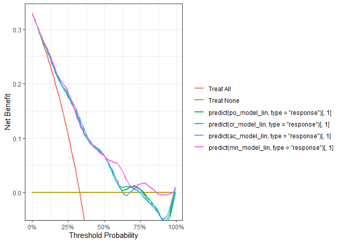<!-- -->

``` r
dca_curve <- dca(obs_class[,2] ~ predict(po_model_lin ,type='response')[,2] + predict(cr_model_lin ,type='response')[,2] + predict(ac_model_lin ,type='response')[,2] + predict(mn_model_lin ,type='response')[,2],data = student_mat_final) 
dca_curve %>% plot(smooth = TRUE)
```

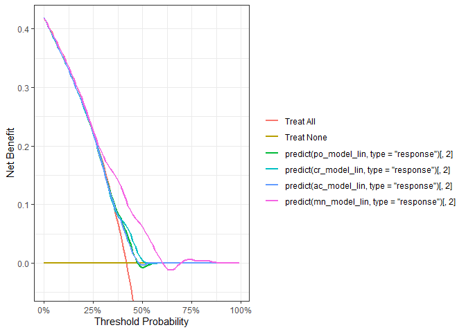<!-- -->

``` r
dca_curve <- dca(obs_class[,3] ~ predict(po_model_lin ,type='response')[,3] + predict(cr_model_lin ,type='response')[,3] + predict(ac_model_lin ,type='response')[,3] + predict(mn_model_lin ,type='response')[,3],data = student_mat_final) 
dca_curve %>% plot(smooth = TRUE)
```

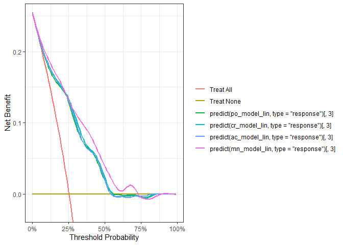<!-- -->

<br/> We observe that all models could be beneficial in terms of making
decisions, F and A/B vs. the treat-all and treat-none policy. But, as
suggested by the evaluation of predictive performance, only the
multinomial model could achieve net benefit for making the decisions
about class C/D. <br/>

## Cross-validation

<br/> Overall, the multinomial model appears to be the best. However, as
we have already mentioned in Part One, the multinomial model has twice
as many parameters as the other models. Thus, there is serious doubt
about its generalizability to new data. Thus, let us perform a
cross-validation to validate the values of all performance metrics of
our models. <br/>

``` r
## Number of repetitions and folds
rep <- 100
folds <- 10

set.seed(123) # for reproducibility

k <- 1

accuracy_cv <- matrix(NA,folds*rep,5)
sommersD_cv <- matrix(NA,folds*rep,5)
brier_cv <- matrix(NA,folds*rep,5)
rps_cv <- matrix(NA,folds*rep,5)


class_F_PO_cv <- matrix(NA,folds*rep,5)
class_F_CR_cv <- matrix(NA,folds*rep,5)
class_F_AC_cv <- matrix(NA,folds*rep,5)
class_F_MN_cv <- matrix(NA,folds*rep,5)
class_F_PV_cv <- matrix(NA,folds*rep,5)

class_CD_PO_cv <- matrix(NA,folds*rep,5)
class_CD_CR_cv <- matrix(NA,folds*rep,5)
class_CD_AC_cv <- matrix(NA,folds*rep,5)
class_CD_MN_cv <- matrix(NA,folds*rep,5)
class_CD_PV_cv <- matrix(NA,folds*rep,5)

class_AB_PO_cv <- matrix(NA,folds*rep,5)
class_AB_CR_cv <- matrix(NA,folds*rep,5)
class_AB_AC_cv <- matrix(NA,folds*rep,5)
class_AB_MN_cv <- matrix(NA,folds*rep,5)
class_AB_PV_cv <- matrix(NA,folds*rep,5)

dca_F_PO_cv <- matrix(NA,folds*rep,100)
dca_F_CR_cv <- matrix(NA,folds*rep,100)
dca_F_AC_cv <- matrix(NA,folds*rep,100)
dca_F_MN_cv <- matrix(NA,folds*rep,100)
dca_F_treat_all_cv <- matrix(NA,folds*rep,100)

dca_CD_PO_cv <- matrix(NA,folds*rep,100)
dca_CD_CR_cv <- matrix(NA,folds*rep,100)
dca_CD_AC_cv <- matrix(NA,folds*rep,100)
dca_CD_MN_cv <- matrix(NA,folds*rep,100)
dca_CD_treat_all_cv <- matrix(NA,folds*rep,100)

dca_AB_PO_cv <- matrix(NA,folds*rep,100)
dca_AB_CR_cv <- matrix(NA,folds*rep,100)
dca_AB_AC_cv <- matrix(NA,folds*rep,100)
dca_AB_MN_cv <- matrix(NA,folds*rep,100)
dca_AB_treat_all_cv <- matrix(NA,folds*rep,100)

for(j in 1:rep){
  
  d <- createFolds(seq(1,dim(student_mat_final)[1],1), k = 10)
  
  for(i in 1:folds){

    index <- unlist(d[i])
    train_set <- student_mat_final[-index,]
    test_set <- student_mat_final[index,]
    
    po_model_lin_new <- vglm(grade ~ school + sex + age + address + famsize + Pstatus + poly(traveltime,1) + poly(studytime,1) + failures + schoolsup + activities + nursery + higher + internet + romantic + poly(famrel,1) + poly(goout,1) + poly(health ,1) + absences + poly(edu,1) + poly(alc,1) + extrasup + at_home + services + teacher, family=cumulative(parallel = TRUE), data = train_set)
    
    cr_model_lin_new <- vglm(grade ~ school + sex + age + address + famsize + Pstatus + poly(traveltime,1) + poly(studytime,1) + failures + schoolsup + activities + nursery + higher + internet + romantic + poly(famrel,1) + poly(goout,1) + poly(health ,1) + absences + poly(edu,1) + poly(alc,1) + extrasup + at_home + services + teacher, family=cratio(parallel = TRUE), data = train_set)
    
    ac_model_lin_new <- vglm(grade ~ school + sex + age + address + famsize + Pstatus + poly(traveltime,1) + poly(studytime,1) + failures + schoolsup + activities + nursery + higher + internet + romantic + poly(famrel,1) + poly(goout,1) + poly(health ,1) + absences + poly(edu,1) + poly(alc,1) + extrasup + at_home + services + teacher, family=acat(parallel = TRUE), data = train_set)
    
    mn_model_lin_new <- vglm(grade ~ school + sex + age + address + famsize + Pstatus + poly(traveltime,1) + poly(studytime,1) + failures + schoolsup + activities + nursery + higher + internet + romantic + poly(famrel,1) + poly(goout,1) + poly(health ,1) + absences + poly(edu,1) + poly(alc,1) + extrasup + at_home + services + teacher, family=multinomial, data = train_set)
    
p_prev_new <- cbind(summary(train_set$grade)[1]/dim(train_set)[1]*rep(1,dim(test_set)[1]),summary(train_set$grade)[2]/dim(train_set)[1]*rep(1,dim(test_set)[1]), summary(train_set$grade)[3]/dim(train_set)[1]*rep(1,dim(test_set)[1]))

obs_class_new <- cbind(as.numeric(test_set$grade == 'F'),as.numeric(test_set$grade == 'C/D'),as.numeric(test_set$grade == 'A/B'))

cum_obs_class_new <- cbind(obs_class_new[,1],obs_class_new[,1]+obs_class_new[,2],obs_class_new[,1]+obs_class_new[,2]+obs_class_new[,3])


# accuracy
accuracy_cv[k,1] <- sum(max.col(predict(po_model_lin_new,test_set,type='response')) == as.numeric(test_set$grade))/dim(test_set)[1]
accuracy_cv[k,2] <- sum(max.col(predict(cr_model_lin_new,test_set,type='response')) == as.numeric(test_set$grade))/dim(test_set)[1]
accuracy_cv[k,3] <- sum(max.col(predict(ac_model_lin_new,test_set,type='response')) == as.numeric(test_set$grade))/dim(test_set)[1]
accuracy_cv[k,4] <- sum(max.col(predict(mn_model_lin_new,test_set,type='response')) == as.numeric(test_set$grade))/dim(test_set)[1]
accuracy_cv[k,5] <- sum(max.col(p_prev_new) == as.numeric(test_set$grade))/dim(test_set)[1]

# Sommer's D
sommersD_cv[k,1] <- sommersD(predict(po_model_lin_new,test_set,type='response'),as.numeric(test_set$grade))
sommersD_cv[k,2] <- sommersD(predict(cr_model_lin_new,test_set,type='response'),as.numeric(test_set$grade))
sommersD_cv[k,3] <- sommersD(predict(ac_model_lin_new,test_set,type='response'),as.numeric(test_set$grade))
sommersD_cv[k,4] <- sommersD(predict(mn_model_lin_new,test_set,type='response'),as.numeric(test_set$grade))
sommersD_cv[k,5] <- sommersD(p_prev_new,as.numeric(test_set$grade))

# Brier score
brier_cv[k,1] <- sum((obs_class_new - predict(po_model_lin_new,test_set,type='response'))^2)/dim(test_set)[1]
brier_cv[k,2] <- sum((obs_class_new - predict(cr_model_lin_new,test_set,type='response'))^2)/dim(test_set)[1]
brier_cv[k,3] <- sum((obs_class_new - predict(ac_model_lin_new,test_set,type='response'))^2)/dim(test_set)[1]
brier_cv[k,4] <- sum((obs_class_new - predict(mn_model_lin_new,test_set,type='response'))^2)/dim(test_set)[1]
brier_cv[k,5] <- sum((obs_class_new - p_prev_new)^2)/dim(test_set)[1]

# Ranked probability score
rps_cv[k,1] <- sum((cum_obs_class_new[,1]-predict(po_model_lin_new,test_set,type='response')[,1])^2 + (cum_obs_class_new[,2]-predict(po_model_lin_new,test_set,type='response')[,1]-predict(po_model_lin_new,test_set,type='response')[,2])^2)/dim(test_set)[1]

rps_cv[k,2] <- sum((cum_obs_class_new[,1]-predict(cr_model_lin_new,test_set,type='response')[,1])^2 + (cum_obs_class_new[,2]-predict(cr_model_lin_new,test_set,type='response')[,1]-predict(cr_model_lin_new,test_set,type='response')[,2])^2)/dim(test_set)[1]

rps_cv[k,3] <- sum((cum_obs_class_new[,1]-predict(ac_model_lin_new,test_set,type='response')[,1])^2 + (cum_obs_class_new[,2]-predict(ac_model_lin_new,test_set,type='response')[,1]-predict(ac_model_lin_new,test_set,type='response')[,2])^2)/dim(test_set)[1]

rps_cv[k,4] <- sum((cum_obs_class_new[,1]-predict(mn_model_lin_new,test_set,type='response')[,1])^2 + (cum_obs_class_new[,2]-predict(mn_model_lin_new,test_set,type='response')[,1]-predict(mn_model_lin_new,test_set,type='response')[,2])^2)/dim(test_set)[1]

rps_cv[k,5] <- sum((cum_obs_class_new[,1]-p_prev_new[,1])^2 + (cum_obs_class_new[,2]-p_prev_new[,1]-p_prev_new[,2])^2)/dim(test_set)[1]


# Categories
class_F_PO_cv[k,] <- val.prob(predict(po_model_lin_new,test_set,type='response')[,1],obs_class_new[,1],pl=FALSE)[c(1,2,11,12,13)]
class_F_CR_cv[k,] <- val.prob(predict(cr_model_lin_new,test_set,type='response')[,1],obs_class_new[,1],pl=FALSE)[c(1,2,11,12,13)]
class_F_AC_cv[k,] <- val.prob(predict(ac_model_lin_new,test_set,type='response')[,1],obs_class_new[,1],pl=FALSE)[c(1,2,11,12,13)]
class_F_MN_cv[k,] <- val.prob(predict(mn_model_lin_new,test_set,type='response')[,1],obs_class_new[,1],pl=FALSE)[c(1,2,11,12,13)]
class_F_PV_cv[k,] <- val.prob(p_prev_new[,1],obs_class_new[,1],pl=FALSE)[c(1,2,11,12,13)]

class_CD_PO_cv[k,] <- val.prob(predict(po_model_lin_new,test_set,type='response')[,2],obs_class_new[,2],pl=FALSE)[c(1,2,11,12,13)]
class_CD_CR_cv[k,] <- val.prob(predict(cr_model_lin_new,test_set,type='response')[,2],obs_class_new[,2],pl=FALSE)[c(1,2,11,12,13)]
class_CD_AC_cv[k,] <- val.prob(predict(ac_model_lin_new,test_set,type='response')[,2],obs_class_new[,2],pl=FALSE)[c(1,2,11,12,13)]
class_CD_MN_cv[k,] <- val.prob(predict(mn_model_lin_new,test_set,type='response')[,2],obs_class_new[,2],pl=FALSE)[c(1,2,11,12,13)]
class_CD_PV_cv[k,] <- val.prob(p_prev_new[,2],obs_class_new[,2],pl=FALSE)[c(1,2,11,12,13)]

class_AB_PO_cv[k,] <- val.prob(predict(po_model_lin_new,test_set,type='response')[,3],obs_class_new[,3],pl=FALSE)[c(1,2,11,12,13)]
class_AB_CR_cv[k,] <- val.prob(predict(cr_model_lin_new,test_set,type='response')[,3],obs_class_new[,3],pl=FALSE)[c(1,2,11,12,13)]
class_AB_AC_cv[k,] <- val.prob(predict(ac_model_lin_new,test_set,type='response')[,3],obs_class_new[,3],pl=FALSE)[c(1,2,11,12,13)]
class_AB_MN_cv[k,] <- val.prob(predict(mn_model_lin_new,test_set,type='response')[,3],obs_class_new[,3],pl=FALSE)[c(1,2,11,12,13)]
class_AB_PV_cv[k,] <- val.prob(p_prev_new[,3],obs_class_new[,3],pl=FALSE)[c(1,2,11,12,13)]

# DCA
dca_F_new <- dca(obs_class_new[,1] ~ predict(po_model_lin_new,test_set,type='response')[,1] + predict(cr_model_lin_new,test_set,type='response')[,1] + predict(ac_model_lin_new,test_set,type='response')[,1] + predict(mn_model_lin_new,test_set,type='response')[,1],data = as.data.frame(obs_class_new[,1])) 

dca_CD_new <- dca(obs_class_new[,2] ~ predict(po_model_lin_new,test_set,type='response')[,2] + predict(cr_model_lin_new,test_set,type='response')[,2] + predict(ac_model_lin_new,test_set,type='response')[,2] + predict(mn_model_lin_new,test_set,type='response')[,2],data = as.data.frame(obs_class_new[,2])) 

dca_AB_new <- dca(obs_class_new[,3] ~ predict(po_model_lin_new,test_set,type='response')[,3] + predict(cr_model_lin_new,test_set,type='response')[,3] + predict(ac_model_lin_new,test_set,type='response')[,3] + predict(mn_model_lin_new,test_set,type='response')[,3],data = as.data.frame(obs_class_new[,3])) 

dca_F_PO_cv[k,] <- t(dca_F_new$dca[201:300,'net_benefit'])
dca_F_CR_cv[k,] <- t(dca_F_new$dca[301:400,'net_benefit'])
dca_F_AC_cv[k,] <- t(dca_F_new$dca[401:500,'net_benefit'])
dca_F_MN_cv[k,] <- t(dca_F_new$dca[501:600,'net_benefit'])
dca_F_treat_all_cv[k,] <- t(dca_F_new$dca[1:100,'net_benefit'])

dca_CD_PO_cv[k,] <- t(dca_CD_new$dca[201:300,'net_benefit'])
dca_CD_CR_cv[k,] <- t(dca_CD_new$dca[301:400,'net_benefit'])
dca_CD_AC_cv[k,] <- t(dca_CD_new$dca[401:500,'net_benefit'])
dca_CD_MN_cv[k,] <- t(dca_CD_new$dca[501:600,'net_benefit'])
dca_CD_treat_all_cv[k,] <- t(dca_CD_new$dca[1:100,'net_benefit'])

dca_AB_PO_cv[k,] <- t(dca_AB_new$dca[201:300,'net_benefit'])
dca_AB_CR_cv[k,] <- t(dca_AB_new$dca[301:400,'net_benefit'])
dca_AB_AC_cv[k,] <- t(dca_AB_new$dca[401:500,'net_benefit'])
dca_AB_MN_cv[k,] <- t(dca_AB_new$dca[501:600,'net_benefit'])
dca_AB_treat_all_cv[k,] <- t(dca_AB_new$dca[1:100,'net_benefit'])

k <- k + 1   
  }
}
```

<br/> Let us check the overall metrics first. <br/>

``` r
res_all <- rbind(apply(accuracy_cv,2,mean),apply(sommersD_cv,2,mean),apply(brier_cv,2,mean),apply(rps_cv,2,mean))
colnames(res_all) <- c('PO','CR','AC','MN','PV')
rownames(res_all) <- c('Acc','Dxy','Brier','RPS')
res_all
```

    ##              PO        CR        AC        MN        PV
    ## Acc   0.4783397 0.4906557 0.4810804 0.4759745 0.4176831
    ## Dxy   0.4154906 0.4228737 0.4251946 0.3909246 0.0000000
    ## Brier 0.6207015 0.6147771 0.6148515 0.6394596 0.6565286
    ## RPS   0.3671082 0.3639774 0.3635011 0.3734735 0.4120458

<br/> We observe that the overall metrics of our model remain superior
to those of the trivial model. However, we notice that the performance
of the multinomial model degraded significantly, confirming our
suspicion of overfitting. The models are quite close in terms of
performance; the best model overall is the continuation ratio model.

Let’s check the performance of discriminating the individual classes
next. <br/>

``` r
res_F <- rbind(apply(class_F_PO_cv,2,mean),apply(class_F_CR_cv,2,mean),apply(class_F_AC_cv,2,mean),apply(class_F_MN_cv,2,mean),apply(class_F_PV_cv,2,mean))
colnames(res_F) <- colnames(class_F)
rownames(res_F) <- c('PO','CR','AC','MN','PV')
res_F
```

    ##          Dxy   C (ROC)     Brier  Intercept     Slope
    ## PO 0.4335763 0.7167882 0.2009773 -0.1543795 0.7396678
    ## CR 0.4396627 0.7198314 0.1990007 -0.1424195 0.7940428
    ## AC 0.4455059 0.7227530 0.1986920 -0.1638886 0.7565438
    ## MN 0.3801577 0.6900788 0.2066079 -0.2278608 0.6723634
    ## PV 0.0000000 0.5000000 0.2219509 -0.7298647 0.0000000

``` r
res_CD <- rbind(apply(class_CD_PO_cv,2,mean),apply(class_CD_CR_cv,2,mean),apply(class_CD_AC_cv,2,mean),apply(class_CD_MN_cv,2,mean),apply(class_CD_PV_cv,2,mean))
colnames(res_CD) <- colnames(class_F)
rownames(res_CD) <- c('PO','CR','AC','MN','PV')
res_CD
```

    ##           Dxy   C (ROC)     Brier  Intercept     Slope
    ## PO 0.03145513 0.5157276 0.2535933 -0.2818570 0.2393418
    ## CR 0.06983932 0.5349197 0.2507997 -0.2548213 0.3339895
    ## AC 0.03600909 0.5180045 0.2513505 -0.2629235 0.2856124
    ## MN 0.07372066 0.5368603 0.2659860 -0.2866944 0.1740228
    ## PV 0.00000000 0.5000000 0.2444828 -0.3402548 0.0000000

``` r
res_AB <- rbind(apply(class_AB_PO_cv,2,mean),apply(class_AB_CR_cv,2,mean),apply(class_AB_AC_cv,2,mean),apply(class_AB_MN_cv,2,mean),apply(class_AB_PV_cv,2,mean))
colnames(res_AB) <- colnames(class_F)
rownames(res_AB) <- c('PO','CR','AC','MN','PV')
res_AB
```

    ##          Dxy   C (ROC)     Brier   Intercept     Slope
    ## PO 0.4991547 0.7495932 0.1661310  0.02922179 1.1248067
    ## CR 0.5083647 0.7541988 0.1649767 -0.05758577 1.0218124
    ## AC 0.5083844 0.7542086 0.1648090 -0.02746338 1.0657960
    ## MN 0.5171858 0.7586100 0.1668657 -0.25603775 0.7514979
    ## PV 0.0000000 0.5000000 0.1900949 -1.11465291 0.0000000

<br/> We notice a similar result. The predictive performance of the
multinomial model was significantly degraded. Our models are poor for
predicting the class C/D, being no better than the trivial
prevalence-based model.

The last thing to check is the decision curve analysis. <br/>

``` r
res_dca_F <- rbind(apply(dca_F_PO_cv,2,mean),apply(dca_F_CR_cv,2,mean),apply(dca_F_AC_cv,2,mean),apply(dca_F_MN_cv,2,mean),apply(dca_F_treat_all_cv,2,mean),rep(0,1,100),seq(0,0.99,0.01))
rownames(res_dca_F) <- c('PO','CR','AC','MN','treat_all','treat_none','x') 

res_dca_CD <- rbind(apply(dca_CD_PO_cv,2,mean),apply(dca_CD_CR_cv,2,mean),apply(dca_CD_AC_cv,2,mean),apply(dca_CD_MN_cv,2,mean),apply(dca_CD_treat_all_cv,2,mean),rep(0,1,100),seq(0,0.99,0.01))
rownames(res_dca_CD) <- c('PO','CR','AC','MN','treat_all','treat_none','x') 

res_dca_AB <- rbind(apply(dca_AB_PO_cv,2,mean),apply(dca_AB_CR_cv,2,mean),apply(dca_AB_AC_cv,2,mean),apply(dca_AB_MN_cv,2,mean),apply(dca_AB_treat_all_cv,2,mean),rep(0,1,100),seq(0,0.99,0.01))
rownames(res_dca_AB) <- c('PO','CR','AC','MN','treat_all','treat_none','x') 


ggplot(t(res_dca_F), aes(x = x)) + geom_line(data=t(res_dca_F), aes(x=x, y=treat_all,color = 'treat_all'),size = 1.1) + 
geom_line(data=t(res_dca_F), aes(x=x, y=PO,color = 'PO'),size = 1.1) +  
geom_line(data=t(res_dca_F), aes(x=x, y=CR,color = 'CR'),size = 1.1) +  
geom_line(data=t(res_dca_F), aes(x=x, y=AC,color = 'AC'),size = 1.1) + 
geom_line(data=t(res_dca_F), aes(x=x, y=MN,color = 'MN'),size = 1.1)+
geom_line(data=t(res_dca_F), aes(x=x, y=treat_none,color = 'treat_none'),size = 1.1) +  
ylim(-0.06, 0.185) + xlim(0.00, 1.00) + ylab('Net benefit') + xlab('Threshold') + scale_color_manual('', values = c('treat_all' = 'red','PO' = 'green','CR' = 'cyan','AC' = 'blue',MN = 'purple','treat_none' = 'gold'))
```

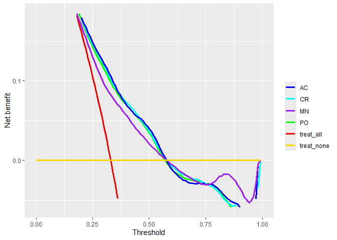<!-- -->

``` r
ggplot(t(res_dca_CD), aes(x = x)) + geom_line(data=t(res_dca_CD), aes(x=x, y=treat_all,color = 'treat_all'),size = 1.1) + 
geom_line(data=t(res_dca_CD), aes(x=x, y=PO,color = 'PO'),size = 1.1) +  
geom_line(data=t(res_dca_CD), aes(x=x, y=CR,color = 'CR'),size = 1.1) +  
geom_line(data=t(res_dca_CD), aes(x=x, y=AC,color = 'AC'),size = 1.1) + 
geom_line(data=t(res_dca_CD), aes(x=x, y=MN,color = 'MN'),size = 1.1)+
geom_line(data=t(res_dca_CD), aes(x=x, y=treat_none,color = 'treat_none'),size = 1.1) +  
ylim(-0.06, 0.185) + xlim(0.00, 1.00) + ylab('Net benefit') + xlab('Threshold') + scale_color_manual('', values = c('treat_all' = 'red','PO' = 'green','CR' = 'cyan','AC' = 'blue',MN = 'purple','treat_none' = 'gold'))  
```

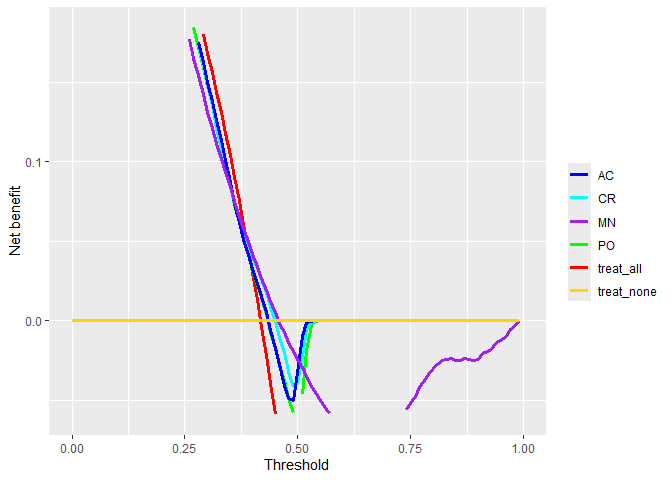<!-- -->

``` r
ggplot(t(res_dca_AB), aes(x = x)) + geom_line(data=t(res_dca_AB), aes(x=x, y=treat_all,color = 'treat_all'),size = 1.1) + 
geom_line(data=t(res_dca_AB), aes(x=x, y=PO,color = 'PO'),size = 1.1) +  
geom_line(data=t(res_dca_AB), aes(x=x, y=CR,color = 'CR'),size = 1.1) +  
geom_line(data=t(res_dca_AB), aes(x=x, y=AC,color = 'AC'),size = 1.1) + 
geom_line(data=t(res_dca_AB), aes(x=x, y=MN,color = 'MN'),size = 1.1)+
geom_line(data=t(res_dca_AB), aes(x=x, y=treat_none,color = 'treat_none'),size = 1.1) +  
ylim(-0.06, 0.185) + xlim(0.00, 1.00) + ylab('Net benefit') + xlab('Threshold') + scale_color_manual('', values = c('treat_all' = 'red','PO' = 'green','CR' = 'cyan','AC' = 'blue',MN = 'purple','treat_none' = 'gold')) 
```

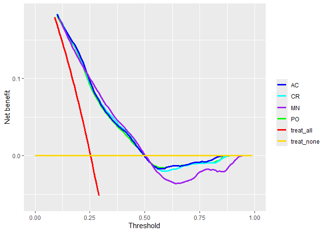<!-- -->

<br/> We validated the net benefit of our models compared to the “treat
all” policy for F and A/B classes. For the class C/D, there is no
benefit.

Overall, we observed a major decrease in the performance of the
multinomial model due to overfitting. All our considered models
(proportional odds, continuous ratio, adjacent categories, multinomial)
are close. The best model overall, based on the performance metrics,
seems to be the continuation ratio model. <br/>

## Partial Continuation Ratio Model (predictive performance)

<br/> In Part One, we observed a presence of some non-parallel terms in
the proportional odds/adjacent categories models (namely **alc**
variable). Thus, we will now fit partial models with non-parallel terms
and try to improve the predictive performance. For simplicity’s sake, we
will fit the continuation ratio model only.

Since we base our decision on the inclusion of non-parallel terms using
the data itself, we must include this step in the cross-validation.
Namely, we will use a simple single-step forward variable selection
(based on the likelihood ratio test with the cut-off P \< 0.05) as a
rule for including the corresponding non-parallel terms. <br/>

``` r
## Number of repetitions and folds
rep <- 100
folds <- 10

set.seed(123) # for reproducibility
k <- 1

variables <- c('school','sex','age','address','famsize','Pstatus','poly(traveltime,1)','poly(studytime,1)','failures' ,'schoolsup','activities','nursery','higher','internet','romantic','poly(famrel,1)','poly(goout,1)','poly(health ,1)', 'absences','poly(edu,1)','poly(alc,1)','extrasup','at_home','services','teacher')

anova_pvalues <- rep(0,1,length(variables))

PP_var <-  matrix(NA,folds*rep,length(variables))

all_PPcr_cv <- matrix(NA,folds*rep,4)

class_F_PPcr_cv <- matrix(NA,folds*rep,5)
class_CD_PPcr_cv <- matrix(NA,folds*rep,5)
class_AB_PPcr_cv <- matrix(NA,folds*rep,5)

dca_F_PPcr_cv <- matrix(NA,folds*rep,100)
dca_CD_PPcr_cv <- matrix(NA,folds*rep,100)
dca_AB_PPcr_cv <- matrix(NA,folds*rep,100)

for(j in 1:rep){
  
  d <- createFolds(seq(1,dim(student_mat_final)[1],1), k = 10)
  
  for(i in 1:folds){

    index <- unlist(d[i])
    train_set <- student_mat_final[-index,]
    
    cr_model_lin_new <- vglm(grade ~ school + sex + age + address + famsize + Pstatus + poly(traveltime,1) + poly(studytime,1) + failures + schoolsup + activities + nursery + higher + internet + romantic + poly(famrel,1) + poly(goout,1) + poly(health ,1) + absences + poly(edu,1) + poly(alc,1) + extrasup + at_home + services + teacher, family=cratio(parallel = TRUE), data = train_set)
    
    
    for(j in 1:length(variables)){
      
      formula1 <- as.formula(paste('grade ~',paste(variables,collapse='+')))
      formula2 <- as.formula(paste('FALSE ~',paste(variables[j],collapse='+')))
      
      cr_model_PP_new <- vglm(formula1, family=cratio(parallel = formula2), data = train_set)
      
      anova_pvalues[j] <- anova(cr_model_lin_new,cr_model_PP_new,type = 'I')$`Pr(>Chi)`[2]
      
    }
    
    anova_pvalues[is.na(anova_pvalues)] <- 1
    formula1 <- as.formula(paste('grade ~',paste(variables,collapse='+')))
    formula2 <- as.formula(paste('FALSE ~',paste(variables[anova_pvalues < 0.05],collapse='+')))
      
    cr_model_PP_new <- vglm(formula1, family=cratio(parallel = formula2), data = train_set)
    
    obs_class_new <- cbind(as.numeric(test_set$grade == 'F'),as.numeric(test_set$grade == 'C/D'),as.numeric(test_set$grade == 'A/B'))
    cum_obs_class_new <- cbind(obs_class_new[,1],obs_class_new[,1]+obs_class_new[,2],obs_class_new[,1]+obs_class_new[,2]+obs_class_new[,3])
    
    
    PP_var[k,] <- anova_pvalues < 0.05
    
    
    all_PPcr_cv[k,] <- cbind(
      sum(max.col(predict(cr_model_PP_new,test_set,type='response')) == as.numeric(test_set$grade))/dim(test_set)[1],
      sommersD(predict(cr_model_PP_new,test_set,type='response'),as.numeric(test_set$grade)), 
      sum((obs_class_new - predict(cr_model_PP_new,test_set,type='response'))^2)/dim(test_set)[1],
      sum((cum_obs_class_new[,1]-predict(cr_model_PP_new,test_set,type='response')[,1])^2 + (cum_obs_class_new[,2]-predict(cr_model_PP_new,test_set,type='response')[,1]-predict(cr_model_PP_new,test_set,type='response')[,2])^2)/dim(test_set)[1])
    
    # Categories
class_F_PPcr_cv[k,] <- val.prob(predict(cr_model_PP_new,test_set,type='response')[,1],obs_class_new[,1],pl=FALSE)[c(1,2,11,12,13)]
class_CD_PPcr_cv[k,] <- val.prob(predict(cr_model_PP_new,test_set,type='response')[,2],obs_class_new[,2],pl=FALSE)[c(1,2,11,12,13)]
class_AB_PPcr_cv[k,] <- val.prob(predict(cr_model_PP_new,test_set,type='response')[,3],obs_class_new[,3],pl=FALSE)[c(1,2,11,12,13)]


# DCA
dca_PPcr_new <- dca(obs_class_new[,1] ~ predict(cr_model_PP_new,test_set,type='response')[,1],data = as.data.frame(obs_class_new[,1])) 

dca_PPcr_new <- dca(obs_class_new[,2] ~ predict(cr_model_PP_new,test_set,type='response')[,2],data = as.data.frame(obs_class_new[,2])) 

dca_PPcr_new <- dca(obs_class_new[,3] ~ predict(cr_model_PP_new,test_set,type='response')[,3],data = as.data.frame(obs_class_new[,3])) 

dca_F_PPcr_cv[k,] <- t(dca_F_new$dca[201:300,'net_benefit'])
dca_CD_PPcr_cv[k,] <- t(dca_CD_new$dca[201:300,'net_benefit'])
dca_AB_PPcr_cv[k,] <- t(dca_AB_new$dca[201:300,'net_benefit'])

    k <- k + 1
    
  }
}
```

<br/> First, we check which non-parallel terms were included in the
models. <br/>

``` r
PP_variables <- apply(PP_var,2,mean)
names(PP_variables) <- variables
PP_variables
```

    ##             school                sex                age            address 
    ##              0.002              0.000              0.000              0.027 
    ##            famsize            Pstatus poly(traveltime,1)  poly(studytime,1) 
    ##              0.000              0.004              0.441              0.009 
    ##           failures          schoolsup         activities            nursery 
    ##              0.002              0.072              0.000              0.001 
    ##             higher           internet           romantic     poly(famrel,1) 
    ##              0.003              0.000              0.000              0.000 
    ##      poly(goout,1)    poly(health ,1)           absences        poly(edu,1) 
    ##              0.395              0.000              0.013              0.021 
    ##        poly(alc,1)           extrasup            at_home           services 
    ##              0.998              0.000              0.000              0.000 
    ##            teacher 
    ##              0.236

<br/> The non-parallel terms for **alc** were consistently included in
the model; the remaining terms were much more random. Next, let us check
the predictive performance. <br/>

``` r
res_all_new <- cbind(res_all,apply(all_PPcr_cv,2,mean))
colnames(res_all_new) <- c('PO','CR','AC','MN','PV','PP(CR)')
res_all_new
```

    ##              PO        CR        AC        MN        PV    PP(CR)
    ## Acc   0.4783397 0.4906557 0.4810804 0.4759745 0.4176831 0.5065128
    ## Dxy   0.4154906 0.4228737 0.4251946 0.3909246 0.0000000 0.4673917
    ## Brier 0.6207015 0.6147771 0.6148515 0.6394596 0.6565286 0.6123549
    ## RPS   0.3671082 0.3639774 0.3635011 0.3734735 0.4120458 0.3654294

<br/> It seems that the partial model is slightly better. <br/>

``` r
res_F_new <- rbind(res_F,apply(class_F_PPcr_cv,2,mean))
rownames(res_F_new) <- c('PO','CR','AC','MN','PV','PP(CR)')
res_F_new
```

    ##              Dxy   C (ROC)     Brier  Intercept     Slope
    ## PO     0.4335763 0.7167882 0.2009773 -0.1543795 0.7396678
    ## CR     0.4396627 0.7198314 0.1990007 -0.1424195 0.7940428
    ## AC     0.4455059 0.7227530 0.1986920 -0.1638886 0.7565438
    ## MN     0.3801577 0.6900788 0.2066079 -0.2278608 0.6723634
    ## PV     0.0000000 0.5000000 0.2219509 -0.7298647 0.0000000
    ## PP(CR) 0.3697543 0.6848771 0.2284871 -0.1904072 0.4471523

``` r
res_CD_new <- rbind(res_CD,apply(class_CD_PPcr_cv,2,mean))
rownames(res_CD_new) <- c('PO','CR','AC','MN','PV','PP(CR)')
res_CD_new
```

    ##               Dxy   C (ROC)     Brier  Intercept      Slope
    ## PO     0.03145513 0.5157276 0.2535933 -0.2818570  0.2393418
    ## CR     0.06983932 0.5349197 0.2507997 -0.2548213  0.3339895
    ## AC     0.03600909 0.5180045 0.2513505 -0.2629235  0.2856124
    ## MN     0.07372066 0.5368603 0.2659860 -0.2866944  0.1740228
    ## PV     0.00000000 0.5000000 0.2444828 -0.3402548  0.0000000
    ## PP(CR) 0.12498857 0.5624943 0.2469255 -0.5940857 -0.0198981

``` r
res_AB_new <- rbind(res_AB,apply(class_AB_PPcr_cv,2,mean))
rownames(res_AB_new) <- c('PO','CR','AC','MN','PV','PP(CR)')
res_AB_new
```

    ##              Dxy   C (ROC)     Brier   Intercept     Slope
    ## PO     0.4991547 0.7495932 0.1661310  0.02922179 1.1248067
    ## CR     0.5083647 0.7541988 0.1649767 -0.05758577 1.0218124
    ## AC     0.5083844 0.7542086 0.1648090 -0.02746338 1.0657960
    ## MN     0.5171858 0.7586100 0.1668657 -0.25603775 0.7514979
    ## PV     0.0000000 0.5000000 0.1900949 -1.11465291 0.0000000
    ## PP(CR) 0.7076818 0.8538409 0.1369423  0.42069702 1.6812613

``` r
res_dca_F_new <- rbind(res_dca_F,apply(dca_F_PPcr_cv,2,mean))
rownames(res_dca_F_new) <- c('PO','CR','AC','MN','treat_all','treat_none','x','PP(CR)') 

res_dca_CD_new <- rbind(res_dca_CD,apply(dca_CD_PPcr_cv,2,mean))
rownames(res_dca_CD_new) <- c('PO','CR','AC','MN','treat_all','treat_none','x','PP(CR)') 

res_dca_AB_new <- rbind(res_dca_AB,apply(dca_AB_PPcr_cv,2,mean))
rownames(res_dca_AB_new) <- c('PO','CR','AC','MN','treat_all','treat_none','x','PP(CR)')


ggplot(t(res_dca_F_new), aes(x = x)) + geom_line(data=t(res_dca_F_new), aes(x=x, y=treat_all,color = 'treat_all'),size = 1.1) + 
geom_line(data=t(res_dca_F_new), aes(x=x, y=PO,color = 'PO'),size = 1.1) +  
geom_line(data=t(res_dca_F_new), aes(x=x, y=CR,color = 'CR'),size = 1.1) +  
geom_line(data=t(res_dca_F_new), aes(x=x, y=AC,color = 'AC'),size = 1.1) + 
geom_line(data=t(res_dca_F_new), aes(x=x, y=MN,color = 'MN'),size = 1.1) +
geom_line(data=t(res_dca_F_new), aes(x=x, y=MN,color = 'PP(CR)'),size = 1.1) +  
geom_line(data=t(res_dca_F_new), aes(x=x, y=treat_none,color = 'treat_none'),size = 1.1) +  
ylim(-0.06, 0.185) + xlim(0.00, 1.00) + ylab('Net benefit') + xlab('Threshold') + scale_color_manual('', values = c('treat_all' = 'red','PO' = 'green','CR' = 'cyan','AC' = 'blue',MN = 'purple','PP(CR)' = 'black','treat_none' = 'gold'))
```

<!-- -->

``` r
ggplot(t(res_dca_CD_new), aes(x = x)) + geom_line(data=t(res_dca_CD_new), aes(x=x, y=treat_all,color = 'treat_all'),size = 1.1) + 
geom_line(data=t(res_dca_CD_new), aes(x=x, y=PO,color = 'PO'),size = 1.1) +  
geom_line(data=t(res_dca_CD_new), aes(x=x, y=CR,color = 'CR'),size = 1.1) +  
geom_line(data=t(res_dca_CD_new), aes(x=x, y=AC,color = 'AC'),size = 1.1) + 
geom_line(data=t(res_dca_CD_new), aes(x=x, y=MN,color = 'MN'),size = 1.1) +
geom_line(data=t(res_dca_CD_new), aes(x=x, y=MN,color = 'PP(CR)'),size = 1.1) +   
geom_line(data=t(res_dca_CD_new), aes(x=x, y=treat_none,color = 'treat_none'),size = 1.1) +  
ylim(-0.06, 0.185) + xlim(0.00, 1.00) + ylab('Net benefit') + xlab('Threshold') + scale_color_manual('', values = c('treat_all' = 'red','PO' = 'green','CR' = 'cyan','AC' = 'blue',MN = 'purple','PP(CR)' = 'black','treat_none' = 'gold'))
```

<!-- -->

``` r
ggplot(t(res_dca_AB_new), aes(x = x)) + geom_line(data=t(res_dca_AB_new), aes(x=x, y=treat_all,color = 'treat_all'),size = 1.1) + 
geom_line(data=t(res_dca_AB_new), aes(x=x, y=PO,color = 'PO'),size = 1.1) +  
geom_line(data=t(res_dca_AB_new), aes(x=x, y=CR,color = 'CR'),size = 1.1) +  
geom_line(data=t(res_dca_AB_new), aes(x=x, y=AC,color = 'AC'),size = 1.1) + 
geom_line(data=t(res_dca_AB_new), aes(x=x, y=MN,color = 'MN'),size = 1.1) +
geom_line(data=t(res_dca_AB_new), aes(x=x, y=MN,color = 'PP(CR)'),size = 1.1) + 
geom_line(data=t(res_dca_AB_new), aes(x=x, y=treat_none,color = 'treat_none'),size = 1.1) +  
ylim(-0.06, 0.185) + xlim(0.00, 1.00) + ylab('Net benefit') + xlab('Threshold') + scale_color_manual('', values = c('treat_all' = 'red','PO' = 'green','CR' = 'cyan','AC' = 'blue',MN = 'purple','PP(CR)' = 'black','treat_none' = 'gold'))
```

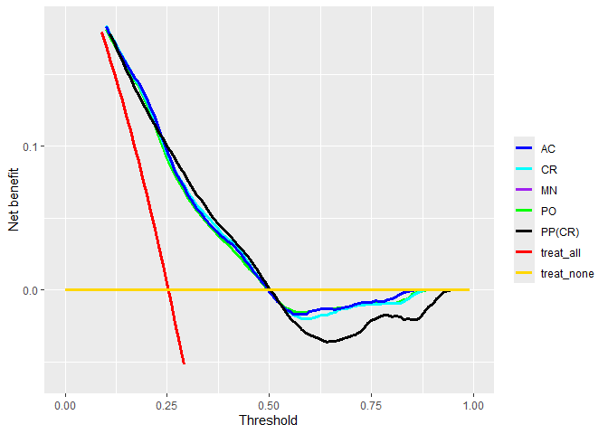<!-- -->

<br/> Overall, the inclusion of non-parallel terms via a single-step
forward variable selection helped improve the predictive performance of
the resulting model slightly. <br/>

## Conclusions

<br/> Let us summarize our results. In this project, we created several
models (proportional odds, continuation ratio, adjacent categories,
multinomial logit) for predicting students’ math final grades using data
from the
<https://www.kaggle.com/code/janiobachmann/predicting-grades-for-the-school-year>
dataset, based on *P. Cortez and A. M. Gonçalves Silva. Using data
mining to predict secondary school student performance. (2008).*

First, let’s discuss the predictors that were the most important in our
models. We will primarily base our discussion on the partial
continuation ratio model, as it performed the best in the validation.
<br/>

``` r
library(car)

cr_model_lin <- vglm(grade ~ school + sex + age + address + famsize + Pstatus + poly(traveltime,1) + poly(studytime,1) + failures + schoolsup + activities + nursery + higher + internet + romantic + poly(famrel,1) + poly(goout,1) + poly(health ,1) + absences + poly(edu,1) + poly(alc,1) + extrasup + at_home + services + teacher, family=cratio(parallel = TRUE), data = student_mat_final)
    
    
for(j in 1:length(variables)){
      formula1 <- as.formula(paste('grade ~',paste(variables,collapse='+')))
      formula2 <- as.formula(paste('FALSE ~',paste(variables[j],collapse='+')))
      
      cr_model_PP <- vglm(formula1, family=cratio(parallel = formula2), data = student_mat_final)
      
      anova_pvalues[j] <- anova(cr_model_lin,cr_model_PP,type = 'I')$`Pr(>Chi)`[2]
}

anova_pvalues[is.na(anova_pvalues)] <- 1
formula1 <- as.formula(paste('grade ~',paste(variables,collapse='+')))
formula2 <- as.formula(paste('FALSE ~',paste(variables[anova_pvalues < 0.05],collapse='+')))
      
cr_model_PP <- vglm(formula1, family=cratio(parallel = formula2), data = student_mat_final)
Anova(cr_model_PP)
```

    ## Analysis of Deviance Table (Type II tests)
    ## 
    ## Response: grade
    ##                     Df   Chisq Pr(>Chisq)    
    ## school               1  0.3368  0.5616703    
    ## sex                  1  2.9384  0.0864964 .  
    ## age                  1  3.5603  0.0591761 .  
    ## address              1  0.5911  0.4420100    
    ## famsize              1  0.4900  0.4839201    
    ## Pstatus              1  0.0550  0.8145965    
    ## poly(traveltime, 1)  2  2.7839  0.2485920    
    ## poly(studytime, 1)   1  2.9868  0.0839461 .  
    ## failures             1 21.3997  3.728e-06 ***
    ## schoolsup            1 15.5812  7.904e-05 ***
    ## activities           1  0.0123  0.9115247    
    ## nursery              1  1.6122  0.2041772    
    ## higher               1  3.1293  0.0768969 .  
    ## internet             1  0.6908  0.4058998    
    ## romantic             1  1.1500  0.2835588    
    ## poly(famrel, 1)      1  0.6316  0.4267545    
    ## poly(goout, 1)       2 14.7320  0.0006324 ***
    ## poly(health, 1)      1  4.1909  0.0406405 *  
    ## absences             1  3.5440  0.0597603 .  
    ## poly(edu, 1)         1  7.8233  0.0051578 ** 
    ## poly(alc, 1)         2 13.6893  0.0010651 ** 
    ## extrasup             1  2.9731  0.0846574 .  
    ## at_home              1  0.0281  0.8669762    
    ## services             1  0.6888  0.4065846    
    ## teacher              1  1.8039  0.1792366    
    ## ---
    ## Signif. codes:  0 '***' 0.001 '**' 0.01 '*' 0.05 '.' 0.1 ' ' 1

<br/> The predictors that appeared the most consistently important are
**failures** and **schoolsup**. This makes sense; past class failures
increase the risk of the final failing grade, and extra educational
school support is provided to the students who need it, i.e., students
with weaker results.  
<br/>

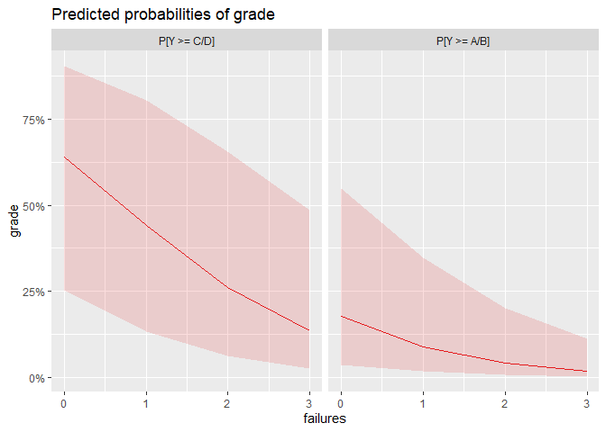<!-- -->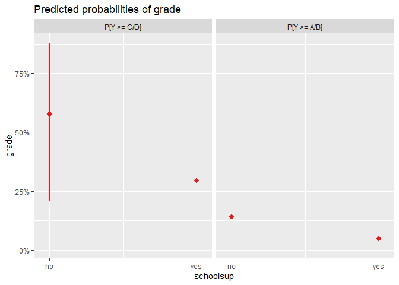<!-- -->

<br/> The predictor that is highly significant in the partial
continuation ratio model but was not consistently seen in other models
is **goout**. The probability of F increases with time spent going out
with friends. <br/>

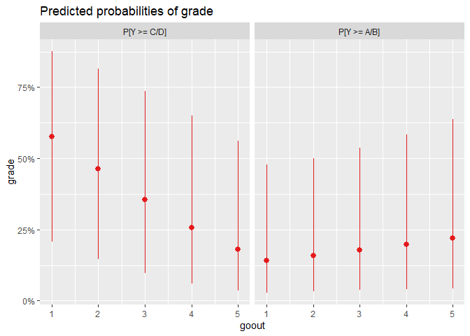<!-- -->

<br/> A variable that showed significant only in partial models was
**alc**. Noticeably, it seems that the probability of A/B decreases with
alcohol consumption. There is some evidence in the literature that
alcohol consumption is associated with lower school performance (*M.
RHayatbakhsh et al. School performance and alcohol use problems in early
adulthood: a longitudinal study. Alcohol 45.7 (2011): 701-709.*, *A. I.
Balsa, L. M. Giuliano, and M. T. French. The effects of alcohol use on
academic achievement in high school. Economics of education review 30.1
(2011): 1-15.)* and *B. Bugbee et al. Substance use, academic
performance, and academic engagement among high school seniors. Journal
of school health 89.2 (2019): 145-156.*). <br/>

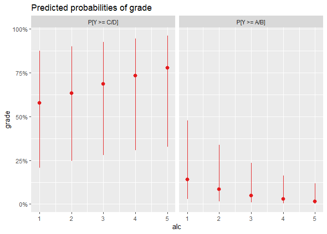<!-- -->

<br/> Another predictor that appeared significant in all models is
**edu**, i.e., parents’ education. It is a common observation that
parents’ education level has a significant impact on the education of
their children (*E. F. Dubow, P. Boxer, and L. R. Huesmann. Long-term
effects of parents’ education on children’s educational and occupational
success: Mediation by family interactions, child aggression, and teenage
aspirations.” Merrill-Palmer Quarterly 55.3 (2009): 224-249.* and *C. F.
Forrest, et al. First-generation students: College access, persistence,
and postbachelor’s outcomes (NCES 2018-421). US Department of
Education.” National Center for Education Statistics. <https://nces>.
ed. gov/pubs2018/2018421. pdf (2018).*) <br/>

<!-- -->

<br/> The variable **health** is interesting. It proved to be
consistently significant in the models. Namely, it appears that the
probability of A/B increases with poor health (score one corresponds to
very bad current health status). This is indeed an observation that can
be directly seen in the data. <br/>

<!-- -->

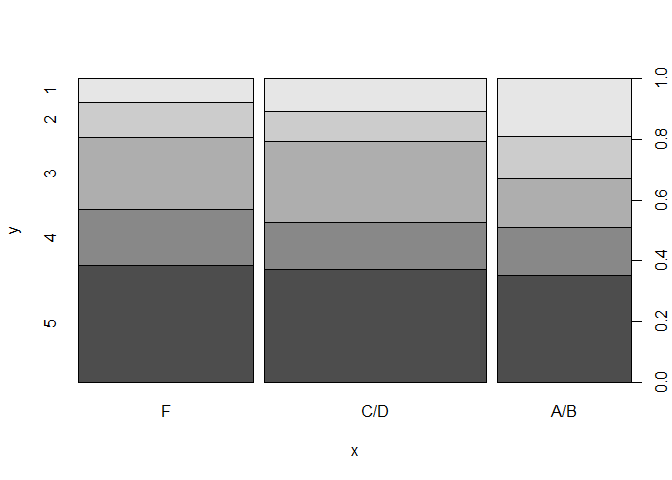<!-- -->

<br/> Now, one would expect that poor health impairs school performance
and can be seen, e.g., in *B. L. Needham, R. Crosnoe, and C. Muller.
Academic failure in secondary school: The inter-related role of health
problems and educational context. Social problems 51.4 (2004): 569-586.*
and *C. Bortes, M. Strandh, and K. Nilsson. Health problems during
childhood and school achievement: Exploring associations between
hospitalization exposures, gender, timing, and compulsory school grades.
PLoS One 13.12 (2018): e0208116.* This holds even for mental health
issues such as depression (*J. M. Duncan, K. A. Patte, and S. T.
Leatherdale. Mental health associations with academic performance and
education behaviors in Canadian secondary school students.” Canadian
Journal of School Psychology 36.4 (2021): 335-357.*) However,
interestingly enough, the aforementioned study also observed an
association between anxiety and higher grades after adjusting for other
covariates.

Still, our dataset is quite limited in scope. The health status in the
dataset (*P. Cortez and A. M. Gonçalves Silva. Using data mining to
predict secondary school student performance. (2008)*) is a so-called
*self-rated health status* which is influenced by many factors in a
complex manner (*A. Cocca et al. Self-rated health status of upper
secondary school pupils and its associations with multiple
health-related factors.” International journal of environmental research
and public health 19.11 (2022): 6947.* and *T. J Wade and E. Vingilis.
The development of self-rated health during adolescence: An exploration
of inter-and intracohort effects. Canadian Journal of Public Health 90.2
(1999): 90-94.)*. For example, it is a well-observed fact that women
tend to report poorer health status than men (*T. Boerma, et al. A
global assessment of the gender gap in self-reported health with survey
data from 59 countries.” BMC public health 16.1 (2016): 675.*).

As far as **age** is concerned, it was a somewhat significant predictor
in all models, and it seems that the math grades worsen with age. **M.
Pellizzari, and F. C. Billari. “The younger, the better? Age-related
differences in academic performance at university.” Journal of
Population Economics 25.2 (2012): 697-739.** that studied the academic
performance of first-year university students provide some insight:
youngest students performed better compared to their oldest peers across
almost all subjects due to among due to, among other things differences
in social behavior (younger students allocate more time to studying at
home). <br/>

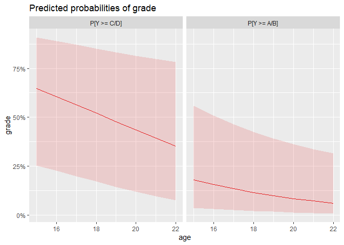<!-- -->

<br/> A sex effect is often of interest and was somewhat significant in
our models. It seems that males are performing slightly better. This
fact was observed in the past, although the differences are minor (*D.
Reilly, D. L. Neumann, and G. Andrews. Sex differences in mathematics
and science achievement: A meta-analysis of National Assessment of
Educational Progress assessments. Journal of Educational Psychology
107.3 (2015): 645.*) <br/>

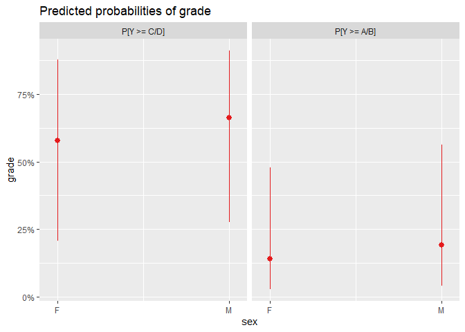<!-- -->

<br/> **Absences** is another variable that was somewhat significant in
the partial continuation ratio model. Unsurprisingly, a large number of
absences decreases school performance (*J. Liu, M. Lee, and S.
Gershenson. “The short-and long-run impacts of secondary school
absences.” Journal of Public Economics 199 (2021): 104441.*). <br/>

<!-- -->

<br/> The last two somewhat significant predictors we will mention here
are **higher** and **poly(studytime, 1)**. All students in the dataset
with a grade of A are interested in pursuing higher education. Quite
naturally, longer study time tends to improve grades. <br/>

<!-- -->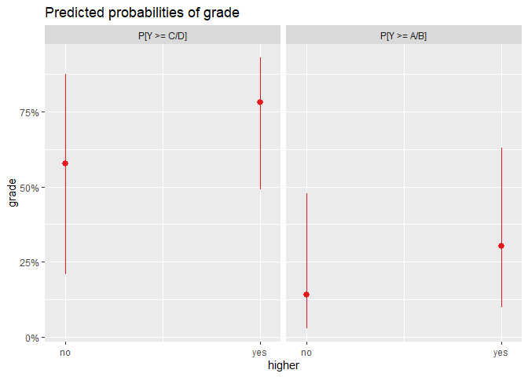<!-- -->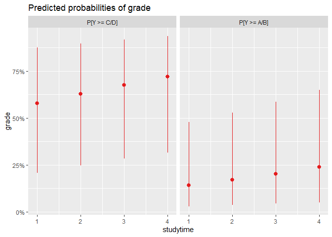<!-- -->

<br/> Overall, the significant variables and their directions are
largely reasonable in the partial continuation ratio model. As far as
the predictive performance is concerned, we have confirmed that the
partial continuation ratio model performs better than the trivial model
and could be of some use (based on the decision curve analysis).
However, in terms of making actual predictions, the prediction accuracy
is relatively poor (especially for the C/D grade category), suggesting
that predicting school performance is quite a complex matter.

These observations conclude The Third Circle: Ordinal Regression. <br/>
